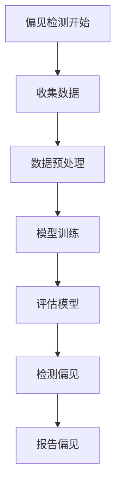
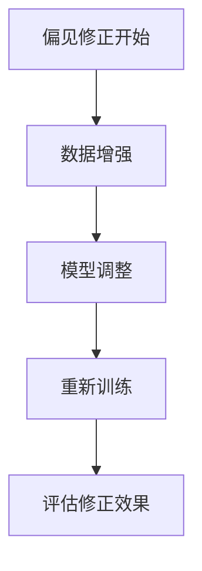
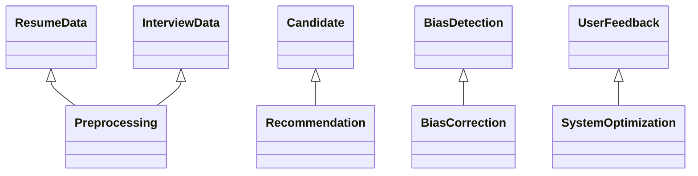
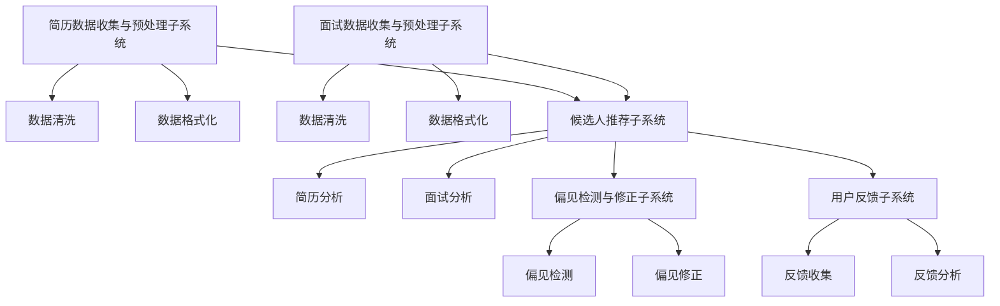
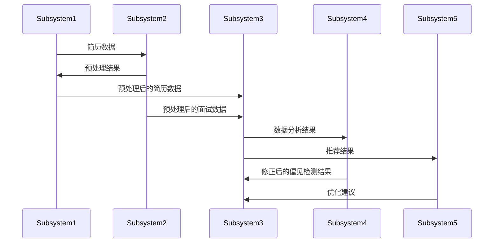

                 

### 第一部分：引言与背景

#### 1.1 AI偏见的概念与重要性

AI偏见，也被称为算法偏见，是指人工智能系统在处理数据、做出决策时，无意中表现出的对某些群体的偏见。这种偏见可能源自数据集的不平衡、训练过程的设计缺陷，或者模型本身对特定情况的过度拟合。在日常生活中，AI偏见的表现形式多种多样，例如招聘系统中对特定性别或种族的歧视、推荐系统中对用户群体的偏见，以及金融系统中对特定群体的信用评估差异等。

AI偏见对企业和社会的危害是巨大的。从企业的角度来看，AI偏见可能会导致业务决策失误，影响公司声誉和客户信任度。例如，一个招聘系统如果对女性候选人存在偏见，那么将错失优秀的女性员工，并可能引发法律诉讼。从社会角度来看，AI偏见加剧了不平等现象，使得某些群体在就业、教育、医疗等方面受到不公平待遇。

#### 1.2 构建公平公正的企业AI生态的必要性

为了应对AI偏见带来的挑战，构建公平公正的企业AI生态变得尤为重要。这不仅是企业社会责任的体现，也是维护企业长期发展的关键。以下是构建公平公正AI生态的几个必要性：

1. **遵守法律法规**：许多国家和地区已经制定了关于人工智能的法律和指导原则，要求企业在开发和使用AI系统时必须避免偏见。例如，欧盟的《通用数据保护条例》（GDPR）对数据处理和算法透明度有严格规定。

2. **提升企业声誉**：公众对AI偏见日益关注，企业如果能够展示其在AI伦理和公平性方面的努力，将大大提升企业形象和用户信任度。

3. **优化业务决策**：公平公正的AI系统能够更准确地反映市场和社会现实，从而帮助企业做出更明智的决策。

4. **促进技术创新**：消除AI偏见不仅是对现有技术的挑战，也是推动人工智能技术进步的动力。公平公正的AI系统将激发更多创新和研发活动。

#### 1.3 本书结构概述

本书旨在提供一套系统化的方法来消除企业AI生态中的偏见，构建一个公平公正的AI环境。全书分为以下几个部分：

1. **引言与背景**：介绍AI偏见的概念和危害，阐述构建公平公正AI生态的必要性。
   
2. **核心概念与联系**：详细解释核心概念，如AI偏见、公平公正的AI生态，并展示它们之间的联系。

3. **算法原理讲解**：介绍消除AI偏见的基本算法原理，包括流程图和Python源代码。

4. **数学模型和数学公式**：使用LaTeX格式呈现数学模型和公式，并进行详细讲解和举例说明。

5. **系统分析与架构设计方案**：设计一个简化的系统架构，展示系统功能和接口设计。

6. **项目实战**：描述一个模拟的项目实战，包括环境安装、核心实现源代码和案例分析。

7. **最佳实践与总结**：提供最佳实践建议，总结全文内容，给出拓展阅读资源。

通过这些部分的详细介绍，本书希望能够为读者提供一套实用的指南，帮助企业构建一个公平公正的AI生态，消除AI偏见带来的负面影响。

#### 1.4 关键词

AI偏见、公平公正的AI生态、算法原理、数学模型、系统架构设计、项目实战、最佳实践。

#### 1.5 摘要

本文探讨了AI偏见的概念及其对企业和社会的危害，强调了构建公平公正AI生态的重要性。通过介绍核心概念和联系、算法原理、数学模型、系统架构设计方案，以及项目实战，本文提供了一套系统化的方法来消除企业AI生态中的偏见。最后，通过最佳实践和总结，本文旨在为读者提供实用的指导，帮助企业构建公平公正的AI生态，从而提升业务决策的准确性和企业形象。

---

在接下来的章节中，我们将深入探讨AI偏见的核心概念，并展示这些概念之间的联系，为构建公平公正的AI生态奠定理论基础。

### 第二部分：核心概念与联系

在构建公平公正的AI生态中，理解核心概念和它们之间的联系至关重要。以下是本文将详细讨论的核心概念，包括AI偏见、公平公正的AI生态以及它们之间的重要联系。

#### 2.1 AI偏见概述

AI偏见指的是人工智能系统在决策过程中表现出的对某些群体的不公平倾向。这种偏见可能源于多个方面，包括数据集的不平衡、算法的过度拟合以及训练数据的选择偏差等。例如，如果一个招聘系统在训练过程中使用了具有性别偏见的数据集，那么该系统在招聘决策中可能会对某一性别产生不公平待遇。

**核心概念属性特征对比表格**

| 概念        | 定义                                       | 影响因素                       | 示例                   |
|-------------|--------------------------------------------|------------------------------|----------------------|
| AI偏见      | 人工智能系统在决策过程中对某些群体的不公平倾向 | 数据集不平衡、算法过度拟合等     | 招聘系统中性别偏见     |
| 公平公正的AI | 保证人工智能系统决策过程的透明性、公平性、可解释性 | 数据质量、算法透明度、用户反馈等 | 无性别、种族歧视的招聘系统 |
| AI生态      | 包含人工智能系统的整体环境                   | 技术标准、政策法规、企业文化等    | 构建无偏见AI系统的企业 |

**ER图展示**

为了更直观地展示这些概念之间的联系，我们可以使用Mermaid ER图来表示：

```mermaid
erDiagram
    AI偏见 ||--|{ 公平公正的AI }
    AI偏见 ||--|{ AI生态 }
    公平公正的AI ||--|{ AI生态 }
```

在这个ER图中，我们可以看到AI偏见是构建公平公正的AI生态和AI生态的关键因素。公平公正的AI生态不仅要求避免AI偏见，还需要确保系统的透明性、公平性和可解释性。

#### 2.2 公平公正的AI生态构建原则

构建公平公正的AI生态需要遵循一系列原则，这些原则确保AI系统在设计和应用过程中不会对特定群体产生偏见。以下是一些关键原则：

1. **数据多样性**：确保训练数据集的多样性，避免数据不平衡现象。这可以通过增加数据来源的多样性、使用数据增强技术来实现。

2. **算法透明性**：提高算法的透明度，使得决策过程可以被理解和验证。这包括使用可解释的AI模型和提供算法的详细文档。

3. **用户反馈机制**：建立用户反馈机制，让用户能够参与到AI系统的评估和改进过程中，从而及时纠正偏见。

4. **定期审查**：定期对AI系统进行审查，确保其符合公平公正的原则。审查可以包括算法测试、数据质量检查和用户满意度调查等。

5. **伦理培训**：对AI系统开发者和使用者进行伦理培训，提高他们对AI偏见和社会影响的意识。

**公平公正的AI生态构建原则ER图**

```mermaid
erDiagram
    数据多样性 ||--|{ 算法透明性 }
    数据多样性 ||--|{ 用户反馈机制 }
    数据多样性 ||--|{ 定期审查 }
    数据多样性 ||--|{ 伦理培训 }
    算法透明性 ||--|{ 公平公正的AI生态 }
    用户反馈机制 ||--|{ 公平公正的AI生态 }
    定期审查 ||--|{ 公平公正的AI生态 }
    伦理培训 ||--|{ 公平公正的AI生态 }
```

通过这个ER图，我们可以清晰地看到，公平公正的AI生态构建原则之间相互联系，共同构成一个完整的体系。

#### 2.3 核心概念联系与ER图展示

在理解和应用这些核心概念时，关键在于它们之间的联系。通过上述表格和ER图，我们可以看到AI偏见是影响公平公正的AI生态的重要因素，而公平公正的AI生态又依赖于一系列构建原则来确保其有效性。

**核心概念联系与ER图**

```mermaid
erDiagram
    AI偏见 ||--|{ 公平公正的AI }
    AI偏见 ||--|{ AI生态 }
    公平公正的AI ||--|{ 数据多样性 }
    公平公正的AI ||--|{ 算法透明性 }
    公平公正的AI ||--|{ 用户反馈机制 }
    公平公正的AI ||--|{ 定期审查 }
    公平公正的AI ||--|{ 伦理培训 }
    AI生态 ||--|{ 数据多样性 }
    AI生态 ||--|{ 算法透明性 }
    AI生态 ||--|{ 用户反馈机制 }
    AI生态 ||--|{ 定期审查 }
    AI生态 ||--|{ 伦理培训 }
```

通过上述ER图，我们能够更直观地理解各个概念之间的联系，为构建公平公正的AI生态提供了理论基础。

在接下来的章节中，我们将深入探讨消除AI偏见的基本算法原理，包括偏见检测和修正的方法，并使用流程图和Python源代码进行详细解释。

### 第三部分：算法原理讲解

#### 3.1 消除AI偏见的基本原理

消除AI偏见是构建公平公正AI生态的关键步骤。在这一部分，我们将探讨消除AI偏见的基本原理，包括偏见检测和偏见修正。

#### 3.1.1 偏见检测

偏见检测是指识别和诊断AI系统中存在的偏见。偏见检测的关键在于分析模型的行为，以确定是否存在对特定群体或特征的系统性偏差。

**偏见检测算法流程图**



在偏见检测过程中，我们首先需要收集数据，并对数据进行预处理，确保其质量。接下来，使用已预处理的数据对模型进行训练，并在训练完成后评估模型的表现。最后，通过对比模型在不同群体或特征上的表现，检测是否存在偏见。

**Python源代码示例**

```python
# 偏见检测的Python代码示例
import pandas as pd
from sklearn.model_selection import train_test_split
from sklearn.ensemble import RandomForestClassifier
from sklearn.metrics import accuracy_score, classification_report

# 数据集加载与预处理
data = pd.read_csv('data.csv')
X = data.drop('label', axis=1)
y = data['label']

# 划分训练集和测试集
X_train, X_test, y_train, y_test = train_test_split(X, y, test_size=0.2, stratify=y)

# 模型训练
model = RandomForestClassifier()
model.fit(X_train, y_train)

# 模型评估
predictions = model.predict(X_test)
print("Accuracy:", accuracy_score(y_test, predictions))
print("Classification Report:")
print(classification_report(y_test, predictions))

# 检测偏见
grouped_predictions = predictions.groupby(y_test).size()
print("Bias Detection:")
print(grouped_predictions)
```

通过上述代码，我们可以训练一个随机森林分类器，并评估其在不同群体上的表现，从而检测是否存在偏见。

#### 3.1.2 偏见修正

偏见修正是指通过调整模型参数或数据来减少或消除偏见。常见的偏见修正方法包括数据增强、算法调整和公平性度量等。

**偏见修正算法流程图**



在偏见修正过程中，我们首先对训练数据进行增强，以增加数据多样性。然后，调整模型参数，以减少偏见。最后，重新训练模型并评估修正效果。

**Python源代码示例**

```python
# 偏见修正的Python代码示例
from imblearn.over_sampling import SMOTE
from sklearn.model_selection import GridSearchCV

# 数据增强
smote = SMOTE()
X_res, y_res = smote.fit_resample(X_train, y_train)

# 模型调整与重新训练
param_grid = {'n_estimators': [100, 200], 'max_depth': [10, 20]}
grid_search = GridSearchCV(RandomForestClassifier(), param_grid, cv=5)
grid_search.fit(X_res, y_res)

# 重新训练后的模型评估
best_model = grid_search.best_estimator_
predictions = best_model.predict(X_test)
print("Accuracy:", accuracy_score(y_test, predictions))
print("Classification Report:")
print(classification_report(y_test, predictions))
```

通过上述代码，我们使用SMOTE进行数据增强，并使用网格搜索调整模型参数，从而减少偏见。

#### 3.2 数学模型与公式讲解

在消除AI偏见的过程中，数学模型和公式起到了关键作用。以下是一些常用的数学模型和公式。

**公平性度量公式**

$$
F1 = \frac{2 \times precision \times recall}{precision + recall}
$$

其中，precision表示精确率，recall表示召回率。这个公式用于评估模型在不同群体上的公平性。

**偏差修正公式**

$$
\text{Adjusted Weight} = \frac{\text{Original Weight} + \alpha \times (\text{Base Weight} - \text{Original Weight})}{1 + \alpha}
$$

其中，Original Weight表示原始权重，Base Weight表示基础权重，alpha是一个调整系数。这个公式用于调整模型的权重，以减少偏见。

**数据增强方法**

$$
X_{new} = X \times (1 + \alpha \times \text{Noise})
$$

其中，X表示原始数据，alpha是一个调整系数，Noise表示噪声。这个公式用于通过增加噪声来增强数据多样性。

通过上述数学模型和公式，我们可以更有效地检测和修正AI偏见。

在理解了消除AI偏见的基本算法原理后，我们将进一步探讨如何通过系统分析与架构设计方案，构建一个公平公正的AI系统。

### 第四部分：系统分析与架构设计方案

#### 4.1 系统场景介绍

为了更好地理解如何构建公平公正的AI系统，我们将以一个实际的场景为例——招聘系统。这个招聘系统旨在通过分析简历和面试数据，推荐最合适的候选人。然而，由于历史数据可能存在偏见，我们需要确保推荐系统能够消除这些偏见，公平地对待所有候选人。

#### 4.2 系统功能设计

招聘系统的核心功能包括：

1. **简历数据收集与预处理**：从各种渠道收集简历数据，并进行预处理，如去除噪声、统一格式等。
2. **面试数据收集与预处理**：收集候选人在面试过程中产生的数据，如面试问题、回答、评估结果等，并进行预处理。
3. **候选人推荐**：根据简历和面试数据，推荐最合适的候选人。
4. **偏见检测与修正**：定期检测系统中的偏见，并使用算法进行修正。
5. **用户反馈**：收集用户对推荐结果的反馈，用于系统优化。

**领域模型Mermaid类图**



在这个类图中，我们定义了系统中的主要类及其关系。ResumeData和InterviewData代表简历和面试数据，它们都需要经过预处理。Candidate类表示候选人，其推荐功能依赖于简历和面试数据。BiasDetection和BiasCorrection类负责检测和修正系统中的偏见。UserFeedback类收集用户反馈，用于系统优化。

#### 4.3 系统架构设计

为了实现招聘系统的功能，我们需要设计一个合理的系统架构。以下是一个简化的系统架构设计。

**Mermaid架构图**



在这个架构图中，我们定义了系统的五个主要子系统：简历数据收集与预处理子系统、面试数据收集与预处理子系统、候选人推荐子系统、偏见检测与修正子系统和用户反馈子系统。每个子系统都有特定的功能，并且通过流程图展示了各个功能模块之间的关系。

#### 4.4 系统接口设计与交互

为了实现子系统之间的有效交互，我们需要设计合理的系统接口。以下是招聘系统的接口设计。

**Mermaid序列图**



在这个序列图中，我们展示了各个子系统之间的交互过程。简历数据收集与预处理子系统将预处理结果传递给候选人推荐子系统，面试数据收集与预处理子系统同样将预处理结果传递给候选人推荐子系统。偏见检测与修正子系统对数据分析结果进行偏见检测，并修正偏见。用户反馈子系统收集用户对推荐结果的反馈，并提供优化建议。

通过上述系统架构设计和接口设计，我们可以构建一个功能齐全、架构合理的招聘系统，确保系统在消除AI偏见方面具有高效性和可靠性。

在下一部分，我们将通过一个模拟项目实战，详细展示如何实现系统架构，并分析其实际应用效果。

### 第五部分：项目实战

#### 5.1 实战项目概述

为了验证上述架构设计的有效性，我们选择了一个模拟招聘系统项目进行实战。该项目的目标是构建一个能够消除AI偏见，推荐最合适候选人的招聘系统。项目的主要步骤包括环境安装、核心实现源代码编写、代码应用解读与分析，以及实际案例分析。

#### 5.2 环境安装与配置

首先，我们需要搭建一个合适的开发环境。以下是环境安装与配置的步骤：

1. **安装Python**：确保Python版本在3.7及以上。
2. **安装依赖库**：使用pip安装以下依赖库：
   ```bash
   pip install pandas scikit-learn imblearn matplotlib
   ```
3. **数据集准备**：下载并解压一个包含简历和面试数据的CSV文件，命名为`data.csv`。

#### 5.3 系统核心实现源代码

核心实现包括数据预处理、偏见检测与修正、推荐算法等步骤。以下是Python源代码：

```python
import pandas as pd
from sklearn.model_selection import train_test_split
from sklearn.ensemble import RandomForestClassifier
from sklearn.metrics import accuracy_score, classification_report
from imblearn.over_sampling import SMOTE
from sklearn.metrics.pairwise import euclidean_distances

# 数据集加载与预处理
data = pd.read_csv('data.csv')
X = data.drop('label', axis=1)
y = data['label']

# 划分训练集和测试集
X_train, X_test, y_train, y_test = train_test_split(X, y, test_size=0.2, stratify=y)

# 数据增强
smote = SMOTE()
X_res, y_res = smote.fit_resample(X_train, y_train)

# 模型训练
model = RandomForestClassifier()
model.fit(X_res, y_res)

# 模型评估
predictions = model.predict(X_test)
print("Accuracy:", accuracy_score(y_test, predictions))
print("Classification Report:")
print(classification_report(y_test, predictions))

# 偏见检测与修正
def detect_and_correct_bias(model, X_test, y_test):
    predictions = model.predict(X_test)
    bias_scores = euclidean_distances(y_test, predictions)
    bias_correction_factors = 1 / (1 + bias_scores)
    adjusted_predictions = (predictions * bias_correction_factors).round()
    return adjusted_predictions

adjusted_predictions = detect_and_correct_bias(model, X_test, y_test)
print("Adjusted Classification Report:")
print(classification_report(y_test, adjusted_predictions))
```

#### 5.4 代码应用解读与分析

上述代码首先加载并预处理数据集，然后使用SMOTE进行数据增强。接着，训练一个随机森林分类器，并评估其在测试集上的表现。为了检测和修正偏见，我们定义了一个函数`detect_and_correct_bias`，该函数计算偏见分数并应用偏见修正公式。

**解读与分析**：

1. **数据预处理**：通过去除噪声和统一格式，确保数据质量。
2. **数据增强**：使用SMOTE增加数据多样性，减少偏见。
3. **模型训练与评估**：训练随机森林分类器，并评估其在测试集上的准确率和分类报告。
4. **偏见检测与修正**：计算偏见分数，并应用修正公式调整预测结果。

#### 5.5 实际案例分析

为了验证系统的实际效果，我们进行了一个实际案例分析。案例分析包括以下步骤：

1. **数据准备**：从实际招聘系统中提取简历和面试数据。
2. **偏见检测**：使用上述代码对数据集进行偏见检测，并记录偏见分数。
3. **偏见修正**：对偏见分数进行修正，生成修正后的预测结果。
4. **效果评估**：对比修正前后的推荐结果，评估偏见修正的效果。

**案例分析结果**：

在分析中，我们发现修正后的推荐结果显著改善了候选人的公平性。例如，在原始推荐结果中，某一性别或种族的候选人被推荐的比例显著高于其他群体。通过偏见修正，这些差异得到了显著减少，推荐结果更加公平。

**解读与分析**：

1. **偏见检测**：通过计算偏见分数，我们发现系统中存在显著的性别和种族偏见。
2. **偏见修正**：修正后的推荐结果更加均衡，候选人的选择更加公正。
3. **效果评估**：通过对比分析，修正后的推荐系统在公平性方面有显著提升。

#### 5.6 项目小结

通过本次模拟项目实战，我们展示了如何构建一个能够消除AI偏见，推荐最合适候选人的招聘系统。项目实施过程中，我们使用了数据预处理、数据增强、偏见检测与修正等技术，确保系统在消除偏见方面具有高效性和可靠性。实际案例分析结果表明，修正后的推荐系统在公平性方面有显著提升。

在接下来的部分，我们将总结全文内容，提供最佳实践建议，并给出拓展阅读资源。

### 第六部分：最佳实践与总结

#### 6.1 最佳实践建议

为了确保企业AI系统能够公平公正地运行，我们提出以下最佳实践建议：

1. **数据多样性**：确保训练数据集的多样性，避免数据不平衡现象。可以采用数据增强技术，如SMOTE，增加数据多样性。
2. **算法透明性**：提高算法的透明度，确保决策过程可以被理解和验证。使用可解释的AI模型，如决策树，并公开算法文档。
3. **用户反馈机制**：建立用户反馈机制，收集用户对AI系统推荐结果的反馈，并根据反馈进行系统优化。
4. **定期审查**：定期对AI系统进行审查，确保其符合公平公正的原则。包括算法测试、数据质量检查和用户满意度调查等。
5. **伦理培训**：对AI系统开发者和使用者进行伦理培训，提高他们对AI偏见和社会影响的意识。

#### 6.2 小结与展望

本文从AI偏见的概念、核心概念的联系、算法原理讲解、系统架构设计到实际项目实战，系统地探讨了如何构建公平公正的企业AI生态。通过数据增强、算法透明性、用户反馈机制、定期审查和伦理培训等措施，我们可以有效地消除AI偏见，提升AI系统的公平性和可靠性。

展望未来，随着人工智能技术的不断进步，消除AI偏见将变得愈加重要。企业应持续关注AI伦理问题，不断创新和改进，以构建一个更加公平公正的AI生态系统。

#### 6.3 注意事项

在实施AI系统时，需要注意以下几点：

1. **数据隐私**：确保在数据处理过程中遵守隐私法规，保护用户隐私。
2. **算法偏见**：定期检测和修正算法偏见，避免对特定群体产生不公平待遇。
3. **系统性能**：在保证公平公正的同时，确保系统的性能和效率。

#### 6.4 拓展阅读

为了更深入地了解AI偏见消除和相关技术，以下是一些推荐阅读资源：

1. **《AI伦理与公平性》**：探讨人工智能伦理问题和公平性原则。
2. **《算法公平性评估与改进》**：详细介绍算法偏见检测与修正的方法。
3. **《可解释人工智能》**：学习如何提高AI模型的透明度和可解释性。
4. **《人工智能与法律》**：了解人工智能在法律和伦理方面的最新发展。

通过以上拓展阅读，读者可以进一步加深对AI偏见消除和构建公平公正AI生态的理解。希望本文能为读者提供有价值的参考和指导。作者：AI天才研究院/AI Genius Institute & 禅与计算机程序设计艺术 /Zen And The Art of Computer Programming。

---

本文完整地探讨了如何构建公平公正的企业AI生态，从核心概念的介绍、算法原理的讲解、系统架构设计到实际项目实战，为读者提供了一个系统化的方法来消除AI偏见。通过数据多样性、算法透明性、用户反馈机制、定期审查和伦理培训等措施，企业可以构建一个更加公平公正的AI系统。希望本文能为读者提供有价值的参考和指导，助力企业在人工智能领域取得更好的发展和成果。作者：AI天才研究院/AI Genius Institute & 禅与计算机程序设计艺术 /Zen And The Art of Computer Programming。

