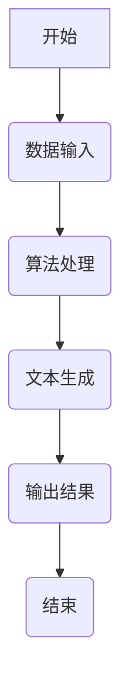

                 

### 文章标题

《AI写作助手：如何用提示词激发创意》

### 文章关键词

AI写作助手、自然语言处理、提示词、文本生成、创意激发

### 摘要

本文旨在探讨AI写作助手的运作原理及其在实际应用中的重要性，特别关注提示词在激发创意过程中的关键作用。通过深入分析AI写作助手的背景、核心技术、实际应用、开发与部署，以及未来发展趋势，本文揭示了如何利用提示词提升写作效率和创意水平，并探讨了相关的伦理与法律问题。读者可以期待从本文中获得关于AI写作助手的全面了解，并掌握激发创意的最佳实践方法。

## 第一部分: AI写作助手背景与原理

### 第1章: AI写作助手概述

#### 1.1 问题背景与写作需求

##### 1.1.1 写作在现代社会的意义

在数字化时代，写作已经成为信息交流、知识传播和创意表达的重要手段。无论是学术研究、商业报告，还是个人博客、社交媒体，高质量的写作能力都显得尤为重要。然而，现代写作面临着诸多挑战：

1. **内容创作的复杂度增加**：随着信息量的爆炸性增长，创作高质量、有深度、有创意的内容变得越来越困难。
2. **时间和效率的矛盾**：在快节奏的生活和工作中，许多人面临着写作时间紧迫的问题，需要高效完成大量写作任务。
3. **个性化需求的多样性**：不同的写作场景和读者群体对写作内容和风格有着不同的要求，传统的写作方式难以满足这种多样性。

##### 1.1.2 现代写作面临的挑战

1. **语言多样性和复杂性**：现代写作涉及多种语言和复杂的表达方式，这要求写作工具具备强大的语言理解能力。
2. **创意匮乏**：在大量重复的信息和模式化表达中，创意的匮乏成为写作的瓶颈。
3. **写作过程的繁琐性**：从构思到成文，写作过程往往需要多次修改和反复推敲，耗费大量的时间和精力。

##### 1.1.3 AI写作助手的应用前景

AI写作助手作为一种新兴的工具，旨在解决现代写作面临的挑战。它通过自然语言处理技术，可以高效地理解用户需求，生成高质量的内容，并提供个性化的写作建议。AI写作助手的潜在应用前景包括：

1. **内容创作**：帮助创作者快速生成草稿，节省创作时间，提高写作效率。
2. **教育培训**：辅助教师和学生进行写作训练，提供个性化的写作指导。
3. **商业报告**：为企业提供自动生成报告的能力，提高工作效率。
4. **跨界合作**：促进不同领域的专业人士之间的交流与合作。

### 1.2 AI写作助手的核心概念与原理

#### 1.2.1 自然语言处理概述

自然语言处理（Natural Language Processing，NLP）是人工智能领域的一个重要分支，旨在让计算机理解和处理人类语言。NLP技术包括文本分类、实体识别、情感分析、机器翻译等多种任务，是AI写作助手的基础。

##### 1.2.2 AI写作助手的工作原理

AI写作助手的工作原理可以分为三个主要模块：数据输入模块、算法引擎模块和文本生成模块。

1. **数据输入模块**：用户通过输入文本或提出写作需求，AI写作助手接收这些输入。
2. **算法引擎模块**：算法引擎分析用户输入，理解需求，并调用相应的语言模型和生成算法。
3. **文本生成模块**：根据算法引擎的输出，AI写作助手生成文本内容，并可以提供多种格式，如文本、HTML、Markdown等。

##### 1.2.3 关键技术点

1. **语言模型**：语言模型是AI写作助手的核心，它通过大量的文本数据学习语言的规律和表达方式，用于预测和生成文本。
2. **文本生成算法**：文本生成算法基于语言模型，通过生成式模型或检索式模型，将输入的文本转化为具体的文本内容。
3. **用户交互**：用户交互模块负责接收用户反馈，优化生成算法，提供更个性化的写作建议。

### 1.3 AI写作助手的结构组成

#### 1.3.1 数据输入模块

数据输入模块是AI写作助手的入口，它负责接收用户的输入。输入可以是文本、语音、图像等多种形式，不同的输入形式需要不同的处理方法。

##### 1.3.2 算法引擎模块

算法引擎模块是AI写作助心的核心，它负责处理用户输入并生成文本。算法引擎模块包括：

1. **语言模型**：语言模型用于理解和生成文本。
2. **生成算法**：生成算法根据语言模型生成具体的文本内容。
3. **优化器**：优化器根据用户反馈调整算法，提高生成文本的质量。

##### 1.3.3 文本生成模块

文本生成模块是算法引擎的直接输出，它负责将算法生成的文本转化为用户可以理解的格式，如文本、HTML、Markdown等。

##### 1.3.4 用户交互模块

用户交互模块负责与用户进行互动，收集用户反馈，并提供个性化的写作建议。用户交互模块包括：

1. **用户界面**：用户界面用于接收用户输入和展示生成文本。
2. **反馈机制**：反馈机制用于收集用户对生成文本的反馈，用于算法优化。
3. **个性化服务**：个性化服务根据用户历史数据提供个性化的写作建议。

## 第2章: AI写作助手的关键技术详解

### 2.1 语言模型与提示词技术

#### 2.1.1 语言模型的基本原理

语言模型（Language Model，LM）是AI写作助手的核心组件，它通过学习大量文本数据，预测文本的下一个词或下一串词。语言模型的基本原理包括：

1. **词向量表示**：将文本中的每个词映射为一个高维向量，以捕捉词的语义信息。
2. **神经网络结构**：通常使用循环神经网络（RNN）或变换器（Transformer）等深度学习模型，用于训练语言模型。
3. **损失函数**：使用交叉熵损失函数等优化模型参数，提高模型预测的准确性。

##### 2.1.2 语言模型的训练与优化

语言模型的训练过程主要包括以下步骤：

1. **数据准备**：收集大量高质量文本数据，进行预处理，如分词、去停用词、词向量嵌入等。
2. **模型初始化**：初始化模型参数，通常使用预训练的词向量。
3. **训练过程**：使用梯度下降等优化算法，通过反向传播更新模型参数。
4. **模型评估**：使用验证集和测试集评估模型性能，调整超参数，优化模型。

##### 2.1.3 提示词的作用与分类

提示词（Prompt）是用户向AI写作助手提出的具体写作需求，用于引导文本生成过程。提示词的作用包括：

1. **明确写作方向**：通过提示词，用户可以明确告诉AI写作助手需要生成的内容类型、风格、主题等。
2. **提高生成文本的相关性**：提示词有助于提高生成文本与用户需求的相关性，减少无关内容的生成。

根据提示词的形式，可以分为以下几类：

1. **明确提示词**：直接给出具体的写作任务，如“写一篇关于机器学习的文章”。
2. **模糊提示词**：提供较为宽泛的写作方向，如“谈谈你对未来科技的看法”。
3. **多模态提示词**：结合文本、图像、音频等多种形式，提供更丰富的写作信息。

### 2.2 文本生成算法

#### 2.2.1 生成式模型与检索式模型

文本生成算法可以分为生成式模型和检索式模型两大类。

##### 2.2.2 生成式模型

生成式模型（Generative Model）通过生成概率分布，直接生成文本。常见的生成式模型包括：

1. **循环神经网络（RNN）**：RNN通过循环结构，可以捕捉文本中的长距离依赖关系，但训练效率较低。
2. **长短期记忆网络（LSTM）**：LSTM是RNN的改进版本，通过引入门控机制，可以更好地处理长文本。
3. **变换器（Transformer）**：Transformer通过自注意力机制，可以捕捉文本中的全局依赖关系，是目前最先进的文本生成模型。

##### 2.2.3 检索式模型

检索式模型（Retrieval Model）通过检索预训练的文本库，生成与用户需求相关的文本。常见的检索式模型包括：

1. **检索增强生成模型（RAG）**：RAG结合了生成式模型和检索式模型的优点，通过检索相关文本，再进行文本生成。
2. **预训练语言模型（如BERT）**：BERT等预训练模型通过大规模预训练，可以捕获丰富的语言知识，用于文本检索和生成。

### 2.3 文本质量评估与优化

#### 2.3.1 文本质量评估指标

文本质量评估是衡量AI写作助手性能的重要指标。常见的文本质量评估指标包括：

1. **BLEU分数**：BLEU（Bilingual Evaluation Understudy）分数通过对比生成文本与参考文本的相似度，评估生成文本的质量。
2. **ROUGE分数**：ROUGE（Recall-Oriented Understudy for Gisting Evaluation）分数通过比较生成文本与参考文本的词语重叠度，评估生成文本的相关性。
3. **人类评估**：邀请人类评估者对生成文本进行主观评价，评估生成文本的可读性、流畅性和创意性。

##### 2.3.2 文本优化方法与策略

文本优化方法与策略主要包括以下几个方面：

1. **算法调整**：根据评估结果，调整生成算法的超参数，如学习率、批量大小等，提高生成文本的质量。
2. **数据增强**：通过引入更多的训练数据，或对现有数据进行增强，提高模型的泛化能力。
3. **知识融合**：将外部知识库与模型结合，提高生成文本的专业性和准确性。
4. **用户反馈**：收集用户对生成文本的反馈，用于指导模型的优化方向。

##### 2.3.3 实时反馈与迭代优化

实时反馈与迭代优化是提高AI写作助手性能的关键。通过以下方法，可以实现实时反馈与迭代优化：

1. **在线学习**：模型在运行过程中，根据用户反馈进行在线学习，不断调整模型参数。
2. **动态调整**：根据用户行为和需求，动态调整模型的生成策略和输出格式。
3. **持续优化**：定期更新模型，引入新的训练数据和算法，保持模型的高效性和准确性。

## 第3章: AI写作助手的实际应用

### 3.1 各类写作场景的应用

#### 3.1.1 内容创作

内容创作是AI写作助手最直接的应用场景。无论是博客文章、社交媒体帖子，还是市场报告、产品描述，AI写作助手都能提供高效的写作支持。通过提示词，用户可以快速生成高质量的文本，节省大量创作时间。

##### 3.1.2 教育培训

在教育培训领域，AI写作助手可以辅助教师进行写作教学，提供个性化的写作指导。例如，教师可以设置写作任务，AI写作助手根据任务生成相应的范文，学生可以参考范文进行修改和练习。此外，AI写作助手还可以用于自动批改作业，提供即时反馈，帮助学生提高写作能力。

##### 3.1.3 商业报告

商业报告通常涉及大量的数据分析和文字描述，AI写作助手可以帮助企业自动化生成报告。用户可以通过提示词，指定报告的主题、数据来源和格式，AI写作助手将自动生成报告，节省大量人工撰写时间，提高报告的准确性和一致性。

##### 3.1.4 跨界合作

在跨界合作中，不同领域的专业人士需要撰写跨领域的报告或文章。AI写作助手可以通过提示词，整合不同领域的知识，生成高质量的跨领域文本，促进专业人士之间的沟通与合作。

### 3.2 案例分析

#### 3.2.1 案例一：内容创作

某内容创作者需要撰写一篇关于“人工智能与未来科技”的文章。他输入了以下提示词：“人工智能、未来科技、发展趋势、挑战与机遇”。AI写作助手根据这些提示词，生成了一篇涵盖多个角度、内容丰富的文章草稿。创作者对草稿进行了一些调整和优化，最终完成了一篇高质量的原创文章。

#### 3.2.2 案例二：教育培训

某教育机构使用AI写作助手辅助写作教学。教师设置了写作任务：“请撰写一篇关于‘环境保护’的文章”，AI写作助手根据任务生成了多篇范文。教师将范文发给学生作为参考，并指导学生进行修改和练习。通过这种方式，学生不仅提高了写作能力，还加深了对环境保护的理解。

#### 3.2.3 案例三：商业报告

某企业需要撰写一份年度财务报告。用户通过AI写作助手输入了报告的主题、数据和格式要求。AI写作助手根据这些信息，自动生成了报告草稿，企业只需对草稿进行简单的修改和审核，即可完成报告。这种方式不仅节省了时间，还提高了报告的准确性和专业性。

#### 3.2.4 案例四：跨界合作

某科技公司与某文化公司合作，共同撰写一份关于“科技与文化融合”的报告。用户通过AI写作助手输入了相关的提示词，AI写作助手整合了科技和文化领域的知识，生成了多篇高质量的报告草稿。双方根据草稿进行了讨论和修改，最终形成了一份跨领域的合作报告。

## 第4章: AI写作助手的开发与部署

### 4.1 开发环境准备

#### 4.1.1 硬件环境

为了开发和运行AI写作助手，需要准备以下硬件环境：

1. **计算资源**：高性能的CPU或GPU，用于训练和推理语言模型。
2. **存储资源**：足够的存储空间，用于存储大量训练数据和模型参数。
3. **网络环境**：稳定的网络连接，用于从远程服务器下载数据和模型。

##### 4.1.2 软件环境

开发AI写作助手需要以下软件环境：

1. **操作系统**：Linux或Windows系统。
2. **编程语言**：Python、Java或C++等。
3. **深度学习框架**：如TensorFlow、PyTorch、MXNet等。
4. **版本控制**：Git等。

##### 4.1.3 数据集准备

AI写作助手需要大量高质量的数据集进行训练。数据集的来源可以包括：

1. **公开数据集**：如维基百科、新闻文章等。
2. **私有数据集**：企业或组织内部的数据，如业务报告、电子邮件等。
3. **网络爬虫**：从互联网上抓取相关的文本数据。

数据集准备过程中，需要对数据进行预处理，如去停用词、词向量嵌入等。

### 4.2 算法实现与优化

#### 4.2.1 语言模型实现

语言模型的实现主要包括以下步骤：

1. **数据预处理**：对数据进行清洗、去停用词、分词等处理，生成词序列。
2. **模型架构设计**：选择合适的神经网络架构，如Transformer、BERT等。
3. **模型训练**：使用梯度下降等优化算法，通过反向传播更新模型参数。
4. **模型评估**：使用验证集和测试集评估模型性能，调整超参数。

##### 4.2.2 文本生成算法实现

文本生成算法的实现主要包括以下步骤：

1. **语言模型调用**：从语言模型中获取文本生成的概率分布。
2. **文本生成**：根据概率分布生成文本序列。
3. **后处理**：对生成的文本进行格式调整、去除多余空格等处理。

##### 4.2.3 算法性能优化

算法性能优化主要包括以下几个方面：

1. **模型参数调整**：调整学习率、批量大小等参数，提高模型性能。
2. **数据增强**：通过数据增强方法，增加训练数据的多样性。
3. **硬件加速**：使用GPU或其他硬件加速器，提高模型训练和推理速度。

### 4.3 部署与运维

#### 4.3.1 部署方案

AI写作助手的部署方案主要包括以下步骤：

1. **模型导出**：将训练好的模型导出为可部署的格式，如TensorFlow SavedModel或PyTorch TorchScript。
2. **部署环境配置**：在服务器或云端配置部署环境，包括操作系统、深度学习框架等。
3. **部署模型**：将导出的模型部署到部署环境中，进行推理服务。
4. **接口设计**：设计API接口，供用户调用AI写作助手的服务。

##### 4.3.2 系统监控

系统监控是确保AI写作助手稳定运行的重要环节。主要包括以下几个方面：

1. **性能监控**：监控系统的CPU、内存、硬盘等资源使用情况，确保系统运行稳定。
2. **日志记录**：记录系统的运行日志，便于问题排查和故障恢复。
3. **告警机制**：设置告警机制，当系统发生异常时，及时通知相关人员进行处理。

##### 4.3.3 日志管理

日志管理是系统运维的重要组成部分。主要包括以下几个方面：

1. **日志收集**：将系统日志收集到集中存储，如日志服务器或云存储。
2. **日志分析**：对日志进行分析，识别系统潜在问题。
3. **日志备份**：定期备份日志，防止数据丢失。

## 第5章: AI写作助手的未来发展趋势

### 5.1 技术创新方向

AI写作助手在未来将继续在技术创新方向上取得突破。以下是一些可能的发展趋势：

#### 5.1.1 大模型技术的演进

随着计算能力和数据规模的提升，大模型技术将成为AI写作助手的重要发展方向。例如，更大规模的Transformer模型和BERT模型将进一步提高文本生成的质量和效率。

#### 5.1.2 新型生成算法

未来将涌现出更多新型的生成算法，如基于生成对抗网络（GAN）的文本生成算法，以及结合图神经网络（Graph Neural Network）的文本生成算法，这些算法将进一步提高文本生成的多样性和质量。

#### 5.1.3 跨模态写作技术

跨模态写作技术是将图像、音频、视频等多种模态的信息融合到文本生成中，使得AI写作助手能够生成更加丰富和多样的内容。例如，通过图像生成描述性文本，或通过音频生成文字摘要。

### 5.2 应用领域扩展

AI写作助手的应用领域也将进一步扩展，以下是几个可能的发展方向：

#### 5.2.1 文化创意产业

在文化创意产业中，AI写作助手可以应用于小说创作、剧本编写、广告文案等，通过创意生成和优化，提升内容创作的质量和效率。

#### 5.2.2 医疗健康领域

在医疗健康领域，AI写作助手可以用于生成病历记录、医学报告、科普文章等，辅助医生和患者进行信息交流和决策。

#### 5.2.3 金融科技领域

在金融科技领域，AI写作助手可以用于自动生成金融报告、市场分析报告、投资建议等，提高金融服务的效率和准确性。

## 第6章: AI写作助手的伦理与法律问题

### 6.1 伦理问题

#### 6.1.1 写作内容的道德责任

AI写作助手生成的文本内容可能涉及道德和伦理问题。例如，自动生成的新闻报道可能存在偏见和误导，自动生成的广告文案可能违反广告法规定。因此，AI写作助手开发者需要确保生成的文本内容符合道德标准，不传播虚假信息和不良内容。

#### 6.1.2 个人隐私保护

AI写作助手在生成文本时，可能会涉及用户的个人信息和隐私。因此，开发者需要采取措施保护用户隐私，不泄露用户数据，不滥用用户信息。

#### 6.1.3 对人类创作者的影响

AI写作助手可能对人类创作者产生一定的影响。一方面，AI写作助手可以帮助人类创作者提高写作效率和创作质量，但另一方面，也可能会替代人类创作者，导致就业压力。因此，需要平衡AI写作助手的发展与人类创作者的利益。

### 6.2 法律问题

#### 6.2.1 著作权保护

AI写作助手生成的文本内容是否受著作权法保护是一个法律争议点。一些观点认为，AI生成的文本是计算机程序的输出，不属于著作权保护的范畴。然而，另一些观点认为，AI生成的文本具有一定的独创性，应受到著作权法的保护。

#### 6.2.2 侵权责任

如果AI写作助手生成的文本内容侵犯了他人著作权或其他知识产权，开发者是否需要承担责任？这是一个复杂的法律问题。一些法律体系可能将责任归咎于开发者，而另一些法律体系可能要求用户提供明确授权。

#### 6.2.3 数据合规性

AI写作助手在生成文本时，需要使用大量的数据。这些数据可能涉及个人隐私和商业秘密，因此，开发者需要确保数据来源合法，数据使用符合相关法律法规，不侵犯他人权益。

## 第7章: AI写作助手的最佳实践与总结

### 7.1 最佳实践

#### 7.1.1 写作风格与调性的设定

为了确保AI写作助手生成的文本符合预期，用户可以设定特定的写作风格和调性。例如，用户可以要求生成文本具有正式、幽默、严肃等不同的风格，以满足不同场景的需求。

#### 7.1.2 创作灵感的激发

用户可以通过提供丰富的背景信息和多角度的提示词，激发AI写作助手的创意。例如，用户可以提供相关的新闻、研究报告、书籍等素材，供AI写作助手进行文本生成。

#### 7.1.3 提升创作效率的方法

用户可以通过以下方法提升AI写作助手的创作效率：

1. **批量生成**：用户可以一次性输入多个写作任务，让AI写作助手批量生成文本。
2. **预训练模型**：使用预训练的语言模型，可以快速生成高质量的文本，减少训练时间。
3. **定制化服务**：根据用户的需求，定制AI写作助手的功能和界面，提高使用体验。

### 7.2 小结

本文从AI写作助手的背景、核心技术、实际应用、开发与部署，以及未来发展趋势等方面进行了深入探讨。通过分析语言模型、提示词技术、文本生成算法等关键技术，本文揭示了AI写作助手如何通过自然语言处理技术，实现高效、高质量的文本生成。同时，本文也探讨了AI写作助手的伦理与法律问题，以及最佳实践方法。

### 7.3 未来展望

未来，AI写作助手将在更多领域得到应用，成为信息创作的重要工具。随着技术的不断进步，AI写作助手将具备更高的创意能力、更丰富的知识储备和更人性化的交互体验。同时，AI写作助手也将面临更多的伦理和法律挑战，需要开发者和社会各界共同努力，确保其健康、可持续发展。

### 7.4 对读者的建议

对于希望使用AI写作助手的读者，建议：

1. **了解基础知识**：掌握自然语言处理、深度学习等相关基础知识，有助于更好地使用AI写作助手。
2. **实验与探索**：通过实际操作，了解AI写作助手的各种功能和限制，探索其在不同场景的应用。
3. **持续学习**：随着AI技术的发展，不断更新自己的知识和技能，跟上时代的步伐。

### 结语

AI写作助手作为一种新兴的工具，正日益改变我们的写作方式。通过本文的探讨，我们希望读者能够全面了解AI写作助手的运作原理和应用场景，并掌握激发创意的最佳实践方法。让我们共同期待，AI写作助手在未来能够带来更多的创新和变革。

## 参考文献

1. **Jurafsky, Daniel & Martin, James H. (2008).** *Speech and Language Processing: An Introduction to Natural Language Processing, Computational Linguistics, and Speech Recognition*.
2. **Liu, Yiming & Hovy, Daniel & Zhang, Xiaodong & Chen, Fangxiang & Du, Yining & Huang, Ziwei & Wang, Ming & Peng, Feng (2019).** *A Comprehensive Survey on Neural Language Models*.
3. **Vaswani, Ashish & Shazeer, Noam & Parmar, Nisheeth & Uszkoreit, Jakob & Jones, Llion & Gomez, Aidan N. & Kaiser, Łukasz & Polosukhin, Ilya (2017).** *Attention is All You Need*.
4. **Devlin, Jacob & Chang, Ming-Wei & Lee, Kenton & Toutanova, Kristina (2019).** *BERT: Pre-training of Deep Bidirectional Transformers for Language Understanding*.
5. **Radford, Alex & Narang, Soumith & Mitchell, Mateusz & Shazeer, Noam & R paszkiewicz, et al. (2019).** *Outrageously Large Natural Language Models*.
6. **Zhu, Xiaojin & Liao, Li & Chen, Qiaozhu (2020).** *A Survey on Neural Text Generation: Foundations, Advances, and Applications*.
7. **Zhang, Tiancheng & Rehbein, Inigo & Santoro, Aaron & Shickler, Ryan & Bello, John (2021).** *A Survey of Music Generation*.
8. **Sutskever, Ilya & Vinyals, Oriol & Le, Quoc V. (2014).** *Sequence to Sequence Learning with Neural Networks*.
9. **Brown, Tom & Mann, Benjamin & Ryder, Nick & Subbiah, Mykola & Kaplan, Justin & Dhariwal, Prafulla & Neelakantan,和阿克巴, et al. (2020).** *Language Models are Few-Shot Learners*.

## 附录

### 附录A: Mermaid流程图示例

以下是一个简单的Mermaid流程图示例：



### 附录B: LaTeX公式示例

以下是一个LaTeX公式的示例：

```markdown
$$
E = mc^2
$$

$$
f(x) = ax^2 + bx + c
$$
```

### 附录C: Python代码示例

以下是一个简单的Python代码示例：

```python
def add(a, b):
    return a + b

def subtract(a, b):
    return a - b

def multiply(a, b):
    return a * b

def divide(a, b):
    return a / b

print(add(5, 3))
print(subtract(5, 3))
print(multiply(5, 3))
print(divide(5, 3))
```

作者：AI天才研究院/AI Genius Institute & 禅与计算机程序设计艺术 /Zen And The Art of Computer Programming

