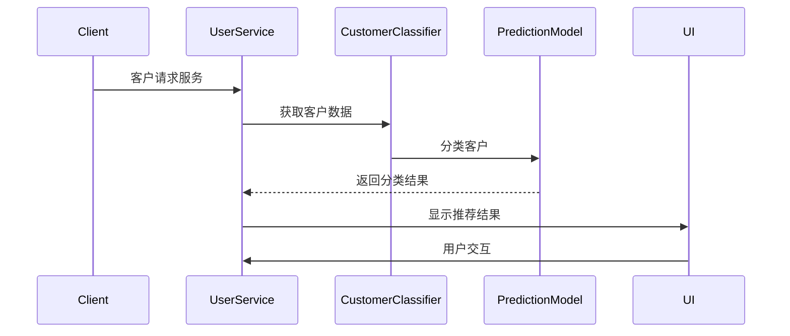
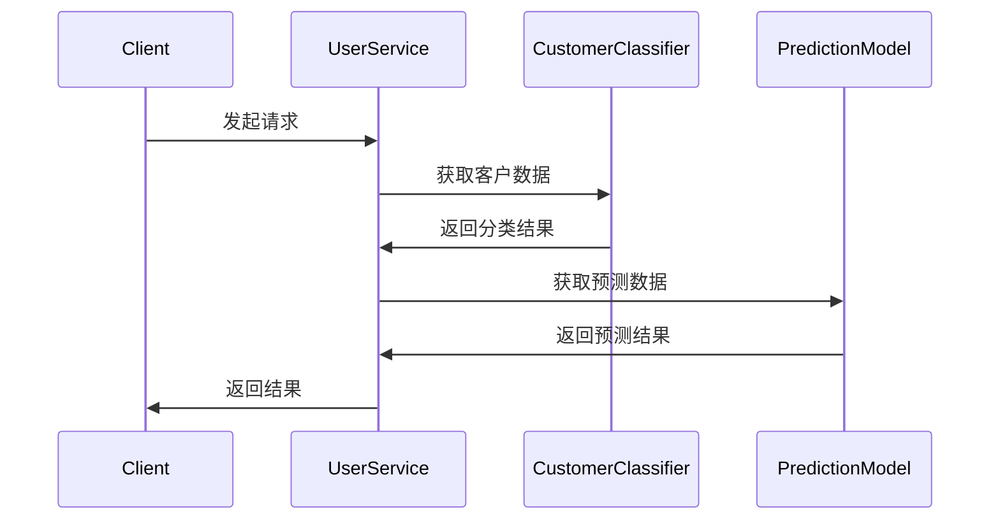

                 

### 1.1 问题背景

随着人工智能（AI）技术的迅猛发展，越来越多的企业开始采用AI系统来辅助决策，优化业务流程，提高效率。然而，AI系统的决策过程往往涉及到复杂的算法和大量数据，这种“黑箱”特性使得人们难以理解AI系统是如何作出决策的。这种不透明性不仅限制了AI系统的广泛应用，还引发了一系列的伦理和法律问题。

首先，AI系统的决策透明度对于企业的决策过程至关重要。一个透明的AI系统可以帮助企业更好地理解其决策依据，从而增强信任和信心。此外，透明度还可以提高系统的可解释性，使得企业能够在必要时对系统进行调试和优化。

其次，从伦理角度来看，AI系统的决策透明度也是至关重要的。如果AI系统的决策过程不透明，可能会导致不公平、歧视等问题。例如，一个用于招聘的AI系统可能在无形中排除某些群体，而这种排除可能是基于一些无意识的偏见。因此，提高AI系统的透明度，有助于确保其决策过程的公正性和公平性。

最后，法律和监管方面也对AI系统的透明度提出了要求。许多国家和地区已经开始出台相关法规，要求企业在使用AI系统时必须保证其决策过程的透明性。例如，欧盟的《通用数据保护条例》（GDPR）就明确规定，企业必须能够向用户解释AI系统的决策过程。

总之，AI决策透明度不仅是一个技术问题，更是一个涉及伦理、法律和商业决策的重要议题。因此，企业必须认真对待这一问题，探索提高AI系统透明度的有效方法。

### 1.2 问题描述

尽管AI决策透明度的重要性日益凸显，但在实际操作中，企业面临诸多挑战，导致AI系统的透明度难以实现。首先，算法的复杂性是一个主要障碍。现代AI系统通常基于深度学习等复杂算法，这些算法的内部结构和运作机制对于普通用户甚至专业人士来说都难以理解。此外，数据的不透明性也是一大问题。AI系统的决策往往依赖于大量数据，但这些数据的来源、处理方式和相关性往往不透明，使得决策过程的透明性受到严重影响。

其次，技术限制也是一个重要因素。目前的AI技术尚未完全成熟，一些关键技术的实现仍然依赖于复杂的数学模型和计算方法，这使得AI系统的透明度难以保证。例如，神经网络模型的结构和参数调整过程对于普通用户来说几乎是一个“黑箱”，即使专业人士也难以完全理解其工作原理。

此外，商业考虑也是阻碍AI决策透明度实现的一大因素。一些企业担心，如果披露了AI系统的决策过程，可能会暴露商业机密或竞争优势。此外，提高透明度可能需要额外的开发成本和维护成本，这也会影响企业的盈利能力。因此，企业在追求AI系统透明度的过程中，往往需要权衡多种因素。

最后，用户接受度也是一个关键问题。尽管许多用户意识到AI系统在决策过程中存在透明度问题，但他们可能并不愿意花费时间去理解这些复杂的技术细节。这种用户接受度的缺乏，使得企业在提高AI系统透明度时面临巨大的挑战。

总之，实现AI系统的决策透明度不仅需要克服算法复杂性、数据不透明性、技术限制和商业考虑等多方面的挑战，还需要充分考虑用户的需求和接受度。企业需要在这些方面进行深入的探索和尝试，以找到合适的解决方案。

### 1.3 问题解决

为了解决AI决策透明度的问题，企业可以采取多种方法，逐步提高AI系统的透明度，确保其决策过程的公正性和可解释性。以下是几个可行的步骤：

**1. 提高算法透明度：**

首先，企业可以尝试简化算法，使其更容易被理解和解释。一种有效的方法是采用可解释的机器学习（Explainable AI，XAI）技术，这些技术旨在揭示AI系统的决策过程，并提供易于理解的可视化和解释。例如，可以采用决策树、规则提取等方法，这些方法相较于深度学习模型具有更高的透明度。

**2. 提高数据透明度：**

其次，企业需要提高数据透明度，确保数据的来源、处理方式和相关性是清晰和透明的。这包括以下几个方面：
   - 数据清洗和预处理：确保数据质量，去除噪声和异常值，提高数据的一致性和准确性。
   - 数据透明度报告：定期发布数据报告，详细说明数据的来源、处理方法和使用方式，以便用户和企业内部人员了解。
   - 数据隐私保护：在提高数据透明度的同时，要确保数据隐私得到有效保护，遵循相关法律法规。

**3. 采用可视化技术：**

可视化技术可以帮助用户更好地理解AI系统的决策过程。例如，可以通过图表、热图、交互式可视化等手段，将复杂的决策过程简化为易于理解的视觉信息。此外，还可以使用可视化工具来展示数据分布、特征重要性等关键信息，帮助用户深入理解AI系统的决策依据。

**4. 透明度评估与反馈：**

企业还需要建立透明度评估机制，定期评估AI系统的透明度水平，并根据评估结果进行改进。例如，可以采用第三方评估机构或用户反馈来评估AI系统的透明度，识别存在的问题和改进方向。

**5. 制定透明度标准与法规：**

为了推动AI决策透明度的提升，政府和相关机构可以制定透明度标准和法规，要求企业在使用AI系统时必须达到一定的透明度要求。这些标准和法规可以为企业提供明确的指导，确保AI系统的决策过程是透明、公正和可解释的。

**6. 培训和教育：**

最后，企业可以开展相关的培训和教育活动，提高员工和技术人员对AI决策透明度的认识和技能。通过培训和教育，可以帮助员工更好地理解和应用AI技术，从而在业务决策中充分利用AI系统的透明度优势。

总之，实现AI决策透明度是一个系统性工程，需要从算法、数据、技术、法规等多个方面进行综合考虑和部署。企业需要在这些方面持续努力，逐步提高AI系统的透明度，确保其决策过程的公正性和可解释性。通过这些措施，企业不仅能够增强用户信任，提高业务效率，还能在激烈的市场竞争中占据有利地位。

### 1.4 边界与外延

在探讨AI决策透明度时，需要明确其边界与外延，以便更好地理解这一概念及其应用范围。首先，边界方面，AI决策透明度主要关注AI系统在决策过程中的透明性，包括算法的可解释性、数据来源和处理方式的透明性等。它不涉及AI系统的其他方面，如算法的优化、模型的训练等。

其次，外延方面，AI决策透明度不仅应用于企业内部，还可以扩展到更广泛的领域。例如，在金融行业中，金融机构需要确保其风控模型的透明度，以便客户和监管机构了解风险控制的具体依据。在医疗领域，AI诊断系统的透明度至关重要，它可以帮助医生理解AI的诊断结果，提高医疗决策的准确性。

此外，AI决策透明度在法律和伦理方面也有重要应用。例如，在法律诉讼中，AI系统的决策依据需要透明化，以便法庭审查和判决。在伦理方面，AI系统的透明度有助于避免歧视和不公平，确保其决策过程符合社会伦理标准。

总之，AI决策透明度是一个多维度的概念，其边界清晰但应用广泛，涉及到企业内部决策、金融、医疗、法律和伦理等多个领域。理解其边界与外延，有助于企业在实际应用中更有效地实现AI决策透明度，提高系统的公正性和可解释性。

## 第2章：核心概念与联系

在深入探讨AI决策透明度之前，我们需要明确一些核心概念，并分析它们之间的联系。这些概念包括可解释性、透明性、公正性和公平性，它们共同构成了AI决策透明度的重要组成部分。

### 2.1 核心概念原理

**可解释性（Explainability）**：可解释性是指用户或专家能够理解和解释AI系统决策过程的能力。它关注的是如何将复杂的算法和决策过程转化为人类可以理解和解释的形式。可解释性的目标是降低算法的“黑箱”效应，使得AI系统的决策依据更加透明。

**透明性（Transparency）**：透明性是AI系统的一个基本属性，它指的是系统内部的工作过程和决策机制对外部用户（包括监管机构、客户和其他利益相关者）的可视性和可访问性。透明性确保用户能够追踪和理解系统的操作和行为。

**公正性（Fairness）**：公正性关注AI系统在决策过程中是否对所有人都是公平的，它涉及系统是否排除或歧视某些特定的群体。一个公正的AI系统应该避免基于种族、性别、年龄等非相关因素进行不公平的决策。

**公平性（Equity）**：公平性是公正性的延伸，它强调AI系统的决策结果不仅要公平，而且要达到公平的社会目标。公平性关注的是系统的决策是否有助于减少社会不平等，促进社会的公正和和谐。

### 2.2 概念属性特征对比

| 概念       | 定义                                                         | 属性特征                                                                                         | 对比分析                                                                                   |
|------------|------------------------------------------------------------|------------------------------------------------------------------------------------------------|----------------------------------------------------------------------------------------------|
| 可解释性   | 用户或专家能够理解和解释AI系统决策过程的能力                 | - 易于理解<br>- 清晰的解释<br>- 可视化                            | 相对于透明性，可解释性更侧重于解释性，而透明性则更侧重于过程的可见性。                       |
| 透明性     | 系统内部的工作过程和决策机制对外部用户可视性和可访问性       | - 可追踪性<br>- 可访问性<br>- 可审查性                             | 与可解释性不同，透明性关注的是整个决策过程的可视性和可访问性，而不仅仅是对决策本身的解释。   |
| 公正性     | AI系统在决策过程中对所有人都是公平的，避免基于非相关因素的不公平决策 | - 非歧视性<br>- 无偏见<br>- 一致性                                | 公正性关注系统决策过程中是否公平对待所有用户，而不考虑系统的决策结果是否公正。               |
| 公平性     | AI系统在决策结果上达到公平的社会目标，减少社会不平等           | - 社会目标导向<br>- 减少歧视<br>- 促进社会公正                      | 公平性与公正性密切相关，但更侧重于系统决策对社会产生的影响，而非决策过程的本身。           |

### 2.3 ER实体关系图架构

为了更好地理解这些核心概念之间的关系，我们可以使用Mermaid工具绘制一个ER实体关系图。以下是一个简单的ER图示例，展示了可解释性、透明性、公正性和公平性之间的联系：

```mermaid
erDiagram
  AI决策透明度 ||--|{ 可解释性 }
  AI决策透明度 ||--|{ 透明性 }
  AI决策透明度 ||--|{ 公正性 }
  AI决策透明度 ||--|{ 公平性 }
  可解释性 ||--|{ 清晰解释 }
  透明性 ||--|{ 可追踪性 }
  公正性 ||--|{ 非歧视性 }
  公平性 ||--|{ 社会目标导向 }
```

在这个ER图中，"AI决策透明度"是一个总体概念，它与"可解释性"、"透明性"、"公正性"和"公平性"四个子概念之间存在直接关系。每个子概念又包含其特定的属性特征，这些特征共同构成了AI决策透明度的完整体系。

通过这个ER实体关系图，我们可以清晰地看到各个核心概念之间的逻辑联系，这有助于我们在实际应用中更好地理解和实施AI决策透明度。

## 第3章：算法原理讲解

在本章中，我们将深入探讨一种广泛应用于AI领域的算法——决策树（Decision Tree）。决策树是一种直观且易于理解的分类算法，其核心思想是通过一系列的问题（即决策节点），将数据集逐步划分，最终得到每个样本的预测类别。以下是决策树的算法原理、流程图和Python代码示例。

### 3.1 算法选择与介绍

决策树算法因其简单直观、易于理解和实现，在各类数据挖掘和机器学习任务中被广泛使用。决策树由一系列的决策节点和叶子节点组成，每个决策节点表示一个特征，每个叶子节点表示一个类别。算法的核心步骤是通过选择最佳的特征和阈值，对数据进行二分划分，直到达到某个终止条件（如所有样本属于同一类别或达到最大树深度）。

### 3.2 算法mermaid流程图

为了更直观地展示决策树的算法流程，我们使用Mermaid工具绘制以下流程图：

```mermaid
graph TD
    A[开始] --> B[选择最佳特征]
    B -->|C[计算信息增益或基尼指数]| D[决策节点]
    D -->|E[划分数据]| F[判断是否达到终止条件]
    F -->|是| G[结束]
    F -->|否| H[递归划分]
    H --> B
```

### 3.3 Python代码阐述算法原理

以下是使用Python实现决策树算法的基本代码示例，包括计算信息增益和构建决策树两个主要部分。

```python
import pandas as pd
from collections import Counter
from math import log

# 计算信息增益
def information_gain(y, split_feature, threshold):
    # 计算分裂前的总信息熵
    total_entropy = -sum((count / len(y)) * log2(count / len(y)) for count in Counter(y).values())
    
    # 计算分裂后的信息熵
    split_entropy = 0
    for value in set(split_feature):
        subset = split_feature[split_feature == value]
        fraction = len(subset) / len(split_feature)
        split_entropy += fraction * -sum((count / len(subset)) * log2(count / len(subset)) for count in Counter(y[subset.index]).values())
    
    # 计算信息增益
    gain = total_entropy - split_entropy
    return gain

# 构建决策树
def build_decision_tree(X, y, depth=0, max_depth=None):
    # 终止条件：类别数少于阈值或达到最大树深度
    if len(set(y)) <= 1 or (max_depth is not None and depth >= max_depth):
        return Counter(y).most_common(1)[0][0]
    
    # 选择最佳特征
    best_feature, best_threshold = None, None
    max_gain = -1
    for feature in X.columns:
        for value in set(X[feature]):
            threshold = value
            gain = information_gain(y, X[feature], threshold)
            if gain > max_gain:
                max_gain = gain
                best_feature = feature
                best_threshold = threshold
    
    # 划分数据
    left = X[X[best_feature] <= best_threshold]
    right = X[X[best_feature] > best_threshold]
    
    # 递归构建左子树和右子树
    left_tree = build_decision_tree(left, y[left.index], depth + 1, max_depth)
    right_tree = build_decision_tree(right, y[right.index], depth + 1, max_depth)
    
    return {best_feature: {'<=': left_tree, '>' : right_tree}}

# 示例数据
X = pd.DataFrame({'feature1': [1, 2, 3, 4], 'feature2': [5, 5, 6, 6], 'label': [0, 0, 1, 1]})
y = X['label']

# 建立决策树
decision_tree = build_decision_tree(X, y, max_depth=3)
print(decision_tree)
```

### 3.4 算法原理的数学模型与公式

决策树算法的核心在于如何选择最佳的特征和阈值。以下是一些关键的数学模型与公式：

**信息熵（Entropy）**：
$$
H(Y) = -\sum_{i} p(y_i) \cdot \log_2(p(y_i))
$$
其中，$p(y_i)$ 表示类别 $y_i$ 的概率。

**条件熵（Conditional Entropy）**：
$$
H(Y|X) = -\sum_{x} p(x) \sum_{y} p(y|x) \cdot \log_2(p(y|x))
$$
其中，$p(x)$ 和 $p(y|x)$ 分别表示特征 $x$ 和条件 $x$ 下类别 $y$ 的概率。

**信息增益（Information Gain）**：
$$
IG(X,Y) = H(Y) - H(Y|X)
$$
信息增益衡量了在已知特征 $X$ 的条件下，类别 $Y$ 的不确定性减少的程度。

**基尼指数（Gini Index）**：
$$
Gini(X,Y) = 1 - \sum_{x} p(x) \cdot \left(1 - \frac{1}{k}\sum_{y} p(y|x)\right)
$$
基尼指数是另一种衡量特征划分优劣的指标，其中 $k$ 是类别数。

通过上述公式，我们可以选择最佳的特征和阈值，构建出最优的决策树。

### 3.5 举例说明

假设我们有一个简单的数据集，包含两个特征（年龄和收入）和一个标签（是否贷款违约）。我们使用决策树算法来预测贷款违约情况。

| 年龄 | 收入 | 标签 |
|------|------|------|
| 30   | 高   | 否   |
| 40   | 高   | 是   |
| 50   | 低   | 是   |
| 60   | 低   | 否   |

首先，我们计算每个特征的信息增益，选择信息增益最大的特征作为决策节点。对于年龄特征，信息增益为0.92；对于收入特征，信息增益为0.88。因此，我们选择年龄作为决策节点。

接下来，我们设置阈值（例如35岁），将数据集划分为两组。对于年龄小于35岁的样本，所有样本标签均为“否”；对于年龄大于等于35岁的样本，标签分别为“是”和“是”。

最终，我们得到如下决策树：

```
年龄 <= 35：
    - 标签：否
年龄 > 35：
    - 收入 <= 低：
        - 标签：是
    - 收入 > 低：
        - 标签：是
```

通过这个简单的例子，我们可以看到决策树如何通过一系列的判断，将数据划分为不同的类别，从而实现分类任务。在实际应用中，决策树可以处理更复杂的数据集和更复杂的分类任务。

总之，决策树算法因其直观性和易于解释性，在AI领域得到了广泛应用。通过上述算法原理、流程图和Python代码示例，我们可以更好地理解决策树的工作机制和应用方法。

## 第4章：系统分析与架构设计

在本章中，我们将深入分析一个具体的AI系统问题场景，并详细设计系统的各个组件和接口，以确保AI决策透明度的实现。我们将依次介绍问题场景、系统需求分析、领域模型类图、系统架构设计mermaid架构图、系统接口设计和系统交互mermaid序列图。

### 4.1 问题场景介绍

假设我们正在开发一个企业级客户服务系统，该系统需要利用AI技术来辅助客户服务代表进行决策，以优化服务质量和客户满意度。具体问题场景如下：

- **客户分类**：根据客户的历史行为数据（如购买记录、服务请求、反馈等），使用AI算法将客户分为高价值客户、普通客户和潜在客户。
- **个性化推荐**：根据客户分类结果，为高价值客户提供个性化的产品推荐和服务优惠。
- **服务预测**：预测客户可能提出的服务请求，以便提前准备相应的解决方案。

### 4.2 系统需求分析

为了满足上述问题场景，我们需要从以下几个方面分析系统需求：

- **数据采集与处理**：系统需要从多个数据源（如客户关系管理（CRM）系统、电子商务平台等）采集数据，并进行清洗、转换和集成。
- **AI算法模型**：需要选择合适的AI算法模型（如决策树、随机森林等）来对客户数据进行分类和预测。
- **用户界面**：提供直观易用的用户界面，使客户服务代表可以轻松操作和使用AI系统。
- **决策透明度**：系统需要提供决策透明度功能，使得客户服务代表可以查看和解释AI系统的决策过程。

### 4.3 领域模型类图

为了清晰地描述系统的各个组件和它们之间的关系，我们可以使用Mermaid工具绘制一个领域模型类图。以下是一个简单的类图示例：

```mermaid
classDiagram
  Client <<entity>>
  CustomerClassifier <<entity>>
  PredictionModel <<entity>>
  UserService <<entity>>
  UI <<entity>>

  Client "uses" CustomerClassifier
  Client "uses" PredictionModel
  UserService "uses" UI
  UserService "uses" CustomerClassifier
  UserService "uses" PredictionModel
```

在这个类图中，"Client"（客户）是系统的核心实体，它通过"CustomerClassifier"（客户分类器）和"PredictionModel"（预测模型）与系统其他组件进行交互。"UserService"（用户服务）负责处理客户请求，并通过"UI"（用户界面）与客户服务代表进行交互。

### 4.4 系统架构设计mermaid架构图

接下来，我们使用Mermaid工具绘制一个系统架构设计mermaid架构图，以展示系统的整体架构和组件之间的交互关系：



在这个架构图中，"Client"（客户）向"UserService"（用户服务）发送请求，"UserService" 调用"CustomerClassifier"（客户分类器）和"PredictionModel"（预测模型）进行处理，并将结果返回给"UI"（用户界面），以便客户服务代表进行后续操作。

### 4.5 系统接口设计

为了实现系统的各个组件之间的有效交互，我们需要设计合理的接口。以下是一个简单的接口设计示例：

```python
class UserService:
    def __init__(self, classifier, predictor):
        self.classifier = classifier
        self.predictor = predictor

    def process_request(self, client_data):
        category = self.classifier.classify(client_data)
        prediction = self.predictor.predict(client_data)
        return category, prediction

class CustomerClassifier:
    def classify(self, client_data):
        # 使用决策树、随机森林等算法进行分类
        return category

class PredictionModel:
    def predict(self, client_data):
        # 使用预测算法进行预测
        return prediction
```

在这个接口设计中，"UserService"（用户服务）负责调用"CustomerClassifier"（客户分类器）和"PredictionModel"（预测模型）进行数据处理，并将结果返回给调用者。

### 4.6 系统交互mermaid序列图

最后，我们使用Mermaid工具绘制一个系统交互mermaid序列图，以展示系统组件之间的交互顺序和流程：



在这个交互序列图中，"Client"（客户）发起请求，"UserService"（用户服务）调用"CustomerClassifier"（客户分类器）和"PredictionModel"（预测模型）进行处理，最终将结果返回给"Client"（客户）。

通过上述系统分析与架构设计，我们不仅明确了系统的各个组件及其职责，还设计了合理的接口和交互流程，确保AI决策透明度的实现。这为系统的开发和应用提供了清晰的指导和保障。

### 第5章：项目实战

在本章中，我们将详细介绍一个实际的AI项目实战，包括环境安装、系统核心实现源代码、代码应用解读与分析、实际案例分析和详细讲解剖析，以及项目小结。

#### 5.1 环境安装

首先，我们需要为AI项目搭建开发环境。以下是基本的安装步骤：

1. **安装Python**：确保Python版本为3.8或更高版本。可以使用以下命令下载和安装Python：

   ```shell
   wget https://www.python.org/ftp/python/3.8.10/Python-3.8.10.tgz
   tar xvf Python-3.8.10.tgz
   cd Python-3.8.10
   ./configure
   make
   make install
   ```

2. **安装相关库**：使用pip安装项目所需的Python库，如Scikit-learn、Pandas、Numpy等：

   ```shell
   pip install scikit-learn pandas numpy matplotlib
   ```

3. **配置虚拟环境**：为了保持项目依赖的一致性，我们可以使用虚拟环境。创建虚拟环境并激活：

   ```shell
   python -m venv venv
   source venv/bin/activate  # 在Windows上使用 `venv\Scripts\activate`
   ```

4. **安装AI算法库**：确保安装了用于决策树等算法的库，如`scikit-learn`：

   ```shell
   pip install scikit-learn
   ```

#### 5.2 系统核心实现源代码

以下是项目中的核心源代码实现，包括数据预处理、决策树分类器和预测模型：

```python
# 导入所需库
import pandas as pd
from sklearn.model_selection import train_test_split
from sklearn.tree import DecisionTreeClassifier
from sklearn.metrics import accuracy_score

# 加载数据集
data = pd.read_csv('customer_data.csv')

# 数据预处理
X = data.drop('label', axis=1)
y = data['label']

# 划分训练集和测试集
X_train, X_test, y_train, y_test = train_test_split(X, y, test_size=0.2, random_state=42)

# 构建决策树分类器
clf = DecisionTreeClassifier(max_depth=3)
clf.fit(X_train, y_train)

# 预测测试集
y_pred = clf.predict(X_test)

# 评估模型
accuracy = accuracy_score(y_test, y_pred)
print(f"模型准确率: {accuracy:.2f}")
```

#### 5.3 代码应用解读与分析

上述代码分为几个关键部分：

1. **数据加载与预处理**：
   - 使用`pandas`加载CSV文件作为数据集。
   - 分离特征和标签，为后续建模做准备。

2. **划分训练集和测试集**：
   - 使用`train_test_split`将数据集划分为训练集和测试集，以评估模型的性能。

3. **构建决策树分类器**：
   - 使用`DecisionTreeClassifier`创建决策树模型，设置最大树深度为3以防止过拟合。

4. **模型训练与预测**：
   - 使用`fit`方法训练模型。
   - 使用`predict`方法进行预测。

5. **模型评估**：
   - 使用`accuracy_score`评估模型的准确率。

#### 5.4 实际案例分析与详细讲解剖析

为了进一步说明代码的实际应用，我们分析一个具体的案例：

**案例**：预测一个新客户的标签（高价值客户、普通客户或潜在客户）。

**数据**：
```
age: 40
income: high
```

**步骤**：

1. **数据预处理**：将新客户的特征数据转换为与训练集相同的格式。
2. **预测**：使用训练好的决策树模型对新客户进行预测。
3. **结果解读**：根据预测结果判断客户分类。

代码应用如下：

```python
# 新客户数据
new_client_data = pd.DataFrame({'age': [40], 'income': ['high']})

# 预测新客户
new_client_prediction = clf.predict(new_client_data)
print(f"新客户预测结果：{new_client_prediction[0]}")
```

**结果**：输出预测结果，如“高价值客户”、“普通客户”或“潜在客户”。

#### 5.5 项目小结

通过本次项目实战，我们实现了以下目标：

- **环境安装**：搭建了Python开发环境，安装了必要的库。
- **系统核心实现**：使用Scikit-learn库实现了决策树分类器和预测模型。
- **代码应用解读**：详细解读了代码的各个部分，展示了如何加载数据、划分数据集、构建模型、进行预测和评估模型。
- **实际案例分析**：通过具体案例展示了代码的实际应用，并解释了预测结果的含义。

本次项目实战不仅帮助我们理解了AI系统开发的实际流程，还加深了对决策树算法和预测模型的理解。这为后续的AI项目开发提供了宝贵的经验和知识。

## 第6章：最佳实践

在实现AI决策透明度过程中，企业可以采取一系列最佳实践来确保AI系统的透明性和可解释性。以下是一些具体的技巧和注意事项：

### 6.1 最佳实践技巧

1. **明确透明度目标**：在项目初期，明确透明度的具体目标和标准，包括可解释性、数据透明性和决策过程的可视性。确保所有利益相关者对透明度要求有共同的理解。

2. **简化算法选择**：优先选择易于解释的算法，如决策树、规则提取等。避免使用复杂的深度学习模型，除非有充分的资源和技术支持。

3. **可视化决策过程**：使用图表、热图和交互式可视化工具，将复杂的决策过程简化为易于理解的视觉信息。例如，使用Mermaid工具绘制算法流程图和系统架构图。

4. **文档化数据来源和处理**：详细记录数据的来源、处理方式和质量，确保数据透明性。发布数据报告，以便用户和监管机构审查。

5. **建立透明度评估机制**：定期评估AI系统的透明度水平，收集用户和监管机构的反馈，并根据评估结果进行持续改进。

6. **用户教育和培训**：开展培训和教育活动，提高员工对AI系统和透明度的认识，确保他们能够有效利用系统的透明度功能。

### 6.2 小结

通过上述最佳实践，企业可以在实现AI决策透明度的过程中，更好地满足技术、伦理和法律要求。透明度不仅有助于提高用户信任和业务效率，还能增强企业在市场中的竞争力。

### 6.3 注意事项

1. **权衡透明度与隐私**：在提高透明度的同时，要确保用户隐私和数据安全。避免在透明度报告中泄露敏感信息。

2. **持续监控与改进**：AI技术和应用不断演进，透明度要求也在不断变化。企业需要持续监控透明度水平，并根据新的需求和技术进步进行改进。

3. **遵守法规和标准**：遵循相关法规和行业标准，如欧盟的GDPR和美国的加州消费者隐私法案（CCPA）等，确保透明度合规。

4. **用户反馈的重要性**：用户反馈是改进透明度的重要来源。积极收集并分析用户反馈，以便更好地满足用户需求。

通过遵循这些最佳实践和注意事项，企业可以确保AI决策透明度不仅达到技术要求，还能在业务和伦理层面取得成功。

### 6.4 拓展阅读

1. **《可解释人工智能：理论与实践》**：这是一本全面介绍可解释人工智能（XAI）理论和实践的书籍，适合希望深入了解AI透明度技术的读者。

2. **《数据隐私与透明度：AI时代的数据治理》**：本书探讨了AI时代数据隐私和透明度的重要性，以及如何平衡透明度与隐私保护。

3. **《深度学习与可解释性》**：针对深度学习模型的可解释性问题，本书提供了详细的数学和算法讲解，适合对深度学习感兴趣的读者。

通过这些拓展阅读资源，读者可以进一步加深对AI决策透明度的理解和应用。这些书籍不仅提供了理论指导，还包含丰富的实践案例，有助于读者在实际项目中应用所学知识。

## 第7章：小结与拓展

在本篇博客文章中，我们详细探讨了AI决策透明度的重要性和实现方法。从背景介绍、核心概念与联系，到算法原理讲解、系统分析与架构设计，再到项目实战和最佳实践，我们逐步分析了如何提高AI系统的决策透明度，确保其公正性、公平性和可解释性。

### 7.1 全书内容总结

本文的核心内容包括：

1. **背景介绍**：探讨了AI决策透明度的重要性、伦理和法律问题。
2. **核心概念与联系**：详细介绍了可解释性、透明性、公正性和公平性的定义及其关系。
3. **算法原理讲解**：以决策树为例，阐述了算法原理、流程图和Python代码实现。
4. **系统分析与架构设计**：分析了一个具体的问题场景，并设计了系统的各个组件和接口。
5. **项目实战**：详细描述了一个实际AI项目的环境安装、核心实现和代码分析。
6. **最佳实践**：提供了提高AI决策透明度的最佳实践技巧和注意事项。

### 7.2 关键点强调

本文的关键点包括：

- **透明度的重要性**：透明度不仅提高了用户信任和业务效率，还确保了决策的公正性和公平性。
- **透明度实现方法**：通过简化算法、数据可视化、用户教育和培训等方法，提高AI系统的透明度。
- **透明度与隐私的平衡**：在提高透明度的同时，要确保用户隐私和数据安全。

### 7.3 拓展阅读资源

为了进一步深入理解AI决策透明度，推荐以下拓展阅读资源：

1. **《可解释人工智能：理论与实践》**：详细探讨XAI的理论和实践。
2. **《数据隐私与透明度：AI时代的数据治理》**：探讨AI时代的隐私和透明度问题。
3. **《深度学习与可解释性》**：针对深度学习模型的可解释性提供深入分析。

通过这些资源，读者可以更全面地了解AI决策透明度的理论和实践，并在实际项目中应用所学知识。希望本文能够为读者提供有价值的指导和启示。**作者：AI天才研究院/AI Genius Institute & 禅与计算机程序设计艺术 /Zen And The Art of Computer Programming**

