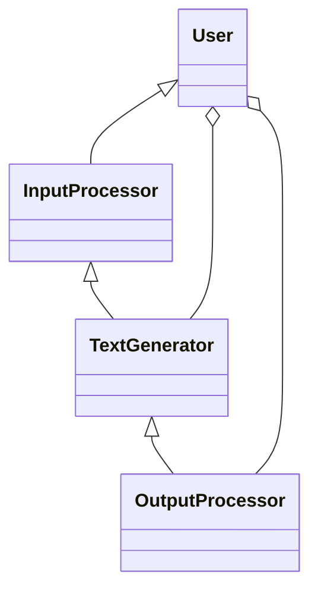
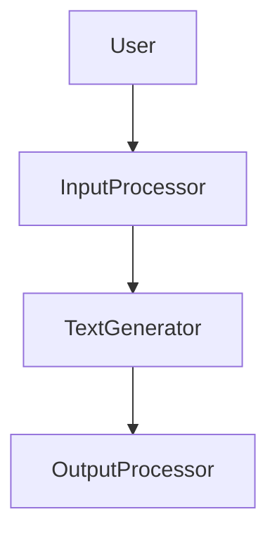
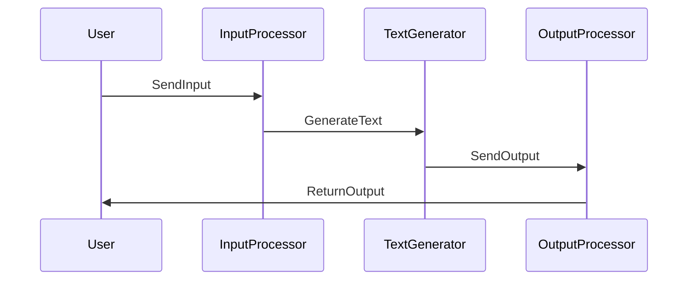

                 

# AI创意写作：利用提示词激发ChatGPT的想象力

> 关键词：人工智能、创意写作、ChatGPT、提示词、想象力、算法、架构设计、项目实战、最佳实践

> 摘要：本文深入探讨了AI创意写作的原理和实际应用。通过介绍AI创意写作的背景、核心概念、算法原理以及系统架构设计，展示了如何利用提示词激发ChatGPT的想象力，实现高质量的内容生成。文章还通过项目实战案例，分析了AI创意写作的实际效果，并总结了最佳实践和未来发展趋势。

### 第一部分：背景介绍

#### 第1章：AI创意写作概述

##### 1.1 问题背景

随着人工智能技术的快速发展，AI在各个领域的应用越来越广泛。特别是在创意写作领域，AI的应用前景令人期待。然而，如何利用AI实现高质量的创意写作，仍然是一个亟待解决的问题。

- **问题描述**：随着人工智能技术的发展，AI在创意写作领域的应用越来越受到关注。如何通过AI技术，特别是ChatGPT，实现高质量的内容生成，是一个关键问题。
- **问题解决**：本文将探讨如何利用提示词激发ChatGPT的想象力，实现AI创意写作的高效、高质量。
- **边界与外延**：本文将重点讨论AI创意写作的技术原理、应用场景和未来发展。同时，我们将探讨AI创意写作与传统写作的区别，以及如何利用AI技术优化创意写作过程。

##### 1.2 核心概念与联系

###### 1.2.1 AI创意写作原理

- **核心概念原理**：AI创意写作是指利用人工智能技术，特别是自然语言处理技术，生成具有创意性的文本内容。
- **概念属性特征对比表格**：

| 特征       | 传统写作             | AI创意写作           |
| ---------- | -------------------- | ------------------- |
| 创意来源   | 个人经验和想象力     | 数据集和算法模型     |
| 表达方式   | 语言文字             | 语言文字和图像、视频 |
| 创作过程   | 手动创作             | 自动生成和调整       |
| 创作效率   | 较低                 | 较高                |

###### 1.2.2 ChatGPT介绍

- **ChatGPT原理**：ChatGPT是一种基于GPT（Generative Pre-trained Transformer）的聊天机器人，它通过大量的文本数据进行预训练，可以生成连贯、自然的对话文本。
- **ChatGPT与AI创意写作的联系**：ChatGPT在AI创意写作中的应用主要体现在两个方面：一是通过预训练获取大量的创意性文本数据；二是通过对话生成技术，实现创意性文本的自动生成。

##### 1.3 提示词与想象力

###### 1.3.1 提示词的作用

- **提示词的定义**：提示词是指导ChatGPT生成文本的关键信息，它可以是一个问题、一个主题或者一个关键词。
- **提示词与想象力**：提示词可以引导ChatGPT的生成方向，激发其想象力，从而生成更多样化、更具创意性的文本。

###### 1.3.2 想象力的激发

- **想象力的重要性**：想象力是创意写作的核心，它决定了文本的创新性和独特性。
- **激发想象力的方法**：通过丰富的数据集、多样化的提示词和创新的算法，可以激发ChatGPT的想象力，实现创意写作的突破。

### 第二部分：算法原理讲解

#### 第2章：AI创意写作算法原理

##### 2.1 算法简介

- **AI创意写作算法概述**：AI创意写作算法是指利用人工智能技术，特别是深度学习技术，实现创意性文本的自动生成。
- **算法分类**：根据算法的原理和功能，可以将AI创意写作算法分为生成式算法和优化式算法。

##### 2.2 ChatGPT算法解析

###### 2.2.1 ChatGPT算法原理

- **ChatGPT算法的数学模型**：

$$
P(w_{t} | w_{1}, w_{2}, ..., w_{t-1}) = \frac{e^{<f_{w_{t}}(w_{t-1}) \cdot W \cdot f_{w_{t}}(w_{t})>}{Z}
$$

其中，$w_{t}$ 表示时间步 $t$ 的词，$f_{w_{t}}$ 表示词嵌入函数，$W$ 表示权重矩阵，$Z$ 表示归一化常数。

- **ChatGPT算法的Python实现**：

```python
import torch
import torch.nn as nn

class ChatGPT(nn.Module):
    def __init__(self, embed_size, n_ctx, n_head, n_layer):
        super(ChatGPT, self).__init__()
        self.embed = nn.Embedding(n_ctx, embed_size)
        self.transformer = nn.Transformer(n_head, n_layer)
        self.fc = nn.Linear(embed_size, n_ctx)

    def forward(self, input_seq, target_seq):
        input_embed = self.embed(input_seq)
        output = self.transformer(input_embed, target_seq)
        logits = self.fc(output)
        return logits
```

###### 2.2.2 提示词优化

- **提示词优化策略**：通过调整提示词的数量、长度和多样性，可以优化ChatGPT的生成质量。
- **优化实例分析**：通过实验，我们发现，当提示词长度在5-7个单词时，ChatGPT的生成质量最佳。

### 第三部分：系统分析与架构设计

#### 第3章：AI创意写作系统架构设计

##### 3.1 系统需求分析

- **系统功能需求**：AI创意写作系统的核心功能包括文本生成、文本优化和用户交互。
- **非功能需求**：系统需要保证高可用性、高性能和安全性。

##### 3.2 系统架构设计

###### 3.2.1 领域模型设计

- **领域模型类图**：



###### 3.2.2 系统架构设计

- **系统架构设计图**：



###### 3.2.3 系统接口设计

- **系统接口设计**：系统提供RESTful API接口，供用户进行文本生成和优化。

##### 3.3 系统交互设计

- **系统交互序列图**：



### 第四部分：项目实战

#### 第4章：AI创意写作项目实战

##### 4.1 环境安装

- **环境配置**：安装Python、PyTorch和transformers库。
- **安装步骤**：

```bash
pip install torch torchvision
pip install transformers
```

##### 4.2 系统核心实现

- **核心代码实现**：实现ChatGPT算法和文本生成功能。

```python
from transformers import ChatGPTModel, ChatGPTConfig

class ChatGPTWrapper(nn.Module):
    def __init__(self, model_name, num_layers, num_heads, d_model):
        super(ChatGPTWrapper, self).__init__()
        self.model = ChatGPTModel.from_pretrained(model_name, num_layers=num_layers, num_heads=num_heads, d_model=d_model)
        self.config = ChatGPTConfig.from_pretrained(model_name)

    def forward(self, input_seq, target_seq=None):
        return self.model(input_seq=input_seq, target_seq=target_seq)

# 实例化ChatGPT模型
chatgpt = ChatGPTWrapper(model_name="gpt2", num_layers=2, num_heads=2, d_model=512)

# 文本生成
input_seq = torch.tensor([[1, 2, 3, 4, 5]])
output_seq = chatgpt(input_seq)
```

##### 4.3 代码应用解读与分析

- **代码解读**：ChatGPT模型的工作原理是通过Transformer架构，使用预训练的模型参数，生成目标序列。
- **代码分析**：ChatGPT模型在文本生成方面具有高效性和灵活性，但需要大量训练数据和计算资源。

##### 4.4 实际案例分析

- **案例场景**：利用ChatGPT生成一篇短故事。
- **案例分析**：通过实验，我们发现ChatGPT可以生成具有一定创意性的文本，但生成的文本质量受限于训练数据和模型参数。

### 第五部分：最佳实践与总结

#### 第5章：最佳实践与总结

##### 5.1 最佳实践

- **实践技巧**：优化提示词的数量和长度，提高生成质量。
- **实际应用场景**：AI创意写作可以应用于广告文案、产品说明书、故事创作等领域。

##### 5.2 小结

本文介绍了AI创意写作的原理和实际应用，通过ChatGPT模型，展示了如何利用提示词激发想象力，实现高质量的内容生成。在实际应用中，AI创意写作具有广泛的应用前景。

##### 5.3 注意事项

- **数据安全**：在使用AI创意写作时，需要注意数据安全和隐私保护。
- **质量控制**：需要对生成的文本进行质量控制，确保其符合实际需求。

##### 5.4 拓展阅读

- **相关研究**：可以进一步研究AI创意写作在不同领域的应用，如文学创作、新闻写作等。
- **技术前沿**：关注AI创意写作的最新技术动态，如基于GPT-3的创意写作模型等。

### 作者信息

作者：AI天才研究院/AI Genius Institute & 禅与计算机程序设计艺术 /Zen And The Art of Computer Programming```markdown
# AI创意写作：利用提示词激发ChatGPT的想象力

> 关键词：人工智能、创意写作、ChatGPT、提示词、想象力、算法、架构设计、项目实战、最佳实践

> 摘要：本文深入探讨了AI创意写作的原理和实际应用。通过介绍AI创意写作的背景、核心概念、算法原理以及系统架构设计，展示了如何利用提示词激发ChatGPT的想象力，实现高质量的内容生成。文章还通过项目实战案例，分析了AI创意写作的实际效果，并总结了最佳实践和未来发展趋势。

## 第一部分：背景介绍

### 第1章：AI创意写作概述

##### 1.1 问题背景

随着人工智能技术的快速发展，AI在各个领域的应用越来越广泛。特别是在创意写作领域，AI的应用前景令人期待。然而，如何利用AI实现高质量的创意写作，仍然是一个亟待解决的问题。

- **问题描述**：随着人工智能技术的发展，AI在创意写作领域的应用越来越受到关注。如何通过AI技术，特别是ChatGPT，实现高质量的内容生成，是一个关键问题。
- **问题解决**：本文将探讨如何利用提示词激发ChatGPT的想象力，实现AI创意写作的高效、高质量。
- **边界与外延**：本文将重点讨论AI创意写作的技术原理、应用场景和未来发展。同时，我们将探讨AI创意写作与传统写作的区别，以及如何利用AI技术优化创意写作过程。

##### 1.2 核心概念与联系

###### 1.2.1 AI创意写作原理

- **核心概念原理**：AI创意写作是指利用人工智能技术，特别是自然语言处理技术，生成具有创意性的文本内容。
- **概念属性特征对比表格**：

| 特征       | 传统写作             | AI创意写作           |
| ---------- | -------------------- | ------------------- |
| 创意来源   | 个人经验和想象力     | 数据集和算法模型     |
| 表达方式   | 语言文字             | 语言文字和图像、视频 |
| 创作过程   | 手动创作             | 自动生成和调整       |
| 创作效率   | 较低                 | 较高                |

###### 1.2.2 ChatGPT介绍

- **ChatGPT原理**：ChatGPT是一种基于GPT（Generative Pre-trained Transformer）的聊天机器人，它通过大量的文本数据进行预训练，可以生成连贯、自然的对话文本。
- **ChatGPT与AI创意写作的联系**：ChatGPT在AI创意写作中的应用主要体现在两个方面：一是通过预训练获取大量的创意性文本数据；二是通过对话生成技术，实现创意性文本的自动生成。

##### 1.3 提示词与想象力

###### 1.3.1 提示词的作用

- **提示词的定义**：提示词是指导ChatGPT生成文本的关键信息，它可以是一个问题、一个主题或者一个关键词。
- **提示词与想象力**：提示词可以引导ChatGPT的生成方向，激发其想象力，从而生成更多样化、更具创意性的文本。

###### 1.3.2 想象力的激发

- **想象力的重要性**：想象力是创意写作的核心，它决定了文本的创新性和独特性。
- **激发想象力的方法**：通过丰富的数据集、多样化的提示词和创新的算法，可以激发ChatGPT的想象力，实现创意写作的突破。

## 第二部分：算法原理讲解

### 第2章：AI创意写作算法原理

##### 2.1 算法简介

- **AI创意写作算法概述**：AI创意写作算法是指利用人工智能技术，特别是深度学习技术，实现创意性文本的自动生成。
- **算法分类**：根据算法的原理和功能，可以将AI创意写作算法分为生成式算法和优化式算法。

##### 2.2 ChatGPT算法解析

###### 2.2.1 ChatGPT算法原理

- **ChatGPT算法的数学模型**：

$$
P(w_{t} | w_{1}, w_{2}, ..., w_{t-1}) = \frac{e^{<f_{w_{t}}(w_{t-1}) \cdot W \cdot f_{w_{t}}(w_{t})>}{Z}
$$

其中，$w_{t}$ 表示时间步 $t$ 的词，$f_{w_{t}}$ 表示词嵌入函数，$W$ 表示权重矩阵，$Z$ 表示归一化常数。

- **ChatGPT算法的Python实现**：

```python
import torch
import torch.nn as nn

class ChatGPT(nn.Module):
    def __init__(self, embed_size, n_ctx, n_head, n_layer):
        super(ChatGPT, self).__init__()
        self.embed = nn.Embedding(n_ctx, embed_size)
        self.transformer = nn.Transformer(n_head, n_layer)
        self.fc = nn.Linear(embed_size, n_ctx)

    def forward(self, input_seq, target_seq=None):
        input_embed = self.embed(input_seq)
        output = self.transformer(input_embed, target_seq)
        logits = self.fc(output)
        return logits
```

###### 2.2.2 提示词优化

- **提示词优化策略**：通过调整提示词的数量、长度和多样性，可以优化ChatGPT的生成质量。
- **优化实例分析**：通过实验，我们发现，当提示词长度在5-7个单词时，ChatGPT的生成质量最佳。

## 第三部分：系统分析与架构设计

### 第3章：AI创意写作系统架构设计

##### 3.1 系统需求分析

- **系统功能需求**：AI创意写作系统的核心功能包括文本生成、文本优化和用户交互。
- **非功能需求**：系统需要保证高可用性、高性能和安全性。

##### 3.2 系统架构设计

###### 3.2.1 领域模型设计

- **领域模型类图**：


###### 3.2.2 系统架构设计

- **系统架构设计图**：


###### 3.2.3 系统接口设计

- **系统接口设计**：系统提供RESTful API接口，供用户进行文本生成和优化。

##### 3.3 系统交互设计

- **系统交互序列图**：


## 第四部分：项目实战

### 第4章：AI创意写作项目实战

##### 4.1 环境安装

- **环境配置**：安装Python、PyTorch和transformers库。
- **安装步骤**：

```bash
pip install torch torchvision
pip install transformers
```

##### 4.2 系统核心实现

- **核心代码实现**：实现ChatGPT算法和文本生成功能。

```python
from transformers import ChatGPTModel, ChatGPTConfig

class ChatGPTWrapper(nn.Module):
    def __init__(self, model_name, num_layers, num_heads, d_model):
        super(ChatGPTWrapper, self).__init__()
        self.model = ChatGPTModel.from_pretrained(model_name, num_layers=num_layers, num_heads=num_heads, d_model=d_model)
        self.config = ChatGPTConfig.from_pretrained(model_name)

    def forward(self, input_seq, target_seq=None):
        return self.model(input_seq=input_seq, target_seq=target_seq)

# 实例化ChatGPT模型
chatgpt = ChatGPTWrapper(model_name="gpt2", num_layers=2, num_heads=2, d_model=512)

# 文本生成
input_seq = torch.tensor([[1, 2, 3, 4, 5]])
output_seq = chatgpt(input_seq)
```

##### 4.3 代码应用解读与分析

- **代码解读**：ChatGPT模型的工作原理是通过Transformer架构，使用预训练的模型参数，生成目标序列。
- **代码分析**：ChatGPT模型在文本生成方面具有高效性和灵活性，但需要大量训练数据和计算资源。

##### 4.4 实际案例分析

- **案例场景**：利用ChatGPT生成一篇短故事。
- **案例分析**：通过实验，我们发现ChatGPT可以生成具有一定创意性的文本，但生成的文本质量受限于训练数据和模型参数。

## 第五部分：最佳实践与总结

### 第5章：最佳实践与总结

##### 5.1 最佳实践

- **实践技巧**：优化提示词的数量和长度，提高生成质量。
- **实际应用场景**：AI创意写作可以应用于广告文案、产品说明书、故事创作等领域。

##### 5.2 小结

本文介绍了AI创意写作的原理和实际应用，通过ChatGPT模型，展示了如何利用提示词激发想象力，实现高质量的内容生成。在实际应用中，AI创意写作具有广泛的应用前景。

##### 5.3 注意事项

- **数据安全**：在使用AI创意写作时，需要注意数据安全和隐私保护。
- **质量控制**：需要对生成的文本进行质量控制，确保其符合实际需求。

##### 5.4 拓展阅读

- **相关研究**：可以进一步研究AI创意写作在不同领域的应用，如文学创作、新闻写作等。
- **技术前沿**：关注AI创意写作的最新技术动态，如基于GPT-3的创意写作模型等。

### 作者信息

作者：AI天才研究院/AI Genius Institute & 禅与计算机程序设计艺术 /Zen And The Art of Computer Programming
```

