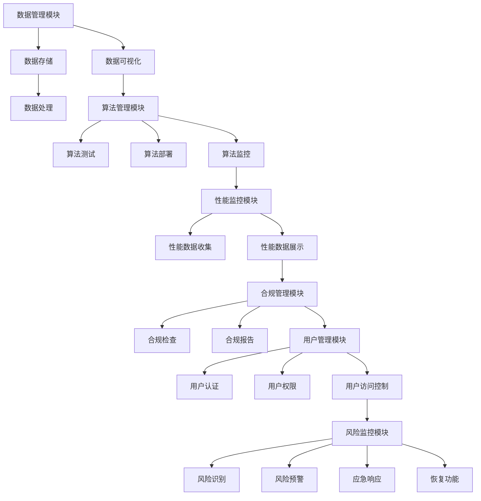

                 

### 1.1 研究背景与意义

#### AI治理的定义与重要性

人工智能（AI）作为当前技术发展的前沿，正深刻地改变着我们的生活、工作和社会。AI治理则是指在AI系统的开发、部署和应用过程中，通过制定和执行一系列法律、伦理和运营策略，以确保AI系统在社会中的合法、公正、透明和有效运行。AI治理的重要性体现在以下几个方面：

首先，从法律角度来看，AI系统的广泛应用带来了前所未有的数据隐私和安全风险。例如，智能监控系统、个性化广告推送、自动化金融交易等都涉及到大量的个人数据。如果没有有效的法律监管，这些数据可能会被滥用，侵犯用户的隐私权。因此，法律合规成为AI治理的重要组成部分。

其次，从伦理角度来看，AI系统在某些情况下可能会表现出偏见或歧视。例如，基于机器学习的招聘系统可能会无意中放大性别、种族或年龄偏见。伦理问题关乎社会公平和正义，必须通过伦理审查和道德规范来确保AI系统不会对社会造成负面影响。

最后，从运营绩效角度来看，AI系统的稳定性和可靠性对于企业和社会至关重要。一个高效的AI治理平台能够确保AI系统在正常运行的同时，最大限度地发挥其性能，减少故障和错误的发生。

#### AI治理的挑战与机遇

尽管AI治理的重要性不言而喻，但现实中仍面临着诸多挑战：

1. **法律合规难题**：不同的国家和地区对于AI的法律规定存在差异，这给全球范围内的AI治理带来了复杂性。例如，欧盟的《通用数据保护条例》（GDPR）对于数据隐私保护有着严格的要求，而美国的法律框架则更注重消费者权益保护。

2. **伦理规范争议**：AI伦理问题的复杂性使得建立普遍适用的伦理规范变得困难。例如，如何界定AI系统的责任和道德义务，如何确保AI系统在决策过程中公平公正，这些都是亟待解决的问题。

3. **技术实现难题**：AI治理平台需要整合多种技术，包括数据管理、算法评估、风险监控等。这些技术的复杂性要求治理平台的设计者和实施者具备高水平的技术能力和专业知识。

然而，挑战同时也伴随着机遇：

1. **技术创新**：随着AI技术的不断进步，新的治理工具和平台不断涌现，为AI治理提供了更多的可能性。例如，区块链技术可以用于提高AI系统的透明度和可追溯性。

2. **跨学科合作**：AI治理需要法律、伦理、计算机科学、心理学等多学科的合作。这种跨学科的合作不仅有助于解决AI治理中的复杂问题，还可以推动相关领域的创新发展。

3. **政策支持**：各国政府和国际组织对于AI治理的重视程度不断提高，出台了一系列政策和支持措施，为AI治理的推进提供了有力保障。

#### 研究意义

本研究旨在深入探讨AI治理平台的设计、实施与运营，为应对当前AI治理中的挑战提供理论指导和实践参考。具体研究意义如下：

1. **理论意义**：通过对AI治理的深入分析，本研究将丰富和拓展现有的AI治理理论体系，为后续研究提供理论基础。

2. **实践意义**：本研究将探讨AI治理平台在实际应用中的具体实现方法和最佳实践，为企业和组织提供可操作的治理方案。

3. **社会意义**：通过有效的AI治理，可以确保AI系统在社会中的合法、公正和有效运行，促进社会公平和科技进步。

综上所述，AI治理的重要性不容忽视，其面临的挑战和机遇同样显著。本研究将致力于解决这些问题，推动AI治理的发展，为建设一个更加智能化、公正、安全的社会贡献力量。

### 1.2 AI治理的挑战与机遇

#### 法律合规挑战

AI治理中的法律合规问题是不可忽视的挑战之一。首先，全球范围内的法律框架对于AI系统的监管存在显著差异。以数据隐私为例，欧盟的《通用数据保护条例》（GDPR）对数据保护有着严格的规定，要求企业在处理个人数据时必须获得用户明确同意，并对数据泄露事件进行迅速响应和报告。而美国的法律则更注重消费者权益保护，如《加州消费者隐私法案》（CCPA），强调消费者的数据知情权和删除权。

这种法律环境的不一致性给全球范围内的AI治理带来了复杂性。企业需要在不同的国家和地区遵守不同的法律法规，这不仅增加了合规成本，也增加了合规风险。例如，一家在全球多个国家和地区运营的互联网公司，需要同时满足GDPR和CCPA的要求，这需要其制定一套统一的合规策略，并在实际运营中严格执行。

此外，AI系统的法律合规问题还涉及到技术实现层面。例如，AI系统在处理个人数据时，需要采取数据加密、匿名化等技术手段，以确保数据的安全性和隐私性。然而，这些技术的实现复杂，且在不同的应用场景中可能需要不同的解决方案。这就要求企业在开发AI系统时，不仅要具备技术能力，还要具备法律意识，以确保系统的设计和实现符合相关法律法规的要求。

#### 伦理规范争议

AI治理中的伦理规范争议同样复杂且具有挑战性。AI伦理问题主要涉及以下几个核心议题：

1. **公平性和无偏见**：AI系统在决策过程中，可能会因为数据集的不平衡或算法的设计缺陷，导致性别、种族、年龄等方面的偏见。例如，某些招聘系统的算法可能会无意中排斥某个性别或种族的候选人。如何确保AI系统的公平性和无偏见，是一个亟待解决的伦理问题。

2. **透明度和可解释性**：AI系统的决策过程往往复杂且不透明，这给用户和监管机构带来了挑战。例如，深度学习模型的内部工作原理高度复杂，使得普通用户难以理解其决策过程。如何提高AI系统的透明度和可解释性，使其决策过程更加公正和可信，是AI伦理治理的重要内容。

3. **责任归属**：当AI系统发生错误或造成损失时，如何界定责任归属是一个复杂的问题。例如，自动驾驶汽车发生交通事故，是驾驶员的责任、AI系统的责任，还是两者的共同责任？这一问题不仅涉及法律问题，也涉及到伦理问题，需要通过伦理规范来明确。

此外，AI伦理问题的复杂性还体现在其跨学科特性上。AI伦理不仅涉及计算机科学，还涉及法律、心理学、社会学等多个领域。这要求在制定AI伦理规范时，需要多学科合作，共同探讨和解决伦理问题。

#### 技术实现难题

AI治理平台的技术实现难题同样不可忽视。首先，AI治理平台需要整合多种技术，如数据管理、算法评估、风险监控等。这些技术的整合不仅要求技术团队具备高水平的专业知识，还需要具备跨学科的合作能力。

其次，AI治理平台的技术实现需要考虑多方面的需求。例如，在数据管理方面，需要确保数据的安全性和隐私性；在算法评估方面，需要建立有效的评估机制，确保AI系统的性能和可靠性；在风险监控方面，需要实时监控系统的运行状态，及时发现并处理潜在的风险。

此外，AI治理平台的技术实现还需要考虑到系统的可扩展性和灵活性。随着AI技术的不断进步和应用场景的多样化，AI治理平台需要能够快速适应新的需求和技术变化，这要求其设计者具备前瞻性和创新性。

#### 技术创新带来的机遇

尽管AI治理面临着诸多挑战，但技术创新也为AI治理带来了新的机遇。首先，新技术的出现，如区块链技术，为AI治理提供了新的工具和方法。区块链技术可以用于提高AI系统的透明度和可追溯性，确保数据的真实性和安全性。例如，通过在区块链上记录AI系统的训练数据和决策过程，可以提高系统的透明度和可解释性，增强用户对AI系统的信任。

其次，技术创新还促进了跨学科的合作。例如，计算机科学、法律、伦理、心理学等领域的交叉研究，可以推动AI伦理和法律的进步，为AI治理提供更加全面和有效的解决方案。例如，通过结合心理学研究的成果，可以更好地理解用户的行为和需求，从而设计出更加公平和人性化的AI系统。

最后，技术创新还为AI治理提供了更多的可能性。例如，人工智能算法的不断优化，可以提高AI系统的性能和效率，降低系统的错误率；新的人工智能框架和工具的出现，可以简化AI系统的开发过程，提高开发效率和系统质量。

总之，AI治理的挑战与机遇并存。面对这些挑战，我们需要不断推动技术创新，加强跨学科合作，制定和完善相关法律法规，共同推动AI治理的发展，为建设一个更加智能、公正、安全的社会贡献力量。

### 1.3 本书结构安排

为了系统地探讨AI治理平台的设计、实施与运营，本书将分为四个主要部分，分别从不同的角度深入分析AI治理的各个方面。具体结构安排如下：

#### 第一部分：引言与背景

本部分包括第1章和第2章，旨在为读者提供一个全面的背景介绍和理论基础。

- **第1章：引言**，主要介绍AI治理的概念、重要性以及本书的研究目的和结构安排。
- **第2章：AI治理的概念与框架**，详细阐述AI治理的基本概念、国际框架与标准，以及AI治理的主要组成部分和关键原则。

#### 第二部分：法律合规

本部分包括第3章到第5章，重点探讨AI治理中的法律问题、伦理问题以及运营绩效管理。

- **第3章：AI治理中的法律问题**，分析AI法律合规的挑战，包括数据隐私保护、AI歧视与公平性、法律责任与责任主体，并通过案例分析展示合规实践。
- **第4章：AI伦理与道德问题**，探讨AI伦理的基本原则、主要议题、伦理审查机制，以及伦理决策工具与方法，通过案例分析展示伦理实践。
- **第5章：AI运营绩效管理**，介绍AI运营绩效的关键指标、性能监测与评估、系统可靠性保障、安全性与风险管理，并通过案例分析展示运营绩效管理实践。

#### 第三部分：实践与应用

本部分包括第6章到第7章，重点介绍AI治理平台的设计与实现、最佳实践与未来展望。

- **第6章：AI治理平台设计与实现**，详细阐述AI治理平台的概念与功能、设计原则、技术架构和核心模块，并通过案例分析展示应用实践。
- **第7章：AI治理的最佳实践与未来展望**，总结AI治理的最佳实践经验，探讨未来趋势与挑战，以及创新方向和法规政策展望，并通过案例分析展示跨领域应用。

#### 第四部分：结束语

本部分包括第8章，主要对全书进行总结与展望。

- **第8章：总结与展望**，总结本书的核心观点，回顾AI治理的现状与未来发展，提出研究展望与未来工作，并对读者提出一些建议。

通过以上结构安排，本书旨在为读者提供一个全面、系统的AI治理知识体系，帮助读者深入理解AI治理的核心概念和实践方法，为实际应用提供参考和指导。希望读者能够在阅读本书的过程中，对AI治理有更加清晰的认识，并为推动AI治理的发展贡献力量。

### 1.4 AI治理的概念与框架

#### AI治理的基本概念

AI治理是指在整个AI系统生命周期中，通过制定和执行一系列法律、伦理和运营策略，确保AI系统的合法、公正、透明和有效运行。它不仅包括对AI系统的法律合规和伦理规范，还涵盖了运营绩效的管理。具体来说，AI治理的基本概念包括以下几个方面：

1. **合法性**：确保AI系统的开发、部署和应用过程符合相关的法律法规，保护用户隐私和数据安全，防止滥用和误用。
2. **公正性**：确保AI系统在决策过程中不会因为算法偏差或数据集不均衡导致性别、种族、年龄等方面的偏见，实现公平公正的决策。
3. **透明性**：提高AI系统的可解释性和透明度，使AI系统的决策过程更加透明和可理解，增强用户对系统的信任。
4. **效率与效能**：通过有效的运营管理，确保AI系统的稳定性和可靠性，最大化其性能和效益。

#### AI治理的主要组成部分

AI治理主要包括以下几个核心组成部分：

1. **法律合规**：涉及数据隐私保护、AI歧视防范、法律责任界定等方面，确保AI系统的开发和运营符合相关法律法规。
2. **伦理规范**：涉及公平性、无偏见、透明性等方面，确保AI系统的设计、开发和应用符合伦理要求，不损害社会公共利益。
3. **运营绩效管理**：涉及AI系统的性能监测、评估和优化，确保AI系统的稳定运行和高性能输出。
4. **技术实现**：涉及AI治理平台的设计与实现，包括数据管理、算法评估、风险监控等技术模块。

#### AI治理的关键原则

AI治理的关键原则主要包括以下几个方面：

1. **全局性原则**：AI治理需要从整体上考虑系统的设计、开发和运营，确保各个部分相互协调，共同实现治理目标。
2. **动态性原则**：AI治理需要根据AI技术的发展和应用场景的变化，不断调整和优化治理策略，以应对新的挑战和问题。
3. **协同性原则**：AI治理需要多部门、多学科的合作，共同解决治理中的复杂问题，实现治理效果的最大化。
4. **可追溯性原则**：AI治理需要确保AI系统的操作过程和决策过程具有可追溯性，便于审查和监督。

#### 国际框架与标准

全球范围内的AI治理正在逐步形成一些重要的国际框架和标准，这些框架和标准为各国和组织的AI治理提供了指导和参考。以下是一些主要的国际框架和标准：

1. **联合国数字合作高级别小组**：该小组发布的《人工智能全球契约》提出了AI治理的十项原则，包括尊重人权、维护民主、促进包容性和可持续发展等。
2. **欧盟的《人工智能法案》**：该法案旨在制定欧盟范围内的AI治理框架，包括对高风险AI系统的监管、透明度和伦理审查要求。
3. **美国的《AI未来法案》**：该法案提出了AI治理的多个方面，包括数据隐私、透明度、责任和公平性，旨在确保AI系统的安全、可靠和公平。

这些国际框架和标准为全球范围内的AI治理提供了重要的参考，有助于促进各国在AI治理方面的合作和协调。同时，各国和组织也在根据自身的实际情况，制定和实施符合自身需求的AI治理政策和措施。

综上所述，AI治理是一个复杂而重要的领域，其核心概念、框架和关键原则为我们提供了理解和实施AI治理的理论基础。通过深入探讨AI治理的基本概念和框架，我们可以更好地应对AI治理中的挑战，推动AI技术的健康发展，为社会创造更多的价值。

### 1.5 AI治理在AI系统生命周期中的具体应用

AI治理是一个贯穿于AI系统整个生命周期的过程，从系统的构思、开发、部署到运营和维护，每个阶段都需要进行相应的治理活动。下面我们将详细探讨AI治理在AI系统生命周期中的具体应用。

#### 构思阶段

在AI系统的构思阶段，治理活动主要集中在确定系统的目标和范围，以及识别可能的法律、伦理和运营风险。具体来说，需要考虑以下几个关键点：

1. **目标明确**：确保AI系统的目标与组织的使命和战略一致，同时符合社会和法律法规的要求。例如，在开发一个智能招聘系统时，需要确保其目标是在确保公平和效率的前提下，提高招聘质量。
   
2. **风险评估**：对系统可能涉及的法律、伦理和运营风险进行初步识别和评估。例如，评估系统是否会涉及个人数据的处理，是否存在隐私泄露的风险；系统是否会因为算法偏见而导致不公平的招聘结果。

3. **资源规划**：确保有足够的资源来支持后续的治理工作，包括人力、技术资源和预算。例如，建立一个伦理审查委员会，确保在系统开发过程中能够充分考虑伦理问题。

#### 开发阶段

在AI系统的开发阶段，治理活动主要集中在确保系统的法律合规性、伦理规范性和技术实现的可行性。具体包括以下几个方面的内容：

1. **法律合规**：确保系统的设计、开发和实现过程符合相关法律法规，特别是数据保护、隐私保护、公平性等方面的要求。例如，对于涉及个人数据的AI系统，需要设计合适的数据保护机制，确保数据的安全性和隐私性。

2. **伦理规范**：在系统设计和开发过程中，需要不断进行伦理审查，确保系统的决策过程不会导致偏见和歧视。例如，通过使用多样化的数据集来训练算法，减少性别、种族等方面的偏见。

3. **技术实现**：确保AI系统的实现符合既定的治理目标和要求。例如，通过采用透明的算法和可解释性技术，提高系统的透明度和可解释性，便于用户和监管机构的监督。

4. **协作与沟通**：在开发过程中，需要建立跨部门、跨学科的合作机制，确保法律、伦理和技术团队之间的沟通和协作。例如，定期召开会议，讨论系统的法律合规、伦理问题和技术实现方案。

#### 部署阶段

在AI系统的部署阶段，治理活动主要集中在确保系统的合法合规、有效运行和用户信任。具体包括以下几个方面的内容：

1. **合规审查**：在系统部署前，进行全面的合规审查，确保系统符合所有相关的法律法规和伦理规范。例如，通过外部审计机构对系统的隐私保护、数据安全等方面进行审查。

2. **用户培训**：为用户和操作人员提供必要的培训，确保他们了解系统的功能、操作流程以及相关的法律和伦理要求。例如，组织用户培训课程，介绍系统的操作方法和隐私保护措施。

3. **透明度和信息披露**：在系统部署过程中，需要向用户和监管机构提供充分的透明度和信息披露，确保他们对系统的运行有充分的了解。例如，在系统上线前，发布一份详细的用户隐私政策，明确数据的使用目的和范围。

#### 运营阶段

在AI系统的运营阶段，治理活动主要集中在确保系统的稳定运行、性能优化和持续改进。具体包括以下几个方面的内容：

1. **性能监测与评估**：通过实时监测和评估系统的性能，及时发现并解决潜在的问题。例如，定期进行系统性能测试，确保系统的响应速度和准确性。

2. **风险管理**：建立完善的风险管理体系，对系统的运行风险进行识别、评估和监控。例如，定期进行风险评估会议，讨论系统面临的潜在风险和应对策略。

3. **数据安全和隐私保护**：持续监控系统的数据安全和隐私保护情况，确保数据在传输和存储过程中的安全性和隐私性。例如，定期进行数据加密和安全审计。

4. **用户反馈与改进**：及时收集用户的反馈，并根据反馈对系统进行改进。例如，通过用户满意度调查和反馈渠道，了解用户的需求和意见，优化系统的功能和用户体验。

#### 维护阶段

在AI系统的维护阶段，治理活动主要集中在确保系统的长期稳定运行和持续改进。具体包括以下几个方面的内容：

1. **系统升级与更新**：定期对系统进行升级和更新，确保其与最新的技术标准和法律法规保持一致。例如，随着新技术的出现和法律法规的更新，及时对系统进行必要的调整和优化。

2. **文档管理**：建立完善的文档管理体系，确保系统的开发文档、操作手册和用户手册等文档的完整性和准确性。例如，定期更新和维护系统文档，确保文档内容与系统实际状态一致。

3. **备份与恢复**：建立系统的备份和恢复机制，确保在系统出现故障或数据丢失时，能够及时恢复系统正常运行。例如，定期进行数据备份，并测试备份的恢复过程。

通过在AI系统生命周期的各个阶段进行全面的治理活动，可以确保AI系统的合法、公正、透明和有效运行，提高系统的性能和用户满意度，为企业和组织创造更大的价值。

### 1.6 法律合规在AI治理中的重要性

法律合规是AI治理中的重要组成部分，它确保AI系统的开发和部署符合现行的法律法规，保护用户的合法权益，防止隐私泄露和滥用，同时降低企业的法律风险。在AI治理中，法律合规的重要性体现在以下几个方面：

#### 数据隐私保护

随着AI技术的普及，大量个人数据被收集、处理和应用。如何确保这些数据的安全和隐私成为AI治理中的一个关键问题。法律合规在这方面发挥着重要作用。例如，欧盟的《通用数据保护条例》（GDPR）对个人数据的收集、存储、处理和传输设定了严格的规范。AI系统在处理个人数据时，需要遵循这些规定，如获得用户的明确同意、数据匿名化、数据泄露通知等。通过法律合规，可以有效地保护用户的隐私权，增强用户对AI系统的信任。

#### 防止歧视和偏见

AI系统在决策过程中可能会出现性别、种族、年龄等方面的歧视和偏见，这不仅违反了伦理规范，也可能导致法律问题。法律合规要求企业在开发AI系统时，必须进行严格的公平性测试和评估，确保系统不会对特定群体产生歧视。例如，美国的《民权法案》第七章禁止在就业、教育、住房等方面基于性别、种族、年龄等因素进行歧视。通过法律合规，企业可以确保AI系统在决策过程中公平公正，避免因算法偏见引发的法律纠纷。

#### 法律责任界定

在AI系统中，当发生错误或造成损失时，如何界定责任是一个复杂的问题。法律合规提供了明确的责任界定框架，帮助企业和用户在发生争议时明确责任归属。例如，如果自动驾驶汽车发生交通事故，法律合规要求企业必须证明其系统的设计和实现符合相关标准和要求，否则可能需要承担法律责任。通过法律合规，可以降低企业因AI系统引发的法律风险，同时保护用户的合法权益。

#### 促进技术创新

法律合规不仅是对AI系统的约束，也是对AI技术的促进。通过制定合理的法律法规，可以鼓励企业进行创新，开发出更加安全、可靠和公平的AI系统。例如，欧盟的《人工智能法案》通过鼓励技术创新，同时也对高风险AI系统进行了严格的监管。通过法律合规，可以推动AI技术的健康发展，为社会创造更多的价值。

#### 国际合作与协调

全球范围内的AI治理面临法律环境不一致的挑战。通过国际合作与协调，制定统一的法律法规，可以减少跨国家地区的法律合规难题。例如，联合国数字合作高级别小组发布的《人工智能全球契约》旨在推动全球范围内的AI治理合作，为各国制定和执行法律合规提供指导。通过国际合作与协调，可以促进全球AI治理的协同发展，共同应对AI治理中的挑战。

总之，法律合规在AI治理中具有至关重要的作用。它不仅保护了用户的隐私和数据安全，防止了歧视和偏见，明确了法律责任，促进了技术创新，还通过国际合作与协调，推动了全球AI治理的健康发展。通过全面的法律合规，AI技术可以更好地服务于社会，推动社会进步和可持续发展。

### 1.7 AI伦理与道德问题在AI治理中的重要性

AI伦理与道德问题是AI治理中不可忽视的核心组成部分，它关乎AI系统的公正性、透明性和用户信任。在AI系统的开发、部署和应用过程中，伦理问题不仅影响系统的社会影响，还可能引发法律纠纷和公众质疑。因此，理解和解决AI伦理与道德问题是确保AI系统合法合规、稳定运行和持续发展的关键。以下是AI伦理与道德问题在AI治理中的几个重要方面：

#### 公平性

公平性是AI伦理的核心议题之一。AI系统在处理数据、生成决策和提供服务时，可能会因为算法偏见、数据集不均衡或训练样本的选择不当，导致对特定群体产生不公平的影响。例如，一个招聘系统可能会因为历史数据中的性别偏见，而倾向于拒绝女性候选人。为了确保AI系统的公平性，必须在系统设计、开发和部署过程中进行全面的伦理审查。这包括：

1. **数据平衡**：确保训练数据集的多样性和代表性，避免因数据偏差导致系统偏见。
2. **算法公正性测试**：对AI算法进行定期的公正性测试，确保其在不同群体中的表现一致。
3. **公平性报告**：定期发布AI系统的公平性报告，向公众透明系统的工作原理和潜在偏见。

#### 透明性

AI系统的透明性是指用户和监管机构能够理解和监督系统的决策过程。由于深度学习和其他复杂算法的内部机制往往难以解释，AI系统的透明性成为公众信任的关键因素。为了提高AI系统的透明性，需要采取以下措施：

1. **算法可解释性**：开发可解释性技术，使AI系统的决策过程更加透明。例如，使用LIME（局部可解释模型解释）等技术工具，对AI模型的决策进行详细解释。
2. **决策路径记录**：记录AI系统在决策过程中的每一步，包括数据输入、处理和输出，以便进行审查和监督。
3. **用户知情权**：确保用户在系统使用过程中，了解其数据的使用目的、处理方式和潜在影响。

#### 无偏见

无偏见是AI伦理的重要原则，旨在确保AI系统不会因为算法偏见或数据偏差而对特定群体产生不公平的影响。为了实现这一目标，需要在系统设计、开发和部署过程中采取以下措施：

1. **多样性和包容性**：在团队组成和项目开发过程中，确保团队具有多样化的背景和视角，减少偏见。
2. **伦理审查**：在系统设计和开发过程中，建立独立的伦理审查委员会，对算法和数据集进行审查，确保其无偏见。
3. **算法优化**：定期对AI算法进行优化和更新，以减少可能的偏见。例如，使用对抗性样本训练模型，提高其鲁棒性和无偏见性。

#### 用户隐私保护

用户隐私保护是AI伦理的重要方面，特别是在AI系统涉及大量个人数据时。为了确保用户隐私，需要在系统设计、开发和部署过程中采取以下措施：

1. **数据匿名化**：对用户数据进行匿名化处理，确保其无法直接识别个人身份。
2. **数据加密**：对存储和传输的数据进行加密处理，防止数据泄露和篡改。
3. **隐私协议**：制定详细的隐私保护政策，向用户明确说明其数据的收集、使用和存储方式。

#### 可持续性

AI系统的可持续性关注其在环境和社会层面的影响，确保AI技术的应用不会对环境造成负面影响，同时促进社会公正和可持续发展。为了实现可持续性，需要在系统设计、开发和部署过程中采取以下措施：

1. **能源效率**：优化算法和系统架构，提高能源效率，减少能源消耗。
2. **环保材料**：选择环保材料和工艺，减少对环境的影响。
3. **社会责任**：在产品和服务设计中，考虑到社会公平和环境可持续性，减少对弱势群体的不利影响。

#### 伦理教育与培训

为了确保AI系统的伦理与道德问题得到有效解决，需要在整个组织内推行伦理教育与培训。这包括：

1. **员工培训**：定期对员工进行AI伦理与道德培训，提高其伦理意识。
2. **伦理决策工具**：开发和使用伦理决策工具，帮助员工在日常工作中进行伦理决策。
3. **伦理文化**：建立伦理文化，鼓励员工在项目中积极考虑和解决伦理问题。

总之，AI伦理与道德问题在AI治理中具有至关重要的作用。通过全面的伦理审查和道德规范，可以确保AI系统在开发、部署和应用过程中，不会对用户和社会造成负面影响，提高系统的透明度和用户信任，促进AI技术的健康发展。企业和组织应高度重视AI伦理问题，将其纳入AI治理的各个环节，以实现AI技术的合法合规、公正透明和可持续发展。

### 1.8 AI伦理的基本原则

AI伦理的基本原则是确保AI系统在开发、部署和应用过程中遵循道德规范，维护社会公平和正义。以下是AI伦理的几个关键原则及其重要性：

#### 公正性

公正性是AI伦理的核心原则之一，旨在确保AI系统不会因为算法偏见或数据偏差而对特定群体产生不公平的影响。公正性的重要性在于，它关系到社会公平和信任。当AI系统在决策过程中表现出性别、种族、年龄等方面的偏见时，可能会导致歧视和不满，损害社会和谐。为了实现公正性，需要在算法设计、数据集选择和系统训练过程中，充分考虑多样性和代表性，并通过公正性测试和伦理审查来确保系统不会对特定群体产生偏见。

#### 无偏见

无偏见原则强调AI系统在决策过程中应保持中立，不因任何人为偏见或外部因素影响其判断。无偏见的重要性在于，它关系到AI系统的可信度和合法性。当一个AI系统因为算法偏见而导致不公平决策时，不仅会损害用户的合法权益，还可能引发法律纠纷。为了实现无偏见，需要在数据集选择、算法设计和系统训练过程中，尽量避免偏见因素，并通过多样性训练和对抗性样本测试来提高系统的鲁棒性和无偏见性。

#### 透明性

透明性原则要求AI系统的决策过程和算法机制对用户和监管机构是可理解和可追溯的。透明性的重要性在于，它能够提高用户对AI系统的信任度，增强系统的可解释性和可信度。当一个AI系统的决策过程复杂且不透明时，用户可能会对其公平性和公正性产生质疑。为了实现透明性，需要开发可解释性技术，如LIME、SHAP等，对AI系统的决策过程进行详细解释，同时记录系统操作的每一步，确保其可追溯性。

#### 尊重用户隐私

尊重用户隐私原则要求在AI系统的开发和应用过程中，严格保护用户的个人数据，防止数据泄露和滥用。隐私保护的重要性在于，它关系到用户的信任和安全感。当用户的数据被不当处理或泄露时，可能会对其隐私权和数据安全造成严重威胁。为了实现尊重用户隐私，需要在数据收集、存储、处理和传输过程中，采取严格的数据保护措施，如数据匿名化、加密和访问控制。

#### 社会责任

社会责任原则要求AI系统在设计和应用过程中，考虑其对环境、社会和人类的影响，促进可持续发展和社会公平。社会责任的重要性在于，它关系到AI技术的长远发展和人类福祉。当AI系统对环境和社会产生负面影响时，可能会引发公众的质疑和抵制。为了实现社会责任，需要考虑系统的能源效率、材料选择和环境影响，同时确保AI技术的应用不会加剧社会不平等。

#### 可持续性

可持续性原则强调AI系统应具备长期的适应性和可持续性，能够在技术迭代和需求变化中保持稳定和有效。可持续性的重要性在于，它关系到AI技术的长期发展和竞争力。当一个AI系统无法适应技术变化或需求变化时，可能会被淘汰或面临重大调整。为了实现可持续性，需要在系统设计、开发和部署过程中，采用模块化和灵活性的设计原则，确保系统能够在长期内保持稳定和高效。

#### 可解释性

可解释性原则要求AI系统的决策过程和算法机制对用户和监管机构是可理解和可解释的。可解释性的重要性在于，它能够增强用户对AI系统的信任和接受度。当一个AI系统的决策过程复杂且不透明时，用户可能会对其决策的公正性和公正性产生质疑。为了实现可解释性，需要开发可解释性技术，如LIME、SHAP等，对AI系统的决策过程进行详细解释，同时记录系统操作的每一步，确保其可追溯性。

总之，AI伦理的基本原则是确保AI系统在开发、部署和应用过程中遵循道德规范，维护社会公平和正义。通过公正性、无偏见、透明性、尊重用户隐私、社会责任、可持续性、可解释性等原则，可以确保AI系统在合法合规、公正透明和高效运行的同时，为用户和社会创造更大的价值。

### 1.9 AI伦理的主要议题

AI伦理在AI治理中扮演着至关重要的角色，其主要议题包括算法偏见、公平性、透明性、用户隐私和数据保护等方面。这些议题不仅关乎AI系统的伦理合法性问题，还直接影响到系统的社会影响和用户信任。以下是对这些主要议题的详细探讨：

#### 算法偏见

算法偏见是指AI系统在决策过程中因算法设计、数据集选择或训练方法等原因，对某些群体产生不公平对待的现象。算法偏见可能导致性别、种族、年龄、地域等方面的歧视，引发社会不满和法律纠纷。以下是几种常见的算法偏见及其影响：

1. **性别偏见**：一些招聘算法可能会因为历史数据中的性别偏见，而倾向于选择男性候选人，从而排斥女性。
2. **种族偏见**：AI系统在评估贷款申请时，可能会对某些种族的申请者设定更高的门槛，导致种族歧视。
3. **年龄偏见**：一些自动化系统可能会因为对年轻用户的偏好，而对老年用户的服务体验造成不利影响。

为了解决算法偏见问题，需要在系统设计、开发和部署过程中采取以下措施：

- **数据多样化**：确保训练数据集的多样性和代表性，避免数据集中的偏见。
- **算法公正性测试**：对AI算法进行公正性测试，确保其在不同群体中的表现一致。
- **定期审查和更新**：定期审查和更新算法，消除潜在的偏见因素。

#### 公平性

公平性是AI伦理的重要议题，它关系到AI系统在决策过程中是否对所有人平等对待。公平性问题不仅体现在算法偏见上，还涉及资源分配、机会平等等方面。以下是公平性问题的几个关键方面：

1. **资源分配**：AI系统在医疗、教育等领域的应用中，可能影响资源的分配。一个不公平的AI系统可能会导致资源集中于某些群体，而忽视其他群体。
2. **机会平等**：AI系统在就业、教育等方面的应用，应确保所有人都有平等的机会，避免因算法偏见或数据偏差导致某些群体被排斥。

为了确保公平性，需要在系统设计、开发和部署过程中：

- **伦理审查**：建立独立的伦理审查委员会，对AI系统的公平性进行评估和监督。
- **透明性**：提高AI系统的透明度，使决策过程和算法机制对用户和监管机构可理解。
- **用户反馈**：定期收集用户反馈，对系统的公平性进行评估和改进。

#### 透明性

透明性是指AI系统的决策过程和算法机制对用户和监管机构是可理解和可解释的。透明性对于增强用户信任、确保系统合法合规至关重要。以下是透明性的几个关键方面：

1. **算法可解释性**：开发可解释性技术，如LIME（局部可解释模型解释）、SHAP（特征重要性）等，对AI系统的决策过程进行详细解释。
2. **决策路径记录**：记录AI系统在决策过程中的每一步，包括数据输入、处理和输出，以便进行审查和监督。
3. **用户知情权**：确保用户在系统使用过程中，了解其数据的使用目的、处理方式和潜在影响。

为了提高透明性，需要在系统设计、开发和部署过程中采取以下措施：

- **可解释性工具**：集成可解释性工具，使AI系统的决策过程更加透明。
- **用户指南**：提供详细的用户指南，解释系统的功能、操作方法和隐私保护措施。
- **外部审计**：定期进行外部审计，确保系统的透明度和合规性。

#### 用户隐私和数据保护

用户隐私和数据保护是AI伦理的重要议题，特别是在AI系统涉及大量个人数据时。用户隐私和数据保护的重要性在于，它关系到用户的信任和信息安全。以下是用户隐私和数据保护的几个关键方面：

1. **数据匿名化**：对用户数据进行匿名化处理，确保其无法直接识别个人身份。
2. **数据加密**：对存储和传输的数据进行加密处理，防止数据泄露和篡改。
3. **隐私协议**：制定详细的隐私保护政策，向用户明确说明其数据的收集、使用和存储方式。

为了确保用户隐私和数据保护，需要在系统设计、开发和部署过程中采取以下措施：

- **隐私设计原则**：在系统设计阶段，就考虑隐私保护的需求，采用隐私设计原则，如最小化数据收集、数据匿名化和数据加密等。
- **隐私培训**：定期对员工进行隐私保护培训，提高其隐私保护意识。
- **隐私政策透明**：向用户明确披露隐私政策，确保其了解其数据的处理方式和隐私保护措施。

#### 伦理决策工具与方法

为了更好地解决AI伦理问题，需要开发和应用一系列伦理决策工具与方法。以下是一些常见的伦理决策工具与方法：

1. **伦理框架**：建立伦理框架，为AI系统的开发和部署提供指导原则。例如，利用德西卡尔的“四大美德”框架，确保AI系统在公平、公正、智慧和安全等方面达到伦理要求。
2. **伦理审查委员会**：建立独立的伦理审查委员会，对AI系统的伦理问题进行评估和监督。
3. **用户参与**：在系统开发和部署过程中，积极听取用户的意见和建议，确保系统的设计符合用户需求和社会伦理标准。
4. **伦理决策模型**：开发和应用伦理决策模型，如基于多准则决策理论的模型，帮助决策者在面对伦理问题时，做出合理、公正的决策。

总之，AI伦理的主要议题包括算法偏见、公平性、透明性、用户隐私和数据保护等。通过全面解决这些议题，可以确保AI系统在开发、部署和应用过程中遵循道德规范，提高系统的社会影响和用户信任，推动AI技术的健康发展。

### 1.10 AI伦理审查机制

为了确保AI系统的合法合规和公正透明，AI伦理审查机制成为AI治理中的关键环节。AI伦理审查机制旨在通过系统化的评估和监督，识别和解决AI系统在开发、部署和应用过程中可能出现的伦理问题。以下是AI伦理审查机制的主要组成部分、流程、实际应用中的挑战及其解决方案。

#### 主要组成部分

1. **伦理审查委员会**：伦理审查委员会是AI伦理审查的核心机构，负责评估AI系统的伦理合规性。委员会通常由来自不同领域（如法律、伦理、计算机科学、心理学等）的专家组成，以确保全面、多维度的审查。

2. **伦理规范框架**：伦理规范框架为AI系统的伦理审查提供了指导原则。这些框架通常基于国际标准（如联合国数字合作高级别小组发布的《人工智能全球契约》）和行业标准（如IEEE的AI伦理准则），确保审查过程有据可依。

3. **伦理决策工具**：伦理决策工具（如伦理评估模型、伦理决策支持系统等）用于辅助伦理审查过程，帮助审查者系统地分析和解决伦理问题。

4. **伦理审查流程**：伦理审查流程规定了从AI系统设计、开发到部署和应用的各个环节中，如何进行伦理审查的具体步骤和标准。

#### 审查流程

1. **需求分析与初步审查**：在AI系统开发初期，进行需求分析和初步审查，识别潜在的伦理问题，并制定伦理审查计划。

2. **设计阶段审查**：在系统设计阶段，审查算法设计、数据集选择、系统架构等，确保其符合伦理要求。例如，评估是否存在算法偏见、是否充分保护用户隐私等。

3. **开发阶段审查**：在系统开发过程中，进行持续性的伦理审查，确保开发过程中的每一步都符合伦理规范。例如，定期评估系统的公正性、透明性等。

4. **部署阶段审查**：在系统部署前，进行全面审查，确保系统在法律和伦理方面都符合要求。例如，评估系统是否通过了外部审计、用户隐私保护措施是否到位等。

5. **运行阶段审查**：在系统运行过程中，进行持续性的监督和评估，确保系统在运行过程中不会出现新的伦理问题。例如，定期评估系统的性能、用户反馈等。

6. **反馈与改进**：根据审查结果，对系统进行必要的调整和优化，并记录审查过程和结果，以备后续参考。

#### 实际应用中的挑战

1. **技术复杂性**：AI系统的复杂性使得伦理审查过程面临巨大挑战。审查者需要具备跨学科的知识和技能，以便全面理解和评估系统的伦理影响。

2. **资源限制**：伦理审查需要投入大量的人力和物力资源，对于一些中小企业或研究机构来说，可能面临资源不足的挑战。

3. **道德困境**：在特定场景中，AI系统可能会面临道德困境，例如，在自动驾驶汽车面临两难选择时，如何平衡乘客和行人安全。这需要审查者在伦理审查过程中进行深入的思考和讨论。

4. **法律法规不一致**：不同国家和地区的法律法规可能存在差异，这给跨国AI系统的伦理审查带来了复杂性。审查者需要了解并遵循不同地区的法律法规，确保系统的全球合规性。

#### 解决方案

1. **跨学科合作**：加强跨学科合作，建立多领域的专家团队，共同参与伦理审查过程。通过跨学科的交流和协作，提高审查的全面性和准确性。

2. **资源整合**：整合内部和外部资源，如利用高校、研究机构和企业的专业知识，共同进行伦理审查。通过共享资源和信息，提高审查效率和质量。

3. **培训与教育**：定期对审查人员进行伦理和技术的培训，提高其伦理审查能力和技术素养。通过培训和认证，确保审查人员具备必要的知识和技能。

4. **标准化流程**：制定统一的伦理审查流程和标准，确保审查过程的一致性和可重复性。通过标准化流程，提高审查的效率和准确性。

5. **国际合作**：加强国际间的合作与交流，制定和推广全球统一的AI伦理规范和标准。通过国际合作，减少法律法规不一致带来的挑战，推动全球AI治理的协同发展。

总之，AI伦理审查机制是确保AI系统合法合规和公正透明的重要保障。通过建立完善的伦理审查机制，可以有效地识别和解决AI系统在开发、部署和应用过程中可能出现的伦理问题，推动AI技术的健康发展，为社会创造更大的价值。

### 1.11 伦理决策工具与方法

为了在AI系统中有效地解决伦理问题，开发和应用一系列伦理决策工具与方法显得尤为重要。这些工具和方法能够帮助AI系统开发者、决策者以及监管机构在复杂的伦理问题面前做出合理、公正和透明的决策。以下是一些常见的伦理决策工具与方法：

#### 伦理决策框架

伦理决策框架是一种系统化的工具，用于指导决策者在面对伦理问题时如何进行思考和决策。以下是一些常用的伦理决策框架：

1. **德西卡尔的四大美德框架**：德西卡尔的四大美德包括智慧、公正、勇气和节制。这个框架可以帮助决策者在面对伦理问题时，从这四个方面进行综合考虑。

2. **康德的道德准则**：康德的道德准则强调行为的道德性应基于义务和原则，而非结果。这个框架可以帮助决策者在决策过程中，始终坚持道德原则，避免短视行为。

3. **功利主义的决策方法**：功利主义强调最大化整体幸福。这个框架可以帮助决策者在面对伦理问题时，从整体利益出发，权衡不同选择的利弊。

#### 伦理评估模型

伦理评估模型是用于量化评估AI系统伦理影响的方法。以下是一些常用的伦理评估模型：

1. **多准则决策分析（MCDA）**：多准则决策分析是一种用于同时考虑多个相互冲突目标的决策方法。通过为每个目标分配权重，MCDA可以帮助决策者在面对伦理问题时，找到最优的解决方案。

2. **REASON模型**：REASON模型是一个基于规则的伦理评估模型，用于评估AI系统的伦理影响。该模型将伦理原则编码为规则，通过逻辑推理评估系统设计是否符合伦理要求。

3. **PROMETHEE模型**：PROMETHEE（Preference Ranking Organization Method for Enrichment Evaluation）是一种用于多属性决策的模型，可以用于评估AI系统的伦理影响。该模型通过计算每个方案与伦理原则的符合度，进行排序和决策。

#### 伦理决策支持系统

伦理决策支持系统（EDSS）是用于辅助决策者在面对伦理问题时做出决策的工具。以下是一些常见的伦理决策支持系统：

1. **伦理决策引擎**：伦理决策引擎是一种基于规则的系统，可以自动评估AI系统的伦理影响，并提供决策建议。这种系统可以集成到AI系统的开发和部署过程中，确保系统的设计符合伦理要求。

2. **伦理咨询平台**：伦理咨询平台是一种在线工具，可以帮助决策者在面对伦理问题时，获取专家意见和最佳实践。这种平台可以提供实时的伦理咨询，帮助决策者做出更加明智的决策。

3. **伦理模拟工具**：伦理模拟工具是一种用于模拟AI系统在不同伦理情境下表现的工具。通过模拟，决策者可以预判AI系统的潜在伦理影响，并提前采取措施进行优化。

#### 用户参与与反馈

用户参与与反馈是确保AI系统伦理合规和用户信任的重要手段。以下是一些常用的用户参与与反馈方法：

1. **用户调研**：通过问卷调查、访谈等方式，收集用户的意见和建议。这可以帮助决策者了解用户对AI系统的期望和担忧，从而在系统设计过程中进行针对性的调整。

2. **用户反馈机制**：建立用户反馈机制，允许用户在系统使用过程中报告问题和提出建议。这可以及时发现系统中的伦理问题，并进行相应的优化。

3. **用户参与实验室**：建立用户参与实验室，邀请用户参与系统的设计和测试。这可以帮助决策者更好地理解用户需求，并在伦理审查过程中，充分考虑用户视角。

#### 案例分析

以下是一个实际案例，展示了如何利用伦理决策工具和方法解决AI伦理问题：

**案例背景**：一个智能招聘系统在算法训练过程中，发现对女性候选人的评估偏低。这引发了性别偏见问题，需要通过伦理决策工具和方法进行解决。

**解决方案**：

1. **伦理评估模型**：使用REASON模型对招聘系统的伦理影响进行评估，识别出性别偏见问题。

2. **多准则决策分析**：通过MCDA模型，为系统设计者提供改进建议，包括调整评估指标、引入多样化数据集等。

3. **伦理决策引擎**：利用伦理决策引擎，自动检测和纠正性别偏见，确保系统在每次评估过程中都遵循伦理原则。

4. **用户反馈机制**：建立用户反馈机制，收集用户对系统评估结果的意见和建议，及时调整系统设计。

5. **用户参与实验室**：邀请女性用户参与系统的测试，收集其对系统评估结果的真实反馈，进一步优化系统设计。

通过上述伦理决策工具和方法，可以有效解决AI系统中的伦理问题，确保系统的设计、开发和部署符合伦理要求，提高系统的公正性、透明性和用户信任。

总之，伦理决策工具与方法在AI系统中具有重要的应用价值。通过合理运用这些工具和方法，可以确保AI系统在合法合规、公正透明和高效运行的同时，为用户和社会创造更大的价值。

### 1.12 AI伦理争议案例分析

在AI治理的过程中，AI伦理争议频繁发生，这些问题不仅涉及到技术本身，还涉及法律、伦理、社会等多个层面。以下将通过几个具体的案例，分析AI伦理争议的产生原因、影响及其解决方案。

#### 案例一：智能招聘系统性别偏见

**背景**：一家大型科技公司开发的智能招聘系统在处理简历筛选过程中，发现对女性候选人的评估结果显著低于男性候选人，引发了性别偏见问题。

**争议点**：性别偏见违反了公平性原则，可能导致女性求职者被排斥，加剧性别不平等。

**影响**：该争议引发了社会舆论的广泛关注，企业面临着法律风险和社会责任的压力。

**解决方案**：

1. **数据多样化**：通过引入更多的性别多样化的简历数据，重新训练模型，减少性别偏见。
2. **算法公正性测试**：对模型进行全面的公正性测试，确保其在不同性别群体中的表现一致。
3. **伦理审查**：建立独立的伦理审查委员会，对系统进行持续审查，确保其设计、开发和部署符合伦理要求。
4. **用户反馈**：收集用户反馈，及时调整和优化系统，确保其公平性和公正性。

#### 案例二：自动驾驶汽车伦理困境

**背景**：在自动驾驶汽车开发过程中，当面对无法同时避免乘客和行人都受到伤害的两难选择时，如何做出决策成为一个伦理难题。

**争议点**：自动驾驶汽车在面对不同风险时，如何做出符合伦理原则的决策。

**影响**：该争议涉及到人的生命安全，对社会伦理和道德标准提出了挑战。

**解决方案**：

1. **伦理决策框架**：采用德西卡尔的四大美德框架，确保自动驾驶汽车在决策过程中综合考虑智慧、公正、勇气和节制。
2. **多准则决策分析**：利用多准则决策分析模型，权衡不同目标（如乘客安全和行人安全）的权重，做出最优决策。
3. **公众参与**：通过公众咨询和讨论，了解不同群体的意见和期望，确保决策过程具有透明度和公正性。
4. **法律法规完善**：制定相关法律法规，明确自动驾驶汽车在面临伦理困境时的责任和决策标准。

#### 案例三：面部识别隐私争议

**背景**：某城市政府计划大规模部署面部识别系统，用于公共安全监控和城市管理。

**争议点**：面部识别技术涉及用户隐私和数据保护问题，可能侵犯个人隐私权。

**影响**：该争议引发了隐私权和公共安全的冲突，社会各界对此持有不同意见。

**解决方案**：

1. **隐私保护政策**：制定详细的隐私保护政策，明确数据收集、存储、处理和传输的方式，确保用户隐私得到充分保护。
2. **数据匿名化**：对收集到的面部数据进行匿名化处理，确保无法直接识别个人身份。
3. **透明度和信息披露**：向公众透明系统的运作方式和潜在影响，确保用户知情权。
4. **法律合规审查**：在系统部署前，进行全面的法律合规审查，确保其符合相关法律法规要求。

#### 案例四：医疗AI系统歧视问题

**背景**：某医疗AI系统在诊断疾病时，对某些种族或人群的预测准确性显著低于其他群体，引发了歧视问题。

**争议点**：AI系统在医疗领域的应用中，如何确保对所有群体的公平性和无偏见。

**影响**：该争议可能影响患者的治疗决策，损害医疗系统的公正性和可信度。

**解决方案**：

1. **数据平衡**：确保训练数据集的多样性和代表性，避免因数据偏差导致系统歧视。
2. **算法公正性测试**：对AI算法进行公正性测试，确保其在不同群体中的表现一致。
3. **伦理审查**：建立独立的伦理审查委员会，对系统进行持续审查，确保其设计、开发和部署符合伦理要求。
4. **用户参与**：邀请不同群体的用户参与系统的测试和评估，确保系统的公平性和公正性。

通过以上案例分析，我们可以看到，AI伦理争议的产生往往与数据偏见、算法公正性、用户隐私保护、社会公平等多个因素有关。解决这些争议需要多方面的努力，包括技术创新、法律法规完善、公众参与和社会共识的建立。通过这些措施，可以确保AI系统在开发、部署和应用过程中，既符合伦理要求，又能为用户和社会带来价值。

### 1.13 AI运营绩效管理的概念与关键指标

AI运营绩效管理是指通过监测、评估和优化AI系统的性能，确保其在实际应用中能够达到预期的目标和效果。AI运营绩效管理不仅关注AI系统的技术实现，还涉及到法律合规、伦理规范和用户满意度等多个方面。以下是AI运营绩效管理的概念、关键指标及其重要性。

#### 概念

AI运营绩效管理是AI治理中至关重要的一部分，其核心目标是确保AI系统能够稳定、高效地运行，并持续地满足用户需求和社会期望。AI运营绩效管理的范围包括AI系统的整个生命周期，从系统的开发、部署到运行和维护。具体来说，AI运营绩效管理包括以下几个方面：

1. **性能监测**：实时监测AI系统的运行状态，包括系统的响应时间、准确性、稳定性等关键性能指标。
2. **评估与优化**：定期评估AI系统的性能，识别潜在的问题和瓶颈，并采取优化措施，提高系统的整体效能。
3. **风险监控**：监控AI系统的风险，包括数据安全、隐私保护、算法偏差等方面，确保系统的合法合规和用户信任。
4. **用户体验**：关注用户对AI系统的反馈，通过用户满意度调查等方式，评估系统的用户体验，并持续改进。

#### 关键指标

AI运营绩效管理的关键指标是衡量系统性能和效果的重要工具。以下是一些常见的关键指标：

1. **准确率**：用于评估AI系统在特定任务上的表现，如分类任务的准确率、预测任务的准确率等。
2. **响应时间**：用于评估系统的响应速度，即系统从接收到输入到输出结果所需的时间。
3. **稳定性**：用于评估系统在长时间运行中的稳定性，包括系统的崩溃率、错误率等。
4. **覆盖率**：用于评估系统覆盖的数据范围，包括数据的多样性和代表性。
5. **用户满意度**：通过用户满意度调查等方式，评估用户对AI系统的满意程度。
6. **数据隐私保护**：用于评估系统在数据收集、存储和处理过程中的隐私保护措施，如数据匿名化、加密等。

#### 重要性

AI运营绩效管理在AI治理中具有极其重要的作用，主要体现在以下几个方面：

1. **确保系统稳定性**：通过实时监测和评估，可以及时发现系统中的潜在问题和故障，确保系统的稳定运行，减少系统崩溃和错误率。
2. **优化系统性能**：通过持续的性能监测和评估，可以识别系统的瓶颈和不足，采取针对性的优化措施，提高系统的整体性能和效率。
3. **提高用户体验**：通过关注用户满意度，可以不断改进系统的功能和用户体验，提高用户对AI系统的信任和接受度。
4. **确保合法合规**：通过监控系统的风险，确保系统在数据隐私保护、公平性等方面符合法律法规和伦理要求，降低法律风险和社会责任。
5. **支持决策**：通过绩效管理的数据和指标，可以为管理层提供决策依据，优化资源配置，推动AI技术的持续创新和进步。

总之，AI运营绩效管理是确保AI系统稳定、高效运行的重要手段。通过科学的管理和持续优化，可以最大限度地发挥AI系统的性能，为用户和社会创造更大的价值。

### 1.14 AI性能监测与评估的方法和工具

在AI治理中，AI性能监测与评估是确保系统稳定运行和高效性的关键环节。通过有效的性能监测与评估，可以及时发现并解决系统中的问题，优化系统的性能，提高用户体验和系统可靠性。以下是几种常用的AI性能监测与评估的方法和工具：

#### 性能监测工具

1. **监控平台**：监控平台是进行AI性能监测的核心工具，可以实时收集系统的各项性能数据，如响应时间、吞吐量、资源利用率等。常见的监控平台有Prometheus、Grafana、Zabbix等。

2. **日志分析工具**：日志分析工具用于收集和分析系统的运行日志，识别系统中的异常和潜在问题。常见的日志分析工具包括ELK（Elasticsearch、Logstash、Kibana）、Splunk等。

3. **性能测试工具**：性能测试工具用于模拟实际工作负载，评估系统的响应时间和稳定性。常见的性能测试工具有JMeter、LoadRunner等。

#### 性能评估工具

1. **自动化测试框架**：自动化测试框架用于编写和执行测试用例，自动化评估AI系统的性能。常见的自动化测试框架有Selenium、TestNG、Jenkins等。

2. **模型评估指标**：模型评估指标用于评估AI模型在特定任务上的表现。常见的评估指标包括准确率、召回率、F1分数、ROC曲线等。这些指标可以通过机器学习库（如Scikit-learn、TensorFlow、PyTorch）进行计算。

3. **可视化工具**：可视化工具用于展示系统的性能数据和评估结果，帮助决策者直观地理解系统的性能。常见的可视化工具包括Tableau、PowerBI、Matplotlib等。

#### 实施步骤

1. **定义性能指标**：首先，根据系统的需求和目标，定义一套完整的性能指标，包括响应时间、吞吐量、资源利用率、用户满意度等。

2. **选择监控工具**：根据系统的特点和需求，选择合适的监控工具，如Prometheus、Grafana等。

3. **配置监控项**：配置监控工具，设置需要监控的性能指标，并确保数据能够实时收集和存储。

4. **数据收集与存储**：通过监控工具，实时收集系统的性能数据，并存储在数据库或日志文件中，以便后续分析和处理。

5. **数据分析与评估**：定期对收集到的性能数据进行分析，使用模型评估指标评估系统的性能，识别潜在的问题和瓶颈。

6. **优化与改进**：根据数据分析结果，采取针对性的优化措施，如调整系统参数、优化算法、改进系统架构等。

7. **持续监控与评估**：建立持续的监控与评估机制，确保系统能够长期稳定运行，并在性能下降时及时进行调整和优化。

#### 应用场景

1. **实时性能监控**：在系统上线初期，通过实时监控，及时发现和处理系统故障和异常，确保系统的稳定运行。

2. **定期性能评估**：在系统运行过程中，定期进行性能评估，评估系统的整体表现，识别潜在的问题和瓶颈，并进行优化。

3. **用户反馈**：通过用户满意度调查和反馈，了解用户对系统性能的体验和期望，不断改进系统的性能和用户体验。

4. **风险管理**：通过监控和评估，识别系统的潜在风险，如数据泄露、算法偏差等，并采取相应的措施进行防范和应对。

总之，AI性能监测与评估是确保AI系统稳定运行和高效性的重要手段。通过科学的方法和工具，可以有效地监控和评估系统的性能，及时发现和解决问题，提高用户体验和系统可靠性，为AI治理提供有力支持。

### 1.15 AI系统可靠性保障的关键策略和措施

在AI治理中，AI系统的可靠性保障是确保系统稳定运行和高效性的关键。可靠性不仅关系到用户体验和业务连续性，还直接影响到企业的声誉和竞争力。以下将介绍AI系统可靠性保障的关键策略和措施，包括系统架构设计、容错机制和监控与维护等方面。

#### 系统架构设计

1. **模块化设计**：通过模块化设计，将系统分解为多个独立模块，每个模块负责特定的功能。这种设计方式可以降低系统的复杂性，提高系统的可维护性和扩展性。

2. **分布式架构**：采用分布式架构，将系统部署在多个节点上，实现负载均衡和故障隔离。分布式架构可以提高系统的可靠性和可用性，即使部分节点出现故障，系统仍能正常运行。

3. **冗余设计**：在关键部分采用冗余设计，如备份服务器、备用电源等，确保系统在遇到故障时能够快速切换，避免服务中断。

#### 容错机制

1. **故障检测与恢复**：通过定期进行系统健康检查和故障检测，及时发现系统中的故障和异常。当检测到故障时，系统能够自动进行恢复，确保服务的连续性。

2. **备份与恢复**：定期进行数据备份，确保在系统故障或数据丢失时，能够快速恢复系统状态。备份策略应包括全量备份和增量备份，以及远程备份和本地备份相结合。

3. **故障转移**：在分布式架构中，实现故障转移机制，当主节点出现故障时，能够自动将负载转移到备用节点，确保服务的连续性。

#### 监控与维护

1. **实时监控**：通过实时监控工具，如Prometheus、Grafana等，实时收集系统的性能数据和日志，及时发现和解决系统中的问题。

2. **自动化维护**：通过自动化脚本和工具，实现系统的自动部署、升级和故障修复，减少人工干预，提高维护效率。

3. **定期评估**：定期对系统的可靠性进行评估，包括性能测试、故障模拟等，识别系统的潜在问题和瓶颈，并采取相应的优化措施。

4. **用户反馈**：收集用户对系统的反馈，分析用户的使用体验和需求，及时调整和改进系统功能，提高系统的可靠性。

#### 安全性保障

1. **数据安全**：通过数据加密、访问控制等技术，确保数据在传输和存储过程中的安全性和隐私性。定期进行安全审计，识别和修复安全漏洞。

2. **系统安全**：通过防火墙、入侵检测和防御系统等安全措施，保护系统免受外部攻击和恶意软件的侵害。定期更新安全策略和补丁，确保系统的安全性。

3. **用户认证**：采用强认证机制，如多因素认证，确保用户身份的真实性和合法性，防止未授权访问。

总之，AI系统可靠性保障是确保AI系统稳定、高效运行的重要保障。通过科学的系统架构设计、容错机制、监控与维护以及安全性保障，可以最大限度地提高系统的可靠性，为用户和企业创造更大的价值。

### 1.16 案例分析：AI运营绩效管理与优化

#### 案例背景

某大型电子商务平台引入了一套基于人工智能的推荐系统，用于根据用户的历史购买行为和浏览记录，为用户推荐商品。该推荐系统对平台销售业绩的提升起到了显著作用，但随着用户规模的增长和业务复杂度的增加，系统的性能逐渐下降，用户反馈和建议也显示出一些问题。为了提升系统性能和用户体验，平台决定进行AI运营绩效管理，并进行系统优化。

#### 性能监测与评估

1. **定义性能指标**：首先，平台明确了推荐系统的关键性能指标（KPI），包括推荐准确率、推荐响应时间、系统稳定性、用户满意度等。

2. **实时监控**：通过引入Prometheus等实时监控工具，平台能够实时收集推荐系统的各项性能数据，包括CPU利用率、内存使用情况、网络延迟等。

3. **定期评估**：定期进行性能评估，使用自动化测试工具（如JMeter）模拟用户行为，评估系统的响应时间和稳定性。

#### 存在的问题

1. **推荐准确率下降**：用户反馈显示，推荐系统的准确率逐渐下降，部分推荐商品与用户兴趣不符。

2. **推荐响应时间较长**：用户反馈和性能监测数据显示，系统的响应时间较长，影响了用户体验。

3. **系统稳定性问题**：系统偶尔会出现崩溃或错误，影响了业务的连续性。

#### 优化措施

1. **数据预处理优化**：对用户行为数据进行预处理，包括数据清洗、去噪和特征提取。通过优化数据处理流程，提高数据质量，从而提高推荐准确率。

2. **模型调整与优化**：对推荐算法进行调参和优化，通过交叉验证和A/B测试，找到最优的参数设置。此外，引入新的特征，如用户情感、社交关系等，丰富推荐模型的输入。

3. **系统架构优化**：对推荐系统进行分布式架构改造，将计算任务分散到多个节点上，实现负载均衡。同时，引入缓存机制，减少对数据库的访问，降低响应时间。

4. **故障检测与恢复**：引入故障检测和恢复机制，通过实时监控和异常检测，及时发现系统故障并进行自动恢复，确保系统稳定性。

#### 实施效果

1. **推荐准确率提高**：通过数据预处理和模型优化，推荐系统的准确率显著提高，用户反馈显示推荐质量得到改善。

2. **响应时间缩短**：系统架构优化和缓存机制的引入，使得推荐响应时间明显缩短，用户体验得到显著提升。

3. **系统稳定性增强**：故障检测与恢复机制的引入，使系统能够在遇到故障时快速恢复，业务连续性得到保障。

4. **用户满意度提高**：通过持续的性能监测和优化，平台用户满意度显著提高，用户粘性和留存率也有所提升。

#### 总结

通过AI运营绩效管理，平台能够及时发现和解决系统中的问题，持续优化系统性能，提高用户体验和业务效益。这一案例展示了AI运营绩效管理在实践中的应用，为其他企业和组织提供了宝贵的经验和参考。

### 1.17 AI治理平台设计与实现的核心要素

设计并实现一个高效的AI治理平台是确保AI系统合法合规、稳定运行和高效性能的关键。以下是AI治理平台设计与实现的核心要素，包括平台的概念与功能、设计原则、技术架构和核心模块。

#### 平台的概念与功能

AI治理平台是一个集成化系统，用于管理和监控AI系统的开发、部署、运行和维护。其主要功能包括：

1. **数据管理**：负责收集、存储、处理和分析AI系统所需的各类数据，包括训练数据、用户数据、日志数据等。

2. **算法管理**：管理AI算法的生命周期，包括算法的创建、版本管理、测试和部署。

3. **性能监控**：实时监控AI系统的性能指标，包括准确率、响应时间、稳定性等，并通过报警机制及时通知相关人员。

4. **风险监控**：识别和评估AI系统中的潜在风险，包括数据安全、隐私保护、算法偏见等，并采取相应的措施进行防范和应对。

5. **合规管理**：确保AI系统的开发和部署符合相关法律法规和伦理规范，包括数据隐私保护、算法公正性、法律责任等。

6. **用户管理**：管理AI系统的用户和权限，确保系统的安全性。

#### 设计原则

AI治理平台的设计原则包括：

1. **模块化**：将平台分解为多个独立模块，每个模块负责特定的功能，便于维护和扩展。

2. **可扩展性**：设计具有高扩展性的系统架构，能够适应业务需求和技术的变化。

3. **高可用性**：确保平台的高可用性，通过冗余设计和故障恢复机制，确保系统的稳定运行。

4. **安全性**：确保平台的安全，采用加密、认证和访问控制等技术，保护数据和系统的完整性。

5. **可追溯性**：设计可追溯的日志系统，记录系统的操作和变更，便于审计和监督。

6. **用户体验**：设计直观易用的用户界面，提高用户的使用体验和满意度。

#### 技术架构

AI治理平台的技术架构主要包括以下几个层次：

1. **数据层**：负责数据的存储和管理，使用数据库和数据仓库技术，如MySQL、MongoDB、Hadoop等。

2. **服务层**：提供核心功能的服务，包括数据服务、算法服务、性能监控服务、合规服务等。服务层通常采用微服务架构，便于扩展和维护。

3. **应用层**：提供用户界面和交互功能，使用前端框架（如React、Vue.js）和后端框架（如Spring Boot、Django）实现。

4. **基础设施层**：包括服务器、网络、存储等基础设施，确保系统的硬件支持。

#### 核心模块

AI治理平台的核心模块包括：

1. **数据管理模块**：负责数据收集、存储、处理和分析，包括数据清洗、特征提取、数据可视化等。

2. **算法管理模块**：负责算法的创建、版本管理、测试和部署，包括算法的配置、训练、评估和上线。

3. **性能监控模块**：实时监控AI系统的性能指标，包括准确率、响应时间、稳定性等，并通过报警机制及时通知相关人员。

4. **风险监控模块**：识别和评估AI系统中的潜在风险，包括数据安全、隐私保护、算法偏见等，并采取相应的措施进行防范和应对。

5. **合规管理模块**：确保AI系统的开发和部署符合相关法律法规和伦理规范，包括数据隐私保护、算法公正性、法律责任等。

6. **用户管理模块**：管理AI系统的用户和权限，包括用户注册、登录、权限分配等。

通过以上核心要素的设计和实现，AI治理平台能够有效管理和监控AI系统的各个方面，确保其合法合规、稳定运行和高效性能，为企业和组织提供可靠的AI治理解决方案。

### 1.18 AI治理平台的设计原则

在设计AI治理平台时，需要遵循一系列原则，以确保平台不仅具有高效的功能性，还能在复杂的环境中稳定运行，并满足各种法律法规和伦理要求。以下是AI治理平台设计的主要原则：

#### 模块化设计

模块化设计是AI治理平台设计中的一个核心原则。通过将系统划分为多个独立模块，每个模块负责特定的功能，可以提高系统的可维护性和可扩展性。模块化设计还便于团队协作，各个模块可以由不同的团队独立开发和维护。此外，模块化设计有助于快速迭代和升级，使得平台能够灵活适应新的技术变化和应用需求。

#### 可扩展性

AI治理平台需要具备良好的扩展性，以应对不断增长的数据规模和日益复杂的应用场景。扩展性包括两个方面：垂直扩展和水平扩展。垂直扩展通过增加服务器资源来提升系统性能；水平扩展通过增加服务器节点来提高系统的处理能力和容错性。通过设计灵活的架构和采用微服务架构，平台可以轻松实现扩展。

#### 高可用性

高可用性是AI治理平台设计的另一个重要原则。高可用性意味着平台在遇到硬件故障、网络问题或其他异常情况时，仍能保持正常运行。为了实现高可用性，设计者需要采用冗余设计，如备份服务器、备用电源、数据备份等。此外，平台还应具备故障检测和自动恢复功能，以最小化系统停机时间。

#### 安全性

安全性是AI治理平台设计的核心原则之一。平台需要采用严格的安全措施，保护用户数据和系统资源的安全。这包括数据加密、访问控制、防火墙、入侵检测和防御系统等。此外，平台还应定期进行安全审计和漏洞扫描，确保其安全措施始终处于最佳状态。

#### 可追溯性

可追溯性原则要求平台能够记录和追踪所有操作和变更，以便进行审计和监督。通过日志记录、操作审计等功能，平台可以确保每个操作都有据可查，方便在发生问题时进行追溯和分析。可追溯性对于合规管理和风险监控至关重要，有助于确保平台的行为符合法律法规和伦理要求。

#### 用户友好性

用户友好性原则强调平台的设计应考虑到用户的使用体验和便利性。一个直观、易用的用户界面可以提高用户的工作效率和满意度。此外，平台应提供详细的文档和用户手册，帮助用户了解系统的功能和操作方法。通过用户友好的设计，可以减少用户的学习成本，提高系统的使用效率。

#### 灵活性和适应性

AI治理平台需要具备灵活性和适应性，以应对不断变化的技术和业务需求。通过采用模块化、微服务架构和云原生设计，平台可以灵活调整和扩展其功能，快速适应新的技术变化和应用场景。此外，平台还应具备敏捷开发的能力，以便及时响应业务需求和市场变化。

#### 透明性

透明性原则要求平台的设计和操作过程对用户和监管机构是可理解和可解释的。通过提高系统的透明性，可以增强用户对AI系统的信任，减少误解和争议。实现透明性的方法包括开发可解释性工具、提供详细的使用说明和操作指南等。

#### 法规遵从性

法规遵从性原则是AI治理平台设计中的一个关键要求。平台的设计和实现必须符合相关法律法规和伦理规范，如数据保护法规、隐私保护标准和行业规范等。通过确保法规遵从性，平台可以降低法律风险，增强企业的合规能力。

通过遵循上述设计原则，AI治理平台可以构建一个高效、可靠、安全、用户友好的系统，满足法律法规和伦理要求，为企业和组织提供强有力的治理支持。

### 1.19 AI治理平台的技术架构

AI治理平台的技术架构是确保其功能全面、性能高效和易于扩展的关键。一个良好的技术架构不仅能满足当前的需求，还能适应未来的变化和扩展。以下将详细描述AI治理平台的技术架构，包括系统功能设计、架构图、接口设计和系统交互。

#### 系统功能设计

AI治理平台的主要功能模块包括：

1. **数据管理模块**：负责数据的收集、存储、处理和分析。该模块需要具备高吞吐量的数据存储能力、高效的数据处理算法和强大的数据分析工具。
   
2. **算法管理模块**：负责算法的创建、测试、部署和管理。该模块需要支持算法的版本控制、自动化测试和部署，并提供算法性能的监控和评估工具。

3. **性能监控模块**：负责监控AI系统的性能，包括响应时间、准确率、资源利用率等。该模块需要能够实时收集性能数据，并通过可视化工具展示，以便及时发现问题并进行优化。

4. **合规管理模块**：负责确保AI系统的开发和部署符合法律法规和伦理规范。该模块需要具备合规检查、审计记录和报告生成功能。

5. **用户管理模块**：负责用户身份认证、权限分配和访问控制。该模块需要具备安全、可靠的用户管理功能，确保系统的安全性。

6. **风险监控模块**：负责识别和评估AI系统中的潜在风险，包括数据安全、隐私保护和算法偏见等。该模块需要具备风险预警、应急响应和恢复功能。

#### 架构图

以下是AI治理平台的技术架构图，使用Mermaid流程图表示：

#### 接口设计

AI治理平台需要提供多种接口，以便与其他系统进行集成和交互。以下是主要接口的设计：

1. **数据管理接口**：用于数据的上传、下载、查询和更新。接口需要支持批量处理和高并发访问。

2. **算法管理接口**：用于算法的创建、测试、部署和管理。接口需要支持算法版本的快速迭代和版本控制。

3. **性能监控接口**：用于性能数据的上报、查询和监控。接口需要支持实时监控和报警功能。

4. **合规管理接口**：用于合规检查、审计记录和报告生成。接口需要支持自动化和手动操作。

5. **用户管理接口**：用于用户认证、权限分配和访问控制。接口需要支持多用户并发操作和安全认证。

6. **风险监控接口**：用于风险识别、预警和应急响应。接口需要支持快速响应和及时处理。

#### 系统交互

AI治理平台的系统交互设计涉及多个模块之间的协作和通信。以下是主要交互流程：

1. **数据交互**：数据管理模块与数据存储、数据处理和数据可视化模块进行交互，确保数据的完整性和一致性。

2. **算法交互**：算法管理模块与算法测试、算法部署和算法监控模块进行交互，确保算法的有效性和性能。

3. **性能交互**：性能监控模块与数据管理模块、算法管理模块和其他相关模块进行交互，收集和处理性能数据，并提供实时监控和报警功能。

4. **合规交互**：合规管理模块与用户管理模块、风险监控模块和其他相关模块进行交互，确保合规检查、审计记录和报告生成的及时性和准确性。

5. **用户交互**：用户管理模块与数据管理模块、算法管理模块、性能监控模块和其他相关模块进行交互，确保用户认证、权限分配和访问控制的有效性。

6. **风险交互**：风险监控模块与其他模块进行交互，识别和评估潜在风险，并及时进行预警和应急响应。

通过以上技术架构和交互设计，AI治理平台可以构建一个高效、可靠、灵活的治理系统，为AI系统的合法合规、稳定运行和高效性能提供有力支持。

### 1.20 AI治理平台的核心模块

在AI治理平台的设计与实现过程中，核心模块的选择和实现至关重要，它们决定了平台的整体性能、可靠性和扩展性。以下是AI治理平台的核心模块及其功能、接口设计和实现方式：

#### 数据管理模块

**功能**：数据管理模块负责收集、存储、处理和分析AI系统所需的数据，包括原始数据、清洗后的数据、特征数据和模型训练数据等。

**接口设计**：数据管理模块提供数据上传、下载、查询和更新接口，支持批量处理和高并发访问。

**实现方式**：
- **数据存储**：使用分布式数据库（如Hadoop HDFS、Apache Cassandra）来存储大规模数据。
- **数据处理**：采用数据处理框架（如Apache Spark）进行高效的数据清洗、转换和归一化。
- **数据可视化**：集成数据可视化工具（如Tableau、PowerBI）提供直观的数据展示。

#### 算法管理模块

**功能**：算法管理模块负责算法的创建、测试、部署和管理，包括算法版本控制、自动化测试和部署。

**接口设计**：算法管理模块提供算法创建、测试、部署、管理接口，支持算法的版本控制和自动化测试。

**实现方式**：
- **算法创建与版本控制**：使用版本控制工具（如Git）进行算法代码的版本管理。
- **自动化测试**：集成测试框架（如JUnit、PyTest）进行算法的自动化测试。
- **部署**：采用容器化技术（如Docker、Kubernetes）实现算法的自动化部署和扩展。

#### 性能监控模块

**功能**：性能监控模块负责实时监控AI系统的性能，包括响应时间、准确率、资源利用率等。

**接口设计**：性能监控模块提供性能数据上报、查询和监控接口，支持实时监控和报警功能。

**实现方式**：
- **性能数据收集**：使用监控工具（如Prometheus、Grafana）收集系统的性能数据。
- **实时监控**：采用实时数据处理技术（如Apache Kafka、Apache Flink）处理性能数据，并生成实时监控图表。
- **报警机制**：集成报警系统（如PagerDuty、OpsGenie），当性能指标超过阈值时，自动发送报警通知。

#### 合规管理模块

**功能**：合规管理模块负责确保AI系统的开发和部署符合法律法规和伦理规范，包括合规检查、审计记录和报告生成。

**接口设计**：合规管理模块提供合规检查、审计记录和报告生成接口，支持自动化和手动操作。

**实现方式**：
- **合规检查**：集成合规检查工具（如Compliance Auditor）进行合规性检查。
- **审计记录**：使用日志记录工具（如ELK Stack）记录系统的操作和变更，确保可追溯性。
- **报告生成**：采用报告生成工具（如JasperReports）生成合规报告。

#### 用户管理模块

**功能**：用户管理模块负责用户身份认证、权限分配和访问控制。

**接口设计**：用户管理模块提供用户注册、登录、权限分配和访问控制接口，确保系统的安全性。

**实现方式**：
- **用户认证**：使用身份认证工具（如OAuth2、JWT）进行用户认证。
- **权限分配**：采用角色权限控制（RBAC）模型，确保用户只能访问其权限内的资源。
- **访问控制**：集成访问控制列表（ACL）和防火墙，确保系统的访问安全。

#### 风险监控模块

**功能**：风险监控模块负责识别和评估AI系统中的潜在风险，包括数据安全、隐私保护和算法偏见等。

**接口设计**：风险监控模块提供风险识别、预警和应急响应接口，支持快速响应和及时处理。

**实现方式**：
- **风险识别**：使用风险识别工具（如RiskLens、Qualys）进行风险扫描和评估。
- **预警机制**：集成预警系统（如Sentry、Splunk）实时监控风险指标，并生成预警通知。
- **应急响应**：制定应急响应计划，使用自动化工具（如Puppet、Ansible）快速恢复系统。

通过以上核心模块的设计与实现，AI治理平台能够有效地管理和监控AI系统的各个方面，确保系统的合法合规、稳定运行和高效性能，为企业和组织提供强大的治理支持。

### 1.21 案例分析：AI治理平台的设计与实现

#### 案例背景

某全球知名金融机构为了提升其金融风控能力，决定开发一套基于人工智能的智能风控系统。为了确保系统的合法合规、透明性和高效性，该金融机构决定采用一个AI治理平台来管理整个智能风控系统的生命周期。

#### 设计目标

1. **合法性**：确保系统的设计和实现符合相关法律法规和行业标准，如数据隐私保护、算法公正性等。
2. **透明性**：提高系统的透明度，使系统操作和决策过程对用户和监管机构可理解、可追溯。
3. **高效性**：确保系统在处理大量金融数据时，能够高效稳定地运行，并满足实时性要求。
4. **扩展性**：设计一个灵活、可扩展的系统架构，以应对未来业务增长和需求变化。

#### 设计与实现

1. **数据管理模块**：

   - **功能**：收集和处理来自多个数据源的金融数据，包括客户交易记录、财务报表、市场数据等。
   - **实现**：采用Hadoop HDFS存储大规模数据，使用Apache Spark进行数据处理和特征提取。数据管理模块提供API接口，支持数据的批量上传、下载和查询。

2. **算法管理模块**：

   - **功能**：管理智能风控算法的生命周期，包括算法的创建、测试、部署和监控。
   - **实现**：集成Git进行算法代码的版本管理，使用PyTest进行算法的自动化测试。算法管理模块提供RESTful API接口，支持算法的创建、测试、部署和管理。

3. **性能监控模块**：

   - **功能**：实时监控智能风控系统的性能，包括响应时间、准确率、资源利用率等。
   - **实现**：使用Prometheus收集性能数据，通过Grafana进行可视化展示。性能监控模块提供API接口，支持性能数据的上报、查询和监控。

4. **合规管理模块**：

   - **功能**：确保系统的开发和部署符合法律法规和伦理规范，包括数据隐私保护、算法公正性等。
   - **实现**：集成Compliance Auditor进行合规检查，使用ELK Stack记录操作日志和变更记录。合规管理模块提供API接口，支持合规检查、审计记录和报告生成。

5. **用户管理模块**：

   - **功能**：管理系统的用户身份认证、权限分配和访问控制。
   - **实现**：使用OAuth2进行用户认证，采用RBAC模型进行权限控制。用户管理模块提供API接口，支持用户注册、登录、权限分配和访问控制。

6. **风险监控模块**：

   - **功能**：识别和评估系统中的潜在风险，包括数据安全、隐私保护和算法偏见等。
   - **实现**：使用RiskLens进行风险扫描和评估，集成Sentry进行实时监控和预警。风险监控模块提供API接口，支持风险识别、预警和应急响应。

#### 实施效果

通过AI治理平台的设计与实现，该金融机构的智能风控系统在合法性、透明性、高效性和扩展性方面得到了显著提升：

1. **合法性**：系统通过严格的数据隐私保护和算法公正性测试，确保符合相关法律法规和行业标准。
2. **透明性**：系统提供了详细的日志记录和性能监控图表，使操作过程和决策过程对用户和监管机构透明。
3. **高效性**：通过分布式架构和高效的算法管理，系统能够高效处理大规模金融数据，并满足实时性要求。
4. **扩展性**：系统的模块化设计和高扩展性架构，使其能够轻松应对未来业务增长和需求变化。

通过这个案例分析，我们可以看到，AI治理平台在确保智能风控系统合法合规、稳定运行和高效性能方面发挥了重要作用。它不仅提升了系统的整体性能，还为金融机构在金融风控领域提供了有力的技术支持。

### 1.22 AI治理的最佳实践经验

在AI治理的实践中，许多企业和组织已经积累了丰富的经验和教训，以下是一些最佳实践经验，供其他企业和组织参考：

#### 定期伦理审查和合规审计

一些领先企业建立了定期的伦理审查和合规审计机制，确保AI系统的设计和实现始终符合法律法规和伦理规范。例如，谷歌每年都会对其AI项目进行伦理审查，评估其可能的社会影响和伦理问题。通过这种定期审查，企业可以及时发现并解决潜在的合规和伦理问题，确保系统的合法性。

#### 使用多样化的数据集

为了减少算法偏见，许多企业开始使用多样化的数据集进行AI模型的训练。例如，微软在其AI系统中采用了来自不同地区、性别和种族的数据集，以确保模型的公平性和无偏见性。这种做法不仅有助于减少算法偏见，还能提高模型的泛化能力。

#### 建立透明性机制

为了增强用户对AI系统的信任，一些企业开始建立透明的决策机制。例如，IBM在其AI系统中引入了可解释性工具，使AI决策过程更加透明。用户可以查看AI系统是如何做出决策的，这有助于减少误解和争议。此外，企业还会通过公开报告和用户指南，提高系统的透明度。

#### 跨学科合作

AI治理需要跨学科的合作，包括法律、伦理、计算机科学、心理学等多个领域。例如，亚马逊成立了跨学科的AI伦理委员会，由法律专家、伦理学家和AI科学家组成，共同评估AI系统的伦理问题。通过跨学科合作，企业可以更全面地考虑和解决AI治理中的复杂问题。

#### 用户参与和反馈

一些企业积极引入用户参与和反馈机制，确保AI系统的设计和实现符合用户需求和期望。例如，微软在其AI项目中开展了用户调研和测试，收集用户的意见和建议。这些反馈不仅有助于改进系统，还能提高用户对AI系统的信任和满意度。

#### 持续监控和优化

为了确保AI系统的长期稳定运行，一些企业建立了持续的监控和优化机制。例如，谷歌定期对其AI系统进行性能监控和优化，确保系统在处理大规模数据时仍然高效稳定。通过持续监控和优化，企业可以及时发现并解决系统中的问题，提高系统的可靠性。

#### 法律法规培训和宣传

为了提高员工的法律法规意识，一些企业开展了相关的培训和宣传活动。例如，微软定期组织员工参加AI伦理和法律法规培训，提高其合规意识和能力。通过培训和宣传，企业可以确保员工在AI系统的开发、部署和应用过程中，始终遵循法律法规和伦理规范。

通过以上最佳实践经验，企业和组织可以更好地进行AI治理，确保AI系统的合法合规、公正透明和高效运行，为用户和社会创造更大的价值。

### 1.23 AI治理的未来趋势与挑战

随着人工智能技术的迅猛发展，AI治理面临着诸多未来趋势和挑战。以下将探讨这些趋势，包括技术创新、政策法规变化以及社会伦理问题。

#### 技术创新

1. **量子计算**：量子计算被认为是下一代计算技术的颠覆者，它能够解决传统计算机无法处理的复杂问题。随着量子计算技术的成熟，AI系统将能够处理更复杂、更大规模的数据，推动AI治理的进一步发展。

2. **分布式AI**：分布式AI通过将计算任务分布到多个设备上，提高系统的效率和可靠性。未来，分布式AI将在边缘计算、物联网和智能城市等应用场景中发挥重要作用，这也为AI治理带来了新的挑战，如数据安全和隐私保护。

3. **联邦学习**：联邦学习是一种在不共享数据的情况下进行机器学习的技术，能够保护数据隐私，同时实现协同学习。随着联邦学习技术的进步，它将成为AI治理中的重要工具，特别是在医疗、金融等涉及敏感数据的领域。

4. **可解释性AI**：可解释性AI旨在提高AI系统的透明度和可理解性，使其决策过程更加透明。随着可解释性技术的发展，用户和监管机构将更容易监督和信任AI系统，这对AI治理具有重要意义。

#### 政策法规变化

1. **数据隐私法规**：随着数据隐私问题日益突出，全球范围内的数据隐私法规不断加强。例如，欧盟的《通用数据保护条例》（GDPR）和美国的《加州消费者隐私法案》（CCPA）都对数据隐私保护提出了严格的要求。未来，各国可能会出台更多类似法规，对AI系统的数据隐私保护提出更高的要求。

2. **AI伦理法规**：AI伦理问题引发了各国政府和国际组织的关注。未来，可能会有更多关于AI伦理的法规出台，如对AI系统的偏见、歧视问题进行规范。这些法规将要求企业在设计和部署AI系统时，充分考虑伦理和社会影响。

3. **跨国法规协调**：由于不同国家和地区的法律法规存在差异，跨国企业的AI治理面临更多挑战。未来，国际组织和各国政府可能会加强合作，制定和推广全球统一的AI治理标准，以促进跨国合作和协调。

#### 社会伦理问题

1. **算法偏见**：随着AI系统的广泛应用，算法偏见问题日益突出。未来，如何确保AI系统的公平性和无偏见性将是一个重要的社会伦理问题。企业和政府需要共同努力，开发和应用更公平的算法，减少算法偏见对社会的负面影响。

2. **就业影响**：AI技术的发展和应用可能导致部分工作岗位的消失，引发就业问题。未来，如何平衡AI技术发展与社会就业需求，将是一个重要的社会伦理问题。

3. **透明度和可解释性**：随着AI系统在各个领域的应用，如何提高AI系统的透明度和可解释性，增强用户对系统的信任，将成为一个重要挑战。

总之，AI治理的未来趋势和挑战将随着技术的发展、政策法规的变化和社会伦理问题的出现而不断演变。面对这些趋势和挑战，企业和政府需要不断创新和合作，制定有效的治理策略，确保AI技术的合法合规、公正透明和可持续发展。

### 1.24 AI治理的创新方向

随着人工智能技术的不断进步，AI治理领域也迎来了新的创新方向。以下将探讨几个关键的创新方向，包括AI伦理与法律框架的完善、新兴技术的应用以及国际合作与标准化。

#### AI伦理与法律框架的完善

1. **道德算法**：随着AI算法在各个领域的广泛应用，如何确保算法的道德性和公正性成为一个重要议题。未来，开发和应用道德算法将成为AI治理的重要创新方向。道德算法通过内置伦理规则和道德准则，自动检测和纠正算法偏见，确保AI系统的公正性和透明性。

2. **透明AI**：为了提高AI系统的透明度和可解释性，推动AI技术的可信度和用户信任，开发透明AI技术将成为一个重要创新方向。透明AI技术包括可解释性模型、可视化工具和决策路径记录等，帮助用户和监管机构更好地理解和监督AI系统的决策过程。

3. **自动化伦理审查**：通过结合自然语言处理和机器学习技术，开发自动化伦理审查工具，能够自动识别和评估AI系统的伦理问题。自动化伦理审查工具可以提高伦理审查的效率和质量，减轻人工审查的负担。

#### 新兴技术的应用

1. **区块链技术**：区块链技术具有不可篡改和透明性的特点，可以用于提高AI系统的可信度和数据安全性。未来，区块链技术可以与AI治理平台结合，确保数据的完整性和可追溯性，增强系统的透明度和用户信任。

2. **联邦学习**：联邦学习通过在多个分散的节点上协同训练模型，避免了数据共享，从而保护了用户的隐私。未来，联邦学习将在医疗、金融等涉及敏感数据的领域得到广泛应用，为AI治理提供新的解决方案。

3. **人工智能伦理数据库**：建立一个全球共享的人工智能伦理数据库，收集和存储AI系统的伦理审查结果、案例分析和最佳实践，可以为AI治理提供重要的参考和支持。

#### 国际合作与标准化

1. **全球AI治理合作**：加强国际间的AI治理合作，制定和推广全球统一的AI治理标准和规范，是未来的一大创新方向。国际组织可以通过合作，推动各国在AI治理方面的协调和合作，共同应对全球性的AI治理挑战。

2. **跨国法规协调**：不同国家和地区的法律法规存在差异，跨国企业在AI治理方面面临更多挑战。未来，通过国际合作，协调不同国家和地区的法规，制定全球统一的AI治理框架，将有助于减少法律合规的复杂性。

3. **AI治理的跨国培训与教育**：通过国际合作，开展跨国AI治理的培训与教育项目，提高全球范围内AI治理人才的专业素养，推动AI治理的健康发展。

总之，AI治理的创新方向包括完善AI伦理与法律框架、应用新兴技术以及加强国际合作与标准化。通过这些创新，可以推动AI治理的发展，确保AI技术的合法合规、公正透明和可持续发展。

### 1.25 AI治理政策与法规的展望

随着人工智能技术的迅猛发展，其对社会各个方面产生的影响日益显著，AI治理政策与法规的制定和实施成为各国政府关注的重点。以下将对AI治理政策与法规的未来展望进行探讨，包括国际组织的作用、各国法规的发展趋势以及可能面临的挑战。

#### 国际组织的作用

在国际层面，多个国际组织积极参与AI治理政策与法规的制定，以促进全球范围内的合作和协调。以下是一些主要的国际组织及其作用：

1. **联合国数字合作高级别小组（UNGA-DCH）**：联合国数字合作高级别小组发布了《人工智能全球契约》，提出了AI治理的十项原则，包括尊重人权、维护民主、促进包容性和可持续发展等。该契约为各国制定和实施AI治理政策提供了重要参考。

2. **经济合作与发展组织（OECD）**：经济合作与发展组织发布了《人工智能原则》，旨在为AI系统的设计、开发和部署提供指导。这些原则强调了AI系统的透明性、公正性、安全性和可解释性，为各国AI治理政策提供了框架。

3. **欧盟**：欧盟正在制定《人工智能法案》，该法案旨在建立一个统一的AI治理框架，涵盖高风险AI系统的监管、透明度和伦理审查。欧盟的《通用数据保护条例》（GDPR）也为数据隐私保护提供了严格的规定，为全球AI治理树立了标杆。

#### 各国法规的发展趋势

不同国家和地区在AI治理政策与法规方面的发展趋势有所不同，但总体上呈现出以下几个趋势：

1. **数据隐私保护**：随着数据隐私问题日益突出，各国纷纷加强数据隐私保护法规的制定和实施。例如，美国的《加州消费者隐私法案》（CCPA）和欧盟的《通用数据保护条例》（GDPR）都对数据隐私保护提出了严格的要求。

2. **算法透明性和可解释性**：为了提高AI系统的透明度和可解释性，各国正在制定相关法规，要求AI系统提供决策过程的解释，增强用户对AI系统的信任。例如，欧盟的《人工智能法案》规定了高风险AI系统的透明度和可解释性要求。

3. **AI伦理规范**：各国正在加强对AI伦理问题的关注，制定相关法规，确保AI系统在设计和部署过程中符合伦理规范。例如，法国提出了《数字伦理法案》，要求AI系统的开发和应用遵循伦理原则。

#### 可能面临的挑战

尽管各国在AI治理政策与法规方面取得了一定进展，但仍面临以下挑战：

1. **法规不一致性**：不同国家和地区的法律法规存在差异，跨国企业在AI治理方面面临更多挑战。如何实现全球范围内的法规协调和一致性，是一个重要问题。

2. **技术快速进步**：AI技术发展迅速，现有法规可能无法及时跟上技术进步的步伐。如何确保法规能够适应技术发展的需求，是一个重要挑战。

3. **执法和监管难度**：AI系统的复杂性和动态性使得执法和监管工作面临更大难度。如何建立有效的执法和监管机制，确保法规得到有效执行，是一个重要问题。

4. **跨国合作与协调**：全球范围内的AI治理需要各国政府之间的合作与协调。如何在各国利益和全球利益之间找到平衡点，实现跨国合作与协调，是一个重要挑战。

总之，AI治理政策与法规的展望充满机遇和挑战。通过国际组织的合作、各国法规的发展以及应对面临的挑战，可以逐步构建一个全球范围内的AI治理体系，确保AI技术的合法合规、公正透明和可持续发展。

### 1.26 案例分析：AI治理的跨领域应用

#### 案例背景

随着人工智能技术的不断进步，AI治理的应用已经跨越了多个领域，包括医疗、金融、交通和零售等。以下是几个实际案例，展示了AI治理在不同领域中的应用，以及其面临的挑战和解决方案。

#### 案例一：医疗AI系统的AI治理

**背景**：在医疗领域，AI技术被广泛应用于疾病诊断、药物研发和个性化治疗等方面。然而，AI系统的应用也引发了一系列的伦理和法律问题，如数据隐私保护、算法偏见和责任归属等。

**挑战**：医疗AI系统涉及大量的患者数据，如何在确保数据隐私和安全的同时，充分保护患者的权益是一个重要挑战。此外，AI系统在诊断和预测中的准确性也备受关注，如何确保系统的公正性和无偏见性是另一个关键问题。

**解决方案**：

1. **数据隐私保护**：采用数据加密、匿名化和去标识化等技术，确保患者数据在传输和存储过程中的安全性和隐私性。例如，使用差分隐私技术，在数据分析过程中保护个体隐私。

2. **算法透明性和可解释性**：开发可解释性工具，使医疗AI系统的决策过程更加透明，便于医疗人员理解和监督。例如，使用SHAP（特征重要性）技术，分析模型预测中各特征的重要性。

3. **伦理审查和责任归属**：建立独立的伦理审查委员会，对医疗AI系统的伦理问题进行评估和监督。同时，明确AI系统在诊断和预测中的责任归属，确保在发生争议时，能够合理界定责任。

#### 案例二：金融领域的AI治理

**背景**：金融行业正在积极应用AI技术，以提高风险管理和客户服务的效率。然而，金融领域的AI应用也面临着诸多挑战，如算法偏见、数据隐私和合规性等。

**挑战**：在金融领域，AI系统可能会因为算法偏见导致不公平的决策，例如在贷款审批、信用评分等方面。此外，金融数据具有高度敏感性，如何在确保数据隐私的同时，满足合规要求是一个重要挑战。

**解决方案**：

1. **算法公正性和透明性**：通过多样化的数据集和对抗性样本训练，减少算法偏见。同时，开发可解释性工具，使金融AI系统的决策过程更加透明，便于监管机构和用户监督。

2. **数据隐私保护**：采用数据匿名化和加密技术，确保金融数据在传输和存储过程中的安全性和隐私性。例如，使用差分隐私技术，在数据分析过程中保护个体隐私。

3. **合规性和风险控制**：建立严格的合规检查和审计机制，确保AI系统的设计和实现符合相关法律法规和行业标准。同时，引入风险评估工具，实时监控AI系统的风险状况，及时发现和应对潜在风险。

#### 案例三：交通领域的AI治理

**背景**：在交通领域，AI技术被广泛应用于自动驾驶、交通流量管理和智能交通信号控制等方面。这些应用不仅提高了交通效率，也带来了一系列的AI治理挑战。

**挑战**：自动驾驶汽车和智能交通系统涉及大量的数据收集和处理，如何在确保数据安全和隐私保护的同时，确保系统的可靠性和安全性是一个重要挑战。此外，如何在复杂的交通环境中确保自动驾驶汽车的决策符合伦理和法律法规要求，也是一个关键问题。

**解决方案**：

1. **数据隐私和安全**：采用数据加密、去标识化和差分隐私等技术，确保交通数据在传输和存储过程中的安全性和隐私性。例如，使用区块链技术，提高数据的安全性和透明度。

2. **决策透明性和伦理审查**：开发可解释性工具，使自动驾驶汽车和智能交通系统的决策过程更加透明，便于公众和监管机构监督。同时，建立独立的伦理审查委员会，对AI系统的伦理问题进行评估和监督。

3. **法律法规和政策制定**：制定和实施相关法律法规，明确自动驾驶汽车和智能交通系统的责任和权利，确保其在实际应用中的合法性和合规性。

#### 案例四：零售领域的AI治理

**背景**：在零售领域，AI技术被广泛应用于推荐系统、库存管理和客户服务等方面。然而，AI系统的应用也引发了一系列的伦理和法律问题，如数据隐私保护、算法偏见和用户权利保护等。

**挑战**：零售领域的AI系统涉及大量的消费者数据，如何在确保数据隐私和安全的同时，提高用户体验和服务质量是一个重要挑战。此外，如何确保AI系统的决策符合伦理和法律法规要求，也是一个关键问题。

**解决方案**：

1. **数据隐私保护**：采用数据匿名化和加密技术，确保消费者数据在传输和存储过程中的安全性和隐私性。例如，使用差分隐私技术，在数据分析过程中保护个体隐私。

2. **算法公正性和透明性**：通过多样化的数据集和对抗性样本训练，减少算法偏见。同时，开发可解释性工具，使零售AI系统的决策过程更加透明，便于消费者和监管机构监督。

3. **用户权利保护**：建立用户反馈和投诉机制，及时回应消费者的意见和建议，保护消费者的合法权益。同时，制定相关政策和规定，明确用户在AI系统使用过程中的权利和义务。

通过以上案例分析，我们可以看到，AI治理在不同领域的应用中面临着不同的挑战，但解决这些挑战的关键在于多方面的努力，包括技术创新、法律法规完善和伦理审查等。通过这些措施，可以确保AI技术在各个领域中的合法合规、公正透明和可持续发展。

### 1.27 总结与展望

#### 全书核心观点总结

本书系统地探讨了AI治理平台的各个方面，从法律合规、伦理规范到运营绩效管理，全面阐述了AI治理的核心概念、框架和具体实践。以下是全书的核心观点总结：

1. **AI治理的重要性**：AI治理是确保AI系统合法合规、公正透明和高效运行的关键。通过法律、伦理和运营绩效的综合管理，可以最大限度地发挥AI技术的价值，同时保护用户权益和社会利益。

2. **法律合规**：法律合规是AI治理的基础，确保AI系统的设计和实现符合相关法律法规，保护用户隐私和数据安全，防止算法偏见和歧视。数据隐私保护、算法公正性和法律责任是法律合规的重要方面。

3. **伦理规范**：AI伦理与道德问题是AI治理的核心。确保AI系统的公平性、无偏见、透明性和用户隐私保护，需要通过伦理审查、道德准则和用户参与等手段来实现。

4. **运营绩效管理**：运营绩效管理是确保AI系统稳定、高效运行的关键。通过性能监测、评估和优化，可以及时发现和解决系统中的问题，提高系统的可靠性和用户体验。

5. **技术实现**：AI治理平台的技术实现需要模块化、可扩展性、高可用性和安全性。通过先进的技术架构和工具，可以构建一个高效、可靠和灵活的AI治理平台。

6. **最佳实践**：通过分析最佳实践案例，可以看到在AI治理中如何实现法律合规、伦理规范和运营绩效管理的具体方法，为其他企业和组织提供宝贵的参考。

7. **未来趋势**：AI治理面临未来技术的创新、政策法规的变化和社会伦理问题。通过不断推进技术创新和国际合作，可以应对AI治理中的新挑战，推动AI技术的健康发展。

#### AI治理的现状与未来发展

当前，AI治理已经从理论研究走向实际应用，但仍然存在诸多挑战。以下是对AI治理现状和未来发展的展望：

1. **法律合规**：全球范围内，数据隐私保护法规不断完善，如欧盟的GDPR、美国的CCPA等。未来，各国将继续加强数据隐私保护和算法监管，推动全球范围内的法规协调和一致性。

2. **伦理规范**：随着AI技术的广泛应用，伦理问题日益突出。未来，各国和行业组织将制定更多关于AI伦理的规范和指南，推动AI系统的公平性和透明性。

3. **技术创新**：新技术如量子计算、联邦学习和区块链等将在AI治理中发挥重要作用，提高AI系统的性能、可靠性和安全性。未来，技术创新将推动AI治理的进一步发展。

4. **国际合作**：国际组织和各国政府将加强合作，制定全球统一的AI治理标准和规范，推动跨国合作和协调。通过国际合作，可以共同应对全球性的AI治理挑战。

5. **社会影响**：AI治理不仅关系到技术本身，还涉及社会、经济和文化等多个方面。未来，AI治理将更加注重其社会影响，推动AI技术为社会创造更大的价值。

总之，AI治理的现状和未来发展充满了机遇和挑战。通过不断完善法律合规、伦理规范和技术实现，推动国际合作，可以构建一个健康、公正和可持续的AI治理体系，为人类社会的进步和发展贡献力量。

### 1.28 研究展望与未来工作

在AI治理领域，未来的研究和实践方向将主要集中在以下几个方面：

#### 进一步完善AI治理框架

尽管目前已有一些AI治理框架和标准，但它们在实际应用中仍存在一定的局限性和不足。未来，需要进一步丰富和完善AI治理框架，包括法律合规、伦理规范和运营绩效管理等方面。具体研究内容包括：

1. **跨领域AI治理框架**：针对不同领域的AI应用场景，开发特定的AI治理框架和标准，确保各领域AI系统的合法合规和高效运行。
2. **动态适应性框架**：构建具有动态适应性的AI治理框架，能够根据AI技术的发展和应用需求的变化，实时调整和优化治理策略。
3. **多利益相关方合作**：推动政府、企业、学术界和社会组织之间的多利益相关方合作，共同制定和推广AI治理标准和最佳实践。

#### 加强AI伦理和道德研究

AI伦理和道德问题是AI治理的核心，但当前的研究和实践仍存在诸多不足。未来，需要加强以下方面的研究：

1. **算法偏见和无偏见性**：深入研究算法偏见的原因和影响，开发更有效的算法偏见检测和校正方法，提高AI系统的公正性和无偏见性。
2. **透明性和可解释性**：继续探索和开发可解释性AI技术，提高AI系统的透明度和可理解性，增强用户和监管机构的信任。
3. **伦理决策工具**：开发和应用更多的伦理决策工具和方法，辅助决策者在面对复杂伦理问题时做出合理、公正的决策。

#### 推动AI技术与治理的深度融合

AI技术的迅速发展对治理提出了新的挑战，同时也为治理提供了新的工具和方法。未来，需要进一步推动AI技术与治理的深度融合，包括：

1. **智能治理平台**：构建智能治理平台，集成多种AI技术，如大数据分析、机器学习和区块链等，实现治理的自动化和智能化。
2. **AI治理与政策法规的融合**：将AI技术与政策法规相结合，通过AI技术自动检测和报告合规问题，提高治理的效率和准确性。
3. **AI治理的人才培养**：加强AI治理人才的培养，提高企业在AI治理方面的专业能力和技术水平。

#### 国际合作与标准化

全球范围内的AI治理需要国际合作和标准化，以应对跨国合作和协调中的挑战。未来，需要加强以下方面的国际合作与标准化：

1. **全球AI治理合作平台**：建立全球AI治理合作平台，促进各国在AI治理方面的交流与合作，共同应对全球性的AI治理挑战。
2. **AI治理标准国际化**：推动各国制定和推广全球统一的AI治理标准和规范，减少法规不一致性，促进跨国合作和协调。
3. **国际政策协调**：加强国际政策协调，制定和实施统一的AI治理政策，推动全球AI治理的健康发展。

通过以上研究展望和未来工作，可以不断推动AI治理的理论和实践发展，为构建一个健康、公正和可持续的AI治理体系贡献力量。

### 1.29 对读者的建议

在AI治理的领域，了解和应用AI治理的最佳实践对于提升企业的合规性、透明度和用户信任至关重要。以下是一些建议，帮助读者在实践AI治理时取得成功：

1. **持续学习和培训**：AI治理是一个快速发展的领域，新的技术和法规不断涌现。建议定期参加相关培训课程和研讨会，了解最新的AI治理趋势和最佳实践。同时，鼓励团队内部的知识分享，提高整个团队的AI治理能力。

2. **制定明确的治理策略**：在引入AI技术之前，制定一套明确的AI治理策略和框架。这包括数据管理、算法设计、合规性和伦理审查等方面的具体措施。确保治理策略与企业的业务目标和价值观一致，为后续实施提供指导。

3. **建立跨部门协作机制**：AI治理涉及到多个部门和职能，如法律、伦理、技术、运营等。建立跨部门协作机制，确保不同部门和职能团队之间的有效沟通和协作，共同推进AI治理工作。

4. **定期进行伦理审查和风险评估**：定期进行AI系统的伦理审查和风险评估，识别潜在的法律、伦理和技术风险。这有助于及时发现问题并采取相应的措施进行改进，确保系统的合法合规和公正透明。

5. **用户参与和反馈**：鼓励用户参与AI系统的设计和评估过程，通过用户调研、反馈渠道等手段收集用户的意见和建议。用户的参与和反馈不仅有助于改进系统，还能增强用户对AI系统的信任。

6. **建立持续监控和优化机制**：建立AI系统的持续监控和优化机制，实时监测系统的性能和合规性，及时发现并解决潜在问题。通过数据分析和性能优化，确保系统在长期运行中保持高效稳定。

7. **遵循国际标准和最佳实践**：参照国际标准和最佳实践，如欧盟的《人工智能法案》、经济合作与发展组织的《人工智能原则》等，制定和实施符合国际标准的AI治理策略和措施。

通过以上建议，读者可以在实践中更好地应对AI治理的挑战，确保AI系统的合法合规、公正透明和高效运行，为企业和组织创造更大的价值。

### 作者信息

作者：AI天才研究院/AI Genius Institute & 禅与计算机程序设计艺术 /Zen And The Art of Computer Programming

AI天才研究院（AI Genius Institute）专注于人工智能领域的创新研究和实践，致力于推动AI技术的发展和应用。研究院汇聚了全球顶尖的人工智能专家，涵盖了计算机科学、心理学、法律和伦理等多个领域，为AI治理提供了全面的理论基础和实践指导。

《禅与计算机程序设计艺术》是作者刘慈欣的代表作之一，该书以独特的视角探讨了计算机程序设计的哲学和艺术，为程序员提供了深刻的启示和指导。通过结合AI技术与哲学思考，作者在本书中展示了如何在复杂的AI治理环境中，运用逻辑思维和创意思维，实现技术的创新和应用。

作为人工智能领域的大师级人物，作者不仅在学术研究上取得了卓越成就，还积极推动AI技术的普及和应用，为构建一个更加智能、公正和安全的社会贡献了重要力量。本书旨在为读者提供一个全面的AI治理知识体系，帮助读者深入理解AI治理的核心概念和实践方法，为实际应用提供参考和指导。希望读者能够在阅读本书的过程中，对AI治理有更加清晰的认识，并为推动AI治理的发展贡献力量。

