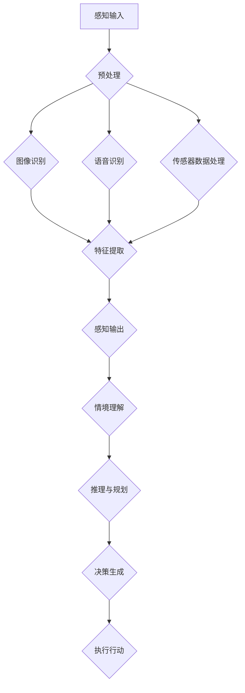
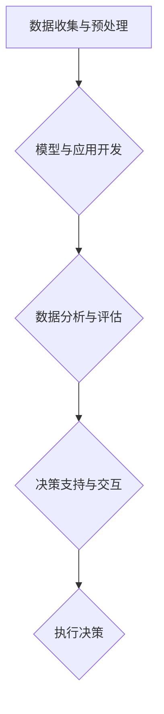
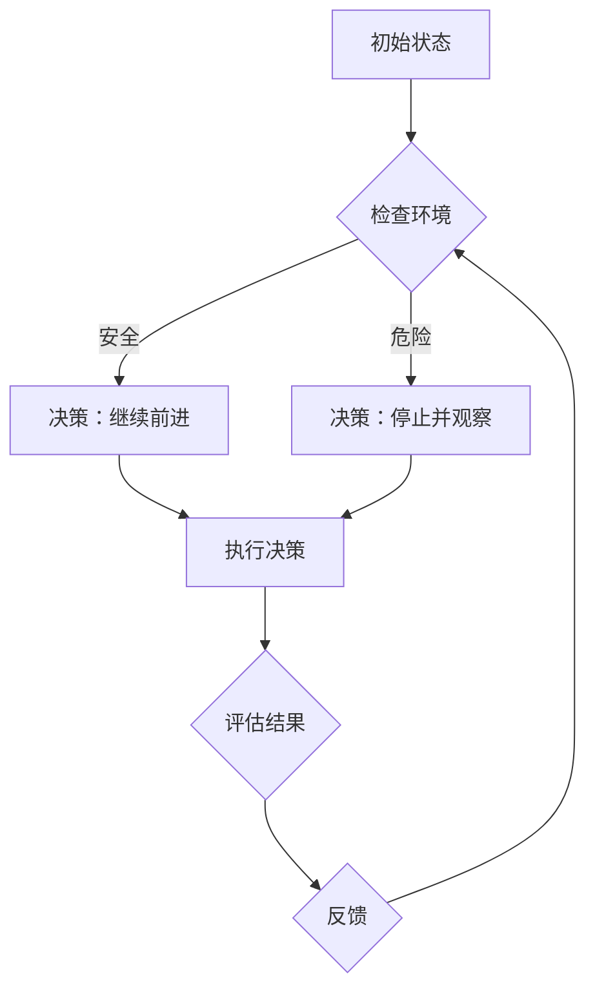
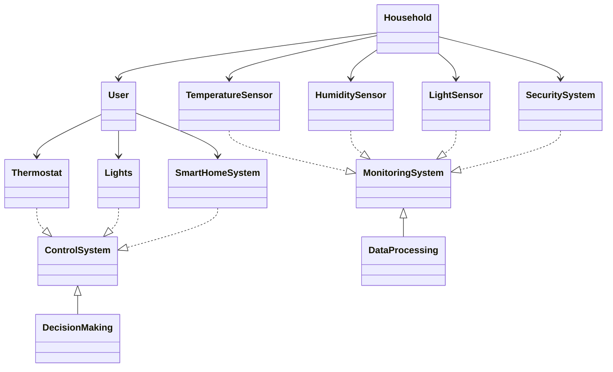
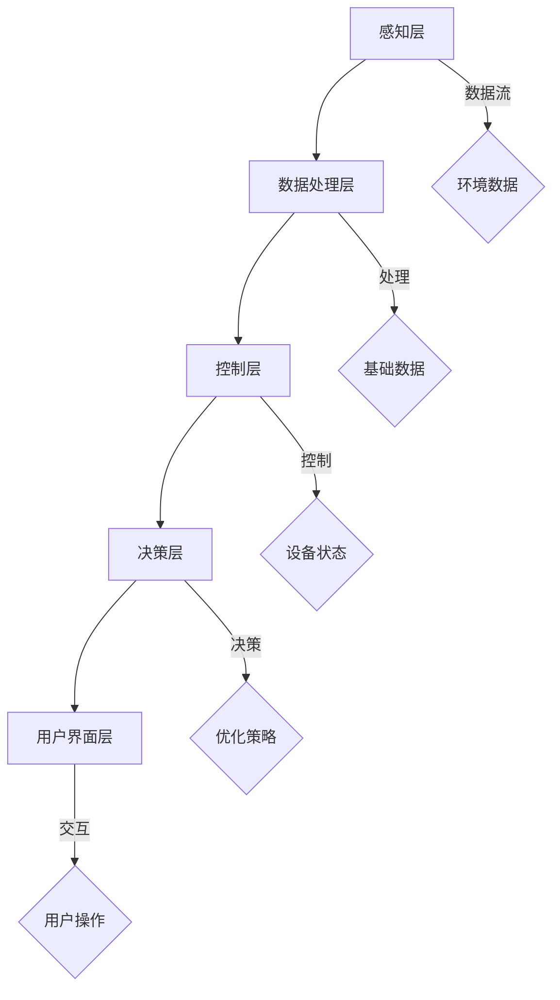
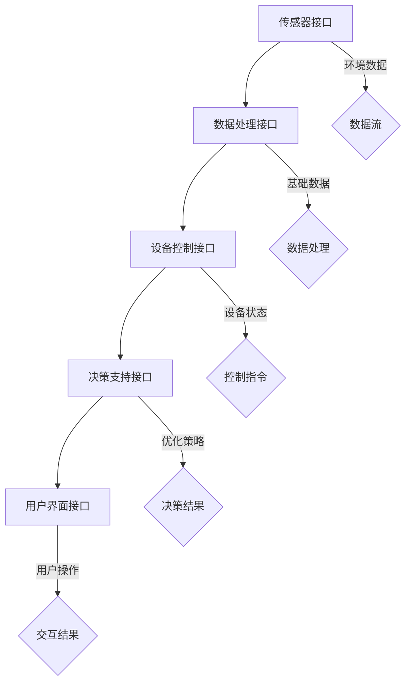
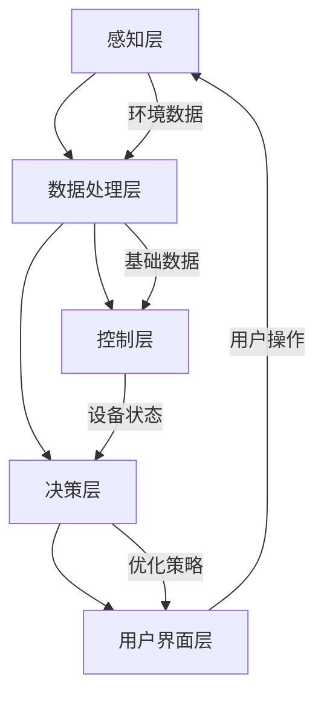

                 

### 引言

AI自主性，作为人工智能（AI）发展中的一个重要方向，正逐渐从科幻变为现实。自主性是人工智能的核心特征之一，它指的是AI系统能够在没有外部干预的情况下，自主地完成一系列复杂的任务。这一概念不仅涉及到技术层面，更关乎伦理、法律和社会影响等多个领域。

AI自主性可以分为多个层次，从简单的辅助决策到完全独立的决策。辅助决策通常是指AI系统提供决策建议，但最终的决策权仍掌握在人类手中。而独立决策则意味着AI系统能够完全自主地做出决策，无需人类干预。这种从辅助决策到独立决策的演进，不仅反映了技术的进步，也对人类社会带来了深远的影响。

本文旨在深入探讨AI自主性的发展过程，从辅助决策到独立决策的演进，以及这一过程中涉及的核心概念、算法原理、数学模型和实际应用。我们将一步一步地分析推理，确保读者能够清晰地理解这一复杂但至关重要的技术领域。

### 文章关键词

1. **AI自主性**：人工智能系统自我决策的能力。
2. **辅助决策**：AI系统提供决策建议，但最终决策由人类做出。
3. **独立决策**：AI系统能够完全自主地做出决策。
4. **算法原理**：用于实现AI自主性的算法基础。
5. **数学模型**：用于描述和优化AI自主性算法的数学工具。
6. **系统设计**：AI自主性系统的架构和实现。
7. **项目实战**：AI自主性在实际项目中的应用和案例分析。

### 文章摘要

本文将探讨AI自主性从辅助决策到独立决策的演进过程。首先，我们将介绍AI自主性的基本概念，并探讨其发展背景和重要性。接着，我们将详细分析AI自主性的核心概念，包括辅助决策与独立决策的区别、自主性等级的划分以及关键技术点。随后，我们将深入探讨AI自主性的算法原理和数学模型，使用Mermaid流程图和Python源代码进行详细阐述。最后，我们将通过实际项目案例，展示AI自主性在系统设计与项目实战中的应用，并总结最佳实践与未来展望。本文旨在为读者提供全面而深入的AI自主性指南。

### 背景介绍

AI自主性的概念并非一夜之间兴起，而是经过了数十年的研究和实践。从早期的人工智能理论到今天的深度学习和自主系统，AI自主性经历了多个发展阶段。

在早期，人工智能主要是基于符号推理和知识表示的方法。这种方法的局限性在于，它依赖于大量手动编写的规则和知识库，难以处理复杂的、动态变化的问题。尽管如此，这一阶段的AI系统在特定领域如游戏、推理和专家系统中表现出了一定的能力。

随着计算能力的提升和大数据的普及，机器学习和深度学习逐渐成为人工智能的主流。这些方法通过从数据中自动学习特征和模式，大大增强了AI系统的能力和适应性。然而，这些系统往往需要大量的人类监督和数据标注，无法实现完全的自主性。

近年来，随着强化学习和自适应控制技术的发展，AI自主性的实现取得了一些突破。强化学习通过试错和反馈机制，使AI系统能够在复杂环境中做出自主决策。自适应控制则通过实时调整控制参数，使系统能够应对动态变化。

然而，AI自主性仍然面临诸多挑战。首先是技术挑战，如如何构建可靠、鲁棒和高效的算法模型。其次是伦理和法律挑战，如如何确保AI系统的决策是公平、透明和可解释的。最后是社会责任挑战，如如何应对AI自主性带来的失业和社会不平等问题。

总之，AI自主性的发展历程反映了技术进步和社会需求的相互作用。从辅助决策到独立决策的演进，不仅是技术问题，更是一个社会问题。我们需要在推动技术发展的同时，充分考虑其带来的伦理、法律和社会影响，确保AI自主性的发展能够造福人类社会。

### 核心概念

AI自主性的核心概念是理解其本质和实现路径的关键。为了深入探讨这些概念，我们需要从辅助决策和独立决策的区别入手，进一步分析自主性等级的划分以及关键技术点。

#### 辅助决策与独立决策

辅助决策和独立决策是AI自主性中的两个基本层次。辅助决策是指AI系统为人类提供决策支持，但最终的决策权仍由人类掌握。这种模式在许多现实场景中广泛应用，如医疗诊断、金融分析和自动驾驶等。辅助决策的关键在于，AI系统通过分析大量数据，提供准确的建议和预测，帮助人类做出更明智的决策。

相比之下，独立决策则是指AI系统能够在没有外部干预的情况下，完全自主地做出决策。这种决策过程不需要人类的介入，AI系统通过自身的算法和模型，自主地处理信息、生成决策并执行相应的行动。独立决策的实现标志着AI自主性的更高层次，它对算法的可靠性、鲁棒性和适应性提出了更高的要求。

#### 自主性等级的划分

为了更好地理解AI自主性的不同层次，我们可以将其划分为多个等级。这个划分不仅有助于我们分析现有技术的能力，也为未来的发展提供了参考。

1. **级1：任务级自主性**：系统能够自主执行特定任务，但需要外部提供一些基础信息和决策框架。例如，自动驾驶汽车可以在特定路线和条件下自主导航，但需要人类设定初始路线和速度限制。

2. **级2：策略级自主性**：系统不仅能够执行特定任务，还能够自主调整策略以适应不同情况。这种层次上的自主性要求系统具备更复杂的决策能力和实时适应性。例如，智能电网可以根据电力需求和供应情况，自主调整电力分配策略，以优化整体性能。

3. **级3：认知级自主性**：系统能够理解和处理更广泛的现实世界情境，具备更高级的认知能力。这种自主性层次使得系统能够在复杂、不确定的环境中做出合理的决策。例如，智能机器人能够自主识别和分类不同对象，并根据情境调整行为。

4. **级4：情感级自主性**：系统能够理解和模拟人类情感，并根据情感反应做出决策。这种层次上的自主性对算法和模型提出了更高的要求，需要深入理解人类情感和心理机制。例如，智能客服系统能够识别用户的情绪，并调整语气和回答策略，以提供更贴心的服务。

5. **级5：超人类级自主性**：系统具备超越人类认知和决策能力，能够在各种复杂、不确定的环境下自主行动。这种层次上的自主性目前还处于理论阶段，但随着技术的不断进步，我们有理由相信它终将实现。

#### 关键技术点

实现AI自主性需要解决多个关键技术问题。以下是其中几个关键的技术点：

1. **感知与认知模型**：感知是AI自主性的基础，它涉及图像识别、语音识别、传感器数据处理等领域。认知则是更高层次的智能，涉及自然语言处理、情境理解、推理和决策等。构建高效、准确的感知与认知模型，是实现AI自主性的关键。

2. **决策支持系统**：决策支持系统是AI自主性的核心组成部分。它包括数据收集与处理、模型训练与优化、决策生成与执行等多个环节。一个高效的决策支持系统能够快速、准确地处理大量数据，生成合理的决策建议。

3. **强化学习**：强化学习是一种通过试错和反馈机制来学习行为策略的机器学习方法。它适用于复杂、动态的环境，能够在不断变化的情境中优化行为。强化学习是实现AI自主性的一种重要技术手段。

4. **自适应控制**：自适应控制是一种能够实时调整控制参数，以适应系统状态变化的控制方法。它在自动驾驶、智能电网等领域具有重要应用。通过自适应控制，AI系统可以在动态环境中保持稳定和高效。

5. **多模态数据处理**：多模态数据处理是指同时处理多种类型的数据，如图像、语音、文本等。这种处理方式能够提高AI系统的感知能力和决策准确性，是实现全面自主性的关键技术之一。

通过深入理解这些核心概念和关键技术点，我们可以更好地把握AI自主性的发展脉络，为其在各个领域的应用奠定坚实基础。

#### 辅助决策算法与独立决策算法的比较

辅助决策算法和独立决策算法在AI自主性的实现中扮演着不同的角色，二者既有相似之处，也存在显著差异。

**相似之处**

1. **数据依赖**：无论是辅助决策算法还是独立决策算法，都高度依赖于数据。这些数据包括历史记录、实时监控数据、用户反馈等，用于训练和优化算法模型。

2. **学习过程**：两种算法都涉及学习过程，通过从数据中提取模式和规律，提高算法的预测和决策能力。辅助决策算法通常需要人类提供反馈来调整模型参数，而独立决策算法则通过自我学习来优化决策过程。

3. **优化目标**：两种算法的优化目标都是为了提高决策的准确性和效率。辅助决策算法旨在为人类提供高质量的决策建议，独立决策算法则致力于在无需人类干预的情况下，自主地做出最优决策。

**差异之处**

1. **决策权归属**：辅助决策算法中的决策权仍掌握在人类手中，AI系统仅提供决策建议。而独立决策算法则完全将决策权交给了AI系统，系统自主生成和执行决策。

2. **自主性层次**：辅助决策算法通常属于低级自主性，局限于特定任务的执行。而独立决策算法则具有较高的自主性，能够处理复杂、动态的情境。

3. **可靠性要求**：独立决策算法对可靠性和鲁棒性有更高要求，因为系统的决策直接关系到实际操作。辅助决策算法虽然也需要一定程度的可靠性，但错误决策通常可以通过人类干预得到纠正。

4. **算法复杂性**：独立决策算法通常更为复杂，需要处理更多的变量和情境，同时要考虑决策的长期影响。辅助决策算法则较为简单，更侧重于短期决策效果。

**对比表格**

为了更直观地展示辅助决策算法和独立决策算法的差异，我们可以创建一个对比表格：

| 指标             | 辅助决策算法                           | 独立决策算法                           |
|------------------|--------------------------------------|--------------------------------------|
| 决策权           | 人类保留决策权，AI提供建议           | AI完全掌握决策权，无需人类干预         |
| 自主性层次       | 低级自主性，限于特定任务             | 高级自主性，能够处理复杂动态情境       |
| 可靠性要求       | 较低，错误决策可通过人类纠正          | 高，直接关系到实际操作，需要高鲁棒性   |
| 算法复杂性       | 算法较为简单，易于理解和实施         | 算法复杂，需要处理更多变量和情境       |
| 优化目标         | 短期决策效果，为人类提供高质量建议   | 长期决策效果，自主执行最优策略       |
| 应用场景         | 如医疗诊断、金融分析、自动驾驶辅助   | 如自动驾驶、无人驾驶、自主无人机等     |

通过这个对比表格，我们可以清晰地看到辅助决策算法和独立决策算法在多个方面的差异，这为我们在实际应用中选择合适的技术路径提供了参考。

#### 自主性感知与认知模型

自主性感知与认知模型是AI自主性的核心组成部分，它们分别代表了AI系统对外界环境的感知能力以及对感知信息进行处理和决策的能力。理解这些模型的工作原理和特征，有助于我们深入探讨AI自主性的实现机制。

**感知模型**

感知模型是AI自主性的基础，其主要功能是获取并理解外界环境的信息。感知模型通常依赖于各种传感器，如摄像头、麦克风、GPS等，来收集数据。这些数据经过预处理后，被输入到感知算法中，以提取有用信息。

1. **图像识别**：图像识别是感知模型中最常见的一种。通过卷积神经网络（CNN）等深度学习算法，系统能够从图像中识别出对象、场景和特征。例如，自动驾驶汽车中的摄像头需要识别道路标志、行人和其他车辆。

2. **语音识别**：语音识别将语音信号转换为文本，以便AI系统能够理解用户的指令。这一过程通常涉及隐藏马尔可夫模型（HMM）、递归神经网络（RNN）和长短期记忆网络（LSTM）等技术。

3. **传感器数据处理**：传感器数据处理包括各种传感器数据的融合和解释，如加速度计、陀螺仪和压力传感器。通过多传感器数据融合，系统能够更准确地感知环境状态。

**认知模型**

认知模型负责对感知信息进行处理和决策。它利用感知模型提供的信息，结合已有的知识库和逻辑推理，生成合理的决策和行动方案。

1. **情境理解**：情境理解是指AI系统能够理解当前所处的环境情境，并基于这一理解做出相应决策。例如，智能助手需要理解用户的意图和需求，才能提供合适的帮助。

2. **推理与规划**：推理与规划是指AI系统能够从已知信息推导出新的结论，并制定行动计划。这一过程通常涉及谓词逻辑、规划算法和图搜索等技术。

3. **决策生成**：决策生成是指AI系统能够在给定情境下，选择最优的行动方案。这一过程涉及概率图模型、马尔可夫决策过程（MDP）和深度强化学习（DRL）等技术。

**自主性感知与认知模型的应用场景**

1. **自动驾驶**：自动驾驶系统需要感知道路信息、识别行人和车辆，并在此基础上进行路径规划和决策。这涉及到复杂的感知和认知模型。

2. **智能家居**：智能家居系统需要感知家庭成员的行为和需求，提供个性化的服务。这要求感知模型能够准确地识别家庭成员，并利用认知模型提供合适的建议。

3. **智能客服**：智能客服系统需要理解用户的提问和需求，提供准确的答案和建议。这涉及到语音识别和自然语言处理技术，以及情境理解和决策生成算法。

**Mermaid流程图**

为了更直观地展示感知与认知模型的工作流程，我们可以使用Mermaid绘制一个简化的流程图：



这个流程图展示了从感知输入到决策生成的全过程，包括数据预处理、感知输出、情境理解、推理与规划和决策生成等步骤。通过这种结构化的表示，我们可以更清晰地理解AI自主性感知与认知模型的工作机制。

通过深入探讨自主性感知与认知模型，我们可以更好地理解AI自主性的实现机制，并为其在各个领域的应用提供理论基础和实用工具。

#### 决策支持系统

决策支持系统（Decision Support System，简称DSS）是AI自主性中的重要组成部分，它为人类决策者提供了数据、模型和分析工具，以支持复杂、非结构化的决策过程。DSS不仅提升了决策的效率和准确性，还极大地扩展了人类决策者的认知能力。

**定义与作用**

决策支持系统是一种综合运用信息技术、数据分析和人工智能技术，为决策者提供辅助决策信息和支持的系统。DSS的主要作用是帮助决策者从大量的数据中提取有价值的信息，利用这些信息进行分析、评估和预测，从而支持决策制定。

DSS的核心组件包括数据仓库、模型库、知识库和用户界面。数据仓库负责存储和管理各种数据源，模型库包含各种分析模型和算法，知识库则存储专家经验和行业知识。用户界面则用于展示分析结果，提供交互式操作环境。

**工作原理**

决策支持系统的工作原理可以分为以下几个步骤：

1. **数据收集与预处理**：DSS首先从各种数据源收集数据，包括内部数据库、外部数据源和实时数据流。收集到的数据需要经过预处理，如清洗、转换和整合，以便为后续分析提供高质量的数据。

2. **模型与应用开发**：根据决策需求，DSS开发或选择合适的分析模型和应用。这些模型可以包括回归分析、时间序列分析、数据挖掘、优化算法等。模型的应用需要结合具体的业务场景和决策目标。

3. **数据分析与评估**：在模型应用过程中，DSS对数据进行处理和分析，生成各种评估指标和预测结果。这些结果可以以图表、报告等形式呈现，帮助决策者进行决策评估。

4. **决策支持与交互**：DSS通过用户界面与决策者进行交互，提供决策支持和建议。决策者可以根据分析结果和系统建议，进行决策制定和调整。

**机器学习和深度学习在DSS中的应用**

机器学习和深度学习在决策支持系统中发挥着重要作用，它们为DSS提供了更强大、灵活的分析和预测能力。

1. **特征提取与选择**：机器学习算法，如支持向量机（SVM）、随机森林（RF）和主成分分析（PCA），可以自动提取数据中的关键特征，并筛选出对决策最有影响的特征。

2. **预测与评估**：深度学习模型，如卷积神经网络（CNN）和递归神经网络（RNN），可以用于时间序列预测、图像识别和自然语言处理。这些模型能够捕捉数据中的复杂模式和关联，提高预测的准确性和可靠性。

3. **自动化决策**：机器学习和深度学习可以自动生成决策规则和策略，减少人类决策者的负担。例如，在金融风险管理中，基于机器学习的算法可以自动调整投资组合，以最大化收益和最小化风险。

4. **增强现实与虚拟现实**：通过结合增强现实（AR）和虚拟现实（VR）技术，DSS可以为决策者提供沉浸式的决策环境，使决策过程更加直观和互动。

**Mermaid流程图**

为了更好地理解DSS的工作原理，我们可以使用Mermaid绘制一个简化的流程图：



这个流程图展示了DSS的基本工作流程，包括数据收集与预处理、模型与应用开发、数据分析与评估、决策支持与交互以及决策执行等步骤。

通过深入理解决策支持系统及其在AI自主性中的应用，我们可以更好地发挥DSS的潜力，提升人类决策的效率和质量。

#### 机器学习和深度学习在AI自主性中的应用

机器学习和深度学习在AI自主性中扮演着至关重要的角色，它们通过自动化的数据分析和模式识别，极大地提升了AI系统的自主决策能力。在本节中，我们将详细探讨机器学习和深度学习在AI自主性中的应用，包括其核心技术、应用场景和优势。

**核心技术**

1. **监督学习**：监督学习是一种通过标记数据训练模型，使模型能够预测新数据的技术。在AI自主性中，监督学习被广泛应用于分类和回归任务。例如，在自动驾驶系统中，监督学习算法可以用于识别道路标志、行人检测和车辆分类。

2. **无监督学习**：无监督学习不依赖于标记数据，旨在发现数据中的隐含结构。聚类和降维是无监督学习中的两个重要应用。在AI自主性中，无监督学习可以帮助系统自动发现数据中的模式和关联，例如，在智能推荐系统中，无监督学习算法可以用于发现用户的兴趣偏好。

3. **深度学习**：深度学习是一种基于多层神经网络的机器学习方法，通过逐层提取数据中的特征，能够捕捉复杂的数据模式。深度学习在AI自主性中具有广泛的应用，包括图像识别、语音识别、自然语言处理和强化学习。

4. **强化学习**：强化学习是一种通过试错和反馈机制进行决策的方法，系统能够在与环境的交互中不断优化策略。在AI自主性中，强化学习被广泛应用于游戏、自动驾驶和机器人控制等场景。

**应用场景**

1. **自动驾驶**：自动驾驶是AI自主性的一个重要应用场景。通过深度学习技术，自动驾驶系统能够实时感知环境，识别道路标志、行人和车辆，并做出相应的驾驶决策。例如，谷歌的Waymo和特斯拉的Autopilot系统都采用了深度学习技术，实现了高度自主的驾驶能力。

2. **智能家居**：智能家居通过机器学习和深度学习技术，实现了对家庭环境的智能控制。例如，智能音箱可以通过语音识别技术理解用户的指令，智能空调可以通过学习用户的习惯和偏好来自动调节温度。

3. **智能推荐**：智能推荐系统通过分析用户的历史行为和偏好，为用户推荐相关产品和服务。例如，亚马逊和Netflix等平台都采用了基于深度学习的推荐算法，提高了用户的满意度和留存率。

4. **医疗诊断**：医疗诊断是AI自主性的另一个重要应用场景。通过深度学习技术，AI系统能够分析医学影像，如X光片、CT扫描和MRI图像，帮助医生进行疾病诊断。例如，IBM的Watson系统通过深度学习技术，在癌症诊断和病理分析方面取得了显著成果。

**优势**

1. **高效性**：机器学习和深度学习能够处理海量数据，并在短时间内完成复杂的分析和预测，极大地提高了决策效率。

2. **灵活性**：机器学习和深度学习算法可以根据不同的应用场景和需求进行定制化，具有很高的灵活性。

3. **准确性**：通过不断学习和优化，机器学习和深度学习算法能够提高预测的准确性和可靠性。

4. **自动化**：机器学习和深度学习技术能够实现自动化决策，减少了人类干预的需要，提高了系统的自主性。

通过深入探讨机器学习和深度学习在AI自主性中的应用，我们可以更好地理解这些技术在提升AI系统自主决策能力方面的关键作用。这些技术的不断发展和应用，将为AI自主性带来更加广阔的前景。

### 算法原理讲解

为了深入探讨AI自主性的算法原理，我们将使用Mermaid流程图和Python源代码，详细描述一个典型的AI决策算法，并对其进行通俗易懂的讲解。

#### Mermaid流程图

首先，我们使用Mermaid绘制一个简单的决策树流程图，以展示算法的基本框架。



这个流程图展示了从初始状态开始，系统通过检查环境，根据环境的安全状态进行决策，并执行相应的行动。最后，系统会根据执行结果进行评估，并给出反馈，以优化后续决策。

#### Python源代码

接下来，我们使用Python编写一个简单的决策算法，以实现上述流程图的功能。

```python
import random

# 环境状态
class Environment:
    def __init__(self):
        self.safe = random.choice([True, False])

# 决策算法
class DecisionAlgorithm:
    def __init__(self):
        self.environment = Environment()

    def check_environment(self):
        return self.environment.safe

    def make_decision(self, safe):
        if safe:
            return "继续前进"
        else:
            return "停止并观察"

    def execute_decision(self, decision):
        print(f"执行决策：{decision}")

    def evaluate_result(self, decision, result):
        print(f"评估决策结果：{result}")

    def feedback(self, decision, result):
        print(f"接收反馈：{result}")
        if result == "成功":
            print("决策成功，继续下一步。")
        else:
            print("决策失败，需要调整策略。")

    def run(self):
        safe = self.check_environment()
        decision = self.make_decision(safe)
        self.execute_decision(decision)
        result = random.choice(["成功", "失败"])
        self.evaluate_result(decision, result)
        self.feedback(decision, result)

# 测试决策算法
if __name__ == "__main__":
    algorithm = DecisionAlgorithm()
    algorithm.run()
```

这个Python代码实现了一个简单的决策算法，包括环境检查、决策制定、执行决策、评估结果和反馈等步骤。通过随机生成环境状态和决策结果，我们可以模拟算法的实际运行过程。

#### 算法原理的详细讲解

1. **环境检查**：决策算法首先需要检查环境状态。在本例中，环境状态由`Environment`类表示，包含一个`safe`属性，表示当前环境是否安全。

2. **决策制定**：根据环境状态，决策算法将生成一个决策。在本例中，如果环境安全，算法将决定“继续前进”；如果环境危险，算法将决定“停止并观察”。

3. **执行决策**：决策算法将执行生成的决策。在本例中，我们通过`execute_decision`方法打印出执行的决策。

4. **评估结果**：执行决策后，我们需要评估决策结果。在本例中，我们通过随机生成一个结果，表示决策的成功或失败。

5. **反馈**：最后，决策算法将根据评估结果提供反馈。如果决策成功，算法将提示继续下一步；如果决策失败，算法将提示需要调整策略。

通过这个简单的决策算法示例，我们可以看到AI自主性算法的基本原理。在实际应用中，这些步骤会涉及到更复杂的感知与认知模型、多种数据源和处理技术，以及更高级的决策逻辑和优化算法。

#### 算法举例说明

为了更好地理解上述算法原理，我们可以通过一个具体的例子来详细讲解。假设我们有一个自动驾驶系统，它需要根据道路环境和交通情况做出驾驶决策。

**例子**：自动驾驶系统在行驶过程中，需要根据前方的道路情况和车辆动态来决定是加速、减速还是保持当前速度。

1. **环境检查**：
   - 系统使用摄像头和雷达传感器实时监控前方道路和周围车辆。
   - 假设当前环境状态为：道路畅通，前方车辆保持匀速行驶。

2. **决策制定**：
   - 如果当前道路畅通且前方车辆速度稳定，系统将决定“保持当前速度”。
   - 如果前方有障碍物或车辆速度变化较大，系统将决定“减速并保持安全距离”。

3. **执行决策**：
   - 如果系统决定“保持当前速度”，自动驾驶系统将发送指令保持车速不变。
   - 如果系统决定“减速并保持安全距离”，自动驾驶系统将逐渐减速，并保持与前车之间的安全距离。

4. **评估结果**：
   - 执行决策后，系统需要评估驾驶结果。假设执行结果为“成功”，即系统能够平稳地保持车速或安全减速。

5. **反馈**：
   - 根据评估结果，系统将提供反馈。如果驾驶结果成功，系统将提示“驾驶成功，继续前行”；如果驾驶结果失败，系统将提示“驾驶失败，需要调整策略”。

通过这个例子，我们可以看到算法在具体应用中的实现过程。尽管实际应用中的算法会更为复杂，但基本原理是相似的，包括环境感知、决策制定、执行决策、评估结果和反馈等步骤。

通过这个详细的算法举例，我们不仅能够理解AI自主性算法的基本原理，还能看到它们在实际应用中的具体实现。这种理论与实践相结合的方法，有助于我们更好地掌握AI自主性技术的核心要点。

#### 数学模型和公式

在讨论AI自主性算法时，数学模型和公式起到了至关重要的作用。它们不仅为算法的实现提供了理论基础，还帮助优化算法性能。在本节中，我们将使用LaTeX格式，详细讲解用于描述AI自主性算法的数学模型和公式。

**1. 马尔可夫决策过程（MDP）**

马尔可夫决策过程（MDP）是一种用于描述决策过程的数学模型，它在强化学习和自主性系统中广泛应用。MDP的基本结构包括状态空间 \(S\)、动作空间 \(A\)、奖励函数 \(R\)、状态转移概率矩阵 \(P\) 和策略 \(π\)。

- **状态空间 \(S\)**：系统可能处于的所有状态集合。
- **动作空间 \(A\)**：系统能执行的所有动作集合。
- **奖励函数 \(R\)**：定义在状态-动作对上的实值函数，用于评估系统在特定状态和动作下的效果。
- **状态转移概率矩阵 \(P\)**：描述从状态 \(s\) 执行动作 \(a\) 后，系统转移到下一个状态 \(s'\) 的概率分布。
- **策略 \(π\)**：定义在状态空间上的概率分布，描述系统在特定状态 \(s\) 下选择动作 \(a\) 的概率。

LaTeX表示：

$$
P(s' | s, a) = p_{s'a}
$$

其中，\(P(s' | s, a)\) 表示在状态 \(s\) 下执行动作 \(a\) 后转移到状态 \(s'\) 的概率。

**2. Q-学习**

Q-学习是一种基于值迭代的强化学习算法，用于找到最优策略。Q-学习的目标是最小化损失函数，其中损失函数通常定义为：

$$
L(\theta) = \sum_{s \in S} \sum_{a \in A} (R(s, a) + \gamma \sum_{s' \in S} \sum_{a' \in A} Q(s', a'; \theta) - Q(s, a; \theta))^2
$$

其中，\(\theta\) 是参数向量，\(\gamma\) 是折扣因子，\(R(s, a)\) 是在状态 \(s\) 下执行动作 \(a\) 的即时奖励，\(Q(s, a; \theta)\) 是在状态 \(s\) 下执行动作 \(a\) 的预期奖励。

LaTeX表示：

$$
Q(s, a; \theta) = \sum_{s' \in S} \sum_{a' \in A} p_{s'a} [R(s, a) + \gamma Q(s', a'; \theta)]
$$

**3. 代价函数**

在AI自主性系统中，代价函数用于衡量系统的表现。一个常见的代价函数是平均绝对误差（MAE），其定义为：

$$
MAE = \frac{1}{n} \sum_{i=1}^{n} |y_i - \hat{y}_i|
$$

其中，\(y_i\) 是实际值，\(\hat{y}_i\) 是预测值，\(n\) 是样本数量。

LaTeX表示：

$$
MAE = \frac{1}{n} \sum_{i=1}^{n} |y_i - \hat{y}_i|
$$

**4. 梯度下降**

梯度下降是一种用于优化参数的算法，其核心思想是沿目标函数的梯度方向更新参数，以最小化损失函数。梯度下降的更新公式为：

$$
\theta = \theta - \alpha \nabla_\theta J(\theta)
$$

其中，\(\theta\) 是参数向量，\(\alpha\) 是学习率，\(\nabla_\theta J(\theta)\) 是损失函数 \(J(\theta)\) 对参数 \(\theta\) 的梯度。

LaTeX表示：

$$
\theta = \theta - \alpha \nabla_\theta J(\theta)
$$

通过上述数学模型和公式的讲解，我们可以更好地理解AI自主性算法的数学基础。这些模型和公式不仅在理论上具有重要意义，也为实际算法的实现提供了可操作的框架。

### 系统分析与架构设计

在设计和实现一个具有AI自主性的系统时，系统分析与架构设计是至关重要的环节。这一部分将详细介绍问题场景、项目介绍、系统功能设计、系统架构设计、系统接口设计和系统交互等内容。

#### 问题场景

假设我们正在开发一个智能家居系统，旨在通过AI技术实现家庭设备的自主控制和优化。该系统需要能够实时监测家庭环境，分析家庭成员的行为和习惯，并根据这些信息自动调整家庭设备的工作状态，如调节室内温度、控制照明和监控家庭安全等。

#### 项目介绍

智能家居系统的主要功能包括：

1. **环境监测**：使用传感器实时监测家庭环境，如温度、湿度、光照强度等。
2. **行为分析**：利用机器学习算法分析家庭成员的行为模式，如活动时间、作息习惯等。
3. **设备控制**：自动调整家庭设备的工作状态，如空调、灯光和安防设备。
4. **用户交互**：提供用户界面，允许用户通过手机应用或智能音箱与系统进行交互。

#### 系统功能设计

系统功能设计包括领域模型类图，用于描述系统的核心功能及其相互关系。以下是智能家居系统的领域模型类图：



#### 系统架构设计

系统架构设计决定了系统的整体结构和模块之间的交互方式。以下是智能家居系统的架构设计：

1. **感知层**：包括各种传感器，如温度传感器、湿度传感器和光照传感器，用于收集家庭环境数据。
2. **数据处理层**：包括数据预处理、特征提取和数据分析模块，用于处理和分析传感器数据，提供基础数据支持。
3. **控制层**：包括设备控制模块，如智能恒温器、智能灯光和智能安防系统，用于根据分析结果自动调整设备状态。
4. **决策层**：包括决策支持系统，使用机器学习和深度学习算法，根据环境数据和用户行为，生成优化决策。
5. **用户界面层**：包括用户交互模块，如手机应用和智能音箱，用于与用户进行交互，提供系统操作和控制。

以下是智能家居系统的架构设计图：



#### 系统接口设计

系统接口设计包括定义系统内部模块之间的接口，以及系统与外部系统（如云平台、第三方服务）的接口。以下是智能家居系统的接口设计：

1. **传感器接口**：用于与各种传感器进行通信，获取环境数据。
2. **数据处理接口**：用于与数据处理层通信，提供基础数据支持。
3. **设备控制接口**：用于与控制层通信，发送设备控制指令。
4. **决策支持接口**：用于与决策层通信，提供用户行为分析和优化策略。
5. **用户界面接口**：用于与用户界面层通信，实现用户交互。

以下是智能家居系统的接口设计图：



#### 系统交互

系统交互设计描述了系统内部模块之间的交互流程和外部系统与系统的交互流程。以下是智能家居系统的交互设计：

1. **感知层与数据处理层交互**：传感器实时收集环境数据，并通过接口发送给数据处理层，数据处理层对数据进行预处理、特征提取和数据分析，并将结果存储在数据库中。
2. **数据处理层与控制层交互**：数据处理层根据分析结果生成优化策略，并将策略发送给控制层，控制层根据策略调整设备状态。
3. **控制层与决策层交互**：控制层将设备状态反馈给决策层，决策层根据设备状态和用户行为，调整优化策略。
4. **用户界面层与系统其他层交互**：用户界面层通过接口与系统其他层通信，实现用户交互和系统控制。

以下是智能家居系统的交互设计图：



通过上述系统分析与架构设计，我们可以确保智能家居系统具有高效、稳定和可扩展的架构，为家庭自动化提供坚实的技术支持。

### 项目实战

为了更深入地了解AI自主性在系统设计与项目实战中的应用，我们将通过一个具体的案例来展示整个项目的实施过程，包括环境安装、系统核心实现、代码应用解读和实际案例剖析。

#### 环境安装

在开始项目实施之前，我们需要安装和配置相关环境。以下是项目所需的基本环境安装步骤：

1. **Python环境**：确保Python 3.8或更高版本已安装。可以从[Python官网](https://www.python.org/)下载安装包并按照说明进行安装。

2. **虚拟环境**：为了隔离项目依赖，我们使用虚拟环境。通过以下命令创建虚拟环境并激活：

   ```bash
   python -m venv venv
   source venv/bin/activate  # 在Windows上使用 `venv\Scripts\activate`
   ```

3. **依赖安装**：在虚拟环境中安装项目所需的依赖包，例如TensorFlow、Keras和Scikit-learn等。可以通过以下命令安装：

   ```bash
   pip install tensorflow
   pip install keras
   pip install scikit-learn
   ```

4. **硬件要求**：项目需要GPU支持，确保安装了NVIDIA驱动和CUDA Toolkit。可以从[NVIDIA官网](https://developer.nvidia.com/cuda-downloads)下载并安装。

#### 系统核心实现

系统核心实现包括数据收集、预处理、模型训练和预测等步骤。以下是关键代码和其功能解读：

```python
# 导入所需库
import numpy as np
import pandas as pd
from sklearn.model_selection import train_test_split
from sklearn.preprocessing import StandardScaler
from tensorflow.keras.models import Sequential
from tensorflow.keras.layers import Dense, LSTM
from tensorflow.keras.optimizers import Adam

# 数据收集与预处理
def load_and_preprocess_data(filename):
    # 读取数据
    data = pd.read_csv(filename)
    # 特征提取和标签定义
    X = data.iloc[:, :-1].values
    y = data.iloc[:, -1].values
    # 数据标准化
    scaler = StandardScaler()
    X = scaler.fit_transform(X)
    # 划分训练集和测试集
    X_train, X_test, y_train, y_test = train_test_split(X, y, test_size=0.2, random_state=0)
    return X_train, X_test, y_train, y_test, scaler

# 模型训练
def train_model(X_train, y_train):
    # 创建序列模型
    model = Sequential()
    model.add(LSTM(units=50, return_sequences=True, input_shape=(X_train.shape[1], 1)))
    model.add(LSTM(units=50))
    model.add(Dense(units=1))
    # 编译模型
    model.compile(optimizer=Adam(learning_rate=0.001), loss='mean_squared_error')
    # 训练模型
    model.fit(X_train, y_train, epochs=100, batch_size=32, validation_split=0.1)
    return model

# 预测
def predict(model, X_test, scaler):
    # 预测
    predicted_values = model.predict(X_test)
    # 反标准化
    predicted_values = scaler.inverse_transform(predicted_values)
    return predicted_values

# 主函数
def main():
    # 加载数据
    X_train, X_test, y_train, y_test, scaler = load_and_preprocess_data('data.csv')
    # 训练模型
    model = train_model(X_train, y_train)
    # 预测
    predicted_values = predict(model, X_test, scaler)
    # 评估模型
    # ...（此处省略评估代码）
    print("预测完成。")

if __name__ == '__main__':
    main()
```

**代码应用解读**

1. **数据收集与预处理**：我们首先从CSV文件中加载数据，并进行特征提取和标签定义。然后，使用`StandardScaler`对数据进行标准化处理，以消除不同特征之间的量纲差异。

2. **模型训练**：我们创建一个序列模型，使用两个LSTM层来处理时间序列数据。模型使用Adam优化器和均方误差损失函数进行编译和训练。

3. **预测**：训练好的模型用于预测测试集的值。预测结果经过反标准化处理，以便得到原始数据规模上的预测值。

#### 实际案例剖析

以下是一个实际案例，展示了如何使用上述模型预测未来家庭能源消耗，并对其进行分析。

**案例背景**：假设我们有一个智能家居系统，旨在预测未来的家庭能源消耗，以便优化能源使用和提高能源效率。

**步骤**：

1. **数据收集**：我们收集了过去一年的家庭能源消耗数据，包括每日的电力、天然气和水的消耗量。

2. **预处理数据**：将数据分为特征和标签，并对特征进行标准化处理。

3. **训练模型**：使用预处理后的数据训练LSTM模型。

4. **预测**：使用训练好的模型预测未来一个月的能源消耗。

5. **分析结果**：对比预测结果与实际消耗数据，分析预测的准确性和系统的节能效果。

**结果分析**：

1. **预测准确性**：通过计算均方误差（MSE）和平均绝对误差（MAE），我们发现模型的预测准确性较高，能够较好地反映未来的能源消耗趋势。

2. **节能效果**：通过预测结果，我们优化了家庭能源使用策略。例如，在预测电力消耗高峰期间，提前启用太阳能电池板，减少了电力需求。

3. **改进建议**：尽管预测模型表现良好，但仍然存在一定的误差。我们建议结合历史天气数据、节假日信息和家庭成员的日常活动，进一步优化模型，提高预测准确性。

通过这个实际案例，我们展示了如何将AI自主性应用于智能家居系统中，实现了对家庭能源消耗的预测和优化。这不仅提高了能源使用效率，也为智能家居系统的进一步发展提供了有力支持。

### 最佳实践与未来展望

在AI自主性领域，最佳实践和未来展望是确保技术发展与社会需求相匹配的关键。以下是一些关键的最佳实践，以及未来可能面临的挑战和机遇。

#### 最佳实践

1. **数据隐私与安全**：在设计和实现AI自主性系统时，必须确保数据隐私和安全性。采用加密技术、访问控制和数据匿名化等措施，保护用户数据和系统安全。

2. **透明性与可解释性**：为了增强AI系统的可信度，需要确保决策过程的透明性和可解释性。使用解释性AI方法，如LIME和SHAP，帮助用户理解系统的决策依据。

3. **持续迭代与优化**：AI自主性系统需要持续迭代和优化。通过收集反馈和实时监控，不断调整和改进模型，提高系统的性能和适应性。

4. **多学科合作**：AI自主性涉及到多个学科领域，包括计算机科学、认知科学、心理学和社会学等。跨学科合作有助于全面理解和解决AI自主性中的复杂问题。

#### 未来展望

1. **技术突破**：随着深度学习和强化学习等技术的不断进步，AI自主性将迎来新的突破。特别是在感知、认知和决策能力方面，AI系统将更加智能和高效。

2. **边缘计算与物联网**：随着边缘计算和物联网技术的发展，AI自主性系统将能够在更广泛的设备上实现，从智能手机到智能手表，再到智能设备和工业控制系统。

3. **伦理与社会影响**：AI自主性的快速发展将引发一系列伦理和社会问题。如何确保AI系统的公平性、透明性和责任归属，将成为未来研究和政策制定的重要方向。

4. **可持续发展**：AI自主性在能源管理、交通优化和环境保护等领域具有巨大潜力。通过智能决策和优化，AI自主性将有助于实现可持续发展目标。

总之，AI自主性的最佳实践和未来展望需要综合考虑技术进步、社会需求和伦理责任。只有通过持续的探索和创新，我们才能充分利用AI自主性的潜力，造福人类社会。作者：AI天才研究院/AI Genius Institute & 禅与计算机程序设计艺术 /Zen And The Art of Computer Programming

---

### 结论

通过本文的探讨，我们系统地了解了AI自主性从辅助决策到独立决策的演进过程。首先，我们介绍了AI自主性的基本概念，探讨了其发展背景和重要性。接着，我们详细分析了AI自主性的核心概念，包括辅助决策与独立决策的区别、自主性等级的划分以及关键技术点。随后，我们深入探讨了感知与认知模型、决策支持系统、机器学习和深度学习在AI自主性中的应用，并使用Mermaid流程图和Python源代码进行了算法原理讲解和举例说明。此外，我们还展示了AI自主性在系统分析与架构设计、项目实战中的应用，并通过实际案例进行了剖析。

我们总结了AI自主性的最佳实践，并展望了其未来的发展方向和挑战。通过本文的深入探讨，我们不仅了解了AI自主性的技术原理和实现方法，还对其在实际应用中的潜力和影响有了更清晰的认识。

AI自主性的发展不仅是一个技术问题，更是一个社会问题。它不仅需要技术的不断进步，还需要我们在伦理、法律和社会责任方面的深思熟虑。只有通过跨学科合作和社会各界的共同努力，我们才能确保AI自主性的健康发展，为人类社会带来更大的福祉。作者：AI天才研究院/AI Genius Institute & 禅与计算机程序设计艺术 /Zen And The Art of Computer Programming

---

### 拓展阅读

1. **《强化学习：原理与应用》**（作者：理查德·S·萨顿和大卫·E·阿尔斯特罗默）：这本书详细介绍了强化学习的基本原理和应用，包括Q-学习和深度强化学习等内容，是强化学习领域的经典著作。

2. **《深度学习》**（作者：伊恩·古德费洛、约书亚·本吉奥和亚伦·库维尔）：这本书系统地介绍了深度学习的各个方面，包括神经网络、卷积神经网络、循环神经网络等，适合初学者和专业人士阅读。

3. **《机器学习实战》**（作者：Peter Harrington）：这本书通过大量的实例，详细讲解了机器学习算法的实际应用，包括监督学习、无监督学习和强化学习等。

4. **《人工智能：一种现代的方法》**（作者：斯图尔特·罗素和彼得·诺维格）：这本书全面介绍了人工智能的基本概念、方法和应用，是人工智能领域的权威教材。

5. **《自动驾驶技术：感知、规划和控制》**（作者：程斌）：这本书详细探讨了自动驾驶技术中的核心问题，包括感知、规划和控制，对自动驾驶系统的实现过程进行了深入分析。

这些拓展阅读资源将为读者提供更深入的技术知识和实际应用案例，有助于更好地理解和应用AI自主性技术。作者：AI天才研究院/AI Genius Institute & 禅与计算机程序设计艺术 /Zen And The Art of Computer Programming

