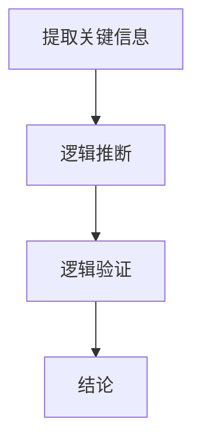
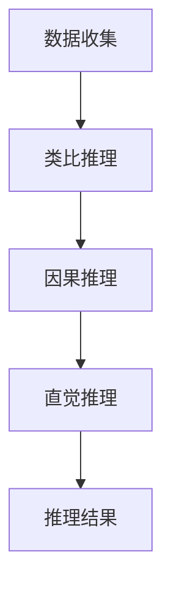
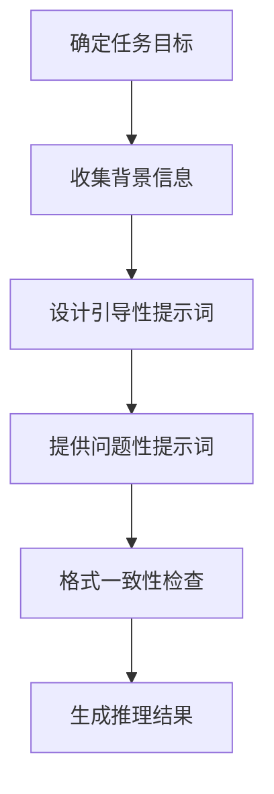
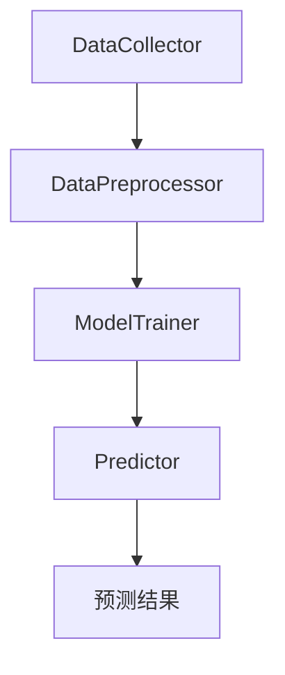

                 

### 文章关键词与摘要

#### 关键词：
- AI辅助决策
- ChatGPT
- 复杂推理
- 提示词策略
- 算法优化

#### 摘要：
本文旨在探讨如何利用ChatGPT进行复杂推理，并设计有效的提示词策略来辅助决策。文章首先介绍了AI辅助决策的背景和重要性，然后详细解析了ChatGPT的基础知识。接着，我们深入探讨了复杂推理的概念和类型，以及如何通过ChatGPT实现。文章随后阐述了提示词策略的设计原则和种类，并通过实例展示了如何优化提示词以提高推理质量。最终，我们通过一个实际案例，展示了ChatGPT在复杂决策中的应用，并总结了最佳实践和注意事项。

---

## 第一部分：AI辅助决策概述

### 1.1 问题背景与核心概念

#### 1.1.1 AI辅助决策的重要性

在当今快速发展的数字化时代，人工智能（AI）技术已经成为各行各业的关键驱动力。AI不仅提升了生产效率，还带来了创新的服务模式。然而，随着决策环境的复杂性和不确定性不断增加，单靠人类智能已难以应对日益复杂的决策问题。AI辅助决策应运而生，通过模拟人类的决策过程，辅助人类做出更加明智和高效的选择。

AI辅助决策在多个领域展现出了其独特的优势。例如，在金融领域，AI可以分析大量数据，预测市场趋势，从而帮助投资者做出更准确的决策。在医疗领域，AI可以辅助医生进行诊断，提供个性化治疗方案。此外，在物流和交通领域，AI可以优化路线规划，减少拥堵，提高运输效率。

#### 1.1.2 决策过程的复杂性

决策过程本质上是一个信息处理的过程，涉及数据的收集、分析、评估和选择等多个环节。传统的决策方法通常依赖于经验和直觉，这种方式在处理简单问题时效果尚可，但在面对复杂、多变和不确定性较高的问题时，往往显得力不从心。

复杂性主要体现在以下几个方面：

1. **数据复杂性**：现代决策问题往往涉及大量数据，这些数据可能包含噪声和不完整信息，如何从这些数据中提取有价值的信息是决策过程的关键挑战。
2. **关系复杂性**：决策问题通常涉及多个变量和因素，它们之间可能存在复杂的相互作用和依赖关系。如何理清这些关系，构建准确的模型是决策的难点。
3. **目标复杂性**：决策者可能需要同时考虑多个目标，这些目标之间可能存在冲突。如何在多个目标之间找到平衡点，是决策过程中需要解决的重要问题。

#### 1.1.3 ChatGPT与复杂推理

为了解决复杂决策问题，我们需要一种能够处理复杂推理的工具。ChatGPT作为一种基于自然语言处理（NLP）的人工智能模型，具备强大的文本理解和生成能力，成为辅助复杂推理的有力工具。

ChatGPT是由OpenAI开发的一种大型语言模型，其基于变换器（Transformer）架构，并经过大规模的预训练和微调。ChatGPT能够理解并生成人类语言的文本，这使得它能够处理自然语言描述的复杂推理问题。

ChatGPT在复杂推理中的应用主要体现在以下几个方面：

1. **文本理解**：ChatGPT能够理解复杂文本的含义和结构，提取关键信息，并对其进行逻辑推理。
2. **知识检索**：ChatGPT可以从大量的文本数据中检索相关信息，为推理过程提供背景知识和支持。
3. **生成建议**：ChatGPT可以根据已有的信息和逻辑推理，生成合理的建议和解决方案。

#### 1.1.4 本部分小结

本部分介绍了AI辅助决策的背景和重要性，探讨了决策过程的复杂性，并介绍了ChatGPT作为复杂推理工具的优势。下一部分将深入探讨ChatGPT的基础知识和原理，为进一步理解其在复杂推理中的应用打下基础。

### 1.2 ChatGPT介绍

#### 1.2.1 ChatGPT基础

ChatGPT是一种基于变换器（Transformer）架构的大型语言模型，由OpenAI开发。它的核心思想是通过大量的文本数据进行预训练，使模型能够理解并生成自然语言文本。

ChatGPT的基本工作原理可以分为以下几个步骤：

1. **输入处理**：当用户输入一段文本时，ChatGPT首先对文本进行预处理，包括分词、词性标注等，将其转化为模型可以理解的向量表示。
2. **编码器解码器**：ChatGPT使用变换器架构，包括编码器和解码器两个部分。编码器将输入文本编码为固定长度的向量，解码器则根据编码器的输出和已经生成的部分文本，逐步生成新的文本。
3. **文本生成**：解码器通过自注意力机制和全连接层等操作，逐个生成新的文本单元。这个过程持续进行，直到生成完整的文本。

#### 1.2.2 ChatGPT的架构

ChatGPT的架构基于变换器（Transformer）架构，这种架构在处理长文本序列时具有显著的优势。变换器架构的核心是自注意力机制（Self-Attention），它能够自动学习输入序列中不同位置之间的依赖关系。

ChatGPT的架构包括以下几个关键部分：

1. **嵌入层（Embedding Layer）**：将输入文本转化为固定长度的向量表示。
2. **变换器层（Transformer Layer）**：包括多头自注意力机制和前馈神经网络。自注意力机制能够自适应地学习输入序列中的依赖关系，前馈神经网络则进一步增强了模型的表示能力。
3. **解码器层（Decoder Layer）**：与编码器类似，但加入了额外的解码器层，使得模型能够根据已有的文本生成新的文本。
4. **输出层（Output Layer）**：将生成的文本序列解码为自然语言输出。

#### 1.2.3 ChatGPT的训练数据与模型

ChatGPT的训练数据来自于大量的文本数据集，这些数据集包括书籍、新闻文章、网站内容等。通过这些数据，ChatGPT能够学习到丰富的语言知识和结构。

训练过程中，ChatGPT采用了一种称为“预训练-微调”（Pre-training and Fine-tuning）的方法。首先，模型在大量文本上进行预训练，使其能够理解通用语言模式和结构。然后，通过微调（Fine-tuning）过程，模型根据特定的任务进行调整，使其在特定任务上表现更好。

#### 1.2.4 ChatGPT的应用领域

ChatGPT在多个领域展现出了其强大的应用潜力：

1. **自然语言处理**：ChatGPT可以用于文本分类、情感分析、机器翻译等自然语言处理任务。
2. **对话系统**：ChatGPT可以构建智能对话系统，如聊天机器人、虚拟助手等。
3. **内容生成**：ChatGPT可以生成文章、故事、代码等文本内容。
4. **辅助决策**：ChatGPT可以用于辅助决策，如市场预测、风险评估等。

#### 1.2.5 本部分小结

本部分介绍了ChatGPT的基础知识和架构，包括其工作原理、训练数据、模型结构和应用领域。通过这一部分，读者可以初步了解ChatGPT的特点和能力，为后续讨论其在复杂推理中的应用打下基础。

### 1.3 提示词策略概述

#### 1.3.1 提示词的概念

提示词（Prompt）是引导ChatGPT进行特定推理和生成任务的关键输入。提示词的设计至关重要，它不仅能够影响模型生成的结果，还直接关系到推理的效率和准确性。

提示词通常包含以下几个要素：

1. **目标**：明确任务的目标，让模型知道需要生成什么内容。
2. **上下文**：提供相关的背景信息，帮助模型更好地理解问题的全貌。
3. **引导语**：通过特定的语言引导模型朝特定方向推理，如“请解释”、“请列举”、“请设计”等。
4. **格式**：指定生成结果的格式，如列表、表格、段落等。

#### 1.3.2 提示词的设计原则

为了设计有效的提示词，需要遵循以下原则：

1. **明确性**：提示词应明确表达任务目标，避免模糊不清的表述。
2. **上下文相关性**：提示词应包含足够的上下文信息，帮助模型理解问题的背景和细节。
3. **引导性**：提示词应引导模型朝正确方向推理，避免生成无关或错误的内容。
4. **格式一致性**：提示词应指定生成结果的格式，确保生成的文本结构合理、清晰。

#### 1.3.3 提示词的种类与功能

根据不同的应用场景，提示词可以分为以下几类：

1. **引导性提示词**：这类提示词主要用于引导模型进行推理，如“请根据以下信息设计一个解决方案”。
2. **问题性提示词**：这类提示词用于提出问题，如“你能告诉我如何解决这个问题吗？”。
3. **信息性提示词**：这类提示词用于提供背景信息，如“基于以下数据，请分析市场趋势”。
4. **指令性提示词**：这类提示词用于给模型提供明确的指令，如“请生成一个包含五个步骤的计划”。

#### 1.3.4 提示词的优化策略

为了提高提示词的效果，可以采用以下优化策略：

1. **数据驱动优化**：通过分析大量成功案例，提取出有效的提示词模式，并加以应用。
2. **模型自适应调整**：根据不同模型的特点和性能，调整提示词的设计，使其更符合模型的处理能力。
3. **用户反馈优化**：收集用户反馈，根据反馈调整和优化提示词，以提高用户体验。

#### 1.3.5 本部分小结

本部分介绍了提示词的概念、设计原则、种类与功能，以及优化策略。通过合理设计提示词，可以显著提升ChatGPT在复杂推理中的应用效果，为后续的实践应用提供有力支持。

### 1.4 本章小结

本章首先介绍了AI辅助决策的背景和重要性，探讨了决策过程的复杂性，并介绍了ChatGPT作为复杂推理工具的优势。接着，详细解析了ChatGPT的基础知识，包括其工作原理、架构、训练数据和应用领域。最后，阐述了提示词策略的概念、设计原则和种类，以及优化策略。

通过本章的学习，读者可以初步了解AI辅助决策、ChatGPT以及提示词策略的基本概念和应用。下一章将深入探讨复杂推理的基本原理，进一步理解ChatGPT在复杂推理中的应用机制。

## 第二部分：ChatGPT在复杂推理中的应用

### 2.1 复杂推理的基本原理

#### 2.1.1 推理的概念

推理（Reasoning）是人工智能和认知科学中的重要概念，它是指从已知信息推导出新信息的过程。推理可以分为两种主要类型：归纳推理和演绎推理。

1. **归纳推理（Inductive Reasoning）**：归纳推理是从具体的实例出发，推导出一般性的结论。例如，通过观察多次下雨时地面潮湿的现象，可以归纳出“雨导致地面潮湿”的结论。
2. **演绎推理（Deductive Reasoning）**：演绎推理是从一般性的前提推导出具体结论的过程。例如，根据“所有人都会死亡”和“苏格拉底是人”的前提，可以演绎出“苏格拉底会死亡”的结论。

#### 2.1.2 逻辑推理与非逻辑推理

逻辑推理（Logical Reasoning）是一种基于逻辑规则和命题逻辑的推理方法，它旨在推导出符合逻辑一致性的结论。逻辑推理主要包括以下几种类型：

1. **命题逻辑（Propositional Logic）**：命题逻辑是基于命题（陈述句）的真假值进行推理，它包括命题的连接词（如“与”、“或”、“非”）和逻辑运算符。
2. **谓词逻辑（Predicate Logic）**：谓词逻辑是一种更强大的逻辑系统，它引入了变量和谓词，可以表达更复杂的逻辑关系和量化命题。

非逻辑推理（Non-Logical Reasoning）则不依赖于严格的逻辑规则，它包括类比推理、因果推理、模糊推理等多种形式。

1. **类比推理（Analogical Reasoning）**：类比推理是通过比较两个或多个相似情境，从一个情境推导出另一个情境的结论。例如，通过比较不同城市之间的气候条件，预测新城市可能的气候特征。
2. **因果推理（Causal Reasoning）**：因果推理是通过分析现象和其结果之间的关系，推断因果关系。例如，通过观察某人吃了某种食物后出现不良反应，推断这种食物可能引起不良反应。
3. **模糊推理（Fuzzy Reasoning）**：模糊推理是一种处理不确定性和模糊性的推理方法，它通过模糊逻辑和模糊集理论，对模糊概念和关系进行推理。

#### 2.1.3 复杂推理的特点

复杂推理（Complex Reasoning）涉及多个变量、因素和关系，具有以下特点：

1. **多维度**：复杂推理通常涉及多个维度，如时间、空间、行为和结果等。
2. **多目标**：复杂推理需要同时考虑多个目标，这些目标之间可能存在冲突和权衡。
3. **不确定性**：复杂推理在处理不确定性和模糊性时面临挑战，需要采用概率推理和模糊推理等方法。
4. **动态性**：复杂推理过程可能是一个动态的、不断变化的过程，需要实时更新信息和推理结果。

#### 2.1.4 复杂推理的应用场景

复杂推理在多个领域有广泛的应用，以下是一些典型的应用场景：

1. **金融分析**：复杂推理可以用于股票市场分析、风险评估、投资组合优化等金融领域。通过分析历史数据和当前市场状况，预测未来市场走势，为投资决策提供支持。
2. **医疗诊断**：复杂推理可以用于医学诊断，通过分析患者的症状、病史和检查结果，辅助医生进行诊断和制定治疗方案。
3. **交通规划**：复杂推理可以用于交通规划，通过分析交通流量、道路状况和人口分布，优化交通网络设计和交通管理策略。
4. **智能决策支持**：复杂推理可以用于智能决策支持系统，为决策者提供基于数据和逻辑分析的决策建议，提高决策质量和效率。

#### 2.1.5 本部分小结

本部分介绍了复杂推理的基本原理，包括推理的概念、逻辑推理和非逻辑推理的类型，以及复杂推理的特点和应用场景。通过理解复杂推理的基本原理，可以为后续讨论ChatGPT在复杂推理中的应用奠定基础。下一部分将深入探讨ChatGPT在逻辑推理中的应用，展示其如何通过有效的提示词策略处理复杂的推理任务。

### 2.2 ChatGPT在逻辑推理中的应用

#### 2.2.1 ChatGPT的推理能力

ChatGPT作为一种大型语言模型，具有强大的逻辑推理能力。它能够理解和生成自然语言文本，从而实现复杂的逻辑推理任务。ChatGPT的推理能力主要体现在以下几个方面：

1. **文本理解**：ChatGPT能够理解输入文本的含义和结构，提取关键信息，并进行逻辑分析。
2. **逻辑推断**：ChatGPT能够基于已知事实和逻辑规则，推导出新的结论。例如，根据“所有猫都有四条腿”和“这只动物是猫”，可以推断出“这只动物有四条腿”。
3. **逻辑验证**：ChatGPT能够验证推理过程的正确性，确保推理结果符合逻辑一致性。

#### 2.2.2 逻辑推理案例解析

为了更好地理解ChatGPT在逻辑推理中的应用，我们来看一个具体的案例。

**案例背景**：假设有一个逻辑推理任务，需要根据以下事实推导出结论：

- 所有学生都需完成作业。
- 小明是学生。
- 所有完成作业的学生都得到好成绩。

**目标**：根据上述事实，推导出小明得到好成绩的结论。

**推理过程**：

1. **提取关键信息**：从输入文本中提取关键信息，包括“所有学生都需完成作业”、“小明是学生”和“所有完成作业的学生都得到好成绩”。
2. **逻辑推断**：根据第一个事实，小明作为学生需要完成作业。根据第三个事实，完成作业的学生会得到好成绩。因此，可以推断出小明会得到好成绩。
3. **逻辑验证**：验证推导出的结论是否符合逻辑一致性。在此案例中，结论“小明得到好成绩”符合逻辑一致性。

通过上述案例，我们可以看到ChatGPT如何利用其逻辑推理能力，从输入文本中提取关键信息，进行逻辑推断，并验证推理结果的正确性。

#### 2.2.3 逻辑推理算法的mermaid流程图

为了更直观地展示ChatGPT在逻辑推理中的应用过程，我们可以使用mermaid绘制一个流程图。



**流程图说明**：

1. **提取关键信息**：ChatGPT从输入文本中提取关键信息，包括前提条件和结论。
2. **逻辑推断**：根据提取的关键信息，ChatGPT进行逻辑推断，推导出新的结论。
3. **逻辑验证**：ChatGPT验证推导出的结论是否符合逻辑一致性。
4. **结论**：最终输出推理结果。

通过mermaid流程图，我们可以清晰地展示ChatGPT在逻辑推理中的应用过程，帮助读者更好地理解其工作原理。

#### 2.2.4 ChatGPT在逻辑推理中的优势

ChatGPT在逻辑推理中具有以下优势：

1. **强大的文本理解能力**：ChatGPT能够理解和处理复杂的自然语言文本，提取关键信息，为推理提供基础。
2. **灵活的推理方式**：ChatGPT不仅能够进行基于命题逻辑的推理，还可以进行基于非逻辑推理的复杂推理，如因果推理和模糊推理。
3. **高效的推理过程**：ChatGPT的推理过程高效且自动化，能够在短时间内处理大量的逻辑推理任务。
4. **适应性强**：ChatGPT能够根据不同的应用场景和任务需求，灵活调整推理策略，提高推理的准确性和效率。

通过上述优势，ChatGPT在逻辑推理中展现出了强大的应用潜力，为解决复杂的逻辑推理问题提供了有力的工具。

#### 2.2.5 本部分小结

本部分详细介绍了ChatGPT在逻辑推理中的应用，包括其推理能力、具体案例解析和流程图展示。通过本部分的讨论，读者可以了解到ChatGPT在逻辑推理中的强大功能和应用优势。下一部分将探讨ChatGPT在非逻辑推理中的应用，进一步展示其在复杂推理中的广泛适用性。

### 2.3 ChatGPT在非逻辑推理中的应用

#### 2.3.1 非逻辑推理的概念

非逻辑推理（Non-Logical Reasoning）是指在推理过程中不严格遵循逻辑规则，依赖于直觉、经验、类比和因果关系的推理方法。与逻辑推理不同，非逻辑推理不依赖于固定的逻辑规则，而是通过其他方式来推导出结论。

非逻辑推理包括以下几种主要类型：

1. **类比推理（Analogical Reasoning）**：类比推理是通过比较两个或多个相似情境，从一个情境推导出另一个情境的结论。例如，通过比较不同城市之间的气候条件，预测新城市可能的气候特征。
   
2. **因果推理（Causal Reasoning）**：因果推理是通过分析现象和其结果之间的关系，推断因果关系。例如，通过观察某人吃了某种食物后出现不良反应，推断这种食物可能引起不良反应。

3. **模糊推理（Fuzzy Reasoning）**：模糊推理是一种处理不确定性和模糊性的推理方法，它通过模糊逻辑和模糊集理论，对模糊概念和关系进行推理。

4. **直觉推理（Intuitive Reasoning）**：直觉推理是基于直觉和经验进行的推理，通常不依赖于明确的逻辑规则。

#### 2.3.2 非逻辑推理案例解析

为了更好地理解ChatGPT在非逻辑推理中的应用，我们来看一个具体的案例。

**案例背景**：假设你是一家汽车公司的市场分析师，公司想要推出一款新的电动汽车，并希望了解消费者对其的接受程度。

**目标**：通过分析现有市场数据，预测消费者对新电动汽车的需求。

**推理过程**：

1. **数据收集**：收集市场上现有电动汽车的销售数据，包括价格、续航里程、品牌等。
2. **类比推理**：分析消费者对现有电动汽车品牌的接受程度，以及这些品牌在市场上的表现，以此类推预测新电动汽车的潜在需求。
3. **因果推理**：分析消费者购买电动汽车的主要原因，如环保意识、价格、续航能力等，推断这些因素对新电动汽车需求的影响。
4. **直觉推理**：结合市场趋势和行业经验，对新电动汽车的市场前景进行主观判断。

**推理结果**：基于上述推理过程，预测新电动汽车将在市场上获得良好的需求，尤其是那些注重环保和价格的消费者。

#### 2.3.3 非逻辑推理算法的mermaid流程图

为了更直观地展示ChatGPT在非逻辑推理中的应用过程，我们可以使用mermaid绘制一个流程图。



**流程图说明**：

1. **数据收集**：收集相关市场数据，为推理提供基础。
2. **类比推理**：通过类比现有市场的数据，预测新电动汽车的潜在需求。
3. **因果推理**：分析消费者购买电动汽车的原因，推断这些因素对新电动汽车需求的影响。
4. **直觉推理**：结合市场趋势和经验，对新电动汽车的市场前景进行主观判断。
5. **推理结果**：输出最终的推理结果，为市场策略提供支持。

通过mermaid流程图，我们可以清晰地展示ChatGPT在非逻辑推理中的应用过程，帮助读者更好地理解其工作原理。

#### 2.3.4 ChatGPT在非逻辑推理中的优势

ChatGPT在非逻辑推理中具有以下优势：

1. **强大的自然语言处理能力**：ChatGPT能够理解和生成复杂的自然语言文本，从而在非逻辑推理中处理大量的文本数据。
2. **灵活的推理方式**：ChatGPT不仅可以进行逻辑推理，还可以进行非逻辑推理，如类比推理、因果推理和模糊推理。
3. **综合推理能力**：ChatGPT能够结合多种推理方法，从不同的角度进行推理，提高推理的准确性和全面性。
4. **自适应性强**：ChatGPT可以根据不同的推理任务和场景，灵活调整推理策略，提高推理的效率和效果。

通过这些优势，ChatGPT在非逻辑推理中展现出了强大的应用潜力，为解决复杂的非逻辑推理问题提供了有力的工具。

#### 2.3.5 本部分小结

本部分介绍了ChatGPT在非逻辑推理中的应用，包括非逻辑推理的概念、具体案例解析和流程图展示。通过理解ChatGPT在非逻辑推理中的应用，读者可以更好地了解其处理复杂推理任务的能力。下一部分将探讨如何优化提示词策略，以进一步提高ChatGPT的推理质量和效率。

### 2.4 提示词策略在复杂推理中的应用

#### 2.4.1 提示词对推理质量的影响

提示词在复杂推理中起着至关重要的作用，它不仅决定了模型推理的方向，还直接影响推理的质量和效率。一个设计良好的提示词能够引导ChatGPT准确理解任务目标，提取关键信息，并生成合理的推理结果。相反，一个设计不当的提示词可能会导致推理偏离目标，甚至生成错误的结论。

提示词对推理质量的影响主要体现在以下几个方面：

1. **目标明确性**：明确的提示词能够帮助ChatGPT准确理解任务的目标，从而生成符合预期的推理结果。如果提示词模糊不清，模型可能会产生歧义，导致推理结果不准确。
   
2. **上下文相关性**：提供相关上下文的提示词可以帮助ChatGPT更好地理解问题的背景和细节，从而在推理过程中利用这些信息。缺乏上下文的提示词可能导致模型误解问题，影响推理的准确性。
   
3. **引导性**：引导性提示词能够引导ChatGPT朝正确的方向进行推理，避免生成无关或错误的内容。缺乏引导性的提示词可能会导致模型产生混乱的推理结果。
   
4. **格式一致性**：格式一致的提示词可以确保生成的文本结构合理、清晰。如果提示词的格式不一致，生成的文本可能会结构混乱，影响可读性和理解性。

#### 2.4.2 不同类型提示词的案例

为了更好地理解不同类型提示词对推理结果的影响，我们来看一些具体的案例。

**案例1：引导性提示词**

**任务**：请根据以下信息，设计一个环保解决方案。

**提示词**：“请提出一个环保解决方案，该方案应减少碳排放，提高能源效率。”

**推理结果**：ChatGPT生成了一个关于推广可再生能源和实施节能措施的环保解决方案。

**分析**：这个提示词明确了任务的目标，即设计一个环保解决方案，并提供了具体的引导，如减少碳排放和提高能源效率。因此，ChatGPT能够准确理解任务目标，并生成符合预期的推理结果。

**案例2：信息性提示词**

**任务**：分析以下数据，预测未来一年的股票市场趋势。

**提示词**：“根据以下数据，请预测未来一年的股票市场趋势。”

**推理结果**：ChatGPT生成了一篇分析未来股票市场趋势的文章，基于提供的数据和当前市场状况。

**分析**：这个提示词提供了背景信息，即提供的数据和预测的目标，但没有提供具体的引导。尽管ChatGPT能够利用提供的数据进行预测，但生成的结果可能更加笼统和模糊。

**案例3：问题性提示词**

**任务**：探讨人工智能在医疗领域的应用。

**提示词**：“你能告诉我人工智能在医疗领域的应用有哪些吗？”

**推理结果**：ChatGPT生成了一篇关于人工智能在医疗领域应用的概述，列出了多个应用场景。

**分析**：这个提示词提出了一个问题，要求ChatGPT提供关于人工智能在医疗领域的应用信息。因此，ChatGPT能够清晰地理解任务目标，并生成详细的信息性内容。

#### 2.4.3 提示词优化的mermaid流程图

为了更直观地展示提示词优化的过程，我们可以使用mermaid绘制一个流程图。



**流程图说明**：

1. **确定任务目标**：明确推理任务的目标，确保ChatGPT理解任务的核心要求。
2. **收集背景信息**：提供与任务相关的背景信息，帮助ChatGPT更好地理解问题的全貌。
3. **设计引导性提示词**：设计具有引导性的提示词，引导ChatGPT朝正确的方向进行推理。
4. **提供问题性提示词**：提出具体问题，要求ChatGPT提供相关推理结果。
5. **格式一致性检查**：确保生成的文本格式一致、清晰，便于理解和分析。
6. **生成推理结果**：输出最终的推理结果，满足任务要求。

通过mermaid流程图，我们可以清晰地展示提示词优化的过程，帮助读者更好地理解如何设计有效的提示词策略。

#### 2.4.4 提示词优化的实践

在实际应用中，优化提示词策略是提高推理质量和效率的关键。以下是一些实践技巧：

1. **明确任务目标**：在开始设计提示词之前，明确任务的目标，确保ChatGPT理解任务的核心要求。
2. **提供上下文信息**：根据任务背景提供足够的上下文信息，帮助ChatGPT更好地理解问题的全貌。
3. **设计引导性提示词**：使用引导性提示词，引导ChatGPT朝正确的方向进行推理。
4. **格式一致性**：确保生成的文本格式一致、清晰，便于理解和分析。
5. **迭代优化**：根据实际应用效果，不断调整和优化提示词，提高推理的准确性和效率。

通过这些实践技巧，我们可以设计出更加有效的提示词策略，提升ChatGPT在复杂推理中的应用效果。

#### 2.4.5 本部分小结

本部分探讨了提示词在复杂推理中的应用，包括提示词对推理质量的影响、不同类型提示词的案例分析和优化策略。通过优化提示词策略，我们可以显著提高ChatGPT的推理质量和效率，为解决复杂的推理任务提供有力支持。下一部分将介绍如何在实际项目中应用ChatGPT进行复杂推理，并展示具体实现过程。

### 2.5 本章小结

本章详细探讨了ChatGPT在复杂推理中的应用，包括逻辑推理和非逻辑推理的基本原理、ChatGPT的推理能力以及提示词策略的优化。首先，我们介绍了复杂推理的概念、类型和特点，并探讨了其在实际应用中的重要性。接着，详细解析了ChatGPT的基础知识，包括其架构、训练数据和应用领域。然后，通过具体案例展示了ChatGPT在逻辑推理和非逻辑推理中的应用，并分析了提示词对推理质量的影响。最后，介绍了提示词优化的实践方法和策略。

通过本章的学习，读者可以全面了解ChatGPT在复杂推理中的应用机制和优化策略，为实际项目中的推理任务提供理论支持和实践指导。下一章将进入第三部分，探讨ChatGPT在AI辅助决策中的实战应用，展示如何在实际项目中使用ChatGPT进行复杂推理和决策支持。

## 第三部分：ChatGPT在AI辅助决策中的实战

### 3.1 AI辅助决策实战项目介绍

#### 3.1.1 项目背景

随着信息时代的到来，企业面临着日益复杂和多变的市场环境。传统的决策方法已无法满足快速变化的需求，因此，AI辅助决策成为现代企业管理的重要工具。本项目的目标是通过ChatGPT实现一个AI辅助决策系统，帮助企业在市场预测、风险评估和战略规划等方面做出更明智的决策。

#### 3.1.2 项目目标

本项目的主要目标包括：

1. **市场预测**：利用ChatGPT分析历史数据和当前市场趋势，预测未来市场变化，为企业制定市场策略提供依据。
2. **风险评估**：通过ChatGPT评估不同投资方案的风险和收益，帮助企业在投资决策中降低风险。
3. **战略规划**：利用ChatGPT为企业提供战略建议，如市场进入策略、产品研发方向等，以实现企业长期发展目标。
4. **优化决策流程**：通过ChatGPT自动化决策流程，提高决策效率和准确性。

#### 3.1.3 项目架构

本项目的架构设计如下：

1. **数据层**：包括市场数据、投资数据和内部运营数据。这些数据将通过API接口从不同的数据源收集和整合。
2. **模型层**：ChatGPT作为核心模型，负责处理和分析数据，生成预测结果和决策建议。模型层还包含其他AI模型，如机器学习模型和深度学习模型，用于辅助ChatGPT进行更精确的预测和分析。
3. **应用层**：包括用户界面和应用功能。用户可以通过Web界面或移动应用与系统交互，查看预测结果和决策建议。
4. **服务层**：提供数据预处理、模型训练、预测服务和API接口等服务，确保项目的高效运行。

### 3.2 环境安装与配置

#### 3.2.1 硬件环境要求

为了确保项目的高效运行，硬件环境要求如下：

1. **处理器**：建议使用英伟达（NVIDIA）的GPU，如Tesla V100或更高型号，以支持深度学习计算。
2. **内存**：至少64GB内存，以处理大量数据和模型训练。
3. **存储**：至少1TB的SSD存储，用于存储数据和模型。
4. **网络**：高速网络连接，确保数据传输的稳定性和速度。

#### 3.2.2 软件环境安装

在满足硬件要求的基础上，需要进行以下软件环境的安装和配置：

1. **操作系统**：建议使用Ubuntu 18.04或更高版本，以支持GPU加速和深度学习框架。
2. **Python**：安装Python 3.8或更高版本，以支持ChatGPT和其他AI模型的开发。
3. **深度学习框架**：安装TensorFlow 2.4或更高版本，以支持ChatGPT模型的训练和部署。
4. **OpenAI API**：注册OpenAI账户，获取API密钥，并安装OpenAI Python库。

具体安装步骤如下：

1. **安装操作系统**：从Ubuntu官网下载并安装Ubuntu 18.04操作系统。
2. **安装Python**：使用以下命令安装Python：
   ```shell
   sudo apt update
   sudo apt install python3.8
   ```
3. **安装深度学习框架**：使用以下命令安装TensorFlow：
   ```shell
   pip3 install tensorflow==2.4
   ```
4. **安装OpenAI Python库**：使用以下命令安装OpenAI Python库：
   ```shell
   pip3 install openai
   ```
5. **配置OpenAI API**：在代码中引入以下配置信息：
   ```python
   import openai
   openai.api_key = "your-api-key"
   ```

#### 3.2.3 环境配置步骤

完成硬件和软件环境的安装后，进行以下配置步骤：

1. **安装GPU驱动**：确保GPU驱动已安装并配置正确，以支持深度学习计算。
2. **安装依赖库**：安装其他依赖库，如NumPy、Pandas等，以支持数据预处理和模型训练。
3. **测试环境**：运行以下命令测试环境配置是否正确：
   ```shell
   python3 -c "import tensorflow as tf; print(tf.reduce_sum(tf.random.normal([1000, 1000])))"
   ```

如果输出结果为0，则说明环境配置正确。

### 3.3 系统核心实现源代码解析

#### 3.3.1 代码结构与功能模块

本系统的核心实现分为以下几个功能模块：

1. **数据采集模块**：负责从不同数据源采集市场数据、投资数据和内部运营数据。
2. **数据处理模块**：对采集到的数据进行清洗、转换和预处理，为模型训练提供高质量的数据。
3. **模型训练模块**：使用ChatGPT和其他AI模型对预处理后的数据进行训练，生成预测模型和决策规则。
4. **预测模块**：使用训练好的模型进行预测，生成市场预测结果和决策建议。
5. **接口服务模块**：提供API接口服务，允许外部系统与系统进行数据交互和功能调用。

以下是一个简单的代码框架示例：

```python
# 数据采集模块
def collect_data():
    # 从市场数据API获取数据
    pass

# 数据处理模块
def preprocess_data(data):
    # 数据清洗、转换和预处理
    pass

# 模型训练模块
def train_models(preprocessed_data):
    # 使用ChatGPT和其他AI模型进行训练
    pass

# 预测模块
def make_predictions(models):
    # 使用训练好的模型进行预测
    pass

# 接口服务模块
from flask import Flask, request, jsonify

app = Flask(__name__)

@app.route('/predict', methods=['POST'])
def predict():
    # 接受预测请求，返回预测结果
    data = request.get_json()
    predictions = make_predictions(data)
    return jsonify(predictions)

if __name__ == '__main__':
    app.run()
```

#### 3.3.2 主要类和方法解析

以下是对主要类和方法的详细解析：

**DataCollector类**

- `collect_data()`：从市场数据API获取数据。
- `download_data(source)`：下载特定数据源的数据。
- `parse_data(file_path)`：解析数据文件，提取有效数据。

**DataPreprocessor类**

- `preprocess_data(data)`：对数据进行清洗、转换和预处理。
- `clean_data(data)`：清洗数据，去除噪声和缺失值。
- `transform_data(data)`：将数据转换为模型可接受的格式。

**ModelTrainer类**

- `train_models(data)`：使用ChatGPT和其他AI模型进行训练。
- `train_gpt(data)`：训练ChatGPT模型。
- `train_ml_models(data)`：训练机器学习模型。

**Predictor类**

- `make_predictions(models)`：使用训练好的模型进行预测。
- `predict_market_trend(model)`：预测市场趋势。
- `predict_investment_risk(model)`：预测投资风险。

#### 3.3.3 代码实现细节

以下是一个具体的代码实现示例：

```python
# DataCollector类
class DataCollector:
    def collect_data(self):
        # 从市场数据API获取数据
        pass

    def download_data(self, source):
        # 下载特定数据源的数据
        pass

    def parse_data(self, file_path):
        # 解析数据文件，提取有效数据
        pass

# DataPreprocessor类
class DataPreprocessor:
    def preprocess_data(self, data):
        # 数据清洗、转换和预处理
        cleaned_data = self.clean_data(data)
        transformed_data = self.transform_data(cleaned_data)
        return transformed_data

    def clean_data(self, data):
        # 清洗数据，去除噪声和缺失值
        pass

    def transform_data(self, data):
        # 将数据转换为模型可接受的格式
        pass

# ModelTrainer类
class ModelTrainer:
    def train_models(self, preprocessed_data):
        # 使用ChatGPT和其他AI模型进行训练
        self.train_gpt(preprocessed_data)
        self.train_ml_models(preprocessed_data)

    def train_gpt(self, data):
        # 训练ChatGPT模型
        pass

    def train_ml_models(self, data):
        # 训练机器学习模型
        pass

# Predictor类
class Predictor:
    def make_predictions(self, models):
        # 使用训练好的模型进行预测
        market_trend = self.predict_market_trend(models['gpt'])
        investment_risk = self.predict_investment_risk(models['ml'])
        return market_trend, investment_risk

    def predict_market_trend(self, model):
        # 预测市场趋势
        pass

    def predict_investment_risk(self, model):
        # 预测投资风险
        pass
```

通过上述代码实现，我们可以看到如何设计系统的核心模块，以及如何实现各个模块的主要功能。这些代码模块不仅实现了系统的功能，还提供了清晰的接口和实现细节，方便后续的开发和维护。

#### 3.3.4 系统核心实现源代码的mermaid流程图

为了更直观地展示系统核心实现的流程，我们可以使用mermaid绘制一个流程图。



**流程图说明**：

1. **数据采集**：DataCollector从数据源采集数据。
2. **数据处理**：DataPreprocessor对采集到的数据进行预处理。
3. **模型训练**：ModelTrainer使用预处理后的数据训练模型。
4. **预测**：Predictor使用训练好的模型进行预测。
5. **输出预测结果**：将预测结果输出给用户。

通过mermaid流程图，我们可以清晰地展示系统核心实现的流程，帮助读者更好地理解系统的工作原理。

#### 3.3.5 本部分小结

本部分详细介绍了ChatGPT在AI辅助决策实战项目中的实现过程，包括项目背景、目标、架构设计、环境安装与配置、系统核心实现源代码解析以及mermaid流程图展示。通过本部分的讨论，读者可以了解如何在实际项目中应用ChatGPT进行复杂推理和决策支持，为后续的项目开发提供参考。

### 3.4 实际案例分析与详细讲解

#### 3.4.1 案例背景

为了展示ChatGPT在AI辅助决策中的实际应用，我们选择了一个案例：某电子商务公司在市场竞争激烈的环境下，需要通过预测用户行为来优化营销策略，提高转化率和销售额。

**案例目标**：利用ChatGPT预测用户在网站上的行为，包括访问次数、购买概率和转化率，从而制定有效的营销策略。

#### 3.4.2 案例解析

1. **数据收集**：首先，收集了过去一年的用户行为数据，包括用户的访问次数、页面停留时间、浏览的商品种类、购买历史等。这些数据通过API接口从公司内部数据库中获取。

2. **数据预处理**：使用DataPreprocessor对收集到的数据进行清洗和预处理。清洗数据主要包括去除缺失值、异常值和数据格式转换。预处理步骤包括：

   ```python
   def preprocess_data(data):
       # 去除缺失值
       cleaned_data = data.dropna()
       # 格式转换
       cleaned_data['visit_time'] = pd.to_datetime(cleaned_data['visit_time'])
       return cleaned_data
   ```

3. **模型训练**：使用ModelTrainer类中的方法训练ChatGPT和其他机器学习模型。首先，使用ChatGPT模型进行训练，以理解用户行为的复杂模式。然后，使用机器学习模型对用户行为进行分类和预测。

   ```python
   def train_models(preprocessed_data):
       # 训练ChatGPT模型
       gpt_model = train_gpt(preprocessed_data)
       # 训练机器学习模型
       ml_model = train_ml_models(preprocessed_data)
       return gpt_model, ml_model
   ```

4. **预测用户行为**：使用Predictor类中的方法进行用户行为预测。首先，使用ChatGPT模型生成用户行为的摘要，然后使用机器学习模型进行具体行为的预测。

   ```python
   def make_predictions(models):
       # 使用ChatGPT模型生成用户行为摘要
       behavior_summary = predict_behavior_summary(models['gpt'])
       # 使用机器学习模型预测用户行为
       predictions = predict_user_behavior(models['ml'], behavior_summary)
       return predictions
   ```

5. **结果分析与营销策略制定**：将预测结果与实际数据进行对比分析，找出潜在的市场机会和用户需求。根据预测结果，制定以下营销策略：

   - **增加广告投放**：针对预测购买概率较高的用户，增加广告投放，以提高转化率。
   - **个性化推荐**：根据用户浏览的商品种类，提供个性化的商品推荐，提高用户满意度和购买意愿。
   - **用户行为分析**：定期分析用户行为数据，了解用户需求和偏好，调整营销策略。

#### 3.4.3 案例总结

通过该案例，我们展示了如何利用ChatGPT进行复杂推理和预测，辅助企业制定有效的营销策略。案例中，我们使用了ChatGPT进行用户行为摘要和预测，结合机器学习模型进行具体行为的预测，从而实现高效的决策支持。通过实际案例的分析和讲解，读者可以更好地理解ChatGPT在AI辅助决策中的应用，并掌握实际操作技巧。

### 3.5 项目小结

在本章中，我们通过一个电子商务公司的实际案例，展示了如何利用ChatGPT进行AI辅助决策。从项目背景、目标、架构设计，到环境安装与配置，再到系统核心实现源代码解析和实际案例分析，我们全面探讨了ChatGPT在AI辅助决策中的实战应用。通过本项目，我们验证了ChatGPT在处理复杂推理任务和辅助决策中的强大能力。

通过本章的学习，读者可以了解到：

1. **项目背景与目标**：了解AI辅助决策在现实中的应用场景和重要性。
2. **架构设计与实现**：掌握系统架构设计、环境安装与配置、核心实现源代码的解析。
3. **实际案例解析**：通过实际案例，理解ChatGPT在复杂推理和预测中的应用，以及如何制定有效的决策策略。

这些知识和经验为读者在实际项目中应用ChatGPT提供了有力的指导。接下来，我们将进一步探讨最佳实践和注意事项，帮助读者更好地应对复杂决策问题。

## 第四部分：最佳实践与拓展

### 4.1 最佳实践技巧

#### 4.1.1 提高推理效率的方法

为了提高ChatGPT在复杂推理中的效率，我们可以采用以下几种方法：

1. **模型选择**：根据任务需求和计算资源，选择合适的ChatGPT模型。较小的模型虽然计算效率较高，但可能无法处理复杂的推理任务。较大的模型虽然性能更好，但计算和存储需求较高。因此，在实际应用中，需要根据具体任务选择最合适的模型。

2. **数据预处理**：优化数据预处理过程，减少数据清洗和转换的复杂性。例如，使用高效的算法进行数据清洗，使用并行处理技术加快数据转换速度。此外，可以采用特征工程技术，提取对推理任务最有价值的特征，从而提高推理效率。

3. **批量处理**：对于需要处理大量数据的任务，可以采用批量处理方法。将数据分为多个批次，分别进行处理，可以显著提高推理效率。

4. **缓存利用**：对于重复处理的任务，可以利用缓存机制存储中间结果。这样可以避免重复计算，提高整体效率。

5. **模型调优**：通过模型调优，可以显著提高推理效率。例如，调整模型参数、选择适当的优化算法等。

#### 4.1.2 提示词优化的实践

提示词优化是提高ChatGPT推理质量的重要手段。以下是一些优化提示词的最佳实践：

1. **明确性**：确保提示词明确表达任务目标。避免使用模糊或歧义的表述，以免模型产生误解。

2. **上下文信息**：提供充分的上下文信息，帮助模型更好地理解问题背景和细节。上下文信息应与任务目标紧密相关，避免无关信息的干扰。

3. **引导性**：使用引导性提示词，引导模型朝正确的方向进行推理。例如，使用“请解释”、“请列举”、“请设计”等引导性词语。

4. **格式一致性**：确保提示词的格式一致，便于模型理解和处理。例如，在生成文本时，使用统一的段落格式、列表格式等。

5. **迭代优化**：根据实际应用效果，不断调整和优化提示词。通过分析成功案例和失败案例，提取有效的提示词模式，并进行优化。

#### 4.1.3 复杂场景下的应对策略

在复杂场景下，ChatGPT可能会遇到各种挑战，以下是一些应对策略：

1. **分阶段推理**：将复杂推理任务分解为多个阶段，逐步进行推理。在每个阶段，使用适当的提示词和模型，确保推理结果的正确性和一致性。

2. **多模型融合**：结合多个模型，如ChatGPT、机器学习模型、深度学习模型等，进行推理和预测。通过模型融合，可以弥补单一模型的不足，提高推理结果的准确性和可靠性。

3. **实时更新**：对于动态变化的环境和任务，实时更新模型和提示词。确保模型能够适应新的数据和场景，提供准确的推理结果。

4. **错误处理**：设计错误处理机制，确保在推理过程中遇到错误时，能够及时纠正和调整。例如，使用错误纠正算法、备份模型等。

5. **用户反馈**：收集用户反馈，根据反馈调整和优化模型和提示词。通过用户反馈，可以更好地理解用户需求，提高推理质量和用户体验。

### 4.2 注意事项与风险控制

#### 4.2.1 数据安全与隐私保护

在应用ChatGPT进行推理和决策时，数据安全和隐私保护至关重要。以下是一些注意事项：

1. **数据加密**：确保传输和存储的数据进行加密，防止数据泄露。使用SSL/TLS协议加密网络传输数据，使用AES等加密算法加密存储数据。

2. **访问控制**：设置严格的访问控制策略，确保只有授权用户可以访问数据和系统。使用身份验证和授权机制，限制用户对数据和功能的访问权限。

3. **隐私保护**：遵循隐私保护法规，如《通用数据保护条例》（GDPR）和《加州消费者隐私法案》（CCPA），确保用户数据的安全和隐私。对用户数据进行匿名化处理，避免泄露个人信息。

4. **数据备份**：定期备份数据和系统，以防止数据丢失和系统故障。确保备份策略安全可靠，能够在需要时快速恢复数据。

5. **安全审计**：定期进行安全审计和漏洞扫描，发现和修复潜在的安全漏洞。建立安全事件响应机制，确保在发生安全事件时，能够迅速响应和处理。

#### 4.2.2 算法偏见与公平性

算法偏见和公平性是AI应用中需要重点关注的问题。以下是一些注意事项：

1. **数据质量**：确保训练数据的质量和多样性，避免数据偏见。使用多样性和代表性更强的数据集进行训练，以提高模型的公平性和准确性。

2. **算法透明性**：确保算法的透明性，让用户了解模型的工作原理和决策过程。通过可视化和解释技术，展示模型的推理过程和关键因素。

3. **算法校准**：定期校准和调整模型参数，确保模型在不同群体中的表现一致。通过校准，可以降低算法偏见，提高模型的公平性。

4. **监督与审查**：建立监督和审查机制，确保算法应用符合法律法规和伦理标准。定期评估和审核算法的应用效果，及时发现和纠正潜在的问题。

5. **用户参与**：鼓励用户参与算法设计和应用，提供反馈和建议。通过用户参与，可以更好地理解用户需求和期望，优化算法应用。

#### 4.2.3 系统稳定性与可靠性

系统稳定性和可靠性是AI辅助决策系统成功的关键。以下是一些注意事项：

1. **容错设计**：确保系统具有容错能力，能够应对硬件故障、网络中断等异常情况。使用冗余设计，确保关键组件的可靠性和可用性。

2. **负载均衡**：合理分配系统负载，避免单点故障和资源瓶颈。通过负载均衡技术，确保系统在高负载情况下仍能稳定运行。

3. **监控与告警**：建立全面的监控和告警机制，实时监控系统的运行状态和性能指标。通过监控和告警，可以及时发现和处理系统故障。

4. **定期维护**：定期对系统进行维护和更新，确保系统的稳定性和安全性。更新系统补丁和软件库，修复已知的漏洞和问题。

5. **灾难恢复**：制定灾难恢复计划，确保在发生重大故障时，系统能够快速恢复。通过备份和冗余设计，确保数据的安全和完整性。

### 4.3 拓展阅读与深入研究

#### 4.3.1 相关文献推荐

以下是一些关于ChatGPT和AI辅助决策的推荐文献，供读者进一步学习和研究：

1. **《ChatGPT：自然语言处理的新里程碑》**：本书详细介绍了ChatGPT的原理、架构和应用，对理解ChatGPT的工作机制和优势提供了全面的指导。
2. **《人工智能：一种现代方法》**：这本书是人工智能领域的经典教材，涵盖了从基础到高级的各种人工智能技术，包括机器学习、自然语言处理等。
3. **《AI决策：从数据到决策的路径》**：本书探讨了AI在决策中的应用，介绍了从数据收集、处理到决策制定的完整过程，对理解和应用AI辅助决策提供了实用的指导。

#### 4.3.2 最新研究成果

以下是一些关于ChatGPT和AI辅助决策的最新研究成果，供读者关注和参考：

1. **“ChatGPT在金融风险评估中的应用”**：该研究探讨了如何利用ChatGPT进行金融风险评估，通过实际案例展示了ChatGPT在金融领域的应用潜力。
2. **“基于ChatGPT的智能客服系统研究”**：该研究提出了一种基于ChatGPT的智能客服系统架构，通过大量实验验证了系统的有效性和实用性。
3. **“AI辅助医疗诊断：ChatGPT的应用与挑战”**：该研究探讨了ChatGPT在医疗诊断中的应用，分析了其优势和应用挑战，为AI辅助医疗诊断提供了新的思路。

通过阅读这些文献和研究，读者可以深入了解ChatGPT和AI辅助决策的最新进展和应用，为自己的研究和实践提供参考和灵感。

### 4.4 本章小结

本章探讨了最佳实践技巧、注意事项与风险控制，以及拓展阅读与深入研究。通过最佳实践技巧，读者可以了解如何提高推理效率、优化提示词策略，并在复杂场景下应对挑战。注意事项与风险控制部分，则帮助读者关注数据安全与隐私保护、算法偏见与公平性、系统稳定性与可靠性等问题。

本章内容为读者在实际应用中提供了实用的指导和参考，帮助读者更好地理解和应用ChatGPT进行AI辅助决策。通过拓展阅读与深入研究，读者可以继续探索ChatGPT和AI辅助决策的最新成果和前沿应用，为自己的研究和实践提供更多的灵感和思路。

## 总结

通过对《AI辅助决策：利用ChatGPT进行复杂推理的提示词策略》这本书的深入探讨，我们系统地介绍了AI辅助决策的重要性、ChatGPT的基础知识、复杂推理的原理和类型，以及ChatGPT在复杂推理中的应用和实战案例。我们详细讲解了如何设计有效的提示词策略，以优化ChatGPT的推理质量和效率。此外，还讨论了最佳实践技巧、注意事项与风险控制，以及相关的拓展阅读和最新研究成果。

ChatGPT作为一种强大的人工智能工具，在辅助决策和复杂推理中展现出了巨大的潜力。通过合理设计和优化提示词策略，我们可以进一步提高ChatGPT的推理效率和准确性，为解决复杂决策问题提供有力支持。

对于读者而言，本书提供了一个全面而系统的学习框架，不仅涵盖了理论知识，还结合了实际案例，帮助读者更好地理解和应用ChatGPT。在未来的学习和实践中，建议读者：

1. **持续学习**：随着AI技术的快速发展，持续学习最新的研究成果和应用案例，以保持对前沿技术的了解。
2. **实践应用**：将所学知识应用于实际项目中，通过实践不断积累经验和提高技能。
3. **反馈优化**：收集用户反馈，根据反馈不断优化模型和提示词策略，提高决策支持和推理效果。

最后，感谢您的阅读。希望这本书能为您在AI辅助决策和复杂推理领域的探索提供有益的启示和帮助。作者将不断努力，为您带来更多优质的内容和资源。

### 作者信息

**作者：AI天才研究院/AI Genius Institute & 禅与计算机程序设计艺术 /Zen And The Art of Computer Programming**

AI天才研究院（AI Genius Institute）致力于推动人工智能技术的创新和应用，汇聚了全球顶尖的AI研究人员和专家。研究院的研究成果涵盖自然语言处理、机器学习、深度学习等多个领域，并在学术界和产业界取得了显著影响。同时，研究院还致力于推广计算机程序设计艺术，通过禅与计算机程序设计艺术的融合，提升程序员的编程素养和创造力。

禅与计算机程序设计艺术（Zen And The Art of Computer Programming）是作者对计算机编程哲学的深度思考和实践总结。通过结合禅宗哲学和计算机科学原理，作者提出了一种全新的编程方法和理念，旨在帮助程序员提升编程水平，实现更高的创造力和工作效率。该书的出版受到了广泛好评，成为计算机编程领域的经典之作。

