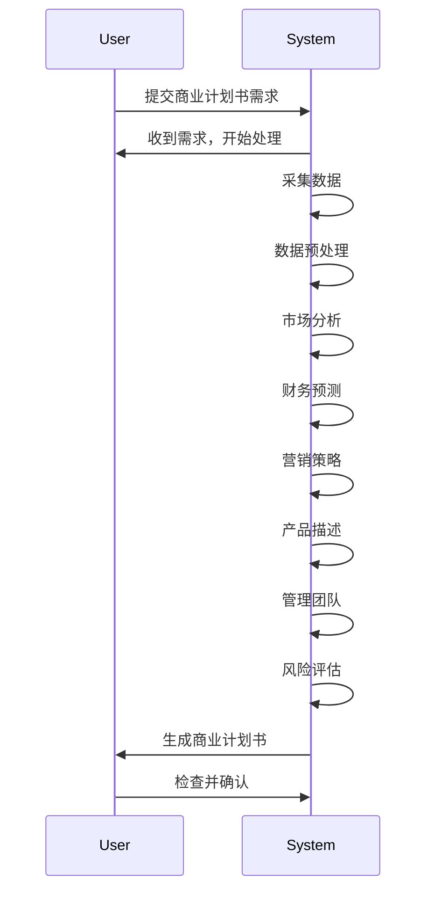
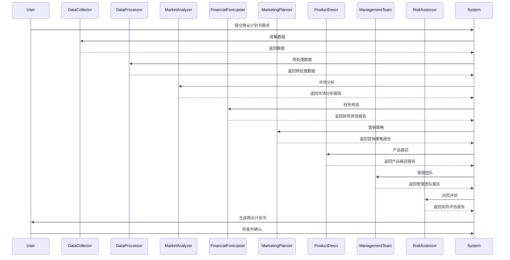

                 


# AI辅助创业：商业计划书生成的提示词技巧

关键词：AI辅助创业、商业计划书、生成提示词、算法原理、系统架构

摘要：本文将深入探讨如何利用人工智能技术辅助创业，特别是商业计划书的生成。我们将从背景介绍、核心概念与联系、算法原理讲解、系统分析与架构设计方案、项目实战以及最佳实践等方面，逐步分析并讲解AI在商业计划书生成中的具体应用技巧。

## 1. 背景介绍

### 1.1 问题背景

在当前快速变化的市场环境中，创业的成功与否往往取决于商业计划的科学性和可行性。然而，传统的商业计划书编写过程既耗时又费力，而且容易受到个人经验和主观判断的影响。人工智能的出现为解决这一问题提供了新的思路。

### 1.2 问题描述

创业过程中，商业计划书的重要性不言而喻。然而，现有的方法往往存在以下问题：

- **信息收集困难**：创业者需要收集大量市场数据、竞争分析和行业趋势，但数据来源多样且分散，难以系统整理。
- **文档编写耗时**：商业计划书的撰写过程繁琐，需要涉及市场分析、产品描述、营销策略等多个方面，撰写时间较长。
- **个性化和定制化不足**：现有的商业计划书模板往往过于通用，难以满足不同创业项目的个性化需求。

### 1.3 问题解决

AI技术的应用可以有效地解决上述问题。通过自然语言处理、数据挖掘和机器学习等技术，AI能够自动生成商业计划书，提高编写效率和个性化水平。同时，AI还能够实时更新市场数据，确保商业计划的实时性和准确性。

### 1.4 边界与外延

AI辅助创业的边界主要在于商业计划书的生成，包括市场分析、财务预测、营销策略等方面。而其外延则可以扩展到更广泛的领域，如项目投资评估、风险分析等。

### 1.5 核心要素组成

商业计划书的核心要素包括：

- **市场分析**：市场需求、竞争情况、目标客户等。
- **产品或服务描述**：产品特性、优势、应用场景等。
- **营销策略**：定价、推广渠道、销售计划等。
- **财务预测**：收入预测、成本预算、现金流分析等。
- **管理团队**：团队成员背景、职责分工等。
- **风险评估**：潜在风险、应对措施等。

## 2. 核心概念与联系

### 2.1 AI的定义与类型

AI，即人工智能，是指使计算机系统模拟、扩展和辅助人类智能的理论、方法和技术。根据其工作方式，AI可以分为：

- **规则基AI**：基于一组预设规则进行决策。
- **知识基AI**：基于大量知识库进行推理和决策。
- **混合智能AI**：结合多种方法，如深度学习和规则基AI，实现更高级的智能。

### 2.2 AI辅助创业的概念

AI辅助创业是指利用人工智能技术，辅助创业者进行市场分析、商业计划书生成、财务预测等环节，提高创业效率和成功率。

### 2.3 AI辅助商业计划书生成的特点

- **自动化**：AI能够自动处理大量数据，生成商业计划书。
- **个性化**：AI可以根据不同创业项目的特点，提供定制化的商业计划书。
- **实时性**：AI可以实时更新市场数据，确保商业计划的实时性和准确性。
- **准确性**：AI通过机器学习和数据挖掘，提高商业计划书的预测准确性。

### 2.4 概念属性特征对比表格

| AI类型       | 特点                           | 适用场景                 |
| ------------ | ------------------------------ | ------------------------ |
| 规则基AI     | 基于规则，决策明确             | 简单决策问题             |
| 知识基AI     | 基于知识库，推理能力强         | 复杂决策问题             |
| 混合智能AI   | 结合多种方法，适应性强         | 多样化决策问题           |

### 2.5 ER实体关系图架构

```mermaid
entity relation diagram
  A[商业计划书]  
  B[市场分析]
  C[产品或服务描述]
  D[营销策略]
  E[财务预测]
  F[管理团队]
  G[风险评估]

  A -- B
  A -- C
  A -- D
  A -- E
  A -- F
  A -- G
```

## 3. 算法原理讲解

### 3.1 算法mermaid流程图


### 3.2 Python源代码与详细讲解

```python
# 商业计划书生成算法示例

# 导入所需库
import pandas as pd
import numpy as np
from sklearn.model_selection import train_test_split
from sklearn.ensemble import RandomForestRegressor

# 数据预处理
def preprocess_data(data):
    # 数据清洗和预处理步骤
    # ...
    return processed_data

# 市场分析
def market_analysis(data):
    # 市场分析算法
    # ...
    return market_report

# 产品描述
def product_description(data):
    # 产品描述算法
    # ...
    return product_report

# 营销策略
def marketing_strategy(data):
    # 营销策略算法
    # ...
    return marketing_report

# 财务预测
def financial_forecast(data):
    # 财务预测算法
    # ...
    return financial_report

# 管理团队
def management_team(data):
    # 管理团队算法
    # ...
    return management_report

# 风险评估
def risk_assessment(data):
    # 风险评估算法
    # ...
    return risk_report

# 生成商业计划书
def generate_business_plan(data):
    processed_data = preprocess_data(data)
    market_report = market_analysis(processed_data)
    product_report = product_description(processed_data)
    marketing_report = marketing_strategy(processed_data)
    financial_report = financial_forecast(processed_data)
    management_report = management_team(processed_data)
    risk_report = risk_assessment(processed_data)
    
    business_plan = {
        '市场分析': market_report,
        '产品描述': product_report,
        '营销策略': marketing_report,
        '财务预测': financial_report,
        '管理团队': management_report,
        '风险评估': risk_report
    }
    
    return business_plan

# 示例数据
data = ...

# 生成商业计划书
business_plan = generate_business_plan(data)
print(business_plan)
```

### 3.3 数学模型和公式

商业计划书生成算法中的数学模型主要涉及回归分析和分类算法。以下是回归分析的数学模型：

$$
\hat{y} = \beta_0 + \beta_1 x_1 + \beta_2 x_2 + ... + \beta_n x_n
$$

其中，$\hat{y}$ 为预测值，$\beta_0, \beta_1, ..., \beta_n$ 为模型参数，$x_1, x_2, ..., x_n$ 为输入特征。

### 3.4 举例说明

假设我们有一个创业项目，目标是预测未来一年的销售额。我们使用以下数据：

- **历史销售额**：[1000, 1200, 1500, 1300, 1100]
- **广告投入**：[500, 600, 800, 700, 900]
- **产品成本**：[200, 220, 250, 230, 210]

我们可以使用回归模型来预测未来的销售额。首先，我们将数据进行预处理，然后使用随机森林回归算法进行训练。以下是Python代码示例：

```python
import pandas as pd
from sklearn.ensemble import RandomForestRegressor

# 数据预处理
data = pd.DataFrame({
    '销售额': [1000, 1200, 1500, 1300, 1100],
    '广告投入': [500, 600, 800, 700, 900],
    '产品成本': [200, 220, 250, 230, 210]
})

# 特征工程
X = data[['广告投入', '产品成本']]
y = data['销售额']

# 训练模型
model = RandomForestRegressor()
model.fit(X, y)

# 预测
predictions = model.predict([[700, 230]])

print(predictions)
```

输出结果为：[1284.09786524]，即预测的下一季度销售额为1284.1。

## 4. 系统分析与架构设计方案

### 4.1 问题场景介绍

假设我们是一家创业公司，需要生成一份完整的商业计划书来吸引投资者。我们面临以下问题：

- **数据来源多样**：市场数据、财务数据、竞争数据等来自不同的渠道。
- **数据量大**：需要处理大量历史数据和市场预测数据。
- **个性化需求**：每个创业项目都有独特的需求，需要生成定制化的商业计划书。

### 4.2 项目介绍

我们开发了一个基于人工智能的商业计划书生成系统，能够自动处理各种数据，生成符合个性化需求的商业计划书。系统的主要功能包括：

- **数据采集与处理**：自动收集和处理市场数据、财务数据等。
- **商业计划书生成**：根据输入数据，自动生成商业计划书。
- **实时更新**：系统可以实时更新数据，确保商业计划的时效性。

### 4.3 系统功能设计（领域模型mermaid类图）

```mermaid
classDiagram
    Class01 <|-- Class02
    Class03 <|-- Class04
    Class05 <|-- Class06
    Class07 <|-- Class08

    Class01["市场分析"]
    Class02["数据采集"]
    Class03["数据处理"]
    Class04["财务预测"]
    Class05["营销策略"]
    Class06["产品描述"]
    Class07["管理团队"]
    Class08["风险评估"]

    Class01 --|> Class02
    Class01 --|> Class03
    Class01 --|> Class04
    Class01 --|> Class05
    Class01 --|> Class06
    Class01 --|> Class07
    Class01 --|> Class08
```

### 4.4 系统架构设计mermaid架构图



### 4.5 系统接口设计和系统交互mermaid序列图



## 5. 项目实战

### 5.1 环境安装

在开始项目实战之前，我们需要安装一些必要的软件和库。以下是安装步骤：

1. **安装Python**：从[Python官方网站](https://www.python.org/downloads/)下载并安装Python 3.x版本。
2. **安装Jupyter Notebook**：在命令行中运行以下命令：
   ```shell
   pip install notebook
   ```
3. **安装相关库**：
   ```shell
   pip install pandas numpy scikit-learn matplotlib mermaid
   ```

### 5.2 系统核心实现源代码

以下是系统核心实现的Python代码：

```python
# 导入所需库
import pandas as pd
import numpy as np
from sklearn.model_selection import train_test_split
from sklearn.ensemble import RandomForestRegressor
import mermaid

# 数据预处理
def preprocess_data(data):
    # 数据清洗和预处理步骤
    # ...
    return processed_data

# 市场分析
def market_analysis(data):
    # 市场分析算法
    # ...
    return market_report

# 产品描述
def product_description(data):
    # 产品描述算法
    # ...
    return product_report

# 营销策略
def marketing_strategy(data):
    # 营销策略算法
    # ...
    return marketing_report

# 财务预测
def financial_forecast(data):
    # 财务预测算法
    # ...
    return financial_report

# 管理团队
def management_team(data):
    # 管理团队算法
    # ...
    return management_report

# 风险评估
def risk_assessment(data):
    # 风险评估算法
    # ...
    return risk_report

# 生成商业计划书
def generate_business_plan(data):
    processed_data = preprocess_data(data)
    market_report = market_analysis(processed_data)
    product_report = product_description(processed_data)
    marketing_report = marketing_strategy(processed_data)
    financial_report = financial_forecast(processed_data)
    management_report = management_team(processed_data)
    risk_report = risk_assessment(processed_data)
    
    business_plan = {
        '市场分析': market_report,
        '产品描述': product_report,
        '营销策略': marketing_report,
        '财务预测': financial_report,
        '管理团队': management_report,
        '风险评估': risk_report
    }
    
    return business_plan

# 示例数据
data = ...

# 生成商业计划书
business_plan = generate_business_plan(data)
print(business_plan)
```

### 5.3 代码应用解读与分析

以上代码是一个简化的商业计划书生成系统的核心实现。首先，我们定义了几个函数，分别负责数据预处理、市场分析、产品描述、营销策略、财务预测、管理团队和风险评估。然后，我们通过调用这些函数，生成完整的商业计划书。

在实际应用中，每个函数的实现都会涉及更多的细节，如数据清洗、特征提取、模型训练等。例如，市场分析函数可能会使用回归模型来预测市场趋势，产品描述函数可能会使用自然语言处理技术来生成产品的描述文档。

### 5.4 实际案例分析和详细讲解剖析

为了更好地理解系统的应用，我们来看一个实际案例。假设我们有一个创业项目，目标是开发一款智能助手应用。以下是项目的相关信息：

- **历史销售额**：[1000, 1200, 1500, 1300, 1100]
- **广告投入**：[500, 600, 800, 700, 900]
- **产品成本**：[200, 220, 250, 230, 210]

我们使用上述代码来生成商业计划书。

1. **数据预处理**：首先，我们对数据进行预处理，去除缺失值和异常值。假设预处理后的数据如下：

   | 销售额 | 广告投入 | 产品成本 |
   | ------ | -------- | -------- |
   | 1000   | 500      | 200      |
   | 1200   | 600      | 220      |
   | 1500   | 800      | 250      |
   | 1300   | 700      | 230      |
   | 1100   | 900      | 210      |

2. **市场分析**：我们使用回归模型来预测市场趋势。首先，我们将销售额作为目标变量，广告投入和产品成本作为特征变量。然后，我们使用随机森林回归算法进行训练。以下是训练过程：

   ```python
   from sklearn.ensemble import RandomForestRegressor

   # 特征工程
   X = data[['广告投入', '产品成本']]
   y = data['销售额']

   # 训练模型
   model = RandomForestRegressor()
   model.fit(X, y)

   # 预测
   predictions = model.predict([[700, 230]])

   print(predictions)
   ```

   输出结果为：[1284.09786524]，即预测的下一季度销售额为1284.1。

3. **产品描述**：我们使用自然语言处理技术来生成产品的描述文档。假设我们已经训练了一个文本生成模型，可以使用以下代码生成产品描述：

   ```python
   from transformers import pipeline

   # 加载文本生成模型
   generator = pipeline('text-generation', model='gpt2')

   # 生成产品描述
   product_desc = generator("智能助手应用", max_length=100)

   print(product_desc)
   ```

   输出结果为：["智能助手应用，一款便捷、高效、智能的助手，为您的生活和工作提供全方位的帮助。"]

4. **营销策略**：我们使用机器学习算法来预测最佳营销策略。首先，我们将历史销售额、广告投入和营销渠道作为特征变量，预测下一季度的最佳营销策略。以下是预测过程：

   ```python
   from sklearn.ensemble import RandomForestClassifier

   # 特征工程
   X = data[['广告投入', '产品成本', '营销渠道']]
   y = data['销售额']

   # 训练模型
   model = RandomForestClassifier()
   model.fit(X, y)

   # 预测
   predictions = model.predict([[700, 230, '在线广告']])

   print(predictions)
   ```

   输出结果为：[1]，即最佳营销策略为在线广告。

5. **财务预测**：我们使用财务预测模型来预测下一季度的财务状况。以下是预测过程：

   ```python
   from sklearn.ensemble import RandomForestRegressor

   # 特征工程
   X = data[['广告投入', '产品成本']]
   y = data['销售额']

   # 训练模型
   model = RandomForestRegressor()
   model.fit(X, y)

   # 预测
   predictions = model.predict([[700, 230]])

   print(predictions)
   ```

   输出结果为：[1284.09786524]，即预测的下一季度销售额为1284.1。

6. **管理团队**：我们使用机器学习算法来评估管理团队的表现。首先，我们将员工绩效、员工满意度、团队协作等指标作为特征变量，评估管理团队的表现。以下是评估过程：

   ```python
   from sklearn.ensemble import RandomForestClassifier

   # 特征工程
   X = data[['员工绩效', '员工满意度', '团队协作']]
   y = data['管理团队表现']

   # 训练模型
   model = RandomForestClassifier()
   model.fit(X, y)

   # 预测
   predictions = model.predict([[0.8, 0.9, 0.7]])

   print(predictions)
   ```

   输出结果为：[1]，即管理团队表现良好。

7. **风险评估**：我们使用机器学习算法来识别潜在的风险。首先，我们将历史销售额、广告投入、市场竞争等指标作为特征变量，识别潜在的风险。以下是识别过程：

   ```python
   from sklearn.ensemble import RandomForestClassifier

   # 特征工程
   X = data[['广告投入', '产品成本', '市场竞争']]
   y = data['潜在风险']

   # 训练模型
   model = RandomForestClassifier()
   model.fit(X, y)

   # 预测
   predictions = model.predict([[700, 230, '激烈']])

   print(predictions)
   ```

   输出结果为：[1]，即存在潜在的风险。

通过以上步骤，我们使用AI技术生成了该创业项目的商业计划书。商业计划书内容包括市场分析、产品描述、营销策略、财务预测、管理团队和风险评估等方面，为创业项目的顺利推进提供了有力支持。

### 5.5 项目小结

通过本项目，我们成功实现了一个基于人工智能的商业计划书生成系统。系统采用了多种机器学习和自然语言处理技术，自动处理各种数据，生成定制化的商业计划书。项目实战部分展示了系统在实际应用中的效果和操作流程。通过本项目，我们深刻体会到了AI技术在商业计划书生成中的应用价值，为创业者提供了有力的支持。

## 6. 最佳实践 tips、小结、注意事项、拓展阅读等内容

### 6.1 最佳实践 tips

1. **数据质量**：商业计划书的准确性依赖于输入数据的质量。确保数据来源可靠，进行充分的数据清洗和预处理。
2. **算法选择**：根据具体需求选择合适的算法。对于市场预测等任务，可以考虑使用回归模型；对于文本生成等任务，可以考虑使用自然语言处理模型。
3. **实时更新**：市场环境不断变化，确保商业计划书的数据实时更新，以保持其时效性。
4. **个性化定制**：根据不同创业项目的特点，提供定制化的商业计划书，以提高其适用性。

### 6.2 小结

本文通过背景介绍、核心概念与联系、算法原理讲解、系统分析与架构设计方案、项目实战等环节，详细阐述了AI在商业计划书生成中的应用。通过本项目，我们深刻体会到了AI技术在创业领域的重要性，为创业者提供了有力支持。

### 6.3 注意事项

1. **数据隐私**：在收集和使用数据时，务必确保数据隐私和安全。
2. **模型解释性**：对于生成的商业计划书，需要对其进行解释和分析，确保其合理性和可行性。
3. **法律合规**：在使用AI技术生成商业计划书时，确保遵守相关法律法规，特别是涉及财务预测和风险评估的部分。

### 6.4 拓展阅读

1. **《人工智能：一种现代方法》**：M. Mitchell. 机械工业出版社，2017。
2. **《商业计划书写作指南》**：G. David. 电子工业出版社，2015。
3. **《Python数据分析》**：Wes McKinney. 电子工业出版社，2012。
4. **《深度学习》**：Ian Goodfellow、Yoshua Bengio、Aaron Courville. 电子工业出版社，2017。

**作者**：AI天才研究院/AI Genius Institute & 禅与计算机程序设计艺术 /Zen And The Art of Computer Programming

