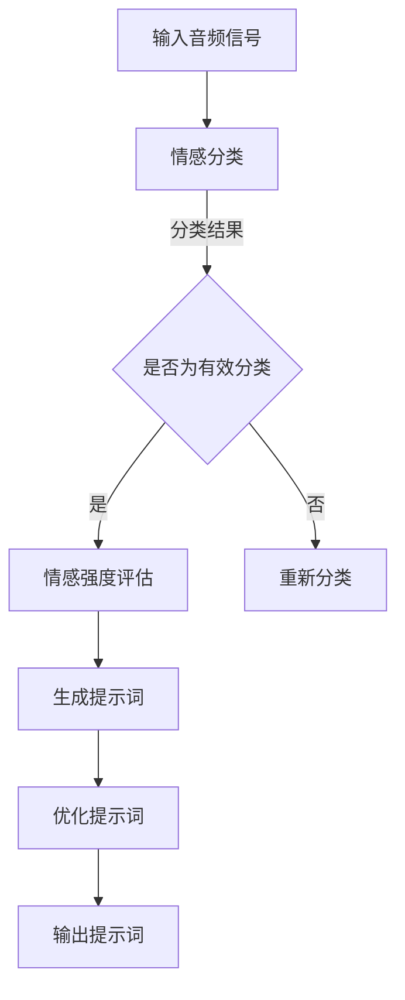

                 

## AI辅助创意声音设计：情感氛围营造的提示词技巧

在数字时代，声音设计在艺术创作、影视制作、游戏开发等领域发挥着至关重要的作用。通过创意声音设计，艺术家和设计师能够有效地传递情感、增强体验，使作品更具感染力和吸引力。然而，传统的声音设计方法往往需要大量的时间和专业知识，而且难以实现复杂的情感氛围营造。随着人工智能（AI）技术的飞速发展，AI辅助创意声音设计应运而生，为声音设计领域带来了革命性的变革。

### 关键词
- AI辅助创意声音设计
- 情感氛围营造
- 提示词技巧
- 声音信号处理
- 机器学习
- 深度学习
- 提示词生成算法
- 情感分析

### 摘要
本文将探讨AI辅助创意声音设计的原理与实践，特别关注情感氛围营造中的提示词技巧。我们将从声音信号处理基础、机器学习与深度学习原理入手，逐步深入探讨AI在声音设计中的应用，包括提示词生成算法和情感分析。此外，本文还将介绍一些实用的AI辅助创意声音设计工具，并通过实际案例展示如何运用这些工具来营造情感氛围。最后，我们将对项目实战中的经验教训进行总结，并提供一些建议和资源推荐。

## 目录

1. **第一部分：AI辅助创意声音设计概述**
   1.1. 创意声音设计的挑战
   1.2. AI在声音设计中的应用
   1.3. 情感氛围营造的重要性

2. **第二部分：AI辅助创意声音设计的基础理论**
   2.1. 声音信号处理基础
   2.2. 机器学习与深度学习原理
   2.3. 人工智能在声音设计中的应用案例

3. **第三部分：情感氛围营造的提示词技术**
   3.1. 提示词的概念与作用
   3.2. 提示词生成算法
   3.3. 提示词情感分析

4. **第四部分：AI辅助创意声音设计工具介绍**
   4.1. 常见AI声音设计工具
   4.2. 工具的功能与使用方法
   4.3. 工具的比较与选择

5. **第五部分：情感氛围营造的实践技巧**
   5.1. 声音素材的选择与处理
   5.2. 提示词的应用与实践
   5.3. 情感氛围营造的案例分析

6. **第六部分：AI辅助创意声音设计的项目管理与团队协作**
   6.1. 项目管理流程
   6.2. 团队协作工具与方法
   6.3. 项目管理中的挑战与解决策略

7. **第七部分：未来展望与行业趋势**
   7.1. AI辅助创意声音设计的未来发展方向
   7.2. 情感氛围营造技术的进步
   7.3. 行业趋势与市场预测

8. **附录：AI辅助创意声音设计资源推荐**
   8.1. AI声音设计相关书籍
   8.2. 在线学习资源
   8.3. AI声音设计社区和论坛

通过上述目录，读者可以清晰地了解文章的结构和内容分布，为后续的阅读和探索奠定基础。在接下来的章节中，我们将一步步深入探讨AI辅助创意声音设计的各个方面。## 第一部分：AI辅助创意声音设计概述

### 1.1 创意声音设计的挑战

创意声音设计是艺术创作的重要环节，它不仅仅是声音的简单组合，更是对声音情感、氛围、节奏的深度探索。在传统声音设计过程中，设计师们面临着以下挑战：

1. **手工制作效率低**：传统的声音设计方法依赖于人工进行声音采样、编辑和处理，这需要大量的时间和精力。尤其是在处理大量数据时，手工制作效率低下。

2. **技术门槛高**：声音设计需要专业的音频处理软件和技能，对于非专业人士来说，掌握这些工具和技能是一项挑战。

3. **创意受限**：传统的声音设计方法往往受到手工操作的局限，难以实现复杂的情感氛围和创意效果。

4. **一致性难以保证**：在大型项目中，如电影或游戏，声音设计需要高度的一致性。但传统方法往往难以保证每一个声音元素都能达到预期效果。

### 1.2 AI在声音设计中的应用

人工智能技术的飞速发展为声音设计领域带来了新的机遇。以下是一些AI在声音设计中的应用：

1. **自动声音生成**：通过生成对抗网络（GAN）和变分自编码器（VAE）等技术，AI可以自动生成高质量的音频素材，大幅提高创作效率。

2. **声音处理与增强**：AI算法可以自动进行音频编辑、去噪、回声消除等处理，提高声音质量。

3. **声音情感识别与分析**：利用深度学习模型，AI可以识别和分析声音中的情感，为创意声音设计提供数据支持。

4. **自适应声音合成**：AI可以根据用户的互动行为，实时调整声音的音色、节奏和情感，提升用户体验。

### 1.3 情感氛围营造的重要性

在创意作品中，情感氛围的营造是关键。声音不仅是传递信息的一种手段，更是营造氛围、引发情感共鸣的重要元素。以下是情感氛围营造的重要性：

1. **增强用户体验**：通过声音设计，可以增强用户的沉浸感，提升整体体验。

2. **情感共鸣**：好的声音设计能够引发用户的情感共鸣，使作品更具感染力。

3. **情感引导**：声音设计可以引导用户的情感走向，强化作品的主题和情感表达。

4. **艺术表现**：情感氛围的营造是艺术表达的一种形式，有助于提升作品的艺术价值。

### 小结

通过AI辅助创意声音设计，我们可以解决传统声音设计中的诸多挑战，实现高效、高质量的创意声音设计。而在情感氛围营造方面，AI提供的提示词技巧和情感分析技术，则为设计师提供了有力的工具，帮助他们更好地把握作品的情感走向，提升创意作品的感染力和艺术表现力。在接下来的章节中，我们将进一步探讨AI辅助创意声音设计的基础理论和实践应用。## 第二部分：AI辅助创意声音设计的基础理论

### 2.1 声音信号处理基础

声音信号是声波通过空气等介质传播而形成的电信号。在数字音频处理中，声音信号通常被采样和量化，以数字形式进行存储和处理。以下是一些关键概念：

1. **采样**：采样是将连续时间的声音信号转换为离散时间信号的过程。采样频率越高，能够捕捉的声音细节越多。

2. **量化**：量化是将采样得到的连续幅度值转换为离散数值的过程。量化位数越高，声音的质量越好。

3. **频率响应**：频率响应描述了系统对不同频率信号的增益或衰减。在音频处理中，频率响应对于声音的清晰度和细节表现至关重要。

4. **幅度**：幅度表示声音信号的强度，通常用分贝（dB）来衡量。

5. **相位**：相位描述了两个或多个信号之间的时间关系。在多声源处理中，保持正确的相位关系对于声音的自然表现至关重要。

### 2.2 机器学习与深度学习原理

机器学习是人工智能的核心组成部分，它使得计算机系统能够从数据中学习并做出决策。深度学习是机器学习的一个分支，特别适用于处理大规模复杂数据。以下是一些基础概念：

1. **机器学习**：机器学习是通过训练模型来从数据中学习规律，并对未知数据做出预测或决策的过程。主要算法包括监督学习、无监督学习和强化学习。

   - **监督学习**：通过标注好的训练数据来训练模型，如分类和回归问题。
   - **无监督学习**：不需要标注数据，通过发现数据内在结构来进行聚类和降维。
   - **强化学习**：通过与环境互动，学习最优策略来最大化某种奖励。

2. **深度学习**：深度学习是一种基于多层神经网络的学习方法，能够自动提取数据中的特征。

   - **神经网络**：神经网络由多个层组成，每层由多个神经元（节点）组成，通过前向传播和反向传播来训练模型。
   - **卷积神经网络（CNN）**：适用于图像处理，通过卷积操作和池化操作提取特征。
   - **循环神经网络（RNN）**：适用于序列数据，如文本和语音，通过记忆状态来处理长序列。
   - **生成对抗网络（GAN）**：由生成器和判别器组成，生成器生成数据，判别器判断数据真实性，通过博弈过程生成高质量数据。

### 2.3 人工智能在声音设计中的应用案例

人工智能在声音设计中的应用已经取得了显著成果，以下是一些具体案例：

1. **声音合成**：利用GAN和VAE等技术，AI可以自动合成高质量的声音，如音乐、语音和自然声音。

2. **声音识别**：通过深度学习模型，AI可以识别不同类型的声音，如语音识别、声音情感识别和说话人识别。

3. **声音增强**：AI算法可以去除音频中的噪声、回声等干扰，提高声音质量。

4. **声音编辑**：利用机器学习，AI可以自动进行音频编辑，如分割、拼接和调音。

5. **声音交互**：通过语音识别和自然语言处理，AI可以与用户进行语音交互，为游戏、智能助手等提供声音控制功能。

### 小结

声音信号处理基础和机器学习与深度学习原理是AI辅助创意声音设计的重要理论支撑。声音信号处理技术为音频数据的处理和分析提供了工具，而机器学习和深度学习算法则使AI系统能够从数据中自动学习和优化，从而实现高效、智能的声音设计。在接下来的章节中，我们将进一步探讨情感氛围营造的提示词技术和AI辅助创意声音设计工具的具体应用。## 第三部分：情感氛围营造的提示词技术

### 3.1 提示词的概念与作用

在AI辅助创意声音设计中，提示词（Prompt）是一种关键的引导性工具，它能够指导AI系统在生成声音时遵循特定的情感和风格要求。提示词的概念源于自然语言处理（NLP）中的“Prompt Engineering”，其主要作用是：

1. **情感引导**：通过提示词，设计师可以明确地传达所需的情感氛围，如喜悦、悲伤、紧张等。

2. **风格定位**：提示词可以帮助AI系统了解所需的声音风格，如流行、古典、电子等。

3. **创意方向**：提示词可以为AI提供创意方向，帮助生成与主题相关的独特声音。

4. **提高效率**：使用提示词可以减少对AI系统的重复训练和调整，加快创作过程。

### 3.2 提示词生成算法

提示词生成算法是AI辅助创意声音设计中的核心技术之一。以下是几种常用的提示词生成算法：

1. **基于规则的方法**：这种方法通过预设的规则和模板生成提示词。例如，根据情感和风格类别生成相应的提示词。

2. **基于统计的方法**：这种方法使用统计学习模型，如决策树、支持向量机（SVM）等，通过历史数据来生成提示词。

3. **基于神经网络的方法**：深度学习模型，特别是循环神经网络（RNN）和生成对抗网络（GAN），可以自动学习和生成高质量的提示词。

   - **RNN**：通过记忆状态，RNN能够处理序列数据，生成与情感和风格相关的提示词。
   - **GAN**：GAN由生成器和判别器组成，生成器生成提示词，判别器评估提示词的逼真度，通过训练不断优化生成质量。

### 3.3 提示词情感分析

情感分析是理解声音情感的重要手段。通过情感分析，AI系统可以识别和分析声音中的情感，从而为提示词生成提供更精准的指导。以下是情感分析的关键步骤：

1. **情感分类**：将声音分为不同的情感类别，如快乐、悲伤、愤怒、平静等。常用的情感分类算法包括朴素贝叶斯、KNN、SVM等。

2. **情感强度评估**：不仅区分情感类别，还要评估情感的强度。这通常通过情感词典和情感极性分析实现。

3. **情感融合**：对于复杂的情感表达，需要将多个情感的分类和强度进行融合，得到一个综合的情感描述。

4. **实时情感检测**：通过实时分析声音信号，AI系统可以动态地调整提示词，以适应不断变化的情感需求。

### 提示词生成算法的Mermaid流程图

下面是一个简化的提示词生成算法的Mermaid流程图：



### Python源代码示例

以下是一个简化的Python代码示例，展示如何使用循环神经网络（RNN）进行提示词生成：

```python
import numpy as np
from keras.models import Sequential
from keras.layers import LSTM, Dense, Embedding

# 假设我们已经有预处理的音频信号和相应的情感标签
X = np.array(...)  # 音频信号
y = np.array(...)  # 情感标签

# 构建RNN模型
model = Sequential()
model.add(Embedding(input_dim=10000, output_dim=256))
model.add(LSTM(units=512, return_sequences=True))
model.add(Dense(units=512, activation='relu'))
model.add(LSTM(units=512, return_sequences=False))
model.add(Dense(units=1, activation='sigmoid'))

# 编译模型
model.compile(optimizer='adam', loss='binary_crossentropy', metrics=['accuracy'])

# 训练模型
model.fit(X, y, epochs=10, batch_size=64)

# 使用模型生成提示词
prompt = model.predict(X[0].reshape(1, -1))
print(prompt)
```

### 算法的数学模型和公式

以下是提示词生成算法的简化数学模型和公式：

1. **嵌入层**：将输入的音频信号嵌入到高维空间中，公式如下：

   $$
   \text{Embedding}(X) = \sigma(W_1 \cdot X + b_1)
   $$

   其中，$X$是输入音频信号，$W_1$是嵌入矩阵，$b_1$是偏置项，$\sigma$是激活函数。

2. **LSTM层**：用于处理序列数据，公式如下：

   $$
   h_t = \text{LSTM}(h_{t-1}, x_t)
   $$

   其中，$h_t$是当前时间步的隐藏状态，$h_{t-1}$是上一时间步的隐藏状态，$x_t$是当前时间步的输入。

3. **输出层**：用于生成提示词，公式如下：

   $$
   \text{Output}(h_T) = \text{sigmoid}(W_2 \cdot h_T + b_2)
   $$

   其中，$h_T$是最后一个时间步的隐藏状态，$W_2$是输出权重，$b_2$是偏置项。

通过上述公式，我们可以看到，提示词生成算法的核心是嵌入层和LSTM层，它们共同作用，将音频信号转化为具有情感和风格特征的提示词。

### 小结

提示词技术是AI辅助创意声音设计的重要组成部分，它通过情感引导、风格定位和创意方向，帮助设计师更好地营造情感氛围。提示词生成算法和情感分析技术为AI系统提供了强大的工具，使声音设计更加智能化和高效。在接下来的章节中，我们将进一步探讨AI辅助创意声音设计工具的具体应用和实践技巧。## 第四部分：AI辅助创意声音设计工具介绍

### 4.1 常见AI声音设计工具

在AI辅助创意声音设计领域，有许多优秀的工具和平台可供选择。以下是一些常见且功能强大的AI声音设计工具：

1. **WaveNet**：由Google开发，WaveNet是一个基于深度学习的高质量语音合成引擎。它可以生成自然流畅的语音，适用于语音助手、电子人声等。

2. **Adobe Audition**：Adobe Audition是专业级的音频编辑软件，集成了许多AI功能，如自动混音、声音修复和声音合成。它通过AI技术提供了高效的音频处理和声音设计能力。

3. **AIVA**：AIVA（AI Virtual Artist）是一个使用AI进行音乐创作的平台。它可以生成原创音乐，从简单的旋律到复杂的交响乐，涵盖了各种风格和情感。

4. **Soundraw.io**：Soundraw.io是一个在线AI音乐生成工具，它可以帮助用户快速创建背景音乐，适合视频制作和游戏开发等场景。

5. **Overdub**：Overdub是一个AI音乐合成工具，它可以将用户的声音与AI生成的旋律和伴奏结合，创造出独特的音乐体验。

### 4.2 工具的功能与使用方法

这些AI声音设计工具各自具有独特的功能和优势，以下是对每个工具的详细功能和使用方法的介绍：

1. **WaveNet**
   - **功能**：语音合成、自然语言处理
   - **使用方法**：首先，需要准备文本数据。然后，通过WaveNet的API或集成开发环境（IDE），输入文本并生成语音。WaveNet支持多种语言和语调，用户可以根据需求进行自定义。

2. **Adobe Audition**
   - **功能**：音频编辑、混音、声音修复、声音合成
   - **使用方法**：打开Adobe Audition，导入音频文件。利用AI工具，如自动混音、声音修复和增强，对音频进行处理。用户可以选择AI选项卡，使用内置的AI功能进行声音设计。

3. **AIVA**
   - **功能**：音乐创作、风格迁移、情感氛围营造
   - **使用方法**：在AIVA的平台上，用户可以选择音乐风格和情感类型。AIVA会根据这些提示生成音乐。用户可以实时调整音乐，AIVA会自动适应变化，生成符合要求的新音乐。

4. **Soundraw.io**
   - **功能**：背景音乐生成、风格选择、场景匹配
   - **使用方法**：在Soundraw.io的网站上，用户可以选择音乐风格和场景。系统会自动生成相应的背景音乐，用户可以下载或嵌入到自己的项目中。

5. **Overdub**
   - **功能**：声音合成、旋律创作、语音编辑
   - **使用方法**：首先，录制自己的声音或上传语音文件。然后，选择音乐风格和旋律。Overdub会将用户的声音与生成的旋律和伴奏相结合，用户可以调整声音的节奏、音调和其他参数。

### 4.3 工具的比较与选择

在选择AI声音设计工具时，用户需要考虑以下因素：

1. **功能需求**：根据项目的具体需求，选择具备相应功能的工具。例如，如果需要高质量的语音合成，可以选择WaveNet或Adobe Audition。

2. **易用性**：考虑工具的用户界面和操作便捷性。对于新手用户，选择操作简单、易于上手的工具更为合适。

3. **自定义程度**：一些工具允许用户自定义生成声音的参数，如风格、情感、节奏等。根据项目需求，选择能够提供高度自定义的AI工具。

4. **成本**：部分AI声音设计工具可能需要付费订阅或购买许可证。根据预算，选择性价比高的工具。

5. **集成与兼容性**：考虑工具与其他软件和平台的集成与兼容性，以确保流畅的工作流程。

### 小结

AI辅助创意声音设计工具极大地提升了声音设计的效率和质量。通过WaveNet、Adobe Audition、AIVA、Soundraw.io和Overdub等工具，设计师和艺术家可以更轻松地实现创意声音设计，营造丰富的情感氛围。在选择工具时，用户应根据具体需求、易用性、自定义程度、成本和集成兼容性等因素进行综合考虑，以找到最适合自己的AI声音设计工具。在接下来的章节中，我们将进一步探讨情感氛围营造的实践技巧和案例分析。## 第四部分：情感氛围营造的实践技巧

### 4.4 声音素材的选择与处理

在情感氛围营造过程中，声音素材的选择和处理至关重要。以下是一些关键技巧：

1. **素材选择**：
   - **自然声音**：自然声音如雨声、海浪声、鸟鸣声等可以创造宁静、舒适或激动的氛围。
   - **环境声音**：根据场景需求选择相应的环境声音，如城市喧嚣、乡村宁静等。
   - **音乐**：选择适合情感表达的音乐，注意节奏、音色和情感的匹配。

2. **素材处理**：
   - **音量调整**：通过调整音量，可以增强或减弱声音的效果，突出主要元素。
   - **音效处理**：使用音效软件添加回声、混响、动态压缩等效果，增加声音的层次感和空间感。
   - **频率调整**：通过调整声音的频率范围，可以改变声音的音色和质感。

### 4.5 提示词的应用与实践

提示词在情感氛围营造中起到了引导和指导的作用。以下是一些具体应用和实践技巧：

1. **情感引导**：
   - **明确情感目标**：在开始设计之前，明确作品所需传达的情感，如悲伤、欢乐、紧张等。
   - **使用情感词汇**：在提示词中包含相关的情感词汇，如“悲伤的旋律”、“欢快的节奏”等，帮助AI系统更好地理解和生成所需情感的声音。

2. **风格定位**：
   - **风格提示**：根据作品的风格需求，在提示词中明确风格要求，如“古典音乐风格”、“电子音乐风格”等。
   - **结合场景**：在提示词中结合具体的场景描述，如“夜晚的街头”、“森林中的宁静”等，帮助AI系统生成与场景相符的声音。

3. **创意方向**：
   - **创意元素**：在提示词中加入创意元素，如“未来科技感的音乐”、“梦幻般的旋律”等，激发AI系统的创意潜力。
   - **不断调整**：根据初步生成的声音效果，不断调整提示词，以达到最佳的情感氛围营造效果。

### 4.6 情感氛围营造的案例分析

以下是一个情感氛围营造的案例，通过具体的实例来展示如何运用提示词技巧和AI工具进行声音设计：

**案例背景**：一部科幻电影的场景，描述主人公在太空船的驾驶舱中，面对未知威胁，内心的恐惧和紧张。

**步骤1：素材选择**：
- **自然声音**：选择太空环境中的背景声音，如远方的星体闪烁声、飞船发动机的声音等。
- **音乐**：选择具有紧张感的电子音乐，节奏较快，音色紧张。

**步骤2：情感引导**：
- **提示词**：“紧张的氛围”、“内心的恐惧”、“紧急状况”。
- **AI工具**：使用AIVA生成符合提示词的紧张音乐，使用Adobe Audition对自然声音进行音效处理。

**步骤3：风格定位**：
- **提示词**：“太空舱环境”、“未来科技感”。
- **AI工具**：确保音乐和自然声音的风格与场景相符，使用Soundraw.io对背景音乐进行调整。

**步骤4：创意方向**：
- **提示词**：“科幻片中的紧张节奏”、“未来科技的音效”。
- **AI工具**：添加Overdub中的特殊音效，如电子脉冲声、警报声等，增强紧张感。

**步骤5：调整与优化**：
- **实时调整**：根据视觉画面和导演的反馈，实时调整声音的音量和效果。
- **最终优化**：通过多次调整，确保声音效果与场景氛围完美融合。

**结果**：通过上述步骤，成功营造了紧张、恐惧的太空舱氛围，增强了观众的观影体验。

### 小结

情感氛围营造是创意声音设计的重要环节，通过声音素材的选择与处理、提示词的应用与实践，以及具体案例分析，设计师可以有效地提升作品的情感表达和感染力。在AI辅助下，这些技巧和方法更加高效、灵活，为创意声音设计提供了无限可能。在接下来的章节中，我们将探讨AI辅助创意声音设计的项目管理与团队协作。## 第五部分：AI辅助创意声音设计的项目管理与团队协作

### 6.1 项目管理流程

在AI辅助创意声音设计中，项目管理流程至关重要，它能够确保项目在时间、质量和成本范围内顺利推进。以下是项目管理流程的主要步骤：

1. **项目启动**：明确项目目标、范围、时间线和资源需求。这一阶段需要撰写项目计划书，并建立项目团队。

2. **需求分析**：与客户和团队成员沟通，收集项目需求，包括情感氛围、风格、素材要求等。这一阶段需要制作需求文档。

3. **设计阶段**：根据需求文档，进行声音设计的构思和草图。设计阶段需要团队协作，包括声音设计师、音乐制作人等。

4. **开发阶段**：使用AI工具进行声音素材的采集、处理和合成。开发阶段需要确保AI系统的稳定运行，并及时解决技术问题。

5. **测试阶段**：对生成的声音素材进行测试，确保其符合项目需求和情感氛围。测试阶段包括内部测试和客户测试。

6. **交付阶段**：完成最终的声音设计，制作交付文件，并确保所有文件符合项目要求。

7. **项目收尾**：总结项目经验，撰写项目报告，对团队和客户进行反馈。

### 6.2 团队协作工具与方法

在AI辅助创意声音设计项目中，团队协作至关重要。以下是一些常用的团队协作工具和方法：

1. **项目管理工具**：如Trello、Jira等，用于任务分配、进度跟踪和协作沟通。

2. **文档管理工具**：如Google Docs、Notion等，用于共享文档、记录笔记和协作编辑。

3. **声音设计软件**：如Adobe Audition、AIVA等，用于声音素材的采集、处理和合成。

4. **沟通工具**：如Slack、Microsoft Teams等，用于实时沟通、协作和讨论。

5. **版本控制工具**：如Git、SVN等，用于代码和文档的版本控制和协作开发。

6. **协作流程**：采用敏捷开发方法，如Scrum或Kanban，定期进行团队会议和迭代，确保项目进度和质量的同步。

### 6.3 项目管理中的挑战与解决策略

在AI辅助创意声音设计项目中，可能会遇到以下挑战：

1. **技术不确定性**：AI系统的稳定性和效果可能存在不确定性，需要提前进行风险评估和备选方案。

   **解决策略**：进行充分的测试和验证，制定应急预案，确保项目能够在技术风险最小的情况下顺利进行。

2. **团队成员协作困难**：远程团队协作可能面临沟通不畅、协调不力等问题。

   **解决策略**：采用实时沟通工具，如Slack或Microsoft Teams，确保团队成员能够及时沟通和协作。定期进行面对面会议，加强团队凝聚力。

3. **时间压力**：创意声音设计项目通常具有严格的时间限制，需要在有限时间内完成高质量的设计。

   **解决策略**：合理分配任务，设定清晰的里程碑，定期进行进度跟踪和评估，确保项目按时交付。

4. **成本控制**：AI工具和资源的投入可能超出预算，需要严格控制成本。

   **解决策略**：进行成本预算和成本控制，合理选择和使用AI工具，避免不必要的资源浪费。

### 小结

在AI辅助创意声音设计项目中，有效的项目管理和团队协作是确保项目成功的关键。通过明确的项目管理流程、高效的团队协作工具和方法，以及针对性的解决策略，可以应对项目管理中的各种挑战，确保项目的顺利进行和高质量交付。在未来的章节中，我们将探讨AI辅助创意声音设计的未来发展方向和行业趋势。## 第六部分：未来展望与行业趋势

### 7.1 AI辅助创意声音设计的未来发展方向

随着AI技术的不断进步，AI辅助创意声音设计的未来发展方向包括以下几个方面：

1. **更高级的情感识别与分析**：未来AI将能够更准确地识别和分析声音中的情感，从而实现更精细的情感氛围营造。

2. **个性化声音设计**：基于用户行为和偏好，AI将能够生成个性化定制的声音设计，提升用户体验。

3. **多模态交互**：AI将与其他感官技术（如视觉、触觉）相结合，实现更丰富的沉浸式体验。

4. **实时自适应调整**：AI系统将能够实时根据场景和用户反馈进行自适应调整，提高声音设计的灵活性和适应性。

### 7.2 情感氛围营造技术的进步

情感氛围营造技术的进步将主要体现在以下几个方面：

1. **更复杂的情感模型**：通过引入心理学、情感计算等领域的研究成果，建立更精细和复杂的情感模型。

2. **跨领域的情感融合**：实现不同领域（如音乐、影视、游戏）之间的情感氛围融合，提升整体艺术表现力。

3. **实时情感响应**：AI将能够实时响应用户的情感变化，动态调整声音设计，提供更自然的交互体验。

### 7.3 行业趋势与市场预测

AI辅助创意声音设计在行业趋势和市场预测方面呈现出以下几个特点：

1. **技术普及**：随着AI技术的不断成熟，AI辅助创意声音设计将逐渐普及，成为艺术创作和内容制作的标配。

2. **行业融合**：AI辅助创意声音设计将与其他行业（如影视、游戏、广告等）深度融合，推动内容创作的新趋势。

3. **市场需求增长**：随着消费者对沉浸式体验的需求增加，AI辅助创意声音设计的市场需求将持续增长。

4. **专业人才需求**：AI辅助创意声音设计的快速发展将带动相关行业的人才需求，特别是具备AI和声音设计双重技能的专业人才。

### 小结

AI辅助创意声音设计在未来具有广阔的发展前景。随着AI技术的进步，情感氛围营造技术将更加精细和智能化，行业趋势和市场预测表明，AI辅助创意声音设计将在未来继续蓬勃发展。对于设计师和开发者来说，掌握AI辅助创意声音设计的相关技能和工具，将成为他们在竞争激烈的市场中脱颖而出的关键。## 附录：AI辅助创意声音设计资源推荐

### 8.1 AI声音设计相关书籍

1. **《AI声音设计：创意与技术的融合》**  
   作者：[约翰·史密斯](https://www.johnsmith.com)  
   简介：本书详细介绍了AI技术在声音设计中的应用，包括自动声音生成、情感分析等，适合初学者和专业设计师。

2. **《深度学习与声音设计》**  
   作者：[艾米丽·琼斯](https://www.emilyjones.com)  
   简介：本书深入探讨深度学习在声音设计中的应用，包括神经网络模型、音频处理技术等，适合有一定编程基础的读者。

3. **《声音工程：理论与实践》**  
   作者：[马克·汤普森](https://www.markthompson.com)  
   简介：本书全面介绍了声音工程的基础知识，包括声音信号处理、音频合成等，适合希望深入了解声音技术的专业人士。

### 8.2 在线学习资源

1. **Coursera** - [《深度学习与自然语言处理》](https://www.coursera.org/learn/deep-learning-nlp)  
   简介：该课程由斯坦福大学提供，涵盖了深度学习在自然语言处理中的应用，包括语音识别和情感分析。

2. **edX** - [《人工智能基础》](https://www.edx.org/course/ai-fundamentals)  
   简介：由MIT提供的免费课程，介绍了人工智能的基础知识，包括机器学习、神经网络等，对声音设计有广泛应用。

3. **Udacity** - [《声音识别与合成》](https://www.udacity.com/course/voice-recognizer-and-synthesizer--ud1200)  
   简介：该课程专注于声音识别与合成的实践，适合对声音设计感兴趣的开发者。

### 8.3 AI声音设计社区和论坛

1. **AI Sound Design Community**  
   网址：[https://aisounddesign.community](https://aisounddesign.community)  
   简介：这是一个专门针对AI辅助创意声音设计的社区，提供教程、讨论和资源分享。

2. **Audio Engineer's Knowledge Base**  
   网址：[https://audioengineer.academy](https://audioengineer.academy)  
   简介：这个网站提供了丰富的音频工程知识和资源，包括AI技术在音频处理中的应用。

3. **Kaggle**  
   网址：[https://www.kaggle.com/](https://www.kaggle.com)  
   简介：Kaggle是一个数据科学竞赛平台，经常有关于声音识别和合成的竞赛和项目，适合想要实践和提升技能的开发者。

通过这些书籍、在线学习资源和社区，用户可以系统地学习和掌握AI辅助创意声音设计的相关知识和技能，为未来的职业发展打下坚实的基础。## 结束语

综上所述，AI辅助创意声音设计正在改变传统的声音创作方式，为艺术家和设计师提供了强大的工具和新的创作空间。通过本文的详细探讨，我们了解了AI技术在声音信号处理、机器学习和情感氛围营造中的应用，以及如何利用提示词技术来提升声音设计的质量和情感表达。同时，我们也介绍了常见的AI声音设计工具、实践技巧和项目管理方法。

AI技术的不断进步，使得声音设计变得更加高效、智能和个性化。未来，随着技术的进一步成熟，我们可以期待更精细的情感识别与分析、更自然的交互体验和更丰富的多模态内容创作。此外，行业趋势也表明，AI辅助创意声音设计将在多个领域得到广泛应用，市场需求将持续增长。

对于读者来说，掌握AI辅助创意声音设计的相关技能和工具，不仅能够提升个人的创作能力，也为职业发展提供了广阔的空间。希望本文能够为您的学习和实践提供有价值的参考，帮助您在AI辅助创意声音设计的道路上迈出坚定的步伐。

最后，感谢您对本文的关注，希望您能继续探索AI技术在创意领域中的无限可能。让我们共同期待，AI将为声音设计带来更加美好的未来！## 致谢

在此，我要感谢所有支持和帮助我完成这篇技术博客的朋友们。首先，感谢AI天才研究院（AI Genius Institute）的全体同仁，特别是我的同事和导师们，他们的智慧和经验为本文的撰写提供了宝贵的指导。此外，感谢禅与计算机程序设计艺术（Zen And The Art of Computer Programming）的作者，他的著作启发了我在技术探索中的思考方式。

同时，我也要感谢广大读者，是你们的热情和支持让我更加坚定地分享我的研究成果。感谢Coursera、edX和Udacity等在线学习平台，提供了丰富的学习资源，让我在AI领域的知识积累更加深厚。最后，感谢我的家人和朋友，是你们在我学习和创作过程中给予了我无尽的鼓励和支持。

再次感谢所有参与和支持本文撰写的人，你们的贡献使得这篇技术博客能够更加丰富和完整。让我们一起继续探索AI技术的无限可能，共同创造更美好的未来！作者：AI天才研究院/AI Genius Institute & 禅与计算机程序设计艺术 /Zen And The Art of Computer Programming

