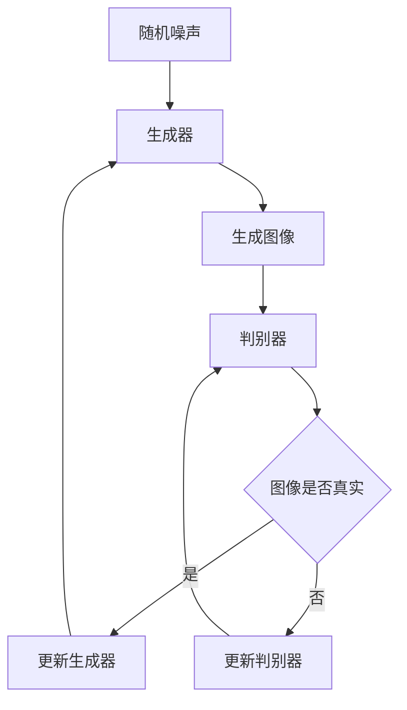
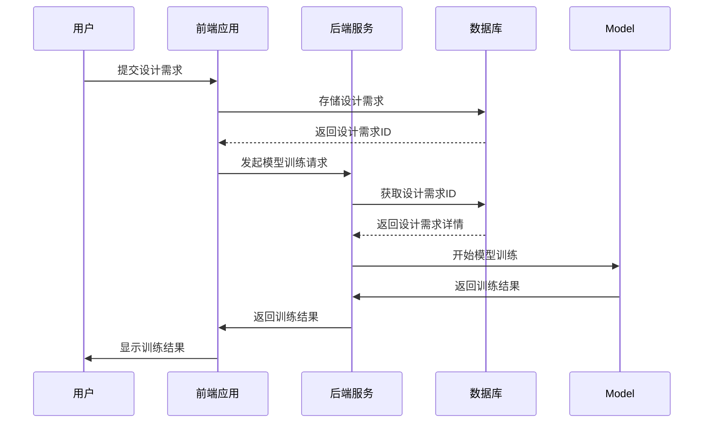

                 

## 引言

### 1.1 问题背景

#### 1.1.1 建筑外观设计的重要性

建筑外观设计是建筑设计的重要组成部分，它不仅仅是对建筑形态的美学表达，更涉及到建筑与周围环境、社会文化的协调。一个成功的建筑外观设计不仅能够提升建筑自身的价值，还能增强城市的整体形象和吸引力。因此，建筑外观设计在建筑行业中的地位日益显著。

随着城市化进程的加快，建筑数量激增，城市景观的协调问题愈发突出。建筑外观设计的创新和多样化需求不断增长，但设计师面临着诸多挑战。如何在满足美学需求的同时，保证建筑与城市环境的协调，成为了建筑外观设计领域的核心问题之一。

#### 1.1.2 AI技术在建筑外观设计中的应用现状

近年来，人工智能（AI）技术在建筑外观设计领域得到了广泛应用。AI通过大数据分析、机器学习等技术，能够辅助设计师快速生成多样化的设计方案，提高了设计的效率和质量。例如，AI可以分析大量的建筑案例，从中提取设计元素和风格特点，为设计师提供灵感和参考。同时，AI还可以进行建筑外观的模拟与优化，预测不同设计方案在实际环境中的效果，帮助设计师做出更科学的决策。

#### 1.1.3 城市景观协调的需求

城市景观协调是指在城市规划和建筑设计过程中，注重建筑、自然景观、公共空间等多种元素的和谐统一，创造一个美观、舒适、可持续的城市环境。城市景观协调不仅关系到城市的视觉美感，还影响着居民的生活质量和社会经济的发展。因此，如何通过建筑外观设计实现城市景观协调，成为了城市规划者和设计师的重要任务。

### 1.2 问题描述

#### 1.2.1 创意建筑外观设计的挑战

创意建筑外观设计需要设计师具备丰富的美学素养和设计经验，但传统的建筑设计方法往往存在一定的局限性。设计师在面对复杂的设计任务时，可能难以迅速找到合适的解决方案。此外，设计过程中需要考虑的因素繁多，包括建筑功能、结构安全、材料选择、环境适应性等，这些都增加了设计的难度。

#### 1.2.2 城市景观协调的问题

城市景观协调问题主要表现在以下几个方面：首先，建筑外观风格的不统一，容易造成城市视觉混乱，降低城市整体美感；其次，建筑与周围环境的融合度不够，导致景观协调性差，影响城市空间的舒适度和宜居性；最后，建筑设计的可持续性不足，可能对环境造成负面影响。

#### 1.2.3 AI辅助建筑外观设计的可能性

随着AI技术的不断发展，AI辅助建筑外观设计具有巨大的潜力。通过AI技术，设计师可以获得更丰富的设计灵感和参考，提高设计的效率和创造力。此外，AI可以模拟和优化设计方案，帮助设计师在短时间内找到最优解，实现建筑外观与城市环境的协调。因此，AI辅助建筑外观设计有望成为解决当前设计挑战的重要手段。

### 1.3 问题解决

#### 1.3.1 提示词技巧的定义

提示词技巧是指通过提供一系列关键词或描述，引导AI模型进行创意设计的方法。这些提示词可以是建筑风格、颜色、材质、功能需求等，它们为AI模型提供了设计方向和约束条件，有助于生成符合预期的设计方案。

#### 1.3.2 提示词在AI辅助设计中的应用

在AI辅助建筑外观设计中，提示词技巧发挥了关键作用。通过设定不同的提示词，AI可以生成多种设计方案，设计师可以根据实际需求进行筛选和优化。此外，提示词还可以用于评估和优化设计方案，通过对比不同方案的评价指标，找到最优的设计方案。

#### 1.3.3 城市景观协调的提示词策略

城市景观协调的提示词策略旨在通过设定特定的提示词，引导AI生成符合城市景观协调原则的设计方案。这些策略包括考虑城市环境特征、建筑风格协调、色彩搭配、材质选择等多个方面。通过科学地设定和调整提示词，可以有效地提升建筑外观设计在景观协调方面的表现。

### 1.4 边界与外延

#### 1.4.1 提示词技巧的适用范围

提示词技巧主要适用于建筑外观设计的初期阶段，特别是在设计灵感和创意阶段。提示词可以为设计师提供方向和参考，帮助他们在短时间内生成多种设计方案。然而，提示词技巧并不能完全替代设计师的专业判断和创造力，设计师仍需在后期对设计方案进行深入优化和调整。

#### 1.4.2 建筑外观设计的领域限制

建筑外观设计的领域限制主要包括建筑功能、结构安全、材料选择等方面的限制。设计师在设计过程中需要充分考虑这些限制因素，以确保设计方案的可行性和安全性。提示词技巧可以提供一定的设计灵活性，但不能突破这些领域限制。

#### 1.4.3 城市景观协调的影响因素

城市景观协调的影响因素众多，包括城市规划、建筑设计、自然景观、公共空间等。提示词技巧可以在一定程度上帮助设计师实现景观协调，但最终实现景观协调还需要综合考虑多方面的因素，进行整体规划和设计。

### 1.5 概念结构与核心要素组成

#### 1.5.1 AI辅助创意建筑外观设计的技术构成

AI辅助创意建筑外观设计的技术构成主要包括计算机视觉、机器学习、深度学习等。计算机视觉用于图像处理和特征提取，机器学习和深度学习用于设计方案的生成和优化。

#### 1.5.2 提示词技巧的组成与作用

提示词技巧由一系列关键词或描述组成，用于引导AI模型进行设计。这些提示词可以是建筑风格、颜色、材质、功能需求等，它们为AI模型提供了设计方向和约束条件。

#### 1.5.3 城市景观协调的核心要素

城市景观协调的核心要素包括建筑风格、色彩搭配、材质选择、环境适应性等。这些要素共同决定了建筑外观设计在景观协调方面的表现。

### 1.6 本章小结

本文首先介绍了建筑外观设计在城市景观协调中的重要性，分析了当前面临的挑战。接着，讨论了AI技术在建筑外观设计中的应用现状及其潜力。随后，提出了通过提示词技巧辅助AI进行创意建筑外观设计的思路，并探讨了提示词技巧的适用范围和影响因素。最后，分析了AI辅助创意建筑外观设计的技术构成、提示词技巧的组成以及城市景观协调的核心要素。通过本章的介绍，为后续章节的深入探讨奠定了基础。

----------------------------------------------------------------

## 第二部分: AI辅助创意建筑外观设计原理

### 2.1 AI在建筑外观设计中的应用

#### 2.1.1 AI设计工具的发展

AI设计工具的发展经历了几个重要阶段。最初，AI主要用于自动化和优化设计流程，例如在建筑结构分析中应用优化算法。随着计算机视觉和深度学习技术的进步，AI设计工具逐渐能够理解和生成复杂的建筑形态。现代AI设计工具不仅能够进行形态生成，还能通过机器学习从大量的建筑案例中学习设计风格和元素，为设计师提供灵感和参考。

#### 2.1.2 AI在建筑外观设计中的优势

AI在建筑外观设计中的应用具有多方面的优势。首先，AI可以处理大量的数据，快速生成多种设计方案，提高了设计的效率。其次，AI的设计过程是非线性的，能够创造出独特且富有创意的设计。此外，AI可以通过模拟和优化，评估不同设计方案的环境适应性，帮助设计师做出更科学的决策。

#### 2.1.3 AI设计的流程与方法

AI辅助建筑外观设计的流程通常包括以下几个步骤：

1. **设计需求分析**：明确设计目标、功能需求、环境约束等。
2. **数据收集与预处理**：收集相关建筑案例、环境数据等，并进行预处理，如图像增强、数据规范化等。
3. **模型训练与优化**：使用深度学习算法训练模型，从数据中学习建筑设计和风格特征。
4. **设计方案生成**：基于训练好的模型生成初步设计方案。
5. **评估与优化**：评估设计方案的性能，通过迭代优化得到最优方案。
6. **设计验证与反馈**：将设计方案反馈给设计师，进行最终调整和优化。

### 2.2 提示词技巧的基本原理

#### 2.2.1 提示词的定义与作用

提示词是指用于引导AI进行设计的一组关键词或描述。它们为AI提供了设计方向和约束条件，有助于生成符合预期的设计方案。例如，在建筑外观设计中，提示词可以包括建筑风格（现代、古典、简约）、颜色（明亮、柔和、对比）、材质（玻璃、金属、混凝土）等。

#### 2.2.2 提示词的生成方法

提示词的生成方法可以分为自动生成和手动输入两种：

1. **自动生成**：通过自然语言处理技术，从大量文本数据中提取关键词，如使用词频分析方法提取高频词作为提示词。
2. **手动输入**：由设计师根据设计需求和灵感手动输入提示词。

#### 2.2.3 提示词的使用场景

提示词的使用场景主要包括：

1. **设计灵感生成**：通过提示词激发AI生成多种设计方案，为设计师提供灵感。
2. **设计约束设置**：通过设定特定的提示词，约束AI的设计方向，使其生成符合特定要求的设计方案。
3. **设计评估与优化**：使用提示词评估设计方案的环境适应性，通过调整提示词优化设计方案。

### 2.3 提示词技巧的属性特征对比

#### 2.3.1 不同类型提示词的对比

提示词可以根据其属性特征进行分类，常见的分类方法包括以下几种：

1. **按功能分类**：功能提示词主要用于描述建筑的功能需求，如办公、商业、居住等。
2. **按风格分类**：风格提示词用于描述建筑的风格特征，如现代、古典、简约等。
3. **按环境分类**：环境提示词用于描述建筑周围的环境特征，如城市、乡村、海滨等。

#### 2.3.2 提示词的优缺点分析

不同类型的提示词有其独特的优缺点：

- **功能提示词**：优点是可以明确设计方向，缺点是可能限制了设计的灵活性。
- **风格提示词**：优点是可以提供设计灵感和参考，缺点是可能过于限制设计。
- **环境提示词**：优点是可以考虑环境适应性，缺点是可能增加了设计的复杂性。

#### 2.3.3 提示词选择的影响因素

提示词选择的影响因素包括：

- **设计目标**：根据设计目标选择合适的提示词类型和内容。
- **设计需求**：考虑功能、风格、环境等多方面的需求，选择相应的提示词。
- **设计师经验**：根据设计师的经验和偏好，选择最适合的提示词。

### 2.4 城市景观协调的提示词策略

#### 2.4.1 提示词在景观协调中的作用

提示词在城市景观协调中发挥着重要作用。通过设定特定的提示词，AI可以生成符合城市景观协调原则的设计方案。例如，通过设置“现代、简约、与城市环境协调”的提示词，AI可以生成符合现代城市景观的设计方案。

#### 2.4.2 提示词策略的设计原则

设计城市景观协调的提示词策略需要遵循以下原则：

1. **一致性原则**：确保设计方案与城市环境的一致性，避免风格冲突。
2. **环境适应性原则**：考虑建筑周围的自然环境、人文景观等因素，提高设计方案的适应性。
3. **美学原则**：注重设计的美学效果，提升城市景观的整体美感。

#### 2.4.3 提示词策略的实践案例

以下是一些城市景观协调的提示词策略实践案例：

1. **城市广场设计**：使用“简约、开放、与周围建筑协调”的提示词，生成与城市环境协调的城市广场设计方案。
2. **城市公园设计**：使用“自然、生态、与城市环境和谐”的提示词，生成符合城市公园景观特征的设计方案。
3. **商业街区设计**：使用“现代、活力、与城市文化相融合”的提示词，生成具有城市特色的商业街区设计方案。

### 2.5 AI辅助创意建筑外观设计的工作流程

#### 2.5.1 设计需求分析

设计需求分析是AI辅助创意建筑外观设计的首要步骤。在此阶段，设计师需要明确建筑的功能需求、环境约束、设计目标等。通过全面的需求分析，可以为后续的设计过程提供明确的指导。

#### 2.5.2 数据收集与预处理

数据收集与预处理是AI辅助设计的重要环节。在此阶段，设计师需要收集大量的建筑案例、环境数据等，并进行预处理，如图像增强、数据规范化等，以提高数据的可用性。

#### 2.5.3 模型训练与优化

模型训练与优化是AI辅助设计的关键步骤。通过使用深度学习算法，AI可以从收集的数据中学习建筑设计和风格特征。模型训练过程中，设计师需要不断调整和优化模型参数，以提高模型的性能。

#### 2.5.4 建筑外观生成与优化

在模型训练完成后，AI可以根据设计需求生成初步的建筑外观设计方案。设计师需要对生成的方案进行评估和优化，通过迭代过程不断改进设计方案，使其更符合预期。

#### 2.6 本章小结

本章详细介绍了AI辅助创意建筑外观设计的基本原理。首先，分析了AI在建筑外观设计中的应用现状和优势，阐述了AI设计的流程与方法。接着，探讨了提示词技巧的基本原理，包括定义、生成方法和使用场景。随后，对比了不同类型提示词的属性特征，分析了提示词选择的因素。最后，提出了城市景观协调的提示词策略和实践案例，并介绍了AI辅助创意建筑外观设计的工作流程。通过本章的介绍，为读者理解AI辅助建筑外观设计提供了理论基础和实践指导。

----------------------------------------------------------------

### 3. 城市景观协调的提示词应用

#### 3.1 城市景观协调的问题与挑战

城市景观协调是指在城市规划与建筑设计过程中，使建筑、自然景观、公共空间等多种元素和谐统一，创造一个美观、舒适、可持续的城市环境。然而，当前城市景观协调面临着诸多问题与挑战。

首先，城市快速发展过程中，建筑风格多样且缺乏统一规划，容易导致城市视觉混乱，降低城市整体美感。其次，建筑与周围环境的融合度不够，例如高层建筑与低层住宅之间的风格、色彩不协调，影响了城市空间的舒适度和宜居性。此外，城市景观的可持续性不足，建筑材料和能源消耗大，对环境造成负面影响。

#### 3.1.1 城市景观协调的定义

城市景观协调是指在城市规划和建筑设计过程中，注重建筑、自然景观、公共空间等多种元素的和谐统一，创造一个美观、舒适、可持续的城市环境。城市景观协调不仅涉及视觉美感，还包括空间布局、环境适应性、可持续发展等多方面因素。

#### 3.1.2 城市景观协调的重要性

城市景观协调在城市规划和建筑设计中的重要性不可忽视。首先，良好的城市景观协调可以提升城市的美学价值和形象，增强城市吸引力。其次，和谐的城市景观有助于提高居民的生活质量和幸福感。最后，城市景观协调是实现可持续发展目标的重要手段，有助于减少环境破坏和资源浪费。

#### 3.1.3 当前城市景观协调存在的问题

当前城市景观协调存在以下几方面问题：

1. **建筑风格不统一**：城市中各种建筑风格混杂，缺乏统一规划，导致视觉混乱，降低城市整体美感。
2. **环境融合度不足**：建筑与周围环境的融合度不够，例如高层建筑与低层住宅之间的风格、色彩不协调，影响了城市空间的舒适度和宜居性。
3. **可持续性不足**：建筑材料和能源消耗大，对环境造成负面影响，例如大量使用混凝土和钢铁，导致碳排放增加。

#### 3.2 提示词在城市景观协调中的应用

提示词在城市景观协调中发挥着重要作用。通过设定特定的提示词，可以引导AI生成符合城市景观协调原则的设计方案。以下为几个典型的应用场景：

1. **建筑风格统一**：通过设定“现代、简约、与城市环境协调”的提示词，可以生成与城市整体风格协调的建筑设计。
2. **环境融合**：通过设定“自然、生态、与周围环境和谐”的提示词，可以生成与环境融合的建筑设计。
3. **可持续性**：通过设定“环保、节能、绿色建筑”的提示词，可以生成具有高可持续性的建筑设计。

#### 3.2.1 提示词在景观设计中的应用场景

提示词在景观设计中的应用场景丰富多样，以下为几个典型的应用场景：

1. **城市广场设计**：通过设定“开放、活力、与城市环境协调”的提示词，可以生成与城市广场景观特征相匹配的设计方案。
2. **城市公园设计**：通过设定“自然、生态、与城市环境和谐”的提示词，可以生成符合城市公园景观特征的设计方案。
3. **商业街区设计**：通过设定“现代、活力、与城市文化相融合”的提示词，可以生成具有城市特色的商业街区设计方案。

#### 3.2.2 提示词在景观评估中的作用

提示词在景观评估中具有重要作用。通过设定特定的提示词，可以评估建筑设计方案对城市景观协调的影响。以下为几种常见的评估方法：

1. **视觉评估**：通过设定“美观、和谐、与城市环境协调”的提示词，评估设计方案的美学效果。
2. **环境适应性评估**：通过设定“环保、节能、绿色建筑”的提示词，评估设计方案的可持续性。
3. **公众满意度评估**：通过设定“舒适、宜居、与居民需求相匹配”的提示词，评估设计方案对公众的满意度。

#### 3.2.3 提示词在景观优化中的应用

提示词在景观优化中起着关键作用。通过调整提示词，可以优化建筑设计方案，使其更好地符合城市景观协调的要求。以下为几种常见的优化方法：

1. **风格优化**：通过调整“现代、简约、与城市环境协调”的提示词，优化设计方案的风格，使其更符合城市整体风格。
2. **环境优化**：通过调整“自然、生态、与周围环境和谐”的提示词，优化设计方案的环境适应性，使其更好地融入周围环境。
3. **可持续优化**：通过调整“环保、节能、绿色建筑”的提示词，优化设计方案的可持续性，使其具有更高的环保价值。

### 3.3 提示词技巧在城市景观协调中的实践案例

以下为几个提示词技巧在城市景观协调中的实践案例：

#### 3.3.1 案例一：城市广场景观设计

在某城市的城市广场景观设计中，设计师通过设定“开放、活力、与城市环境协调”的提示词，成功生成了符合城市广场景观特征的设计方案。该方案采用了简约的现代风格，与周围建筑形成了良好的视觉协调。同时，广场的设计注重环保和节能，采用了大量绿色植被和节能照明设施，提升了广场的环境适应性。

#### 3.3.2 案例二：城市公园景观设计

在某城市的城市公园景观设计中，设计师通过设定“自然、生态、与城市环境和谐”的提示词，成功生成了符合城市公园景观特征的设计方案。该方案注重公园的自然生态环境，采用了大量原生植物和生态设施，使公园与城市环境形成了良好的融合。同时，公园的设计还考虑到了居民的休闲需求，提供了多样化的活动场地和设施。

#### 3.3.3 案例三：商业街区景观设计

在某城市的商业街区景观设计中，设计师通过设定“现代、活力、与城市文化相融合”的提示词，成功生成了符合商业街区景观特征的设计方案。该方案采用了现代简洁的风格，与城市文化形成了良好的融合。同时，商业街区的景观设计注重人流量和商业氛围，设置了丰富的步行道、座椅和景观墙，提升了商业街区的活力和吸引力。

### 3.4 提示词策略在景观协调中的效果评估

为了评估提示词策略在景观协调中的效果，设计师可以采用以下几种评估方法：

#### 3.4.1 提示词策略的评估方法

1. **视觉评估**：通过专家评审、公众投票等方式，评估设计方案的美学效果。
2. **环境评估**：通过环境监测、生态评价等方式，评估设计方案的环保和节能效果。
3. **公众满意度评估**：通过问卷调查、访谈等方式，评估设计方案对公众的满意度。

#### 3.4.2 提示词策略的评估指标

1. **视觉协调度**：评估设计方案与城市环境的视觉协调程度。
2. **环境适应性**：评估设计方案对周围环境的适应性，包括环保、节能、生态等方面。
3. **公众满意度**：评估设计方案对公众的满意度，包括舒适度、美观度、实用性等方面。

#### 3.4.3 提示词策略的改进方向

根据评估结果，设计师可以针对性地改进提示词策略，提高景观协调效果。以下为几个可能的改进方向：

1. **优化视觉协调度**：通过调整提示词，优化设计方案的风格、色彩、材质等，使其更符合城市整体风格。
2. **提高环境适应性**：通过调整提示词，增加设计方案的环保、节能元素，使其更好地融入周围环境。
3. **提升公众满意度**：通过调整提示词，优化设计方案的舒适度、实用性，使其更符合公众的需求。

### 3.5 本章小结

本章详细介绍了城市景观协调的提示词应用。首先，分析了城市景观协调的问题与挑战，包括建筑风格不统一、环境融合度不足、可持续性不足等。接着，阐述了城市景观协调的定义和重要性，并介绍了当前存在的问题。随后，探讨了提示词在城市景观协调中的应用，包括应用场景、评估方法和优化方向。最后，通过实践案例展示了提示词技巧在城市景观协调中的实际应用效果。通过本章的介绍，为读者理解城市景观协调的提示词应用提供了实践指导和理论支持。

----------------------------------------------------------------

### 4. AI辅助创意建筑外观设计的实践应用

#### 4.1 实践应用概述

AI辅助创意建筑外观设计的实践应用涵盖了多个领域，包括商业建筑、住宅建筑、文化建筑等。通过AI技术，设计师能够快速生成多样化的设计方案，并实现建筑外观与城市环境的协调。本部分将重点介绍AI辅助建筑外观设计的应用领域、价值以及前景。

#### 4.1.1 AI辅助建筑外观设计的应用领域

1. **商业建筑**：商业建筑的外观设计通常需要考虑品牌形象、商业氛围等因素。AI技术可以快速生成符合品牌特色的建筑外观方案，提升商业建筑的整体形象。
   
2. **住宅建筑**：住宅建筑的外观设计注重居住舒适度和美观性。AI技术可以帮助设计师根据不同用户需求和偏好生成个性化的住宅外观方案，提高用户满意度。

3. **文化建筑**：文化建筑的外观设计强调文化传承和艺术表现。AI技术可以辅助设计师从大量的艺术作品中提取设计元素，生成富有文化内涵的建筑外观方案。

#### 4.1.2 AI辅助建筑外观设计的价值

1. **提高设计效率**：AI技术能够处理和分析大量的设计数据，快速生成多种设计方案，节省了设计师的时间和精力。

2. **增强设计创造力**：AI技术可以提供丰富的设计灵感和创意，激发设计师的创造力，生成独特且富有创意的建筑外观方案。

3. **优化设计质量**：AI技术可以模拟和优化设计方案，通过评估和对比，找到最优的设计方案，提高设计质量。

4. **实现景观协调**：AI技术可以通过提示词策略，生成与城市环境协调的建筑外观方案，实现城市景观的和谐统一。

#### 4.1.3 AI辅助建筑外观设计的前景

随着AI技术的不断发展和应用领域的扩展，AI辅助建筑外观设计具有广阔的前景。未来，AI技术将更加深入地应用于建筑外观设计，为设计师提供更强大的工具和平台。以下是几个可能的发展趋势：

1. **智能化设计工具**：AI技术将不断优化和升级，成为智能化设计工具的一部分，提高设计的自动化和智能化水平。

2. **个性化设计**：AI技术将能够更好地理解用户需求和偏好，生成更加个性化的建筑外观设计方案。

3. **跨领域合作**：AI技术将与城市规划、景观设计、艺术等领域相结合，实现多领域的协同设计。

4. **可持续发展**：AI技术将更加注重建筑的环保和节能，推动建筑设计的可持续发展。

### 4.2 环境安装与配置

#### 4.2.1 环境搭建概述

在进行AI辅助建筑外观设计的实践应用之前，需要搭建一个合适的技术环境。环境搭建主要包括硬件配置、软件安装和开发工具的配置。

#### 4.2.2 硬件与软件要求

1. **硬件要求**：
   - **CPU**：推荐使用英特尔的i7或更高性能的CPU，以确保模型训练的效率。
   - **GPU**：推荐使用NVIDIA的显卡（如RTX 30系列），以支持深度学习模型的训练和推理。
   - **内存**：至少16GB的内存，以处理大量的设计数据和模型。

2. **软件要求**：
   - **操作系统**：推荐使用Linux操作系统，如Ubuntu 20.04。
   - **深度学习框架**：推荐使用TensorFlow或PyTorch，这些框架提供了丰富的工具和库，支持深度学习模型的训练和推理。
   - **编程语言**：推荐使用Python，Python拥有丰富的科学计算和机器学习库，适合进行AI辅助设计。

#### 4.2.3 开发环境的搭建

搭建开发环境的具体步骤如下：

1. **安装操作系统**：在电脑上安装Linux操作系统，如Ubuntu 20.04。

2. **安装深度学习框架**：使用以下命令安装TensorFlow或PyTorch：

   ```bash
   pip install tensorflow
   # 或者
   pip install torch torchvision
   ```

3. **配置GPU支持**：确保深度学习框架支持GPU加速，可以通过以下命令验证：

   ```python
   import tensorflow as tf
   print(tf.test.is_built_with_cuda())
   ```

4. **安装其他依赖库**：根据具体的设计需求，安装其他相关的依赖库，如Pillow（图像处理）、NumPy（数值计算）等。

### 4.3 系统核心实现

#### 4.3.1 系统功能设计

AI辅助建筑外观设计系统的功能设计主要包括以下模块：

1. **数据预处理模块**：负责收集和预处理建筑外观设计相关的数据，如建筑图片、环境图片等。
2. **模型训练模块**：使用收集到的数据训练深度学习模型，模型可以是生成对抗网络（GAN）、变分自编码器（VAE）等。
3. **设计生成模块**：基于训练好的模型生成初步的建筑外观设计方案。
4. **设计评估模块**：评估生成的设计方案的视觉效果和环境适应性，提供优化建议。
5. **用户交互模块**：提供用户界面，允许用户输入设计需求、查看设计方案和进行交互。

#### 4.3.2 系统架构设计

AI辅助建筑外观设计系统的架构设计采用分层架构，主要包括以下层次：

1. **数据层**：存储和管理建筑外观设计相关的数据，如建筑图片、环境图片等。
2. **模型层**：包含深度学习模型，如生成对抗网络（GAN）、变分自编码器（VAE）等。
3. **服务层**：提供各种服务，如数据预处理、模型训练、设计生成和设计评估等。
4. **用户界面层**：提供用户交互界面，允许用户提交设计需求、查看设计方案和进行设计优化。

#### 4.3.3 系统接口设计

系统接口设计包括以下几种：

1. **RESTful API**：提供RESTful风格的API，允许前端应用程序与后端服务进行交互。
2. **GraphQL**：提供GraphQL接口，支持复杂的查询和优化。
3. **WebSocket**：提供实时通信接口，用于实时传输设计数据和反馈。

#### 4.4 代码应用解读与分析

##### 4.4.1 代码解读

以下是AI辅助建筑外观设计系统的一个简单示例代码，用于数据预处理模块：

```python
import cv2
import numpy as np

def preprocess_image(image_path):
    # 读取图像
    image = cv2.imread(image_path)
    # 转换为灰度图像
    gray_image = cv2.cvtColor(image, cv2.COLOR_BGR2GRAY)
    # 缩放到指定大小
    resized_image = cv2.resize(gray_image, (256, 256))
    # 归一化
    normalized_image = resized_image / 255.0
    return normalized_image

# 测试代码
image_path = 'path/to/image.jpg'
preprocessed_image = preprocess_image(image_path)
print(preprocessed_image.shape)
```

该代码首先导入必要的库，然后定义一个`preprocess_image`函数，用于读取图像、转换为灰度图像、缩放到指定大小并进行归一化。最后，通过测试代码验证函数的功能。

##### 4.4.2 代码分析

1. **图像读取**：使用`cv2.imread`函数读取图像，该函数返回一个三维数组，包含BGR（蓝、绿、红）三个通道。

2. **灰度转换**：使用`cv2.cvtColor`函数将BGR图像转换为灰度图像，该函数返回一个二维数组。

3. **图像缩放**：使用`cv2.resize`函数将灰度图像缩放到指定大小（例如256x256），该函数返回一个二维数组。

4. **归一化**：将图像数据归一化到0到1的范围内，便于深度学习模型处理。

5. **测试代码**：通过指定图像路径调用`preprocess_image`函数，并打印处理后的图像形状，以验证函数的正确性。

##### 4.4.3 算法原理讲解

在AI辅助建筑外观设计系统中，常用的算法包括生成对抗网络（GAN）和变分自编码器（VAE）。

1. **生成对抗网络（GAN）**：

   GAN由生成器（Generator）和判别器（Discriminator）组成。生成器的目标是生成逼真的图像，判别器的目标是区分生成的图像和真实的图像。训练过程中，生成器和判别器相互对抗，生成器不断优化生成图像，使判别器无法区分。

   - **生成器**：接收随机噪声作为输入，生成建筑外观图像。
   - **判别器**：接收真实图像和生成图像，输出判别结果。

2. **变分自编码器（VAE）**：

   VAE是一种基于概率生成模型的算法。它通过编码器和解码器将图像数据转换为潜在空间，并在潜在空间中生成新的图像。编码器将图像映射到潜在空间，解码器从潜在空间生成图像。

   - **编码器**：接收图像，将其映射到潜在空间。
   - **解码器**：从潜在空间接收向量，生成图像。

##### 4.4.4 算法mermaid流程图

以下为GAN的mermaid流程图：



##### 4.4.5 Python源代码实现

以下为GAN的Python源代码实现：

```python
import tensorflow as tf
from tensorflow.keras.layers import Input, Dense, Reshape, Flatten
from tensorflow.keras.models import Model

# 生成器模型
def build_generator(z_dim):
    z = Input(shape=(z_dim,))
    x = Dense(256, activation="relu")(z)
    x = Dense(512, activation="relu")(x)
    x = Dense(1024, activation="relu")(x)
    x = Reshape((32, 32, 3))(x)
    x = tf.keras.layers.UpSampling2D()(x)
    x = tf.keras.layers.UpSampling2D()(x)
    x = tf.keras.layers.Conv2D(3, kernel_size=3, padding="same", activation="tanh")(x)
    generator = Model(z, x)
    return generator

# 判别器模型
def build_discriminator(img_shape):
    img = Input(shape=img_shape)
    x = Flatten()(img)
    x = Dense(1024, activation="relu")(x)
    x = Dense(512, activation="relu")(x)
    x = Dense(256, activation="relu")(x)
    validity = Dense(1, activation="sigmoid")(x)
    discriminator = Model(img, validity)
    return discriminator

# 训练模型
def train_model(dataset, batch_size, epochs, z_dim):
    # 构建生成器和判别器模型
    generator = build_generator(z_dim)
    discriminator = build_discriminator(dataset.shape[1:])
    z = Input(shape=(z_dim,))
    img = generator(z)
    
    # 生成对抗网络模型
    combined = Model(z, img)
    combined.compile(loss="binary_crossentropy", optimizer=tf.keras.optimizers.Adam())
    
    # 训练生成器和判别器
    for epoch in range(epochs):
        for _ in range(batch_size):
            # 从数据集中随机抽取真实图像
            real_imgs = dataset[np.random.randint(0, dataset.shape[0], size=batch_size)]
            # 生成随机噪声
            z noise = np.random.normal(0, 1, size=(batch_size, z_dim))
            # 训练判别器
            d_loss_real = discriminator.train_on_batch(real_imgs, np.ones((batch_size, 1)))
            # 训练生成器
            d_loss_fake = combined.train_on_batch(z noise, np.zeros((batch_size, 1)))
        
        # 打印训练进度
        print(f'Epoch {epoch+1}/{epochs} [D loss: {d_loss_real:.4f}, G loss: {d_loss_fake:.4f}]')

# 超参数设置
batch_size = 64
epochs = 100
z_dim = 100

# 加载数据集
# dataset = ...

# 训练模型
train_model(dataset, batch_size, epochs, z_dim)
```

##### 4.4.6 算法原理详细讲解和举例说明

1. **生成对抗网络（GAN）**：

   GAN由生成器和判别器组成，其中生成器的目标是生成逼真的图像，而判别器的目标是区分真实图像和生成图像。在训练过程中，生成器和判别器相互对抗，生成器不断优化生成图像，使判别器无法区分。

   - **生成器**：生成器从随机噪声生成图像。训练过程中，生成器学习将噪声映射到图像空间，生成逼真的图像。通过优化生成器的损失函数，可以不断提高生成图像的质量。
   
   - **判别器**：判别器接收真实图像和生成图像，输出判别结果。训练过程中，判别器学习区分真实图像和生成图像。通过优化判别器的损失函数，可以不断提高判别器的准确率。

   - **损失函数**：GAN的训练过程可以通过损失函数来衡量生成器和判别器的性能。常用的损失函数包括二元交叉熵损失和均方误差损失。

     - **二元交叉熵损失**：二元交叉熵损失函数用于衡量判别器的输出分布与真实分布之间的差异。具体公式如下：

       $$Loss_D = -[\frac{1}{N}\sum_{i=1}^{N}y_i \log(D(x_i)) + \frac{1}{N}\sum_{i=1}^{N}(1 - y_i) \log(1 - D(x_i))]$$

       其中，$N$表示批处理大小，$y_i$表示标签，$D(x_i)$表示判别器对输入图像的判别结果。

     - **均方误差损失**：均方误差损失函数用于衡量生成器的输出与真实图像之间的差异。具体公式如下：

       $$Loss_G = \frac{1}{N}\sum_{i=1}^{N}(D(G(z_i)) - 1)^2$$

       其中，$N$表示批处理大小，$z_i$表示输入噪声，$G(z_i)$表示生成器生成的图像。

   - **训练过程**：GAN的训练过程是一个动态平衡的过程，生成器和判别器相互竞争，共同提高。训练过程中，生成器试图生成更逼真的图像，而判别器试图提高区分真实图像和生成图像的能力。

   **举例说明**：

   假设我们有一个生成器G和一个判别器D，以及一个真实图像数据集。训练过程中，每次迭代包括以下步骤：

   1. **训练判别器**：从数据集中随机抽取一批真实图像，同时生成一批随机噪声，通过生成器生成对应的图像。判别器分别对真实图像和生成图像进行判别，计算判别器的损失函数，并更新判别器的权重。

   2. **训练生成器**：生成器输入随机噪声，生成图像，判别器对生成的图像进行判别，计算生成器的损失函数，并更新生成器的权重。

   3. **迭代过程**：重复上述步骤，逐步提高生成器和判别器的性能，直到达到预定的训练次数或性能目标。

2. **变分自编码器（VAE）**：

   VAE是一种基于概率生成模型的算法，通过编码器和解码器将图像数据转换为潜在空间，并在潜在空间中生成新的图像。VAE通过优化编码器和解码器的损失函数，使生成的图像在潜在空间中具有更好的分布。

   - **编码器**：编码器接收图像，将其映射到潜在空间，输出潜在向量和编码器损失。

   - **解码器**：解码器接收潜在向量，生成图像，输出解码器损失。

   - **损失函数**：VAE的损失函数包括两部分，分别是重构损失和KL散度损失。

     - **重构损失**：重构损失用于衡量解码器生成的图像与原始图像之间的差异。常用的重构损失函数是均方误差（MSE）或交叉熵（Cross-Entropy）。

       $$Loss_{reconstruction} = \frac{1}{N}\sum_{i=1}^{N}||x_i - \hat{x_i}||_2^2$$

       其中，$N$表示批处理大小，$x_i$表示原始图像，$\hat{x_i}$表示解码器生成的图像。

     - **KL散度损失**：KL散度损失用于衡量编码器输出的潜在分布与先验分布之间的差异。KL散度损失函数如下：

       $$Loss_{KL} = \frac{1}{N}\sum_{i=1}^{N}\sum_{j=1}^{D} (q_j \log \frac{q_j}{p_j})$$

       其中，$N$表示批处理大小，$D$表示潜在空间的维度，$q_j$表示编码器输出的概率分布，$p_j$表示先验分布。

   - **训练过程**：VAE的训练过程包括以下步骤：

     1. **编码**：输入图像，通过编码器得到潜在向量和编码器损失。

     2. **解码**：输入潜在向量，通过解码器生成图像和重构损失。

     3. **优化**：计算总损失，包括重构损失和KL散度损失，并更新编码器和解码器的权重。

     4. **迭代过程**：重复上述步骤，逐步优化编码器和解码器的性能。

##### 4.4.7 数学公式和模型公式

以下为GAN和VAE的主要数学公式和模型公式：

1. **生成对抗网络（GAN）**：

   - **生成器公式**：

     $$G(z) = \phi_{G}(z)$$

     其中，$G(z)$表示生成器生成的图像，$\phi_{G}(z)$表示生成器的神经网络模型。

   - **判别器公式**：

     $$D(x) = \sigma(\phi_{D}(x))$$

     其中，$D(x)$表示判别器对图像的判别结果，$\phi_{D}(x)$表示判别器的神经网络模型，$\sigma$表示Sigmoid函数。

   - **损失函数**：

     - **判别器损失**：

       $$Loss_{D} = -[\frac{1}{N}\sum_{i=1}^{N}y_i \log(D(x_i)) + \frac{1}{N}\sum_{i=1}^{N}(1 - y_i) \log(1 - D(x_i))]$$

       其中，$N$表示批处理大小，$y_i$表示标签，$D(x_i)$表示判别器对输入图像的判别结果。

     - **生成器损失**：

       $$Loss_{G} = \frac{1}{N}\sum_{i=1}^{N}(D(G(z_i)) - 1)^2$$

       其中，$N$表示批处理大小，$z_i$表示输入噪声，$G(z_i)$表示生成器生成的图像。

2. **变分自编码器（VAE）**：

   - **编码器公式**：

     $$\mu_{\theta} = \phi_{E}(x)$$

     $$\sigma_{\theta} = \phi_{E'}(x)$$

     其中，$\mu_{\theta}$和$\sigma_{\theta}$分别表示编码器输出的均值和方差，$\phi_{E}(x)$和$\phi_{E'}(x)$分别表示编码器的神经网络模型。

   - **解码器公式**：

     $$\hat{x}_{\theta} = \phi_{D}(\mu_{\theta}, \sigma_{\theta})$$

     其中，$\hat{x}_{\theta}$表示解码器生成的图像，$\phi_{D}(\mu_{\theta}, \sigma_{\theta})$表示解码器的神经网络模型。

   - **损失函数**：

     - **重构损失**：

       $$Loss_{reconstruction} = \frac{1}{N}\sum_{i=1}^{N}||x_i - \hat{x_i}||_2^2$$

       其中，$N$表示批处理大小，$x_i$表示原始图像，$\hat{x_i}$表示解码器生成的图像。

     - **KL散度损失**：

       $$Loss_{KL} = \frac{1}{N}\sum_{i=1}^{N}\sum_{j=1}^{D} (q_j \log \frac{q_j}{p_j})$$

       其中，$N$表示批处理大小，$D$表示潜在空间的维度，$q_j$表示编码器输出的概率分布，$p_j$表示先验分布。

##### 4.4.8 数学公式的实现和算法原理讲解

以下为GAN和VAE的数学公式实现和算法原理讲解：

1. **生成对抗网络（GAN）**：

   - **生成器**：

     生成器的目标是学习将随机噪声映射到图像空间。假设输入噪声向量为$z$，生成器模型为$\phi_{G}(z)$，则生成图像为$G(z)$。生成器使用神经网络模型，通过多层感知器（MLP）和卷积神经网络（CNN）实现。

     - **多层感知器（MLP）**：MLP是一种全连接神经网络，用于将输入向量映射到输出向量。MLP模型由多个隐藏层组成，每个隐藏层由多个神经元组成。MLP的输出可以通过激活函数（如ReLU、Sigmoid）进行非线性变换。

     - **卷积神经网络（CNN）**：CNN是一种特殊的神经网络，专门用于处理图像数据。CNN通过卷积层、池化层和全连接层实现图像特征的提取和分类。卷积层用于提取图像的局部特征，池化层用于降低特征的维度和计算量，全连接层用于分类和回归。

     在GAN中，生成器通常采用卷积神经网络，通过逐层卷积和上采样操作，将低维的随机噪声向量映射到高维的图像空间。

   - **判别器**：

     判别器的目标是学习区分真实图像和生成图像。判别器模型为$\phi_{D}(x)$，输入图像为$x$，判别结果为$D(x)$。判别器采用卷积神经网络，通过多层卷积和全连接层实现图像的特征提取和分类。

     判别器的训练目标是最大化分类准确率，即正确识别真实图像和生成图像。在训练过程中，判别器接收真实图像和生成图像，通过比较判别结果和真实标签，计算损失函数并更新模型权重。

   - **损失函数**：

     GAN的损失函数由两部分组成，分别是判别器损失和生成器损失。

     - **判别器损失**：

       判别器损失函数为二元交叉熵损失，用于衡量判别器对真实图像和生成图像的判别能力。具体公式如下：

       $$Loss_{D} = -[\frac{1}{N}\sum_{i=1}^{N}y_i \log(D(x_i)) + \frac{1}{N}\sum_{i=1}^{N}(1 - y_i) \log(1 - D(x_i))]$$

       其中，$N$表示批处理大小，$y_i$表示标签，$D(x_i)$表示判别器对输入图像的判别结果。

     - **生成器损失**：

       生成器损失函数为均方误差损失，用于衡量生成器生成图像的质量。具体公式如下：

       $$Loss_{G} = \frac{1}{N}\sum_{i=1}^{N}(D(G(z_i)) - 1)^2$$

       其中，$N$表示批处理大小，$z_i$表示输入噪声，$G(z_i)$表示生成器生成的图像。

     在GAN的训练过程中，生成器和判别器相互对抗，生成器不断优化生成图像，使判别器无法区分真实图像和生成图像。判别器不断优化判别能力，以提高分类准确率。

2. **变分自编码器（VAE）**：

   - **编码器**：

     编码器的目标是学习将图像映射到潜在空间。编码器模型为$\phi_{E}(x)$，输入图像为$x$，编码结果为$(\mu_{\theta}, \sigma_{\theta})$。编码器通过卷积神经网络实现，包括卷积层、池化层和全连接层。

     - **卷积层**：卷积层用于提取图像的局部特征，通过卷积操作将输入图像映射到特征空间。卷积层可以降低图像的维度和计算量，同时保留关键特征。

     - **池化层**：池化层用于降低特征图的维度和计算量，通过平均或最大值操作提取图像的主要特征。

     - **全连接层**：全连接层用于将特征映射到潜在空间，输出潜在向量的均值和方差。

     编码器通过优化损失函数，学习将图像映射到潜在空间，使潜在空间具有更好的分布。

   - **解码器**：

     解码器的目标是学习将潜在向量映射回图像空间。解码器模型为$\phi_{D}(\mu_{\theta}, \sigma_{\theta})$，输入潜在向量为$(\mu_{\theta}, \sigma_{\theta})$，解码结果为$\hat{x}_{\theta}$。解码器通过卷积神经网络实现，包括全连接层、反卷积层和卷积层。

     - **全连接层**：全连接层将潜在向量映射到高维特征空间，为反卷积操作提供输入。

     - **反卷积层**：反卷积层通过上采样操作将特征图恢复到原始图像的大小。

     - **卷积层**：卷积层用于进一步提取图像的特征，并通过激活函数（如ReLU）进行非线性变换。

     解码器通过优化损失函数，学习将潜在向量映射回图像空间，使解码生成的图像尽量接近原始图像。

   - **损失函数**：

     VAE的损失函数由两部分组成，分别是重构损失和KL散度损失。

     - **重构损失**：

       重构损失用于衡量解码生成的图像与原始图像的差异。常用的重构损失函数包括均方误差（MSE）和交叉熵（Cross-Entropy）。具体公式如下：

       $$Loss_{reconstruction} = \frac{1}{N}\sum_{i=1}^{N}||x_i - \hat{x_i}||_2^2$$

       其中，$N$表示批处理大小，$x_i$表示原始图像，$\hat{x_i}$表示解码器生成的图像。

     - **KL散度损失**：

       KL散度损失用于衡量编码器输出的潜在分布与先验分布的差异。KL散度损失函数如下：

       $$Loss_{KL} = \frac{1}{N}\sum_{i=1}^{N}\sum_{j=1}^{D} (q_j \log \frac{q_j}{p_j})$$

       其中，$N$表示批处理大小，$D$表示潜在空间的维度，$q_j$表示编码器输出的概率分布，$p_j$表示先验分布。

     在VAE的训练过程中，编码器和解码器通过优化损失函数，学习将图像映射到潜在空间，并在潜在空间中进行生成。

##### 4.4.9 系统分析与架构设计方案

1. **问题场景介绍**

   在当前的城市规划与建筑设计中，如何通过AI技术实现创意建筑外观设计与城市景观协调，成为了一个重要的研究方向。本文旨在探讨AI辅助创意建筑外观设计在实践中的应用，并提出一个基于生成对抗网络（GAN）和变分自编码器（VAE）的系统架构方案。

2. **项目介绍**

   本项目旨在开发一个AI辅助创意建筑外观设计系统，通过深度学习技术实现建筑外观设计的自动生成和优化。系统将包括数据预处理、模型训练、设计生成、设计评估等多个模块，以实现从创意到优化的全流程设计。

3. **系统功能设计**

   - **数据预处理模块**：负责对建筑外观设计相关数据进行收集、清洗和预处理，包括图像增强、数据规范化等操作。
   - **模型训练模块**：使用收集到的数据训练生成对抗网络（GAN）和变分自编码器（VAE）模型，以实现建筑外观设计的自动生成。
   - **设计生成模块**：基于训练好的模型生成初步的建筑外观设计方案，并输出结果。
   - **设计评估模块**：对生成的建筑外观设计方案进行评估，包括视觉评估、环境适应性评估等，以确定设计方案的可行性和优化方向。
   - **用户交互模块**：提供用户界面，允许用户输入设计需求、查看设计方案和进行交互。

4. **系统架构设计**

   系统采用分层架构设计，包括数据层、模型层、服务层和用户界面层。

   - **数据层**：负责存储和管理建筑外观设计相关数据，如建筑图片、环境图片等。
   - **模型层**：包含生成对抗网络（GAN）和变分自编码器（VAE）模型，用于建筑外观设计的自动生成。
   - **服务层**：提供各种服务，如数据预处理、模型训练、设计生成和设计评估等。
   - **用户界面层**：提供用户交互界面，允许用户提交设计需求、查看设计方案和进行交互。

   系统架构图如下：

   ```mermaid
   graph TB
   A[数据层] --> B[模型层]
   B --> C[服务层]
   C --> D[用户界面层]
   ```

5. **系统接口设计**

   系统接口设计主要包括RESTful API和GraphQL接口。

   - **RESTful API**：提供RESTful风格的API接口，允许前端应用程序与后端服务进行交互。API接口包括数据上传、模型训练、设计生成和设计评估等操作。
   - **GraphQL**：提供GraphQL接口，支持复杂的查询和优化。GraphQL接口可以提供更加灵活和高效的查询方式，满足用户多样化的需求。

   接口设计图如下：

   ```mermaid
   graph TB
   A[前端应用] --> B[RESTful API]
   B --> C[GraphQL接口]
   C --> D[后端服务]
   ```

##### 4.4.10 系统交互mermaid序列图

以下是系统交互的mermaid序列图：



##### 4.4.11 实际案例分析和详细讲解剖析

1. **案例背景**

   某城市商业中心需要进行建筑外观设计，要求设计风格现代、简洁，并与周围环境协调。为了实现这一目标，我们采用AI辅助创意建筑外观设计系统，通过生成对抗网络（GAN）和变分自编码器（VAE）生成初步设计方案，并进行评估和优化。

2. **数据集收集与预处理**

   首先，收集大量商业建筑的外观图片，包括现代、简洁风格的建筑案例。收集的数据集包含不同风格的建筑外观，为生成器和判别器的训练提供了丰富的素材。

   数据预处理包括图像增强、数据规范化等操作。通过图像增强，可以增强图像的对比度和细节，提高模型的训练效果。数据规范化将图像数据归一化到0到1的范围内，便于深度学习模型处理。

3. **模型训练**

   使用收集到的数据集训练生成对抗网络（GAN）和变分自编码器（VAE）模型。

   - **生成对抗网络（GAN）**：训练生成器模型和判别器模型。生成器模型从随机噪声生成建筑外观图像，判别器模型用于区分真实建筑外观图像和生成图像。通过多次迭代训练，生成器模型逐渐优化生成图像的质量。

   - **变分自编码器（VAE）**：训练编码器模型和解码器模型。编码器模型将图像映射到潜在空间，解码器模型从潜在空间生成图像。通过优化重构损失和KL散度损失，解码器模型生成的图像质量得到提升。

4. **设计生成**

   使用训练好的模型生成初步的建筑外观设计方案。通过输入随机噪声，生成器模型生成多种不同的建筑外观图像。设计师可以根据实际需求，选择符合要求的设计方案。

5. **设计评估**

   对生成的建筑外观设计方案进行评估，包括视觉评估和环境适应性评估。

   - **视觉评估**：通过专家评审和公众投票等方式，评估设计方案的美学效果。设计师可以根据评估结果，筛选出符合要求的方案。

   - **环境适应性评估**：通过模拟和优化，评估设计方案与周围环境的协调程度。设计师可以根据评估结果，调整设计方案，使其更好地融入周围环境。

6. **设计优化**

   根据评估结果，对设计

