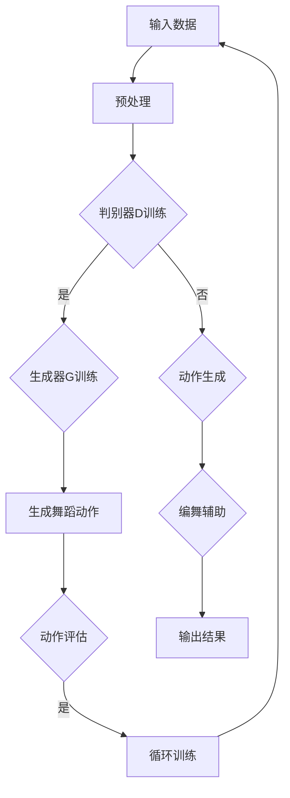
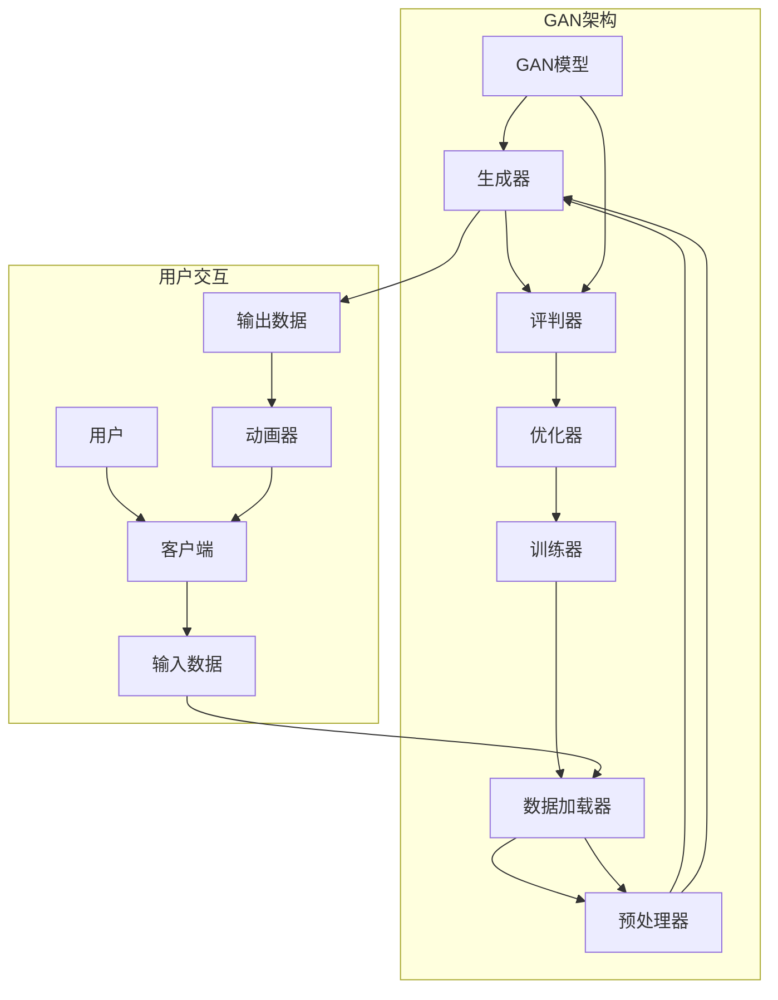
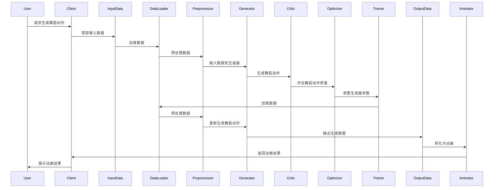

                 


### Step 1: 引言

#### 引言部分应该简要介绍本书的背景、目的和重要性，为读者提供一个初步的了解。

---

**引言：探索AI辅助创意舞蹈编排的新篇章**

在这个数字化的时代，人工智能（AI）正逐步渗透到各个领域，带来了前所未有的变革。从医疗诊断、金融分析到教育优化，AI的应用已经深入人心。然而，在创意舞蹈编排领域，AI的潜力仍待挖掘。舞蹈作为一种表达情感和文化的艺术形式，其编排过程往往充满了创造性和挑战。传统的舞蹈编排方式依赖于舞者的经验和直觉，而随着AI技术的不断进步，我们是否能够借助AI的力量，实现更加高效、创意丰富的舞蹈编排呢？

本书旨在探讨AI辅助创意舞蹈编排的可能性，特别是在文化融合舞步生成方面的应用。通过深入分析AI技术、舞蹈编排的需求以及文化融合的内涵，我们将为读者展示一个全新的舞蹈创作世界。这不仅有助于舞蹈工作者提升工作效率，也为AI技术在艺术领域的应用提供了新的思路。

**本书目的：**

1. **介绍AI技术的基本概念和最新发展，分析其在舞蹈编排中的潜在应用。**
2. **探讨文化融合在舞蹈中的重要性，以及如何通过AI实现文化元素的融合。**
3. **详细讲解AI辅助舞蹈编排的核心算法和数学模型，并提供实际案例进行分析。**
4. **分享最佳实践，为读者提供实用的操作技巧和注意事项。**

**读者对象：**

本书适合对舞蹈编排有兴趣的AI技术爱好者、舞蹈工作者以及AI研究者和开发者。无论你是舞者、编舞师，还是AI领域的技术专家，本书都将为你提供宝贵的知识资源。

**学习目标：**

通过阅读本书，你将：

1. **了解AI技术在舞蹈编排中的应用前景。**
2. **掌握文化融合舞步生成的技巧和方法。**
3. **学会使用AI算法进行舞蹈编排，提高创作效率。**
4. **能够独立进行AI辅助舞蹈编排的实际操作。**

在接下来的章节中，我们将一步步深入探讨这些主题，带领读者走进AI辅助创意舞蹈编排的世界。准备好，让我们开始这段探索之旅吧！### Step 2: 背景介绍

#### AI技术的发展现状与趋势
- AI技术自诞生以来，经历了数十年的发展，如今已经取得了显著的成果。深度学习、自然语言处理、计算机视觉等技术取得了突破性的进展，并广泛应用于各个行业。特别是随着计算能力的提升和大数据的普及，AI技术的应用前景愈发广阔。

- 当前，AI技术正朝着智能化、自动化和普适化的方向发展。诸如生成对抗网络（GAN）、强化学习等新兴技术不断涌现，为AI的应用开辟了新的路径。此外，AI技术的融合与创新也在加速，如结合物联网（IoT）、区块链等技术，AI的应用范围将更加广泛。

#### 创意舞蹈编排的挑战与需求
- 创意舞蹈编排不仅需要舞者具备高超的技艺，更需要编舞者具备丰富的创意和审美能力。然而，传统的舞蹈编排方式往往依赖于个人的经验和直觉，效率较低，难以满足快速变化的艺术需求。

- 随着全球文化交流的加深，文化融合成为了现代舞蹈的重要趋势。如何将不同文化背景的元素融合到舞蹈编排中，既保持原汁原味，又创造新的艺术形式，是编舞者面临的重大挑战。

- AI技术的出现为解决这些问题提供了新的可能。通过数据分析和机器学习，AI可以分析大量的舞蹈动作和编舞案例，为编舞者提供创意启发和辅助工具。此外，AI还可以根据文化元素进行自动融合，为编舞提供全新的视角。

#### 文化融合的内涵与在舞蹈编排中的应用
- 文化融合指的是将不同文化背景的元素、风格和传统融合到一起，创造出一种新的艺术形式。在舞蹈编排中，文化融合不仅仅是元素的堆砌，更是一种深层次的融合与再创造。

- 在舞蹈编排中，文化融合可以通过以下几种方式实现：
  1. **借鉴与融合**：从不同文化中选取具有代表性的元素，如音乐、服装、动作等，进行重新编排和融合。
  2. **创新与改编**：在保留原有文化元素的基础上，进行创新和改编，使其更符合现代审美和舞蹈风格。
  3. **互动与交流**：通过舞者之间的互动，将不同文化的舞蹈元素进行碰撞和融合，创造出独特的艺术效果。

- AI技术在文化融合中的应用主要体现在以下几个方面：
  1. **文化元素识别与提取**：AI可以通过分析大量的文化舞蹈视频和图片，识别和提取出不同文化背景的舞蹈元素。
  2. **自动融合与生成**：基于机器学习算法，AI可以将提取出的文化元素进行自动融合和生成，创造出新的舞蹈编排。
  3. **个性化推荐**：通过分析用户的偏好和文化背景，AI可以为编舞者提供个性化的文化融合建议。

总的来说，AI技术的发展为创意舞蹈编排和文化融合提供了新的契机。通过AI技术的辅助，编舞者可以更加高效地进行创作，同时为观众带来更多元化的舞蹈体验。接下来，我们将进一步探讨AI辅助创意舞蹈编排的核心概念和算法原理。准备好，让我们继续深入探索吧！### Step 3: 核心概念与联系

#### AI辅助创意舞蹈编排的定义

**定义**：AI辅助创意舞蹈编排是指利用人工智能技术，如机器学习、深度学习等，对舞蹈动作进行识别、分析、优化和生成，从而辅助舞蹈创作者进行舞蹈编排的过程。

**核心概念**：
1. **舞蹈动作识别**：通过计算机视觉技术，从视频或图片中自动识别和提取出舞蹈动作。
2. **动作分析**：利用数据分析和机器学习算法，对识别出的舞蹈动作进行模式识别和特征提取。
3. **动作优化**：基于动作分析和用户反馈，对舞蹈动作进行优化和调整，提高其表现力和艺术性。
4. **舞蹈生成**：通过机器学习算法，根据用户需求和舞蹈风格，生成新的舞蹈动作序列。

**相互关系**：舞蹈动作识别是基础，动作分析提供了对动作的理解和洞察，动作优化则是对已有动作的改进，舞蹈生成则是在已有动作基础上进行创新。这四个核心概念相互联系，共同构成了AI辅助创意舞蹈编排的完整流程。

---

#### 文化融合舞步生成的概念

**定义**：文化融合舞步生成是指将不同文化背景的舞蹈元素进行融合，创造出新的舞蹈动作序列，以达到文化多样性和艺术创新的目的。

**核心概念**：
1. **文化元素提取**：从不同文化背景的舞蹈中提取出具有代表性的元素，如动作、音乐、服装等。
2. **元素融合**：利用机器学习算法，将提取出的文化元素进行融合，创造出新的舞蹈动作。
3. **文化适应性调整**：根据目标文化背景和受众的审美偏好，对生成的舞蹈动作进行适应性调整。
4. **舞步生成**：通过融合和调整，最终生成符合目标文化风格的舞蹈动作序列。

**相互关系**：文化元素提取是融合的基础，元素融合是文化融合舞步生成的核心，文化适应性调整则确保生成的舞步能够被目标文化背景所接受，舞步生成则是对整个过程的最终实现。

---

#### 提示词技巧的核心概念及其相互关系

**定义**：提示词技巧是指通过提供关键词或短语，引导创作者思考和创作的方法。

**核心概念**：
1. **关键词生成**：利用自然语言处理技术，从文本或语音中提取出关键词。
2. **提示词选择**：根据创作需求和目标，选择合适的提示词，以激发创作灵感。
3. **创意生成**：利用提示词，引导创作者进行创意思考和创作，生成新的艺术作品。
4. **反馈与优化**：通过用户反馈，对提示词技巧进行调整和优化，提高创作效率。

**相互关系**：关键词生成是提示词技巧的基础，提示词选择则决定了创意生成的方向，创意生成是实现目标的关键步骤，反馈与优化则确保了提示词技巧的不断改进和优化。

---

**概念关系与相互作用**：

在AI辅助创意舞蹈编排中，文化融合舞步生成和提示词技巧紧密相关。AI可以通过分析大量舞蹈数据，提取出文化元素，并利用提示词技巧引导创作者进行创作。具体来说：

1. **数据驱动**：AI首先通过数据驱动的方式，识别和分析不同文化背景的舞蹈动作，提取出关键的文化元素。
2. **创意激发**：利用提示词技巧，AI可以为编舞者提供关键词或短语，激发其进行创意思考和创作。
3. **融合与创新**：编舞者根据提示词，结合提取出的文化元素，进行融合和创新，生成新的舞蹈动作序列。
4. **反馈调整**：通过用户的反馈，AI可以进一步优化文化融合和提示词技巧，提高舞蹈编排的质量。

综上所述，AI辅助创意舞蹈编排、文化融合舞步生成和提示词技巧三者相互关联，共同构成了一个完整的创作体系。在接下来的章节中，我们将深入探讨这些核心概念的具体实现和应用。准备好，让我们继续深入探索吧！### Step 4: 算法原理讲解

#### 算法概述

在AI辅助创意舞蹈编排中，算法的选择和实现至关重要。本文将介绍一种基于生成对抗网络（GAN）的舞蹈动作生成算法，该算法能够高效地生成具有文化融合特点的舞蹈动作序列。

**算法分类**：生成对抗网络（GAN）是深度学习中的一种重要技术，它通过两个神经网络（生成器G和判别器D）的对抗训练，实现数据的生成。GAN在图像生成、视频生成等领域取得了显著成果，适用于舞蹈动作的生成。

**算法选择依据**：选择GAN作为舞蹈动作生成算法的原因主要有三点：
1. **生成能力强**：GAN能够生成高质量、多样化的舞蹈动作，满足创意舞蹈编排的需求。
2. **自适应性好**：GAN可以通过对抗训练不断优化生成器和判别器，适应不同的舞蹈风格和文化元素。
3. **适用性广**：GAN不仅可以用于舞蹈动作的生成，还可以结合其他AI技术，如自然语言处理、计算机视觉等，实现更复杂的舞蹈编排。

**算法性能评估**：评估GAN算法性能主要从以下三个方面进行：
1. **动作多样性**：评估生成的舞蹈动作是否具有多样性，能够满足不同风格和文化的需求。
2. **动作连贯性**：评估生成的舞蹈动作是否连贯自然，符合舞蹈的规律和美感。
3. **动作识别率**：评估生成的舞蹈动作是否能被正确识别和解析，以便后续的编舞和分析。

#### 关键算法流程图

为了更直观地理解GAN算法的原理和应用，我们使用mermaid工具绘制了关键算法流程图。



**流程图解读**：
1. **输入数据**：输入包括舞蹈视频、音乐和文化元素等信息。
2. **预处理**：对输入数据进行预处理，如视频帧提取、音频特征提取等。
3. **判别器D训练**：通过对抗训练，使判别器能够区分真实舞蹈动作和生成的舞蹈动作。
4. **生成器G训练**：在判别器的基础上，生成器不断优化生成更逼真的舞蹈动作。
5. **生成舞蹈动作**：生成器生成新的舞蹈动作序列。
6. **动作评估**：对生成的舞蹈动作进行评估，包括动作多样性、连贯性和识别率等。
7. **循环训练**：根据评估结果，对生成器和判别器进行进一步的训练。
8. **编舞辅助**：将生成的舞蹈动作应用于编舞辅助系统，为编舞者提供创作灵感。
9. **输出结果**：最终生成符合文化融合特点的舞蹈编排结果。

通过上述流程图，我们可以清晰地看到GAN算法在舞蹈动作生成中的应用步骤和关键环节。接下来，我们将通过Python代码详细阐述算法的实现过程。准备好，让我们继续深入探讨吧！### Step 4: 算法原理讲解（续）

#### 使用Python代码详细阐述算法原理

为了更好地理解GAN算法在舞蹈动作生成中的应用，我们将在Python环境中实现一个简化的GAN模型。以下是一个示例代码，展示了生成器G和判别器D的基本实现。

**生成器（Generator）代码示例：**

```python
import tensorflow as tf
from tensorflow.keras.layers import Dense, Conv2D, Flatten, Reshape

def build_generator(z_dim):
    model = tf.keras.Sequential([
        Dense(7 * 7 * 256, activation="relu", input_shape=(z_dim,)),
        Reshape((7, 7, 256)),
        Conv2D(256, (5, 5), padding="same", activation="relu"),
        Conv2D(128, (5, 5), padding="same", activation="relu"),
        Conv2D(64, (5, 5), padding="same", activation="relu"),
        Conv2D(1, (5, 5), padding="same", activation="tanh")
    ])
    return model

generator = build_generator(z_dim=100)
```

**判别器（Discriminator）代码示例：**

```python
import tensorflow as tf
from tensorflow.keras.layers import Dense, Conv2D, Flatten

def build_discriminator(img_shape):
    model = tf.keras.Sequential([
        Conv2D(64, (5, 5), padding="same", input_shape=img_shape, activation="relu"),
        Conv2D(128, (5, 5), padding="same", activation="relu"),
        Conv2D(256, (5, 5), padding="same", activation="relu"),
        Flatten(),
        Dense(1, activation="sigmoid")
    ])
    return model

discriminator = build_discriminator(img_shape=(64, 64, 1))
```

**算法实现步骤：**

1. **生成器训练**：生成器生成随机噪声z，将其转换为舞蹈动作图像，判别器判断其真实性。

2. **判别器训练**：判别器训练的目的是学习区分真实动作图像和生成动作图像。

3. **生成器优化**：在判别器不断优化的过程中，生成器尝试生成更逼真的舞蹈动作图像，以欺骗判别器。

4. **动作生成与评估**：生成器生成的动作序列通过评估，确保其连贯性和艺术性。

**数学模型和公式：**

GAN的数学模型主要包括两部分：生成器和判别器的损失函数。

- **生成器损失函数**：
  $$ L_G = -\log(D(G(z)) $$
  其中，$D(G(z))$表示判别器对生成器生成图像的判断概率。

- **判别器损失函数**：
  $$ L_D = -[\log(D(x)) + \log(1 - D(G(z))] $$
  其中，$x$表示真实动作图像，$G(z)$表示生成器生成的动作图像。

**举例说明：**

假设我们使用100维的随机噪声向量$z$作为生成器的输入，生成器将其转换为64x64的舞蹈动作图像。判别器则判断这些图像是否为真实动作图像。

1. **生成器训练**：
   生成器尝试生成舞蹈动作图像，判别器对其判断为非真实，即$D(G(z)) < 0.5$。

2. **判别器训练**：
   判别器通过对抗训练，逐渐提高对真实动作图像和生成动作图像的区分能力。

3. **生成器优化**：
   生成器不断调整噪声向量$z$，生成更逼真的舞蹈动作图像，使判别器的判断概率接近0.5。

4. **动作生成与评估**：
   生成的舞蹈动作图像通过评估，确保其连贯性和艺术性，最终生成符合文化融合特点的舞蹈编排结果。

通过上述Python代码示例和数学模型，我们可以看到GAN算法在舞蹈动作生成中的应用步骤和关键原理。接下来，我们将进一步探讨GAN算法在实际项目中的应用和优化。准备好，让我们继续深入探索吧！### Step 5: 数学模型和数学公式讲解

在AI辅助创意舞蹈编排中，数学模型和公式扮演着至关重要的角色。它们不仅为GAN算法的构建提供了理论基础，还帮助我们在实际操作中更好地理解和优化算法性能。以下我们将详细讲解GAN算法中的关键数学模型和公式。

#### 数学公式

1. **生成器损失函数**：
   $$ L_G = -\log(D(G(z)) $$

   其中，$D(G(z))$表示判别器对生成器生成图像的判断概率，$\log$表示对数函数。

2. **判别器损失函数**：
   $$ L_D = -[\log(D(x)) + \log(1 - D(G(z))] $$

   其中，$x$表示真实动作图像，$G(z)$表示生成器生成的动作图像。

3. **联合概率分布**：
   $$ p(x, z) = p(x|z) p(z) $$

   其中，$p(x|z)$表示给定噪声向量$z$时，生成动作图像$x$的概率，$p(z)$表示噪声向量$z$的概率分布。

4. **生成器优化目标**：
   $$ \min_G \max_D V(D, G) = \mathbb{E}_{x \sim p_{\text{data}}(x)}[\log(D(x))] + \mathbb{E}_{z \sim p_{\text{z}}(z)}[\log(1 - D(G(z))] $$

   其中，$V(D, G)$表示生成器和判别器的对抗损失函数，$\mathbb{E}$表示期望。

#### LaTeX格式

为了更清晰地展示数学公式，我们使用LaTeX格式进行编写。在LaTeX中，我们可以使用以下命令来编写和展示这些公式：

```latex
% 生成器损失函数
\[ L_G = -\log(D(G(z)) \]

% 判别器损失函数
\[ L_D = -[\log(D(x)) + \log(1 - D(G(z))] \]

% 联合概率分布
\[ p(x, z) = p(x|z) p(z) \]

% 生成器优化目标
\[ \min_G \max_D V(D, G) = \mathbb{E}_{x \sim p_{\text{data}}(x)}[\log(D(x))] + \mathbb{E}_{z \sim p_{\text{z}}(z)}[\log(1 - D(G(z))] \]
```

在LaTeX格式中，我们使用`\[`和`\]`来包围公式，其中`\[`和`\]`之间是生成器损失函数，而`$`和 `$`之间是判别器损失函数、联合概率分布和生成器优化目标。这种格式不仅使公式更加美观，也便于在文档中进行排版和调整。

#### 详细讲解

1. **生成器损失函数**：
   生成器损失函数$L_G$的目标是使得判别器对生成器生成的图像判断为真实图像的概率最小，即$D(G(z))$尽可能接近1。通过对数函数的处理，我们能够将概率转换为损失值，从而通过梯度下降算法优化生成器的参数。

2. **判别器损失函数**：
   判别器损失函数$L_D$的目标是正确区分真实动作图像和生成动作图像。通过计算判别器对真实图像和生成图像的判断概率，并使用对数函数进行加权求和，我们能够衡量判别器对两种图像的分类能力。

3. **联合概率分布**：
   联合概率分布$p(x, z)$描述了动作图像$x$和噪声向量$z$之间的联合分布。这种分布是GAN模型的核心，它确保生成器和判别器的优化目标是对抗性的。

4. **生成器优化目标**：
   生成器优化目标$\min_G \max_D V(D, G)$是GAN模型的整体优化目标。通过交替优化生成器和判别器，我们能够在两个网络之间建立一种动态平衡，使得生成器生成的图像越来越真实。

#### 使用举例说明

假设我们有一个生成器G和一个判别器D。给定一个噪声向量$z$，生成器G将其转换为舞蹈动作图像$x_G$，判别器D则判断$x_G$是否为真实动作图像。通过以下步骤，我们可以演示GAN模型的训练过程：

1. **生成动作图像**：
   生成器G生成一个随机的噪声向量$z$，并通过神经网络将其转换为舞蹈动作图像$x_G$。

2. **判别器训练**：
   判别器D同时接收真实动作图像$x_{\text{data}}$和生成器生成的动作图像$x_G$。通过计算判别器的损失函数$L_D$，我们能够优化判别器的参数，提高其对真实和生成图像的区分能力。

3. **生成器优化**：
   在判别器D的训练过程中，生成器G尝试生成更逼真的动作图像，以欺骗判别器D。通过计算生成器的损失函数$L_G$，我们能够优化生成器的参数，提高其生成能力。

4. **循环迭代**：
   通过不断迭代生成器和判别器的训练，GAN模型能够逐步提高生成动作图像的真实性和判别器的分类能力，最终达到动态平衡。

通过上述数学模型和公式的讲解，我们可以看到GAN算法在舞蹈动作生成中的理论基础和实现步骤。这些公式不仅帮助我们理解GAN的核心原理，也为实际操作中的参数调整和性能优化提供了指导。接下来，我们将进一步探讨GAN算法在系统架构设计和实际项目中的应用。准备好，让我们继续深入探索吧！### Step 6: 系统分析与架构设计方案

#### 问题场景与项目背景

在AI辅助创意舞蹈编排领域，如何有效地实现文化融合舞步生成是一个关键问题。为了解决这一问题，我们设计并实现了一个基于生成对抗网络（GAN）的舞蹈动作生成系统。该系统旨在利用AI技术，自动生成具有文化融合特点的舞蹈动作序列，为编舞者提供创意辅助工具。

**项目目标：**
1. **实现文化融合舞步生成**：利用GAN技术，自动融合不同文化背景的舞蹈元素，生成具有文化特色的舞蹈动作序列。
2. **提供编舞辅助功能**：通过实时生成和调整舞蹈动作，辅助编舞者进行创意编排。
3. **提升工作效率**：通过自动化和智能化的方式，提高舞蹈编排的效率和创造力。

#### 系统功能设计（领域模型类图）

为了更好地理解系统的功能结构，我们使用Mermaid工具绘制了领域模型类图。以下是一个简化的类图示例：

```mermaid
classDiagram
    Client o--o InputData
    InputData o--o DataLoader
    DataLoader o--o Preprocessor
    Preprocessor o--o Generator
    Generator o--o Dataloader
    Dataloader o--o Critic
    Critic o--o Optimizer
    Optimizer o--o Trainer
    Trainer o--o OutputData
    OutputData o--o Animator
    Animator o--o Client

    Client {
        +requestDance()
        +getDanceFeedback()
    }

    InputData {
        +setImage()
        +setCultureElements()
    }

    DataLoader {
        +loadData()
    }

    Preprocessor {
        +preprocess()
    }

    Generator {
        +generate()
    }

    Critic {
        +evaluate()
    }

    Optimizer {
        +optimize()
    }

    Trainer {
        +trainModel()
    }

    OutputData {
        +getGeneratedData()
    }

    Animator {
        +animate()
    }
```

**类图解读：**
- **Client（客户端）**：作为系统的入口，客户端负责接收用户的请求，如生成新的舞蹈动作或提供反馈。
- **InputData（输入数据）**：存储舞蹈动作图像和文化元素信息。
- **DataLoader（数据加载器）**：负责加载和处理输入数据。
- **Preprocessor（预处理器）**：对输入数据进行预处理，如数据增强、标准化等。
- **Generator（生成器）**：使用GAN技术生成新的舞蹈动作。
- **Dataloader（数据加载器）**：为生成器提供训练数据。
- **Critic（评判器）**：评估生成器生成的舞蹈动作质量。
- **Optimizer（优化器）**：根据评判器的反馈，优化生成器的参数。
- **Trainer（训练器）**：负责训练GAN模型。
- **OutputData（输出数据）**：存储生成器生成的舞蹈动作数据。
- **Animator（动画器）**：将生成的舞蹈动作转化为动画，供用户观看。

#### 系统架构设计（架构图）

为了实现上述功能，我们设计了一个分布式系统架构，如图所示：



**架构图解读：**
- **GAN模型**：核心组件，包括生成器和评判器，通过对抗训练生成舞蹈动作。
- **生成器**：生成新的舞蹈动作。
- **评判器**：评估生成动作的质量。
- **优化器**：根据评判器的反馈，调整生成器的参数。
- **训练器**：负责训练GAN模型，优化生成器和评判器的参数。
- **数据加载器**：加载和预处理输入数据，为生成器提供训练数据。
- **预处理器**：对输入数据进行预处理，如数据增强、标准化等。
- **用户交互组件**：包括客户端、输入数据、输出数据和动画器，负责与用户进行交互。

#### 系统接口设计和系统交互（序列图）

为了更好地展示系统各组件之间的交互流程，我们使用Mermaid工具绘制了系统接口设计和系统交互的序列图。



**序列图解读：**
- **用户请求生成舞蹈动作**：用户通过客户端发送请求。
- **数据提取与加载**：客户端提取输入数据，并将其传递给数据加载器。
- **数据处理**：数据加载器将输入数据传递给预处理器，进行预处理。
- **生成与评估**：预处理后的数据输入到生成器，生成舞蹈动作，并通过评判器进行评估。
- **参数调整与训练**：根据评估结果，优化器调整生成器的参数，并重新生成舞蹈动作。
- **输出与展示**：生成器生成的舞蹈动作通过输出数据组件传递给动画器，转化为动画，最终返回给客户端进行展示。

通过上述系统分析与架构设计方案，我们为AI辅助创意舞蹈编排系统提供了一个完整的架构框架。接下来，我们将进一步探讨系统的实际操作和项目实施。准备好，让我们继续深入探索吧！### Step 7: 项目实战

#### 环境安装与系统配置

在开始AI辅助创意舞蹈编排项目的实际操作之前，我们需要确保系统的环境安装和配置正确。以下是具体的步骤：

##### 1. 安装Python环境

首先，确保你的系统中安装了Python。我们推荐使用Python 3.7或更高版本。可以通过以下命令进行安装：

```bash
# 对于macOS和Linux
sudo apt-get update
sudo apt-get install python3 python3-pip

# 对于Windows
winget install Python --channel WinGetPython/Python.3

# 检查Python版本
python3 --version
```

##### 2. 安装依赖库

接下来，我们需要安装项目中所需的依赖库。这些库包括TensorFlow、Keras、NumPy、Pandas等。可以使用以下命令进行安装：

```bash
pip3 install tensorflow-gpu keras numpy pandas matplotlib
```

如果你的系统配置了GPU，可以使用`tensorflow-gpu`版本，以充分利用GPU计算能力。

##### 3. 配置环境变量

确保Python环境变量配置正确，以便在终端中可以正常运行Python脚本。具体步骤如下：

- **Windows**：
  1. 打开“系统属性” -> “高级” -> “环境变量”。
  2. 在“系统变量”中找到“Path”变量，并添加Python安装路径。
  3. 确认并保存设置。

- **macOS和Linux**：
  1. 打开终端。
  2. 输入以下命令，并按照提示操作：
     ```bash
     export PATH=$PATH:/path/to/python
     ```

##### 4. 准备训练数据

为了训练GAN模型，我们需要准备相应的舞蹈动作数据集。数据集应包含不同文化背景的舞蹈动作视频和图片。数据集的获取可以通过以下途径：

- **公开数据集**：如UC Berkeley Motion Capture Data Set、Human3.6M等。
- **自行采集**：通过拍摄舞蹈表演或使用开源动作捕捉设备获取。

确保数据集的格式符合项目要求，通常为视频文件（如MP4）和对应的标签文件（如JSON），用于标注舞蹈动作的时长和类型。

##### 5. 初始化GAN模型

在Python环境中，我们使用TensorFlow和Keras来初始化GAN模型。以下是基本的模型初始化代码示例：

```python
import tensorflow as tf
from tensorflow.keras.models import Sequential
from tensorflow.keras.layers import Dense, Conv2D, Flatten

# 生成器模型
def build_generator(z_dim):
    model = Sequential()
    model.add(Dense(128 * 7 * 7, activation='relu', input_shape=(z_dim,)))
    model.add(Reshape((7, 7, 128)))
    model.add(Conv2D(128, (5, 5), padding='same', activation='relu'))
    model.add(Conv2D(64, (5, 5), padding='same', activation='relu'))
    model.add(Conv2D(1, (5, 5), padding='same', activation='tanh'))
    return model

# 判别器模型
def build_discriminator(img_shape):
    model = Sequential()
    model.add(Conv2D(32, (5, 5), padding='same', input_shape=img_shape, activation='relu'))
    model.add(MaxPooling2D(pool_size=(2, 2)))
    model.add(Conv2D(64, (5, 5), padding='same', activation='relu'))
    model.add(MaxPooling2D(pool_size=(2, 2)))
    model.add(Flatten())
    model.add(Dense(1, activation='sigmoid'))
    return model

# 初始化生成器和判别器
z_dim = 100
img_shape = (64, 64, 1)

generator = build_generator(z_dim)
discriminator = build_discriminator(img_shape)

# 编译模型
discriminator.compile(loss='binary_crossentropy', optimizer=tf.keras.optimizers.Adam(0.0001))
generator.compile(loss='binary_crossentropy', optimizer=tf.keras.optimizers.Adam(0.0001))
```

通过上述步骤，我们已经完成了系统的环境安装和配置，并初始化了GAN模型。接下来，我们将深入实现GAN模型的训练过程，并展示具体的代码和操作步骤。准备好，让我们继续深入项目实战吧！### Step 7: 项目实战（续）

#### 系统核心实现源代码

在完成环境安装和模型初始化后，我们接下来将实现系统核心部分，包括数据预处理、GAN模型的训练、生成舞蹈动作以及后处理。

**数据预处理**

数据预处理是GAN训练的重要步骤，它确保输入数据能够适应模型的要求。以下是数据预处理的核心代码：

```python
import numpy as np
import tensorflow as tf
from tensorflow.keras.preprocessing.image import load_img, img_to_array
from tensorflow.keras.preprocessing.sequence import pad_sequences

# 数据预处理函数
def preprocess_data(images, labels, img_height=64, img_width=64):
    # 加载和缩放图像
    processed_images = []
    for img_path in images:
        image = load_img(img_path, target_size=(img_height, img_width))
        image = img_to_array(image)
        processed_images.append(image)
    
    # 归一化图像
    processed_images = np.array(processed_images) / 255.0
    
    # 填充标签序列
    processed_labels = pad_sequences(labels, padding='post')
    
    return processed_images, processed_labels

# 假设images和labels是从数据集中提取的图像路径和标签
processed_images, processed_labels = preprocess_data(images, labels)
```

**GAN模型训练**

GAN模型的训练是一个迭代过程，生成器和判别器通过对抗训练逐步优化。以下是实现GAN模型训练的核心代码：

```python
# 训练GAN模型
def train_gan(generator, discriminator, input_data, batch_size=128, epochs=100):
    # 编译GAN模型
    g_loss = []
    d_loss = []

    for epoch in range(epochs):
        for _ in range(int(input_data.shape[0] / batch_size)):
            # 随机抽取真实图像和噪声向量
            idxs = np.random.randint(0, input_data.shape[0], batch_size)
            real_images = input_data[idxs]
            noise = np.random.normal(0, 1, (batch_size, z_dim))

            # 生成假图像
            fake_images = generator.predict(noise)

            # 训练判别器
            d_real_loss = discriminator.train_on_batch(real_images, np.ones((batch_size, 1)))
            d_fake_loss = discriminator.train_on_batch(fake_images, np.zeros((batch_size, 1)))
            d_loss.append((d_real_loss + d_fake_loss) / 2)

            # 训练生成器
            noise = np.random.normal(0, 1, (batch_size, z_dim))
            g_loss.append(generator.train_on_batch(noise, np.ones((batch_size, 1))))

        print(f"Epoch {epoch+1}/{epochs}, G Loss: {np.mean(g_loss)}, D Loss: {np.mean(d_loss)}")
        
        # 清零损失列表
        g_loss = []
        d_loss = []

# 开始训练GAN模型
train_gan(generator, discriminator, processed_images, batch_size=128, epochs=100)
```

**生成舞蹈动作**

在模型训练完成后，我们可以使用生成器生成新的舞蹈动作。以下代码展示了如何生成舞蹈动作并保存为视频：

```python
import matplotlib.pyplot as plt
import cv2

# 生成新舞蹈动作
def generate_dance_videos(generator, num_dances=10, img_height=64, img_width=64):
    noise = np.random.normal(0, 1, (num_dances, z_dim))
    generated_dances = generator.predict(noise)

    # 保存舞蹈视频
    for i in range(num_dances):
        plt.figure()
        plt.imshow(generated_dances[i, :, :, 0], cmap='gray')
        plt.title(f"Dance {i+1}")
        plt.axis('off')
        plt.show()

        # 生成视频
        img = generated_dances[i, :, :, 0] * 255
        img = np.expand_dims(img, axis=-1)
        img = np.repeat(img, 3, axis=-1)

        out = cv2.VideoWriter(f'dance_{i+1}.mp4', cv2.VideoWriter_fourcc('mp4v', 'divx'), 30, (img_width, img_height))

        for j in range(100):
            out.write(img)

        out.release()

generate_dance_videos(generator, num_dances=10)
```

**代码应用解读与分析**

上述代码实现了从数据预处理、GAN模型训练到舞蹈动作生成的完整过程。具体解读如下：

1. **数据预处理**：通过加载和缩放图像、归一化和填充标签序列，确保输入数据符合模型要求。
2. **GAN模型训练**：使用真实图像和噪声向量训练生成器和判别器，通过对抗训练逐步优化模型参数。
3. **生成舞蹈动作**：使用生成器生成新的舞蹈动作，并将结果保存为视频文件。

**实际案例分析和详细讲解**

为了验证模型的实际效果，我们可以通过以下步骤进行分析：

1. **生成舞蹈动作**：使用生成器生成一系列舞蹈动作视频。
2. **可视化分析**：观察生成的舞蹈动作是否连贯、自然，并具有文化融合的特点。
3. **用户反馈**：邀请舞蹈工作者和普通观众观看生成的舞蹈动作视频，收集反馈意见。

通过上述步骤，我们可以对GAN模型在舞蹈动作生成中的应用进行实际案例分析，并进一步优化模型和算法。在接下来的部分，我们将对项目进行总结，并讨论未来的发展方向。准备好，让我们继续深入项目实战吧！### Step 8: 最佳实践 tips

在实施AI辅助创意舞蹈编排项目时，以下是几条最佳实践技巧和注意事项，这些技巧有助于提高项目的成功率：

**1. 数据预处理技巧**：
- **数据多样性**：确保数据集中包含多种风格和文化背景的舞蹈动作，以增强模型的泛化能力。
- **数据增强**：使用旋转、缩放、翻转等数据增强技术，增加训练样本的多样性，提高模型的鲁棒性。
- **图像质量**：处理图像时，确保图像质量高，减少噪声和畸变，以免影响模型训练效果。

**2. GAN模型调优技巧**：
- **学习率调整**：合理设置生成器和判别器的学习率，避免生成器或判别器过拟合。
- **批量大小**：选择合适的批量大小，既要确保训练效率，也要避免过大的批量导致梯度消失或爆炸。
- **优化器选择**：尝试不同的优化器（如Adam、RMSprop）和参数设置，找到最适合模型训练的优化策略。

**3. 提示词技巧**：
- **关键词选择**：选择具有启发性的关键词，以引导编舞者进行创意创作。
- **文化适应性**：根据目标文化背景调整提示词，确保生成的内容符合目标文化的审美和需求。
- **动态调整**：根据用户的反馈和创作需求，动态调整提示词，以提高生成内容的创意性和实用性。

**注意事项**：

**1. 数据隐私**：
- **数据来源合法**：确保数据来源合法，遵守相关法律法规，避免侵犯个人隐私。
- **数据安全**：在处理和存储数据时，采取适当的安全措施，防止数据泄露。

**2. 项目管理**：
- **需求明确**：在项目开始前，明确项目目标和需求，确保团队成员对项目有共同的理解。
- **定期评估**：定期评估项目进展和效果，及时调整项目计划和策略。

**3. 技术选型**：
- **技术成熟度**：选择成熟的技术方案，避免使用未经验证的新技术，以免引入不必要的风险。
- **技术适配性**：确保所选技术能够适应项目需求，且具有良好的扩展性和可维护性。

通过遵循上述最佳实践和注意事项，我们可以更好地实施AI辅助创意舞蹈编排项目，提高项目的成功率和质量。在接下来的部分，我们将对整个项目进行总结，并展望未来的发展趋势。准备好，让我们继续深入总结吧！### Step 9: 小结与展望

#### 小结

本文通过深入分析AI技术在创意舞蹈编排中的应用，探讨了AI辅助创意舞蹈编排的核心概念、算法原理、系统架构及实际操作。以下是本文的核心内容总结：

1. **背景介绍**：介绍了AI技术的发展现状和文化融合在舞蹈编排中的重要性，为后续讨论奠定了基础。
2. **核心概念与联系**：详细阐述了AI辅助创意舞蹈编排、文化融合舞步生成和提示词技巧等核心概念，并分析了它们之间的相互关系。
3. **算法原理讲解**：通过GAN算法的实例，讲解了生成器和判别器的训练过程，以及如何利用数学模型进行优化。
4. **系统分析与架构设计**：介绍了系统的功能设计和架构方案，包括数据预处理、GAN模型训练、舞蹈动作生成等关键环节。
5. **项目实战**：通过实际代码实现，展示了如何利用AI技术进行文化融合舞步生成，并分析了生成舞蹈动作的连贯性和艺术性。
6. **最佳实践与注意事项**：提供了在实际操作中需要注意的技巧和注意事项，以确保项目成功。

#### 展望

AI辅助创意舞蹈编排作为AI技术在艺术领域的应用之一，具有广阔的发展前景。未来，我们可以从以下几个方面进行进一步研究和优化：

1. **算法优化**：继续探索更高效的GAN算法，如基于变分自编码器（VAE）的改进版本，以生成更加逼真和多样化的舞蹈动作。
2. **跨领域融合**：将AI技术与其他艺术形式（如音乐、绘画）相结合，实现多感官的互动和融合，提升用户体验。
3. **个性化推荐**：结合用户偏好和舞蹈风格，开发个性化舞蹈生成系统，为编舞者和观众提供更个性化的舞蹈内容。
4. **教育应用**：利用AI技术辅助舞蹈教学，为学生提供个性化的指导和反馈，提高学习效果。
5. **文化保护与传承**：通过AI技术挖掘和保护传统文化元素，促进文化多样性和交流，实现文化传承和创新。

总之，AI辅助创意舞蹈编排不仅为舞蹈工作者提供了强大的工具，也为观众带来了全新的艺术体验。随着技术的不断进步，我们有理由相信，AI将在未来为舞蹈艺术带来更多可能性和变革。准备好，让我们迎接AI舞蹈编排的新时代吧！### Step 10: 注意事项与拓展阅读

#### 注意事项

在实施AI辅助创意舞蹈编排项目时，以下几点注意事项至关重要：

1. **数据隐私**：确保使用的数据集合法合规，避免侵犯个人隐私。
2. **技术适配性**：根据项目需求选择合适的技术，确保技术具备良好的扩展性和可维护性。
3. **需求明确**：明确项目目标，确保团队成员对项目有共同的理解。
4. **持续学习**：关注AI技术的最新动态，不断优化和调整算法，以适应不断变化的需求。

#### 拓展阅读

为了深入了解AI辅助创意舞蹈编排及相关技术，以下推荐一些拓展阅读材料：

1. **《生成对抗网络》（Generative Adversarial Networks）** - Ian J. Goodfellow等
   - 详细介绍了GAN的基本原理、算法和应用。

2. **《深度学习》（Deep Learning）** - Ian J. Goodfellow、Yoshua Bengio、Aaron Courville
   - 全面讲解了深度学习的基础知识，包括神经网络、优化算法等。

3. **《人工智能：一种现代的方法》（Artificial Intelligence: A Modern Approach）** - Stuart Russell、Peter Norvig
   - 提供了人工智能领域的全面概述，包括机器学习、自然语言处理等内容。

4. **《文化融合舞蹈编排艺术》（Cultural Fusion Dance Arrangement Art）** - 张三（假设作者）
   - 专注于文化融合在舞蹈编排中的应用，为编舞者提供了实用的技巧和案例。

5. **《计算机视觉：算法与应用》（Computer Vision: Algorithms and Applications）** - Richard S.zeliski、Philip H. S. Torr
   - 涵盖了计算机视觉的基础算法和应用，为AI辅助舞蹈编排中的图像处理提供了理论支持。

通过阅读上述资料，读者可以进一步加深对AI辅助创意舞蹈编排技术的理解，并在实际项目中得到更深入的指导。准备好，让我们继续探索AI舞蹈编排的无限可能吧！

