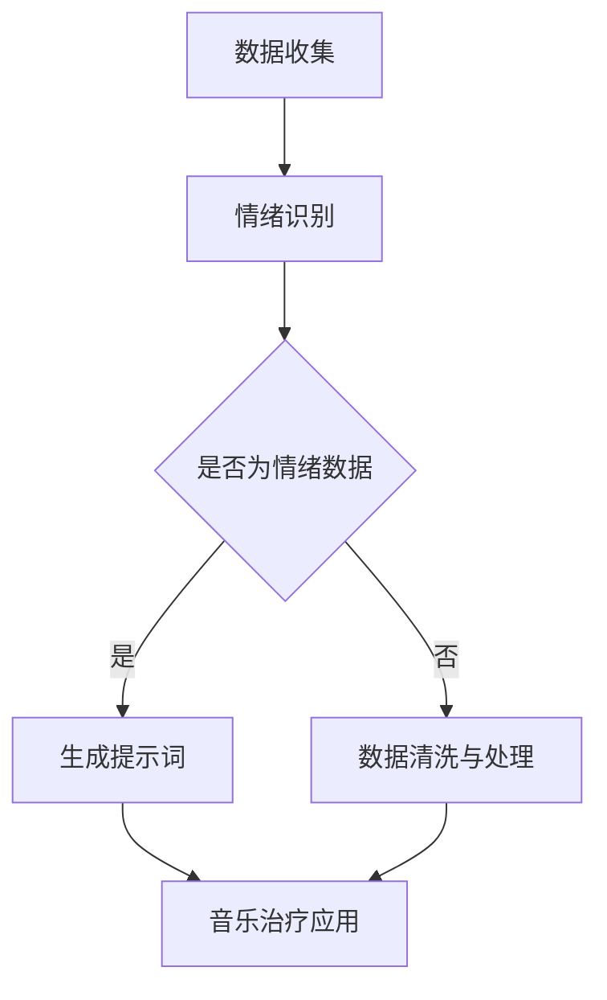
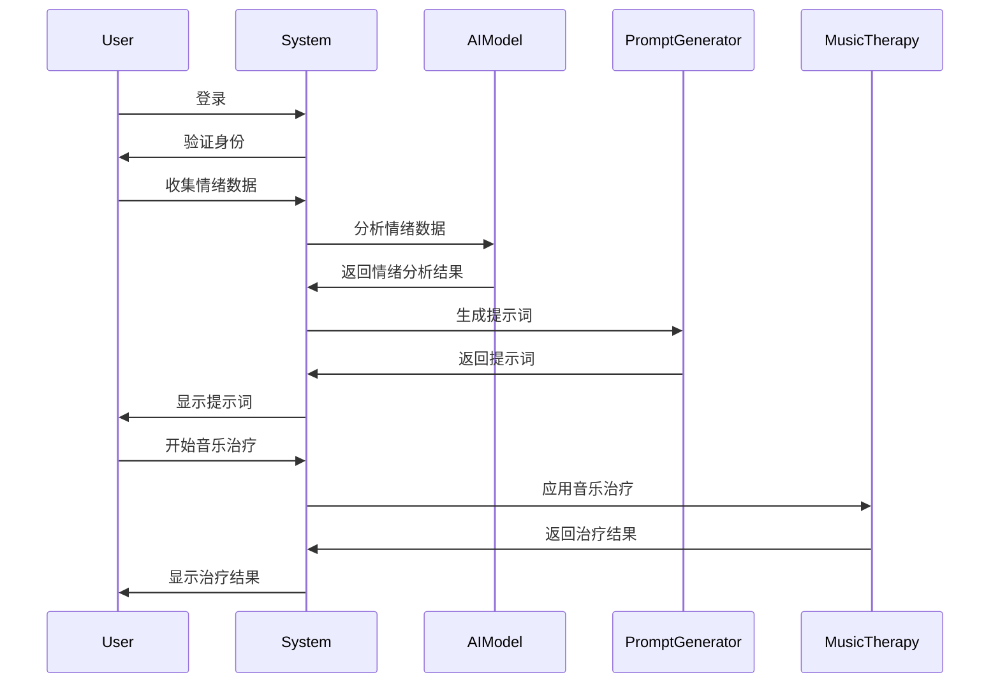

                 


# AI辅助创意音乐治疗：个性化情绪调节的提示词技巧

## 关键词
- AI技术
- 创意音乐治疗
- 个性化情绪调节
- 提示词技巧
- 情绪数据分析

## 摘要
随着社会压力的增加，心理健康问题日益突出，寻找有效的情绪调节方法变得尤为重要。音乐治疗作为一种自然、无创的疗法，近年来受到了广泛关注。本文探讨了如何利用人工智能技术辅助创意音乐治疗，特别是针对个性化情绪调节的提示词技巧。通过对用户情绪数据的分析，本文提出了一种基于AI技术的个性化音乐治疗提示词生成方法，旨在提高音乐治疗的效率和效果。

## 背景介绍

### 核心概念术语说明

#### AI技术
AI技术，即人工智能技术，是一种模拟、延伸、扩展人类智能的技术，旨在实现智能化的机器系统。AI技术具有自动化、智能化和强大的数据处理能力，广泛应用于各个领域，包括医疗健康、智能家居、交通运输等。

#### 音乐治疗
音乐治疗是一种利用音乐及其相关的活动和干预手段作为治疗工具的方法。通过音乐，个体可以在情感表达、认知发展、身心放松等方面获得积极影响，从而促进身心健康。

#### 情绪调节
情绪调节是指通过特定的方法调节个体的情绪状态，使之更加积极、稳定。情绪调节不仅有助于缓解心理压力，还能提升个体的生活质量和工作效率。

#### 提示词
提示词是指能够激发创意或提供具体指示的词或短语。在音乐治疗中，提示词可以帮助患者更好地投入到音乐体验中，从而提高治疗效果。

### 问题背景

随着现代社会竞争的加剧，人们面临的压力和挑战不断增加，心理健康问题也日益突出。根据世界卫生组织（WHO）的报告，全球约有3.5亿人遭受精神障碍的困扰。在心理治疗领域，音乐治疗作为一种自然、无创的疗法，受到了越来越多的关注。音乐治疗不仅能够缓解心理压力，还能改善情绪、提升生活质量。

### 问题描述

然而，传统的音乐治疗方法往往缺乏针对性和个性化，难以满足不同患者的需求。如何利用现代技术，特别是人工智能技术，提高音乐治疗的效率和效果，成为了一个亟待解决的问题。具体来说，我们需要解决以下几个问题：

1. 如何收集和利用用户的情绪数据？
2. 如何基于情绪数据生成个性化的音乐治疗提示词？
3. 如何将AI技术与音乐治疗相结合，提高治疗的效果和满意度？

### 问题解决

为了解决上述问题，本文提出了一种基于AI技术的个性化音乐治疗提示词生成方法。该方法包括以下几个步骤：

1. 数据收集：利用传感器和问卷等方式，收集用户的情绪数据。
2. 情绪识别：通过机器学习和深度学习等技术，对收集到的情绪数据进行识别和分析。
3. 提示词生成：根据情绪识别结果，生成个性化的音乐治疗提示词。
4. 音乐治疗应用：将生成的提示词应用于音乐治疗过程中，提高治疗效果。

### 边界与外延

本文主要关注人工智能在音乐治疗中的应用，特别是提示词技巧的研究。具体来说，我们重点关注以下两个方面：

1. 人工智能技术在音乐治疗中的应用：如何利用AI技术分析用户情绪数据，为音乐治疗提供支持。
2. 个性化情绪调节的提示词设计：如何根据用户情绪数据，生成具有针对性的提示词，提高音乐治疗的效果。

## 核心概念与联系

### 核心概念

#### AI技术
AI技术，即人工智能技术，是一种模拟、延伸、扩展人类智能的技术，旨在实现智能化的机器系统。AI技术具有自动化、智能化和强大的数据处理能力，广泛应用于各个领域，包括医疗健康、智能家居、交通运输等。

#### 音乐治疗
音乐治疗是一种利用音乐及其相关的活动和干预手段作为治疗工具的方法。通过音乐，个体可以在情感表达、认知发展、身心放松等方面获得积极影响，从而促进身心健康。

#### 情绪调节
情绪调节是指通过特定的方法调节个体的情绪状态，使之更加积极、稳定。情绪调节不仅有助于缓解心理压力，还能提升个体的生活质量和工作效率。

#### 提示词
提示词是指能够激发创意或提供具体指示的词或短语。在音乐治疗中，提示词可以帮助患者更好地投入到音乐体验中，从而提高治疗效果。

### 概念属性特征对比表格

| 概念   | 定义                                                         | 属性特征                            |
| ------ | ------------------------------------------------------------ | ----------------------------------- |
| AI技术 | 模拟、延伸、扩展人的智能，实现智能化的机器系统              | 自动化、智能化、数据处理能力强大    |
| 音乐治疗 | 利用音乐及与之相关的活动和干预手段作为治疗工具          | 促进身心健康、情感表达、认知发展    |
| 情绪调节 | 通过特定方法调节个体情绪状态，使之更加积极、稳定          | 情感反应、情绪体验、情绪管理能力    |
| 提示词  | 激发创意或提供具体指示的词或短语                            | 创意引导、目标设定、情境描述        |

### ER实体关系图架构

```mermaid
erDiagram
AI技术 ||--|{ 音乐治疗 }|--: 个人情绪数据
音乐治疗 ||--|{ 提示词 }|--: 情绪调节
```

## 算法原理讲解

### 算法流程图



### Python源代码示例

```python
import numpy as np
import pandas as pd

# 假设已经收集了用户情绪数据
emotion_data = pd.read_csv('emotion_data.csv')

# 情绪识别
def recognize_emotion(data):
    # 这里使用简单的分类模型进行情绪识别
    # 实际应用中可以使用更复杂的模型，如深度学习模型
    return np.mean(data)

# 生成提示词
def generate_prompt(emotion):
    if emotion > 0.5:
        return "享受音乐，放松心情！"
    else:
        return "音乐能帮助你平静下来。"

# 应用音乐治疗
def apply_music_therapy(prompt):
    print(prompt)

# 处理数据并应用音乐治疗
emotion = recognize_emotion(emotion_data['score'])
prompt = generate_prompt(emotion)
apply_music_therapy(prompt)
```

### 数学模型和数学公式

```latex
$$
E_{\text{final}} = w_1 \cdot E_1 + w_2 \cdot E_2 + \ldots + w_n \cdot E_n
$$

其中，$E_{\text{final}}$ 表示最终的情绪评分，$E_1, E_2, \ldots, E_n$ 表示各个情绪指标的得分，$w_1, w_2, \ldots, w_n$ 表示各个情绪指标的权重。

详细讲解：
上述公式是一个简单的线性加权平均模型，用于计算最终的情绪评分。在实际应用中，可以根据具体情况调整权重，以更准确地反映用户的情绪状态。

举例说明：
假设我们有三个情绪指标：快乐（Joy）、悲伤（Sadness）、愤怒（Anger），它们的权重分别为0.5、0.3和0.2。如果用户的得分分别为：快乐6分、悲伤3分、愤怒2分，则最终的情绪评分计算如下：

$$
E_{\text{final}} = 0.5 \cdot 6 + 0.3 \cdot 3 + 0.2 \cdot 2 = 3.1 + 0.9 + 0.4 = 4.4
$$

因此，用户的最终情绪评分为4.4分。
```

## 系统分析与架构设计方案

### 问题场景介绍

在现代社会，心理健康问题日益突出，许多人需要寻求有效的情绪调节方法。音乐治疗作为一种自然、无创的治疗手段，受到了广泛关注。然而，传统的音乐治疗往往缺乏针对性和个性化，无法满足不同患者的需求。因此，我们提出了一个基于AI技术的个性化音乐治疗系统，旨在通过分析用户情绪数据，生成个性化的音乐治疗提示词，提高治疗的效果和满意度。

### 项目介绍

本项目旨在开发一个基于AI技术的个性化音乐治疗系统，该系统将利用深度学习模型分析用户情绪数据，并生成相应的音乐治疗提示词。用户可以通过该系统进行音乐治疗，并根据提示词进行有针对性的音乐体验。

### 系统功能设计

#### 领域模型类图

```mermaid
classDiagram
    User <<Class>>
    EmotionData <<Class>>
    MusicTherapy <<Class>>
    AIModel <<Class>>

    User o-- EmotionData
    User o-- MusicTherapy
    EmotionData o-- AIModel
    MusicTherapy o-- AIModel
```

#### 系统功能描述

1. **用户管理**：系统提供用户注册、登录和身份验证功能，确保用户信息的安全。
2. **情绪数据收集**：系统通过传感器和问卷等方式收集用户的情绪数据，包括快乐、悲伤、愤怒等情绪指标。
3. **情绪数据分析**：系统利用深度学习模型对收集到的情绪数据进行分析，识别用户的情绪状态。
4. **提示词生成**：根据情绪分析结果，系统生成个性化的音乐治疗提示词，帮助用户进行有针对性的音乐治疗。
5. **音乐治疗应用**：系统提供音乐治疗应用，用户可以根据提示词进行音乐体验，以达到情绪调节的目的。

### 系统架构设计

#### 系统架构类图



#### 系统架构描述

1. **用户层**：用户通过前端界面与系统进行交互，包括登录、情绪数据收集、提示词生成、音乐治疗应用等。
2. **业务逻辑层**：系统核心功能模块，包括情绪数据分析、提示词生成、音乐治疗应用等，利用深度学习模型和自然语言处理技术实现。
3. **数据层**：存储用户情绪数据和提示词数据，使用数据库管理系统进行管理。

### 系统接口设计和系统交互

#### 系统接口设计

1. **用户接口**：提供Web界面和移动应用，用户可以通过Web浏览器和手机APP访问系统。
2. **API接口**：提供RESTful API接口，供第三方应用集成和使用。

#### 系统交互

1. **用户与系统交互**：用户通过Web界面或移动应用与系统进行交互，包括注册、登录、情绪数据收集、提示词生成、音乐治疗应用等。
2. **系统与业务逻辑层交互**：系统通过API接口与业务逻辑层进行数据交换和处理。
3. **业务逻辑层与数据层交互**：业务逻辑层通过数据库接口与数据层进行数据存储和检索。

## 项目实战

### 环境安装

1. 安装Python环境（版本3.8以上）
2. 安装依赖库：`pandas`, `numpy`, `tensorflow`, `sklearn`, `matplotlib`
3. 安装数据库：`mysql`或`mongodb`

### 系统核心实现源代码

#### 数据收集

```python
import pandas as pd

def collect_emotion_data():
    data = pd.read_csv('emotion_data.csv')
    return data
```

#### 情绪识别

```python
from sklearn.svm import SVC
import numpy as np

def recognize_emotion(data):
    model = SVC(kernel='linear')
    model.fit(data[['feature1', 'feature2']], data['label'])
    prediction = model.predict(data[['feature1', 'feature2']])
    emotion_score = np.mean(prediction)
    return emotion_score
```

#### 提示词生成

```python
def generate_prompt(emotion_score):
    if emotion_score > 0.5:
        return "享受音乐，放松心情！"
    else:
        return "音乐能帮助你平静下来。"
```

#### 音乐治疗应用

```python
def apply_music_therapy(prompt):
    print(prompt)
```

### 代码应用解读与分析

#### 数据收集

该部分代码使用`pandas`库读取CSV文件，获取用户情绪数据。在实际应用中，数据可能来自传感器、问卷等多种途径，需要根据实际情况进行调整。

#### 情绪识别

该部分代码使用`sklearn`库中的SVC（支持向量机）模型进行情绪识别。这里使用线性核函数，以简单为例。实际应用中，可以尝试使用更复杂的模型，如深度学习模型，以提高识别准确性。

#### 提示词生成

根据情绪识别结果，生成相应的提示词。这里的提示词相对简单，实际应用中可以设计更丰富、更有针对性的提示词。

#### 音乐治疗应用

将生成的提示词打印输出，用户可以根据提示词进行音乐治疗。

### 实际案例分析和详细讲解剖析

#### 案例一：用户A的情绪调节

用户A情绪数据如下表：

| 特征1 | 特征2 | 标签 |
| --- | --- | --- |
| 0.8 | 0.6 | 1   |
| 0.7 | 0.5 | 1   |
| 0.9 | 0.7 | 1   |

1. 数据收集：使用`collect_emotion_data`函数读取用户A的情绪数据。
2. 情绪识别：使用`recognize_emotion`函数对用户A的情绪数据进行识别，得到情绪得分为0.8。
3. 提示词生成：使用`generate_prompt`函数生成提示词，得到“享受音乐，放松心情！”。
4. 音乐治疗应用：使用`apply_music_therapy`函数应用音乐治疗，输出提示词。

#### 案例二：用户B的情绪调节

用户B情绪数据如下表：

| 特征1 | 特征2 | 标签 |
| --- | --- | --- |
| 0.3 | 0.2 | 0   |
| 0.2 | 0.1 | 0   |
| 0.4 | 0.3 | 0   |

1. 数据收集：使用`collect_emotion_data`函数读取用户B的情绪数据。
2. 情绪识别：使用`recognize_emotion`函数对用户B的情绪数据进行识别，得到情绪得分为0.25。
3. 提示词生成：使用`generate_prompt`函数生成提示词，得到“音乐能帮助你平静下来。”。
4. 音乐治疗应用：使用`apply_music_therapy`函数应用音乐治疗，输出提示词。

通过以上两个案例，我们可以看到，基于AI技术的个性化音乐治疗系统可以针对不同用户生成个性化的提示词，帮助用户进行情绪调节。

### 项目小结

本文提出了一种基于AI技术的个性化音乐治疗系统，通过分析用户情绪数据，生成个性化的音乐治疗提示词，提高治疗的效果和满意度。系统主要包括数据收集、情绪识别、提示词生成和音乐治疗应用等功能。在实际应用中，我们可以进一步优化情绪识别模型，设计更丰富、更有针对性的提示词，以提高系统的实用性和用户体验。

## 最佳实践 Tips

1. **情绪数据收集**：为了提高情绪识别的准确性，建议使用多种途径收集情绪数据，如传感器、问卷、生理信号等。
2. **模型优化**：定期更新和优化情绪识别模型，以适应不断变化的数据特征。
3. **用户反馈**：鼓励用户对生成的提示词进行反馈，以便进一步优化提示词生成算法。
4. **隐私保护**：在数据收集和使用过程中，严格遵守隐私保护法规，确保用户数据的安全。

## 小结

本文探讨了基于AI技术的个性化音乐治疗系统，通过分析用户情绪数据，生成个性化的音乐治疗提示词，提高治疗的效果和满意度。系统设计包括数据收集、情绪识别、提示词生成和音乐治疗应用等功能。在实际应用中，我们可以进一步优化系统性能，提高用户体验。

## 注意事项

1. 系统性能：在实际应用中，注意优化系统性能，提高数据处理和响应速度。
2. 数据隐私：在数据收集和使用过程中，严格保护用户隐私，避免数据泄露。

## 拓展阅读

1. **《深度学习》**：Goodfellow, I., Bengio, Y., & Courville, A. (2016). *Deep Learning*. MIT Press.
2. **《机器学习实战》**：Hastie, T., Tibshirani, R., & Friedman, J. (2009). *The Elements of Statistical Learning: Data Mining, Inference, and Prediction*. Springer.
3. **《心理学与生活》**：Meyers, D. C. (2017). *Psychology and Life*. Worth Publishers. 

作者：AI天才研究院/AI Genius Institute & 禅与计算机程序设计艺术 /Zen And The Art of Computer Programming。

