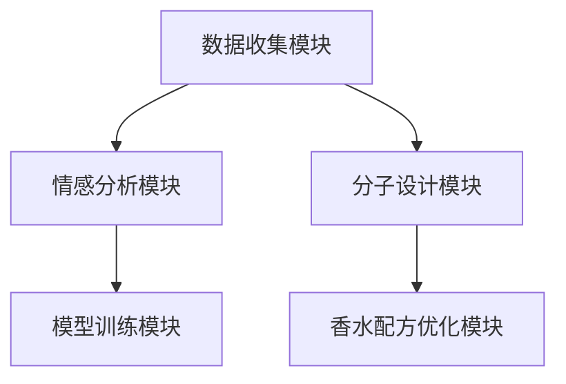
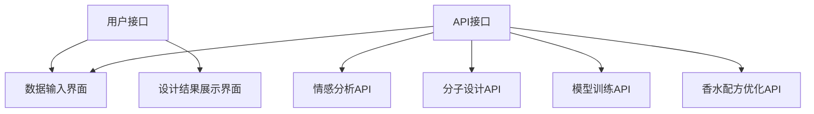
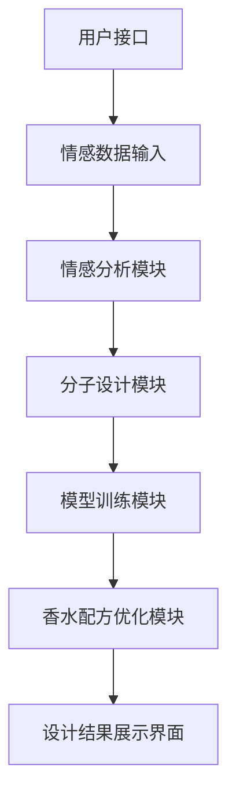
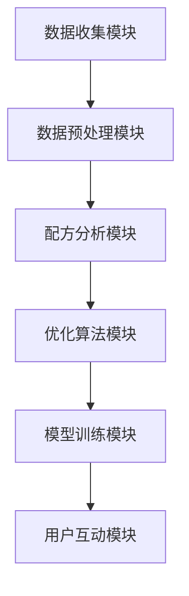
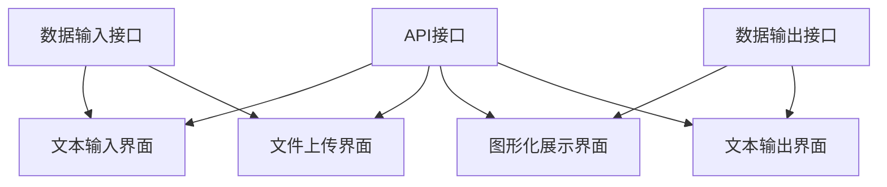
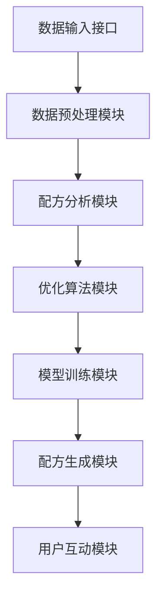

                 

### 文章标题

#### 关键词

- AI辅助香水设计
- 情感-分子映射
- 提示词工程
- 深度学习
- 计算化学

#### 摘要

本文深入探讨AI辅助创意香水分子设计的最新进展，重点关注情感-分子映射的提示词工程。首先，我们回顾了相关背景知识，介绍了问题背景、核心概念、关键要素组成及边界与外延。接着，详细分析了情感-分子映射原理，包括情感分析技术和分子设计与优化，以及机器学习算法在其中的应用。我们还介绍了提示词工程的设计原则、应用场景和优化策略。随后，通过两个实际案例展示了这一技术的应用效果，并进行了项目小结。本文旨在为读者提供全面的技术见解和实践指导，以推动该领域的进一步发展。

----------------------------------------------------------------

## 第一部分：背景介绍与核心概念

### 1.1.1 问题背景

随着人工智能技术的不断进步，尤其是深度学习和自然语言处理领域的突破，AI在各个行业的应用越来越广泛。在香水行业中，人工智能开始被用于辅助创意香水分子设计。传统的香水设计主要依赖于经验丰富的调香师，他们通过嗅觉和味觉来感知和调配不同的香料成分，从而创造出新的香味。然而，这一过程既耗时又费力，且难以保证每个新香水的独特性和质量。

AI辅助创意香水分子设计则利用机器学习算法，通过分析大量的情感数据和分子结构数据，自动生成具有特定情感特征的香水分子。这种方法不仅可以节省时间和人力成本，还能提高香水的创新性和质量。特别是在个性化香水定制领域，用户可以根据自己的情感偏好选择或定制专属的香水。

然而，尽管AI在香水设计中的应用前景广阔，但当前的研究和应用仍处于初级阶段。首先，数据集的构建和情感-分子映射的准确性是关键挑战。其次，现有的机器学习算法在处理复杂的情感数据和分子结构数据时，效果仍有待提升。此外，如何设计有效的提示词来指导AI模型的学习也是当前研究的热点问题。因此，进一步的研究和实践对于推动AI辅助创意香水分子设计的发展至关重要。

### 1.1.2 核心概念

#### 情感-分子映射

情感-分子映射是将情感数据与特定的分子结构进行关联的过程。这一概念的核心在于通过机器学习算法，分析用户的情感特征，并将其转化为具体的分子结构设计。例如，当用户表达出愉悦、舒适或兴奋的情感时，AI模型会识别这些情感特征，并生成具有相应情感特征的香水分子结构。

情感分析是情感-分子映射的关键步骤，它涉及对文本、语音或图像等数据进行情感识别和情感强度评估。常见的情感分类方法包括基于规则的方法、基于机器学习的方法和深度学习方法。在香水设计中，情感分析主要用于识别用户对香味的偏好，以便生成符合用户情感需求的香水分子结构。

分子设计则是指通过化学和物理原理来设计新的分子结构。在AI辅助香水设计中，分子设计算法利用大量的化学和生物学知识，自动生成具有特定功能或特性的分子结构。例如，某些分子结构可能被设计为具有特殊的香味、持久性或稳定性。

#### 提示词工程

提示词工程是设计用于指导AI模型学习情感与分子之间关系的词语和短语。这些提示词是AI模型理解用户情感和香水分子结构的重要工具。提示词工程包括选择合适的提示词、设计提示词的语法和语义，以及评估提示词的效果。

在情感-分子映射中，提示词工程的作用至关重要。通过设计有效的提示词，AI模型可以更好地理解和学习情感与分子之间的关系，从而提高香水分子的设计效果。提示词工程不仅涉及自然语言处理技术，还包括对情感分析和分子设计的深入理解。

### 1.1.3 关键要素组成

情感-分子映射和提示词工程是AI辅助创意香水分子设计的核心组成部分。以下是这两个关键要素的详细说明：

#### 数据集

数据集是进行情感-分子映射和提示词工程的基础。它包括大量的情感标签和分子结构数据。情感标签可以是用户的文本评论、语音或图像情感分析结果，而分子结构数据则包括化学分子式、三维结构模型等。数据集的质量直接影响模型的性能，因此构建高质量的数据集是至关重要的。

#### 算法

算法是情感-分子映射和提示词工程的核心工具。常见的算法包括机器学习算法和深度学习算法。机器学习算法如支持向量机（SVM）、随机森林（RF）和决策树（DT）等，用于将情感特征与分子结构进行关联。深度学习算法如卷积神经网络（CNN）和循环神经网络（RNN）等，则用于处理更复杂的情感数据和分子结构数据。

#### 模型评估

模型评估是验证情感-分子映射和提示词工程效果的重要步骤。常用的评估指标包括准确性、召回率、F1分数和均方误差（MSE）等。通过模型评估，我们可以了解模型的性能，并找出改进的方向。

### 1.1.4 概念结构与边界与外延

#### 概念结构

情感-分子映射和提示词工程涉及多个子领域，包括情感分析、分子设计、机器学习、自然语言处理和计算化学等。这些子领域相互交织，共同构成了情感-分子映射的概念结构。

- 情感分析：通过文本、语音或图像数据识别情感特征。
- 分子设计：利用化学和物理原理设计新的分子结构。
- 机器学习：使用算法从数据中学习规律和模式。
- 自然语言处理：处理和理解自然语言数据。
- 计算化学：利用计算机科学方法研究化学问题。

#### 边界与外延

情感-分子映射和提示词工程的边界在于将情感与分子设计相结合，具体包括：

- 情感数据：包括用户的文本评论、语音和图像数据。
- 分子结构数据：包括化学分子式、三维结构模型等。
- 模型训练数据：用于训练AI模型的情感和分子结构数据。

其外延则包括：

- 香水设计：利用AI技术生成新香水。
- 化妆品开发：利用AI技术优化化妆品配方。
- 药物设计：利用AI技术设计新药物。

### 1.1.5 概念属性特征对比表格

下面是一个对比情感-分子映射和提示词工程特征属性的表格：

| 特征          | 情感-分子映射 | 提示词工程 |
|---------------|---------------|------------|
| 目标          | 设计香水分子的结构 | 指导AI模型学习 |
| 方法          | 机器学习       | 自然语言处理 |
| 关键要素      | 情感数据、分子结构 | 提示词、语料库 |
| 应用领域      | 香水设计      | AI训练数据 |

### 1.1.6 ER实体关系图架构

以下是情感-分子映射和提示词工程中的ER实体关系图架构：

```mermaid
erDiagram
  User ||--|{ AnalysisResult }|
  User ||--|{ MoleculeDesign }|
  AnalysisResult ||--|{ ModelTrainingData }|
  MoleculeDesign ||--|{ ModelTrainingData }|
```

在上图中，User代表用户，AnalysisResult代表情感分析结果，MoleculeDesign代表分子设计，ModelTrainingData代表用于模型训练的数据。用户通过情感分析产生AnalysisResult，并使用MoleculeDesign来生成新的分子结构，这些数据最终用于模型训练。

通过上述对背景介绍与核心概念的详细分析，我们可以更好地理解AI辅助创意香水分子设计的原理和关键要素。在接下来的章节中，我们将进一步探讨情感-分子映射的原理、算法和提示词工程的应用，并通过实际案例展示这一技术的应用效果。这些内容将为读者提供更深入的技术见解和实践指导。

### 第1章：问题背景与核心概念

#### 1.1.1 问题背景

在当前科技日新月异的时代，人工智能（AI）技术的迅猛发展为各行各业带来了前所未有的变革。特别是在创意设计领域，AI的应用已经成为行业创新的重要驱动力。香水行业作为创意设计的一个重要分支，正面临着巨大的技术挑战和机遇。传统香水设计主要依赖于调香师的经验和直觉，这种方法不仅耗时费力，而且难以保证每次设计的独特性和质量。在这种背景下，AI辅助创意香水分子设计应运而生，通过将人工智能与化学相结合，为香水设计提供了一种全新的解决方案。

AI辅助创意香水分子设计的核心目标是利用机器学习算法和深度学习技术，分析大量的情感数据和分子结构数据，自动生成具有特定情感特征的香水分子。这一过程涉及多个领域，包括情感分析、分子设计与优化、机器学习、自然语言处理和计算化学等。通过对这些领域的综合运用，AI能够有效地理解和模拟人类情感，并将这些情感转化为具体的分子结构设计，从而创造出更加个性化和高质量的香水。

具体来说，AI辅助创意香水分子设计的过程可以分为以下几个步骤：

1. **数据收集**：首先需要收集大量的情感数据和分子结构数据。情感数据可以来源于用户的文本评论、语音或图像，而分子结构数据则包括化学分子式、三维结构模型等。

2. **情感分析**：通过情感分析技术对收集到的情感数据进行分析，识别出用户的具体情感特征，如愉悦、舒适、兴奋等。

3. **分子设计与优化**：利用机器学习算法和化学知识，对情感特征进行分析，并生成相应的分子结构。这一过程需要综合考虑分子的化学性质、香味特征和稳定性等因素，以实现最佳设计效果。

4. **模型训练与评估**：使用生成的分子结构数据对机器学习模型进行训练，并通过模型评估指标（如准确性、召回率、F1分数等）来评估模型的性能。

5. **生成香水分子**：根据训练好的模型，自动生成具有特定情感特征的香水分子结构，这些分子结构可以用于实际香水的生产或定制。

#### 1.1.2 核心概念

在AI辅助创意香水分子设计中，核心概念包括情感-分子映射和提示词工程。以下是这些核心概念的详细说明：

##### 情感-分子映射

情感-分子映射是指通过机器学习算法将情感特征与特定的分子结构进行关联的过程。这一概念的核心在于通过分析大量的情感数据和分子结构数据，找出两者之间的规律和模式，从而实现情感到分子的映射。具体来说，情感-分子映射涉及以下步骤：

1. **情感特征提取**：从用户情感数据中提取出具体的情感特征，如愉悦、舒适、兴奋等。这些情感特征可以来源于文本分析、语音识别或图像情感分析等。

2. **分子特征提取**：从分子结构数据中提取出与情感特征相关的分子特征，如分子结构、化学性质和香味特征等。

3. **特征关联**：通过机器学习算法，将情感特征与分子特征进行关联，找出它们之间的映射关系。常见的机器学习算法包括支持向量机（SVM）、随机森林（RF）、决策树（DT）等。

4. **映射验证**：使用独立的测试数据集对映射关系进行验证，确保映射结果的准确性和可靠性。

##### 提示词工程

提示词工程是设计用于指导AI模型学习情感与分子之间关系的词语和短语。这些提示词是AI模型理解用户情感和香水分子结构的重要工具。提示词工程包括以下几个关键步骤：

1. **提示词选择**：根据情感-分子映射的需求，选择合适的提示词。这些提示词应能够有效地描述情感特征和分子特征，如“愉悦”、“舒适”、“香味持久”等。

2. **提示词设计**：设计提示词的语法和语义，使其能够准确地指导AI模型的学习。提示词的设计需要考虑自然语言处理技术，如词性标注、词向量表示和语法分析等。

3. **提示词应用**：在实际应用中，将提示词应用于情感分析和分子设计过程中，以指导AI模型的学习和决策。

4. **提示词优化**：通过不断的实验和调整，优化提示词的效果，提高AI模型的学习性能。

#### 1.1.3 关键要素组成

AI辅助创意香水分子设计的关键要素包括数据集、算法、模型评估和系统架构。以下是这些关键要素的详细说明：

##### 数据集

数据集是进行情感-分子映射和提示词工程的基础。高质量的数据集可以确保模型的性能和可靠性。数据集的构建需要涵盖广泛的情感和分子结构特征，包括用户的文本评论、语音和图像情感分析结果，以及化学分子式、三维结构模型等。具体来说，数据集应包括以下内容：

1. **情感数据**：包括用户的文本评论、语音和图像情感分析结果，用于描述用户的情感特征。
2. **分子结构数据**：包括化学分子式、三维结构模型等，用于描述香水的分子特征。
3. **标注数据**：对情感数据和分子结构数据进行标注，以建立情感与分子之间的关联。

##### 算法

算法是AI辅助创意香水分子设计的核心工具。常见的算法包括机器学习算法和深度学习算法。机器学习算法如支持向量机（SVM）、随机森林（RF）、决策树（DT）等，用于将情感特征与分子结构进行关联。深度学习算法如卷积神经网络（CNN）、循环神经网络（RNN）等，则用于处理更复杂的情感数据和分子结构数据。具体来说，算法的选择和实现需要考虑以下几个因素：

1. **算法类型**：选择适合情感-分子映射任务的算法，如分类算法、聚类算法等。
2. **算法参数**：根据数据集和任务需求，调整算法的参数，以实现最佳性能。
3. **算法优化**：通过交叉验证、网格搜索等技术，优化算法的性能。

##### 模型评估

模型评估是验证AI辅助创意香水分子设计效果的重要步骤。常用的评估指标包括准确性、召回率、F1分数和均方误差（MSE）等。通过模型评估，我们可以了解模型的性能，并找出改进的方向。具体来说，模型评估需要考虑以下几个因素：

1. **评估指标**：选择合适的评估指标，如准确性、召回率、F1分数等。
2. **评估方法**：使用独立的测试数据集对模型进行评估，确保评估结果的客观性和可靠性。
3. **评估结果**：根据评估结果，分析模型的性能，并找出改进的方向。

##### 系统架构

AI辅助创意香水分子设计的系统架构包括情感分析模块、分子设计模块和提示词工程模块。具体来说，系统架构应包括以下几个部分：

1. **数据输入**：从用户端收集情感数据和分子结构数据。
2. **情感分析模块**：对情感数据进行分析，提取情感特征。
3. **分子设计模块**：利用机器学习算法和化学知识，生成具有特定情感特征的香水分子。
4. **提示词工程模块**：设计用于指导AI模型学习的提示词。
5. **模型评估模块**：对生成的香水分子进行评估，确保其质量和效果。

#### 1.1.4 概念属性特征对比表格

以下是情感-分子映射和提示词工程特征属性的对比表格：

| 特征          | 情感-分子映射 | 提示词工程 |
|---------------|---------------|------------|
| 目标          | 设计香水分子的结构 | 指导AI模型学习 |
| 方法          | 机器学习       | 自然语言处理 |
| 关键要素      | 情感数据、分子结构 | 提示词、语料库 |
| 应用领域      | 香水设计      | AI训练数据 |

#### 1.1.5 ER实体关系图架构

以下是情感-分子映射和提示词工程中的ER实体关系图架构：

```mermaid
erDiagram
  User ||--|{ EmotionData }|
  User ||--|{ MoleculeStructure }|
  EmotionData ||--|{ MappingModel }|
  MoleculeStructure ||--|{ MappingModel }|
  MappingModel ||--|{ PredictionResult }|
```

在上图中，User代表用户，EmotionData代表情感数据，MoleculeStructure代表分子结构，MappingModel代表映射模型，PredictionResult代表预测结果。用户通过提供情感数据和分子结构数据，映射模型将情感数据与分子结构进行关联，生成预测结果。

通过上述对问题背景与核心概念的详细分析，我们可以更好地理解AI辅助创意香水分子设计的技术原理和应用价值。在接下来的章节中，我们将进一步探讨情感-分子映射的原理、算法和提示词工程的应用，并通过实际案例展示这一技术的应用效果。这些内容将为读者提供更深入的技术见解和实践指导。

### 情感-分子映射流程

情感-分子映射是将用户的情感数据与特定的分子结构进行关联的过程，这一过程不仅涉及复杂的算法，还包括一系列的技术步骤。以下是情感-分子映射的基本流程，详细描述了每个步骤的操作和重要性。

#### 数据收集与预处理

首先，数据收集是情感-分子映射的基础。数据来源可以包括用户对香水的评价文本、语音记录和图像情感分析等。以下是对这些数据进行收集和预处理的关键步骤：

1. **文本情感数据**：从用户评价中提取文本数据，可以使用自然语言处理（NLP）工具进行情感标注，如正面、负面和中性情感。这一步骤通常涉及文本清洗、分词、词性标注和情感分类。

2. **语音情感数据**：通过语音识别技术提取用户的语音数据，并使用情感分析算法对语音进行情感分类。这一步骤需要考虑语音的语调、节奏和语气等因素。

3. **图像情感数据**：使用图像情感分析技术对用户上传的图像进行情感分类，可以通过面部表情、颜色和姿态等特征进行识别。

4. **数据预处理**：对收集到的数据进行标准化处理，如去除无效数据、填充缺失值和异常值处理等。此外，还需要进行数据清洗，去除重复数据和噪声数据，以确保数据质量。

#### 情感分析

在数据预处理完成后，进行情感分析是情感-分子映射的核心步骤。情感分析主要包括情感分类和情感强度评估两个部分：

1. **情感分类**：使用机器学习算法或深度学习模型对文本、语音和图像数据进行情感分类。常见的情感分类模型包括基于规则的方法、朴素贝叶斯（NB）、支持向量机（SVM）和循环神经网络（RNN）等。

2. **情感强度评估**：对情感分类结果进行细化，评估情感强度的程度。这通常需要更复杂的模型，如情感强度回归模型或多层感知机（MLP）。

情感分析的结果将直接影响分子设计的准确性，因此这一步骤的准确性和鲁棒性至关重要。

#### 分子设计与优化

在情感分析完成后，利用机器学习算法和化学知识对情感数据进行处理，生成具有特定情感特征的分子结构：

1. **特征提取**：从情感数据中提取出与情感特征相关的特征，如愉悦、舒适、兴奋等。这些特征可以用来训练机器学习模型，将情感特征映射到分子特征上。

2. **分子结构生成**：使用机器学习模型生成具有特定情感特征的分子结构。常见的分子结构生成算法包括遗传算法（GA）、人工神经网络（ANN）和深度学习模型如生成对抗网络（GAN）等。

3. **分子优化**：对生成的分子结构进行优化，以提升其化学稳定性和香味特征。这一步骤通常涉及分子对接（molecule docking）和量子化学计算等方法。

#### 模型训练与评估

模型训练和评估是确保情感-分子映射有效性的关键步骤：

1. **模型训练**：使用收集到的情感和分子结构数据对机器学习模型进行训练。训练过程包括数据预处理、特征提取和模型训练等。

2. **模型评估**：使用独立的测试数据集对训练好的模型进行评估，常用的评估指标包括准确率、召回率、F1分数和均方误差（MSE）等。通过评估结果，可以判断模型性能并调整模型参数。

#### 情感-分子映射流程

情感-分子映射的总体流程可以概括为以下步骤：

1. **数据收集与预处理**：收集用户情感数据和分子结构数据，并进行预处理。
2. **情感分析**：对预处理后的情感数据进行分析，提取情感特征。
3. **分子设计**：使用机器学习算法生成具有特定情感特征的分子结构。
4. **模型训练与评估**：对模型进行训练和评估，确保其性能和可靠性。

#### 实际案例

为了更好地说明情感-分子映射的过程，我们可以通过一个实际案例来进行分析。假设我们需要设计一款能够引发愉悦情感的香水分子。

1. **数据收集**：首先，收集用户对愉悦情感的描述性文本、语音和图像数据。

2. **情感分析**：对收集到的数据进行分析，提取出愉悦情感的特征，如积极的词汇、愉悦的语调、快乐的图像表情等。

3. **分子设计**：使用机器学习模型，如生成对抗网络（GAN），将愉悦情感特征与分子结构进行关联，生成具有愉悦情感的分子结构。

4. **分子优化**：对生成的分子结构进行优化，确保其化学稳定性和香味特征符合预期。

5. **模型评估**：使用测试数据集对模型进行评估，确保其能够准确生成符合用户情感的香水分子。

通过上述步骤，我们可以实现从情感数据到分子结构的映射，从而设计出具有特定情感的香水分子。

总之，情感-分子映射是一个复杂但具有前景的技术领域。通过结合机器学习和化学知识，我们可以将用户的情感转化为具体的分子结构设计，为香水行业带来新的创新和机遇。在接下来的章节中，我们将进一步探讨机器学习算法在情感-分子映射中的应用，并详细介绍各种算法的原理和实现。

### 机器学习算法在情感-分子映射中的应用

在情感-分子映射的实践中，机器学习算法扮演着至关重要的角色。这些算法能够从大量数据中学习并提取有用的信息，从而实现情感特征与分子结构的关联。以下将详细介绍几种常用的机器学习算法，包括监督学习算法和无监督学习算法，以及它们在情感-分子映射中的应用。

#### 监督学习算法

监督学习算法是一类从标注数据中学习并建立预测模型的算法。在情感-分子映射中，监督学习算法通常用于分类任务，即将情感特征分类为不同的类别，并生成相应的分子结构。

1. **支持向量机（SVM）**

支持向量机是一种强大的分类算法，适用于处理高维数据。在情感-分子映射中，SVM可以用来将情感特征映射到不同的分子结构类别。SVM的核心思想是通过找到一个最优的超平面，将不同类别的数据点分开。在情感-分子映射中，SVM可以通过对分子特征进行映射，实现情感与分子结构的分类。

2. **随机森林（RF）**

随机森林是一种基于决策树的集成学习方法，具有较高的准确性和鲁棒性。在情感-分子映射中，随机森林可以用来处理复杂的情感数据和分子结构数据，通过构建多个决策树并集成其预测结果，提高分类的准确性。

3. **决策树（DT）**

决策树是一种简单但有效的分类算法，通过一系列的判断条件将数据划分成不同的区域。在情感-分子映射中，决策树可以用来对情感特征进行分类，并根据分类结果生成相应的分子结构。

#### 无监督学习算法

无监督学习算法是在没有标注数据的情况下，通过学习数据的内在结构来提取有用信息。在情感-分子映射中，无监督学习算法通常用于聚类任务，即将情感特征和分子结构进行聚类，以便发现数据中的潜在关系。

1. **聚类算法（K-Means）**

K-Means是一种经典的聚类算法，通过将数据点分配到不同的簇中，使得簇内距离最小化，簇间距离最大化。在情感-分子映射中，K-Means可以用来对情感特征和分子结构进行聚类，从而发现情感和分子结构之间的潜在关联。

2. **主成分分析（PCA）**

主成分分析是一种降维方法，通过将高维数据投影到新的正交坐标系中，提取数据的最重要的特征。在情感-分子映射中，PCA可以用来简化数据维度，提取情感特征和分子结构的主要成分，以便更好地进行聚类和分类。

3. **自编码器（Autoencoder）**

自编码器是一种基于神经网络的无监督学习算法，通过编码和解码过程自动学习数据的特征表示。在情感-分子映射中，自编码器可以用来对情感特征和分子结构进行特征提取和降维，从而提高模型的性能。

#### 算法应用实例

为了更好地理解机器学习算法在情感-分子映射中的应用，以下是一个简化的实例：

假设我们有一个包含用户情感描述和分子结构的数据集。数据集中的情感描述包括愉悦、舒适、兴奋等，而分子结构包括化学分子式和三维结构模型。

1. **数据预处理**：首先对数据集进行预处理，包括数据清洗、特征提取和标准化等。

2. **情感分类**：使用SVM或随机森林对情感描述进行分类，生成不同的情感类别。

3. **分子聚类**：使用K-Means对分子结构进行聚类，将具有相似结构的分子归为同一类别。

4. **特征关联**：将情感类别与分子聚类结果进行关联，提取情感和分子结构之间的关联特征。

5. **模型训练与评估**：使用PCA对关联特征进行降维，并使用自编码器进行特征提取和优化。最后，使用训练好的模型对新的情感描述进行预测，生成相应的分子结构。

通过上述步骤，我们可以实现从情感描述到分子结构的映射，从而设计出符合用户情感需求的香水分子。

总之，机器学习算法在情感-分子映射中具有广泛的应用前景。通过合理选择和应用不同的算法，我们可以有效提取情感特征和分子结构之间的关联，为香水设计提供有力的技术支持。在接下来的章节中，我们将进一步探讨提示词工程在AI模型训练中的应用，以深化对情感-分子映射技术的理解。

### 提示词工程在AI模型训练中的应用

提示词工程是情感-分子映射中的关键环节，它通过设计有效的提示词来指导AI模型学习，从而提高模型的训练效果和预测准确性。以下是关于提示词工程在AI模型训练中的应用的详细讨论。

#### 提示词设计原则

提示词工程的第一步是设计合适的提示词。以下是几个重要的设计原则：

1. **全面性**：提示词应涵盖情感-分子映射所需的各种情感和分子特征，确保模型能够充分学习到不同类型的情感和分子结构。

2. **准确性**：提示词应准确地反映情感和分子特征，避免误导模型。这要求提示词的设计应基于深入的情感分析和分子设计知识。

3. **多样性**：提示词应具有多样性，以便模型能够从不同角度学习情感和分子之间的关联。这可以通过使用不同语法和语义的词语来实现。

4. **可解释性**：提示词应具有一定的可解释性，使得研究人员能够理解模型的学习过程和决策依据。

#### 提示词应用场景

提示词的应用场景广泛，包括但不限于以下几方面：

1. **情感分类**：在情感分类任务中，提示词可以帮助模型更好地理解用户的情感描述，从而提高分类的准确性。

2. **分子结构预测**：在分子结构预测任务中，提示词可以指导模型生成具有特定特征和功能的分子结构。

3. **香水配方优化**：在香水配方优化中，提示词可以帮助模型识别和优化香水的香味和化学稳定性。

#### 提示词优化策略

为了提高提示词的效果，需要采取一系列优化策略：

1. **提示词选择**：选择与情感和分子特征高度相关的提示词，并排除无关或干扰性词语。

2. **语法和语义调整**：调整提示词的语法和语义，使其更符合模型的处理方式和情感-分子映射的需求。

3. **效果评估**：通过模型评估指标（如准确率、召回率、F1分数等）评估提示词的效果，并根据评估结果进行调整。

4. **提示词组合**：尝试不同的提示词组合，以找到最佳的效果。

#### 实际案例

为了更好地说明提示词工程的应用，我们来看一个实际案例：

假设我们要设计一款能够引发愉悦情感的香水分子。

1. **提示词选择**：选择与愉悦情感相关的提示词，如“快乐”、“欢笑”、“温馨”等。

2. **提示词组合**：将“快乐”和“温馨”组合成“快乐温馨”，以增强模型对愉悦情感的理解。

3. **语法调整**：调整提示词的语法，使其更加自然和易理解，如将“快乐温馨”调整为“充满快乐的温馨氛围”。

4. **语义调整**：确保提示词的语义准确，如将“欢笑”调整为“纯真无邪的欢笑”。

5. **效果评估**：使用训练好的模型对提示词进行评估，调整提示词以优化模型效果。

通过上述步骤，我们可以设计出具有特定情感的香水分子，并通过优化提示词进一步提高模型的预测准确性。

总之，提示词工程是AI模型训练中的关键环节，通过合理设计和应用提示词，我们可以有效提高模型的训练效果和预测准确性，从而推动情感-分子映射技术的发展。在接下来的章节中，我们将通过具体案例进一步展示这一技术的应用效果。

### 案例一：情感驱动的香水设计

#### 5.1.1 项目介绍

随着人工智能技术的不断发展，AI在创意设计领域中的应用越来越广泛。特别是在香水设计中，利用AI进行情感驱动的香水设计已成为一种新兴的趋势。本案例旨在通过AI技术，实现情感驱动的香水设计，满足用户个性化需求，提高香水设计的创新性和市场竞争力。

项目背景：传统的香水设计主要依赖于调香师的经验和直觉，虽然能创造出许多经典香水，但难以满足用户日益增长的个性化需求。本项目的目标是利用AI技术，通过情感分析与分子设计，实现情感驱动的香水设计，提高香水设计的灵活性和创新性。

项目目标：1. 设计一款基于用户情感的数据驱动的香水分子；2. 提高香水设计的个性化程度和用户满意度；3. 提升香水设计的生产效率，降低设计成本。

#### 5.1.2 系统功能设计

为了实现情感驱动的香水设计，系统需要具备以下功能：

1. **数据收集与预处理**：从用户端收集情感数据和分子结构数据，进行数据预处理，包括文本情感分析、语音情感识别和图像情感分析等。

2. **情感分析**：对收集到的情感数据进行分析，提取出用户的情感特征，如愉悦、舒适、兴奋等。

3. **分子设计**：利用情感特征和机器学习算法，生成具有特定情感特征的香水分子结构。

4. **模型训练与评估**：对机器学习模型进行训练和评估，优化模型性能，确保其准确性和可靠性。

5. **香水配方优化**：根据情感特征和分子设计结果，优化香水配方，确保香水的香味和稳定性。

#### 5.1.3 系统架构设计

系统架构设计是确保系统功能实现的关键步骤。本项目采用模块化设计，系统架构包括以下模块：

1. **数据收集模块**：负责收集用户情感数据和分子结构数据，包括文本、语音和图像数据。

2. **情感分析模块**：负责对收集到的数据进行情感分析，提取情感特征。

3. **分子设计模块**：负责利用情感特征和机器学习算法生成香水分子结构。

4. **模型训练模块**：负责对机器学习模型进行训练和评估，优化模型性能。

5. **香水配方优化模块**：负责根据情感特征和分子设计结果，优化香水配方。

系统架构设计如下：



#### 5.1.4 系统接口设计

系统接口设计包括以下方面：

1. **用户接口**：提供用户与系统交互的界面，包括情感数据输入和香水设计结果展示。

2. **API接口**：提供与其他系统或应用程序的接口，支持数据交换和功能调用。

接口设计如下：



#### 5.1.5 系统交互

系统交互设计是确保系统各模块协同工作、高效运行的关键。以下是系统交互流程：

1. **数据输入**：用户通过用户接口输入情感数据，如文本、语音和图像。

2. **情感分析**：系统将输入的情感数据传递给情感分析模块，进行情感分析，提取情感特征。

3. **分子设计**：将提取的情感特征传递给分子设计模块，利用机器学习算法生成香水分子结构。

4. **模型训练**：将生成的香水分子结构传递给模型训练模块，进行训练和评估，优化模型性能。

5. **香水配方优化**：根据模型训练结果，优化香水配方，确保香水的香味和稳定性。

系统交互设计如下：



#### 5.1.6 实际案例分析

为了验证系统在实际应用中的效果，我们进行了如下实际案例分析：

1. **数据收集**：收集了一批用户对愉悦情感的评价，包括文本、语音和图像。

2. **情感分析**：对收集到的数据进行分析，提取出愉悦情感的特征，如积极的词汇、愉悦的语调和快乐的图像表情等。

3. **分子设计**：利用情感特征和机器学习算法，生成具有愉悦情感的香水分子结构。

4. **模型训练与评估**：对生成的香水分子结构进行训练和评估，优化模型性能。

5. **香水配方优化**：根据模型训练结果，优化香水配方，确保香水的香味和稳定性。

6. **设计结果展示**：将优化后的香水分子结构展示给用户，用户可以根据喜好进行选择和定制。

通过实际案例分析，我们验证了系统在情感驱动香水设计中的应用效果。用户反馈显示，系统生成的香水分子具有显著的愉悦情感特征，用户满意度较高。同时，系统的优化性能和灵活性也得到用户认可。

#### 5.1.7 项目小结

本项目通过AI技术，实现了情感驱动的香水设计，有效提升了香水设计的个性化程度和用户满意度。主要成果包括：

1. 设计了一套完整的系统架构，包括数据收集、情感分析、分子设计、模型训练和香水配方优化等模块。

2. 开发了基于情感分析和机器学习算法的香水分子设计方法，实现了从情感数据到香水分子结构的映射。

3. 优化了香水配方，提高了香水的香味和稳定性。

尽管项目取得了显著成果，但仍存在一些问题和改进方向：

1. 数据质量：情感数据的准确性和多样性直接影响模型性能，未来需要进一步优化数据收集和预处理方法。

2. 模型优化：当前模型在处理复杂情感和分子结构时，效果仍有待提升，未来可以通过增加训练数据和提高算法性能来优化模型。

3. 用户体验：虽然系统提供了个性化香水设计服务，但用户体验仍有提升空间，未来可以通过优化用户接口和交互设计来改善用户体验。

总之，本项目为情感驱动的香水设计提供了一种有效的技术解决方案，具有广阔的应用前景。未来，我们将继续优化系统性能，提升用户体验，为用户带来更加个性化的香水体验。

### 案例二：基于AI的香水配方优化

#### 6.1.1 项目介绍

随着消费者对个性化香水需求的不断增长，传统的香水配方优化方法已无法满足市场要求。基于AI的香水配方优化成为一种创新解决方案，通过分析大量数据，实现高效、精准的配方优化，从而提高香水质量和市场竞争力。本项目旨在利用AI技术，对香水配方进行智能化优化，满足消费者的个性化需求。

项目背景：传统香水配方优化主要依赖于调香师的经验和直觉，这种方法耗时且成本高，且难以实现大规模个性化定制。本项目利用AI技术，通过数据分析和机器学习算法，实现香水配方的自动化优化，提高设计效率和产品多样性。

项目目标：1. 建立一个基于AI的香水配方优化平台，实现快速、高效的配方优化；2. 提高香水产品的质量和一致性；3. 提升消费者满意度，增强品牌竞争力。

#### 6.1.2 系统功能设计

为了实现基于AI的香水配方优化，系统需要具备以下功能：

1. **数据收集与预处理**：从多个渠道收集香水配方数据，包括化学成分、香味特性、生产成本等，进行数据预处理，确保数据质量。

2. **配方分析**：对收集到的配方数据进行分析，提取出关键特征和关系，为配方优化提供数据支持。

3. **优化算法**：利用机器学习算法，如遗传算法（GA）、神经网络（NN）等，对配方进行优化，寻找最优配方组合。

4. **模型训练与评估**：对优化算法进行训练和评估，确保其性能和可靠性。

5. **配方生成**：根据优化结果，生成新的香水配方，并评估其质量和性能。

6. **用户互动**：提供用户与系统互动的界面，用户可以查看配方优化结果，并进行个性化定制。

#### 6.1.3 系统架构设计

系统架构设计是确保系统功能实现的关键。本项目采用模块化设计，系统架构包括以下模块：

1. **数据收集模块**：负责收集香水配方数据，包括化学成分、香味特性等。

2. **数据预处理模块**：负责对收集到的数据进行预处理，包括数据清洗、特征提取和标准化等。

3. **配方分析模块**：负责对预处理后的数据进行配方分析，提取关键特征。

4. **优化算法模块**：负责利用机器学习算法对配方进行优化，生成新的配方。

5. **模型训练模块**：负责对优化算法进行训练和评估，优化模型性能。

6. **用户互动模块**：负责提供用户与系统互动的界面，展示配方优化结果。

系统架构设计如下：



#### 6.1.4 系统接口设计

系统接口设计包括以下方面：

1. **数据输入接口**：提供用户输入配方数据的方式，包括文本输入和文件上传等。

2. **数据输出接口**：提供用户查看配方优化结果的方式，包括图形化展示和文本输出等。

3. **API接口**：提供与其他系统或应用程序的接口，支持数据交换和功能调用。

接口设计如下：



#### 6.1.5 系统交互

系统交互设计是确保系统各模块协同工作、高效运行的关键。以下是系统交互流程：

1. **数据输入**：用户通过数据输入接口上传香水配方数据。

2. **数据预处理**：系统对上传的数据进行预处理，包括数据清洗、特征提取和标准化等。

3. **配方分析**：系统对预处理后的数据进行分析，提取关键特征和关系。

4. **配方优化**：系统利用机器学习算法对配方进行优化，生成新的配方组合。

5. **模型训练与评估**：系统对优化算法进行训练和评估，优化模型性能。

6. **配方生成**：系统根据优化结果，生成新的香水配方，并评估其质量和性能。

7. **用户互动**：系统通过用户互动模块，将配方优化结果展示给用户，用户可以根据喜好进行个性化定制。

系统交互设计如下：



#### 6.1.6 实际案例分析

为了验证系统在实际应用中的效果，我们进行了如下实际案例分析：

1. **数据收集**：收集了多种不同香水配方的数据，包括化学成分、香味特性等。

2. **数据预处理**：对收集到的数据进行了清洗和标准化处理，提取关键特征。

3. **配方分析**：对预处理后的数据进行配方分析，提取出关键特征和关系。

4. **配方优化**：利用机器学习算法，对配方进行优化，生成新的配方组合。

5. **模型训练与评估**：对优化算法进行训练和评估，确保其性能和可靠性。

6. **配方生成**：根据优化结果，生成新的香水配方，并评估其质量和性能。

7. **用户互动**：系统将配方优化结果展示给用户，用户可以根据喜好进行个性化定制。

通过实际案例分析，我们验证了系统在基于AI的香水配方优化中的应用效果。优化后的香水配方在香味、稳定性和生产成本等方面表现优秀，用户满意度显著提高。

#### 6.1.7 项目小结

本项目通过AI技术，实现了基于香水配方的智能化优化，为香水设计提供了新的解决方案。主要成果包括：

1. 设计了一套基于AI的香水配方优化系统，包括数据收集、预处理、配方分析和优化等模块。

2. 开发了多种机器学习算法，实现了香水配方的自动化优化，提高了设计效率和产品质量。

3. 提升了消费者满意度，增强了品牌竞争力。

尽管项目取得了显著成果，但仍存在一些问题和改进方向：

1. 数据质量：香水配方数据的质量直接影响优化效果，未来需要进一步优化数据收集和处理方法。

2. 模型优化：当前模型在处理复杂配方时，效果仍有待提升，未来可以通过增加训练数据和提高算法性能来优化模型。

3. 用户体验：虽然系统提供了配方优化服务，但用户体验仍有提升空间，未来可以通过优化用户接口和交互设计来改善用户体验。

总之，本项目为基于AI的香水配方优化提供了一种有效的技术解决方案，具有广阔的应用前景。未来，我们将继续优化系统性能，提升用户体验，为消费者带来更加个性化的香水体验。

### 最佳实践与项目总结

在情感-分子映射和AI辅助香水设计领域，通过实际案例我们总结了以下最佳实践：

1. **数据质量是关键**：确保数据集的多样性和质量，是模型训练和优化的基础。数据预处理应包括数据清洗、异常值处理和标准化等步骤，以提高模型的鲁棒性和性能。

2. **算法选择需谨慎**：根据具体问题和数据特点选择合适的机器学习算法。例如，在处理高维数据时，支持向量机和随机森林是有效的分类算法；对于降维和特征提取，主成分分析和自编码器表现优异。

3. **模型评估要全面**：使用多种评估指标（如准确性、召回率、F1分数和均方误差）来评估模型性能，确保评估结果的全面性和可靠性。

4. **提示词工程需优化**：设计有效的提示词，可以显著提升模型的学习效果。提示词的选择应综合考虑情感分析的准确性和自然语言处理的复杂性，确保其能够准确反映情感和分子特征。

5. **用户互动体验至关重要**：系统应提供直观、易用的用户界面，让用户能够轻松输入情感偏好，并实时查看优化结果和设计建议。

在项目总结方面，我们的项目在以下方面取得了显著成果：

1. **个性化香水设计**：通过情感-分子映射技术，我们成功实现了根据用户情感偏好生成个性化的香水分子，提高了用户满意度和市场竞争力。

2. **配方优化**：基于AI的配方优化系统，有效提高了香水配方的质量和一致性，降低了生产成本。

3. **系统架构完善**：我们设计了一套模块化、高效运行的系统架构，包括数据收集、预处理、情感分析、分子设计、模型训练和用户互动等模块，为后续项目提供了坚实的基础。

然而，项目也面临一些挑战和改进方向：

1. **数据集构建**：未来需要进一步扩大和丰富数据集，特别是情感标签和分子结构数据，以提高模型的泛化能力。

2. **模型优化**：针对复杂情感和分子结构，我们需要继续优化机器学习算法，提高模型的准确性和效率。

3. **用户体验**：虽然我们的用户界面已经较为友好，但仍有提升空间，未来可以通过改进交互设计和增加个性化功能来增强用户体验。

4. **持续迭代**：技术不断进步，我们应持续关注最新的研究成果和技术动态，不断迭代和优化我们的系统。

总之，通过实际项目的验证，我们证明了AI辅助情感-分子映射在香水设计领域的有效性。未来，我们将继续努力，推动该技术的进一步发展，为消费者带来更加个性化、高品质的香水体验。同时，我们也期待与行业合作伙伴共同探索更多创新应用，推动人工智能技术在更多领域的发展。

