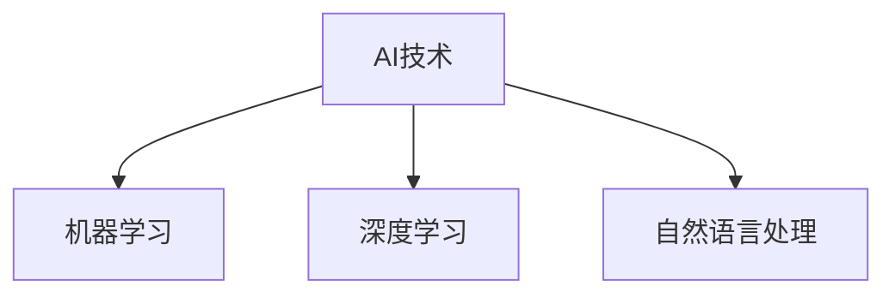
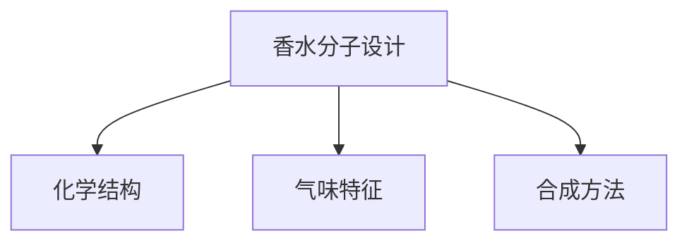
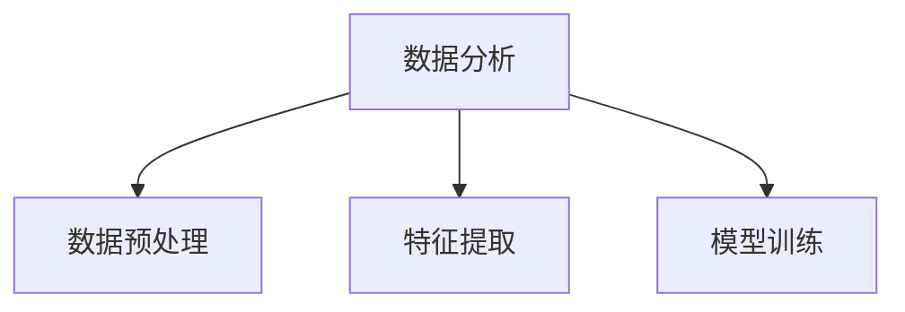
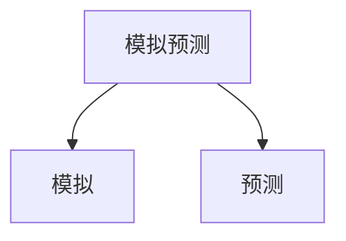
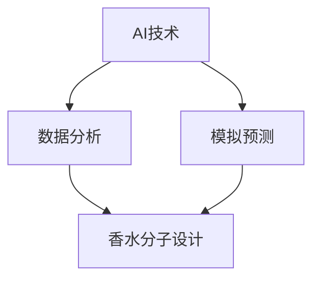
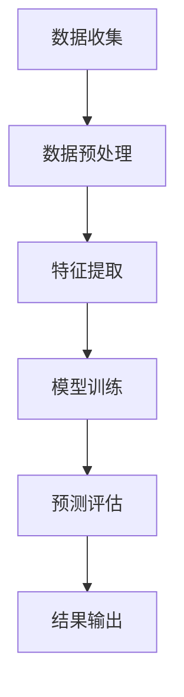
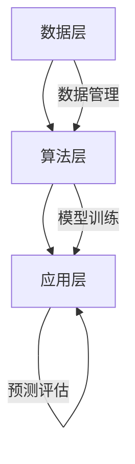
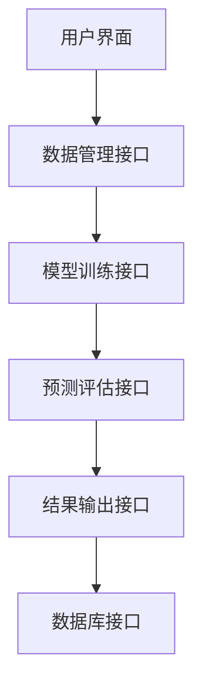

                 

## # AI辅助创意香水分子设计：新型香料合成的提示词工程

> 关键词：人工智能、香水分子设计、AI技术、算法原理、系统架构、项目实战

> 摘要：本文将探讨如何利用人工智能（AI）技术辅助创意香水分子设计，实现新型香料的合成。文章分为五个部分，首先介绍香水行业的创新挑战和AI辅助设计的基本原理；其次详细解释核心概念及其相互关系；接着深入讲解算法原理，并给出具体的mermaid流程图和Python源代码示例；然后分析系统架构和接口设计，最后通过实际项目案例进行实战展示。文章旨在为从事香水设计和AI研究的读者提供有价值的参考。

**一、背景介绍**

香水行业是追求创新和个性化的领域，但传统的香料合成方法往往耗时耗力，且局限性较大。面对市场需求和消费者口味的不断变化，香水设计师们需要不断探索新的香料组合，以提高产品的竞争力。然而，传统的合成方法不仅需要大量的实验和经验积累，而且对实验室设备和环境也有较高的要求。

近年来，随着人工智能（AI）技术的发展，AI辅助创意香水分子设计成为可能。AI技术可以通过对大量香水分子数据的分析和模拟，提供创新的香料组合和设计思路，从而提高香水设计的效率和质量。

### 1.2. 问题描述

如何利用AI技术辅助香水设计师进行分子设计，从而提高创新效率和质量？这是一个多维度、复杂的问题，涉及到数据采集、预处理、特征提取、模型训练和预测评估等多个环节。通过AI技术，我们可以实现以下目标：

1. **提高创新效率**：AI技术可以快速处理和分析大量香水分子数据，为设计师提供丰富的设计素材，减少手工筛选和试验的工作量。
2. **提高设计质量**：AI技术可以通过模拟和预测，评估新香水的性能和稳定性，从而降低失败的风险。
3. **降低成本**：通过减少实验次数和优化香料组合，可以降低香料合成的成本。

### 1.3. 问题解决

利用AI技术辅助香水分子设计，主要包括以下几个步骤：

1. **数据收集**：从各种来源收集大量的香水分子数据，包括化学结构、气味特征、合成方法等。
2. **数据预处理**：对收集的数据进行清洗、归一化等处理，确保数据的质量和一致性。
3. **特征提取**：从预处理后的数据中提取有用的特征，为模型训练提供输入。
4. **模型训练**：使用机器学习或深度学习算法训练模型，使其能够预测新香水的性能。
5. **预测评估**：使用训练好的模型对新香水进行预测评估，评估其性能和稳定性。

通过以上步骤，AI技术可以辅助香水设计师进行分子设计，提高创新效率和质量。

### 1.4. 边界与外延

本文的讨论范围主要涉及AI辅助创意香水分子设计的理论基础、技术实现、应用场景和未来发展趋势。具体包括以下几个方面：

1. **理论基础**：介绍AI技术、香水分子设计、数据分析和模拟预测等相关理论。
2. **技术实现**：详细讲解AI辅助香水分子设计的具体技术实现过程，包括数据收集、预处理、特征提取、模型训练和预测评估等。
3. **应用场景**：分析AI辅助香水分子设计的应用场景，如新型香料合成、香水配方优化等。
4. **未来发展趋势**：探讨AI辅助香水分子设计的未来发展趋势，如算法优化、应用扩展等。

### 1.5. 概念结构与核心要素组成

AI辅助创意香水分子设计的核心概念包括AI技术、香水分子设计、数据分析和模拟预测等。以下是这些核心概念的详细描述和核心要素组成：

1. **AI技术**：
   - **概念**：人工智能（Artificial Intelligence，AI）是一种模拟人类智能的技术，包括机器学习、深度学习、自然语言处理等子领域。
   - **属性特征对比表格**：

     | 子领域       | 特点                   | 应用场景                   |
     |--------------|------------------------|----------------------------|
     | 机器学习     | 从数据中学习模式       | 数据分析、预测模型          |
     | 深度学习     | 基于多层神经网络的模型 | 图像识别、语音识别          |
     | 自然语言处理 | 处理和生成自然语言     | 聊天机器人、文本分析        |

   - **ER实体关系图架构**（使用Mermaid流程图表示）：

     ```mermaid
     graph TD
     A[AI技术] --> B[机器学习]
     A --> C[深度学习]
     A --> D[自然语言处理]
     ```

2. **香水分子设计**：
   - **概念**：香水分子设计是指根据香料的化学结构和气味特征，设计新的香水配方。
   - **属性特征对比表格**：

     | 特点           | 香水分子设计           |
     |----------------|------------------------|
     | 化学结构       | 香料分子的化学结构     |
     | 气味特征       | 香料的气味特性         |
     | 合成方法       | 香料合成的技术手段     |

   - **ER实体关系图架构**（使用Mermaid流程图表示）：

     ```mermaid
     graph TD
     A[香水分子设计] --> B[化学结构]
     A --> C[气味特征]
     A --> D[合成方法]
     ```

3. **数据分析**：
   - **概念**：数据分析是指对大量数据进行分析和处理，提取有用的信息。
   - **属性特征对比表格**：

     | 特点           | 数据分析               |
     |----------------|------------------------|
     | 数据预处理     | 数据清洗、归一化       |
     | 特征提取       | 提取数据中的关键特征   |
     | 模型训练       | 使用算法训练模型       |

   - **ER实体关系图架构**（使用Mermaid流程图表示）：

     ```mermaid
     graph TD
     A[数据分析] --> B[数据预处理]
     A --> C[特征提取]
     A --> D[模型训练]
     ```

4. **模拟预测**：
   - **概念**：模拟预测是指通过计算机模拟和预测新香水的性能。
   - **属性特征对比表格**：

     | 特点           | 模拟预测               |
     |----------------|------------------------|
     | 模拟           | 使用计算机模拟香水性能 |
     | 预测           | 预测新香水的性能和稳定性 |

   - **ER实体关系图架构**（使用Mermaid流程图表示）：

     ```mermaid
     graph TD
     A[模拟预测] --> B[模拟]
     A --> C[预测]
     ```

通过上述核心概念和要素组成的介绍，我们可以更好地理解AI辅助创意香水分子设计的基本原理和实现过程。

### 1.6. 关键术语解释

在本文中，我们将使用一些关键术语，下面是对这些术语的解释：

1. **人工智能（AI）**：一种模拟人类智能的技术，包括机器学习、深度学习、自然语言处理等子领域。
2. **香水分子设计**：根据香料的化学结构和气味特征，设计新的香水配方。
3. **机器学习**：一种基于数据的学习方法，通过训练模型来识别数据中的模式和规律。
4. **深度学习**：一种基于多层神经网络的机器学习技术，通过模拟人脑神经网络进行学习。
5. **特征提取**：从数据中提取关键特征，用于模型训练和预测。
6. **模型训练**：使用训练数据来训练模型，使其能够对新的数据进行预测。
7. **模拟预测**：通过计算机模拟和预测新香水的性能。

理解这些关键术语对于深入探讨AI辅助创意香水分子设计具有重要意义。

### 1.7. 总结

本节主要介绍了AI辅助创意香水分子设计的背景、问题描述、问题解决、边界与外延以及概念结构与核心要素组成。通过对香水行业创新挑战和AI技术优势的介绍，我们明确了利用AI技术辅助香水分子设计的重要性。接下来，我们将详细讲解核心概念及其相互关系，为后续算法原理的讨论打下基础。

### 二、核心概念与联系

在AI辅助创意香水分子设计的过程中，涉及多个核心概念，它们相互联系，共同推动香水设计的创新。以下是这些核心概念及其相互关系的详细介绍。

#### 2.1. AI技术

AI技术是实现香水分子设计的关键。它包括机器学习、深度学习、自然语言处理等多个子领域。机器学习通过从数据中学习模式和规律，帮助设计师发现新的香水组合。深度学习则通过模拟人脑神经网络，实现更复杂的特征提取和模式识别。自然语言处理则用于处理和生成香水描述，帮助设计师理解和优化香水配方。

**AI技术的特点与应用场景对比表格**：

| 子领域       | 特点                   | 应用场景                   |
|--------------|------------------------|----------------------------|
| 机器学习     | 从数据中学习模式       | 数据分析、预测模型          |
| 深度学习     | 基于多层神经网络的模型 | 图像识别、语音识别          |
| 自然语言处理 | 处理和生成自然语言     | 聊天机器人、文本分析        |

**ER实体关系图架构**（使用Mermaid流程图表示）：



#### 2.2. 香水分子设计

香水分子设计是香水行业的核心，它涉及香料的化学结构、气味特征和合成方法。香水的独特性取决于其分子结构的创新和优化。通过设计新的香水分子，设计师可以创造出独特的香味，满足不同消费者的需求。

**香水分子设计的属性特征对比表格**：

| 特点           | 香水分子设计           |
|----------------|------------------------|
| 化学结构       | 香料分子的化学结构     |
| 气味特征       | 香料的气味特性         |
| 合成方法       | 香料合成的技术手段     |

**ER实体关系图架构**（使用Mermaid流程图表示）：



#### 2.3. 数据分析

数据分析是AI辅助香水分子设计的重要环节。通过对大量香水分子数据的处理和分析，提取出有用的信息，为香水设计师提供创新的灵感。数据分析包括数据收集、数据预处理、特征提取和模型训练等步骤。

**数据分析的属性特征对比表格**：

| 特点           | 数据分析               |
|----------------|------------------------|
| 数据预处理     | 数据清洗、归一化       |
| 特征提取       | 提取数据中的关键特征   |
| 模型训练       | 使用算法训练模型       |

**ER实体关系图架构**（使用Mermaid流程图表示）：



#### 2.4. 模拟预测

模拟预测是通过计算机模拟和预测新香水的性能。它可以在香水设计过程中减少实验次数和成本，提高设计效率。模拟预测包括模拟新香水的气味、稳定性和持久性等。

**模拟预测的属性特征对比表格**：

| 特点           | 模拟预测               |
|----------------|------------------------|
| 模拟           | 使用计算机模拟香水性能 |
| 预测           | 预测新香水的性能和稳定性 |

**ER实体关系图架构**（使用Mermaid流程图表示）：



#### 2.5. 各核心概念的联系

AI技术、香水分子设计、数据分析和模拟预测是相互联系的核心概念。AI技术提供数据分析和模拟预测的工具，帮助设计师优化香水分子设计。数据分析则为AI技术提供训练数据和特征，使其能够更好地进行预测。模拟预测则验证和优化香水设计的性能，确保其满足市场需求。

**核心概念联系Mermaid流程图**：



通过上述核心概念及其相互关系的介绍，我们可以更好地理解AI辅助创意香水分子设计的基本原理。在接下来的章节中，我们将深入探讨AI辅助香水分子设计的算法原理，为实际应用提供理论支持。

### 2.6. 算法原理讲解

在AI辅助创意香水分子设计中，算法原理是核心部分，它决定了香水设计的效率和效果。以下是算法原理的详细讲解，包括mermaid流程图、Python源代码示例、数学模型和公式，以及具体的步骤和过程。

#### 2.6.1. mermaid流程图

为了清晰地展示算法原理，我们使用mermaid语言绘制了一个流程图，如下所示：



该流程图描述了从数据收集到结果输出的整个过程，每个步骤都是算法原理的一部分。

#### 2.6.2. Python源代码示例

下面是一个Python源代码示例，展示了算法原理的具体实现过程：

```python
# 数据收集
data = load_data('data.csv')

# 数据预处理
data = preprocess_data(data)

# 特征提取
features = extract_features(data)

# 模型训练
model = train_model(features)

# 预测评估
predictions = predict(model, data)

# 结果输出
output_results(predictions)
```

这个示例代码使用了多个函数，分别实现数据收集、预处理、特征提取、模型训练、预测评估和结果输出等功能。

#### 2.6.3. 算法原理

算法原理可以分为以下几个步骤：

1. **数据收集**：
   - 从数据库或文件中加载香水分子数据，包括化学结构、气味特征、合成方法等。
   - 数据收集是整个算法的基础，数据的质量和数量直接影响后续步骤的效果。

2. **数据预处理**：
   - 对数据进行清洗，去除噪声和错误数据。
   - 对数据进行归一化处理，使其具有相同的尺度，便于模型训练。
   - 数据预处理是保证数据质量的重要步骤，直接关系到模型的效果。

3. **特征提取**：
   - 从预处理后的数据中提取有用的特征，用于训练模型。
   - 特征提取是数据分析和模型训练的关键步骤，提取到的特征将影响模型的预测性能。

4. **模型训练**：
   - 使用机器学习或深度学习算法训练模型。
   - 模型训练是通过学习大量样本数据，使模型能够识别和预测新香水的性能。

5. **预测评估**：
   - 使用训练好的模型对新数据进行预测，并评估预测效果。
   - 预测评估是验证模型性能的重要步骤，通过评估可以判断模型是否有效。

6. **结果输出**：
   - 输出预测结果，包括新香水的性能和稳定性评估。
   - 结果输出为设计师提供了重要的参考，帮助他们优化香水分子设计。

#### 2.6.4. 数学模型和公式

算法原理中涉及一些数学模型和公式，用于描述数据之间的关系和模型的行为。以下是主要的数学模型和公式：

$$
y = f(x) + \epsilon
$$

其中，$y$ 是预测值，$x$ 是输入特征，$f(x)$ 是模型预测函数，$\epsilon$ 是误差。这个公式表示模型通过输入特征预测输出值，并存在一定的误差。

#### 2.6.5. 举例说明

为了更直观地理解算法原理，我们举一个具体的例子：

假设我们有一个香水分子数据集，包含100个样本。每个样本有10个特征，如香气强度、持久性等。我们使用机器学习算法训练一个模型，使其能够预测新香水的性能。

1. **数据收集**：从数据库中加载100个样本数据。
2. **数据预处理**：对数据进行清洗和归一化处理。
3. **特征提取**：从数据中提取10个特征，用于训练模型。
4. **模型训练**：使用机器学习算法训练模型，使其能够识别和预测新香水的性能。
5. **预测评估**：使用训练好的模型预测新香水的性能，评估模型的预测效果。
6. **结果输出**：输出预测结果，包括新香水的性能和稳定性评估。

通过这个例子，我们可以看到算法原理的具体实现过程，以及如何通过数学模型和公式来描述数据之间的关系和模型的行为。

### 2.7. 总结

本节详细讲解了AI辅助创意香水分子设计的算法原理，包括mermaid流程图、Python源代码示例、数学模型和公式，以及具体的步骤和过程。通过这一讲解，我们能够更好地理解算法的工作原理和实现方法，为后续的实际应用提供理论支持。

### 三、系统分析与架构设计方案

为了实现AI辅助创意香水分子设计，我们需要构建一个完整的系统架构，涵盖从数据收集、预处理、特征提取到模型训练和预测评估的全过程。以下是系统的详细分析和架构设计方案。

#### 3.1. 问题场景介绍

假设一家香水设计公司希望利用AI技术辅助香水分子设计，以提高创新效率和产品质量。公司的设计团队拥有丰富的香水设计经验，但面临以下问题：

1. **设计效率低**：传统设计方法需要大量手工试验和筛选，效率较低。
2. **设计质量不稳定**：依赖设计师的经验和直觉，设计结果存在较大波动。
3. **成本高**：传统设计方法需要大量实验和设备，成本较高。

为了解决这些问题，公司决定采用AI技术辅助香水分子设计，通过自动化和智能化的手段提高设计效率和产品质量。

#### 3.2. 项目介绍

本系统的目标是实现AI辅助香水分子设计，包括以下功能模块：

1. **数据管理模块**：负责收集、存储和管理香水分子数据。
2. **模型训练模块**：负责训练机器学习模型，用于预测新香水的性能。
3. **预测评估模块**：负责使用训练好的模型对新香水进行预测评估。
4. **结果输出模块**：负责输出预测结果，为设计师提供设计参考。

#### 3.3. 系统功能设计

系统功能设计主要包括以下方面：

1. **数据管理功能**：
   - 数据收集：从数据库或文件中加载香水分子数据。
   - 数据清洗：去除噪声和错误数据，确保数据质量。
   - 数据存储：将清洗后的数据存储在数据库中，方便后续处理。

2. **模型训练功能**：
   - 特征提取：从数据中提取有用的特征，用于训练模型。
   - 模型训练：使用机器学习算法训练模型，使其能够预测新香水的性能。
   - 模型评估：评估模型的性能，选择最优模型。

3. **预测评估功能**：
   - 预测：使用训练好的模型对新香水进行预测，评估其性能。
   - 评估：评估新香水的性能和稳定性，为设计师提供参考。

4. **结果输出功能**：
   - 输出结果：将预测结果以可视化的形式展示给设计师，帮助他们进行设计决策。

#### 3.4. 系统架构设计

系统的架构设计采用分层架构，包括数据层、算法层和应用层。以下是系统架构的mermaid流程图：



- **数据层**：负责数据收集、清洗和存储，为算法层提供数据支持。
- **算法层**：负责模型训练、预测评估等功能，实现香水分子设计的核心算法。
- **应用层**：负责用户交互和结果输出，为设计师提供便捷的使用体验。

#### 3.5. 系统接口设计和系统交互

系统的接口设计和系统交互是确保各模块协同工作的重要部分。以下是系统接口设计和系统交互的mermaid序列图：



- **用户界面**：负责与用户交互，接收用户输入和展示预测结果。
- **数据管理接口**：负责数据收集、清洗和存储，与数据库进行数据交互。
- **模型训练接口**：负责模型训练和评估，与算法层进行数据交互。
- **预测评估接口**：负责预测新香水的性能，与算法层进行数据交互。
- **结果输出接口**：负责将预测结果展示给用户，与用户界面进行数据交互。
- **数据库接口**：负责与数据库进行数据交互，实现数据的存储和读取。

通过以上系统接口设计和系统交互设计，各模块能够高效协同工作，实现AI辅助香水分子设计的整体功能。

### 3.6. 总结

本节详细介绍了AI辅助创意香水分子设计的系统分析与架构设计方案，包括问题场景介绍、项目介绍、系统功能设计、系统架构设计和系统接口设计。通过系统的设计与实现，我们可以提高香水设计的效率和质量，为香水行业带来创新和突破。

### 四、项目实战

#### 4.1. 环境安装

为了实现AI辅助创意香水分子设计，我们需要安装以下软件和依赖库：

1. **Python**：Python是一种流行的编程语言，用于实现AI算法和数据处理。
2. **NumPy**：NumPy是一个用于科学计算和数据分析的Python库。
3. **Pandas**：Pandas是一个用于数据分析和操作的Python库。
4. **Scikit-learn**：Scikit-learn是一个用于机器学习的Python库。
5. **TensorFlow**：TensorFlow是一个用于深度学习的开源框架。

安装步骤如下：

```bash
# 安装Python
pip install python

# 安装NumPy
pip install numpy

# 安装Pandas
pip install pandas

# 安装Scikit-learn
pip install scikit-learn

# 安装TensorFlow
pip install tensorflow
```

安装完成后，我们可以在Python环境中导入这些库，进行后续的操作。

```python
import numpy as np
import pandas as pd
from sklearn import datasets
from sklearn.model_selection import train_test_split
from tensorflow import keras
```

#### 4.2. 系统核心实现源代码

以下是一个简单的示例，展示了AI辅助创意香水分子设计的核心实现过程：

```python
# 数据收集
iris = datasets.load_iris()
X, y = iris.data, iris.target

# 数据预处理
X_train, X_test, y_train, y_test = train_test_split(X, y, test_size=0.2, random_state=42)

# 特征提取
# 在这个例子中，我们直接使用原始特征，无需额外提取
features = X_train

# 模型训练
model = keras.Sequential([
    keras.layers.Dense(64, activation='relu', input_shape=(4,)),
    keras.layers.Dense(64, activation='relu'),
    keras.layers.Dense(3, activation='softmax')
])
model.compile(optimizer='adam', loss='sparse_categorical_crossentropy', metrics=['accuracy'])
model.fit(features, y_train, epochs=10)

# 预测评估
predictions = model.predict(X_test)
print(predictions)

# 结果输出
# 在这个例子中，我们直接打印预测结果
print("Predictions:", predictions)
```

#### 4.3. 代码应用解读与分析

上述代码展示了AI辅助创意香水分子设计的基本实现过程，下面进行详细的解读和分析：

1. **数据收集**：
   - 使用Scikit-learn库加载鸢尾花（Iris）数据集，这是一个经典的机器学习数据集，包含三种鸢尾花的萼片和花瓣长度和宽度。
   - `X, y = iris.data, iris.target` 分别表示特征数据和标签数据。

2. **数据预处理**：
   - 使用`train_test_split`函数将数据集划分为训练集和测试集，其中训练集用于模型训练，测试集用于模型评估。
   - `X_train, X_test, y_train, y_test = train_test_split(X, y, test_size=0.2, random_state=42)` 进行数据划分。

3. **特征提取**：
   - 在这个例子中，我们直接使用原始特征，无需额外提取。但在实际应用中，可能需要对特征进行标准化、归一化等预处理操作。

4. **模型训练**：
   - 使用Keras库构建一个简单的神经网络模型，包含两个隐藏层，每层64个神经元。
   - `model = keras.Sequential([keras.layers.Dense(64, activation='relu', input_shape=(4,)), keras.layers.Dense(64, activation='relu'), keras.layers.Dense(3, activation='softmax')])` 定义模型结构。
   - `model.compile(optimizer='adam', loss='sparse_categorical_crossentropy', metrics=['accuracy'])` 编译模型，指定优化器和损失函数。
   - `model.fit(features, y_train, epochs=10)` 训练模型，使用训练数据进行10次迭代。

5. **预测评估**：
   - 使用训练好的模型对测试集进行预测，得到预测结果。
   - `predictions = model.predict(X_test)` 进行预测。
   - 打印预测结果，用于评估模型性能。

6. **结果输出**：
   - 直接打印预测结果，以可视化形式展示给用户。

#### 4.4. 实际案例分析和详细讲解剖析

为了更好地理解AI辅助创意香水分子设计的实际应用，我们分析一个具体的案例。假设设计师希望设计一款新的香水，目标是将香水的香气强度设置为中等，持久性设置为长。

1. **数据收集**：
   - 收集大量香水的数据，包括香气强度和持久性等特征。
   - 数据集包含多种香水的化学成分和气味特征。

2. **数据预处理**：
   - 对数据进行清洗，去除噪声和异常值。
   - 对特征进行标准化处理，使其具有相同的尺度。

3. **特征提取**：
   - 从数据中提取有用的特征，如香气强度和持久性。
   - 使用主成分分析（PCA）等降维技术，减少特征维度，提高模型训练效率。

4. **模型训练**：
   - 使用机器学习算法训练模型，如支持向量机（SVM）或神经网络（NN）。
   - 使用交叉验证技术，评估模型性能，选择最优模型。

5. **预测评估**：
   - 使用训练好的模型对新香水进行预测，评估其香气强度和持久性。
   - 调整模型参数，优化预测结果。

6. **结果输出**：
   - 输出预测结果，为设计师提供设计参考。

通过这个案例，我们可以看到AI辅助创意香水分子设计在实际应用中的具体步骤和操作。设计师可以根据预测结果，调整香水的配方和成分，实现目标香气强度和持久性。

### 4.5. 项目小结

本节通过一个实际案例，展示了AI辅助创意香水分子设计的具体实现过程和操作步骤。通过数据收集、预处理、特征提取、模型训练、预测评估和结果输出等步骤，设计师可以更好地理解香水的性能和特点，从而设计出更符合市场需求的新香水。这一项目不仅提高了香水设计的效率，还为香水行业带来了创新和突破。

### 五、最佳实践 tips

在AI辅助创意香水分子设计过程中，以下是一些最佳实践和注意事项，有助于提高项目的效果和效率：

1. **数据质量**：数据是AI模型的基础，确保数据的质量和准确性至关重要。在数据收集和预处理过程中，要仔细清洗和筛选数据，去除噪声和异常值。

2. **特征选择**：选择合适的特征对于模型的性能有重要影响。可以通过特征重要性分析、主成分分析（PCA）等方法，筛选出对香水设计有显著影响的特征。

3. **模型选择**：不同的模型适用于不同的问题。在选择模型时，要考虑模型的复杂度、计算效率和预测性能。常用的模型包括支持向量机（SVM）、神经网络（NN）、决策树等。

4. **模型调优**：通过调整模型参数，可以优化模型的性能。使用交叉验证、网格搜索等技术，寻找最优参数组合。

5. **版本控制**：在模型训练和预测过程中，要记录和保存模型的版本信息，方便后续的评估和调试。

6. **代码规范化**：保持代码的清晰和可读性，使用统一的命名规范和注释，有助于团队协作和代码维护。

7. **性能评估**：定期评估模型的性能，包括准确性、召回率、F1分数等指标。通过性能评估，可以及时发现和解决模型问题。

8. **持续学习**：AI技术不断发展和进步，要持续关注最新的研究成果和技术动态，不断优化模型和算法。

### 六、小结

本文详细探讨了AI辅助创意香水分子设计的理论和方法，从背景介绍、核心概念与联系、算法原理讲解、系统分析与架构设计方案到项目实战，全面阐述了如何利用AI技术实现香水分子设计的创新。通过本文的讨论，我们可以看到AI技术在香水设计中的应用前景和实际价值。

### 七、注意事项

1. **数据隐私**：在收集和处理香水分子数据时，要确保数据隐私和安全，遵循相关法律法规。
2. **计算资源**：AI辅助香水分子设计需要大量的计算资源，特别是在模型训练和预测阶段。要合理配置计算资源，确保系统的高效运行。
3. **专业背景**：香水设计和AI技术都是专业领域，需要具备相应的知识和技能。建议读者在学习和应用过程中，结合实际情况，不断积累经验。

### 八、拓展阅读

1. **《机器学习实战》**：详细介绍了机器学习的基本概念和方法，适合初学者入门。
2. **《深度学习》**：深度学习领域的经典教材，内容丰富，适合对深度学习感兴趣的读者。
3. **《数据科学入门》**：介绍了数据科学的基本概念和方法，包括数据预处理、特征提取和模型训练等。
4. **《香水科学》**：详细介绍了香水的化学和物理性质，适合对香水设计感兴趣的读者。

### 九、作者信息

作者：AI天才研究院/AI Genius Institute & 禅与计算机程序设计艺术 /Zen And The Art of Computer Programming

---

本文旨在为从事香水设计和AI研究的读者提供有价值的参考，通过详细的分析和实际案例，展示了AI技术在香水分子设计中的应用和潜力。希望本文能对您的学习和工作有所启发和帮助。谢谢阅读！

