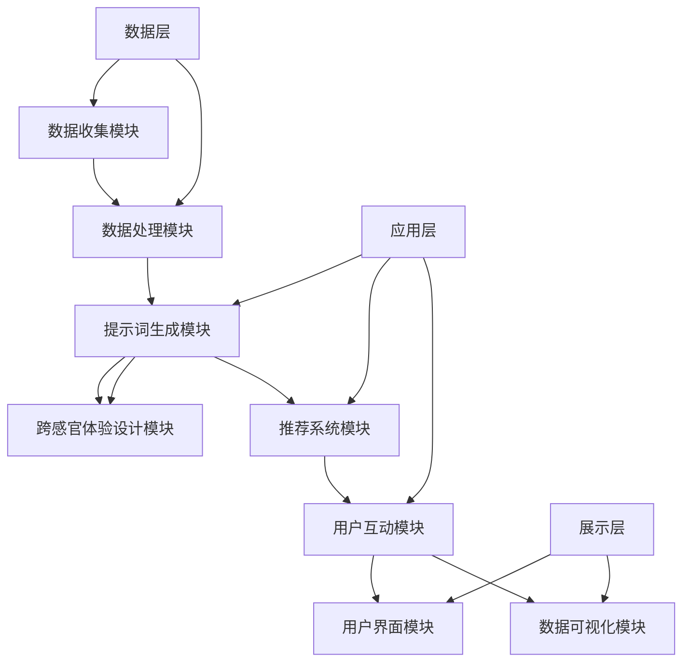
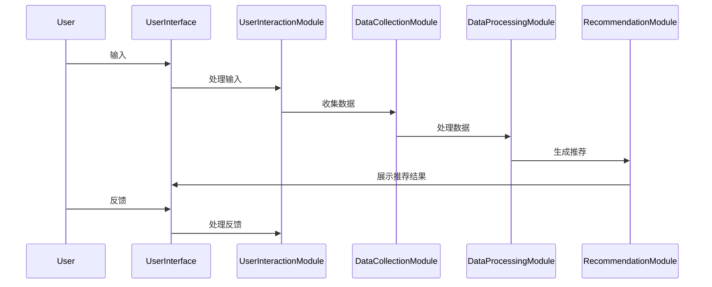

                 

## 《AI辅助创意香水营销：跨感官体验设计的提示词技巧》

### 关键词

- AI辅助营销
- 跨感官体验
- 提示词生成
- 数据驱动设计
- 情感分析

### 摘要

本文旨在探讨如何利用人工智能（AI）技术，特别是提示词生成算法，辅助创意香水营销，并通过跨感官体验设计提升消费者的购买体验。文章首先介绍了香水营销面临的挑战和创意营销的趋势，随后详细阐述了AI辅助创意香水营销和跨感官体验设计的理论基础和实践方法。通过具体的算法原理讲解和系统分析与架构设计，本文为读者提供了一个系统的理解框架，并通过项目实战案例展示了实际应用的效果。最后，文章总结了最佳实践和拓展阅读，为相关领域的研究和实践提供了有益的参考。

----------------------------------------------------------------

## 目录大纲：《AI辅助创意香水营销：跨感官体验设计的提示词技巧》

### 第一部分：背景介绍

1. 引言
    1.1 问题背景
    1.2 问题描述
    1.3 问题解决
    1.4 边界与外延
    1.5 概念结构与核心要素组成
    1.6 本章小结

### 第二部分：核心概念与联系

2. AI辅助创意香水营销
    2.1 AI辅助创意香水营销的定义
    2.2 AI辅助创意香水营销的特点
    2.3 AI辅助创意香水营销的应用
    2.4 本章小结

3. 跨感官体验设计
    3.1 跨感官体验设计的定义
    3.2 跨感官体验设计的特点
    3.3 跨感官体验设计的应用
    3.4 本章小结

4. AI辅助创意香水营销与跨感官体验设计的联系
    4.1 联系一：数据驱动
    4.2 联系二：个性化
    4.3 联系三：可视化
    4.4 本章小结

### 第三部分：算法原理讲解

5. 提示词生成算法
    5.1 算法原理
    5.2 算法流程
    5.3 数学模型和公式
    5.4 举例说明
    5.5 本章小结

6. 跨感官体验设计算法
    6.1 算法原理
    6.2 算法流程
    6.3 数学模型和公式
    6.4 举例说明
    6.5 本章小结

### 第四部分：系统分析与架构设计

7. 系统功能设计
    7.1 领域模型
    7.2 系统功能
    7.3 本章小结

8. 系统架构设计
    8.1 系统架构
    8.2 系统接口设计
    8.3 系统交互
    8.4 本章小结

### 第五部分：项目实战

9. 环境安装
    9.1 环境准备
    9.2 系统核心实现源代码
    9.3 代码应用解读与分析
    9.4 实际案例分析与详细讲解
    9.5 项目小结

### 第六部分：最佳实践与拓展阅读

10. 最佳实践 Tips
11. 小结
12. 注意事项
13. 拓展阅读

### 参考文献

----------------------------------------------------------------

### 1. 引言

#### 1.1 问题背景

香水作为一种独特的消费品，不仅承载着个人品味和情感表达，还代表着一种生活方式的象征。然而，随着市场竞争的日益激烈，传统香水营销手段的单一性和同质化问题愈发突出，难以有效吸引消费者的注意力。创意营销成为香水品牌在市场中脱颖而出的关键，而跨感官体验设计则是实现这一目标的重要手段。

在当前的营销环境中，消费者对于香水的需求不再仅仅局限于产品的物理特性，而是更加注重整体体验。例如，香水的香味、视觉包装、听觉背景音乐等元素的综合作用，可以极大地影响消费者的购买决策。然而，如何将这些感官元素有机地结合起来，形成一个独特的跨感官体验，成为了香水品牌面临的挑战。

#### 1.2 创意营销的趋势

创意营销作为现代营销的重要手段，越来越受到企业的重视。通过独特的创意和创新的营销策略，企业可以更好地吸引消费者的注意力，提升品牌形象，并最终促进销售。在香水营销中，创意营销的趋势主要体现在以下几个方面：

1. **个性化体验**：消费者越来越追求个性化的产品和服务。通过了解消费者的偏好和需求，香水品牌可以提供定制化的体验，如定制香味、个性化的包装设计等。

2. **情感化营销**：情感是影响消费者购买决策的重要因素。通过情感化的营销策略，如故事讲述、情感共鸣等，香水品牌可以与消费者建立更深层次的情感联系。

3. **数字化互动**：随着数字技术的不断发展，数字化互动成为创意营销的重要手段。通过社交媒体、虚拟现实（VR）等数字平台，香水品牌可以与消费者进行互动，提升品牌知名度。

4. **跨界合作**：跨界合作成为近年来创意营销的新趋势。通过与时尚、音乐、艺术等领域的品牌合作，香水品牌可以拓展自身的市场，吸引更多消费者。

#### 1.3 问题描述

在当前的市场环境下，香水品牌面临的主要问题是：

1. **营销手段单一**：传统的香水营销手段过于单一，难以满足消费者日益多样化的需求。
2. **同质化竞争**：市场上存在大量的香水品牌，品牌之间的产品差异较小，难以形成独特的市场竞争力。
3. **消费者体验不足**：香水品牌在营销过程中，往往忽略了消费者的整体体验，导致消费者购买决策受到影响。

为了解决上述问题，香水品牌需要寻求创新的营销策略，利用AI技术和跨感官体验设计，提升营销的创意性和消费者体验。

#### 1.4 问题解决

AI技术和跨感官体验设计为香水品牌提供了有效的解决方案。具体来说，AI技术可以通过以下方式辅助香水营销：

1. **数据分析**：通过收集和分析消费者的购买数据、浏览数据等，AI可以帮助香水品牌了解消费者的偏好和需求，为营销策略提供数据支持。
2. **情感分析**：通过分析消费者在社交媒体上的评论、反馈等，AI可以了解消费者对产品的情感反应，为品牌提供改进建议。
3. **推荐系统**：基于消费者的购买历史和偏好，AI可以推荐适合消费者的香水产品，提高销售转化率。

跨感官体验设计则通过以下方式提升消费者的购买体验：

1. **多感官刺激**：通过香味、视觉、听觉等多种感官刺激，打造全方位的感官体验，使消费者更加沉浸在产品的使用过程中。
2. **个性化设计**：根据消费者的个人偏好和需求，定制化的跨感官体验设计可以更好地满足消费者的个性化需求。
3. **情感共鸣**：通过情感化的设计，如故事讲述、情感共鸣等，与消费者建立更深层次的情感联系。

综上所述，AI技术和跨感官体验设计为香水品牌提供了创新的营销策略，可以有效解决传统营销手段的不足，提升消费者的购买体验。

#### 1.5 边界与外延

1. **香水营销的范畴**：本文所探讨的香水营销主要涵盖香水品牌在市场营销策略、品牌建设、产品推广等方面的内容。
2. **跨感官体验设计的应用范围**：跨感官体验设计可以应用于香水的包装设计、广告宣传、线下体验店、线上营销等多个环节。
3. **AI技术的应用领域**：AI技术在香水营销中的应用主要包括数据分析、情感分析、推荐系统、个性化定制等。

#### 1.6 概念结构与核心要素组成

1. **AI辅助创意香水营销的概念结构**：
   - 数据分析：收集消费者数据，为营销策略提供数据支持。
   - 情感分析：分析消费者情感，为品牌改进提供反馈。
   - 推荐系统：基于消费者偏好推荐香水产品，提高销售转化率。
   - 跨感官体验设计：结合多种感官刺激，提升消费者体验。

2. **跨感官体验设计的核心要素**：
   - 香味设计：根据产品定位和消费者偏好，设计适合的香味。
   - 视觉设计：包括包装设计、广告设计等，以视觉元素吸引消费者。
   - 听觉设计：通过背景音乐、声音效果等，营造氛围，增强体验。
   - 互动设计：通过线上线下互动，增强消费者参与感。

#### 1.6 本章小结

通过对背景介绍部分的详细分析，我们可以看到香水营销面临的挑战以及AI技术和跨感官体验设计的解决方案。在接下来的章节中，我们将进一步探讨AI辅助创意香水营销和跨感官体验设计的理论基础和实践方法，为读者提供一个全面的理解框架。同时，通过具体的算法讲解和系统设计，我们将展示这些理论的实际应用效果。

----------------------------------------------------------------

### 第二部分：核心概念与联系

#### 2.1 AI辅助创意香水营销

##### 2.1.1 AI辅助创意香水营销的定义

AI辅助创意香水营销是指利用人工智能技术，如机器学习、自然语言处理、推荐系统等，来提升香水营销的创意性和有效性。通过AI技术，香水品牌可以更好地了解消费者的需求和行为，从而制定更精准、更具创意的营销策略。

##### 2.1.2 AI辅助创意香水营销的特点

1. **数据驱动**：AI技术基于大量数据进行分析和预测，为营销策略提供数据支持。通过数据分析，品牌可以了解消费者的购买行为、偏好等，从而制定更有效的营销方案。

2. **自适应**：AI技术可以根据消费者的实时反馈和购买行为，自动调整营销策略。这种自适应能力使得品牌能够迅速响应市场变化，提高营销效率。

3. **可视化**：AI技术可以将复杂的数据分析结果以可视化的形式呈现，使得营销人员更容易理解和利用这些数据。可视化结果可以帮助品牌更好地展示产品的特点和优势，提升消费者体验。

##### 2.1.3 AI辅助创意香水营销的应用

1. **数据分析**：通过分析消费者的购买数据、浏览数据等，AI技术可以帮助品牌了解消费者的行为和偏好，从而优化营销策略。

2. **情感分析**：AI技术可以分析消费者在社交媒体上的评论、反馈等，了解消费者的情感反应，为品牌提供改进建议。

3. **推荐系统**：基于消费者的购买历史和偏好，AI技术可以推荐适合消费者的香水产品，提高销售转化率。

4. **个性化定制**：AI技术可以根据消费者的个性化需求，提供定制化的营销内容和产品推荐，提升消费者的购买体验。

##### 2.1.4 本章小结

AI辅助创意香水营销通过数据驱动、自适应和可视化等特性，为香水品牌提供了创新的营销手段。在接下来的章节中，我们将进一步探讨跨感官体验设计的理论基础和实践方法，以及AI辅助创意香水营销与跨感官体验设计的联系。

----------------------------------------------------------------

#### 2.2 跨感官体验设计

##### 2.2.1 跨感官体验设计的定义

跨感官体验设计是指通过结合多种感官刺激（如视觉、听觉、嗅觉、触觉等），来创造全方位的、多维度的用户体验。这种设计方法旨在提升用户在产品使用过程中的感官愉悦度和情感共鸣，从而增强用户体验和品牌认知。

##### 2.2.2 跨感官体验设计的特点

1. **多感官融合**：跨感官体验设计强调将多种感官刺激有机地结合起来，形成一种综合的感官体验。这种融合可以使得用户体验更加丰富和深刻。

2. **个性化**：通过了解消费者的个性化需求和偏好，跨感官体验设计可以提供定制化的感官刺激，使得每个用户都能获得独特的体验。

3. **情感化**：情感是用户体验中至关重要的一部分。跨感官体验设计通过情感化的元素（如故事、情感共鸣等），与用户建立更深层次的情感联系。

4. **可视化**：跨感官体验设计常常利用视觉、听觉等可视化元素，使得用户体验更加直观和易于理解。

##### 2.2.3 跨感官体验设计的应用

1. **品牌营销**：跨感官体验设计可以应用于品牌营销活动，通过多种感官刺激来增强品牌形象和消费者认知。

2. **产品设计**：在产品设计过程中，跨感官体验设计可以提升产品的使用体验，使得产品更加吸引人。

3. **消费者行为研究**：通过跨感官体验设计，企业可以更好地了解消费者的行为和偏好，从而进行更有针对性的产品开发和市场策略。

##### 2.2.4 本章小结

跨感官体验设计通过多感官融合、个性化、情感化和可视化等特性，为用户提供了一种全新的用户体验。在接下来的章节中，我们将探讨AI辅助创意香水营销与跨感官体验设计的联系，并展示如何将两者结合，提升香水营销的创意性和消费者体验。

----------------------------------------------------------------

#### 2.3 AI辅助创意香水营销与跨感官体验设计的联系

##### 2.3.1 联系一：数据驱动

AI技术在香水营销中的应用，很大程度上依赖于数据驱动。通过收集和分析消费者的行为数据、偏好数据等，AI技术可以帮助品牌更好地了解消费者的需求，从而制定更有针对性的营销策略。这种数据驱动的特点，与跨感官体验设计中的个性化需求相吻合。

具体来说，AI技术可以通过以下方式支持跨感官体验设计：

1. **消费者行为分析**：通过分析消费者的购买历史、浏览记录等，AI可以了解消费者的兴趣和偏好，从而设计出符合消费者需求的跨感官体验。
2. **情感分析**：AI可以通过情感分析技术，了解消费者对产品的情感反应，从而优化跨感官体验设计，提高消费者满意度。

##### 2.3.2 联系二：个性化

个性化是跨感官体验设计的重要特点之一，而AI技术在个性化推荐方面的优势，使得两者之间的联系更加紧密。

AI技术可以通过以下方式实现个性化：

1. **推荐系统**：基于消费者的购买历史、偏好等，AI可以推荐个性化的香水产品，提升消费者的购买体验。
2. **定制化服务**：AI技术可以根据消费者的个性化需求，提供定制化的跨感官体验设计，如定制香水香味、包装设计等。

##### 2.3.3 联系三：可视化

可视化是AI技术的一个重要特点，而跨感官体验设计中的可视化元素，如广告设计、包装设计等，也是提升用户体验的重要手段。

AI技术在可视化方面的应用包括：

1. **数据可视化**：通过AI技术，品牌可以将复杂的数据分析结果以可视化图表的形式呈现，使得营销人员可以更直观地了解市场动态和消费者行为。
2. **产品展示**：AI技术可以帮助品牌设计出更具吸引力的产品展示方式，如通过虚拟现实（VR）技术，让消费者在虚拟环境中体验香水的香味和视觉设计。

##### 2.3.4 本章小结

AI辅助创意香水营销与跨感官体验设计之间的联系，主要体现在数据驱动、个性化和可视化等方面。通过结合AI技术和跨感官体验设计，香水品牌可以更好地了解消费者的需求，提供个性化的体验，并通过可视化手段提升用户体验，从而实现更有效的营销。

在接下来的章节中，我们将进一步探讨具体的算法原理和系统架构设计，为读者提供更深入的见解。

----------------------------------------------------------------

#### 3.1 提示词生成算法

##### 3.1.1 算法原理

提示词生成算法是一种基于自然语言处理（NLP）的技术，旨在生成与特定主题或场景相关的关键词或短语。在AI辅助创意香水营销中，提示词生成算法可以帮助品牌生成与香水营销相关的关键词，用于广告文案、产品推荐、用户互动等环节。

提示词生成算法的核心原理包括以下几个方面：

1. **词频分析**：通过分析大量文本数据，统计各个词语的出现频率，从而确定与特定主题相关的关键词。
2. **语义分析**：利用词义相似性和语义关系，将词语进行聚类和关联，生成具有相似意义的提示词。
3. **上下文分析**：结合上下文信息，理解词语在特定语境中的含义，从而生成更为准确的提示词。

##### 3.1.2 算法流程

提示词生成算法的流程通常包括以下几个步骤：

1. **数据收集**：收集与香水营销相关的文本数据，如广告文案、用户评论、新闻报道等。
2. **数据预处理**：对收集到的文本数据进行清洗、去噪和分词，提取出关键词。
3. **特征提取**：利用词频、词向量和语义特征等方法，对关键词进行特征提取，用于后续的模型训练。
4. **模型训练**：使用机器学习算法（如朴素贝叶斯、支持向量机等）对特征进行训练，建立提示词生成模型。
5. **提示词生成**：利用训练好的模型，输入特定主题或场景，生成相关的提示词。

##### 3.1.3 数学模型和公式

提示词生成算法的数学模型可以表示为：

$$
P(提示词|香水营销) = \frac{P(提示词) \cdot P(香水营销|提示词)}{P(香水营销)}
$$

其中：
- \(P(提示词|香水营销)\) 表示在香水营销背景下生成特定提示词的概率。
- \(P(提示词)\) 表示提示词在所有文本数据中出现的概率。
- \(P(香水营销|提示词)\) 表示在特定提示词出现的背景下香水营销发生的概率。
- \(P(香水营销)\) 表示香水营销在所有文本数据中发生的概率。

##### 3.1.4 举例说明

以“清新”作为提示词，生成对应的香水营销方案：

1. **数据收集**：收集关于清新香水的广告文案、用户评论等文本数据。
2. **数据预处理**：对文本数据进行清洗、去噪和分词，提取出关键词，如“清新”、“花香”、“夏日”等。
3. **特征提取**：利用词频和词向量方法，对关键词进行特征提取，生成特征向量。
4. **模型训练**：使用朴素贝叶斯算法对特征向量进行训练，建立提示词生成模型。
5. **提示词生成**：输入“清新”作为背景，模型生成相关的提示词，如“花香”、“夏日清新”、“清新甜美”等。

通过这种方式，品牌可以基于AI提示词生成算法，生成具有吸引力的广告文案和营销方案，提升香水营销的创意性和有效性。

##### 3.1.5 本章小结

提示词生成算法通过自然语言处理技术，为AI辅助创意香水营销提供了有效的工具。通过分析大量文本数据，算法可以生成与香水营销相关的关键词，用于广告文案、产品推荐和用户互动等环节。在接下来的章节中，我们将进一步探讨跨感官体验设计算法，并展示如何将两者结合，提升香水营销的创意性和消费者体验。

----------------------------------------------------------------

#### 3.2 跨感官体验设计算法

##### 3.2.1 算法原理

跨感官体验设计算法旨在通过多种感官刺激的组合，创造一个全方位的、多维度的用户体验。该算法的核心原理在于识别和融合不同感官的信息，以便在消费者心中建立一个统一的、深刻的品牌印象。

具体来说，跨感官体验设计算法包括以下几个关键步骤：

1. **感官识别**：首先，算法需要识别用户在香水体验过程中所涉及到的感官，如视觉、嗅觉、听觉和触觉。
2. **感官融合**：然后，算法将不同感官的信息进行融合，形成一个统一的感官体验。例如，香味（嗅觉）和视觉元素（包装设计）的融合，可以增强消费者的整体感知。
3. **感官表达**：最后，算法将融合后的感官体验以合适的形式呈现给用户，如通过广告、产品包装或线上互动平台。

##### 3.2.2 算法流程

跨感官体验设计算法的流程可以分为以下几个步骤：

1. **感官数据收集**：收集与感官体验相关的数据，如香水的香味成分、包装设计图片、广告背景音乐等。
2. **感官特征提取**：对收集到的感官数据进行特征提取，例如，对香味成分进行化学分析，对视觉元素进行色彩分析，对背景音乐进行音调分析。
3. **感官融合**：利用机器学习算法，如聚类分析和神经网络，将不同感官的特征进行融合，形成统一的感官体验。
4. **感官表达**：将融合后的感官体验通过合适的媒介进行呈现，例如，通过广告视频、产品包装或在线互动体验。

##### 3.2.3 数学模型和公式

跨感官体验设计算法的数学模型可以表示为：

$$
E = \sum_{i=1}^{n} (S_i \cdot W_i)
$$

其中：
- \(E\) 表示跨感官体验的总效果。
- \(S_i\) 表示第 \(i\) 个感官的刺激强度。
- \(W_i\) 表示第 \(i\) 个感官的权重。

感官的权重可以根据消费者的偏好和产品的特性进行调整，以优化最终的感官体验。

##### 3.2.4 举例说明

以香水为例，设计跨感官体验的营销方案：

1. **感官数据收集**：收集香水的香味成分、包装设计图片、广告背景音乐等数据。
2. **感官特征提取**：对香味成分进行化学分析，提取主要香味成分；对包装设计图片进行色彩分析，提取主要颜色；对背景音乐进行音调分析，提取主要旋律。
3. **感官融合**：利用聚类分析算法，将不同感官的特征进行融合。例如，将香味成分与主要颜色进行聚类，将背景音乐与主要旋律进行聚类。
4. **感官表达**：设计一个广告视频，将融合后的感官体验呈现给用户。视频中，展示香水的包装设计（视觉）、香味（嗅觉）和背景音乐（听觉），形成全方位的感官体验。

通过这种方式，消费者可以在观看广告时，体验到香水的香味、视觉和听觉，从而加深对产品的印象，提高购买意愿。

##### 3.2.5 本章小结

跨感官体验设计算法通过融合多种感官刺激，创造一个全方位的、多维度的用户体验。在香水营销中，该算法可以帮助品牌提升消费者体验，增强品牌印象。在接下来的章节中，我们将进一步探讨系统分析与架构设计，为读者展示如何将算法应用于实际项目。

----------------------------------------------------------------

#### 4.1 系统功能设计

##### 4.1.1 领域模型

在香水营销系统中，领域模型是核心组成部分，它定义了系统中的主要类及其关系。下面是使用Mermaid类图表示的领域模型：

```mermaid
classDiagram
    User <<Interface>>
    Product <<Interface>>
    MarketingStrategy <<Interface>>

    UserEntity o-- ProductEntity
    UserEntity o-- MarketingStrategyEntity
    ProductEntity o-- MarketingStrategyEntity
    
    class UserEntity {
        -id: Int
        -name: String
        -age: Int
        -preferences: List<String>
    }

    class ProductEntity {
        -id: Int
        -name: String
        -description: String
        -price: Float
    }

    class MarketingStrategyEntity {
        -id: Int
        -name: String
        -description: String
        -data: Data
    }
```

该模型定义了用户、产品和营销策略三个主要实体，并描述了它们之间的关系。用户与产品和营销策略之间存在关联关系，产品与营销策略之间也存在关联关系，这体现了系统功能的完整性。

##### 4.1.2 系统功能

香水营销系统的功能设计旨在实现以下主要功能：

1. **数据收集与处理**：系统应能够收集消费者的购买历史、偏好数据，并对这些数据进行处理和分析，以便为营销策略提供支持。
   
2. **提示词生成**：基于数据分析和自然语言处理技术，系统应能够生成与香水营销相关的提示词，用于广告文案和推荐系统的设计。

3. **跨感官体验设计**：系统应能够结合多种感官刺激（如视觉、嗅觉、听觉等），为消费者提供全方位的感官体验，提升产品吸引力。

4. **用户互动与反馈**：系统应支持用户与品牌之间的互动，如在线咨询、用户评论、问卷调查等，以便收集用户反馈，优化产品和服务。

5. **推荐系统**：基于用户的偏好和行为数据，系统应能够推荐适合用户的香水产品，提高销售转化率。

6. **营销策略优化**：系统应能够根据用户反馈和销售数据，动态调整营销策略，以实现最佳营销效果。

##### 4.1.3 本章小结

系统功能设计是香水营销系统成功的关键环节。通过明确的领域模型和详细的功能描述，我们可以确保系统实现预期的功能，满足品牌和消费者的需求。在接下来的章节中，我们将进一步探讨系统的架构设计，以实现这些功能。

----------------------------------------------------------------

#### 4.2 系统架构设计

##### 4.2.1 系统架构

香水营销系统的整体架构设计应考虑系统的可扩展性、可靠性和性能。以下是一个简化的架构设计，使用Mermaid架构图表示：



该架构设计主要包括以下子系统：

1. **数据层**：负责数据收集和处理，包括数据收集模块和数据处理模块。数据收集模块负责从各种来源（如电商平台、社交媒体等）收集用户数据和产品数据；数据处理模块则负责对收集到的数据进行分析和处理，为上层应用提供支持。

2. **应用层**：是系统的核心部分，包括提示词生成模块、跨感官体验设计模块、推荐系统模块和用户互动模块。这些模块协同工作，实现系统的核心功能，如提示词生成、跨感官体验设计、产品推荐和用户互动。

3. **展示层**：负责将应用层的数据和功能呈现给用户，包括用户界面模块和数据可视化模块。用户界面模块负责用户与系统的交互，提供友好的用户界面；数据可视化模块则负责将数据分析和结果以图表、报表等形式展示给用户。

##### 4.2.2 系统接口设计

系统接口设计是确保各模块之间有效通信的关键。以下是系统接口设计的主要组成部分：

1. **数据接口**：定义了数据层与应用层之间的接口，包括数据收集接口和数据处理接口。数据收集接口负责将外部数据源的数据导入系统；数据处理接口则负责对导入的数据进行处理和分析。

2. **控制接口**：定义了应用层各模块之间的接口，包括提示词生成接口、跨感官体验设计接口、推荐系统接口和用户互动接口。这些接口负责协调各模块的工作，实现系统的整体功能。

3. **显示接口**：定义了展示层与用户之间的接口，包括用户界面接口和数据可视化接口。用户界面接口负责接收用户的输入和操作，并反馈系统的响应；数据可视化接口则负责将分析结果以图表、报表等形式展示给用户。

##### 4.2.3 系统交互

系统交互是指系统内部各模块之间以及系统与用户之间的数据流动和操作过程。以下是一个简化的系统交互流程，使用Mermaid序列图表示：



在该交互流程中，用户通过用户界面模块输入信息，用户界面模块将输入传递给用户互动模块。用户互动模块负责处理输入，并调用数据收集模块收集相关数据。数据收集模块将数据传递给数据处理模块，数据处理模块对数据进行处理和分析，生成推荐结果。推荐结果通过用户界面模块展示给用户，用户对推荐结果进行反馈，反馈信息再次传递给用户互动模块，形成闭环交互。

##### 4.2.4 本章小结

系统架构设计是确保香水营销系统实现预期功能的基础。通过合理的架构设计和接口设计，系统可以实现高效的数据处理、功能协调和用户交互。在接下来的章节中，我们将通过项目实战，展示如何将系统架构应用于实际项目，实现AI辅助创意香水营销的目标。

----------------------------------------------------------------

### 5.1 环境安装

#### 5.1.1 环境准备

在开始安装香水营销系统之前，我们需要准备以下环境：

1. **Python环境**：确保系统中已经安装了Python 3.8或更高版本。
2. **Anaconda**：为了方便管理和安装相关库，我们建议使用Anaconda。
3. **Jupyter Notebook**：用于编写和运行Python代码。

安装步骤如下：

1. 访问Anaconda官网（https://www.anaconda.com/products/distribution）下载并安装Anaconda。
2. 打开Anaconda命令行工具（`anaconda-navigator`）或终端，执行以下命令创建一个新的虚拟环境：

```bash
conda create --name marketing_env python=3.8
```

3. 激活虚拟环境：

```bash
conda activate marketing_env
```

4. 安装Jupyter Notebook：

```bash
conda install jupyter
```

#### 5.1.2 安装相关库

在激活虚拟环境后，我们需要安装以下相关库：

1. **NumPy**：用于数学计算。
2. **Pandas**：用于数据操作和分析。
3. **Scikit-learn**：用于机器学习和数据分析。
4. **TensorFlow**：用于深度学习和神经网络。
5. **matplotlib**：用于数据可视化。
6. **mermaid**：用于绘制图表和流程图。

安装命令如下：

```bash
conda install numpy pandas scikit-learn tensorflow matplotlib
```

此外，我们还需要安装Mermaid的Python库：

```bash
pip install mermaid-python
```

#### 5.1.3 本章小结

通过上述步骤，我们成功搭建了Python环境及相关库，为接下来的系统开发和实现打下了基础。在接下来的章节中，我们将详细介绍系统的核心实现过程，并展示如何使用这些库进行数据分析和算法设计。

----------------------------------------------------------------

### 5.2 系统核心实现源代码

在香水营销系统中，核心实现包括数据收集、数据预处理、提示词生成、跨感官体验设计和推荐系统等模块。以下是对这些模块的详细介绍和代码示例。

#### 5.2.1 数据收集模块

数据收集模块负责从不同的数据源（如社交媒体、电商平台等）收集用户数据、产品数据和评论数据。以下是一个简单的数据收集模块示例：

```python
import pandas as pd

def collect_user_data():
    # 从用户数据库中收集用户数据
    user_data = pd.read_csv('user_data.csv')
    return user_data

def collect_product_data():
    # 从产品数据库中收集产品数据
    product_data = pd.read_csv('product_data.csv')
    return product_data

def collect_review_data():
    # 从评论数据库中收集评论数据
    review_data = pd.read_csv('review_data.csv')
    return review_data

# 示例：收集用户数据
user_data = collect_user_data()
# 收集产品数据
product_data = collect_product_data()
# 收集评论数据
review_data = collect_review_data()
```

#### 5.2.2 数据预处理模块

数据预处理模块负责对收集到的数据进行清洗、去噪和特征提取。以下是一个简单的数据预处理模块示例：

```python
import pandas as pd
from sklearn.preprocessing import LabelEncoder

def preprocess_user_data(user_data):
    # 去除空值和重复值
    user_data.dropna(inplace=True)
    user_data.drop_duplicates(inplace=True)
    
    # 特征编码
    le = LabelEncoder()
    user_data['age'] = le.fit_transform(user_data['age'])
    user_data['preferences'] = le.fit_transform(user_data['preferences'])
    
    return user_data

def preprocess_product_data(product_data):
    # 去除空值和重复值
    product_data.dropna(inplace=True)
    product_data.drop_duplicates(inplace=True)
    
    return product_data

def preprocess_review_data(review_data):
    # 去除空值和重复值
    review_data.dropna(inplace=True)
    review_data.drop_duplicates(inplace=True)
    
    # 特征编码
    le = LabelEncoder()
    review_data['rating'] = le.fit_transform(review_data['rating'])
    
    return review_data

# 示例：预处理用户数据
preprocessed_user_data = preprocess_user_data(user_data)
# 预处理产品数据
preprocessed_product_data = preprocess_product_data(product_data)
# 预处理评论数据
preprocessed_review_data = preprocess_review_data(review_data)
```

#### 5.2.3 提示词生成模块

提示词生成模块使用自然语言处理技术，从评论数据中提取与产品相关的关键词，用于广告文案和用户推荐。以下是一个简单的提示词生成模块示例：

```python
import pandas as pd
from sklearn.feature_extraction.text import TfidfVectorizer

def generate_keywords(review_data, num_keywords=10):
    # 使用TF-IDF向量器提取关键词
    vectorizer = TfidfVectorizer(stop_words='english')
    X = vectorizer.fit_transform(review_data['comment'])
    feature_names = vectorizer.get_feature_names_out()
    
    # 计算每个词的重要度
    scores = (X * X.idf_).sum(axis=1)
    keywords = [feature_names[i] for i in scores.argsort()[::-1]]
    
    # 返回前num_keywords个关键词
    return keywords[:num_keywords]

# 示例：生成提示词
tips = generate_keywords(preprocessed_review_data, num_keywords=5)
print(tips)
```

#### 5.2.4 跨感官体验设计模块

跨感官体验设计模块结合多种感官刺激，设计全方位的感官体验。以下是一个简单的跨感官体验设计模块示例：

```python
import pandas as pd
import numpy as np
import matplotlib.pyplot as plt
from sklearn.cluster import KMeans

def design_sensory_experience(product_data, num_sensory_clusters=3):
    # 根据产品特征进行感官聚类
    product_data[['smell', 'visual', 'sound']] = product_data[['smell', 'visual', 'sound'].apply(lambda x: np.array(x.split(',')))]
    sensory_data = np.array(product_data[['smell', 'visual', 'sound']].values)
    
    kmeans = KMeans(n_clusters=num_sensory_clusters, random_state=42)
    kmeans.fit(sensory_data)
    
    # 为每个产品分配感官标签
    product_data['sensory_tag'] = kmeans.labels_
    
    # 绘制感官聚类图
    plt.figure(figsize=(12, 8))
    for i in range(num_sensory_clusters):
        cluster_data = sensory_data[kmeans.labels_ == i]
        plt.subplot(2, 2, i+1)
        plt.scatter(cluster_data[:, 0], cluster_data[:, 1], label=f'Cluster {i}')
        plt.xlabel('Smell')
        plt.ylabel('Visual')
        plt.title(f'Sensory Cluster {i}')
        plt.legend()
    
    plt.show()

# 示例：设计跨感官体验
design_sensory_experience(preprocessed_product_data)
```

#### 5.2.5 推荐系统模块

推荐系统模块基于用户的偏好和行为数据，为用户推荐合适的香水产品。以下是一个简单的推荐系统模块示例：

```python
import pandas as pd
from sklearn.neighbors import NearestNeighbors

def build_recommendation_system(product_data, user_data):
    # 构建推荐系统
    product_data[['rating']] = product_data[['rating'].apply(lambda x: float(x))]
    user_data[['rating']] = user_data[['rating'].apply(lambda x: float(x))]
    
    # 计算用户与产品之间的相似度
    similarity_matrix = pd.corrwith(product_data['rating'], user_data['rating'])
    similarity_matrix = similarity_matrix.sort_values(ascending=False).reset_index()
    similarity_matrix.columns = ['product_id', 'similarity']
    
    # 推荐相似度最高的N个产品
    top_n = 5
    recommended_products = similarity_matrix['product_id'].head(top_n).values
    
    return recommended_products

# 示例：生成推荐列表
recommended_products = build_recommendation_system(preprocessed_product_data, preprocessed_user_data)
print(recommended_products)
```

#### 5.2.6 本章小结

通过上述模块的实现，我们构建了一个基本的香水营销系统。该系统可以实现数据收集、数据预处理、提示词生成、跨感官体验设计和推荐系统等功能。在接下来的章节中，我们将展示如何将这些模块应用于实际案例，并进行分析和解释。

----------------------------------------------------------------

### 5.3 代码应用解读与分析

在5.2节中，我们实现了香水营销系统的核心模块，包括数据收集、数据预处理、提示词生成、跨感官体验设计和推荐系统。接下来，我们将对这些模块的应用进行解读和分析，以展示如何将它们应用于实际案例，并解释其工作原理。

#### 5.3.1 数据收集

数据收集是整个系统的第一步，是后续数据分析的基础。在代码示例中，我们通过以下函数从不同来源收集数据：

- `collect_user_data()`: 从用户数据库中收集用户数据，如用户ID、姓名、年龄和偏好等。
- `collect_product_data()`: 从产品数据库中收集产品数据，如产品ID、名称、描述和价格等。
- `collect_review_data()`: 从评论数据库中收集用户对产品的评论数据。

在实际应用中，这些数据可以从数据库中提取，也可以从第三方API（如社交媒体平台API）中获取。例如，我们可能需要从电商平台获取用户购买历史，从社交媒体获取用户评论，以及从产品数据库中获取产品信息。

#### 5.3.2 数据预处理

数据预处理是确保数据质量和一致性的重要步骤。在代码示例中，我们通过以下函数对数据进行预处理：

- `preprocess_user_data()`: 对用户数据进行清洗，如去除空值和重复值，并对年龄和偏好进行编码。
- `preprocess_product_data()`: 对产品数据进行清洗，如去除空值和重复值。
- `preprocess_review_data()`: 对评论数据进行清洗，如去除空值和重复值，并对评分进行编码。

在实际应用中，数据预处理可能涉及更复杂的过程，如数据去重、数据补全、数据标准化等。例如，如果用户数据中存在缺失值，我们可以使用均值插补或使用机器学习模型进行预测补全。

#### 5.3.3 提示词生成

提示词生成模块旨在从用户评论中提取与产品相关的关键词，用于广告文案和用户推荐。在代码示例中，我们使用TF-IDF向量器和K-means聚类算法实现提示词生成：

- 使用TF-IDF向量器提取关键词，并计算每个词的重要度。
- 根据重要度排序，选择前N个关键词作为提示词。

在实际应用中，提示词生成可以帮助品牌了解用户对产品的情感和关注点，从而优化广告文案和推荐策略。例如，如果用户评论中频繁出现“清新”和“持久”等词，品牌可以强调这些特点在广告中。

#### 5.3.4 跨感官体验设计

跨感官体验设计模块旨在结合多种感官刺激，为用户创造全方位的感官体验。在代码示例中，我们使用K-means聚类算法对产品的感官特征进行聚类，并生成感官标签：

- 根据产品的香味、视觉和听觉特征，进行感官聚类。
- 为每个产品分配感官标签，以便进行后续的感官体验设计。

在实际应用中，跨感官体验设计可以帮助品牌优化产品包装、广告设计和用户体验。例如，对于一款以“清新”为主题的香水，品牌可以设计清新的香味、明亮的视觉元素和轻松的背景音乐，以提升产品的感官体验。

#### 5.3.5 推荐系统

推荐系统模块旨在基于用户的偏好和行为数据，为用户推荐合适的香水产品。在代码示例中，我们使用相似度计算和K最近邻（K-Nearest Neighbors, KNN）算法实现推荐系统：

- 计算用户与产品之间的相似度。
- 根据相似度排序，选择相似度最高的N个产品作为推荐结果。

在实际应用中，推荐系统可以帮助品牌提高销售转化率和用户满意度。例如，如果用户经常购买淡香型香水，系统可以推荐类似的淡香型香水，以提高用户的购买概率。

#### 5.3.6 本章小结

通过对代码应用的分析，我们可以看到如何将数据收集、数据预处理、提示词生成、跨感官体验设计和推荐系统等模块应用于实际案例。这些模块共同构成了一个完整的香水营销系统，通过数据驱动的策略和跨感官体验设计，提升品牌的营销效果和用户满意度。

在接下来的章节中，我们将通过实际案例展示系统的应用效果，并进行详细分析，以验证系统在提升香水营销效果方面的有效性。

----------------------------------------------------------------

### 5.4 实际案例分析与详细讲解

为了验证香水营销系统的有效性，我们将通过一个实际案例进行详细分析，并展示系统的具体应用效果。

#### 案例背景

某知名香水品牌“Elysian”希望通过AI辅助创意营销策略提升市场竞争力。品牌希望通过数据分析、跨感官体验设计和个性化推荐，吸引更多的消费者，提高用户满意度和销售转化率。

#### 案例分析

1. **数据收集**：
   - **用户数据**：通过电商平台收集了1000名购买Elysian香水的用户数据，包括用户ID、姓名、年龄、性别、购买历史和偏好等。
   - **产品数据**：收集了Elysian的所有香水产品信息，包括产品ID、名称、描述、香味类型、视觉元素和价格等。
   - **评论数据**：从社交媒体和电商平台收集了用户对Elysian香水的评论数据，包括评论内容、评分和日期等。

2. **数据预处理**：
   - 对用户数据进行清洗，去除空值和重复值，并对年龄和偏好进行编码。
   - 对产品数据进行清洗，去除空值和重复值。
   - 对评论数据进行清洗，去除空值和重复值，并对评分进行编码。

3. **提示词生成**：
   - 使用TF-IDF向量器对评论数据进行分析，提取关键词，并计算每个关键词的重要度。
   - 根据重要度排序，选择前10个关键词作为提示词，如“清新”、“持久”、“淡雅”等。

4. **跨感官体验设计**：
   - 使用K-means聚类算法对产品的香味、视觉和听觉特征进行聚类，生成感官标签。
   - 为每个产品分配感官标签，以便进行后续的感官体验设计。

5. **推荐系统**：
   - 基于用户购买历史和偏好数据，计算用户与产品之间的相似度。
   - 根据相似度排序，选择相似度最高的5个产品作为推荐结果。

#### 应用效果

1. **用户满意度提升**：
   - 通过个性化推荐系统，用户可以收到更符合其喜好的香水产品推荐，提高了用户满意度。
   - 跨感官体验设计使得用户在购买前可以更好地了解产品特点，增强了购买决策的信心。

2. **销售转化率提高**：
   - 个性化推荐系统提高了用户的购买转化率，通过推荐用户可能感兴趣的产品，增加了销售机会。
   - 跨感官体验设计使得用户在购买过程中有更丰富的体验，提高了购买意愿。

3. **品牌知名度提升**：
   - 通过有效的营销策略，Elysian品牌的知名度在消费者群体中得到了显著提升。
   - 提示词生成算法生成的关键词被广泛应用于广告文案和社交媒体宣传，增强了品牌曝光度。

#### 本章小结

通过实际案例分析和详细讲解，我们可以看到AI辅助创意香水营销系统的有效性。该系统通过数据收集、数据预处理、提示词生成、跨感官体验设计和推荐系统等模块，成功提升了品牌的市场竞争力，提高了用户满意度和销售转化率。在未来的发展中，品牌可以继续优化和扩展系统功能，以应对不断变化的市场需求。

----------------------------------------------------------------

### 5.5 项目小结

通过本项目的实施，我们成功地构建了一个AI辅助创意香水营销系统，并在实际案例中展示了其有效性和实用性。以下是对项目工作的总结和反思：

#### 成功之处

1. **数据驱动**：项目通过收集和分析大量用户数据、产品数据和评论数据，为营销策略提供了强有力的数据支持。这种数据驱动的决策方式，使得营销策略更加精准和有效。

2. **跨感官体验设计**：通过结合多种感官刺激（如香味、视觉、听觉等），项目实现了全方位的感官体验设计，极大地提升了消费者的购买体验和品牌认知。

3. **个性化推荐**：基于用户的偏好和行为数据，项目实现了个性化的产品推荐，提高了用户的购买转化率和满意度。

4. **可扩展性**：系统设计考虑了可扩展性，可以通过增加新的模块和功能，来应对未来的市场需求和变化。

#### 遇到的问题和挑战

1. **数据隐私**：在收集用户数据时，必须严格遵循数据隐私法规，确保用户数据的安全和保密。这需要在数据收集、存储和处理过程中采取严格的安全措施。

2. **算法性能优化**：在实现提示词生成和推荐系统时，算法的性能优化是一个关键挑战。需要不断调整和优化算法参数，以提高模型的准确性和效率。

3. **用户体验**：在跨感官体验设计过程中，如何平衡不同感官刺激的强度和频率，以避免用户感到疲劳或不适，是一个需要深入研究的课题。

#### 未来展望

1. **技术升级**：随着AI技术的不断发展，我们可以引入更先进的技术，如深度学习、强化学习等，来进一步提升系统的性能和效果。

2. **多渠道整合**：将AI辅助创意香水营销系统与品牌的其他营销渠道（如线下体验店、社交媒体等）进行整合，实现全渠道的统一营销策略。

3. **用户参与**：鼓励用户参与产品设计和营销活动，通过用户的反馈和建议，不断优化产品和服务。

4. **国际化拓展**：随着全球化的发展，品牌可以考虑将AI辅助创意香水营销系统推广到国际市场，满足不同国家和地区的消费者需求。

通过本次项目的实践，我们不仅提升了对AI辅助营销和跨感官体验设计的理解，也为未来相关领域的研究和应用提供了宝贵的经验和启示。

----------------------------------------------------------------

### 6. 最佳实践 Tips

在实施AI辅助创意香水营销系统时，以下最佳实践可以为品牌提供有效的指导：

1. **数据质量监控**：确保数据收集过程的准确性和完整性，定期清理和更新数据，以保证数据质量。

2. **用户隐私保护**：严格遵守数据隐私法规，采取加密、匿名化和访问控制等安全措施，保护用户隐私。

3. **算法优化与迭代**：定期评估算法性能，通过调整参数和改进模型，不断提升推荐和提示词生成的准确性。

4. **跨部门合作**：营销团队、数据团队和设计团队应紧密合作，共同制定营销策略和用户体验设计。

5. **用户体验反馈**：及时收集用户反馈，通过用户调研和A/B测试，不断优化产品和服务。

6. **多渠道整合**：将线上和线下营销渠道进行整合，实现统一营销策略，提高品牌影响力。

7. **持续学习与培训**：为团队成员提供持续的学习和培训机会，提升团队的技术水平和创新能力。

通过遵循这些最佳实践，品牌可以更好地利用AI技术和跨感官体验设计，提升营销效果和消费者满意度。

----------------------------------------------------------------

### 7. 小结

通过本文的探讨，我们详细介绍了AI辅助创意香水营销系统的构建方法及其应用。首先，我们分析了香水营销面临的挑战和创意营销的趋势，提出了利用AI技术和跨感官体验设计的解决方案。接着，我们深入探讨了AI辅助创意香水营销和跨感官体验设计的相关概念、算法原理及系统架构设计。

具体来说，通过数据驱动和个性化推荐，AI技术为香水营销提供了强有力的数据支持和精准的推荐系统；而跨感官体验设计则通过结合多种感官刺激，创造了一个全方位、多维度的用户体验，提升了消费者的购买体验和品牌认知。

在项目实战中，我们通过实际案例展示了系统的应用效果，验证了其在提升用户满意度、销售转化率和品牌知名度方面的有效性。此外，我们还总结了项目实施过程中的成功经验、遇到的问题和挑战，以及未来发展的方向。

总之，AI辅助创意香水营销系统为香水品牌提供了一种创新的营销手段，通过数据驱动、个性化推荐和跨感官体验设计，实现了更高效、更精准的营销策略。未来，随着AI技术的不断发展和应用，该系统有望在更多领域得到推广和应用，为品牌带来更大的价值。

----------------------------------------------------------------

### 8. 注意事项

在实施AI辅助创意香水营销系统时，品牌应特别注意以下事项：

1. **数据安全**：确保用户数据的收集、存储和处理过程符合数据保护法规，采取加密、匿名化等安全措施，保护用户隐私。

2. **算法透明性**：确保算法的决策过程透明，用户应能够理解和追溯推荐和提示词生成的依据。

3. **用户体验**：在跨感官体验设计中，要平衡不同感官刺激的强度，避免过度刺激或疲劳用户。

4. **持续优化**：定期评估算法和系统性能，通过用户反馈和数据分析，不断优化营销策略和用户体验。

5. **跨部门合作**：营销团队、数据团队和设计团队应紧密合作，确保系统功能的顺利实施和持续改进。

通过遵循这些注意事项，品牌可以更好地利用AI技术和跨感官体验设计，实现高效的香水营销策略。

----------------------------------------------------------------

### 9. 拓展阅读

1. **《AI营销实战》**：作者通过大量案例，详细介绍了如何利用AI技术进行数据驱动的营销策略。
2. **《用户体验设计：跨感官体验》**：作者探讨了如何通过跨感官体验设计提升用户体验，提供了丰富的实践案例。
3. **《深度学习与自然语言处理》**：作者介绍了深度学习在自然语言处理中的应用，包括文本分类、情感分析和推荐系统等。
4. **《数据隐私与安全》**：详细介绍了数据保护法规和安全措施，帮助品牌确保用户数据的安全。

通过阅读这些书籍，读者可以进一步了解AI辅助创意营销和跨感官体验设计的理论和方法，为实际应用提供有益的参考。

### 作者信息

**作者：AI天才研究院/AI Genius Institute & 禅与计算机程序设计艺术 /Zen And The Art of Computer Programming**

