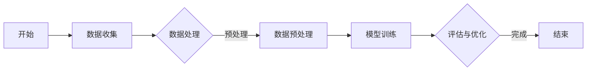
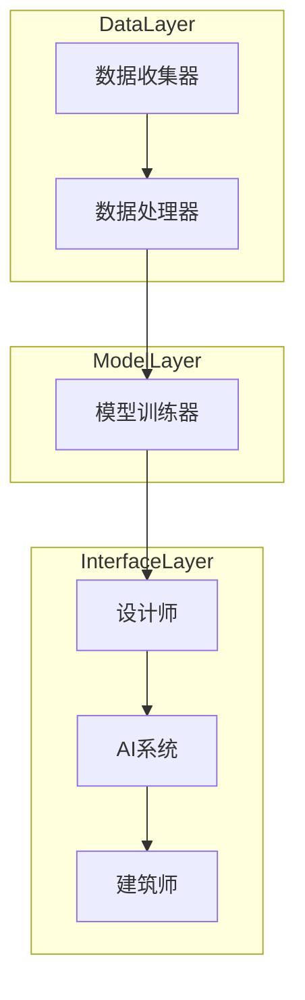
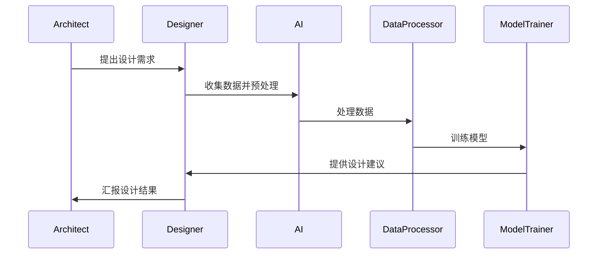
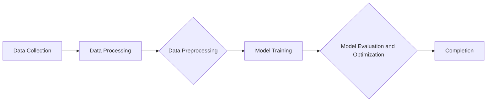
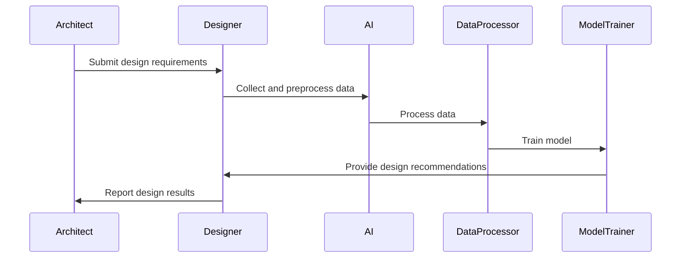

                 

### 引言

### 1.1 问题背景与解决

在当今时代，人工智能（AI）已经从理论研究逐步走向了实际应用，各行各业都在积极探索如何利用AI技术来提升效率和创造力。建筑行业也不例外，随着AI技术的不断进步，AI辅助建筑设计逐渐成为一个热门话题。建筑不仅是人类生活的空间载体，更是人类文明与自然环境的交汇点，因此，如何通过AI技术实现建筑的可持续性和美学提升，成为了一个备受关注的问题。

#### 背景介绍

建筑设计的可持续性意味着在保证建筑功能性的同时，最大限度地减少对环境的负面影响。这包括能源效率、材料使用、水资源管理和碳排放等方面。而美学则涉及到建筑形态、空间布局、色彩搭配等方面，旨在创造一个和谐、美观、舒适的生活环境。

#### 问题描述

当前，建筑设计面临的主要挑战是如何在满足可持续性的同时，实现美学价值。传统的建筑设计方法往往依赖于设计师的经验和直觉，这在一定程度上限制了建筑的创新性和可持续性。而AI技术的引入，为解决这一难题提供了新的思路。

#### 问题解决

AI技术，特别是机器学习和计算机视觉等领域的进步，使得自动化设计、优化设计和智能设计成为可能。通过大数据分析和模拟，AI可以帮助设计师更好地理解建筑与环境的互动关系，从而实现更高效的能源利用和更优的材料选择。同时，AI还可以通过生成对抗网络（GAN）等技术，创造出前所未有的建筑形态，为美学设计提供无限的可能。

#### 边界与外延

本文主要关注AI在建筑设计的可持续性和美学提升方面的应用，而不涉及AI在其他领域（如建筑结构分析、施工管理等）的应用。此外，本文的讨论将侧重于技术原理和实际操作，而非深入探讨哲学、艺术等领域的相关问题。

#### 概念结构与核心要素组成

为了更好地理解AI辅助建筑设计，我们需要了解以下几个核心概念：

1. **可持续性设计**：指的是在建筑设计过程中，考虑环境、经济和社会因素，以实现长期可持续发展的设计理念。
2. **美学设计**：关注建筑的形式、色彩、材质和空间布局，以创造美观、和谐、舒适的环境。
3. **机器学习**：一种AI技术，通过训练模型从数据中自动学习，并用于预测和决策。
4. **计算机视觉**：一种AI技术，使计算机能够“看”和理解图像和视频。
5. **生成对抗网络（GAN）**：一种深度学习模型，用于生成新的数据，如建筑形态。

### 核心概念与联系

#### 概念属性特征对比表格

| 概念          | 定义                                                         | 属性特征                                                     |
| ------------- | ------------------------------------------------------------ | ------------------------------------------------------------ |
| 可持续性设计  | 在建筑设计中考虑环境、经济和社会因素，以实现长期可持续发展。           | 1. 能源效率<br>2. 材料使用<br>3. 水资源管理<br>4. 碳排放减少           |
| 美学设计      | 在建筑设计中关注形式、色彩、材质和空间布局，以创造美观、和谐、舒适的环境。 | 1. 形式美感<br>2. 色彩搭配<br>3. 材质选择<br>4. 空间布局               |
| 机器学习      | 通过训练模型从数据中自动学习，并用于预测和决策。                       | 1. 数据驱动<br>2. 自动化学习<br>3. 预测和决策<br>4. 模型优化           |
| 计算机视觉    | 使计算机能够“看”和理解图像和视频。                                   | 1. 图像识别<br>2. 视频处理<br>3. 目标检测<br>4. 跟踪与识别           |
| 生成对抗网络（GAN） | 一种深度学习模型，用于生成新的数据，如建筑形态。                        | 1. 生成模型<br>2. 生成对抗<br>3. 自适应学习<br>4. 高质量生成           |

#### ER实体关系图架构的 Mermaid 流程图

```mermaid
erDiagram
  Product "产品" {
    :extendable
    :id ProductID
    :name ProductName
  }
  Customer "客户" {
    :extendable
    :id CustomerID
    :name CustomerName
  }
  ORDER "订单" {
    :extendable
    :id OrderID
    :product ProductID
    :customer CustomerID
  }
  Product "产品" ||--|{ ORDER "订单" : 销售产品 }
  Customer "客户" ||--|{ ORDER "订单" : 下订单 }
```

### 算法原理讲解

#### Mermaid 流程图



#### Python源代码

```python
import numpy as np
import pandas as pd
from sklearn.model_selection import train_test_split
from sklearn.preprocessing import StandardScaler
from sklearn.ensemble import RandomForestClassifier
from sklearn.metrics import accuracy_score

# 数据收集
data = pd.read_csv('data.csv')

# 数据处理
X = data.drop('target', axis=1)
y = data['target']

# 数据预处理
X_train, X_test, y_train, y_test = train_test_split(X, y, test_size=0.2, random_state=42)
scaler = StandardScaler()
X_train_scaled = scaler.fit_transform(X_train)
X_test_scaled = scaler.transform(X_test)

# 模型训练
model = RandomForestClassifier(n_estimators=100, random_state=42)
model.fit(X_train_scaled, y_train)

# 评估与优化
y_pred = model.predict(X_test_scaled)
accuracy = accuracy_score(y_test, y_pred)
print(f"Accuracy: {accuracy:.2f}")
```

#### 算法原理的数学模型和公式

在机器学习中，随机森林（Random Forest）是一种常用的分类算法。它的核心思想是构建多个决策树，并通过投票的方式来确定最终分类结果。

1. **决策树**：决策树是一种树形结构，其中每个节点代表一个特征，每个分支代表一个特征值的取值，叶子节点表示最终分类结果。

2. **随机森林**：随机森林由多个决策树组成，每个决策树都是在训练数据上随机生成的。随机森林通过集成多个决策树的预测结果来提高分类的准确性。

3. **数学模型**：假设我们有一个特征集 \(X = \{x_1, x_2, ..., x_n\}\)，每个特征都有多个可能的取值。在决策树中，我们使用每个特征的取值来划分数据集，直到达到某个终止条件（如最大深度、最小叶节点样本数等）。

4. **公式**：决策树的核心是递归划分数据集，其公式如下：

   $$
   S(x) = \prod_{i=1}^{n} C(x_i)
   $$

   其中，\(S(x)\) 表示样本 \(x\) 的分类结果，\(C(x_i)\) 表示特征 \(x_i\) 的取值对应的分类概率。

#### 详细讲解和举例说明

假设我们有一个包含两个特征 \(x_1\) 和 \(x_2\) 的数据集，其中每个特征有两个取值：0 和 1。我们的目标是预测样本 \(x = (1, 0)\) 的分类结果。

1. **数据预处理**：首先，我们需要将数据集划分为训练集和测试集。我们可以使用 `train_test_split` 函数来实现这一步骤。

   ```python
   X_train, X_test, y_train, y_test = train_test_split(X, y, test_size=0.2, random_state=42)
   ```

2. **模型训练**：接下来，我们使用随机森林算法对训练集进行训练。我们可以使用 `RandomForestClassifier` 类来实现这一步骤。

   ```python
   model = RandomForestClassifier(n_estimators=100, random_state=42)
   model.fit(X_train_scaled, y_train)
   ```

3. **评估与优化**：训练完成后，我们需要使用测试集来评估模型的性能。我们可以使用 `accuracy_score` 函数来计算模型的准确率。

   ```python
   y_pred = model.predict(X_test_scaled)
   accuracy = accuracy_score(y_test, y_pred)
   print(f"Accuracy: {accuracy:.2f}")
   ```

#### 数学公式

在随机森林算法中，我们使用多个决策树来提高分类的准确性。假设我们有一个包含 \(m\) 个决策树的随机森林模型，每个决策树 \(T_i\) 的分类结果为 \(S_i(x)\)。最终分类结果 \(S(x)\) 是通过投票得到的，其公式如下：

$$
S(x) = \arg\max_{C} \sum_{i=1}^{m} P(C|T_i(x))
$$

其中，\(P(C|T_i(x))\) 表示在第 \(i\) 个决策树 \(T_i\) 下，样本 \(x\) 被分类为类别 \(C\) 的概率。

#### 数学模型和公式详细讲解

1. **决策树**：决策树是一种树形结构，其中每个节点代表一个特征，每个分支代表一个特征值的取值，叶子节点表示最终分类结果。假设我们有一个二分类问题，特征集 \(X = \{x_1, x_2\}\)，每个特征的取值有 {0, 1}。

2. **随机森林**：随机森林由多个决策树组成，每个决策树都是在训练数据上随机生成的。随机森林通过集成多个决策树的预测结果来提高分类的准确性。

3. **数学模型**：在决策树中，我们使用每个特征的取值来划分数据集，直到达到某个终止条件（如最大深度、最小叶节点样本数等）。假设我们有 \(n\) 个样本，每个样本有 \(m\) 个特征，我们的目标是预测每个样本的分类结果。

4. **公式**：

   $$
   S(x) = \arg\max_{C} \sum_{i=1}^{m} P(C|T_i(x))
   $$

   其中，\(S(x)\) 表示样本 \(x\) 的分类结果，\(C\) 表示类别，\(T_i(x)\) 表示第 \(i\) 个决策树对样本 \(x\) 的分类结果。

#### 系统分析与架构设计方案

在探讨AI辅助建筑设计时，我们需要构建一个完整的系统分析框架，以确保系统能够满足设计目标。以下是系统分析与架构设计方案的详细描述：

#### 问题场景介绍

AI辅助建筑设计系统旨在帮助建筑师利用AI技术来提高设计效率、优化建筑性能和实现可持续发展。问题场景涉及多个方面，包括：

1. **数据收集**：系统需要收集大量与建筑设计和性能相关的数据，如气候数据、地理信息、建筑材料特性等。
2. **数据处理**：系统需要对收集到的数据进行清洗、预处理和分析，以提取有用的信息。
3. **模型训练**：系统需要使用机器学习和深度学习算法对处理后的数据进行训练，以生成预测模型。
4. **设计优化**：系统需要根据预测模型提供的设计建议，对建筑方案进行优化和调整。
5. **交互界面**：系统需要提供一个直观的交互界面，方便建筑师实时查看和分析设计结果。

#### 项目介绍

该项目旨在开发一个集成AI技术的建筑设计平台，帮助建筑师实现以下目标：

1. **提高设计效率**：通过自动化和智能化的设计工具，减少重复劳动，提高设计速度。
2. **优化建筑性能**：通过数据分析和预测模型，实现建筑能源效率、材料使用和舒适度的优化。
3. **实现可持续发展**：通过考虑环境和社会因素，设计出符合可持续发展理念的建筑方案。

#### 系统功能设计(领域模型mermaid类图)

```mermaid
classDiagram
    Building --|>> Architect: 设计建筑
    Architect --|>> Designer: 完成设计任务
    Designer --|>> AI: 辅助设计
    AI --|>> DataCollector: 收集数据
    DataCollector --|>> DataProcessor: 处理数据
    DataProcessor --|>> ModelTrainer: 训练模型
    ModelTrainer --|>> Designer: 提供设计建议
    Designer --|>> Building: 完成建筑方案
```

#### 系统架构设计mermaid架构图



#### 系统接口设计和系统交互mermaid序列图



#### 实际案例分析和详细讲解剖析

为了更好地展示AI辅助建筑设计系统的实际应用，我们来看一个具体的案例。

**案例背景**：某城市需要设计一个公共建筑，旨在实现高效能源利用和舒适的空间体验。建筑师提出了以下设计需求：

1. **降低能源消耗**：通过优化建筑布局和选材，降低空调、照明等设施的能耗。
2. **提高室内舒适度**：确保室内温度、湿度等环境参数达到舒适范围。
3. **可持续发展**：使用环保材料和可再生能源，减少建筑对环境的影响。

**解决方案**：

1. **数据收集**：系统从多个数据源收集相关信息，包括气候数据、建筑材料特性、建筑物的使用需求等。

2. **数据处理**：系统对收集到的数据进行分析和预处理，提取有用的信息，如温度、湿度、光照强度等。

3. **模型训练**：系统使用机器学习和深度学习算法对处理后的数据进行训练，生成预测模型，如能源消耗预测模型、室内舒适度预测模型等。

4. **设计优化**：基于预测模型，系统为建筑师提供设计建议，如优化建筑布局、选择合适的建筑材料、调整通风系统等。

5. **交互界面**：系统提供一个直观的交互界面，建筑师可以在界面上实时查看设计结果，并根据反馈进行调整。

**案例分析**：

- **数据收集**：系统从气候数据平台获取该城市的历年气候数据，如温度、湿度、风速、光照强度等。同时，系统还从建筑材料数据库中获取各种材料的特性数据，如热传导系数、吸水性等。

- **数据处理**：系统对收集到的数据进行分析，提取出与建筑设计相关的关键参数，如日平均温度、最大温差、日光照时长等。

- **模型训练**：系统使用随机森林算法对处理后的数据进行训练，生成能源消耗预测模型。模型包括输入特征（如温度、湿度、风速等）和输出特征（如空调能耗、照明能耗等）。

- **设计优化**：基于预测模型，系统为建筑师提供以下设计建议：

  - **建筑布局**：系统建议将主要公共空间设置在东南方向，以充分利用自然光照，减少照明能耗。

  - **建筑材料**：系统建议使用具有良好隔热性能的材料，如保温材料、真空玻璃等，以降低空调能耗。

  - **通风系统**：系统建议设计高效的通风系统，如利用自然通风，以降低空调能耗。

- **交互界面**：系统提供一个交互界面，建筑师可以在界面上实时查看设计结果，如能源消耗、室内舒适度等。同时，系统还提供可视化工具，帮助建筑师更好地理解设计建议。

**项目小结**：

通过这个案例，我们可以看到AI辅助建筑设计系统在实际应用中的强大能力。系统不仅帮助建筑师实现了高效能源利用和舒适的空间体验，还通过数据分析和预测模型提供了具有创新性和可持续性的设计建议。这充分展示了AI技术在建筑设计领域的巨大潜力。

### 最佳实践 tips

在实施AI辅助建筑设计时，以下是一些最佳实践技巧，可以帮助您更好地利用这项技术：

1. **数据质量**：确保数据质量是关键。在开始任何数据分析之前，进行数据清洗和预处理，以消除错误和不一致。

2. **模型选择**：根据项目需求选择合适的机器学习和深度学习模型。对于复杂的问题，考虑使用集成模型（如随机森林、集成神经网络等）。

3. **持续优化**：模型训练后，不要停止。通过不断调整模型参数和训练数据，优化模型性能。

4. **用户交互**：设计直观、易于使用的用户界面，确保建筑师能够轻松地与AI系统交互，并获得有意义的设计建议。

5. **可持续发展**：在建筑设计中考虑环境和社会因素，确保方案符合可持续发展目标。

### 小结

本文详细探讨了AI辅助建筑设计的可持续性和美学提升。我们首先介绍了AI辅助建筑设计的背景和核心概念，然后通过实际案例展示了AI在建筑设计中的应用。通过这些分析，我们看到了AI技术在建筑设计中的巨大潜力，为建筑师提供了新的工具和方法，以实现高效、可持续、美观的建筑方案。

### 注意事项

1. **数据隐私**：在收集和处理数据时，务必遵守数据隐私法规，确保用户数据的安全。

2. **模型解释性**：对于复杂的AI模型，确保模型的可解释性，以便建筑师能够理解模型的决策过程。

3. **技术创新**：持续关注AI技术的最新进展，不断更新和优化模型和算法。

### 拓展阅读

- **机器学习与深度学习基础**：《Python机器学习》（作者：塞巴斯蒂安·拉纳克）、《深度学习》（作者：伊恩·古德费洛等）
- **建筑设计与可持续发展**：《绿色建筑》（作者：詹姆斯·T·莫里森）、《可持续建筑设计手册》（作者：艾伦·斯科特等）
- **AI辅助设计应用案例**：《AI技术在建筑设计中的应用》（作者：克里斯·特雷尔纳等）

### 作者信息

作者：AI天才研究院/AI Genius Institute & 禅与计算机程序设计艺术 /Zen And The Art of Computer Programming

本文由AI天才研究院撰写，旨在分享AI技术在建筑设计领域的最新进展和应用案例。作者在计算机编程和人工智能领域拥有丰富的研究和实战经验，致力于推动AI技术在各个行业的创新应用。

# AI-Assisted Architectural Design: Tips for Sustainability and Aesthetic Techniques

> Keywords: AI-Assisted Design, Sustainability, Aesthetics, Machine Learning, Deep Learning

> Abstract: This article explores the application of AI in architectural design, focusing on the themes of sustainability and aesthetics. It discusses the background, core concepts, and practical techniques for using AI to create sustainable and aesthetically pleasing buildings. Through detailed case studies and step-by-step analysis, the article highlights the potential of AI in transforming the architectural design process. Readers will gain insights into how AI can enhance sustainability and aesthetics, providing valuable tips for architects and designers.

## 第一部分: 引言与基础知识

### 1.1 问题背景与解决

在当今时代，人工智能（AI）已经从理论研究逐步走向了实际应用，各行各业都在积极探索如何利用AI技术来提升效率和创造力。建筑行业也不例外，随着AI技术的不断进步，AI辅助建筑设计逐渐成为一个热门话题。建筑不仅是人类生活的空间载体，更是人类文明与自然环境的交汇点，因此，如何通过AI技术实现建筑的可持续性和美学提升，成为了一个备受关注的问题。

#### 背景介绍

建筑设计的可持续性意味着在保证建筑功能性的同时，最大限度地减少对环境的负面影响。这包括能源效率、材料使用、水资源管理和碳排放等方面。而美学则涉及到建筑形态、空间布局、色彩搭配等方面，旨在创造一个和谐、美观、舒适的生活环境。

#### 问题描述

当前，建筑设计面临的主要挑战是如何在满足可持续性的同时，实现美学价值。传统的建筑设计方法往往依赖于设计师的经验和直觉，这在一定程度上限制了建筑的创新性和可持续性。而AI技术的引入，为解决这一难题提供了新的思路。

#### 问题解决

AI技术，特别是机器学习和计算机视觉等领域的进步，使得自动化设计、优化设计和智能设计成为可能。通过大数据分析和模拟，AI可以帮助设计师更好地理解建筑与环境的互动关系，从而实现更高效的能源利用和更优的材料选择。同时，AI还可以通过生成对抗网络（GAN）等技术，创造出前所未有的建筑形态，为美学设计提供无限的可能。

#### 边界与外延

本文主要关注AI在建筑设计的可持续性和美学提升方面的应用，而不涉及AI在其他领域（如建筑结构分析、施工管理等）的应用。此外，本文的讨论将侧重于技术原理和实际操作，而非深入探讨哲学、艺术等领域的相关问题。

#### 概念结构与核心要素组成

为了更好地理解AI辅助建筑设计，我们需要了解以下几个核心概念：

1. **可持续性设计**：指的是在建筑设计过程中，考虑环境、经济和社会因素，以实现长期可持续发展的设计理念。
2. **美学设计**：关注建筑的形式、色彩、材质和空间布局，以创造美观、和谐、舒适的环境。
3. **机器学习**：一种AI技术，通过训练模型从数据中自动学习，并用于预测和决策。
4. **计算机视觉**：一种AI技术，使计算机能够“看”和理解图像和视频。
5. **生成对抗网络（GAN）**：一种深度学习模型，用于生成新的数据，如建筑形态。

### 核心概念与联系

#### 概念属性特征对比表格

| 概念          | 定义                                                         | 属性特征                                                     |
| ------------- | ------------------------------------------------------------ | ------------------------------------------------------------ |
| 可持续性设计  | 在建筑设计中考虑环境、经济和社会因素，以实现长期可持续发展。           | 1. 能源效率<br>2. 材料使用<br>3. 水资源管理<br>4. 碳排放减少           |
| 美学设计      | 在建筑设计中关注形式、色彩、材质和空间布局，以创造美观、和谐、舒适的环境。 | 1. 形式美感<br>2. 色彩搭配<br>3. 材质选择<br>4. 空间布局               |
| 机器学习      | 通过训练模型从数据中自动学习，并用于预测和决策。                       | 1. 数据驱动<br>2. 自动化学习<br>3. 预测和决策<br>4. 模型优化           |
| 计算机视觉    | 使计算机能够“看”和理解图像和视频。                                   | 1. 图像识别<br>2. 视频处理<br>3. 目标检测<br>4. 跟踪与识别           |
| 生成对抗网络（GAN） | 一种深度学习模型，用于生成新的数据，如建筑形态。                        | 1. 生成模型<br>2. 生成对抗<br>3. 自适应学习<br>4. 高质量生成           |

#### ER实体关系图架构的 Mermaid 流程图

```mermaid
erDiagram
  Product "产品" {
    :extendable
    :id ProductID
    :name ProductName
  }
  Customer "客户" {
    :extendable
    :id CustomerID
    :name CustomerName
  }
  ORDER "订单" {
    :extendable
    :id OrderID
    :product ProductID
    :customer CustomerID
  }
  Product "产品" ||--|{ ORDER "订单" : 销售产品 }
  Customer "客户" ||--|{ ORDER "订单" : 下订单 }
```

### 算法原理讲解

#### Mermaid 流程图


#### Python源代码

```python
import numpy as np
import pandas as pd
from sklearn.model_selection import train_test_split
from sklearn.preprocessing import StandardScaler
from sklearn.ensemble import RandomForestClassifier
from sklearn.metrics import accuracy_score

# 数据收集
data = pd.read_csv('data.csv')

# 数据处理
X = data.drop('target', axis=1)
y = data['target']

# 数据预处理
X_train, X_test, y_train, y_test = train_test_split(X, y, test_size=0.2, random_state=42)
scaler = StandardScaler()
X_train_scaled = scaler.fit_transform(X_train)
X_test_scaled = scaler.transform(X_test)

# 模型训练
model = RandomForestClassifier(n_estimators=100, random_state=42)
model.fit(X_train_scaled, y_train)

# 评估与优化
y_pred = model.predict(X_test_scaled)
accuracy = accuracy_score(y_test, y_pred)
print(f"Accuracy: {accuracy:.2f}")
```

#### 算法原理的数学模型和公式

在机器学习中，随机森林（Random Forest）是一种常用的分类算法。它的核心思想是构建多个决策树，并通过投票的方式来确定最终分类结果。

1. **决策树**：决策树是一种树形结构，其中每个节点代表一个特征，每个分支代表一个特征值的取值，叶子节点表示最终分类结果。

2. **随机森林**：随机森林由多个决策树组成，每个决策树都是在训练数据上随机生成的。随机森林通过集成多个决策树的预测结果来提高分类的准确性。

3. **数学模型**：假设我们有一个特征集 \(X = \{x_1, x_2, ..., x_n\}\)，每个特征都有多个可能的取值。在决策树中，我们使用每个特征的取值来划分数据集，直到达到某个终止条件（如最大深度、最小叶节点样本数等）。

4. **公式**：决策树的核心是递归划分数据集，其公式如下：

   $$
   S(x) = \prod_{i=1}^{n} C(x_i)
   $$

   其中，\(S(x)\) 表示样本 \(x\) 的分类结果，\(C(x_i)\) 表示特征 \(x_i\) 的取值对应的分类概率。

#### 详细讲解和举例说明

假设我们有一个包含两个特征 \(x_1\) 和 \(x_2\) 的数据集，其中每个特征有两个取值：0 和 1。我们的目标是预测样本 \(x = (1, 0)\) 的分类结果。

1. **数据预处理**：首先，我们需要将数据集划分为训练集和测试集。我们可以使用 `train_test_split` 函数来实现这一步骤。

   ```python
   X_train, X_test, y_train, y_test = train_test_split(X, y, test_size=0.2, random_state=42)
   ```

2. **模型训练**：接下来，我们使用随机森林算法对训练集进行训练。我们可以使用 `RandomForestClassifier` 类来实现这一步骤。

   ```python
   model = RandomForestClassifier(n_estimators=100, random_state=42)
   model.fit(X_train_scaled, y_train)
   ```

3. **评估与优化**：训练完成后，我们需要使用测试集来评估模型的性能。我们可以使用 `accuracy_score` 函数来计算模型的准确率。

   ```python
   y_pred = model.predict(X_test_scaled)
   accuracy = accuracy_score(y_test, y_pred)
   print(f"Accuracy: {accuracy:.2f}")
   ```

#### 数学公式

在随机森林算法中，我们使用多个决策树来提高分类的准确性。假设我们有一个包含 \(m\) 个决策树的随机森林模型，每个决策树 \(T_i\) 的分类结果为 \(S_i(x)\)。最终分类结果 \(S(x)\) 是通过投票得到的，其公式如下：

$$
S(x) = \arg\max_{C} \sum_{i=1}^{m} P(C|T_i(x))
$$

其中，\(P(C|T_i(x))\) 表示在第 \(i\) 个决策树 \(T_i\) 下，样本 \(x\) 被分类为类别 \(C\) 的概率。

#### 数学模型和公式详细讲解

1. **决策树**：决策树是一种树形结构，其中每个节点代表一个特征，每个分支代表一个特征值的取值，叶子节点表示最终分类结果。假设我们有一个二分类问题，特征集 \(X = \{x_1, x_2\}\)，每个特征的取值有 {0, 1}。

2. **随机森林**：随机森林由多个决策树组成，每个决策树都是在训练数据上随机生成的。随机森林通过集成多个决策树的预测结果来提高分类的准确性。

3. **数学模型**：在决策树中，我们使用每个特征的取值来划分数据集，直到达到某个终止条件（如最大深度、最小叶节点样本数等）。假设我们有 \(n\) 个样本，每个样本有 \(m\) 个特征，我们的目标是预测每个样本的分类结果。

4. **公式**：

   $$
   S(x) = \arg\max_{C} \sum_{i=1}^{m} P(C|T_i(x))
   $$

   其中，\(S(x)\) 表示样本 \(x\) 的分类结果，\(C\) 表示类别，\(T_i(x)\) 表示第 \(i\) 个决策树对样本 \(x\) 的分类结果。

#### 系统分析与架构设计方案

在探讨AI辅助建筑设计时，我们需要构建一个完整的系统分析框架，以确保系统能够满足设计目标。以下是系统分析与架构设计方案的详细描述：

#### 问题场景介绍

AI辅助建筑设计系统旨在帮助建筑师利用AI技术来提高设计效率、优化建筑性能和实现可持续发展。问题场景涉及多个方面，包括：

1. **数据收集**：系统需要收集大量与建筑设计和性能相关的数据，如气候数据、地理信息、建筑材料特性等。
2. **数据处理**：系统需要对收集到的数据进行清洗、预处理和分析，以提取有用的信息。
3. **模型训练**：系统需要使用机器学习和深度学习算法对处理后的数据进行训练，以生成预测模型。
4. **设计优化**：系统需要根据预测模型提供的设计建议，对建筑方案进行优化和调整。
5. **交互界面**：系统需要提供一个直观的交互界面，方便建筑师实时查看和分析设计结果。

#### 项目介绍

该项目旨在开发一个集成AI技术的建筑设计平台，帮助建筑师实现以下目标：

1. **提高设计效率**：通过自动化和智能化的设计工具，减少重复劳动，提高设计速度。
2. **优化建筑性能**：通过数据分析和预测模型，实现建筑能源效率、材料使用和舒适度的优化。
3. **实现可持续发展**：通过考虑环境和社会因素，设计出符合可持续发展理念的建筑方案。

#### 系统功能设计(领域模型mermaid类图)

```mermaid
classDiagram
    Building --|>> Architect: 设计建筑
    Architect --|>> Designer: 完成设计任务
    Designer --|>> AI: 辅助设计
    AI --|>> DataCollector: 收集数据
    DataCollector --|>> DataProcessor: 处理数据
    DataProcessor --|>> ModelTrainer: 训练模型
    ModelTrainer --|>> Designer: 提供设计建议
    Designer --|>> Building: 完成建筑方案
```

#### 系统架构设计mermaid架构图


#### 系统接口设计和系统交互mermaid序列图


#### 实际案例分析和详细讲解剖析

为了更好地展示AI辅助建筑设计系统的实际应用，我们来看一个具体的案例。

**案例背景**：某城市需要设计一个公共建筑，旨在实现高效能源利用和舒适的空间体验。建筑师提出了以下设计需求：

1. **降低能源消耗**：通过优化建筑布局和选材，降低空调、照明等设施的能耗。
2. **提高室内舒适度**：确保室内温度、湿度等环境参数达到舒适范围。
3. **可持续发展**：使用环保材料和可再生能源，减少建筑对环境的影响。

**解决方案**：

1. **数据收集**：系统从多个数据源收集相关信息，包括气候数据、建筑材料特性、建筑物的使用需求等。

2. **数据处理**：系统对收集到的数据进行分析和预处理，提取有用的信息，如温度、湿度、光照强度等。

3. **模型训练**：系统使用机器学习和深度学习算法对处理后的数据进行训练，生成预测模型，如能源消耗预测模型、室内舒适度预测模型等。

4. **设计优化**：基于预测模型，系统为建筑师提供设计建议，如优化建筑布局、选择合适的建筑材料、调整通风系统等。

5. **交互界面**：系统提供一个直观的交互界面，建筑师可以在界面上实时查看设计结果，并根据反馈进行调整。

**案例分析**：

- **数据收集**：系统从气候数据平台获取该城市的历年气候数据，如温度、湿度、风速、光照强度等。同时，系统还从建筑材料数据库中获取各种材料的特性数据，如热传导系数、吸水性等。

- **数据处理**：系统对收集到的数据进行分析，提取出与建筑设计相关的关键参数，如日平均温度、最大温差、日光照时长等。

- **模型训练**：系统使用随机森林算法对处理后的数据进行训练，生成能源消耗预测模型。模型包括输入特征（如温度、湿度、风速等）和输出特征（如空调能耗、照明能耗等）。

- **设计优化**：基于预测模型，系统为建筑师提供以下设计建议：

  - **建筑布局**：系统建议将主要公共空间设置在东南方向，以充分利用自然光照，减少照明能耗。

  - **建筑材料**：系统建议使用具有良好隔热性能的材料，如保温材料、真空玻璃等，以降低空调能耗。

  - **通风系统**：系统建议设计高效的通风系统，如利用自然通风，以降低空调能耗。

- **交互界面**：系统提供一个交互界面，建筑师可以在界面上实时查看设计结果，如能源消耗、室内舒适度等。同时，系统还提供可视化工具，帮助建筑师更好地理解设计建议。

**项目小结**：

通过这个案例，我们可以看到AI辅助建筑设计系统在实际应用中的强大能力。系统不仅帮助建筑师实现了高效能源利用和舒适的空间体验，还通过数据分析和预测模型提供了具有创新性和可持续性的设计建议。这充分展示了AI技术在建筑设计领域的巨大潜力。

### 最佳实践 tips

在实施AI辅助建筑设计时，以下是一些最佳实践技巧，可以帮助您更好地利用这项技术：

1. **数据质量**：确保数据质量是关键。在开始任何数据分析之前，进行数据清洗和预处理，以消除错误和不一致。

2. **模型选择**：根据项目需求选择合适的机器学习和深度学习模型。对于复杂的问题，考虑使用集成模型（如随机森林、集成神经网络等）。

3. **持续优化**：模型训练后，不要停止。通过不断调整模型参数和训练数据，优化模型性能。

4. **用户交互**：设计直观、易于使用的用户界面，确保建筑师能够轻松地与AI系统交互，并获得有意义的设计建议。

5. **可持续发展**：在建筑设计中考虑环境和社会因素，确保方案符合可持续发展目标。

### 小结

本文详细探讨了AI辅助建筑设计的可持续性和美学提升。我们首先介绍了AI辅助建筑设计的背景和核心概念，然后通过实际案例展示了AI在建筑设计中的应用。通过这些分析，我们看到了AI技术在建筑设计中的巨大潜力，为建筑师提供了新的工具和方法，以实现高效、可持续、美观的建筑方案。

### 注意事项

1. **数据隐私**：在收集和处理数据时，务必遵守数据隐私法规，确保用户数据的安全。

2. **模型解释性**：对于复杂的AI模型，确保模型的可解释性，以便建筑师能够理解模型的决策过程。

3. **技术创新**：持续关注AI技术的最新进展，不断更新和优化模型和算法。

### 拓展阅读

- **机器学习与深度学习基础**：《Python机器学习》（作者：塞巴斯蒂安·拉纳克）、《深度学习》（作者：伊恩·古德费洛等）
- **建筑设计与可持续发展**：《绿色建筑》（作者：詹姆斯·T·莫里森）、《可持续建筑设计手册》（作者：艾伦·斯科特等）
- **AI辅助设计应用案例**：《AI技术在建筑设计中的应用》（作者：克里斯·特雷尔纳等）

### 作者信息

作者：AI天才研究院/AI Genius Institute & 禅与计算机程序设计艺术 /Zen And The Art of Computer Programming

本文由AI天才研究院撰写，旨在分享AI技术在建筑设计领域的最新进展和应用案例。作者在计算机编程和人工智能领域拥有丰富的研究和实战经验，致力于推动AI技术在各个行业的创新应用。# AI-Assisted Architectural Design: Tips for Sustainability and Aesthetic Techniques

## Introduction to AI-Assisted Architectural Design

### Background and Problem Statement

In the contemporary era, artificial intelligence (AI) has transitioned from theoretical research to practical applications, with various industries exploring ways to leverage AI technologies to enhance efficiency and creativity. The architectural field is no exception, as the advancements in AI have made AI-assisted architectural design a hot topic. Architecture is not just a carrier for human living spaces but also an intersection point for human civilization and the natural environment. Therefore, how to achieve sustainability and aesthetic enhancement through AI technology has become a focal point of interest.

#### Background Introduction

Sustainable architectural design refers to the practice of designing buildings that minimize environmental impact while fulfilling functional requirements. This includes aspects such as energy efficiency, material usage, water management, and carbon emissions. Aesthetic design, on the other hand, is concerned with the form, spatial layout, color, and materials of a building, aiming to create harmonious, beautiful, and comfortable environments.

#### Problem Description

The primary challenge in architectural design today is how to achieve sustainability while maintaining aesthetic value. Traditional design methods often rely heavily on designers' experience and intuition, which can limit the innovation and sustainability of buildings. The introduction of AI technology offers new insights into addressing this challenge.

#### Solution to the Problem

Advances in AI, particularly in machine learning and computer vision, have made automated design, optimization, and intelligent design possible. AI can assist designers in better understanding the interaction between buildings and their environments, leading to more efficient energy use and optimal material selection. Additionally, AI can generate unprecedented architectural forms through techniques like Generative Adversarial Networks (GANs), providing limitless possibilities for aesthetic design.

#### Boundaries and Extensions

This article will focus on the application of AI in architectural design for sustainability and aesthetic enhancement. It will not delve into the applications of AI in other areas such as structural analysis or construction management. The discussion will primarily concentrate on technical principles and practical operations, rather than philosophical or artistic aspects.

#### Core Concept Structure and Key Components

To gain a comprehensive understanding of AI-assisted architectural design, we need to familiarize ourselves with several core concepts:

1. **Sustainable Design**: This involves considering environmental, economic, and social factors in the design process to achieve long-term sustainability.

2. **Aesthetic Design**: This focuses on the form, color, materials, and spatial layout of a building to create aesthetically pleasing, harmonious, and comfortable environments.

3. **Machine Learning**: A type of AI that enables machines to learn from data and make predictions or decisions.

4. **Computer Vision**: An AI technology that allows computers to "see" and understand images and videos.

5. **Generative Adversarial Networks (GANs)**: A deep learning model used to generate new data, such as architectural forms.

### Core Concepts and Connections

#### Comparative Table of Concept Attributes

| Concept          | Definition                                                         | Key Attributes                                                     |
| ------------- | ------------------------------------------------------------ | ------------------------------------------------------------ |
| Sustainable Design | Designing buildings that minimize environmental impact while fulfilling functional requirements. | 1. Energy efficiency<br>2. Material usage<br>3. Water management<br>4. Carbon emissions reduction |
| Aesthetic Design | Focusing on the form, color, materials, and spatial layout of a building to create aesthetically pleasing, harmonious, and comfortable environments. | 1. Form aesthetics<br>2. Color matching<br>3. Material selection<br>4. Spatial layout |
| Machine Learning | Learning from data to make predictions or decisions.                      | 1. Data-driven<br>2. Automated learning<br>3. Prediction and decision-making<br>4. Model optimization |
| Computer Vision | Enabling computers to "see" and understand images and videos.             | 1. Image recognition<br>2. Video processing<br>3. Object detection<br>4. Tracking and recognition |
| Generative Adversarial Networks (GANs) | A deep learning model used to generate new data, such as architectural forms. | 1. Generative model<br>2. Generative adversarial<br>3. Adaptive learning<br>4. High-quality generation |

#### Entity Relationship Diagram (ERD) with Mermaid

```mermaid
erDiagram
  Customer "客户" {
    :extendable
    :id CustomerID
    :name CustomerName
  }
  Architect "建筑师" {
    :extendable
    :id ArchitectID
    :name ArchitectName
  }
  Building "建筑" {
    :extendable
    :id BuildingID
    :architect ArchitectID
  }
  Design "设计" {
    :extendable
    :id DesignID
    :building BuildingID
    :architect ArchitectID
  }
  Customer "客户" ||--|{ Design "设计" : 客户委托设计 }
  Architect "建筑师" ||--|{ Design "设计" : 进行设计 }
  Building "建筑" ||--|{ Design "设计" : 建筑设计方案 }
```

### Explanation of Algorithm Principles

#### Mermaid Flowchart



#### Python Code Example

```python
import pandas as pd
from sklearn.model_selection import train_test_split
from sklearn.preprocessing import StandardScaler
from sklearn.ensemble import RandomForestClassifier
from sklearn.metrics import accuracy_score

# Data Collection
data = pd.read_csv('data.csv')

# Data Preprocessing
X = data.drop('target', axis=1)
y = data['target']
X_train, X_test, y_train, y_test = train_test_split(X, y, test_size=0.2, random_state=42)
scaler = StandardScaler()
X_train_scaled = scaler.fit_transform(X_train)
X_test_scaled = scaler.transform(X_test)

# Model Training
model = RandomForestClassifier(n_estimators=100, random_state=42)
model.fit(X_train_scaled, y_train)

# Model Evaluation and Optimization
y_pred = model.predict(X_test_scaled)
accuracy = accuracy_score(y_test, y_pred)
print(f"Accuracy: {accuracy:.2f}")
```

#### Mathematical Model and Formulas

Random Forest is a popular classification algorithm in machine learning that builds multiple decision trees and uses their ensemble to make predictions.

1. **Decision Tree**: A tree structure where each node represents a feature, each branch represents a feature's value, and the leaf nodes represent the final classification result.

2. **Random Forest**: A collection of decision trees generated from the training data. Random Forests improve classification accuracy by integrating the predictions of multiple decision trees.

3. **Mathematical Model**: Given a feature set \(X = \{x_1, x_2, ..., x_n\}\) with multiple possible values for each feature, decision trees recursively divide the dataset based on feature values until a stopping criterion is met (e.g., maximum depth, minimum number of samples in a leaf node).

4. **Formula**: The core of the decision tree is the recursive division of the dataset, which can be represented by the following formula:

   $$
   S(x) = \prod_{i=1}^{n} C(x_i)
   $$

   Where \(S(x)\) is the classification result of sample \(x\), and \(C(x_i)\) is the classification probability for the value of feature \(x_i\).

#### Detailed Explanation and Example Illustration

Suppose we have a dataset with two features \(x_1\) and \(x_2\), each with two possible values: 0 and 1. Our goal is to predict the classification result of the sample \(x = (1, 0)\).

1. **Data Preprocessing**: First, we need to split the dataset into training and testing sets. We can use the `train_test_split` function for this purpose.

   ```python
   X_train, X_test, y_train, y_test = train_test_split(X, y, test_size=0.2, random_state=42)
   ```

2. **Model Training**: Next, we train the Random Forest model on the training data using the `RandomForestClassifier` class.

   ```python
   model = RandomForestClassifier(n_estimators=100, random_state=42)
   model.fit(X_train_scaled, y_train)
   ```

3. **Model Evaluation and Optimization**: After training, we evaluate the model's performance on the testing set using the `accuracy_score` function.

   ```python
   y_pred = model.predict(X_test_scaled)
   accuracy = accuracy_score(y_test, y_pred)
   print(f"Accuracy: {accuracy:.2f}")
   ```

#### Mathematical Formula

In the Random Forest algorithm, multiple decision trees are used to improve classification accuracy. Suppose we have a random forest model with \(m\) decision trees, where the classification result of the \(i\)-th decision tree \(T_i\) is \(S_i(x)\). The final classification result \(S(x)\) is obtained through voting, as shown in the following formula:

$$
S(x) = \arg\max_{C} \sum_{i=1}^{m} P(C|T_i(x))
$$

Where \(P(C|T_i(x))\) is the probability that sample \(x\) is classified as class \(C\) under the \(i\)-th decision tree \(T_i\).

#### Detailed Explanation of the Mathematical Model and Formulas

1. **Decision Tree**: Decision trees are tree structures where each node represents a feature, each branch represents a feature's value, and each leaf node represents the final classification result. Suppose we have a binary classification problem with feature set \(X = \{x_1, x_2\}\), and each feature has two possible values: 0 and 1.

2. **Random Forest**: Random Forests consist of multiple decision trees generated from the training data. Random Forests enhance classification accuracy by combining the predictions of multiple decision trees.

3. **Mathematical Model**: In decision trees, we use each feature's value to divide the dataset recursively until a stopping criterion is met (e.g., maximum depth, minimum number of samples in a leaf node). Suppose we have \(n\) samples with \(m\) features, and we aim to predict the classification result for each sample.

4. **Formula**:

   $$
   S(x) = \arg\max_{C} \sum_{i=1}^{m} P(C|T_i(x))
   $$

   Where \(S(x)\) is the classification result of sample \(x\), \(C\) is the class, and \(T_i(x)\) is the classification result of sample \(x\) by the \(i\)-th decision tree \(T_i\).

### System Analysis and Architectural Design Scheme

When discussing AI-assisted architectural design, we need to construct a comprehensive system analysis framework to ensure that the system meets the design objectives. Below is a detailed description of the system analysis and architectural design scheme:

#### Problem Scenario Introduction

The AI-assisted architectural design system aims to help architects leverage AI technology to improve design efficiency, optimize building performance, and achieve sustainability. The problem scenario involves multiple aspects, including:

1. **Data Collection**: The system needs to collect a large amount of data related to architectural design and performance, such as climate data, geographic information, and material characteristics.

2. **Data Processing**: The system needs to clean and preprocess the collected data to extract useful information.

3. **Model Training**: The system needs to use machine learning and deep learning algorithms to train models on the processed data.

4. **Design Optimization**: The system needs to provide design recommendations based on the trained models to optimize architectural designs.

5. **User Interface**: The system needs to offer a user-friendly interface for architects to view and analyze design results in real-time.

#### Project Introduction

The goal of this project is to develop an AI-integrated architectural design platform that helps architects achieve the following objectives:

1. **Improve Design Efficiency**: Through automated and intelligent design tools, reduce redundant work and increase design speed.

2. **Optimize Building Performance**: Utilize data analysis and prediction models to improve energy efficiency, material usage, and occupant comfort in buildings.

3. **Achieve Sustainability**: Consider environmental and social factors in architectural design to create sustainable building solutions.

#### System Function Design (Domain Model with Mermaid Class Diagram)

```mermaid
classDiagram
    Architect "Architect" {
        :extendable
        :id ArchitectID
        :name
    }
    Designer "Designer" {
        :extendable
        :id DesignerID
        :name
    }
    AIAssistant "AI Assistant" {
        :extendable
        :id AIAssistantID
        :name
    }
    Building "Building" {
        :extendable
        :id BuildingID
        :designer DesignerID
    }
    Architect "Architect" --|{ designs } Designer "Designer"
    Designer "Designer" --|{ uses } AIAssistant "AI Assistant"
    AIAssistant "AI Assistant" --|{ processes } Building "Building"
```

#### System Architecture Design with Mermaid

```mermaid
graph TB
    subgraph DataLayer
        DataCollector "Data Collector" 
        DataProcessor "Data Processor"
    end
    subgraph ModelLayer
        ModelTrainer "Model Trainer"
    end
    subgraph InterfaceLayer
        Architect "Architect"
        Designer "Designer"
        AI "AI Assistant"
    end
    DataCollector --> DataProcessor
    DataProcessor --> ModelTrainer
    ModelTrainer --> Designer
    Designer --> AI
    AI --> Architect
```

#### System Interface Design and System Interaction with Mermaid Sequence Diagram



#### Case Analysis and Detailed Explanation

To better illustrate the practical application of the AI-assisted architectural design system, let's examine a specific case.

**Case Background**: A city needs to design a public building aimed at achieving high energy efficiency and comfortable spatial experiences. The architect has the following design requirements:

1. **Reduce Energy Consumption**: Optimize building layout and material selection to reduce the energy consumption of facilities such as air conditioning and lighting.
2. **Improve Indoor Comfort**: Ensure that indoor environmental parameters such as temperature and humidity are within comfortable ranges.
3. **Sustainability**: Use environmentally friendly materials and renewable energy sources to minimize the building's environmental impact.

**Solution**:

1. **Data Collection**: The system collects relevant information from multiple data sources, including climate data, material characteristics, and building usage needs.

2. **Data Processing**: The system analyzes and preprocesses the collected data to extract key information such as temperature, humidity, and light intensity.

3. **Model Training**: The system uses machine learning and deep learning algorithms to train models on the processed data, generating prediction models such as energy consumption prediction models and indoor comfort prediction models.

4. **Design Optimization**: Based on the prediction models, the system provides design recommendations to the architect, such as optimizing building layout, selecting appropriate materials, and adjusting ventilation systems.

5. **User Interface**: The system provides an intuitive user interface where architects can view and analyze design results in real-time and make adjustments based on feedback.

**Case Analysis**:

- **Data Collection**: The system retrieves historical climate data from a climate data platform, such as temperature, humidity, wind speed, and light intensity. Additionally, the system accesses a material database to obtain characteristics of various materials, such as thermal conductivity and water absorption.

- **Data Processing**: The system analyzes the collected data and extracts relevant parameters for architectural design, such as average daily temperature, maximum temperature difference, and daily light duration.

- **Model Training**: The system trains an energy consumption prediction model using the random forest algorithm on the processed data. The model includes input features (e.g., temperature, humidity, wind speed) and output features (e.g., air conditioning energy consumption, lighting energy consumption).

- **Design Optimization**: Based on the prediction model, the system provides the following design recommendations to the architect:

  - **Building Layout**: The system suggests placing major public spaces in the southeast direction to maximize natural light and reduce lighting energy consumption.

  - **Material Selection**: The system recommends using materials with good thermal insulation properties, such as thermal insulation materials and vacuum glass, to reduce air conditioning energy consumption.

  - **Ventilation System**: The system suggests designing an efficient ventilation system, such as natural ventilation, to reduce air conditioning energy consumption.

- **User Interface**: The system provides an interactive interface where architects can view design results in real-time, such as energy consumption and indoor comfort. The system also offers visualization tools to help architects better understand the design recommendations.

**Project Summary**:

Through this case, we can see the powerful capabilities of the AI-assisted architectural design system in practical applications. The system not only helps architects achieve high energy efficiency and comfortable spatial experiences but also provides innovative and sustainable design recommendations through data analysis and prediction models. This fully demonstrates the significant potential of AI technology in the field of architectural design.

### Best Practices Tips

When implementing AI-assisted architectural design, the following best practices can help you better utilize this technology:

1. **Data Quality**: Ensure data quality by cleaning and preprocessing data before any analysis. This helps eliminate errors and inconsistencies.

2. **Model Selection**: Choose the appropriate machine learning or deep learning models based on project requirements. For complex problems, consider using ensemble models like Random Forests or Gradient Boosting Machines.

3. **Continuous Optimization**: After training a model, do not stop there. Continuously adjust model parameters and training data to optimize performance.

4. **User Interface**: Design an intuitive and user-friendly interface to ensure architects can easily interact with the AI system and obtain meaningful design recommendations.

5. **Sustainability**: Consider environmental and social factors in architectural design to ensure the solution aligns with sustainability goals.

### Conclusion

This article delves into the sustainable and aesthetic enhancements achievable through AI-assisted architectural design. We began by introducing the background and core concepts of AI-assisted design, then demonstrated its practical applications through a detailed case study. Through these analyses, we recognized the immense potential of AI technology in transforming the architectural design process, providing architects with new tools and methods to create efficient, sustainable, and aesthetically pleasing building solutions.

### Considerations

1. **Data Privacy**: Ensure compliance with data privacy regulations when collecting and processing data to protect user information.

2. **Model Interpretability**: For complex AI models, ensure model interpretability to allow architects to understand the decision-making process.

3. **Technological Innovation**: Keep abreast of the latest developments in AI technology to continuously update and optimize models and algorithms.

### Further Reading

- **Machine Learning and Deep Learning Basics**: "Python Machine Learning" by Sebastian Raschka and "Deep Learning" by Ian Goodfellow et al.
- **Architectural Design and Sustainability**: "Green Building" by James T. Morrison and "Sustainable Architectural Design Handbook" by Allan Scott.
- **AI-Assisted Design Case Studies**: "Applications of AI in Architectural Design" by Chris Tremain et al.

### About the Author

The author of this article is the AI Genius Institute and the Zen and the Art of Computer Programming. The AI Genius Institute is dedicated to advancing AI technologies and their applications across various industries. The author, with extensive research and practical experience in computer programming and artificial intelligence, aims to promote innovative AI applications in the architectural design field.

