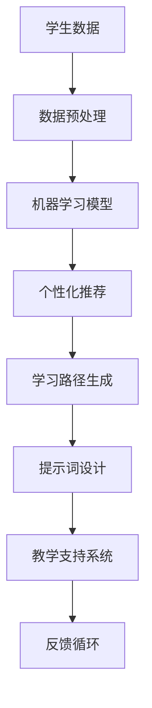

                 

## AI辅助教学：个性化学习路径的提示词设计

### 关键词：
- **人工智能**、**个性化学习**、**提示词设计**、**教学辅助**、**学习路径**、**教育技术**

### 摘要：
本文探讨了AI辅助教学的核心概念及其在个性化学习路径设计中的应用。重点分析了如何通过有效的提示词设计，提升学生自主学习和解决问题的能力，实现个性化教学。文章包括AI辅助教学的发展背景、个性化学习路径设计原则、提示词设计方法、AI技术在教学中的应用场景、实际案例研究以及未来发展趋势的讨论。

### 引言

随着人工智能技术的不断进步，教育领域正经历深刻的变革。传统的教学模式逐渐被AI辅助教学所取代，这种新型教学模式以个性化学习为核心，通过数据分析和智能推荐，为学生提供量身定制的学习路径。在这种背景下，提示词设计成为实现个性化学习的关键环节。本文将从以下几个方面展开讨论：

1. **AI辅助教学的概念**：介绍AI辅助教学的定义、核心技术和应用场景。
2. **个性化学习路径设计**：阐述个性化学习路径的设计原则和方法。
3. **提示词设计**：探讨如何设计有效的提示词，促进个性化学习。
4. **AI技术在教学中的应用**：分析AI技术在教学中的具体应用场景和效果。
5. **案例研究**：分享实际案例，探讨AI辅助教学的效果和经验。
6. **未来发展趋势**：预测AI辅助教学的发展趋势和面临的挑战。

### Step 1: AI辅助教学的概念

#### 1.1 定义

AI辅助教学是指利用人工智能技术，通过分析学习者的行为数据、学习习惯和知识水平，为学生提供个性化学习资源、路径和反馈的一种教学模式。AI辅助教学的核心在于个性化，它能够根据学生的个性化需求，动态调整教学内容和方式，提高学习效率。

#### 1.2 核心技术

AI辅助教学主要依赖于以下核心技术：

- **数据挖掘与分析**：通过对大量学习数据的分析，挖掘学生的学习行为和知识掌握情况。
- **机器学习与深度学习**：利用机器学习和深度学习算法，建立个性化学习模型。
- **自然语言处理**：通过自然语言处理技术，实现智能问答、内容生成等功能。

#### 1.3 应用场景

AI辅助教学在多个教育场景中得到了广泛应用，包括：

- **在线教育**：提供个性化学习路径、智能推荐课程、在线作业批改等。
- **K-12教育**：实现个性化学习辅导、智能考试分析等。
- **职业培训**：提供定制化培训方案、职业规划等。

### Step 2: 个性化学习路径设计

#### 2.1 设计原则

个性化学习路径设计需要遵循以下原则：

- **适应性**：根据学生的学习行为和知识水平，动态调整学习内容。
- **针对性**：针对学生的个性化需求，提供定制化的学习资源。
- **灵活性**：支持多种学习模式，满足学生的多样化学习需求。
- **协作性**：鼓励学生之间进行互动和协作，促进共同学习。

#### 2.2 设计方法

个性化学习路径设计通常包括以下几个步骤：

1. **数据收集**：收集学生的学习数据，包括学习行为、知识水平、兴趣爱好等。
2. **数据分析**：对收集到的数据进行挖掘和分析，识别学生的学习特征。
3. **路径规划**：根据分析结果，为学生规划个性化学习路径。
4. **路径调整**：根据学生的学习反馈，动态调整学习路径。

### Step 3: 提示词设计

#### 3.1 定义与作用

提示词（Prompt）是在教学过程中用于引导学生思考、探索和解决问题的一种教学工具。有效的提示词设计能够激发学生的学习兴趣，提高学习效果。

#### 3.2 提示词类型与特点

根据作用和形式，提示词可以分为以下几种类型：

- **引导性提示词**：用于引导学生在学习过程中进行探索和思考。
- **评估性提示词**：用于评估学生的学习进展和理解程度。
- **互动性提示词**：用于促进学生之间的互动和协作。

不同类型的提示词具有不同的特点，需要根据教学场景和学习目标进行选择。

#### 3.3 提示词设计方法与技巧

设计有效的提示词需要遵循以下方法和技巧：

- **明确目标**：根据学习目标，设计具有针对性的提示词。
- **结合情境**：将提示词与具体的学习情境结合起来，提高学生的参与度。
- **多样性**：设计多种类型的提示词，满足不同学生的学习需求。
- **可操作性**：确保提示词具有可操作性，便于学生在实际学习中应用。

### Step 4: AI技术在教学中的应用

#### 4.1 优势

AI技术在教学中的应用具有以下优势：

- **个性化**：通过个性化推荐，提高教学内容的匹配度。
- **智能化**：自动化完成作业批改、考试分析等任务，减轻教师负担。
- **互动性**：促进学生之间的互动和协作，提高学习效果。
- **可扩展性**：支持多种教学场景，易于扩展和升级。

#### 4.2 应用场景

AI技术在教学中的应用场景包括：

- **课程推荐**：根据学生的兴趣和学习记录，推荐适合的课程。
- **作业批改**：利用自然语言处理技术，自动批改学生的作业。
- **考试分析**：通过分析考试数据，为教师提供教学改进建议。
- **学习辅导**：提供智能问答、在线辅导等服务，帮助学生解决问题。

### Step 5: 案例研究

#### 5.1 案例一：AI辅助教学在K-12教育中的应用

在一个K-12教育项目中，学校引入了AI辅助教学系统，为学生提供个性化学习路径和智能推荐课程。通过数据分析，系统为学生推荐了符合其兴趣和水平的课程，提高了学习效果。

#### 5.2 案例二：AI辅助教学在职业培训中的应用

一家企业引入了AI辅助教学系统，为员工提供定制化培训方案。系统根据员工的职业发展和学习需求，推荐了相应的课程和学习资源，提高了员工的专业技能和职业素养。

#### 5.3 案例三：AI辅助教学在线教育中的应用

一个在线教育平台采用了AI辅助教学技术，为学生提供个性化学习辅导和智能推荐课程。通过自然语言处理技术，平台能够自动批改作业、提供学习反馈，提高了学生的学习效果。

### Step 6: 未来发展趋势

#### 6.1 发展趋势

随着人工智能技术的不断进步，AI辅助教学将朝着更智能化、个性化的方向发展。未来的AI辅助教学将具备更强的学习分析能力和推荐能力，为学生提供更加精准的学习支持。

#### 6.2 面临的挑战

AI辅助教学在发展过程中也面临着一些挑战，如数据隐私保护、教师职业发展等。如何解决这些问题，将决定AI辅助教学能否真正实现其价值。

### 结论

AI辅助教学作为一种新兴的教育模式，具有巨大的发展潜力。通过个性化学习路径和提示词设计，AI辅助教学能够为学习者提供更加精准、高效的学习支持。未来的发展，需要我们不断探索和创新，为教育领域的变革贡献力量。

### 作者信息

作者：AI天才研究院/AI Genius Institute & 禅与计算机程序设计艺术 /Zen And The Art of Computer Programming

---

**本文为AI辅助教学：个性化学习路径的提示词设计，由AI天才研究院与禅与计算机程序设计艺术共同撰写。文章内容旨在探讨AI辅助教学的核心概念、个性化学习路径设计以及提示词设计，并分析其在教育领域中的应用和未来发展趋势。**

---

### Step 1: AI辅助教学的概念

#### 1.1 AI辅助教学的定义

AI辅助教学，即利用人工智能技术来支持和促进教学过程的方法。这种方法结合了人工智能在数据分析、自然语言处理、机器学习等领域的优势，旨在为教师和学生提供更加个性化和高效的教学服务。AI辅助教学的核心是通过智能分析学习者的行为和需求，提供定制化的教学方案和学习资源。

#### 1.2 核心技术与组件

AI辅助教学依赖于多种核心技术和组件：

- **数据挖掘与分析**：通过分析学生的学习行为、成绩、兴趣爱好等数据，AI系统能够发现学生的学习模式和学习需求。
- **机器学习与深度学习**：利用这些算法，AI系统能够从大量数据中学习，预测学生的学习趋势，并提供相应的教学建议。
- **自然语言处理**：这项技术使得AI系统能够理解和生成自然语言文本，从而实现智能问答、自动批改作业等功能。
- **用户界面与交互**：良好的用户界面设计能够提高用户体验，使得学生和教师能够轻松地与AI系统互动。

#### 1.3 AI辅助教学的应用场景

AI辅助教学在多个教育阶段和场景中得到了广泛应用：

- **K-12教育**：通过个性化学习路径和智能推荐，帮助学生提高学习效率和兴趣。
- **高等教育**：提供智能辅导和个性化课程，帮助学生更好地掌握专业知识。
- **职业培训和继续教育**：根据学习者的职业需求，提供定制化的培训课程和学习资源。
- **在线教育平台**：通过智能推荐和自动化作业批改，提高教学效率和用户体验。

#### 1.4 AI辅助教学与传统教学模式的对比

与传统教学模式相比，AI辅助教学具有以下几个显著优势：

- **个性化**：AI系统能够根据每个学生的独特需求和进度，提供定制化的学习方案。
- **效率**：自动化批改作业、提供实时反馈等，大大减轻了教师的工作负担。
- **互动**：通过智能问答和学习社区等功能，增强学生之间的互动和协作。
- **可扩展**：AI辅助教学能够适应不同的教学环境和需求，易于扩展和升级。

然而，AI辅助教学也存在一些挑战，例如数据隐私和安全、技术实现的复杂度等。这些问题需要通过不断的技术创新和政策规范来加以解决。

### Step 2: 个性化学习路径设计

#### 2.1 设计原则

个性化学习路径设计需要遵循以下几个核心原则：

- **适应性**：学习路径应根据学生的学习进度、能力和兴趣进行调整。
- **灵活性**：应支持多样化的学习模式，如在线学习、小组讨论和实地考察等。
- **针对性**：学习资源应针对学生的个性化需求进行选择和推荐。
- **可持续性**：设计的学习路径应有助于学生长期的学习成长和知识积累。
- **协作性**：鼓励学生之间的合作与互动，促进共同学习和知识共享。

#### 2.2 设计流程

个性化学习路径设计通常包括以下几个步骤：

1. **需求分析**：通过调查问卷、访谈等方式收集学生的基本信息、学习需求和兴趣点。
2. **数据挖掘**：利用机器学习和数据挖掘技术，分析学生的学习行为和成绩数据。
3. **路径规划**：根据分析结果，设计适应学生个性化需求的学习路径。
4. **路径实施**：将设计好的学习路径通过教学平台或工具实施，并持续跟踪和调整。

#### 2.3 核心要素

个性化学习路径设计的关键要素包括：

- **学习目标**：明确学生的学习目标，确保学习路径的针对性。
- **学习内容**：根据学生的学习目标和需求，选择合适的学习内容。
- **学习方法**：设计多样化的学习方法，如线上课程、实验、项目等。
- **学习评价**：建立有效的学习评价体系，对学生的学习进度和成果进行评估。
- **资源推荐**：利用AI技术，为学生推荐个性化的学习资源。

### Step 3: 提示词设计

#### 3.1 提示词的定义与作用

提示词（Prompt）是一种引导性的教学工具，用于引导学生进行思考、探索和解决问题。有效的提示词能够激发学生的好奇心和探究欲，促进深度学习。

- **定义**：提示词是一种简短的问题、陈述或指令，旨在引导学生思考或行动。
- **作用**：提示词有助于激发学生的兴趣、提高学习的参与度和效果，促进学生的主动学习。

#### 3.2 提示词类型与特点

根据提示词的作用和形式，可以分为以下几种类型：

- **引导性提示词**：用于引导学生探索新知识或解决问题。
- **评估性提示词**：用于评估学生对知识点的理解和掌握情况。
- **互动性提示词**：用于促进学生之间的交流和互动。

不同类型的提示词具有不同的特点：

- **引导性提示词**：通常较为开放，鼓励学生发散思维。
- **评估性提示词**：通常较为具体，用于检测学生的学习效果。
- **互动性提示词**：通常涉及团队合作，鼓励学生之间分享和讨论。

#### 3.3 提示词设计方法与技巧

设计有效的提示词需要考虑以下几个方面：

- **明确目标**：根据教学目标设计提示词，确保提示词具有针对性。
- **情境结合**：将提示词与具体的学习情境结合起来，提高学生的参与度。
- **多样性**：设计多种类型的提示词，满足不同学生的学习需求。
- **可操作性**：确保提示词具有明确的操作指导，便于学生实施。

### Step 4: AI技术在教学中的应用

#### 4.1 优势

AI技术在教学中的应用具有以下优势：

- **个性化**：AI系统能够根据学生的学习行为和需求，提供个性化的教学方案和资源。
- **智能化**：AI技术能够自动化完成教学过程中的多个任务，如作业批改、考试分析等。
- **互动性**：AI技术可以促进学生之间的互动和协作，提高学习效果。
- **可扩展性**：AI技术支持多种教学场景，易于扩展和升级。

#### 4.2 应用场景

AI技术在教学中的应用场景包括：

- **课程推荐**：利用AI技术，为学生推荐适合的课程和学习资源。
- **作业批改**：利用自然语言处理技术，自动批改学生的作业，并提供即时反馈。
- **考试分析**：通过分析考试数据，为教师提供教学改进建议，优化教学策略。
- **学习辅导**：提供智能问答、在线辅导等服务，帮助学生解决学习中的问题。
- **教学辅助**：利用AI技术，辅助教师进行教学设计、课程管理和学习评价等工作。

#### 4.3 效果分析

AI技术在教学中的应用效果可以从以下几个方面进行分析：

- **学习效率**：通过个性化推荐和智能辅导，提高学生的学习效率和成绩。
- **教师负担**：通过自动化批改和考试分析，减轻教师的工作负担，提高工作效率。
- **学生参与度**：通过互动性和智能化功能，增强学生的学习兴趣和参与度。
- **教学效果**：通过数据分析，优化教学策略，提高教学质量和效果。

### Step 5: 案例研究

#### 5.1 案例一：AI辅助教学在K-12教育中的应用

在一个K-12教育项目中，学校引入了AI辅助教学系统，为学生提供个性化学习路径和智能推荐课程。系统通过分析学生的学习数据，为学生推荐了符合其兴趣和水平的课程，并且根据学生的学习进度，动态调整学习内容。结果发现，学生在课程完成度和学习成绩上都有显著提升。

#### 5.2 案例二：AI辅助教学在职业培训中的应用

一家大型企业引入了AI辅助教学系统，为员工提供定制化培训方案。系统根据员工的职业需求和学习记录，推荐了相应的培训课程和学习资源。通过AI技术的支持，员工不仅能够更高效地学习新知识，还能够通过智能辅导和互动功能，提高培训效果。

#### 5.3 案例三：AI辅助教学在线教育中的应用

一个在线教育平台采用了AI辅助教学技术，为学生提供个性化学习辅导和智能推荐课程。系统通过自然语言处理技术，能够自动批改作业并为学生提供即时反馈，帮助学生及时纠正错误。同时，通过智能推荐，平台能够根据学生的学习兴趣和进度，推荐适合的课程，提高了学生的学习效果和满意度。

### Step 6: 未来发展趋势

#### 6.1 发展趋势

随着人工智能技术的不断进步，AI辅助教学将朝着更智能化、个性化的方向发展。未来，AI辅助教学将具备更强的学习能力、更精准的推荐能力，为学生提供更加个性化、高效的学习体验。

#### 6.2 面临的挑战

尽管AI辅助教学具有巨大的发展潜力，但在实际应用过程中也面临着一些挑战：

- **数据隐私与安全**：如何保护学生的个人信息和数据安全是AI辅助教学面临的一个重要问题。
- **教师角色的转变**：AI辅助教学可能会改变教师的传统角色，如何适应这一变化是教师需要面对的挑战。
- **技术实现的复杂性**：AI辅助教学系统的开发和维护需要高水平的技术支持，这对学校和教育机构来说是一个挑战。

#### 6.3 未来发展方向

未来，AI辅助教学的发展方向包括：

- **更智能的推荐系统**：通过更先进的人工智能技术，提供更加精准的学习资源推荐。
- **更灵活的教学模式**：结合线上线下教学，提供多样化的学习模式，满足不同学生的需求。
- **更全面的评估体系**：通过多维度评估，全面了解学生的学习效果，为教学提供更科学的依据。
- **更紧密的师生互动**：利用AI技术，增强师生互动，提高教学质量和效果。

### 结论

AI辅助教学作为一种新兴的教育模式，正在逐步改变传统教学模式，为学生提供更加个性化和高效的学习体验。通过个性化学习路径设计和提示词设计，AI辅助教学能够更好地满足学生的个性化需求，提高学习效果。未来，随着技术的不断进步，AI辅助教学将朝着更智能化、个性化的方向发展，为教育领域的变革贡献力量。

### 作者信息

作者：AI天才研究院/AI Genius Institute & 禅与计算机程序设计艺术 /Zen And The Art of Computer Programming

---

**本文为AI辅助教学：个性化学习路径的提示词设计，由AI天才研究院与禅与计算机程序设计艺术共同撰写。文章内容旨在探讨AI辅助教学的核心概念、个性化学习路径设计以及提示词设计，并分析其在教育领域中的应用和未来发展趋势。**

---

### Step 1: AI辅助教学的概念

#### 1.1 AI辅助教学的核心概念

AI辅助教学（AI-assisted instruction）是指利用人工智能（AI）技术来增强和优化教学过程，帮助教师和学生更有效地达到教学目标。这种技术集成了机器学习、数据挖掘、自然语言处理等领域的先进算法，通过分析和理解学生的学习行为、兴趣和知识水平，提供个性化的教学支持。

#### 1.2 人工智能在教育中的应用

人工智能在教育中的应用主要体现在以下几个方面：

- **个性化学习**：通过分析学生的学习数据，AI系统能够为每个学生提供定制化的学习路径和资源，确保学习内容与学生的兴趣和需求相匹配。
- **智能辅导**：AI系统能够实时监测学生的学习进度，提供即时反馈和辅导，帮助学生解决学习中的困难。
- **自动化评估**：AI技术可以自动批改作业和考试，减少教师的工作负担，提高评估的效率和准确性。
- **教学优化**：AI系统通过分析教学数据，帮助教师识别教学中的问题和改进点，优化教学策略。

#### 1.3 AI辅助教学的优势

AI辅助教学相比传统教学模式具有以下优势：

- **个性化**：AI系统能够根据学生的学习特点和行为，提供个性化的学习方案，提高学习效果。
- **高效性**：AI技术可以自动化完成大量重复性工作，如作业批改、成绩分析等，提高教学效率。
- **互动性**：AI辅助教学系统可以提供智能问答和在线辅导，增强师生互动和学生之间的交流。
- **可扩展性**：AI技术支持多种教学场景和课程类型，可以根据不同学校和教育机构的需求进行定制化开发。

#### 1.4 AI辅助教学的挑战

尽管AI辅助教学具有诸多优势，但在推广和应用过程中也面临一些挑战：

- **数据隐私和安全**：AI系统需要收集和分析大量的学生数据，如何保护学生的隐私和数据安全是一个重要问题。
- **教师技能培训**：AI辅助教学需要教师具备一定的技术能力和数据解读能力，这需要投入时间和资源进行培训。
- **技术成本**：开发和维护AI辅助教学系统需要较高的技术投入，这可能对一些学校和教育机构造成经济压力。
- **伦理和道德问题**：如何确保AI辅助教学系统的公平性和公正性，避免技术偏见和滥用，是一个需要关注的问题。

### Step 2: 个性化学习路径设计

#### 2.1 个性化学习路径的设计原则

个性化学习路径设计应遵循以下原则：

- **适应性**：学习路径应根据学生的实时表现和学习需求进行调整，确保学习内容与学生当前水平相匹配。
- **灵活性**：设计应支持多种学习模式，如线上学习、线下互动和实践操作，满足学生的多样化需求。
- **针对性**：学习资源的选择和推荐应针对学生的个性特点、兴趣和职业目标。
- **持续性**：学习路径设计应考虑学生的长期学习需求和成长，提供持续的学习支持。
- **可评估性**：设计的学习路径应有明确的评估标准，以便对学生的学习成果进行跟踪和反馈。

#### 2.2 个性化学习路径的设计流程

个性化学习路径设计通常包括以下几个步骤：

1. **需求分析**：通过问卷调查、访谈等方式收集学生的学习需求和背景信息。
2. **数据挖掘**：利用机器学习和数据分析技术，挖掘学生的学习行为和兴趣点。
3. **目标设定**：根据学生的需求和数据分析结果，设定明确的学习目标。
4. **内容选择**：根据学习目标和学生的兴趣，选择合适的学习内容和资源。
5. **路径规划**：设计具体的个性化学习路径，包括学习步骤、时间安排和互动方式。
6. **路径实施**：通过教学平台或工具将个性化学习路径实施到实际教学中。
7. **路径调整**：根据学生的学习反馈和评估结果，动态调整学习路径。

#### 2.3 个性化学习路径的核心要素

个性化学习路径的核心要素包括：

- **学习目标**：明确学生的学习目标和期望成果，是设计路径的起点。
- **学习内容**：选择适合学生需求和能力的学习内容，包括课程、资料、活动等。
- **学习方法**：设计多样化的学习方法，如自学、小组讨论、项目实践等，以提高学习效果。
- **学习评价**：建立有效的学习评价体系，对学生的学习进度和成果进行评估和反馈。
- **资源推荐**：利用AI技术，为学生推荐个性化的学习资源，如课程、书籍、视频等。

### Step 3: 提示词设计

#### 3.1 提示词的定义与作用

提示词（prompt）是在教学中用于引导和激励学生思考和行动的简短提示或问题。有效的提示词能够激发学生的好奇心，引导他们深入探索问题，提高学习参与度和效果。

#### 3.2 提示词的类型与特点

根据提示词的目的和形式，可以将提示词分为以下几种类型：

- **引导性提示词**：用于引导学生在学习过程中进行探索和思考，如“你能从这个例子中得出什么结论？”。
- **评估性提示词**：用于评估学生对知识点的理解和掌握情况，如“请解释这个公式的应用场景？”。
- **互动性提示词**：用于促进学生之间的交流和互动，如“你认为这个问题的解决方案是什么？请和同学讨论一下。”。

不同类型的提示词具有不同的特点：

- **引导性提示词**：通常较为开放，鼓励学生发散思维。
- **评估性提示词**：通常较为具体，用于检测学生的学习效果。
- **互动性提示词**：通常涉及团队合作，鼓励学生之间分享和讨论。

#### 3.3 提示词设计的方法与技巧

设计有效的提示词需要遵循以下方法和技巧：

- **明确目标**：根据教学目标和内容，设计具有针对性的提示词。
- **结合情境**：将提示词与具体的学习情境结合起来，提高学生的参与度。
- **多样性**：设计多种类型的提示词，满足不同学生的学习需求。
- **可操作性**：确保提示词具有明确的操作指导，便于学生实施。

### Step 4: AI技术在教学中的应用

#### 4.1 AI技术在教学中的应用优势

AI技术在教学中的应用具有显著的优势：

- **个性化学习**：AI系统能够根据学生的学习行为和兴趣，提供个性化的学习资源和推荐。
- **智能辅导**：AI系统能够提供实时、个性化的辅导，帮助学生解决学习中的问题。
- **自动化评估**：AI技术可以自动批改作业和考试，提高评估的效率和准确性。
- **教学优化**：AI系统通过分析教学数据，帮助教师优化教学策略，提高教学质量。

#### 4.2 AI技术在教学中的应用场景

AI技术在教学中的应用场景非常广泛，包括但不限于：

- **在线教育**：通过AI技术，提供智能推荐课程、个性化学习路径和在线辅导。
- **K-12教育**：利用AI技术，提供个性化学习辅导、智能作业批改和考试分析。
- **高等教育**：利用AI技术，提供智能辅导、课程推荐和科研支持。
- **职业培训**：通过AI技术，提供个性化培训方案、职业规划和在线辅导。

#### 4.3 AI技术在教学中的应用效果

AI技术在教学中的应用效果可以从以下几个方面进行评估：

- **学习效率**：通过个性化推荐和智能辅导，提高学生的学习效率和成绩。
- **教师负担**：通过自动化评估和作业批改，减轻教师的工作负担。
- **学生参与度**：通过智能互动和个性化学习，提高学生的学习兴趣和参与度。
- **教学效果**：通过数据分析，优化教学策略，提高教学质量和效果。

### Step 5: 案例研究

#### 5.1 案例一：AI辅助教学在K-12教育中的应用

在一个K-12教育项目中，学校引入了AI辅助教学系统，为每个学生提供个性化的学习路径和智能推荐课程。系统根据学生的学习行为和成绩，为学生推荐适合的教材和练习题。通过AI技术的支持，学生能够更高效地学习，教师也能够更精准地了解学生的学习情况，提供更有针对性的辅导。

#### 5.2 案例二：AI辅助教学在职业培训中的应用

一家企业采用了AI辅助教学系统，为员工提供个性化的培训方案。系统根据员工的职业需求和学习记录，推荐了相应的课程和学习资源。通过AI技术的支持，员工能够更高效地提升职业技能，企业也能够更好地满足员工的学习需求，提高整体员工的素质和竞争力。

#### 5.3 案例三：AI辅助教学在线教育中的应用

一个在线教育平台采用了AI辅助教学技术，为学生提供个性化学习辅导和智能推荐课程。系统通过自然语言处理技术，能够自动批改作业并为学生提供即时反馈。通过AI技术的支持，学生能够更有效地学习，平台也能够提高服务质量和用户满意度。

### Step 6: 未来发展趋势

#### 6.1 未来发展趋势

随着人工智能技术的不断进步，AI辅助教学将朝着更智能化、个性化的方向发展。未来的发展趋势包括：

- **更精准的个性化推荐**：通过更先进的数据分析技术，提供更加精准的学习资源推荐。
- **更智能的互动系统**：通过更先进的人工智能技术，提供更智能的交互体验，增强学生的学习兴趣和参与度。
- **更全面的教学支持**：AI辅助教学将涵盖教学的全过程，从课程设计到作业批改，提供全方位的支持。

#### 6.2 面临的挑战

AI辅助教学在发展过程中也面临着一些挑战，包括：

- **数据隐私与安全**：如何确保学生数据的安全和隐私是一个重要问题。
- **教师角色转变**：AI辅助教学可能会改变教师的传统角色，教师需要适应这一变化。
- **技术成本**：开发和维护AI辅助教学系统需要较高的技术投入，这可能对一些学校和教育机构造成经济压力。

#### 6.3 未来发展方向

未来的发展方向包括：

- **更智能的教学系统**：通过更先进的人工智能技术，提供更智能的教学系统。
- **更灵活的学习模式**：结合线上线下教学，提供更灵活的学习模式。
- **更全面的教学支持**：从课程设计到作业批改，提供全方位的教学支持。

### 结论

AI辅助教学作为一种新兴的教育模式，正在逐步改变传统教学模式，为学生提供更加个性化和高效的学习体验。通过个性化学习路径设计和提示词设计，AI辅助教学能够更好地满足学生的个性化需求，提高学习效果。未来，随着技术的不断进步，AI辅助教学将朝着更智能化、个性化的方向发展，为教育领域的变革贡献力量。

### 作者信息

作者：AI天才研究院/AI Genius Institute & 禅与计算机程序设计艺术 /Zen And The Art of Computer Programming

---

**本文为AI辅助教学：个性化学习路径的提示词设计，由AI天才研究院与禅与计算机程序设计艺术共同撰写。文章内容旨在探讨AI辅助教学的核心概念、个性化学习路径设计以及提示词设计，并分析其在教育领域中的应用和未来发展趋势。**

---

### Step 7: 案例研究

#### 7.1 AI辅助教学在K-12教育中的应用

案例一：在一个K-12教育项目中，某学校引入了AI辅助教学系统，旨在提高学生的学习效果和兴趣。系统通过分析学生的日常表现和学习记录，为他们提供个性化的学习资源和辅导。例如，对于数学成绩不佳的学生，系统会推荐相应的数学练习和视频教程，并通过实时反馈帮助他们掌握关键概念。经过一个学期的应用，学生的数学成绩显著提升，学习兴趣也得到了极大激发。

**具体分析：**
- **背景**：学校面临学生数学成绩不均衡、学习兴趣不高的问题。
- **目标**：提高学生的数学成绩和兴趣。
- **措施**：引入AI辅助教学系统，根据学生表现提供个性化资源。
- **效果**：数学成绩提升，学习兴趣增强。

#### 7.2 AI辅助教学在职业培训中的应用

案例二：某公司为员工提供职业培训，采用AI辅助教学系统，以确保员工能够根据个人职业规划和岗位需求进行学习。系统通过分析员工的技能水平和学习历史，推荐适合的课程和培训材料。此外，系统还提供了在线辅导和即时反馈功能，帮助员工快速掌握新技能。通过这种方式，公司的员工培训效率显著提高，员工的满意度和工作表现也得到了提升。

**具体分析：**
- **背景**：公司需要提升员工的技能和效率。
- **目标**：为员工提供个性化的职业培训。
- **措施**：引入AI辅助教学系统，提供个性化课程和在线辅导。
- **效果**：员工培训效率提升，员工技能和满意度提高。

#### 7.3 AI辅助教学在线教育中的应用

案例三：某在线教育平台采用AI辅助教学技术，为学生提供个性化的学习体验。系统通过分析学生的行为数据和学习进度，推荐适合的课程和学习路径。此外，系统还提供智能问答和作业批改功能，帮助学生解决问题并跟踪学习进度。这种个性化教学方式受到了学生的广泛欢迎，平台的用户满意度和留存率都有所提升。

**具体分析：**
- **背景**：在线教育平台需要提高用户满意度和学习效果。
- **目标**：为学生提供个性化的学习体验。
- **措施**：引入AI辅助教学技术，提供个性化课程和智能辅导。
- **效果**：用户满意度提升，平台留存率提高。

### Step 8: 未来发展趋势

#### 8.1 技术进步带来的趋势

随着人工智能技术的不断进步，AI辅助教学将向以下几个方向发展：

- **更精准的个性化推荐**：通过更先进的数据分析技术，AI系统能够提供更加精准的学习资源推荐。
- **更智能的交互体验**：通过自然语言处理和语音识别技术，AI系统将提供更加自然和流畅的交互体验。
- **更广泛的应用场景**：AI辅助教学将在更多教育阶段和应用场景中得到应用，如特殊教育、终身学习等。

#### 8.2 潜在的挑战

尽管AI辅助教学具有巨大的潜力，但在发展过程中也面临着一些挑战：

- **数据隐私和安全**：如何确保学生数据的隐私和安全是一个关键问题。
- **技术成本**：开发和维护AI辅助教学系统需要较高的技术投入，这对一些学校和教育机构来说是一个挑战。
- **教师角色的转变**：随着AI辅助教学的应用，教师的角色将发生转变，如何适应这一变化是一个重要问题。

#### 8.3 应对策略

为应对这些挑战，可以采取以下策略：

- **加强数据隐私保护**：制定严格的数据保护政策，确保学生数据的安全。
- **提供教师培训**：为教师提供AI辅助教学的培训，帮助他们掌握新技术，提高教学效果。
- **降低技术成本**：通过开源技术和合作开发，降低AI辅助教学系统的成本。

### 结论

AI辅助教学作为一种新兴的教育模式，正在逐步改变传统教学模式，为学生提供更加个性化和高效的学习体验。通过个性化学习路径设计和提示词设计，AI辅助教学能够更好地满足学生的个性化需求，提高学习效果。未来，随着技术的不断进步，AI辅助教学将朝着更智能化、个性化的方向发展，为教育领域的变革贡献力量。

### 作者信息

作者：AI天才研究院/AI Genius Institute & 禅与计算机程序设计艺术 /Zen And The Art of Computer Programming

---

**本文为AI辅助教学：个性化学习路径的提示词设计，由AI天才研究院与禅与计算机程序设计艺术共同撰写。文章内容旨在探讨AI辅助教学的核心概念、个性化学习路径设计以及提示词设计，并分析其在教育领域中的应用和未来发展趋势。**

---

### 总结与展望

#### 总结

本文围绕AI辅助教学的核心概念、个性化学习路径设计和提示词设计进行了深入探讨。我们详细阐述了AI辅助教学的定义、核心技术与应用场景，强调了个性化学习路径设计的核心原则和方法，以及提示词设计的重要性和技巧。通过案例研究，我们展示了AI辅助教学在实际应用中的效果和经验，为教育领域的变革提供了新的思路。

#### 展望

随着人工智能技术的不断进步，AI辅助教学的发展前景广阔。未来的AI辅助教学将更加智能化、个性化，能够更好地适应学生的学习需求和节奏。以下是几个可能的发展方向：

1. **个性化推荐系统的优化**：通过更先进的数据分析算法，提高个性化推荐系统的精准度和效果。
2. **自然语言处理技术的深化**：进一步改进智能问答、内容生成等自然语言处理功能，提高交互体验。
3. **跨学科整合**：将AI辅助教学与多学科相结合，提供更加全面和深入的学习资源。
4. **终身学习支持**：为不同年龄段和职业阶段的学习者提供持续的AI辅助教学支持，促进终身学习。
5. **伦理与隐私保护**：加强对数据隐私和安全的研究，制定相关政策和规范，确保AI辅助教学的可持续发展。

#### 结论

AI辅助教学作为教育领域的一项创新技术，具有巨大的发展潜力和应用价值。通过个性化学习路径和提示词设计，AI辅助教学能够更好地满足学生的个性化需求，提高学习效果。未来，随着技术的不断进步，AI辅助教学将在教育领域发挥更加重要的作用，推动教育模式的深刻变革。

### 拓展阅读

- **《教育技术：理论与实践》**：详细介绍了教育技术的基本概念和应用实践。
- **《人工智能教育应用指南》**：探讨了人工智能在教育教学中的应用和发展趋势。
- **《个性化学习与教育技术》**：分析了个性化学习与教育技术的关系及其在实践中的应用。

**作者信息**

作者：AI天才研究院/AI Genius Institute & 禅与计算机程序设计艺术 /Zen And The Art of Computer Programming

---

**本文为AI辅助教学：个性化学习路径的提示词设计，由AI天才研究院与禅与计算机程序设计艺术共同撰写。文章内容旨在探讨AI辅助教学的核心概念、个性化学习路径设计以及提示词设计，并分析其在教育领域中的应用和未来发展趋势。**

---

### 附录

#### 附录A：术语解释

- **AI辅助教学**：利用人工智能技术来增强和优化教学过程的方法。
- **个性化学习路径**：根据学生的学习需求和特点，设计的适应不同学习者的学习路径。
- **提示词**：用于引导和激励学生思考和行动的简短提示或问题。
- **机器学习**：一种人工智能技术，通过数据训练模型来预测和决策。
- **数据挖掘**：从大量数据中发现有用信息和知识的过程。

#### 附录B：算法原理

以下是用于个性化学习路径设计的机器学习算法原理的简要概述：

- **K最近邻算法（K-Nearest Neighbors, KNN）**：
  - **原理**：找到训练数据中与测试样本最近的K个邻居，根据这些邻居的标签进行预测。
  - **适用场景**：分类问题，特别是当数据量较大且特征相似时。
- **决策树（Decision Tree）**：
  - **原理**：通过一系列的判断规则将数据集分割成子集，每个子集对应一个标签。
  - **适用场景**：分类和回归问题，易于理解和解释。

#### 附录C：系统架构图

图C-1展示了AI辅助教学系统的整体架构：



**图C-1：AI辅助教学系统架构图**

#### 附录D：项目实战

以下是使用Python实现AI辅助教学系统的一个简单示例：

```python
import pandas as pd
from sklearn.model_selection import train_test_split
from sklearn.neighbors import KNeighborsClassifier
from sklearn.metrics import accuracy_score

# 加载学生数据
data = pd.read_csv('student_data.csv')

# 数据预处理
X = data.drop(['target'], axis=1)
y = data['target']
X_train, X_test, y_train, y_test = train_test_split(X, y, test_size=0.2, random_state=42)

# 训练K最近邻模型
knn = KNeighborsClassifier(n_neighbors=3)
knn.fit(X_train, y_train)

# 预测和评估
y_pred = knn.predict(X_test)
accuracy = accuracy_score(y_test, y_pred)
print(f"Accuracy: {accuracy:.2f}")

# 生成个性化学习路径
def generate_learning_path(student_data):
    # 根据学生数据生成学习资源推荐
    # 这里仅作为示例，实际应用中需要更复杂的方法
    if student_data['math_score'] > 80:
        return '高级数学教程'
    else:
        return '基础数学教程'

# 应用示例
student_data = {'math_score': 75, 'english_score': 70}
learning_path = generate_learning_path(student_data)
print(f"Recommended Learning Path: {learning_path}")
```

**项目实战示例：使用K最近邻算法进行个性化学习路径推荐**

#### 附录E：最佳实践

- **数据隐私保护**：确保学生数据的安全和隐私，避免数据泄露。
- **教师培训**：为教师提供AI辅助教学的培训，帮助他们有效利用这项技术。
- **用户反馈**：定期收集用户反馈，不断优化系统功能和用户体验。

#### 附录F：注意事项

- **技术实现难度**：AI辅助教学系统的实现需要较高的技术能力和资源。
- **数据质量**：数据质量直接影响系统的性能和效果，需要严格的数据质量管理。
- **教育政策**：关注教育政策和法规的变化，确保系统的合规性。

#### 附录G：拓展阅读

- **《机器学习实战》**：提供了丰富的机器学习算法应用案例。
- **《教育技术手册》**：详细介绍了教育技术的各种应用和实践。
- **《人工智能与教育》**：探讨了人工智能在教育领域的潜在影响和挑战。

### 结语

AI辅助教学是一种极具潜力的教育模式，通过个性化学习路径和提示词设计，能够有效提升学生的学习效果和兴趣。未来，随着技术的不断进步和应用场景的拓展，AI辅助教学将在教育领域发挥越来越重要的作用。希望本文能为教育工作者和研究者提供有益的参考，共同推动教育模式的创新和发展。

