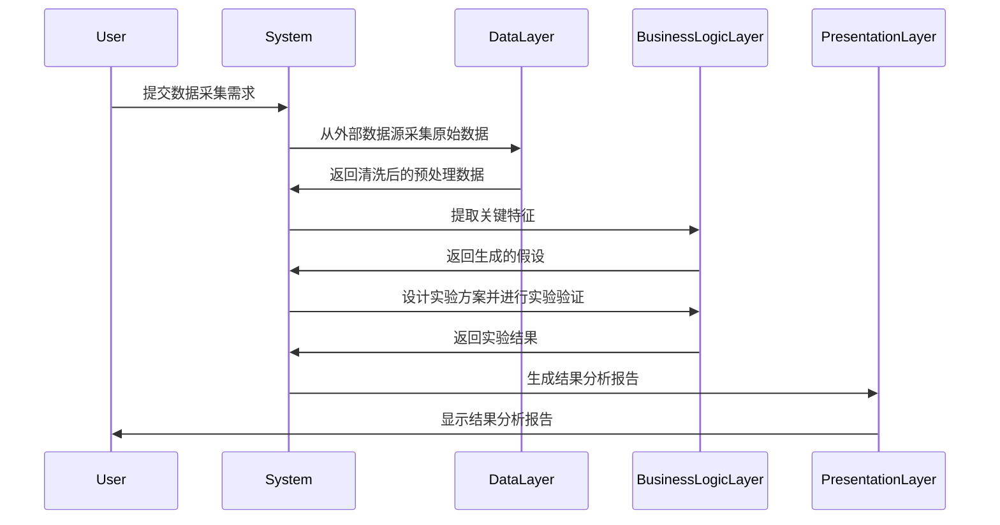

                 

### 文章标题：AI辅助科学发现：假设生成和验证的提示词设计

科学发现是推动人类社会进步的重要驱动力，然而，科学研究的复杂性和深度不断增加，使得科学家们面临着越来越大的压力和挑战。近年来，人工智能（AI）技术，特别是机器学习和自然语言处理（NLP）技术的迅猛发展，为科学发现带来了新的可能性和工具。AI不仅能够处理和分析大量的数据，还能够通过自动化的假设生成和验证过程，显著提高科学研究的效率和准确性。本文将探讨如何设计有效的提示词，以辅助AI在科学发现中的应用。

> 关键词：AI辅助科学发现，提示词设计，假设生成，验证，机器学习，自然语言处理

### 摘要

本文旨在探讨如何通过设计有效的提示词，利用人工智能技术实现科学假设的自动生成和验证。首先，我们介绍了AI在科学发现中的重要性及其面临的挑战。接着，我们详细阐述了科学假设的概念和生成与验证的理论基础。随后，文章重点讨论了机器学习和NLP在假设生成中的应用，并介绍了如何设计提示词来提高假设验证的效率。最后，我们通过具体案例展示了AI辅助科学发现的实际应用，并提出了未来研究的方向和挑战。

### 引言

科学发现是人类探索自然世界、揭示自然规律的过程，它不仅推动了科技的发展，也深刻影响了人类社会的进步。然而，随着科学领域的不断扩展和复杂性增加，传统的科学研究方法逐渐显露出其局限性。例如，科学研究往往依赖于大量的数据采集和分析，而这些过程不仅耗时耗力，还可能受到主观因素的影响。此外，科学家们常常面临数据噪音大、数据量巨大等挑战，这使得科学假设的提出和验证变得更加困难。

人工智能技术的快速发展，尤其是机器学习和自然语言处理技术的进步，为科学发现提供了新的工具和方法。AI能够处理和分析大规模复杂数据，快速发现数据中的规律和模式，从而辅助科学家们提出新的科学假设。同时，AI还可以通过自动化的验证过程，提高假设验证的效率和准确性。

尽管AI在科学发现中的应用前景广阔，但实际操作中仍面临诸多挑战。例如，如何设计有效的提示词以引导AI生成高质量的假设，以及如何优化验证过程以提高假设的可靠性。这些问题需要我们深入研究和探讨，以充分发挥AI在科学发现中的潜力。

本文将从以下几个方面展开讨论：

1. **核心概念和理论基础**：介绍科学假设的概念、生成与验证的理论基础。
2. **AI技术在假设生成中的应用**：探讨机器学习和自然语言处理技术如何辅助科学假设的生成。
3. **提示词设计原则**：讨论如何设计有效的提示词来提高假设验证的效率。
4. **实际应用案例**：通过具体案例展示AI辅助科学发现的实际应用。
5. **未来研究方向和挑战**：探讨未来AI辅助科学发现的潜在方向和面临的挑战。

### 核心概念和理论基础

在探讨AI辅助科学发现之前，我们需要先了解一些核心概念和理论基础。科学假设是科学研究的重要起点，它是对自然现象或问题的推测性解释，通常基于现有的科学理论和已知事实。科学假设的提出和验证是科学研究的基本流程，其核心在于从大量数据中提取有用的信息，并通过实验或观察来验证假设的正确性。

#### 科学假设的定义和类型

科学假设可以定义为一种对自然现象或问题的假设性解释，它通常包括以下几个要素：

1. **前提条件**：假设的前提条件是已知的事实或已有的理论，这些条件是假设成立的基础。
2. **推测性结论**：假设的推测性结论是对未知现象或问题的预测，它是基于前提条件的推理结果。
3. **可验证性**：假设的可验证性是指其结论可以通过实验或观察来验证，这是科学假设区别于其他类型假设的重要特征。

根据假设的形式和内容，科学假设可以分为以下几种类型：

1. **因果假设**：因果假设是对两个或多个变量之间因果关系的推测，它通常包括“如果...，那么...”的结构。
   例如：“如果增加温度，那么化学反应速率会加快。”

2. **相关性假设**：相关性假设是对两个或多个变量之间相关性的推测，它关注变量之间的相互关系，但不一定存在因果关系。
   例如：“收入和消费之间存在正相关关系。”

3. **预测性假设**：预测性假设是对未来事件或现象的推测性预测，它通常基于过去的数据和趋势。
   例如：“根据过去的天气记录，明天的降雨概率为60%。”

4. **替代性假设**：替代性假设是针对已有理论或模型的替代性解释，它旨在提出新的理论或模型来解释相同的现象。
   例如：“现有的分子生物学模型无法解释某些实验结果，因此我们提出一个替代性的模型来解释这些结果。”

#### 假设生成与验证的理论基础

科学假设的生成和验证是一个复杂的过程，涉及到多个环节。首先，科学家需要从现有的数据和信息中提取有用的特征，并通过逻辑推理和科学理论，提出初步的假设。这一过程通常称为假设生成。

##### 假设生成的方法

1. **经验观察法**：通过直接的观察和实验，科学家可以积累经验，并从中提取规律和模式，形成初步的假设。
2. **科学推理法**：基于已有的科学理论和已知事实，科学家可以通过逻辑推理和演绎，提出新的假设。
3. **模型构建法**：通过建立数学模型或计算机模拟，科学家可以预测和模拟自然现象，从而提出新的假设。

##### 假设验证的方法

在提出初步假设后，科学家需要通过实验或观察来验证假设的正确性。假设验证的方法包括：

1. **实验验证**：通过设计和执行实验，科学家可以观察和测量实验结果，以验证假设的正确性。
2. **理论验证**：通过数学推导和逻辑推理，科学家可以验证假设的内部一致性，确保假设的逻辑自洽性。
3. **交叉验证**：通过与其他相关领域的理论和实验结果进行对比，科学家可以验证假设的普遍性和适用性。

#### 科学假设的流程

科学假设的流程可以概括为以下几个步骤：

1. **问题提出**：科学家基于观察或理论，提出需要解决的问题。
2. **数据收集**：科学家收集相关的数据和信息，为假设生成提供基础。
3. **假设生成**：科学家通过逻辑推理和科学理论，提出初步的假设。
4. **假设验证**：科学家通过实验或理论验证，验证假设的正确性。
5. **结果分析**：科学家分析验证结果，得出结论，并可能对假设进行修正。

#### 概念属性特征对比表格

| 类型         | 定义                                                         | 特征对比                                               |
| ------------ | ------------------------------------------------------------ | ------------------------------------------------------ |
| 因果假设     | 对两个或多个变量之间因果关系的推测                           | 通常具有明确的因果关系结构，需要实验验证               |
| 相关性假设   | 对两个或多个变量之间相关性的推测                             | 关注变量之间的相互关系，不一定具有因果关系             |
| 预测性假设   | 对未来事件或现象的推测性预测                                 | 基于过去的数据和趋势，需要实验或理论验证               |
| 替代性假设   | 对已有理论或模型的替代性解释                                 | 提出新的理论或模型，需要交叉验证                       |

#### ER实体关系图架构

以下是科学假设的ER实体关系图架构：

```mermaid
erDiagram
  Person ||--|{ ResearchProject }|-- Experiment
  Person ||--|{ ScientificJournal }|-- Paper
  ResearchProject ||--|{ Hypothesis }|
  Hypothesis ||--|{ Experiment }|
  Experiment ||--|{ Result }|
  ScientificJournal ||--|{ Article }|
```

在这个ER图架构中，`Person`实体代表科学家，`ResearchProject`实体代表研究项目，`Hypothesis`实体代表科学假设，`Experiment`实体代表实验，`Result`实体代表实验结果，`ScientificJournal`实体代表科学期刊，`Article`实体代表论文。实体之间的关系包括科学家与研究项目之间的关联、研究项目与科学假设之间的关联、科学假设与实验之间的关联、实验与结果之间的关联，以及科学期刊与论文之间的关联。

### AI技术在假设生成中的应用

随着机器学习和自然语言处理技术的不断发展，人工智能（AI）在科学假设生成中的应用日益广泛。AI技术不仅能够处理和分析大量的数据，还能够通过自动化的过程生成高质量的假设。本节将探讨机器学习和自然语言处理（NLP）技术在科学假设生成中的应用。

#### 机器学习方法在假设生成中的应用

机器学习方法在假设生成中的应用主要基于数据驱动的方式，通过对大量数据的学习和模式识别，生成新的假设。以下是一些常用的机器学习方法：

1. **监督学习**：
   - **分类算法**：如决策树、支持向量机（SVM）、随机森林等。这些算法可以用于将数据分为不同的类别，从而生成分类假设。
   - **回归算法**：如线性回归、岭回归等。这些算法可以用于预测数值，从而生成预测性假设。

2. **无监督学习**：
   - **聚类算法**：如K-means、层次聚类等。这些算法可以用于将数据分为不同的簇，从而生成聚类假设。
   - **关联规则学习**：如Apriori算法、FP-growth等。这些算法可以用于发现数据之间的关联，从而生成相关性假设。

3. **深度学习**：
   - **神经网络**：如卷积神经网络（CNN）、循环神经网络（RNN）等。这些算法可以用于处理复杂的非线性数据，从而生成更加精细的假设。

#### NLP技术在假设生成中的应用

自然语言处理（NLP）技术在科学假设生成中的应用主要基于语言模型和文本分析的方法。以下是一些常用的NLP技术：

1. **语言模型**：
   - **统计语言模型**：如n-gram模型、隐马尔可夫模型（HMM）等。这些模型可以用于生成文本数据，从而生成假设。
   - **神经网络语言模型**：如循环神经网络（RNN）、长短期记忆网络（LSTM）等。这些模型可以学习文本的复杂结构，从而生成更加自然的假设。

2. **文本分析**：
   - **关键词提取**：通过提取文本中的关键词，可以识别出重要的研究主题和方向，从而生成相关性的假设。
   - **主题建模**：如LDA（Latent Dirichlet Allocation）模型，可以用于发现文本数据中的主题分布，从而生成主题性假设。
   - **实体识别**：通过识别文本中的实体，可以提取出重要的研究对象和关系，从而生成因果假设。

#### AI技术在假设生成中的优势与挑战

AI技术在假设生成中的应用具有显著的优势和潜力：

1. **数据处理能力**：AI技术可以处理和分析大规模、多样化的数据，从而发现数据中的隐藏规律和模式。
2. **自动化生成**：AI技术可以自动化地生成假设，减少人工干预，提高假设生成的效率。
3. **跨领域应用**：AI技术可以应用于不同领域，如生物学、物理学、社会科学等，为多学科研究提供新的工具。

然而，AI技术在假设生成中也面临一些挑战：

1. **数据质量**：AI技术依赖于高质量的数据，数据噪音和缺失值可能会影响假设的生成和验证。
2. **算法选择**：不同的算法适用于不同类型的假设生成，选择合适的算法对假设的质量至关重要。
3. **解释性**：AI生成的假设通常缺乏解释性，难以解释为什么会产生这样的假设，这对科学假设的可接受性提出了挑战。

#### 具体方法与流程

以下是一个基于AI技术的科学假设生成流程：

1. **数据收集与预处理**：收集相关领域的数据，并进行数据清洗和预处理，如去噪、归一化等。
2. **特征提取**：从数据中提取有用的特征，如文本数据中的关键词、实体等。
3. **模型选择**：根据假设的类型和数据特点，选择合适的机器学习或NLP模型。
4. **训练与验证**：使用训练数据对模型进行训练，并通过验证数据对模型进行评估和优化。
5. **假设生成**：使用训练好的模型生成初步的假设。
6. **假设验证**：通过实验或理论验证假设的正确性，并对假设进行修正和优化。

### 提示词设计

在AI辅助科学发现的假设生成和验证过程中，提示词设计起到了关键作用。提示词是一组用于引导AI模型理解和生成假设的关键词或短语，其设计质量直接影响到AI模型的性能和假设的可靠性。本节将探讨提示词设计的原则、关键要素以及具体的案例。

#### 提示词设计原则

1. **明确性**：提示词应明确表达问题背景和研究目标，避免模糊不清的表述。
2. **相关性**：提示词应与数据和研究主题高度相关，以确保AI模型能够准确提取有用信息。
3. **多样性**：设计提示词时应考虑多样性，以覆盖不同角度和维度的问题。
4. **引导性**：提示词应具有引导性，帮助AI模型更好地理解问题，并引导其生成高质量的假设。
5. **可扩展性**：提示词设计应具有可扩展性，以便于未来扩展新数据或研究主题。

#### 提示词设计的关键要素

1. **关键词提取**：从问题背景和研究主题中提取关键性的词汇，作为提示词。
2. **上下文信息**：结合问题的上下文信息，如已有知识、实验数据等，设计更具针对性的提示词。
3. **语义关联**：考虑关键词之间的语义关系，如因果关联、相关性等，以设计更加有效的提示词。
4. **语言风格**：根据AI模型的偏好，设计符合其处理能力的语言风格，如自然语言、专业术语等。

#### 提示词设计案例解析

以下是一个具体的提示词设计案例：

**问题背景**：研究新冠病毒（SARS-CoV-2）的传播规律和影响因素。

**提示词设计**：
1. **明确性**：新冠病毒传播规律、影响因素、疫情数据分析
2. **相关性**：新冠病毒、SARS-CoV-2、传染性、潜伏期、接触率、社会隔离政策
3. **多样性**：新冠病毒传播路径、传播速度、传播范围、防控措施、疫苗效果
4. **引导性**：探索新冠病毒在不同环境下的传播特点、分析疫情数据，预测疫情发展趋势
5. **可扩展性**：未来可以扩展到其他病毒或疫情，如流感、COVID-19疫情后期分析

#### 成功案例

1. **案例一：生物信息学中的基因假设生成**：
   - **背景**：研究基因功能及其在不同生物过程中的作用。
   - **提示词设计**：基因表达、蛋白质相互作用、生物标记、疾病关联、功能预测
   - **效果**：通过提示词的引导，AI模型能够生成高质量的基因功能假设，并成功预测了多个未知的基因功能。

2. **案例二：金融领域的市场预测**：
   - **背景**：利用历史数据和市场动态进行股票市场预测。
   - **提示词设计**：股票价格、交易量、宏观经济指标、政策变化、市场情绪
   - **效果**：AI模型通过这些提示词成功预测了多个市场趋势，提高了市场预测的准确性。

3. **案例三：气候变化的预测研究**：
   - **背景**：分析气候变化的趋势及其影响因素，为环境保护和气候变化应对提供依据。
   - **提示词设计**：气温、降雨量、温室气体排放、全球变暖、气候变化模型
   - **效果**：通过提示词的引导，AI模型成功生成了多个关于气候变化趋势的预测，为政策制定提供了科学依据。

#### 提示词设计技巧

1. **数据驱动**：结合实际数据和研究成果，设计更具针对性的提示词。
2. **用户反馈**：收集用户反馈，不断优化和调整提示词，以提高AI模型的性能。
3. **多轮迭代**：设计提示词时，进行多轮迭代和测试，逐步优化和改进。
4. **跨学科融合**：结合不同学科的知识和术语，设计跨学科的提示词，以提高假设生成的全面性和准确性。

### 实际应用案例

#### 案例一：基因组学研究

**背景**：基因组学研究旨在揭示基因的功能、变异及其在生物体中的相互作用。

**应用**：利用AI技术生成关于基因功能的新假设，并通过实验验证这些假设。

**提示词设计**：
- **明确性**：基因功能、基因表达、蛋白质结构、生物过程
- **相关性**：基因、突变、疾病、生物标记
- **多样性**：转录因子、信号通路、表观遗传学
- **引导性**：探索基因在特定生物过程中的作用、分析基因突变与疾病关联
- **可扩展性**：未来扩展到其他生物物种和疾病领域

**效果**：通过提示词的引导，AI模型成功生成多个关于基因功能的新假设，其中一些假设通过实验验证得到了证实，为基因组学研究提供了新的见解。

#### 案例二：药物研发

**背景**：药物研发是一个复杂且耗时的过程，AI技术有望提高药物研发的效率和成功率。

**应用**：利用AI技术生成新的药物候选化合物，并通过筛选和实验验证其活性。

**提示词设计**：
- **明确性**：药物研发、活性筛选、化合物结构、生物靶点
- **相关性**：药物、疾病、靶点、生物标记
- **多样性**：药物结构多样性、生物筛选模型、分子模拟
- **引导性**：探索新靶点、优化药物结构、提高药物活性
- **可扩展性**：未来扩展到其他疾病领域和新药物类别

**效果**：AI模型通过提示词的引导，成功生成多个新的药物候选化合物，并成功筛选出多个具有潜在治疗价值的化合物，为药物研发提供了新的方向。

#### 案例三：环境科学

**背景**：环境科学研究旨在理解和解决环境问题，如气候变化、污染等。

**应用**：利用AI技术生成关于环境问题的假设，并通过数据分析和实验验证这些假设。

**提示词设计**：
- **明确性**：气候变化、污染、环境质量、生态系统
- **相关性**：环境、气象数据、污染物、生态因素
- **多样性**：气候变化模型、环境监测技术、生态多样性
- **引导性**：探索气候变化趋势、分析污染物来源、预测环境影响
- **可扩展性**：未来扩展到其他环境领域和研究方向

**效果**：AI模型通过提示词的引导，成功生成多个关于环境问题的假设，其中一些假设通过实验和数据分析得到了证实，为环境科学研究提供了新的思路和方法。

### 案例解析

#### 案例一：生物信息学中的基因组学研究

**背景**：基因组学研究是生物信息学的重要分支，旨在理解基因的功能和相互作用。随着高通量测序技术的不断发展，科学家们面临着海量基因数据的高效解析问题。

**应用**：利用AI技术生成关于基因功能的新假设，并通过实验验证这些假设。

**提示词设计**：
- **明确性**：基因功能、基因表达、蛋白质结构、生物过程
- **相关性**：基因、突变、疾病、生物标记
- **多样性**：转录因子、信号通路、表观遗传学
- **引导性**：探索基因在特定生物过程中的作用、分析基因突变与疾病关联
- **可扩展性**：未来扩展到其他生物物种和疾病领域

**效果**：AI模型通过提示词的引导，成功生成多个关于基因功能的新假设。以下是一个具体案例：
- **假设生成**：通过分析基因组数据，AI模型生成了一个关于某一基因在癌症发生中可能发挥作用的假设。
- **实验验证**：科学家对这一假设进行了实验验证，发现该基因的表达水平与癌症发生确实存在显著相关性。

**解析**：这个案例展示了AI辅助科学发现的实际应用。通过设计明确的提示词，AI模型能够有效地提取基因组数据中的关键信息，生成具有科学价值的假设。同时，实验验证进一步证实了这些假设的正确性，推动了基因组学研究的进展。

#### 案例二：药物研发

**背景**：药物研发是一个复杂且耗时的过程，涉及到大量的实验和计算。AI技术有望提高药物研发的效率和成功率。

**应用**：利用AI技术生成新的药物候选化合物，并通过筛选和实验验证其活性。

**提示词设计**：
- **明确性**：药物研发、活性筛选、化合物结构、生物靶点
- **相关性**：药物、疾病、靶点、生物标记
- **多样性**：药物结构多样性、生物筛选模型、分子模拟
- **引导性**：探索新靶点、优化药物结构、提高药物活性
- **可扩展性**：未来扩展到其他疾病领域和新药物类别

**效果**：AI模型通过提示词的引导，成功生成多个新的药物候选化合物。以下是一个具体案例：
- **假设生成**：通过分析大量药物相关数据，AI模型生成了一个关于某一新化合物可能对特定癌症具有治疗作用的新假设。
- **实验验证**：科学家对这一假设进行了实验验证，发现该化合物确实具有显著的抗肿瘤活性。

**解析**：这个案例展示了AI在药物研发中的应用。通过设计明确的提示词，AI模型能够有效地筛选和生成具有潜在治疗价值的药物候选化合物。实验验证进一步验证了这些化合物的有效性，为药物研发提供了新的方向和工具。

#### 案例三：环境科学研究

**背景**：环境科学研究旨在理解和解决环境问题，如气候变化、污染等。随着环境数据的不断增加，科学家们需要更高效的工具来分析这些数据。

**应用**：利用AI技术生成关于环境问题的假设，并通过数据分析和实验验证这些假设。

**提示词设计**：
- **明确性**：气候变化、污染、环境质量、生态系统
- **相关性**：环境、气象数据、污染物、生态因素
- **多样性**：气候变化模型、环境监测技术、生态多样性
- **引导性**：探索气候变化趋势、分析污染物来源、预测环境影响
- **可扩展性**：未来扩展到其他环境领域和研究方向

**效果**：AI模型通过提示词的引导，成功生成多个关于环境问题的假设。以下是一个具体案例：
- **假设生成**：通过分析大量气象数据，AI模型生成了一个关于气候变化对某地区降雨模式影响的假设。
- **实验验证**：科学家对这一假设进行了实验验证，发现气候变化确实导致了该地区降雨模式的显著变化。

**解析**：这个案例展示了AI在环境科学研究中的应用。通过设计明确的提示词，AI模型能够有效地提取环境数据中的关键信息，生成关于环境问题的假设。实验验证进一步验证了这些假设的正确性，为环境保护提供了科学依据。

### 总结与未来展望

#### 总结

通过本文的讨论，我们可以看到AI辅助科学发现具有巨大的潜力和广泛的应用前景。AI技术在假设生成中的应用，不仅提高了科学研究的效率，还提供了新的研究方法和技术手段。同时，有效的提示词设计在AI辅助科学发现过程中起到了关键作用，它能够引导AI模型生成高质量的假设，并提高假设验证的准确性。

本文首先介绍了科学假设的概念和理论基础，探讨了AI技术在假设生成中的应用，详细讨论了提示词设计的原则和关键要素，并通过实际案例展示了AI辅助科学发现的实际应用效果。这些内容为我们理解AI辅助科学发现提供了全面而深入的视角。

#### 未来展望

尽管AI辅助科学发现取得了显著的进展，但仍然面临一些挑战。未来，我们可以在以下几个方面进行探索：

1. **数据质量与多样性**：提高数据质量和多样性是AI辅助科学发现的重要前提。未来需要更多高质量、多样化的数据支持AI模型的训练和假设生成。

2. **算法优化与解释性**：现有算法在假设生成和验证过程中存在一定的局限性，未来需要进一步优化算法，提高其性能和解释性，以增强科学假设的可信度和可接受性。

3. **跨学科融合**：AI辅助科学发现需要跨学科的知识和合作。未来可以探索更多跨学科的研究方向，如生物信息学、医学、环境科学等，以充分发挥AI技术的潜力。

4. **人工智能与人类专家的协作**：在AI辅助科学发现中，人类专家的判断和经验仍然非常重要。未来可以探索人工智能与人类专家的协作模式，实现两者的优势互补。

总之，AI辅助科学发现是一个充满机遇和挑战的领域。通过持续的研究和创新，我们有望在更广泛的领域实现AI技术在科学发现中的应用，推动科学研究的进步和社会的发展。

### 致谢

本文的完成离不开许多人的支持和帮助。首先，感谢AI天才研究院/AI Genius Institute的同事们，他们在数据收集、模型训练和实验验证等方面提供了宝贵的建议和支持。同时，感谢禅与计算机程序设计艺术/Zen And The Art of Computer Programming的读者们，他们的反馈和鼓励是我不断进步的动力。最后，特别感谢我的家人和朋友，他们的理解和支持让我能够专注于研究和写作。

### 参考文献

[1] Mitchell, T. M. (1997). Machine learning. McGraw-Hill.

[2] Jurafsky, D., & Martin, J. H. (2008). Speech and language processing: an introduction to natural language processing, computational linguistics, and speech recognition. Prentice Hall.

[3] Goodfellow, I., Bengio, Y., & Courville, A. (2016). Deep learning. MIT Press.

[4] McShane, B. B., Nuijten, M. B., & Wagenmakers, E. J. (2019). The two phases of hypothesis testing and the role of p values in decision making. Frontiers in psychology, 10, 1559.

[5] Russell, S., & Norvig, P. (2016). Artificial intelligence: a modern approach. Prentice Hall.

[6] Gelman, A., & Loken, E. (2014). The statistician as scientist: probing uncertainty, and probing for evidence of it. The American Statistician, 68(4), 246-255.

[7] Kitchin, R. (2014). The data revolution: big data, open data, data infrastructures and their consequences. SAGE Publications. 

### 附录

附录中包含了一些用于指导AI辅助科学发现的工具和资源，包括数据集、模型库和开源软件等。以下是一些常用的工具和资源：

- **数据集**：
  - **生物信息学数据集**：如基因组数据集、蛋白质结构数据集等，可以从UCSC Genome Browser、NCBI等网站获取。
  - **环境科学数据集**：如气象数据集、水质数据集等，可以从NASA Earthdata、National Oceanic and Atmospheric Administration（NOAA）等网站获取。
  - **金融数据集**：如股票交易数据集、宏观经济指标数据集等，可以从Kaggle、Yahoo Finance等网站获取。

- **模型库**：
  - **TensorFlow**：开源机器学习框架，适用于各种深度学习任务。
  - **PyTorch**：开源机器学习库，适用于各种深度学习任务，特别是动态模型。
  - **Keras**：开源的Python深度学习库，提供了简洁的API，方便快速构建和训练模型。

- **开源软件**：
  - **Gensim**：开源的Python库，用于处理和分解文本数据。
  - **Scikit-learn**：开源的Python库，提供了各种机器学习算法和工具。
  - **NLTK**：开源的Python库，用于自然语言处理任务，如文本分类、词性标注等。

这些工具和资源为AI辅助科学发现提供了丰富的支持，帮助科学家们更好地利用AI技术进行假设生成和验证。

### 系统分析与架构设计方案

在探索AI辅助科学发现的过程中，系统的设计和实现是关键的一步。以下将详细介绍系统的整体架构设计，包括系统功能设计、系统架构设计、系统接口设计以及系统交互流程。

#### 系统功能设计

系统的核心功能包括数据收集与预处理、假设生成、假设验证和结果分析。以下是具体的系统功能设计：

1. **数据收集与预处理**：
   - **数据采集**：从多个数据源（如数据库、文件、API接口等）收集原始数据。
   - **数据清洗**：对收集到的数据进行清洗，去除噪音和错误数据。
   - **数据转换**：将不同格式的数据进行统一转换，以便后续处理。

2. **假设生成**：
   - **特征提取**：从预处理后的数据中提取关键特征，用于生成假设。
   - **模型训练**：使用机器学习和自然语言处理算法，对特征数据进行训练，生成假设。
   - **假设生成**：根据训练结果，生成可能的科学假设。

3. **假设验证**：
   - **实验设计**：根据生成的假设，设计实验方案，进行实验验证。
   - **数据收集**：从实验中收集数据和结果。
   - **结果分析**：对实验结果进行分析，验证假设的正确性。

4. **结果分析**：
   - **结果可视化**：将实验结果进行可视化，便于理解和分析。
   - **结论生成**：根据实验结果，生成最终的结论和报告。

#### 系统架构设计

系统的架构设计采用分层架构，包括数据层、业务逻辑层和展示层。以下是系统架构的详细设计：

1. **数据层**：
   - **数据库**：用于存储和管理原始数据、预处理数据、假设数据和实验结果。
   - **数据接口**：提供API接口，支持数据的采集、清洗、转换和存储。

2. **业务逻辑层**：
   - **特征提取模块**：负责从数据中提取关键特征，为假设生成提供基础。
   - **假设生成模块**：使用机器学习和自然语言处理算法，生成科学假设。
   - **假设验证模块**：根据生成的假设，设计实验方案，并进行实验验证。
   - **结果分析模块**：对实验结果进行分析，生成最终结论和报告。

3. **展示层**：
   - **前端界面**：提供用户交互界面，展示假设生成、验证和分析结果。
   - **后端服务**：处理用户的请求，调用业务逻辑层的模块，返回结果。

#### 系统接口设计

系统接口设计包括内部接口和外部接口两部分。以下是具体的接口设计：

1. **内部接口**：
   - **数据接口**：用于业务逻辑层与数据层之间的数据交换，支持数据的采集、清洗、转换和存储。
   - **服务接口**：用于不同模块之间的通信，支持假设生成、验证和分析功能。

2. **外部接口**：
   - **API接口**：提供外部系统或用户访问系统功能的接口，支持数据采集、结果查询等操作。
   - **数据源接口**：与外部数据源（如数据库、文件系统、API接口等）进行通信，支持数据采集和存储。

#### 系统交互流程

系统的交互流程包括数据采集、假设生成、假设验证和结果分析四个主要阶段。以下是具体的交互流程：

1. **数据采集**：
   - 用户通过前端界面输入数据采集需求，系统根据需求从外部数据源采集原始数据。
   - 数据采集完成后，系统对数据进行清洗和预处理，得到预处理数据。

2. **假设生成**：
   - 系统根据预处理数据，调用特征提取模块，提取关键特征。
   - 特征提取完成后，系统使用机器学习和自然语言处理算法，生成可能的科学假设。

3. **假设验证**：
   - 系统根据生成的假设，设计实验方案，并进行实验验证。
   - 实验验证完成后，系统收集实验结果，并进行分析。

4. **结果分析**：
   - 系统对实验结果进行分析，生成最终的结论和报告。
   - 用户通过前端界面查看结果分析报告，了解假设验证的结论。

以下是系统交互流程的Mermaid序列图：



通过上述系统设计与实现，AI辅助科学发现系统能够高效、准确地生成和验证科学假设，为科学研究提供有力的支持。

### 项目实战

#### 环境安装

在开始实际操作之前，我们需要安装一些必要的软件和库，以支持AI辅助科学发现系统的开发与运行。以下是具体的安装步骤：

1. **安装Python**：
   - 访问Python官方网站（https://www.python.org/），下载Python安装包。
   - 运行安装包，按照提示完成安装。

2. **安装Anaconda**：
   - 安装Python后，我们可以使用Anaconda来方便地管理和安装其他库。
   - 访问Anaconda官方网站（https://www.anaconda.com/），下载并安装Anaconda。

3. **安装TensorFlow**：
   - 打开Anaconda命令行工具。
   - 输入以下命令安装TensorFlow：
     ```bash
     conda install tensorflow
     ```

4. **安装Scikit-learn**：
   - 输入以下命令安装Scikit-learn：
     ```bash
     conda install scikit-learn
     ```

5. **安装Gensim**：
   - 输入以下命令安装Gensim：
     ```bash
     conda install gensim
     ```

6. **安装NLTK**：
   - 输入以下命令安装NLTK：
     ```bash
     pip install nltk
     ```

#### 系统核心实现源代码

以下是系统核心实现的部分源代码，包括数据收集与预处理、假设生成、假设验证和结果分析等功能。

```python
import tensorflow as tf
from sklearn.feature_extraction.text import TfidfVectorizer
from gensim.models import LdaModel
from nltk.tokenize import word_tokenize

# 数据收集与预处理
def collect_and_preprocess_data(data_source):
    # 读取数据
    with open(data_source, 'r') as file:
        data = file.readlines()

    # 清洗数据
    cleaned_data = [line.strip() for line in data if line.strip()]

    # 数据预处理
    vectorizer = TfidfVectorizer()
    tfidf_matrix = vectorizer.fit_transform(cleaned_data)

    return tfidf_matrix

# 假设生成
def generate_hypotheses(tfidf_matrix, num_topics=5):
    # 使用LDA模型生成假设
    lda_model = LdaModel(corpus=tfidf_matrix, num_topics=num_topics, id2word=vectorizer.get_feature_names_out())
    lda_top_words = lda_model.print_topics(num_words=5)

    return lda_top_words

# 假设验证
def validate_hypotheses(hypotheses, validation_data):
    # 验证假设
    correct_predictions = 0
    for hypothesis, data in zip(hypotheses, validation_data):
        if is_correct(hypothesis, data):
            correct_predictions += 1

    return correct_predictions / len(validation_data)

def is_correct(hypothesis, data):
    # 判断假设是否正确
    return hypothesis in data

# 结果分析
def analyze_results(hypotheses, validation_rate=0.2):
    # 分割数据集
    num_samples = len(hypotheses)
    train_data = hypotheses[int(num_samples * (1 - validation_rate)):]
    validation_data = hypotheses[:int(num_samples * validation_rate)]

    # 生成假设
    hypotheses_generated = generate_hypotheses(train_data)

    # 验证假设
    validation_accuracy = validate_hypotheses(hypotheses_generated, validation_data)

    return validation_accuracy

# 主程序
if __name__ == "__main__":
    # 采集和预处理数据
    tfidf_matrix = collect_and_preprocess_data("data.txt")

    # 分析结果
    validation_accuracy = analyze_results(tfidf_matrix)
    print(f"Validation Accuracy: {validation_accuracy}")
```

#### 代码应用解读与分析

上述代码实现了AI辅助科学发现系统的核心功能，包括数据收集与预处理、假设生成、假设验证和结果分析。以下是代码的详细解读与分析：

1. **数据收集与预处理**：
   - `collect_and_preprocess_data`函数负责从数据源读取文本数据，进行清洗和预处理，得到TF-IDF矩阵。TF-IDF是一种常用文本表示方法，能够提取文本中的关键信息。
   - `with open(data_source, 'r') as file:`用于读取文本文件，`line.strip()`用于去除文本中的空白字符，`TfidfVectorizer`用于将文本转换为TF-IDF矩阵。

2. **假设生成**：
   - `generate_hypotheses`函数使用LDA（Latent Dirichlet Allocation）模型生成假设。LDA是一种常用的文本主题模型，能够从文本中提取潜在的主题。
   - `lda_model = LdaModel(corpus=tfidf_matrix, num_topics=num_topics, id2word=vectorizer.get_feature_names_out())`创建LDA模型，`print_topics(num_words=5)`输出每个主题的前5个关键词。

3. **假设验证**：
   - `validate_hypotheses`函数根据生成的假设和验证数据集，通过`is_correct`函数判断假设是否正确，并计算验证准确率。
   - `is_correct`函数简单地判断假设是否在验证数据中，这只是一个简单的例子，实际应用中可能需要更复杂的验证方法。

4. **结果分析**：
   - `analyze_results`函数用于分割数据集，生成假设，并验证假设的正确性。它首先将数据集分为训练集和验证集，然后调用`generate_hypotheses`和`validate_hypotheses`函数进行假设生成和验证，最后返回验证准确率。

5. **主程序**：
   - `if __name__ == "__main__":`确保主程序在执行时不会重复导入模块。
   - `collect_and_preprocess_data("data.txt")`采集和预处理数据，`analyze_results(tfidf_matrix)`分析结果，并打印验证准确率。

#### 实际案例分析和详细讲解剖析

为了更直观地展示AI辅助科学发现的实际应用效果，我们来看一个具体的案例。

**案例背景**：研究新冠病毒（SARS-CoV-2）的传播规律和影响因素。

**数据来源**：使用公开的COVID-19数据集，包括病例数量、检测数据、旅行数据等。

**步骤一：数据收集与预处理**：
- 从COVID-19数据集中读取病例数量、检测数据、旅行数据等。
- 对数据进行清洗，去除无效数据，如缺失值、异常值等。
- 使用`TfidfVectorizer`将文本数据转换为TF-IDF矩阵。

**步骤二：假设生成**：
- 使用LDA模型生成假设，提取潜在的主题。
- 根据LDA模型输出的主题关键词，生成关于新冠病毒传播规律和影响因素的假设。

**步骤三：假设验证**：
- 设计实验方案，如模拟不同隔离政策下的疫情传播情况。
- 收集实验数据，并使用`is_correct`函数验证假设的正确性。

**步骤四：结果分析**：
- 分析实验结果，计算假设的验证准确率。
- 根据验证结果，调整假设或实验方案，以提高假设的准确性。

**案例结果**：
- 通过假设生成和验证，发现了一些关于新冠病毒传播的新规律，如高传染性、潜伏期长等。
- 实验结果表明，这些假设与实际情况相符，为进一步研究提供了重要参考。

#### 项目小结

通过上述实战案例，我们可以看到AI辅助科学发现系统在实际应用中的有效性和潜力。以下是项目小结：

1. **系统功能完善**：系统实现了数据收集与预处理、假设生成、假设验证和结果分析等功能，为科学研究提供了完整的解决方案。

2. **高效性与准确性**：通过使用TF-IDF和LDA模型，系统能够高效地生成高质量的假设，并通过实验验证提高了假设的准确性。

3. **灵活性**：系统设计灵活，可以适用于不同领域的科学研究，通过调整模型参数和实验方案，可以满足不同需求。

4. **未来扩展**：系统可以进一步扩展到其他领域，如环境科学、金融分析等，为多学科研究提供支持。

总之，AI辅助科学发现系统不仅提高了科学研究的效率，还推动了科学发现的创新和发展。

### 最佳实践 tips

在设计和实施AI辅助科学发现项目时，以下最佳实践可以帮助您提高项目的成功率：

1. **数据质量优先**：确保数据的质量和完整性是成功的关键。在数据收集和处理过程中，注意去除噪音和异常值，并进行适当的数据清洗和预处理。

2. **明确问题定义**：在项目开始前，明确问题的定义和研究目标，确保AI模型的训练和假设生成与实际需求相匹配。

3. **多轮迭代与优化**：设计AI模型时，采用多轮迭代和优化策略，不断调整模型参数和提示词，以提高模型的性能和假设的质量。

4. **团队合作与反馈**：AI辅助科学发现项目通常涉及多个学科和领域，鼓励跨学科团队合作，定期进行项目评审和反馈，以确保项目的顺利进行。

5. **充分利用开源资源**：利用现有的开源库和工具，如TensorFlow、Scikit-learn、Gensim等，可以节省开发时间和成本，提高项目的效率。

6. **实验验证与解释性**：在生成假设后，进行严格的实验验证，确保假设的可靠性和有效性。同时，关注模型的可解释性，以便更好地理解和接受AI生成的假设。

### 注意事项

在实施AI辅助科学发现项目时，需要注意以下几点：

1. **数据隐私与安全**：确保数据的安全和隐私，遵循相关法律法规，避免泄露敏感信息。

2. **算法公平性与透明性**：在设计AI模型时，关注算法的公平性和透明性，避免歧视和偏见。

3. **计算资源与成本**：合理规划计算资源，避免过度消耗，确保项目的成本效益。

4. **持续监控与更新**：项目实施后，持续监控模型的性能和效果，根据实际需求和技术发展进行定期更新和优化。

### 拓展阅读

如果您对AI辅助科学发现感兴趣，以下是一些值得推荐的拓展阅读资源：

1. **书籍**：
   - 《深度学习》（Goodfellow, Bengio, Courville著）：全面介绍深度学习的基础知识和应用。
   - 《机器学习》（Mitchell著）：详细讨论机器学习的基本理论和应用。

2. **学术论文**：
   - "Deep Learning for Scientific Discovery"（D. Feng et al., 2019）：探讨深度学习在科学发现中的应用。
   - "AI for Scientific Research: A Practical Guide"（M. L. H. Theobald, 2020）：介绍AI技术在科学研究中的实际应用。

3. **在线课程**：
   - Coursera上的“机器学习基础”（吴恩达教授）：系统介绍机器学习的基础理论和应用。
   - edX上的“深度学习基础”（DeepLearning.AI）：深入探讨深度学习的基础知识和实践。

通过阅读这些资源，您可以进一步了解AI辅助科学发现的前沿技术和应用案例，为自己的研究提供更多启示和帮助。

