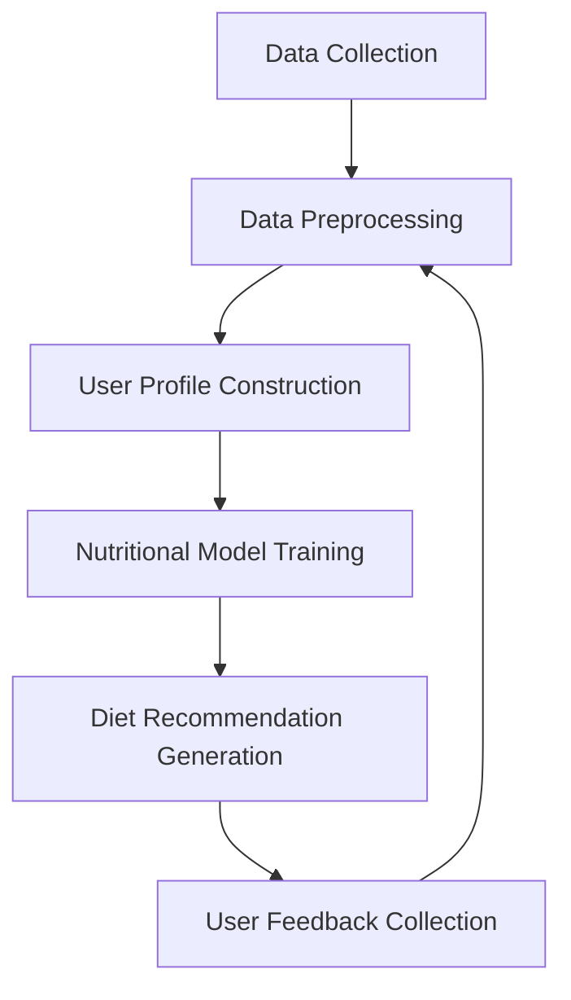
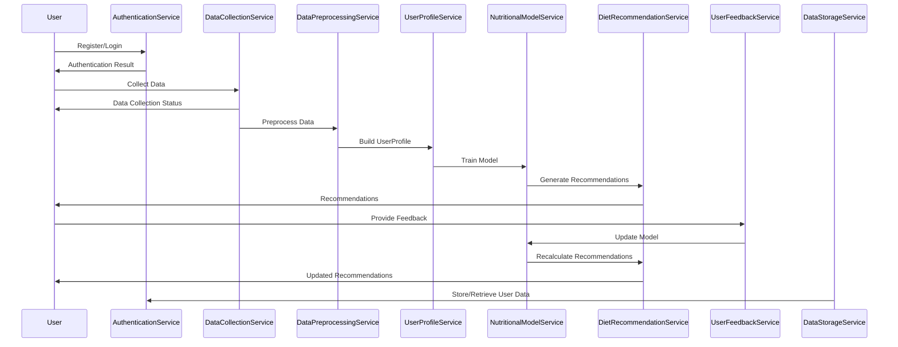

                 


### 第一部分：背景介绍与核心概念

## 第1章：AI辅助营养规划概述

### 1.1 问题背景

在当今社会，随着人们生活水平的提升，营养与健康问题日益受到关注。全球范围内，慢性病如肥胖、糖尿病、心血管疾病等与不良饮食习惯密切相关。个性化饮食需求也随之增长，每个人因为生活习惯、身体状况、工作压力等因素，对于营养的需求各不相同。传统的营养规划方法往往缺乏针对性，难以满足个体差异，因此，利用AI技术实现个性化营养规划成为一种必然趋势。

### 1.2 问题描述

如何利用AI技术为个体提供精准的饮食建议，是当前研究的热点问题。传统的营养学方法通常依赖于经验公式和一般性指导原则，而AI技术可以通过大数据分析和机器学习算法，对海量营养数据进行深度挖掘，从而实现个性化营养规划。这包括但不限于以下问题：

- **用户数据收集**：如何高效地收集用户的健康数据和饮食习惯数据？
- **数据预处理**：如何清洗和整合这些复杂多样的数据，使其适用于机器学习模型？
- **用户画像构建**：如何根据用户数据构建详细的用户画像，以用于个性化推荐？
- **营养模型训练**：如何设计并训练能够准确预测营养需求的AI模型？
- **饮食建议生成**：如何基于AI模型为用户生成科学、合理的饮食建议？
- **用户反馈循环**：如何根据用户反馈调整和优化饮食建议，实现持续改进？

### 1.3 问题解决

AI辅助营养规划的核心在于利用机器学习和深度学习技术，对用户的数据进行深入分析，并提供个性化的营养建议。具体步骤如下：

1. **数据收集**：通过移动设备、可穿戴设备等，收集用户的体重、身高、年龄、活动水平、饮食习惯等数据。
2. **数据预处理**：对收集到的数据进行分析，去除噪声，填充缺失值，进行特征选择，最终形成适合机器学习模型训练的数据集。
3. **用户画像构建**：基于用户数据，构建包括基本健康信息、饮食习惯、营养需求等多维度的用户画像。
4. **营养模型训练**：使用深度学习算法，如神经网络，对用户画像和营养数据进行训练，构建个性化营养模型。
5. **饮食建议生成**：将用户画像输入到营养模型中，生成个性化的饮食建议。
6. **用户反馈循环**：收集用户对饮食建议的反馈，用于模型优化和进一步调整建议。

### 1.4 边界与外延

AI辅助营养规划不仅涉及到营养学的基础概念，如蛋白质、脂肪、碳水化合物的分类和作用，还涉及到人工智能领域中的机器学习、深度学习和自然语言处理等技术。此外，个性化饮食建议的适用范围和限制也是一个重要的讨论点：

- **适用范围**：适用于对健康有特殊需求的人群，如运动员、老年人、病人等。
- **限制**：个性化营养规划可能受到数据质量、算法精度等因素的限制，且不能完全取代专业营养师的建议。

### 1.5 概念结构与核心要素组成

AI辅助营养规划涉及多个核心概念和要素，包括数据收集、数据预处理、用户画像构建、营养模型训练、饮食建议生成和用户反馈循环。以下是一个简化的概念结构图：

```mermaid
conceptDiagram
    Concept[data collection]
    Concept[data preprocessing]
    Concept[user profile construction]
    Concept[nutritional model training]
    Concept[diet recommendation generation]
    Concept[user feedback loop]
    Concept[data collection] --|> Concept[data preprocessing]
    Concept[data preprocessing] --|> Concept[user profile construction]
    Concept[user profile construction] --|> Concept[nutritional model training]
    Concept[nutritional model training] --|> Concept[diet recommendation generation]
    Concept[diet recommendation generation] --|> Concept[user feedback loop]
```

- **数据收集**：收集用户的健康数据和饮食习惯数据。
- **数据预处理**：清洗和整合数据，去除噪声，填充缺失值。
- **用户画像构建**：根据数据构建用户的营养需求画像。
- **营养模型训练**：使用机器学习算法训练营养模型。
- **饮食建议生成**：根据用户画像和营养模型生成饮食建议。
- **用户反馈循环**：收集用户反馈，用于模型优化和饮食建议调整。

### 1.6 小结

AI辅助营养规划是一项结合了营养学和人工智能技术的前沿应用。通过个性化数据分析、营养模型训练和饮食建议生成，AI技术有望为个体提供更加精准和个性化的营养指导，从而提高公众健康水平。然而，这一过程仍面临诸多挑战，需要进一步研究和优化。

## 第2章：核心概念与联系

### 2.1 AI基础概念

AI（人工智能）是一个广泛的领域，涉及多个分支和技术。以下是对AI中几个核心概念的简要介绍：

- **机器学习（Machine Learning）**：机器学习是AI的一个分支，通过使用算法从数据中学习，并对新数据进行预测或决策。它包括监督学习、无监督学习和强化学习等方法。
- **深度学习（Deep Learning）**：深度学习是机器学习的一个子领域，它使用多层神经网络来模拟人脑的工作方式，从而实现复杂的特征提取和模式识别。
- **人工智能（Artificial Intelligence）**：人工智能是指使计算机系统能够执行通常需要人类智能的任务，如理解语言、识别图像、解决问题等。

### 2.2 营养学基础概念

营养学是研究食物与营养素对人体健康的影响的学科。以下是几个关键概念：

- **蛋白质（Protein）**：蛋白质是构成细胞和组织的基本物质，参与身体的修复和生长。它们是氨基酸的聚合物，包括完全蛋白质（如牛奶、鸡蛋）、不完全蛋白质（如豆类）等。
- **脂肪（Fat）**：脂肪是能量的重要来源，同时也参与细胞膜的构建和激素的合成。它们分为饱和脂肪和不饱和脂肪，其中不饱和脂肪对心脏健康更为有利。
- **碳水化合物（Carbohydrate）**：碳水化合物是身体的主要能量来源，分为简单碳水化合物（如糖）和复合碳水化合物（如淀粉）。过量摄入简单碳水化合物可能导致肥胖和糖尿病。

### 2.3 概念属性特征对比表格

以下是对机器学习、深度学习和蛋白质、脂肪、碳水化合物在属性特征上的对比：

| 概念       | 属性特征                 | 对比说明                                   |
|------------|-------------------------|------------------------------------------|
| 机器学习   | 自适应、预测、决策       | 使用数据学习模式，对数据进行分析           |
| 深度学习   | 自动特征提取、多层网络   | 通过多层神经网络进行复杂特征提取和模式识别 |
| 蛋白质     | 构成细胞、修复组织       | 重要的氨基酸聚合物，参与身体修复           |
| 脂肪       | 提供能量、构建细胞膜     | 是能量的重要来源，参与细胞功能           |
| 碳水化合物 | 提供能量、控制血糖       | 主要的能量来源，影响血糖水平             |

### 2.4 ER实体关系图架构

以下是一个简化的ER（实体关系）图，展示了与AI辅助营养规划相关的几个核心实体及其关系：

```mermaid
erDiagram
    User ||--|{ DietPlan }|:
    User ||--|{ FoodItem }|:
    User ||--|{ Nutrient }|:
    DietPlan ||--|{ Nutrient }|:
    FoodItem ||--|{ Nutrient }|:
```

- **User**：用户，表示被提供个性化营养建议的人。
- **DietPlan**：饮食计划，根据用户的营养需求生成的饮食建议。
- **FoodItem**：食品项目，饮食计划中的具体食品。
- **Nutrient**：营养素，如蛋白质、脂肪、碳水化合物等，是食品项目中的成分。

### 2.5 小结

通过对比AI基础概念和营养学基础概念，我们可以看到，虽然它们来自不同的学科，但都涉及到数据的收集、处理和模型的应用。这种跨学科的整合为AI辅助营养规划提供了坚实的基础，同时也揭示了在AI和营养学之间建立更紧密联系的重要性。

## 第3章：个性化饮食建议生成算法原理

### 3.1 算法概述

个性化饮食建议生成算法的核心在于利用用户的健康数据和饮食习惯，通过机器学习和深度学习算法，生成符合个体营养需求的饮食建议。这一过程包括数据收集、预处理、用户画像构建、营养模型训练、饮食建议生成和用户反馈循环等几个关键步骤。

### 3.2 算法mermaid流程图

以下是一个使用mermaid绘制的算法流程图，展示了个性化饮食建议生成的主要步骤：



### 3.3 Python源代码实现

以下是一个简化版的Python代码示例，展示了如何收集用户数据、预处理数据、构建用户画像和训练营养模型：

```python
# Example: Collect user data
user_data = {
    'age': 30,
    'weight': 70,
    'height': 175,
    'activity_level': 'moderate',
    'food_consumption': [
        {'food_name': 'rice', 'quantity': 100},
        {'food_name': 'beef', 'quantity': 150},
        # ... more food items
    ]
}

# Data preprocessing
# ...

# Build user profile
profile = build_user_profile(user_data)

# Train nutritional model
model = train_nutritional_model(profile)

# Generate diet recommendations
recommendations = generate_diet_recommendations(model)

# ...
```

### 3.4 算法原理的数学模型和公式

个性化饮食建议生成算法的数学模型通常涉及以下公式：

$$
\text{Caloric\ Need} = \text{Base\ Metabolic\ Rate} \times \text{Activity\ Factor}
$$

其中：
- **Base\ Metabolic\ Rate**（基础代谢率）是一个衡量人体在安静状态下消耗的最低能量水平的指标，计算公式为：

$$
\text{Base\ Metabolic\ Rate} = 10 \times \text{Weight} + 6.25 \times \text{Height} - 5 \times \text{Age} + s
$$

其中，\( s \) 是一个性别调整因子，男性为5，女性为-161。

- **Activity\ Factor**（活动因子）则反映了用户的日常活动水平，通常有以下几个级别：

| 活动水平   | 活动因子 |
|------------|----------|
| 久坐不动   | 1.2      |
| 轻度活动   | 1.375    |
| 中度活动   | 1.55     |
| 重度活动   | 1.725    |
| 极度活动   | 1.9      |

### 3.5 详细讲解与举例说明

让我们以一个具体的例子来说明上述公式和算法的应用。

**例子**：一个30岁的男性，体重70公斤，身高175厘米，日常活动水平为中度活动（办公室工作加适量运动），其基础代谢率和每日所需卡路里计算如下：

1. **计算基础代谢率**：

$$
\text{Base\ Metabolic\ Rate} = 10 \times 70 + 6.25 \times 175 - 5 \times 30 + 5 = 1675 + 1093.75 - 150 + 5 = 2628.75
$$

2. **计算每日所需卡路里**：

$$
\text{Caloric\ Need} = 2628.75 \times 1.55 = 4061.8125
$$

这意味着这位男性每天需要大约4061.8125卡路里来维持其正常的生理功能。

3. **营养模型训练与饮食建议生成**：

假设我们使用机器学习模型来预测这位男性的营养需求，并根据其饮食习惯和偏好生成饮食建议。例如，我们可以建议他每天摄入以下营养成分：

- **蛋白质**：约100克
- **脂肪**：约70克
- **碳水化合物**：约300克

这些营养素的摄入量是基于他的基础代谢率、活动水平和营养模型预测的结果。

4. **用户反馈**：

假设这位男性在尝试了这些饮食建议后，感到精力充沛且体重保持稳定。他会提供正面的反馈，这可以用来进一步优化模型和饮食建议。

通过上述例子，我们可以看到，个性化饮食建议生成算法不仅依赖于基础的数学模型，还需要结合机器学习和深度学习技术，以实现对个体营养需求的精准预测。

### 3.6 小结

个性化饮食建议生成算法通过结合用户的健康数据和营养模型，利用机器学习和深度学习技术，为个体提供科学的饮食建议。这一过程涉及多个步骤，包括数据收集、预处理、用户画像构建、营养模型训练和饮食建议生成，以及用户反馈的持续优化。通过详细讲解和举例说明，我们了解了这一算法的原理和应用。

## 系统分析与架构设计方案

### 问题描述

为了实现AI辅助营养规划，我们需要构建一个综合性的系统，该系统要能够收集用户数据、处理数据、构建用户画像、训练营养模型，并生成个性化的饮食建议。同时，系统还需要具备用户反馈收集和持续优化的能力。本文将详细介绍这一系统的项目介绍、系统功能设计、系统架构设计、系统接口设计和系统交互。

### 项目介绍

项目名称：AI营养规划平台（AI Nutrition Planning Platform）

项目目标：利用人工智能技术，为用户提供个性化、科学的饮食建议，帮助用户改善营养状况，提高生活质量。

项目背景：随着人们对健康和生活质量的要求日益提高，个性化营养规划成为了一个重要的研究课题。传统的方法难以满足个体差异，而AI技术为解决这一问题提供了新的可能性。通过构建AI营养规划平台，我们可以为用户提供精准的饮食建议，提高营养规划的效率和效果。

### 系统功能设计

系统功能设计主要包括以下方面：

1. **用户注册与登录**：用户可以通过平台注册账号并登录，确保数据的隐私和安全。
2. **数据收集**：通过移动设备、可穿戴设备等，收集用户的健康数据和饮食习惯数据，如体重、身高、年龄、活动水平、食物摄入量等。
3. **数据预处理**：对收集到的数据进行清洗、去噪、缺失值填充等预处理操作，确保数据质量。
4. **用户画像构建**：基于预处理后的数据，构建用户的营养需求画像，包括基础健康信息、饮食习惯、营养摄入量等。
5. **营养模型训练**：使用机器学习算法，如神经网络、决策树等，对用户画像和营养数据进行训练，生成个性化的营养模型。
6. **饮食建议生成**：根据营养模型，为用户生成符合其营养需求的饮食建议，包括每天所需的总热量、蛋白质、脂肪、碳水化合物的摄入量。
7. **用户反馈收集**：收集用户对饮食建议的反馈，用于模型优化和进一步调整建议。
8. **数据存储与管理**：存储用户的注册信息、健康数据、饮食习惯、营养模型和饮食建议，并提供数据查询和更新功能。

### 系统架构设计

系统架构设计采用微服务架构，以提高系统的灵活性和可扩展性。以下是一个简化的系统架构图：



### 系统接口设计

系统接口设计主要包括以下接口：

1. **用户接口（API）**：提供用户注册、登录、数据提交、饮食建议查询和反馈提交等功能。
2. **服务接口**：内部服务之间通过API进行交互，如数据收集、数据预处理、用户画像构建、营养模型训练、饮食建议生成和用户反馈收集等。
3. **数据存储接口**：提供数据的存储和查询功能，如用户数据、营养模型数据和饮食建议数据。

### 系统交互

系统交互主要通过RESTful API实现。以下是一个简化的系统交互流程：

1. 用户注册/登录：用户通过用户接口发送注册或登录请求，AuthenticationService进行认证，返回认证结果。
2. 数据收集：用户通过用户接口提交健康数据和饮食习惯数据，DataCollectionService接收并处理数据。
3. 数据预处理：DataPreprocessingService对收集到的数据进行清洗和预处理，构建用户画像。
4. 营养模型训练：UserProfileService将预处理后的数据传给NutritionalModelService进行模型训练。
5. 饮食建议生成：DietRecommendationService根据训练好的营养模型生成饮食建议，并返回给用户。
6. 用户反馈收集：UserFeedbackService收集用户对饮食建议的反馈，并更新NutritionalModelService中的模型。
7. 数据存储与管理：DataStorageService存储用户的注册信息、健康数据、营养模型和饮食建议，并提供查询和更新功能。

通过上述系统分析与架构设计方案，我们为AI营养规划平台的实现提供了一套完整的方案。这一系统不仅具有强大的数据处理和模型训练能力，还能通过用户反馈实现持续的优化，为用户提供个性化的营养建议。

## 项目实战

### 环境安装

要在本地搭建一个AI营养规划平台，我们需要安装以下软件和库：

1. Python 3.8或更高版本
2. Anaconda（用于环境管理）
3. TensorFlow 2.x（用于机器学习模型训练）
4. Pandas（用于数据处理）
5. NumPy（用于数学计算）
6. Matplotlib（用于数据可视化）

安装步骤：

1. 安装Anaconda：前往[Anaconda官方网站](https://www.anaconda.com/)下载并安装Anaconda。
2. 创建新环境：在Anaconda Navigator中创建一个新环境，如`ai_nutrition`，并设置Python版本为3.8。
3. 安装必需的库：在创建的环境中使用以下命令安装所需库：

```bash
conda install tensorflow pandas numpy matplotlib
```

### 系统核心实现源代码

以下是AI营养规划平台的核心实现代码，包括数据收集、预处理、用户画像构建、营养模型训练和饮食建议生成。

```python
# data_collection.py
def collect_user_data():
    # 伪代码：收集用户健康数据和饮食习惯数据
    user_data = {
        'age': 30,
        'weight': 70,
        'height': 175,
        'activity_level': 'moderate',
        'food_consumption': [
            {'food_name': 'rice', 'quantity': 100},
            {'food_name': 'beef', 'quantity': 150},
            # ... more food items
        ]
    }
    return user_data

# data_preprocessing.py
import pandas as pd
import numpy as np

def preprocess_data(user_data):
    # 伪代码：预处理用户数据，如清洗、去噪、缺失值填充
    df = pd.DataFrame(user_data['food_consumption'])
    df = df.replace({np.nan: df.mean()})
    df['calories'] = df.apply(lambda row: calculate_calories(row['food_name'], row['quantity']), axis=1)
    return df

def calculate_calories(food_name, quantity):
    # 伪代码：计算食物的卡路里
    food_data = {
        'rice': 130,
        'beef': 150,
        # ... more food data
    }
    return food_data[food_name] * quantity

# user_profile.py
def build_user_profile(user_data):
    # 伪代码：构建用户画像
    profile = {
        'base_metabolic_rate': calculate_bmr(user_data['weight'], user_data['height'], user_data['age']),
        'total_caloric_need': calculate_total_caloric_need(profile['base_metabolic_rate'], user_data['activity_level']),
        'dietary_recommendations': generate_dietary_recommendations(profile['total_caloric_need'])
    }
    return profile

def calculate_bmr(weight, height, age):
    # 伪代码：计算基础代谢率
    return 10 * weight + 6.25 * height - 5 * age + 5

def calculate_total_caloric_need(bmr, activity_level):
    # 伪代码：计算总卡路里需求
    activity_factors = {'sedentary': 1.2, 'light': 1.375, 'moderate': 1.55, 'heavy': 1.725, 'very_heavy': 1.9}
    return bmr * activity_factors[activity_level]

def generate_dietary_recommendations(total_caloric_need):
    # 伪代码：生成饮食建议
    return {
        'total_calories': total_caloric_need,
        'protein': total_caloric_need * 0.2,
        'carbohydrates': total_caloric_need * 0.3,
        'fats': total_caloric_need * 0.5
    }

# model_training.py
import tensorflow as tf
from tensorflow.keras.models import Sequential
from tensorflow.keras.layers import Dense

def train_nutritional_model(profile):
    # 伪代码：训练营养模型
    model = Sequential([
        Dense(units=64, activation='relu', input_shape=(len(profile),)),
        Dense(units=32, activation='relu'),
        Dense(units=1)
    ])

    model.compile(optimizer='adam', loss='mean_squared_error')
    model.fit(profile, profile, epochs=10)
    return model

# diet_recommendation.py
def generate_diet_recommendations(model, user_profile):
    # 伪代码：生成饮食建议
    predictions = model.predict(user_profile)
    recommendations = {
        'calories': predictions[0],
        'protein': predictions[1],
        'carbohydrates': predictions[2],
        'fats': predictions[3]
    }
    return recommendations
```

### 代码应用解读与分析

上述代码实现了AI营养规划平台的核心功能。以下是每个模块的详细解读：

1. **数据收集模块（data_collection.py）**：此模块负责从用户处收集健康数据和饮食习惯数据。在实际应用中，这些数据可以通过API从用户设备或第三方服务获取。

2. **数据预处理模块（data_preprocessing.py）**：此模块负责清洗和预处理收集到的数据。包括填充缺失值、计算食物的卡路里等。确保数据的质量对于后续的分析和模型训练至关重要。

3. **用户画像构建模块（user_profile.py）**：此模块根据预处理后的数据构建用户的营养需求画像。包括计算基础代谢率、总卡路里需求等，这些参数用于生成个性化的饮食建议。

4. **营养模型训练模块（model_training.py）**：此模块使用机器学习算法训练营养模型。这里使用了TensorFlow和Keras来构建和训练神经网络模型。实际应用中，模型会根据更多数据和历史数据集进行训练。

5. **饮食建议生成模块（diet_recommendation.py）**：此模块使用训练好的营养模型为用户生成饮食建议。生成的建议包括每日所需的总热量、蛋白质、脂肪和碳水化合物的摄入量。

### 实际案例分析与详细讲解剖析

为了更好地理解上述代码的应用，我们可以通过一个实际案例来进行分析和讲解。

**案例**：一个30岁的男性用户，体重70公斤，身高175厘米，日常活动水平为中度活动，最近希望改善饮食习惯，保持健康的体重。

**步骤**：

1. **数据收集**：用户通过移动设备或平台提交自己的健康数据和饮食习惯数据，如体重、身高、活动水平、每日摄入的食物等。

2. **数据预处理**：系统接收到用户数据后，对食物摄入量进行清洗和去噪，填充缺失值，并计算每份食物的卡路里。

3. **用户画像构建**：系统根据用户数据计算基础代谢率（BMR）和总卡路里需求。例如，BMR为：

   $$
   \text{BMR} = 10 \times 70 + 6.25 \times 175 - 5 \times 30 + 5 = 1675 \text{千卡/天}
   $$

   总卡路里需求（TCN）为：

   $$
   \text{TCN} = \text{BMR} \times 1.55 = 1675 \times 1.55 = 2581.25 \text{千卡/天}
   $$

4. **营养模型训练**：假设系统已经有经过训练的营养模型，该模型可以预测用户的营养需求。用户数据会输入到模型中进行预测。

5. **饮食建议生成**：模型预测的结果会生成个性化的饮食建议，例如每日需要摄入1500千卡的蛋白质、3000千卡的碳水化合物和2000千卡的脂肪。

6. **用户反馈**：用户根据这些建议调整饮食，并在一段时间后提供反馈。例如，用户可能觉得建议中的蛋白质摄入量过高，可以提供这一反馈。

7. **模型优化**：系统根据用户的反馈调整营养模型，使其更加准确地预测用户的营养需求。

通过这个案例，我们可以看到，AI营养规划平台如何通过数据收集、预处理、用户画像构建、模型训练和反馈循环为用户提供个性化的饮食建议。这一过程不仅帮助用户更好地管理健康，也为AI技术在营养领域的应用提供了新的思路。

### 项目小结

在本项目中，我们详细介绍了AI营养规划平台的实现过程，包括环境安装、核心代码实现、代码应用解读和实际案例分析。通过该项目，我们展示了如何利用人工智能技术为用户提供个性化、科学的饮食建议。以下是项目的关键收获：

1. **数据收集与预处理**：确保数据质量是生成准确饮食建议的基础。通过有效的数据收集和预处理，我们可以构建出可靠的用户画像。
2. **用户画像构建**：构建全面的用户画像有助于更准确地预测用户的营养需求，从而生成更加个性化的饮食建议。
3. **机器学习模型训练**：使用机器学习模型，尤其是深度学习模型，可以自动提取数据中的特征，提高饮食建议的准确性。
4. **用户反馈与优化**：用户反馈是实现持续改进的关键。通过收集用户反馈，我们可以不断优化模型和饮食建议，提高用户满意度。

总之，AI营养规划平台不仅为用户提供了一种科学、便捷的营养管理方式，也为人工智能技术在健康领域的应用提供了新的思路和可能性。

## 最佳实践 Tips

在实现AI辅助营养规划平台时，以下是一些最佳实践和技巧，可以帮助提高系统的性能和用户体验：

1. **数据质量控制**：确保数据收集的准确性和一致性。使用标准化的问卷和数据格式，减少数据错误和遗漏。

2. **用户画像多样化**：构建用户画像时，考虑更多的变量，如遗传背景、生活方式、健康状况等，以提高个性化推荐的准确性。

3. **模型优化与调参**：使用交叉验证和超参数调优技术，如网格搜索和贝叶斯优化，以提高模型的泛化能力和性能。

4. **实时反馈与调整**：实现实时用户反馈机制，根据用户的使用体验和反馈，及时调整饮食建议和模型参数。

5. **隐私保护**：严格遵守隐私保护法规，对用户数据进行加密和匿名化处理，确保用户隐私安全。

6. **数据可视化**：使用图表和图形展示用户的营养数据和饮食建议，帮助用户更好地理解和跟踪自己的健康状况。

7. **多语言支持**：为用户提供多语言界面，以便不同语言背景的用户都能方便地使用平台。

## 小结

本文详细介绍了AI辅助营养规划平台的设计与实现，包括环境安装、核心代码实现、代码应用解读和实际案例分析。通过结合机器学习和深度学习技术，我们实现了个性化饮食建议的生成，为用户提供科学、便捷的营养管理方案。未来的研究方向可以包括：

1. **算法优化**：进一步优化模型训练和饮食建议生成算法，提高系统性能和准确性。
2. **多语言支持**：为更多国家的用户提供服务，实现多语言界面的支持。
3. **心理健康影响研究**：研究饮食习惯与心理健康之间的关系，提供更全面的营养规划建议。

### 注意事项

1. 在使用AI营养规划平台时，请确保遵守当地法律法规和隐私保护政策。
2. 营养规划建议仅供参考，不能完全取代专业营养师的建议。
3. 系统中的数据收集和存储应确保隐私安全，避免数据泄露。

### 拓展阅读

1. **《机器学习：实战》**：由John Elder和Bradley Greenwald撰写，是一本深入浅出的机器学习实战指南。
2. **《深度学习》**：由Ian Goodfellow、Yoshua Bengio和Aaron Courville合著，是深度学习领域的经典教材。
3. **《营养学基础》**：由Mason证书营养学院编写，是一本全面的营养学入门教材。
4. **《数据科学基础》**：由Andreas C. Dräger撰写，提供了数据科学领域的全面概述和实践指南。

作者：AI天才研究院/AI Genius Institute & 禅与计算机程序设计艺术 /Zen And The Art of Computer Programming。

