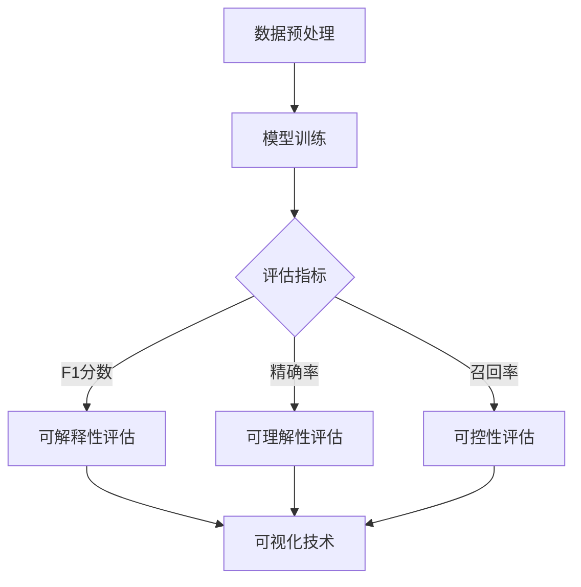
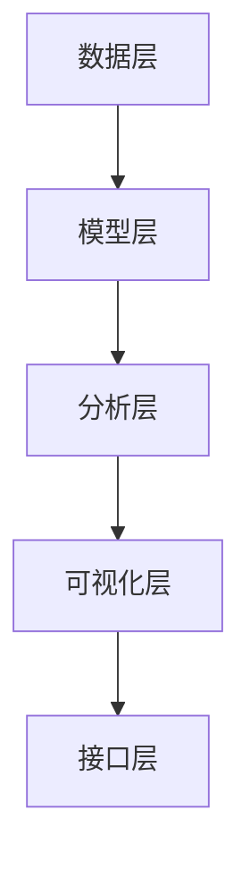
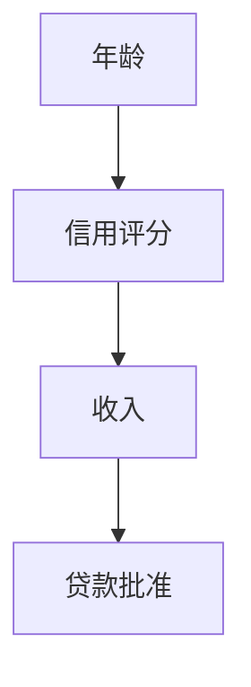

                 

# 《AI透明度工具：帮助企业解释AI决策的技术解决方案》

> 关键词：AI决策、透明度、技术解决方案、企业应用

> 摘要：本文将探讨AI决策中的透明度问题，介绍AI透明度工具的重要性及其对企业决策的影响。通过深入分析透明度的核心概念与原理，解析透明度工具的技术架构与实现，展示实战应用案例，最终提出最佳实践与未来展望。

## 《AI透明度工具：帮助企业解释AI决策的技术解决方案》目录大纲

### 第一部分：AI透明度工具概述

#### 第1章 AI决策与透明度问题

- AI决策的背景与现状
- AI决策带来的透明度挑战

#### 第2章 AI透明度的重要性

- 透明度的定义与分类
- 透明度对企业和社会的意义

#### 第3章 AI透明度工具的需求与挑战

- 市场需求分析
- 技术挑战与解决方案

### 第二部分：核心概念与原理

#### 第4章 AI透明度的核心概念

- 透明度的概念与属性
- 透明度的分类与度量

#### 第5章 AI模型的可解释性与透明度

- 可解释性的定义
- 可解释性与透明度的关系

#### 第6章 AI透明度工具的技术原理

- 透明度分析算法
- 透明度评估与可视化技术
- 透明度工具的技术架构

### 第三部分：AI透明度工具的实战应用

#### 第7章 AI透明度工具的开发与部署

- 开发环境与工具准备
- 系统架构设计
- 核心实现与代码解析

#### 第8章 AI透明度工具的应用案例

- 应用场景介绍
- 决策过程与结果分析
- 透明度工具的应用与效果

#### 第9章 案例总结与启示

- 案例总结
- 启示与拓展

### 第四部分：最佳实践与未来展望

#### 第10章 AI透明度工具的最佳实践

- 最佳实践技巧
- 小结与反思

#### 第11章 AI透明度工具的未来展望

- 发展趋势与机遇
- 未来发展方向

### 附录

- 相关术语解释
- 拓展阅读推荐

----------------------------------------------------------------

## 第一部分：AI透明度工具概述

### 第1章 AI决策与透明度问题

#### 1.1 AI决策的背景与现状

在当今数字化时代，人工智能（AI）技术迅速发展，越来越多的企业开始将AI引入到决策过程中，以提高效率和准确性。AI决策系统通过机器学习、深度学习等技术，从大量数据中提取有价值的信息，为企业提供决策支持。

然而，随着AI技术的普及，透明度问题也逐渐显现。透明度是指决策过程的可理解性和可追溯性，即用户能否理解AI系统是如何作出决策的。缺乏透明度可能导致以下问题：

- 用户不信任：用户难以理解AI系统的决策过程，对AI的决策结果产生质疑。
- 法律合规问题：AI决策可能涉及到法律和伦理问题，缺乏透明度可能导致法律纠纷。
- 风险控制：企业需要确保AI决策系统的稳定性和可靠性，缺乏透明度可能导致潜在的风险。

#### 1.2 AI决策带来的透明度挑战

AI决策透明度问题主要体现在以下几个方面：

- 模型复杂度：现代AI模型通常非常复杂，涉及大量参数和计算，用户难以理解。
- 数据隐私：AI决策依赖于大量数据，如何保护用户隐私成为一大挑战。
- 决策可解释性：用户希望了解决策过程中的关键因素和权重分配，但传统的AI模型往往难以解释。

#### 1.3 AI透明度的重要性

AI透明度对企业和社会具有重要意义：

- 提高用户信任：透明度使企业能够向用户展示AI决策的合理性和可靠性，提高用户对AI系统的信任。
- 确保法律合规：透明度有助于企业遵守相关法律法规，降低法律风险。
- 改进决策质量：透明度使企业能够更好地理解AI决策过程，发现潜在问题和改进空间。
- 促进技术发展：透明度有助于推动AI技术的进步，提高AI系统的可解释性和可控性。

#### 1.4 AI透明度工具的需求与挑战

随着AI技术在企业中的应用日益广泛，对AI透明度的需求也日益增加。企业需要一套有效的AI透明度工具，以解决以下挑战：

- 技术挑战：开发透明度工具需要处理模型复杂度、数据隐私、决策可解释性等技术难题。
- 实施挑战：企业需要将透明度工具集成到现有的AI决策系统中，实现与业务的有机结合。
- 人员培训：企业需要培训相关人员和用户，确保他们能够理解和使用透明度工具。

### 总结

AI透明度是当今企业面临的重要挑战之一。通过开发和应用AI透明度工具，企业可以更好地解释AI决策过程，提高用户信任和决策质量。然而，实现AI透明度仍需克服一系列技术、实施和人员培训等挑战。下一部分将深入探讨AI透明度的核心概念与原理。

----------------------------------------------------------------

## 第二部分：核心概念与原理

### 第4章 AI透明度的核心概念

#### 4.1 透明度的概念与属性

透明度是指系统或过程在操作、结果和决策方面的可见性和可理解性。在AI决策中，透明度指的是用户能够理解AI系统如何从数据中提取信息，以及如何根据这些信息作出决策。

透明度具有以下属性：

- **可追溯性**：用户可以追溯AI系统的决策过程，了解每个决策步骤和依据。
- **可解释性**：用户能够解释AI系统的决策结果，理解关键因素和权重分配。
- **可控性**：用户可以控制AI系统的决策过程，调整参数和模型，以达到预期的决策效果。

#### 4.2 透明度的分类与度量

透明度可以根据不同的维度进行分类和度量：

- **静态透明度**：系统在设计阶段就考虑透明度，包括算法设计、数据准备和模型训练等。
- **动态透明度**：系统在运行过程中提供透明度，用户可以实时监控和调整决策过程。
- **局部透明度**：用户只能理解决策过程中的部分环节，如输入数据的处理或模型参数的调整。
- **全局透明度**：用户能够理解整个决策过程，从数据输入到最终决策结果。

度量透明度的方法包括：

- **量化指标**：通过计算模型的可解释性、可理解性和可控性等指标来衡量透明度。
- **用户反馈**：通过用户调查和访谈，收集用户对AI系统透明度的主观评价。

#### 4.3 AI模型的可解释性与透明度

可解释性是透明度的重要组成部分。可解释性指的是用户能够理解AI模型如何从输入数据中提取特征，并基于这些特征作出决策。可解释性可以分为以下几类：

- **黑箱模型**：模型内部结构复杂，难以解释。例如，深度神经网络和决策树。
- **白箱模型**：模型内部结构简单，容易解释。例如，线性回归和逻辑回归。
- **灰箱模型**：模型介于黑箱和白箱之间，部分可解释。例如，集成学习模型。

可解释性与透明度密切相关。一个高度透明的AI系统应该具有以下特点：

- **易理解**：用户可以轻松理解AI系统的决策过程和结果。
- **可追溯**：用户可以追溯决策过程中的每个步骤，了解依据和原因。
- **可控**：用户可以调整模型参数和决策过程，以达到预期的决策效果。

### 总结

透明度是AI决策过程中不可或缺的要素。通过分类和度量透明度，以及理解可解释性与透明度的关系，企业可以更好地评估和改进AI系统的透明度。下一部分将深入探讨AI透明度工具的技术原理。

----------------------------------------------------------------

## 第三部分：AI透明度工具的技术原理

### 第5章 AI透明度工具的技术原理

#### 5.1 透明度分析算法

透明度分析算法是AI透明度工具的核心。这些算法通过分析AI模型的决策过程，提取关键特征和因素，以帮助用户理解决策结果。以下是一个简单的透明度分析算法流程：

1. **数据预处理**：对输入数据进行清洗、归一化和特征提取，以便模型训练。
2. **模型训练**：使用机器学习算法对训练数据进行训练，构建AI模型。
3. **特征重要性分析**：计算模型中每个特征的重要性，以确定影响决策的关键因素。
4. **决策路径追踪**：分析模型决策路径，追踪决策过程中的关键步骤和依据。
5. **结果可视化**：将分析结果可视化为图表和报表，以供用户理解和参考。

以下是一个使用Mermaid绘制的透明度分析算法流程图：


#### 5.2 透明度评估与可视化技术

透明度评估与可视化技术是AI透明度工具的重要组成部分。这些技术通过评估AI模型的透明度，并以可视化的形式呈现，帮助用户更好地理解决策过程。

- **评估指标**：常用的透明度评估指标包括模型的可解释性、可理解性和可控性。例如，可以使用F1分数、精确率、召回率等指标来评估模型的可解释性。
- **可视化技术**：可视化技术包括图表、报表、交互式界面等。例如，可以使用条形图、饼图、热力图等来展示特征重要性，使用决策树、桑基图等来展示决策路径。

以下是一个使用Mermaid绘制的可视化技术架构图：



#### 5.3 透明度工具的技术架构

AI透明度工具的技术架构通常包括以下几个部分：

- **数据层**：负责数据的收集、存储和处理，包括数据清洗、特征提取和模型训练等。
- **模型层**：负责AI模型的构建、训练和优化，包括选择合适的算法和超参数调整。
- **分析层**：负责透明度分析，包括特征重要性分析、决策路径追踪等。
- **可视化层**：负责将分析结果以可视化的形式呈现，包括图表、报表、交互式界面等。
- **接口层**：负责与用户交互，包括用户操作、数据输入和输出等。

以下是一个使用Mermaid绘制的AI透明度工具技术架构图：



#### 总结

AI透明度工具通过透明度分析算法、评估与可视化技术，以及技术架构的设计，为企业提供了一套完整的技术解决方案。这些工具可以帮助企业提高AI决策的透明度，增强用户信任和决策质量。下一部分将介绍AI透明度工具的实战应用。

----------------------------------------------------------------

## 第三部分：AI透明度工具的实战应用

### 第6章 AI透明度工具的开发与部署

#### 6.1 开发环境与工具准备

在开发AI透明度工具之前，需要准备以下环境和工具：

- **编程语言**：Python是最常用的编程语言，因为其丰富的库和框架，如Scikit-learn、TensorFlow和PyTorch，适用于机器学习和深度学习。
- **IDE**：使用PyCharm或Visual Studio Code等集成开发环境，可以提供代码编辑、调试和自动化测试等功能。
- **库和框架**：安装常用的库和框架，如NumPy、Pandas、Matplotlib和Seaborn，用于数据处理、可视化和统计分析。
- **数据存储和处理**：使用Hadoop或Spark等大数据处理工具，可以高效处理海量数据。

#### 6.2 系统架构设计

AI透明度工具的系统架构应包括以下几个主要模块：

- **数据层**：负责数据的收集、存储和处理，包括数据清洗、特征提取和模型训练等。
- **模型层**：负责AI模型的构建、训练和优化，包括选择合适的算法和超参数调整。
- **分析层**：负责透明度分析，包括特征重要性分析、决策路径追踪等。
- **可视化层**：负责将分析结果以可视化的形式呈现，包括图表、报表、交互式界面等。
- **接口层**：负责与用户交互，包括用户操作、数据输入和输出等。

以下是一个使用Mermaid绘制的系统架构图：


#### 6.3 核心实现与代码解析

在AI透明度工具的核心实现中，主要包括以下关键部分：

- **数据预处理**：使用Pandas和NumPy进行数据清洗、归一化和特征提取。
- **模型训练**：使用Scikit-learn或TensorFlow等库进行模型训练和优化。
- **透明度分析**：使用特征重要性分析和决策路径追踪算法，提取关键特征和决策路径。
- **结果可视化**：使用Matplotlib、Seaborn和Plotly等库，将分析结果以图表和交互式界面的形式呈现。

以下是一个使用Python实现的简单代码示例：

```python
import pandas as pd
from sklearn.model_selection import train_test_split
from sklearn.ensemble import RandomForestClassifier
import matplotlib.pyplot as plt

# 数据预处理
data = pd.read_csv('data.csv')
X = data.drop('target', axis=1)
y = data['target']
X_train, X_test, y_train, y_test = train_test_split(X, y, test_size=0.2, random_state=42)

# 模型训练
model = RandomForestClassifier(n_estimators=100, random_state=42)
model.fit(X_train, y_train)

# 特征重要性分析
importances = model.feature_importances_
indices = np.argsort(importances)[::-1]

# 结果可视化
plt.figure(figsize=(12, 6))
plt.title('Feature Importances')
plt.bar(range(X.shape[1]), importances[indices])
plt.xticks(range(X.shape[1]), X.columns[indices], rotation=90)
plt.show()
```

#### 6.4 实际案例分析与详细讲解

为了更好地理解AI透明度工具的应用，我们以一个实际案例为例进行详细讲解。

假设某企业使用AI模型对客户信用评分进行预测，以决定是否批准贷款申请。透明度工具可以帮助企业解释模型的决策过程，提高用户信任和决策质量。

1. **数据准备**：首先，企业收集了大量的客户数据，包括年龄、收入、信用记录等。数据需要进行清洗和预处理，以便模型训练。

2. **模型训练**：企业使用随机森林算法对训练数据进行模型训练。随机森林是一种集成学习算法，具有较好的可解释性。

3. **透明度分析**：透明度工具对模型进行特征重要性分析，提取关键特征，并追踪决策路径。例如，年龄和收入是影响信用评分的关键因素。

4. **结果可视化**：透明度工具将分析结果以图表和交互式界面的形式呈现，用户可以轻松理解模型的决策过程。

以下是一个使用Mermaid绘制的决策路径追踪图：



#### 6.5 项目小结

通过实际案例分析和详细讲解，我们可以看到AI透明度工具在提高用户信任和决策质量方面的作用。企业可以利用透明度工具，更好地解释AI模型的决策过程，发现潜在问题和改进空间。此外，透明度工具还可以帮助企业在法律合规和风险管理方面降低风险。

#### 总结

AI透明度工具的开发与部署是企业实现AI决策透明度的重要手段。通过准备合适的开发环境、设计合理的系统架构、实现核心功能以及实际案例分析和详细讲解，企业可以更好地理解AI决策过程，提高用户信任和决策质量。下一部分将介绍AI透明度工具的应用案例。

----------------------------------------------------------------

### 第7章 AI透明度工具的应用案例

#### 7.1 应用场景介绍

在本案例中，我们选择了一家金融机构作为应用场景。该金融机构希望通过AI透明度工具，提高贷款审批系统的透明度，以增强客户信任和合规性。贷款审批系统是一个典型的AI决策应用，涉及大量的数据和复杂的算法。

#### 7.2 AI决策案例分析

金融机构的贷款审批系统使用了一个基于机器学习的信用评分模型，该模型通过对客户的个人信息、财务状况和历史信用记录进行分析，预测客户是否具有还款能力。以下为具体的决策过程：

1. **数据收集与预处理**：金融机构收集了客户的年龄、收入、职业、信用记录等数据，并进行预处理，如缺失值填充、异常值处理和数据标准化。
2. **模型训练与优化**：使用随机森林算法对训练数据集进行训练，并对模型进行优化，以提高准确性和可解释性。
3. **透明度分析**：AI透明度工具对模型进行特征重要性分析和决策路径追踪，提取关键特征和决策路径。
4. **结果可视化**：将分析结果以图表和交互式界面的形式呈现，用户可以直观地了解模型的决策过程。

#### 7.3 透明度工具的应用与效果

在贷款审批系统中，AI透明度工具的应用带来了以下效果：

1. **提高用户信任**：客户可以清楚地了解信用评分模型的决策过程和关键因素，从而增强对金融机构的信任。
2. **确保法律合规**：透明度工具帮助金融机构遵守相关法律法规，降低法律风险。
3. **改进决策质量**：通过透明度分析，金融机构可以识别出模型中的潜在问题和改进空间，从而提高决策质量。
4. **降低运营成本**：透明度工具可以自动化部分决策过程，减少人工审核工作量，降低运营成本。

#### 7.4 案例总结与启示

通过本案例，我们可以得出以下启示：

1. **透明度工具的重要性**：AI透明度工具在企业决策过程中发挥着重要作用，有助于提高用户信任、确保合规性、改进决策质量和降低运营成本。
2. **实际应用中的挑战**：在实际应用中，透明度工具可能面临数据隐私、模型复杂度和用户培训等挑战。企业需要综合考虑这些因素，选择合适的透明度工具和技术方案。
3. **持续优化与改进**：AI透明度工具的应用不是一蹴而就的，企业需要持续优化和改进，以适应不断变化的市场需求和法律法规要求。

#### 7.5 拓展应用场景

AI透明度工具不仅可以应用于贷款审批系统，还可以应用于其他需要透明度的AI决策场景，如医疗诊断、招聘评估、信用评分等。通过定制化开发，企业可以根据具体需求，实现透明度工具在不同领域的应用。

#### 总结

AI透明度工具在提高企业决策透明度、增强用户信任和改进决策质量方面具有重要意义。通过实际案例分析和详细讲解，我们可以看到透明度工具在金融、医疗、招聘等领域的广泛应用前景。企业应根据自身需求，选择合适的透明度工具，并不断优化和改进，以实现更好的决策效果。

----------------------------------------------------------------

## 第四部分：最佳实践与未来展望

### 第8章 AI透明度工具的最佳实践

#### 8.1 最佳实践技巧

1. **数据预处理**：在训练模型之前，对数据进行充分的预处理，包括缺失值填充、异常值处理和特征工程。
2. **模型选择与优化**：选择具有较好可解释性的模型，并进行参数调优，以提高模型的准确性和透明度。
3. **透明度分析**：使用多种透明度分析方法，如特征重要性分析和决策路径追踪，以全面了解模型的决策过程。
4. **用户培训与反馈**：对用户进行透明度工具的培训，收集用户反馈，持续改进工具的功能和易用性。

#### 8.2 小结与反思

1. **透明度工具的价值**：AI透明度工具在提高用户信任、确保合规性和改进决策质量方面具有显著价值。
2. **挑战与改进方向**：在实际应用中，AI透明度工具面临数据隐私、模型复杂度和用户培训等挑战。企业应持续关注这些问题，并探索改进方向。

### 第9章 AI透明度工具的未来展望

#### 9.1 发展趋势与机遇

1. **技术进步**：随着深度学习和增强学习等技术的不断发展，AI透明度工具将变得更加先进和智能。
2. **市场需求**：随着AI技术在各行各业的广泛应用，对AI透明度的需求也将持续增长。
3. **政策法规**：政府和企业对AI透明度的关注度提高，将推动相关法规的制定和实施。

#### 9.2 未来发展方向

1. **增强可解释性**：开发更高级的可解释性算法，提高模型的透明度。
2. **跨领域应用**：探索AI透明度工具在医疗、金融、教育等领域的应用，满足不同行业的需求。
3. **用户友好性**：改进工具的用户界面和交互设计，提高用户体验。

#### 9.3 技术创新与突破

1. **可解释性模型**：开发新的可解释性模型，提高模型的透明度和可解释性。
2. **隐私保护技术**：研究隐私保护技术，确保AI透明度工具在数据隐私方面的合规性。
3. **协作与共享**：推动AI透明度工具的协作与共享，促进技术进步和行业合作。

#### 总结

AI透明度工具在未来发展中具有广阔的应用前景。通过技术创新和不断优化，AI透明度工具将更好地满足企业和社会的需求，提高AI决策的透明度和可靠性。

----------------------------------------------------------------

### 附录

#### 相关术语解释

- **AI透明度**：指AI系统在决策过程中的可见性和可理解性，即用户能否理解AI系统是如何作出决策的。
- **可解释性**：指用户能够解释AI系统决策结果的能力，包括理解关键因素和权重分配。
- **透明度工具**：指用于提高AI决策透明度的软件和硬件系统，包括数据预处理、模型训练、透明度分析和可视化等技术。

#### 拓展阅读推荐

1. **论文**：《On the Evaluation of Model Interpretability》（关于模型可解释性评估的研究）。
2. **书籍**：《AI民主化：人人都能理解的AI决策》（Democratising AI: Tools to Make AI Accountable, Interpretable, and Transparent）。
3. **网站**：AI透明度联盟（AI Transparency Alliance）和AI可解释性研究协会（AI Interpretability Research Association）。

### 作者信息

**作者：AI天才研究院/AI Genius Institute & 禅与计算机程序设计艺术 /Zen And The Art of Computer Programming**

