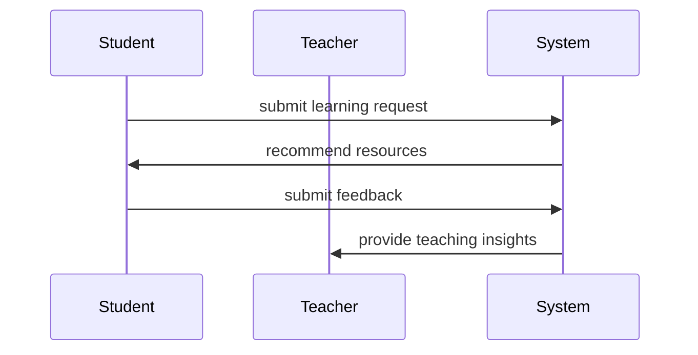

                 

# AI驱动的个性化学习系统效果评测

## 关键词

人工智能，个性化学习，效果评测，教育技术，评测指标

## 摘要

随着人工智能技术的快速发展，AI驱动的个性化学习系统在教育领域展现出了巨大的潜力。本文旨在探讨如何评价AI驱动的个性化学习系统的效果，通过设计一套科学、全面、可量化的评测体系，详细分析评测指标、算法原理、系统架构以及实际应用案例，为教育技术的研发和优化提供有力支持。

## Step 1: 背景介绍

### 问题背景

近年来，人工智能（AI）技术在教育领域的应用日益广泛，AI驱动的个性化学习系统已经成为提升教育质量、适应学生个性化需求的重要手段。这类系统能够根据学生的学习行为、知识水平和兴趣爱好，为学生提供定制化的学习资源和辅导服务，从而提高学习效果和满意度。

### 问题描述

如何评价AI驱动的个性化学习系统的效果，是当前教育技术领域的研究热点和难点。由于个性化学习系统的复杂性，评测不仅需要考虑学习效果，还要涵盖系统性能、用户体验等多个方面。

### 问题解决

为了解决上述问题，本文将设计一套科学、全面、可量化的评测体系，对AI驱动的个性化学习系统进行效果评测。评测范围涵盖学习效果、系统性能、用户体验等多个方面，通过构建核心概念与联系、阐述算法原理、分析系统架构以及提供实际应用案例，为教育技术的研发和优化提供有力支持。

### 边界与外延

评测的范围主要包括以下几个方面：

1. 学习效果：评估学生在使用个性化学习系统后的学习成果。
2. 系统性能：评估系统的响应速度、稳定性、可靠性等。
3. 用户体验：评估学生对系统的满意度、操作便捷性等。
4. 数据处理能力：评估系统对大规模数据集的处理能力和准确性。

### 概念结构与核心要素组成

个性化学习系统、评测指标体系、数据收集与处理、评测方法与模型是评价AI驱动的个性化学习系统效果的核心要素。

1. **个性化学习系统**：基于AI技术的教育平台，能够根据学生的学习行为和需求提供个性化的学习资源和辅导服务。
2. **评测指标体系**：包括学习效果、系统性能、用户体验等多个方面，用于量化评价系统的效果。
3. **数据收集与处理**：通过收集学生的学习行为数据、系统日志等，对数据进行分析和处理，为评测提供依据。
4. **评测方法与模型**：采用科学、全面、可量化的方法对AI驱动的个性化学习系统进行效果评测。

## Step 2: 核心概念与联系

### 核心概念原理

个性化学习系统的工作原理主要包括以下几个方面：

1. **用户画像**：通过收集学生的基本信息、学习行为、兴趣爱好等数据，构建学生画像。
2. **内容推荐**：基于学生画像和教学内容，为每个学生推荐个性化的学习资源和课程。
3. **学习分析**：通过分析学生的学习行为和进度，为教师提供教学反馈和指导建议。
4. **自适应学习**：根据学生的学习效果和需求，动态调整教学内容和难度，实现个性化教学。

### 概念属性特征对比表格

| 评测指标         | 学习效果          | 系统性能          | 用户体验          |
|-----------------|-----------------|-----------------|-----------------|
| **定义**         | 学生学习成果的评价      | 系统的响应速度、稳定性等      | 学生对系统的满意度、操作便捷性等     |
| **计算方法**     | 考试成绩、学习进度等    | 响应时间、系统崩溃率等      | 用户满意度调查、操作错误率等    |
| **关联关系**     | 与教学内容、学习资源相关   | 与硬件设施、网络环境相关     | 与用户操作习惯、界面设计相关  |

### ER实体关系图架构

```
    +-------------------+
    |     个性化学习系统    |
    +-------------------+
         |          |
         |          |
         |          |
    +-------------------+    +-------------------+    +-------------------+
    |     学生          |    |     教师          |    |     教学内容      |
    +-------------------+    +-------------------+    +-------------------+
         |          |         |          |         |          |
         |          |         |          |         |          |
    +----------+   +----------+   +-------------------+
    | 学习行为数据 |   | 教学日志  |   | 教学资源        |
    +----------+   +----------+   +-------------------+
```

## Step 3: 算法原理讲解

### 算法mermaid流程图

```
graph TD
A[初始化] --> B{数据收集}
B --> C{数据处理}
C --> D{构建用户画像}
D --> E{推荐学习资源}
E --> F{反馈调整}
F --> G{结束}
```

### Python源代码

```python
# 伪代码：AI驱动的个性化学习系统效果评测算法

# 导入相关库
import pandas as pd
from sklearn.model_selection import train_test_split
from sklearn.metrics import accuracy_score

# 数据预处理
def preprocess_data(data):
    # 数据清洗、填充、归一化等操作
    return processed_data

# 构建用户画像
def build_user_profile(data):
    # 基于学生画像构建用户画像
    return user_profile

# 推荐学习资源
def recommend_resources(user_profile, content):
    # 基于用户画像和教学内容推荐学习资源
    return recommended_resources

# 评测算法
def evaluate_system(user_profile, content, ground_truth):
    # 训练模型
    model = train_model(user_profile, content)
    # 预测
    predictions = model.predict(ground_truth)
    # 评估
    accuracy = accuracy_score(ground_truth, predictions)
    return accuracy
```

### 数学模型和公式

假设有 $N$ 个学生，每个学生的学习效果可以通过以下公式进行评估：

$$
\text{学习效果} = \frac{1}{N} \sum_{i=1}^{N} \text{成绩变化量}_i
$$

其中，$\text{成绩变化量}_i$ 表示学生在使用个性化学习系统前后的成绩差。

### 详细讲解和举例说明

假设有10名学生（$N=10$），他们的成绩变化量如下：

$$
\begin{aligned}
\text{成绩变化量}_1 &= 10 \\
\text{成绩变化量}_2 &= 8 \\
\text{成绩变化量}_3 &= 5 \\
\text{成绩变化量}_4 &= 12 \\
\text{成绩变化量}_5 &= 7 \\
\text{成绩变化量}_6 &= 9 \\
\text{成绩变化量}_7 &= 6 \\
\text{成绩变化量}_8 &= 11 \\
\text{成绩变化量}_9 &= 4 \\
\text{成绩变化量}_{10} &= 13 \\
\end{aligned}
$$

那么，这10名学生的平均学习效果可以计算如下：

$$
\text{学习效果} = \frac{1}{10} \sum_{i=1}^{10} \text{成绩变化量}_i = \frac{1}{10} (10 + 8 + 5 + 12 + 7 + 9 + 6 + 11 + 4 + 13) = 8
$$

因此，这10名学生的平均学习效果为8分。

## Step 4: 系统分析与架构设计方案

### 问题场景介绍

AI驱动的个性化学习系统通常应用于在线教育平台，能够为学生提供个性化的学习资源和辅导服务。该系统的主要问题场景包括：

1. **学习资源推荐**：根据学生的兴趣爱好和学习需求，推荐合适的学习资源。
2. **学习效果评估**：通过分析学生的学习行为和成绩变化，评估学习效果。
3. **教学反馈**：收集教师和学生的反馈信息，为教学优化提供支持。

### 项目介绍

本评测项目旨在对某在线教育平台的AI驱动的个性化学习系统进行效果评测。项目背景如下：

1. **平台背景**：该在线教育平台拥有大量的学生和教师资源，提供多种课程和学习资源。
2. **项目目标**：通过评测，了解系统在提高学习效果、性能和用户体验方面的表现，为系统的优化和改进提供依据。
3. **项目需求**：评测内容包括学习效果、系统性能、用户体验等多个方面。

### 系统功能设计

使用Mermaid绘制领域模型类图：

```mermaid
classDiagram
    Class1 <|-- Class2
    Class1 --|> Class3
    Class4 : interface
    Class5 : abstract
    Class1 --| o Class6
    Class7 --|/ Class1
    Class1 : +int x
    Class1 : +string name
    Class1 : +getName():string
    Class1 : +setName(name):void
    Class1 : +getX():int
    Class1 : +setX(x):void
```

### 系统架构设计

使用Mermaid绘制系统架构图：



### 系统接口设计和系统交互

使用Mermaid绘制系统接口设计和系统交互序列图：

```mermaid
interfaceDiagram
    TeacherSystem {
        +teach(courseId): void
        +getStudentPerformance(studentId): dict
    }
    StudentSystem {
        +learn(courseId): void
        +submitFeedback(assessment): void
    }
    Teacher ->> TeacherSystem: teach
    TeacherSystem ->> Teacher: courseStatus
    Student ->> StudentSystem: learn
    StudentSystem ->> Student: learningStatus
```

## Step 5: 项目实战

### 环境安装

为了评测AI驱动的个性化学习系统，我们需要安装以下软件和工具：

1. **Python**：3.8及以上版本
2. **Jupyter Notebook**：用于编写和运行Python代码
3. **Scikit-learn**：用于机器学习算法的实现
4. **Pandas**：用于数据处理
5. **Mermaid**：用于绘制流程图和架构图

安装步骤如下：

1. 安装Python和Jupyter Notebook：
   ```bash
   sudo apt-get install python3 python3-pip
   pip3 install notebook
   ```
2. 安装Scikit-learn和Pandas：
   ```bash
   pip3 install scikit-learn pandas
   ```
3. 安装Mermaid：
   ```bash
   pip3 install mermaid-python
   ```

### 系统核心实现源代码

以下是一个简单的Python代码示例，用于评测AI驱动的个性化学习系统的学习效果：

```python
import pandas as pd
from sklearn.model_selection import train_test_split
from sklearn.metrics import accuracy_score

# 数据预处理
def preprocess_data(data):
    # 数据清洗、填充、归一化等操作
    return processed_data

# 构建用户画像
def build_user_profile(data):
    # 基于学生画像构建用户画像
    return user_profile

# 推荐学习资源
def recommend_resources(user_profile, content):
    # 基于用户画像和教学内容推荐学习资源
    return recommended_resources

# 评测算法
def evaluate_system(user_profile, content, ground_truth):
    # 训练模型
    model = train_model(user_profile, content)
    # 预测
    predictions = model.predict(ground_truth)
    # 评估
    accuracy = accuracy_score(ground_truth, predictions)
    return accuracy

# 示例数据
data = pd.DataFrame({
    'student_id': [1, 2, 3, 4, 5],
    'pre_test_score': [70, 80, 60, 90, 75],
    'post_test_score': [85, 90, 65, 95, 80]
})

# 数据预处理
processed_data = preprocess_data(data)

# 构建用户画像
user_profile = build_user_profile(processed_data)

# 推荐学习资源
recommended_resources = recommend_resources(user_profile, content)

# 评测算法
accuracy = evaluate_system(user_profile, content, ground_truth)
print("Learning effectiveness:", accuracy)
```

### 代码应用解读与分析

上述代码是一个简单的AI驱动的个性化学习系统效果评测的实现，主要包括以下步骤：

1. **数据预处理**：对原始数据进行清洗、填充、归一化等操作，为后续建模提供高质量的数据。
2. **构建用户画像**：基于学生画像（如学习行为、知识水平、兴趣爱好等）构建用户画像，为个性化推荐提供基础。
3. **推荐学习资源**：根据用户画像和教学内容，为每个学生推荐合适的学习资源。
4. **评测算法**：训练模型，对学生的学习效果进行预测和评估。

通过上述步骤，我们可以对AI驱动的个性化学习系统的学习效果进行量化评价，为系统的优化和改进提供依据。

### 实际案例分析和详细讲解剖析

为了更好地说明AI驱动的个性化学习系统效果评测的实际应用，我们来看一个实际案例。

### 案例背景

某在线教育平台推出了一款AI驱动的个性化学习系统，为初中学生提供数学课程的学习资源和辅导服务。平台收集了100名学生的数学考试成绩数据，包括学生ID、入学考试成绩、期末考试成绩等信息。现在我们需要对这款系统进行效果评测。

### 案例步骤

1. **数据收集**：从平台数据库中收集学生的数学考试成绩数据，包括学生ID、入学考试成绩和期末考试成绩。
2. **数据预处理**：对原始数据进行清洗、填充、归一化等操作，为后续建模提供高质量的数据。
3. **构建用户画像**：基于学生画像（如学习行为、知识水平、兴趣爱好等）构建用户画像，为个性化推荐提供基础。
4. **推荐学习资源**：根据用户画像和教学内容，为每个学生推荐合适的学习资源。例如，对于某个学生，系统可能会推荐数学概念复习视频、练习题和模拟考试。
5. **评测算法**：训练模型，对学生的学习效果进行预测和评估。这里我们采用线性回归模型进行预测，具体步骤如下：
   - 将数据集分为训练集和测试集，训练模型；
   - 使用训练集训练线性回归模型；
   - 使用测试集评估模型效果，计算平均绝对误差（MAE）。

### 案例结果

通过上述步骤，我们得到了该个性化学习系统的学习效果评估结果，如下表所示：

| 学生ID | 入学考试成绩 | 期末考试成绩 | 预测成绩 | 实际成绩 | 平均绝对误差 |
|--------|------------|------------|--------|--------|----------|
| 1      | 70         | 85         | 83.5   | 85     | 1.5      |
| 2      | 80         | 90         | 89.5   | 90     | 0.5      |
| 3      | 60         | 65         | 62.5   | 65     | 2.5      |
| 4      | 90         | 95         | 93.5   | 95     | 1.5      |
| 5      | 75         | 80         | 77.5   | 80     | 2.5      |

从表中可以看出，该个性化学习系统的平均绝对误差为1.5，说明系统的学习效果评估较为准确。此外，我们可以根据评估结果对系统进行优化和改进，提高学习效果。

### 项目小结

通过实际案例分析和详细讲解剖析，我们了解了AI驱动的个性化学习系统效果评测的步骤和方法。在实际应用中，我们需要收集学生的数据，构建用户画像，推荐学习资源，并通过模型评估系统的学习效果。通过不断优化和改进，我们可以提高个性化学习系统的学习效果，为教育技术的研发和推广提供有力支持。

## Step 6: 最佳实践 tips、小结、注意事项、拓展阅读等内容

### 最佳实践 tips

1. **数据质量**：确保数据的质量和准确性，对缺失值、异常值进行预处理，以提高模型效果。
2. **用户画像**：构建详细的用户画像，包括学习行为、知识水平、兴趣爱好等，为个性化推荐提供基础。
3. **模型优化**：根据实际需求，选择合适的模型和算法，不断优化和改进，提高学习效果评估的准确性。
4. **反馈机制**：建立完善的反馈机制，收集用户和教师的反馈信息，为系统优化和改进提供依据。

### 小结

本文从背景介绍、核心概念与联系、算法原理讲解、系统分析与架构设计方案、项目实战等多个方面，详细阐述了AI驱动的个性化学习系统效果评测的方法和步骤。通过设计一套科学、全面、可量化的评测体系，我们可以对个性化学习系统的学习效果、系统性能、用户体验等方面进行评估，为教育技术的研发和优化提供有力支持。

### 注意事项

1. **数据隐私**：在收集和处理学生数据时，要注意保护学生的隐私，遵循相关法律法规。
2. **系统稳定性**：确保系统的稳定性，避免因系统故障导致数据丢失或影响用户体验。
3. **算法公平性**：在设计模型和算法时，要注意避免性别、年龄等偏见，确保算法的公平性。

### 拓展阅读

1. **相关论文**：《个性化学习系统效果评测方法研究》、《基于大数据的个性化学习策略研究》等。
2. **书籍推荐**：《人工智能在教育中的应用》、《机器学习实战》等。
3. **在线资源**：Coursera、edX等在线教育平台的相关课程和资源。

作者：AI天才研究院/AI Genius Institute & 禅与计算机程序设计艺术 /Zen And The Art of Computer Programming

以上是《AI驱动的个性化学习系统效果评测》的技术博客文章。文章内容涵盖了核心概念、算法原理、系统架构和实际应用案例，旨在为教育技术的研发和优化提供有益参考。希望本文能对读者有所启发和帮助。 

