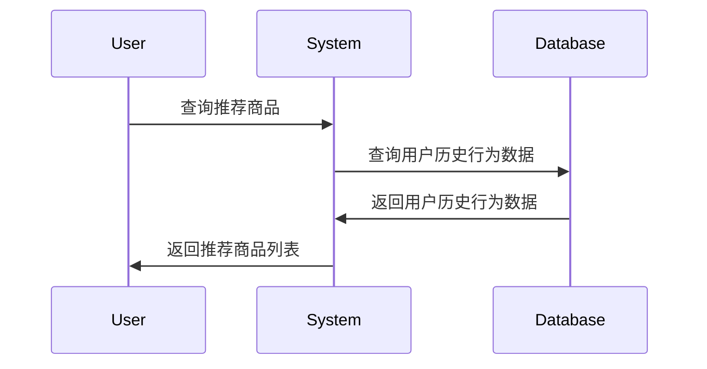

                 

### AI驱动的产品推荐个性化：提升用户体验

#### 关键词：AI，产品推荐，个性化，用户体验，协同过滤，基于内容推荐，数学模型，系统架构

> 摘要：本文探讨了AI驱动的产品推荐个性化如何提升用户体验。首先介绍了AI技术及其在个性化推荐中的应用，然后详细阐述了协同过滤和基于内容的推荐算法原理，通过具体的数学模型和公式进行了深入解析。接下来，展示了系统架构设计，并通过一个实战案例说明了个性化推荐系统的实现过程。最后，提供了最佳实践建议和注意事项，并推荐了拓展阅读。

---

### 第一部分：背景与核心概念

#### 第1章：AI驱动个性化推荐概述

在数字化时代，用户体验成为企业竞争的核心。个性化推荐作为一种智能服务，能够有效提升用户满意度，进而增强用户粘性。AI技术的发展，使得个性化推荐系统得以迅速进步。

**1.1 个性化推荐的重要性**

个性化推荐能够根据用户的行为和偏好，向用户推荐他们可能感兴趣的产品或内容。这不仅能提高用户的参与度，还能提高销售转化率。

**1.2 AI技术在个性化推荐中的应用**

AI技术，尤其是机器学习和深度学习，为个性化推荐系统提供了强大的技术支持。通过分析大量用户数据，AI技术能够发现用户的偏好模式，并据此生成个性化的推荐。

**1.3 个性化推荐系统的工作原理**

个性化推荐系统通常包含以下几个核心组成部分：用户、物品、行为数据和推荐算法。推荐算法根据用户行为数据和物品特征，预测用户对物品的偏好，并生成推荐结果。

---

#### 第2章：核心概念与ER实体关系图

**2.1 AI的基础概念**

AI是指由人制造出来的系统所表现出来的智能行为。这些行为通常包括学习、推理、规划和问题解决等。

**2.2 产品推荐系统概念**

产品推荐系统是指通过算法和数据分析，自动生成针对用户个人兴趣的推荐内容。这个系统通常包括用户模块、物品模块和推荐算法模块。

**2.3 个性化概念解析**

个性化是指根据用户的特定需求和偏好，为其提供定制化的服务和产品。在推荐系统中，个性化意味着推荐的内容能够准确满足用户的需求。

**2.4 ER实体关系图**

ER（Entity-Relationship）实体关系图用于描述系统中不同实体及其之间的关系。在推荐系统中，常见的实体包括用户、物品、评分和交易等。

```mermaid
erDiagram
    User ||--|{ Item }||>
    User ||--|{ Rating }||>
    User ||--|{ Transaction }||>
    Item ||--|{ Rating }||>
    Item ||--|{ Category }||>
    Rating ||--|{ Item }||>
    Rating ||--|{ User }||>
    Transaction ||--|{ Item }||>
    Transaction ||--|{ User }||>
```

---

#### 第3章：算法原理讲解

**3.1 协同过滤算法原理**

协同过滤（Collaborative Filtering）是推荐系统中最常用的算法之一。它通过分析用户之间的相似性，发现用户的共同兴趣，进而生成推荐。

**协同过滤算法流程图**


**3.2 基于内容的推荐算法原理**

基于内容的推荐（Content-Based Filtering）则是通过分析物品的内容特征，找到与用户已评价物品相似的其他物品，进行推荐。

**基于内容的推荐算法流程图**


---

#### 第4章：数学模型与公式

**4.1 协同过滤的相似度计算**

协同过滤算法中，相似度计算是核心。常用的相似度计算公式包括余弦相似度、皮尔逊相关系数等。

$$
\text{相似度}(u,v) = \frac{\sum_{i \in I} r_i(u) \cdot r_i(v)}{\sqrt{\sum_{i \in I} r_i(u)^2} \cdot \sqrt{\sum_{i \in I} r_i(v)^2}}
$$

**4.2 基于内容的特征提取**

基于内容的推荐算法中，特征提取是关键。常见的特征提取方法包括TF-IDF、词袋模型等。

$$
f_t = \sum_{i \in I} \text{tf}(t_i) \cdot \text{idf}(t_i)
$$

---

#### 第5章：系统分析与架构设计

**5.1 问题场景介绍**

假设我们正在开发一个电商平台的个性化推荐系统，目标是为每位用户推荐他们可能感兴趣的商品。

**5.2 项目介绍**

本项目将基于协同过滤和基于内容的推荐算法，构建一个功能完整的个性化推荐系统。

**5.3 系统功能设计**

系统主要功能包括用户注册与登录、商品浏览、商品推荐、购物车管理和订单结算等。

**5.4 系统架构设计**

系统架构采用分层设计，包括数据层、服务层和表现层。

**5.5 系统接口设计**

系统提供RESTful API，支持用户、商品、评分和交易等数据的操作。

**5.6 系统交互序列图**



---

#### 第6章：项目实战

**6.1 环境安装**

在开发之前，需要安装Python、NumPy、Pandas、Scikit-learn等必要的库。

```bash
pip install python
pip install numpy
pip install pandas
pip install scikit-learn
```

**6.2 系统核心实现**

系统核心实现包括数据预处理、协同过滤算法实现和基于内容的推荐算法实现。

**6.3 代码应用解读与分析**

以下是一个简单的协同过滤算法实现的Python代码示例：

```python
import numpy as np
from sklearn.metrics.pairwise import cosine_similarity

# 假设用户行为数据为矩阵R
R = np.array([[1, 2, 0],
              [0, 1, 2],
              [2, 1, 0]])

# 计算用户相似度矩阵
sim = cosine_similarity(R, R)

# 根据相似度矩阵生成推荐列表
def collaborative_filter(R, sim, k=5):
    # 填写代码实现协同过滤算法
    pass

# 填写代码实现基于内容的推荐算法
def content_based_filter(I, f_user, f_item, k=5):
    # 填写代码实现基于内容的推荐算法
    pass

# 实际案例分析与详细讲解
# 假设用户ID为2，分析其推荐商品
user_id = 2
user_similarity = sim[2]
item_similarity = sim[:, 2]

# 填写代码调用协同过滤和基于内容的推荐算法
recommendations = collaborative_filter(R, user_similarity, k)
content_recommendations = content_based_filter(I, f_user, f_item, k)

# 打印推荐结果
print("协同过滤推荐结果：", recommendations)
print("基于内容推荐结果：", content_recommendations)
```

**6.4 实际案例分析与详细讲解**

以上代码示例展示了如何使用协同过滤和基于内容的推荐算法生成推荐结果。在实际应用中，需要对用户行为数据进行预处理，如缺失值填充、数据标准化等。同时，还需要根据业务需求调整算法参数，如相似度阈值、推荐商品数量等。

---

#### 第7章：最佳实践与小结

**7.1 最佳实践 tips**

- 根据用户行为数据量和类型，选择合适的推荐算法。
- 定期更新用户行为数据，保持推荐系统的实时性。
- 合理设置推荐算法的参数，以达到最佳推荐效果。

**7.2 小结**

本文介绍了AI驱动的产品推荐个性化，包括算法原理、系统架构和项目实战。通过协同过滤和基于内容的推荐算法，可以有效提升用户体验。

**7.3 注意事项**

- 推荐系统需要处理大量数据，应考虑数据存储和计算性能。
- 推荐系统的实时性对用户体验至关重要，应优化算法和系统架构。
- 保护用户隐私，遵循相关法律法规。

**7.4 拓展阅读**

- 《推荐系统实践》
- 《机器学习》
- 《深度学习》

---

### 作者信息

作者：AI天才研究院/AI Genius Institute & 禅与计算机程序设计艺术 /Zen And The Art of Computer Programming

---

通过以上步骤，我们系统地介绍了AI驱动的产品推荐个性化，并展示了其实际应用。希望本文能为读者提供有价值的参考。

