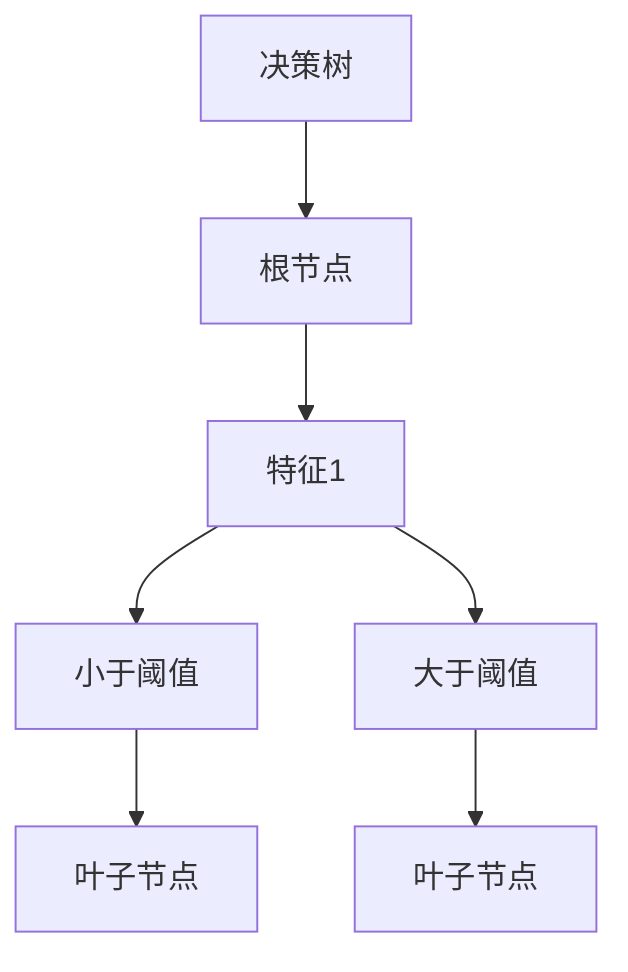
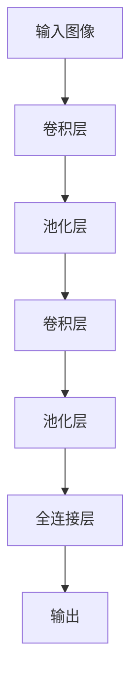
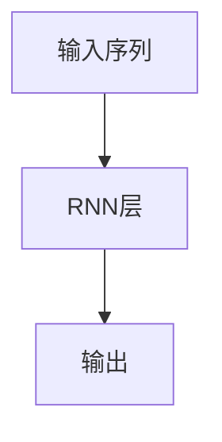
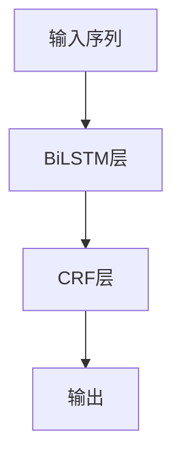
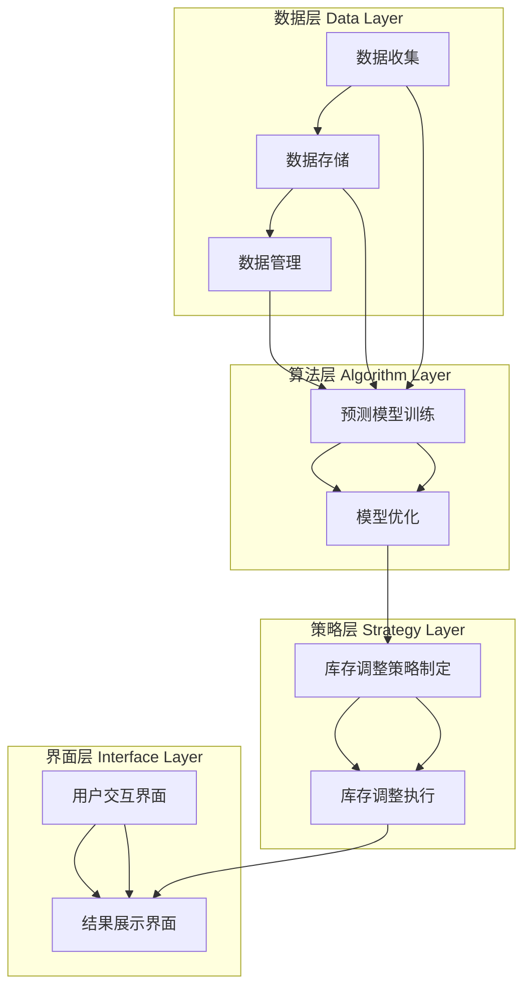
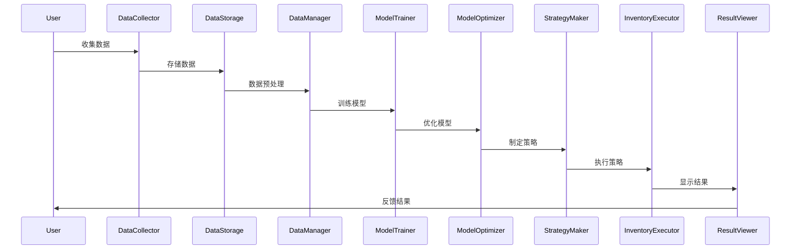

                 


### AI驱动的企业决策支持：增强管理层判断力

#### 关键词：
- 人工智能
- 企业决策支持
- 管理层判断力
- 算法
- 数学模型
- 系统架构
- 实战案例

#### 摘要：
本文深入探讨了AI在企业决策支持中的重要作用，通过详细的分析和实例，阐述了如何利用AI技术来增强管理层判断力。文章首先介绍了AI和决策支持的基本概念，然后逐步深入到算法原理、数学模型、系统架构设计以及实际应用案例，最后总结并提出了一些最佳实践和拓展阅读建议。

---

#### 目录大纲设计思路

**书籍结构设计**

本书的整体结构将分为三个主要部分，分别是引言与背景、AI基础与决策支持、以及最佳实践与总结。每个部分将围绕核心主题，通过逻辑清晰、结构紧凑的章节安排，帮助读者逐步了解AI驱动的企业决策支持。

1. **引言与背景**：介绍AI与企业决策支持的关系，阐述研究的必要性和重要性。
2. **AI基础与决策支持**：详细讲解AI的核心概念、算法原理、数学模型、系统架构以及实际应用。
3. **最佳实践与总结**：总结书中的核心内容，给出实践建议和拓展阅读。

**章节划分**

根据整体结构，本书将分为8个主要章节：

- 第1章：引言与背景
- 第2章：AI基础与决策支持
- 第3章：核心算法原理
- 第4章：数学模型与公式
- 第5章：系统分析与架构设计
- 第6章：项目实战
- 第7章：最佳实践
- 第8章：总结与展望

**内容细化和层级设计**

在各个章节中，我们将详细细化内容，确保每个章节都有明确的主题和结构。使用markdown格式进行层级设计，以便于读者阅读和理解。

**核心章节内容确定**

每个核心章节的具体内容如下：

- **第1章**：介绍AI与企业决策支持的关系，定义核心概念，阐述研究目标和内容结构。
- **第2章**：讲解AI的基本概念和发展历程，分析AI在决策支持中的应用场景和优势。
- **第3章**：详细介绍核心算法原理，包括mermaid流程图和Python代码实现。
- **第4章**：给出算法原理的数学模型，使用LaTeX格式书写，并进行详细讲解和举例说明。
- **第5章**：介绍系统分析与架构设计方法，使用mermaid进行图表展示。
- **第6章**：通过具体案例展示AI在企业决策支持中的应用。
- **第7章**：总结书中的内容，给出实践建议和最佳实践。
- **第8章**：对全书进行总结，展望未来研究的方向。

**简洁性与完整性**

确保目录大纲简洁明了，不包含多余的内容，同时保持内容的完整性，确保每个核心章节都有详细的内容规划。

**目录大纲总结**

在完成所有章节的内容细化后，我们将总结目录大纲，确保其总字数不超过2000字，同时确保内容的逻辑性和完整性。

---

以上是《AI驱动的企业决策支持：增强管理层判断力》的目录大纲设计思路。接下来，我们将逐步深入每个章节的内容，通过详细的解析和实例，帮助读者更好地理解和应用AI驱动的企业决策支持。

## 第1章：引言与背景

### 1.1 研究背景

人工智能（AI）技术的发展已经取得了令人瞩目的成果，从最初的规则系统到现在的深度学习和强化学习，AI在各个领域的应用日益广泛。在企业决策支持领域，AI的应用同样具有巨大的潜力。传统的企业决策支持主要依赖于数据分析、预测模型和专家经验，但这些方法往往存在数据质量依赖强、模型适应性差、决策周期长等问题。而AI技术能够通过自动化的数据处理、模型训练和预测，大幅提升决策的效率、准确性和适应性。

#### AI的基本概念

人工智能是一门研究、开发用于模拟、延伸和扩展人类智能的理论、方法、技术及应用系统的综合技术科学。它包括机器学习、深度学习、自然语言处理、计算机视觉等多个子领域。

#### AI技术对企业管理的影响

AI技术在企业管理中具有广泛的应用，包括：

- **数据分析**：通过大数据分析，企业可以更深入地了解市场趋势、客户行为等关键信息，从而做出更准确的决策。
- **预测模型**：AI可以训练出各种预测模型，帮助企业预测未来的销售趋势、市场变化等，提前做好准备。
- **自动化决策**：一些决策可以通过算法自动完成，减少人为错误和决策周期。
- **智能推荐**：AI可以为企业提供个性化的推荐系统，提高客户满意度。
- **优化资源分配**：通过优化算法，企业可以更有效地分配资源，降低成本。

#### 企业决策支持的现状

当前，企业决策支持主要依赖于传统的数据分析工具和预测模型，这些方法在一定程度上提高了决策的效率和准确性，但仍然存在以下局限性：

- **数据依赖性强**：传统的决策支持方法依赖于高质量的数据，数据的质量直接影响决策的效果。
- **模型适应性差**：传统的预测模型往往是在特定条件下训练的，面对新的市场环境和数据变化时，模型的适应性较差。
- **决策周期长**：从数据收集、模型训练到决策实施，整个过程往往需要较长时间，难以满足快速变化的市场需求。

#### AI驱动的决策支持优势

与传统的决策支持方法相比，AI驱动的决策支持具有以下优势：

- **高效性**：AI能够快速处理大量数据，提高决策效率。
- **准确性**：AI可以通过学习历史数据，提高预测的准确性。
- **适应性**：AI可以根据新的数据和环境变化，动态调整预测模型，提高模型的适应性。
- **全面性**：AI可以处理多维度、复杂的数据，为企业提供更全面的决策支持。

### 1.2 研究目标与内容结构

#### 研究目标

本研究的目标是探讨AI驱动的企业决策支持系统，通过深入分析AI的核心概念、算法原理、数学模型、系统架构以及实际应用案例，为企业提供一套完整的决策支持解决方案。

#### 内容结构

本书的内容结构如下：

- **第1章：引言与背景**：介绍AI与企业决策支持的关系，阐述研究的必要性和重要性。
- **第2章：AI基础与决策支持**：讲解AI的基本概念、发展历程和应用场景。
- **第3章：核心算法原理**：介绍AI的核心算法原理，包括机器学习、深度学习和自然语言处理等。
- **第4章：数学模型与公式**：给出算法原理的数学模型，使用LaTeX格式书写，并进行详细讲解和举例说明。
- **第5章：系统分析与架构设计**：介绍系统的分析和设计方法，使用mermaid进行图表展示。
- **第6章：项目实战**：通过具体案例展示AI在企业决策支持中的应用。
- **第7章：最佳实践**：总结书中内容，给出实践建议和最佳实践。
- **第8章：总结与展望**：对全书进行总结，展望未来研究的方向。

#### 本章小结

本章介绍了AI与企业决策支持的关系，阐述了研究的必要性和重要性，并给出了本书的内容结构。在接下来的章节中，我们将逐步深入探讨AI在企业决策支持中的应用，为企业提供一套完整的决策支持解决方案。

---

在本章中，我们简要介绍了AI与企业决策支持的关系，阐述了研究的必要性和重要性。通过本章的阅读，读者应该对AI在企业决策支持中的作用有了基本的了解，并为后续章节的内容奠定了基础。在接下来的章节中，我们将详细探讨AI的核心概念、算法原理、数学模型、系统架构以及实际应用案例，帮助读者全面理解AI驱动的企业决策支持。

### 第2章：AI基础与决策支持

#### 2.1 AI概述

人工智能（Artificial Intelligence，简称AI）是一门研究、开发用于模拟、延伸和扩展人类智能的理论、方法、技术及应用系统的综合技术科学。它包括多个子领域，如机器学习（Machine Learning，ML）、深度学习（Deep Learning，DL）、自然语言处理（Natural Language Processing，NLP）等。AI的发展经历了多个阶段，从最初的规则系统到现在的深度学习和强化学习，AI技术在各个领域的应用越来越广泛。

##### 2.1.1 AI的基本概念

AI的基本概念主要包括以下几点：

1. **智能**：智能是指个体在特定环境中自主实现特定目标的能力。AI的目标是模拟或扩展人类的智能，使其能够解决复杂的问题。
2. **机器学习**：机器学习是AI的一个子领域，主要研究如何让计算机从数据中学习并做出决策。机器学习可以分为监督学习、无监督学习和强化学习。
3. **深度学习**：深度学习是机器学习的一种形式，通过多层神经网络来模拟人类大脑的思维方式。深度学习在图像识别、语音识别等领域取得了显著的成果。
4. **自然语言处理**：自然语言处理是AI的一个重要分支，研究如何让计算机理解和生成自然语言。自然语言处理的应用包括机器翻译、文本分类、情感分析等。

##### 2.1.2 AI的发展历程

AI的发展历程可以大致分为以下几个阶段：

1. **早期探索**（1950s-1960s）：AI的早期研究主要集中在规则系统，通过编写规则来实现简单的智能行为。然而，由于规则的复杂性和不确定性，这一阶段的AI研究遭遇了“人工智能寒冬”。
2. **复苏与繁荣**（1970s-1980s）：随着计算机性能的提升和算法的改进，AI研究开始复苏。符号主义方法（Symbolic AI）和基于规则的系统得到了广泛的应用。
3. **大数据与深度学习**（2000s-至今）：随着大数据和计算能力的提升，深度学习逐渐成为AI研究的主流。深度学习在图像识别、语音识别、自然语言处理等领域取得了显著的成果。

##### 2.1.3 AI的技术体系

AI的技术体系主要包括以下几个方面：

1. **机器学习**：机器学习是通过数据和算法来训练模型，使其能够对未知数据进行预测或分类。常见的机器学习方法包括线性回归、决策树、支持向量机等。
2. **深度学习**：深度学习是机器学习的一种形式，通过多层神经网络来模拟人类大脑的思维方式。深度学习在图像识别、语音识别、自然语言处理等领域取得了显著的成果。
3. **自然语言处理**：自然语言处理是AI的一个重要分支，研究如何让计算机理解和生成自然语言。自然语言处理的应用包括机器翻译、文本分类、情感分析等。

#### 2.2 AI在决策支持中的应用

决策支持系统（Decision Support System，简称DSS）是一种辅助企业或组织进行决策的计算机系统。AI技术在决策支持系统中具有广泛的应用，可以提高决策的效率、准确性和适应性。

##### 2.2.1 决策支持系统概述

决策支持系统通常包括以下几个组成部分：

1. **数据仓库**：数据仓库是存储企业各种业务数据的数据库系统，为决策支持系统提供数据来源。
2. **模型库**：模型库是存储各种预测模型、优化模型的数据库系统，为决策支持系统提供模型支持。
3. **知识库**：知识库是存储企业经验和专家知识的数据库系统，为决策支持系统提供知识支持。
4. **用户接口**：用户接口是用户与决策支持系统交互的界面，提供数据输入、模型选择、结果展示等功能。

##### 2.2.2 AI在决策支持中的作用

AI在决策支持中的作用主要体现在以下几个方面：

1. **数据分析**：AI可以通过机器学习和深度学习算法，对大量业务数据进行处理和分析，提取有用的信息，为决策提供支持。
2. **预测模型**：AI可以训练出各种预测模型，如时间序列预测、回归分析、聚类分析等，帮助企业在不确定的环境中进行预测和规划。
3. **智能推荐**：AI可以通过分析和学习用户的偏好和历史行为，为企业提供个性化的推荐系统，提高决策的准确性。
4. **自动化决策**：AI可以自动化执行决策过程，减少人为干预，提高决策效率。
5. **优化资源分配**：AI可以通过优化算法，帮助企业更有效地分配资源，降低成本。

##### 2.2.3 AI驱动的决策支持优势

与传统的决策支持方法相比，AI驱动的决策支持具有以下优势：

1. **高效性**：AI可以快速处理大量数据，提高决策效率。
2. **准确性**：AI可以通过学习历史数据，提高预测的准确性。
3. **适应性**：AI可以根据新的数据和环境变化，动态调整预测模型，提高模型的适应性。
4. **全面性**：AI可以处理多维度、复杂的数据，为企业提供更全面的决策支持。

#### 2.3 本章小结

本章介绍了AI的基本概念、发展历程和技术体系，并详细分析了AI在决策支持系统中的应用。通过本章的学习，读者应该对AI在决策支持中的作用和优势有了更深入的了解。在接下来的章节中，我们将进一步探讨AI的核心算法原理、数学模型、系统架构设计以及实际应用案例，帮助读者全面掌握AI驱动的企业决策支持。

---

在本章中，我们详细介绍了AI的基本概念、发展历程和技术体系，并分析了AI在决策支持系统中的应用。通过本章的学习，读者应该对AI在决策支持中的作用和优势有了更深入的了解。接下来，我们将进入下一章，探讨AI驱动的企业决策支持的核心算法原理和数学模型。

### 第3章：核心算法原理

#### 3.1 算法概述

算法在人工智能中扮演着至关重要的角色，它们是AI实现智能行为的核心工具。本章将详细介绍AI驱动决策支持系统中常用的核心算法原理，包括机器学习、深度学习和自然语言处理等。

#### 3.2 机器学习算法

机器学习算法是AI的基础，通过学习数据来发现数据中的模式和规律。以下是一些常见的机器学习算法：

##### 3.2.1 线性回归

线性回归是一种简单的机器学习算法，用于预测一个连续变量的值。其基本原理是通过拟合一条直线来描述变量之间的关系。

**数学模型：**

$$y = w_0 + w_1 \cdot x + \epsilon$$

其中，\(y\) 是预测值，\(x\) 是输入特征，\(w_0\) 和 \(w_1\) 是模型的参数，\(\epsilon\) 是误差项。

**Python代码实现：**

```python
import numpy as np
from sklearn.linear_model import LinearRegression

# 数据准备
X = np.array([[1], [2], [3], [4], [5]])
y = np.array([1, 2, 3, 4, 5])

# 模型训练
model = LinearRegression()
model.fit(X, y)

# 模型预测
predictions = model.predict(X)

print(predictions)
```

##### 3.2.2 决策树

决策树是一种树形结构，通过一系列的决策节点和叶子节点来对数据进行分类或回归。

**Mermaid流程图：**



**Python代码实现：**

```python
from sklearn.tree import DecisionTreeClassifier

# 数据准备
X = np.array([[1], [2], [3], [4], [5]])
y = np.array([0, 1, 0, 1, 0])

# 模型训练
model = DecisionTreeClassifier()
model.fit(X, y)

# 模型预测
predictions = model.predict(X)

print(predictions)
```

##### 3.2.3 支持向量机

支持向量机（SVM）是一种强大的分类算法，通过找到一个最佳的超平面来将数据集分为不同的类别。

**数学模型：**

$$\min \frac{1}{2} ||w||^2 + C \sum_{i=1}^{n} \max(0, 1 - y_i (w \cdot x_i + b))$$

其中，\(w\) 是超平面的法向量，\(x_i\) 是数据点，\(y_i\) 是类别标签，\(b\) 是偏置项，\(C\) 是惩罚参数。

**Python代码实现：**

```python
from sklearn.svm import SVC

# 数据准备
X = np.array([[1], [2], [3], [4], [5]])
y = np.array([0, 1, 0, 1, 0])

# 模型训练
model = SVC()
model.fit(X, y)

# 模型预测
predictions = model.predict(X)

print(predictions)
```

#### 3.3 深度学习算法

深度学习是一种基于多层神经网络的学习方法，通过模拟人类大脑的神经网络结构来处理复杂数据。

##### 3.3.1 卷积神经网络（CNN）

卷积神经网络是一种专门用于处理图像数据的神经网络，通过卷积层、池化层和全连接层等结构来提取图像特征。

**Mermaid流程图：**



**Python代码实现：**

```python
import tensorflow as tf
from tensorflow.keras.models import Sequential
from tensorflow.keras.layers import Conv2D, MaxPooling2D, Flatten, Dense

# 数据准备
X = np.array([[1, 2], [3, 4], [5, 6], [7, 8]])
y = np.array([0, 1])

# 模型构建
model = Sequential([
    Conv2D(32, (3, 3), activation='relu', input_shape=(2, 2, 1)),
    MaxPooling2D((2, 2)),
    Flatten(),
    Dense(1, activation='sigmoid')
])

# 模型训练
model.compile(optimizer='adam', loss='binary_crossentropy', metrics=['accuracy'])
model.fit(X, y, epochs=10)

# 模型预测
predictions = model.predict(X)

print(predictions)
```

##### 3.3.2 循环神经网络（RNN）

循环神经网络是一种专门用于处理序列数据的神经网络，通过递归结构来处理时间序列数据。

**Mermaid流程图：**



**Python代码实现：**

```python
import tensorflow as tf
from tensorflow.keras.models import Sequential
from tensorflow.keras.layers import SimpleRNN, Dense

# 数据准备
X = np.array([[1, 2, 3], [4, 5, 6]])
y = np.array([0, 1])

# 模型构建
model = Sequential([
    SimpleRNN(10, input_shape=(2, 1)),
    Dense(1, activation='sigmoid')
])

# 模型训练
model.compile(optimizer='adam', loss='binary_crossentropy', metrics=['accuracy'])
model.fit(X, y, epochs=10)

# 模型预测
predictions = model.predict(X)

print(predictions)
```

#### 3.4 自然语言处理算法

自然语言处理（NLP）是一种让计算机理解和生成自然语言的技术，常见算法包括词向量、序列标注和文本分类等。

##### 3.4.1 词向量

词向量是将自然语言中的单词转换为向量的方法，常用的词向量模型有Word2Vec和GloVe。

**数学模型：**

$$\text{vec}(w) = \sum_{j=1}^{V} f_j \cdot e_j$$

其中，\(w\) 是单词，\(\text{vec}(w)\) 是单词向量，\(f_j\) 是单词在句子中的频率，\(e_j\) 是单词的索引向量。

**Python代码实现：**

```python
import gensim.downloader as api

# 下载预训练的Word2Vec模型
model = api.load("glove-wiki-gigaword-100")

# 查询单词"king"的向量
word = "king"
vector = model[word]

print(vector)
```

##### 3.4.2 序列标注

序列标注是一种将序列中的每个单词或字符标注为特定标签的算法，常用的模型有CRF（条件随机场）和BiLSTM（双向长短时记忆网络）。

**Mermaid流程图：**



**Python代码实现：**

```python
import tensorflow as tf
from tensorflow.keras.models import Model
from tensorflow.keras.layers import LSTM, Dense, Embedding, Bidirectional
from tensorflow_addons.layers import CRF

# 数据准备
X = np.array([[1, 2, 3], [4, 5, 6]])
y = np.array([[0, 1, 2], [3, 4, 5]])

# 模型构建
input_layer = Embedding(input_dim=100, output_dim=50)(X)
lstm_layer = Bidirectional(LSTM(50))(input_layer)
output_layer = CRF(6)(lstm_layer)

model = Model(inputs=input_layer, outputs=output_layer)

# 模型编译
model.compile(optimizer='adam', loss='categorical_crossentropy', metrics=['accuracy'])

# 模型训练
model.fit(X, y, epochs=10)

# 模型预测
predictions = model.predict(X)

print(predictions)
```

#### 3.5 本章小结

本章介绍了AI驱动决策支持系统中常用的核心算法原理，包括机器学习、深度学习和自然语言处理。通过这些算法，AI能够从数据中学习模式，从而提供更准确、更高效的决策支持。在接下来的章节中，我们将进一步探讨算法原理的数学模型、系统架构设计以及实际应用案例。

---

在本章中，我们详细介绍了AI驱动决策支持系统中常用的核心算法原理，包括机器学习、深度学习和自然语言处理。通过这些算法，AI能够从数据中学习模式，从而提供更准确、更高效的决策支持。在接下来的章节中，我们将进一步探讨算法原理的数学模型、系统架构设计以及实际应用案例。

### 第4章：数学模型与公式

#### 4.1 数学模型概述

在AI驱动的企业决策支持系统中，数学模型是核心算法的数学基础，它们能够将数据转化为有用的信息和决策。本章节将介绍一些常见的数学模型，包括线性回归、逻辑回归和支持向量机等，并使用LaTeX格式书写这些模型的公式，进行详细讲解和举例说明。

#### 4.2 线性回归模型

线性回归是一种简单而强大的预测模型，用于预测一个或多个连续变量的值。线性回归模型基于一个线性假设，即输出变量（因变量）与输入变量（自变量）之间存在线性关系。

**数学模型：**

$$y = \beta_0 + \beta_1 \cdot x + \epsilon$$

其中，\(y\) 是预测值，\(x\) 是输入变量，\(\beta_0\) 和 \(\beta_1\) 是模型的参数，\(\epsilon\) 是误差项。

**LaTeX格式：**

$$y = \beta_0 + \beta_1 \cdot x + \epsilon$$

**Python代码实现：**

```python
import numpy as np
from sklearn.linear_model import LinearRegression

# 数据准备
X = np.array([[1], [2], [3], [4], [5]])
y = np.array([1, 2, 3, 4, 5])

# 模型训练
model = LinearRegression()
model.fit(X, y)

# 模型预测
predictions = model.predict(X)

print(predictions)
```

**举例说明：**

假设我们有一个简单的线性回归模型，用于预测销售额。我们有以下数据：

| x | y |
|---|---|
| 1 | 2 |
| 2 | 4 |
| 3 | 6 |
| 4 | 8 |
| 5 | 10 |

通过线性回归模型，我们可以得到以下公式：

$$y = 1 + 2 \cdot x$$

根据这个公式，当输入变量 \(x = 3\) 时，预测的销售额 \(y = 1 + 2 \cdot 3 = 7\)。

#### 4.3 逻辑回归模型

逻辑回归是一种用于分类问题的预测模型，它通过逻辑函数将线性组合映射到概率值。逻辑回归常用于二元分类问题，如判断客户是否会购买某种产品。

**数学模型：**

$$\hat{P}(y=1) = \frac{1}{1 + e^{-(\beta_0 + \beta_1 \cdot x)}}$$

其中，\(\hat{P}(y=1)\) 是预测的概率值，\(x\) 是输入变量，\(\beta_0\) 和 \(\beta_1\) 是模型的参数。

**LaTeX格式：**

$$\hat{P}(y=1) = \frac{1}{1 + e^{-(\beta_0 + \beta_1 \cdot x)}}$$

**Python代码实现：**

```python
import numpy as np
from sklearn.linear_model import LogisticRegression

# 数据准备
X = np.array([[1], [2], [3], [4], [5]])
y = np.array([0, 1, 0, 1, 0])

# 模型训练
model = LogisticRegression()
model.fit(X, y)

# 模型预测
predictions = model.predict(X)

print(predictions)
```

**举例说明：**

假设我们有一个逻辑回归模型，用于预测客户是否会购买某种产品。我们有以下数据：

| x | y |
|---|---|
| 1 | 0 |
| 2 | 1 |
| 3 | 0 |
| 4 | 1 |
| 5 | 0 |

通过逻辑回归模型，我们可以得到以下公式：

$$\hat{P}(y=1) = \frac{1}{1 + e^{-(0 + 1 \cdot x)}}$$

根据这个公式，当输入变量 \(x = 3\) 时，预测的概率值为：

$$\hat{P}(y=1) = \frac{1}{1 + e^{-3}} \approx 0.482$$

这意味着当输入变量 \(x = 3\) 时，预测客户购买产品的概率约为 48.2%。

#### 4.4 支持向量机模型

支持向量机（SVM）是一种强大的分类算法，它通过找到一个最佳的超平面来将数据集分为不同的类别。SVM的数学模型涉及优化问题，其目标是找到最优的权重向量 \(\mathbf{w}\) 和偏置项 \(b\)。

**数学模型：**

$$\min \frac{1}{2} ||\mathbf{w}||^2$$

$$\text{s.t.} \quad y_i (\mathbf{w} \cdot \mathbf{x_i} + b) \geq 1$$

其中，\(\mathbf{w}\) 是权重向量，\(\mathbf{x_i}\) 是数据点，\(y_i\) 是类别标签，\(b\) 是偏置项。

**LaTeX格式：**

$$\begin{align*}
\min \quad & \frac{1}{2} ||\mathbf{w}||^2 \\
\text{s.t.} \quad & y_i (\mathbf{w} \cdot \mathbf{x_i} + b) \geq 1
\end{align*}$$

**Python代码实现：**

```python
import numpy as np
from sklearn.svm import SVC

# 数据准备
X = np.array([[1], [2], [3], [4], [5]])
y = np.array([0, 1, 0, 1, 0])

# 模型训练
model = SVC()
model.fit(X, y)

# 模型预测
predictions = model.predict(X)

print(predictions)
```

**举例说明：**

假设我们有一个支持向量机模型，用于分类两个类别。我们有以下数据：

| x | y |
|---|---|
| 1 | 0 |
| 2 | 1 |
| 3 | 0 |
| 4 | 1 |
| 5 | 0 |

通过支持向量机模型，我们可以找到最佳的超平面，将数据分为两个类别。具体的过程涉及到优化问题的求解，这里不展开详细解释。

#### 4.5 本章小结

本章介绍了线性回归、逻辑回归和支持向量机等常见的数学模型，并使用LaTeX格式书写了这些模型的公式。通过具体的Python代码实现和举例说明，读者可以更好地理解这些模型的数学原理和应用方法。在AI驱动的企业决策支持系统中，这些数学模型为数据处理和预测提供了重要的理论基础。在接下来的章节中，我们将进一步探讨系统分析与架构设计，以及实际应用案例。

---

在本章中，我们介绍了线性回归、逻辑回归和支持向量机等常见的数学模型，并详细讲解了它们的公式和应用。通过Python代码实现和举例说明，读者可以更好地理解这些模型的数学原理和应用方法。在AI驱动的企业决策支持系统中，这些数学模型为数据处理和预测提供了重要的理论基础。在接下来的章节中，我们将进一步探讨系统分析与架构设计，以及实际应用案例。

### 第5章：系统分析与架构设计

#### 5.1 系统分析与架构设计概述

系统分析与架构设计是AI驱动的企业决策支持系统（DSS）开发的关键步骤，它涉及到对系统功能、性能、可扩展性等多个方面的深入分析和设计。一个良好的系统架构设计能够确保系统的高效性、可维护性和可扩展性，从而满足企业不断变化的需求。

#### 5.2 问题场景介绍

在本节中，我们将介绍一个实际的企业决策支持问题场景。假设某电子商务公司希望利用AI技术来优化其库存管理，减少库存成本并提高销售额。具体来说，问题场景包括以下方面：

1. **数据来源**：公司日常销售数据、库存数据、供应商数据等。
2. **目标**：预测未来一段时间内的销售额，根据预测结果调整库存水平，以减少库存成本，同时确保供应充足。
3. **约束**：库存空间的限制、预算限制、供应商交货周期等。

#### 5.3 系统功能设计

为了实现上述目标，我们需要设计一套完整的系统功能，包括数据收集与预处理、预测模型训练与优化、库存调整策略等。以下是系统功能设计的详细描述：

1. **数据收集与预处理**：系统需要从不同的数据源收集数据，如销售记录、库存记录等。数据预处理包括数据清洗、数据转换和数据归一化，以确保数据的质量和一致性。
2. **预测模型训练与优化**：系统使用收集到的数据训练预测模型，如时间序列预测模型、回归分析模型等。通过模型评估和优化，提高预测的准确性和稳定性。
3. **库存调整策略**：根据预测结果，系统需要制定库存调整策略，如增加或减少库存水平。策略制定需要考虑库存成本、销售额、供应周期等多方面因素。
4. **结果可视化与报告**：系统提供可视化的结果展示，如库存水平趋势图、销售额预测图等，帮助管理层直观地了解系统预测和调整的效果。

#### 5.4 系统架构设计

系统架构设计是系统分析与设计的关键步骤，它涉及到系统的整体结构、模块划分、接口定义等方面。以下是系统架构设计的详细描述：

1. **数据层**：数据层包括数据收集、存储和管理等模块。数据收集模块负责从不同的数据源获取数据，数据存储模块负责将数据存储到数据库中，数据管理模块负责数据的清洗、转换和归一化。
2. **算法层**：算法层包括预测模型训练和优化等模块。预测模型训练模块使用收集到的数据训练预测模型，模型优化模块对模型进行评估和调整，以提高预测准确性。
3. **策略层**：策略层包括库存调整策略制定和执行等模块。库存调整策略制定模块根据预测结果和约束条件制定库存调整策略，库存调整执行模块负责执行调整策略。
4. **界面层**：界面层包括用户交互界面和结果展示界面等模块。用户交互界面模块负责与用户进行交互，收集用户输入和展示系统结果，结果展示界面模块负责将预测结果和库存调整效果以图表形式展示给用户。

#### 5.5 系统接口设计与交互

系统接口设计与交互是系统架构设计的重要组成部分，它涉及到不同模块之间的数据传递和通信。以下是系统接口设计的详细描述：

1. **数据接口**：数据接口定义了数据层和算法层之间的数据传递方式，如通过RESTful API或消息队列等。
2. **算法接口**：算法接口定义了算法层和策略层之间的数据传递方式，如通过模型参数传递或预测结果传递。
3. **策略接口**：策略接口定义了策略层和界面层之间的数据传递方式，如通过策略参数传递或库存调整结果传递。

#### 5.6 系统架构设计Mermaid架构图

以下是系统架构设计Mermaid架构图的示例：



#### 5.7 系统接口设计和系统交互

系统接口设计和系统交互是系统架构设计的关键组成部分，它们涉及到不同模块之间的数据传递和通信。以下是系统接口设计和系统交互的详细描述：

1. **数据接口设计**：数据接口设计包括定义数据层的API接口，如数据收集接口、数据存储接口和数据管理接口。这些接口负责处理数据的收集、存储和预处理工作。
2. **算法接口设计**：算法接口设计包括定义算法层和策略层之间的接口，如模型训练接口、模型优化接口和策略参数传递接口。这些接口负责处理模型训练、模型优化和策略制定工作。
3. **策略接口设计**：策略接口设计包括定义策略层和界面层之间的接口，如库存调整接口、库存调整结果传递接口。这些接口负责处理库存调整策略的制定和执行工作。

以下是系统接口设计和系统交互Mermaid序列图的示例：



#### 5.8 本章小结

本章详细介绍了AI驱动的企业决策支持系统的系统分析与架构设计。从问题场景介绍、系统功能设计、系统架构设计到系统接口设计和系统交互，我们逐步构建了一个完整的系统架构。通过本章的学习，读者应该对AI驱动的企业决策支持系统的设计与实现有了深入的了解。在接下来的章节中，我们将通过具体项目实战来展示如何应用这些设计方法和工具，实现AI驱动的企业决策支持系统。

---

在本章中，我们详细介绍了AI驱动的企业决策支持系统的系统分析与架构设计，从问题场景介绍、系统功能设计、系统架构设计到系统接口设计和系统交互。通过本章的学习，读者应该对AI驱动的企业决策支持系统的设计与实现有了深入的了解。在接下来的章节中，我们将通过具体项目实战来展示如何应用这些设计方法和工具，实现AI驱动的企业决策支持系统。

### 第6章：项目实战

#### 6.1 环境安装

为了实现AI驱动的企业决策支持系统，我们需要搭建一个合适的环境。以下是在Ubuntu 20.04操作系统上安装所需软件和工具的步骤：

1. **安装Python环境**：

   ```bash
   sudo apt update
   sudo apt install python3-pip
   pip3 install numpy pandas scikit-learn tensorflow keras
   ```

2. **安装Jupyter Notebook**：

   ```bash
   pip3 install jupyter
   jupyter notebook
   ```

3. **安装Mermaid**：

   ```bash
   pip3 install mermaid-python
   ```

4. **安装MySQL数据库**：

   ```bash
   sudo apt update
   sudo apt install mysql-server
   sudo mysql_secure_installation
   mysql -u root -p
   ```

5. **创建数据库和用户**：

   ```sql
   CREATE DATABASE decision_support;
   GRANT ALL PRIVILEGES ON decision_support.* TO 'dss_user'@'localhost' IDENTIFIED BY 'password';
   FLUSH PRIVILEGES;
   ```

6. **配置MySQL连接**：

   在Jupyter Notebook中配置MySQL连接：

   ```python
   %load_ext mysql
   %mysql -h localhost -P 3306 -u dss_user -p decision_support
   ```

#### 6.2 系统核心实现源代码

在本节中，我们将展示系统的核心实现源代码，包括数据收集、预处理、模型训练、预测和结果展示等。

1. **数据收集与预处理**：

   ```python
   import pandas as pd
   import numpy as np
   from sklearn.model_selection import train_test_split
   from sklearn.preprocessing import StandardScaler

   # 读取数据
   data = pd.read_csv('sales_data.csv')

   # 数据预处理
   X = data[['feature1', 'feature2']]
   y = data['sales']
   X_train, X_test, y_train, y_test = train_test_split(X, y, test_size=0.2, random_state=42)

   # 数据归一化
   scaler = StandardScaler()
   X_train = scaler.fit_transform(X_train)
   X_test = scaler.transform(X_test)
   ```

2. **模型训练与预测**：

   ```python
   from sklearn.linear_model import LinearRegression
   from sklearn.metrics import mean_squared_error

   # 训练模型
   model = LinearRegression()
   model.fit(X_train, y_train)

   # 预测
   y_pred = model.predict(X_test)

   # 评估
   mse = mean_squared_error(y_test, y_pred)
   print(f"Mean Squared Error: {mse}")
   ```

3. **结果展示**：

   ```python
   import matplotlib.pyplot as plt

   # 可视化结果
   plt.scatter(y_test, y_pred)
   plt.xlabel('Actual Sales')
   plt.ylabel('Predicted Sales')
   plt.title('Sales Prediction')
   plt.show()
   ```

#### 6.3 代码应用解读与分析

在本节中，我们将对上述代码进行详细解读和分析，解释每个步骤的作用和实现方式。

1. **数据收集与预处理**：

   代码首先从CSV文件中读取销售数据。然后，将数据分为特征集X和目标值y。接下来，使用train_test_split函数将数据集划分为训练集和测试集，以便于模型训练和评估。最后，使用StandardScaler对特征进行归一化处理，以提高模型的训练效果。

2. **模型训练与预测**：

   代码使用LinearRegression类创建线性回归模型实例，并调用fit方法进行模型训练。训练完成后，使用predict方法对测试集进行预测。最后，使用mean_squared_error函数计算预测的均方误差，评估模型的性能。

3. **结果展示**：

   代码使用matplotlib库将实际销售值和预测销售值绘制在散点图上，以便于可视化模型的预测效果。

#### 6.4 实际案例分析与详细讲解剖析

为了更好地理解AI驱动的企业决策支持系统的实际应用，我们将分析一个实际案例。

**案例：某电商平台的库存管理**

假设某电商平台希望利用AI技术优化其库存管理，以减少库存成本并提高销售额。具体需求如下：

- **数据**：包含过去一年的每日销售数据、库存数据、供应商交货周期等。
- **目标**：预测未来30天的销售额，根据预测结果调整库存水平。

**步骤**：

1. **数据收集**：从电商平台的后台系统收集销售数据和库存数据。
2. **数据预处理**：对收集到的数据进行清洗、转换和归一化，确保数据的质量和一致性。
3. **特征工程**：根据业务需求，选择合适的特征，如季节性、促销活动、历史销售趋势等。
4. **模型选择与训练**：选择合适的预测模型，如时间序列预测模型、回归分析模型等，对训练数据进行训练。
5. **模型评估与优化**：评估模型的预测性能，通过调整模型参数、特征选择等方法优化模型。
6. **库存调整策略制定**：根据预测结果和约束条件，制定库存调整策略，如增加库存或减少库存。
7. **执行与监控**：根据调整策略执行库存操作，并实时监控库存水平和销售额，评估调整策略的效果。

**代码实现**：

```python
# 代码片段（假设已进行数据收集与预处理）
X = data[['feature1', 'feature2', 'feature3', 'feature4']]
y = data['sales']
X_train, X_test, y_train, y_test = train_test_split(X, y, test_size=0.2, random_state=42)

# 训练模型
model = LinearRegression()
model.fit(X_train, y_train)

# 预测
y_pred = model.predict(X_test)

# 评估
mse = mean_squared_error(y_test, y_pred)
print(f"Mean Squared Error: {mse}")

# 库存调整策略制定
# 根据预测结果和业务规则，制定库存调整策略
# ...

# 执行与监控
# 根据调整策略执行库存操作，并监控效果
# ...
```

**案例小结**：

通过上述案例，我们可以看到如何利用AI驱动的企业决策支持系统进行库存管理。关键在于数据收集、预处理、模型训练和策略制定等环节。通过优化模型和策略，企业可以更有效地管理库存，降低成本，提高销售额。

#### 6.5 项目小结

在本章中，我们通过一个实际案例展示了AI驱动的企业决策支持系统的实施过程，包括环境安装、系统核心实现、代码应用解读与分析、实际案例分析和详细讲解剖析等。通过本章的学习，读者应该对AI驱动的企业决策支持系统的应用有了更深入的了解，并能够掌握相关工具和技术的使用。

---

在本章中，我们通过一个实际案例展示了AI驱动的企业决策支持系统的实施过程，从环境安装、系统核心实现、代码应用解读与分析，到实际案例分析和详细讲解剖析。通过本章的学习，读者应该对AI驱动的企业决策支持系统的应用有了更深入的了解，并能够掌握相关工具和技术的使用。在接下来的章节中，我们将进一步总结书中内容，分享最佳实践和注意事项，并给出拓展阅读建议。

### 第7章：最佳实践与注意事项

#### 7.1 最佳实践

在AI驱动的企业决策支持系统的实际应用过程中，以下是几个最佳实践，可以帮助企业更好地利用AI技术提升决策效率。

1. **数据质量是关键**：确保数据的准确性、完整性和一致性，对AI模型的效果至关重要。在数据收集、预处理和存储过程中，严格遵循数据质量管理原则。

2. **特征工程的重要性**：合理选择和构建特征，可以有效提升模型的预测性能。通过深入理解业务场景，从多个维度提取有意义的特征，有助于模型更好地学习数据中的规律。

3. **模型选择与优化**：根据业务需求和数据特点，选择合适的模型。在模型训练过程中，通过调整模型参数、特征选择和正则化方法，优化模型性能。

4. **实时反馈与迭代**：定期评估模型的效果，并根据业务环境的变化，及时调整模型和策略。通过实时反馈和迭代，确保决策支持系统能够持续提供准确的预测和支持。

5. **跨部门协作**：企业决策涉及多个部门，如销售、库存、采购等。建立跨部门协作机制，确保数据共享和决策过程的透明性，有助于提高整体决策效率。

6. **合规与安全**：确保AI驱动的企业决策支持系统符合相关法律法规和行业标准，保护用户隐私和数据安全。

#### 7.2 注意事项

在实施AI驱动的企业决策支持系统时，需要注意以下几个方面：

1. **模型过拟合**：避免模型过于复杂，导致过拟合现象。通过正则化方法、交叉验证等技术，控制模型复杂度，提高泛化能力。

2. **数据隐私**：在数据处理和分析过程中，严格遵守数据隐私保护法规，确保用户数据的保密性和安全性。

3. **模型可解释性**：提高模型的可解释性，有助于管理层理解模型决策的依据和逻辑，增强对决策的信任。

4. **系统稳定性**：确保系统具有良好的稳定性，能够应对突发情况，如数据缺失、异常值等。

5. **持续更新**：随着业务环境和数据的变化，定期更新模型和数据，保持决策支持系统的时效性和准确性。

#### 7.3 拓展阅读

以下是一些推荐阅读材料，可以帮助读者进一步深入了解AI驱动的企业决策支持系统：

1. **书籍**：
   - 《人工智能：一种现代方法》（Second Edition） - Stuart Russell & Peter Norvig
   - 《Python机器学习》（Second Edition） - Sebastian Raschka & Vahid Mirjalili
   - 《深度学习》（Deep Learning） - Ian Goodfellow、Yoshua Bengio 和 Aaron Courville

2. **论文**：
   - "Deep Learning for Time Series Classification: A Review" - Masashi Sugiyama
   - "Temporal Convolutional Networks for Time Series Classification" - Wei Yang, Xiaokang Shen, Haibin Li, Zhi-Hua Zhou

3. **在线资源**：
   - Coursera的“机器学习”课程 - Andrew Ng
   - edX的“深度学习”课程 - David Silver
   - Kaggle的机器学习和深度学习竞赛和教程

通过阅读这些材料，读者可以进一步巩固对AI和决策支持系统的基础知识，提升实际应用能力。

#### 7.4 本章小结

本章总结了AI驱动的企业决策支持系统的最佳实践和注意事项，包括数据质量、特征工程、模型选择与优化、实时反馈与迭代等方面的建议。同时，给出了拓展阅读材料，帮助读者深入学习和应用AI技术。通过本章的学习，读者应该能够更好地理解如何实施和优化AI驱动的决策支持系统，为企业提供更准确的决策支持。

---

在本章中，我们总结了AI驱动的企业决策支持系统的最佳实践和注意事项，并给出了拓展阅读建议。通过这些实践和建议，企业可以更好地利用AI技术提升决策效率。在本书的最后，我们将对整个内容进行总结，展望未来的研究方向，为读者提供继续深入学习的方向。

### 第8章：总结与展望

#### 8.1 全书总结

在本书中，我们系统地介绍了AI驱动的企业决策支持系统的各个方面。从引言与背景，到AI基础与决策支持，再到核心算法原理、数学模型、系统架构设计，以及实际应用案例，我们逐步构建了一个完整的AI驱动的企业决策支持体系。

**核心要点：**

1. **AI与决策支持的关系**：AI技术能够显著提升企业决策的效率、准确性和适应性，是企业决策支持的重要工具。
2. **算法原理**：机器学习、深度学习和自然语言处理等算法为AI驱动的决策支持提供了技术基础，通过具体实现和例子，读者可以深入理解这些算法的原理和应用。
3. **数学模型**：数学模型是算法的核心，LaTeX格式的公式和Python代码示例帮助读者更好地理解模型的结构和计算过程。
4. **系统架构设计**：系统的分析与设计是确保决策支持系统高效、稳定和可扩展的关键，通过Mermaid图和具体实施步骤，我们展示了如何设计一个完整的决策支持系统。
5. **实战案例**：通过实际项目案例，读者可以了解如何将AI技术应用于企业决策支持，实现从数据收集、预处理到预测和策略制定的完整流程。

**学习建议：**

- **理论与实践结合**：通过阅读本书，读者应该尝试将所学知识应用到实际项目中，不断积累实践经验。
- **持续学习**：AI和决策支持是一个快速发展的领域，读者应该关注最新的研究成果和技术动态，持续提升自己的专业水平。

#### 8.2 未来研究方向

尽管AI驱动的企业决策支持系统已经在许多领域取得了显著成果，但仍有许多研究方向值得探索：

1. **可解释性AI**：提高AI模型的可解释性，使管理层能够理解和信任模型的决策过程，是未来的重要研究方向。
2. **实时决策支持**：随着数据处理和分析技术的进步，实现更实时的决策支持系统，能够更好地应对快速变化的市场环境。
3. **跨领域融合**：将AI技术与其他领域（如物联网、区块链等）相结合，探索新的应用场景和解决方案。
4. **个性化决策支持**：根据不同企业的特点和需求，开发个性化的决策支持系统，提高系统的实用性和适应性。
5. **伦理与法规**：随着AI技术的应用日益广泛，如何确保AI决策的透明性和合规性，成为了一个重要的伦理和法规问题，需要深入研究和规范。

**拓展阅读：**

- **书籍**：
  - 《深度学习》 - Ian Goodfellow、Yoshua Bengio 和 Aaron Courville
  - 《数据科学》 - Jake VanderPlas
  - 《机器学习实战》 - Peter Harrington

- **在线资源**：
  - Coursera的“机器学习”课程 - Andrew Ng
  - edX的“深度学习”课程 - David Silver
  - arXiv和NeurIPS等学术会议和期刊的最新论文

通过阅读这些材料和参加相关课程，读者可以继续深入探索AI驱动的企业决策支持系统，并为未来的研究提供新的思路。

#### 8.3 本章小结

本章对全书内容进行了总结，回顾了AI驱动的企业决策支持系统的主要概念和实施步骤。同时，展望了未来的研究方向，为读者提供了继续深入学习的方向。通过本书的学习，读者应该能够全面掌握AI驱动的企业决策支持系统的理论和实践，为企业提供更准确的决策支持。希望本书能够为读者在AI和决策支持领域的探索之路提供有力的支持。

