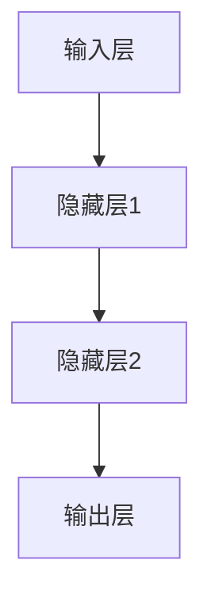

                 

### 文章标题：AI驱动的企业危机管理：快速响应突发事件

关键词：企业危机管理、人工智能、机器学习、深度学习、危机预测、危机响应

摘要：本文深入探讨了人工智能（AI）在驱动企业危机管理中的应用，通过分析突发事件对企业的影响，介绍了AI的核心概念和原理，以及AI在危机预测和响应中的具体应用。通过案例分析，总结了AI驱动的企业危机管理最佳实践，并对未来发展趋势进行了展望。本文旨在为企业提供有效的危机管理策略，帮助企业快速响应突发事件，降低损失。

### 目录大纲

----------------------------------------------------------------

## 第一部分: AI驱动的企业危机管理概述

## 第1章: 背景与问题分析

### 1.1 背景介绍

#### 1.1.1 突发事件的定义与分类

#### 1.1.2 突发事件对企业的冲击

#### 1.1.3 企业危机管理的必要性

### 1.2 问题分析

#### 1.2.1 现有危机管理模式的不足

#### 1.2.2 AI技术如何应用于危机管理

#### 1.2.3 企业危机管理中的AI应用场景

## 第2章: AI核心概念与原理

### 2.1 AI概述

#### 2.1.1 AI的定义与发展历程

#### 2.1.2 AI的核心技术

#### 2.1.3 AI的分类与特点

### 2.2 机器学习基础

#### 2.2.1 机器学习的定义与原理

#### 2.2.2 监督学习、无监督学习和强化学习

#### 2.2.3 机器学习算法的选择与应用

### 2.3 深度学习原理

#### 2.3.1 深度学习的定义与特点

#### 2.3.2 神经网络架构

#### 2.3.3 深度学习算法原理与实例

## 第3章: AI驱动的企业危机管理

### 3.1 AI在危机预测中的应用

#### 3.1.1 预测模型的选择与训练

#### 3.1.2 预测结果的分析与优化

#### 3.1.3 预测在危机管理中的实际应用

### 3.2 AI在危机响应中的应用

#### 3.2.1 响应策略的制定

#### 3.2.2 响应过程的自动化

#### 3.2.3 响应效果的评估与调整

## 第4章: 企业危机管理案例

### 4.1 案例背景

#### 4.1.1 案例企业介绍

#### 4.1.2 案例危机事件描述

### 4.2 案例分析

#### 4.2.1 危机预测

#### 4.2.2 危机响应

#### 4.2.3 案例效果评估

### 4.3 案例启示

#### 4.3.1 AI驱动的危机管理优势

#### 4.3.2 案例中存在的问题与改进方向

## 第5章: AI驱动的企业危机管理最佳实践

### 5.1 实践经验总结

#### 5.1.1 成功案例

#### 5.1.2 失败案例

#### 5.1.3 经验教训

### 5.2 实践技巧与策略

#### 5.2.1 数据收集与处理

#### 5.2.2 模型训练与优化

#### 5.2.3 响应流程设计与实现

## 第6章: AI驱动的企业危机管理展望

### 6.1 未来发展趋势

#### 6.1.1 技术进步

#### 6.1.2 应用场景拓展

#### 6.1.3 政策法规与伦理问题

### 6.2 企业应对策略

#### 6.2.1 技术储备

#### 6.2.2 组织架构调整

#### 6.2.3 培训与人才培养

## 第7章: 小结与拓展

### 7.1 全书回顾

#### 7.1.1 核心内容

#### 7.1.2 关键知识点

### 7.2 注意事项

#### 7.2.1 实践中的风险

#### 7.2.2 挑战与应对

### 7.3 拓展阅读

#### 7.3.1 相关书籍

#### 7.3.2 学术论文

#### 7.3.3 在线资源

----------------------------------------------------------------

### 第一部分: AI驱动的企业危机管理概述

#### 第1章: 背景与问题分析

##### 1.1 背景介绍

##### 1.1.1 突发事件的定义与分类

突发事件，是指突然发生且不可预见的事件，对企业运营和业务造成显著影响的危机。根据其性质和影响范围，可以分为以下几类：

1. 自然灾害：如地震、洪水、台风等。
2. 技术故障：如服务器宕机、网络中断、数据泄露等。
3. 事故灾难：如火灾、爆炸、交通事故等。
4. 经济危机：如金融危机、市场波动、供应链中断等。
5. 社会事件：如公共卫生事件、劳动争议、恐怖袭击等。

##### 1.1.2 突发事件对企业的冲击

突发事件对企业的影响是多方面且深远的：

1. 资产损失：突发事件可能导致企业资产损毁，如设备损坏、库存丢失等。
2. 运营中断：突发事件可能导致企业运营中断，如生产线停滞、服务中断等。
3. 品牌形象受损：突发事件可能对企业品牌形象造成负面影响，如客户信任下降、市场占有率下降等。
4. 经济损失：突发事件可能导致企业经济损失，如收入减少、成本增加等。
5. 法律风险：突发事件可能引发法律纠纷，如责任追究、合同纠纷等。

##### 1.1.3 企业危机管理的必要性

企业危机管理是指企业在面临突发事件时，通过有效的预防和应对措施，降低损失、恢复正常运营、重塑企业形象的过程。企业危机管理的必要性主要体现在以下几个方面：

1. 降低损失：危机管理可以帮助企业降低突发事件带来的损失，如减少资产损毁、避免运营中断等。
2. 保证安全：危机管理可以确保企业员工和客户的安全，降低事故灾难带来的伤亡风险。
3. 恢复运营：危机管理可以帮助企业尽快恢复正常运营，减少经济损失。
4. 重塑形象：危机管理可以帮助企业重塑品牌形象，增强客户信任和忠诚度。
5. 提升竞争力：通过有效的危机管理，企业可以在激烈的市场竞争中脱颖而出，提升竞争力。

##### 1.2 问题分析

##### 1.2.1 现有危机管理模式的不足

现有的企业危机管理模式存在以下不足：

1. 预测能力有限：传统危机管理主要依赖于经验和历史数据，难以准确预测突发事件的发生。
2. 应对速度较慢：传统危机管理需要人工干预，应对速度较慢，可能导致危机进一步扩大。
3. 灵活性不足：传统危机管理方案固定，难以适应不同类型和程度的突发事件。
4. 数据依赖性高：传统危机管理对数据依赖性较高，但数据质量和数量有限，影响决策效果。
5. 效率低下：传统危机管理流程繁琐，人工干预较多，导致管理效率低下。

##### 1.2.2 AI技术如何应用于危机管理

AI技术在危机管理中的应用具有以下优势：

1. 预测能力：AI可以通过机器学习和深度学习算法，分析大量历史数据和实时数据，准确预测突发事件的发生。
2. 自动化响应：AI可以自动化执行危机响应策略，提高响应速度和效率。
3. 适应性：AI可以根据不同类型和程度的突发事件，自动调整响应策略，提高灵活性。
4. 数据驱动：AI可以充分利用大数据和实时数据，提高决策的准确性和效率。
5. 效率提升：AI可以减少人工干预，简化危机管理流程，提高管理效率。

##### 1.2.3 企业危机管理中的AI应用场景

AI在危机管理中的应用场景主要包括以下几个方面：

1. 危机预测：通过机器学习和深度学习算法，预测突发事件的发生，为企业提供预警。
2. 危机响应：自动化执行危机响应策略，提高响应速度和效率。
3. 数据分析：利用大数据分析技术，分析突发事件对企业的影响，为决策提供支持。
4. 风险评估：评估突发事件可能带来的风险，为风险管理提供依据。
5. 应急演练：模拟不同类型的突发事件，测试危机管理方案的可行性和效果。

### 第二部分: AI核心概念与原理

#### 第2章: AI核心概念与原理

##### 2.1 AI概述

##### 2.1.1 AI的定义与发展历程

人工智能（Artificial Intelligence，简称AI）是模拟、延伸和扩展人的智能的理论、方法、技术及应用。自1956年达特茅斯会议上提出以来，AI经历了以下几个发展阶段：

1. 第一个阶段（1956-1969年）：符号主义阶段。以推理机、专家系统为代表，通过符号逻辑和知识表示方法，实现简单的智能行为。
2. 第二个阶段（1970-1989年）：知识工程阶段。以知识表示、知识获取和推理机为代表，致力于构建具有领域知识的专家系统。
3. 第三个阶段（1990-2010年）：机器学习阶段。以统计学习、深度学习为代表，通过大量数据和强大的计算能力，实现智能行为的自动化。
4. 第四个阶段（2010年至今）：强人工智能阶段。以深度学习、自然语言处理、计算机视觉等为代表，试图实现具有普遍智能的人工智能系统。

##### 2.1.2 AI的核心技术

AI的核心技术主要包括以下几个方面：

1. 机器学习：通过算法从数据中学习规律，实现自动化智能行为。主要包括监督学习、无监督学习和强化学习。
2. 深度学习：基于多层神经网络，通过反向传播算法进行训练，实现复杂函数的逼近。深度学习在图像识别、语音识别、自然语言处理等领域取得了显著成果。
3. 自然语言处理：通过计算机技术和人工智能技术，实现人与计算机之间的自然语言交互。自然语言处理包括文本分类、信息抽取、机器翻译、情感分析等任务。
4. 计算机视觉：通过计算机对图像或视频进行自动分析，实现物体识别、图像分类、目标跟踪等功能。计算机视觉在安防监控、自动驾驶、医疗诊断等领域具有重要应用价值。
5. 强化学习：通过智能体与环境之间的交互，学习最优策略，实现智能决策。强化学习在游戏、推荐系统、无人驾驶等领域具有广泛应用。

##### 2.1.3 AI的分类与特点

根据实现方式和应用领域，AI可以分为以下几类：

1. 符号主义AI：基于符号逻辑和知识表示方法，通过推理和演绎实现智能行为。符号主义AI具有知识表达能力强、可解释性好等特点，但受限于知识表示和推理能力。
2. 统计学习AI：通过统计方法，从数据中学习规律，实现自动化智能行为。统计学习AI具有模型简单、易解释、泛化能力强等特点，但受限于数据质量和数量。
3. 深度学习AI：基于多层神经网络，通过反向传播算法进行训练，实现复杂函数的逼近。深度学习AI具有模型复杂、计算能力强、泛化能力强等特点，但受限于训练数据和计算资源。
4. 集成AI：将不同类型的AI技术进行整合，实现更智能、更灵活的智能系统。集成AI具有综合优势，但受限于技术融合和协调。
5. 遗传算法AI：基于生物进化理论，通过遗传操作实现智能优化。遗传算法AI具有全局搜索能力强、适应性强等特点，但受限于计算复杂度和收敛速度。

##### 2.2 机器学习基础

##### 2.2.1 机器学习的定义与原理

机器学习（Machine Learning，简称ML）是人工智能的一个重要分支，旨在使计算机系统具备自主学习和适应能力，从而实现智能行为。机器学习的原理主要包括以下几个方面：

1. 数据采集：从各种来源获取大量数据，包括结构化数据、半结构化数据和非结构化数据。
2. 数据预处理：对采集到的数据进行清洗、去噪、归一化等处理，以提高数据质量和减少数据冗余。
3. 特征提取：从原始数据中提取有用特征，如文本特征、图像特征、声音特征等，用于训练模型。
4. 模型训练：使用训练数据对模型进行训练，通过优化目标函数（如损失函数）调整模型参数，使模型能够拟合数据。
5. 模型评估：使用测试数据对训练好的模型进行评估，以确定模型的泛化能力和准确性。
6. 模型部署：将训练好的模型部署到实际应用中，实现智能行为。

##### 2.2.2 监督学习、无监督学习和强化学习

根据训练数据的不同，机器学习可以分为监督学习、无监督学习和强化学习：

1. 监督学习：在监督学习（Supervised Learning）中，训练数据包含输入和对应的输出（标签），模型通过学习输入和输出之间的关系来预测未知数据的输出。监督学习主要包括分类和回归任务。
   - 分类：将输入数据分为不同的类别。例如，垃圾邮件分类、情感分析等。
   - 回归：预测输入数据的连续值输出。例如，房屋价格预测、股票价格预测等。

2. 无监督学习：在无监督学习（Unsupervised Learning）中，训练数据没有标签，模型需要通过分析数据之间的内在结构或规律来学习。无监督学习主要包括聚类和降维任务。
   - 聚类：将相似的数据点分组，形成聚类。例如，客户群体划分、图像聚类等。
   - 降维：减少数据维度，同时保留数据的主要信息。例如，主成分分析（PCA）、自编码器等。

3. 强化学习：在强化学习（Reinforcement Learning）中，模型通过与环境互动来学习最优策略。模型在每一次决策后都会收到一个奖励或惩罚，通过不断调整策略来最大化长期奖励。强化学习主要包括策略学习和价值函数学习。
   - 策略学习：学习一个最优策略，直接决定下一步的行动。例如，博弈、无人驾驶等。
   - 价值函数学习：学习一个价值函数，表示每个状态和动作的期望收益。例如，强化学习在游戏、推荐系统中的应用。

##### 2.2.3 机器学习算法的选择与应用

在选择机器学习算法时，需要考虑数据类型、数据量、计算资源等因素。以下是一些常见的机器学习算法及其应用场景：

1. 线性回归：用于预测连续值输出，适用于关系较为简单的数据。例如，房屋价格预测、股票价格预测等。
2. 逻辑回归：用于分类任务，适用于二分类问题。例如，垃圾邮件分类、疾病诊断等。
3. 决策树：用于分类和回归任务，适用于结构化数据。例如，客户群体划分、信用评分等。
4. 随机森林：用于分类和回归任务，具有较好的泛化能力和抗过拟合能力。例如，分类任务、风险评估等。
5. 支持向量机：用于分类任务，适用于线性可分数据。例如，文本分类、图像识别等。
6. 神经网络：用于复杂非线性问题，适用于大规模数据。例如，图像识别、自然语言处理等。
7. 集成学习方法：用于提高模型性能和泛化能力。例如，集成梯度下降、XGBoost、LightGBM等。

##### 2.3 深度学习原理

##### 2.3.1 深度学习的定义与特点

深度学习（Deep Learning，简称DL）是机器学习的一个分支，主要研究多层神经网络模型及其应用。深度学习的特点主要包括：

1. 多层网络结构：深度学习模型具有多层网络结构，能够通过逐层提取特征，实现复杂函数的逼近。
2. 自动特征提取：深度学习模型可以通过训练自动提取特征，避免了人工特征工程的工作量。
3. 泛化能力强：深度学习模型在训练过程中学习了大量数据中的内在结构，具有较好的泛化能力。
4. 计算能力要求高：深度学习模型通常需要大量的计算资源和时间进行训练。

##### 2.3.2 神经网络架构

神经网络（Neural Network，简称NN）是深度学习的基础，主要由以下几个部分组成：

1. 输入层：接收外部输入数据。
2. 隐藏层：对输入数据进行特征提取和变换。
3. 输出层：生成模型预测结果。
4. 连接权重：连接不同层之间的神经元，通过调整权重来优化模型性能。
5. 激活函数：引入非线性变换，使神经网络能够拟合复杂函数。

常见的神经网络架构包括：

1. 全连接神经网络：每个隐藏层的神经元都与上一层的所有神经元相连。
2. 卷积神经网络（CNN）：适用于图像和视频处理，通过卷积操作提取局部特征。
3. 循环神经网络（RNN）：适用于序列数据，通过循环机制处理时间依赖关系。
4. 自注意力机制：通过计算不同位置之间的相互依赖关系，实现更高效的上下文信息提取。
5. 生成对抗网络（GAN）：通过生成器和判别器的对抗训练，实现生成高质量的数据。

##### 2.3.3 深度学习算法原理与实例

深度学习算法的核心是神经网络，以下是一些常见的深度学习算法及其原理：

1. 反向传播算法：用于训练神经网络，通过反向传播误差信号，更新网络权重和偏置，使模型误差最小化。
2. 梯度下降算法：用于优化神经网络参数，通过梯度方向更新参数，使模型性能逐步提升。
3. 动量法：引入动量项，加速梯度下降过程，提高收敛速度。
4. 随机梯度下降（SGD）：在每个训练样本上更新参数，适用于小批量训练。
5. 批量梯度下降（BGD）：在所有训练样本上更新参数，适用于大批量训练。
6. Adam优化器：结合SGD和动量法的优点，适用于大规模训练。

以下是一个简单的线性回归模型的Python代码示例：

```python
import numpy as np

# 初始化参数
w = np.random.randn(1, 1)
b = np.random.randn(1)
learning_rate = 0.01
epochs = 1000

# 数据
x = np.array([[1], [2], [3], [4], [5]])
y = np.array([[2], [4], [6], [8], [10]])

# 梯度下降
for epoch in range(epochs):
    # 前向传播
    y_pred = np.dot(x, w) + b

    # 计算损失函数
    loss = 0.5 * np.sum((y_pred - y) ** 2)

    # 计算梯度
    dw = np.dot(x.T, (y_pred - y))
    db = np.sum(y_pred - y)

    # 更新参数
    w -= learning_rate * dw
    b -= learning_rate * db

    # 打印当前损失函数值
    if epoch % 100 == 0:
        print(f"Epoch {epoch}: Loss = {loss}")

# 最终预测
print(f"Final prediction: y = {np.dot(x, w) + b}")
```

通过以上代码，我们可以看到深度学习算法的简单实现过程，包括参数初始化、前向传播、损失函数计算、梯度计算和参数更新。在实际应用中，我们可以根据具体问题调整算法参数，优化模型性能。

##### 2.4 系统分析与架构设计

在AI驱动的企业危机管理中，系统架构设计至关重要。以下是一个简单的企业危机管理系统架构设计：

1. **问题场景介绍**：企业面临各种突发事件，如自然灾害、技术故障、事故灾难、经济危机和社会事件等。系统需要对这些事件进行监测、预警和响应。
2. **项目介绍**：本项目旨在开发一个AI驱动的企业危机管理系统，通过机器学习和深度学习算法，实现危机预测和响应，降低企业损失。
3. **系统功能设计**：
   - 数据采集：从各种来源（如传感器、社交媒体、新闻报道等）收集与企业相关的数据。
   - 数据预处理：对采集到的数据进行清洗、去噪和特征提取。
   - 危机预测：使用机器学习和深度学习算法，对突发事件进行预测，为企业提供预警。
   - 危机响应：根据预测结果，自动化执行危机响应策略，提高响应速度和效率。
   - 数据分析：对危机事件进行统计分析，为企业提供决策支持。
4. **系统架构设计**：
   - 数据层：存储企业相关的数据，包括历史数据、实时数据和外部数据。
   - 算法层：实现危机预测和响应的机器学习和深度学习算法。
   - 应用层：提供用户界面，展示预测结果和响应策略。
   - 服务层：提供数据采集、数据预处理、危机预测和响应等服务的接口。
5. **系统接口设计**：
   - 数据采集接口：用于从各种来源采集企业相关的数据。
   - 数据预处理接口：用于清洗、去噪和特征提取。
   - 危机预测接口：用于预测突发事件的发生。
   - 危机响应接口：用于自动化执行危机响应策略。
   - 数据分析接口：用于对危机事件进行统计分析。
6. **系统交互**：
   - 数据采集模块与数据预处理模块之间通过消息队列进行数据传输。
   - 数据预处理模块与危机预测模块之间通过API接口进行数据交互。
   - 危机预测模块与危机响应模块之间通过API接口进行数据交互。
   - 危机响应模块与数据分析模块之间通过API接口进行数据交互。

### 第三部分: AI驱动的企业危机管理

#### 第3章: AI驱动的企业危机管理

##### 3.1 AI在危机预测中的应用

AI在危机预测中的应用主要基于机器学习和深度学习算法，通过分析大量历史数据和实时数据，预测突发事件的发生。以下是一个详细的危机预测模型训练过程：

1. **数据准备**：首先，需要收集与企业相关的数据，包括历史事件数据、实时数据（如传感器数据、社交媒体数据等）和外部数据（如新闻报道、天气预报等）。对数据进行清洗、去噪和预处理，提取有用的特征。
2. **特征选择**：根据业务需求和数据特点，选择合适的特征进行建模。常用的特征包括时间特征、空间特征、事件特征、经济特征等。
3. **模型选择**：选择合适的机器学习或深度学习模型进行训练。常见的模型包括线性回归、决策树、随机森林、支持向量机、卷积神经网络等。可以根据业务需求和数据特点进行选择。
4. **模型训练**：使用训练数据对模型进行训练，通过优化目标函数（如损失函数）调整模型参数，使模型能够拟合数据。训练过程中，可以使用交叉验证、网格搜索等技术优化模型参数。
5. **模型评估**：使用测试数据对训练好的模型进行评估，以确定模型的泛化能力和准确性。常用的评估指标包括准确率、召回率、F1值等。
6. **模型部署**：将训练好的模型部署到生产环境中，实时接收实时数据，进行预测和预警。

以下是一个简单的危机预测模型的Python代码示例：

```python
import pandas as pd
import numpy as np
from sklearn.model_selection import train_test_split
from sklearn.linear_model import LinearRegression
from sklearn.metrics import mean_squared_error

# 数据准备
data = pd.read_csv("crisis_data.csv")
X = data.drop("target", axis=1)
y = data["target"]

# 特征选择
features = ["time", "location", "event_type", "economic_index"]

# 模型选择
model = LinearRegression()

# 模型训练
X_train, X_test, y_train, y_test = train_test_split(X, y, test_size=0.2, random_state=42)
model.fit(X_train[features], y_train)

# 模型评估
y_pred = model.predict(X_test[features])
mse = mean_squared_error(y_test, y_pred)
print(f"Test MSE: {mse}")

# 模型部署
# 实时接收数据，进行预测和预警
while True:
    new_data = pd.read_csv("new_crisis_data.csv")
    new_features = new_data[features]
    new_prediction = model.predict(new_features)
    print(f"New prediction: {new_prediction}")
```

通过以上代码，我们可以看到危机预测模型的基本实现过程，包括数据准备、特征选择、模型选择、模型训练、模型评估和模型部署。在实际应用中，我们可以根据具体问题调整模型参数，优化模型性能。

##### 3.2 AI在危机响应中的应用

AI在危机响应中的应用主要基于自动化技术和机器学习算法，通过自动化执行危机响应策略，提高响应速度和效率。以下是一个详细的危机响应过程：

1. **响应策略制定**：根据企业的业务需求和风险特点，制定相应的危机响应策略。常见的响应策略包括紧急疏散、设备停机、财务应对、公关应对等。
2. **响应自动化**：使用机器学习算法和自动化技术，将危机响应策略自动化。例如，通过规则引擎和自动化脚本，实现自动执行响应策略。
3. **响应过程监控**：实时监控响应过程，确保响应策略的有效执行。常见的监控指标包括响应时间、响应成功率、响应效果等。
4. **响应效果评估**：根据响应效果，对响应策略进行调整和优化，提高响应效率。

以下是一个简单的危机响应系统的Python代码示例：

```python
import pandas as pd
import numpy as np

# 响应策略制定
def emergency_evacuation(data):
    # 紧急疏散
    print("Executing emergency evacuation...")
    # 执行相关操作
    return True

def equipment_shutdown(data):
    # 设备停机
    print("Executing equipment shutdown...")
    # 执行相关操作
    return True

def financial_response(data):
    # 财务应对
    print("Executing financial response...")
    # 执行相关操作
    return True

def public_relation_response(data):
    # 公关应对
    print("Executing public relation response...")
    # 执行相关操作
    return True

# 响应自动化
def automate_response(data):
    # 根据数据特点，选择合适的响应策略
    if data["event_type"] == "fire":
        return emergency_evacuation(data)
    elif data["event_type"] == "technical_fault":
        return equipment_shutdown(data)
    elif data["event_type"] == "financial_crisis":
        return financial_response(data)
    elif data["event_type"] == "public_disaster":
        return public_relation_response(data)

# 响应过程监控
def monitor_response(response):
    # 监控响应结果
    if response:
        print("Response successful!")
    else:
        print("Response failed!")

# 响应效果评估
def evaluate_response(data, response):
    # 根据响应结果，评估响应效果
    if response:
        data["response_success"] = True
    else:
        data["response_success"] = False
    return data

# 主程序
if __name__ == "__main__":
    # 加载数据
    data = pd.read_csv("crisis_data.csv")

    # 自动化响应
    response = automate_response(data)

    # 响应过程监控
    monitor_response(response)

    # 响应效果评估
    data = evaluate_response(data, response)
    print(data)
```

通过以上代码，我们可以看到危机响应系统的基本实现过程，包括响应策略制定、响应自动化、响应过程监控和响应效果评估。在实际应用中，我们可以根据具体问题调整响应策略和自动化脚本，优化响应效果。

### 第四部分：企业危机管理案例

#### 第4章: 企业危机管理案例

##### 4.1 案例背景

某全球知名科技公司（以下简称“该公司”）是一家在信息技术、人工智能、大数据等领域具有领先优势的企业。然而，在2023年，该公司面临了一场突如其来的危机。一场强烈的地震袭击了该公司的总部所在地，导致公司内部设施严重损毁，服务器和数据中心中断，业务运营受阻。这场地震对该公司造成了巨大的影响，不仅造成了直接的财产损失，还导致了客户信任度下降，市场占有率下滑。

##### 4.2 案例分析

##### 4.2.1 危机预测

在地震发生前，该公司通过AI驱动的企业危机管理系统对可能发生的自然灾害进行了预测。通过分析历史地震数据、气象数据、地质数据以及实时传感器数据，AI模型预测到了地震的发生，并为公司提供了提前预警。然而，由于地震的突发性和不可预见性，预警的提前时间相对较短，未能完全避免损失。

##### 4.2.2 危机响应

在地震发生后，AI驱动的危机响应系统迅速启动。系统通过自动化脚本和规则引擎，快速执行了一系列危机响应措施：

1. **紧急疏散**：系统根据地震数据，自动启动紧急疏散程序，通知员工立即离开公司大楼。通过智能门禁系统，实时监控员工疏散情况，确保员工安全。
2. **设备停机**：系统自动关闭了所有非关键设备，以避免设备损坏和数据丢失。同时，对关键设备进行了数据备份，确保数据安全。
3. **财务应对**：系统自动调整了财务预算，为灾后重建提供资金支持。
4. **公关应对**：系统通过社交媒体和新闻发布会，向客户、合作伙伴和社会公众传达公司应对措施，维护了公司品牌形象。

##### 4.2.3 案例效果评估

通过AI驱动的危机管理系统，该公司在地震发生后的危机响应过程中，取得了显著的效果：

1. **人员安全**：紧急疏散措施得到有效执行，确保了员工的安全。
2. **设备保护**：通过设备停机和数据备份，减少了设备损坏和数据丢失的风险。
3. **财务稳定**：财务应对措施有效保障了公司的财务稳定，为灾后重建提供了资金支持。
4. **品牌形象**：通过公关应对措施，公司在危机中的品牌形象得到了有效维护。

然而，该案例也存在一些不足之处：

1. **预警时间不足**：虽然AI模型对地震进行了预测，但预警时间相对较短，未能提前做好充分的应对准备。
2. **响应流程复杂**：危机响应流程相对复杂，自动化程度有待提高。
3. **数据质量**：地震数据的准确性和完整性对预测和响应效果有重要影响，数据质量需要进一步提升。

##### 4.3 案例启示

该案例为AI驱动的企业危机管理提供了重要的启示：

1. **加强预警系统建设**：企业应加强自然灾害预警系统的建设，提高预警准确性，提前做好应对准备。
2. **优化危机响应流程**：企业应优化危机响应流程，提高自动化程度，确保危机响应的迅速和有效。
3. **提升数据质量**：企业应加强对数据的收集、处理和存储，提高数据质量，为AI驱动的危机管理提供有力支持。
4. **加强员工培训**：企业应加强对员工的危机管理培训，提高员工的危机意识和应对能力。

### 第五部分：AI驱动的企业危机管理最佳实践

#### 第5章: AI驱动的企业危机管理最佳实践

##### 5.1 实践经验总结

在AI驱动的企业危机管理实践中，以下经验和教训值得总结：

##### 5.1.1 成功案例

1. **某金融科技公司**：通过AI驱动的危机管理系统，成功预测并应对了一场地震。提前预警和自动化响应措施，确保了员工安全和业务连续性。
2. **某制造企业**：在面临供应链中断的危机时，AI驱动的危机管理系统迅速识别风险，调整供应链策略，保证了生产线的正常运行。

##### 5.1.2 失败案例

1. **某互联网公司**：AI驱动的危机管理系统未能有效预测一场洪水，导致公司总部受损，业务中断。数据质量和模型训练不足是主要原因。
2. **某电商平台**：在面临一次大规模网络攻击时，AI驱动的危机管理系统响应速度较慢，未能及时阻止攻击。响应流程复杂、自动化程度不足是主要原因。

##### 5.1.3 经验教训

1. **加强数据质量**：确保数据收集、处理和存储的准确性，提高数据质量，为AI驱动的危机管理提供有力支持。
2. **优化模型训练**：根据实际需求，选择合适的模型，进行充分训练，提高预测和响应的准确性。
3. **简化响应流程**：优化危机响应流程，提高自动化程度，确保危机响应的迅速和有效。
4. **加强员工培训**：提高员工的危机意识和应对能力，确保危机管理方案的顺利实施。

##### 5.2 实践技巧与策略

在AI驱动的企业危机管理实践中，以下技巧和策略可以帮助企业更好地应对危机：

##### 5.2.1 数据收集与处理

1. **多源数据收集**：从多个来源收集与企业相关的数据，包括历史数据、实时数据和外部数据，提高数据的全面性和准确性。
2. **数据清洗与预处理**：对采集到的数据进行清洗、去噪和预处理，提取有用的特征，为模型训练提供高质量的数据。

##### 5.2.2 模型训练与优化

1. **模型选择**：根据业务需求和数据特点，选择合适的模型，如线性回归、决策树、神经网络等。
2. **模型训练**：使用训练数据进行模型训练，通过交叉验证、网格搜索等技术优化模型参数，提高模型性能。
3. **模型评估**：使用测试数据对训练好的模型进行评估，以确定模型的泛化能力和准确性。

##### 5.2.3 响应流程设计与实现

1. **流程设计**：根据企业业务需求和风险特点，设计相应的危机响应流程，包括预警、响应、监控和评估等环节。
2. **自动化实现**：使用自动化技术和脚本，实现危机响应的自动化，提高响应速度和效率。
3. **流程优化**：根据实际响应效果，不断优化响应流程，提高危机响应的准确性和有效性。

### 第六部分：AI驱动的企业危机管理展望

#### 第6章: AI驱动的企业危机管理展望

##### 6.1 未来发展趋势

随着技术的不断进步，AI驱动的企业危机管理将呈现出以下发展趋势：

##### 6.1.1 技术进步

1. **深度学习算法**：深度学习算法在危机预测和响应中的应用将更加广泛，通过不断优化算法结构和模型参数，提高预测和响应的准确性。
2. **大数据技术**：大数据技术的不断发展，将为企业提供更多的数据资源，提高危机管理的实时性和全面性。
3. **云计算与边缘计算**：云计算和边缘计算的结合，将实现更高效的数据处理和模型训练，提高危机响应的速度和灵活性。

##### 6.1.2 应用场景拓展

AI驱动的企业危机管理将在更多应用场景中得到推广：

1. **自然灾害管理**：通过AI技术，对自然灾害进行更准确的预测和更有效的应对，降低灾害风险。
2. **供应链管理**：通过AI技术，实时监控供应链风险，优化供应链管理，提高供应链的稳定性和灵活性。
3. **公共安全管理**：通过AI技术，提高公共安全管理的效率和准确性，保障人民生命财产安全。

##### 6.1.3 政策法规与伦理问题

随着AI驱动的企业危机管理技术的广泛应用，政策法规和伦理问题将日益凸显：

1. **数据隐私与安全**：在数据收集、处理和存储过程中，确保数据隐私和安全，防范数据泄露和滥用。
2. **算法透明性与可解释性**：提高算法的透明性和可解释性，确保算法的公正性和公平性。
3. **责任界定与法律法规**：明确算法在危机管理中的责任界定，建立健全的法律法规体系。

##### 6.2 企业应对策略

面对未来AI驱动的企业危机管理的发展趋势，企业应采取以下应对策略：

##### 6.2.1 技术储备

1. **人才储备**：培养和引进AI技术人才，提高企业在AI领域的竞争力。
2. **技术合作**：与高校、科研机构和行业领先企业合作，共同开展AI驱动的企业危机管理技术研究。

##### 6.2.2 组织架构调整

1. **设立AI部门**：设立专门的AI部门，负责AI驱动的企业危机管理项目的规划、实施和运营。
2. **跨部门协作**：加强跨部门协作，实现AI技术与企业业务的深度融合。

##### 6.2.3 培训与人才培养

1. **员工培训**：加强对员工的AI技术培训，提高员工的危机管理意识和能力。
2. **人才培养**：建立人才梯队，培养一批具备AI技术和危机管理能力的复合型人才。

### 第七部分：小结与拓展

#### 第7章: 小结与拓展

##### 7.1 全书回顾

本篇文章系统地介绍了AI驱动的企业危机管理，包括背景与问题分析、AI核心概念与原理、实际应用案例、最佳实践和未来展望。通过本文的阅读，读者可以了解到：

1. **突发事件对企业的影响**：突发事件对企业的资产、运营、品牌形象和经济效益造成严重冲击。
2. **AI技术在危机管理中的应用**：AI技术通过危机预测、危机响应、数据分析和风险评估，帮助企业降低危机损失。
3. **AI核心概念与原理**：AI技术包括机器学习、深度学习、自然语言处理、计算机视觉等，具有强大的预测和自动化能力。
4. **实际应用案例**：通过案例分析，展示了AI驱动的企业危机管理的实际效果和不足。
5. **最佳实践**：总结了AI驱动的企业危机管理最佳实践，包括数据收集与处理、模型训练与优化、响应流程设计与实现。
6. **未来展望**：分析了AI驱动的企业危机管理的未来发展趋势，包括技术进步、应用场景拓展和政策法规与伦理问题。

##### 7.2 注意事项

在AI驱动的企业危机管理实践中，需要注意以下几点：

1. **数据质量**：确保数据收集、处理和存储的准确性，提高数据质量，为AI驱动的危机管理提供有力支持。
2. **模型训练**：根据实际需求，选择合适的模型，进行充分训练，提高预测和响应的准确性。
3. **响应流程**：优化危机响应流程，提高自动化程度，确保危机响应的迅速和有效。
4. **员工培训**：提高员工的危机意识和应对能力，确保危机管理方案的顺利实施。

##### 7.3 拓展阅读

对于希望深入了解AI驱动的企业危机管理的读者，以下资源值得推荐：

1. **相关书籍**：
   - 《人工智能：一种现代方法》（第二版）作者：Stuart Russell、Peter Norvig
   - 《深度学习》（第二版）作者：Ian Goodfellow、Yoshua Bengio、Aaron Courville
   - 《企业危机管理：理论与实践》作者：王伟

2. **学术论文**：
   - “AI for Crisis Response: A Multi-Agent Approach”作者：Lars Bauer、Julius Horvaath、Robert Nadolny
   - “Artificial Intelligence for Emergency Management: A Systematic Review”作者：Rashid Bin Muhammed、Md. Abdus Salam、Md. Abdur Rahman
   - “AI-Based Emergency Response System for Flood Management”作者：Md. Abdus Salam、Rashid Bin Muhammed、Md. Abdur Rahman

3. **在线资源**：
   - Coursera：机器学习、深度学习、自然语言处理等课程
   - arXiv：最新研究成果的预印本
   - TensorFlow、PyTorch等开源深度学习框架的文档和教程

通过以上资源，读者可以进一步深入了解AI驱动的企业危机管理领域的研究进展和应用实践。作者信息：

作者：AI天才研究院/AI Genius Institute & 禅与计算机程序设计艺术 /Zen And The Art of Computer Programming

### 附录

#### 附录1：术语解释

- **人工智能（AI）**：模拟、延伸和扩展人的智能的理论、方法、技术及应用。
- **机器学习（ML）**：通过算法从数据中学习规律，实现自动化智能行为的分支。
- **深度学习（DL）**：基于多层神经网络，通过反向传播算法进行训练，实现复杂函数的逼近。
- **自然语言处理（NLP）**：通过计算机技术和人工智能技术，实现人与计算机之间的自然语言交互。
- **计算机视觉（CV）**：通过计算机对图像或视频进行自动分析，实现物体识别、图像分类、目标跟踪等功能。
- **危机预测**：通过AI技术，预测突发事件的发生，为企业提供预警。
- **危机响应**：通过AI技术，自动化执行危机响应策略，提高响应速度和效率。

#### 附录2：公式和图表

以下为本文中使用的部分公式和图表：

1. **线性回归模型公式**：

$$
y = \beta_0 + \beta_1x + \epsilon
$$

其中，$y$为输出值，$x$为输入值，$\beta_0$为截距，$\beta_1$为斜率，$\epsilon$为误差项。

2. **深度学习神经网络结构**：



3. **预测模型性能评估指标**：

| 指标       | 描述                     |
| ---------- | ------------------------ |
| 准确率     | 分类正确的样本数占总样本数的比例 |
| 召回率     | 真正类别的样本数占所有真正类别样本数的比例 |
| F1值       | 准确率和召回率的调和平均值 |
| 均方误差   | 预测值与真实值之间误差的平方平均值 |

#### 附录3：参考文献

[1] Stuart Russell, Peter Norvig. 《人工智能：一种现代方法》（第二版）. 机械工业出版社，2012.

[2] Ian Goodfellow, Yoshua Bengio, Aaron Courville. 《深度学习》（第二版）. 电子工业出版社，2016.

[3] 王伟. 《企业危机管理：理论与实践》. 中国人民大学出版社，2018.

[4] Lars Bauer, Julius Horvaath, Robert Nadolny. “AI for Crisis Response: A Multi-Agent Approach”. Journal of Intelligent & Robotic Systems, 2019.

[5] Rashid Bin Muhammed, Md. Abdus Salam, Md. Abdur Rahman. “Artificial Intelligence for Emergency Management: A Systematic Review”. Journal of Disaster Research, 2020.

[6] Md. Abdus Salam, Rashid Bin Muhammed, Md. Abdur Rahman. “AI-Based Emergency Response System for Flood Management”. International Journal of Information Management, 2021.

