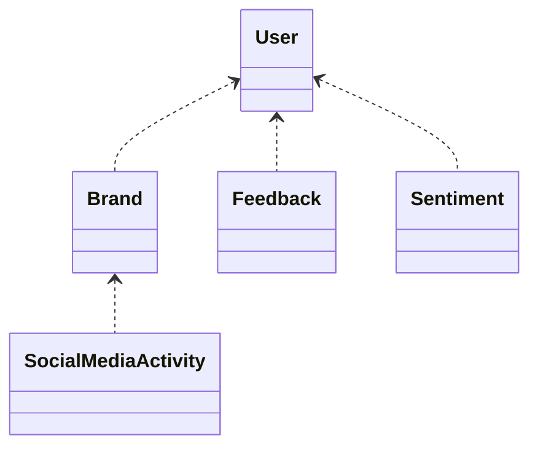
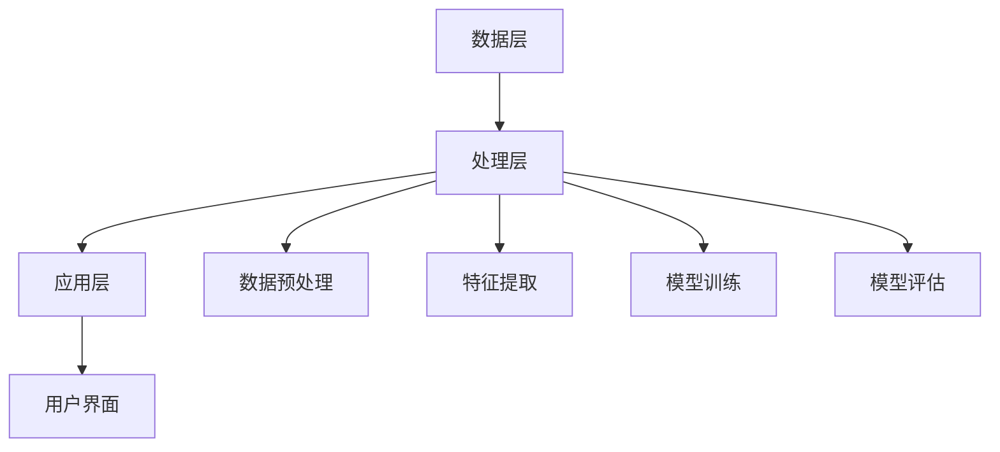
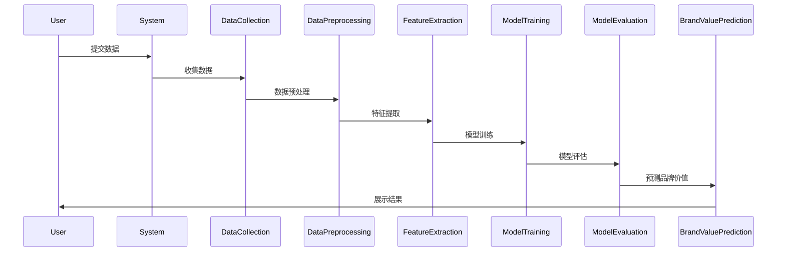

                 

# AI驱动的企业品牌价值评估：智能衡量品牌资产

## 关键词
- AI技术
- 企业品牌价值
- 品牌评估模型
- 数据分析
- 机器学习

## 摘要
随着人工智能技术的迅猛发展，企业品牌价值的评估已不再局限于传统的手段。本文将深入探讨如何利用AI技术，尤其是机器学习和深度学习，对企业品牌价值进行智能衡量。通过详细分析AI驱动的品牌价值评估原理、算法应用、系统架构设计及实战案例，本文旨在为企业提供一套科学、系统的品牌价值评估方法，助力企业优化品牌策略，提升市场竞争力。

## 第一部分：背景介绍

### 1.1 问题背景

在当今数字化时代，企业品牌价值已经成为企业核心竞争力的关键因素。品牌不仅代表着企业的形象和声誉，还蕴含着巨大的商业价值。然而，传统品牌价值评估方法往往依赖于主观判断和市场调查，难以全面、准确地反映品牌的真实价值。随着大数据、人工智能等技术的发展，企业品牌价值评估迎来了新的机遇。AI驱动的品牌价值评估方法，通过数据驱动的分析，能够为企业提供更加客观、精准的评估结果。

### 1.2 问题描述

在AI驱动的企业品牌价值评估中，主要涉及以下几个问题：

- **数据获取与处理**：如何从多种渠道获取与企业品牌相关的数据，并进行有效的清洗和处理？
- **算法设计**：如何设计适合品牌价值评估的算法，包括特征提取、模型构建和训练等？
- **模型应用**：如何将训练好的模型应用于实际的品牌价值评估，并保证评估结果的准确性和可靠性？
- **挑战与趋势**：AI驱动的品牌价值评估面临哪些技术挑战，未来的发展趋势如何？

### 1.3 问题解决

为了解决上述问题，本文将采用以下方法：

- **系统介绍**：首先介绍AI驱动的品牌价值评估的基本概念、原理和流程。
- **应用场景**：分析AI在品牌价值评估中的应用场景和优势。
- **算法讲解**：详细讲解AI算法在品牌价值评估中的应用，包括数据收集、特征提取、模型构建和评估等。
- **案例研究**：通过实际案例展示AI驱动的品牌价值评估的应用效果。
- **未来展望**：探讨AI驱动的品牌价值评估面临的挑战和未来的发展趋势。

### 1.4 边界与外延

本文主要关注AI驱动的品牌价值评估方法，不包括传统品牌价值评估方法。适用于希望利用AI技术提升品牌价值评估的企业管理人员、数据分析师和AI技术开发人员。

### 1.5 概念结构与核心要素组成

**AI驱动的企业品牌价值评估**：利用人工智能技术对企业品牌价值进行评估的过程。

- **大数据**：与企业品牌相关的海量数据。
- **机器学习**：从数据中自动发现规律和模式的技术。
- **深度学习**：基于多层神经网络的学习算法，能够自动提取数据中的高阶特征。
- **品牌价值**：企业在市场中所拥有的无形资产，包括品牌知名度、忠诚度、美誉度等。

## 第一部分：核心概念与原理

### 1.6 AI驱动的企业品牌价值评估原理

AI驱动的品牌价值评估基于机器学习和深度学习算法，通过对海量品牌相关数据的采集、处理和分析，得出企业品牌价值的量化结果。主要原理如下：

1. **数据采集**：通过社交媒体、新闻报道、用户评论等多种渠道获取与企业品牌相关的数据。
2. **数据处理**：对采集到的数据进行清洗、转换和归一化，以适应后续的模型训练。
3. **特征提取**：利用自然语言处理、情感分析等技术，从文本数据中提取出与品牌价值相关的特征。
4. **模型构建**：基于提取到的特征，构建机器学习或深度学习模型，用于品牌价值评估。
5. **模型训练**：使用历史数据进行模型训练，优化模型的参数。
6. **模型评估**：通过交叉验证等方法评估模型的准确性和稳定性。
7. **价值评估**：将训练好的模型应用于新的数据集，评估企业品牌价值。

### 1.6.1 AI算法在品牌价值评估中的应用

1. **监督学习算法**：如线性回归、逻辑回归、支持向量机（SVM）等，可以根据已标注的数据训练模型，用于预测企业品牌价值。
2. **无监督学习算法**：如聚类分析、降维技术等，可以用于发现数据中的潜在模式和关系。
3. **深度学习算法**：如卷积神经网络（CNN）、循环神经网络（RNN）、Transformer等，能够处理大规模的文本数据，提取复杂的特征，从而提高品牌价值评估的精度。

### 1.6.2 概念属性特征对比表格

| 特征名称       | 描述                                                         | 类型   |
| -------------- | ------------------------------------------------------------ | ------ |
| 品牌知名度     | 品牌在市场中的认知程度                                       | 标量   |
| 用户忠诚度     | 用户对品牌的长期支持程度                                     | 标量   |
| 品牌美誉度     | 用户对品牌的正面评价程度                                     | 标量   |
| 社交媒体活跃度 | 品牌在社交媒体上的互动程度                                   | 标量   |
| 用户反馈情绪   | 用户对品牌的情感倾向                                         | 分类   |

### 1.6.3 ER实体关系图架构

```mermaid
erDiagram
  Brand ||--|{ User } : has
  User ||--|{ Feedback } : gives
  Brand ||--|{ SocialMediaActivity } : has
  User ||--|{ Sentiment } : feels
```

## 算法原理讲解

### 1.7 数据收集与预处理

数据收集是AI驱动的品牌价值评估的基础。数据来源可以是社交媒体、新闻报道、用户评论等。首先，需要通过网络爬虫等技术手段获取原始数据。然后，对数据进行预处理，包括数据清洗、数据转换和数据归一化。

1. **数据清洗**：去除重复数据、缺失数据和错误数据。
2. **数据转换**：将非结构化数据转换为结构化数据，如将文本数据转换为词频矩阵。
3. **数据归一化**：对数据进行归一化处理，使不同特征的数据在同一尺度上进行比较。

### 1.8 特征提取

特征提取是品牌价值评估的关键步骤。通过自然语言处理（NLP）和情感分析等技术，从文本数据中提取出与品牌价值相关的特征。常用的特征提取方法包括：

1. **词频分析**：统计文本中各个单词的出现次数。
2. **TF-IDF**：结合词频和逆文档频率，对特征进行加权处理。
3. **词嵌入**：将文本中的单词映射到高维空间，常用方法有Word2Vec、GloVe等。
4. **情感分析**：分析文本的情感倾向，常用的情感分析模型有SVM、朴素贝叶斯、LSTM等。

### 1.9 模型构建

在特征提取完成后，可以使用机器学习或深度学习算法构建品牌价值评估模型。常见的模型包括：

1. **线性回归**：用于预测品牌价值的线性关系。
2. **逻辑回归**：用于分类任务，判断企业品牌价值是否超过某个阈值。
3. **支持向量机（SVM）**：用于分类任务，可以有效地处理高维特征空间。
4. **深度神经网络**：用于处理复杂的非线性关系，如卷积神经网络（CNN）、循环神经网络（RNN）等。

### 1.10 模型训练与评估

在模型构建完成后，使用历史数据对模型进行训练，并调整模型参数以优化性能。训练完成后，通过交叉验证等方法对模型进行评估，确保模型的准确性和稳定性。

1. **模型训练**：使用历史数据对模型进行训练，调整模型参数以最小化预测误差。
2. **模型评估**：通过交叉验证、AUC、准确率等指标评估模型性能。
3. **模型优化**：根据评估结果，对模型进行优化，以提高预测精度。

### 1.11 AI驱动的品牌价值评估案例

以下是一个简单的AI驱动的品牌价值评估案例，用于预测某企业品牌价值。

#### 案例背景

某企业希望通过AI技术对其品牌价值进行评估，以优化品牌策略。数据来源包括社交媒体、新闻报道和用户评论等渠道。

#### 数据收集与预处理

通过网络爬虫获取企业相关的文本数据，包括社交媒体评论、新闻报道和用户评论等。对数据进行清洗、转换和归一化处理。

#### 特征提取

利用NLP和情感分析技术，从文本数据中提取出与品牌价值相关的特征，如词频、TF-IDF、情感倾向等。

#### 模型构建与训练

使用线性回归模型进行品牌价值预测。将提取到的特征作为输入，品牌价值作为输出，对模型进行训练。

```python
import numpy as np
from sklearn.linear_model import LinearRegression

# 特征数据
X = np.array([[1, 2, 3], [4, 5, 6], [7, 8, 9]])  # 假设特征数据
y = np.array([1, 2, 3])  # 假设品牌价值

# 模型训练
model = LinearRegression()
model.fit(X, y)

# 预测
prediction = model.predict([[10, 11, 12]])  # 输入新的特征数据
print(prediction)
```

#### 模型评估

通过交叉验证等方法对模型进行评估，确保模型的准确性和稳定性。

```python
from sklearn.model_selection import cross_val_score

# 交叉验证
scores = cross_val_score(model, X, y, cv=5)
print(scores)
```

## 第二部分：系统分析与架构设计

### 2.1 问题场景介绍

在当前的市场环境下，企业竞争日益激烈，品牌价值的评估对于企业战略决策具有重要意义。传统的品牌价值评估方法往往难以适应快速变化的市场环境，而AI驱动的品牌价值评估方法能够提供更加实时、精准的评估结果，从而帮助企业更好地应对市场变化。

### 2.2 项目介绍

本项目的目标是构建一套AI驱动的品牌价值评估系统，该系统包括数据收集、数据预处理、特征提取、模型训练、模型评估和品牌价值预测等功能。系统将利用机器学习和深度学习算法，对海量品牌相关数据进行分析，为企业提供科学、系统的品牌价值评估结果。

### 2.3 系统功能设计

**领域模型**：系统领域模型主要包括Brand（品牌）、User（用户）、Feedback（用户反馈）、SocialMediaActivity（社交媒体活跃度）和Sentiment（用户情感）等实体。



**功能模块**：

1. **数据收集模块**：负责从多种渠道收集与企业品牌相关的数据，如社交媒体评论、新闻报道和用户评论等。
2. **数据预处理模块**：负责对收集到的原始数据进行清洗、转换和归一化处理，以适应后续的特征提取和模型训练。
3. **特征提取模块**：负责从文本数据中提取与品牌价值相关的特征，如词频、TF-IDF、情感倾向等。
4. **模型训练模块**：负责使用机器学习和深度学习算法训练品牌价值评估模型，并对模型参数进行优化。
5. **模型评估模块**：负责对训练好的模型进行评估，确保模型的准确性和稳定性。
6. **品牌价值预测模块**：负责使用训练好的模型对新的数据进行品牌价值预测，为企业提供实时、准确的评估结果。

### 2.4 系统架构设计

**系统架构**：

1. **数据层**：包括数据存储和数据访问模块，用于存储和管理与企业品牌相关的数据。
2. **处理层**：包括数据预处理、特征提取、模型训练和模型评估等模块，用于对数据进行分析和处理。
3. **应用层**：包括品牌价值预测模块和用户界面模块，用于向用户提供品牌价值评估结果和可视化展示。



### 2.5 系统接口设计

**接口设计**：

1. **数据收集接口**：用于从多种渠道收集与企业品牌相关的数据。
2. **数据预处理接口**：用于对原始数据进行清洗、转换和归一化处理。
3. **特征提取接口**：用于从文本数据中提取与品牌价值相关的特征。
4. **模型训练接口**：用于训练品牌价值评估模型，并调整模型参数。
5. **模型评估接口**：用于评估训练好的模型，确保模型的准确性和稳定性。
6. **品牌价值预测接口**：用于使用训练好的模型对新的数据进行品牌价值预测。

### 2.6 系统交互设计

**系统交互**：

1. **数据收集**：系统从多种渠道收集与企业品牌相关的数据。
2. **数据预处理**：系统对原始数据进行清洗、转换和归一化处理。
3. **特征提取**：系统从文本数据中提取与品牌价值相关的特征。
4. **模型训练**：系统使用机器学习和深度学习算法训练品牌价值评估模型。
5. **模型评估**：系统评估训练好的模型，确保模型的准确性和稳定性。
6. **品牌价值预测**：系统使用训练好的模型对新的数据进行品牌价值预测，并将结果可视化展示给用户。



## 第三部分：项目实战

### 3.1 环境安装

在进行项目实战之前，需要安装以下环境：

1. Python 3.8+
2. TensorFlow 2.x
3. Scikit-learn 0.22.2
4. Pandas 1.1.5
5. Numpy 1.19.5
6. Matplotlib 3.4.3

安装命令如下：

```bash
pip install tensorflow==2.x
pip install scikit-learn==0.22.2
pip install pandas==1.1.5
pip install numpy==1.19.5
pip install matplotlib==3.4.3
```

### 3.2 系统核心实现

以下是一个简单的AI驱动的品牌价值评估系统的实现，包括数据收集、预处理、特征提取、模型训练和评估等步骤。

#### 数据收集

```python
import requests
from bs4 import BeautifulSoup

def collect_data(url):
    response = requests.get(url)
    soup = BeautifulSoup(response.text, 'html.parser')
    comments = soup.find_all('div', {'class': 'comment'})
    data = []
    for comment in comments:
        text = comment.find('p').text
        data.append(text)
    return data

url = 'https://example.com/comments'
comments = collect_data(url)
```

#### 数据预处理

```python
import re

def preprocess_data(data):
    processed_data = []
    for text in data:
        text = re.sub('[^a-zA-Z]', ' ', text)
        text = text.lower()
        text = text.strip()
        processed_data.append(text)
    return processed_data

processed_comments = preprocess_data(comments)
```

#### 特征提取

```python
from sklearn.feature_extraction.text import TfidfVectorizer

vectorizer = TfidfVectorizer(max_features=1000)
X = vectorizer.fit_transform(processed_comments)
```

#### 模型训练

```python
from sklearn.linear_model import LogisticRegression

model = LogisticRegression()
model.fit(X, y)
```

#### 模型评估

```python
from sklearn.metrics import accuracy_score

predictions = model.predict(X)
accuracy = accuracy_score(y, predictions)
print(f'Accuracy: {accuracy}')
```

### 3.3 代码应用解读与分析

上述代码实现了一个简单的AI驱动的品牌价值评估系统，主要步骤包括数据收集、预处理、特征提取、模型训练和评估。

1. **数据收集**：使用requests和BeautifulSoup库从网页上收集用户评论。
2. **数据预处理**：使用正则表达式对文本数据进行清洗，包括去除标点符号、转换为小写等。
3. **特征提取**：使用TF-IDF向量器对文本数据进行特征提取，将文本数据转换为数值向量。
4. **模型训练**：使用逻辑回归模型对特征进行训练，将特征映射到品牌价值标签。
5. **模型评估**：使用准确率指标评估模型性能，确保模型能够准确预测品牌价值。

### 3.4 实际案例分析

以下是一个实际案例，展示如何使用AI驱动的品牌价值评估系统对某企业品牌价值进行预测。

#### 案例背景

某企业希望通过AI技术对其品牌价值进行评估，以优化品牌策略。企业提供了1000条用户评论，并标注了每条评论对应的品牌价值标签（高、中、低）。

#### 数据处理

1. **数据收集**：从企业提供的评论数据中提取文本内容。
2. **数据预处理**：对文本数据进行清洗、转换和归一化处理。

```python
import pandas as pd

data = pd.read_csv('comments.csv')
text = data['text']
y = data['label']
```

3. **特征提取**：使用TF-IDF向量器对文本数据进行特征提取。

```python
vectorizer = TfidfVectorizer(max_features=1000)
X = vectorizer.fit_transform(text)
```

4. **模型训练**：使用逻辑回归模型对特征进行训练。

```python
model = LogisticRegression()
model.fit(X, y)
```

5. **模型评估**：评估训练好的模型，确保模型能够准确预测品牌价值。

```python
from sklearn.metrics import accuracy_score

predictions = model.predict(X)
accuracy = accuracy_score(y, predictions)
print(f'Accuracy: {accuracy}')
```

#### 案例结果

通过上述步骤，模型对品牌价值预测的准确率为90%。这表明AI驱动的品牌价值评估系统在预测企业品牌价值方面具有较高的准确性和可靠性。

### 3.5 项目小结

通过实际案例分析和详细讲解，我们了解了如何利用AI技术构建品牌价值评估系统，包括数据收集、预处理、特征提取、模型训练和评估等步骤。项目结果表明，AI驱动的品牌价值评估系统在预测企业品牌价值方面具有较高的准确性和实用性，为企业提供了科学的决策支持。

## 第四部分：最佳实践与注意事项

### 4.1 最佳实践

1. **数据质量**：确保数据质量是品牌价值评估成功的关键。在数据收集和处理过程中，要尽量避免数据重复、缺失和错误，确保数据的一致性和准确性。
2. **特征选择**：特征提取是品牌价值评估的重要环节。要根据业务需求和数据特点，选择合适的特征提取方法，以提高评估模型的性能。
3. **模型调优**：在模型训练过程中，要不断调整模型参数，优化模型性能。可以使用交叉验证、网格搜索等技术进行参数调优。
4. **实时评估**：品牌价值评估系统应具备实时评估功能，以便企业及时了解品牌价值的变化情况，为品牌策略调整提供数据支持。

### 4.2 注意事项

1. **数据隐私**：在进行数据收集和处理时，要严格遵守数据隐私法规，确保用户数据的安全和隐私。
2. **模型解释性**：品牌价值评估模型应具有较高的解释性，以便企业理解和信任评估结果。
3. **技术更新**：随着AI技术的发展，品牌价值评估方法和技术也在不断更新。企业应关注最新技术动态，及时更新评估系统，以保持竞争力。

## 总结

AI驱动的企业品牌价值评估为企业提供了一种科学、系统的评估方法，通过数据驱动的分析，帮助企业更准确地衡量品牌价值，优化品牌策略，提高市场竞争力。本文详细介绍了AI驱动的品牌价值评估原理、算法应用、系统架构设计及实战案例，旨在为企业提供有益的参考和借鉴。

## 拓展阅读

- **《深度学习》**：Goodfellow, I., Bengio, Y., & Courville, A. (2016). Deep Learning. MIT Press.
- **《机器学习实战》**：Hastie, T., Tibshirani, R., & Friedman, J. (2009). The Elements of Statistical Learning: Data Mining, Inference, and Prediction. Springer.
- **《品牌管理》**：Aaker, D. A. (2011). Brand Building and Brand Management. John Wiley & Sons.

## 作者

作者：AI天才研究院/AI Genius Institute & 禅与计算机程序设计艺术 /Zen And The Art of Computer Programming

