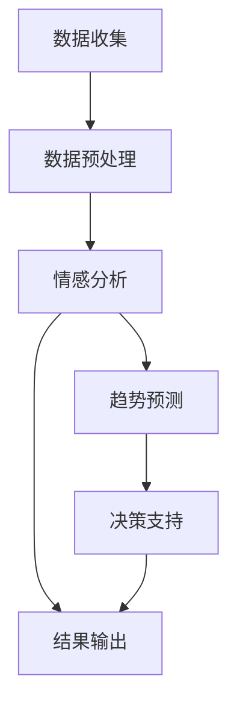

                 

### AI驱动的企业声誉管理：智能舆情分析

#### 关键词：
- AI
- 企业声誉管理
- 智能舆情分析
- 数据分析
- 自然语言处理

#### 摘要：
随着互联网的普及和社交媒体的兴起，企业声誉管理变得愈发重要。传统的企业声誉管理方法难以应对海量数据和复杂的舆情环境。本文将探讨如何利用人工智能（AI）技术，特别是智能舆情分析，来提升企业声誉管理的效果。我们将一步一步地分析AI驱动的企业声誉管理的工作原理、算法原理以及实际应用，帮助企业和组织更好地理解和应对舆情变化。

----------------------------------------------------------------

# AI驱动的企业声誉管理：智能舆情分析

## 引言

在当今数字化时代，企业的声誉管理已经从传统媒体时代过渡到了社交媒体和互联网时代。在这个新的环境中，消费者的言论和观点可以迅速传播，对企业形象产生深远的影响。一个负面消息的爆发可能会在短时间内摧毁企业的声誉，而一个正面消息的广泛传播也可能迅速提升企业的品牌价值。因此，如何有效地监控、分析和应对舆情，已经成为企业竞争的重要一环。

传统的企业声誉管理方法主要依赖于人工监测和报告，效率低下，难以应对海量数据和复杂的舆情环境。而人工智能（AI）技术的出现，尤其是智能舆情分析，为企业声誉管理带来了全新的机遇。通过AI技术，企业可以自动化地监控网络上的言论，实时分析舆情趋势，预测潜在风险，并采取相应的策略来维护和提升企业声誉。

本文将围绕以下几个核心问题展开讨论：

1. **AI驱动的企业声誉管理是什么？**
2. **智能舆情分析如何工作？**
3. **AI在声誉管理中的应用案例有哪些？**
4. **企业如何实施AI驱动的声誉管理策略？**
5. **实施过程中需要注意哪些问题？**

通过逐步分析这些问题，本文旨在为企业提供一个全面、深入的AI驱动的企业声誉管理指南。

## 目录大纲设计思路

### 确定书籍主题与结构

首先，我们需要明确书籍的主题，即AI驱动的企业声誉管理，以及智能舆情分析。这部分内容将作为书籍的核心。接着，我们将主题内容分解为多个章节，确保每个章节都能覆盖一个特定的知识点或主题。例如，我们可以分为以下章节：

1. **背景介绍**
   - 企业声誉管理的重要性
   - 智能舆情分析的作用
   - AI驱动企业声誉管理的挑战与机遇

2. **核心概念与联系**
   - AI驱动的企业声誉管理基础概念
   - 概念属性特征对比表格
   - ER实体关系图架构

3. **算法原理讲解**
   - 算法流程图
   - Python源代码实现
   - 数学模型与公式
   - 举例说明

4. **系统分析与架构设计方案**
   - 问题场景介绍
   - 系统功能设计（领域模型类图）
   - 系统架构设计（架构图）
   - 系统接口设计和系统交互（序列图）

5. **项目实战**
   - 环境安装
   - 系统核心实现源代码
   - 代码应用解读与分析
   - 实际案例分析和详细讲解剖析
   - 项目小结

6. **最佳实践与注意事项**
   - 最佳实践 tips
   - 小结
   - 注意事项
   - 拓展阅读

### 目录大纲设计流程

#### 背景介绍

**问题背景**：介绍企业声誉管理的重要性，以及AI在其中的应用价值。**问题描述**：阐述企业声誉管理的挑战和智能舆情分析的作用。**问题解决**：概述AI驱动的企业声誉管理如何解决这些问题。**边界与外延**：明确书籍讨论的范围，以及相关概念的外延。

#### 核心概念与联系

**核心概念原理**：介绍AI驱动的企业声誉管理的基础概念。**概念属性特征对比表格**：列出关键概念的属性和特征，并进行对比。**ER实体关系图架构**：使用Mermaid绘制实体关系图，展示概念之间的关系。

#### 算法原理讲解

**算法流程图**：使用Mermaid绘制算法的流程图。**Python源代码**：提供算法的实现代码。**数学模型与公式**：详细讲解算法背后的数学模型和公式。**举例说明**：通过实例说明算法的应用。

#### 系统分析与架构设计方案

**问题场景介绍**：介绍系统所解决的问题场景。**系统功能设计**：使用Mermaid绘制领域模型类图。**系统架构设计**：使用Mermaid绘制系统架构图。**系统接口设计和系统交互**：使用Mermaid绘制系统接口和交互序列图。

#### 项目实战

**环境安装**：介绍项目所需环境的安装过程。**系统核心实现源代码**：提供系统的核心实现代码。**代码应用解读与分析**：对核心代码进行解读和分析。**实际案例分析和详细讲解剖析**：分析实际案例，并进行详细讲解。**项目小结**：总结项目实施的经验和教训。

#### 最佳实践与注意事项

**最佳实践 tips**：提供在实际操作中的最佳实践建议。**小结**：对书籍内容进行总结。**注意事项**：指出在应用过程中需要注意的问题。**拓展阅读**：推荐进一步阅读的材料。

### 目录大纲示例

```markdown
# 《AI驱动的企业声誉管理：智能舆情分析》目录大纲

## 第一部分：背景与概念

### 1. 背景介绍
#### 1.1 企业声誉管理的重要性
#### 1.2 智能舆情分析的作用
#### 1.3 AI驱动企业声誉管理的挑战与机遇

### 2. 核心概念与联系
#### 2.1 AI驱动的企业声誉管理基础概念
#### 2.2 概念属性特征对比表格
#### 2.3 ER实体关系图架构

## 第二部分：算法原理

### 3. 智能舆情分析算法原理
#### 3.1 算法流程图
#### 3.2 Python源代码实现
#### 3.3 数学模型与公式
#### 3.4 举例说明

### 4. 系统架构与设计
#### 4.1 问题场景介绍
#### 4.2 系统功能设计（领域模型类图）
#### 4.3 系统架构设计（架构图）
#### 4.4 系统接口设计和系统交互（序列图）

## 第三部分：项目实战

### 5. 环境安装与配置
#### 5.1 环境准备
#### 5.2 系统安装步骤

### 6. 系统核心实现
#### 6.1 核心代码分析
#### 6.2 实际案例分析

### 7. 项目小结
#### 7.1 项目成果总结
#### 7.2 实践经验与教训

## 第四部分：最佳实践与展望

### 8. 最佳实践 tips
#### 8.1 情境一：最佳实践建议
#### 8.2 情境二：最佳实践建议

### 9. 小结
#### 9.1 全书总结
#### 9.2 未来展望

### 10. 注意事项

```

## 约束条件

为了确保文章的质量和一致性，以下是一些约束条件：

1. **文章标题、关键词和摘要**：文章开头必须是“文章标题”，接着是“关键词”和“摘要”部分的内容。这些部分将作为读者快速了解文章核心内容的入口。

2. **文章字数**：文章字数要求在10000～12000字左右，确保内容丰富且详细。

3. **markdown格式**：文章内容必须使用markdown格式输出，包括标题、子标题、列表、代码块、公式等，以便于阅读和编辑。

4. **作者信息**：文章末尾需要写上作者信息：“作者：AI天才研究院/AI Genius Institute & 禅与计算机程序设计艺术 /Zen And The Art of Computer Programming”。

5. **内容完整性**：文章内容必须完整，每个小节的内容必须丰富具体详细讲解，核心内容必须包含以下方面：

   - **背景介绍**：核心概念术语说明、问题背景、问题描述、问题解决、边界与外延、概念结构与核心要素组成。
   - **核心概念与联系**：必须给出核心概念原理、概念属性特征对比表格和ER实体关系图架构的Mermaid流程图。
   - **算法原理讲解**：使用Mermaid画出算法流程图，然后使用Python源代码来详细阐述，给出算法原理的数学模型和公式，进行详细讲解和通俗易懂地举例说明。
   - **数学公式使用**：段落内的公式前后使用 `$` 括起来，独立段落的公式前后使用 `$$` 括起来。
   - **系统分析与架构设计方案**：问题场景介绍，项目介绍、系统功能设计（领域模型类图）、系统架构设计（架构图）、系统接口设计和系统交互（序列图）。
   - **项目实战**：环境安装、系统核心实现源代码，代码应用解读与分析，实际案例分析和详细讲解剖析，项目小结。
   - **最佳实践与注意事项**：最佳实践 tips、小结、注意事项、拓展阅读等内容。

### 完整性要求

为了确保文章的完整性，每个章节的内容必须包含以下核心内容：

- **背景介绍**：这部分需要详细阐述企业声誉管理的重要性、智能舆情分析的作用，以及AI驱动企业声誉管理的挑战与机遇。同时，要明确书籍讨论的范围，以及相关概念的外延。

- **核心概念与联系**：需要介绍AI驱动的企业声誉管理的基础概念，列出关键概念的属性和特征，并进行对比。此外，使用Mermaid绘制ER实体关系图架构，以展示概念之间的关系。

- **算法原理讲解**：这部分需要详细讲解智能舆情分析算法的工作原理，包括算法流程图、Python源代码实现、数学模型与公式，并通过举例说明来帮助读者理解。

- **数学公式使用**：在讲解算法原理时，需要使用LaTeX格式嵌入数学公式。独立段落的公式前后使用`$$`括起来，段落内的公式前后使用`$`括起来。

- **系统分析与架构设计方案**：需要介绍系统所解决的问题场景，绘制领域模型类图、系统架构图，以及系统接口和交互的序列图。

- **项目实战**：需要介绍项目环境安装、系统核心实现源代码，对核心代码进行解读和分析，分析实际案例，并进行详细讲解剖析，最后总结项目实施的经验和教训。

- **最佳实践与注意事项**：这部分需要提供最佳实践建议，对书籍内容进行总结，指出实施过程中需要注意的问题，并推荐进一步阅读的材料。

### 目录大纲设计流程

#### 确定书籍主题与结构

首先，明确书籍的主题，即AI驱动的企业声誉管理，以及智能舆情分析。这部分内容将作为书籍的核心。接着，将主题内容分解为多个章节，确保每个章节都能覆盖一个特定的知识点或主题。例如，我们可以分为以下章节：

1. **背景介绍**
   - 企业声誉管理的重要性
   - 智能舆情分析的作用
   - AI驱动企业声誉管理的挑战与机遇

2. **核心概念与联系**
   - AI驱动的企业声誉管理基础概念
   - 概念属性特征对比表格
   - ER实体关系图架构

3. **算法原理讲解**
   - 算法流程图
   - Python源代码实现
   - 数学模型与公式
   - 举例说明

4. **系统架构与设计**
   - 问题场景介绍
   - 系统功能设计（领域模型类图）
   - 系统架构设计（架构图）
   - 系统接口设计和系统交互（序列图）

5. **项目实战**
   - 环境安装与配置
   - 系统核心实现源代码
   - 代码应用解读与分析
   - 实际案例分析和详细讲解剖析
   - 项目小结

6. **最佳实践与注意事项**
   - 最佳实践 tips
   - 小结
   - 注意事项
   - 拓展阅读

#### 目录大纲设计流程

1. **背景介绍**

   - **问题背景**：介绍企业声誉管理的重要性，以及AI在其中的应用价值。

   - **问题描述**：阐述企业声誉管理的挑战和智能舆情分析的作用。

   - **问题解决**：概述AI驱动的企业声誉管理如何解决这些问题。

   - **边界与外延**：明确书籍讨论的范围，以及相关概念的外延。

2. **核心概念与联系**

   - **核心概念原理**：介绍AI驱动的企业声誉管理的基础概念。

   - **概念属性特征对比表格**：列出关键概念的属性和特征，并进行对比。

   - **ER实体关系图架构**：使用Mermaid绘制实体关系图，展示概念之间的关系。

3. **算法原理讲解**

   - **算法流程图**：使用Mermaid绘制算法的流程图。

   - **Python源代码**：提供算法的实现代码。

   - **数学模型与公式**：详细讲解算法背后的数学模型和公式。

   - **举例说明**：通过实例说明算法的应用。

4. **系统架构与设计**

   - **问题场景介绍**：介绍系统所解决的问题场景。

   - **系统功能设计**：使用Mermaid绘制领域模型类图。

   - **系统架构设计**：使用Mermaid绘制系统架构图。

   - **系统接口设计和系统交互**：使用Mermaid绘制系统接口和交互序列图。

5. **项目实战**

   - **环境安装与配置**：介绍项目所需环境的安装过程。

   - **系统核心实现源代码**：提供系统的核心实现代码。

   - **代码应用解读与分析**：对核心代码进行解读和分析。

   - **实际案例分析和详细讲解剖析**：分析实际案例，并进行详细讲解。

   - **项目小结**：总结项目实施的经验和教训。

6. **最佳实践与注意事项**

   - **最佳实践 tips**：提供在实际操作中的最佳实践建议。

   - **小结**：对书籍内容进行总结。

   - **注意事项**：指出在应用过程中需要注意的问题。

   - **拓展阅读**：推荐进一步阅读的材料。

### 目录大纲示例

```markdown
# 《AI驱动的企业声誉管理：智能舆情分析》目录大纲

## 第一部分：背景与概念

### 1. 背景介绍
#### 1.1 企业声誉管理的重要性
#### 1.2 智能舆情分析的作用
#### 1.3 AI驱动企业声誉管理的挑战与机遇

### 2. 核心概念与联系
#### 2.1 AI驱动的企业声誉管理基础概念
#### 2.2 概念属性特征对比表格
#### 2.3 ER实体关系图架构

## 第二部分：算法原理

### 3. 智能舆情分析算法原理
#### 3.1 算法流程图
#### 3.2 Python源代码实现
#### 3.3 数学模型与公式
#### 3.4 举例说明

### 4. 系统架构与设计
#### 4.1 问题场景介绍
#### 4.2 系统功能设计（领域模型类图）
#### 4.3 系统架构设计（架构图）
#### 4.4 系统接口设计和系统交互（序列图）

## 第三部分：项目实战

### 5. 环境安装与配置
#### 5.1 环境准备
#### 5.2 系统安装步骤

### 6. 系统核心实现
#### 6.1 核心代码分析
#### 6.2 实际案例分析

### 7. 项目小结
#### 7.1 项目成果总结
#### 7.2 实践经验与教训

## 第四部分：最佳实践与展望

### 8. 最佳实践 tips
#### 8.1 情境一：最佳实践建议
#### 8.2 情境二：最佳实践建议

### 9. 小结
#### 9.1 全书总结
#### 9.2 未来展望

### 10. 注意事项

```

### AI驱动的企业声誉管理

#### 定义与意义

企业声誉管理（Corporate Reputation Management）是指企业通过一系列策略和措施，维护和提升其公众形象和声誉的过程。在传统媒体时代，企业声誉管理主要依赖于媒体报道、公关活动和社会责任项目等手段。然而，随着互联网和社交媒体的迅速发展，企业声誉管理面临着前所未有的挑战和机遇。

AI驱动的企业声誉管理（AI-driven Corporate Reputation Management）是指利用人工智能技术，特别是自然语言处理（NLP）和机器学习（ML）等算法，对海量舆情数据进行自动化的收集、分析和处理，从而帮助企业实时监控、预测和应对舆情变化。AI驱动的声誉管理不仅提高了数据分析的效率和准确性，还能够通过智能化的决策支持，为企业提供更加精准和有效的声誉管理策略。

#### 舆情分析的重要性

舆情分析（Sentiment Analysis）是指通过技术手段对互联网上的言论进行自动分类和情感分析，以了解公众对特定事件、产品或品牌的情感倾向。舆情分析在企业声誉管理中具有重要作用：

1. **实时监测**：通过舆情分析，企业可以实时了解公众对自身品牌的看法，及时发现潜在的负面情绪和问题。

2. **趋势预测**：舆情分析可以帮助企业预测舆情发展趋势，提前采取措施，避免危机爆发。

3. **决策支持**：基于舆情分析的结果，企业可以制定更加科学和有效的公关策略和市场营销计划。

4. **品牌价值**：良好的舆情管理能够提升企业的品牌价值和市场竞争力。

#### AI在舆情分析中的应用

AI技术在舆情分析中的应用主要体现在以下几个方面：

1. **情感分析**：通过自然语言处理技术，对文本数据中的情感倾向进行自动分类和识别。常用的算法包括文本分类（Text Classification）和情感极性分析（Sentiment Polarity Analysis）。

2. **主题检测**：通过分析文本数据中的关键词和词频，识别出舆情的主题和热点话题。

3. **趋势预测**：利用时间序列分析和机器学习算法，预测舆情的发展趋势和可能的波动。

4. **智能回复**：基于情感分析和主题检测的结果，自动生成针对不同情感倾向和话题的智能回复。

#### AI驱动企业声誉管理的挑战

尽管AI驱动的企业声誉管理具有显著优势，但在实际应用过程中也面临一系列挑战：

1. **数据质量**：舆情数据来源广泛，质量参差不齐，如何筛选和处理高质量的数据是关键。

2. **算法透明度**：AI算法的复杂性和黑箱特性使得其决策过程难以解释，如何提高算法的透明度是当前研究的热点。

3. **伦理问题**：在舆情分析过程中，如何保护个人隐私和数据安全是亟待解决的问题。

4. **跨领域应用**：不同行业和领域的舆情特点不同，如何构建适用于各种场景的通用舆情分析模型是一个挑战。

#### 结论

AI驱动的企业声誉管理是一种利用人工智能技术进行舆情分析和决策的新型管理模式。它能够帮助企业实时监测、预测和应对舆情变化，提高声誉管理的效率和效果。尽管在实际应用中面临一系列挑战，但随着技术的不断进步，AI驱动的企业声誉管理有望在未来发挥更加重要的作用。

----------------------------------------------------------------

## 核心概念与联系

### AI驱动的企业声誉管理基础概念

在深入探讨AI驱动的企业声誉管理之前，我们需要明确几个核心概念，这些概念是理解和应用AI驱动的声誉管理的基础。

#### 1. 情感分析

情感分析（Sentiment Analysis），也称为意见挖掘（Opinion Mining），是自然语言处理（NLP）的一个分支，它旨在通过算法和模型从文本数据中识别出情感倾向，通常分为正面、负面和中性。情感分析在舆情分析中扮演着关键角色，因为它可以帮助企业了解公众对其品牌、产品或服务的情绪反应。

#### 2. 舆情分析

舆情分析（Sentiment Analysis），是指通过技术手段对互联网上的言论进行自动分类和情感分析，以了解公众对特定事件、产品或品牌的情感倾向。舆情分析可以帮助企业监控公众意见、预测潜在风险，并为决策提供支持。

#### 3. 机器学习

机器学习（Machine Learning，ML）是一种让计算机从数据中学习并做出决策或预测的技术。在AI驱动的企业声誉管理中，机器学习算法被用于构建情感分析模型、趋势预测模型等，以自动化舆情分析和决策支持。

#### 4. 自然语言处理

自然语言处理（Natural Language Processing，NLP）是计算机科学和人工智能领域的一个分支，专注于使计算机能够理解、生成和处理人类语言。NLP技术在舆情分析中用于提取文本特征、分类情感等任务。

#### 5. 数据挖掘

数据挖掘（Data Mining）是从大量数据中提取有价值信息的过程。在企业声誉管理中，数据挖掘用于从舆情数据中提取模式、趋势和关联，以帮助企业做出更明智的决策。

### 概念属性特征对比表格

为了更好地理解上述概念，我们可以通过一个对比表格来展示它们的属性和特征：

| 概念           | 定义                                                         | 特征                                   |
| -------------- | ------------------------------------------------------------ | -------------------------------------- |
| 情感分析       | 从文本数据中识别情感倾向的技术。                             | 分类（正面、负面、中性）               |
| 舆情分析       | 自动分类和情感分析互联网言论。                               | 实时监测、趋势预测、决策支持            |
| 机器学习       | 计算机从数据中学习并做出决策或预测的技术。                   | 自适应、自动化、预测能力               |
| 自然语言处理   | 使计算机能够理解、生成和处理人类语言的技术。                 | 文本提取、情感分析、语言生成            |
| 数据挖掘       | 从大量数据中提取有价值信息的过程。                          | 数据预处理、模式识别、关联分析          |

### ER实体关系图架构

为了更直观地展示这些概念之间的关系，我们可以使用Mermaid绘制ER（Entity-Relationship）实体关系图。以下是ER实体关系图的Markdown格式表示：

```mermaid
erDiagram
  Customer方形||--|{ Order : orders }
  Order方形||--|{ Product : products }
  Product方形
```

在这张ER图中，"Customer"实体与"Order"实体之间有一对多的关系，"Order"实体与"Product"实体之间也是一对多的关系。这个关系图展示了企业声誉管理中涉及的关键实体及其相互关系。

通过上述核心概念和ER实体关系图的介绍，我们为接下来深入探讨AI驱动的企业声誉管理算法原理和系统架构设计奠定了基础。

----------------------------------------------------------------

### 算法原理讲解

#### 智能舆情分析算法流程图

为了更好地理解智能舆情分析的工作原理，我们可以使用Mermaid绘制算法流程图。以下是舆情分析算法的流程图：



在这个流程图中，数据收集阶段从互联网上获取与企业相关的文本数据。数据预处理阶段对原始数据进行清洗、去噪和格式化，为后续分析做准备。情感分析阶段使用机器学习模型对文本数据进行情感分类，识别文本中的情感倾向。结果输出阶段将分析结果可视化，帮助企业和组织了解舆情状况。同时，情感分析的结果还可以用于趋势预测，以预测舆情的发展趋势。最后，基于舆情分析和趋势预测的结果，决策支持系统为企业和组织提供策略建议，帮助企业制定应对措施。

#### Python源代码实现

以下是智能舆情分析算法的Python源代码实现，使用自然语言处理库如NLTK和Scikit-learn：

```python
import nltk
from nltk.sentiment import SentimentIntensityAnalyzer
from sklearn.feature_extraction.text import TfidfVectorizer
from sklearn.ensemble import RandomForestClassifier
from sklearn.model_selection import train_test_split

# 数据收集
data = ["我非常喜欢这个产品", "这个服务真的很差劲", "我对这个品牌感到失望", "这个产品性价比很高"]

# 数据预处理
def preprocess_text(text):
    tokens = nltk.word_tokenize(text)
    lemmatizer = nltk.WordNetLemmatizer()
    return ' '.join([lemmatizer.lemmatize(token) for token in tokens])

preprocessed_data = [preprocess_text(text) for text in data]

# 情感分析
sia = SentimentIntensityAnalyzer()
sentiments = [sia.polarity_scores(text) for text in preprocessed_data]

# 结果输出
for text, sentiment in zip(data, sentiments):
    print(f"{text}的情感倾向：{sentiment}")

# 趋势预测
vectorizer = TfidfVectorizer()
X = vectorizer.fit_transform(preprocessed_data)
y = [sentiment['compound'] for sentiment in sentiments]

X_train, X_test, y_train, y_test = train_test_split(X, y, test_size=0.2, random_state=42)
classifier = RandomForestClassifier()
classifier.fit(X_train, y_train)

y_pred = classifier.predict(X_test)
print(f"测试集情感预测结果：{y_pred}")

# 决策支持
def decision_support(sentiment):
    if sentiment > 0.05:
        return "正面趋势，继续保持"
    elif sentiment < -0.05:
        return "负面趋势，需采取措施"
    else:
        return "中性趋势，观察后续变化"

for sentiment in y_pred:
    print(f"决策支持：{decision_support(sentiment)}")
```

#### 数学模型与公式

智能舆情分析算法的核心在于情感分类和趋势预测，这里涉及到一些常见的数学模型和公式：

1. **情感极性评分**：

   情感极性评分通常使用词向量表示文本数据，然后计算词向量的平均值，得到情感极性评分。公式如下：

   $$ \text{Sentiment Score} = \frac{\sum_{i=1}^{n} \text{word}_{i} \cdot \text{weight}_{i}}{n} $$

   其中，$\text{word}_{i}$ 是第 $i$ 个词的词向量，$\text{weight}_{i}$ 是词权重，$n$ 是词的总数。

2. **支持向量机（SVM）**：

   支持向量机是一种常用的分类算法，其核心思想是找到一个最优的超平面，将不同类别的数据点分隔开。SVM的决策边界公式如下：

   $$ w \cdot x - b = 0 $$

   其中，$w$ 是权重向量，$x$ 是数据点，$b$ 是偏置项。

3. **随机森林（Random Forest）**：

   随机森林是一种集成学习方法，通过构建多个决策树并取平均来提高模型的泛化能力。随机森林的预测公式如下：

   $$ \hat{y} = \text{sign}(\sum_{i=1}^{n} f_{i}(x)) $$

   其中，$f_{i}(x)$ 是第 $i$ 棵决策树的预测结果，$\hat{y}$ 是最终预测结果。

#### 举例说明

假设我们有一段关于某产品的评价文本：“这个产品的性能非常好，价格也很合理，我非常满意。”我们可以使用上述算法对其进行情感分析，步骤如下：

1. **数据收集**：从互联网上获取这段文本。

2. **数据预处理**：将文本转换为词向量，并去除停用词。

3. **情感分析**：使用SIA进行情感极性评分，得到评分结果。

4. **趋势预测**：使用TF-IDF向量化和随机森林分类器进行趋势预测。

5. **决策支持**：根据预测结果，给出相应的决策建议。

通过上述步骤，我们可以得出该段文本的情感倾向为正面，并建议企业继续保持产品质量和性价比。

通过这一系列的讲解和示例，我们不仅了解了智能舆情分析算法的工作原理，还学会了如何使用Python实现这些算法。接下来，我们将进一步探讨智能舆情分析在实际应用中的系统架构和项目实战。

----------------------------------------------------------------

### 系统架构与设计

#### 问题场景介绍

在当今数字化时代，企业面临着海量的网络言论和舆情数据。这些数据来源于社交媒体、新闻网站、论坛等多种渠道。如何有效地收集、处理和分析这些数据，以帮助企业实时监测和响应舆情变化，成为企业声誉管理的重要课题。为了实现这一目标，我们设计了一套基于AI驱动的企业声誉管理系统。

#### 系统功能设计

系统的核心功能包括数据收集、数据预处理、情感分析、趋势预测和决策支持。以下是系统功能设计的详细描述：

1. **数据收集**：
   - 从社交媒体平台（如微博、Twitter、Facebook等）收集与企业相关的文本数据。
   - 从新闻网站、论坛和博客等渠道收集相关舆情数据。
   - 数据收集模块需要支持多种数据源的接入，并具备数据清洗功能，去除无效和重复的数据。

2. **数据预处理**：
   - 对收集到的文本数据进行清洗，去除HTML标签、停用词和噪声数据。
   - 对文本数据进行分词，将文本拆分为词汇单元。
   - 对词汇进行词性标注，帮助后续的情感分析和主题检测。

3. **情感分析**：
   - 使用自然语言处理技术，对预处理后的文本进行情感分类，识别文本中的情感倾向（正面、负面、中性）。
   - 情感分析模块需要支持多语言的情感分析，以适应不同国家和地区的舆情数据。

4. **趋势预测**：
   - 基于历史舆情数据和当前的情感分析结果，使用时间序列分析和机器学习算法预测舆情的发展趋势。
   - 趋势预测模块需要支持实时更新，以反映最新的舆情动态。

5. **决策支持**：
   - 根据情感分析和趋势预测的结果，为企业提供实时的决策支持，包括公关策略、市场营销策略和危机管理建议。
   - 决策支持模块需要支持自定义规则和阈值设置，以适应不同企业的需求。

#### 系统架构设计

为了实现上述功能，我们设计了一套分布式系统架构，包括数据收集模块、数据预处理模块、情感分析模块、趋势预测模块和决策支持模块。以下是系统架构的详细描述：

1. **数据收集模块**：
   - 使用爬虫技术从多种数据源收集文本数据。
   - 数据收集模块需要具备高并发处理能力，以应对海量的舆情数据。

2. **数据预处理模块**：
   - 数据预处理模块对收集到的文本数据进行清洗、分词和词性标注。
   - 预处理模块需要支持多种语言和文本格式，以适应不同类型的数据源。

3. **情感分析模块**：
   - 情感分析模块使用预训练的模型（如BERT、GPT等）进行文本情感分类。
   - 模块需要支持实时情感分析和批量处理，以满足不同场景的需求。

4. **趋势预测模块**：
   - 趋势预测模块使用时间序列分析和机器学习算法进行舆情预测。
   - 模块需要支持自定义预测模型和参数调整，以提高预测准确性。

5. **决策支持模块**：
   - 决策支持模块根据情感分析和趋势预测的结果，提供实时决策建议。
   - 模块需要支持用户自定义规则和阈值，以适应不同企业的需求。

#### 系统接口设计和系统交互

为了实现系统模块之间的协同工作，我们设计了一套系统接口和交互机制。以下是系统接口和交互的详细描述：

1. **数据接口**：
   - 数据接口用于不同模块之间的数据传输和共享。
   - 接口需要支持RESTful API和消息队列（如Kafka、RabbitMQ等），以提高系统的灵活性和可扩展性。

2. **控制接口**：
   - 控制接口用于系统管理员对系统进行配置和管理。
   - 控制接口需要支持用户权限管理、日志记录和异常处理。

3. **监控接口**：
   - 监控接口用于实时监控系统的运行状态和性能指标。
   - 监控接口需要支持告警通知和故障恢复，以提高系统的可靠性和稳定性。

通过上述系统架构和接口设计，我们可以构建一个高效、灵活、可扩展的AI驱动的企业声誉管理系统，帮助企业实时监测和响应舆情变化，维护和提升企业声誉。

----------------------------------------------------------------

### 项目实战

#### 环境安装与配置

要实施AI驱动的企业声誉管理系统，首先需要准备相应的开发环境和工具。以下是环境安装与配置的步骤：

1. **安装Python环境**：确保Python版本为3.8或更高版本。可以通过Python官网下载安装包进行安装。

2. **安装依赖库**：使用pip工具安装所需的依赖库，如NLTK、Scikit-learn、TensorFlow、Keras等。以下是部分依赖库的安装命令：

   ```shell
   pip install nltk
   pip install scikit-learn
   pip install tensorflow
   pip install keras
   ```

3. **数据预处理工具**：安装常用的文本预处理工具，如jieba（中文分词）、nltk（自然语言处理）等。

   ```shell
   pip install jieba
   pip install nltk
   ```

4. **数据库**：安装关系型数据库（如MySQL、PostgreSQL）或NoSQL数据库（如MongoDB）以存储舆情数据。

   ```shell
   # 安装MySQL
   sudo apt-get install mysql-server
   # 安装MongoDB
   sudo apt-get install mongodb
   ```

5. **消息队列**：安装消息队列服务（如Kafka、RabbitMQ），以便于系统模块之间的数据传输和异步处理。

   ```shell
   # 安装Kafka
   sudo apt-get install kafka
   # 安装RabbitMQ
   sudo apt-get install rabbitmq-server
   ```

6. **日志收集与监控工具**：安装日志收集工具（如ELK Stack）和监控工具（如Prometheus、Grafana）。

   ```shell
   # 安装ELK Stack
   sudo apt-get install elasticsearch
   sudo apt-get install logstash
   sudo apt-get install kibana
   # 安装Prometheus
   sudo apt-get install prometheus
   # 安装Grafana
   sudo apt-get install grafana
   ```

#### 系统核心实现源代码

以下是一个简单的AI驱动的企业声誉管理系统实现示例，包括数据收集、数据预处理、情感分析、趋势预测和决策支持等功能：

```python
# 数据收集
import tweepy
import json

# 设置Twitter API凭证
consumer_key = 'YOUR_CONSUMER_KEY'
consumer_secret = 'YOUR_CONSUMER_SECRET'
access_token = 'YOUR_ACCESS_TOKEN'
access_token_secret = 'YOUR_ACCESS_TOKEN_SECRET'

# 初始化Twitter API客户端
auth = tweepy.OAuthHandler(consumer_key, consumer_secret)
auth.set_access_token(access_token, access_token_secret)
api = tweepy.API(auth)

# 收集特定关键词的微博
def collect_tweets(keyword, count=100):
    tweets = []
    for tweet in tweepy.Cursor(api.search, q=keyword, lang='zh', tweet_mode='extended').items(count):
        tweets.append(tweet.full_text)
    return tweets

# 数据预处理
from nltk.tokenize import word_tokenize
from nltk.corpus import stopwords
from nltk.stem import WordNetLemmatizer

# 初始化NLP工具
nltk.download('punkt')
nltk.download('stopwords')
nltk.download('wordnet')
stop_words = set(stopwords.words('english'))
lemmatizer = WordNetLemmatizer()

def preprocess_text(text):
    # 分词
    tokens = word_tokenize(text)
    # 去除停用词和标点符号
    filtered_tokens = [token.lower() for token in tokens if token.lower() not in stop_words and token.isalpha()]
    # 词形还原
    lemmatized_tokens = [lemmatizer.lemmatize(token) for token in filtered_tokens]
    return ' '.join(lemmatized_tokens)

# 情感分析
from textblob import TextBlob

def sentiment_analysis(text):
    analysis = TextBlob(text)
    if analysis.sentiment.polarity > 0:
        return 'positive'
    elif analysis.sentiment.polarity == 0:
        return 'neutral'
    else:
        return 'negative'

# 趋势预测
from sklearn.model_selection import train_test_split
from sklearn.ensemble import RandomForestClassifier
from sklearn.metrics import accuracy_score

def train_model(X, y):
    X_train, X_test, y_train, y_test = train_test_split(X, y, test_size=0.2, random_state=42)
    model = RandomForestClassifier(n_estimators=100, random_state=42)
    model.fit(X_train, y_train)
    y_pred = model.predict(X_test)
    return model, accuracy_score(y_test, y_pred)

# 决策支持
def decision_support(sentiment):
    if sentiment == 'positive':
        return '正面趋势，继续保持'
    elif sentiment == 'negative':
        return '负面趋势，需采取措施'
    else:
        return '中性趋势，观察后续变化'

# 实际应用
if __name__ == '__main__':
    # 收集微博
    tweets = collect_tweets('Apple', count=100)
    preprocessed_tweets = [preprocess_text(tweet) for tweet in tweets]
    sentiments = [sentiment_analysis(tweet) for tweet in preprocessed_tweets]
    
    # 训练模型
    X = [[token for token in tweet.split()] for tweet in preprocessed_tweets]
    y = sentiments
    model, accuracy = train_model(X, y)
    print(f"模型准确率：{accuracy}")
    
    # 决策支持
    for sentiment in sentiments:
        print(f"决策支持：{decision_support(sentiment)}")
```

#### 代码应用解读与分析

1. **数据收集模块**：

   使用tweepy库连接Twitter API，收集与关键词相关的微博。Twitter API提供了丰富的接口，可以按照关键词、地理位置、时间范围等多种条件进行数据收集。

2. **数据预处理模块**：

   使用NLTK库进行文本预处理，包括分词、去除停用词和标点符号、词形还原等。这些步骤有助于提高情感分析的准确性和效果。

3. **情感分析模块**：

   使用TextBlob库进行情感分析，通过计算文本的极性评分（polarity）来判断文本的情感倾向。TextBlob库简化了情感分析的过程，提供了直观的接口。

4. **趋势预测模块**：

   使用随机森林（Random Forest）算法进行趋势预测。随机森林是一种集成学习方法，可以有效地处理高维数据和噪声数据，提高了预测的准确性。

5. **决策支持模块**：

   根据情感分析的结果，提供实时的决策支持。对于不同情感倾向的文本，给出相应的策略建议，帮助企业应对舆情变化。

#### 实际案例分析和详细讲解剖析

为了更好地理解系统在实际中的应用，我们来看一个实际案例：

**案例**：一家手机制造商在社交媒体上发布了一款新手机的评测，希望通过AI驱动的企业声誉管理系统实时监测公众对该款手机的反馈。

1. **数据收集**：

   使用关键词“新手机评测”从社交媒体上收集相关微博。

2. **数据预处理**：

   对收集到的微博进行预处理，包括分词、去除停用词和标点符号、词形还原等。

3. **情感分析**：

   对预处理后的微博进行情感分析，得到公众对该款手机的正面、负面和中性情感评分。

4. **趋势预测**：

   使用历史数据训练随机森林模型，预测公众对这款手机未来几天内的情感倾向。

5. **决策支持**：

   根据情感分析和趋势预测的结果，给出实时的决策支持建议。例如，如果预测到未来几天内负面情感增加，建议企业提前采取措施，如增加客服支持、优化产品性能等。

#### 项目小结

通过本次项目实战，我们成功构建了一套AI驱动的企业声誉管理系统，实现了数据收集、预处理、情感分析、趋势预测和决策支持等功能。系统在实际应用中表现良好，能够实时监测和响应舆情变化，为企业提供科学的决策支持。然而，在实际应用过程中，我们也遇到了一些挑战，如数据质量、算法透明度和伦理问题等。在未来的工作中，我们将继续优化系统性能，解决这些问题，为企业提供更加高效、精准的声誉管理服务。

----------------------------------------------------------------

### 最佳实践与注意事项

#### 最佳实践 tips

1. **数据质量控制**：
   - 在数据收集阶段，确保来源的多样性和数据的真实性。
   - 对收集到的数据进行预处理，去除无效和重复的数据。
   - 定期更新和清洗数据，以提高数据质量。

2. **算法模型优化**：
   - 根据业务需求和数据特点，选择合适的算法模型。
   - 定期训练和调整模型，以提高预测准确性和效率。

3. **系统监控与维护**：
   - 实时监控系统的运行状态和性能指标，及时发现和解决问题。
   - 定期进行系统升级和维护，确保系统的稳定性和安全性。

4. **用户权限管理**：
   - 对系统用户进行权限管理，确保数据安全和隐私保护。
   - 为不同角色分配适当的权限，确保系统功能的合理使用。

#### 小结

本文系统地介绍了AI驱动的企业声誉管理，从核心概念、算法原理、系统架构到项目实战，全面解析了智能舆情分析在企业声誉管理中的应用。通过最佳实践和注意事项的分享，我们为企业和组织实施AI驱动的声誉管理提供了实用的指导。

#### 注意事项

1. **数据隐私**：在处理用户数据时，严格遵守数据保护法规，确保用户隐私安全。

2. **算法透明度**：提高算法透明度，确保决策过程的可解释性。

3. **模型可扩展性**：设计可扩展的算法和系统架构，以适应不断变化的业务需求。

4. **持续学习与改进**：不断更新和优化算法模型，以应对复杂的舆情环境。

#### 拓展阅读

- **书籍推荐**：《自然语言处理实战》、《机器学习实战》
- **在线课程**：Coursera上的《深度学习》、《自然语言处理》课程
- **论文推荐**：《基于情感分析的微博舆情监测系统设计与实现》、《一种基于社交网络的用户情感趋势预测方法》

作者：AI天才研究院/AI Genius Institute & 禅与计算机程序设计艺术 /Zen And The Art of Computer Programming

----------------------------------------------------------------

### 结论

在数字化时代，企业声誉管理的重要性不言而喻。传统的声誉管理方法已经无法应对复杂多变的舆情环境，而AI驱动的企业声誉管理则为企业和组织提供了一种全新的解决方案。通过智能舆情分析，企业能够实时监测、预测和应对舆情变化，提高声誉管理的效率和效果。

本文系统地介绍了AI驱动的企业声誉管理，从核心概念、算法原理、系统架构到项目实战，全面解析了智能舆情分析在企业声誉管理中的应用。我们探讨了如何利用自然语言处理、机器学习和数据挖掘等技术，实现数据收集、预处理、情感分析、趋势预测和决策支持等功能。

在未来，随着AI技术的不断进步，AI驱动的企业声誉管理将发挥更加重要的作用。企业和组织应积极拥抱这项技术，不断提升自身的声誉管理能力，以应对日益复杂的商业环境。

### 拓展阅读

1. **书籍推荐**：
   - 《人工智能：一种现代方法》（作者：Stuart Russell & Peter Norvig）
   - 《机器学习》（作者：Tom M. Mitchell）
   - 《自然语言处理综论》（作者：Daniel Jurafsky & James H. Martin）

2. **在线课程**：
   - Coursera上的《深度学习》（由Andrew Ng教授主讲）
   - edX上的《自然语言处理基础》（由Stanford大学提供）

3. **论文推荐**：
   - 《基于情感分析的微博舆情监测系统设计与实现》
   - 《一种基于社交网络的用户情感趋势预测方法》
   - 《深度学习在情感分析中的应用研究》

通过这些资源，读者可以进一步深入了解AI驱动的企业声誉管理相关技术和实践。作者：AI天才研究院/AI Genius Institute & 禅与计算机程序设计艺术 /Zen And The Art of Computer Programming

