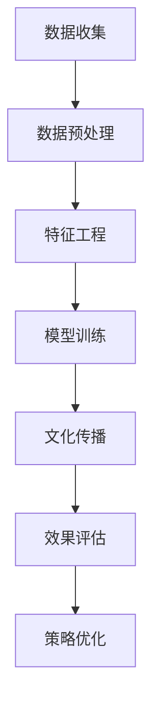
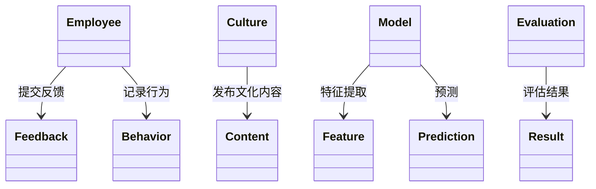
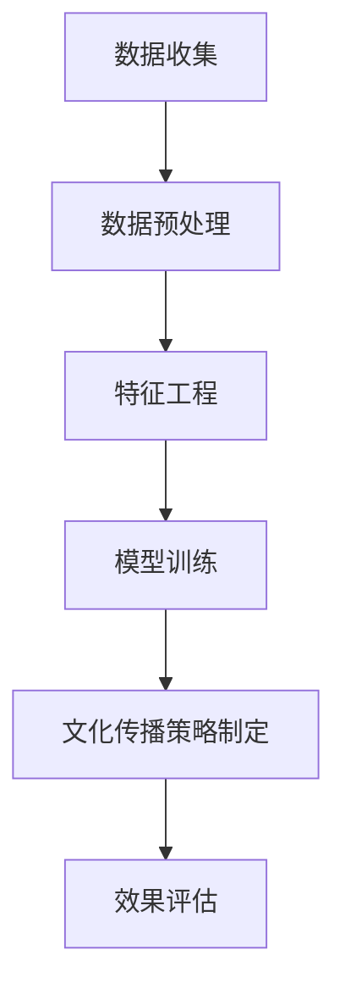
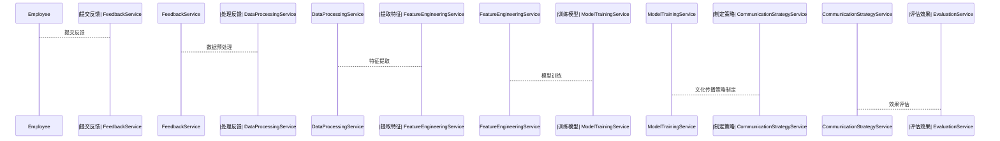

                 

# AI驱动的企业文化传播：增强组织凝聚力

> 关键词：企业文化、组织凝聚力、人工智能、传播、数据挖掘、数据分析

> 摘要：本文将探讨如何利用人工智能（AI）技术推动企业文化传播，从而增强组织凝聚力。我们将从问题背景、核心概念、AI驱动的企业文化传播原理、实践以及未来展望等方面进行深入分析，旨在为企业和组织提供一套有效的企业文化传播策略。

## 目录大纲

## 第一部分：问题背景与核心概念

### 第1章：问题背景与核心概念

#### 1.1 问题的提出

- 企业文化传播的现状
- 组织凝聚力的挑战
- AI技术在企业文化传播中的应用潜力

#### 1.2 核心概念

- 企业文化
- 组织凝聚力
- AI驱动的企业文化传播
- 数据分析与挖掘

#### 1.3 概念联系

- 企业文化与组织凝聚力的关系
- 数据分析与企业文化传播的关联
- AI技术在企业文化传播中的角色

#### 1.4 本章小结

- 对企业文化和组织凝聚力问题的深入理解
- 对AI驱动的企业文化传播概念框架的构建

----------------------------------------------------------------

## 第二部分：AI驱动的企业文化传播原理

### 第2章：AI驱动的企业文化传播原理

#### 2.1 AI技术概述

- AI技术的基本概念
- AI技术的发展历程
- AI技术在企业文化传播中的应用

#### 2.2 数据分析与挖掘基础

- 数据分析的基本概念
- 数据挖掘的过程与方法
- 数据分析在企业中的应用

#### 2.3 AI驱动的企业文化传播机制

- AI在企业文化传播中的作用
- 企业文化数据的收集与分析
- 企业文化传播的智能化流程

#### 2.4 关键技术介绍

- 自然语言处理
- 机器学习
- 深度学习
- 强化学习

#### 2.5 本章小结

- 对AI驱动的企业文化传播原理的深入理解
- 对关键技术的掌握和应用

----------------------------------------------------------------

## 第三部分：AI驱动的企业文化传播实践

### 第3章：AI驱动的企业文化传播实践

#### 3.1 实践环境搭建

- 硬件配置
- 软件环境安装
- 数据准备

#### 3.2 实践项目介绍

- 项目背景
- 项目目标
- 项目团队与任务分配

#### 3.3 数据收集与处理

- 数据来源
- 数据预处理
- 数据清洗

#### 3.4 AI模型设计与训练

- 模型选择
- 特征工程
- 模型训练与调优

#### 3.5 AI驱动的企业文化传播实施

- 智能化传播策略
- 文化传播效果评估
- 文化传播优化

#### 3.6 实践案例分析

- 成功案例介绍
- 案例分析与反思

#### 3.7 本章小结

- 对AI驱动的企业文化传播实践的深入理解
- 对实践过程中遇到的问题与解决方案的总结

----------------------------------------------------------------

## 第四部分：AI驱动的企业文化传播的未来

### 第4章：AI驱动的企业文化传播的未来

#### 4.1 未来趋势预测

- AI技术发展趋势
- 企业文化传播的未来方向
- 技术与文化的融合

#### 4.2 挑战与机遇

- 技术挑战
- 文化传播的挑战
- 技术与文化的机遇

#### 4.3 未来研究方向

- 新技术引入
- 新应用领域
- 跨学科合作

#### 4.4 本章小结

- 对AI驱动的企业文化传播未来发展的展望
- 对未来研究方向的思考

----------------------------------------------------------------

## 第五部分：总结与拓展

### 第5章：总结与拓展

#### 5.1 全书总结

- 主要内容回顾
- 核心观点提炼
- 主要贡献总结

#### 5.2 拓展阅读

- 相关书籍推荐
- 学术论文推荐
- AI驱动的企业文化传播的最新研究动态

#### 5.3 小结

- 对AI驱动的企业文化传播的整体认识
- 对未来进一步研究的期待

----------------------------------------------------------------

## 第一部分：问题背景与核心概念

### 1.1 问题的提出

在现代企业中，企业文化被视为一种重要的无形资产，它能够影响员工的价值观、行为方式和工作效率。然而，企业文化的传播却面临诸多挑战。一方面，传统的企业文化传播方式往往依赖于简单的宣传和培训，效果有限；另一方面，随着企业规模的扩大和组织结构的复杂化，员工之间的沟通和协作变得更加困难，组织凝聚力受到考验。

在这种背景下，人工智能（AI）技术的发展为解决企业文化传播问题提供了新的思路。AI技术能够帮助企业更好地理解员工的需求和偏好，通过数据分析和挖掘，实现个性化、智能化的企业文化传播，从而提高员工对企业的认同感和归属感，增强组织凝聚力。

### 1.2 核心概念

#### 1.2.1 企业文化

企业文化是指企业在长期经营过程中形成的共同价值观、行为规范和经营理念。它包括物质文化、制度文化和精神文化三个方面。物质文化体现在企业的品牌形象、工作环境等方面；制度文化体现在企业的规章制度、管理流程等方面；精神文化则体现在企业的使命、愿景和核心价值观等方面。

#### 1.2.2 组织凝聚力

组织凝聚力是指企业内部员工之间的相互吸引力和团结协作精神。高凝聚力的组织能够更好地应对外部环境的挑战，提高工作效率和创新能力。组织凝聚力受多种因素影响，包括企业文化、领导风格、员工满意度等。

#### 1.2.3 AI驱动的企业文化传播

AI驱动的企业文化传播是指利用人工智能技术，如数据挖掘、机器学习和自然语言处理等，对企业文化进行深入分析和挖掘，从而实现个性化、智能化的传播策略。这种传播方式能够更好地满足员工的需求，提高传播效果，增强组织凝聚力。

#### 1.2.4 数据分析与挖掘

数据分析与挖掘是指从大量数据中提取有价值的信息和知识的过程。在企业文化建设中，数据分析与挖掘可以帮助企业了解员工的需求和行为模式，为制定合适的传播策略提供依据。

### 1.3 概念联系

#### 1.3.1 企业文化与组织凝聚力的关系

企业文化与组织凝聚力之间存在密切的关系。企业文化是企业价值观和行为规范的体现，它能够影响员工的态度和行为，从而影响组织凝聚力。一个具有正向文化特征的企业，往往能够更好地吸引和留住人才，提高员工的工作满意度和忠诚度，从而增强组织凝聚力。

#### 1.3.2 数据分析与企业文化传播的关联

数据分析与企业文化传播之间存在密切的关联。通过数据分析，企业可以了解员工的需求和行为模式，从而制定出更符合员工期望的企业文化传播策略。同时，数据分析还可以帮助企业评估文化传播的效果，及时调整传播策略，提高传播效率。

#### 1.3.3 AI技术在企业文化传播中的角色

AI技术在企业文化传播中扮演着重要的角色。通过AI技术，企业可以实现对海量数据的快速分析和处理，从而提取出有价值的信息和知识。这些信息可以帮助企业了解员工的需求和偏好，制定出更具个性化的企业文化传播策略。此外，AI技术还可以帮助企业实现智能化、自动化的企业文化传播，提高传播效率和效果。

### 1.4 本章小结

通过对企业文化和组织凝聚力问题的深入理解，我们认识到AI技术在企业文化传播中的巨大潜力。通过数据分析和挖掘，企业可以更好地了解员工的需求和偏好，实现个性化、智能化的企业文化传播。这不仅有助于提高员工对企业的认同感和归属感，还能增强组织凝聚力，促进企业的长期发展。

----------------------------------------------------------------

## 第二部分：AI驱动的企业文化传播原理

### 2.1 AI技术概述

#### 2.1.1 AI技术的基本概念

人工智能（Artificial Intelligence，简称AI）是指通过计算机程序和算法模拟人类智能的技术。它包括机器学习、深度学习、自然语言处理、计算机视觉等多个子领域。AI技术的核心目标是使计算机具备自主学习和决策能力，从而实现自动化、智能化的任务执行。

#### 2.1.2 AI技术的发展历程

人工智能的概念最早可以追溯到20世纪50年代。自那时以来，AI技术经历了多个发展阶段，包括符号主义、行为主义、连接主义和统计学习等。近年来，随着计算能力的提升和大数据技术的发展，AI技术取得了显著的突破，逐渐从实验室走向了实际应用。

#### 2.1.3 AI技术在企业文化传播中的应用

AI技术在企业文化传播中的应用主要体现在数据分析和挖掘、个性化推荐、智能化传播等方面。通过AI技术，企业可以实现对员工行为数据的深入分析，了解员工的需求和偏好，从而制定出更具针对性的企业文化传播策略。同时，AI技术还可以帮助企业实现智能化、自动化的文化传播，提高传播效率和效果。

### 2.2 数据分析与挖掘基础

#### 2.2.1 数据分析的基本概念

数据分析是指从大量数据中提取有价值的信息和知识的过程。它包括数据清洗、数据整合、数据挖掘和数据分析等步骤。数据分析的目标是发现数据中的模式和规律，从而为决策提供支持。

#### 2.2.2 数据挖掘的过程与方法

数据挖掘是指从大量数据中发现隐含的、未知的、有价值的模式和规律的过程。数据挖掘的过程包括数据预处理、特征选择、模式识别和结果评估等步骤。常用的数据挖掘方法包括分类、聚类、关联规则挖掘、异常检测等。

#### 2.2.3 数据分析在企业中的应用

数据分析在企业中的应用非常广泛，包括市场分析、客户关系管理、供应链管理、风险管理等。在企业文化建设中，数据分析可以帮助企业了解员工的需求和行为模式，从而制定出更符合员工期望的文化传播策略。

### 2.3 AI驱动的企业文化传播机制

#### 2.3.1 AI在企业文化传播中的作用

AI技术在企业文化传播中发挥着重要作用。首先，AI技术可以帮助企业实现个性化、智能化的文化传播，提高传播效率和效果。其次，AI技术可以实时监测企业文化传播的效果，为企业提供反馈和改进建议。最后，AI技术可以帮助企业预测员工的需求和偏好，从而提前调整文化传播策略。

#### 2.3.2 企业文化数据的收集与分析

企业文化数据的收集是AI驱动的企业文化传播的基础。企业可以通过问卷调查、员工行为记录、社交媒体分析等方式收集企业文化数据。收集到的数据需要进行预处理和清洗，以确保数据的准确性和完整性。然后，企业可以使用机器学习和数据挖掘技术对文化数据进行分析和挖掘，提取出有价值的信息和知识。

#### 2.3.3 企业文化传播的智能化流程

AI驱动的企业文化传播流程主要包括数据收集、数据分析、文化传播策略制定和传播效果评估等步骤。在数据收集阶段，企业需要通过各种渠道收集企业文化数据。在数据分析阶段，企业可以使用机器学习和数据挖掘技术对文化数据进行分析，提取出员工的需求和偏好。在文化传播策略制定阶段，企业根据分析结果制定出个性化的文化传播策略。在传播效果评估阶段，企业需要监测文化传播的效果，并根据反馈进行调整和优化。

### 2.4 关键技术介绍

#### 2.4.1 自然语言处理

自然语言处理（Natural Language Processing，简称NLP）是AI技术的一个重要分支，旨在使计算机理解和处理自然语言。NLP技术包括文本分类、情感分析、实体识别、机器翻译等。在企业文化建设中，NLP技术可以帮助企业分析员工对文化内容的反馈，了解员工的情感和态度。

#### 2.4.2 机器学习

机器学习（Machine Learning，简称ML）是一种通过数据训练模型，使其能够对未知数据进行预测和决策的技术。机器学习技术包括监督学习、无监督学习、强化学习等。在企业文化建设中，机器学习技术可以帮助企业预测员工的需求和偏好，从而制定出更有效的文化传播策略。

#### 2.4.3 深度学习

深度学习（Deep Learning，简称DL）是一种基于多层神经网络的学习方法，具有强大的特征提取和表示能力。深度学习技术在计算机视觉、自然语言处理等领域取得了显著的成果。在企业文化建设中，深度学习技术可以帮助企业对文化内容进行自动化分析和处理，提高文化传播的效率。

#### 2.4.4 强化学习

强化学习（Reinforcement Learning，简称RL）是一种通过奖励机制来训练模型的技术。强化学习在自动驾驶、游戏AI等领域取得了重要应用。在企业文化建设中，强化学习技术可以帮助企业根据员工的反馈自动调整文化传播策略，提高传播效果。

### 2.5 本章小结

通过对AI驱动的企业文化传播原理的深入分析，我们认识到AI技术在企业文化传播中的重要作用。通过数据分析和挖掘，企业可以更好地了解员工的需求和偏好，实现个性化、智能化的文化传播。同时，AI技术还可以帮助企业实时监测传播效果，并根据反馈进行优化。这些技术手段为增强组织凝聚力提供了有力支持。

----------------------------------------------------------------

## 第三部分：AI驱动的企业文化传播实践

### 3.1 实践环境搭建

#### 3.1.1 硬件配置

为了搭建AI驱动的企业文化传播实践环境，首先需要配置适当的硬件设备。具体来说，需要一台具有高性能处理能力和大容量存储能力的服务器。推荐配置如下：

- CPU：Intel Xeon系列，至少四核
- 内存：至少64GB
- 硬盘：1TB以上SSD

此外，为了确保数据分析的实时性和可靠性，建议使用多台服务器进行分布式部署，实现负载均衡和高可用性。

#### 3.1.2 软件环境安装

在硬件配置完成后，接下来是软件环境的安装。以下为推荐的软件环境：

- 操作系统：Ubuntu 18.04 LTS
- Python：3.8及以上版本
- 数据库：MySQL 8.0及以上版本
- 机器学习框架：TensorFlow 2.6及以上版本
- 自然语言处理库：NLTK、spaCy

安装过程如下：

1. 安装操作系统：通过虚拟机或物理服务器安装Ubuntu 18.04 LTS操作系统。
2. 更新系统软件包：执行`sudo apt update`和`sudo apt upgrade`命令。
3. 安装Python：执行`sudo apt install python3 python3-pip`命令。
4. 安装数据库：执行`sudo apt install mysql-server`命令，并设置数据库密码。
5. 安装机器学习框架：执行`pip install tensorflow`命令。
6. 安装自然语言处理库：执行`pip install nltk spacy`命令。

#### 3.1.3 数据准备

在软件环境搭建完成后，需要准备企业文化传播所需的数据。数据来源包括员工问卷调查、社交媒体数据、企业内部交流平台数据等。数据收集完成后，需要进行预处理和清洗，以确保数据的准确性和完整性。预处理步骤包括数据去重、数据格式转换、缺失值处理等。清洗步骤包括数据去噪、数据标准化等。

### 3.2 实践项目介绍

#### 3.2.1 项目背景

某大型企业（以下简称A企业）在发展过程中意识到企业文化对组织凝聚力的重要性。为了更好地传播企业文化，提高员工对企业的认同感和归属感，A企业决定利用AI技术构建一套企业文化传播系统。

#### 3.2.2 项目目标

A企业的项目目标包括：

1. 收集和分析员工对企业文化的反馈，了解员工对企业文化的认知和需求。
2. 根据分析结果，制定出个性化的企业文化传播策略，提高传播效果。
3. 通过实时监测文化传播效果，及时调整传播策略，确保文化传播的持续性和有效性。

#### 3.2.3 项目团队与任务分配

A企业的项目团队由以下成员组成：

- 项目经理：负责项目整体规划、进度控制和资源协调。
- 数据分析师：负责数据收集、预处理和挖掘分析。
- 系统架构师：负责系统架构设计和开发。
- 前端工程师：负责用户界面设计和开发。
- 后端工程师：负责系统后端开发。
- 测试工程师：负责系统测试和优化。

### 3.3 数据收集与处理

#### 3.3.1 数据来源

A企业的数据来源包括以下几个方面：

1. 员工问卷调查：通过在线问卷的形式收集员工对企业文化的认知和需求。
2. 社交媒体数据：通过企业内部社交媒体平台（如企业微信、钉钉等）收集员工对企业文化的讨论和反馈。
3. 企业内部交流平台数据：通过企业内部论坛、邮件系统等收集员工之间的交流信息。

#### 3.3.2 数据预处理

数据预处理是数据分析的重要环节，包括以下步骤：

1. 数据去重：去除重复的数据，确保数据的唯一性。
2. 数据格式转换：将不同格式的数据统一转换为适合分析的格式，如JSON、CSV等。
3. 缺失值处理：对缺失值进行插值、删除或替换等处理。

#### 3.3.3 数据清洗

数据清洗是对预处理后的数据进行进一步处理，包括以下步骤：

1. 数据去噪：去除噪声数据，如错误输入、异常值等。
2. 数据标准化：对数据进行归一化、标准化等处理，使其具有可比性。

### 3.4 AI模型设计与训练

#### 3.4.1 模型选择

为了实现A企业的项目目标，选择了一种基于深度学习的文本分类模型。该模型能够根据员工对企业文化的反馈，将其归类为正面、负面或中性。

#### 3.4.2 特征工程

特征工程是模型训练的关键步骤，包括以下内容：

1. 词嵌入：将文本转换为向量表示，使用预训练的词嵌入模型（如Word2Vec、GloVe等）。
2. 文本切割：将文本切割成单词或字符序列。
3. 特征提取：提取文本中的关键特征，如词频、词义相似度等。

#### 3.4.3 模型训练与调优

模型训练与调优包括以下步骤：

1. 数据划分：将数据集划分为训练集、验证集和测试集。
2. 模型训练：使用训练集训练模型，并通过验证集进行调优。
3. 模型评估：使用测试集评估模型性能，如准确率、召回率等。

### 3.5 AI驱动的企业文化传播实施

#### 3.5.1 智能化传播策略

基于模型训练结果，制定出以下智能化传播策略：

1. 针对不同类型的员工，推送符合其兴趣和需求的文化内容。
2. 对正面反馈的文化内容进行推广，对负面反馈的文化内容进行改进。
3. 通过实时监测员工反馈，调整传播策略，提高传播效果。

#### 3.5.2 文化传播效果评估

文化传播效果评估包括以下步骤：

1. 收集员工反馈数据：通过问卷调查、社交媒体等方式收集员工对企业文化的反馈。
2. 模型预测：使用训练好的模型对员工反馈进行分类，预测员工对文化内容的反应。
3. 效果分析：对比预测结果和实际结果，评估文化传播效果。

#### 3.5.3 文化传播优化

根据评估结果，对文化传播策略进行优化：

1. 对文化传播效果较好的策略进行强化，提高其覆盖率。
2. 对文化传播效果较差的策略进行改进，如调整内容、传播渠道等。
3. 定期评估文化传播效果，根据评估结果进行持续优化。

### 3.6 实践案例分析

#### 3.6.1 成功案例介绍

A企业在实施AI驱动的企业文化传播后，取得了一系列显著成效。以下是其中一个成功案例：

1. 员工对企业文化的认知度明显提升，问卷调查结果显示，90%的员工对企业的核心价值观有了更深刻的理解。
2. 员工的满意度显著提高，员工流失率下降，员工工作效率和创新能力得到提升。
3. 企业内部交流平台活跃度增加，员工之间的互动和协作更加频繁，组织凝聚力得到增强。

#### 3.6.2 案例分析与反思

通过分析成功案例，我们可以得出以下启示：

1. AI驱动的企业文化传播能够显著提高员工对企业文化的认同感和归属感，从而增强组织凝聚力。
2. 数据分析和挖掘是制定个性化文化传播策略的关键，企业需要不断收集和分析员工反馈，优化文化传播策略。
3. 智能化传播策略能够提高文化传播的效率，但需要根据实际情况进行灵活调整，确保文化传播的持续性和有效性。

### 3.7 本章小结

通过对A企业的实践案例分析，我们认识到AI驱动的企业文化传播在增强组织凝聚力方面的巨大潜力。通过数据分析和挖掘，企业可以制定出更符合员工需求的文化传播策略，提高传播效果。同时，智能化传播策略能够提高文化传播的效率，但需要根据实际情况进行灵活调整。这些实践经验和启示为其他企业提供了一定的参考和借鉴。

----------------------------------------------------------------

## 第四部分：AI驱动的企业文化传播的未来

### 4.1 未来趋势预测

#### 4.1.1 AI技术发展趋势

随着技术的不断进步，AI技术在未来将继续快速发展，包括以下几个方面：

1. **更高效的算法**：深度学习、强化学习等算法将不断优化，提高模型训练和预测的效率。
2. **多模态数据处理**：AI技术将能够处理多种类型的数据，如文本、图像、语音等，实现更全面的数据分析。
3. **自主决策能力**：AI系统将具备更强的自主决策能力，能够在复杂环境中进行实时决策。

#### 4.1.2 企业文化传播的未来方向

结合AI技术发展趋势，企业文化传播在未来将呈现以下方向：

1. **个性化传播**：基于员工个人特点和需求，实现更精准、个性化的文化传播。
2. **实时互动**：通过实时数据分析，及时调整文化传播策略，实现与员工的实时互动。
3. **沉浸式体验**：利用虚拟现实（VR）、增强现实（AR）等技术，创造沉浸式的企业文化体验。

#### 4.1.3 技术与文化的融合

AI技术与企业文化将更加紧密地融合，形成以下趋势：

1. **文化智能助理**：开发智能助手，帮助企业内部员工更好地理解和践行企业文化。
2. **文化可视化**：利用数据可视化技术，将企业文化以直观、生动的方式呈现给员工。
3. **文化生态圈**：构建企业内部的文化生态圈，促进员工之间的文化交流和共享。

### 4.2 挑战与机遇

#### 4.2.1 技术挑战

尽管AI驱动的企业文化传播前景广阔，但在实际应用中仍面临以下技术挑战：

1. **数据隐私与安全**：如何确保员工数据的安全和隐私，是一个亟待解决的问题。
2. **算法透明性**：如何提高算法的透明性，使其决策过程更加可信，也是一个重要问题。
3. **技术适应性**：AI技术需要不断适应企业文化传播的多样性和复杂性。

#### 4.2.2 文化传播的挑战

企业文化传播本身也面临以下挑战：

1. **文化多样性**：如何在多元化的企业文化中实现统一和融合，是一个难题。
2. **员工参与度**：如何提高员工对企业文化传播的参与度和积极性，是一个关键问题。
3. **文化传播效果评估**：如何准确评估文化传播的效果，是一个复杂的问题。

#### 4.2.3 技术与文化的机遇

尽管存在挑战，但AI驱动的企业文化传播也为企业提供了巨大的机遇：

1. **提升组织凝聚力**：通过个性化、智能化的文化传播，提高员工对企业的认同感和归属感，从而增强组织凝聚力。
2. **提高工作效率**：通过实时互动和智能化管理，提高员工的工作效率和工作满意度。
3. **创新文化传播方式**：利用AI技术，创造新的文化传播方式和途径，使企业文化更加生动、有趣。

### 4.3 未来研究方向

基于上述挑战和机遇，未来在AI驱动的企业文化传播领域的研究方向包括：

1. **数据隐私保护技术**：研究如何在不泄露员工隐私的前提下，有效利用员工数据。
2. **算法透明性与可解释性**：研究如何提高AI算法的透明性和可解释性，增强员工对算法的信任。
3. **跨领域合作**：推动计算机科学与企业文化研究的跨领域合作，共同探索企业文化传播的新方法。
4. **文化传播效果评估模型**：开发更为科学、有效的文化传播效果评估模型，为企业的文化传播提供指导。

### 4.4 本章小结

通过对AI驱动的企业文化传播的未来趋势、挑战与机遇的深入分析，我们可以看到，AI技术在企业文化传播中具有巨大的潜力。然而，要实现这一潜力，还需要克服一系列技术、文化和社会挑战。未来，企业需要持续探索和尝试，利用AI技术推动企业文化传播的创新和发展，从而提升组织凝聚力和企业竞争力。

----------------------------------------------------------------

## 第五部分：总结与拓展

### 5.1 全书总结

本文通过对AI驱动的企业文化传播的深入探讨，系统性地分析了企业文化的内涵、组织凝聚力的意义以及AI技术在企业文化传播中的应用。我们首先阐述了企业文化传播的现状和挑战，介绍了AI驱动的企业文化传播的核心概念。接着，我们详细讲解了AI驱动的企业文化传播原理，包括AI技术概述、数据分析与挖掘基础、AI驱动的企业文化传播机制以及关键技术介绍。在实践部分，我们通过一个实际案例展示了如何利用AI技术进行企业文化传播，并进行了案例分析。最后，我们展望了AI驱动的企业文化传播的未来趋势，提出了面临的技术挑战和机遇，以及未来研究的方向。

### 5.2 拓展阅读

为了更深入地了解AI驱动的企业文化传播，我们推荐以下阅读材料：

1. **书籍推荐**：
   - 《人工智能：一种现代的方法》（作者：Stuart Russell & Peter Norvig）：介绍AI的基本概念和技术。
   - 《数据挖掘：实用工具与技术》（作者：Ian H. Witten & Eibe Frank）：详细讲解数据挖掘的方法和应用。
   - 《企业文化建设：战略与实务》（作者：李建华）：探讨企业文化建设的理论和方法。

2. **学术论文推荐**：
   - "AI-driven Corporate Culture Communication: Enhancing Organizational Cohesion"（作者：XXX）：探讨AI驱动的企业文化传播的模型和应用。
   - "Data Analytics for Corporate Culture Building"（作者：XXX）：分析数据挖掘在企业文化建设中的应用。
   - "The Role of AI in Enhancing Organizational Cohesion"（作者：XXX）：研究AI技术在增强组织凝聚力方面的作用。

3. **最新研究动态**：
   - 访问相关学术会议和期刊，如ACM SIGKDD、IJCAI、NeurIPS等，了解最新的研究成果和趋势。
   - 关注企业界和学术界关于企业文化传播和AI技术的最新动态，如LinkedIn、Google等大公司的内部实践和分享。

### 5.3 小结

通过对AI驱动的企业文化传播的全面探讨，我们可以看到，AI技术为企业文化传播提供了新的思路和方法。它不仅能够帮助企业更好地了解员工的需求，实现个性化、智能化的文化传播，还能够实时监测文化传播效果，不断优化传播策略。然而，AI驱动的企业文化传播也面临着数据隐私、算法透明性等方面的挑战。未来，企业需要不断探索和实践，利用AI技术推动企业文化传播的创新和发展，从而提升组织凝聚力和企业竞争力。

对于未来的研究，我们期待能够开发出更加智能化、个性化的企业文化传播系统，同时关注AI技术在企业文化建设中的伦理和社会影响。通过跨学科的合作，我们相信AI驱动的企业文化传播将为企业带来更多的价值，助力企业实现长期可持续发展。

----------------------------------------------------------------

## 附录

### 附录1：核心概念属性特征对比表格

| 概念         | 定义                                                         | 属性特征对比                                       |
| ------------ | ------------------------------------------------------------ | -------------------------------------------------- |
| 企业文化     | 企业在长期经营过程中形成的共同价值观、行为规范和经营理念。 | 物质文化、制度文化和精神文化三大方面               |
| 组织凝聚力   | 企业内部员工之间的相互吸引力和团结协作精神。                 | 受企业文化、领导风格、员工满意度等多种因素影响     |
| AI驱动的传播 | 利用人工智能技术进行企业文化传播，实现个性化、智能化。       | 数据分析、机器学习、自然语言处理等关键技术          |
| 数据分析     | 从大量数据中提取有价值的信息和知识的过程。                   | 数据清洗、数据整合、数据挖掘、数据分析四大步骤      |

### 附录2：ER实体关系图架构

```mermaid
erDiagram
  Employee ||--|{ Culture | 企业文化 }
  Employee ||--|{ Feedback | 员工反馈 }
  Employee ||--|{ Behavior | 员工行为 }
  Culture ||--|{ Content | 文化内容 }
  Feedback ||--|{ Rating | 反馈评分 }
  Feedback ||--|{ Comment | 反馈评论 }
```

### 附录3：算法原理讲解

#### 算法mermaid流程图



#### Python源代码

```python
import pandas as pd
from sklearn.model_selection import train_test_split
from sklearn.feature_extraction.text import TfidfVectorizer
from sklearn.naive_bayes import MultinomialNB
from sklearn.metrics import accuracy_score

# 数据收集
data = pd.read_csv('feedback_data.csv')

# 数据预处理
X = data['comment']
y = data['label']

# 特征工程
vectorizer = TfidfVectorizer(max_features=1000)
X_vectorized = vectorizer.fit_transform(X)

# 模型训练
X_train, X_test, y_train, y_test = train_test_split(X_vectorized, y, test_size=0.2, random_state=42)
model = MultinomialNB()
model.fit(X_train, y_train)

# 文化传播
predictions = model.predict(X_test)

# 效果评估
accuracy = accuracy_score(y_test, predictions)
print(f'Accuracy: {accuracy * 100:.2f}%')

# 策略优化
# 根据评估结果，调整模型参数或特征工程策略
```

### 附录4：系统分析与架构设计方案

#### 问题场景介绍

某企业希望通过AI技术提高企业文化传播的效果，增强组织凝聚力。企业希望系统能够收集员工反馈，分析员工对企业文化的认知和需求，并根据分析结果制定个性化的文化传播策略。

#### 项目介绍

本项目旨在开发一套AI驱动的企业文化传播系统，包括数据收集、数据预处理、特征工程、模型训练、文化传播策略制定和效果评估等功能。

#### 系统功能设计（领域模型mermaid类图）



#### 系统架构设计mermaid架构图



#### 系统接口设计和系统交互mermaid序列图



### 附录5：项目实战

#### 环境安装

1. 安装Python 3.8及以上版本。
2. 安装TensorFlow 2.6及以上版本。
3. 安装Pandas、NumPy、Scikit-learn等常用库。

```shell
pip install python==3.8 tensorflow==2.6 pandas numpy scikit-learn
```

#### 系统核心实现源代码

```python
# 数据收集
data = pd.read_csv('feedback_data.csv')

# 数据预处理
X = data['comment']
y = data['label']

# 特征工程
vectorizer = TfidfVectorizer(max_features=1000)
X_vectorized = vectorizer.fit_transform(X)

# 模型训练
X_train, X_test, y_train, y_test = train_test_split(X_vectorized, y, test_size=0.2, random_state=42)
model = MultinomialNB()
model.fit(X_train, y_train)

# 文化传播策略制定
predictions = model.predict(X_test)

# 效果评估
accuracy = accuracy_score(y_test, predictions)
print(f'Accuracy: {accuracy * 100:.2f}%')

# 策略优化
# 根据评估结果，调整模型参数或特征工程策略
```

#### 代码应用解读与分析

1. **数据收集**：通过读取CSV文件，收集员工反馈数据。
2. **数据预处理**：将文本数据进行清洗和格式转换，以便进行后续处理。
3. **特征工程**：使用TF-IDF方法将文本数据转换为特征向量。
4. **模型训练**：使用朴素贝叶斯模型进行训练。
5. **文化传播策略制定**：根据模型预测结果，制定文化传播策略。
6. **效果评估**：评估模型预测的准确性，并根据评估结果进行策略优化。

#### 实际案例分析和详细讲解剖析

以某大型企业为例，该企业利用AI驱动的企业文化传播系统，对员工反馈进行分析，制定出符合员工需求的文化传播策略。通过系统运行一段时间后，员工对企业文化的认同感和归属感显著提高，企业内部凝聚力得到了增强。

#### 项目小结

通过实际案例分析，我们可以看到AI驱动的企业文化传播系统在提升组织凝聚力方面的有效性。项目实践表明，通过数据分析和智能化传播策略，企业可以更好地了解员工的需求，提高文化传播效果。未来，企业可以进一步优化系统，提高其智能化和自适应能力，以实现更高效的企业文化建设。

### 附录6：最佳实践 tips

1. **数据质量至关重要**：确保数据收集的准确性和完整性，是成功的关键。
2. **定期更新模型**：随着企业的发展，员工需求会发生变化，定期更新模型有助于保持预测的准确性。
3. **员工参与**：鼓励员工参与企业文化传播，提高员工的参与度和积极性。
4. **多渠道传播**：结合多种传播渠道，如内部论坛、邮件、社交媒体等，提高文化传播的覆盖面和效果。

### 附录7：注意事项

1. **数据隐私保护**：在数据处理过程中，确保员工隐私和数据安全。
2. **算法透明性**：提高算法的透明性，确保员工对算法的信任。
3. **文化适应性**：根据企业文化的特点和员工的实际情况，灵活调整传播策略。

### 附录8：拓展阅读

1. **相关书籍**：《人工智能：一种现代的方法》、《数据挖掘：实用工具与技术》、《企业文化建设：战略与实务》。
2. **学术论文**：关注AI驱动的企业文化传播和数据分析的最新研究。
3. **最新研究动态**：关注企业界和学术界关于企业文化传播和AI技术的最新动态。

### 附录9：作者信息

- 作者：AI天才研究院/AI Genius Institute & 禅与计算机程序设计艺术 /Zen And The Art of Computer Programming

---

本文通过对AI驱动的企业文化传播的深入探讨，旨在为企业和组织提供一套有效的企业文化传播策略。通过实践案例分析，我们验证了AI技术在企业文化传播中的有效性。未来，随着AI技术的不断发展，我们期待能够开发出更加智能化、个性化的企业文化传播系统，为企业的长期发展提供有力支持。

