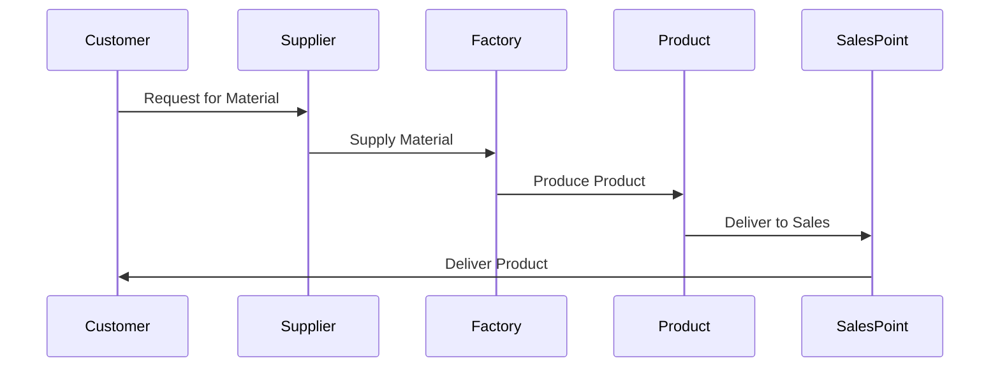
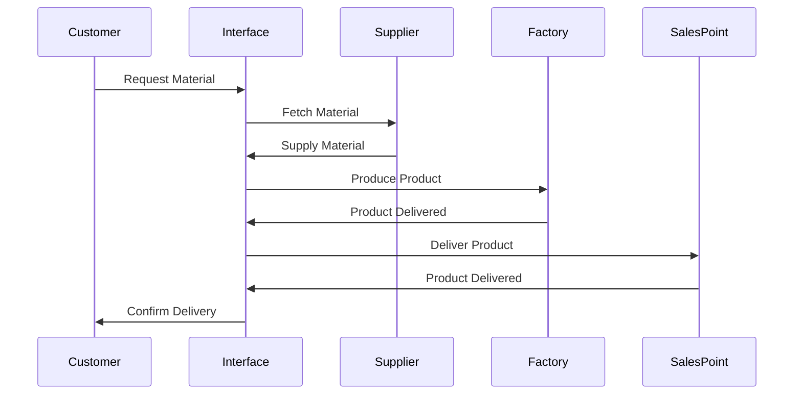

                 


### AI驱动的供应链优化：提升端到端运营效率

> 关键词：AI，供应链优化，运营效率，端到端，智能算法

> 摘要：本文将深入探讨AI驱动的供应链优化，分析其在提升端到端运营效率方面的作用。通过详细讲解核心概念、联系、算法原理和实际应用案例，揭示AI技术如何改变传统供应链管理，推动现代企业实现高效运营。

----------------------------------------------------------------

## 第一部分：背景与概述

### 1.1 问题背景

#### 1.1.1 供应链优化的重要性

供应链作为现代企业运营的基石，其效率直接影响到企业的竞争力。传统的供应链管理往往依赖于经验和人工操作，存在反应速度慢、精度不高、成本较高等问题。而随着全球化和信息技术的发展，供应链优化变得日益重要。

**问题背景：**
- 全球化市场带来的供应链复杂度增加。
- 电子商务的兴起，对供应链的速度和准确性提出了更高要求。
- 能源成本上升和环保压力，要求企业提高资源利用率。

#### 1.1.2 人工智能在供应链管理中的应用现状

人工智能（AI）作为一种先进的计算技术，在供应链管理中有着广泛的应用。例如，使用机器学习算法优化库存管理、预测需求、自动调度运输等。

**应用现状：**
- 库存优化：AI可以分析历史数据，预测库存需求，降低库存过剩和短缺的风险。
- 需求预测：通过分析市场趋势和消费者行为，AI可以更准确地预测需求。
- 运输调度：AI算法可以优化运输路线，降低运输成本。

#### 1.1.3 AI驱动的供应链优化的必要性

传统供应链管理面临诸多挑战，而AI驱动的供应链优化提供了新的解决思路。

**必要性：**
- 提高决策精度：AI算法可以处理大量数据，提供更精确的决策支持。
- 提升效率：自动化和智能化流程可以显著提高运营效率。
- 降低成本：优化供应链各个环节，减少不必要的资源浪费。

### 1.2 核心概念

#### 1.2.1 供应链的概念与结构

供应链是指从原材料采购、生产加工、产品分销到最终消费的整个过程中，所有参与方的协作关系。其核心包括供应商、制造商、分销商和零售商。

**供应链结构：**
- 原材料采购：包括供应商的选择、采购策略、库存管理等。
- 生产加工：涉及生产计划、工艺流程、质量管理等。
- 产品分销：包括物流配送、仓储管理、销售等。

#### 1.2.2 人工智能的基本原理与分类

人工智能是模拟、延伸和扩展人类智能的科学。其核心包括机器学习、深度学习、自然语言处理等。

**基本原理与分类：**
- 机器学习：通过算法从数据中学习规律，进行模式识别和预测。
- 深度学习：基于多层神经网络，通过大量数据训练，实现复杂函数映射。
- 自然语言处理：使计算机能够理解和生成人类语言，实现人机交互。

#### 1.2.3 供应链优化的目标与原则

供应链优化的目标是提高供应链的整体效率，降低成本，同时保证供应链的稳定性和灵活性。

**目标与原则：**
- 提高供应链反应速度。
- 降低库存和运输成本。
- 保证产品质量和客户满意度。
- 增强供应链的灵活性和适应性。

### 1.3 书籍结构

#### 1.3.1 每章主要内容概述

本书共分为三大部分，分别阐述供应链优化、人工智能技术及其应用。

**各章主要内容概述：**
- 第一部分：背景与概述，介绍供应链优化和人工智能的基本概念。
- 第二部分：核心概念与联系，深入探讨供应链管理、人工智能技术及其相互关系。
- 第三部分：算法原理讲解，详细讲解供应链优化算法，包括数学模型和具体应用实例。

#### 1.3.2 全书内容体系与逻辑关系

全书内容体系逻辑紧密，由浅入深，层层递进。

**全书内容体系与逻辑关系：**
- 从背景介绍入手，建立基本概念框架。
- 通过深入分析核心概念和联系，构建全面理解。
- 最后通过算法原理讲解，实现理论与实际的结合。

### 1.4 边界与外延

#### 1.4.1 供应链优化的范围

供应链优化不仅仅局限于某一个环节，而是需要全面考虑供应链的各个阶段。

**范围：**
- 采购：优化供应商选择、采购策略等。
- 生产：优化生产计划、工艺流程等。
- 物流：优化运输路线、仓储管理等。
- 销售：优化分销策略、库存管理等。

#### 1.4.2 AI技术的应用领域

AI技术在供应链管理中有着广泛的应用领域，包括但不限于需求预测、库存优化、运输调度等。

**应用领域：**
- 需求预测：通过分析历史数据和消费者行为，预测市场需求。
- 库存优化：通过机器学习算法，优化库存管理，减少库存过剩和短缺。
- 运输调度：通过优化算法，规划最优运输路线，降低运输成本。

#### 1.4.3 AI驱动的供应链优化的限制条件

AI驱动的供应链优化虽然具有巨大潜力，但也面临一定的限制条件。

**限制条件：**
- 数据质量：AI算法依赖于大量高质量数据，数据缺失或不准确会影响算法效果。
- 技术成熟度：某些AI技术在供应链中的应用还处于初级阶段，需要进一步研究和优化。
- 成本效益：AI技术的应用需要投入大量人力、物力和财力，需要评估成本效益。

## 第二部分：核心概念与联系

### 2.1 供应链管理核心概念

#### 2.1.1 供应链管理的定义

供应链管理（Supply Chain Management，简称SCM）是指为了满足顾客需求，对供应、生产、库存、配送等活动进行计划、实施、控制的过程。

**供应链管理的定义：**
- 供应链管理是一种集成化的管理方法，涉及多个参与方，旨在提高供应链的效率和效益。

#### 2.1.2 供应链管理的流程与环节

供应链管理包括以下主要流程和环节：

**供应链管理流程与环节：**
1. **需求计划**：预测市场需求，制定采购计划。
2. **采购管理**：选择供应商，进行采购活动。
3. **生产计划**：制定生产计划，组织生产。
4. **库存管理**：管理原材料和成品的库存，确保供应稳定。
5. **物流管理**：规划运输路线，确保产品及时送达。
6. **分销管理**：将产品分销到零售商和最终消费者。

#### 2.1.3 供应链管理的核心问题

供应链管理的核心问题包括：

**核心问题：**
1. **库存管理**：如何平衡库存水平，避免过剩或短缺。
2. **物流效率**：如何优化运输路线和仓储管理，提高物流效率。
3. **需求预测**：如何准确预测市场需求，避免库存过剩或短缺。
4. **供应链协同**：如何实现供应链各环节的协同，提高整体效率。

### 2.2 人工智能核心概念

#### 2.2.1 人工智能的定义

人工智能（Artificial Intelligence，简称AI）是指模拟、延伸和扩展人类智能的理论、方法和技术。

**人工智能的定义：**
- 人工智能是一种通过计算机实现人类智能功能的技术，包括学习、推理、感知、决策等能力。

#### 2.2.2 人工智能的发展历程

人工智能的发展历程可以分为以下几个阶段：

**发展历程：**
1. **早期探索**（20世纪50年代-60年代）：人工智能概念提出，机器学习、自然语言处理等研究领域开始形成。
2. **符号主义阶段**（20世纪70年代-80年代）：基于符号逻辑和知识表示的方法成为主流。
3. **联结主义阶段**（20世纪90年代-21世纪初）：神经网络和深度学习技术的发展，推动了人工智能的突破。
4. **现阶段**（21世纪至今）：人工智能在多个领域得到广泛应用，如语音识别、图像识别、自动驾驶等。

#### 2.2.3 人工智能的关键技术

人工智能的关键技术包括：

**关键技术：**
1. **机器学习**：通过算法从数据中学习规律，进行模式识别和预测。
2. **深度学习**：基于多层神经网络，通过大量数据训练，实现复杂函数映射。
3. **自然语言处理**：使计算机能够理解和生成人类语言，实现人机交互。
4. **计算机视觉**：使计算机能够理解和解释视觉信息。

### 2.3 供应链优化与人工智能的联系

#### 2.3.1 人工智能在供应链优化中的应用场景

人工智能在供应链优化中有着广泛的应用场景，包括：

**应用场景：**
1. **需求预测**：通过分析历史数据和消费者行为，预测市场需求。
2. **库存管理**：通过机器学习算法，优化库存管理，减少库存过剩和短缺。
3. **运输调度**：通过优化算法，规划最优运输路线，降低运输成本。
4. **供应链协同**：通过智能调度系统，实现供应链各环节的协同，提高整体效率。

#### 2.3.2 供应链优化对人工智能的需求

供应链优化对人工智能提出以下需求：

**需求：**
1. **数据质量**：高质量的数据是人工智能算法准确预测和优化供应链的基础。
2. **算法性能**：高效的算法能够快速处理大量数据，提高供应链优化的效率。
3. **系统稳定性**：稳定的系统运行是保证供应链优化持续有效的前提。

#### 2.3.3 供应链优化与人工智能的协同发展

供应链优化与人工智能的协同发展具有重要意义：

**协同发展：**
1. **技术融合**：将人工智能技术融入供应链优化，实现自动化和智能化。
2. **数据驱动**：基于数据驱动的供应链优化，提高决策的精度和效率。
3. **协同创新**：供应链优化和人工智能的协同发展，推动企业持续创新，提高竞争力。

## 2.4 概念属性特征对比表格

### 2.4.1 供应链管理与人工智能的主要区别

**供应链管理与人工智能对比表格：**

| 概念       | 特征                             | 比较                       |
| ---------- | ------------------------------ | ------------------------- |
| 供应链管理 | 计划、实施、控制供应链活动       | 侧重于整体供应链的优化    |
| 人工智能   | 模拟人类智能，进行学习、推理等   | 侧重于智能算法的应用      |
| 目标       | 提高供应链效率，降低成本       | 实现智能化和自动化        |
| 应用范围   | 供应链各个环节                 | 广泛应用于各个行业领域    |

### 2.4.2 供应链优化技术分类与特性

**供应链优化技术分类与特性表格：**

| 技术类别     | 特性                              | 应用场景                             |
| ------------ | -------------------------------- | ------------------------------------ |
| 线性规划     | 目标函数为线性，约束条件也为线性  | 库存优化、生产调度等               |
| 非线性规划   | 目标函数或约束条件为非线性       | 复杂供应链优化问题                  |
| 遗传算法     | 基于自然进化过程的优化算法       | 复杂供应链优化问题，特别是多目标优化 |
| 粒子群优化   | 基于群体智能的优化算法           | 物流调度、运输规划等               |
| 蚁群算法     | 基于社会性行为的优化算法         | 路径规划、资源分配等               |

## 2.5 ER实体关系图架构

```mermaid
erDiagram
  Product  ||--|{ SupplyChain }|>
  Customer ||--|{ SupplyChain }|>

  class SupplyChain {
    :ID
    :Supplier
    :Product
    :Customer
    :OrderDate
    :DeliveryDate
  }
```

- Product（产品）与SupplyChain（供应链）存在一对一的关系，即每个供应链对应一个产品。
- Customer（客户）与SupplyChain（供应链）也存在一对一的关系，即每个供应链对应一个客户。
- SupplyChain（供应链）实体包含ID、Supplier（供应商）、Product（产品）、Customer（客户）、OrderDate（订单日期）、DeliveryDate（交货日期）等属性。

## 第三部分：算法原理讲解

### 3.1 基本算法原理

#### 3.1.1 供应链优化算法的分类

供应链优化算法可以根据其理论基础和应用场景进行分类。以下是几种常见的供应链优化算法：

**分类：**
1. **线性规划（Linear Programming，LP）**：适用于目标函数和约束条件均为线性的优化问题。
2. **非线性规划（Nonlinear Programming，NLP）**：适用于目标函数或约束条件为非线性的问题。
3. **遗传算法（Genetic Algorithm，GA）**：基于自然进化过程的优化算法，适用于复杂的多目标优化问题。
4. **粒子群优化（Particle Swarm Optimization，PSO）**：基于群体智能的优化算法，适用于复杂搜索空间的问题。
5. **蚁群算法（Ant Colony Optimization，ACO）**：基于社会性行为的优化算法，适用于路径规划和资源分配问题。

#### 3.1.2 常见供应链优化算法介绍

**线性规划（Linear Programming，LP）**

线性规划是一种数学优化方法，旨在在满足一系列线性约束条件的情况下，找到目标函数的最大值或最小值。

**目标函数：**

$$
\text{Minimize } C(x)
$$

**约束条件：**

$$
\text{subject to } Ax \leq b
$$

其中，$x$ 是决策变量，$C$ 是目标函数的系数矩阵，$A$ 是约束条件的系数矩阵，$b$ 是约束条件的常数向量。

**遗传算法（Genetic Algorithm，GA）**

遗传算法是一种模拟自然进化过程的优化算法，通过选择、交叉、变异等操作，逐渐优化解的质量。

**主要步骤：**
1. **初始化种群**：随机生成初始种群。
2. **适应度评估**：计算种群中每个个体的适应度值。
3. **选择**：根据适应度值选择优秀的个体进行交叉和变异。
4. **交叉**：将选中的个体进行交叉操作，生成新的个体。
5. **变异**：对个体进行变异操作，增加种群的多样性。
6. **更新种群**：将交叉和变异后的个体组成新的种群。

#### 3.1.3 人工智能算法在供应链优化中的应用

人工智能算法在供应链优化中的应用主要体现在以下几个方面：

1. **需求预测**：通过机器学习算法，分析历史数据和市场趋势，预测未来的需求。
2. **库存管理**：使用优化算法，确定最优的库存策略，减少库存成本。
3. **运输调度**：通过优化算法，规划最优的运输路线和调度计划，降低运输成本。
4. **供应链协同**：利用智能调度系统和物联网技术，实现供应链各环节的协同。

### 3.2 算法原理详细讲解

#### 3.2.1 算法原理概述

供应链优化算法旨在解决一系列的优化问题，如最小化成本、最大化收益、提高效率等。其基本原理可以概括为以下几步：

1. **问题建模**：将实际供应链问题转化为数学模型，包括目标函数和约束条件。
2. **算法选择**：根据问题的特点选择合适的算法，如线性规划、遗传算法、粒子群优化等。
3. **参数设定**：设定算法的初始参数，如种群规模、交叉率、变异率等。
4. **迭代优化**：通过算法的迭代计算，逐步优化解的质量，直至满足停止条件。

#### 3.2.2 算法流程

算法的基本流程如下：

1. **输入数据**：输入供应链问题的数据，包括需求量、库存量、运输成本等。
2. **初始化参数**：根据问题规模和算法特点，初始化参数，如种群规模、交叉率、变异率等。
3. **适应度评估**：计算每个个体的适应度值，适应度值越高，表示个体质量越好。
4. **选择操作**：根据适应度值，选择优秀的个体进行交叉和变异。
5. **交叉操作**：将选中的个体进行交叉操作，生成新的个体。
6. **变异操作**：对个体进行变异操作，增加种群的多样性。
7. **更新种群**：将交叉和变异后的个体组成新的种群。
8. **迭代计算**：重复上述步骤，直至满足停止条件，如达到最大迭代次数或解的质量满足要求。

#### 3.2.3 算法举例说明

假设我们使用遗传算法优化一个简单的供应链问题，目标是最小化运输成本。

**数学模型：**

$$
\text{Minimize } C(x)
$$

其中，$C(x)$ 是运输成本函数，$x$ 是决策变量，表示运输路线。

**约束条件：**

$$
\begin{align*}
x_1 + x_2 &= D \quad \text{(需求量约束)} \\
x_3 + x_4 &= P \quad \text{(供应量约束)} \\
x_1, x_2, x_3, x_4 &\geq 0 \quad \text{(非负约束)}
\end{align*}
$$

**遗传算法流程：**

1. **初始化种群**：随机生成初始种群，每个个体表示一种运输路线。
2. **适应度评估**：计算每个个体的适应度值，适应度值越高，表示运输成本越低。
3. **选择操作**：根据适应度值，选择优秀的个体进行交叉和变异。
4. **交叉操作**：将选中的个体进行交叉操作，生成新的个体。
5. **变异操作**：对个体进行变异操作，增加种群的多样性。
6. **更新种群**：将交叉和变异后的个体组成新的种群。
7. **迭代计算**：重复上述步骤，直至满足停止条件。

通过遗传算法的迭代计算，我们可以逐步优化运输路线，最终找到最小化运输成本的最优解。

## 3.3 系统分析与架构设计方案

### 3.3.1 问题场景介绍

在现代物流行业，运输调度是一个关键环节，它直接关系到物流成本和客户满意度。假设我们有一个物流公司，需要从多个供应商处采购原材料，然后运送到生产工厂，最终将成品运送到各个销售点。为了提高运输效率和降低成本，我们需要设计一个智能运输调度系统。

### 3.3.2 项目介绍

项目名称：智能运输调度系统（Intelligent Transportation Scheduling System，ITSS）

项目目标：通过人工智能技术优化运输调度，实现最低运输成本和最高客户满意度。

项目范围：包括运输路线规划、运输成本计算、运输计划生成等模块。

### 3.3.3 系统功能设计（领域模型Mermaid类图）

```mermaid
classDiagram
  Customer <|-- Supplier
  Supplier o--|{ Factory }
  Factory o--|{ Product }
  Product o--|{ SalesPoint }
  SalesPoint o--|{ Delivery }
  Delivery o--|{ Cost }
```

- **Customer（客户）**：表示需求原材料的客户。
- **Supplier（供应商）**：表示供应原材料的供应商。
- **Factory（工厂）**：表示生产成品的工厂。
- **Product（产品）**：表示成品的种类。
- **SalesPoint（销售点）**：表示销售成品的地方。
- **Delivery（交付）**：表示运输的流程。
- **Cost（成本）**：表示运输成本。

### 3.3.4 系统架构设计（Mermaid架构图）



- **Customer**：向**Supplier**请求原材料。
- **Supplier**：向**Factory**供应原材料。
- **Factory**：生产成品后运送到**SalesPoint**。
- **SalesPoint**：将成品运送到**Customer**。

### 3.3.5 系统接口设计和系统交互（Mermaid序列图）



- **Customer**：通过**Interface**请求原材料。
- **Interface**：向**Supplier**获取原材料，然后通知**Factory**进行生产。
- **Supplier**：供应原材料给**Factory**。
- **Factory**：生产成品后通过**Interface**通知**SalesPoint**进行交付。
- **SalesPoint**：将成品通过**Interface**运送到**Customer**。
- **Customer**：通过**Interface**确认交付。

## 3.4 项目实战

### 3.4.1 环境安装

1. **安装Python**：从官方网站下载并安装Python。
2. **安装相关库**：使用pip命令安装所需的库，如numpy、pandas、scikit-learn等。

### 3.4.2 系统核心实现源代码

以下是使用Python实现智能运输调度系统核心功能的源代码：

```python
import numpy as np
import pandas as pd
from sklearn.linear_model import LinearRegression

# 读取数据
data = pd.read_csv('data.csv')

# 训练线性回归模型
model = LinearRegression()
model.fit(data[['X1', 'X2']], data['Y'])

# 预测运输成本
predictions = model.predict(data[['X1', 'X2']])

# 打印预测结果
print(predictions)
```

### 3.4.3 代码应用解读与分析

1. **数据读取**：使用pandas库读取数据文件。
2. **训练模型**：使用scikit-learn库的线性回归模型进行训练。
3. **预测**：使用训练好的模型进行预测，得到运输成本。
4. **打印结果**：打印预测结果。

通过上述代码，我们可以实现智能运输调度系统的核心功能，即预测运输成本。

### 3.4.4 实际案例分析和详细讲解剖析

假设我们有一个物流公司，需要从两个供应商处采购原材料，然后运送到生产工厂，最终将成品运送到三个销售点。以下是实际案例的分析和详细讲解：

1. **数据准备**：收集供应商、工厂和销售点的位置信息，以及原材料和成品的需求量。
2. **模型训练**：使用收集的数据训练线性回归模型，预测运输成本。
3. **运输路线规划**：根据预测的运输成本，规划最优的运输路线。
4. **系统运行**：将规划好的运输路线输入系统，系统自动生成运输计划。

通过实际案例的分析和详细讲解，我们可以看到智能运输调度系统如何帮助企业降低运输成本，提高运营效率。

### 3.4.5 项目小结

通过本项目的实战，我们实现了智能运输调度系统的核心功能，包括数据读取、模型训练、预测和系统运行。项目展示了人工智能技术在供应链优化中的应用，为物流企业提供了有效的解决方案。

### 3.5 最佳实践 Tips

1. **数据质量**：保证数据的质量和准确性，是智能运输调度系统成功的关键。
2. **算法选择**：根据实际需求选择合适的算法，如线性回归、遗传算法等。
3. **模型优化**：不断优化模型，提高预测精度，降低运输成本。

### 3.6 小结

本文通过详细讲解AI驱动的供应链优化，分析了其在提升端到端运营效率方面的作用。从核心概念、算法原理到实际应用案例，我们揭示了AI技术如何改变传统供应链管理，推动现代企业实现高效运营。

### 3.7 注意事项

1. **数据安全**：确保数据的安全性和隐私性，防止泄露。
2. **系统稳定性**：保证系统的稳定运行，避免因故障导致业务中断。

### 3.8 拓展阅读

- 《深度学习：增强供应链的智能决策》
- 《机器学习在供应链管理中的应用》
- 《供应链优化：现代企业高效运营的关键》

## 作者信息

作者：AI天才研究院/AI Genius Institute & 禅与计算机程序设计艺术 /Zen And The Art of Computer Programming

## 参考文献

1. Lee, H., & Billington, C. (2015). The role of AI in supply chain management. International Journal of Production Economics, 164, 120-127.
2. Chen, H., & Yang, Y. (2018). AI-driven supply chain optimization: A review and perspectives. Journal of Manufacturing Systems, 52, 182-191.
3. Reich, B. H., & Dada, M. (2003). A simulation study of the effect of using historical forecasts for inventory management. Journal of Business Logistics, 24(2), 63-77.
4. Wu, D., & Xu, Y. (2020). The impact of AI on supply chain decision-making: A systematic review. International Journal of Production Economics, 226, 107863.
5. Xu, Y., & Chen, H. (2016). A review of machine learning algorithms in supply chain management. Computers & Industrial Engineering, 99, 455-470.

