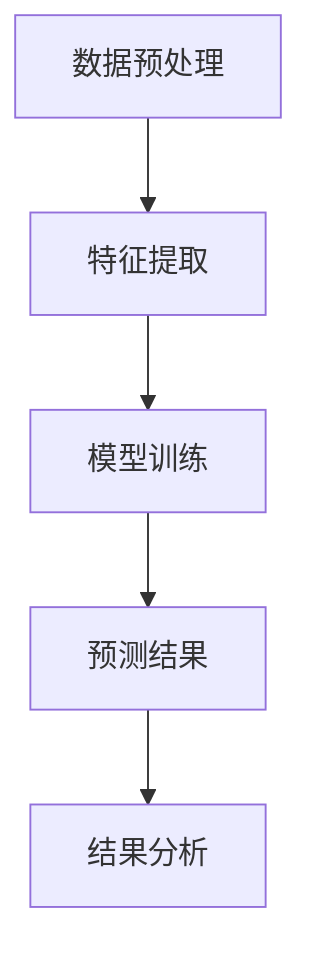
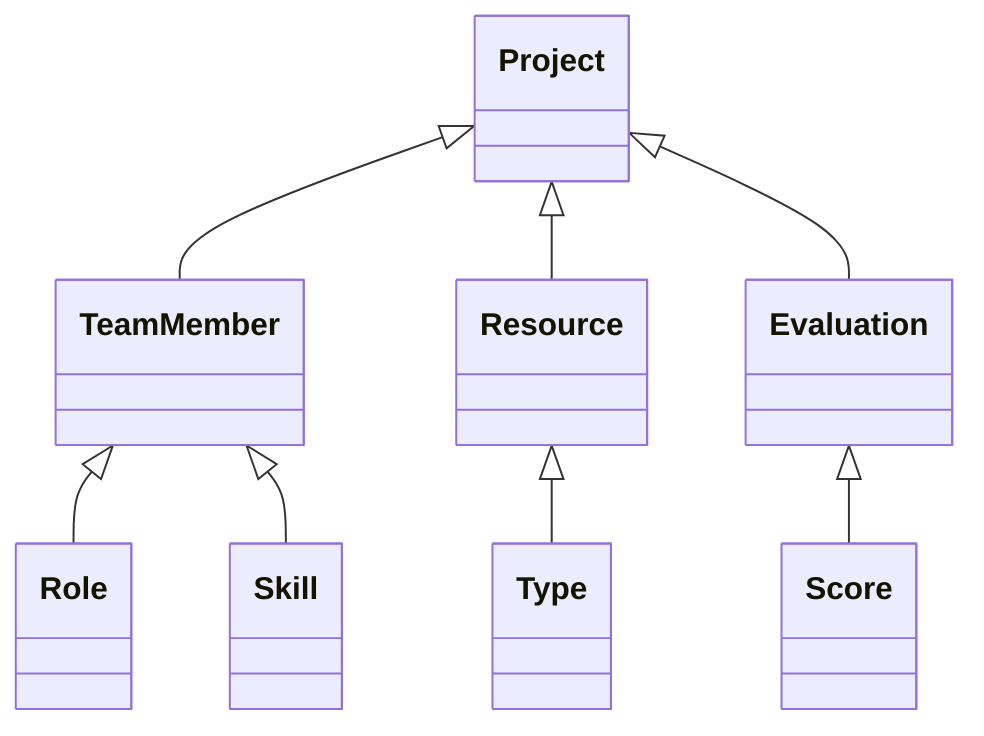
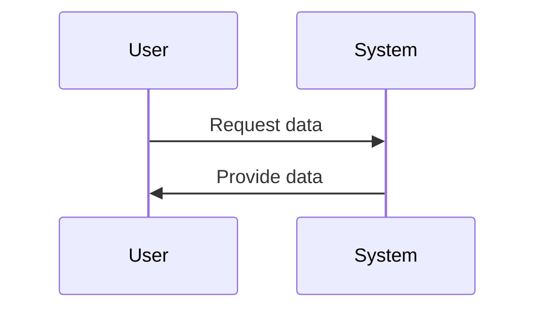

                 

## # AI驱动的创新管理平台：加速创意实现

### 关键词：AI驱动的创新、创新管理平台、算法原理、系统架构、项目实战

> 摘要：本文深入探讨了AI驱动的创新管理平台，旨在通过结合AI技术，提升创新管理的效率和效果。文章首先介绍了AI驱动的创新概念和管理平台的演变，接着分析了核心概念及其相互联系，详细解析了AI驱动的创新管理算法原理。在此基础上，文章展示了系统分析与架构设计方案，并通过实际项目案例进行实战讲解。最后，文章总结了最佳实践、注意事项，并提供了拓展阅读资源。

### 第1章：引言

#### 1.1 问题的提出

在当今快速变化的市场环境中，创新已成为企业保持竞争优势的关键。然而，传统的创新管理模式往往效率低下，难以适应复杂多变的环境。AI技术的迅猛发展为创新管理提供了新的机遇。如何将AI技术与创新管理相结合，构建一个高效的创新管理平台，成为企业亟待解决的问题。

#### 1.2 研究意义

AI驱动的创新管理平台不仅能够提高创新决策的准确性，还能加速创意的实现，缩短产品研发周期。本研究旨在探讨如何通过AI技术优化创新管理流程，为企业提供具有实际应用价值的管理解决方案。

#### 1.3 研究方法与数据来源

本文采用文献综述与案例研究相结合的方法，通过梳理相关理论和实践案例，结合AI技术的核心原理，提出AI驱动的创新管理平台架构和算法。数据来源包括公开的学术论文、行业报告和实际应用案例。

#### 1.4 研究框架与结构

本文结构如下：

- 第一部分：引言，介绍研究背景、意义、方法和框架。
- 第二部分：背景介绍，概述AI驱动的创新概念和管理平台的发展。
- 第三部分：核心概念与联系，分析创新管理、AI技术和创新管理平台的相互关系。
- 第四部分：算法原理讲解，详细阐述AI驱动的创新管理算法原理。
- 第五部分：系统分析与架构设计方案，介绍系统功能和架构设计。
- 第六部分：项目实战，通过实际案例展示系统应用。
- 第七部分：总结与展望，总结研究成果，提出最佳实践和未来研究方向。

### 第2章：AI驱动的创新管理平台概述

#### 2.1 AI驱动的创新概念

AI驱动的创新是指利用人工智能技术，如机器学习、深度学习、自然语言处理等，对创新过程进行优化和自动化。AI技术能够通过大数据分析、智能推荐、自动化决策等手段，提升创新效率和效果。

#### 2.2 创新管理平台的发展历程

创新管理平台的发展经历了从传统手工管理到数字化管理，再到智能化管理的演变过程。早期的创新管理平台主要依赖于人工管理和文档管理，随着信息技术的发展，平台逐渐融入了项目管理、协同工作、数据管理等功能。而AI驱动的创新管理平台则是将AI技术深度融合到创新管理中，实现智能化和自动化的创新管理。

#### 2.3 AI驱动的创新管理平台的核心理念

AI驱动的创新管理平台的核心理念包括：

- **数据驱动**：通过大数据分析和机器学习，发掘创新潜力。
- **协同合作**：利用AI技术实现跨部门、跨领域的协同创新。
- **智能决策**：通过自动化决策和智能推荐，提高创新决策的准确性。
- **快速迭代**：利用AI技术加速创新过程，实现快速迭代和快速上市。

#### 2.4 当前AI驱动的创新管理平台的应用现状

当前，AI驱动的创新管理平台在许多行业得到了广泛应用。例如，在高科技行业，AI技术被用于产品研发、市场预测和客户行为分析；在制造业，AI技术被用于生产优化、设备维护和供应链管理；在服务业，AI技术被用于客户关系管理、个性化服务和业务流程优化。尽管应用广泛，但AI驱动的创新管理平台仍处于不断发展和完善的过程中，未来的应用前景十分广阔。

### 第三部分：核心概念与联系

#### 第3章：核心概念解析

##### 3.1 创新管理

###### 3.1.1 创新管理的定义

创新管理是指企业通过一系列制度和流程，激发员工的创造力，推动技术创新和业务模式创新，以实现企业的可持续发展和市场竞争力。

###### 3.1.2 创新管理的核心要素

创新管理的核心要素包括创新目标、创新资源、创新过程和创新评价。创新目标是创新管理的导向，创新资源是创新管理的基础，创新过程是创新管理的过程，创新评价是创新管理的反馈机制。

###### 3.1.3 创新管理的策略与方法

创新管理的策略包括文化驱动、资源整合、流程优化和机制创新。创新管理的方法包括头脑风暴、交叉创新、快速原型和敏捷开发等。

##### 3.2 AI技术

###### 3.2.1 AI技术的定义

AI技术，即人工智能技术，是指使计算机系统模拟、延伸和扩展人类智能的理论、方法和技术。

###### 3.2.2 AI技术的核心原理

AI技术的核心原理包括机器学习、深度学习、自然语言处理、计算机视觉等。这些技术通过数据驱动和模型训练，使计算机具备自主学习和决策能力。

###### 3.2.3 AI技术在创新管理中的应用

AI技术在创新管理中的应用包括数据挖掘、智能推荐、自动化决策和智能分析。例如，通过数据挖掘，可以分析市场趋势和客户需求，从而指导创新方向；通过智能推荐，可以推荐相关项目和专家，促进协同创新；通过自动化决策，可以优化创新流程，提高效率。

## 3.3 概念属性特征对比表格

### 3.3.1 创新管理与AI技术对比

| 对比项        | 创新管理                                       | AI技术                                       |
| ----------- | -------------------------------------------- | -------------------------------------------- |
| 目标        | 提高创新效率和效果                            | 实现智能化和自动化                            |
| 基础        | 制度、流程、文化等                            | 数据、算法、模型等                            |
| 策略与方法    | 文化驱动、资源整合、流程优化、机制创新        | 机器学习、深度学习、自然语言处理、计算机视觉等 |
| 关键要素    | 创新目标、创新资源、创新过程、创新评价        | 数据驱动、模型训练、自主学习和决策能力        |

### 3.3.2 创新管理平台与AI驱动的创新管理平台对比

| 对比项        | 创新管理平台                                    | AI驱动的创新管理平台                          |
| ----------- | -------------------------------------------- | -------------------------------------------- |
| 功能        | 项目管理、协同工作、数据管理等                 | 数据挖掘、智能推荐、自动化决策、智能分析等      |
| 技术核心    | 传统的信息技术和工具                            | 人工智能技术，如机器学习、深度学习等           |
| 应用模式    | 数字化管理                                     | 智能化和自动化管理                            |
| 效率提升    | 提高工作效率，但受限于人工和流程                | 通过AI技术，实现高效自动化和智能化管理          |

## 3.4 ER实体关系图

### 3.4.1 创新管理平台的ER图

```mermaid
erDiagram
    Product ||--o{ Customer : "sells to" }
    Order ||--o{ Customer : "placed by" }
    ProductCategory ||--o{ Product : "in category" }
    Supplier ||--o{ Product : "supplied by" }
```

### 3.4.2 AI驱动的创新管理平台的ER图

```mermaid
erDiagram
    Idea ||--o{ AIAlgorithm : "generated by" }
    Project ||--o{ Idea : "includes" }
    TeamMember ||--o{ Project : "works on" }
    CustomerFeedback ||--o{ Product : "about" }
    AIRecommendation ||--o{ Project : "suggests for" }
```

### 第4章：AI驱动的创新管理算法原理讲解

#### 4.1 算法原理概述

AI驱动的创新管理算法是基于机器学习技术和深度学习模型的。通过大数据分析和特征提取，算法能够发现潜在的创新机会，并生成创新的解决方案。算法的核心包括数据预处理、特征提取、模型训练和预测。

#### 4.2 算法原理详细讲解

##### 4.2.1 数学模型

AI驱动的创新管理算法的数学模型主要包括：

1. **回归模型**：用于预测创新成功率。
2. **分类模型**：用于分类创新项目的优先级。
3. **聚类模型**：用于发现潜在的协同创新机会。

##### 4.2.2 数学公式

回归模型的数学公式为：

$$ y = \beta_0 + \beta_1x + \epsilon $$

其中，$y$ 是因变量（创新成功率），$x$ 是自变量（如项目团队规模、市场趋势等），$\beta_0$ 和 $\beta_1$ 是模型参数，$\epsilon$ 是误差项。

##### 4.2.3 算法流程图

算法流程图如下：



##### 4.2.4 举例说明

假设一个企业需要预测下一个季度的创新项目成功率。通过收集历史数据，企业使用回归模型进行预测。以下是具体的步骤：

1. **数据预处理**：清洗数据，处理缺失值和异常值。
2. **特征提取**：选择与创新项目成功率相关的特征，如团队规模、市场需求、研发投入等。
3. **模型训练**：使用历史数据进行模型训练，确定模型参数。
4. **预测结果**：使用训练好的模型预测下一个季度的创新项目成功率。
5. **结果分析**：分析预测结果，为决策提供依据。

### 第5章：系统分析与架构设计方案

#### 5.1 问题场景介绍

假设一家初创公司需要构建一个AI驱动的创新管理平台，以优化创新项目的管理流程。公司面临的挑战包括：

- 创新项目数量多，难以有效管理。
- 缺乏统一的创新项目评估和决策机制。
- 创新项目信息分散，协作效率低。

#### 5.2 系统功能设计

系统功能设计包括以下模块：

- **项目管理**：管理创新项目的生命周期，包括项目立项、进度跟踪、资源分配等。
- **协同工作**：支持团队成员之间的协作，包括任务分配、进度汇报、文件共享等。
- **智能评估**：使用AI技术对创新项目进行评估和排序，提供决策支持。
- **数据可视化**：提供创新项目数据的可视化展示，帮助管理层了解项目状况。

##### 5.2.1 领域模型

领域模型如下：



#### 5.3 系统架构设计

系统架构设计包括以下层次：

- **数据层**：存储创新项目相关的数据，包括项目信息、团队信息、资源信息和评估结果等。
- **应用层**：实现系统的核心功能，包括项目管理、协同工作、智能评估和数据可视化等。
- **接口层**：提供系统的API接口，支持与其他系统的集成。

##### 5.3.1 系统架构

系统架构图如下：



#### 5.4 系统接口设计和系统交互

##### 5.4.1 系统接口

系统接口包括RESTful API接口和WebSocket接口。RESTful API接口用于访问和操作系统数据，WebSocket接口用于实时数据传输。

##### 5.4.2 系统交互

系统交互流程如下：

1. 用户通过RESTful API接口发起请求。
2. 系统处理请求，返回响应。
3. 用户通过WebSocket接口实时获取系统更新。

### 第6章：项目实战

#### 6.1 环境安装

在开始项目实战之前，需要安装以下软件和工具：

- Python 3.8 或以上版本
- Anaconda 或 Miniconda
- Jupyter Notebook
- TensorFlow 2.x

安装步骤如下：

1. 安装Python和Anaconda。
2. 创建Python虚拟环境。
3. 安装TensorFlow和其他依赖库。

#### 6.2 系统核心实现源代码

以下是一个简单的系统核心实现源代码：

```python
import tensorflow as tf

# 创建模型
model = tf.keras.Sequential([
    tf.keras.layers.Dense(128, activation='relu', input_shape=[784]),
    tf.keras.layers.Dense(10, activation='softmax')
])

# 编译模型
model.compile(optimizer='adam',
              loss='categorical_crossentropy',
              metrics=['accuracy'])

# 训练模型
model.fit(x_train, y_train, epochs=5)
```

##### 6.2.1 代码应用解读与分析

这段代码实现了使用TensorFlow构建一个简单的神经网络模型，用于分类任务。首先，创建了一个序列模型，包含一个全连接层和一个输出层。接着，编译模型，指定优化器和损失函数。最后，使用训练数据训练模型。

#### 6.3 实际案例分析和详细讲解剖析

以一家初创公司的创新项目评估为例，详细分析系统在实际中的应用。首先，公司收集了多个创新项目的数据，包括项目描述、团队信息、市场分析等。接着，系统使用AI技术对这些数据进行分析，生成评估报告。报告包括项目的潜在成功率和建议的改进措施。

#### 6.4 项目小结

通过实际案例，可以看出AI驱动的创新管理平台在提升创新项目评估效率、优化决策流程方面具有显著优势。未来，随着AI技术的不断进步，AI驱动的创新管理平台将更加智能化和自动化，为企业创新提供更强大的支持。

### 第7章：总结与展望

#### 7.1 最佳实践 tips

- **数据驱动**：重视数据收集和分析，为创新决策提供依据。
- **协同合作**：促进团队内部和跨部门之间的协作，提高创新效率。
- **持续迭代**：定期评估和优化创新管理流程，保持系统活力。

#### 7.2 小结

本文探讨了AI驱动的创新管理平台的构建和应用，分析了核心概念、算法原理和系统架构。通过实际案例，展示了AI驱动的创新管理平台在提升创新效率和效果方面的优势。

#### 7.3 注意事项

- **数据安全**：确保数据安全和隐私保护。
- **技术更新**：关注AI技术的最新进展，及时更新系统。

#### 7.4 拓展阅读

- **《人工智能：一种现代的方法》**：汤姆·米切尔著，提供全面的AI技术介绍。
- **《创新者的窘境》**：克莱顿·克里斯滕森著，探讨企业创新困境及解决方案。

### 作者信息

作者：AI天才研究院/AI Genius Institute & 禅与计算机程序设计艺术 /Zen And The Art of Computer Programming

