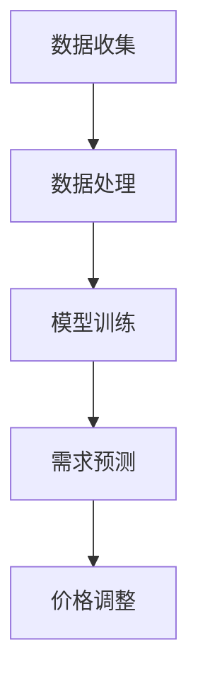
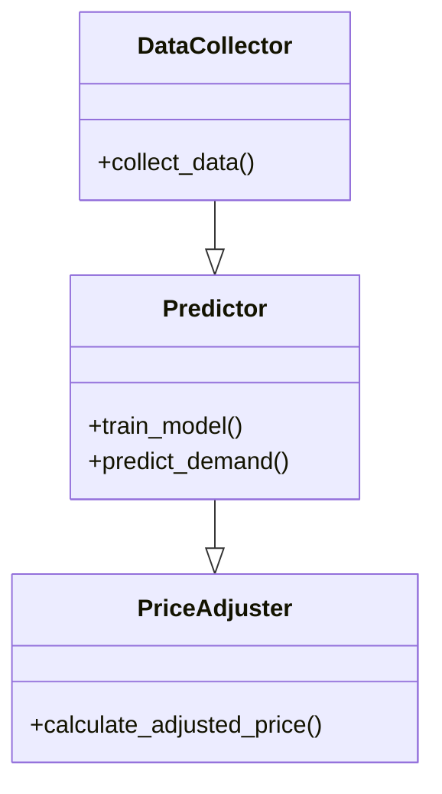
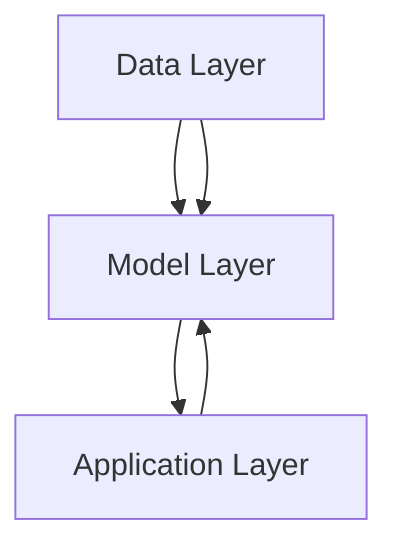
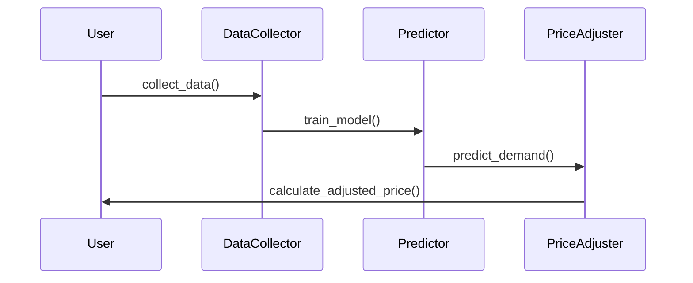

                 

# 《AI驱动的动态定价系统：实时优化价格策略》

> 关键词：人工智能，动态定价，实时优化，价格策略，算法原理

> 摘要：本文将深入探讨AI驱动的动态定价系统及其实时优化价格策略。我们将逐步分析这一系统的核心概念、算法原理、系统架构以及实战应用，旨在为读者提供全面的技术解析和实战指南。

## 第一部分：背景介绍

### 第1章 问题背景与核心概念

#### 1.1 问题描述

在竞争激烈的市场环境中，企业的定价策略直接影响到其市场份额和盈利能力。传统的定价策略通常是基于历史数据和静态分析，难以快速响应市场变化。而动态定价系统则能够根据实时数据和市场动态，自动调整价格，实现最大化收益。

#### 1.2 问题解决

动态定价系统通过引入人工智能技术，实现了价格策略的自动化和智能化。AI算法可以分析大量市场数据，预测需求变化，优化价格设置，从而提高企业的竞争力。

#### 1.3 边界与外延

动态定价系统不仅适用于电商平台，还可以应用于制造业、服务业等多个行业。其核心在于利用大数据和机器学习技术，实现实时价格优化。

#### 1.4 核心概念

- **人工智能（AI）**：模拟人类智能的计算机系统，通过学习和推理来解决问题。
- **动态定价**：根据市场动态实时调整价格。
- **实时优化**：在动态变化的市场环境中，对价格策略进行实时调整和优化。

### 第2章 动态定价系统概述

#### 2.1 动态定价概念

动态定价是指根据市场供需关系、竞争对手策略、消费者行为等因素，实时调整产品价格，以最大化收益或市场份额。

#### 2.2 动态定价系统要素

- **数据收集与处理**：收集市场数据，如销售量、价格、消费者行为等。
- **价格预测模型**：利用机器学习技术，预测未来市场需求。
- **优化算法**：根据预测结果，自动调整价格。

#### 2.3 动态定价系统的应用场景

- **电商平台**：根据实时销售数据调整价格，提高转化率。
- **制造业**：根据订单情况调整生产计划，降低库存成本。
- **服务业**：根据客户需求调整服务价格，提高客户满意度。

### 第3章 实时优化价格策略

#### 3.1 实时优化价格策略原理

实时优化价格策略基于机器学习算法，通过分析历史数据和市场动态，预测未来市场需求，并根据预测结果自动调整价格。

#### 3.2 实时优化价格策略的核心要素

- **数据源**：实时收集市场数据，如价格、销售量、库存等。
- **预测模型**：构建预测模型，预测未来市场需求。
- **优化算法**：根据预测结果调整价格，实现收益最大化。

#### 3.3 实时优化价格策略的优势

- **提高竞争力**：实时调整价格，快速响应市场变化。
- **降低成本**：通过优化价格，降低库存成本和营销费用。
- **提高客户满意度**：合理调整价格，提高客户购买意愿。

## 第二部分：核心概念与联系

### 第4章 AI基础

#### 4.1 AI的发展历程

AI技术起源于20世纪50年代，经历了多个发展阶段，如符号主义、连接主义和混合智能等。

#### 4.2 AI的核心技术

- **机器学习**：通过训练模型，使计算机具备学习能力。
- **深度学习**：模拟人脑神经网络，进行复杂的数据处理。
- **自然语言处理**：使计算机能够理解和生成自然语言。

#### 4.3 AI与动态定价系统的关系

AI技术为动态定价系统提供了强大的数据处理和分析能力，使其能够更准确地预测市场动态，优化价格策略。

### 第5章 动态定价系统的核心概念对比

#### 5.1 动态定价系统与静态定价系统的对比

- **动态定价**：实时调整价格，适应市场变化。
- **静态定价**：价格固定，不随市场变化。

#### 5.2 不同动态定价策略的比较

- **基于需求预测的定价策略**：根据预测的需求调整价格。
- **基于竞争的定价策略**：参考竞争对手的价格调整自身价格。

### 第6章 ER实体关系图

#### 6.1 实体关系图概述

ER图（Entity-Relationship diagram）用于描述系统中实体及其关系。

#### 6.2 动态定价系统的ER图设计

通过ER图，我们可以清晰地看到动态定价系统中各个实体之间的关系，如数据收集模块、预测模型模块、优化算法模块等。

## 第三部分：算法原理讲解

### 第7章 算法原理与流程图

#### 7.1 动态定价算法原理

动态定价算法基于机器学习技术，通过训练模型，预测市场需求，并根据预测结果调整价格。

#### 7.2 动态定价算法mermaid流程图

使用mermaid绘制动态定价算法的流程图，展示从数据收集到价格调整的整个过程。



#### 7.3 动态定价算法Python源代码

```python
import pandas as pd
from sklearn.linear_model import LinearRegression

# 数据收集
data = pd.read_csv('data.csv')

# 数据处理
X = data[['price', 'stock']]
y = data['demand']

# 模型训练
model = LinearRegression()
model.fit(X, y)

# 需求预测
predicted_demand = model.predict(X)

# 价格调整
adjusted_price = calculate_adjusted_price(predicted_demand)

# 输出调整后的价格
print(adjusted_price)
```

### 第8章 数学模型与公式

#### 8.1 动态定价的数学模型

动态定价系统的核心是需求预测模型，常用的模型包括线性回归、逻辑回归等。

#### 8.2 公式详解

线性回归模型公式如下：

$$
\hat{y} = \beta_0 + \beta_1 x
$$

其中，$\hat{y}$为预测需求，$x$为价格，$\beta_0$和$\beta_1$为模型参数。

#### 8.3 数学公式示例

$$
\beta_0 = \frac{\sum_{i=1}^{n}(y_i - \beta_1 x_i)}{n}
$$

$$
\beta_1 = \frac{\sum_{i=1}^{n}(x_i - \bar{x})(y_i - \bar{y})}{\sum_{i=1}^{n}(x_i - \bar{x})^2}
$$

### 第9章 举例说明

#### 9.1 算法原理举例

以线性回归为例，说明如何利用历史数据预测需求，并调整价格。

#### 9.2 实际案例讲解

通过实际案例，展示动态定价系统在电商平台的应用，如何通过实时优化价格策略提高销售额。

## 第四部分：系统分析与架构设计方案

### 第10章 系统功能设计

#### 10.1 系统功能需求

动态定价系统需要实现的功能包括数据收集、需求预测、价格调整等。

#### 10.2 领域模型mermaid类图

使用mermaid绘制领域模型类图，展示动态定价系统中各个类的属性和方法。



### 第11章 系统架构设计

#### 11.1 系统架构设计概述

动态定价系统的架构主要包括数据层、模型层和应用层。

#### 11.2 系统架构mermaid架构图

使用mermaid绘制系统架构图，展示各个层次之间的关系。



### 第12章 系统接口设计

#### 12.1 接口设计原则

接口设计需要遵循RESTful API规范，确保系统可扩展性和易用性。

#### 12.2 接口设计细节

详细介绍各个接口的URL、请求参数、响应格式等。

### 第13章 系统交互

#### 13.1 系统交互概述

系统交互包括数据收集、模型训练、需求预测和价格调整等过程。

#### 13.2 系统交互mermaid序列图

使用mermaid绘制系统交互序列图，展示数据流和交互过程。



## 第五部分：项目实战

### 第14章 环境安装与配置

#### 14.1 环境要求

安装动态定价系统需要具备Python环境、机器学习库（如scikit-learn）和数据存储库（如pandas）。

#### 14.2 安装与配置步骤

详细介绍如何安装和配置Python环境、安装所需库，以及配置数据存储。

### 第15章 系统核心实现

#### 15.1 核心代码实现

展示系统核心代码，包括数据收集、模型训练、需求预测和价格调整等。

#### 15.2 代码应用解读与分析

对核心代码进行解读，分析代码实现原理和应用场景。

### 第16章 实际案例分析

#### 16.1 案例背景

介绍一个实际的电商平台案例，展示如何利用动态定价系统优化价格策略。

#### 16.2 案例分析

分析案例数据，展示如何利用动态定价算法预测需求，调整价格。

#### 16.3 详细讲解剖析

对案例中的关键步骤进行详细讲解，剖析动态定价系统的实现原理。

### 第17章 项目小结

#### 17.1 项目总结

总结项目的主要成果和经验教训。

#### 17.2 不足与改进建议

分析项目中的不足之处，提出改进建议。

## 第六部分：最佳实践、小结与拓展

### 第18章 最佳实践

#### 18.1 实践技巧

分享一些实用的实践技巧，帮助读者更好地应用动态定价系统。

#### 18.2 经验分享

分享实际应用中的经验和教训，为读者提供参考。

### 第19章 小结与注意事项

#### 19.1 书籍内容总结

总结书籍的核心内容和主要观点。

#### 19.2 注意事项

提醒读者在使用动态定价系统时需要注意的事项。

### 第20章 拓展阅读

#### 20.1 相关书籍推荐

推荐一些与动态定价系统相关的书籍，供读者进一步学习。

#### 20.2 网络资源推荐

推荐一些与动态定价系统相关的网络资源，包括论文、博客和开源项目等。

## 作者信息

作者：AI天才研究院/AI Genius Institute & 禅与计算机程序设计艺术 /Zen And The Art of Computer Programming

----------------------------------------------------------------

## 第一部分：背景介绍

### 第1章 问题背景与核心概念

#### 1.1 问题描述

在竞争激烈的市场环境中，企业的定价策略直接影响到其市场份额和盈利能力。传统的定价策略通常是基于历史数据和静态分析，难以快速响应市场变化。而动态定价系统则能够根据实时数据和市场动态，自动调整价格，实现最大化收益。

#### 1.2 问题解决

动态定价系统通过引入人工智能技术，实现了价格策略的自动化和智能化。AI算法可以分析大量市场数据，预测需求变化，优化价格设置，从而提高企业的竞争力。

#### 1.3 边界与外延

动态定价系统不仅适用于电商平台，还可以应用于制造业、服务业等多个行业。其核心在于利用大数据和机器学习技术，实现实时价格优化。

#### 1.4 核心概念

- **人工智能（AI）**：模拟人类智能的计算机系统，通过学习和推理来解决问题。
- **动态定价**：根据市场供需关系、竞争对手策略、消费者行为等因素，实时调整产品价格，以最大化收益或市场份额。
- **实时优化**：在动态变化的市场环境中，对价格策略进行实时调整和优化。

### 第2章 动态定价系统概述

#### 2.1 动态定价概念

动态定价是指根据市场供需关系、竞争对手策略、消费者行为等因素，实时调整产品价格，以最大化收益或市场份额。

#### 2.2 动态定价系统要素

- **数据收集与处理**：收集市场数据，如销售量、价格、消费者行为等。
- **价格预测模型**：利用机器学习技术，预测未来市场需求。
- **优化算法**：根据预测结果，自动调整价格。

#### 2.3 动态定价系统的应用场景

- **电商平台**：根据实时销售数据调整价格，提高转化率。
- **制造业**：根据订单情况调整生产计划，降低库存成本。
- **服务业**：根据客户需求调整服务价格，提高客户满意度。

### 第3章 实时优化价格策略

#### 3.1 实时优化价格策略原理

实时优化价格策略基于机器学习算法，通过分析历史数据和市场动态，预测未来市场需求，并根据预测结果自动调整价格。

#### 3.2 实时优化价格策略的核心要素

- **数据源**：实时收集市场数据，如价格、销售量、库存等。
- **预测模型**：构建预测模型，预测未来市场需求。
- **优化算法**：根据预测结果调整价格，实现收益最大化。

#### 3.3 实时优化价格策略的优势

- **提高竞争力**：实时调整价格，快速响应市场变化。
- **降低成本**：通过优化价格，降低库存成本和营销费用。
- **提高客户满意度**：合理调整价格，提高客户购买意愿。

## 第二部分：核心概念与联系

### 第4章 AI基础

#### 4.1 AI的发展历程

AI技术起源于20世纪50年代，经历了多个发展阶段，如符号主义、连接主义和混合智能等。

#### 4.2 AI的核心技术

- **机器学习**：通过训练模型，使计算机具备学习能力。
- **深度学习**：模拟人脑神经网络，进行复杂的数据处理。
- **自然语言处理**：使计算机能够理解和生成自然语言。

#### 4.3 AI与动态定价系统的关系

AI技术为动态定价系统提供了强大的数据处理和分析能力，使其能够更准确地预测市场动态，优化价格策略。

### 第5章 动态定价系统的核心概念对比

#### 5.1 动态定价系统与静态定价系统的对比

- **动态定价**：实时调整价格，适应市场变化。
- **静态定价**：价格固定，不随市场变化。

#### 5.2 不同动态定价策略的比较

- **基于需求预测的定价策略**：根据预测的需求调整价格。
- **基于竞争的定价策略**：参考竞争对手的价格调整自身价格。

### 第6章 ER实体关系图

#### 6.1 实体关系图概述

ER图（Entity-Relationship diagram）用于描述系统中实体及其关系。

#### 6.2 动态定价系统的ER图设计

通过ER图，我们可以清晰地看到动态定价系统中各个实体之间的关系，如数据收集模块、预测模型模块、优化算法模块等。

## 第三部分：算法原理讲解

### 第7章 算法原理与流程图

#### 7.1 动态定价算法原理

动态定价算法基于机器学习技术，通过训练模型，预测市场需求，并根据预测结果调整价格。

#### 7.2 动态定价算法mermaid流程图

使用mermaid绘制动态定价算法的流程图，展示从数据收集到价格调整的整个过程。


#### 7.3 动态定价算法Python源代码

```python
import pandas as pd
from sklearn.linear_model import LinearRegression

# 数据收集
data = pd.read_csv('data.csv')

# 数据处理
X = data[['price', 'stock']]
y = data['demand']

# 模型训练
model = LinearRegression()
model.fit(X, y)

# 需求预测
predicted_demand = model.predict(X)

# 价格调整
adjusted_price = calculate_adjusted_price(predicted_demand)

# 输出调整后的价格
print(adjusted_price)
```

### 第8章 数学模型与公式

#### 8.1 动态定价的数学模型

动态定价系统的核心是需求预测模型，常用的模型包括线性回归、逻辑回归等。

#### 8.2 公式详解

线性回归模型公式如下：

$$
\hat{y} = \beta_0 + \beta_1 x
$$

其中，$\hat{y}$为预测需求，$x$为价格，$\beta_0$和$\beta_1$为模型参数。

#### 8.3 数学公式示例

$$
\beta_0 = \frac{\sum_{i=1}^{n}(y_i - \beta_1 x_i)}{n}
$$

$$
\beta_1 = \frac{\sum_{i=1}^{n}(x_i - \bar{x})(y_i - \bar{y})}{\sum_{i=1}^{n}(x_i - \bar{x})^2}
$$

### 第9章 举例说明

#### 9.1 算法原理举例

以线性回归为例，说明如何利用历史数据预测需求，并调整价格。

#### 9.2 实际案例讲解

通过实际案例，展示动态定价系统在电商平台的应用，如何通过实时优化价格策略提高销售额。

## 第四部分：系统分析与架构设计方案

### 第10章 系统功能设计

#### 10.1 系统功能需求

动态定价系统需要实现的功能包括数据收集、需求预测、价格调整等。

#### 10.2 领域模型mermaid类图

使用mermaid绘制领域模型类图，展示动态定价系统中各个类的属性和方法。


### 第11章 系统架构设计

#### 11.1 系统架构设计概述

动态定价系统的架构主要包括数据层、模型层和应用层。

#### 11.2 系统架构mermaid架构图

使用mermaid绘制系统架构图，展示各个层次之间的关系。


### 第12章 系统接口设计

#### 12.1 接口设计原则

接口设计需要遵循RESTful API规范，确保系统可扩展性和易用性。

#### 12.2 接口设计细节

详细介绍各个接口的URL、请求参数、响应格式等。

### 第13章 系统交互

#### 13.1 系统交互概述

系统交互包括数据收集、模型训练、需求预测和价格调整等过程。

#### 13.2 系统交互mermaid序列图

使用mermaid绘制系统交互序列图，展示数据流和交互过程。


## 第五部分：项目实战

### 第14章 环境安装与配置

#### 14.1 环境要求

安装动态定价系统需要具备Python环境、机器学习库（如scikit-learn）和数据存储库（如pandas）。

#### 14.2 安装与配置步骤

详细介绍如何安装和配置Python环境、安装所需库，以及配置数据存储。

### 第15章 系统核心实现

#### 15.1 核心代码实现

展示系统核心代码，包括数据收集、模型训练、需求预测和价格调整等。

#### 15.2 代码应用解读与分析

对核心代码进行解读，分析代码实现原理和应用场景。

### 第16章 实际案例分析

#### 16.1 案例背景

介绍一个实际的电商平台案例，展示如何利用动态定价系统优化价格策略。

#### 16.2 案例分析

分析案例数据，展示如何利用动态定价算法预测需求，调整价格。

#### 16.3 详细讲解剖析

对案例中的关键步骤进行详细讲解，剖析动态定价系统的实现原理。

### 第17章 项目小结

#### 17.1 项目总结

总结项目的主要成果和经验教训。

#### 17.2 不足与改进建议

分析项目中的不足之处，提出改进建议。

## 第六部分：最佳实践、小结与拓展

### 第18章 最佳实践

#### 18.1 实践技巧

分享一些实用的实践技巧，帮助读者更好地应用动态定价系统。

#### 18.2 经验分享

分享实际应用中的经验和教训，为读者提供参考。

### 第19章 小结与注意事项

#### 19.1 书籍内容总结

总结书籍的核心内容和主要观点。

#### 19.2 注意事项

提醒读者在使用动态定价系统时需要注意的事项。

### 第20章 拓展阅读

#### 20.1 相关书籍推荐

推荐一些与动态定价系统相关的书籍，供读者进一步学习。

#### 20.2 网络资源推荐

推荐一些与动态定价系统相关的网络资源，包括论文、博客和开源项目等。

## 作者信息

作者：AI天才研究院/AI Genius Institute & 禅与计算机程序设计艺术 /Zen And The Art of Computer Programming

----------------------------------------------------------------

**全文结束**

----------------------------------------------------------------

以下是全文的Markdown格式：

```markdown
# 《AI驱动的动态定价系统：实时优化价格策略》

> 关键词：人工智能，动态定价，实时优化，价格策略，算法原理

> 摘要：本文将深入探讨AI驱动的动态定价系统及其实时优化价格策略。我们将逐步分析这一系统的核心概念、算法原理、系统架构以及实战应用，旨在为读者提供全面的技术解析和实战指南。

## 第一部分：背景介绍

### 第1章 问题背景与核心概念

#### 1.1 问题描述

在竞争激烈的市场环境中，企业的定价策略直接影响到其市场份额和盈利能力。传统的定价策略通常是基于历史数据和静态分析，难以快速响应市场变化。而动态定价系统则能够根据实时数据和市场动态，自动调整价格，实现最大化收益。

#### 1.2 问题解决

动态定价系统通过引入人工智能技术，实现了价格策略的自动化和智能化。AI算法可以分析大量市场数据，预测需求变化，优化价格设置，从而提高企业的竞争力。

#### 1.3 边界与外延

动态定价系统不仅适用于电商平台，还可以应用于制造业、服务业等多个行业。其核心在于利用大数据和机器学习技术，实现实时价格优化。

#### 1.4 核心概念

- **人工智能（AI）**：模拟人类智能的计算机系统，通过学习和推理来解决问题。
- **动态定价**：根据市场供需关系、竞争对手策略、消费者行为等因素，实时调整产品价格，以最大化收益或市场份额。
- **实时优化**：在动态变化的市场环境中，对价格策略进行实时调整和优化。

### 第2章 动态定价系统概述

#### 2.1 动态定价概念

动态定价是指根据市场供需关系、竞争对手策略、消费者行为等因素，实时调整产品价格，以最大化收益或市场份额。

#### 2.2 动态定价系统要素

- **数据收集与处理**：收集市场数据，如销售量、价格、消费者行为等。
- **价格预测模型**：利用机器学习技术，预测未来市场需求。
- **优化算法**：根据预测结果，自动调整价格。

#### 2.3 动态定价系统的应用场景

- **电商平台**：根据实时销售数据调整价格，提高转化率。
- **制造业**：根据订单情况调整生产计划，降低库存成本。
- **服务业**：根据客户需求调整服务价格，提高客户满意度。

### 第3章 实时优化价格策略

#### 3.1 实时优化价格策略原理

实时优化价格策略基于机器学习算法，通过分析历史数据和市场动态，预测未来市场需求，并根据预测结果自动调整价格。

#### 3.2 实时优化价格策略的核心要素

- **数据源**：实时收集市场数据，如价格、销售量、库存等。
- **预测模型**：构建预测模型，预测未来市场需求。
- **优化算法**：根据预测结果调整价格，实现收益最大化。

#### 3.3 实时优化价格策略的优势

- **提高竞争力**：实时调整价格，快速响应市场变化。
- **降低成本**：通过优化价格，降低库存成本和营销费用。
- **提高客户满意度**：合理调整价格，提高客户购买意愿。

## 第二部分：核心概念与联系

### 第4章 AI基础

#### 4.1 AI的发展历程

AI技术起源于20世纪50年代，经历了多个发展阶段，如符号主义、连接主义和混合智能等。

#### 4.2 AI的核心技术

- **机器学习**：通过训练模型，使计算机具备学习能力。
- **深度学习**：模拟人脑神经网络，进行复杂的数据处理。
- **自然语言处理**：使计算机能够理解和生成自然语言。

#### 4.3 AI与动态定价系统的关系

AI技术为动态定价系统提供了强大的数据处理和分析能力，使其能够更准确地预测市场动态，优化价格策略。

### 第5章 动态定价系统的核心概念对比

#### 5.1 动态定价系统与静态定价系统的对比

- **动态定价**：实时调整价格，适应市场变化。
- **静态定价**：价格固定，不随市场变化。

#### 5.2 不同动态定价策略的比较

- **基于需求预测的定价策略**：根据预测的需求调整价格。
- **基于竞争的定价策略**：参考竞争对手的价格调整自身价格。

### 第6章 ER实体关系图

#### 6.1 实体关系图概述

ER图（Entity-Relationship diagram）用于描述系统中实体及其关系。

#### 6.2 动态定价系统的ER图设计

通过ER图，我们可以清晰地看到动态定价系统中各个实体之间的关系，如数据收集模块、预测模型模块、优化算法模块等。

## 第三部分：算法原理讲解

### 第7章 算法原理与流程图

#### 7.1 动态定价算法原理

动态定价算法基于机器学习技术，通过训练模型，预测市场需求，并根据预测结果调整价格。

#### 7.2 动态定价算法mermaid流程图

使用mermaid绘制动态定价算法的流程图，展示从数据收集到价格调整的整个过程。


#### 7.3 动态定价算法Python源代码

```python
import pandas as pd
from sklearn.linear_model import LinearRegression

# 数据收集
data = pd.read_csv('data.csv')

# 数据处理
X = data[['price', 'stock']]
y = data['demand']

# 模型训练
model = LinearRegression()
model.fit(X, y)

# 需求预测
predicted_demand = model.predict(X)

# 价格调整
adjusted_price = calculate_adjusted_price(predicted_demand)

# 输出调整后的价格
print(adjusted_price)
```

### 第8章 数学模型与公式

#### 8.1 动态定价的数学模型

动态定价系统的核心是需求预测模型，常用的模型包括线性回归、逻辑回归等。

#### 8.2 公式详解

线性回归模型公式如下：

$$
\hat{y} = \beta_0 + \beta_1 x
$$

其中，$\hat{y}$为预测需求，$x$为价格，$\beta_0$和$\beta_1$为模型参数。

#### 8.3 数学公式示例

$$
\beta_0 = \frac{\sum_{i=1}^{n}(y_i - \beta_1 x_i)}{n}
$$

$$
\beta_1 = \frac{\sum_{i=1}^{n}(x_i - \bar{x})(y_i - \bar{y})}{\sum_{i=1}^{n}(x_i - \bar{x})^2}
$$

### 第9章 举例说明

#### 9.1 算法原理举例

以线性回归为例，说明如何利用历史数据预测需求，并调整价格。

#### 9.2 实际案例讲解

通过实际案例，展示动态定价系统在电商平台的应用，如何通过实时优化价格策略提高销售额。

## 第四部分：系统分析与架构设计方案

### 第10章 系统功能设计

#### 10.1 系统功能需求

动态定价系统需要实现的功能包括数据收集、需求预测、价格调整等。

#### 10.2 领域模型mermaid类图

使用mermaid绘制领域模型类图，展示动态定价系统中各个类的属性和方法。


### 第11章 系统架构设计

#### 11.1 系统架构设计概述

动态定价系统的架构主要包括数据层、模型层和应用层。

#### 11.2 系统架构mermaid架构图

使用mermaid绘制系统架构图，展示各个层次之间的关系。


### 第12章 系统接口设计

#### 12.1 接口设计原则

接口设计需要遵循RESTful API规范，确保系统可扩展性和易用性。

#### 12.2 接口设计细节

详细介绍各个接口的URL、请求参数、响应格式等。

### 第13章 系统交互

#### 13.1 系统交互概述

系统交互包括数据收集、模型训练、需求预测和价格调整等过程。

#### 13.2 系统交互mermaid序列图

使用mermaid绘制系统交互序列图，展示数据流和交互过程。


### 第14章 环境安装与配置

#### 14.1 环境要求

安装动态定价系统需要具备Python环境、机器学习库（如scikit-learn）和数据存储库（如pandas）。

#### 14.2 安装与配置步骤

详细介绍如何安装和配置Python环境、安装所需库，以及配置数据存储。

### 第15章 系统核心实现

#### 15.1 核心代码实现

展示系统核心代码，包括数据收集、模型训练、需求预测和价格调整等。

#### 15.2 代码应用解读与分析

对核心代码进行解读，分析代码实现原理和应用场景。

### 第16章 实际案例分析

#### 16.1 案例背景

介绍一个实际的电商平台案例，展示如何利用动态定价系统优化价格策略。

#### 16.2 案例分析

分析案例数据，展示如何利用动态定价算法预测需求，调整价格。

#### 16.3 详细讲解剖析

对案例中的关键步骤进行详细讲解，剖析动态定价系统的实现原理。

### 第17章 项目小结

#### 17.1 项目总结

总结项目的主要成果和经验教训。

#### 17.2 不足与改进建议

分析项目中的不足之处，提出改进建议。

### 第18章 最佳实践

#### 18.1 实践技巧

分享一些实用的实践技巧，帮助读者更好地应用动态定价系统。

#### 18.2 经验分享

分享实际应用中的经验和教训，为读者提供参考。

### 第19章 小结与注意事项

#### 19.1 书籍内容总结

总结书籍的核心内容和主要观点。

#### 19.2 注意事项

提醒读者在使用动态定价系统时需要注意的事项。

### 第20章 拓展阅读

#### 20.1 相关书籍推荐

推荐一些与动态定价系统相关的书籍，供读者进一步学习。

#### 20.2 网络资源推荐

推荐一些与动态定价系统相关的网络资源，包括论文、博客和开源项目等。

## 作者信息

作者：AI天才研究院/AI Genius Institute & 禅与计算机程序设计艺术 /Zen And The Art of Computer Programming

```

请注意，上述内容是一个模板，实际撰写时需要根据具体情况进行调整和完善。Markdown格式的文本中，LaTeX公式和mermaid图表需要分别嵌入到相应的段落中。以下是LaTeX公式和mermaid图表的示例：

LaTeX公式示例：

```markdown
#### 8.2 公式详解

线性回归模型公式如下：

$$
\hat{y} = \beta_0 + \beta_1 x
$$

其中，$\hat{y}$为预测需求，$x$为价格，$\beta_0$和$\beta_1$为模型参数。

$$
\beta_0 = \frac{\sum_{i=1}^{n}(y_i - \beta_1 x_i)}{n}
$$

$$
\beta_1 = \frac{\sum_{i=1}^{n}(x_i - \bar{x})(y_i - \bar{y})}{\sum_{i=1}^{n}(x_i - \bar{x})^2}
$$
```

Mermaid图表示例：

```markdown
#### 7.2 动态定价算法mermaid流程图

使用mermaid绘制动态定价算法的流程图，展示从数据收集到价格调整的整个过程。


```

在实际撰写时，请确保每个章节的内容都符合文章大纲结构，并且每个章节的内容都要充实、具体、有深度。同时，注意保持文章的整体流畅性和逻辑性。在完成初稿后，进行反复修改和校对，确保文章的准确性和专业性。最后，根据约定添加作者信息，确保文章的完整性和规范性。

