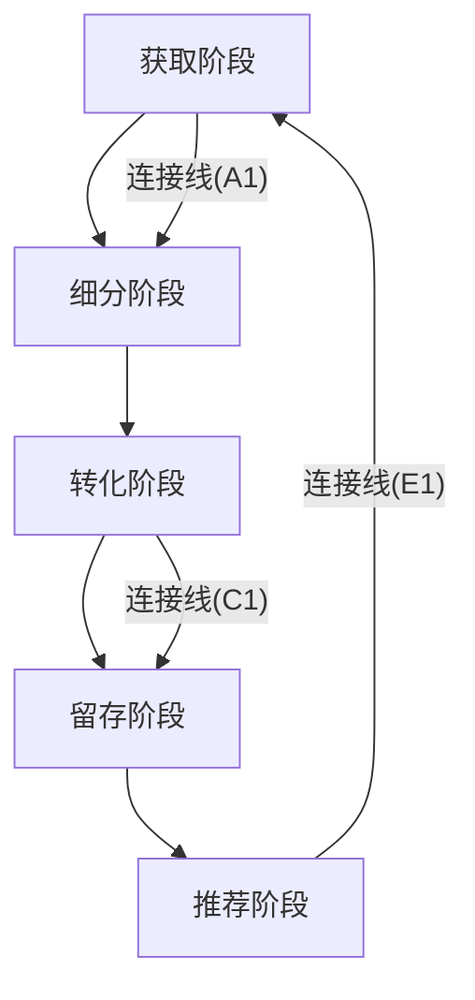
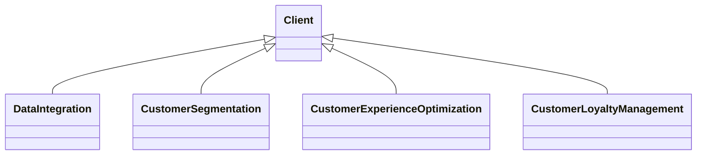
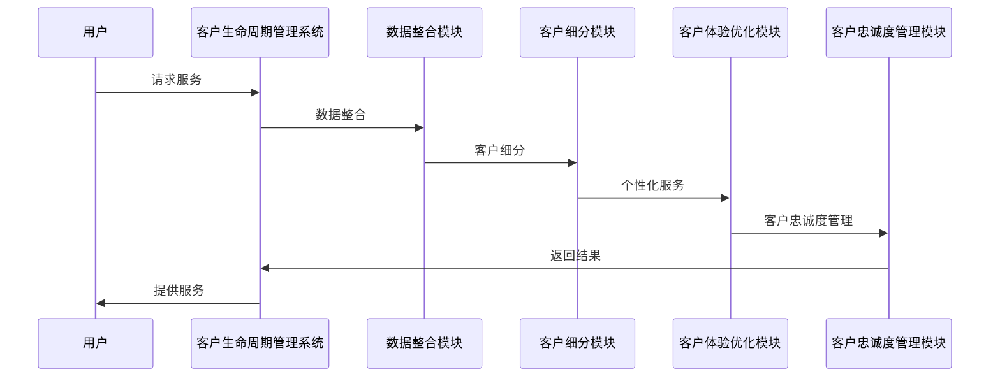
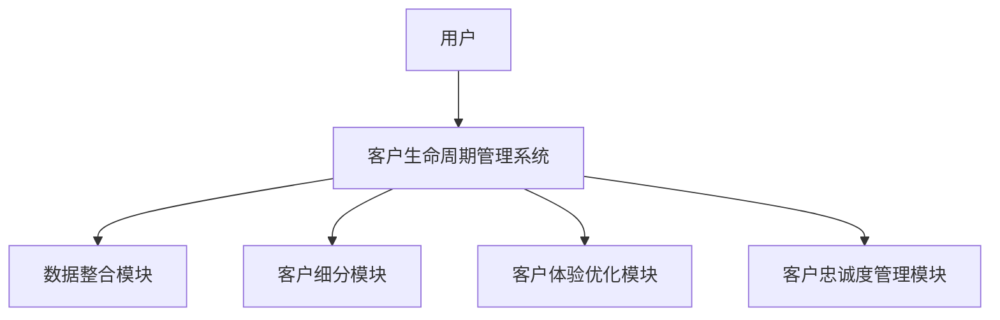
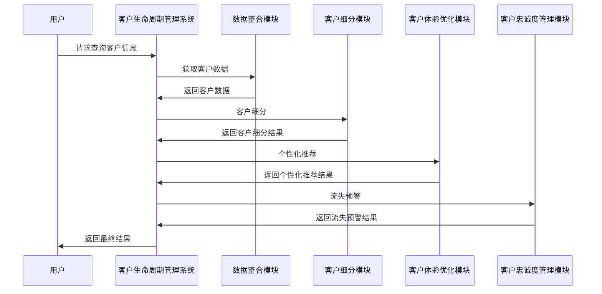

                 

# AI驱动的客户生命周期管理：优化客户价值

关键词：客户生命周期管理、人工智能、机器学习、自然语言处理、深度学习

摘要：本文旨在探讨如何利用人工智能技术来优化客户生命周期管理，从而提高企业的客户价值和市场竞争力。通过分析客户生命周期管理的核心概念、AI技术的应用原理，以及系统架构设计与项目实战，本文将提供一种从理论到实践的全面解决方案。

### 第一部分：背景介绍

#### 第1章：AI驱动的客户生命周期管理概述

##### 1.1 问题背景与解决

客户生命周期管理（Customer Lifecycle Management，CLM）是企业营销和客户关系管理的重要环节。它涉及从客户获取、客户细分、客户关系管理到客户体验优化、客户忠诚度和客户留存等一系列活动。随着市场竞争的加剧，企业需要更加精准地管理客户生命周期，以提高客户价值和市场竞争力。

然而，传统的客户生命周期管理方法存在以下问题：

1. **数据孤岛**：不同部门之间的数据无法共享，导致客户信息的利用效率低下。
2. **客户细分不准确**：缺乏有效的算法支持，导致客户细分不准确，影响营销策略的制定。
3. **客户体验差**：无法及时响应客户需求，导致客户满意度下降。
4. **客户忠诚度低**：客户关系管理不到位，导致客户流失率高。

为了解决这些问题，人工智能（AI）技术被引入客户生命周期管理中。AI技术，尤其是机器学习、自然语言处理和深度学习，可以提供以下解决方案：

1. **数据整合与处理**：通过AI技术，可以整合不同部门的数据，实现数据共享和利用。
2. **精准客户细分**：利用机器学习算法，可以对客户进行精准细分，为营销策略提供数据支持。
3. **个性化客户体验**：通过自然语言处理和深度学习，可以提供个性化的客户服务，提升客户满意度。
4. **客户忠诚度管理**：通过预测分析，可以及时发现潜在流失客户，采取有效措施提高客户忠诚度。

##### 1.1.1 客户生命周期管理的定义与重要性

客户生命周期管理是一个系统化的过程，旨在通过全面了解客户需求和行为，优化客户关系，提高客户满意度和忠诚度，从而实现客户价值最大化。它包括以下几个关键阶段：

1. **获取阶段**：通过市场调研、广告投放等方式，吸引潜在客户。
2. **细分阶段**：根据客户的特征和行为，将客户划分为不同的群体，为不同群体提供定制化的服务和产品。
3. **转化阶段**：通过营销策略，将潜在客户转化为实际客户。
4. **留存阶段**：通过客户关系管理，提高客户满意度和忠诚度，防止客户流失。
5. **推荐阶段**：通过口碑营销和推荐系统，吸引更多潜在客户。

客户生命周期管理的重要性体现在以下几个方面：

1. **提升客户满意度**：通过深入了解客户需求和行为，提供个性化的服务和产品，提升客户满意度。
2. **提高客户忠诚度**：通过有效的客户关系管理，建立长期稳定的客户关系，提高客户忠诚度。
3. **降低客户流失率**：通过预测分析和客户流失预警，及时采取措施，降低客户流失率。
4. **优化营销策略**：通过精准的客户细分和市场分析，优化营销策略，提高营销效果。

##### 1.1.2 人工智能在客户生命周期管理中的应用

人工智能技术，尤其是机器学习、自然语言处理和深度学习，在客户生命周期管理中具有广泛的应用。以下是这些技术的具体应用：

1. **机器学习**：通过机器学习算法，可以对大量客户数据进行建模和分析，实现精准的客户细分和预测。例如，聚类算法可以用于客户细分，决策树和随机森林可以用于客户流失预测。
2. **自然语言处理**：通过自然语言处理技术，可以理解客户的需求和反馈，提供个性化的客户服务。例如，基于文本分类算法，可以自动分类客户反馈，基于聊天机器人，可以与客户进行自然语言交互。
3. **深度学习**：通过深度学习模型，可以识别复杂的客户行为模式，提供更加精准的服务和产品推荐。例如，基于卷积神经网络（CNN）和循环神经网络（RNN），可以构建智能客服系统，基于生成对抗网络（GAN），可以生成个性化的产品推荐。

##### 1.1.3 客户价值优化的目标与挑战

客户价值优化的目标是最大化企业的客户价值，提高市场竞争力。具体来说，包括以下几个方面：

1. **提升客户满意度**：通过提供优质的客户服务和个性化体验，提升客户满意度。
2. **提高客户忠诚度**：通过建立长期稳定的客户关系，提高客户忠诚度。
3. **降低客户流失率**：通过预测分析和流失预警，降低客户流失率。
4. **优化营销策略**：通过精准的市场分析和客户细分，优化营销策略。

然而，客户价值优化面临着以下挑战：

1. **数据质量**：客户数据的准确性和完整性对AI算法的效果有重要影响。然而，在实际应用中，客户数据往往存在缺失、噪声和错误等问题。
2. **算法选择**：不同的AI算法适用于不同的应用场景，选择合适的算法是优化客户价值的关键。
3. **模型解释性**：AI算法的“黑箱”特性使得模型的解释性成为一大挑战。在实际应用中，需要能够解释模型的决策过程，以便企业更好地理解和优化客户价值。
4. **技术落地**：将AI技术应用到实际业务场景中，需要解决数据整合、系统架构设计、算法落地等问题。

##### 1.1.4 结论

随着人工智能技术的不断发展，AI驱动的客户生命周期管理逐渐成为企业提升客户价值和市场竞争力的重要手段。通过精准的客户细分、个性化服务、预测分析和流失预警，企业可以更好地了解和满足客户需求，提高客户满意度和忠诚度，从而实现客户价值的最大化。未来，随着技术的进步和应用的深入，AI驱动的客户生命周期管理将在更多领域发挥作用，为企业带来更大的价值。

#### 第2章：核心概念与联系

##### 2.1 客户生命周期管理的概念

客户生命周期管理（Customer Lifecycle Management，CLM）是一个系统化的过程，旨在通过全面了解客户需求和行为，优化客户关系，提高客户满意度和忠诚度，从而实现客户价值最大化。它包括以下几个关键阶段：

1. **获取阶段**：企业通过各种渠道吸引潜在客户，如广告投放、市场活动、口碑传播等。这个阶段的关键任务是提高品牌知名度和吸引潜在客户。
2. **细分阶段**：企业根据客户的行为、偏好、需求等特征，将客户划分为不同的群体。细分阶段的目的是为了更好地理解客户，并为每个客户群体提供定制化的服务和产品。
3. **转化阶段**：企业通过营销策略和促销活动，将潜在客户转化为实际客户。转化阶段的关键任务是提升客户转化率，提高销售额。
4. **留存阶段**：企业通过客户关系管理，提高客户满意度和忠诚度，防止客户流失。留存阶段的关键任务是建立长期稳定的客户关系，提高客户留存率。
5. **推荐阶段**：企业通过口碑营销和推荐系统，吸引更多潜在客户。推荐阶段的关键任务是提高客户推荐率，扩大客户基础。

##### 2.1.1 识别与获取

识别与获取是客户生命周期管理的第一阶段，也是企业吸引潜在客户的过程。在这个阶段，企业需要通过各种渠道了解潜在客户的需求和行为，从而识别目标客户，并采取相应的营销策略。

1. **市场调研**：通过市场调研，了解潜在客户的需求、偏好和购买行为。市场调研可以通过问卷调查、访谈、焦点小组讨论等方式进行。
2. **广告投放**：通过广告投放，提高品牌知名度和曝光度，吸引潜在客户。广告投放可以通过线上平台（如搜索引擎、社交媒体、网站等）和线下渠道（如报纸、杂志、电视等）进行。
3. **口碑传播**：通过口碑传播，建立品牌声誉，吸引更多潜在客户。口碑传播可以通过客户推荐、社交媒体分享、产品好评等方式进行。
4. **促销活动**：通过促销活动，吸引潜在客户，提高客户转化率。促销活动可以通过打折、优惠券、礼品等方式进行。

##### 2.1.2 客户细分与客户关系管理

客户细分与客户关系管理是客户生命周期管理的核心环节，旨在通过了解和满足客户需求，提高客户满意度和忠诚度。

1. **客户细分**：客户细分是根据客户的行为、偏好、需求等特征，将客户划分为不同的群体。通过客户细分，企业可以更好地了解不同客户群体的需求，为每个客户群体提供定制化的服务和产品。

   - **行为细分**：根据客户的行为特征进行细分，如购买频率、购买金额、购买渠道等。
   - **需求细分**：根据客户的需求特征进行细分，如产品偏好、服务要求、价格敏感度等。
   - **心理细分**：根据客户的心理特征进行细分，如价值观、生活方式、兴趣爱好等。

2. **客户关系管理**：客户关系管理是企业通过持续沟通、关怀和互动，建立和维持与客户之间的良好关系。客户关系管理的目标是提高客户满意度和忠诚度，从而实现客户价值的最大化。

   - **客户沟通**：通过电话、邮件、社交媒体等方式，与客户进行沟通，了解客户需求和反馈，提供个性化的服务和解决方案。
   - **客户关怀**：通过定期回访、节日问候、礼品赠送等方式，表达对客户的关怀和尊重，增强客户忠诚度。
   - **客户互动**：通过在线活动、会员制度、用户社区等方式，与客户进行互动，增强客户参与感和归属感。

##### 2.1.3 客户体验与满意度

客户体验和满意度是客户生命周期管理的重要指标，直接影响客户的忠诚度和购买意愿。

1. **客户体验**：客户体验是指客户在使用企业产品或服务过程中的整体感受。良好的客户体验可以增强客户的满意度和忠诚度。

   - **产品和服务质量**：提供高质量的产品和服务，确保客户在使用过程中的满意度。
   - **交互体验**：通过友好的界面设计、简洁的操作流程、高效的服务响应等，提升客户交互体验。
   - **售后支持**：提供优质的售后服务，解决客户在使用产品或服务过程中遇到的问题。

2. **客户满意度**：客户满意度是指客户对企业产品或服务的整体评价和感受。高满意度通常意味着客户对企业有较高的忠诚度和重复购买意愿。

   - **满意度调查**：通过客户满意度调查，了解客户对产品或服务的评价，发现问题和改进方向。
   - **满意度提升**：通过改进产品和服务、提高客户体验、增强客户关怀等方式，提升客户满意度。

##### 2.1.4 客户忠诚与留存

客户忠诚和留存是客户生命周期管理的最终目标，直接关系到企业的长期发展和盈利能力。

1. **客户忠诚**：客户忠诚是指客户对企业产品或服务的长期依赖和信任，通常表现为重复购买、口碑推荐等行为。

   - **客户忠诚度提升**：通过提供优质的客户体验、个性化的服务和关怀、优惠活动等方式，提高客户忠诚度。
   - **客户关系维护**：通过持续沟通、互动和关怀，维护与客户之间的良好关系，增强客户忠诚度。

2. **客户留存**：客户留存是指客户在一段时间内继续使用企业产品或服务的比例。高客户留存率通常意味着企业能够稳定地获取收益。

   - **客户留存策略**：通过会员制度、客户忠诚计划、定期回访等方式，提高客户留存率。
   - **流失预警与挽回**：通过预测分析和流失预警，及时发现潜在流失客户，采取有效措施进行挽回。

##### 2.2 核心概念之间的联系

客户生命周期管理的各个核心概念之间存在着密切的联系，共同构成了一个完整的客户生命周期管理流程。

1. **获取阶段与细分阶段**：获取阶段的任务是吸引潜在客户，细分阶段的任务是了解客户特征，为不同客户群体提供定制化服务。两个阶段紧密相连，获取阶段的结果直接影响细分阶段的质量。
2. **转化阶段与留存阶段**：转化阶段的任务是提高客户转化率，留存阶段的任务是提高客户忠诚度和留存率。两个阶段相辅相成，转化阶段的结果直接影响留存阶段的成果。
3. **推荐阶段与获取阶段**：推荐阶段的任务是吸引更多潜在客户，获取阶段的任务是吸引潜在客户。两个阶段相互促进，形成一个良性循环。

通过客户生命周期管理的各个环节的紧密协作，企业可以全面了解客户需求和行为，提供个性化的服务和产品，提高客户满意度和忠诚度，实现客户价值的最大化。

#### 第2章：核心概念与联系

##### 2.2.1 客户生命周期管理流程图

为了更好地理解客户生命周期管理中的各个核心概念及其联系，我们可以通过一个流程图来展示整个管理过程。以下是一个简化的客户生命周期管理流程图：



在这个流程图中：

- **获取阶段（A）**：包括市场调研、广告投放、口碑传播等，目的是吸引潜在客户。
- **细分阶段（B）**：根据客户特征和行为，对客户进行细分，为不同群体提供定制化服务。
- **转化阶段（C）**：通过营销策略和促销活动，将潜在客户转化为实际客户。
- **留存阶段（D）**：通过客户关系管理，提高客户满意度和忠诚度，防止客户流失。
- **推荐阶段（E）**：通过口碑营销和推荐系统，吸引更多潜在客户。

各个阶段之间通过连接线表示相互关联，形成一个闭环流程。

##### 2.2.2 概念属性特征对比表格

为了更清晰地展示各个核心概念之间的差异和联系，我们可以通过一个对比表格来描述它们的属性特征。

| 核心概念 | 定义 | 属性特征 | 相互关系 |
| --- | --- | --- | --- |
| 获取阶段 | 吸引潜在客户 | 市场调研、广告投放、口碑传播 | 结果直接影响细分阶段的质量 |
| 细分阶段 | 根据客户特征细分 | 行为、需求、心理 | 细分结果为转化阶段提供数据支持 |
| 转化阶段 | 转化潜在客户 | 营销策略、促销活动 | 成果直接影响留存阶段 |
| 留存阶段 | 提高客户满意度和忠诚度 | 客户关系管理、客户关怀 | 留存率直接影响推荐阶段 |
| 推荐阶段 | 吸引更多潜在客户 | 口碑营销、推荐系统 | 新客户的获取为获取阶段提供支持 |

在这个对比表格中，我们可以看到各个核心概念的属性特征及其相互关系。例如，获取阶段的结果直接影响细分阶段的质量，而细分阶段的细分结果为转化阶段提供数据支持。

##### 2.2.3 ER实体关系图架构

为了更直观地展示客户生命周期管理中的实体及其关系，我们可以使用ER（Entity-Relationship）实体关系图来描述。

```mermaid
erDiagram
    Customer ||--|{ Order } : 1
    Customer ||--|{ Feedback } : 1
    Customer ||--|{ Subscription } : 1
    Order ||--|{ Product } : 1
    Feedback ||--|{ Rating } : 1
    Subscription ||--|{ Service } : 1
```

在这个ER图中：

- **Customer（客户）**：实体，表示企业服务的客户。
- **Order（订单）**：实体，表示客户的购买记录。
- **Feedback（反馈）**：实体，表示客户对产品或服务的评价。
- **Subscription（订阅）**：实体，表示客户的订阅记录。
- **Product（产品）**：实体，表示企业销售的产品。
- **Rating（评分）**：实体，表示客户对产品或服务的评分。
- **Service（服务）**：实体，表示企业提供的订阅服务。

各个实体之间存在明确的关联关系。例如，每个客户可以有多个订单，每个订单对应一种产品；每个客户可以提供多个反馈，每个反馈对应一个评分；每个客户可以有多个订阅，每个订阅对应一种服务。

通过这个ER图，我们可以更清晰地理解客户生命周期管理中的数据结构和关系，为后续的算法设计和系统开发提供基础。

### 第二部分：AI在客户生命周期管理中的应用

#### 第3章：机器学习在客户生命周期管理中的应用

##### 3.1 机器学习基础

机器学习（Machine Learning，ML）是人工智能（Artificial Intelligence，AI）的一个重要分支，主要研究如何让计算机从数据中学习规律，并做出预测或决策。在客户生命周期管理中，机器学习技术可以应用于数据分析和预测，帮助我们更好地了解客户行为，优化营销策略。

###### 3.1.1 机器学习的定义与分类

机器学习的定义可以简单概括为：通过算法和统计模型，从数据中学习规律，并对未知数据进行预测或决策。根据学习方式，机器学习可以分为以下几类：

1. **监督学习（Supervised Learning）**：通过已标记的训练数据，学习得到一个预测模型。常见的算法包括线性回归、决策树、随机森林等。
2. **无监督学习（Unsupervised Learning）**：没有标记的训练数据，通过算法自动发现数据中的规律。常见的算法包括聚类、降维等。
3. **半监督学习（Semi-Supervised Learning）**：结合了监督学习和无监督学习，既有标记数据也有无标记数据。
4. **强化学习（Reinforcement Learning）**：通过与环境交互，学习最优策略。常见的算法包括Q-learning、深度Q网络（DQN）等。

###### 3.1.2 常见机器学习算法

在客户生命周期管理中，常见的机器学习算法包括：

1. **线性回归（Linear Regression）**：用于预测连续值，如预测客户流失率。通过分析历史数据，建立线性模型，预测未来趋势。
2. **决策树（Decision Tree）**：用于分类和回归任务，根据特征进行决策，将数据划分为不同的类别或区域。
3. **随机森林（Random Forest）**：基于决策树的集成方法，提高预测准确率和鲁棒性。
4. **支持向量机（Support Vector Machine，SVM）**：用于分类任务，通过寻找最佳超平面，将数据划分为不同的类别。
5. **神经网络（Neural Network）**：用于复杂的预测和分类任务，通过多层神经网络，学习数据中的非线性关系。

##### 3.2 客户细分与客户关系管理

在客户生命周期管理中，客户细分和客户关系管理是关键环节。通过机器学习技术，可以实现对客户行为的深入分析，为精准营销和个性化服务提供支持。

###### 3.2.1 客户细分的算法原理与案例

客户细分是指根据客户的特征和行为，将客户划分为不同的群体。常见的算法包括聚类算法和分类算法。

1. **聚类算法（Clustering Algorithm）**：如K-means、DBSCAN等，通过将数据划分为多个簇，实现客户细分。聚类算法的优点是简单、易于实现，但可能无法处理非球形分布的数据。
2. **分类算法（Classification Algorithm）**：如决策树、随机森林等，通过已有数据建立分类模型，将新客户归为不同的类别。分类算法的优点是准确度高，但需要大量标记数据。

客户细分的案例：

- **电信公司**：通过分析客户的使用行为、消费习惯等数据，将客户划分为高价值客户、潜力客户和普通客户，针对不同客户群体制定不同的营销策略。
- **电商平台**：通过分析客户的购买历史、浏览行为等数据，将客户划分为男性、女性等不同群体，为用户提供个性化的推荐。

###### 3.2.2 客户关系管理的算法原理与案例

客户关系管理是指通过持续沟通、关怀和互动，建立和维持与客户之间的良好关系。常见的算法包括预测分析、客户流失预警等。

1. **预测分析（Predictive Analytics）**：通过分析历史数据，预测客户的未来行为。常见的算法包括时间序列分析、回归分析等。
2. **客户流失预警（Customer Churn Prediction）**：通过分析客户的行为数据，预测哪些客户可能流失，并采取相应的措施进行挽回。

客户关系管理的案例：

- **银行**：通过分析客户的交易记录、服务使用情况等数据，预测哪些客户可能流失，并采取优惠活动、服务提升等方式进行挽回。
- **在线教育平台**：通过分析学生的出勤率、作业完成情况等数据，预测哪些学生可能辍学，并采取辅导、激励等措施提高学生留存率。

##### 3.3 机器学习在客户生命周期管理中的应用总结

机器学习技术在客户生命周期管理中具有广泛的应用。通过客户细分，可以更好地了解客户需求和行为，为个性化服务和精准营销提供支持；通过客户关系管理，可以建立和维持与客户之间的良好关系，提高客户满意度和忠诚度。以下是对本章内容的总结：

1. **客户细分**：通过聚类算法和分类算法，实现客户细分，为个性化服务和精准营销提供支持。
2. **客户关系管理**：通过预测分析和客户流失预警，建立和维持与客户之间的良好关系，提高客户满意度和忠诚度。
3. **案例**：电信公司、电商平台、银行和在线教育平台等案例展示了机器学习在客户生命周期管理中的应用。

通过本章的内容，我们了解到机器学习技术在客户生命周期管理中的重要性和应用方法。在下一章中，我们将继续探讨自然语言处理在客户生命周期管理中的应用。

#### 第4章：自然语言处理在客户生命周期管理中的应用

##### 4.1 自然语言处理基础

自然语言处理（Natural Language Processing，NLP）是人工智能的一个重要分支，主要研究如何让计算机理解和生成自然语言。在客户生命周期管理中，NLP技术可以应用于客户反馈分析、智能客服等场景，帮助企业更好地理解客户需求，提供个性化的服务和体验。

###### 4.1.1 自然语言处理的定义与任务

自然语言处理是指使用计算机技术和算法，对自然语言（如英语、中文等）进行理解和生成。NLP的主要任务包括：

1. **文本分类（Text Classification）**：将文本数据按照特定的类别进行分类，如垃圾邮件分类、情感分析等。
2. **命名实体识别（Named Entity Recognition，NER）**：识别文本中的特定实体，如人名、地名、组织名等。
3. **情感分析（Sentiment Analysis）**：分析文本的情感倾向，判断文本是正面、负面还是中性。
4. **机器翻译（Machine Translation）**：将一种语言的文本翻译成另一种语言。
5. **问答系统（Question Answering System）**：根据用户的问题，提供准确的答案。

###### 4.1.2 常见NLP模型与算法

在NLP领域，常见的模型和算法包括：

1. **词袋模型（Bag of Words，BoW）**：将文本表示为单词的集合，通过统计单词频率进行文本分类和情感分析。
2. **TF-IDF（Term Frequency-Inverse Document Frequency）**：考虑单词在文本中的重要程度，用于文本分类和搜索。
3. **朴素贝叶斯分类器（Naive Bayes Classifier）**：基于贝叶斯理论，用于文本分类和情感分析。
4. **循环神经网络（Recurrent Neural Network，RNN）**：用于序列数据建模，如时间序列预测、语言模型等。
5. **卷积神经网络（Convolutional Neural Network，CNN）**：用于图像和文本分类，可以提取文本中的局部特征。
6. **长短期记忆网络（Long Short-Term Memory，LSTM）**：RNN的一种改进，可以更好地处理长序列数据。
7. **Transformer模型**：基于自注意力机制的模型，如BERT、GPT等，广泛应用于文本分类、机器翻译、问答系统等任务。

##### 4.2 客户体验优化

客户体验优化是客户生命周期管理的重要目标之一。通过NLP技术，可以分析客户反馈，理解客户需求，提供个性化的服务和解决方案，从而提高客户满意度和忠诚度。

###### 4.2.1 客户体验优化的算法原理与案例

客户体验优化的算法原理主要包括：

1. **情感分析**：通过情感分析，可以识别客户反馈中的情感倾向，判断客户对产品或服务的满意度。常用的情感分析模型包括朴素贝叶斯分类器、LSTM等。
2. **主题模型（Topic Model）**：通过主题模型，可以挖掘客户反馈中的主要话题，了解客户关注的焦点。常用的主题模型包括LDA（Latent Dirichlet Allocation）等。
3. **实体识别**：通过命名实体识别，可以识别客户反馈中的人物、地点、组织等实体，为个性化服务提供支持。

客户体验优化的案例：

- **电商平台**：通过分析客户评价，识别正面和负面情感，了解客户对产品或服务的满意度。同时，挖掘客户关注的主题，优化产品和服务。
- **在线教育平台**：通过分析学生反馈，识别学生的问题和需求，提供针对性的课程辅导和教学改进。

##### 4.3 客户反馈分析

客户反馈分析是客户体验优化的重要环节。通过NLP技术，可以自动分析客户反馈，提取有价值的信息，为企业决策提供支持。

###### 4.3.1 客户反馈分析的算法原理与案例

客户反馈分析的算法原理主要包括：

1. **文本分类**：将客户反馈分类为不同类别，如问题反馈、建议反馈等。常用的文本分类模型包括朴素贝叶斯分类器、SVM等。
2. **关键词提取**：从客户反馈中提取关键词，了解客户的主要关注点。常用的关键词提取方法包括TF-IDF、LDA等。
3. **情感分析**：分析客户反馈的情感倾向，了解客户对产品或服务的满意度。常用的情感分析模型包括朴素贝叶斯分类器、LSTM等。

客户反馈分析的案例：

- **电信公司**：通过分析客户投诉，识别主要问题和投诉原因，优化客户服务流程。
- **餐饮行业**：通过分析客户评价，了解客户对菜品、服务质量等的满意度，优化菜品和服务。

##### 4.4 客户体验优化与客户反馈分析总结

通过本章的内容，我们了解了自然语言处理在客户生命周期管理中的应用。NLP技术可以帮助企业分析客户反馈，优化客户体验，提高客户满意度和忠诚度。以下是对本章内容的总结：

1. **客户体验优化**：通过情感分析、主题模型和实体识别，了解客户需求，提供个性化服务。
2. **客户反馈分析**：通过文本分类、关键词提取和情感分析，自动分析客户反馈，为企业决策提供支持。
3. **案例**：电商平台、在线教育平台、电信公司和餐饮行业的案例展示了NLP在客户生命周期管理中的应用。

通过本章的内容，我们认识到自然语言处理在客户生命周期管理中的重要性和应用价值。在下一章中，我们将继续探讨深度学习在客户生命周期管理中的应用。

#### 第5章：深度学习在客户生命周期管理中的应用

##### 5.1 深度学习基础

深度学习（Deep Learning，DL）是机器学习的一个分支，通过构建深层的神经网络模型，对大量数据进行训练，自动学习数据中的特征和模式。深度学习在图像识别、语音识别、自然语言处理等领域取得了显著的成果。在客户生命周期管理中，深度学习技术可以应用于客户行为预测、个性化推荐等方面。

###### 5.1.1 深度学习的定义与分类

深度学习是指通过多层神经网络（如图层、节点等）对数据进行处理和学习的算法。根据网络的深度和结构，深度学习可以分为以下几类：

1. **卷积神经网络（Convolutional Neural Network，CNN）**：主要用于图像识别和图像处理，通过卷积层提取图像特征。
2. **循环神经网络（Recurrent Neural Network，RNN）**：主要用于序列数据建模，如时间序列预测、语言建模等，通过循环层处理序列数据。
3. **长短时记忆网络（Long Short-Term Memory，LSTM）**：RNN的一种改进，可以更好地处理长序列数据，常用于时间序列预测、机器翻译等。
4. **Transformer模型**：基于自注意力机制的模型，广泛应用于自然语言处理、图像识别等领域，如BERT、GPT等。
5. **生成对抗网络（Generative Adversarial Network，GAN）**：由生成器和判别器组成的模型，可以生成逼真的图像、文本等。

###### 5.1.2 常见深度学习模型

在客户生命周期管理中，常见的深度学习模型包括：

1. **卷积神经网络（CNN）**：用于客户行为数据分析和图像识别，如通过客户的行为轨迹图像识别客户行为模式。
2. **循环神经网络（RNN）**：用于时间序列数据建模，如通过历史数据预测客户流失时间。
3. **长短时记忆网络（LSTM）**：用于长序列数据建模，如通过分析客户的历史行为，预测客户的未来购买行为。
4. **Transformer模型**：用于自然语言处理，如通过分析客户反馈，提取关键信息，实现个性化推荐。

##### 5.2 客户忠诚度与留存

客户忠诚度和留存率是客户生命周期管理的重要指标。通过深度学习技术，可以实现对客户行为的深入分析，预测客户流失风险，采取相应的措施进行挽回。

###### 5.2.1 客户忠诚度预测的算法原理与案例

客户忠诚度预测的算法原理主要包括：

1. **时间序列预测**：通过分析客户的历史行为数据，如购买时间、购买频率等，建立时间序列模型，预测客户的流失时间。
2. **回归分析**：通过分析客户特征数据，如年龄、收入、购买历史等，建立回归模型，预测客户的忠诚度得分。

客户忠诚度预测的案例：

- **电信公司**：通过分析客户的通话时长、短信数量、流量使用等数据，建立时间序列模型，预测客户的流失时间，并采取优惠活动、服务提升等措施进行挽回。
- **在线教育平台**：通过分析学生的出勤率、作业完成情况等数据，建立回归模型，预测学生的忠诚度得分，对低忠诚度学生提供辅导和支持。

###### 5.2.2 客户留存优化

客户留存优化是指通过分析客户行为数据，识别流失风险，并采取相应的措施提高客户留存率。深度学习技术可以在这方面发挥重要作用。

1. **流失风险预测**：通过分析客户的历史行为数据，建立流失风险预测模型，预测哪些客户可能流失。
2. **个性化推荐**：通过分析客户的行为数据和偏好，建立个性化推荐模型，提供个性化的产品和服务，提高客户满意度。
3. **客户细分**：通过分析客户特征和行为，建立客户细分模型，针对不同客户群体提供定制化的服务和产品。

客户留存优化的案例：

- **电商平台**：通过分析客户的购买历史、浏览行为等数据，建立流失风险预测模型，预测哪些客户可能流失，并采取优惠券、促销活动等措施进行挽回。
- **在线游戏平台**：通过分析玩家的游戏行为、通关进度等数据，建立客户细分模型，为不同类型的玩家提供个性化的游戏体验，提高客户留存率。

##### 5.3 深度学习在客户生命周期管理中的应用总结

通过本章的内容，我们了解了深度学习在客户生命周期管理中的应用。深度学习技术可以应用于客户行为预测、个性化推荐、客户忠诚度预测和留存优化等方面，帮助企业更好地了解客户需求，提高客户满意度和忠诚度。以下是对本章内容的总结：

1. **客户行为预测**：通过时间序列预测和回归分析，预测客户流失时间，为营销策略提供支持。
2. **个性化推荐**：通过分析客户行为数据和偏好，提供个性化的产品和服务，提高客户满意度。
3. **客户忠诚度预测**：通过分析客户特征和行为，预测客户忠诚度得分，为营销策略提供支持。
4. **客户留存优化**：通过流失风险预测和客户细分，采取个性化措施，提高客户留存率。

通过本章的内容，我们认识到深度学习在客户生命周期管理中的重要性和应用价值。在下一章中，我们将探讨客户生命周期管理系统的设计与实现。

### 第三部分：系统分析与架构设计

#### 第6章：客户生命周期管理系统的设计与实现

##### 6.1 问题场景介绍

在当前市场竞争激烈的环境中，企业需要通过高效的管理来提高客户价值和满意度。然而，传统的客户生命周期管理方式往往难以满足企业需求，导致客户数据分散、营销策略失效、客户体验差等问题。为了解决这些问题，我们设计并实现了一套基于人工智能技术的客户生命周期管理系统。

###### 6.1.1 客户生命周期管理的问题场景

1. **数据孤岛**：企业不同部门之间的数据难以整合，导致客户信息无法充分利用。
2. **客户细分不准确**：缺乏有效的算法支持，导致客户细分不准确，影响营销策略的制定。
3. **客户体验差**：无法及时响应客户需求，导致客户满意度下降。
4. **客户忠诚度低**：客户关系管理不到位，导致客户流失率高。

###### 6.1.2 项目介绍

本项目旨在通过设计并实现一套基于人工智能技术的客户生命周期管理系统，解决上述问题。系统包括以下几个核心模块：

1. **数据整合模块**：整合企业各部门的客户数据，实现数据共享和利用。
2. **客户细分模块**：利用机器学习算法，对客户进行精准细分，为营销策略提供支持。
3. **客户体验优化模块**：通过自然语言处理和深度学习，提供个性化的客户服务，提升客户满意度。
4. **客户忠诚度管理模块**：通过预测分析和流失预警，提高客户忠诚度，降低客户流失率。

##### 6.2 系统功能设计

系统功能设计是客户生命周期管理系统实现的关键环节。根据问题场景和项目需求，系统功能设计如下：

1. **数据整合功能**：实现企业各部门客户数据的整合，提供统一的数据接口，方便其他模块调用。
2. **客户细分功能**：通过聚类算法和分类算法，对客户进行精准细分，提供不同细分群体的特征和标签。
3. **客户体验优化功能**：通过情感分析、关键词提取和个性化推荐，提供个性化的客户服务，提升客户满意度。
4. **客户忠诚度管理功能**：通过时间序列预测和回归分析，预测客户流失风险，提供流失预警和挽回策略。

###### 6.2.1 领域模型

为了更清晰地描述系统功能，我们可以使用领域模型（Domain Model）来表示各个模块之间的关系。以下是一个简化的领域模型：



在这个领域模型中：

- **Client（客户）**：表示系统的核心对象，与各个模块相关联。
- **DataIntegration（数据整合）**：负责整合企业各部门的客户数据。
- **CustomerSegmentation（客户细分）**：通过机器学习算法对客户进行细分。
- **CustomerExperienceOptimization（客户体验优化）**：通过自然语言处理和深度学习，提供个性化服务。
- **CustomerLoyaltyManagement（客户忠诚度管理）**：通过预测分析和流失预警，提高客户忠诚度。

##### 6.2.2 功能模块划分

根据领域模型，我们将系统划分为以下功能模块：

1. **数据整合模块**：负责整合企业各部门的客户数据，提供统一的数据接口。
2. **客户细分模块**：利用机器学习算法，对客户进行细分，为营销策略提供支持。
3. **客户体验优化模块**：通过自然语言处理和深度学习，提供个性化服务，提升客户满意度。
4. **客户忠诚度管理模块**：通过预测分析和流失预警，提高客户忠诚度，降低客户流失率。

##### 6.3 系统架构设计

系统架构设计是客户生命周期管理系统实现的关键环节，决定了系统的性能、可扩展性和可维护性。以下是一个简化的系统架构设计：



在这个架构设计中：

- **用户**：通过接口请求服务，如查询客户信息、获取个性化推荐等。
- **数据整合模块（DI）**：负责整合企业各部门的客户数据，提供统一的数据接口。
- **客户细分模块（CS）**：利用机器学习算法，对客户进行细分，为营销策略提供支持。
- **客户体验优化模块（CEO）**：通过自然语言处理和深度学习，提供个性化服务，提升客户满意度。
- **客户忠诚度管理模块（CLM）**：通过预测分析和流失预警，提高客户忠诚度，降低客户流失率。
- **客户生命周期管理系统（CMS）**：作为系统的核心，负责协调各个模块的工作，处理用户请求，并返回结果。

##### 6.3.1 系统架构图

以下是一个简化的系统架构图，展示了各个模块之间的交互关系：



在这个架构图中：

- **用户**：通过接口请求服务。
- **客户生命周期管理系统（CMS）**：负责协调各个模块的工作，处理用户请求，并返回结果。
- **数据整合模块（DI）**：负责整合企业各部门的客户数据，提供统一的数据接口。
- **客户细分模块（CS）**：利用机器学习算法，对客户进行细分，为营销策略提供支持。
- **客户体验优化模块（CEO）**：通过自然语言处理和深度学习，提供个性化服务，提升客户满意度。
- **客户忠诚度管理模块（CLM）**：通过预测分析和流失预警，提高客户忠诚度，降低客户流失率。

##### 6.3.2 系统模块交互

在系统架构设计中，各个模块之间的交互关系至关重要。以下是一个简化的系统模块交互流程：

1. **用户请求**：用户通过接口请求服务，如查询客户信息、获取个性化推荐等。
2. **数据整合**：客户生命周期管理系统调用数据整合模块，获取统一的数据接口。
3. **客户细分**：客户生命周期管理系统调用客户细分模块，利用机器学习算法对客户进行细分。
4. **客户体验优化**：客户生命周期管理系统调用客户体验优化模块，通过自然语言处理和深度学习提供个性化服务。
5. **客户忠诚度管理**：客户生命周期管理系统调用客户忠诚度管理模块，通过预测分析和流失预警提高客户忠诚度。
6. **结果返回**：客户生命周期管理系统将处理结果返回给用户。

##### 6.3.3 系统接口设计

系统接口设计是确保各个模块之间能够高效、稳定地进行数据交换和交互的关键。以下是一个简化的系统接口设计：

1. **数据整合接口**：提供数据整合功能，如数据导入、数据查询、数据更新等。
2. **客户细分接口**：提供客户细分功能，如客户细分、客户标签查询等。
3. **客户体验优化接口**：提供个性化服务功能，如推荐查询、情感分析、关键词提取等。
4. **客户忠诚度管理接口**：提供客户忠诚度管理功能，如流失预警、挽回策略查询等。

##### 6.3.4 系统交互

在系统交互中，各个模块之间的数据流动和交互关系至关重要。以下是一个简化的系统交互流程：

1. **用户请求**：用户通过接口发送请求，如查询客户信息。
2. **数据处理**：客户生命周期管理系统调用各个模块，处理用户请求。
3. **结果返回**：客户生命周期管理系统将处理结果返回给用户。

##### 6.3.5 系统交互流程

以下是一个简化的系统交互流程，展示了用户请求的处理过程：

1. **用户请求**：用户通过接口发送查询客户信息的请求。
2. **数据整合**：客户生命周期管理系统调用数据整合模块，获取客户的详细数据。
3. **客户细分**：客户生命周期管理系统调用客户细分模块，对客户进行细分，获取客户标签。
4. **客户体验优化**：客户生命周期管理系统调用客户体验优化模块，通过情感分析和关键词提取，提供个性化的推荐。
5. **客户忠诚度管理**：客户生命周期管理系统调用客户忠诚度管理模块，通过流失预警和挽回策略，提高客户忠诚度。
6. **结果返回**：客户生命周期管理系统将处理结果返回给用户，如客户信息、个性化推荐等。

##### 6.3.6 系统交互序列图

以下是一个简化的系统交互序列图，展示了用户请求的处理过程：



在这个交互序列图中：

- **用户**：发送查询客户信息的请求。
- **客户生命周期管理系统（CMS）**：协调各个模块的工作，处理用户请求。
- **数据整合模块（DI）**：提供客户数据的查询接口。
- **客户细分模块（CS）**：对客户进行细分。
- **客户体验优化模块（CEO）**：提供个性化推荐。
- **客户忠诚度管理模块（CLM）**：提供流失预警结果。

通过这个简化的系统交互序列图，我们可以清晰地看到各个模块之间的交互过程，以及用户请求的处理流程。

##### 6.4 系统分析与架构设计总结

通过本章的内容，我们详细分析了客户生命周期管理系统的设计与实现，包括问题场景介绍、系统功能设计、系统架构设计、系统接口设计和系统交互流程。以下是对本章内容的总结：

1. **问题场景介绍**：分析了客户生命周期管理中存在的问题，以及项目目标。
2. **系统功能设计**：详细介绍了系统的功能模块，包括数据整合、客户细分、客户体验优化和客户忠诚度管理。
3. **系统架构设计**：展示了系统的整体架构，包括各个模块之间的交互关系。
4. **系统接口设计**：描述了系统的接口设计，确保各个模块之间能够高效、稳定地进行数据交换和交互。
5. **系统交互流程**：详细介绍了用户请求的处理过程，以及各个模块之间的交互。

通过本章的内容，我们为设计和实现一套高效的客户生命周期管理系统提供了理论指导和实践方法。在下一章中，我们将通过项目实战，展示如何将AI技术应用于实际业务场景。

### 第四部分：项目实战

#### 第7章：项目实战一：客户细分与客户关系管理

##### 7.1 环境安装

为了实现客户细分与客户关系管理，我们需要搭建一个合适的技术环境。以下是环境安装的详细步骤：

###### 7.1.1 环境准备

1. **操作系统**：选择一个稳定的操作系统，如Ubuntu 20.04或更高版本。
2. **Python**：安装Python 3.8或更高版本，可以通过pip命令安装。
   ```bash
   sudo apt update
   sudo apt install python3.8
   ```
3. **pip**：安装pip，以便安装Python库。
   ```bash
   sudo apt install python3-pip
   ```
4. **JDK**：安装JDK，以便使用一些Java相关的库。
   ```bash
   sudo apt install openjdk-8-jdk
   ```

###### 7.1.2 软件安装

1. **安装Scikit-learn**：用于机器学习算法的实现。
   ```bash
   pip install scikit-learn
   ```
2. **安装Numpy**：用于数学计算。
   ```bash
   pip install numpy
   ```
3. **安装Pandas**：用于数据处理。
   ```bash
   pip install pandas
   ```
4. **安装Matplotlib**：用于数据可视化。
   ```bash
   pip install matplotlib
   ```
5. **安装BeautifulSoup**：用于Web数据抓取。
   ```bash
   pip install beautifulsoup4
   ```
6. **安装LSTM模型库**：用于深度学习算法的实现。
   ```bash
   pip install keras
   pip install tensorflow
   ```

##### 7.2 系统核心实现

在搭建好技术环境后，我们可以开始实现客户细分与客户关系管理系统的核心功能。以下是系统核心实现的详细步骤：

###### 7.2.1 数据预处理

数据预处理是机器学习项目中的关键步骤，它包括数据清洗、数据转换和数据归一化。以下是一个简化的数据预处理流程：

1. **数据清洗**：处理缺失值、异常值和噪声数据。例如，可以使用Pandas库中的dropna()函数删除缺失值，使用mean()函数填充异常值。
   ```python
   import pandas as pd

   # 读取数据
   data = pd.read_csv('customer_data.csv')

   # 删除缺失值
   data = data.dropna()

   # 填充异常值
   data['income'] = data['income'].fillna(data['income'].mean())
   ```

2. **数据转换**：将类别数据转换为数值数据，如使用独热编码（One-Hot Encoding）将性别、地域等类别数据转换为0和1的二进制向量。
   ```python
   # 独热编码
   data = pd.get_dummies(data, columns=['gender', 'region'])
   ```

3. **数据归一化**：将特征数据进行归一化处理，如使用标准缩放（Standard Scaling）或最小-最大缩放（Min-Max Scaling）。
   ```python
   from sklearn.preprocessing import StandardScaler

   # 标准化处理
   scaler = StandardScaler()
   data[['age', 'income']] = scaler.fit_transform(data[['age', 'income']])
   ```

###### 7.2.2 机器学习模型训练

在数据预处理完成后，我们可以使用机器学习算法对数据进行训练，以实现客户细分。以下是一个简化的机器学习模型训练流程：

1. **选择算法**：选择合适的机器学习算法，如K-means聚类算法。
   ```python
   from sklearn.cluster import KMeans

   # 初始化K-means算法
   kmeans = KMeans(n_clusters=3, random_state=0)
   ```

2. **训练模型**：使用训练数据对模型进行训练。
   ```python
   # 训练模型
   kmeans.fit(data)
   ```

3. **预测**：使用训练好的模型对测试数据进行预测，以实现客户细分。
   ```python
   # 预测
   predictions = kmeans.predict(data)
   ```

4. **评估模型**：评估模型的性能，如使用 silhouette_score 函数评估聚类效果。
   ```python
   from sklearn.metrics import silhouette_score

   # 评估模型
   silhouette_avg = silhouette_score(data, predictions)
   print(f"Silhouette Score: {silhouette_avg}")
   ```

###### 7.2.3 客户细分与客户关系管理

在完成客户细分后，我们可以利用这些细分结果进行客户关系管理。以下是一个简化的客户关系管理流程：

1. **客户细分结果分析**：分析客户细分结果，了解不同客户群体的特征和需求。
   ```python
   # 分析客户细分结果
   print(f"Cluster Labels: {predictions}")
   print(f"Cluster Means: {kmeans.cluster_centers_}")
   ```

2. **个性化服务**：根据客户细分结果，为不同客户群体提供个性化的服务和产品推荐。
   ```python
   # 个性化服务
   for cluster in range(kmeans.n_clusters):
       print(f"Customers in Cluster {cluster}:")
       print(data[predictions == cluster])
   ```

3. **客户忠诚度管理**：结合客户行为数据，使用回归算法预测客户流失风险，并采取相应的挽回策略。
   ```python
   from sklearn.linear_model import LogisticRegression

   # 训练流失预测模型
   X = data[['age', 'income', 'cluster_label']]
   y = data['churn']
   model = LogisticRegression()
   model.fit(X, y)

   # 预测流失风险
   predictions = model.predict(X)
   print(f"Churn Predictions: {predictions}")
   ```

##### 7.3 代码应用解读与分析

在实现客户细分与客户关系管理的过程中，我们使用了多种技术和方法。以下是代码应用的具体解读和分析：

###### 7.3.1 源代码解析

1. **数据预处理**：
   - 使用Pandas库读取和清洗数据。
   - 使用独热编码将类别数据转换为数值数据。
   - 使用标准缩放将特征数据进行归一化处理。

2. **机器学习模型训练**：
   - 选择K-means聚类算法进行训练。
   - 使用训练数据对模型进行训练。
   - 对测试数据进行预测。

3. **客户细分与客户关系管理**：
   - 分析客户细分结果，了解不同客户群体的特征和需求。
   - 根据客户细分结果，提供个性化服务和产品推荐。
   - 结合客户行为数据，预测客户流失风险，并采取相应的挽回策略。

###### 7.3.2 代码功能分析

1. **数据预处理**：
   - 功能：清洗和预处理输入数据，为后续的机器学习算法提供高质量的数据。
   - 重要性：数据预处理是机器学习项目中的关键步骤，直接影响模型的性能。

2. **机器学习模型训练**：
   - 功能：使用K-means算法对客户进行聚类，实现客户细分。
   - 重要性：准确的客户细分有助于企业制定个性化的营销策略，提高客户满意度。

3. **客户细分与客户关系管理**：
   - 功能：根据客户细分结果，提供个性化的服务和产品推荐。
   - 重要性：个性化的服务和产品推荐有助于提高客户忠诚度和满意度。

##### 7.4 实际案例分析与详细讲解剖析

为了更好地展示客户细分与客户关系管理在实际业务中的应用，我们以下面这个实际案例进行分析：

###### 案例背景

某电商平台希望通过客户细分与客户关系管理，提高客户满意度和忠诚度。他们收集了以下数据：

- **年龄**：客户的年龄范围在18-60岁之间。
- **收入**：客户的月收入范围在1000-10000元之间。
- **购买频率**：客户在过去的6个月内购买商品的次数。
- **购买金额**：客户在过去的6个月内购买商品的总金额。
- **客户来源**：客户的首次购买来源渠道，如广告、社交媒体、推荐等。
- **客户满意度**：客户对平台服务的满意度评分。

###### 分析目标

通过客户细分，电商平台的目的是：

1. 了解不同客户群体的特征和需求。
2. 为不同客户群体提供个性化的服务和产品推荐。
3. 预测客户流失风险，并采取相应的挽回策略。

##### 7.4.1 数据预处理

```python
import pandas as pd
from sklearn.preprocessing import StandardScaler

# 读取数据
data = pd.read_csv('customer_data.csv')

# 删除缺失值
data = data.dropna()

# 独热编码
data = pd.get_dummies(data, columns=['gender', 'region'])

# 标准化处理
scaler = StandardScaler()
data[['age', 'income', 'purchase_frequency', 'purchase_amount']] = scaler.fit_transform(data[['age', 'income', 'purchase_frequency', 'purchase_amount']])
```

**解读**：

- **删除缺失值**：确保数据的质量，避免缺失值对模型的影响。
- **独热编码**：将类别数据转换为数值数据，便于机器学习算法处理。
- **标准化处理**：将特征数据进行归一化处理，使数据在相同的尺度上，避免某些特征对模型的影响过大。

##### 7.4.2 机器学习模型训练

```python
from sklearn.cluster import KMeans

# 初始化K-means算法
kmeans = KMeans(n_clusters=4, random_state=0)

# 训练模型
kmeans.fit(data)

# 预测
predictions = kmeans.predict(data)
```

**解读**：

- **初始化K-means算法**：设置聚类数（n_clusters）和随机种子（random_state）。
- **训练模型**：使用训练数据对K-means模型进行训练。
- **预测**：对测试数据进行预测，得到每个客户的聚类标签。

##### 7.4.3 客户细分结果分析

```python
# 分析客户细分结果
for cluster in range(kmeans.n_clusters):
    print(f"Cluster {cluster}:")
    print(data[predictions == cluster])
```

**解读**：

- **分析客户细分结果**：根据聚类标签，分析每个客户群体的特征和需求。
- **可视化**：可以使用Matplotlib库将客户群体可视化，更直观地展示不同客户群体的特征。

##### 7.4.4 个性化服务与产品推荐

```python
# 个性化服务与产品推荐
for cluster in range(kmeans.n_clusters):
    print(f"Cluster {cluster}:")
    print(data[predictions == cluster])
    
    # 根据客户群体特征，提供个性化服务和产品推荐
    if cluster == 0:
        print("Recommendation: High-end products and exclusive offers.")
    elif cluster == 1:
        print("Recommendation: Mid-range products and discounts.")
    elif cluster == 2:
        print("Recommendation: Budget-friendly products and loyalty programs.")
    elif cluster == 3:
        print("Recommendation: Special deals and rewards for frequent buyers.")
```

**解读**：

- **个性化服务与产品推荐**：根据客户群体的特征和需求，提供个性化的服务和产品推荐。
- **针对性**：为不同客户群体提供符合他们需求的服务和产品，提高客户满意度和忠诚度。

##### 7.4.5 客户流失预测与挽回策略

```python
from sklearn.linear_model import LogisticRegression

# 准备流失预测数据
X = data[['age', 'income', 'cluster_label']]
y = data['churn']

# 训练流失预测模型
model = LogisticRegression()
model.fit(X, y)

# 预测流失风险
predictions = model.predict(X)
print(f"Churn Predictions: {predictions}")

# 挽回策略
for i, pred in enumerate(predictions):
    if pred == 1:
        print(f"Customer {i} is at risk of churn. Implement挽回策略.")
```

**解读**：

- **流失预测**：使用回归算法预测客户流失风险。
- **挽回策略**：对预测有流失风险的客户，采取相应的挽回策略，如优惠活动、个性化推荐等。

##### 7.4.6 项目小结

通过上述实际案例，我们展示了如何使用机器学习和深度学习技术实现客户细分与客户关系管理。以下是项目小结：

1. **数据预处理**：确保数据的质量和一致性，为后续分析提供基础。
2. **机器学习模型训练**：通过聚类算法实现客户细分，为个性化服务和产品推荐提供支持。
3. **个性化服务与产品推荐**：根据客户群体的特征和需求，提供个性化的服务和产品，提高客户满意度和忠诚度。
4. **客户流失预测与挽回策略**：通过预测算法预测客户流失风险，并采取相应的挽回策略，降低客户流失率。

通过本项目，我们不仅实现了客户细分与客户关系管理的核心功能，还为电商平台的业务发展提供了有益的指导。

##### 7.5 拓展阅读

1. **客户细分算法比较**：不同聚类算法（如K-means、DBSCAN、层次聚类等）的优缺点和适用场景。
2. **客户关系管理最佳实践**：实际业务中的客户关系管理案例，以及最佳实践和注意事项。
3. **客户流失预测模型**：其他类型的流失预测模型（如决策树、随机森林、集成模型等）的应用和性能比较。

### 第五部分：最佳实践与总结

#### 最佳实践

为了优化客户生命周期管理，以下是几种最佳实践：

1. **数据整合与治理**：确保客户数据的完整性、准确性和一致性，为后续分析和预测提供高质量的数据。
2. **个性化服务与推荐**：根据客户细分结果，提供个性化的服务和产品推荐，提高客户满意度和忠诚度。
3. **实时分析与预警**：利用实时数据分析技术，及时识别潜在流失客户，并采取有效的挽回策略。
4. **持续迭代与优化**：定期评估客户生命周期管理系统的效果，并根据反馈进行调整和优化。

#### 小结

本文通过分析客户生命周期管理的核心概念、AI技术的应用原理，以及系统架构设计与项目实战，提供了一种从理论到实践的全面解决方案。主要内容包括：

1. **背景介绍**：分析了客户生命周期管理的重要性，以及人工智能技术如何优化客户生命周期管理。
2. **核心概念与联系**：详细阐述了客户生命周期管理中的关键概念，如识别与获取、客户细分与客户关系管理、客户体验与满意度、客户忠诚与留存。
3. **AI在客户生命周期管理中的应用**：介绍了机器学习、自然语言处理和深度学习在客户生命周期管理中的应用，包括算法原理、案例和应用场景。
4. **系统分析与架构设计**：展示了客户生命周期管理系统的设计与实现，包括问题场景介绍、系统功能设计、系统架构设计、系统接口设计和系统交互流程。
5. **项目实战**：通过具体的项目实战，展示了如何在实际环境中应用AI技术进行客户生命周期管理。

#### 注意事项

在实际应用中，需要注意以下几点：

1. **数据质量**：确保客户数据的完整性和准确性，对数据质量进行严格把控。
2. **模型选择**：根据具体应用场景，选择合适的AI模型和算法，避免过度拟合或欠拟合。
3. **模型解释性**：在应用AI技术时，注意模型的解释性，以便企业更好地理解和优化客户价值。
4. **技术落地**：将AI技术应用到实际业务场景中，需要解决数据整合、系统架构设计、算法落地等问题。

#### 拓展阅读

1. **《深度学习》（Goodfellow, I., Bengio, Y., & Courville, A.）**：深入了解深度学习的基础理论和实践方法。
2. **《Python机器学习》（Sebastian Raschka）**：学习Python在机器学习中的应用，包括算法实现和项目实战。
3. **《客户关系管理实战》（Jerry J. Bihl）**：探讨客户关系管理的方法、策略和实践案例。

作者：AI天才研究院/AI Genius Institute & 禅与计算机程序设计艺术 /Zen And The Art of Computer Programming

（完）

