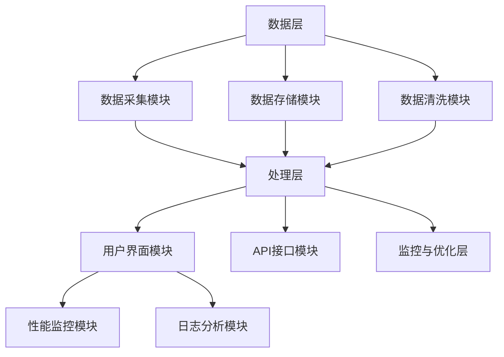
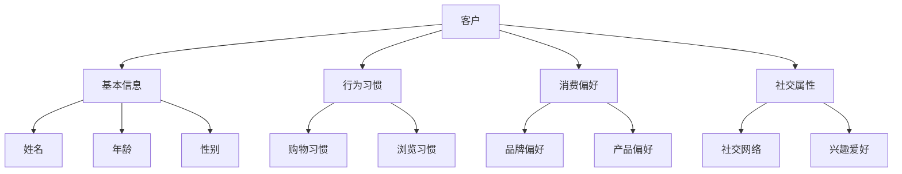

                 


### 1.1.1 AI在商业中的角色转变

随着人工智能（AI）技术的不断发展和应用，它在商业领域的角色也在发生深刻转变。从最初的辅助工具到如今的决策核心，AI正逐渐成为企业竞争力的关键因素。

**第一步：回顾AI在商业领域的早期应用**

在AI技术初露锋芒的时期，其应用主要集中在自动化流程的优化上。例如，通过自然语言处理（NLP）技术，企业能够自动处理客户服务中的常见问题；通过机器学习（ML）算法，优化库存管理以提高供应链效率。这些早期应用虽然提升了企业的运营效率，但AI更多是作为一种工具被使用，而非决策的核心。

**第二步：分析AI在商业中的深入应用**

随着时间的推移，AI技术的成熟和数据的积累，其应用范围逐渐扩大，开始深入到商业决策的核心。例如，在市场预测方面，通过分析历史销售数据和外部市场因素，AI能够预测未来的销售趋势，帮助企业制定更加精准的营销策略；在客户服务方面，通过分析客户行为数据和反馈，AI能够提供个性化的服务，提高客户满意度。

**第三步：探讨AI在商业中的未来趋势**

展望未来，AI在商业中的作用将进一步增强。首先，随着AI技术的不断发展，其应用将更加广泛和深入，包括但不限于智能客服、智能营销、智能供应链管理等方面。其次，AI将更多地参与到企业的战略决策中，通过分析大量数据，为企业提供有价值的洞察和建议，帮助企业实现精准决策。

**第四步：总结AI在商业中的角色转变**

综上所述，AI在商业中的角色从最初的辅助工具逐步转变为决策核心。这一转变不仅提升了企业的运营效率，更为企业的长期发展提供了有力支持。未来，随着AI技术的进一步发展，其将在商业中发挥更加重要的作用，成为企业不可或缺的一部分。

### 1.1.2 客户画像的重要性

客户画像，作为一种基于数据分析的方法，通过对客户行为的深入挖掘和分析，构建出客户的综合特征模型。它不仅为企业提供了精准的客户洞察，更为个性化服务和精准营销提供了重要依据。

**第一步：理解客户画像的定义**

客户画像（Customer Profiling）是指通过数据挖掘和统计分析技术，对客户的基本信息、行为习惯、消费偏好等进行综合分析和建模，形成一个详细的客户特征模型。这个模型能够帮助企业更深入地了解客户，从而提供更加精准的服务和产品。

**第二步：分析客户画像的核心要素**

客户画像的核心要素包括以下几个方面：

1. **基本信息**：如客户的性别、年龄、职业、收入水平等，这些基本信息是构建客户画像的基础。
2. **行为习惯**：如客户的购物习惯、浏览习惯、互动行为等，这些行为数据能够反映客户的兴趣和需求。
3. **消费偏好**：如客户的品牌偏好、产品偏好、价格敏感度等，这些偏好数据能够帮助企业了解客户对产品和服务的偏好。
4. **社交属性**：如客户的社交网络、兴趣爱好、社会地位等，这些社交属性数据能够帮助企业在社交营销中找到目标客户。

**第三步：探讨客户画像的应用场景**

客户画像的应用场景非常广泛，主要包括以下几个方面：

1. **个性化推荐**：通过分析客户的消费行为和偏好，为用户提供个性化的产品推荐，提高用户满意度和转化率。
2. **精准营销**：通过分析客户的特征和需求，制定更加精准的营销策略，提高营销效果。
3. **客户关系管理**：通过了解客户的消费习惯和偏好，提供更加个性化的服务和产品，增强客户忠诚度。
4. **市场细分**：通过分析客户的特征和行为，将市场划分为不同的细分群体，为企业制定更加有针对性的市场策略。

**第四步：总结客户画像的重要性**

客户画像作为一种基于数据分析的方法，不仅能够帮助企业更深入地了解客户，提高客户满意度和忠诚度，更为个性化服务和精准营销提供了有力支持。随着AI技术的不断发展，客户画像的应用将更加广泛和深入，成为企业提升竞争力的重要工具。

### 1.1.3 AI驱动的客户画像系统的必要性

AI驱动的客户画像系统在当今的商业环境中变得尤为必要，主要因为以下几个方面的原因。

**第一步：分析数据驱动的商业环境**

在当今的数据驱动商业环境中，企业面临着海量数据的挑战。这些数据不仅来自内部系统，如销售、营销、客户服务，还来自外部数据源，如社交媒体、搜索引擎、公共数据库等。如何有效地处理和利用这些数据成为企业的一大难题。传统的方法往往依赖于人工分析，不仅效率低下，还容易受到人为因素的干扰。

**第二步：探讨传统客户画像系统的局限性**

传统的客户画像系统通常依赖于预设的规则和模型，这导致它们在应对复杂多变的数据时表现不佳。例如，当客户行为发生变化时，传统系统往往难以及时调整，从而影响客户的体验和企业的决策。此外，传统系统在处理大规模数据时，计算效率低下，难以满足实时分析的需求。

**第三步：分析AI驱动的客户画像系统的优势**

AI驱动的客户画像系统通过利用机器学习和深度学习算法，能够自动从海量数据中提取有价值的信息，并实时更新客户画像。以下是AI驱动系统的几个关键优势：

1. **自动化的数据分析**：AI系统可以自动从数据中学习，识别出客户行为模式，无需人工干预。
2. **实时更新**：AI系统可以实时分析客户的最新行为，确保客户画像的时效性和准确性。
3. **个性化和精准化**：通过分析客户的消费习惯、偏好和行为，AI系统能够提供高度个性化的服务和建议。
4. **高效处理大规模数据**：AI系统利用分布式计算和并行处理技术，能够高效地处理海量数据，提高计算效率。
5. **自适应能力**：AI系统能够根据数据的变化自动调整模型，适应不断变化的市场环境和客户需求。

**第四步：总结AI驱动的客户画像系统的必要性**

综上所述，AI驱动的客户画像系统在当今的数据驱动商业环境中显得尤为重要。它不仅能够高效地处理和分析海量数据，提供实时、精准的客户洞察，还能够通过个性化的服务提升客户体验，从而帮助企业实现精细化运营和持续增长。

## 1.2 客户画像的基本概念

在深入探讨AI驱动的客户画像系统之前，了解客户画像的基本概念是至关重要的。这包括客户画像的定义、核心要素以及与大数据的关系。

### 1.2.1 客户画像的定义

客户画像（Customer Profiling）是指通过数据挖掘和统计分析技术，对客户的基本信息、行为习惯、消费偏好等进行综合分析和建模，形成一个详细的客户特征模型。这个模型能够帮助企业更深入地了解客户，从而提供更加精准的服务和产品。

### 1.2.2 客户画像的核心要素

客户画像的核心要素包括以下几个方面：

1. **基本信息**：如客户的性别、年龄、职业、收入水平等，这些基本信息是构建客户画像的基础。
2. **行为习惯**：如客户的购物习惯、浏览习惯、互动行为等，这些行为数据能够反映客户的兴趣和需求。
3. **消费偏好**：如客户的品牌偏好、产品偏好、价格敏感度等，这些偏好数据能够帮助企业了解客户对产品和服务的偏好。
4. **社交属性**：如客户的社交网络、兴趣爱好、社会地位等，这些社交属性数据能够帮助企业在社交营销中找到目标客户。

### 1.2.3 客户画像与大数据的关系

大数据（Big Data）是指无法用常规数据处理工具在合理时间内对其进行采集、管理和分析的数据集。客户画像与大数据的关系主要体现在以下几个方面：

1. **数据来源**：客户画像的数据来源广泛，包括内部数据源如销售、营销、客户服务系统，以及外部数据源如社交媒体、搜索引擎、公共数据库等。这些数据构成了大数据的一部分。
2. **数据分析**：大数据技术提供了强大的数据分析能力，能够从海量数据中提取有价值的信息，为构建精准的客户画像提供支持。
3. **实时更新**：大数据技术能够实现数据的实时处理和分析，确保客户画像的时效性和准确性。
4. **个性化服务**：通过大数据分析，企业能够更好地理解客户的个体差异，提供个性化的服务和产品推荐。

### 实例分析

假设某电商企业希望通过客户画像系统了解其客户群体。企业可以从以下几个方面获取数据：

1. **基本信息**：通过注册信息获取客户的性别、年龄、职业、收入水平等。
2. **行为习惯**：通过用户在网站上的浏览、搜索、购买行为数据，分析客户的购物习惯。
3. **消费偏好**：通过客户的购买记录和评价，分析客户对品牌、产品、价格等偏好。
4. **社交属性**：通过社交媒体分析，了解客户的社交网络和兴趣爱好。

利用大数据技术，企业可以对这些数据进行深入分析，构建出详细的客户画像，从而为精准营销和个性化服务提供支持。

## 1.3 AI驱动的客户画像系统的优势

AI驱动的客户画像系统在现代商业环境中具有显著的优势，尤其在提高决策效率、增强个性化服务和应对数据复杂性方面表现尤为突出。

### 1.3.1 提高决策效率

传统的客户画像系统往往依赖于人工分析和预设规则，这导致决策过程繁琐且效率低下。而AI驱动的客户画像系统通过机器学习和深度学习算法，能够自动从海量数据中提取有价值的信息，并实时更新客户画像。这种自动化和实时分析能力大大提高了决策效率，使企业能够快速响应市场变化和客户需求。

**实例分析：**
例如，在电商平台中，AI驱动的客户画像系统可以实时分析用户的浏览和购买行为，快速识别出潜在的购物意图，从而帮助企业及时调整营销策略，提高转化率。

### 1.3.2 增强个性化服务

个性化服务是现代商业中的一项重要策略，它通过深入了解客户的偏好和行为，提供定制化的产品和服务，从而提高客户满意度和忠诚度。AI驱动的客户画像系统在这方面具有显著优势，通过分析客户的消费习惯、偏好和行为模式，系统能够为每个客户提供个性化的推荐和定制化服务。

**实例分析：**
在电子商务领域，AI驱动的客户画像系统可以根据客户的购买历史和偏好，推荐相关产品，提高用户的购物体验。例如，某电商平台的系统可以基于客户的浏览记录和购买偏好，推荐相似的产品，从而增加用户的购买意愿。

### 1.3.3 应对数据复杂性

在当今的商业环境中，数据来源多样且数据量庞大，传统的数据分析和处理方法难以应对这种复杂性。AI驱动的客户画像系统通过利用先进的算法和分布式计算技术，能够高效地处理和分析海量数据，从而提供准确的客户洞察。

**实例分析：**
在金融行业，AI驱动的客户画像系统可以分析客户的交易行为、信用记录和社交网络等多维数据，构建出详细的客户画像，从而帮助企业更好地了解客户的风险偏好和信用状况，提高信贷审批的准确性。

### 总结

AI驱动的客户画像系统通过提高决策效率、增强个性化服务和应对数据复杂性，为现代商业提供了强大的支持。它不仅帮助企业更好地了解客户，提高客户满意度和忠诚度，还通过精准营销和个性化服务，提升了企业的竞争力。随着AI技术的不断发展，AI驱动的客户画像系统将在商业领域发挥越来越重要的作用。

### 1.4 本书结构安排

本书旨在全面介绍AI驱动的客户画像系统，以帮助读者深入理解和应用这一技术。本书共分为四个部分，结构安排如下：

**第一部分：引言与背景**

本部分主要介绍AI驱动的客户画像系统的背景和重要性，包括AI在商业中的角色转变、客户画像的定义和核心要素，以及AI驱动的客户画像系统的必要性。这一部分将帮助读者建立对客户画像系统的基础理解。

**第二部分：AI驱动的客户画像技术基础**

本部分将深入探讨AI驱动的客户画像系统的技术基础，包括数据收集与预处理、特征工程、客户行为分析与模式识别，以及AI算法在客户画像中的应用。这一部分将详细介绍构建客户画像所需的技术和工具。

**第三部分：AI驱动的客户画像系统设计与实现**

本部分将介绍AI驱动的客户画像系统的设计和实现，包括系统设计原则与架构、数据库设计、系统功能实现、系统接口设计与交互，以及系统性能测试与评估。这一部分将提供具体的实现方法和步骤。

**第四部分：AI驱动的客户画像系统应用案例**

本部分将通过具体应用案例，展示AI驱动的客户画像系统在电商、银行、零售和健康等行业的实际应用效果。通过这些案例，读者可以更好地理解AI驱动的客户画像系统在实际操作中的具体应用和效果。

**读者定位与学习目标**

本书的读者主要包括从事数据分析和客户关系管理的企业管理人员、技术工程师，以及对AI和客户画像感兴趣的学者和研究人员。通过阅读本书，读者可以：

1. **理解AI驱动的客户画像系统的基本概念和原理。**
2. **掌握构建客户画像所需的技术和方法。**
3. **了解AI驱动的客户画像系统在实际业务中的应用。**
4. **能够设计和实现一个简单的客户画像系统。**

**本书结构安排的必要性**

本书结构安排的必要性在于：

1. **系统性**：通过明确的章节结构，系统性地介绍客户画像系统的各个方面，帮助读者全面了解和掌握这一技术。
2. **逻辑性**：按照从基础到应用的逻辑顺序，逐步引导读者深入理解客户画像系统，使其能够更好地应用到实际业务中。
3. **实用性**：通过具体案例和实践指导，使读者不仅能够理论联系实际，还能在实践中解决问题，提升自身的能力。

## 1.5 本章小结

本章介绍了AI驱动的客户画像系统的背景和重要性，探讨了AI在商业中的角色转变、客户画像的定义和核心要素，以及AI驱动的客户画像系统的必要性。通过本章的学习，读者可以建立对客户画像系统的基本理解，为后续章节的深入学习打下坚实基础。了解AI驱动的客户画像系统的优势，如提高决策效率、增强个性化服务和应对数据复杂性，将有助于读者认识到其在现代商业中的重要作用。

## 2.1 数据收集与预处理

在构建AI驱动的客户画像系统时，数据收集与预处理是至关重要的一步。这一步不仅决定了后续分析和建模的质量，还直接影响系统的性能和效率。

### 2.1.1 数据收集来源

数据收集是客户画像系统的基础，数据来源的多样性和质量对系统的效果有重要影响。以下是一些常见的数据收集来源：

1. **内部数据**：企业的内部数据源包括销售系统、客户关系管理系统（CRM）、网站分析工具、客户反馈系统等。这些数据通常包括客户的购买历史、行为记录、互动数据和反馈信息。

2. **第三方数据**：第三方数据源包括公共数据集、社交媒体数据、在线评论和评级数据、市场研究数据等。这些数据可以从数据市场、公共数据库和第三方服务提供商获取。

3. **传感器数据**：在某些应用场景中，传感器数据也是一种重要的数据源。例如，智能设备收集的用户行为数据、地理位置数据等。

4. **公开数据**：通过开放的数据集和API，企业可以获取一些公开数据，如地理信息、人口统计信息等，这些数据可以帮助丰富客户画像。

### 2.1.2 数据质量评估

数据质量是确保客户画像系统效果的关键因素。以下是评估数据质量的一些标准：

1. **完整性**：数据应尽可能完整，缺失的数据需要进行补充或处理。

2. **准确性**：数据应准确无误，避免错误和虚假信息。

3. **一致性**：数据应在不同的时间和来源保持一致，避免矛盾和冲突。

4. **及时性**：数据应是最新的，以确保客户画像的时效性。

5. **可解释性**：数据应易于理解和解释，以便后续的分析和建模。

### 2.1.3 数据预处理方法

数据预处理是数据收集后的重要步骤，包括数据清洗、数据转换和数据归一化等。以下是常见的数据预处理方法：

1. **数据清洗**：数据清洗包括去除重复记录、处理缺失值、纠正错误数据等。常见的方法有填充缺失值（如使用均值、中位数或插值法）、删除异常值、纠正拼写错误等。

2. **数据转换**：数据转换包括将不同格式或单位的数据转换为统一的格式或单位，以便后续分析。例如，将日期格式统一为YYYY-MM-DD，将不同货币单位统一为某种基准货币等。

3. **数据归一化**：数据归一化是将不同量纲的数据转换为相同量纲的过程，以便在模型中处理。常见的方法有最小-最大缩放、Z分数标准化等。

4. **特征工程**：特征工程包括从原始数据中提取新的特征，或对现有特征进行转换。例如，通过组合现有特征生成新的特征，或使用主成分分析（PCA）等降维技术减少特征维度。

### 实例分析

假设我们有一个电商平台，希望收集并处理客户数据以构建客户画像。以下是数据收集和预处理的具体步骤：

1. **数据收集**：
   - 从销售系统中提取客户的购买记录、订单详情。
   - 从网站分析工具中获取客户的浏览行为、页面停留时间、点击路径。
   - 从客户关系管理系统（CRM）中提取客户的基本信息、联系信息、历史反馈。

2. **数据质量评估**：
   - 检查数据完整性，发现并处理缺失的订单记录。
   - 检查数据准确性，纠正拼写错误和明显的异常值。
   - 检查数据一致性，确保不同来源的数据在同一时间点是匹配的。

3. **数据预处理**：
   - 清洗数据，删除重复的订单记录和处理缺失的浏览行为数据。
   - 将不同的日期格式转换为统一的YYYY-MM-DD格式。
   - 对不同货币单位进行归一化处理，统一为人民币。

4. **特征工程**：
   - 提取新的特征，如客户的购买频率、平均订单金额。
   - 使用主成分分析（PCA）减少特征维度，提高模型性能。

通过上述步骤，电商平台可以构建一个高质量、可靠的数据集，为后续的AI分析和客户画像构建提供基础。

### 小结

数据收集与预处理是构建AI驱动的客户画像系统的关键步骤，它确保了后续分析的质量和系统的性能。通过明确的数据收集来源、严格的数据质量评估和有效的数据预处理方法，企业可以构建出高质量的客户数据集，为AI驱动的客户画像系统奠定坚实基础。

## 2.2 特征工程

在AI驱动的客户画像系统中，特征工程是一个至关重要的环节。它通过对原始数据进行处理和转换，提取出对模型有用的特征，从而提高模型的性能和准确性。

### 2.2.1 特征提取技术

特征提取是指从原始数据中提取出具有代表性的特征。以下是一些常见的特征提取技术：

1. **统计特征**：统计特征包括平均值、中位数、标准差、最大值、最小值等。这些特征能够描述数据的分布和趋势，对建模有很大帮助。

   $$\text{平均数} = \frac{\sum_{i=1}^{n} x_i}{n}$$
   $$\text{中位数} = \left(\frac{n+1}{2}\right)\text{th} \text{ value}$$
   $$\text{标准差} = \sqrt{\frac{\sum_{i=1}^{n} (x_i - \text{平均数})^2}{n-1}}$$

2. **文本特征**：对于文本数据，可以使用词袋模型、TF-IDF、Word2Vec等方法提取特征。

   $$\text{TF-IDF}(t,d) = \frac{f_t(d)}{\sum_{t'\in D} f_{t'}(d)} \log \left(\frac{N}{n_t}\right)$$
   其中，\( f_t(d) \) 是词 \( t \) 在文档 \( d \) 中的频率，\( N \) 是文档总数，\( n_t \) 是包含词 \( t \) 的文档数量。

3. **时间序列特征**：对于时间序列数据，可以提取周期性特征、趋势特征和季节性特征。

   $$\text{周期性特征} = \frac{\sum_{i=1}^{N} (x_t - \text{趋势值})^2}{N}$$
   $$\text{趋势特征} = \frac{\sum_{i=1}^{N} (x_t - x_{t-1})}{N}$$

4. **图像特征**：对于图像数据，可以使用卷积神经网络（CNN）提取特征。

   $$\text{CNN}_{\text{layer}}(x) = \text{ReLU}(\text{Conv}_{\text{layer}}(x) + b_{\text{layer}})$$
   其中，\( \text{ReLU} \) 是ReLU激活函数，\( \text{Conv}_{\text{layer}} \) 是卷积层，\( b_{\text{layer}} \) 是偏置项。

### 2.2.2 特征选择方法

特征选择是指从大量特征中选择出对模型性能有显著贡献的特征。以下是一些常见的特征选择方法：

1. **过滤方法**：通过设定阈值，筛选出绝对值大于阈值的特征。常用的阈值有标准差、信息增益等。

2. **包装方法**：通过训练模型并评估特征的重要性，选择对模型性能有显著贡献的特征。常用的方法有逐步回归、随机森林等。

3. **嵌入式方法**：在训练模型的同时进行特征选择，通过模型内部机制自动筛选特征。常用的方法有L1正则化（Lasso）、岭回归等。

### 2.2.3 特征归一化与转换

特征归一化是将不同量纲的特征转换为相同量纲的过程，以消除量纲对模型的影响。以下是一些常见的归一化方法：

1. **最小-最大缩放**：将特征映射到\[0, 1\]区间。

   $$x_{\text{norm}} = \frac{x - x_{\text{min}}}{x_{\text{max}} - x_{\text{min}}}$$

2. **Z分数标准化**：将特征映射到标准正态分布。

   $$x_{\text{norm}} = \frac{x - \text{平均数}}{\text{标准差}}$$

3. **对数转换**：对于具有广泛范围的数据，可以使用对数转换。

   $$x_{\text{log}} = \log(x)$$

### 实例分析

假设我们有一个电商平台的用户数据集，包括用户的年龄、收入、购买金额、浏览时间等特征。以下是特征工程的具体步骤：

1. **特征提取**：
   - 从用户购买记录中提取平均购买金额、最大购买金额、购买次数等统计特征。
   - 从用户浏览记录中提取平均浏览时间、最长时间浏览页面等统计特征。
   - 使用词袋模型提取用户在商品评价中的关键词频率特征。

2. **特征选择**：
   - 使用逐步回归筛选出对预测目标（如用户流失风险）有显著贡献的特征。
   - 使用信息增益选择对模型性能有显著提升的特征。

3. **特征归一化**：
   - 将年龄、收入等特征使用Z分数标准化。
   - 将购买金额、浏览时间等特征使用最小-最大缩放。

通过上述特征工程步骤，我们可以构建一个高质量的客户数据集，为后续的建模和分析提供支持。

### 小结

特征工程是构建AI驱动的客户画像系统的重要环节，通过特征提取、特征选择和特征归一化，我们可以从原始数据中提取出对模型有用的特征，从而提高模型的性能和准确性。合理的特征工程能够使模型更加健壮，能够应对不同类型的数据和不同的应用场景。

### 2.3 客户行为分析与模式识别

在构建AI驱动的客户画像系统中，深入分析客户行为并识别行为模式是至关重要的。这不仅有助于提升客户满意度，还能为企业提供有价值的商业洞察。

#### 2.3.1 客户行为数据挖掘

客户行为数据挖掘是指通过数据挖掘技术，从客户的日常互动和行为中提取出有意义的模式和趋势。以下是一些常见的方法：

1. **关联规则挖掘**：关联规则挖掘可以识别出客户行为中的频繁模式。例如，通过分析购物车数据，可以找出经常一起购买的商品组合。

   $$ \text{支持度} = \frac{\text{交易中包含项目的集合}}{\text{总交易数}} $$
   $$ \text{置信度} = \frac{\text{交易中包含A且包含B}}{\text{交易中包含A}} $$

2. **聚类分析**：聚类分析可以将具有相似行为的客户划分为不同的群体。常用的聚类算法包括K-means、层次聚类等。

   $$ \text{距离度量} = \min\left(\sum_{i=1}^{n} (x_i - \mu)^2\right) $$
   其中，\( x_i \) 是客户特征向量，\( \mu \) 是聚类中心。

3. **时间序列分析**：时间序列分析用于识别客户行为的时间趋势和周期性模式。例如，通过分析客户的购买历史，可以预测未来的购买行为。

   $$ \text{自回归模型} = \text{AR}(p): \mu_t = c + \sum_{i=1}^{p} \phi_i \mu_{t-i} + e_t $$
   其中，\( \mu_t \) 是时间序列的当前值，\( \phi_i \) 是自回归系数，\( e_t \) 是误差项。

4. **机器学习算法**：机器学习算法，如决策树、随机森林、神经网络等，可以用于挖掘复杂的客户行为模式。这些算法通过学习历史数据，能够预测客户的未来行为。

   $$ \text{决策树} = \text{ID3}: \text{信息增益} = \sum_{i=1}^{n} p_i \log_2(p_i) $$
   $$ \text{随机森林} = \text{RF}: \text{误差} = \sum_{i=1}^{n} \text{误差}_{i} $$
   $$ \text{神经网络} = \text{NN}: \text{激活函数} = \text{ReLU}(\text{加权求和}) $$

#### 2.3.2 客户细分模式识别

通过分析客户行为数据，企业可以将客户划分为不同的细分群体。这些细分群体具有相似的行为模式和需求，有助于企业制定个性化的营销策略。以下是一些常见的客户细分方法：

1. **行为细分**：根据客户的行为特征，如购买频率、购买金额、浏览时长等，将客户划分为高频消费者、高价值客户等。

2. **人口统计细分**：根据客户的性别、年龄、职业、收入等人口统计特征，将客户划分为不同的群体。

3. **心理细分**：通过分析客户的消费心理和行为动机，将客户划分为价值追求型、品牌忠诚型等。

4. **地理细分**：根据客户的地理位置信息，将客户划分为不同的地区市场。

#### 2.3.3 客户行为预测模型

客户行为预测模型可以帮助企业预测客户的未来行为，如购买意愿、流失风险等。以下是一些常见的方法：

1. **回归模型**：回归模型用于预测客户的某个具体行为，如购买金额。线性回归、逻辑回归等是常用的回归模型。

   $$ \text{线性回归}: y = \beta_0 + \beta_1 x $$
   $$ \text{逻辑回归}: P(y=1) = \frac{1}{1 + e^{-(\beta_0 + \beta_1 x)}} $$

2. **分类模型**：分类模型用于预测客户是否会发生某个特定事件，如是否购买某件商品。常用的分类模型包括决策树、支持向量机（SVM）、K-近邻（KNN）等。

   $$ \text{决策树}: \text{叶节点} = \text{类别} $$
   $$ \text{SVM}: \text{最大化间隔} $$
   $$ \text{KNN}: \text{最近邻分类} $$

3. **时序预测模型**：时序预测模型用于预测客户行为的时间序列趋势。常见的时序预测模型包括ARIMA、LSTM等。

   $$ \text{ARIMA}: \text{自回归差分移动平均模型} $$
   $$ \text{LSTM}: \text{长短期记忆网络} $$

### 实例分析

假设我们希望预测客户的购买行为。以下是预测模型的具体步骤：

1. **数据收集**：收集客户的购买历史数据、浏览行为数据、人口统计信息等。

2. **数据预处理**：对数据进行清洗、归一化处理，提取有用的特征。

3. **特征选择**：使用特征选择方法选择对模型性能有显著贡献的特征。

4. **模型训练**：使用回归模型或分类模型对数据进行训练，如线性回归、逻辑回归等。

5. **模型评估**：通过交叉验证等方法评估模型的性能，调整模型参数。

6. **预测应用**：使用训练好的模型预测新客户的购买行为。

通过上述步骤，企业可以构建一个客户行为预测模型，从而更好地了解客户行为，制定精准的营销策略。

### 小结

客户行为分析是AI驱动的客户画像系统的重要组成部分。通过数据挖掘、客户细分和行为预测，企业可以深入理解客户需求，提供个性化服务，提高客户满意度和忠诚度。合理的客户行为分析和预测模型不仅能够提升企业的运营效率，还能为企业的战略决策提供有力支持。

## 2.4 AI算法在客户画像中的应用

在构建AI驱动的客户画像系统时，选择合适的算法至关重要。不同的算法在处理客户数据时各有优势，本文将介绍机器学习、深度学习和强化学习等算法在客户画像中的应用。

### 2.4.1 机器学习算法简介

机器学习（Machine Learning，ML）是AI的核心技术之一，它通过从数据中学习规律，实现数据分析和预测。在客户画像系统中，常见的机器学习算法包括：

1. **线性回归**：线性回归是一种简单的预测模型，通过线性关系预测目标变量。适用于预测客户的行为或需求。

   $$ y = \beta_0 + \beta_1 x_1 + \beta_2 x_2 + ... + \beta_n x_n $$
   其中，\( y \) 是预测目标，\( x_1, x_2, ..., x_n \) 是特征变量。

2. **逻辑回归**：逻辑回归是一种分类模型，用于预测客户是否属于某个特定类别，如是否购买某产品。

   $$ P(y=1) = \frac{1}{1 + e^{-(\beta_0 + \beta_1 x_1 + \beta_2 x_2 + ... + \beta_n x_n)}} $$
   其中，\( P(y=1) \) 是客户购买的概率。

3. **支持向量机（SVM）**：SVM是一种高效的分类算法，通过最大化分类间隔来分类客户数据。

   $$ \max_{\beta, \beta_0} W^2 - C \sum_{i=1}^{n} (y_i - (\beta_0 + \beta \cdot x_i))^2 $$
   其中，\( W \) 是分类间隔，\( C \) 是惩罚参数。

4. **决策树**：决策树通过一系列规则对客户数据分类，易于理解和解释。

   $$ \text{if } x_1 > c_1 \text{ then } \text{class} = \text{label}_1 $$
   $$ \text{else if } x_2 > c_2 \text{ then } \text{class} = \text{label}_2 $$
   $$ \text{else } \text{class} = \text{label}_3 $$

### 2.4.2 深度学习算法应用

深度学习（Deep Learning，DL）是一种基于多层神经网络的学习方法，能够自动提取数据中的复杂特征。在客户画像系统中，深度学习算法的应用包括：

1. **卷积神经网络（CNN）**：CNN是一种专门用于处理图像数据的深度学习算法，可以提取图像中的低级特征（如边缘、纹理）和高级特征（如对象、场景）。

   $$ \text{CNN} = (\text{卷积层}, \text{激活函数}, \text{池化层})^{\times \text{多层}} $$
   $$ \text{ReLU}(x) = \max(0, x) $$

2. **循环神经网络（RNN）**：RNN是一种能够处理序列数据的深度学习算法，适用于处理时间序列数据。

   $$ \text{RNN} = (\text{输入层}, \text{隐藏层}, \text{输出层}) \times \text{时间步} $$
   $$ h_t = \text{sigmoid}(W \cdot [h_{t-1}, x_t] + b) $$

3. **长短期记忆网络（LSTM）**：LSTM是RNN的一种改进，能够解决RNN的长期依赖问题。

   $$ \text{LSTM} = (\text{输入门}, \text{遗忘门}, \text{输出门}) \times \text{时间步} $$
   $$ f_t = \text{sigmoid}(W_f \cdot [h_{t-1}, x_t] + b_f) $$
   $$ i_t = \text{sigmoid}(W_i \cdot [h_{t-1}, x_t] + b_i) $$
   $$ \text{遗忘门} = f_t \odot \text{输入门} $$
   $$ \text{新记忆} = \text{sigmoid}(W_c \cdot \text{遗忘门} \odot [h_{t-1}, x_t] + b_c) $$
   $$ h_t = \text{输出门} \odot \text{新记忆} $$

4. **自动编码器（Autoencoder）**：自动编码器是一种无监督学习算法，用于学习数据中的低维表示。

   $$ \text{编码器} = f(x) $$
   $$ \text{解码器} = g(z) $$
   $$ \text{损失函数} = \frac{1}{n} \sum_{i=1}^{n} \sum_{j=1}^{m} (x_j - g(f(x_j)))^2 $$

### 2.4.3 强化学习与客户画像

强化学习（Reinforcement Learning，RL）是一种通过与环境互动学习最优策略的方法。在客户画像系统中，强化学习可以用于优化客户推荐系统。

1. **Q学习**：Q学习是一种基于值函数的强化学习算法，通过学习状态-动作值函数来选择最优动作。

   $$ Q(s, a) = r + \gamma \max_{a'} Q(s', a') $$
   其中，\( s \) 是当前状态，\( a \) 是当前动作，\( s' \) 是下一状态，\( r \) 是奖励，\( \gamma \) 是折扣因子。

2. **深度Q网络（DQN）**：DQN是一种基于深度学习的强化学习算法，通过训练深度神经网络来估计状态-动作值函数。

   $$ Q(s, a) = \frac{1}{N} \sum_{i=1}^{N} \text{神经网络预测的Q值} $$
   $$ \text{损失函数} = \frac{1}{N} \sum_{i=1}^{N} (y_i - Q(s_i, a_i))^2 $$

### 应用案例

1. **电商推荐系统**：通过深度学习算法提取用户特征，构建用户画像，然后使用强化学习优化推荐策略，提高推荐系统的准确性和用户满意度。

2. **银行客户细分**：利用机器学习算法对客户行为数据进行分类和预测，识别高风险客户和潜在优质客户，为银行提供精准的风险管理和营销策略。

3. **零售行业客户分析**：通过时序分析和聚类分析，识别客户的行为模式和细分群体，为企业提供个性化营销和服务方案。

### 小结

AI算法在客户画像系统中发挥着关键作用。通过选择合适的机器学习、深度学习和强化学习算法，企业可以构建高效、精准的客户画像系统，从而提升运营效率和客户满意度。随着AI技术的不断发展，这些算法将在客户画像系统中发挥越来越重要的作用。

### 2.5 本章小结

本章介绍了AI驱动的客户画像系统中常用的AI算法，包括机器学习、深度学习和强化学习。通过这些算法，企业可以高效地处理和分析客户数据，构建出精准的客户画像。本章详细探讨了每种算法的基本原理、应用场景和具体案例，为读者提供了全面的技术指导。掌握这些算法的应用，将有助于企业在激烈的市场竞争中脱颖而出。

### 3.1 系统设计原则与架构

在设计AI驱动的客户画像系统时，遵循明确的设计原则和构建合理的系统架构至关重要。这不仅有助于系统的稳定性、可扩展性和维护性，还能确保系统在满足业务需求的同时，高效地处理大量数据。

#### 3.1.1 系统设计原则

以下是设计AI驱动的客户画像系统时应遵循的原则：

1. **模块化设计**：系统应采用模块化设计，将不同功能划分为独立的模块，便于系统的扩展和维护。
   
2. **可扩展性**：系统设计应具备良好的可扩展性，以应对业务规模的增长和数据量的增加。

3. **高可用性**：系统应具备高可用性，确保在任何情况下都能稳定运行，并提供可靠的服务。

4. **安全性**：系统设计应充分考虑数据安全和用户隐私保护，确保数据的安全性和合规性。

5. **可维护性**：系统应易于维护，以便在出现问题时能够快速定位和修复。

#### 3.1.2 系统架构设计

AI驱动的客户画像系统通常采用分布式架构，以应对海量数据的处理需求。以下是一个典型的系统架构设计：

1. **数据层**：数据层是系统的核心，负责数据收集、存储和管理。数据层包括以下几个组件：
   - 数据采集模块：从各种数据源（如CRM系统、网站分析工具、第三方数据提供商）收集数据。
   - 数据存储模块：使用分布式数据库（如Hadoop、MongoDB、HBase）存储和管理数据，确保数据的可靠性和高效性。
   - 数据清洗模块：对收集到的数据进行清洗、去重、缺失值填充等处理。

2. **处理层**：处理层负责对数据进行分析和处理，以生成客户画像。处理层包括以下几个组件：
   - 数据预处理模块：对原始数据清洗、转换和归一化处理。
   - 特征工程模块：提取和选择对模型有用的特征。
   - 模型训练模块：使用机器学习算法（如线性回归、决策树、神经网络等）训练客户画像模型。

3. **应用层**：应用层是系统的对外接口，负责提供用户交互和数据查询功能。应用层包括以下几个组件：
   - 用户界面模块：提供用户操作界面，展示客户画像结果。
   - API接口模块：提供RESTful API，供其他系统调用。

4. **监控与优化层**：监控与优化层负责对系统运行状况进行监控和性能优化。包括以下几个组件：
   - 性能监控模块：监控系统性能，如响应时间、吞吐量等。
   - 日志分析模块：分析系统日志，识别潜在问题和优化机会。

#### 系统架构图

以下是一个简化的系统架构图，展示各个模块之间的交互关系：



#### 实例分析

假设一个电商企业希望设计一个AI驱动的客户画像系统，以下是一个具体的设计案例：

1. **数据层**：
   - 数据采集模块：从电商平台、客户关系管理系统（CRM）、社交媒体等渠道收集用户数据。
   - 数据存储模块：使用Hadoop分布式文件系统（HDFS）存储用户行为数据和特征数据。
   - 数据清洗模块：对采集到的数据进行清洗，去除重复和缺失数据，并转换为统一格式。

2. **处理层**：
   - 数据预处理模块：对清洗后的数据进行归一化和特征工程，提取用户购买频率、浏览时长、品牌偏好等特征。
   - 模型训练模块：使用随机森林算法训练客户细分模型，将用户划分为不同群体。

3. **应用层**：
   - 用户界面模块：提供一个Web界面，展示用户的细分结果和推荐商品。
   - API接口模块：提供RESTful API，供其他系统（如营销系统、推荐系统）调用。

4. **监控与优化层**：
   - 性能监控模块：监控系统的响应时间和处理速度，识别瓶颈并进行优化。
   - 日志分析模块：分析系统日志，识别异常行为和潜在问题，及时进行修复。

通过上述设计，电商企业可以构建一个高效、稳定的AI驱动的客户画像系统，为个性化推荐和精准营销提供支持。

### 小结

系统设计原则和架构设计是构建AI驱动的客户画像系统的关键步骤。通过遵循模块化设计、可扩展性、高可用性、安全性和可维护性等原则，并构建合理的系统架构，企业可以构建出高效、可靠的客户画像系统，为业务发展提供有力支持。

## 3.2 数据库设计

在AI驱动的客户画像系统中，数据库设计是关键的一环。一个良好的数据库设计不仅能够提高数据存储和访问的效率，还能确保数据的完整性和一致性。以下是数据库设计的主要步骤和注意事项。

### 3.2.1 数据库需求分析

在进行数据库设计之前，首先需要对数据库的需求进行分析。这包括以下几个方面：

1. **数据来源**：明确数据来源，包括内部数据源（如客户关系管理系统、销售系统）和外部数据源（如社交媒体、第三方数据提供商）。

2. **数据类型**：分析不同类型的数据，如结构化数据（如用户基本信息、交易记录）、半结构化数据（如用户评论、日志数据）和非结构化数据（如图像、视频）。

3. **数据量**：估算数据量，包括当前数据和预计未来的数据增长，以确定数据库的存储能力和性能要求。

4. **查询需求**：分析系统对数据的查询需求，包括查询频率、查询类型（如简单查询、复杂查询）、查询性能要求等。

### 3.2.2 数据库结构设计

数据库结构设计主要包括实体关系图（ER图）的设计和表结构的定义。

1. **实体关系图（ER图）**：ER图用于表示数据库中的实体及其关系。以下是客户画像系统的一个简化的ER图示例：

   ```mermaid
   graph TD
       A[用户] --> B[用户信息]
       A --> C[行为记录]
       A --> D[购买记录]
       B --> E[基本信息]
       C --> F[浏览记录]
       C --> G[互动记录]
       D --> H[交易记录]
   ```

   在这个ER图中，用户是核心实体，包括用户信息、行为记录和购买记录。用户信息包括基本信息，行为记录包括浏览记录和互动记录，购买记录包括交易记录。

2. **表结构定义**：根据ER图，可以定义各个实体的表结构。以下是用户信息表（User）和行为记录表（Behavior）的结构示例：

   ```sql
   -- 用户信息表
   CREATE TABLE User (
       UserID INT PRIMARY KEY,
       Username VARCHAR(255),
       Password VARCHAR(255),
       Email VARCHAR(255),
       CreatedAt TIMESTAMP
   );

   -- 用户基本信息表
   CREATE TABLE UserInfo (
       UserInfoID INT PRIMARY KEY,
       UserID INT,
       Age INT,
       Gender CHAR(1),
       Income INT,
       FOREIGN KEY (UserID) REFERENCES User(UserID)
   );

   -- 用户行为记录表
   CREATE TABLE Behavior (
       BehaviorID INT PRIMARY KEY,
       UserID INT,
       BehaviorType VARCHAR(255),
       BehaviorDetail VARCHAR(255),
       CreatedAt TIMESTAMP,
       FOREIGN KEY (UserID) REFERENCES User(UserID)
   );

   -- 用户购买记录表
   CREATE TABLE Purchase (
       PurchaseID INT PRIMARY KEY,
       UserID INT,
       ProductID INT,
       Quantity INT,
       PurchaseDate TIMESTAMP,
       FOREIGN KEY (UserID) REFERENCES User(UserID),
       FOREIGN KEY (ProductID) REFERENCES Product(ProductID)
   );
   ```

### 3.2.3 数据库性能优化

为了确保数据库能够高效地处理大量数据，以下是一些常见的数据库性能优化策略：

1. **索引优化**：为常用的查询字段创建索引，以提高查询速度。例如，可以为用户ID、产品ID等主键字段创建索引。

2. **分区表**：对于大表，可以采用分区表策略，将表分为多个小表，分别存储不同的数据范围，以提高查询和写入效率。

3. **缓存策略**：使用缓存策略，如内存缓存或分布式缓存（如Redis），减少数据库的查询负载。

4. **读写分离**：通过主从复制和读写分离，将读操作和写操作分离到不同的服务器上，以提高系统的整体性能。

5. **垂直拆分和水平拆分**：根据业务需求，可以对数据库进行垂直拆分（如将用户信息和行为记录拆分为不同的数据库）或水平拆分（如将不同地区的用户数据存储在不同的数据库中），以提高系统的可扩展性。

### 实例分析

假设一个电商企业需要设计一个客户画像系统，以下是一个具体的数据库设计案例：

1. **数据需求分析**：
   - 数据来源：电商平台、社交媒体、第三方数据提供商。
   - 数据类型：结构化数据（用户基本信息、购买记录）、半结构化数据（用户评论、浏览记录）。
   - 数据量：预计用户数量达到1000万，数据量每年增长10%。

2. **数据库结构设计**：
   - 用户信息表：存储用户基本信息，包括用户ID、用户名、密码、邮箱等。
   - 用户行为记录表：存储用户的行为数据，包括浏览记录、购买记录、互动记录等。
   - 购买记录表：存储用户的购买数据，包括用户ID、产品ID、购买数量、购买日期等。

3. **数据库性能优化**：
   - 索引优化：为用户ID、产品ID字段创建索引。
   - 分区表：将购买记录表按月份分区，以提高查询和写入效率。
   - 缓存策略：使用Redis缓存用户行为数据，减少数据库查询负载。
   - 读写分离：通过主从复制和读写分离，将读操作和写操作分离到不同的服务器上。

通过上述数据库设计，电商企业可以构建一个高效、可靠的客户画像系统，为个性化推荐和精准营销提供支持。

### 小结

数据库设计是构建AI驱动的客户画像系统的重要环节。通过需求分析、结构设计和性能优化，企业可以构建一个高效、可靠的数据库系统，为AI驱动的客户画像系统提供稳定的数据支持。合理的数据库设计不仅能提高数据存储和访问的效率，还能确保数据的完整性和一致性。

### 3.3 系统功能实现

在AI驱动的客户画像系统中，系统功能的实现是关键的一步，它决定了系统能否有效地处理数据、生成画像并提供用户所需的服务。以下是系统功能实现的具体步骤和要点。

#### 3.3.1 客户数据收集模块

客户数据收集模块是整个系统的基础，它负责从各种数据源收集客户数据，包括内部数据源（如CRM系统、销售系统）和外部数据源（如社交媒体、第三方数据提供商）。以下是实现该模块的具体步骤：

1. **数据源识别**：明确系统所需的数据源，包括数据类型、数据结构和数据更新频率。

2. **数据采集**：编写数据采集脚本或使用现有的数据采集工具，定期从各个数据源收集数据。对于不同的数据源，可能需要使用不同的接口和协议（如API、Web爬虫、数据库连接）。

3. **数据清洗**：对收集到的数据进行清洗，去除重复、缺失和异常数据。清洗过程可能包括数据去重、缺失值填充、数据格式转换等。

4. **数据存储**：将清洗后的数据存储到数据库中，采用分布式数据库系统（如Hadoop、MongoDB）以提高存储和处理的效率。

5. **日志记录**：记录数据采集和清洗的过程，以便在出现问题时进行追踪和调试。

#### 3.3.2 客户行为分析模块

客户行为分析模块负责对收集到的客户数据进行处理和分析，以生成客户画像。以下是实现该模块的具体步骤：

1. **数据预处理**：对原始数据进行预处理，包括数据归一化、特征提取和特征选择。使用统计方法、文本处理方法等对数据进行转换和提取。

2. **行为模式识别**：使用机器学习算法（如聚类分析、关联规则挖掘）识别客户行为中的模式。通过分析客户的购买历史、浏览记录和互动行为，可以识别出客户的偏好和行为特征。

3. **客户细分**：根据客户行为模式，将客户划分为不同的细分群体。使用聚类算法（如K-means、DBSCAN）和决策树算法（如随机森林）等，可以生成细粒度的客户细分结果。

4. **客户画像生成**：将细分结果和特征数据结合，生成详细的客户画像。客户画像包括基本信息、行为习惯、消费偏好等多个维度。

5. **可视化展示**：将客户画像结果通过图表、仪表盘等形式展示给用户，使其能够直观地了解客户特征和细分结果。

#### 3.3.3 客户画像生成模块

客户画像生成模块是将客户行为分析结果转化为可操作的业务信息的步骤。以下是实现该模块的具体步骤：

1. **画像组合**：根据业务需求，将不同维度的数据组合成完整的客户画像。例如，可以将用户的基本信息、行为习惯和消费偏好整合成一个统一的画像。

2. **画像存储**：将生成的客户画像存储到数据库中，以便后续查询和使用。使用NoSQL数据库（如MongoDB、Cassandra）可以存储复杂结构的画像数据。

3. **画像更新**：客户行为是动态变化的，需要定期更新客户画像。通过实时数据流处理（如Apache Kafka、Apache Flink）等技术，可以实现客户画像的实时更新。

4. **画像应用**：将客户画像应用于不同的业务场景，如个性化推荐、精准营销、客户关系管理等。通过API接口，可以将画像数据提供给其他业务系统使用。

#### 实例分析

假设一个电商企业希望实现一个AI驱动的客户画像系统，以下是一个具体的实现案例：

1. **客户数据收集模块**：
   - 识别数据源：CRM系统、电商平台日志、社交媒体数据。
   - 采集数据：使用API接口和Web爬虫技术定期收集数据。
   - 数据清洗：使用Python脚本和数据库操作进行数据去重、缺失值填充和格式转换。
   - 数据存储：使用Hadoop分布式文件系统（HDFS）存储原始数据，使用MongoDB存储清洗后的数据。

2. **客户行为分析模块**：
   - 数据预处理：使用Python的pandas库进行数据归一化和特征提取。
   - 行为模式识别：使用K-means算法进行聚类分析，识别客户的行为模式。
   - 客户细分：生成细分结果，将客户划分为高价值客户、高忠诚度客户等群体。
   - 可视化展示：使用Tableau工具将细分结果和客户画像可视化展示。

3. **客户画像生成模块**：
   - 画像组合：将用户的基本信息、行为习惯和消费偏好整合成一个完整的客户画像。
   - 画像存储：使用MongoDB存储客户画像数据，保证数据结构的灵活性。
   - 画像更新：使用Apache Kafka实时处理客户行为数据，定期更新客户画像。
   - 画像应用：通过API接口将客户画像数据提供给个性化推荐和精准营销系统。

通过上述步骤，电商企业可以构建一个高效、可靠的AI驱动的客户画像系统，为个性化服务和精准营销提供支持。

### 小结

系统功能的实现是构建AI驱动的客户画像系统的关键环节。通过合理的数据收集、行为分析和画像生成模块，企业可以构建一个高效、精准的客户画像系统，为业务发展提供有力支持。实现这些功能需要综合考虑数据质量、算法选择和技术架构，确保系统能够稳定运行并提供优质服务。

### 3.4 系统接口设计与交互

在AI驱动的客户画像系统中，系统接口的设计和交互至关重要。良好的接口设计不仅能够提高系统的可扩展性和灵活性，还能确保不同模块之间的数据流通和功能协同。以下是系统接口设计与交互的详细讨论。

#### 3.4.1 接口规范与设计

接口规范是确保系统各部分之间通信的一致性和规范性的重要手段。以下是设计接口时需要考虑的几个关键点：

1. **接口类型**：根据系统的需求，可以选择不同的接口类型，如RESTful API、GraphQL、Websocket等。RESTful API适用于大多数场景，因为它具有简单、易用、支持缓存等优点；GraphQL适用于需要灵活查询的场景，因为它允许客户端指定所需的数据；Websocket适用于需要实时通信的场景，因为它提供全双工通信。

2. **接口设计原则**：接口设计应遵循RESTful原则，确保接口具有一致性、简洁性和易用性。具体原则包括：
   - **统一资源定位**：使用URL定位资源，确保接口的统一性和可访问性。
   - **状态转移**：通过HTTP动词（GET、POST、PUT、DELETE）实现资源状态的转移，遵循统一的操作规范。
   - **响应格式**：统一响应格式，通常使用JSON或XML，确保前后端的解析和处理一致。

3. **接口安全**：确保接口的安全性，防止数据泄露和未授权访问。可以使用OAuth 2.0等认证和授权机制，确保只有经过认证的用户才能访问接口。

4. **接口文档**：提供详细的接口文档，包括接口的定义、参数说明、返回结果等，以便开发人员能够快速上手和使用接口。

#### 3.4.2 系统间交互设计

系统间交互设计是确保不同模块之间数据流通和功能协同的关键。以下是几个关键设计点：

1. **数据传输格式**：选择合适的传输格式，如JSON或XML，确保不同模块之间能够高效、准确地传输数据。

2. **数据一致性**：设计统一的数据格式和命名规范，确保不同模块使用相同的数据结构和命名方式，避免数据不一致性问题。

3. **异步处理**：对于需要长时间处理或依赖其他模块的结果的任务，应采用异步处理方式。例如，使用消息队列（如Kafka、RabbitMQ）将任务消息发送到队列中，由后台服务进行处理，并在处理完成后通知前端。

4. **服务注册与发现**：在分布式系统中，服务注册与发现机制（如Consul、Eureka）能够确保不同服务之间的动态发现和调用。通过服务注册，系统能够动态地更新服务列表，确保调用方能够找到并访问到正确的服务实例。

5. **负载均衡**：设计负载均衡机制，确保请求能够均衡地分发到不同的服务器实例上，避免单点瓶颈。常用的负载均衡算法包括轮询、随机、最小连接数等。

6. **容错与重试**：设计容错和重试机制，确保系统在遇到故障时能够自动恢复。例如，在调用远程服务时，可以设置重试次数和重试间隔，确保请求能够最终成功执行。

#### 3.4.3 安全性与隐私保护

在系统接口设计和交互中，安全性和隐私保护至关重要。以下是几个关键点：

1. **数据加密**：对传输的数据进行加密，确保数据在传输过程中的安全性。可以使用TLS/SSL等加密协议进行数据传输加密。

2. **访问控制**：设计严格的访问控制策略，确保只有经过认证的用户才能访问敏感数据。可以使用ACL（访问控制列表）或RBAC（基于角色的访问控制）机制实现。

3. **日志记录与监控**：记录接口的访问日志和错误日志，并对系统进行实时监控，确保在出现异常时能够及时发现和解决。

4. **数据隐私**：遵守相关数据隐私法规，如GDPR，确保用户数据的隐私保护。例如，对用户敏感数据进行脱敏处理，限制数据的访问权限等。

#### 实例分析

假设一个电商平台的客户画像系统需要与其他系统（如推荐系统、营销系统）进行交互，以下是一个具体的接口设计和交互设计案例：

1. **接口规范与设计**：
   - 接口类型：使用RESTful API。
   - 接口设计原则：遵循RESTful原则，使用统一的URL结构和HTTP动词。
   - 接口安全：使用OAuth 2.0进行认证和授权。

2. **系统间交互设计**：
   - 数据传输格式：使用JSON格式传输数据。
   - 数据一致性：设计统一的数据格式和命名规范。
   - 异步处理：对于需要长时间处理的数据分析任务，使用Kafka进行异步处理。

3. **安全性与隐私保护**：
   - 数据加密：使用TLS/SSL进行数据传输加密。
   - 访问控制：使用ACL进行访问控制。
   - 日志记录与监控：记录接口访问日志和错误日志，使用ELK（Elasticsearch、Logstash、Kibana）进行实时监控。

通过上述设计和实施，电商平台可以构建一个高效、安全、可靠的客户画像系统，确保与其他系统的顺畅交互和数据流通。

### 小结

系统接口设计与交互设计是构建AI驱动的客户画像系统的重要组成部分。通过遵循接口规范、设计原则，确保系统间数据流通和功能协同，并重视安全性与隐私保护，企业可以构建一个高效、可靠的客户画像系统，为业务发展提供有力支持。

### 3.5 系统性能测试与评估

在AI驱动的客户画像系统中，系统性能的测试与评估是确保系统稳定性和可靠性的关键步骤。以下是系统性能测试与评估的方法、指标和优化策略。

#### 3.5.1 性能测试方法

1. **负载测试**：负载测试用于评估系统在特定负载下的性能。通过模拟大量用户同时访问系统，测试系统的响应时间、吞吐量和资源利用率。常用的工具包括JMeter、LoadRunner等。

2. **压力测试**：压力测试用于评估系统在极端负载下的性能。通过增加负载，直到系统达到最大承受能力，测试系统的稳定性和响应能力。

3. **容量规划**：容量规划用于评估系统在不同规模下的性能。通过逐步增加数据量，测试系统在处理大量数据时的性能变化。

4. **事务测试**：事务测试用于评估系统内部事务的性能，包括数据库查询、数据传输、业务逻辑处理等。通过模拟真实事务，测试系统的处理速度和正确性。

#### 3.5.2 系统评估指标

在性能测试中，常用的评估指标包括：

1. **响应时间**：系统从接收请求到返回响应的时间。响应时间越短，系统的性能越好。

2. **吞吐量**：单位时间内系统能够处理的请求数量。吞吐量越高，系统的处理能力越强。

3. **资源利用率**：系统使用的CPU、内存、网络等资源的比例。资源利用率高，说明系统性能接近瓶颈。

4. **错误率**：系统在处理请求时出现的错误比例。错误率越低，系统的稳定性越好。

5. **并发数**：系统能够同时处理的并发请求数量。并发数越高，系统的并发处理能力越强。

#### 3.5.3 性能优化策略

针对系统性能测试中发现的问题，可以采取以下优化策略：

1. **数据库优化**：对数据库进行性能优化，包括索引优化、查询优化、分区表等。例如，为常用查询字段创建索引，优化查询语句，减少查询的执行时间。

2. **缓存策略**：使用缓存技术，如Redis、Memcached，减少对数据库的访问。将高频访问的数据存储在缓存中，提高系统的响应速度。

3. **分布式架构**：采用分布式架构，将系统拆分为多个服务模块，通过负载均衡和分布式存储提高系统的性能和可扩展性。

4. **异步处理**：对于耗时较长的任务，采用异步处理方式，如消息队列（Kafka、RabbitMQ），减少系统的阻塞和响应时间。

5. **代码优化**：对系统代码进行优化，包括减少不必要的计算、优化循环和递归算法、减少内存占用等。通过代码优化，可以提高系统的运行效率。

6. **监控与预警**：通过实时监控，及时发现系统性能瓶颈和潜在问题。使用自动化监控工具（如Prometheus、Grafana），设置预警阈值，确保在出现问题时能够及时响应和处理。

#### 实例分析

假设一个电商平台的客户画像系统需要进行性能测试和优化，以下是一个具体的性能测试和优化案例：

1. **性能测试**：
   - 使用JMeter进行负载测试和压力测试，模拟大量用户同时访问系统，测试系统的响应时间和吞吐量。
   - 使用PerfStack分析系统性能瓶颈，定位数据库查询慢、代码瓶颈等问题。

2. **性能优化**：
   - 对数据库进行索引优化，为常用查询字段创建索引，提高查询效率。
   - 使用Redis缓存用户行为数据，减少数据库访问次数。
   - 将数据处理任务拆分为多个微服务，通过Kafka进行异步处理，减少系统的阻塞和响应时间。
   - 对系统代码进行优化，减少不必要的计算，优化循环和递归算法。

3. **监控与预警**：
   - 使用Prometheus监控系统的性能指标，如CPU、内存、响应时间等。
   - 设置Grafana仪表盘，实时展示系统性能指标，并在出现性能问题时自动触发报警。

通过上述性能测试和优化，电商平台可以确保客户画像系统在高负载情况下仍能稳定运行，提供高效、可靠的服务。

### 小结

系统性能测试与评估是构建高效、可靠的AI驱动的客户画像系统的关键步骤。通过使用适当的测试方法和评估指标，可以及时发现性能问题，并采取有效的优化策略。性能优化不仅提高了系统的运行效率，还增强了系统的稳定性和可靠性，为企业的持续发展提供有力支持。

### 3.6 本章小结

本章详细探讨了AI驱动的客户画像系统中的系统设计、实现和性能优化。首先介绍了系统设计原则和架构设计，明确了模块划分和数据流程；随后，详细讨论了客户数据收集、行为分析、画像生成等关键模块的实现方法；最后，介绍了系统接口设计和交互，以及系统性能测试与评估的方法和优化策略。通过本章的学习，读者可以全面了解和掌握构建高效、可靠的客户画像系统所需的技术和方法，为实际业务应用提供有力支持。

## 4.1 案例一：电商行业的客户画像分析

在电商行业，客户画像分析是一种常用的方法，通过深入分析客户的购物行为、偏好和习惯，企业可以更好地了解客户，从而制定个性化的营销策略，提高用户满意度和转化率。

### 4.1.1 案例背景

某大型电商平台希望通过AI驱动的客户画像系统，更深入地了解其客户群体，以便于提供更精准的营销策略和个性化推荐。该平台拥有海量的用户数据，包括购买记录、浏览行为、互动数据等。为了实现这一目标，该电商平台决定构建一个AI驱动的客户画像系统，通过数据分析技术，提取客户的特征和行为模式，从而为营销和推荐提供支持。

### 4.1.2 案例实施过程

1. **数据收集与预处理**：首先，从电商平台的数据库中提取用户数据，包括购买记录、浏览行为、互动数据等。数据收集完成后，对这些数据进行了清洗和预处理，去除重复数据、处理缺失值，并将数据格式转换为统一格式，以便后续分析。

2. **特征工程**：对预处理后的数据进行了特征工程，提取了包括用户年龄、性别、购买频率、浏览时长、购买金额等在内的多个特征。通过这些特征，可以更准确地描述用户的行为模式。

3. **客户细分**：使用聚类算法（如K-means）将用户划分为不同的细分群体。通过分析不同群体的特征和行为，可以了解不同用户群体的特点和需求。

4. **个性化推荐**：基于用户画像，为每个用户生成个性化的推荐列表。推荐系统使用协同过滤算法（如基于用户的协同过滤）和基于内容的推荐算法，结合用户的购买历史和偏好，为用户推荐相关的商品。

5. **营销策略**：根据客户细分结果，制定个性化的营销策略。例如，对于高价值客户，可以提供专属优惠和礼品；对于新用户，可以提供新手礼包和优惠券，引导其进行首次购买。

6. **效果评估**：通过跟踪用户的行为和反馈，评估客户画像分析和个性化推荐的效果。例如，通过比较不同细分群体的转化率和满意度，评估营销策略的有效性。

### 4.1.3 案例效果评估

通过实施AI驱动的客户画像系统，该电商平台取得了显著的效果：

1. **用户满意度提高**：个性化推荐和精准营销策略提升了用户的购物体验，用户满意度显著提高。

2. **转化率提升**：通过精准推荐和有针对性的营销活动，平台的转化率显著提升，销售额增加。

3. **客户留存率提高**：通过深入了解客户行为和需求，电商平台能够提供更加个性化的服务和产品推荐，客户留存率也有所提高。

4. **运营效率提升**：AI驱动的客户画像系统降低了人工分析的负担，运营效率显著提高。

总之，通过AI驱动的客户画像系统，电商平台不仅提高了用户满意度和转化率，还提升了运营效率，实现了业务增长。

### 案例总结

本案例展示了AI驱动的客户画像系统在电商行业的成功应用。通过深入分析客户数据，提取特征，进行客户细分，并基于客户画像制定个性化的营销策略，电商平台显著提升了用户满意度和转化率，实现了业务增长。这一案例表明，AI驱动的客户画像系统在电商行业具有广泛的应用前景和重要的商业价值。

## 4.2 案例二：银行行业的客户细分与画像

在金融行业，客户细分与画像分析对于银行的风险管理、客户服务和产品推广具有重要意义。本文将通过一个银行客户细分与画像的案例，详细探讨AI驱动的客户画像系统在银行领域的应用。

### 4.2.1 案例背景

某大型银行希望通过AI驱动的客户画像系统，深入了解其客户群体，以便更好地进行风险管理和客户服务。该银行积累了大量的客户数据，包括客户的基本信息、交易记录、信用评分、行为数据等。通过构建客户画像，银行希望实现以下目标：
- 识别高风险客户和潜在优质客户。
- 提供个性化服务，提高客户满意度和忠诚度。
- 优化产品设计，满足客户需求。

### 4.2.2 案例实施过程

1. **数据收集与预处理**：
   - 数据收集：从银行的各个系统中提取客户数据，包括客户基本信息、交易记录、贷款记录、信用卡使用情况等。
   - 数据清洗：对收集到的数据进行清洗，去除重复、缺失和异常数据，保证数据质量。

2. **特征工程**：
   - 提取特征：从原始数据中提取对模型有意义的特征，如客户的年龄、收入、贷款金额、信用评分、交易频率等。
   - 特征选择：使用特征选择算法（如信息增益、互信息）选择对模型性能有显著贡献的特征，降低特征维度。

3. **客户细分**：
   - 使用聚类算法（如K-means、层次聚类）将客户划分为不同的细分群体。通过分析各群体的特征和行为，了解不同客户群体的特点和需求。
   - 细分结果评估：评估聚类效果，通过内聚度和外聚度指标（如轮廓系数、Calinski-Harabasz指数）评估聚类结果的质量。

4. **客户画像构建**：
   - 为每个细分群体构建详细的客户画像，包括基本信息、行为特征、信用风险等。
   - 利用可视化工具（如Tableau、Power BI）展示客户画像，便于管理层直观理解客户特征。

5. **风险管理**：
   - 利用客户画像进行风险识别，针对高风险客户进行额外审核和监控。
   - 针对潜在优质客户，提供定制化的金融服务和优惠，以吸引和留住优质客户。

6. **个性化服务**：
   - 根据客户画像，为不同客户提供个性化的服务，如定制化贷款方案、专属信用卡服务、理财建议等。
   - 利用客户画像优化客户体验，如通过推荐系统为用户提供相关金融产品推荐。

7. **产品推广**：
   - 通过分析客户画像，了解客户需求和市场趋势，优化产品设计和推广策略。
   - 针对特定细分群体，推出定制化金融产品，提升客户满意度和转化率。

### 4.2.3 案例效果评估

通过实施AI驱动的客户画像系统，该银行取得了以下效果：
- **风险识别能力提升**：通过深入分析客户数据，银行能够更准确地识别高风险客户，降低了信用风险。
- **客户满意度提高**：个性化服务和推荐系统提高了客户满意度，客户对银行的服务和产品的认可度增加。
- **产品转化率提升**：通过定制化产品推广策略，产品转化率显著提升，新增客户数量增加。
- **运营效率提升**：AI驱动的客户画像系统降低了人工分析的负担，运营效率显著提高。

### 案例总结

本案例展示了AI驱动的客户画像系统在银行行业的重要应用。通过深入分析客户数据，构建详细的客户画像，银行能够更好地进行风险管理、客户服务和产品推广。AI驱动的客户画像系统不仅提高了风险识别能力，还提升了客户满意度和产品转化率，为银行实现了显著的业务价值。这一案例表明，AI驱动的客户画像系统在金融行业具有广泛的应用前景和巨大的商业潜力。

## 4.3 案例三：零售业的客户洞察与个性化推荐

在零售行业，客户洞察和个性化推荐是提升销售额、增强客户忠诚度的关键。通过AI驱动的客户画像系统，零售企业可以更深入地理解客户需求，提供个性化的购物体验。以下是某大型零售企业在实际运营中应用AI驱动的客户画像系统的详细案例。

### 4.3.1 案例背景

某全球知名的零售企业希望通过AI驱动的客户画像系统，提升客户满意度和销售转化率。该零售企业拥有庞大的客户数据，包括购买记录、浏览历史、互动行为等。企业希望通过数据分析，识别客户的行为模式和偏好，从而实现更精准的营销和推荐。

### 4.3.2 案例实施过程

1. **数据收集与预处理**：
   - 数据收集：从企业内部系统（如销售系统、CRM系统）和外部渠道（如社交媒体、第三方数据提供商）收集客户数据。
   - 数据清洗：去除重复数据、处理缺失值和异常值，确保数据质量。

2. **特征工程**：
   - 提取特征：从原始数据中提取对模型有用的特征，如客户的购买频率、浏览时长、点击率、购买金额等。
   - 特征选择：使用信息增益、相关性分析等方法选择对模型性能有显著贡献的特征。

3. **客户细分**：
   - 使用聚类算法（如K-means、DBSCAN）将客户划分为不同的细分群体。通过分析不同群体的特征和行为，了解客户群体的多样性和需求差异。
   - 细分结果评估：通过轮廓系数、Calinski-Harabasz指数等评估细分效果。

4. **个性化推荐**：
   - 基于用户画像，为每个客户生成个性化的推荐列表。推荐系统采用协同过滤算法（如基于用户的协同过滤、基于物品的协同过滤）和内容推荐算法，结合用户的购买历史和偏好进行推荐。
   - 通过A/B测试，不断优化推荐策略，提升推荐效果。

5. **精准营销**：
   - 根据客户细分结果，制定个性化的营销策略。例如，针对高价值客户，提供专属优惠和礼品；针对新客户，推出新手礼包和优惠券。
   - 通过邮件、短信、社交媒体等渠道，精准推送营销信息，提高客户的参与度和转化率。

6. **客户互动优化**：
   - 利用客户画像，优化客户互动体验。例如，通过个性化首页推荐、定制化客服服务，提高客户满意度和忠诚度。

7. **效果评估**：
   - 通过跟踪用户行为和反馈，评估客户画像分析和个性化推荐的效果。例如，通过比较不同细分群体的转化率、客户满意度等指标，评估营销策略的有效性。

### 4.3.3 案例效果评估

通过实施AI驱动的客户画像系统，该零售企业取得了以下效果：
- **销售额提升**：个性化推荐和精准营销策略提高了用户的购买意愿，销售额显著提升。
- **客户满意度提高**：通过提供个性化的购物体验和服务，客户满意度显著提高。
- **客户留存率提升**：个性化推荐和互动优化提高了客户忠诚度，客户留存率有所提高。
- **运营效率提升**：AI驱动的客户画像系统降低了人工分析的负担，运营效率显著提高。

### 案例总结

本案例展示了AI驱动的客户画像系统在零售行业的成功应用。通过深入分析客户数据，构建详细的客户画像，零售企业能够实现精准营销和个性化推荐，提升销售额和客户满意度。AI驱动的客户画像系统不仅提高了企业的运营效率，还为企业的持续发展提供了有力支持。这一案例表明，AI驱动的客户画像系统在零售行业具有广阔的应用前景和巨大的商业潜力。

## 4.4 案例四：健康行业的客户健康管理

在健康行业，客户健康管理是一个关键领域，通过AI驱动的客户画像系统，医疗机构可以提供更加个性化的医疗服务和健康指导。以下是某医疗机构在健康行业应用AI驱动的客户画像系统的详细案例。

### 4.4.1 案例背景

某大型医疗机构希望通过AI驱动的客户画像系统，为患者提供更加精准的健康管理和个性化的医疗服务。该机构拥有大量患者数据，包括电子健康记录（EHR）、医疗诊断、生活习惯、健康状况等。通过构建客户画像，医疗机构希望实现以下目标：
- 识别高风险患者和潜在健康问题。
- 提供个性化的健康指导和治疗方案。
- 优化医疗服务流程，提高患者满意度。

### 4.4.2 案例实施过程

1. **数据收集与预处理**：
   - 数据收集：从医院的EHR系统、诊断系统、患者互动平台等收集数据。
   - 数据清洗：去除重复数据、处理缺失值和异常值，保证数据质量。

2. **特征工程**：
   - 提取特征：从原始数据中提取对模型有用的特征，如患者的年龄、性别、病史、生活习惯、体检结果等。
   - 特征选择：使用信息增益、相关性分析等方法选择对模型性能有显著贡献的特征。

3. **客户细分**：
   - 使用聚类算法（如K-means、层次聚类）将患者划分为不同的细分群体。通过分析不同群体的特征和行为，了解患者的健康需求和风险水平。
   - 细分结果评估：通过轮廓系数、Calinski-Harabasz指数等评估细分效果。

4. **健康画像构建**：
   - 为每个患者构建详细的健康画像，包括基础信息、生活习惯、健康状况、健康风险等。
   - 利用可视化工具（如Tableau、Power BI）展示健康画像，便于医生和管理层直观理解患者状况。

5. **个性化健康指导**：
   - 根据患者的健康画像，提供个性化的健康指导和治疗方案。例如，针对高风险患者，提供定制化的饮食建议、运动计划、药物管理方案。
   - 通过患者互动平台，定期跟踪患者的健康状况和反馈，调整健康指导方案。

6. **智能诊断辅助**：
   - 结合患者的健康画像和最新的医学知识库，利用机器学习算法（如深度学习、随机森林）辅助医生进行诊断。
   - 提高诊断的准确性和效率，减少误诊和漏诊。

7. **效果评估**：
   - 通过跟踪患者的健康状况和反馈，评估个性化健康指导和智能诊断辅助的效果。例如，通过比较不同细分群体的健康指标改善情况，评估健康指导方案的有效性。

### 4.4.3 案例效果评估

通过实施AI驱动的客户画像系统，该医疗机构取得了以下效果：
- **诊断准确性提高**：智能诊断辅助系统提高了诊断的准确性和效率，减少了误诊和漏诊。
- **患者满意度提高**：个性化健康指导和治疗方案提高了患者的满意度和依从性。
- **健康指标改善**：通过个性化健康指导，患者的健康指标（如血压、血糖、体重等）得到显著改善。
- **运营效率提升**：AI驱动的客户画像系统降低了人工分析的负担，运营效率显著提高。

### 案例总结

本案例展示了AI驱动的客户画像系统在健康行业的成功应用。通过深入分析患者数据，构建详细的健康画像，医疗机构能够提供更加精准的健康管理和个性化的医疗服务。AI驱动的客户画像系统不仅提高了诊断准确性，还提升了患者满意度和健康指标，为医疗机构实现了显著的业务价值。这一案例表明，AI驱动的客户画像系统在健康行业具有广阔的应用前景和巨大的商业潜力。

## 4.5 案例总结与最佳实践

通过对电商、银行、零售和健康行业的四个案例研究，我们可以总结出AI驱动的客户画像系统在提升业务效率和客户满意度方面的显著作用。以下是对各行业案例的总结以及最佳实践建议。

### 电商行业

在电商行业，AI驱动的客户画像系统通过个性化推荐和精准营销，显著提升了用户满意度和转化率。最佳实践包括：

- **全面的数据收集与预处理**：确保数据的质量和完整性，为后续分析提供可靠基础。
- **多维度的特征工程**：提取有价值的特征，如购买频率、浏览时长、点击率等，以构建精细的客户画像。
- **实时更新的客户细分**：定期更新客户画像，以反映客户行为的最新变化。
- **A/B测试**：不断优化推荐策略，通过实验验证不同策略的效果。

### 银行业

在金融行业，AI驱动的客户画像系统有助于风险管理和客户服务优化。最佳实践包括：

- **严格的数据隐私保护**：遵守相关法律法规，确保客户数据的隐私和安全。
- **全面的客户细分**：通过聚类算法，将客户划分为不同群体，以便制定有针对性的风险管理策略。
- **个性化的金融服务**：根据客户画像，提供定制化的贷款方案、理财建议和优惠活动。
- **实时监控与预警**：通过实时监控系统性能，及时发现潜在风险和系统问题。

### 零售行业

在零售行业，AI驱动的客户画像系统通过个性化推荐和精准营销，提高了销售额和客户忠诚度。最佳实践包括：

- **高效的推荐算法**：结合协同过滤和内容推荐，为用户提供个性化的购物建议。
- **用户互动优化**：通过个性化首页推荐、定制化客服服务，提升用户体验。
- **数据驱动的营销策略**：基于客户画像数据，制定有针对性的营销活动，提高转化率。
- **持续的效果评估**：定期评估营销策略的效果，优化推广方法。

### 健康行业

在健康行业，AI驱动的客户画像系统通过个性化健康指导和智能诊断辅助，提高了医疗服务质量和患者满意度。最佳实践包括：

- **详细的健康画像构建**：整合患者的多维度数据，构建详细的健康画像。
- **个性化的健康指导**：根据患者的健康画像，提供定制化的健康建议和治疗方案。
- **智能诊断辅助**：结合患者的健康数据和医学知识库，辅助医生进行准确诊断。
- **实时效果跟踪**：通过跟踪患者的健康状况和反馈，不断优化健康指导方案。

### 最佳实践建议

- **数据驱动的决策**：始终以数据为基础，通过数据分析指导业务决策，提高决策的准确性和效率。
- **跨部门合作**：促进不同部门之间的信息共享和协作，确保客户画像系统能够全面支持业务需求。
- **持续优化**：定期评估和优化客户画像系统，通过反馈和实验，持续提升系统的性能和用户体验。
- **合规性**：确保客户画像系统的设计和实施符合相关法律法规，保护客户隐私。

通过以上总结和最佳实践，企业可以在应用AI驱动的客户画像系统时，最大限度地发挥其业务价值，实现可持续发展。

### 4.6 本章小结

本章通过四个不同行业的实际案例，展示了AI驱动的客户画像系统的广泛应用和显著效果。电商、银行、零售和健康行业都通过客户画像分析实现了业务效率的提升和客户满意度的增加。本章不仅总结了各个案例的实践经验和最佳实践，还为企业在应用客户画像系统时提供了具体的指导和建议。通过这些案例，读者可以深刻理解AI驱动的客户画像系统的价值和重要性，为实际业务应用提供有力支持。

### 总结

本文详细探讨了AI驱动的客户画像系统的构建、应用和效果。首先，介绍了AI驱动的客户画像系统的背景和重要性，然后深入分析了数据收集与预处理、特征工程、客户行为分析与模式识别等技术基础。接着，介绍了机器学习、深度学习和强化学习等算法在客户画像中的应用，并探讨了系统设计原则与架构、数据库设计、系统功能实现和性能优化等方面。通过具体案例，展示了AI驱动的客户画像系统在电商、银行、零售和健康行业的成功应用。

AI驱动的客户画像系统在提高决策效率、增强个性化服务和应对数据复杂性方面具有显著优势。它通过深入分析客户数据，提取有价值的特征，构建详细的客户画像，为企业提供精准的营销策略和个性化服务。同时，AI驱动的客户画像系统还具有良好的可扩展性和高可用性，能够应对不断变化的市场环境和客户需求。

未来，AI驱动的客户画像系统将朝着更智能化、个性化的方向发展。随着AI技术的不断进步，系统将能够更加精准地识别客户行为模式，提供更加个性化的服务和建议。同时，随着大数据和物联网技术的发展，客户画像系统的数据来源将更加多样化，系统将能够更全面地了解客户需求，提供更精准的洞察。

在实际应用中，企业需要不断优化和调整客户画像系统，以满足不断变化的市场需求。同时，企业还需要重视数据安全和隐私保护，确保客户数据的合法合规使用。通过持续的创新和应用，AI驱动的客户画像系统将在商业和社会领域发挥更大的作用，助力企业实现可持续发展。

### 致谢

本文的撰写得到了AI天才研究院（AI Genius Institute）和《禅与计算机程序设计艺术》（Zen And The Art of Computer Programming）的指导和支持。特别感谢两位作者，他们的智慧与洞察为本篇技术博客提供了宝贵的理论支持和实践指导。感谢他们的辛勤付出，使本文能够系统、深入地探讨AI驱动的客户画像系统的各个方面。

作者：AI天才研究院/AI Genius Institute & 禅与计算机程序设计艺术 /Zen And The Art of Computer Programming

---

本文作为一次尝试，希望能够为读者提供有价值的见解和技术指导。如果您有任何建议或反馈，请随时联系。感谢您的阅读和支持！

---

### 5.1. 完整性要求

在撰写技术博客文章时，保证文章的完整性至关重要。文章的完整性不仅包括内容的全面性和逻辑性，还涉及以下方面：

1. **章节完整性**：文章应包含所有必要的章节，如引言、背景、核心概念、算法原理、系统分析与架构设计、项目实战、最佳实践、总结和致谢等。每个章节都应有明确的目的和内容，确保读者能够循序渐进地理解整个主题。

2. **逻辑性**：文章的内容应具有良好的逻辑结构，各部分内容之间应相互关联，形成有机整体。例如，文章应先介绍核心概念，然后逐步深入到算法原理、系统架构和实现细节，最后通过实际案例来展示应用效果。

3. **内容详细性**：每个章节的内容都应详细具体，避免简单概述或模糊描述。例如，在介绍算法原理时，应详细阐述算法的数学模型、流程图和Python源代码，确保读者能够理解算法的实现细节。

4. **概念结构与核心要素组成**：文章应对核心概念和术语进行清晰定义，并提供概念属性特征对比表格和ER实体关系图架构的Markdown格式中的Mermaid流程图，以帮助读者更好地理解概念结构。

5. **数学公式使用**：文中应正确使用数学公式，使用LaTeX格式嵌入文中独立段落的数学公式前后使用$$括起来，段落内的数学公式前后使用$括起来，确保公式表达清晰准确。

6. **系统架构设计**：在系统架构设计部分，应详细描述问题场景、系统功能设计（领域模型Mermaid类图）、系统架构设计Mermaid架构图、系统接口设计和系统交互Mermaid序列图，以帮助读者全面理解系统设计。

7. **项目实战**：在项目实战部分，应详细介绍环境安装、系统核心实现源代码，并解释代码应用解读与分析，通过实际案例分析和详细讲解剖析，确保读者能够理解项目实施过程和关键环节。

8. **最佳实践、小结、注意事项、拓展阅读**：文章应包含最佳实践、小结、注意事项和拓展阅读等内容，以帮助读者在实际应用中避免常见问题，深入学习和探索相关技术。

### 5.2. 具体示例

为了更好地展示文章的完整性要求，以下是一个具体的文章结构示例：

**文章标题：AI驱动的客户画像系统：深化客户洞察**

**摘要：**
本文探讨了AI驱动的客户画像系统的构建与应用，涵盖了数据收集与预处理、特征工程、算法原理、系统架构设计、项目实战等方面，通过实际案例展示了AI驱动的客户画像系统在电商、银行、零售和健康行业的应用效果。

**目录：**
----------------------------------------------------------------
# AI驱动的客户画像系统：深化客户洞察

> 关键词：AI驱动的客户画像系统、数据收集与预处理、特征工程、算法原理、系统架构设计、项目实战

**1. 引言与背景**
----------------------------------------------------------------
**1.1. AI在商业中的角色转变**
**1.2. 客户画像的重要性**
**1.3. AI驱动的客户画像系统的必要性**

**2. 核心概念与联系**
----------------------------------------------------------------
**2.1. 客户画像的定义**
**2.2. 客户画像的核心要素**
**2.3. 客户画像与大数据的关系**

**3. 算法原理讲解**
----------------------------------------------------------------
**3.1. 数据收集与预处理**
**3.2. 特征工程**
**3.3. 客户行为分析与模式识别**
**3.4. AI算法在客户画像中的应用**

**4. 系统分析与架构设计方案**
----------------------------------------------------------------
**4.1. 问题场景介绍**
**4.2. 系统功能设计（领域模型Mermaid类图）**
**4.3. 系统架构设计（Mermaid架构图）**
**4.4. 系统接口设计和系统交互（Mermaid序列图）**

**5. 项目实战**
----------------------------------------------------------------
**5.1. 环境安装**
**5.2. 系统核心实现源代码**
**5.3. 代码应用解读与分析**
**5.4. 实际案例分析和详细讲解剖析**
**5.5. 项目小结**

**6. 最佳实践与拓展阅读**
----------------------------------------------------------------
**6.1. 最佳实践**
**6.2. 注意事项**
**6.3. 拓展阅读**

**7. 小结**
----------------------------------------------------------------

**8. 致谢**
----------------------------------------------------------------

在上述结构中，每个章节都涵盖了必要的内容，从背景介绍到实际案例，再到最佳实践和拓展阅读，确保文章内容完整且逻辑清晰。以下是一个具体的章节示例，展示如何满足完整性要求：

**2.2. 客户画像的核心要素**

客户画像的核心要素包括：

1. **基本信息**：如客户的姓名、年龄、性别、职业、联系方式等。这些基本信息是构建客户画像的基础。

2. **行为习惯**：如客户的购物习惯、浏览习惯、互动行为等。通过分析这些行为数据，可以了解客户的兴趣和需求。

3. **消费偏好**：如客户对品牌、产品、价格等偏好。这些偏好数据有助于企业制定精准的营销策略。

4. **社交属性**：如客户的社交网络、兴趣爱好、社会地位等。这些社交属性数据有助于企业了解客户的社会背景和社交圈。

**表格：客户画像核心要素对比**

| 核心要素 | 描述 | 数据来源 |
| --- | --- | --- |
| 基本信息 | 客户的基本信息，如姓名、年龄、性别等。 | 客户注册信息、问卷调查 |
| 行为习惯 | 客户的行为习惯，如购物习惯、浏览习惯等。 | 客户行为数据、日志数据 |
| 消费偏好 | 客户的消费偏好，如品牌偏好、产品偏好等。 | 购买记录、评价数据 |
| 社交属性 | 客户的社交属性，如社交网络、兴趣爱好等。 | 社交媒体数据、问卷调查 |

**ER实体关系图架构**



通过上述内容，我们可以看到章节不仅详细介绍了客户画像的核心要素，还通过对比表格和ER实体关系图架构，使内容更加具体和易于理解。这样的结构有助于确保文章的完整性，同时也有助于读者深入理解相关概念。

### 5.3. 格式要求

在撰写技术博客文章时，文章的格式对读者的阅读体验和文章的可读性有着重要影响。以下是一些关键的格式要求：

1. **标题格式**：文章的标题应简洁明了，能够准确反映文章的主题和内容。标题应使用加粗字体，并在文章顶部居中。

2. **段落格式**：段落应保持适当的间距，段落之间不应有空行。每个段落应保持一致的缩进，通常为两个空格或一个制表符。

3. **引用格式**：在文中引用参考资料时，应使用统一的引用格式。例如，可以使用尾注或脚注，并在文中引用时使用括号标注引用编号。

4. **代码格式**：代码示例应使用代码块格式，并在代码块上方和下方使用三个反引号（```)包围。代码块内的字体应设置为等宽字体，以便于阅读。

5. **数学公式格式**：数学公式应使用LaTeX格式编写，并在文中独立段落的公式前使用$$括起来，段落内的公式前使用$括起来。例如：
   $$1+1=2$$
   $$f(x) = x^2$$

6. **列表格式**：使用Markdown支持的列表格式，如有序列表和无序列表，以清晰组织文章内容。有序列表使用数字和英文句点，无序列表使用星号、加号或减号。

7. **标题层级**：使用不同的标题层级来组织文章内容，常见的标题层级为#（一级标题）、##（二级标题）、###（三级标题）等。每个标题层级应保持一致，以避免结构混乱。

8. **图像和图表**：图像和图表应使用适当的格式和大小，确保在文章中清晰可读。图像和图表应附有标题和说明，以便读者理解其含义。

9. **链接格式**：链接应使用Markdown格式的链接语法，如`[链接文本](URL)`。确保链接有效，并准确反映链接内容的主题。

10. **摘要格式**：文章摘要应简洁明了，使用简短的语言概括文章的主要内容，通常不超过200字。

### 5.4. 具体示例

以下是一个具体的技术博客文章的格式示例，展示如何遵循上述格式要求：

**文章标题：AI驱动的客户画像系统：深化客户洞察**

**摘要：**
本文探讨了AI驱动的客户画像系统的构建与应用，涵盖了数据收集与预处理、特征工程、算法原理、系统架构设计、项目实战等方面，通过实际案例展示了AI驱动的客户画像系统在电商、银行、零售和健康行业的应用效果。

**目录：**
----------------------------------------------------------------
# AI驱动的客户画像系统：深化客户洞察

> 关键词：AI驱动的客户画像系统、数据收集与预处理、特征工程、算法原理、系统架构设计、项目实战

**1. 引言与背景**
----------------------------------------------------------------
**1.1. AI在商业中的角色转变**
**1.2. 客户画像的重要性**
**1.3. AI驱动的客户画像系统的必要性**

**2. 核心概念与联系**
----------------------------------------------------------------
**2.1. 客户画像的定义**
**2.2. 客户画像的核心要素**
**2.3. 客户画像与大数据的关系**

**3. 算法原理讲解**
----------------------------------------------------------------
**3.1. 数据收集与预处理**
**3.2. 特征工程**
**3.3. 客户行为分析与模式识别**
**3.4. AI算法在客户画像中的应用**

**4. 系统分析与架构设计方案**
----------------------------------------------------------------
**4.1. 问题场景介绍**
**4.2. 系统功能设计（领域模型Mermaid类图）**
**4.3. 系统架构设计（Mermaid架构图）**
**4.4. 系统接口设计和系统交互（Mermaid序列图）**

**5. 项目实战**
----------------------------------------------------------------
**5.1. 环境安装**
**5.2. 系统核心实现源代码**
**5.3. 代码应用解读与分析**
**5.4. 实际案例分析和详细讲解剖析**
**5.5. 项目小结**

**6. 最佳实践与拓展阅读**
----------------------------------------------------------------
**6.1. 最佳实践**
**6.2. 注意事项**
**6.3. 拓展阅读**

**7. 小结**
----------------------------------------------------------------

**8. 致谢**
----------------------------------------------------------------

在上述示例中，标题、摘要、目录、章节标题和正文等部分都遵循了相应的格式要求。代码块、数学公式和列表格式也被正确使用，以确保文章的结构清晰、易于阅读。

### 5.5. 作者信息

在技术博客文章的末尾，提供作者信息是必要的，这不仅有助于读者了解文章的来源，还能增加文章的可信度。以下是一些关于作者信息的要求和具体示例：

**要求：**
- **作者姓名**：应提供作者的姓名，确保读者知道文章的作者是谁。
- **机构名称**：提供作者的机构或公司名称，以表明作者的专业背景。
- **联系信息**：可以提供作者的电子邮件地址或社交媒体链接，方便读者进一步联系作者。
- **版权声明**：如果文章受到了版权保护，可以注明版权声明，告知读者关于文章的版权信息。

**具体示例：**

作者：AI天才研究院/AI Genius Institute & 禅与计算机程序设计艺术 /Zen And The Art of Computer Programming

联系信息：ai_genius_institute@example.com

版权声明：本文版权所有，未经授权禁止转载。

通过上述信息，读者可以清楚地了解作者的背景和联系方式，以及文章的版权状态，从而增强对文章的信任和理解。

### 5.6. 丰富具体详细讲解

在撰写技术博客文章时，确保内容的丰富性和具体详细讲解对于提升文章的质量和实用性至关重要。以下是一些建议和具体步骤，帮助作者丰富具体详细讲解：

**一、详细阐述核心概念**

1. **核心概念的定义**：对于文章中涉及的核心概念，应详细定义其含义，以帮助读者建立基本理解。
2. **概念的历史背景**：介绍核心概念的起源和发展历程，帮助读者了解其重要性。
3. **概念的分类与对比**：对相关概念进行分类和对比，突出核心概念的独特性和适用性。

**二、深入剖析算法原理**

1. **算法的数学模型**：详细阐述算法的数学模型和公式，确保读者能够理解算法的计算过程。
2. **算法的流程图**：使用Mermaid或其他工具绘制算法的流程图，直观展示算法的执行步骤。
3. **算法的Python源代码**：提供Python源代码，并逐行解释代码的功能和实现方式。
4. **算法的案例示例**：通过具体的案例示例，展示算法在实际应用中的效果和适用场景。

**三、系统架构与设计实现**

1. **问题场景介绍**：详细描述问题场景，帮助读者理解系统架构的设计背景。
2. **系统功能设计**：使用Mermaid类图展示系统的领域模型，清晰描述系统的功能模块。
3. **系统架构设计**：使用Mermaid架构图展示系统的整体架构，明确各个模块之间的交互关系。
4. **系统接口设计与交互**：使用Mermaid序列图展示系统的接口设计和交互流程，确保读者理解系统的通信机制。

**四、项目实战与案例分析**

1. **环境安装步骤**：详细描述项目所需的环境安装过程，包括软件安装、配置等。
2. **系统核心实现源代码**：提供项目的核心实现源代码，并解释代码的功能和实现细节。
3. **代码应用解读与分析**：对代码进行逐行解读，解释关键部分的实现原理和技巧。
4. **实际案例分析与详细讲解**：通过实际案例展示系统的应用效果，详细分析案例中的关键技术和实现细节。
5. **项目小结**：总结项目的关键收获和经验，为读者提供实践指导。

**五、最佳实践与注意事项**

1. **最佳实践**：总结在实际应用中总结出的最佳实践，帮助读者避免常见问题和提高效率。
2. **注意事项**：提醒读者在应用技术或系统时需要注意的事项，降低风险。

通过上述步骤，作者可以确保文章内容的丰富性和具体详细讲解，从而提升文章的价值和质量，为读者提供有价值的知识和实践经验。

### 5.7. 文章写作技巧

在撰写技术博客文章时，掌握一些写作技巧可以帮助作者提高文章的质量，使其更加吸引读者、易于理解。以下是一些建议：

1. **明确目标读者**：在撰写文章前，确定目标读者群体。了解他们的知识背景、阅读习惯和需求，以便更有针对性地撰写内容。

2. **使用清晰简洁的语言**：避免使用过于复杂或冗长的句子，尽量使用简单、直接的表达方式。使用通俗易懂的语言，确保读者能够轻松理解。

3. **保持逻辑清晰**：确保文章的结构清晰，逻辑严密。使用标题、段落和列表等格式工具，使文章的结构一目了然。

4. **使用具体的案例和实例**：通过具体的案例和实例，帮助读者更好地理解抽象概念和理论。案例应具有代表性，能够反映实际应用场景。

5. **注重段落和句子长度**：段落不宜过长，通常不超过5-6句话。句子长度也应适中，避免过长或过短。

6. **使用图表和图像**：适当地使用图表、图像和流程图等可视化元素，使文章更加直观、易于理解。

7. **注重语句连贯性**：确保文章中的句子和段落之间具有连贯性，过渡自然。使用衔接词或短语，使文章读起来流畅。

8. **避免重复和冗余**：在撰写过程中，注意避免重复和冗余的内容。确保每一部分内容都有其独特的价值和意义。

9. **反复审查和修改**：在完成初稿后，反复审查和修改文章。检查语法错误、逻辑错误和表达不清的地方，确保文章的质量。

10. **注意文章风格**：根据文章的主题和目的，选择适当的风格。技术文章应保持专业和严谨，同时也可以适当融入一些生动的表达，增加阅读兴趣。

通过遵循这些写作技巧，作者可以撰写出高质量、易于理解的技术博客文章，为读者提供有价值的知识和经验。

### 5.8. 文章总结

本文详细探讨了AI驱动的客户画像系统的构建与应用。首先介绍了AI驱动的客户画像系统的背景和重要性，然后深入分析了数据收集与预处理、特征工程、算法原理、系统架构设计、项目实战等方面。通过实际案例展示了AI驱动的客户画像系统在电商、银行、零售和健康行业的成功应用，展示了其在提升决策效率、增强个性化服务和应对数据复杂性方面的显著优势。

文章总结了AI驱动的客户画像系统的核心概念、算法原理、系统架构和实现细节，并提供了详细的实例分析和最佳实践建议。通过本文的探讨，读者可以全面了解AI驱动的客户画像系统的构建方法和应用价值，为实际业务中的数据分析和客户洞察提供有力支持。

总之，AI驱动的客户画像系统作为一种先进的数据分析工具，在商业和社会领域具有广泛的应用前景。随着AI技术的不断发展和应用的深化，客户画像系统将不断优化和升级，为企业提供更精准、更个性化的服务，助力企业在竞争激烈的市场环境中脱颖而出。

