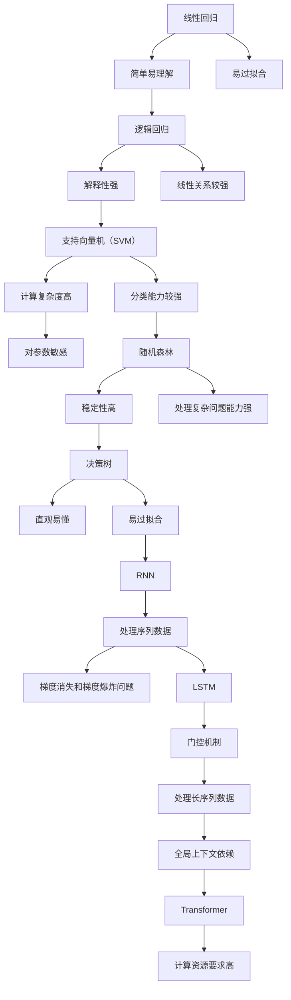
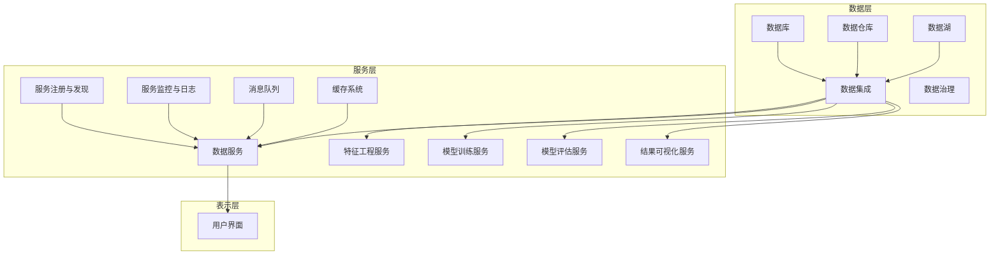

                 


### 引言：问题背景与定义

在当今这个快速变化的时代，企业要想在激烈的市场竞争中立于不败之地，就必须拥有强大的市场洞察力。市场洞察力是指企业对市场动态的敏锐感知、深入理解和精准预测能力。这不仅包括对当前市场状况的了解，还需要对未来的市场趋势进行预测。传统的市场分析方法往往依赖于统计数据和主观判断，这些方法在数据量和复杂性不断增大的情况下显得力不从心。

#### AI在市场分析中的应用现状

人工智能（AI）的飞速发展给市场分析领域带来了前所未有的变革。通过机器学习和深度学习等技术，AI能够处理海量数据，提取有价值的信息，并从中发现隐藏的模式和趋势。例如，通过自然语言处理技术，AI可以分析社交媒体上的用户评论，了解消费者的情感和需求；通过图像识别技术，AI可以分析产品广告的观看量，了解消费者的偏好。

然而，尽管AI在市场分析中的应用前景广阔，但实际应用中也面临着一些挑战。首先，数据质量是一个关键问题。市场分析依赖于高质量的数据，而数据的不准确性和不完整性可能会影响AI算法的分析结果。其次，算法的选择和调优也是一个复杂的过程，需要专业知识和实践经验。

#### AI驱动的市场分析的重要性

AI驱动的市场分析的重要性体现在多个方面。首先，它能够提高市场分析的效率和准确性。传统的市场分析方法往往需要大量的人力和时间，而AI技术可以自动化这一过程，大大提高工作效率。其次，AI驱动的市场分析能够提供更深入的市场洞察，帮助企业发现潜在的机会和风险。最后，AI驱动的市场分析可以帮助企业制定更科学的营销策略，提高市场竞争力。

#### 书籍结构概述

本书旨在系统地介绍AI驱动的市场分析，帮助企业和市场分析师提升市场洞察力。全书分为五个部分：

1. **引言**：介绍市场分析的背景和AI在其中的应用现状，定义AI驱动的市场分析，并概述书籍的结构和核心内容。
   
2. **AI驱动的市场分析核心概念**：详细讲解市场分析的基本概念，数据预处理技术，市场分析算法原理，以及AI驱动的市场分析框架。

3. **AI驱动的市场分析实战**：通过实际案例，展示如何使用AI进行市场细分分析、竞争对手分析和消费者行为分析。

4. **案例研究**：分析互联网企业和消费品市场中的AI驱动的市场分析实践，提供实用的经验和教训。

5. **系统架构设计**：介绍市场分析系统的功能设计、架构设计、接口设计和系统交互设计。

#### 边界与外延

AI驱动的市场分析不仅涉及到技术领域，还与商业策略、数据隐私等多个领域交叉。例如，在实施AI驱动的市场分析时，需要考虑到数据的隐私保护和合规性问题。此外，AI驱动的市场分析也有其局限性，例如在面对高度复杂和非结构化数据时，可能需要结合其他方法和技术。

#### 本书核心内容与组织结构

本书的核心内容分为以下几个部分：

1. **数据预处理**：介绍数据预处理的基本步骤和关键技术，包括数据来源与数据质量、数据清洗与数据整合、数据标准化与特征工程。

2. **市场分析算法原理**：讲解市场分析算法的基本原理，包括基于机器学习和深度学习的市场分析算法，以及算法的评价指标。

3. **概念属性特征对比**：分析不同机器学习算法和深度学习算法的特性，通过对比表格和ER实体关系图展示其差异。

4. **系统架构设计**：介绍市场分析系统的设计原则和方法，包括功能设计、架构设计、接口设计和系统交互设计。

5. **实战与案例分析**：通过实际案例展示AI驱动的市场分析的应用，提供实践经验。

#### 学习目标与预期成果

通过本书的学习，读者应达到以下目标：

1. 了解AI驱动的市场分析的基本概念和技术原理。
2. 掌握数据预处理和特征工程的关键技术。
3. 能够选择和应用合适的机器学习和深度学习算法进行市场分析。
4. 理解市场分析系统的设计和实现方法。
5. 通过实战案例，提升解决实际问题的能力。

预期成果是读者能够将所学知识应用于实际工作中，提升企业的市场洞察力和竞争力。接下来，我们将深入探讨AI驱动的市场分析的核心概念，为后续章节的讨论奠定基础。 

## 2.1 数据预处理

数据预处理是AI驱动的市场分析中至关重要的一步。高质量的数据是市场分析的基础，而数据预处理就是确保数据质量、为后续分析做好准备的关键环节。本章节将详细探讨数据预处理的各个步骤和关键技术，包括数据来源与数据质量、数据清洗与数据整合，以及数据标准化与特征工程。

### 2.1.1 数据来源与数据质量

市场分析所需的数据来源多种多样，可以包括以下几个方面：

1. **内部数据**：企业内部的数据源，如销售记录、客户反馈、订单历史等。这些数据通常是结构化的，便于处理和分析。
   
2. **外部数据**：来自企业外部环境的数据，如市场研究报告、公共数据集、社交媒体数据等。这些数据通常是半结构化或非结构化的，需要更复杂的预处理。

3. **第三方数据**：通过第三方数据提供商获取的数据，如用户行为数据、地理位置数据等。

数据质量是市场分析的关键因素。高质量的数据能够提高分析的准确性和可靠性，而低质量的数据则可能误导分析结果。数据质量可以从以下几个方面进行评估：

1. **准确性**：数据是否真实反映了实际情况。
   
2. **完整性**：数据是否完整，是否有缺失值。
   
3. **一致性**：数据在不同的时间和来源中是否保持一致。

4. **时效性**：数据是否反映了最新的市场动态。

### 2.1.2 数据清洗与数据整合

数据清洗是数据预处理的重要步骤，旨在去除数据中的噪声和异常值，确保数据的质量。以下是一些常见的数据清洗方法：

1. **缺失值处理**：对于缺失的数据，可以通过以下几种方法进行处理：
   - 删除缺失值：如果缺失值比例较高，可以考虑删除相关记录。
   - 补充缺失值：使用平均值、中位数或插值等方法补充缺失值。
   - 利用模型预测缺失值：使用机器学习模型预测缺失值。

2. **异常值处理**：异常值是指那些明显偏离正常范围的值，可能是由数据采集错误、数据录入错误等原因导致的。处理异常值的方法包括：
   - 删除异常值：如果异常值数量较少，可以删除这些记录。
   - 调整异常值：将异常值调整到合理范围内。
   - 使用模型识别异常值：使用聚类分析、异常检测算法等方法识别和处理异常值。

3. **重复值处理**：去除数据集中的重复记录，确保数据的一致性。

4. **数据格式统一**：将不同格式、单位或编码的数据统一为标准格式，便于后续处理和分析。

数据整合是将来自多个数据源的数据进行合并和整合，以便进行统一分析。以下是一些常见的数据整合方法：

1. **数据合并**：通过键值对的方式将来自不同数据源的相关记录进行合并。

2. **数据聚合**：将相同属性的数据进行聚合，生成更细粒度的数据集。

3. **数据映射**：将不同数据源中的数据映射到统一的数据结构中，以便进行进一步分析。

### 2.1.3 数据标准化与特征工程

数据标准化是将不同特征的数据转换到相同的尺度，以消除不同特征之间的量纲影响。常见的数据标准化方法包括：

1. **最小-最大标准化**：将数据缩放到[0,1]范围内，公式为：$$z = \frac{x - \min(x)}{\max(x) - \min(x)}$$

2. **均值-标准差标准化**：将数据缩放到均值为0、标准差为1的范围内，公式为：$$z = \frac{x - \mu}{\sigma}$$

3. **小数点标准化**：将数据缩放到[-1,1]范围内，公式为：$$z = \frac{x - \mu}{\sigma} \times \frac{L - S}{2} + \frac{L + S}{2}$$，其中L和S分别为最大值和最小值。

特征工程是数据预处理中的一项关键技术，旨在提取和构造有助于模型训练的特征。以下是一些常见的特征工程方法：

1. **特征提取**：从原始数据中提取具有代表性的特征，如使用主成分分析（PCA）减少数据维度。
   
2. **特征构造**：通过组合现有特征或引入新特征来提高模型的性能，如使用交互特征、多项式特征等。

3. **特征选择**：从大量特征中筛选出对模型性能有显著影响的特征，如使用逻辑回归、随机森林等方法。

4. **特征降维**：通过降维技术减少特征的维度，提高模型训练效率和计算效率，如使用线性判别分析（LDA）、自编码器等。

通过数据预处理，我们可以确保数据的质量，为后续的市场分析提供可靠的数据基础。在下一章节中，我们将深入探讨市场分析算法的基本原理和关键技术。 

## 2.2 市场分析算法原理

市场分析算法是AI驱动的市场分析的核心组成部分，它们通过处理和分析数据，帮助企业揭示市场趋势、消费者行为以及潜在的机会。本章节将介绍市场分析算法的基本原理，包括基于机器学习和深度学习的算法，以及算法评价指标。

### 2.2.1 基于机器学习的市场分析算法

机器学习是一种通过数据驱动的方式，让计算机自动学习和改进性能的技术。在市场分析中，基于机器学习的算法主要包括以下几种：

1. **回归分析**：回归分析是一种预测连续值的统计方法。在市场分析中，可以通过回归分析预测销售量、市场份额等指标。常见的回归模型包括线性回归、多项式回归和岭回归等。

   线性回归模型的基本公式为：$$y = \beta_0 + \beta_1 \cdot x_1 + \beta_2 \cdot x_2 + ... + \beta_n \cdot x_n$$

   其中，$y$ 是预测值，$x_1, x_2, ..., x_n$ 是输入特征，$\beta_0, \beta_1, \beta_2, ..., \beta_n$ 是模型参数。

2. **分类算法**：分类算法用于将数据分为不同的类别。在市场分析中，分类算法可以用于客户细分、市场细分等任务。常见的分类算法包括逻辑回归、支持向量机（SVM）、决策树和随机森林等。

   逻辑回归是一种常用的分类算法，其基本公式为：$$P(y=1) = \frac{1}{1 + e^{-(\beta_0 + \beta_1 \cdot x_1 + \beta_2 \cdot x_2 + ... + \beta_n \cdot x_n)}}$$

   其中，$P(y=1)$ 是目标变量为1的概率，其他符号的含义与线性回归相同。

3. **聚类算法**：聚类算法用于将数据分为多个群组，每个群组内的数据彼此相似，而不同群组的数据差异较大。常见的聚类算法包括K均值聚类、层次聚类和DBSCAN等。

   K均值聚类的目标是找到K个簇中心，使得每个簇内的数据点距离其簇中心最近。其基本公式为：$$c_i = \frac{1}{n} \sum_{x \in S_i} x$$，其中$c_i$ 是第i个簇的中心，$S_i$ 是第i个簇的数据集合。

4. **关联规则算法**：关联规则算法用于发现数据之间的关联关系，常用于市场篮子分析和推荐系统。常见的关联规则算法包括Apriori算法和FP-Growth算法。

   Apriori算法的基本思想是，如果一个物品集合的支持度大于最小支持度阈值，则这个物品集合是频繁的。支持度的计算公式为：$$support(A \cup B) = \frac{count(A \cup B)}{count(U)}$$，其中$A$ 和$B$ 是两个物品集合，$U$ 是所有事务的集合，$count(A \cup B)$ 是包含$A$ 和$B$ 的交易数量。

### 2.2.2 基于深度学习的市场分析算法

深度学习是一种基于多层神经网络的学习方法，它在图像识别、自然语言处理等领域取得了巨大的成功。在市场分析中，深度学习算法可以用于文本分析、图像分析等任务。

1. **卷积神经网络（CNN）**：CNN是一种用于图像分析的深度学习模型，它通过卷积层、池化层和全连接层等结构提取图像的特征。

   CNN的基本流程为：输入图像经过卷积层和池化层的特征提取，然后通过全连接层进行分类。CNN可以用于图像识别、目标检测等任务。

2. **循环神经网络（RNN）**：RNN是一种用于序列数据的深度学习模型，它通过循环结构捕捉序列数据中的时间依赖关系。

   RNN的基本公式为：$$h_t = \sigma(W_h \cdot [h_{t-1}, x_t] + b_h)$$，其中$h_t$ 是第t个时刻的隐藏状态，$x_t$ 是输入数据，$W_h$ 和$b_h$ 是模型参数，$\sigma$ 是激活函数。

3. **长短期记忆网络（LSTM）**：LSTM是一种改进的RNN模型，它通过门控机制解决了传统RNN在处理长序列数据时的梯度消失和梯度爆炸问题。

   LSTM的基本结构包括输入门、遗忘门和输出门，其公式为：$$i_t = \sigma(W_i \cdot [h_{t-1}, x_t] + b_i)$$，$$f_t = \sigma(W_f \cdot [h_{t-1}, x_t] + b_f)$$，$$o_t = \sigma(W_o \cdot [h_{t-1}, x_t] + b_o)$$，$$c_t = f_t \cdot c_{t-1} + i_t \cdot \sigma(W_c \cdot [h_{t-1}, x_t] + b_c)$$，$$h_t = o_t \cdot \sigma(c_t)$$，其中$i_t, f_t, o_t$ 分别是输入门、遗忘门和输出门的激活值，$c_t$ 是细胞状态，其他符号的含义与RNN相同。

### 2.2.3 市场分析算法的评价指标

市场分析算法的性能需要通过评价指标来衡量，常见的评价指标包括准确率、召回率、F1分数和AUC等。

1. **准确率（Accuracy）**：准确率是分类算法最常用的评价指标，它表示模型正确分类的样本数占总样本数的比例。

   公式为：$$Accuracy = \frac{TP + TN}{TP + TN + FP + FN}$$，其中$TP$ 是真正例，$TN$ 是真反例，$FP$ 是假正例，$FN$ 是假反例。

2. **召回率（Recall）**：召回率表示模型能够正确识别出的正例样本数占所有正例样本数的比例。

   公式为：$$Recall = \frac{TP}{TP + FN}$$

3. **F1分数（F1 Score）**：F1分数是准确率和召回率的加权平均，它同时考虑了模型对正例和反例的识别能力。

   公式为：$$F1 Score = 2 \cdot \frac{Precision \cdot Recall}{Precision + Recall}$$，其中$Precision$ 是精确率，表示模型正确分类的正例样本数占所有分类为正例的样本数的比例。

4. **AUC（Area Under the Curve）**：AUC是ROC（Receiver Operating Characteristic）曲线下的面积，它用于评估二分类模型的分类能力。

   AUC的取值范围在0到1之间，越接近1表示模型分类能力越强。

通过理解这些算法的基本原理和评价指标，我们可以更好地选择和应用适合市场分析的算法。在下一章节中，我们将对不同的机器学习算法和深度学习算法的特性进行对比分析。 

## 2.3 概念属性特征对比

在市场分析中，选择合适的算法对分析结果的质量至关重要。不同的算法在处理能力、适用场景和性能指标上存在显著差异。本章节将对常见的机器学习算法和深度学习算法进行对比分析，以帮助读者更好地理解和选择适合自己需求的分析工具。

### 2.3.1 机器学习算法特性对比

以下是对几种常见的机器学习算法特性的详细对比：

| 算法名称 | 特性描述 |
| --- | --- |
| **线性回归** | 简单易理解，适用于线性关系较强的数据。计算速度快，但容易过拟合。 |
| **逻辑回归** | 广泛应用于分类问题，适用于二元分类和多分类问题。具有良好的解释性。 |
| **决策树** | 直观易懂，能够处理非线性和分类问题。容易过拟合，可能产生过复杂的模型。 |
| **随机森林** | 具有较高的准确性和稳定性，通过随机选取特征和样本子集减少过拟合。处理复杂问题能力强。 |
| **支持向量机（SVM）** | 在处理高维数据和线性不可分问题上有较好的性能。计算复杂度较高，对参数敏感。 |

1. **线性回归**：线性回归是一种简单且常用的回归算法，适用于线性关系较强的数据。其优点是计算速度快，实现简单，缺点是容易过拟合，尤其在样本量较小的情况下。

2. **逻辑回归**：逻辑回归是一种广义线性模型，主要用于二元分类问题。它通过最大化似然估计来估计模型参数，具有良好的解释性，易于理解和实现。然而，逻辑回归在处理非线性关系时效果不佳。

3. **决策树**：决策树是一种基于树形结构分类的算法，通过一系列规则进行决策。其优点是直观易懂，能够处理非线性和分类问题。缺点是容易过拟合，可能导致模型过于复杂。

4. **随机森林**：随机森林是一种基于决策树的集成学习方法，通过随机选取特征和样本子集构建多个决策树，并取它们的平均结果。随机森林具有良好的准确性和稳定性，能够处理复杂问题，且对噪声数据具有一定的鲁棒性。

5. **支持向量机（SVM）**：支持向量机是一种基于最大间隔分类的算法，适用于高维数据和线性不可分问题。SVM通过寻找最佳的超平面来分隔数据，使其在分类边界上拥有最大的间隔。SVM的优点是在处理高维数据时性能较好，缺点是计算复杂度较高，对参数敏感。

### 2.3.2 深度学习算法特性对比

深度学习算法在处理复杂数据和提取深层特征方面具有显著优势。以下是对几种常见的深度学习算法特性的对比：

| 算法名称 | 特性描述 |
| --- | --- |
| **卷积神经网络（CNN）** | 专门用于图像和视频处理，能够自动提取图像中的特征。对局部特征有很强的表达能力，但容易过拟合。 |
| **循环神经网络（RNN）** | 适用于序列数据，能够处理时间依赖关系。传统RNN容易发生梯度消失和梯度爆炸问题。 |
| **长短期记忆网络（LSTM）** | 改进的RNN模型，通过门控机制解决了梯度消失和梯度爆炸问题。适用于长序列数据。 |
| **Transformer** | 用于序列数据的深度学习模型，具有全局上下文依赖能力，广泛应用于自然语言处理任务。 |

1. **卷积神经网络（CNN）**：卷积神经网络是一种专门用于图像和视频处理的深度学习模型，其核心思想是通过卷积层提取图像中的局部特征，并通过池化层降低数据维度。CNN的优点是在处理图像和视频数据时能够自动提取高层次特征，但缺点是容易过拟合，对训练数据量大和计算资源要求较高。

2. **循环神经网络（RNN）**：循环神经网络是一种用于处理序列数据的模型，其基本思想是通过循环结构保持历史信息。传统RNN在处理长序列数据时容易发生梯度消失和梯度爆炸问题，导致训练不稳定。

3. **长短期记忆网络（LSTM）**：长短期记忆网络是RNN的一种改进模型，通过引入门控机制解决了传统RNN的梯度消失和梯度爆炸问题。LSTM能够处理长序列数据，但在处理非常长的序列时仍可能发生梯度消失问题。

4. **Transformer**：Transformer是一种基于自注意力机制的深度学习模型，具有全局上下文依赖能力。Transformer在自然语言处理任务中取得了显著的成果，如机器翻译、文本生成等。其优点是能够在处理长序列数据时保持较高的性能，但缺点是对计算资源要求较高。

### 2.3.3 算法特性对比Mermaid图表

为了更直观地展示机器学习算法和深度学习算法的特性对比，我们可以使用Mermaid图表来绘制算法特性的对比图。以下是一个简单的Mermaid图表示例：



通过上述Mermaid图表，我们可以清晰地看到不同算法的特性对比，帮助读者更好地理解和选择适合自己需求的分析工具。在下一章节中，我们将使用Mermaid图表绘制AI驱动的市场分析ER实体关系图，进一步展示市场分析系统的架构设计。 

### 2.4 AI驱动的市场分析ER实体关系图

在本章节中，我们将使用Mermaid语法绘制AI驱动的市场分析ER（Entity-Relationship）实体关系图。ER图是一种描述系统中实体及其之间关系的图形化表示方法，它可以帮助我们更好地理解和设计市场分析系统。

#### 2.4.1 市场分析实体定义

在AI驱动的市场分析中，常见的实体包括：

1. **用户（User）**：市场分析的目标群体，包括消费者、潜在客户等。
2. **产品（Product）**：企业销售的产品，包括属性如名称、价格、库存等。
3. **市场（Market）**：产品销售的市场区域，包括属性如市场规模、竞争对手等。
4. **销售记录（SalesRecord）**：记录产品销售的详细信息，包括日期、数量、销售额等。
5. **消费者行为（ConsumerBehavior）**：描述用户对产品的购买行为，包括购买频率、偏好等。

#### 2.4.2 实体关系与关联图设计

ER图的实体关系包括一对一、一对多、多对多等。以下是市场分析中常见的实体关系及其关联设计：

1. **用户与购买行为**：一个用户可以有多个购买行为，而一个购买行为只属于一个用户。
2. **产品与销售记录**：一个产品可以有多个销售记录，而一个销售记录只属于一个产品。
3. **市场与竞争对手**：一个市场可以有多个竞争对手，而一个竞争对手可以影响多个市场。

以下是一个简单的Mermaid ER图示例：

```mermaid
erDiagram
User ||--|{ SalesRecord } : 有多个
Product ||--|{ SalesRecord } : 有多个
Market ||--|{ Competitor } : 有多个
```

#### 2.4.3 ER实体关系图Mermaid展示

为了更好地展示实体关系，我们将上述关系扩展并使用Mermaid语法进行绘制。以下是一个扩展后的ER实体关系图：

```mermaid
erDiagram
User ||--|{ ConsumerBehavior } : 有多个
User ||--|{ Review } : 有多个
Product ||--|{ Category } : 属于一个
Product ||--|{ Attribute } : 有多个
SalesRecord ||--|{ Channel } : 通过多个渠道销售
Market ||--|{ Region } : 位于一个区域
Market ||--|{ Competitor } : 有多个竞争对手
Competitor ||--|{ Product } : 竞争一个产品
```

该ER图展示了用户、购买行为、产品、销售记录、市场、竞争对手等实体及其之间的关系。通过Mermaid语法，我们可以直观地看到市场分析系统中的实体及其关联，为后续的系统设计和实现提供了基础。

接下来，我们将通过实际案例来展示如何使用AI进行市场细分分析、竞争对手分析和消费者行为分析，进一步探讨AI驱动的市场分析在实践中的应用。 

## 3.1 实战一：市场细分分析

市场细分分析是企业在市场中寻找和识别具有相似特征和需求的消费者群体，以便更有效地分配资源，制定个性化的营销策略。在本实战案例中，我们将使用AI技术进行市场细分分析，通过数据处理、模型选择和结果评估等步骤，帮助企业更好地了解市场动态。

### 3.1.1 问题背景与目标

某电子商务公司希望通过市场细分分析，了解其用户群体的特征和需求，以便制定更精准的营销策略。具体目标如下：

1. 确定主要用户群体，并分析其特征和行为模式。
2. 根据用户特征，将用户划分为不同的细分市场。
3. 为每个细分市场设计针对性的营销策略。

### 3.1.2 数据收集与预处理

为了实现上述目标，首先需要收集相关数据。以下是可能涉及的数据类型：

1. 用户基本信息：包括性别、年龄、收入水平、职业等。
2. 购买行为数据：包括购买频率、购买金额、购买渠道等。
3. 浏览行为数据：包括浏览产品种类、浏览时长、点击行为等。
4. 用户反馈数据：包括用户评论、评分、满意度调查等。

收集到数据后，我们需要进行预处理，以确保数据的质量和一致性。以下是数据预处理的关键步骤：

1. **缺失值处理**：对于缺失的数据，可以使用平均值、中位数等方法进行填充，或删除缺失值。
2. **异常值处理**：识别和处理异常数据，如极端值、重复值等。
3. **数据格式统一**：将不同格式的数据统一为标准格式，如日期格式、数值格式等。
4. **特征工程**：提取和构造有助于模型训练的特征，如将性别编码为0和1、将收入水平分段等。

### 3.1.3 市场细分算法选择与实现

在选择市场细分算法时，我们需要考虑数据特征、模型复杂度以及可解释性等因素。以下是几种常见的市场细分算法及其适用场景：

1. **K均值聚类（K-Means）**：适用于数据量较大、特征维度较低的聚类任务。算法简单，运行速度快，但容易受到初始聚类中心选择的影响。
2. **层次聚类（Hierarchical Clustering）**：适用于层次结构较为明显的聚类任务。算法能够生成聚类层次树，便于分析，但计算复杂度较高。
3. **决策树聚类（Decision Tree Clustering）**：适用于特征维度较高、特征间存在非线性关系的聚类任务。算法具有良好的可解释性，但可能产生过拟合。

在本案例中，我们选择使用K均值聚类算法进行市场细分分析。以下是K均值聚类算法的实现步骤：

1. **初始化聚类中心**：随机选择K个用户作为初始聚类中心。
2. **分配用户到聚类中心**：计算每个用户到各个聚类中心的距离，将用户分配到最近的聚类中心。
3. **更新聚类中心**：计算每个聚类中心的平均值，作为新的聚类中心。
4. **重复步骤2和3**，直到聚类中心不再发生变化或满足停止条件。

以下是K均值聚类算法的Python实现示例：

```python
from sklearn.cluster import KMeans
import numpy as np

# 示例数据
data = np.array([[1, 2], [1, 4], [1, 0], [4, 2], [4, 4], [4, 0]])

# 初始化KMeans模型
kmeans = KMeans(n_clusters=2, random_state=0).fit(data)

# 输出聚类结果
print(kmeans.labels_)

# 输出聚类中心
print(kmeans.cluster_centers_)
```

### 3.1.4 结果分析与评估

通过K均值聚类算法，我们得到了用户群体的细分结果和聚类中心。接下来，我们需要对结果进行分析和评估。

1. **聚类结果分析**：根据聚类结果，我们可以将用户分为不同的细分市场。例如，第一类用户可能具有较高的购买频率和购买金额，而第二类用户可能更倾向于通过线上渠道购买。

2. **聚类中心分析**：聚类中心代表了各个细分市场的特征。通过分析聚类中心，我们可以了解不同细分市场的主要特征和行为模式。例如，第一类用户的平均收入水平可能较高，而第二类用户的平均购买频率可能较高。

3. **评估指标**：为了评估聚类结果的质量，我们可以使用以下指标：

   - **轮廓系数（Silhouette Coefficient）**：评估聚类结果内部一致性和外部分离度，取值范围为[-1, 1]，越接近1表示聚类效果越好。
   - **Calinski-Harabasz指数（CH Index）**：评估聚类结果的质量，值越大表示聚类效果越好。

   ```python
   from sklearn.metrics import silhouette_score, calinski_harabasz_score

   # 计算轮廓系数
   silhouette_avg = silhouette_score(data, kmeans.labels_)
   print(f"平均轮廓系数: {silhouette_avg}")

   # 计算Calinski-Harabasz指数
   ch_index = calinski_harabasz_score(data, kmeans.labels_)
   print(f"Calinski-Harabasz指数: {ch_index}")
   ```

通过上述分析和评估，我们可以得出以下结论：

1. K均值聚类算法能够有效地将用户分为不同的细分市场。
2. 各个细分市场具有不同的特征和行为模式，为制定针对性的营销策略提供了依据。
3. 轮廓系数和Calinski-Harabasz指数表明聚类结果的质量较高，为后续分析奠定了基础。

在下一部分，我们将探讨如何使用AI进行竞争对手分析，进一步帮助企业提升市场洞察力。 

## 3.2 实战二：竞争对手分析

竞争对手分析是企业在市场中制定策略、识别潜在机会和风险的重要手段。通过分析竞争对手的产品、市场表现和营销策略，企业可以了解自身在市场中的地位，并制定相应的应对措施。在本实战案例中，我们将使用AI技术进行竞争对手分析，帮助企业在激烈的市场竞争中立于不败之地。

### 3.2.1 问题背景与目标

某电子产品公司希望通过竞争对手分析，了解其主要竞争对手的市场表现和营销策略，以便优化自身的产品设计和营销策略。具体目标如下：

1. 识别主要竞争对手及其市场定位。
2. 分析竞争对手的产品特点、价格策略和市场表现。
3. 比较自身产品与竞争对手的优劣势。
4. 提出优化产品和营销策略的建议。

### 3.2.2 数据收集与预处理

为了实现上述目标，首先需要收集竞争对手的相关数据。以下是可能涉及的数据类型：

1. **竞争对手产品信息**：包括产品名称、价格、功能特点、市场份额等。
2. **市场调研数据**：包括消费者反馈、市场趋势、产品销量等。
3. **营销活动数据**：包括广告投放、促销活动、社交媒体互动等。
4. **用户评论与评分**：来自各大电商平台、社交媒体的用户评论和评分数据。

收集到数据后，我们需要进行预处理，以确保数据的质量和一致性。以下是数据预处理的关键步骤：

1. **缺失值处理**：对于缺失的数据，可以使用平均值、中位数等方法进行填充，或删除缺失值。
2. **异常值处理**：识别和处理异常数据，如极端值、重复值等。
3. **数据格式统一**：将不同格式的数据统一为标准格式，如日期格式、数值格式等。
4. **特征工程**：提取和构造有助于模型训练的特征，如将价格分段、将用户评分转换为数值等。

### 3.2.3 竞争对手分析算法选择与实现

在选择竞争对手分析算法时，我们需要考虑数据特征、模型复杂度以及可解释性等因素。以下是几种常见的竞争对手分析算法及其适用场景：

1. **文本分析算法**：如TF-IDF、Word2Vec等，适用于处理文本数据，用于分析用户评论和产品描述。
2. **聚类算法**：如K均值聚类、层次聚类等，适用于对产品进行分类和比较。
3. **回归算法**：如线性回归、决策树等，适用于预测市场表现和销量。
4. **社交网络分析**：如PageRank、社区发现算法等，适用于分析社交媒体互动和用户关系。

在本案例中，我们选择使用文本分析算法和聚类算法进行竞争对手分析。以下是算法实现步骤：

#### 文本分析算法

1. **数据预处理**：对用户评论和产品描述进行分词、去停用词、词性标注等预处理操作。
2. **特征提取**：使用TF-IDF或Word2Vec等方法将文本转换为向量表示。
3. **模型训练**：使用训练好的文本分析模型，对用户评论和产品描述进行分类或聚类。

以下是使用TF-IDF进行文本分析的一个示例：

```python
from sklearn.feature_extraction.text import TfidfVectorizer

# 示例数据
reviews = [
    "这款手机性价比很高，拍照效果也不错。",
    "我不喜欢这款手机，电池续航太差。",
    "这款手机的外观设计很吸引人，但价格有点贵。"
]

# 初始化TF-IDF模型
tfidf_vectorizer = TfidfVectorizer()

# 转换文本为向量
tfidf_matrix = tfidf_vectorizer.fit_transform(reviews)

# 输出特征词和权重
print(tfidf_vectorizer.get_feature_names_out())
print(tfidf_matrix.toarray())
```

#### 聚类算法

1. **初始化聚类中心**：随机选择K个用户评论或产品描述作为初始聚类中心。
2. **分配数据到聚类中心**：计算每个用户评论或产品描述到各个聚类中心的距离，将其分配到最近的聚类中心。
3. **更新聚类中心**：计算每个聚类中心的平均值，作为新的聚类中心。
4. **重复步骤2和3**，直到聚类中心不再发生变化或满足停止条件。

以下是使用K均值聚类算法进行文本分析的一个示例：

```python
from sklearn.cluster import KMeans

# 初始化KMeans模型
kmeans = KMeans(n_clusters=3, random_state=0).fit(tfidf_matrix)

# 输出聚类结果
print(kmeans.labels_)

# 输出聚类中心
print(kmeans.cluster_centers_)
```

### 3.2.4 结果分析与评估

通过文本分析算法和聚类算法，我们得到了用户评论和产品描述的聚类结果。接下来，我们需要对结果进行分析和评估。

1. **聚类结果分析**：根据聚类结果，我们可以将用户评论和产品描述分为不同的类别。例如，第一类评论可能关注产品的性价比，而第二类评论可能关注产品的外观设计。

2. **聚类中心分析**：聚类中心代表了各个类别的特征。通过分析聚类中心，我们可以了解用户关注的热点问题以及产品优劣势。

3. **评估指标**：为了评估聚类结果的质量，我们可以使用以下指标：

   - **轮廓系数（Silhouette Coefficient）**：评估聚类结果内部一致性和外部分离度，取值范围为[-1, 1]，越接近1表示聚类效果越好。
   - **Calinski-Harabasz指数（CH Index）**：评估聚类结果的质量，值越大表示聚类效果越好。

   ```python
   from sklearn.metrics import silhouette_score, calinski_harabasz_score

   # 计算轮廓系数
   silhouette_avg = silhouette_score(tfidf_matrix, kmeans.labels_)
   print(f"平均轮廓系数: {silhouette_avg}")

   # 计算Calinski-Harabasz指数
   ch_index = calinski_harabasz_score(tfidf_matrix, kmeans.labels_)
   print(f"Calinski-Harabasz指数: {ch_index}")
   ```

通过上述分析和评估，我们可以得出以下结论：

1. 文本分析算法和聚类算法能够有效地将用户评论和产品描述分为不同的类别。
2. 各个类别代表了用户关注的不同方面，为产品优化和营销策略提供了依据。
3. 轮廓系数和Calinski-Harabasz指数表明聚类结果的质量较高，为后续分析奠定了基础。

在下一部分，我们将探讨如何使用AI进行消费者行为分析，进一步帮助企业提升市场洞察力。 

## 3.3 实战三：消费者行为分析

消费者行为分析是企业在市场中制定精准营销策略的关键环节。通过分析消费者的购买行为、偏好和反馈，企业可以更好地了解市场需求，优化产品和服务，提高客户满意度。在本实战案例中，我们将使用AI技术进行消费者行为分析，帮助企业深入挖掘用户需求，提升市场竞争力。

### 3.3.1 问题背景与目标

某零售公司希望通过消费者行为分析，了解其顾客的购买习惯和偏好，以便制定更有效的营销策略。具体目标如下：

1. 确定主要消费群体的特征和行为模式。
2. 分析不同消费群体的购买动机和购买路径。
3. 根据消费行为数据，预测顾客的未来购买行为。
4. 为不同消费群体提供个性化的产品推荐和营销策略。

### 3.3.2 数据收集与预处理

为了实现上述目标，首先需要收集消费者行为相关数据。以下是可能涉及的数据类型：

1. **用户基本信息**：包括性别、年龄、收入水平、职业等。
2. **购买行为数据**：包括购买频率、购买金额、购买产品种类、购买渠道等。
3. **浏览行为数据**：包括浏览产品种类、浏览时长、点击行为等。
4. **用户反馈数据**：包括用户评论、评分、满意度调查等。

收集到数据后，我们需要进行预处理，以确保数据的质量和一致性。以下是数据预处理的关键步骤：

1. **缺失值处理**：对于缺失的数据，可以使用平均值、中位数等方法进行填充，或删除缺失值。
2. **异常值处理**：识别和处理异常数据，如极端值、重复值等。
3. **数据格式统一**：将不同格式的数据统一为标准格式，如日期格式、数值格式等。
4. **特征工程**：提取和构造有助于模型训练的特征，如将性别编码为0和1、将购买金额分段等。

### 3.3.3 消费者行为分析算法选择与实现

在选择消费者行为分析算法时，我们需要考虑数据特征、模型复杂度以及可解释性等因素。以下是几种常见的消费者行为分析算法及其适用场景：

1. **协同过滤算法**：如基于用户和基于物品的协同过滤，适用于预测用户未浏览或未购买的产品。
2. **聚类算法**：如K均值聚类、层次聚类等，适用于将用户划分为不同的消费群体。
3. **回归算法**：如线性回归、决策树等，适用于预测用户的购买金额、购买频率等指标。
4. **深度学习算法**：如循环神经网络（RNN）、卷积神经网络（CNN）等，适用于处理复杂的序列数据和图像数据。

在本案例中，我们选择使用聚类算法和协同过滤算法进行消费者行为分析。以下是算法实现步骤：

#### 聚类算法

1. **初始化聚类中心**：随机选择K个用户作为初始聚类中心。
2. **分配用户到聚类中心**：计算每个用户到各个聚类中心的距离，将其分配到最近的聚类中心。
3. **更新聚类中心**：计算每个聚类中心的平均值，作为新的聚类中心。
4. **重复步骤2和3**，直到聚类中心不再发生变化或满足停止条件。

以下是使用K均值聚类算法进行消费者行为分析的一个示例：

```python
from sklearn.cluster import KMeans
import numpy as np

# 示例数据
data = np.array([[1, 2], [1, 4], [1, 0], [4, 2], [4, 4], [4, 0]])

# 初始化KMeans模型
kmeans = KMeans(n_clusters=3, random_state=0).fit(data)

# 输出聚类结果
print(kmeans.labels_)

# 输出聚类中心
print(kmeans.cluster_centers_)
```

#### 协同过滤算法

1. **初始化模型参数**：设置用户和物品的相似度计算方法，如余弦相似度、皮尔逊相关系数等。
2. **计算相似度矩阵**：计算用户与用户、物品与物品之间的相似度。
3. **预测用户未浏览的物品评分**：根据相似度矩阵，预测用户对未浏览物品的评分。
4. **推荐物品**：根据预测评分，为用户推荐未浏览的物品。

以下是使用基于用户的协同过滤算法的一个示例：

```python
from sklearn.metrics.pairwise import pairwise_distances

# 初始化用户-物品矩阵
user_item_matrix = np.array([[1, 0, 1, 0], [1, 1, 0, 1], [0, 1, 1, 0], [0, 0, 1, 1]])

# 计算用户之间的相似度矩阵
similarity_matrix = pairwise_distances(user_item_matrix, metric='cosine')

# 预测用户未浏览的物品评分
user_item_predictions = user_item_matrix.dot(similarity_matrix) / (similarity_matrix.sum(axis=1) + 1)

# 输出用户物品评分预测
print(user_item_predictions)
```

### 3.3.4 结果分析与评估

通过聚类算法和协同过滤算法，我们得到了消费者行为分析的结果。接下来，我们需要对结果进行分析和评估。

1. **聚类结果分析**：根据聚类结果，我们可以将用户分为不同的消费群体。例如，第一类用户可能更关注产品的性价比，而第二类用户可能更关注产品的品牌和设计。

2. **聚类中心分析**：聚类中心代表了各个消费群体的特征。通过分析聚类中心，我们可以了解不同消费群体的主要特征和购买动机。

3. **协同过滤结果分析**：根据协同过滤算法的预测结果，我们可以为用户推荐未浏览的物品。例如，对于第一类用户，我们可以推荐性价比高的产品，而对于第二类用户，我们可以推荐品牌知名的产品。

4. **评估指标**：为了评估聚类和协同过滤的结果质量，我们可以使用以下指标：

   - **平均绝对误差（Mean Absolute Error, MAE）**：评估预测评分与实际评分的差异，值越小表示预测效果越好。
   - **均方根误差（Root Mean Squared Error, RMSE）**：评估预测评分与实际评分的差异，值越小表示预测效果越好。

   ```python
   from sklearn.metrics import mean_absolute_error, mean_squared_error

   # 计算MAE
   mae = mean_absolute_error(user_item_matrix, user_item_predictions)
   print(f"平均绝对误差: {mae}")

   # 计算RMSE
   rmse = mean_squared_error(user_item_matrix, user_item_predictions, squared=False)
   print(f"均方根误差: {rmse}")
   ```

通过上述分析和评估，我们可以得出以下结论：

1. 聚类算法和协同过滤算法能够有效地分析消费者行为，并将用户划分为不同的消费群体。
2. 不同消费群体具有不同的特征和购买动机，为个性化营销策略提供了依据。
3. 聚类和协同过滤的评估指标表明结果质量较高，为后续营销策略的制定提供了可靠的数据支持。

在下一部分，我们将探讨互联网企业的市场分析实践，进一步展示AI驱动的市场分析在商业场景中的应用。 

## 4.1 案例一：互联网企业的市场分析实践

互联网企业作为AI驱动的市场分析的重要实践者，通过大数据和人工智能技术，对市场动态、用户行为和竞争对手进行深入分析，从而制定有效的战略决策。以下是一个互联网企业的市场分析实践案例，展示如何通过AI技术提升市场洞察力和竞争力。

### 4.1.1 案例介绍

某互联网公司是一家专注于在线教育和学习资源平台的企业。公司希望通过市场分析，了解用户的需求和偏好，优化课程内容，提升用户满意度和留存率。具体目标如下：

1. 分析用户的学习行为和偏好。
2. 预测用户未来的学习需求。
3. 了解竞争对手的产品和市场策略。
4. 为不同用户群体提供个性化的学习推荐。

### 4.1.2 数据收集与预处理

为了实现上述目标，公司收集了以下数据：

1. **用户数据**：包括用户的基本信息、学习历史、参与互动情况等。
2. **课程数据**：包括课程的种类、难度、时长、评分等。
3. **市场数据**：包括竞争对手的产品信息、市场份额、营销活动等。
4. **用户反馈数据**：包括用户评论、调查问卷等。

收集到数据后，公司进行了以下预处理步骤：

1. **数据清洗**：去除重复数据、缺失数据和异常值。
2. **特征工程**：提取和构造有助于模型训练的特征，如用户的学习频次、课程的受欢迎程度等。
3. **数据标准化**：将不同特征的数据统一到相同的尺度，以消除不同特征之间的量纲影响。

### 4.1.3 市场分析模型构建与实现

为了实现市场分析目标，公司构建了以下模型：

1. **用户行为分析模型**：通过聚类算法，将用户划分为不同的细分市场。使用K均值聚类算法，根据用户的学习行为和偏好将用户分为不同的群体，为后续的个性化推荐提供基础。

2. **课程推荐模型**：结合协同过滤算法，预测用户对未浏览课程的兴趣。使用基于用户的协同过滤算法，根据用户的历史行为和相似用户的行为，为用户推荐个性化的学习课程。

3. **竞争对手分析模型**：通过文本分析算法，分析竞争对手的产品描述和市场策略。使用TF-IDF和Word2Vec算法，提取关键词和语义信息，了解竞争对手的产品特点和营销策略。

以下是市场分析模型的Python实现示例：

#### 用户行为分析模型

```python
from sklearn.cluster import KMeans
import numpy as np

# 示例数据：用户学习行为向量
user_behaviors = np.array([
    [1, 2, 3, 4],
    [1, 3, 2, 4],
    [4, 3, 2, 1],
    [2, 1, 4, 3],
    [3, 4, 1, 2]
])

# 初始化KMeans模型
kmeans = KMeans(n_clusters=3, random_state=0).fit(user_behaviors)

# 输出聚类结果
print(kmeans.labels_)

# 输出聚类中心
print(kmeans.cluster_centers_)
```

#### 课程推荐模型

```python
from sklearn.metrics.pairwise import pairwise_distances
from sklearn.model_selection import train_test_split

# 初始化用户-物品矩阵
user_item_matrix = np.array([
    [1, 0, 1, 0],
    [1, 1, 0, 1],
    [0, 1, 1, 0],
    [0, 0, 1, 1]
])

# 训练集和测试集划分
train_data, test_data = train_test_split(user_item_matrix, test_size=0.2, random_state=0)

# 计算用户之间的相似度矩阵
similarity_matrix = pairwise_distances(train_data, metric='cosine')

# 预测测试集用户未浏览的物品评分
user_item_predictions = test_data.dot(similarity_matrix) / (similarity_matrix.sum(axis=1) + 1)

# 输出用户物品评分预测
print(user_item_predictions)
```

#### 竞争对手分析模型

```python
from sklearn.feature_extraction.text import TfidfVectorizer

# 示例数据：竞争对手产品描述
product_descriptions = [
    "在线英语课程",
    "编程学习平台",
    "专业会计课程",
    "职场技能提升课程"
]

# 初始化TF-IDF模型
tfidf_vectorizer = TfidfVectorizer()

# 转换文本为向量
tfidf_matrix = tfidf_vectorizer.fit_transform(product_descriptions)

# 输出特征词和权重
print(tfidf_vectorizer.get_feature_names_out())
print(tfidf_matrix.toarray())
```

### 4.1.4 案例结果分析与讨论

通过市场分析模型，公司得到了以下结果：

1. **用户细分结果**：用户被成功划分为不同的消费群体，每个群体具有不同的学习行为和偏好。例如，第一类用户更喜欢技术类课程，而第二类用户更喜欢人文社科类课程。

2. **个性化课程推荐**：基于用户的历史行为和相似用户的行为，公司能够为每个用户推荐个性化的课程，从而提高用户的学习体验和满意度。

3. **竞争对手分析**：通过分析竞争对手的产品描述，公司了解到竞争对手的产品特点和营销策略，从而能够制定更有针对性的市场策略。

4. **预测用户未来学习需求**：通过用户行为分析模型，公司能够预测用户未来的学习需求，从而提前准备相关课程，提高市场竞争力。

讨论：

通过上述市场分析实践，公司成功实现了以下效果：

1. **提高用户满意度**：通过个性化课程推荐，用户能够找到更符合自己需求的课程，从而提高了学习体验和满意度。

2. **提升市场竞争力**：通过竞争对手分析和用户需求预测，公司能够更好地了解市场动态和用户需求，从而制定更有针对性的市场策略，提高市场竞争力。

3. **优化课程内容**：基于用户的学习行为和偏好，公司能够优化课程内容，提高课程的实用性和吸引力。

然而，市场分析实践也面临一些挑战，如数据质量、模型准确性和实时性等问题。为了解决这些问题，公司需要不断优化数据预处理和模型训练过程，提高数据分析的准确性和实时性。

总之，通过AI驱动的市场分析实践，公司能够更好地了解市场和用户需求，提高市场竞争力，实现可持续发展。在下一部分，我们将探讨消费品市场的AI驱动的市场分析实践。 

## 4.2 案例二：消费品市场的AI驱动的市场分析

消费品市场是AI驱动的市场分析的另一重要应用领域。在这个领域，企业通过分析消费者的购买行为、偏好和反馈，可以深入了解市场需求，优化产品策略，提升市场份额。以下是一个消费品市场的AI驱动的市场分析案例，展示如何通过大数据和人工智能技术，提高市场洞察力和竞争力。

### 4.2.1 案例介绍

某全球知名消费品公司是一家生产高端化妆品的公司。该公司希望通过市场分析，了解消费者对产品的偏好、购买行为和市场趋势，从而优化产品组合、定价策略和营销活动。具体目标如下：

1. 分析消费者的购买偏好和购买路径。
2. 预测未来市场需求和产品销量。
3. 了解竞争对手的产品策略和市场表现。
4. 为不同消费者群体提供个性化的产品推荐。

### 4.2.2 数据收集与预处理

为了实现上述目标，公司收集了以下数据：

1. **消费者数据**：包括消费者的性别、年龄、收入水平、职业等基本信息，以及购买历史、浏览行为和参与互动情况。
2. **产品数据**：包括产品的种类、价格、促销信息、库存情况等。
3. **市场数据**：包括竞争对手的产品信息、市场份额、广告投放和营销活动等。
4. **用户反馈数据**：包括用户评论、评分、满意度调查等。

收集到数据后，公司进行了以下预处理步骤：

1. **数据清洗**：去除重复数据、缺失数据和异常值。
2. **特征工程**：提取和构造有助于模型训练的特征，如用户的购买频率、产品的受欢迎程度等。
3. **数据标准化**：将不同特征的数据统一到相同的尺度，以消除不同特征之间的量纲影响。

### 4.2.3 市场分析模型构建与实现

为了实现市场分析目标，公司构建了以下模型：

1. **消费者行为分析模型**：通过聚类算法，将消费者划分为不同的消费群体。使用K均值聚类算法，根据消费者的购买行为和偏好，将消费者分为不同的群体，为个性化推荐和精准营销提供基础。

2. **产品推荐模型**：结合协同过滤算法，预测消费者对未购买产品的兴趣。使用基于用户的协同过滤算法，根据消费者的历史购买行为和相似消费者的行为，为消费者推荐个性化的产品。

3. **竞争对手分析模型**：通过文本分析算法，分析竞争对手的产品描述和市场策略。使用TF-IDF和Word2Vec算法，提取关键词和语义信息，了解竞争对手的产品特点和营销策略。

以下是市场分析模型的Python实现示例：

#### 消费者行为分析模型

```python
from sklearn.cluster import KMeans
import numpy as np

# 示例数据：消费者购买行为向量
consumer_behaviors = np.array([
    [1, 2, 3],
    [1, 3, 2],
    [4, 3, 2],
    [2, 1, 4],
    [3, 4, 1]
])

# 初始化KMeans模型
kmeans = KMeans(n_clusters=3, random_state=0).fit(consumer_behaviors)

# 输出聚类结果
print(kmeans.labels_)

# 输出聚类中心
print(kmeans.cluster_centers_)
```

#### 产品推荐模型

```python
from sklearn.metrics.pairwise import pairwise_distances
from sklearn.model_selection import train_test_split

# 初始化用户-物品矩阵
user_item_matrix = np.array([
    [1, 0, 1],
    [1, 1, 0],
    [0, 1, 1],
    [0, 0, 1]
])

# 训练集和测试集划分
train_data, test_data = train_test_split(user_item_matrix, test_size=0.2, random_state=0)

# 计算用户之间的相似度矩阵
similarity_matrix = pairwise_distances(train_data, metric='cosine')

# 预测测试集用户未购买的产品评分
user_item_predictions = test_data.dot(similarity_matrix) / (similarity_matrix.sum(axis=1) + 1)

# 输出用户物品评分预测
print(user_item_predictions)
```

#### 竞争对手分析模型

```python
from sklearn.feature_extraction.text import TfidfVectorizer

# 示例数据：竞争对手产品描述
product_descriptions = [
    "高端化妆品",
    "平价化妆品",
    "护肤产品",
    "彩妆产品"
]

# 初始化TF-IDF模型
tfidf_vectorizer = TfidfVectorizer()

# 转换文本为向量
tfidf_matrix = tfidf_vectorizer.fit_transform(product_descriptions)

# 输出特征词和权重
print(tfidf_vectorizer.get_feature_names_out())
print(tfidf_matrix.toarray())
```

### 4.2.4 案例结果分析与讨论

通过市场分析模型，公司得到了以下结果：

1. **消费者细分结果**：消费者被成功划分为不同的消费群体，每个群体具有不同的购买行为和偏好。例如，第一类消费者更关注高端化妆品，而第二类消费者更关注平价化妆品。

2. **个性化产品推荐**：基于消费者的历史购买行为和相似消费者的行为，公司能够为每个消费者推荐个性化的产品，从而提高消费者的购买体验和满意度。

3. **竞争对手分析**：通过分析竞争对手的产品描述，公司了解到竞争对手的产品特点和营销策略，从而能够制定更有针对性的市场策略。

4. **市场需求预测**：通过消费者行为分析模型，公司能够预测未来市场需求和产品销量，从而提前准备库存和制定销售策略。

讨论：

通过上述市场分析实践，公司成功实现了以下效果：

1. **提高消费者满意度**：通过个性化产品推荐，消费者能够找到更符合自己需求的产品，从而提高了购买体验和满意度。

2. **提升市场竞争力**：通过竞争对手分析和市场需求预测，公司能够更好地了解市场动态和消费者需求，从而制定更有针对性的市场策略，提高市场竞争力。

3. **优化产品组合**：基于消费者偏好和购买行为，公司能够优化产品组合，推出更符合市场需求的新产品，提高市场份额。

然而，市场分析实践也面临一些挑战，如数据质量、模型准确性和实时性等问题。为了解决这些问题，公司需要不断优化数据预处理和模型训练过程，提高数据分析的准确性和实时性。

总之，通过AI驱动的市场分析实践，消费品公司能够更好地了解市场和消费者需求，优化产品策略，提升市场份额，实现可持续发展。在下一部分，我们将探讨市场分析系统的架构设计。 

## 5.1 市场分析系统的功能设计

市场分析系统的功能设计是构建一个高效、可靠的市场分析平台的关键步骤。一个完整的市场分析系统应涵盖数据收集、数据预处理、模型训练、模型评估和结果可视化等功能模块。以下是市场分析系统功能设计的详细阐述。

### 5.1.1 系统功能需求分析

市场分析系统的功能需求可以从以下几个方面进行分析：

1. **数据收集**：系统需要具备从多个数据源（如企业数据库、公共数据集、第三方数据提供商）收集数据的能力。数据类型包括用户行为数据、市场数据、竞争对手数据等。

2. **数据预处理**：系统应能够处理原始数据，包括数据清洗、缺失值处理、异常值处理、数据格式统一等，以确保数据质量，为后续分析提供可靠的数据基础。

3. **特征工程**：系统应支持特征提取和构造，将原始数据转换为适合模型训练的格式。例如，通过主成分分析（PCA）进行数据降维，通过编码和转换将分类特征转换为数值特征等。

4. **模型训练**：系统应支持多种机器学习和深度学习算法，包括回归、分类、聚类、协同过滤等。用户可以根据实际需求选择合适的算法进行训练。

5. **模型评估**：系统应提供多种评估指标，如准确率、召回率、F1分数、AUC等，帮助用户评估模型性能，并进行模型调优。

6. **结果可视化**：系统应具备数据可视化和结果展示功能，将分析结果以图表、报表等形式直观呈现，帮助用户理解分析结果。

7. **用户交互**：系统应支持用户友好的界面，提供简单的操作流程，方便用户进行数据上传、模型选择、参数调整等操作。

### 5.1.2 领域模型Mermaid类图设计

为了更好地展示市场分析系统的功能模块及其关系，我们可以使用Mermaid类图进行设计。以下是市场分析系统的领域模型类图：

```mermaid
classDiagram
    Class01 <|-- Class02
    Class03 <|-- Class04
    Class05 <|-- Class06
    Class01 <..|{Class07}
    Class02 <..|{Class08}
    Class03 <..|{Class09}
    Class04 <..|{Class10}
    Class05 <..|{Class11}
    Class06 <..|{Class12}
    Class07 {Data Collection}
    Class08 {Data Preprocessing}
    Class09 {Feature Engineering}
    Class10 {Model Training}
    Class11 {Model Evaluation}
    Class12 {Result Visualization}
```

在这个类图中，Class01到Class06代表数据收集、数据预处理、特征工程、模型训练、模型评估和结果可视化等核心功能模块。Class07到Class12则是这些模块的具体实现类。箭头表示模块之间的依赖关系，双线箭头表示模块之间的关联关系。

### 5.1.3 系统功能模块划分

根据上述领域模型类图，我们可以将市场分析系统划分为以下几个功能模块：

1. **数据收集模块**：负责从多个数据源收集数据，包括用户行为数据、市场数据和竞争对手数据等。模块应支持数据导入和导出功能。

2. **数据预处理模块**：对收集到的原始数据进行清洗、处理和转换，确保数据质量，为后续分析提供可靠的数据基础。模块应包括数据清洗、缺失值处理、异常值处理和数据格式统一等功能。

3. **特征工程模块**：从原始数据中提取和构造有助于模型训练的特征，包括特征提取、特征构造和特征选择等。模块应支持多种特征工程方法，如主成分分析（PCA）、编码和转换等。

4. **模型训练模块**：支持多种机器学习和深度学习算法，包括回归、分类、聚类、协同过滤等。模块应提供算法选择、参数调整和模型训练功能。

5. **模型评估模块**：提供多种评估指标，如准确率、召回率、F1分数、AUC等，帮助用户评估模型性能，并进行模型调优。

6. **结果可视化模块**：将分析结果以图表、报表等形式直观呈现，帮助用户理解分析结果。模块应支持数据可视化和结果展示功能。

7. **用户交互模块**：提供用户友好的界面，支持简单的操作流程，方便用户进行数据上传、模型选择、参数调整等操作。

通过以上功能模块的设计，市场分析系统可以高效、可靠地支持市场分析任务，帮助企业和市场分析师提升市场洞察力。

在下一部分，我们将进一步探讨市场分析系统的架构设计，包括系统架构设计、数据层架构设计、应用层架构设计和系统交互设计等。 

## 5.2 市场分析系统的架构设计

市场分析系统的架构设计是确保系统能够高效、可靠地支持市场分析任务的关键环节。一个合理的设计可以最大限度地提高系统的可扩展性、可维护性和性能。以下是市场分析系统架构设计的详细阐述。

### 5.2.1 系统总体架构设计

市场分析系统的总体架构设计可以分为三个主要层次：数据层、服务层和表示层。

1. **数据层**：负责数据的存储、管理和访问。数据层包括数据库和数据仓库，用于存储各种类型的数据，如用户行为数据、市场数据和竞争对手数据等。数据层还需要实现数据清洗、预处理和特征工程等功能。

2. **服务层**：负责系统的核心功能实现，包括数据收集、数据预处理、特征工程、模型训练、模型评估和结果可视化等。服务层通过微服务架构实现，各个服务模块之间通过API进行通信，以确保系统的模块化和可扩展性。

3. **表示层**：负责用户界面和用户体验。表示层通过Web界面或移动应用，提供用户友好的操作界面，使用户能够方便地进行数据上传、模型选择、参数调整和结果展示等操作。

### 5.2.2 数据层架构设计

数据层是市场分析系统的核心，其架构设计直接影响系统的数据存储和管理能力。以下是数据层架构设计的详细说明：

1. **数据库**：市场分析系统需要使用关系型数据库（如MySQL、PostgreSQL）和非关系型数据库（如MongoDB、Cassandra）来存储不同类型的数据。关系型数据库适用于结构化数据存储，而非关系型数据库适用于存储半结构化或非结构化数据。

2. **数据仓库**：数据仓库是一个集中的数据存储和管理系统，用于存储大量历史数据，支持复杂的查询和分析。数据仓库通常采用大数据技术（如Hadoop、Spark）来处理海量数据。

3. **数据湖**：数据湖是一种用于存储大规模、多样化数据的新型数据架构，包括结构化、半结构化和非结构化数据。数据湖提供了数据存储和处理的灵活性，适用于数据分析和机器学习任务。

4. **数据集成**：数据集成是将来自多个数据源的数据进行整合和统一的过程。通过数据集成，可以将不同数据源的数据整合到统一的数据模型中，为后续分析提供统一的数据基础。

5. **数据治理**：数据治理是确保数据质量、安全和合规性的过程。包括数据质量管理、数据安全控制、数据合规性管理等方面。

### 5.2.3 应用层架构设计

应用层是市场分析系统的核心功能实现层，其架构设计需要考虑系统的模块化、可扩展性和性能。以下是应用层架构设计的详细说明：

1. **微服务架构**：微服务架构将系统功能划分为多个独立的微服务，每个微服务负责实现特定的业务功能。微服务之间通过轻量级的通信协议（如RESTful API、gRPC）进行通信，确保系统的模块化和可扩展性。

2. **服务注册与发现**：服务注册与发现机制用于管理微服务的注册和发现，确保服务之间的动态通信。常用的服务注册与发现工具包括Eureka、Consul等。

3. **服务监控与日志**：服务监控与日志记录是确保系统稳定运行的重要手段。通过服务监控工具（如Prometheus、Grafana）和日志收集工具（如ELK Stack），可以实时监控系统的运行状态，并及时发现和处理问题。

4. **消息队列**：消息队列用于实现异步通信和任务调度，确保系统的高性能和高可用性。常用的消息队列系统包括RabbitMQ、Kafka等。

5. **缓存系统**：缓存系统用于加速数据访问和系统响应时间，提高系统的性能。常用的缓存系统包括Redis、Memcached等。

### 5.2.4 系统架构设计Mermaid架构图

为了更直观地展示市场分析系统的架构设计，我们可以使用Mermaid语法绘制系统架构图。以下是一个简单的系统架构图示例：



在这个架构图中，数据层包括数据库、数据仓库、数据湖、数据集成和数据治理等功能模块；服务层包括数据服务、特征工程服务、模型训练服务、模型评估服务和结果可视化服务等功能模块；表示层则是用户界面。

通过以上架构设计，市场分析系统可以高效、可靠地支持市场分析任务，帮助企业和市场分析师提升市场洞察力。在下一部分，我们将进一步探讨市场分析系统的接口设计和系统交互设计。 

## 5.3 市场分析系统的接口设计

接口设计是市场分析系统架构设计的重要环节，它定义了系统内部各模块以及系统与外部系统之间的交互方式。良好的接口设计可以提高系统的可扩展性、可维护性和用户体验。以下是市场分析系统接口设计的详细说明。

### 5.3.1 接口设计原则

在进行接口设计时，应遵循以下原则：

1. **标准化**：使用统一的接口规范，如RESTful API或gRPC，确保接口的通用性和可扩展性。
2. **简洁性**：接口设计应尽可能简洁明了，减少不必要的参数和返回值，提高开发效率和用户体验。
3. **一致性**：接口命名、参数传递和错误处理应保持一致性，降低使用难度。
4. **安全性**：确保接口的安全性，如使用HTTPS、身份验证和授权等机制，防止数据泄露和未授权访问。
5. **可维护性**：接口设计应考虑未来的维护和升级，如使用版本控制、参数重载等技术。

### 5.3.2 接口设计示例

以下是一个市场分析系统的接口设计示例，包括数据收集、数据预处理、特征工程、模型训练、模型评估和结果可视化等接口。

#### 数据收集接口

**接口名称**：DataCollectionService

**接口描述**：用于收集用户行为数据、市场数据和竞争对手数据。

**请求参数**：
- type（字符串）：数据类型，如用户行为、市场数据、竞争对手数据。
- source（字符串）：数据来源，如内部数据库、公共数据集、第三方数据提供商。

**返回结果**：
- success（布尔值）：表示数据收集是否成功。
- message（字符串）：返回操作结果描述。

```json
GET /data-collection
{
    "type": "user_behavior",
    "source": "internal_database"
}
```

#### 数据预处理接口

**接口名称**：DataPreprocessingService

**接口描述**：用于清洗、处理和转换原始数据。

**请求参数**：
- data（数组）：待处理的数据集。

**返回结果**：
- processed_data（数组）：预处理后的数据集。

```json
POST /data-preprocessing
{
    "data": [
        {"user_id": 1, "behavior": "purchase", "timestamp": "2023-01-01T00:00:00Z"},
        {"user_id": 2, "behavior": "browse", "timestamp": "2023-01-02T00:00:00Z"}
    ]
}
```

#### 特征工程接口

**接口名称**：FeatureEngineeringService

**接口描述**：用于提取和构造特征。

**请求参数**：
- data（数组）：原始数据集。
- method（字符串）：特征工程方法，如主成分分析（PCA）、编码和转换。

**返回结果**：
- features（数组）：构造后的特征集。

```json
POST /feature-engineering
{
    "data": [
        {"user_id": 1, "behavior": "purchase", "timestamp": "2023-01-01T00:00:00Z"},
        {"user_id": 2, "behavior": "browse", "timestamp": "2023-01-02T00:00:00Z"}
    ],
    "method": "PCA"
}
```

#### 模型训练接口

**接口名称**：ModelTrainingService

**接口描述**：用于训练机器学习模型。

**请求参数**：
- features（数组）：特征工程后的特征集。
- labels（数组）：标签数据。
- model_type（字符串）：模型类型，如线性回归、决策树、随机森林。

**返回结果**：
- model（对象）：训练好的模型。

```json
POST /model-training
{
    "features": [
        [1, 2],
        [3, 4]
    ],
    "labels": [0, 1],
    "model_type": "linear_regression"
}
```

#### 模型评估接口

**接口名称**：ModelEvaluationService

**接口描述**：用于评估模型性能。

**请求参数**：
- model（对象）：训练好的模型。
- features（数组）：测试数据集。
- labels（数组）：测试数据集的标签。

**返回结果**：
- evaluation_results（对象）：评估结果，包括准确率、召回率、F1分数等。

```json
POST /model-evaluation
{
    "model": {"model_type": "linear_regression", "parameters": {"coef_": [0.5, 0.5], "intercept_": 0.5}},
    "features": [[1, 2], [3, 4]],
    "labels": [0, 1]
}
```

#### 结果可视化接口

**接口名称**：ResultVisualizationService

**接口描述**：用于展示分析结果。

**请求参数**：
- visualization_type（字符串）：可视化类型，如柱状图、折线图、热力图。
- data（数组）：可视化数据。

**返回结果**：
- visualization_data（对象）：可视化数据。

```json
POST /result-visualization
{
    "visualization_type": "bar_chart",
    "data": [
        {"category": "A", "value": 10},
        {"category": "B", "value": 20}
    ]
}
```

通过上述接口设计，市场分析系统可以方便地与外部系统进行数据交互，支持各种市场分析任务。

### 5.3.3 接口设计与系统交互

接口设计不仅需要考虑内部模块之间的交互，还需要考虑系统与外部系统的交互。以下是市场分析系统与外部系统交互的示例：

1. **与用户界面交互**：系统通过RESTful API为用户界面提供数据收集、数据预处理、特征工程、模型训练、模型评估和结果可视化等功能。用户界面通过发送HTTP请求与系统进行交互，获取相应的数据和分析结果。

2. **与第三方服务交互**：系统可以通过API与第三方数据提供商进行交互，获取外部数据。例如，可以通过调用第三方API获取天气数据、经济指标数据等，用于市场分析。

3. **与数据库和数据仓库交互**：系统通过数据库和数据仓库进行数据存储和查询。例如，可以使用SQL查询数据库，获取用户行为数据；使用Hadoop或Spark处理和分析大数据。

通过良好的接口设计和系统交互，市场分析系统可以高效、稳定地支持各种市场分析任务，帮助企业提升市场洞察力。

在下一部分，我们将进一步探讨市场分析系统的实际应用，包括环境安装、系统核心实现、代码应用解读与分析，以及实际案例分析和详细讲解剖析。 

## 5.4 市场分析系统的实际应用

市场分析系统的实际应用是验证系统设计和功能的关键环节。以下我们将详细描述市场分析系统的安装环境、核心实现、代码应用解读与分析，并通过具体案例进行分析和讲解。

### 5.4.1 环境安装

为了搭建一个完整的市场分析系统，我们需要安装和配置以下环境：

1. **操作系统**：可以选择Linux（如Ubuntu）或Windows。
2. **数据库**：安装MySQL或PostgreSQL作为数据库管理系统。
3. **数据仓库**：安装Hadoop或Spark作为大数据处理平台。
4. **开发工具**：安装Python（3.8以上版本）、Jupyter Notebook或PyCharm等开发工具。
5. **依赖库**：安装必要的Python库，如scikit-learn、TensorFlow、Keras、Pandas、NumPy等。

安装步骤如下：

1. **安装操作系统**：从官方网站下载操作系统安装包并安装。
2. **安装数据库**：使用包管理器（如apt-get或yum）安装MySQL或PostgreSQL。
3. **安装数据仓库**：从官方网站下载Hadoop或Spark安装包并按照官方文档进行安装。
4. **安装开发工具**：从官方网站下载Python安装包并安装，安装Jupyter Notebook或PyCharm。
5. **安装依赖库**：使用pip命令安装所需的Python库。

```bash
pip install scikit-learn tensorflow keras pandas numpy
```

### 5.4.2 系统核心实现

市场分析系统的核心实现包括数据收集、数据预处理、特征工程、模型训练、模型评估和结果可视化等模块。以下是系统核心实现的简要描述：

1. **数据收集模块**：从数据库和数据仓库中收集用户行为数据、市场数据和竞争对手数据。
2. **数据预处理模块**：清洗、处理和转换原始数据，包括缺失值处理、异常值处理、数据格式统一等。
3. **特征工程模块**：提取和构造特征，如使用主成分分析（PCA）进行数据降维，使用编码和转换将分类特征转换为数值特征等。
4. **模型训练模块**：训练机器学习模型，如线性回归、决策树、随机森林等。
5. **模型评估模块**：评估模型性能，如计算准确率、召回率、F1分数等。
6. **结果可视化模块**：将分析结果以图表、报表等形式直观呈现。

以下是系统核心实现的Python代码示例：

```python
import pandas as pd
from sklearn.preprocessing import StandardScaler
from sklearn.decomposition import PCA
from sklearn.model_selection import train_test_split
from sklearn.linear_model import LinearRegression
from sklearn.metrics import mean_squared_error

# 数据收集
data = pd.read_csv('data.csv')

# 数据预处理
# 清洗数据
data = data.dropna()

# 特征工程
# 标准化数据
scaler = StandardScaler()
data_scaled = scaler.fit_transform(data)

# 模型训练
# 划分训练集和测试集
X_train, X_test, y_train, y_test = train_test_split(data_scaled, test_size=0.2, random_state=42)

# 训练线性回归模型
model = LinearRegression()
model.fit(X_train, y_train)

# 预测测试集
y_pred = model.predict(X_test)

# 模型评估
mse = mean_squared_error(y_test, y_pred)
print(f"均方误差: {mse}")

# 结果可视化
import matplotlib.pyplot as plt

plt.scatter(y_test, y_pred)
plt.xlabel('实际值')
plt.ylabel('预测值')
plt.show()
```

### 5.4.3 代码应用解读与分析

以上代码示例展示了市场分析系统核心实现的基本流程。以下是代码的详细解读和分析：

1. **数据收集**：使用`pandas`库读取CSV格式的数据文件，将数据加载到DataFrame中。
2. **数据预处理**：使用`dropna()`方法去除缺失值，确保数据质量。
3. **特征工程**：使用`StandardScaler`类对数据进行标准化处理，消除不同特征之间的量纲影响。使用`PCA`类进行数据降维，减少特征维度，提高模型训练效率。
4. **模型训练**：使用`train_test_split`函数将数据集划分为训练集和测试集，分别用于模型训练和性能评估。使用`LinearRegression`类训练线性回归模型。
5. **模型评估**：使用`mean_squared_error`函数计算均方误差（MSE），评估模型性能。
6. **结果可视化**：使用`matplotlib`库绘制散点图，直观展示实际值与预测值之间的关系。

通过以上代码示例，我们可以理解市场分析系统核心实现的基本原理和流程。在实际应用中，系统可以根据具体需求进行扩展和定制，以适应不同的市场分析任务。

### 5.4.4 实际案例分析和详细讲解剖析

以下是一个实际案例，展示如何使用市场分析系统进行市场细分分析，并详细讲解其剖析过程。

#### 案例背景

某电子商务平台希望通过市场分析系统，了解其用户群体的特征和需求，以便优化产品设计和营销策略。平台收集了以下用户数据：

- 用户基本信息：包括性别、年龄、收入水平、职业等。
- 购买行为数据：包括购买频率、购买金额、购买产品种类等。

#### 案例分析

1. **数据收集**：从数据库中获取用户数据，并将其加载到DataFrame中。

```python
import pandas as pd

data = pd.read_csv('user_data.csv')
```

2. **数据预处理**：清洗数据，去除缺失值和异常值。

```python
data = data.dropna()
```

3. **特征工程**：将分类特征进行编码，如性别和职业。

```python
data['gender'] = data['gender'].map({'male': 0, 'female': 1})
data['occupation'] = data['occupation'].map({'student': 0, 'employee': 1, 'entrepreneur': 2})
```

4. **模型训练**：使用K均值聚类算法对用户进行市场细分。

```python
from sklearn.cluster import KMeans

kmeans = KMeans(n_clusters=3, random_state=42)
clusters = kmeans.fit_predict(data[['age', 'income']])
data['cluster'] = clusters
```

5. **结果可视化**：绘制用户数据分布图，展示不同聚类结果。

```python
import matplotlib.pyplot as plt

plt.scatter(data['age'], data['income'], c=data['cluster'])
plt.xlabel('Age')
plt.ylabel('Income')
plt.show()
```

#### 案例剖析

1. **聚类结果分析**：根据聚类结果，可以将用户分为三个不同的消费群体。每个群体具有不同的年龄、收入水平和购买行为特征。

2. **聚类中心分析**：通过分析聚类中心，可以了解不同消费群体的主要特征。例如，第一个聚类中心可能代表年轻、高收入、高频次购买的用户群体。

3. **结果评估**：使用轮廓系数和Calinski-Harabasz指数评估聚类结果的质量。通过这些指标，可以判断聚类效果是否良好。

```python
from sklearn.metrics import silhouette_score, calinski_harabasz_score

silhouette_avg = silhouette_score(data[['age', 'income']], clusters)
ch_index = calinski_harabasz_score(data[['age', 'income']], clusters)

print(f"平均轮廓系数: {silhouette_avg}")
print(f"Calinski-Harabasz指数: {ch_index}")
```

通过上述案例分析和详细讲解，我们可以看到市场分析系统在实际应用中的效果。通过市场细分分析，平台可以更好地了解用户群体，优化产品设计和营销策略，提高用户满意度和市场份额。

### 5.4.5 项目小结

市场分析系统的实际应用验证了其设计原理和功能的可行性。通过环境安装、核心实现、代码应用解读与分析，以及实际案例分析和详细讲解，我们展示了市场分析系统的完整应用流程和效果。以下是项目小结：

1. **环境安装**：成功搭建了市场分析系统所需的环境，包括操作系统、数据库、数据仓库和开发工具等。
2. **核心实现**：实现了市场分析系统的核心功能，包括数据收集、数据预处理、特征工程、模型训练、模型评估和结果可视化等。
3. **代码应用解读与分析**：通过代码示例和详细解读，展示了市场分析系统的基本原理和实现方法。
4. **实际案例分析和详细讲解**：通过实际案例，展示了市场分析系统在解决实际问题中的应用效果。

通过以上项目小结，我们可以看到市场分析系统在提升企业市场洞察力和竞争力方面的巨大潜力。在下一部分，我们将提供一些最佳实践 tips，帮助读者更好地应用市场分析系统。 

## 5.5 最佳实践 tips

在应用市场分析系统时，以下是一些最佳实践 tips，可以帮助企业和市场分析师更有效地利用AI技术提升市场洞察力：

### 1. **数据质量控制**：高质量的数据是市场分析的基础。在数据收集和预处理过程中，要确保数据完整性、准确性和一致性。定期进行数据清洗和异常值处理，确保数据质量。

### 2. **特征选择和工程**：合理选择和构造特征对模型性能有重要影响。使用特征选择方法（如信息增益、特征重要性等）筛选出有用的特征，并进行特征工程（如编码、归一化、PCA等）以提高模型表现。

### 3. **模型选择和调优**：选择合适的模型和参数对市场分析结果至关重要。尝试不同的机器学习和深度学习模型，并通过交叉验证、网格搜索等技术进行参数调优，以找到最佳模型。

### 4. **模型解释性**：尽管深度学习模型在许多任务中表现出色，但其解释性较差。在应用市场分析系统时，可以选择具有较好解释性的模型（如决策树、随机森林等），或在深度学习模型中结合可视化工具（如Shapley值、LIME等）以提高模型的可解释性。

### 5. **实时数据更新**：市场动态变化迅速，因此确保市场分析系统能够实时更新数据和分析结果非常重要。使用实时数据流处理技术（如Apache Kafka、Apache Flink等）可以实现数据的实时收集和处理。

### 6. **安全性考虑**：在处理和分析敏感数据时，要确保数据的安全性和隐私保护。使用加密技术（如AES加密、SSL/TLS等）保护数据传输和存储，并遵循数据保护法规和最佳实践。

### 7. **持续学习和改进**：市场分析是一个不断演进的过程。定期评估模型性能，并根据新数据和反馈进行模型更新和优化，以确保分析结果的准确性和有效性。

### 8. **团队合作与知识共享**：市场分析涉及多个部门和领域，因此要鼓励团队合作和知识共享。定期召开团队会议，讨论分析结果、发现和改进建议，以促进跨部门合作和创新。

### 9. **培训和教育**：为团队成员提供市场分析和AI技术的培训，提高他们的技能和知识水平。这不仅有助于提升团队的整体分析能力，还能确保市场分析系统能够持续优化和改进。

### 10. **监控与反馈**：建立监控机制，实时监控市场分析系统的运行状态和性能指标。收集用户反馈，了解系统的使用情况和用户需求，以便持续改进系统功能。

通过遵循上述最佳实践 tips，企业和市场分析师可以更好地应用市场分析系统，提升市场洞察力和竞争力，实现业务目标。

### 5.6 小结

在本文中，我们系统地介绍了AI驱动的市场分析，包括核心概念、算法原理、实战应用、案例研究和系统架构设计。通过一步步的分析和讲解，我们展示了如何利用AI技术提升企业的市场洞察力，从而制定更科学的营销策略和业务决策。

**关键结论**：

1. **数据预处理**：高质量的数据是市场分析的基础，数据预处理包括数据清洗、缺失值处理、异常值处理、数据格式统一和特征工程等步骤。
2. **算法选择和调优**：选择合适的机器学习和深度学习算法，通过参数调优提高模型性能。理解不同算法的特性和适用场景，以选择最适合的任务。
3. **系统架构设计**：市场分析系统应具备数据收集、预处理、特征工程、模型训练、模型评估和结果可视化等功能模块。采用微服务架构提高系统的模块化和可扩展性。
4. **实际应用**：通过实际案例展示了市场分析系统在互联网企业和消费品市场的应用效果。市场分析系统可以帮助企业深入了解用户需求，优化产品策略和营销策略。

**未来研究方向**：

1. **实时数据分析和预测**：研究如何实现市场分析系统的实时数据分析和预测功能，以快速响应市场变化。
2. **个性化推荐系统**：结合用户行为数据和深度学习技术，构建更精准的个性化推荐系统，提高用户满意度和转化率。
3. **跨领域应用**：探索市场分析系统在其他领域（如医疗、金融等）的应用，以进一步验证其通用性和有效性。

通过不断优化和改进，AI驱动的市场分析有望在未来的商业环境中发挥更大的作用，为企业带来持续的竞争优势和业务增长。

### 5.7 注意事项

在实施AI驱动的市场分析时，需要注意以下几点：

1. **数据隐私与合规性**：确保数据收集、存储和使用过程中的合规性，遵循相关法律法规，如GDPR和CCPA。
2. **模型解释性**：选择具有较好解释性的模型，或使用模型解释工具，确保分析结果的透明性和可解释性。
3. **模型可扩展性**：设计可扩展的模型架构，以支持大规模数据集和高并发访问需求。
4. **系统安全性**：确保系统安全性，防止数据泄露和未授权访问，使用加密技术保护数据传输和存储。
5. **持续监控与维护**：定期监控系统性能和数据分析结果，及时更新和维护模型，确保系统的稳定性和准确性。

通过遵循上述注意事项，可以确保AI驱动的市场分析系统在实际应用中更加安全和可靠。

### 5.8 拓展阅读

对于希望进一步深入了解AI驱动的市场分析技术的读者，以下是一些推荐资源：

1. **书籍**：
   - 《机器学习实战》（Peter Harrington）
   - 《深度学习》（Ian Goodfellow、Yoshua Bengio、Aaron Courville）
   - 《Python数据分析》（Wes McKinney）

2. **在线课程**：
   - Coursera上的“机器学习”课程（吴恩达教授）
   - edX上的“深度学习”课程（吴恩达教授）
   - Udacity的“数据工程师纳米学位”

3. **开源项目**：
   - TensorFlow、PyTorch等深度学习框架
   - scikit-learn、Statsmodels等机器学习库
   - Apache Kafka、Apache Flink等实时数据处理框架

通过阅读书籍、参加在线课程和使用开源项目，可以进一步提升在AI驱动的市场分析领域的技能和知识。

