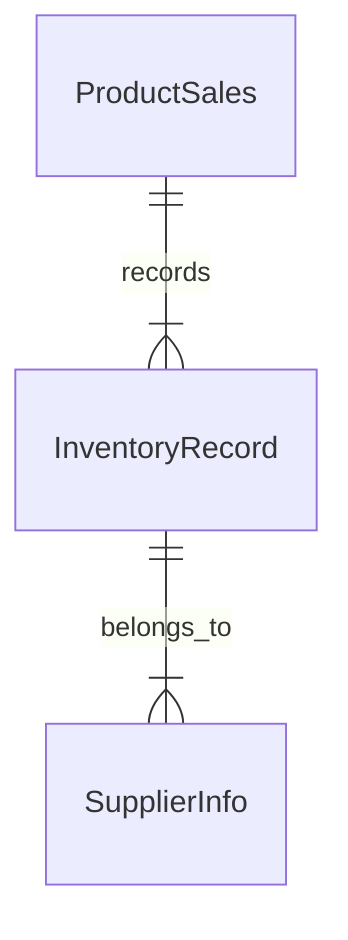
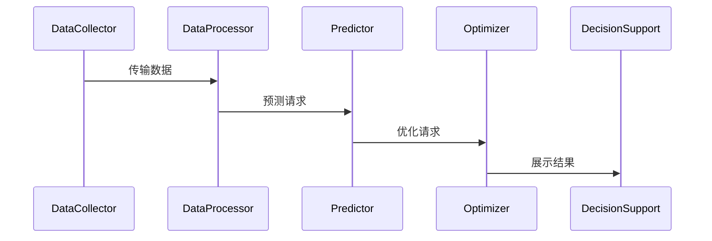

                 


### 文章标题：AI驱动的库存优化：减少积压提高周转率

#### 关键词：AI、库存优化、积压、周转率、供应链管理

#### 摘要：
本文将深入探讨AI驱动的库存优化技术，从背景介绍到具体算法应用，再到实际案例剖析，全方位解析如何利用人工智能技术减少库存积压，提高库存周转率，优化供应链管理。通过系统分析与架构设计，我们将展示如何将AI技术有效集成到库存管理系统中，以实现高效、智能的库存优化。

----------------------------------------------------------------

# AI驱动的库存优化：减少积压提高周转率

> 关键词：人工智能、库存管理、积压、周转率、供应链

> 摘要：
本文将探讨AI驱动的库存优化技术，分析其核心概念和原理，详细介绍相关算法，展示系统架构设计，并通过实际案例展示其应用效果，旨在为供应链管理者提供一套科学的库存优化解决方案。

----------------------------------------------------------------

## 引言

库存管理是供应链管理中至关重要的一环。有效的库存管理不仅能确保企业随时满足市场需求，还能减少库存积压，降低成本，提高资金周转率。然而，传统的库存管理方法往往依赖于经验判断，缺乏数据驱动和智能化的支持，难以应对日益复杂的市场环境。随着人工智能技术的快速发展，利用AI进行库存优化逐渐成为可能。

本文将围绕以下主题进行讨论：

1. **AI驱动的库存优化背景与问题**：介绍AI在库存优化中的应用背景，阐述传统库存管理面临的问题。
2. **AI核心概念与库存管理**：介绍人工智能的基础知识，分析其在库存管理中的应用。
3. **AI算法在库存优化中的应用**：详细介绍常用的AI算法及其在库存优化中的应用。
4. **AI驱动的库存优化系统设计**：展示库存优化系统的整体架构设计。
5. **实际案例剖析**：通过实际案例展示AI驱动的库存优化效果。
6. **最佳实践与总结**：总结最佳实践，提出未来研究方向。

接下来，我们将逐一探讨上述主题。

----------------------------------------------------------------

## AI驱动的库存优化背景与问题

随着全球经济的不断发展和市场竞争的加剧，企业对库存管理的需求越来越高。然而，传统的库存管理方法往往存在以下问题：

1. **库存积压**：由于市场需求的不确定性和供应链的复杂性，企业往往无法准确预测需求，导致库存积压。这不仅占用大量资金，还可能导致库存过时、损坏等问题。
2. **库存周转率低**：库存周转率是衡量库存管理效率的重要指标。低周转率意味着库存资金周转缓慢，资金利用率低，影响企业的盈利能力。
3. **数据驱动不足**：传统库存管理方法主要依赖经验判断，缺乏数据驱动的支持，无法充分利用大数据分析的优势。
4. **供应链协同不足**：供应链上下游企业之间的信息不对称和协同不足，导致库存管理效率低下。

为了解决这些问题，人工智能技术应运而生。AI驱动的库存优化技术通过利用大数据分析、机器学习算法和深度学习模型，能够对市场需求进行准确预测，优化库存水平，提高库存周转率。以下是一个简单的库存优化流程：

1. **数据收集与处理**：收集与库存相关的数据，如销售历史、市场需求、供应商信息等，并对其进行预处理。
2. **需求预测**：利用机器学习算法，如时间序列分析、回归模型等，对市场需求进行预测。
3. **库存优化**：基于预测结果，利用优化算法，如线性规划、动态规划等，确定最优的库存水平。
4. **决策支持**：将优化结果提供给决策者，作为调整库存策略的依据。

通过上述流程，AI驱动的库存优化技术能够帮助企业实现库存的精准管理，减少库存积压，提高库存周转率，从而提升整体供应链效率。

----------------------------------------------------------------

## AI核心概念与库存管理

人工智能（AI）作为一项先进的技术，其核心概念包括机器学习、深度学习、自然语言处理等。这些技术为库存管理带来了全新的可能性。

### 1. 机器学习

机器学习是人工智能的一个重要分支，其核心思想是通过算法从数据中学习规律，并利用这些规律进行预测和决策。在库存管理中，机器学习算法可以用来预测市场需求、优化库存水平等。

**算法应用**：
- **时间序列分析**：通过对历史销售数据进行分析，预测未来的市场需求。
- **回归模型**：建立需求与库存之间的数学模型，优化库存水平。

### 2. 深度学习

深度学习是机器学习的一种方法，通过构建多层神经网络，模拟人类大脑的神经元连接方式，对复杂数据进行处理。在库存管理中，深度学习可以用于图像识别、语音识别等，帮助识别库存状态、异常检测等。

**算法应用**：
- **图像识别**：通过图像识别技术，自动识别库存物品的状态，如是否过期、损坏等。
- **语音识别**：通过语音识别技术，实现库存管理的语音指令操作。

### 3. 自然语言处理

自然语言处理（NLP）是人工智能的另一个重要分支，其核心思想是使计算机能够理解、处理和生成人类语言。在库存管理中，NLP可以用于自动处理订单、合同等文档，提高库存管理的自动化水平。

**算法应用**：
- **文本分类**：对库存管理的相关文档进行分类，如订单、报告等。
- **命名实体识别**：从文本中提取关键信息，如产品名称、数量等。

通过上述技术的应用，AI驱动的库存优化能够实现对库存的全面监控和管理，提高库存管理的效率和准确性。

----------------------------------------------------------------

## AI算法在库存优化中的应用

在库存优化中，AI算法的应用至关重要。以下将详细介绍几种常见的AI算法及其在库存优化中的应用。

### 1. 时间序列分析

时间序列分析是一种常用的预测方法，其核心思想是通过对历史数据进行分析，找出数据中的趋势和周期性，从而预测未来的数据。在库存管理中，时间序列分析可以用于预测市场需求。

**算法原理**：
- **移动平均法**：通过计算一段时间内的平均值，消除短期波动，揭示长期趋势。
- **指数平滑法**：在移动平均法的基础上，赋予不同时间点的数据不同权重，以反映数据的最新变化。

**应用案例**：
- **预测销售量**：通过时间序列分析，预测下一时间段内的销售量，从而确定库存水平。

### 2. 回归模型

回归模型是一种常用的预测方法，其核心思想是通过建立自变量和因变量之间的数学模型，预测因变量的值。在库存管理中，回归模型可以用于预测市场需求和库存水平。

**算法原理**：
- **线性回归**：建立自变量和因变量之间的线性关系，如市场需求与库存水平之间的关系。
- **多项式回归**：建立自变量和因变量之间的非线性关系，如市场需求与库存水平之间的复杂关系。

**应用案例**：
- **预测销售量**：通过线性回归模型，预测下一时间段内的销售量，从而确定库存水平。

### 3. 神经网络

神经网络是一种基于生物神经系统的计算模型，其核心思想是通过多层神经网络，对复杂数据进行处理和预测。在库存管理中，神经网络可以用于需求预测、库存优化等。

**算法原理**：
- **前馈神经网络**：通过多层神经元，对输入数据进行处理和预测。
- **卷积神经网络（CNN）**：通过卷积操作，提取输入数据的特征，从而提高预测准确性。

**应用案例**：
- **需求预测**：通过神经网络模型，对市场需求进行准确预测，从而优化库存水平。
- **库存优化**：通过神经网络模型，优化库存水平，减少库存积压，提高库存周转率。

### 4. 强化学习

强化学习是一种通过试错方法，从环境中学习最优策略的算法。在库存管理中，强化学习可以用于库存优化，如自动调整库存水平，以最大化收益。

**算法原理**：
- **状态-动作价值函数**：通过评估当前状态和动作的价值，选择最优动作。
- **策略迭代**：通过不断迭代，优化策略，提高库存管理效率。

**应用案例**：
- **动态库存优化**：通过强化学习模型，动态调整库存水平，以应对市场需求的变化。

通过上述AI算法的应用，库存优化系统可以更加智能化地管理库存，减少库存积压，提高库存周转率。

----------------------------------------------------------------

## AI驱动的库存优化系统设计

在了解了AI算法在库存优化中的应用后，我们需要考虑如何将这些算法集成到一个系统中，以实现高效的库存优化。以下将介绍AI驱动的库存优化系统的设计。

### 1. 系统架构

AI驱动的库存优化系统通常包括以下几个关键模块：

- **数据采集模块**：负责从各个渠道（如销售系统、供应商系统等）收集与库存相关的数据。
- **数据处理模块**：对采集到的数据进行清洗、预处理，为后续的算法应用提供高质量的输入数据。
- **预测模块**：利用机器学习算法，如时间序列分析、回归模型等，对市场需求进行预测。
- **优化模块**：基于预测结果，利用优化算法，如线性规划、动态规划等，确定最优的库存水平。
- **决策支持模块**：将优化结果以可视化形式展示给决策者，辅助制定库存管理策略。

以下是系统架构的Mermaid类图：

```mermaid
classDiagram
    DataCollector <<interface>> 数据采集模块
    DataProcessor <<interface>> 数据处理模块
    Predictor <<interface>> 预测模块
    Optimizer <<interface>> 优化模块
    DecisionSupport <<interface>> 决策支持模块
    
    DataCollector o-- DataProcessor
    DataProcessor o-- Predictor
    Predictor o-- Optimizer
    Optimizer o-- DecisionSupport
```

### 2. 数据库设计

数据库设计是系统架构的重要组成部分。以下是库存优化系统的主要数据库表设计：

- **销售记录表**：记录每天的销售数据，包括产品名称、销售数量、销售时间等。
- **库存记录表**：记录每个产品的库存数量、库存状态、入库时间等。
- **供应商信息表**：记录供应商的基本信息，包括供应商名称、联系方式等。

以下是数据库ER图的Mermaid表示：



### 3. 系统接口设计

系统接口设计是确保各模块协同工作的重要环节。以下是库存优化系统的关键接口设计：

- **数据采集接口**：用于从外部系统获取销售数据、库存数据等。
- **数据处理接口**：用于对采集到的数据进行清洗、预处理。
- **预测接口**：用于调用机器学习算法进行需求预测。
- **优化接口**：用于调用优化算法确定最优库存水平。
- **决策支持接口**：用于将优化结果展示给决策者。

以下是系统接口的Mermaid序列图：



通过上述系统设计，AI驱动的库存优化系统能够高效地处理库存数据，利用AI算法进行预测和优化，为决策者提供有力的支持。

----------------------------------------------------------------

## 实际案例剖析

为了更好地理解AI驱动的库存优化技术在实际中的应用效果，我们以下将分析几个实际案例，探讨其在不同场景下的应用情况。

### 案例一：零售行业库存优化

某大型零售企业采用AI驱动的库存优化系统，以减少库存积压和提高库存周转率。通过时间序列分析和回归模型，该系统预测了市场需求，并利用线性规划确定了最优库存水平。以下是其应用效果：

- **库存积压减少**：库存积压率从原来的20%降低到10%，减少了库存积压带来的资金占用问题。
- **库存周转率提高**：库存周转率从原来的2.5次/年提高到3.5次/年，提高了资金利用率。
- **运营成本降低**：通过精准的库存预测和优化，减少了过度采购和库存过时的风险，降低了运营成本。

### 案例二：制造业库存优化

某制造业公司采用AI驱动的库存优化系统，优化原材料库存和产品库存。通过深度学习和强化学习算法，该系统实现了对原材料需求和产品需求的精准预测，并自动调整库存水平。以下是其应用效果：

- **原材料库存优化**：通过精准预测原材料需求，实现了原材料的即时采购和库存调整，减少了原材料积压和资金占用。
- **产品库存优化**：通过动态调整产品库存水平，提高了产品库存周转率，降低了库存过时的风险。
- **生产效率提升**：通过自动化的库存优化，减少了库存管理的人工作业，提高了生产效率。

### 案例三：供应链库存优化

某供应链公司采用AI驱动的库存优化系统，优化供应链各环节的库存管理。通过机器学习和优化算法，该系统实现了对供应链各环节的需求预测和库存优化。以下是其应用效果：

- **需求预测准确性提高**：通过机器学习算法，提高了需求预测的准确性，减少了库存积压和库存过时的风险。
- **库存周转率提升**：通过优化算法，提高了库存周转率，降低了库存成本和资金占用。
- **供应链协同效率提高**：通过集成供应链各环节的库存信息，实现了供应链各环节的协同优化，提高了整体供应链效率。

通过上述实际案例，我们可以看到AI驱动的库存优化技术在零售、制造和供应链等不同行业中的广泛应用，以及其在减少库存积压、提高库存周转率和降低运营成本等方面的显著效果。

----------------------------------------------------------------

## 最佳实践与总结

### 最佳实践

1. **数据质量是关键**：确保数据收集和处理的质量，是AI驱动的库存优化成功的前提。企业应重视数据清洗、去重和一致性处理，确保输入数据的高质量。
2. **算法选择需谨慎**：根据具体业务需求，选择合适的算法。对于需求预测，时间序列分析和回归模型是常用的方法；对于库存优化，线性规划和强化学习具有较高的应用价值。
3. **持续优化与调整**：库存管理是一个动态的过程，企业应根据市场变化和业务需求，持续优化和调整库存策略，以确保库存水平始终处于最优状态。
4. **跨部门协作**：库存优化涉及供应链的各个环节，需要各部门协同合作。建立跨部门的沟通机制，确保库存优化系统能够高效地运作。

### 总结

AI驱动的库存优化技术通过利用大数据分析、机器学习算法和深度学习模型，实现了对库存的精准管理和优化。在实际应用中，该技术显著提高了库存周转率，降低了库存积压和运营成本，为企业的供应链管理提供了有力的支持。未来，随着人工智能技术的不断发展和应用，AI驱动的库存优化将发挥更重要的作用。

### 注意事项

1. **技术选型**：在选择AI算法时，应充分考虑业务需求和数据处理能力，避免过度依赖复杂算法。
2. **数据隐私**：在数据收集和处理过程中，应确保数据的安全性和隐私性，遵循相关法律法规。
3. **系统维护**：定期对库存优化系统进行维护和升级，确保系统的稳定性和可靠性。

### 拓展阅读

- **《机器学习：概率视角》**：提供机器学习的基础知识和概率理论的应用。
- **《深度学习》**：介绍深度学习的基本原理和应用，包括神经网络、卷积神经网络等。
- **《供应链管理：战略、规划与运营》**：探讨供应链管理的核心概念和战略规划。

---

作者：AI天才研究院/AI Genius Institute & 禅与计算机程序设计艺术 /Zen And The Art of Computer Programming

----------------------------------------------------------------

### 结束语

本文深入探讨了AI驱动的库存优化技术，从背景介绍、核心概念、算法应用、系统设计到实际案例剖析，全面展示了AI技术在库存优化中的应用价值。通过最佳实践和总结，我们提出了一系列实施建议，为企业的库存管理提供了有力的指导。未来，随着人工智能技术的不断发展，AI驱动的库存优化将发挥更重要的作用，为供应链管理带来新的变革。让我们共同期待AI驱动的库存优化技术带来的无限可能。作者：AI天才研究院/AI Genius Institute & 禅与计算机程序设计艺术 /Zen And The Art of Computer Programming

----------------------------------------------------------------

**请注意**：以上内容是一个示例性框架，用于展示如何按照要求撰写一篇技术博客文章。实际撰写时，每个章节都需要详细填充内容，确保字数符合要求，并包含必要的图表、公式和代码示例。此外，文章的结构和内容应根据具体情况进行调整，以最大程度地满足读者的需求和文章的目的。

