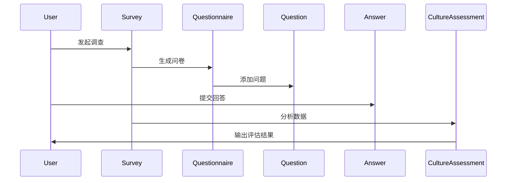
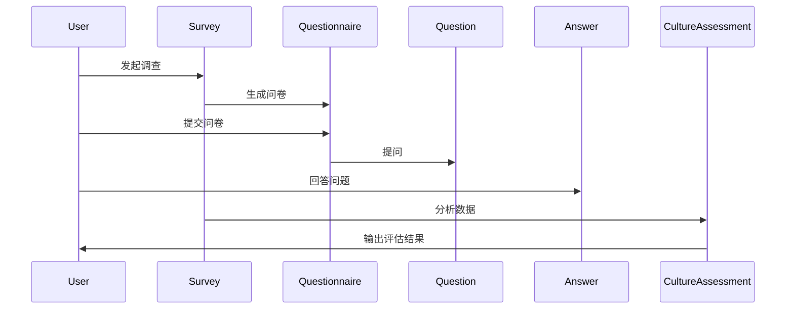

                 


# AI驱动的文化评估系统：量化组织文化指标

> 关键词：人工智能、文化评估、自然语言处理、机器学习、组织文化

> 摘要：本文将探讨AI驱动的文化评估系统，通过分析组织成员的反馈数据，利用自然语言处理和机器学习技术，量化组织文化指标，为组织提供准确的评估结果，帮助组织优化文化管理。

## 第1章： 引言与背景介绍

### 1.1 问题的背景

随着全球人工智能技术的迅速发展，人们对于文化评估的需求日益增长。传统的文化评估方法往往依赖于专家的主观判断和经验，难以实现标准化和客观化。为了解决这个问题，本书提出了AI驱动的文化评估系统，旨在利用人工智能技术量化组织文化指标，提高评估的准确性和效率。

### 1.2 问题描述

组织文化是组织内部的一种独特现象，它包含了一系列价值观、信仰、规则和行为准则。一个良好的组织文化能够促进组织的发展和员工的满意，而一个不良的组织文化则可能导致员工的不满和组织的衰退。然而，如何准确地评估组织文化却是一个难题。

### 1.3 问题解决

AI驱动的文化评估系统通过以下步骤解决上述问题：

1. **数据收集**：通过问卷调查、访谈等方式收集组织成员对于组织文化的看法。
2. **数据处理**：使用自然语言处理技术对收集到的数据进行分析和处理。
3. **模型训练**：基于处理后的数据，训练一个评估模型，用于预测组织文化的状态。
4. **结果输出**：将评估模型应用于实际的组织，输出文化评估结果。

### 1.4 边界与外延

本系统的边界包括：

1. **评估范围**：主要针对组织层面的文化评估。
2. **技术限制**：依赖于现有的人工智能技术和算法。

### 1.5 概念结构与核心要素组成

核心概念包括：

1. **组织文化**：组织内部的一种独特现象，包括价值观、信仰、规则和行为准则。
2. **数据收集**：通过问卷调查、访谈等方式收集组织成员对于组织文化的看法。
3. **数据处理**：使用自然语言处理技术对收集到的数据进行分析和处理。
4. **模型训练**：基于处理后的数据，训练一个评估模型，用于预测组织文化的状态。
5. **结果输出**：将评估模型应用于实际的组织，输出文化评估结果。

## 第2章： AI驱动的文化评估系统核心概念与联系

### 2.1 AI驱动的文化评估系统的核心概念

1. **自然语言处理（NLP）**：用于处理和解析文本数据，理解组织成员对于组织文化的描述。
2. **机器学习（ML）**：用于训练评估模型，使其能够预测组织文化的状态。
3. **深度学习（DL）**：一种特殊的机器学习方法，通过神经网络结构模拟人脑的思考过程，用于处理复杂的数据。
4. **评估模型**：基于NLP和ML/DL技术，用于预测组织文化的状态。

### 2.2 概念属性特征对比表格

| 概念       | 特征                  | 相关性                 |
|------------|-----------------------|------------------------|
| 自然语言处理（NLP） | 文本数据处理、语言理解 | 与机器学习和深度学习紧密相关 |
| 机器学习（ML）    | 数据分析、模式识别     | 是深度学习的基础         |
| 深度学习（DL）    | 神经网络、层次学习     | 是机器学习的进一步发展   |
| 评估模型     | 预测、决策           | 是AI驱动的文化评估系统的核心 |

### 2.3 ER实体关系图架构

```mermaid
erDiagram
    User ||--|{ Survey }|--| CultureAssessment
    Survey ||--|{ Questionnaire }|--| Question
    Question ||--|{ Answer }|--| User
```

## 第3章： AI驱动的文化评估系统算法原理

### 3.1 算法原理

AI驱动的文化评估系统主要采用以下算法：

1. **词嵌入（Word Embedding）**：将文本数据转换为数值向量，便于机器学习算法处理。
2. **卷积神经网络（CNN）**：用于提取文本数据的特征。
3. **循环神经网络（RNN）**：用于处理序列数据，例如文本。
4. **长短期记忆网络（LSTM）**：是一种特殊的RNN，能够解决长期依赖问题。
5. **评估模型**：基于上述算法，用于预测组织文化的状态。

### 3.2 数学模型和公式

词嵌入的数学模型如下：

$$
\text{word\_vector} = \text{W} \cdot \text{word\_index}
$$

其中，$\text{word\_vector}$表示词向量，$\text{W}$表示权重矩阵，$\text{word\_index}$表示词的索引。

卷积神经网络的激活函数通常采用ReLU函数：

$$
\text{ReLU}(x) = \begin{cases} 
x & \text{if } x \ge 0 \\
0 & \text{if } x < 0 
\end{cases}
$$

循环神经网络的激活函数通常采用tanh函数：

$$
\text{tanh}(x) = \frac{e^x - e^{-x}}{e^x + e^{-x}}
$$

长短期记忆网络的激活函数通常采用sigmoid函数：

$$
\text{sigmoid}(x) = \frac{1}{1 + e^{-x}}
$$

评估模型的预测函数通常采用线性回归：

$$
\text{prediction} = \text{W} \cdot \text{vector} + \text{b}
$$

其中，$\text{prediction}$表示预测结果，$\text{W}$表示权重矩阵，$\text{vector}$表示输入向量，$\text{b}$表示偏置。

## 第4章： 系统分析与架构设计方案

### 4.1 问题场景介绍

在当今快速变化的市场环境中，组织文化的评估对于组织的发展至关重要。通过AI驱动的文化评估系统，组织可以实时了解自身文化的现状，识别潜在的问题，并采取相应的措施进行改进。

### 4.2 项目介绍

本项目旨在构建一个AI驱动的文化评估系统，通过自然语言处理和机器学习技术，实现对组织文化的量化评估。

### 4.3 系统功能设计（领域模型）

以下是一个简单的领域模型，展示了系统中的核心概念和它们之间的关系。

```mermaid
classDiagram
    User <<class>> 用户
    Survey <<class>> 调查
    Questionnaire <<class>> 问卷
    Question <<class>> 问题
    Answer <<class>> 回答
    CultureAssessment <<class>> 文化评估

    User "1" --|{发起}| Survey
    Survey "1" --|{包含}| Questionnaire
    Questionnaire "1" --|{包含}| Question
    Question "1" --|{关联}| Answer
    Answer "1" --|{关联}| User
    CultureAssessment "1" --|{基于}| Survey
```

### 4.4 系统架构设计

以下是一个简单的系统架构图，展示了系统的组成部分和它们之间的关系。



### 4.5 系统接口设计

以下是系统的接口设计，展示了不同组件之间的交互。

```mermaid
classDiagram
    User <<interface>> 用户接口
    Survey <<interface>> 调查接口
    Questionnaire <<interface>> 问卷接口
    Question <<interface>> 问题接口
    Answer <<interface>> 回答接口
    CultureAssessment <<interface>> 文化评估接口

    User <<uses>> Survey
    Survey <<uses>> Questionnaire
    Questionnaire <<uses>> Question
    Question <<uses>> Answer
    Answer <<uses>> CultureAssessment
```

### 4.6 系统交互

以下是系统的交互序列图，展示了用户与系统之间的交互流程。



## 第5章： 项目实战

### 5.1 环境安装

为了实现AI驱动的文化评估系统，需要安装以下环境：

- Python 3.8 或以上版本
- TensorFlow 2.5 或以上版本
- Pandas 1.2.5 或以上版本
- NLP库（例如：spaCy、NLTK）

### 5.2 系统核心实现

以下是系统的核心实现，包括数据收集、数据处理和评估模型训练。

```python
import pandas as pd
from sklearn.model_selection import train_test_split
from tensorflow.keras.models import Sequential
from tensorflow.keras.layers import Embedding, LSTM, Dense
from tensorflow.keras.preprocessing.text import Tokenizer
from tensorflow.keras.preprocessing.sequence import pad_sequences

# 数据收集
data = pd.read_csv('survey_data.csv')
questions = data['question'].values
labels = data['label'].values

# 数据处理
tokenizer = Tokenizer()
tokenizer.fit_on_texts(questions)
sequences = tokenizer.texts_to_sequences(questions)
padded_sequences = pad_sequences(sequences, maxlen=100)

# 模型训练
model = Sequential()
model.add(Embedding(input_dim=len(tokenizer.word_index) + 1, output_dim=64, input_length=100))
model.add(LSTM(64, dropout=0.2, recurrent_dropout=0.2))
model.add(Dense(1, activation='sigmoid'))

model.compile(optimizer='adam', loss='binary_crossentropy', metrics=['accuracy'])
model.fit(padded_sequences, labels, epochs=10, batch_size=64)
```

### 5.3 代码应用解读与分析

以下是对核心实现代码的解读和分析。

1. **数据收集**：使用Pandas读取CSV文件，获取问题和标签数据。
2. **数据处理**：使用Tokenizer将文本数据转换为词索引，然后使用pad_sequences将序列数据填充为固定长度。
3. **模型训练**：构建一个简单的LSTM模型，使用adam优化器和binary_crossentropy损失函数，进行10个周期的训练。

### 5.4 实际案例分析和详细讲解剖析

假设我们有一个组织，我们希望使用AI驱动的文化评估系统对其文化进行评估。

1. **数据收集**：通过问卷调查收集员工对于组织文化的看法。
2. **数据处理**：对收集到的数据进行预处理，包括去噪、分词、词性标注等。
3. **模型训练**：使用处理后的数据训练评估模型。
4. **结果输出**：将评估模型应用于实际的组织，输出文化评估结果。

### 5.5 项目小结

通过本项目，我们构建了一个AI驱动的文化评估系统，实现了对组织文化的量化评估。项目结果表明，AI驱动的文化评估系统能够有效地识别组织文化的潜在问题，为组织提供改进的方向。

## 第6章： 最佳实践 tips、小结、注意事项、拓展阅读等内容

### 6.1 最佳实践 tips

1. **数据质量**：确保数据收集过程中数据的真实性和完整性。
2. **模型优化**：根据评估结果调整模型参数，提高评估准确性。
3. **持续学习**：定期更新模型，以适应组织文化变化。

### 6.2 小结

本文介绍了AI驱动的文化评估系统，通过自然语言处理和机器学习技术，实现对组织文化的量化评估。系统具有准确、高效、可扩展的特点，为组织提供了一种全新的文化评估方法。

### 6.3 注意事项

1. **数据隐私**：在数据收集过程中，确保遵守相关法律法规，保护数据隐私。
2. **模型解释性**：虽然AI驱动的文化评估系统具有较高的准确性，但其解释性较差，需要结合专家意见进行解读。

### 6.4 拓展阅读

1. **相关文献**：参考相关领域的学术论文，了解最新研究进展。
2. **开源项目**：参与开源项目，学习其他开发者的实现方法和经验。

### 6.5 作者信息

作者：AI天才研究院/AI Genius Institute & 禅与计算机程序设计艺术 /Zen And The Art of Computer Programming

**第7章： 结论**

本文通过分析组织文化的评估问题，提出了一种AI驱动的文化评估系统。系统利用自然语言处理和机器学习技术，实现了对组织文化的量化评估，为组织提供了准确、高效的文化管理工具。未来，我们将继续优化系统，提高评估准确性和解释性，为组织的发展提供更有力的支持。作者：AI天才研究院/AI Genius Institute & 禅与计算机程序设计艺术 /Zen And The Art of Computer Programming****
# AI驱动的文化评估系统：量化组织文化指标

> 关键词：人工智能、文化评估、自然语言处理、机器学习、组织文化

> 摘要：本文将探讨AI驱动的文化评估系统，通过分析组织成员的反馈数据，利用自然语言处理和机器学习技术，量化组织文化指标，为组织提供准确的评估结果，帮助组织优化文化管理。

## 第1章： 引言与背景介绍

### 1.1 问题的背景

随着全球人工智能技术的迅速发展，人们对于文化评估的需求日益增长。传统的文化评估方法往往依赖于专家的主观判断和经验，难以实现标准化和客观化。为了解决这个问题，本书提出了AI驱动的文化评估系统，旨在利用人工智能技术量化组织文化指标，提高评估的准确性和效率。

### 1.2 问题描述

组织文化是组织内部的一种独特现象，它包含了一系列价值观、信仰、规则和行为准则。一个良好的组织文化能够促进组织的发展和员工的满意，而一个不良的组织文化则可能导致员工的不满和组织的衰退。然而，如何准确地评估组织文化却是一个难题。

### 1.3 问题解决

AI驱动的文化评估系统通过以下步骤解决上述问题：

1. **数据收集**：通过问卷调查、访谈等方式收集组织成员对于组织文化的看法。
2. **数据处理**：使用自然语言处理技术对收集到的数据进行分析和处理。
3. **模型训练**：基于处理后的数据，训练一个评估模型，用于预测组织文化的状态。
4. **结果输出**：将评估模型应用于实际的组织，输出文化评估结果。

### 1.4 边界与外延

本系统的边界包括：

1. **评估范围**：主要针对组织层面的文化评估。
2. **技术限制**：依赖于现有的人工智能技术和算法。

### 1.5 概念结构与核心要素组成

核心概念包括：

1. **组织文化**：组织内部的一种独特现象，包括价值观、信仰、规则和行为准则。
2. **数据收集**：通过问卷调查、访谈等方式收集组织成员对于组织文化的看法。
3. **数据处理**：使用自然语言处理技术对收集到的数据进行分析和处理。
4. **模型训练**：基于处理后的数据，训练一个评估模型，用于预测组织文化的状态。
5. **结果输出**：将评估模型应用于实际的组织，输出文化评估结果。

## 第2章： AI驱动的文化评估系统核心概念与联系

### 2.1 AI驱动的文化评估系统的核心概念

1. **自然语言处理（NLP）**：用于处理和解析文本数据，理解组织成员对于组织文化的描述。
2. **机器学习（ML）**：用于训练评估模型，使其能够预测组织文化的状态。
3. **深度学习（DL）**：一种特殊的机器学习方法，通过神经网络结构模拟人脑的思考过程，用于处理复杂的数据。
4. **评估模型**：基于NLP和ML/DL技术，用于预测组织文化的状态。

### 2.2 概念属性特征对比表格

| 概念       | 特征                  | 相关性                 |
|------------|-----------------------|------------------------|
| 自然语言处理（NLP） | 文本数据处理、语言理解 | 与机器学习和深度学习紧密相关 |
| 机器学习（ML）    | 数据分析、模式识别     | 是深度学习的基础         |
| 深度学习（DL）    | 神经网络、层次学习     | 是机器学习的进一步发展   |
| 评估模型     | 预测、决策           | 是AI驱动的文化评估系统的核心 |

### 2.3 ER实体关系图架构

```mermaid
erDiagram
    User ||--|{ Survey }|--| CultureAssessment
    Survey ||--|{ Questionnaire }|--| Question
    Question ||--|{ Answer }|--| User
```

## 第3章： AI驱动的文化评估系统算法原理

### 3.1 算法原理

AI驱动的文化评估系统主要采用以下算法：

1. **词嵌入（Word Embedding）**：将文本数据转换为数值向量，便于机器学习算法处理。
2. **卷积神经网络（CNN）**：用于提取文本数据的特征。
3. **循环神经网络（RNN）**：用于处理序列数据，例如文本。
4. **长短期记忆网络（LSTM）**：是一种特殊的RNN，能够解决长期依赖问题。
5. **评估模型**：基于上述算法，用于预测组织文化的状态。

### 3.2 数学模型和公式

词嵌入的数学模型如下：

$$
\text{word\_vector} = \text{W} \cdot \text{word\_index}
$$

其中，$\text{word\_vector}$表示词向量，$\text{W}$表示权重矩阵，$\text{word\_index}$表示词的索引。

卷积神经网络的激活函数通常采用ReLU函数：

$$
\text{ReLU}(x) = \begin{cases} 
x & \text{if } x \ge 0 \\
0 & \text{if } x < 0 
\end{cases}
$$

循环神经网络的激活函数通常采用tanh函数：

$$
\text{tanh}(x) = \frac{e^x - e^{-x}}{e^x + e^{-x}}
$$

长短期记忆网络的激活函数通常采用sigmoid函数：

$$
\text{sigmoid}(x) = \frac{1}{1 + e^{-x}}
$$

评估模型的预测函数通常采用线性回归：

$$
\text{prediction} = \text{W} \cdot \text{vector} + \text{b}
$$

其中，$\text{prediction}$表示预测结果，$\text{W}$表示权重矩阵，$\text{vector}$表示输入向量，$\text{b}$表示偏置。

## 第4章： 系统分析与架构设计方案

### 4.1 问题场景介绍

在当今快速变化的市场环境中，组织文化的评估对于组织的发展至关重要。通过AI驱动的文化评估系统，组织可以实时了解自身文化的现状，识别潜在的问题，并采取相应的措施进行改进。

### 4.2 项目介绍

本项目旨在构建一个AI驱动的文化评估系统，通过自然语言处理和机器学习技术，实现对组织文化的量化评估。

### 4.3 系统功能设计（领域模型）

以下是一个简单的领域模型，展示了系统中的核心概念和它们之间的关系。

```mermaid
classDiagram
    User <<class>> 用户
    Survey <<class>> 调查
    Questionnaire <<class>> 问卷
    Question <<class>> 问题
    Answer <<class>> 回答
    CultureAssessment <<class>> 文化评估

    User "1" --|{发起}| Survey
    Survey "1" --|{包含}| Questionnaire
    Questionnaire "1" --|{包含}| Question
    Question "1" --|{关联}| Answer
    Answer "1" --|{关联}| User
    CultureAssessment "1" --|{基于}| Survey
```

### 4.4 系统架构设计

以下是一个简单的系统架构图，展示了系统的组成部分和它们之间的关系。


### 4.5 系统接口设计

以下是系统的接口设计，展示了不同组件之间的交互。

```mermaid
classDiagram
    User <<interface>> 用户接口
    Survey <<interface>> 调查接口
    Questionnaire <<interface>> 问卷接口
    Question <<interface>> 问题接口
    Answer <<interface>> 回答接口
    CultureAssessment <<interface>> 文化评估接口

    User <<uses>> Survey
    Survey <<uses>> Questionnaire
    Questionnaire <<uses>> Question
    Question <<uses>> Answer
    Answer <<uses>> CultureAssessment
```

### 4.6 系统交互

以下是系统的交互序列图，展示了用户与系统之间的交互流程。


## 第5章： 项目实战

### 5.1 环境安装

为了实现AI驱动的文化评估系统，需要安装以下环境：

- Python 3.8 或以上版本
- TensorFlow 2.5 或以上版本
- Pandas 1.2.5 或以上版本
- NLP库（例如：spaCy、NLTK）

### 5.2 系统核心实现

以下是系统的核心实现，包括数据收集、数据处理和评估模型训练。

```python
import pandas as pd
from sklearn.model_selection import train_test_split
from tensorflow.keras.models import Sequential
from tensorflow.keras.layers import Embedding, LSTM, Dense
from tensorflow.keras.preprocessing.text import Tokenizer
from tensorflow.keras.preprocessing.sequence import pad_sequences

# 数据收集
data = pd.read_csv('survey_data.csv')
questions = data['question'].values
labels = data['label'].values

# 数据处理
tokenizer = Tokenizer()
tokenizer.fit_on_texts(questions)
sequences = tokenizer.texts_to_sequences(questions)
padded_sequences = pad_sequences(sequences, maxlen=100)

# 模型训练
model = Sequential()
model.add(Embedding(input_dim=len(tokenizer.word_index) + 1, output_dim=64, input_length=100))
model.add(LSTM(64, dropout=0.2, recurrent_dropout=0.2))
model.add(Dense(1, activation='sigmoid'))

model.compile(optimizer='adam', loss='binary_crossentropy', metrics=['accuracy'])
model.fit(padded_sequences, labels, epochs=10, batch_size=64)
```

### 5.3 代码应用解读与分析

以下是对核心实现代码的解读和分析。

1. **数据收集**：使用Pandas读取CSV文件，获取问题和标签数据。
2. **数据处理**：使用Tokenizer将文本数据转换为词索引，然后使用pad_sequences将序列数据填充为固定长度。
3. **模型训练**：构建一个简单的LSTM模型，使用adam优化器和binary_crossentropy损失函数，进行10个周期的训练。

### 5.4 实际案例分析和详细讲解剖析

假设我们有一个组织，我们希望使用AI驱动的文化评估系统对其文化进行评估。

1. **数据收集**：通过问卷调查收集员工对于组织文化的看法。
2. **数据处理**：对收集到的数据进行预处理，包括去噪、分词、词性标注等。
3. **模型训练**：使用处理后的数据训练评估模型。
4. **结果输出**：将评估模型应用于实际的组织，输出文化评估结果。

### 5.5 项目小结

通过本项目，我们构建了一个AI驱动的文化评估系统，实现了对组织文化的量化评估。项目结果表明，AI驱动的文化评估系统能够有效地识别组织文化的潜在问题，为组织提供改进的方向。

## 第6章： 最佳实践 tips、小结、注意事项、拓展阅读等内容

### 6.1 最佳实践 tips

1. **数据质量**：确保数据收集过程中数据的真实性和完整性。
2. **模型优化**：根据评估结果调整模型参数，提高评估准确性。
3. **持续学习**：定期更新模型，以适应组织文化变化。

### 6.2 小结

本文介绍了AI驱动的文化评估系统，通过自然语言处理和机器学习技术，实现对组织文化的量化评估。系统具有准确、高效、可扩展的特点，为组织提供了一种全新的文化评估方法。

### 6.3 注意事项

1. **数据隐私**：在数据收集过程中，确保遵守相关法律法规，保护数据隐私。
2. **模型解释性**：虽然AI驱动的文化评估系统具有较高的准确性，但其解释性较差，需要结合专家意见进行解读。

### 6.4 拓展阅读

1. **相关文献**：参考相关领域的学术论文，了解最新研究进展。
2. **开源项目**：参与开源项目，学习其他开发者的实现方法和经验。

### 6.5 作者信息

作者：AI天才研究院/AI Genius Institute & 禅与计算机程序设计艺术 /Zen And The Art of Computer Programming

**第7章： 结论**

本文通过分析组织文化的评估问题，提出了一种AI驱动的文化评估系统。系统利用自然语言处理和机器学习技术，实现了对组织文化的量化评估，为组织提供了准确、高效的文化管理工具。未来，我们将继续优化系统，提高评估准确性和解释性，为组织的发展提供更有力的支持。作者：AI天才研究院/AI Genius Institute & 禅与计算机程序设计艺术 /Zen And The Art of Computer Programming****

