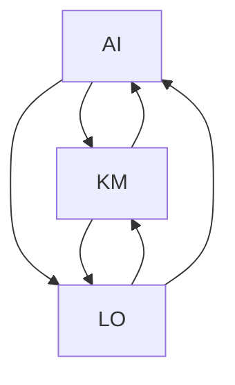

                 

### 引言

#### 1.1 知识管理生态的背景与重要性

在当今快速变化和高度竞争的商业环境中，知识管理已经成为企业和组织实现可持续发展的关键。知识管理（Knowledge Management，KM）不仅仅是一种策略，更是一种文化，它强调知识的创造、共享、利用和持续创新。知识管理生态（Knowledge Management Ecosystem）则是这一策略的实施框架，它通过整合内部和外部资源，构建一个动态的知识共享网络，以提高组织的整体绩效和创新能力。

知识管理生态的背景可以追溯到20世纪80年代，随着信息技术的迅速发展，企业开始意识到知识作为一种无形资产的重要性。在这一背景下，知识管理逐渐成为一种战略手段，旨在通过有效的知识获取、存储、共享和应用，提升企业的核心竞争力。然而，传统的知识管理方法往往局限于内部资源的整合，缺乏对外部资源的利用，难以实现知识的最大化价值。

知识管理生态的概念强调了知识流动的动态性和开放性。它不仅包括企业内部的知识管理系统，还涵盖了与外部合作伙伴、客户和供应商的知识共享。知识管理生态的构建需要综合考虑信息技术、组织文化、人力资源等多个因素，以形成一个高效的知识创造、传播和利用的循环。

在当前的商业环境中，知识管理生态的重要性体现在以下几个方面：

1. **提升创新能力**：知识管理生态通过促进知识的共享和交流，有助于激发员工的创新思维，加快新产品的开发速度，提高企业的市场竞争力。
2. **增强协同合作**：知识管理生态能够打破组织内部和外部之间的知识壁垒，促进不同部门、团队和合作伙伴之间的协同合作，提高整体运作效率。
3. **提高决策质量**：通过有效的知识管理，组织能够快速获取和利用相关的信息，为决策提供科学依据，提高决策的准确性和及时性。
4. **降低知识流失风险**：知识管理生态通过建立知识的数字化存储和共享机制，可以降低因员工离职、退休等导致的知识流失风险。

#### 1.2 AI驱动知识管理的价值

人工智能（Artificial Intelligence，AI）作为当前技术发展的前沿领域，正在逐渐渗透到各个行业和应用领域。将AI引入知识管理，形成AI驱动的知识管理生态，不仅可以提升知识管理的效率和效果，还可以为组织带来以下价值：

1. **智能化数据挖掘与分析**：AI技术，尤其是机器学习（Machine Learning，ML）和深度学习（Deep Learning，DL），能够从大量结构化和非结构化数据中提取有价值的信息，为知识管理提供数据支持。
2. **自动化知识获取与处理**：通过自然语言处理（Natural Language Processing，NLP）等技术，AI可以自动化地获取和处理文本、语音等不同形式的知识，提高知识管理的效率。
3. **个性化知识推荐**：基于用户的兴趣和行为，AI可以个性化地推荐相关的知识内容，提高知识利用率。
4. **智能知识图谱构建**：AI技术可以自动构建知识图谱，将分散的知识点进行关联和整合，形成系统化的知识体系。
5. **智能决策支持**：通过数据分析和预测模型，AI可以为组织的决策提供科学依据，提高决策的准确性和时效性。

#### 1.3 学习型组织的概念与优势

学习型组织（Learning Organization）是一种能够不断学习和适应环境变化的组织形式。学习型组织强调知识的创造、共享和应用，注重个人和团队的持续成长。构建学习型组织是实现知识管理生态的关键，其优势主要体现在以下几个方面：

1. **持续创新能力**：学习型组织通过不断学习和创新，能够迅速适应市场变化，持续推出新产品和服务。
2. **高效协同合作**：学习型组织通过建立良好的沟通和协作机制，促进不同部门和团队之间的合作，提高整体运作效率。
3. **员工自主性**：学习型组织鼓励员工自主学习和探索，激发员工的积极性和创造力。
4. **快速响应能力**：学习型组织能够快速获取和利用内外部的知识资源，提高对市场变化的响应速度。
5. **文化凝聚力**：学习型组织通过共同的价值观和文化认同，增强组织的凝聚力和向心力。

综上所述，构建AI驱动的知识管理生态，并在此基础上构建学习型组织，是提升企业核心竞争力、实现可持续发展的关键。接下来，我们将进一步探讨AI、知识管理、学习型组织之间的核心概念与联系，为后续内容提供理论基础。

### 核心概念与联系

在深入探讨AI驱动的知识管理生态之前，我们需要明确几个核心概念：人工智能（AI）、知识管理（KM）和学习型组织（LO）。这些概念不仅独立存在，而且在实际应用中相互交织、相互影响，共同构成了一个复杂的知识管理生态系统。

#### 2.1 AI基础知识

##### 2.1.1 人工智能的定义与发展历程

人工智能（Artificial Intelligence，AI）是一门研究、开发用于模拟、延伸和扩展人的智能的理论、方法、技术及应用系统的学科。它旨在创建能够实现人类智能任务的智能体，例如学习、推理、感知、理解和交流等。

AI的发展历程可以追溯到20世纪50年代，当时的科学家们开始探索如何让计算机具备人类的智能。早期的研究主要集中在逻辑推理和规则系统上，如基于“专家系统”的方法。然而，这些早期方法在处理复杂问题方面存在局限。

随着计算机性能的提升和算法的进步，尤其是20世纪80年代以来，机器学习（Machine Learning，ML）和深度学习（Deep Learning，DL）技术的发展，AI迎来了新的突破。机器学习通过从数据中学习模式，逐渐改进算法的性能，而深度学习则通过构建多层神经网络，模拟人脑的神经结构，实现了对大规模数据的高效处理。

##### 2.1.2 机器学习与深度学习基础

机器学习是AI的一个子领域，它关注于如何让计算机从数据中学习并做出决策。机器学习的主要方法包括监督学习（Supervised Learning）、无监督学习（Unsupervised Learning）和强化学习（Reinforcement Learning）。

- **监督学习**：通过已标记的数据进行训练，让模型学会将新的数据映射到已知的标签上。常见的算法包括线性回归、决策树、支持向量机（SVM）和神经网络等。
- **无监督学习**：在没有任何标记的数据上进行训练，旨在发现数据中的隐藏结构。常见的算法包括聚类算法（如K-means、层次聚类）和降维算法（如主成分分析PCA）等。
- **强化学习**：通过与环境的交互来学习最佳策略。模型通过试错，不断调整策略，以实现最大化奖励。常见的算法包括Q学习、深度Q网络（DQN）和策略梯度算法等。

深度学习是机器学习的一个分支，它通过构建深度神经网络（DNN）来处理复杂数据。深度神经网络包含多个隐藏层，每一层都对输入数据进行加工和处理，从而实现数据的分层特征提取。

- **卷积神经网络（CNN）**：主要应用于图像处理，通过卷积层和池化层进行特征提取和降维。
- **循环神经网络（RNN）**：适用于序列数据，通过隐藏状态的记忆机制，捕捉序列中的时间依赖性。
- **生成对抗网络（GAN）**：通过生成器和判别器的对抗训练，实现复杂数据的生成。

#### 2.2 知识管理基础

##### 2.2.1 知识管理的定义与范畴

知识管理（Knowledge Management，KM）是指通过一系列的策略、过程和技术，系统地管理和利用组织内的知识资源，以提高组织的效率和创新能力。知识管理的核心目标包括知识的获取、存储、共享、应用和创新。

知识管理可以分为三个层次：显性知识（Explicit Knowledge）、隐性知识（Tacit Knowledge）和混合知识（Hybrid Knowledge）。

- **显性知识**：易于编码、存储和共享的知识，如文档、数据库和知识库等。
- **隐性知识**：难以编码、存储和共享的知识，如经验、技能和直觉等。
- **混合知识**：显性知识和隐性知识的结合，通过对话、讨论和经验交流等方式进行共享。

##### 2.2.2 知识管理的关键要素

知识管理的关键要素包括以下几个方面：

1. **知识创造**：通过研究、开发和创新活动，不断创造新的知识。
2. **知识获取**：从内部和外部获取有价值的信息和知识。
3. **知识存储**：建立高效的数据库和知识库，存储和管理知识资源。
4. **知识共享**：通过技术手段和协作机制，促进知识的共享和交流。
5. **知识应用**：将知识应用于实际工作中，提高工作效率和质量。
6. **知识创新**：通过知识的整合和再创新，推动组织的持续发展。

#### 2.3 AI与知识管理的联系

##### 2.3.1 AI在知识管理中的应用

AI技术在知识管理中的应用非常广泛，主要包括以下几个方面：

1. **数据挖掘与分析**：通过机器学习和深度学习算法，从大量数据中提取有价值的信息和知识。
2. **自动化知识获取与处理**：利用自然语言处理（NLP）等技术，自动化地获取和处理文本、语音等不同形式的知识。
3. **知识图谱构建**：通过图算法和机器学习技术，构建知识图谱，实现知识的关联和整合。
4. **智能知识推荐**：基于用户的兴趣和行为，利用推荐算法，个性化地推荐相关的知识内容。
5. **智能决策支持**：通过数据分析和预测模型，为组织的决策提供科学依据。

##### 2.3.2 知识管理对AI的需求

知识管理对AI的需求主要体现在以下几个方面：

1. **数据资源**：知识管理需要大量的数据作为AI模型的训练素材，从而提高模型的准确性和鲁棒性。
2. **算法支持**：知识管理需要高效的算法来处理和分析复杂的知识，以实现知识的获取、共享和应用。
3. **技术平台**：知识管理需要构建一个稳定、可靠的技术平台，支持AI技术在知识管理中的应用。
4. **人才培养**：知识管理需要培养具备AI技术和知识管理能力的人才，以推动AI技术在组织中的应用。

#### 2.4 ER图与概念关系图

##### 2.4.1 ER图的绘制

实体-关系图（Entity-Relationship Diagram，ER图）是用于描述数据库中实体和实体之间关系的图形化工具。在知识管理生态系统中，ER图可以用来描述知识管理中的关键实体和它们之间的关系。

以下是一个简化的知识管理ER图的例子：

```mermaid
erDiagram
    User ||--|{ KnowledgeBase }|-- Employee : manages
    User ||--|{ Document }|-- Employee : writes
    KnowledgeBase ||--|{ KnowledgeItem }|-- Document : contains
    Document ||--|{ Comment }|-- User : comments on
    Employee ||--|{ Role }|-- Organization : works in
    Organization ||--|{ Project }|-- Employee : works on
```

在这个ER图中，`User`、`KnowledgeBase`、`Document`、`Comment`、`Employee`、`Role`和`Organization`是实体，它们之间的关系通过线段和箭头表示。

##### 2.4.2 概念关系图的构建

概念关系图（Conceptual Relationship Diagram）是用于描述不同概念之间关系的图形化工具。在知识管理生态系统中，概念关系图可以用来展示AI、知识管理、学习型组织等核心概念之间的关系。

以下是一个简化的概念关系图的例子：



在这个概念关系图中，`AI`（人工智能）、`KM`（知识管理）和`LO`（学习型组织）是核心概念，它们通过双向箭头表示相互影响和相互依赖的关系。

通过上述ER图和概念关系图的构建，我们可以更清晰地理解知识管理生态系统的结构，以及AI、知识管理、学习型组织之间的内在联系。这些图形化工具不仅有助于我们理解概念之间的关系，也为后续的设计和实施提供了直观的参考。

### 构建学习型组织

学习型组织是一种能够不断学习、适应和创新的组织形式，它通过系统的学习机制和持续的知识共享，实现组织的可持续发展。构建学习型组织不仅需要明确其定义和特征，还需要采取一系列策略和方法。

#### 3.1 学习型组织的定义与特征

学习型组织（Learning Organization）是一种通过系统的学习机制和持续的知识共享，不断适应环境变化、实现持续创新的组织形式。其核心特征包括：

1. **共同愿景**：学习型组织具有明确的共同愿景和目标，所有成员都对此有共识，并致力于实现这一愿景。
2. **团队学习**：学习型组织强调团队学习，通过团队的共同学习和协作，实现知识的共享和创新。
3. **个人愿景**：学习型组织的成员都拥有个人的愿景和目标，他们愿意在组织愿景的指导下，实现个人成长和职业发展。
4. **心智模式**：学习型组织鼓励成员反思自己的心智模式，识别并改变那些不利于学习和创新的思想和行为。
5. **系统思考**：学习型组织采用系统思维，从整体和长远的角度看待问题，注重分析和解决复杂问题。
6. **学习型文化**：学习型组织具有积极的学习文化，鼓励成员勇于尝试、持续学习和创新。

#### 3.2 构建学习型组织的策略

构建学习型组织需要从多个方面入手，以下是一些关键策略：

##### 3.2.1 领导力培养

领导力是构建学习型组织的关键因素。领导者需要具备以下能力：

1. **愿景引领**：领导者需要明确组织的愿景和目标，并通过有效的沟通，使全体成员共同认同和追求。
2. **支持学习**：领导者需要鼓励和支持成员的学习和创新，提供必要的资源和支持。
3. **示范作用**：领导者通过自身的行动和示范，树立学习的好榜样，带动全体成员积极学习。
4. **建立反馈机制**：领导者需要建立有效的反馈机制，鼓励成员对工作过程和结果进行反思和改进。

##### 3.2.2 文化塑造

文化是学习型组织的灵魂。构建学习型组织需要塑造以下文化：

1. **鼓励创新**：组织应该鼓励成员勇于尝试新事物，对失败持包容态度，从失败中学习。
2. **共享知识**：组织应该鼓励成员分享知识和经验，建立知识共享的平台和机制。
3. **尊重差异**：组织应该尊重成员的差异，鼓励多元思维和观点的交流，促进知识的碰撞和创新。
4. **持续学习**：组织应该建立持续学习的文化，鼓励成员不断学习新知识、新技能，以适应快速变化的环境。

##### 3.2.3 学习机制建立

学习型组织需要建立有效的学习机制，以下是一些常见的机制：

1. **学习计划**：组织应该制定详细的学习计划，包括学习目标、学习内容、学习方法等，确保学习活动的系统性和持续性。
2. **学习交流**：组织应该定期组织学习交流活动，如内部培训、研讨会、分享会等，促进成员之间的知识交流和共享。
3. **反馈与评估**：组织应该建立有效的反馈和评估机制，对学习效果进行定期评估，并根据评估结果进行调整和改进。
4. **学习资源**：组织应该提供丰富的学习资源，如图书、网络课程、在线论坛等，支持成员的学习和成长。

通过上述策略，组织可以逐步构建起一个学习型组织，实现知识的有效管理和利用，推动组织的持续发展和创新。

### AI驱动的知识管理生态

AI驱动的知识管理生态通过将人工智能技术应用于知识管理流程，极大地提升了知识获取、处理和共享的效率。在本节中，我们将详细探讨AI在知识管理中的多种应用，包括数据采集与整合、数据预处理、数据分析和挖掘、知识共享与传播等。

#### 4.1 数据采集与整合

数据采集与整合是知识管理的基础环节。在传统的知识管理中，数据采集通常依赖于人工操作，效率较低且容易出现错误。而AI技术，尤其是机器学习和自然语言处理（NLP），可以自动化地采集和整合数据，提高数据质量。

1. **自动化数据采集**：AI可以通过网络爬虫、传感器和数据接口等技术，自动化地从各种来源（如社交媒体、企业系统、公共数据库等）采集数据。例如，利用机器学习算法，可以识别和抽取网页中的关键信息，实现自动化数据采集。

2. **数据整合与清洗**：AI技术还可以处理和整合来自不同来源的异构数据。例如，利用NLP技术，可以提取文本数据中的关键信息，并将其与其他数据源进行关联。此外，AI还可以自动识别和纠正数据中的错误，提高数据质量。

3. **数据归一化和标准化**：AI技术可以帮助将不同格式、单位和语言的数据进行归一化和标准化处理，使其具有统一的表示形式，便于后续的数据分析和挖掘。

#### 4.2 数据预处理

数据预处理是确保数据质量的关键步骤。AI技术在这一过程中发挥了重要作用，包括数据清洗、数据变换和数据归一化等。

1. **数据清洗**：AI可以通过自动化的方式识别和纠正数据中的错误、缺失和异常值。例如，利用机器学习算法，可以检测数据集中的异常值，并自动填充缺失值。

2. **数据变换**：AI技术可以帮助将原始数据进行必要的变换，以适应不同的分析和挖掘需求。例如，通过特征工程，可以将连续的数值数据进行离散化处理，或将文本数据转化为数值向量。

3. **数据归一化**：AI可以通过归一化技术，将不同特征的数据进行标准化处理，使其具有相似的尺度，从而避免某些特征对模型的影响过大。

#### 4.3 数据分析与挖掘

数据分析与挖掘是知识管理中的核心环节，AI技术在这一过程中提供了强大的支持。通过数据分析和挖掘，可以从大量数据中提取有价值的信息和知识。

1. **描述性分析**：AI技术可以用于描述性分析，帮助组织了解其数据的基本特征和分布。例如，通过聚类算法，可以识别数据中的相似群体；通过回归分析，可以预测数据的变化趋势。

2. **预测性分析**：AI技术可以用于预测性分析，帮助组织预测未来的趋势和变化。例如，利用时间序列分析方法，可以预测销售量、库存需求等。

3. **关联性分析**：AI技术可以用于关联性分析，帮助组织发现数据之间的关联关系。例如，利用关联规则挖掘算法，可以识别数据中的潜在关联，如商品之间的购买关联。

4. **主题模型**：AI技术可以用于主题模型，帮助组织从大规模文本数据中提取主题信息。例如，利用隐含狄利克雷分配（LDA）模型，可以从大量新闻报道中提取新闻主题。

5. **情感分析**：AI技术可以用于情感分析，帮助组织了解用户对其产品或服务的情感倾向。例如，利用情感分析算法，可以分析社交媒体上的用户评论，了解用户对产品的满意度和反馈。

#### 4.4 知识共享与传播

知识共享与传播是知识管理的重要目标，AI技术在这一过程中提供了创新的方法和手段。

1. **知识图谱构建**：AI技术可以用于构建知识图谱，将分散的知识点进行关联和整合，形成系统化的知识体系。例如，通过链接分析算法，可以构建领域内的知识图谱，帮助用户快速找到相关的知识和信息。

2. **个性化推荐**：AI技术可以基于用户的兴趣和行为，个性化地推荐相关的知识和信息。例如，利用协同过滤算法，可以推荐用户可能感兴趣的文章、报告等。

3. **智能问答系统**：AI技术可以构建智能问答系统，帮助用户快速获取所需的知识和信息。例如，通过自然语言处理技术，可以将用户的自然语言提问转化为机器可理解的问题，并从知识库中检索出相关答案。

4. **知识社区构建**：AI技术可以用于构建知识社区，促进知识共享和交流。例如，利用社交网络分析技术，可以识别和推荐知识社区中的关键节点和活跃用户，促进知识传播和互动。

通过上述AI技术的应用，AI驱动的知识管理生态可以极大地提升知识管理的效率和质量，为组织的持续发展和创新提供强有力的支持。

### 生态系统设计

为了构建一个有效的AI驱动的知识管理生态系统，我们需要从系统架构、模块划分和技术选型等多个方面进行详细设计。以下是对生态系统设计的深入探讨。

#### 5.1 生态系统框架设计

生态系统框架是知识管理生态系统的核心设计，它决定了系统的整体结构和功能模块的相互关系。以下是AI驱动的知识管理生态系统框架的详细设计：

1. **数据层**：数据层是生态系统的基础，包括数据源、数据仓库和数据湖。数据源可以是内部系统（如ERP、CRM）、外部系统（如社交媒体、公共数据库）和物理设备（如传感器、扫描仪）。数据仓库用于存储和管理结构化数据，数据湖则用于存储和管理非结构化数据，如文本、图像和视频。

2. **处理层**：处理层负责数据清洗、数据预处理和数据处理。这一层主要使用AI技术，包括机器学习、自然语言处理（NLP）和数据分析工具。数据处理模块负责数据的标准化、归一化、去重和缺失值处理，以确保数据质量。

3. **存储层**：存储层包括关系型数据库（如MySQL、PostgreSQL）和非关系型数据库（如MongoDB、Cassandra），用于存储处理后的数据。关系型数据库适用于结构化数据存储，非关系型数据库适用于非结构化数据存储。

4. **服务层**：服务层是生态系统的核心，提供知识管理的主要功能。服务层包括数据挖掘、知识图谱构建、知识共享和传播、智能问答等模块。这些模块通过API接口相互连接，提供统一的访问和操作方式。

5. **用户层**：用户层包括组织内部和外部的用户，如员工、合作伙伴和客户。用户层通过Web门户、移动应用和桌面软件等与生态系统进行交互，获取和共享知识。

#### 5.2 系统架构设计

系统架构设计是构建有效知识管理生态系统的关键，它需要考虑系统的可扩展性、可靠性、安全性和易用性。以下是AI驱动的知识管理生态系统架构的详细设计：

1. **分布式架构**：采用分布式架构，将系统功能分布在多个节点上，以提高系统的可扩展性和可靠性。例如，可以使用Kubernetes进行容器编排，实现服务的自动化部署和管理。

2. **微服务架构**：采用微服务架构，将系统功能拆分为多个独立的微服务，每个微服务负责特定的功能模块。例如，数据采集服务、数据处理服务、知识图谱服务、知识共享服务等。这种方式可以提高系统的灵活性和可维护性。

3. **高可用性设计**：为了确保系统的稳定运行，采用高可用性设计，包括主从备份、故障转移和负载均衡等。例如，可以使用MongoDB的主从复制，保证数据的高可用性；使用Nginx进行负载均衡，提高系统的处理能力。

4. **安全性设计**：安全性设计是系统架构设计的重要方面，包括数据加密、访问控制和安全审计等。例如，使用SSL/TLS进行数据传输加密；使用OAuth2.0进行用户认证和授权；定期进行安全审计和漏洞扫描，确保系统的安全。

5. **监控与日志**：为了实时监控系统的运行状态和性能，采用监控和日志系统。例如，使用Prometheus和Grafana进行系统监控，及时发现和解决潜在问题；使用ELK（Elasticsearch、Logstash、Kibana）进行日志收集和分析，帮助调试和优化系统。

#### 5.3 系统模块划分

在系统架构的基础上，系统模块划分是实现知识管理生态系统功能的关键。以下是AI驱动的知识管理生态系统的主要模块及其功能：

1. **数据采集模块**：负责从各种数据源（如企业系统、社交媒体、传感器等）收集数据。该模块使用网络爬虫、API接口和传感器接口等技术，实现数据的自动化采集。

2. **数据处理模块**：负责对采集到的数据进行清洗、预处理和标准化。该模块使用机器学习、自然语言处理（NLP）和数据分析工具，对数据质量进行评估和改进。

3. **数据存储模块**：负责将处理后的数据存储在关系型数据库和非关系型数据库中。该模块使用数据库管理工具（如MySQL、MongoDB等）进行数据存储和管理。

4. **数据挖掘模块**：负责从数据中提取有价值的信息和知识。该模块使用机器学习算法、数据分析工具和知识图谱构建技术，进行数据挖掘和分析。

5. **知识共享模块**：负责知识的共享和传播。该模块使用Web门户、移动应用和桌面软件等，提供用户友好的界面，支持知识共享和互动。

6. **智能问答模块**：负责提供智能问答服务，帮助用户快速获取所需的知识和信息。该模块使用自然语言处理（NLP）和机器学习技术，构建智能问答系统。

7. **用户管理模块**：负责用户认证、授权和用户界面设计。该模块使用身份认证和授权技术（如OAuth2.0），确保系统的安全性和用户体验。

#### 5.4 技术选型与实现

在系统设计过程中，技术选型是实现系统功能的关键。以下是AI驱动的知识管理生态系统中的关键技术及其选型：

1. **数据库选型**：关系型数据库适用于结构化数据存储，如MySQL、PostgreSQL等；非关系型数据库适用于非结构化数据存储，如MongoDB、Cassandra等。

2. **数据采集技术**：网络爬虫技术用于从互联网上收集数据，如Scrapy；API接口技术用于从企业系统和外部系统收集数据，如Requests库。

3. **数据处理技术**：机器学习技术用于数据清洗、预处理和特征提取，如Scikit-learn、TensorFlow等；自然语言处理（NLP）技术用于文本数据的处理和分析，如NLTK、spaCy等。

4. **数据挖掘技术**：机器学习算法用于数据挖掘和分析，如K-means、SVM、决策树等；知识图谱构建技术用于构建和关联知识点，如Neo4j、OpenKE等。

5. **知识共享技术**：Web门户和移动应用技术用于用户界面设计，如React、Vue.js等；知识图谱可视化技术用于展示知识结构，如D3.js、ECharts等。

6. **智能问答技术**：自然语言处理（NLP）技术用于处理用户提问，如spaCy、BERT等；机器学习算法用于构建问答系统，如LSTM、Transformer等。

通过上述系统架构设计、模块划分和技术选型，可以构建一个高效、稳定、易用的AI驱动的知识管理生态系统。该生态系统不仅能够实现数据采集、处理和分析，还能够支持知识的共享和传播，为组织提供持续的知识支持和创新能力。

### 技术应用

在AI驱动的知识管理生态系统中，各种AI技术如机器学习、自然语言处理（NLP）和深度学习等得到了广泛应用，为知识管理提供了强大的技术支持。本节将详细分析这些技术在知识管理中的具体应用。

#### 6.1 机器学习在知识管理中的应用

机器学习在知识管理中的应用主要表现在数据挖掘、模式识别和预测分析等方面。

1. **数据挖掘**：机器学习算法可以用于从大规模数据集中提取有价值的信息和知识。例如，使用K-means聚类算法，可以将用户行为数据划分为不同的群体，从而发现用户行为的潜在模式。通过这些模式，组织可以更好地了解用户需求，优化产品和服务。

2. **模式识别**：在文本数据中，机器学习算法可以用于识别特定的模式，如关键词、主题和情感。例如，使用朴素贝叶斯分类器，可以识别出文章中的主题类别；使用情感分析算法，可以判断用户评论的情感倾向。

3. **预测分析**：机器学习算法还可以用于预测未来的趋势和变化。例如，通过时间序列分析方法，可以预测销售量、库存需求等。这些预测结果可以帮助组织做出更准确的决策，提高运营效率。

4. **推荐系统**：机器学习算法可以构建推荐系统，根据用户的历史行为和兴趣，推荐相关的知识和信息。例如，基于协同过滤算法，可以推荐用户可能感兴趣的文章、报告等。

#### 6.2 自然语言处理（NLP）在知识管理中的应用

自然语言处理（NLP）技术在知识管理中的应用非常广泛，主要包括文本处理、语义分析和语音识别等。

1. **文本处理**：NLP技术可以用于文本数据的预处理，如分词、词性标注和实体识别等。这些预处理步骤是进行高级文本分析和知识提取的基础。

2. **语义分析**：NLP技术可以用于理解文本的语义，如语义角色标注、情感分析和主题识别等。通过语义分析，组织可以更好地理解和利用文本数据，提取出有价值的知识。

3. **语音识别**：NLP技术还可以用于语音识别，将语音信号转换为文本。例如，利用深度学习模型（如BERT、GPT），可以将用户的语音输入转换为机器可理解的文本，从而实现语音交互和智能问答。

#### 6.3 深度学习在知识管理中的应用

深度学习技术在知识管理中的应用主要体现在图像识别、语音处理和自动化写作等方面。

1. **图像识别**：深度学习模型，如卷积神经网络（CNN），可以用于图像识别和分类。例如，通过训练深度学习模型，可以自动识别图像中的物体和场景，从而提取出图像中的有价值信息。

2. **语音处理**：深度学习模型可以用于语音识别和语音合成。例如，通过训练深度神经网络，可以将用户的语音输入转换为文本，实现语音到文字的转换。

3. **自动化写作**：深度学习模型，如生成对抗网络（GAN）和变分自编码器（VAE），可以用于自动化写作。通过训练这些模型，可以生成高质量的文本，如文章、报告和邮件等。

#### 6.4 其他AI技术在知识管理中的应用

除了上述主要AI技术，还有其他一些AI技术在知识管理中得到了广泛应用，如强化学习、迁移学习和联邦学习等。

1. **强化学习**：强化学习可以用于优化知识管理系统的决策过程。例如，通过训练强化学习模型，可以自动调整知识共享策略，以最大化用户满意度和知识利用率。

2. **迁移学习**：迁移学习可以用于利用已有模型的特征提取能力，提高新任务的性能。例如，在知识图谱构建中，可以通过迁移学习将现有模型的知识迁移到新任务上，提高新任务的准确性和效率。

3. **联邦学习**：联邦学习可以用于在分布式环境中共享和利用知识。例如，在多个组织之间的知识共享中，可以通过联邦学习模型，实现隐私保护和协同优化。

通过这些AI技术的应用，AI驱动的知识管理生态系统能够实现知识的自动化获取、处理和共享，提高知识管理的效率和效果，为组织的持续发展和创新提供强有力的支持。

### 组织转型与可持续发展

在AI驱动的知识管理生态系统中，组织转型与可持续发展是确保长期成功的关键。这不仅涉及到技术的引入和实施，还包括文化变革、组织结构调整和持续改进机制的建立。

#### 7.1 组织转型策略

组织转型是一个复杂而持久的过程，需要从以下几个方面入手：

1. **领导层的支持**：领导层的支持和参与是组织转型的关键。领导者需要明确转型的重要性，并推动组织内各部门的协作和变革。

2. **人才发展**：转型过程中，组织需要培养和吸引具备AI和知识管理能力的人才。通过内部培训、外部引进和校企合作等多种途径，提升员工的技术能力和知识水平。

3. **文化重塑**：组织文化是转型成功的关键因素。组织需要建立鼓励创新、知识共享和持续学习的文化，打破传统的层级壁垒，推动知识在组织内部的自由流动。

4. **技术投资**：组织需要投入足够的资源，引进和开发AI技术，建立稳定的技术平台。同时，组织还需要不断更新和维护这些技术，以适应快速变化的环境。

5. **流程优化**：组织需要重新审视和优化现有的业务流程，以适应AI驱动的知识管理生态系统的要求。例如，通过自动化流程，减少手动操作，提高工作效率。

#### 7.2 成功案例分析

以下是一些组织在AI驱动知识管理转型中的成功案例：

1. **案例1：华为公司的知识管理平台**：华为公司通过建立AI驱动的知识管理平台，实现了知识的高度共享和高效利用。该平台利用机器学习和自然语言处理技术，自动提取和关联知识，为员工提供了便捷的知识获取渠道。此外，华为还通过内部培训和文化活动，推动员工的知识共享和创新。

2. **案例2：微软的AI转型计划**：微软在其转型过程中，通过引入AI技术，优化了研发流程和客户服务。例如，微软的GitHub平台利用AI技术，提供代码推荐和智能搜索功能，大大提高了开发效率和代码质量。同时，微软还通过AI技术，优化了客户服务流程，提供了更加个性化和高效的客户支持。

3. **案例3：IBM的AI顾问服务**：IBM通过开发AI顾问服务，为客户提供定制化的咨询服务。这些AI顾问利用深度学习和自然语言处理技术，分析客户的业务数据和需求，提供针对性的解决方案。IBM的AI顾问服务不仅提高了客户的满意度，也促进了IBM在AI领域的专业知识积累。

#### 7.3 可持续发展路径

在AI驱动的知识管理生态系统中，可持续发展是一个长期的目标，需要从以下几个方面进行规划：

1. **长期发展规划**：组织需要制定长期的发展规划，明确AI驱动的知识管理在组织战略中的地位和作用。规划应包括技术路线图、资源投入和人才培养等方面的内容。

2. **持续改进机制**：组织需要建立持续改进机制，通过定期的评估和反馈，不断优化知识管理流程和技术应用。例如，可以通过用户反馈、数据分析和技术评审等方式，持续改进知识管理系统。

3. **知识创新与传承**：组织应鼓励知识创新，建立知识传承机制，确保核心知识和经验得以传承和发扬。通过建立内部知识库、组织内部培训和知识分享平台等方式，促进知识的创新和传承。

4. **风险管理**：在AI驱动的知识管理生态系统中，风险管理至关重要。组织需要建立完善的风险管理机制，识别和管理AI技术引入和知识管理过程中可能出现的风险，确保系统的稳定性和安全性。

5. **外部合作与交流**：组织应积极参与外部合作与交流，借鉴其他组织的成功经验，不断吸取外部知识和资源，推动组织的持续发展和创新。

通过上述策略和路径，组织可以在AI驱动的知识管理生态系统中实现可持续发展，提高整体绩效和创新能力，为组织的长期成功奠定坚实基础。

### 最佳实践与案例分析

#### 8.1 成功案例分析

在构建AI驱动的知识管理生态系统的过程中，许多组织已经取得了显著的成果。以下是一些成功案例：

1. **案例1：IBM的知识管理转型**：IBM通过引入AI技术，对其知识管理系统进行了全面的升级和优化。通过自然语言处理（NLP）和机器学习算法，IBM实现了知识的自动化提取、分类和推荐，大幅提高了知识共享和利用效率。此外，IBM还建立了全球知识共享平台，促进了全球员工之间的知识交流。

2. **案例2：微软的AI助手**：微软开发了一系列AI助手，如GitHub的代码推荐系统和Azure的智能问答系统。这些AI助手利用深度学习和自然语言处理技术，提供了高效、精准的知识服务，显著提高了开发效率和用户满意度。

3. **案例3：华为的知识图谱**：华为通过构建知识图谱，实现了知识点的关联和整合。知识图谱不仅帮助员工快速找到相关知识点，还促进了知识的创新和传承。华为还通过定期组织知识分享活动，进一步激发了员工的知识共享热情。

#### 8.2 最佳实践总结

从上述成功案例中，我们可以总结出以下最佳实践：

1. **技术融合**：将AI技术（如机器学习、自然语言处理、知识图谱等）深度整合到知识管理系统中，实现知识的自动化获取、处理和共享。

2. **文化塑造**：建立鼓励知识共享和创新的文化，打破组织内部的层级壁垒，促进知识的自由流动。

3. **人才培养**：培养具备AI和知识管理能力的人才，确保组织在技术和管理上具备足够的竞争力。

4. **持续优化**：定期评估和改进知识管理系统，通过用户反馈和技术创新，持续提升知识管理效率。

5. **外部合作**：积极参与外部合作与交流，借鉴其他组织的成功经验，持续吸取外部知识和资源。

#### 8.3 小结与展望

通过AI驱动的知识管理生态系统，组织可以实现知识的自动化获取、处理和共享，提高知识利用效率，推动组织的持续发展和创新。未来，随着AI技术的不断进步，知识管理将更加智能化、个性化，为组织带来更大的价值。

**作者：AI天才研究院/AI Genius Institute & 禅与计算机程序设计艺术 /Zen And The Art of Computer Programming**

