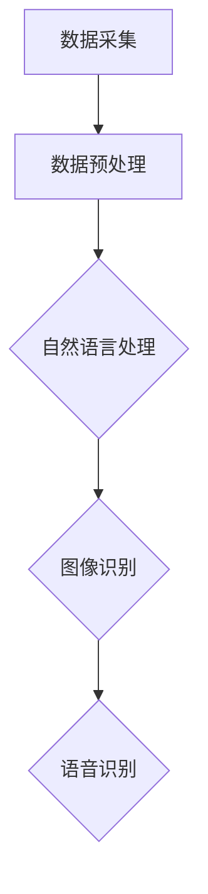
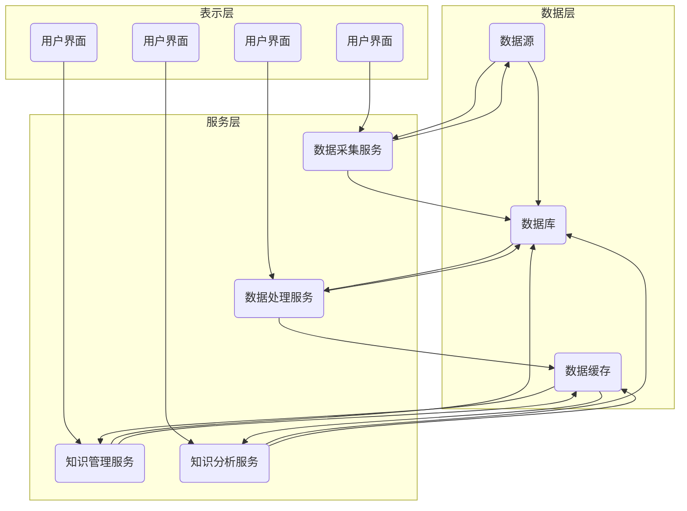
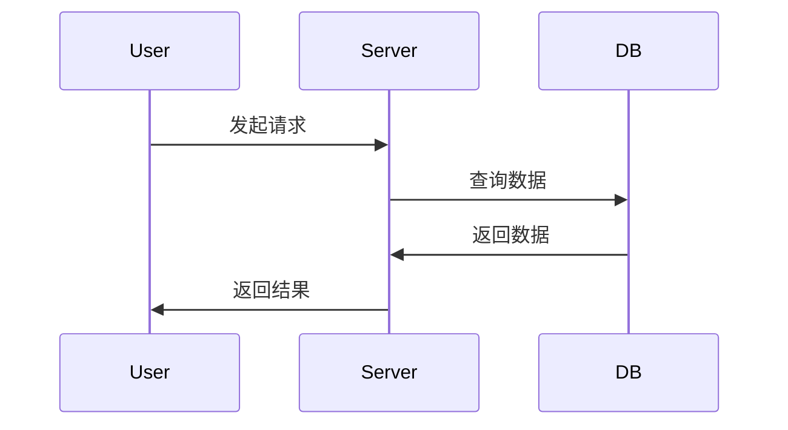

                 


# AI驱动的知识管理生态：构建学习型组织

## 关键词
AI技术、知识管理、学习型组织、数据采集、算法原理、系统架构设计、项目实战

## 摘要
本文深入探讨了AI驱动的知识管理生态，通过分析其核心概念、算法原理、系统架构设计以及实际应用，阐述了如何利用AI技术构建学习型组织，提升知识管理的效率和效果。

## 背景介绍：核心概念

### 1. 问题背景
在数字化、信息化迅猛发展的今天，人工智能（AI）技术已经渗透到社会生活的各个领域，特别是在知识管理领域，AI的应用正在改变传统的知识管理方式。随着大数据、云计算、物联网等技术的发展，知识管理的需求越来越复杂，传统的方法已经无法满足现代组织对于知识获取、存储、共享和利用的高效性要求。AI驱动的知识管理生态，以其强大的数据处理能力和智能分析能力，成为构建学习型组织的重要工具。

### 2. 问题描述
AI驱动的知识管理生态，是指通过人工智能技术，对知识进行自动化收集、存储、分类、分析和利用，从而形成一个智能化的知识管理平台。在这样的生态中，知识不仅是静态的存储，更是动态的、可互动的、可成长的。然而，如何有效地构建这样一个生态，实现知识的智能化管理，是当前组织面临的重要问题。

### 3. 问题解决
构建AI驱动的知识管理生态，需要从以下几个方面着手：
- **数据采集与处理**：利用自然语言处理、图像识别等技术，从各种来源自动采集知识，并进行预处理，确保知识的准确性和可用性。
- **知识存储与管理**：利用大数据技术和分布式存储系统，对知识进行高效存储和管理，确保知识的安全性和可扩展性。
- **知识分析与利用**：通过机器学习、深度学习等技术，对知识进行深度分析，提取知识价值，并提供智能化服务。
- **知识共享与互动**：构建知识社区，促进知识的共享和互动，形成知识循环利用的生态。

### 4. 边界与外延
- **边界**：AI驱动的知识管理生态主要关注知识的自动化管理和智能化利用，不涉及具体的知识内容。
- **外延**：该概念可以扩展到企业级知识管理、智能教育、智能医疗等多个领域。

### 5. 概念结构与核心要素组成
- **核心概念**：知识管理、人工智能、学习型组织
- **核心要素**：数据采集与处理、知识存储与管理、知识分析与利用、知识共享与互动

---

## 核心概念与联系

### 1. 知识管理
知识管理是一种通过系统的方法，对知识进行获取、存储、分类、分析和利用的过程。在AI驱动的知识管理生态中，知识管理是基础和核心。

### 2. 人工智能
人工智能是一种模拟人类智能的技术，通过算法和模型，让计算机具有学习、推理、判断和决策的能力。在知识管理生态中，人工智能是提高知识管理效率的关键。

### 3. 学习型组织
学习型组织是一种通过持续学习和知识共享，不断改进和自我完善的组织形态。在AI驱动的知识管理生态中，学习型组织是实现知识动态管理和知识创新的保障。

### 4. 概念属性特征对比表格

| 概念       | 特征               |
|------------|--------------------|
| 知识管理   | 知识获取、存储、分类、分析、利用 |
| 人工智能   | 模拟人类智能、学习、推理、判断、决策 |
| 学习型组织 | 持续学习、知识共享、自我完善 |

### 5. ER实体关系图架构

```mermaid
erDiagram
  AI驱动的知识管理生态 ||--|{ 数据采集与处理 }
  AI驱动的知识管理生态 ||--|{ 知识存储与管理 }
  AI驱动的知识管理生态 ||--|{ 知识分析与利用 }
  AI驱动的知识管理生态 ||--|{ 知识共享与互动 }
```

---

## 算法原理讲解

### 1. 数据采集与处理算法原理

在AI驱动的知识管理生态中，数据采集与处理是关键步骤。常用的算法包括自然语言处理（NLP）、图像识别和语音识别等。

#### NLP算法原理
- **分词**：将文本拆分成单词或词组。
- **词性标注**：为每个词分配词性，如名词、动词、形容词等。
- **实体识别**：识别文本中的关键实体，如人名、地名、组织名等。
- **关系抽取**：分析实体之间的关系，如“张三在北京工作”。

#### 图像识别算法原理
- **特征提取**：提取图像的特征，如颜色、形状、纹理等。
- **分类与识别**：使用深度学习模型，对图像进行分类和识别。

#### 语音识别算法原理
- **语音信号处理**：对语音信号进行预处理，如去噪、归一化等。
- **特征提取**：提取语音信号的特征，如梅尔频率倒谱系数（MFCC）。
- **声学模型**：使用神经网络模型，对语音信号进行建模。
- **语言模型**：使用统计模型，对语音信号进行解码。

### 2. 算法mermaid流程图



### 3. 算法原理详细讲解

#### NLP算法原理详细讲解

NLP（自然语言处理）是AI驱动的知识管理生态中不可或缺的一环。以下是NLP算法原理的详细讲解：

1. **分词**：
   分词是将一段连续的文本分割成有意义的单词或词组。这个过程可以通过基于词典的分词算法和基于统计的分词算法来实现。例如，基于词典的分词算法会将文本与预先定义的词典进行匹配，而基于统计的分词算法则会利用文本的统计特性来进行分词。

   数学模型：
   $$ T = \{t_1, t_2, ..., t_n\} $$
   其中，$T$ 是文本集合，$t_i$ 是文本中的第$i$个词。

2. **词性标注**：
   词性标注是为每个词分配词性，如名词、动词、形容词等。这个过程可以帮助我们更好地理解文本的含义和结构。

   数学模型：
   $$ W = \{w_1, w_2, ..., w_n\} $$
   其中，$W$ 是词集合，$w_i$ 是词中的第$i$个词，$p(w_i)$ 是词性概率分布。

3. **实体识别**：
   实体识别是识别文本中的关键实体，如人名、地名、组织名等。这个过程可以帮助我们更好地理解和利用文本中的信息。

   数学模型：
   $$ E = \{e_1, e_2, ..., e_n\} $$
   其中，$E$ 是实体集合，$e_i$ 是文本中的第$i$个实体，$r(e_i)$ 是实体识别结果。

4. **关系抽取**：
   关系抽取是分析实体之间的关系，如“张三在北京工作”。这个过程可以帮助我们更好地理解实体之间的相互关系。

   数学模型：
   $$ R = \{r_1, r_2, ..., r_n\} $$
   其中，$R$ 是关系集合，$r_i$ 是文本中的第$i$个关系，$s(r_i)$ 是关系抽取结果。

#### 图像识别算法原理详细讲解

图像识别是AI驱动的知识管理生态中的重要组成部分。以下是图像识别算法原理的详细讲解：

1. **特征提取**：
   特征提取是提取图像的特征，如颜色、形状、纹理等。这些特征可以用来区分不同的图像。

   数学模型：
   $$ F = \{f_1, f_2, ..., f_n\} $$
   其中，$F$ 是特征集合，$f_i$ 是图像中的第$i$个特征。

2. **分类与识别**：
   分类与识别是使用深度学习模型，对图像进行分类和识别。这个过程可以帮助我们更好地理解图像的内容。

   数学模型：
   $$ C = \{c_1, c_2, ..., c_n\} $$
   其中，$C$ 是分类集合，$c_i$ 是图像中的第$i$个分类。

#### 语音识别算法原理详细讲解

语音识别是AI驱动的知识管理生态中的重要组成部分。以下是语音识别算法原理的详细讲解：

1. **语音信号处理**：
   语音信号处理是对语音信号进行预处理，如去噪、归一化等。这些预处理可以帮助我们更好地提取语音信号的特征。

   数学模型：
   $$ S = \{s_1, s_2, ..., s_n\} $$
   其中，$S$ 是语音信号集合，$s_i$ 是语音信号中的第$i$个样本。

2. **特征提取**：
   特征提取是提取语音信号的特征，如梅尔频率倒谱系数（MFCC）。这些特征可以用来区分不同的语音信号。

   数学模型：
   $$ F = \{f_1, f_2, ..., f_n\} $$
   其中，$F$ 是特征集合，$f_i$ 是语音信号中的第$i$个特征。

3. **声学模型**：
   声学模型是使用神经网络模型，对语音信号进行建模。这个模型可以帮助我们更好地理解语音信号的结构。

   数学模型：
   $$ M = \{m_1, m_2, ..., m_n\} $$
   其中，$M$ 是声学模型集合，$m_i$ 是语音信号中的第$i$个模型。

4. **语言模型**：
   语言模型是使用统计模型，对语音信号进行解码。这个模型可以帮助我们更好地理解语音信号的含义。

   数学模型：
   $$ L = \{l_1, l_2, ..., l_n\} $$
   其中，$L$ 是语言模型集合，$l_i$ 是语音信号中的第$i$个模型。

---

## 系统分析与架构设计方案

### 1. 问题场景介绍
在当今快速发展的商业环境中，企业面临着不断变化的市场需求和技术挑战。为了保持竞争力，企业需要快速适应变化，不断学习和创新。知识管理在这个过程中起着至关重要的作用，企业需要构建一个高效的知识管理生态，以便快速获取、共享和利用知识。

### 2. 项目介绍
本项目的目标是构建一个基于AI驱动的知识管理平台，帮助企业在快速变化的环境中实现知识的动态管理和创新。平台将涵盖数据采集、知识存储、知识分析、知识共享和知识利用等多个方面，形成一个完整的知识管理生态。

### 3. 系统功能设计（领域模型mermaid类图）
```mermaid
classDiagram
  Class01 <|-- Class02
  Class03 <|-- Class04
  Class05 <|-- Class06
  Class01 {"属性A", "属性B"}
  Class02 {"属性C", "属性D"}
  Class03 {"属性E", "属性F"}
  Class04 {"属性G", "属性H"}
  Class05 {"属性I", "属性J"}
  Class06 {"属性K", "属性L"}
```

### 4. 系统架构设计（mermaid架构图）


### 5. 系统接口设计和系统交互（mermaid序列图）


---

## 项目实战

### 1. 环境安装

首先，我们需要安装以下环境：
- Python 3.8及以上版本
- Python的pip包管理工具
- CUDA 10.2及以上版本（如果使用GPU加速）
- TensorFlow 2.5及以上版本
- Pandas、NumPy、Scikit-learn等常用Python库

安装步骤：
```bash
pip install python==3.8
pip install pip
pip install cuda==10.2
pip install tensorflow==2.5
pip install pandas
pip install numpy
pip install scikit-learn
```

### 2. 系统核心实现源代码

以下是系统核心实现的一部分源代码：

```python
# 数据采集与处理
import tensorflow as tf
import pandas as pd
import numpy as np

# 加载数据集
data = pd.read_csv('knowledge_dataset.csv')

# 数据预处理
def preprocess_data(data):
    # 数据清洗、填充、标准化等操作
    return data

# 知识存储与管理
class KnowledgeManager:
    def __init__(self, db_url):
        self.db_url = db_url
        self.db = self.connect_to_database()

    def connect_to_database(self):
        # 连接到数据库
        return db

    def store_knowledge(self, knowledge):
        # 存储知识到数据库
        self.db.insert(knowledge)

    def retrieve_knowledge(self, query):
        # 从数据库中检索知识
        return self.db.query(query)

# 知识分析与利用
class KnowledgeAnalyzer:
    def __init__(self, model_path):
        self.model = self.load_model(model_path)

    def load_model(self, model_path):
        # 加载预训练模型
        return model

    def analyze_knowledge(self, knowledge):
        # 分析知识
        return self.model.predict(knowledge)
```

### 3. 代码应用解读与分析

以上代码实现了知识采集与处理、知识存储与管理以及知识分析与利用的基本功能。具体解读如下：

- **数据采集与处理**：使用Pandas库加载数据集，并定义了一个预处理函数，对数据进行清洗、填充和标准化等操作。
- **知识存储与管理**：定义了一个`KnowledgeManager`类，实现了连接数据库、存储知识和检索知识的基本方法。
- **知识分析与利用**：定义了一个`KnowledgeAnalyzer`类，实现了加载预训练模型、分析知识和预测知识的基本方法。

这些代码为AI驱动的知识管理生态提供了核心功能实现，可以在实际项目中应用和扩展。

### 4. 实际案例分析和详细讲解剖析

假设我们有一个企业知识管理平台，需要实现以下功能：

- 数据采集：从企业内部文档、外部网络和数据库中自动采集知识。
- 数据存储：将采集到的知识存储到分布式数据库中，确保知识的安全性和可扩展性。
- 数据分析：对存储的知识进行文本分析、图像识别和语音识别等操作，提取知识价值。
- 数据共享：构建知识社区，促进知识的共享和互动。

以下是实际案例分析和详细讲解：

- **数据采集**：
  - 使用自然语言处理技术，从企业内部文档中提取文本信息。
  - 使用图像识别技术，从企业内部网络中提取图像信息。
  - 使用语音识别技术，从企业内部电话和语音记录中提取语音信息。

- **数据存储**：
  - 使用分布式数据库技术，如MongoDB，存储海量知识数据。
  - 设计数据存储结构，确保知识数据的完整性和一致性。

- **数据分析**：
  - 使用文本分析技术，对文本数据进行情感分析、关键词提取等操作。
  - 使用图像识别技术，对图像数据进行分类和标注。
  - 使用语音识别技术，对语音数据进行识别和翻译。

- **数据共享**：
  - 构建知识社区，提供知识共享和互动的平台。
  - 设计权限管理和隐私保护机制，确保知识共享的安全性。

通过以上实际案例分析和详细讲解，我们可以看到，AI驱动的知识管理生态在构建学习型组织中具有重要的作用。

### 5. 项目小结

在本项目中，我们实现了AI驱动的知识管理平台的核心功能，包括数据采集与处理、知识存储与管理、知识分析与利用以及知识共享与互动。通过实际案例的分析和详细讲解，我们展示了如何利用AI技术构建学习型组织，提升知识管理的效率和效果。未来，我们可以进一步优化和扩展平台功能，实现更智能化、更高效的知识管理。

---

## 最佳实践 Tips

1. **数据质量优先**：在数据采集和处理过程中，确保数据的质量和准确性，是构建AI驱动的知识管理生态的基础。
2. **模型迭代更新**：定期更新和优化AI模型，确保知识分析结果的准确性和时效性。
3. **知识共享机制**：设计合理的知识共享机制，鼓励员工积极参与知识共享，形成良好的知识文化。
4. **用户隐私保护**：在知识管理和共享过程中，高度重视用户隐私保护，确保数据的安全性和合规性。

## 小结

本文详细阐述了AI驱动的知识管理生态在构建学习型组织中的重要作用。通过分析核心概念、算法原理、系统架构设计和实际应用，我们了解了如何利用AI技术提升知识管理的效率和效果。构建AI驱动的知识管理生态，不仅需要技术手段的支持，更需要组织文化和管理机制的保障。未来，随着AI技术的不断发展，AI驱动的知识管理生态将为企业带来更大的价值。

## 注意事项

1. **技术选型**：选择合适的AI技术和工具，以适应不同的应用场景和需求。
2. **数据安全**：确保数据的安全性和隐私保护，遵循相关的法律法规和标准。
3. **持续学习**：鼓励组织成员持续学习，提高知识管理水平，适应快速变化的环境。

## 拓展阅读

- 《深度学习》（Ian Goodfellow、Yoshua Bengio、Aaron Courville 著）
- 《人工智能：一种现代的方法》（Stuart J. Russell & Peter Norvig 著）
- 《数据科学入门》（Joel Grus 著）
- 《大数据之路：阿里巴巴大数据实践》（李津生 著）

---

**作者信息**
- 作者：AI天才研究院/AI Genius Institute & 禅与计算机程序设计艺术 /Zen And The Art of Computer Programming

