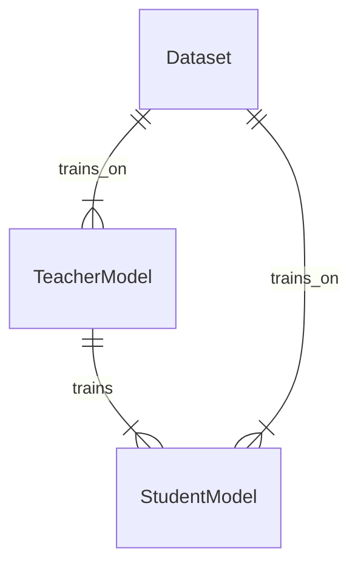

                 

# AI驱动的知识蒸馏平台：提炼核心企业能力

关键词：人工智能、知识蒸馏、平台、企业能力、性能优化

摘要：
随着人工智能技术的不断进步，知识蒸馏作为一种高效的模型压缩技术，日益受到企业的关注。本文旨在探讨AI驱动的知识蒸馏平台的设计与实现，通过提炼核心企业能力，帮助企业在资源有限的情况下，依然能够充分利用人工智能技术提升业务效率。文章将分步骤解析知识蒸馏平台的构建，包括教师模型库、学生模型生成器、蒸馏过程控制器和性能评估工具等关键组成部分，并探讨其设计原则、核心原理和实现方法。

## 第1章: AI驱动的知识蒸馏平台概述

### 1.1 问题背景

随着深度学习技术的快速发展，大型神经网络模型在图像识别、自然语言处理等领域取得了显著的成果。然而，这些大型模型往往需要大量的计算资源和数据支持，这对许多企业和组织来说是一个巨大的挑战。如何在高计算成本和数据需求的前提下，充分发挥人工智能的潜力，成为企业亟需解决的问题。

### 1.2 问题描述

知识蒸馏技术提供了一种有效的解决方案。知识蒸馏是将大型模型（教师模型）的知识传递给小型模型（学生模型）的过程，使得学生模型可以在有限的资源下实现接近教师模型的性能。然而，如何有效地设计知识蒸馏平台，选择合适的教师模型，设计蒸馏过程，以及评估学生模型的性能，仍然是需要深入探讨的问题。

### 1.3 问题解决

为了解决上述问题，我们需要一个完整的知识蒸馏平台，该平台应包括以下几个核心组成部分：

1. **教师模型库**：存储和提供各种领域的教师模型，为学生模型提供丰富的知识来源。
2. **学生模型生成器**：根据教师模型的知识，生成适用于不同应用场景的学生模型。
3. **蒸馏过程控制器**：设计并控制知识蒸馏过程，确保知识的有效传递。
4. **性能评估工具**：评估学生模型的性能，提供优化建议。

### 1.4 边界与外延

知识蒸馏平台不仅适用于传统的图像识别和自然语言处理领域，还可以应用于推荐系统、语音识别等多个场景。在实际应用中，知识蒸馏平台可以根据企业的具体需求，灵活调整模型的选择、蒸馏过程和评估方法。

### 1.5 概念结构与核心要素组成

知识蒸馏平台的架构由以下几个核心要素组成：

1. **教师模型库**：包括教师模型的存储和管理，以及教师模型的训练和优化。
2. **学生模型生成器**：包括学生模型的架构设计、参数初始化和训练策略。
3. **蒸馏过程控制器**：包括蒸馏过程的参数调整、策略选择和过程监控。
4. **性能评估工具**：包括性能评估指标的设定、评估过程的实现和结果分析。

### 1.6 知识蒸馏核心概念原理

知识蒸馏的核心思想是将教师模型的内部知识（如权重、激活值等）传递给学生模型，从而提高学生模型的性能。具体过程如下：

1. **编码器**：将输入数据编码为中间表示。
2. **解码器**：将中间表示解码为输出结果。
3. **知识传递**：将教师模型的中间表示传递给学生模型，作为额外的训练目标。
4. **优化**：通过调整学生模型的参数，优化学生模型的性能。

### 1.7 概念属性特征对比表格

| 特征 | 教师模型 | 学生模型 |
| --- | --- | --- |
| **计算资源** | 高 | 低 |
| **数据量** | 大 | 小 |
| **性能** | 高 | 低 |
| **应用范围** | 广泛 | 窄 |

### 1.8 知识蒸馏ER实体关系图架构

## 第2章: AI驱动的知识蒸馏平台设计

### 2.1 教师模型库设计

教师模型库的设计包括以下几个方面：

1. **模型选择**：根据应用场景选择合适的教师模型，如卷积神经网络（CNN）用于图像识别，循环神经网络（RNN）用于自然语言处理。
2. **模型训练**：使用大量数据训练教师模型，提高模型性能。训练过程中需要注意数据的多样性和质量，以避免模型过拟合。
3. **模型存储**：将训练好的教师模型存储在数据库中，便于后续使用。模型存储应考虑模型参数的压缩和加密，以保护模型知识产权。

### 2.2 学生模型生成器设计

学生模型生成器的设计包括以下几个方面：

1. **模型架构**：根据教师模型的特点和需求，设计适用于不同应用场景的学生模型架构，如压缩卷积神经网络（C

