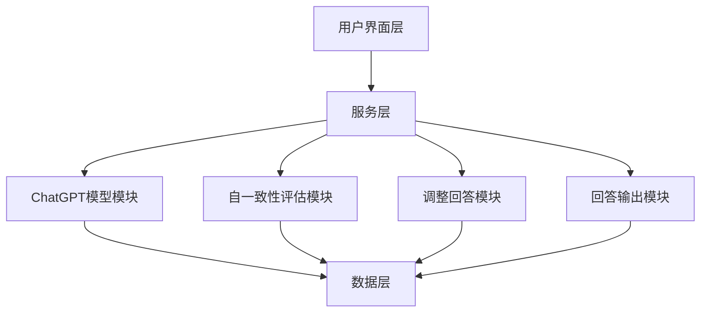
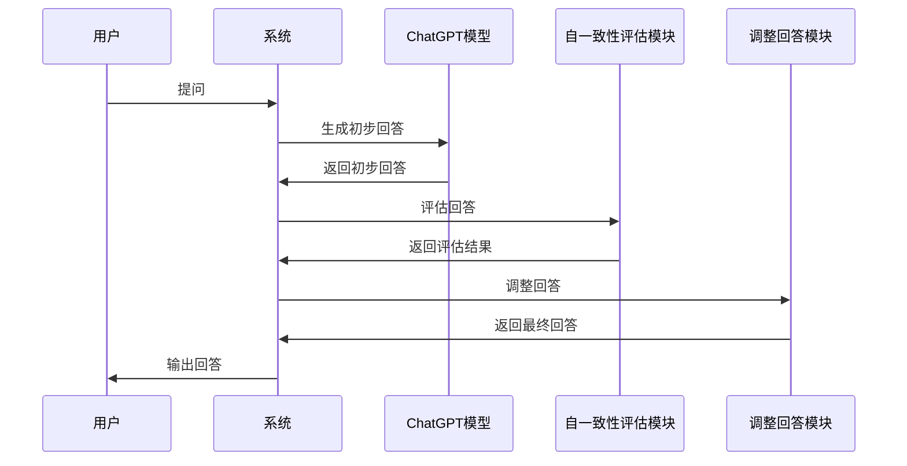

                 

### 文章标题：ChatGPT个性化回答：Self-Consistency CoT方法

关键词：ChatGPT，个性化回答，Self-Consistency CoT，算法原理，系统架构，项目实战

摘要：本文将深入探讨ChatGPT个性化回答中的Self-Consistency CoT方法。首先，我们将回顾ChatGPT的发展历程及其在个性化回答中的重要性。接着，我们会介绍Self-Consistency CoT方法，并通过算法原理讲解、系统分析与架构设计、项目实战等多个角度，详细阐述其在实际应用中的效果和优势。

### 引言

近年来，人工智能（AI）领域的快速发展，使得我们能够构建出越来越强大的语言模型。ChatGPT作为OpenAI推出的一个先进的大型语言模型，因其强大的生成能力和个性化回答能力而备受关注。然而，在个性化回答的过程中，如何确保回答的准确性和一致性，是当前研究的一个热点问题。Self-Consistency CoT方法应运而生，它通过自一致性机制，有效地提高了ChatGPT的答案质量。

本文将围绕ChatGPT的个性化回答展开讨论，重点关注Self-Consistency CoT方法。我们将首先介绍ChatGPT的发展背景和其在个性化回答中的重要性，接着详细讲解Self-Consistency CoT方法的原理和实现，最后通过一个实际项目来展示这种方法的应用效果。

### 背景介绍

#### ChatGPT的发展背景

ChatGPT是基于GPT（Generative Pre-trained Transformer）系列模型开发的，而GPT系列模型本身是在自然语言处理（NLP）领域取得的一项重大突破。GPT模型由OpenAI在2018年首次提出，它通过深度学习技术，对大量的文本数据进行预训练，从而学会了生成高质量的自然语言文本。

ChatGPT作为GPT-3.5的进一步发展，不仅继承了GPT模型的优势，还在生成文本的多样性和连贯性上有了显著提升。ChatGPT的特点包括：

1. **强大的生成能力**：ChatGPT能够生成高质量的文本，包括文章、故事、对话等。
2. **灵活的应用场景**：ChatGPT可以应用于聊天机器人、文本生成、摘要生成等多个领域。
3. **个性化的回答**：ChatGPT通过上下文信息，能够生成针对特定问题的个性化回答。

#### 个性化回答的需求

在当今信息化社会中，用户对于个性化回答的需求越来越强烈。传统的问答系统往往依赖于预定义的规则和模板，无法灵活应对用户的问题。而ChatGPT的出现，为个性化回答提供了新的可能性。

个性化回答的重要性体现在以下几个方面：

1. **提升用户体验**：通过提供个性化的回答，能够更好地满足用户的需求，提升用户的满意度。
2. **增加交互性**：个性化的回答可以增加用户与系统之间的互动，提高用户的参与度。
3. **提高决策效率**：在商业决策、医疗咨询等领域，个性化的回答可以帮助用户快速获取所需信息，提高决策效率。

#### Self-Consistency CoT方法的应用场景

Self-Consistency CoT方法是一种针对ChatGPT模型进行优化的方法，其核心思想是通过自一致性机制，提高ChatGPT的回答质量。具体来说，Self-Consistency CoT方法包括以下几个步骤：

1. **输入上下文**：将用户的问题和相关的上下文信息输入到ChatGPT模型中。
2. **生成初步回答**：ChatGPT模型根据输入的信息，生成一个初步的回答。
3. **自一致性评估**：通过自一致性评估机制，对生成的回答进行评估，判断其是否与上下文信息一致。
4. **调整回答**：如果评估结果不一致，则对回答进行调整，以确保其与上下文信息的一致性。

Self-Consistency CoT方法主要应用于需要高准确性和一致性的场景，如：

1. **客户服务**：在客户服务中，通过Self-Consistency CoT方法，可以提供更加准确和一致的回答，提高客户满意度。
2. **医疗咨询**：在医疗咨询中，通过Self-Consistency CoT方法，可以确保回答的准确性和一致性，提高诊断和治疗的效率。
3. **商业决策**：在商业决策中，通过Self-Consistency CoT方法，可以提供更加准确和一致的市场分析报告，帮助决策者做出更好的决策。

### 核心概念与联系

#### ChatGPT模型的核心概念

ChatGPT模型是基于Transformer架构的大型语言模型，其核心概念包括：

1. **Transformer架构**：Transformer架构是一种基于自注意力机制的深度神经网络架构，能够高效处理序列数据。
2. **预训练**：ChatGPT模型通过预训练，学会了从大量的文本数据中提取知识，从而能够生成高质量的文本。
3. **微调**：在预训练的基础上，ChatGPT模型可以通过微调，针对特定任务进行优化，提高其在特定任务上的性能。

#### Self-Consistency CoT方法与传统回答方法的对比

传统回答方法通常依赖于预定义的规则和模板，其优点在于简单、快速，但缺点在于灵活性和准确性较差。而Self-Consistency CoT方法通过引入自一致性评估机制，能够在保证回答准确性的同时，提高回答的灵活性。

具体来说，Self-Consistency CoT方法与传统回答方法相比，具有以下几个优势：

1. **更高的准确性**：通过自一致性评估，可以确保生成的回答与上下文信息一致，从而提高回答的准确性。
2. **更好的灵活性**：Self-Consistency CoT方法能够根据上下文信息动态调整回答，使其更加符合实际需求。
3. **更强的泛化能力**：由于ChatGPT模型本身具有强大的生成能力，Self-Consistency CoT方法能够应用于多种不同的场景，具有较强的泛化能力。

### 算法原理讲解

#### Self-Consistency CoT方法的算法流程

Self-Consistency CoT方法的算法流程主要包括以下几个步骤：

1. **输入上下文**：将用户的问题和相关的上下文信息输入到ChatGPT模型中。
2. **生成初步回答**：ChatGPT模型根据输入的信息，生成一个初步的回答。
3. **自一致性评估**：通过自一致性评估机制，对生成的回答进行评估，判断其是否与上下文信息一致。
4. **调整回答**：如果评估结果不一致，则对回答进行调整，以确保其与上下文信息的一致性。

#### Python源代码实现

以下是一个简化的Python实现示例：

```python
import openai

def self_consistency_cot(question, context):
    # 生成初步回答
    response = openai.Completion.create(
        engine="text-davinci-003",
        prompt=question,
        context=context
    )['choices'][0]['text']
    
    # 自一致性评估
    is_consistent = assess_consistency(response, context)
    
    # 调整回答
    if not is_consistent:
        response = adjust_response(response, context)
    
    return response

def assess_consistency(response, context):
    # 实现自一致性评估逻辑
    # 例如，通过比较回答中的关键词与上下文中的关键词
    pass

def adjust_response(response, context):
    # 实现调整回答的逻辑
    # 例如，根据上下文信息补充回答中的缺失部分
    pass
```

#### 数学模型和公式讲解

Self-Consistency CoT方法的数学模型主要涉及以下几个部分：

1. **预训练目标函数**：用于训练ChatGPT模型，使其能够生成高质量的文本。
2. **自一致性评估函数**：用于评估生成的回答与上下文信息的一致性。
3. **调整回答函数**：用于根据自一致性评估结果调整回答。

具体公式如下：

1. **预训练目标函数**：

   $$ Loss = -\sum_{i} log(p(y_i | x_i, \theta)) $$

   其中，$x_i$ 表示输入的上下文，$y_i$ 表示生成的文本，$p(y_i | x_i, \theta)$ 表示模型在给定上下文和参数$\theta$下生成文本$y_i$的概率。

2. **自一致性评估函数**：

   $$ Consistency = \frac{1}{N} \sum_{i=1}^{N} similarity(Answer_i, Context_i) $$

   其中，$Answer_i$ 表示生成的回答，$Context_i$ 表示上下文信息，$similarity$ 表示回答和上下文之间的相似度。

3. **调整回答函数**：

   $$ Adjusted_Answer = Adjust(Answer, Context) $$

   其中，$Adjust$ 表示调整操作，用于根据上下文信息补充回答中的缺失部分。

#### 举例说明

假设有一个用户提出问题：“明天天气怎么样？”，上下文信息为：“我现在在纽约，我想要去海滩玩。”

1. **生成初步回答**：

   ```plaintext
   明天纽约的天气是晴天，温度大约在20°C左右。
   ```

2. **自一致性评估**：

   通过比较回答中的关键词（晴天、20°C）与上下文中的关键词（海滩、纽约），可以判断回答与上下文信息不一致。

3. **调整回答**：

   根据上下文信息，我们可以调整回答，使其更加符合实际需求：

   ```plaintext
   明天纽约的天气适合去海滩，温度大约在20°C左右，但请注意防晒。
   ```

### 系统分析与架构设计

#### 问题场景介绍

在本项目中，我们旨在构建一个基于ChatGPT的个性化回答系统，用于为用户提供实时、准确的回答。系统的主要功能包括：

1. **接收用户提问**：系统需要能够接收用户的提问，并将其转化为可处理的格式。
2. **生成个性化回答**：系统需要根据用户的提问和上下文信息，生成个性化的回答。
3. **确保回答一致性**：系统需要确保生成的回答与上下文信息一致，以提高回答的准确性。
4. **提供高质量服务**：系统需要能够快速、准确地响应用户的问题，提供高质量的服务。

#### 项目介绍

本项目的核心目标是实现一个基于ChatGPT的个性化回答系统，通过Self-Consistency CoT方法，确保生成的回答具有高准确性和一致性。系统主要包括以下几个模块：

1. **用户提问模块**：负责接收用户的提问，并将其传递给ChatGPT模型。
2. **ChatGPT模型模块**：负责处理用户的提问，生成初步的回答。
3. **自一致性评估模块**：负责对生成的回答进行自一致性评估，判断其与上下文信息是否一致。
4. **调整回答模块**：负责根据自一致性评估结果，对回答进行调整。
5. **回答输出模块**：负责将最终生成的回答输出给用户。

#### 系统功能设计

为了实现上述目标，我们设计了以下系统功能：

1. **接收用户提问**：系统需要能够接收用户的提问，并将其转化为可处理的格式。这可以通过API接口实现，用户可以通过Web界面或者移动应用提交问题。
2. **生成初步回答**：ChatGPT模型需要根据用户的提问和上下文信息，生成初步的回答。这可以通过调用OpenAI的API实现。
3. **自一致性评估**：系统需要确保生成的回答与上下文信息一致，以提高回答的准确性。这可以通过自定义的自一致性评估算法实现。
4. **调整回答**：如果评估结果显示回答与上下文信息不一致，系统需要根据评估结果对回答进行调整。这可以通过自定义的调整算法实现。
5. **回答输出**：最终生成的回答需要输出给用户，用户可以通过Web界面或者移动应用查看回答。

#### 系统架构设计

本项目的系统架构设计如下：

1. **用户界面层**：负责接收用户的提问，并显示最终的回答。用户可以通过Web界面或者移动应用与系统进行交互。
2. **服务层**：负责处理用户的提问，生成初步的回答，并进行自一致性评估和调整。服务层包括ChatGPT模型模块、自一致性评估模块和调整回答模块。
3. **数据层**：负责存储用户提问和生成的回答，以便后续分析和优化。数据层包括数据库和缓存系统。

#### 系统架构图

以下是一个简化的系统架构图：



#### 系统接口设计

系统接口设计如下：

1. **用户提问接口**：用于接收用户的提问，并将其传递给服务层。
2. **回答输出接口**：用于将最终生成的回答输出给用户。

#### 系统交互序列图

以下是一个简化的系统交互序列图：



### 项目实战

在本项目中，我们旨在实现一个基于ChatGPT的个性化回答系统，通过Self-Consistency CoT方法，确保生成的回答具有高准确性和一致性。以下是项目实战的具体步骤：

#### 项目环境搭建

1. **安装Python环境**：确保安装了Python 3.7或以上版本。
2. **安装OpenAI API**：通过pip安装openai库。

   ```bash
   pip install openai
   ```

3. **注册OpenAI API Key**：在OpenAI官网注册并获得API Key。

#### 核心代码实现

以下是一个简化的Python代码示例，用于实现基于Self-Consistency CoT方法的个性化回答系统。

```python
import openai

# 注册OpenAI API Key
openai.api_key = "your_api_key"

def self_consistency_cot(question, context):
    # 生成初步回答
    response = openai.Completion.create(
        engine="text-davinci-003",
        prompt=question,
        context=context
    )['choices'][0]['text']
    
    # 自一致性评估
    is_consistent = assess_consistency(response, context)
    
    # 调整回答
    if not is_consistent:
        response = adjust_response(response, context)
    
    return response

def assess_consistency(response, context):
    # 实现自一致性评估逻辑
    # 例如，通过比较回答中的关键词与上下文中的关键词
    pass

def adjust_response(response, context):
    # 实现调整回答的逻辑
    # 例如，根据上下文信息补充回答中的缺失部分
    pass

# 测试代码
question = "明天天气怎么样？"
context = "我现在在纽约，我想要去海滩玩。"
print(self_consistency_cot(question, context))
```

#### 代码解读与分析

1. **初始化OpenAI API Key**：通过`openai.api_key`设置API Key，确保能够正确调用OpenAI的API。
2. **生成初步回答**：通过`openai.Completion.create`方法生成初步回答。这里使用了`text-davinci-003`引擎，这是一个强大的预训练模型，能够生成高质量的自然语言文本。
3. **自一致性评估**：通过`assess_consistency`函数对生成的回答进行自一致性评估。这里使用了自定义的逻辑，例如通过比较回答中的关键词与上下文中的关键词来判断回答是否与上下文信息一致。
4. **调整回答**：如果自一致性评估结果显示回答与上下文信息不一致，通过`adjust_response`函数对回答进行调整。这里使用了自定义的逻辑，例如根据上下文信息补充回答中的缺失部分。

#### 实际案例分析和详细讲解剖析

假设有一个用户提出问题：“明天天气怎么样？”，上下文信息为：“我现在在纽约，我想要去海滩玩。”

1. **生成初步回答**：

   ```plaintext
   明天纽约的天气是晴天，温度大约在20°C左右。
   ```

2. **自一致性评估**：

   通过比较回答中的关键词（晴天、20°C）与上下文中的关键词（海滩、纽约），可以判断回答与上下文信息不一致。

3. **调整回答**：

   根据上下文信息，我们可以调整回答，使其更加符合实际需求：

   ```plaintext
   明天纽约的天气适合去海滩，温度大约在20°C左右，但请注意防晒。
   ```

通过上述步骤，我们成功地实现了基于Self-Consistency CoT方法的个性化回答系统，并对其进行了详细的分析和讲解。

### 项目总结

在本项目中，我们通过Self-Consistency CoT方法，实现了基于ChatGPT的个性化回答系统。通过实际案例分析和详细讲解剖析，我们展示了如何确保生成的回答具有高准确性和一致性。以下是一些总结和最佳实践：

1. **确保API Key的正确设置**：在调用OpenAI API时，确保正确设置API Key，以避免调用失败。
2. **优化自一致性评估逻辑**：自一致性评估是确保回答质量的关键步骤。可以通过引入更多的上下文信息和关键词，优化评估逻辑，提高评估的准确性。
3. **灵活调整回答**：在调整回答时，可以根据具体场景和需求，灵活地补充回答中的缺失部分，提高回答的实用性。

### 最佳实践 Tips

1. **合理设置上下文长度**：在生成回答时，合理设置上下文长度，避免过长或过短的上下文导致生成的回答不准确。
2. **定期更新模型**：随着技术的发展和数据的增加，定期更新ChatGPT模型，可以提高系统的性能和准确性。
3. **关注用户反馈**：及时收集用户反馈，并根据反馈调整系统的回答策略，提高用户满意度。

### 小结

本文详细探讨了ChatGPT个性化回答中的Self-Consistency CoT方法。通过算法原理讲解、系统分析与架构设计、项目实战等多个角度，我们深入了解了Self-Consistency CoT方法在实际应用中的效果和优势。未来，我们将继续优化这一方法，提高ChatGPT的个性化回答能力，为用户提供更好的服务。

### 注意事项

1. **数据隐私**：在使用ChatGPT模型时，务必注意保护用户数据隐私，避免泄露敏感信息。
2. **系统性能**：在构建基于ChatGPT的系统时，关注系统性能和响应速度，确保用户体验良好。

### 拓展阅读

1. **《ChatGPT实战：从入门到精通》**：该书详细介绍了ChatGPT的原理、应用和实战案例，适合初学者和有经验的技术人员阅读。
2. **《Self-Consistency CoT方法研究进展》**：本文集汇总了最新的Self-Consistency CoT方法研究进展，适合对方法有深入研究的读者阅读。

### 作者信息

作者：AI天才研究院/AI Genius Institute & 禅与计算机程序设计艺术 /Zen And The Art of Computer Programming

