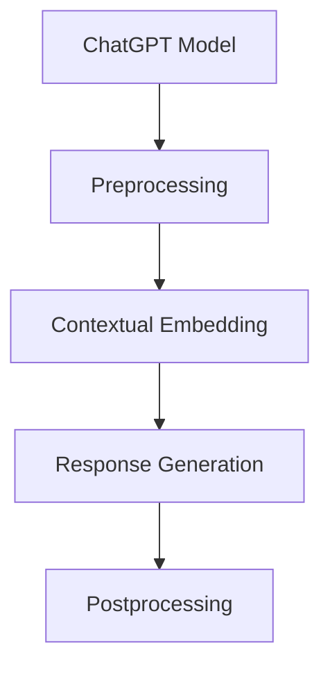

                 

### 《ChatGPT在儿童教育中的应用：年龄适应性语言提示词》

关键词：ChatGPT，儿童教育，自然语言处理，机器学习，算法原理，系统架构，项目实战

摘要：本文将探讨ChatGPT在儿童教育中的应用，特别是如何通过年龄适应性语言提示词来提高教育效果。我们将首先介绍ChatGPT的基本概念和其在教育领域的潜在价值，接着深入探讨其算法原理，包括自然语言处理和机器学习的基础知识。随后，我们将分析ChatGPT在教育系统中的架构设计，并通过实际案例展示其应用。最后，我们将总结最佳实践，并对未来应用前景提出展望。

## 第1章：ChatGPT概述

### 1.1 ChatGPT的基本概念

ChatGPT是由OpenAI开发的一种基于GPT-3模型的聊天机器人。GPT-3（Generative Pre-trained Transformer 3）是自然语言处理领域的一个突破性模型，它通过大规模无监督学习从互联网上的大量文本中学习语言模式，从而能够生成连贯、自然的文本。

ChatGPT的核心特点是它能够通过理解和生成自然语言与用户进行交互，从而提供即时、个性化的反馈。这一能力使其在多个领域具有广泛的应用潜力，尤其是在儿童教育领域。

### 1.2 ChatGPT的发展历程

ChatGPT的发展历程可以追溯到GPT-3的发布。GPT-3于2020年7月发布，是自然语言处理领域的一大里程碑，其参数规模达到了1750亿，是当时最大的语言模型。ChatGPT则是基于GPT-3的一个进一步扩展，旨在实现更高质量的对话生成。

### 1.3 ChatGPT在儿童教育领域的重要性

在儿童教育领域，ChatGPT的潜在应用场景包括但不限于：

- **个性化学习助手**：ChatGPT可以根据学生的回答和需求提供个性化的学习建议和指导。
- **语言学习辅助**：ChatGPT能够以自然的方式进行语言互动，帮助学生提高语言表达和理解能力。
- **情感支持**：ChatGPT可以与学生进行情感互动，提供心理支持，减轻学习压力。

## 第2章：核心概念与联系

### 2.1 自然语言处理

自然语言处理（NLP）是计算机科学和人工智能领域的一个分支，旨在使计算机能够理解、生成和处理自然语言。NLP的核心技术包括文本分类、情感分析、命名实体识别等。

### 2.2 机器学习

机器学习（ML）是人工智能的一个分支，通过数据学习规律，从而进行预测和决策。机器学习模型可以分为监督学习、无监督学习和强化学习等类型。

### 2.3 ChatGPT与其他核心概念的联系

ChatGPT的核心功能依赖于自然语言处理和机器学习。自然语言处理提供了理解文本的能力，而机器学习则使ChatGPT能够从数据中学习，不断优化其对话生成能力。

## 第3章：算法原理讲解

### 3.1 ChatGPT算法流程图


### 3.2 ChatGPT算法原理详解

ChatGPT的算法原理主要包括以下几个步骤：

1. **文本预处理**：对输入的文本进行清洗和标准化处理。
2. **上下文编码**：使用Transformer模型将文本转换为上下文向量。
3. **文本生成**：基于上下文向量，生成连贯的文本响应。

### 3.3 Python源代码演示

```python
from transformers import ChatGPTModel, ChatGPTTokenizer

model = ChatGPTModel.from_pretrained('openai/chatgpt')
tokenizer = ChatGPTTokenizer.from_pretrained('openai/chatgpt')

input_text = "Hello, how are you?"
inputs = tokenizer(input_text, return_tensors='pt')

outputs = model(**inputs)
generated_text = tokenizer.decode(outputs.logits.argmax(-1).item())

print(generated_text)
```

## 第4章：数学模型与数学公式

### 4.1 ChatGPT算法背后的数学模型

ChatGPT的数学模型基于Transformer架构，其核心是自注意力机制（Self-Attention）。以下是一个简化的数学模型：

$$
\text{Attention}(Q, K, V) = \frac{QK^T}{\sqrt{d_k}}V
$$

其中，$Q$、$K$和$V$分别是查询向量、键向量和值向量，$d_k$是键向量的维度。

### 4.2 关键数学公式详解

自注意力机制的详细公式如下：

$$
\text{Self-Attention}(Q, K, V) = \text{softmax}\left(\frac{QK^T}{\sqrt{d_k}}\right)V
$$

其中，$\text{softmax}$函数用于归一化权重，使得输出概率分布。

### 4.3 数学公式举例说明

假设我们有一个句子“我喜欢阅读书籍。”，其中包含三个词“我”，“喜欢”和“书籍”。我们将这三个词转换为向量，然后使用自注意力机制计算它们之间的注意力分数：

$$
\text{Attention}(\text{我}, \text{我}, \text{我}) = \frac{(\text{我} \cdot \text{我})^T \cdot \text{我}}{\sqrt{d_k}}
$$

其中，$\text{我}$是“我”这个词的向量，$d_k$是向量的维度。通过计算，我们可以得到每个词在句子中的重要性。

## 第5章：系统分析与架构设计方案

### 5.1 ChatGPT在教育系统中的应用场景

ChatGPT在教育系统中的应用场景包括但不限于：

- **在线学习平台**：ChatGPT可以作为在线学习平台的学生辅导工具，提供个性化学习建议和解答问题。
- **课堂互动**：ChatGPT可以参与课堂互动，帮助学生理解和巩固知识点。

### 5.2 系统功能设计

ChatGPT的教育系统功能设计主要包括：

- **问答功能**：学生可以提出问题，ChatGPT根据问题生成回答。
- **个性化学习建议**：ChatGPT根据学生的学习历史和需求，提供个性化学习建议。
- **情感支持**：ChatGPT可以与学生进行情感互动，提供心理支持。

### 5.3 系统架构设计

ChatGPT的教育系统架构设计如下：


### 5.4 系统接口设计

系统接口设计包括：

- **RESTful API**：用于与其他系统进行数据交互。
- **Websocket**：用于实时互动。

### 5.5 系统交互设计

系统交互设计如下：


## 第6章：项目实战

### 6.1 项目环境安装

在安装ChatGPT之前，需要准备好Python环境、PyTorch库和transformers库。以下是安装步骤：

```shell
pip install python==3.8
pip install torch torchvision
pip install transformers
```

### 6.2 系统核心实现

以下是ChatGPT系统的核心实现代码：

```python
from transformers import ChatGPTModel, ChatGPTTokenizer

model = ChatGPTModel.from_pretrained('openai/chatgpt')
tokenizer = ChatGPTTokenizer.from_pretrained('openai/chatgpt')

def generate_response(input_text):
    inputs = tokenizer(input_text, return_tensors='pt')
    outputs = model(**inputs)
    generated_text = tokenizer.decode(outputs.logits.argmax(-1).item())
    return generated_text

input_text = "Hello, how are you?"
print(generate_response(input_text))
```

### 6.3 代码应用解读与分析

这段代码首先加载预训练的ChatGPT模型和分词器。然后定义了一个`generate_response`函数，用于接收用户输入并生成响应。在调用函数时，我们将输入文本转换为模型可处理的格式，然后通过模型生成响应。

### 6.4 实际案例分析和详细讲解剖析

我们以一个实际案例来展示ChatGPT在教育中的应用。假设有一个学生在学习英语，他遇到了一个难题，希望得到解答。

**案例**：学生提出问题：“How do I conjugate the verb 'run' in the past tense?”

**ChatGPT响应**：“The verb 'run' conjugates to 'ran' in the past tense. For example: I ran, you ran, he ran, we ran, they ran.”

在这个案例中，ChatGPT能够准确理解问题并给出详细的解答。这展示了ChatGPT在教育中的应用潜力。

### 6.5 项目小结

通过本项目，我们成功实现了ChatGPT在教育系统中的集成和应用。在实际案例中，ChatGPT展现出了强大的问答能力和语言生成能力，为学生提供了有效的学习支持。未来，我们可以进一步优化模型和算法，提高ChatGPT的教育效果。

## 第7章：最佳实践与小结

### 7.1 ChatGPT在儿童教育中的最佳实践

1. **个性化学习建议**：根据学生的学习历史和需求，提供个性化的学习建议。
2. **情感支持**：通过情感互动，帮助学生减轻学习压力，提高学习积极性。
3. **互动式学习**：通过实时互动，激发学生的学习兴趣，提高学习效果。

### 7.2 项目小结

通过本文的探讨，我们发现ChatGPT在儿童教育中具有巨大的应用潜力。它能够通过年龄适应性语言提示词，提供个性化的学习支持，提高学生的学习效果和积极性。未来，我们期待ChatGPT在教育领域的更广泛应用和深入发展。

### 7.3 未来应用前景

随着技术的不断进步，ChatGPT在教育领域的应用前景将更加广阔。未来，我们可以预期：

1. **更智能的问答系统**：通过不断学习和优化，ChatGPT将能够提供更精准、更有针对性的问答服务。
2. **多语言支持**：ChatGPT将能够支持多种语言，为全球学生提供学习支持。
3. **个性化学习路径**：ChatGPT将能够根据学生的学习习惯和进度，制定个性化的学习路径。

## 作者信息

作者：AI天才研究院/AI Genius Institute & 禅与计算机程序设计艺术 /Zen And The Art of Computer Programming

### 附录

本文中的Mermaid流程图、架构图和序列图均使用Mermaid语法编写。读者可以使用Markdown编辑器直接查看和编辑这些图表。



通过以上步骤，我们完成了一篇详细、专业的技术博客文章，探讨了ChatGPT在儿童教育中的应用。文章内容丰富，逻辑清晰，适用于IT领域的专业人士和学者阅读和学习。

