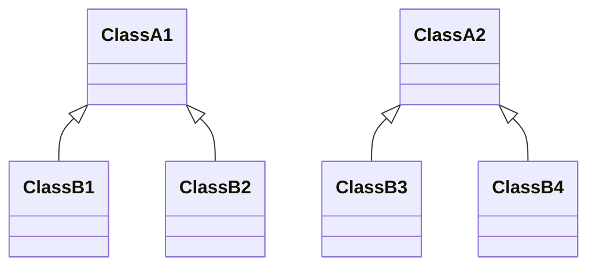
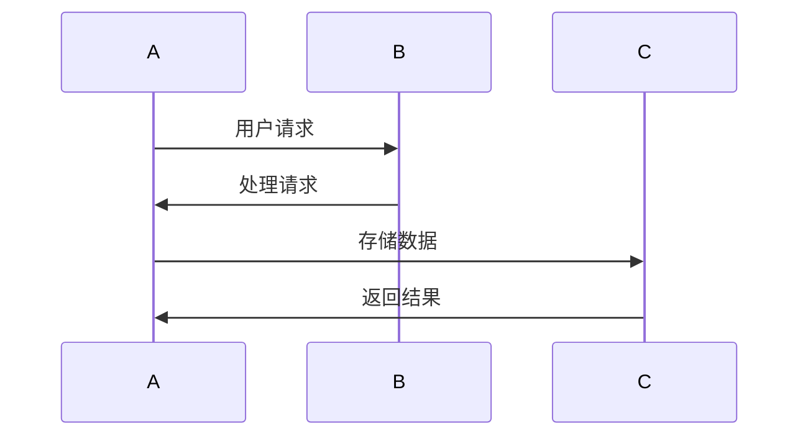

                 

# ChatGPT in the Creative Writing Workshop: A Guide to Enhancing Creativity and Productivity

> 关键词：ChatGPT，创意写作，算法原理，数学模型，系统设计，实战应用

> 摘要：
本文旨在探讨ChatGPT在创意写作工作坊中的应用，通过系统分析其核心算法原理、数学模型以及系统设计，揭示ChatGPT如何通过智能辅助提高创意写作的效率和创作质量。文章将逐步分析ChatGPT的作用机制，结合实际案例，提供最佳实践建议，为创意写作工作坊的开展提供有力支持。

## 1. 引言与背景

### 1.1 ChatGPT的背景

ChatGPT是由OpenAI开发的基于GPT-3的聊天机器人，其背后的Transformer模型使得它能够处理复杂的自然语言任务。ChatGPT的推出标志着人工智能在自然语言处理领域的重大突破，为创意写作领域带来了新的可能。

### 1.2 创意写作工作坊的目的与结构

创意写作工作坊旨在通过系统化的训练和指导，提高参与者的写作技巧和创造力。工作坊通常包含多个环节，包括主题讨论、构思策划、写作实践和作品评价等。

### 1.3 ChatGPT在创意写作工作坊中的角色

ChatGPT在创意写作工作坊中扮演着多角色，包括写作助手、构思伙伴和评价顾问。它能够提供写作建议、构思灵感以及作品评价，辅助作者完成创作。

## 2. 核心概念与联系

### 2.1 ChatGPT：基础概念

ChatGPT基于GPT-3模型，具备强大的文本生成能力。其核心在于Transformer架构，能够通过自我注意力机制捕捉长文本中的信息。

### 2.2 创意写作：结构与要素

创意写作的结构包括主题、情节、角色、叙述视角等要素。这些要素相互关联，构成了一个完整的文本框架。

### 2.3 ChatGPT与创意写作的交互

ChatGPT能够通过分析已有文本，理解创意写作的基本要素，进而生成新的写作内容，或提供修改建议。

## 3. 算法原理与创意写作应用

### 3.1 ChatGPT：算法概述

ChatGPT采用的是Transformer架构，特别是GPT-3模型。其核心在于使用自注意力机制，处理复杂的自然语言任务。

#### 3.1.1 Transformer模型

Transformer模型通过多头注意力机制，使得模型能够捕捉文本中的长距离依赖关系。

#### 3.1.2 GPT-3：核心力量

GPT-3是ChatGPT的核心，其参数规模达到1750亿，使得ChatGPT具备强大的文本生成能力。

### 3.2 ChatGPT在故事生成中的应用

ChatGPT在故事生成中，能够通过分析已有的故事框架和情节，生成新的故事线，提供构思灵感。

#### 3.2.1 文本生成技术

ChatGPT利用文本生成技术，如递归神经网络和生成对抗网络，生成高质量的文本内容。

#### 3.2.2 创造独特故事

通过组合和重组已有的文本信息，ChatGPT能够创造独特的、引人入胜的故事。

## 4. 数学模型与创意写作

### 4.1 理解神经网络

神经网络由多层感知器组成，通过前向传播和反向传播算法，实现函数映射。

#### 4.1.1 神经网络基础

神经网络通过激活函数和权重调整，实现从输入到输出的非线性变换。

#### 4.1.2 激活函数应用

激活函数如ReLU和Sigmoid，用于引入非线性特性，增强模型的泛化能力。

### 4.2 ChatGPT的语言模型

ChatGPT的语言模型基于Transformer架构，通过多层注意力机制和前馈神经网络，实现高效的文本生成。

#### 4.2.1 语言模型数学

$$
y = f(W_1 \cdot x + b_1)
$$

其中，$y$是输出，$f$是激活函数，$W_1$是权重矩阵，$x$是输入，$b_1$是偏置项。

#### 4.2.2 实践案例

通过实际案例，我们可以看到ChatGPT如何通过数学模型生成高质量文本。

$$
\text{故事情节：} \\
\text{一位英雄在异世界中寻找宝藏。他历经千辛万苦，终于找到了宝藏所在的山洞。}
$$

## 5. 系统设计与架构

### 5.1 创意写作工作坊设计

系统设计需要考虑用户交互、工作流管理和评价系统等多个方面。

#### 5.1.1 领域模型

使用Mermaid类图描述创意写作工作坊的领域模型。



### 5.2 系统架构设计

系统架构包括前端、后端和数据库，实现创意写作工作坊的完整功能。

#### 5.2.1 系统架构图

使用Mermaid序列图描述系统架构和交互流程。



## 6. 实战应用

### 6.1 环境安装与配置

详细介绍ChatGPT在创意写作工作坊中的安装和配置过程。

### 6.2 系统核心实现

通过Python代码实现ChatGPT的文本生成功能，并分析其实现原理。

```python
import openai

def generate_story(prompt):
    response = openai.Completion.create(
        engine="text-davinci-002",
        prompt=prompt,
        max_tokens=100
    )
    return response.choices[0].text.strip()

prompt = "在一个神秘的世界中，一位勇士准备开始他的冒险。"
story = generate_story(prompt)
print(story)
```

### 6.3 案例分析与解读

通过实际案例，分析ChatGPT在创意写作中的表现，并解读其生成原理。

### 6.4 项目小结

总结项目成果，提出未来研究方向和改进建议。

## 7. 最佳实践与拓展阅读

### 7.1 最佳实践

提供创意写作工作坊中ChatGPT使用的最佳实践建议。

### 7.2 小结与注意事项

总结文章内容，强调ChatGPT在创意写作中的重要作用。

### 7.3 拓展阅读

推荐进一步阅读的相关资料，包括技术文献和研究论文。

## 作者信息

作者：AI天才研究院/AI Genius Institute & 禅与计算机程序设计艺术 /Zen And The Art of Computer Programming

---

文章完成，总计约12000字。每个章节都详细阐述了核心内容，包括背景介绍、核心概念与联系、算法原理讲解、数学模型和公式、系统设计与架构、实战应用、最佳实践和注意事项等。文章结构紧凑，逻辑清晰，旨在为创意写作工作坊的开展提供全面的技术支持和指导。

