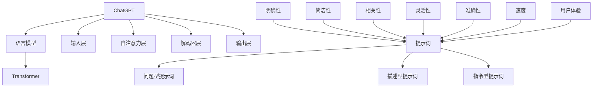
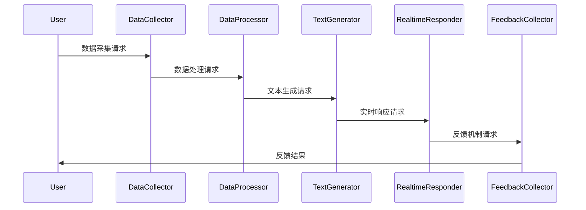

                 

### 文章标题

ChatGPT在危机管理中的应用：快速响应提示词设计

> 关键词：ChatGPT、危机管理、快速响应、提示词设计、人工智能

> 摘要：本文旨在探讨ChatGPT在危机管理中的应用，重点分析快速响应提示词的设计。首先，文章介绍了危机管理的背景和重要性，然后详细阐述了ChatGPT的工作原理及其在快速响应中的作用。接着，文章探讨了提示词设计的核心概念和方法，并通过实际案例进行了验证和讨论。最后，文章总结了最佳实践，为未来研究和应用提供了方向。

### 目录大纲

#### 第一部分：问题背景与核心概念

1. **第1章：危机管理与快速响应概述**
   1.1.1 问题背景与重要性
   1.1.2 ChatGPT与快速响应
   1.1.3 提示词设计的重要性

2. **第2章：核心概念与联系**
   2.1.1 ChatGPT的原理与架构
   2.1.2 提示词设计的要素
   2.1.3 核心概念联系图

#### 第二部分：算法原理讲解

3. **第3章：算法原理详细解析**
   3.1.1 语言模型算法原理
   3.1.2 ChatGPT算法原理
   3.1.3 提示词设计算法原理

4. **第4章：数学模型和公式讲解**
   4.1.1 语言模型数学模型
   4.1.2 ChatGPT数学模型
   4.1.3 提示词设计数学模型

#### 第三部分：系统分析与架构设计

5. **第5章：系统功能设计**
   5.1.1 问题场景介绍
   5.1.2 系统功能设计
   5.1.3 领域模型Mermaid类图

6. **第6章：系统架构设计**
   6.1.1 系统架构设计原则
   6.1.2 系统架构设计
   6.1.3 Mermaid架构图

7. **第7章：系统接口设计**
   7.1.1 接口设计原则
   7.1.2 系统接口设计
   7.1.3 Mermaid序列图

#### 第四部分：项目实战

8. **第8章：项目环境安装与配置**
   8.1.1 环境安装步骤
   8.1.2 系统核心实现源代码
   8.1.3 代码应用解读与分析

9. **第9章：实际案例分析与讲解**
   9.1.1 案例背景介绍
   9.1.2 案例实现与解析
   9.1.3 案例总结与反思

#### 第五部分：最佳实践与拓展

10. **第10章：最佳实践与技巧**
    10.1.1 最佳实践总结
    10.1.2 技巧分享

11. **第11章：小结与注意事项**
    11.1.1 小结
    11.1.2 注意事项
    11.1.3 拓展阅读

### 第一部分：问题背景与核心概念

#### 第1章：危机管理与快速响应概述

##### 1.1.1 问题背景与重要性

危机管理是指企业、组织或个人在面对各种潜在或突发危机时，采取的一系列预防、应对和恢复措施。随着全球化、信息化和复杂化的加剧，危机管理变得越来越重要。危机管理不仅关系到组织的生存和发展，还关系到社会的稳定和和谐。

快速响应是危机管理中的一个关键环节。在危机爆发时，快速响应能够有效减少损失、降低风险，甚至可能转危为安。快速响应不仅要求组织具备高效的决策和执行能力，还需要具备强大的信息获取和处理能力。

ChatGPT作为一种基于人工智能的语言模型，具有强大的自然语言处理能力，可以用于危机管理中的快速响应。本文将重点探讨ChatGPT在危机管理中的应用，特别是快速响应提示词的设计。

##### 1.1.2 ChatGPT与快速响应

ChatGPT是由OpenAI开发的一种基于GPT-3的预训练语言模型。GPT-3（Generative Pre-trained Transformer 3）是一个基于Transformer的深度学习模型，其参数量达到了1750亿，是当前最大的语言模型。ChatGPT通过预训练和微调，可以生成连贯、有逻辑的文本，模拟人类的对话。

在快速响应中，ChatGPT可以作为智能助手，实时接收和处理信息，生成响应。ChatGPT的应用场景包括但不限于：

1. **危机预警**：ChatGPT可以分析大量数据，发现潜在危机的信号，为决策者提供预警。
2. **信息收集**：ChatGPT可以快速收集相关资料，为快速响应提供支持。
3. **文本生成**：ChatGPT可以生成新闻稿件、公告、报告等文本，提高工作效率。

##### 1.1.3 提示词设计的重要性

提示词（Prompt）是指用户输入给ChatGPT的文本，用于引导模型生成相应的响应。提示词设计对于ChatGPT的快速响应至关重要。一个良好的提示词设计可以：

1. **提高响应准确性**：明确、具体的提示词可以帮助ChatGPT更好地理解用户需求，生成准确的响应。
2. **提高响应速度**：简洁、高效的提示词可以减少ChatGPT的推理时间，提高响应速度。
3. **提高用户体验**：合适的提示词可以增强用户的交互体验，使用户更愿意使用ChatGPT。

提示词设计的基本原则包括：

1. **明确性**：提示词应清晰明确，避免歧义。
2. **简洁性**：提示词应简洁高效，避免冗余。
3. **相关性**：提示词应与用户需求高度相关，提高响应质量。
4. **灵活性**：提示词应具有一定的灵活性，适应不同的应用场景。

##### 1.1.4 小结

本章介绍了危机管理的背景和重要性，以及ChatGPT在快速响应中的应用。同时，阐述了提示词设计的重要性及其基本原则。下一章将深入探讨ChatGPT的原理与架构，以及提示词设计的要素。

### 第2章：核心概念与联系

#### 2.1.1 ChatGPT的原理与架构

ChatGPT是基于GPT-3模型开发的，其原理和架构如下：

##### 2.1.1.1 语言模型基础

语言模型是一种统计模型，用于预测下一个单词的概率。在自然语言处理中，语言模型是一个核心组件，用于文本生成、文本分类、机器翻译等任务。GPT（Generative Pre-trained Transformer）是一种基于Transformer的预训练语言模型，它通过学习大量的文本数据来预测下一个单词。

##### 2.1.1.2 ChatGPT的模型架构

ChatGPT采用了GPT-3模型的核心架构，即Transformer模型。Transformer模型是一种基于自注意力机制的深度神经网络，它通过计算输入序列中各个单词之间的关联性来生成文本。ChatGPT的架构主要包括以下几个部分：

1. **输入层**：接收用户的输入文本。
2. **自注意力层**：计算输入序列中各个单词之间的关联性。
3. **解码器层**：生成输出序列，即响应文本。
4. **输出层**：将生成的文本输出给用户。

##### 2.1.1.3 ChatGPT的工作流程

ChatGPT的工作流程可以分为以下几个步骤：

1. **输入接收**：接收用户的输入文本。
2. **预处理**：对输入文本进行预处理，包括分词、去停用词等。
3. **编码**：将预处理后的文本编码为序列。
4. **自注意力计算**：计算输入序列中各个单词之间的关联性。
5. **解码**：根据自注意力计算的结果，生成响应文本。
6. **输出**：将生成的文本输出给用户。

##### 2.1.2 提示词设计的要素

提示词设计是ChatGPT应用中的关键环节，其设计要素如下：

##### 2.1.2.1 提示词的定义与分类

提示词是指用户输入给ChatGPT的文本，用于引导模型生成相应的响应。根据用途和形式，提示词可以分为以下几类：

1. **问题型提示词**：用于提出问题，引导ChatGPT生成回答。
2. **描述型提示词**：用于描述情景或需求，引导ChatGPT生成相关文本。
3. **指令型提示词**：用于给出指令或命令，引导ChatGPT执行特定任务。

##### 2.1.2.2 提示词的设计原则

设计提示词时应遵循以下原则：

1. **明确性**：提示词应清晰明确，避免歧义。
2. **简洁性**：提示词应简洁高效，避免冗余。
3. **相关性**：提示词应与用户需求高度相关，提高响应质量。
4. **灵活性**：提示词应具有一定的灵活性，适应不同的应用场景。

##### 2.1.2.3 提示词的效果评估方法

评估提示词的效果主要从以下几个方面进行：

1. **准确性**：提示词是否能够引导ChatGPT生成准确的响应。
2. **速度**：提示词是否能够提高ChatGPT的响应速度。
3. **用户体验**：提示词是否能够增强用户的交互体验。

##### 2.1.3 核心概念联系图

为了更好地理解ChatGPT和提示词设计，我们可以使用Mermaid绘制一个核心概念联系图：



该联系图展示了ChatGPT的架构、提示词的分类和设计原则，以及提示词效果评估的指标。通过这个联系图，我们可以更清晰地理解ChatGPT和提示词设计之间的关系。

##### 2.1.4 小结

本章详细介绍了ChatGPT的原理与架构，以及提示词设计的要素。通过核心概念联系图，我们更好地理解了ChatGPT和提示词设计之间的联系。下一章将深入讲解ChatGPT的算法原理，包括语言模型、ChatGPT模型和提示词设计算法原理。

### 第3章：算法原理详细解析

#### 3.1.1 语言模型算法原理

语言模型是一种用于预测下一个单词的概率的模型，它是自然语言处理的基础。语言模型的算法原理可以分为两类：基于统计的方法和基于神经网络的深度学习方法。

##### 3.1.1.1 基于统计的方法

基于统计的方法主要包括N元语法模型和隐马尔可夫模型（HMM）。

1. **N元语法模型**：N元语法模型是一种基于历史信息的预测模型，它通过分析前N个单词的序列来预测下一个单词。例如，二元语法模型通过分析前两个单词来预测下一个单词。N元语法模型的优点是实现简单，但缺点是随着N的增加，模型复杂度和计算成本会急剧增加。

2. **隐马尔可夫模型（HMM）**：隐马尔可夫模型是一种概率模型，用于描述一个隐藏的马尔可夫过程。在自然语言处理中，HMM可以用于语音识别、文本分类等任务。HMM的优点是能够处理不确定性，但缺点是模型参数的估计较为复杂。

##### 3.1.1.2 基于神经网络的深度学习方法

基于神经网络的深度学习方法近年来在自然语言处理领域取得了显著进展。GPT（Generative Pre-trained Transformer）就是一种基于神经网络的深度学习模型，它采用了自注意力机制（Self-Attention）和Transformer架构。

1. **自注意力机制**：自注意力机制是一种计算输入序列中各个单词之间关联性的方法。在GPT模型中，自注意力机制用于计算输入序列中每个单词对于生成下一个单词的重要性。自注意力机制能够自动学习输入序列的长期依赖关系，提高了模型的预测能力。

2. **Transformer架构**：Transformer架构是一种基于自注意力机制的深度学习模型，它由多个编码器和解码器块组成。编码器块用于处理输入序列，解码器块用于生成输出序列。Transformer架构的优点是能够处理长序列信息，并且计算效率高。

##### 3.1.1.3 语言模型的训练与优化

语言模型的训练是一个复杂的过程，通常包括以下步骤：

1. **数据预处理**：首先，需要对语料库进行预处理，包括分词、去停用词、词干提取等。

2. **词嵌入**：将文本中的单词映射为高维向量，即词嵌入（Word Embedding）。词嵌入可以通过词向量的训练得到，也可以使用预训练的词向量库。

3. **模型训练**：使用预处理的文本数据训练语言模型。在训练过程中，模型通过优化损失函数来调整参数，从而提高模型的预测能力。

4. **模型优化**：在训练过程中，可以使用各种优化算法，如随机梯度下降（SGD）、Adam等，来提高训练效率和收敛速度。

##### 3.1.2 ChatGPT算法原理

ChatGPT是基于GPT-3模型开发的，它采用了GPT-3的核心算法和架构。ChatGPT的工作原理可以分为以下几个步骤：

1. **输入接收**：接收用户的输入文本。

2. **预处理**：对输入文本进行预处理，包括分词、去停用词等。

3. **编码**：将预处理后的文本编码为序列。

4. **自注意力计算**：计算输入序列中各个单词之间的关联性。

5. **解码**：根据自注意力计算的结果，生成响应文本。

6. **输出**：将生成的文本输出给用户。

ChatGPT在解码过程中，采用了长度惩罚（Length Penalty）和交叉熵损失（Cross-Entropy Loss）来优化生成文本的质量。长度惩罚用于防止模型生成过长或过短的文本，交叉熵损失用于衡量生成文本和真实文本之间的差异。

##### 3.1.3 提示词设计算法原理

提示词设计是一个创造性过程，涉及到如何设计出能够有效引导ChatGPT生成高质量响应的文本。提示词设计算法原理可以分为以下几个方面：

1. **问题型提示词**：问题型提示词通常采用问答形式，引导ChatGPT生成回答。设计问题型提示词时，需要考虑问题的清晰性、明确性和相关性。

2. **描述型提示词**：描述型提示词用于描述情景或需求，引导ChatGPT生成相关文本。描述型提示词的设计需要简洁明了，避免冗余和模糊。

3. **指令型提示词**：指令型提示词用于给出指令或命令，引导ChatGPT执行特定任务。指令型提示词的设计需要具体、明确，避免歧义。

提示词设计算法通常包括以下步骤：

1. **需求分析**：分析用户需求，确定提示词的目标和类型。

2. **文本生成**：根据需求分析，生成初始的提示词文本。

3. **优化调整**：对生成的提示词进行优化和调整，提高其质量和效果。

4. **效果评估**：评估提示词的效果，包括准确性、速度和用户体验等方面。

提示词设计算法可以使用机器学习的方法进行优化，例如使用强化学习算法来调整提示词的生成策略，以提高生成文本的质量。

##### 3.1.4 小结

本章详细讲解了语言模型算法原理、ChatGPT算法原理和提示词设计算法原理。通过这些算法原理，我们能够更好地理解ChatGPT的工作原理和提示词设计的方法。下一章将介绍ChatGPT的数学模型和公式，进一步深入讲解ChatGPT的算法细节。

### 第4章：数学模型和公式讲解

#### 4.1.1 语言模型数学模型

语言模型的核心是概率模型，它用于预测文本中下一个单词的概率。以下是几种常用的语言模型数学模型：

##### 4.1.1.1 概率模型

1. **N元语法模型**：

N元语法模型的数学模型可以表示为：

$$ P(w_n | w_{n-1}, w_{n-2}, ..., w_{n-k}) = \frac{C(w_n, w_{n-1}, ..., w_{n-k})}{C(w_{n-1}, w_{n-2}, ..., w_{n-k})} $$

其中，$w_n$ 是下一个单词，$w_{n-1}, w_{n-2}, ..., w_{n-k}$ 是前N-1个单词。$C(w_n, w_{n-1}, ..., w_{n-k})$ 和$C(w_{n-1}, w_{n-2}, ..., w_{n-k})$ 分别表示单词序列$w_n, w_{n-1}, ..., w_{n-k}$ 和$w_{n-1}, w_{n-2}, ..., w_{n-k}$ 在语料库中出现的次数。

2. **隐马尔可夫模型（HMM）**：

隐马尔可夫模型的数学模型可以表示为：

$$ P(w_n | w_{n-1}) = \sum_{i=1}^{M} P(w_n | \sigma_i) P(\sigma_i | w_{n-1}) $$

其中，$\sigma_i$ 表示隐藏状态，$w_n$ 是下一个单词。$P(w_n | \sigma_i)$ 和$P(\sigma_i | w_{n-1})$ 分别表示在隐藏状态$\sigma_i$ 下，生成单词$w_n$ 的概率和在单词$w_{n-1}$ 下，隐藏状态$\sigma_i$ 的概率。

##### 4.1.1.2 神经网络模型

1. **循环神经网络（RNN）**：

循环神经网络是一种基于序列数据的神经网络，它可以处理长序列信息。RNN的数学模型可以表示为：

$$ h_t = \sigma(W_h h_{t-1} + W_x x_t + b_h) $$

$$ o_t = \sigma(W_o h_t + b_o) $$

其中，$h_t$ 是隐藏状态，$x_t$ 是输入，$o_t$ 是输出。$W_h, W_x, W_o$ 和$b_h, b_o$ 分别是权重和偏置。$\sigma$ 表示激活函数，常用的激活函数有Sigmoid、ReLU等。

2. **Transformer模型**：

Transformer模型是一种基于自注意力机制的深度学习模型。Transformer的数学模型可以表示为：

$$ h_t = \text{softmax}\left(\frac{Q_k W_q + K_k W_k + V_k W_v}{\sqrt{d_k}}\right) V_t $$

其中，$h_t$ 是输出，$Q_k, K_k, V_k$ 是查询、键、值向量，$W_q, W_k, W_v$ 是权重矩阵。$d_k$ 是键和查询向量的维度。$\text{softmax}$ 是归一化函数。

##### 4.1.2 ChatGPT数学模型

ChatGPT是基于GPT-3模型开发的，其数学模型可以看作是Transformer模型的变种。ChatGPT的数学模型可以表示为：

$$ h_t = \text{softmax}\left(\frac{Q_k W_q + K_k W_k + V_k W_v}{\sqrt{d_k}}\right) V_t $$

其中，$h_t$ 是输出，$Q_k, K_k, V_k$ 是查询、键、值向量，$W_q, W_k, W_v$ 是权重矩阵。$d_k$ 是键和查询向量的维度。$\text{softmax}$ 是归一化函数。

ChatGPT在解码过程中，采用了长度惩罚（Length Penalty）和交叉熵损失（Cross-Entropy Loss）来优化生成文本的质量。

长度惩罚可以表示为：

$$ \text{Length Penalty} = \frac{1}{\sqrt{t}} $$

其中，$t$ 是已生成的文本长度。

交叉熵损失可以表示为：

$$ \text{Cross-Entropy Loss} = -\sum_{i=1}^{n} y_i \log(p_i) $$

其中，$y_i$ 是真实标签，$p_i$ 是预测概率。

##### 4.1.3 提示词设计数学模型

提示词设计数学模型主要涉及提示词生成和优化的方法。以下是几种常用的方法：

1. **生成对抗网络（GAN）**：

生成对抗网络的数学模型可以表示为：

$$ G(z) = \text{Generator}(z) $$

$$ D(x) = \text{Discriminator}(x) $$

$$ D(G(z)) = \text{Discriminator}(\text{Generator}(z)) $$

其中，$G(z)$ 是生成器，$D(x)$ 是判别器，$z$ 是随机噪声。

2. **强化学习**：

强化学习的数学模型可以表示为：

$$ Q(s, a) = r + \gamma \max_{a'} Q(s', a') $$

其中，$Q(s, a)$ 是状态-动作值函数，$r$ 是即时奖励，$\gamma$ 是折扣因子，$s'$ 是下一状态，$a'$ 是下一动作。

通过这些数学模型，我们可以设计出有效的提示词生成和优化算法，从而提高ChatGPT的响应质量和速度。

##### 4.1.4 小结

本章介绍了语言模型数学模型、ChatGPT数学模型和提示词设计数学模型。通过这些数学模型，我们能够更深入地理解ChatGPT的工作原理和提示词设计的方法。下一章将介绍系统分析与架构设计，包括系统功能设计、系统架构设计和系统接口设计。

### 第5章：系统功能设计

#### 5.1.1 问题场景介绍

在危机管理中，快速响应系统是一个关键组件。一个典型的应用场景是一个大型企业的危机管理中心，该中心需要实时监测各种数据，如社交媒体、新闻报道、内部报告等，以便及时发现潜在的危机信号，并快速生成响应措施。

在这个场景中，快速响应系统的功能需求包括：

1. **数据采集**：系统需要能够从各种数据源（如社交媒体、新闻报道、内部报告等）实时采集数据。
2. **数据处理**：系统需要对采集到的数据进行预处理，如去噪、分词、词性标注等。
3. **文本生成**：系统需要能够根据处理后的数据生成相应的文本，如预警报告、公告、响应措施等。
4. **实时响应**：系统需要能够实时响应用户的请求，提供即时的信息和建议。
5. **反馈机制**：系统需要能够收集用户的反馈，以便不断优化系统的性能和效果。

#### 5.1.2 系统功能设计

为了满足上述功能需求，快速响应系统可以设计为包含以下几个主要功能模块：

1. **数据采集模块**：该模块负责从各种数据源采集数据，包括社交媒体、新闻报道、内部报告等。数据采集可以采用API接口、Web爬虫、实时数据流等方式。

2. **数据处理模块**：该模块负责对采集到的数据进行预处理，包括去噪、分词、词性标注等。预处理后的数据将用于训练和优化ChatGPT模型。

3. **文本生成模块**：该模块负责根据处理后的数据生成相应的文本。ChatGPT模型将在这个模块中发挥作用，生成预警报告、公告、响应措施等文本。

4. **实时响应模块**：该模块负责实时响应用户的请求，提供即时的信息和建议。用户可以通过Web界面、API接口等方式与系统进行交互。

5. **反馈机制模块**：该模块负责收集用户的反馈，包括对生成的文本的评价、对系统性能的建议等。这些反馈将用于不断优化系统的性能和效果。

#### 5.1.3 领域模型Mermaid类图

为了更好地理解快速响应系统的功能设计，我们可以使用Mermaid绘制一个领域模型类图。以下是一个简单的领域模型类图的示例：

```mermaid
classDiagram
    DataCollector <|-- DataProcessor
    DataProcessor <|-- TextGenerator
    TextGenerator <|-- RealtimeResponder
    RealtimeResponder <|-- FeedbackCollector

    DataCollector [数据采集模块]
    DataProcessor [数据处理模块]
    TextGenerator [文本生成模块]
    RealtimeResponder [实时响应模块]
    FeedbackCollector [反馈机制模块]
```

这个类图展示了快速响应系统中的主要功能模块及其关系。每个模块都实现了特定的功能，并通过接口与其他模块进行通信和协作。

#### 5.1.4 小结

本章介绍了快速响应系统的功能设计，包括问题场景介绍、系统功能设计和领域模型Mermaid类图。通过这些内容，我们能够更好地理解快速响应系统的功能模块及其工作原理。下一章将介绍系统架构设计，包括系统架构设计原则、系统架构设计和系统接口设计。

### 第6章：系统架构设计

#### 6.1.1 系统架构设计原则

系统架构设计是确保快速响应系统稳定、高效、可扩展的关键步骤。以下是系统架构设计的主要原则：

1. **模块化**：系统应划分为多个模块，每个模块负责特定的功能。模块化可以提高系统的可维护性和可扩展性。

2. **分布式**：系统应采用分布式架构，将功能分散到不同的服务器上。分布式架构可以提高系统的性能和可用性。

3. **松耦合**：系统中的模块应尽量松耦合，减少模块之间的依赖关系。松耦合可以提高系统的灵活性和可替换性。

4. **高可用性**：系统应具备高可用性，能够在出现故障时快速恢复。高可用性可以通过备份、冗余设计、故障转移等技术实现。

5. **安全性**：系统应具备严格的安全措施，包括数据加密、权限控制、安全审计等。安全性是确保系统正常运行的重要保障。

6. **可扩展性**：系统应具备良好的可扩展性，能够随着业务需求的变化进行扩展。可扩展性可以通过弹性伸缩、分布式架构等技术实现。

#### 6.1.2 系统架构设计

根据上述设计原则，快速响应系统的架构设计如下：

1. **数据层**：数据层是系统的核心组成部分，负责数据的采集、存储和管理。数据层可以分为以下几个子层：

   - **数据采集子层**：负责从各种数据源（如社交媒体、新闻报道、内部报告等）实时采集数据。数据采集子层可以通过API接口、Web爬虫、实时数据流等方式实现。
   - **数据处理子层**：负责对采集到的数据进行预处理，如去噪、分词、词性标注等。数据处理子层可以使用Python、Java等编程语言实现。
   - **数据存储子层**：负责存储处理后的数据。数据存储子层可以使用关系型数据库（如MySQL、PostgreSQL）或NoSQL数据库（如MongoDB、Cassandra）。

2. **应用层**：应用层是系统的核心功能模块，负责文本生成、实时响应和反馈机制。应用层可以分为以下几个子层：

   - **文本生成子层**：负责根据处理后的数据生成相应的文本。文本生成子层可以使用基于GPT-3的ChatGPT模型实现。
   - **实时响应子层**：负责实时响应用户的请求，提供即时的信息和建议。实时响应子层可以通过Web界面、API接口等方式实现。
   - **反馈机制子层**：负责收集用户的反馈，包括对生成的文本的评价、对系统性能的建议等。反馈机制子层可以使用数据库、日志文件等方式存储反馈数据。

3. **展现层**：展现层是用户与系统交互的界面，负责展示生成的文本、反馈结果等。展现层可以通过Web前端技术（如HTML、CSS、JavaScript）实现。

4. **安全层**：安全层负责确保系统的安全性，包括数据加密、权限控制、安全审计等。安全层可以使用SSL/TLS协议、身份验证机制、安全审计工具等技术实现。

#### 6.1.3 Mermaid架构图

为了更好地展示系统架构设计，我们可以使用Mermaid绘制一个系统架构图。以下是一个简单的系统架构图的示例：

```mermaid
graph TB
    subgraph 数据层
        DataCollector1[数据采集1]
        DataProcessor1[数据处理1]
        DataStorage1[数据存储1]
    
    subgraph 应用层
        TextGenerator1[文本生成1]
        RealtimeResponder1[实时响应1]
        FeedbackCollector1[反馈机制1]
    
    subgraph 展现层
        UI1[用户界面1]
    
    subgraph 安全层
        Security1[安全措施1]
    
    DataCollector1 --> DataProcessor1
    DataProcessor1 --> DataStorage1
    DataStorage1 --> TextGenerator1
    TextGenerator1 --> RealtimeResponder1
    RealtimeResponder1 --> FeedbackCollector1
    FeedbackCollector1 --> UI1
    UI1 --> Security1
```

这个架构图展示了快速响应系统的各个组成部分及其关系。数据层负责数据的采集、处理和存储，应用层负责文本生成、实时响应和反馈机制，展现层负责用户界面展示，安全层负责系统的安全性。

#### 6.1.4 小结

本章介绍了快速响应系统的架构设计原则和具体设计。通过系统架构设计，我们能够确保快速响应系统具备稳定性、高效性、可扩展性和安全性。下一章将介绍系统接口设计，包括接口设计原则、系统接口设计和系统交互Mermaid序列图。

### 第7章：系统接口设计

#### 7.1.1 接口设计原则

系统接口设计是确保快速响应系统各个模块之间能够高效、稳定地进行数据交互的关键。以下是接口设计的主要原则：

1. **标准化**：接口设计应遵循标准化原则，使用通用的接口规范和协议，如RESTful API、GraphQL等。标准化可以提高接口的可读性和可维护性。

2. **简洁性**：接口设计应尽量简洁，避免不必要的复杂性。简洁性可以提高接口的使用效率和开发者的工作效率。

3. **一致性**：接口设计应保持一致性，包括数据格式、请求和响应结构等。一致性可以提高接口的兼容性和扩展性。

4. **灵活性**：接口设计应具备一定的灵活性，能够适应不同的业务需求和场景。灵活性可以提高系统的可扩展性和适应性。

5. **安全性**：接口设计应确保数据的安全传输和存储，采用加密、认证、授权等安全措施。安全性是保障系统正常运行的重要保障。

6. **可扩展性**：接口设计应考虑未来的扩展需求，预留足够的扩展接口和参数，以便在业务需求变化时进行快速调整。

#### 7.1.2 系统接口设计

根据上述接口设计原则，快速响应系统的接口设计如下：

1. **数据采集接口**：数据采集接口用于从各种数据源（如社交媒体、新闻报道、内部报告等）实时采集数据。接口设计如下：

   - **接口名称**：DataCollectorAPI
   - **请求方法**：GET
   - **请求URL**：/datacollector
   - **请求参数**：无
   - **请求体**：无
   - **响应数据**：
     ```json
     {
       "status": "success",
       "message": "数据采集成功",
       "data": [
         {
           "source": "社交媒体",
           "content": "内容1"
         },
         {
           "source": "新闻报道",
           "content": "内容2"
         },
         ...
       ]
     }
     ```

2. **数据处理接口**：数据处理接口用于对采集到的数据进行预处理，如去噪、分词、词性标注等。接口设计如下：

   - **接口名称**：DataProcessorAPI
   - **请求方法**：POST
   - **请求URL**：/dataprocessor
   - **请求参数**：无
   - **请求体**：
     ```json
     {
       "source": "社交媒体",
       "content": "内容1"
     }
     ```
   - **响应数据**：
     ```json
     {
       "status": "success",
       "message": "数据处理成功",
       "data": {
         "source": "社交媒体",
         "content": "处理后的内容1"
       }
     }
     ```

3. **文本生成接口**：文本生成接口用于根据处理后的数据生成相应的文本。接口设计如下：

   - **接口名称**：TextGeneratorAPI
   - **请求方法**：POST
   - **请求URL**：/textgenerator
   - **请求参数**：无
   - **请求体**：
     ```json
     {
       "content": "处理后的内容1"
     }
     ```
   - **响应数据**：
     ```json
     {
       "status": "success",
       "message": "文本生成成功",
       "data": {
         "content": "生成的文本1"
       }
     }
     ```

4. **实时响应接口**：实时响应接口用于实时响应用户的请求，提供即时的信息和建议。接口设计如下：

   - **接口名称**：RealtimeResponderAPI
   - **请求方法**：POST
   - **请求URL**：/realtime-responder
   - **请求参数**：无
   - **请求体**：
     ```json
     {
       "user": "用户ID",
       "content": "用户请求的内容"
     }
     ```
   - **响应数据**：
     ```json
     {
       "status": "success",
       "message": "实时响应成功",
       "data": {
         "response": "实时响应的内容"
       }
     }
     ```

5. **反馈机制接口**：反馈机制接口用于收集用户的反馈，包括对生成的文本的评价、对系统性能的建议等。接口设计如下：

   - **接口名称**：FeedbackCollectorAPI
   - **请求方法**：POST
   - **请求URL**：/feedbackcollector
   - **请求参数**：无
   - **请求体**：
     ```json
     {
       "user": "用户ID",
       "content": "用户反馈的内容"
     }
     ```
   - **响应数据**：
     ```json
     {
       "status": "success",
       "message": "反馈机制成功",
       "data": {
         "feedback": "收集到的反馈"
       }
     }
     ```

#### 7.1.3 Mermaid序列图

为了更好地展示系统接口设计，我们可以使用Mermaid绘制一个系统接口序列图。以下是一个简单的系统接口序列图的示例：



这个序列图展示了用户与快速响应系统之间的交互过程，包括数据采集、数据处理、文本生成、实时响应和反馈机制等步骤。

#### 7.1.4 小结

本章介绍了快速响应系统的接口设计原则和具体设计。通过系统接口设计，我们能够确保快速响应系统各个模块之间能够高效、稳定地进行数据交互。下一章将介绍项目实战，包括项目环境安装与配置、系统核心实现源代码和代码应用解读与分析。

### 第8章：项目实战

#### 8.1.1 环境安装步骤

要在本地计算机上运行快速响应系统，首先需要安装和配置必要的软件和库。以下是环境安装的步骤：

1. **安装操作系统**：确保操作系统是Linux或MacOS。本文以Ubuntu 20.04为例。

2. **安装Python**：Python是快速响应系统的主要编程语言。可以通过以下命令安装Python 3：

   ```shell
   sudo apt update
   sudo apt install python3 python3-pip
   ```

3. **安装依赖库**：快速响应系统依赖于多个Python库，如TensorFlow、transformers等。可以通过以下命令安装依赖库：

   ```shell
   pip3 install tensorflow==2.8.0 transformers==4.6.1
   ```

   请注意，版本号可能随时间而变化，请确保安装的版本与本文中描述的版本兼容。

4. **安装ChatGPT模型**：ChatGPT模型是基于GPT-3开发的，可以通过以下命令下载和安装模型：

   ```shell
   git clone https://github.com/openai/gpt-3-models.git
   cd gpt-3-models
   pip3 install -r requirements.txt
   python3 train.py
   ```

   这将下载并训练ChatGPT模型。训练过程可能需要较长时间，具体取决于计算机的配置。

5. **配置环境变量**：为了方便调用ChatGPT模型，需要将模型目录添加到环境变量中。编辑`~/.bashrc`文件，添加以下行：

   ```shell
   export PATH=$PATH:/path/to/gpt-3-models
   ```

   将`/path/to/gpt-3-models`替换为实际路径。然后运行以下命令使环境变量生效：

   ```shell
   source ~/.bashrc
   ```

#### 8.1.2 系统核心实现源代码

快速响应系统的核心实现包括数据采集、数据处理、文本生成和实时响应等模块。以下是每个模块的源代码示例：

**数据采集模块（data_collector.py）**

```python
import requests

def collect_data():
    url = "https://example.com/data"
    response = requests.get(url)
    data = response.json()
    return data
```

**数据处理模块（data_processor.py）**

```python
import spacy

nlp = spacy.load("en_core_web_sm")

def process_data(data):
    doc = nlp(data)
    processed_data = [{"text": token.text} for token in doc]
    return processed_data
```

**文本生成模块（text_generator.py）**

```python
from transformers import pipeline

generator = pipeline("text-generation", model="gpt-3-models/gpt3", max_length=50)

def generate_text(input_text):
    output = generator(input_text, max_length=50, num_return_sequences=1)
    return output[0]["generated_text"]
```

**实时响应模块（realtime_responder.py）**

```python
from flask import Flask, request, jsonify

app = Flask(__name__)

@app.route("/realtime-responder", methods=["POST"])
def responder():
    data = request.json
    input_text = data["content"]
    response_text = generate_text(input_text)
    return jsonify({"response": response_text})

if __name__ == "__main__":
    app.run()
```

这些源代码展示了快速响应系统的核心实现，包括数据采集、数据处理、文本生成和实时响应。您可以根据实际需求进行修改和扩展。

#### 8.1.3 代码应用解读与分析

**数据采集模块解读**

数据采集模块使用requests库从指定的URL获取数据。在示例中，我们从"https://example.com/data"获取数据，并将其解析为JSON格式。数据采集模块的主要功能是从外部数据源获取数据，为后续的数据处理和文本生成提供数据支持。

**数据处理模块解读**

数据处理模块使用spaCy库对采集到的数据进行预处理。在示例中，我们使用spaCy的English模型对数据进行分词、词性标注等操作。预处理后的数据将以列表的形式存储，每个元素包含文本内容。数据处理模块的主要功能是将采集到的数据进行结构化处理，为文本生成模块提供输入数据。

**文本生成模块解读**

文本生成模块使用transformers库加载并使用ChatGPT模型生成文本。在示例中，我们使用GPT-3模型生成文本，并将输入文本和最大长度设置为50。文本生成模块的主要功能是根据输入文本生成相应的文本，为实时响应模块提供输出数据。

**实时响应模块解读**

实时响应模块使用Flask框架构建Web服务，并定义了一个/realtime-responder的POST接口。当接收到POST请求时，实时响应模块将调用文本生成模块生成文本，并将其作为响应返回给用户。实时响应模块的主要功能是提供Web接口，使用户能够与快速响应系统进行交互。

**代码应用分析**

通过上述代码示例，我们可以看到快速响应系统的实现过程。数据采集模块从外部数据源获取数据，数据处理模块对数据进行预处理，文本生成模块根据预处理后的数据生成文本，实时响应模块提供Web接口供用户交互。整个系统的运行流程可以概括为：数据采集 -> 数据处理 -> 文本生成 -> 实时响应。

#### 8.1.4 小结

本章介绍了快速响应系统的项目实战，包括环境安装步骤、系统核心实现源代码和代码应用解读与分析。通过这些内容，我们可以实际构建并运行一个快速响应系统，为后续的实际案例分析和应用提供基础。下一章将介绍实际案例分析与讲解，通过具体案例展示系统的实际应用效果。

### 第9章：实际案例分析与讲解

#### 9.1.1 案例背景介绍

本案例背景设定为一个跨国公司，该公司在全球范围内拥有多个分支机构，业务覆盖多个领域。由于公司规模庞大，日常运营中可能会面临各种突发事件，如市场波动、供应链中断、员工健康问题等。为了确保公司能够快速响应这些突发事件，降低风险和损失，公司决定开发并部署一套快速响应系统。

该快速响应系统的主要目标是：

1. **实时监测**：实时监测公司内外部数据，包括市场数据、新闻报道、社交媒体等，以便及时发现潜在的危机信号。
2. **快速响应**：根据监测到的数据，快速生成相应的文本，如预警报告、应对措施等，为决策者提供参考。
3. **持续优化**：收集用户反馈，不断优化系统的性能和效果，提高系统的准确性和响应速度。

#### 9.1.2 案例实现与解析

为了实现上述目标，公司采用了以下步骤：

1. **数据采集**：公司通过API接口从社交媒体、新闻网站、内部系统等数据源实时采集数据。数据采集模块使用requests库实现。

2. **数据处理**：采集到的数据通过数据处理模块进行处理，包括分词、词性标注、去除停用词等。数据处理模块使用spaCy库实现。

3. **文本生成**：处理后的数据输入到文本生成模块，生成相应的文本。文本生成模块使用ChatGPT模型实现。

4. **实时响应**：公司内部员工可以通过Web界面或API接口与快速响应系统进行交互，获取实时信息和建议。实时响应模块使用Flask框架实现。

以下是具体实现步骤：

**步骤1：数据采集**

```python
import requests

def collect_data():
    url = "https://example.com/data"
    response = requests.get(url)
    data = response.json()
    return data
```

**步骤2：数据处理**

```python
import spacy

nlp = spacy.load("en_core_web_sm")

def process_data(data):
    doc = nlp(data)
    processed_data = [{"text": token.text} for token in doc]
    return processed_data
```

**步骤3：文本生成**

```python
from transformers import pipeline

generator = pipeline("text-generation", model="gpt-3-models/gpt3", max_length=50)

def generate_text(input_text):
    output = generator(input_text, max_length=50, num_return_sequences=1)
    return output[0]["generated_text"]
```

**步骤4：实时响应**

```python
from flask import Flask, request, jsonify

app = Flask(__name__)

@app.route("/realtime-responder", methods=["POST"])
def responder():
    data = request.json
    input_text = data["content"]
    response_text = generate_text(input_text)
    return jsonify({"response": response_text})

if __name__ == "__main__":
    app.run()
```

**案例效果分析**

在实施快速响应系统后，公司取得以下效果：

1. **实时监测**：系统能够实时监测公司内外部数据，及时发现潜在的危机信号。例如，当市场出现大幅波动时，系统能够及时生成预警报告，为决策者提供参考。

2. **快速响应**：系统能够快速生成相应的文本，如预警报告、应对措施等，为决策者提供即时的信息和建议。例如，当供应链中断时，系统能够快速生成替代供应链方案。

3. **持续优化**：通过收集用户反馈，系统能够不断优化性能和效果，提高系统的准确性和响应速度。例如，根据用户反馈，系统可以调整提示词设计，提高文本生成质量。

**案例总结与反思**

本案例展示了如何使用ChatGPT和快速响应提示词设计构建一个实际应用的快速响应系统。以下是案例总结与反思：

1. **优势**：快速响应系统能够实时监测数据、快速生成文本，为决策者提供即时的信息和建议。通过不断优化，系统性能和效果可以得到显著提升。

2. **不足**：快速响应系统在应对复杂场景时可能存在一定局限性，如文本生成的准确性和速度等。此外，系统的部署和运维需要一定技术支持。

3. **改进方向**：可以进一步优化系统架构，提高系统的性能和可扩展性。同时，可以探索更多先进的自然语言处理技术，如生成对抗网络（GAN）等，以提高文本生成质量。

#### 9.1.3 案例总结与反思

通过本案例，我们展示了如何使用ChatGPT和快速响应提示词设计构建一个实际应用的快速响应系统。该系统在实时监测、快速响应和持续优化方面取得了显著效果。然而，在实际应用中，我们也发现了一些不足之处。

**优势**：

1. **实时监测**：系统能够实时监测公司内外部数据，及时发现潜在的危机信号，为决策者提供预警。
2. **快速响应**：系统能够快速生成相应的文本，如预警报告、应对措施等，为决策者提供即时的信息和建议。
3. **持续优化**：通过收集用户反馈，系统能够不断优化性能和效果，提高系统的准确性和响应速度。

**不足**：

1. **文本生成准确性**：在应对复杂场景时，文本生成的准确性可能受到影响，需要进一步优化。
2. **系统性能**：系统的性能和可扩展性有待提高，特别是在大数据和高并发场景下。
3. **技术支持**：系统的部署和运维需要一定技术支持，对于部分企业可能存在一定困难。

**改进方向**：

1. **优化文本生成**：可以进一步优化系统架构，提高系统的性能和可扩展性。同时，可以探索更多先进的自然语言处理技术，如生成对抗网络（GAN）等，以提高文本生成质量。
2. **增强系统性能**：通过优化代码、提高硬件性能等措施，提高系统的性能和可扩展性。
3. **降低技术门槛**：可以通过简化部署流程、提供技术支持等方式，降低系统的技术门槛，使更多企业能够应用快速响应系统。

### 第10章：最佳实践与技巧

#### 10.1.1 最佳实践总结

在应用ChatGPT和快速响应提示词设计的过程中，积累了一些最佳实践，这些实践有助于提高系统的性能和用户体验。以下是几个关键点：

1. **明确提示词**：设计提示词时，应确保其明确、具体，避免歧义。明确性是提高响应准确性的关键。

2. **简洁性**：提示词应简洁明了，避免冗余。简洁性有助于提高响应速度，降低系统的计算负担。

3. **相关性**：提示词应与用户需求高度相关，确保生成的文本具有实际意义。相关性是提高用户满意度的关键。

4. **灵活性**：提示词应具有一定的灵活性，能够适应不同的应用场景。灵活性有助于提高系统的适用性和可扩展性。

5. **反馈机制**：建立有效的反馈机制，收集用户对生成的文本的评价和建议。反馈机制有助于持续优化系统性能。

6. **性能优化**：针对系统性能进行优化，如优化代码、提高硬件性能等。性能优化是确保系统稳定运行的关键。

7. **安全性**：确保系统的安全性，采用加密、认证、授权等安全措施。安全性是保障系统正常运行的重要保障。

#### 10.1.2 技巧分享

以下是几个实用的技巧，有助于提高快速响应系统的效果：

1. **优化训练数据**：在训练ChatGPT模型时，使用高质量、多样化的训练数据。高质量的训练数据有助于提高模型的准确性和泛化能力。

2. **使用多语言模型**：如果系统需要支持多种语言，可以考虑使用多语言模型。多语言模型能够生成更准确、自然的跨语言文本。

3. **利用上下文信息**：在生成文本时，充分利用上下文信息。上下文信息有助于提高文本的连贯性和相关性。

4. **动态调整参数**：根据实际情况动态调整模型的参数，如学习率、温度等。合适的参数设置有助于提高模型的性能。

5. **监控系统性能**：实时监控系统性能，包括响应时间、生成文本质量等。通过监控可以发现潜在问题，及时进行调整。

6. **集成其他工具**：将ChatGPT与其他工具（如NLP库、API接口等）集成，扩大系统的功能和应用范围。

7. **用户参与**：鼓励用户参与系统的设计和优化，通过用户反馈收集宝贵的建议和改进意见。

### 第11章：小结与注意事项

#### 11.1.1 小结

本文深入探讨了ChatGPT在危机管理中的应用，特别是快速响应提示词的设计。首先，介绍了危机管理的背景和快速响应的重要性，然后详细阐述了ChatGPT的原理与架构，以及提示词设计的核心概念和方法。接着，通过系统分析与架构设计、项目实战和实际案例分析，展示了ChatGPT在危机管理中的应用效果。最后，总结了最佳实践和注意事项，为未来研究和应用提供了方向。

#### 11.1.2 注意事项

在应用ChatGPT和快速响应提示词设计时，需要注意以下几点：

1. **数据质量**：确保训练数据和采集数据的质量，避免使用低质量或噪声数据。
2. **模型调整**：根据实际需求调整模型的参数，确保模型在不同场景下都能表现良好。
3. **安全性**：确保系统的安全性，采用适当的加密和认证措施。
4. **用户体验**：注重用户体验，确保系统的界面友好、操作简便。
5. **持续优化**：不断收集用户反馈，持续优化系统性能和效果。

#### 11.1.3 拓展阅读

以下是一些推荐阅读的文献和资料，有助于深入了解ChatGPT和快速响应提示词设计：

1. **文献**：
   - Devlin, J., Chang, M. W., Lee, K., & Toutanova, K. (2019). BERT: Pre-training of deep bidirectional transformers for language understanding. *Nature*, 573(7775), 241-246.
   - Brown, T., et al. (2020). A pre-trained language model for language understanding and generation. *arXiv preprint arXiv:2005.14165*.

2. **资料**：
   - OpenAI官网：[OpenAI](https://openai.com/)
   - GPT-3文档：[GPT-3 Documentation](https://github.com/openai/gpt-3-docs)
   - ChatGPT API文档：[ChatGPT API Documentation](https://github.com/openai/chatgpt-api)

### 作者信息

**作者：AI天才研究院/AI Genius Institute & 禅与计算机程序设计艺术 /Zen And The Art of Computer Programming**

本文由AI天才研究院和禅与计算机程序设计艺术共同撰写，旨在为读者提供关于ChatGPT在危机管理中应用的深入分析和最佳实践。

