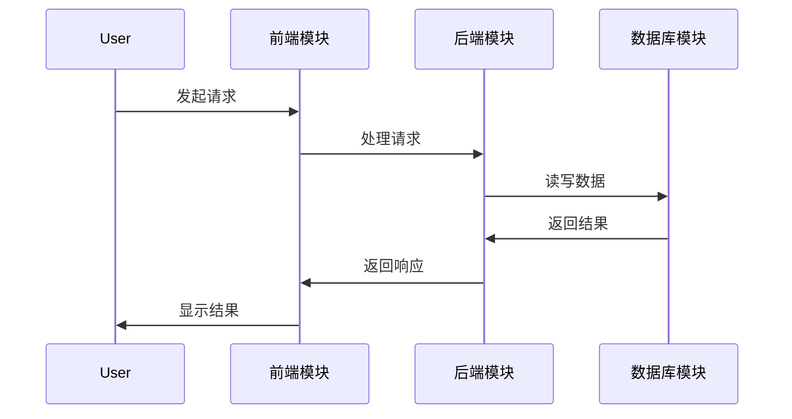
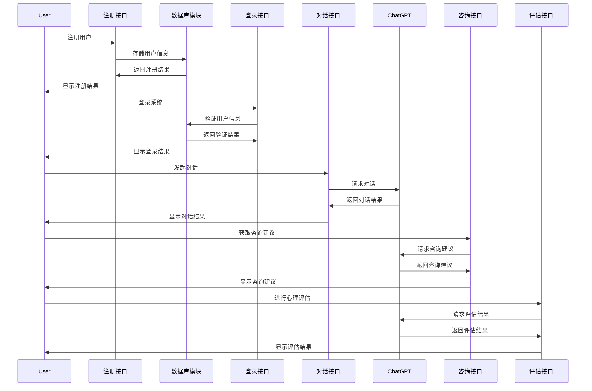

                 


# ChatGPT在心理健康领域的应用：设计敏感且有效的提示词

> 关键词：ChatGPT，心理健康，提示词设计，算法原理，系统架构，项目实战

> 摘要：本文深入探讨了ChatGPT在心理健康领域中的应用，重点分析了如何设计敏感且有效的提示词。通过系统的算法原理讲解、架构设计方案和项目实战，本文为心理健康领域的AI应用提供了实用的指导。

## 第1章：问题背景与核心概念

### 1.1 心理健康领域的问题与挑战

心理健康是现代社会中不可忽视的重要议题。随着工作压力、生活节奏的加快，越来越多的人面临着心理健康问题。然而，传统心理健康服务的供需不平衡、心理咨询资源的有限性，以及患者对心理咨询的羞涩和担忧，都使得心理健康问题的解决变得复杂且困难。

#### 1.1.1 心理健康的重要性

心理健康不仅关系到个体的幸福感，还影响到家庭和谐、社会稳定。许多研究表明，心理健康问题可能导致工作效率下降、人际关系紧张，甚至增加医疗成本。

#### 1.1.2 心理健康领域面临的挑战

- **资源有限**：专业心理咨询师数量不足，且分布不均。
- **隐私担忧**：患者对心理咨询的私密性要求高。
- **效率问题**：传统心理健康服务流程繁琐，效率低下。
- **服务范围**：偏远地区和心理障碍患者难以获得及时有效的心理健康服务。

### 1.2 ChatGPT的基本概念与特性

ChatGPT是一种基于GPT-3模型的对话系统，由OpenAI开发。它能够通过大量文本数据进行训练，生成与人类对话类似的自然语言回答。

#### 1.2.1 ChatGPT的介绍

ChatGPT具有强大的语言理解和生成能力，可以处理复杂的对话场景，进行多轮对话，提供个性化的交流体验。

#### 1.2.2 ChatGPT的优势与局限性

- **优势**：能够快速响应用户需求，提供24/7的服务。
- **局限性**：在处理敏感话题时可能存在误解，且缺乏情感共鸣。

### 1.3 敏感且有效的提示词设计

设计敏感且有效的提示词是ChatGPT在心理健康领域成功应用的关键。提示词应既能引导用户深入表达，又能避免触及患者敏感领域。

#### 1.3.1 提示词在ChatGPT应用中的作用

提示词能够引导对话方向，帮助ChatGPT更好地理解用户的需求，提供有针对性的回答。

#### 1.3.2 敏感提示词的设计原则

- **尊重患者隐私**：避免询问敏感问题，确保对话安全。
- **情感共鸣**：使用温暖、关心的语言，建立信任。
- **层次递进**：逐步深入，避免单刀直入。

## 第2章：核心概念与联系

### 2.1 ChatGPT与心理健康的联系

ChatGPT在心理健康领域的应用潜力巨大，可以通过自然语言交互，为患者提供及时的心理支持。以下是ChatGPT在心理健康领域的一些应用案例：

#### 2.1.1 ChatGPT在心理健康领域的应用案例

- **心理健康咨询**：为用户提供心理健康咨询服务，包括抑郁、焦虑、失眠等常见问题。
- **心理评估**：通过对话评估用户的心理健康状况，提供个性化建议。
- **心理教育**：提供心理健康知识，帮助用户更好地了解和管理自己的情绪。

#### 2.1.2 ChatGPT与心理健康理论的关系

ChatGPT的应用与认知行为疗法（CBT）、心理动力学、人本主义心理学等心理健康理论密切相关。通过模拟对话，ChatGPT可以辅助患者进行自我探索和认知重构。

### 2.2 概念属性特征对比表格

为了更直观地理解ChatGPT与心理健康理论的关系，我们列出以下概念属性特征对比表格：

| 特征           | ChatGPT           | 认知行为疗法（CBT） | 心理动力学           | 人本主义心理学           |
|----------------|-------------------|---------------------|----------------------|--------------------------|
| 对话能力       | 高级对话生成      | 短期内结构化对话    | 深入无结构对话       | 自由式对话，鼓励自我表达  |
| 适应性         | 自动适应对话主题  | 根据患者情况调整策略 | 长期建立信任关系     | 根据患者需求灵活调整     |
| 情感共鸣       | 有限的情感理解    | 情感反应与共情      | 情感共鸣与投射       | 情感关注与自我表达       |
| 持续性支持     | 可持续的支持      | 持续的心理干预     | 持续的情感探索      | 持续的个性发展支持      |

### 2.3 ER实体关系图架构

为了更好地展示ChatGPT与心理健康理论之间的联系，我们可以使用Mermaid绘制ER实体关系图：

```mermaid
erDiagram
  ChatGPT ||--|{ 用户 }
  ChatGPT ||--|{ 心理健康咨询 }
  ChatGPT ||--|{ 心理评估 }
  ChatGPT ||--|{ 心理教育 }
  用户 ||--|{ 认知行为疗法（CBT）}
  用户 ||--|{ 心理动力学           }
  用户 ||--|{ 人本主义心理学           }
```

## 第3章：算法原理讲解

### 3.1 ChatGPT的算法原理

ChatGPT的核心是基于GPT-3模型的语言生成技术。GPT-3是一种自回归语言模型，通过大量文本数据进行训练，能够预测文本中的下一个词。

#### 3.1.1 语言模型的基本原理

语言模型通过分析文本数据，学习语言模式，从而预测下一个词。这个过程可以表示为：

$$
P(\text{word}_t | \text{word}_{<t}) = \frac{P(\text{word}_{<t} \text{word}_t)}{P(\text{word}_{<t})}
$$

其中，$P(\text{word}_t | \text{word}_{<t})$ 表示在已知前文 $\text{word}_{<t}$ 的情况下，预测下一个词 $\text{word}_t$ 的概率。

#### 3.1.2 GPT模型的架构与训练过程

GPT模型采用深度神经网络架构，包含多个 Transformer 层。训练过程主要包括：

- **输入嵌入**：将文本转化为词嵌入向量。
- **前向传播**：通过 Transformer 层计算输出概率。
- **损失函数**：使用交叉熵损失函数优化模型。

#### 3.1.3 ChatGPT的生成过程

ChatGPT的生成过程基于 GPT-3 模型，通过输入提示词，模型会生成相应的回复。生成过程可以简化为：

1. **输入提示词**：将用户输入的提示词作为输入。
2. **预测下一个词**：模型根据输入提示词，预测下一个词的概率分布。
3. **选择下一个词**：从概率分布中选择下一个词。
4. **重复步骤2-3**：直到生成完整的回复。

### 3.2 算法原理的数学模型与公式

为了更好地理解 ChatGPT 的算法原理，我们进一步介绍相关的数学模型和公式。

#### 3.2.1 数学模型介绍

ChatGPT 的核心是基于 Transformer 模型的自回归语言模型。Transformer 模型通过多头自注意力机制（Multi-Head Self-Attention）和前馈神经网络（Feed-Forward Neural Network）处理输入文本。

#### 3.2.2 数学公式讲解

假设 $X$ 表示输入的词嵌入向量，$W$ 表示权重矩阵，$H$ 表示隐藏状态，$O$ 表示输出。Transformer 模型的自注意力机制可以表示为：

$$
\text{Attention}(Q, K, V) = \frac{softmax(\text{score})} \cdot V
$$

其中，$Q$、$K$、$V$ 分别表示查询向量、关键向量、值向量，$\text{score}$ 表示查询向量与关键向量的内积。

前馈神经网络可以表示为：

$$
\text{FFN}(X) = \text{ReLU}(W_2 \cdot \text{ReLU}(W_1 \cdot X))
$$

其中，$W_1$ 和 $W_2$ 分别为前馈神经网络的权重。

#### 3.2.3 举例说明

假设输入文本为 "ChatGPT在心理健康领域的应用"，我们可以将其表示为词嵌入向量。通过 Transformer 模型，模型可以生成相应的文本回复。

例如，输入提示词 "ChatGPT在心理健康领域"，模型可以预测下一个词的概率分布，选择概率最高的词作为输出。通过重复这个过程，模型可以生成完整的文本回复。

## 第4章：系统分析与架构设计方案

### 4.1 问题场景介绍

在心理健康领域，ChatGPT可以作为一种辅助工具，帮助用户进行心理倾诉、提供心理健康咨询和心理评估。以下是问题场景的详细介绍：

- **心理倾诉**：用户可以与ChatGPT进行自然语言对话，倾诉自己的心理问题。
- **心理健康咨询**：ChatGPT可以提供关于心理健康问题的建议和指导。
- **心理评估**：ChatGPT可以根据用户的回答，评估用户的心理健康状况。

### 4.2 项目介绍

本项目旨在设计一个基于ChatGPT的心理健康咨询服务系统。系统主要包括以下功能：

- **用户注册与登录**：用户可以通过注册账号，登录系统。
- **心理倾诉**：用户可以与ChatGPT进行自然语言对话。
- **心理健康咨询**：ChatGPT根据用户的问题，提供针对性的心理健康咨询。
- **心理评估**：ChatGPT根据用户的回答，评估用户的心理健康状况。

### 4.3 系统功能设计

为了实现上述功能，系统需要设计以下核心功能模块：

- **用户模块**：处理用户注册、登录和基本信息管理。
- **对话模块**：实现用户与ChatGPT的对话功能。
- **咨询模块**：提供心理健康咨询功能。
- **评估模块**：实现心理评估功能。

#### 4.3.1 领域模型Mermaid类图

以下是一个Mermaid类图的例子，展示了系统的领域模型：

```mermaid
classDiagram
  User <<class>> 用户
  ChatGPT <<class>> ChatGPT
  PsychologicalCounseling <<class>> 心理健康咨询
  PsychologicalAssessment <<class>> 心理评估

  User o-- ChatGPT
  ChatGPT o-- PsychologicalCounseling
  ChatGPT o-- PsychologicalAssessment
```

### 4.4 系统架构设计

为了实现系统的功能需求，我们设计了一个基于微服务架构的系统。系统主要包括以下模块：

- **前端模块**：负责用户界面展示和用户交互。
- **后端模块**：实现业务逻辑和数据处理。
- **数据库模块**：存储用户数据和对话记录。

#### 4.4.1 系统架构Mermaid图

以下是一个Mermaid图的例子，展示了系统的架构设计：



### 4.5 系统接口设计

为了实现系统的功能，我们需要设计以下接口：

- **用户接口**：包括用户注册、登录、信息查询和修改等功能。
- **对话接口**：包括与ChatGPT进行对话的接口。
- **咨询接口**：包括心理健康咨询功能的接口。
- **评估接口**：包括心理评估功能的接口。

### 4.6 系统交互Mermaid序列图

以下是一个Mermaid序列图的例子，展示了系统的交互过程：



## 第5章：项目实战

### 5.1 环境安装

要在项目中使用ChatGPT，首先需要安装相应的环境。以下是安装步骤：

1. **安装Python**：确保Python版本不低于3.6。
2. **安装OpenAI的ChatGPT库**：使用以下命令安装：

   ```
   pip install openai
   ```

3. **获取API密钥**：在OpenAI官方网站上注册账户，获取API密钥。

### 5.2 系统核心实现源代码

以下是一个简单的示例，展示如何使用ChatGPT进行对话：

```python
import openai

openai.api_key = 'your-api-key'

def chat_with_gpt(prompt):
    response = openai.Completion.create(
        engine="text-davinci-002",
        prompt=prompt,
        max_tokens=100,
        n=1,
        stop=None,
        temperature=0.5
    )
    return response.choices[0].text.strip()

while True:
    user_input = input("用户：")
    if user_input.lower() == 'exit':
        break
    bot_response = chat_with_gpt(user_input)
    print("ChatGPT：", bot_response)
```

### 5.2.1 代码应用解读与分析

上述代码首先导入OpenAI的ChatGPT库，并设置API密钥。`chat_with_gpt` 函数用于与ChatGPT进行对话，接收用户输入的提示词，并返回ChatGPT的回答。

### 5.2.2 实际案例分析与详细讲解剖析

以下是一个实际案例，展示如何使用ChatGPT进行心理健康咨询：

**用户**：我最近心情很不好，总是感到焦虑。

**ChatGPT**：我能理解你的感受。焦虑是一种常见的情绪反应，尤其在面对压力时。你愿意分享一下是什么让你感到焦虑吗？

**用户**：最近的工作压力很大，感觉自己无法应对。

**ChatGPT**：听起来工作压力对你的影响很大。你可以尝试一些方法来缓解焦虑，比如深呼吸、冥想或运动。此外，制定合理的工作计划，分步骤处理工作任务，也有助于减轻焦虑。你愿意尝试这些方法吗？

### 5.3 项目小结

本项目通过设计一个基于ChatGPT的心理健康咨询服务系统，展示了ChatGPT在心理健康领域的应用潜力。通过实际案例，我们可以看到ChatGPT如何通过自然语言交互，为用户提供有效的心理健康支持。然而，ChatGPT在处理敏感话题时仍需谨慎，以确保对话的安全和有效性。

## 第6章：最佳实践Tips

### 6.1 提示词设计的最佳实践

1. **避免敏感话题**：在设计提示词时，应避免涉及用户隐私或敏感话题。
2. **逐步引导**：使用层次递进的提示词，逐步引导用户表达自己的感受。
3. **情感关怀**：使用温暖、关心的语言，建立信任和情感共鸣。

### 6.2 ChatGPT应用的最佳实践

1. **数据安全**：确保用户数据的安全和隐私。
2. **定期更新**：定期更新ChatGPT的模型和提示词库，以适应不断变化的需求。
3. **用户反馈**：收集用户反馈，不断优化系统的性能和用户体验。

## 第7章：小结与注意事项

### 7.1 全书要点总结

- ChatGPT在心理健康领域的应用潜力巨大。
- 设计敏感且有效的提示词是关键。
- 算法原理和系统设计是实现心理健康咨询的关键步骤。
- 实际案例展示了ChatGPT在心理健康咨询中的应用。

### 7.2 注意事项

- **隐私保护**：确保用户隐私和数据安全。
- **情感关怀**：在对话中保持情感共鸣，关注用户情感需求。
- **持续优化**：根据用户反馈和实际需求，不断优化系统性能。

### 7.3 拓展阅读

- [OpenAI官方文档](https://openai.com/docs/)
- [GPT-3模型详解](https://towardsdatascience.com/an-introduction-to-the-gpt-3-model-4710b9f45b2e)
- [心理健康领域的AI应用研究](https://www.nimh.nih.gov/research/research-topics/technology-and-augmented-reality/treatment-methods/a-i-in-therapy)

## 作者信息

作者：AI天才研究院/AI Genius Institute & 禅与计算机程序设计艺术 /Zen And The Art of Computer Programming 

```markdown
## 第6章：最佳实践Tips

### 6.1 提示词设计的最佳实践

1. **避免敏感话题**：在设计提示词时，应避免涉及用户隐私或敏感话题。例如，可以使用开放性问题来引导用户表达，而不是直接询问敏感信息。
2. **逐步引导**：使用层次递进的提示词，逐步引导用户表达自己的感受。例如，可以先从简单的日常话题开始，然后逐渐过渡到更深入的心理健康问题。
3. **情感关怀**：使用温暖、关心的语言，建立信任和情感共鸣。例如，可以适时使用鼓励性语句，表达对用户的理解和支持。

### 6.2 ChatGPT应用的最佳实践

1. **数据安全**：确保用户数据的安全和隐私。在设计和实施过程中，应严格遵守相关法律法规，采取加密、访问控制等技术手段保护用户数据。
2. **定期更新**：定期更新ChatGPT的模型和提示词库，以适应不断变化的需求。这样可以确保系统始终保持高效、准确。
3. **用户反馈**：收集用户反馈，不断优化系统的性能和用户体验。通过用户反馈，可以发现系统存在的问题，及时进行调整和改进。

## 第7章：小结与注意事项

### 7.1 全书要点总结

本文通过深入探讨ChatGPT在心理健康领域的应用，提供了以下要点总结：

- ChatGPT作为一种强大的自然语言处理工具，在心理健康领域具有广泛的应用前景。
- 提示词设计是ChatGPT在心理健康领域应用的关键，需要遵循最佳实践。
- 系统架构和算法原理的深入理解有助于实现ChatGPT在心理健康领域的有效应用。
- 通过实际案例，展示了ChatGPT在心理健康咨询中的应用效果。

### 7.2 注意事项

在设计和应用ChatGPT进行心理健康咨询时，需要注意以下事项：

- **用户隐私保护**：确保用户数据的安全和隐私，遵守相关法律法规。
- **情感关怀**：在对话中保持情感共鸣，关注用户情感需求。
- **持续优化**：根据用户反馈和实际需求，不断优化系统性能和用户体验。

### 7.3 拓展阅读

为了进一步深入了解ChatGPT在心理健康领域的应用，读者可以参考以下拓展阅读：

- [OpenAI官方文档](https://openai.com/docs/)
- [GPT-3模型详解](https://towardsdatascience.com/an-introduction-to-the-gpt-3-model-4710b9f45b2e)
- [心理健康领域的AI应用研究](https://www.nimh.nih.gov/research/research-topics/technology-and-augmented-reality/treatment-methods/a-i-in-therapy)

## 作者信息

作者：AI天才研究院/AI Genius Institute & 禅与计算机程序设计艺术 /Zen And The Art of Computer Programming
```

