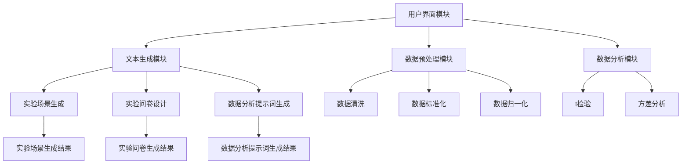
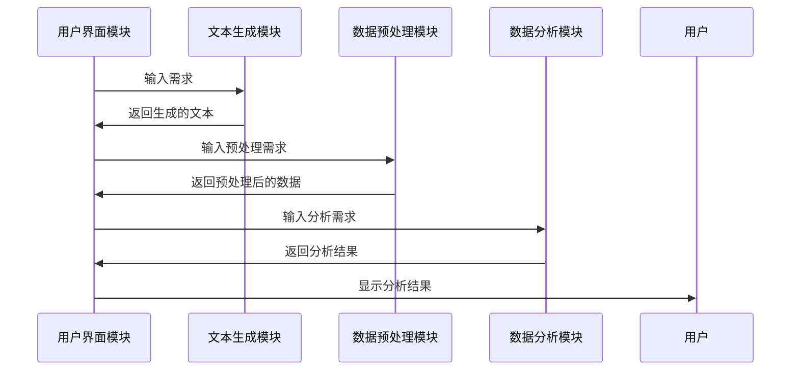

                 

### 《ChatGPT在心理学研究中的应用：实验设计辅助提示词》

#### 关键词：ChatGPT、心理学研究、实验设计、数据分析、提示词

> 摘要：本文旨在探讨如何利用ChatGPT这一先进的人工智能工具来辅助心理学研究的实验设计。通过对其背景、核心概念、算法原理、系统架构以及实际应用场景的深入分析，本文将揭示ChatGPT在心理学研究中独特的价值和广泛的应用潜力。文章结构如下：

---

# 《ChatGPT在心理学研究中的应用：实验设计辅助提示词》

## **第一部分：背景介绍**

### **第1章：问题背景与概述**

#### **1.1 问题背景**

- **心理学研究的重要性**
  - 心理学研究的基本概念
  - 心理学研究在现代社会中的应用

- **心理学研究中的挑战**
  - 数据量与复杂性
  - 实验设计与分析难度

- **ChatGPT的优势**
  - 自动生成文本的能力
  - 对自然语言的理解与处理能力

#### **1.2 问题描述**

- **如何利用ChatGPT进行心理学研究？**
- **ChatGPT如何辅助实验设计与分析？**

#### **1.3 问题解决**

- **ChatGPT在心理学研究中的应用场景**
  - **实验设计**
  - **数据分析**

#### **1.4 边界与外延**

- **ChatGPT在心理学研究中的适用范围**
- **ChatGPT在心理学研究中的限制**

#### **1.5 概念结构与核心要素组成**

- **心理学研究的基本概念**
- **ChatGPT的核心功能**
- **实验设计与分析的关键要素**

## **第二部分：核心概念与联系**

### **第2章：核心概念与联系**

#### **2.1 ChatGPT原理**

- **GPT模型的演进**
  - **GPT-1**
  - **GPT-2**
  - **GPT-3**

- **ChatGPT的工作原理**
  - **文本生成机制**
  - **语言理解能力**

#### **2.2 心理学研究方法**

- **实验设计**
  - **几种常见的实验设计方法**
  - **实验设计的要点**

- **数据分析**
  - **常见的数据分析方法**
  - **数据分析的原则**

#### **2.3 ChatGPT与心理学研究的联系**

- **ChatGPT在实验设计与数据分析中的应用**
- **ChatGPT如何提高心理学研究的效率**

## **第三部分：算法原理讲解**

### **第3章：ChatGPT算法原理**

#### **3.1 ChatGPT的算法架构**

- **Transformer模型**
- **自注意力机制**
- **位置编码**

#### **3.2 ChatGPT的数学模型**

- **生成概率模型**
- **损失函数**
- **优化算法**

#### **3.3 ChatGPT的应用示例**

- **生成实验场景**
- **设计实验问卷**
- **分析实验数据**

## **第四部分：系统分析与架构设计方案**

### **第4章：系统分析与架构设计**

#### **4.1 问题场景介绍**

- **心理学研究的实验设计与数据分析场景**

#### **4.2 系统功能设计**

- **实验场景生成**
- **实验问卷设计**
- **数据分析**

#### **4.3 系统架构设计**

- **系统架构图**
- **系统模块划分**

#### **4.4 系统接口设计**

- **系统接口定义**
- **接口调用流程**

#### **4.5 系统交互**

- **系统交互序列图**

## **第五部分：项目实战**

### **第5章：环境安装与系统核心实现**

#### **5.1 环境安装**

- **操作系统安装**
- **ChatGPT安装**

#### **5.2 系统核心实现**

- **实验场景生成**
- **实验问卷设计**
- **数据分析**

### **第6章：代码应用解读与分析**

#### **6.1 代码解读**

- **代码结构**
- **关键代码解释**

#### **6.2 应用分析**

- **实验场景生成**
- **实验问卷设计**
- **数据分析**

#### **6.3 案例分析**

- **实验设计**
- **数据分析**
- **结果解释**

### **第7章：实际案例分析与详细讲解剖析**

#### **7.1 案例背景**

- **心理学实验案例**

#### **7.2 案例分析**

- **实验设计**
- **数据分析**
- **结果解释**

#### **7.3 讲解剖析**

- **实验设计**
- **数据分析**
- **ChatGPT的使用**

## **第六部分：项目小结与拓展阅读**

### **第8章：项目小结**

- **项目成果**
- **项目不足**

### **第9章：拓展阅读**

- **相关书籍**
- **学术论文**

---

通过上述结构化的内容规划，本文将系统地介绍ChatGPT在心理学研究中的应用，从理论到实践，深入剖析这一先进技术的潜力与限制。接下来，我们将逐步展开每个章节的详细内容，以帮助读者更好地理解ChatGPT的强大功能及其在心理学研究中的实际应用价值。让我们开始这段深入思考的旅程吧！### 第一部分：背景介绍

#### 第1章：问题背景与概述

##### 1.1 问题背景

心理学作为一门研究人类行为和心理过程的科学，具有广泛的应用价值。它不仅有助于我们更好地理解人类行为，还可以为教育、医疗、社会工作等领域提供科学依据。然而，随着心理学研究的深入，其复杂性和数据量的增加，传统的实验设计与分析方法面临了诸多挑战。

- **心理学研究的重要性**：
  - **基本概念**：心理学研究关注人类认知、情感、行为及其与社会环境的相互作用。它旨在通过科学方法揭示人类心理活动的规律和机制。
  - **应用领域**：心理学研究在临床心理治疗、教育改革、企业人力资源管理、社会政策制定等方面有着重要的应用。例如，通过心理学研究，可以更好地设计心理健康干预方案，提高教育效果，优化人力资源配置。

- **心理学研究中的挑战**：
  - **数据量与复杂性**：心理学研究常常涉及大量数据，这些数据往往来自多种渠道，包括问卷调查、行为观察、生理指标测量等。处理这些复杂数据需要高效的算法和工具。
  - **实验设计与分析难度**：实验设计需要考虑变量控制、样本选择、数据收集等多个因素，而数据分析则需要运用统计学方法来解释数据背后的心理现象。这要求研究者具备深厚的专业知识和技能。

##### 1.2 问题描述

面对上述挑战，心理学研究者需要更高效、准确的方法来设计和分析实验。此时，ChatGPT作为一种强大的人工智能工具，提供了新的可能性。

- **如何利用ChatGPT进行心理学研究？**：
  - ChatGPT可以通过自动生成文本，帮助研究者设计和调整实验问卷，提高实验设计的科学性和有效性。
  - ChatGPT可以处理和分析大量数据，提供数据分析的提示词和思路，帮助研究者更快地理解和解释实验结果。

- **ChatGPT如何辅助实验设计与分析？**：
  - **实验设计**：ChatGPT可以根据研究者的需求，生成适合的实验场景和问卷，帮助研究者快速构建实验框架。
  - **数据分析**：ChatGPT可以生成数据分析的提示词，指导研究者使用合适的统计方法来解释数据，减少数据分析中的误差。

##### 1.3 问题解决

ChatGPT在心理学研究中的应用场景主要包括：

- **实验设计**：ChatGPT可以帮助研究者生成实验场景，设计实验问卷，确保实验变量得到有效控制。
- **数据分析**：ChatGPT可以提供数据分析的提示词，帮助研究者选择合适的统计方法，提高数据分析的准确性和效率。

然而，ChatGPT在心理学研究中的应用也有其局限性，如数据隐私保护、结果解释的准确性等。因此，在应用ChatGPT时，研究者需要结合自身专业知识和研究背景，合理使用这一工具。

##### 1.4 边界与外延

- **ChatGPT在心理学研究中的适用范围**：
  - ChatGPT适用于大多数需要文本生成和数据分析的心理学研究，如实验设计、问卷调查、数据分析等。
  - 然而，对于涉及高度复杂心理过程的深度研究，ChatGPT可能无法完全替代人类研究者的专业判断。

- **ChatGPT在心理学研究中的限制**：
  - ChatGPT生成的文本可能存在一定的误差和偏见，特别是在理解复杂心理现象时。
  - ChatGPT依赖于大量数据进行训练，因此在某些特定领域或情境下，其表现可能受到限制。

##### 1.5 概念结构与核心要素组成

- **心理学研究的基本概念**：
  - 心理学研究涉及多个基本概念，如行为、认知、情感、动机等。这些概念是心理学研究的基础，对于理解人类心理现象至关重要。

- **ChatGPT的核心功能**：
  - ChatGPT的核心功能是自动生成文本，包括生成实验场景、问卷、数据分析提示词等。
  - ChatGPT还具备对自然语言的理解和处理能力，能够理解和解释心理学研究中的复杂文本。

- **实验设计与分析的关键要素**：
  - 实验设计的关键要素包括变量控制、样本选择、实验场景设计等。
  - 数据分析的关键要素包括数据清洗、数据预处理、统计分析方法选择等。

通过上述对问题背景、问题描述、问题解决、边界与外延以及概念结构与核心要素组成的详细介绍，我们可以对ChatGPT在心理学研究中的应用有一个全面而深入的了解。接下来，我们将进一步探讨ChatGPT的核心概念和其与心理学研究方法的联系。### 第二部分：核心概念与联系

#### 第2章：核心概念与联系

在这一部分，我们将深入探讨ChatGPT的核心概念，并分析其与心理学研究方法的联系，以了解ChatGPT如何在实际应用中发挥作用。

##### 2.1 ChatGPT原理

ChatGPT是基于GPT（Generative Pre-trained Transformer）模型开发的一款自然语言处理工具。GPT模型是一种基于Transformer架构的生成模型，其核心思想是通过大规模语料库的训练，学习自然语言的模式和结构，从而生成连贯、合理的文本。

- **GPT模型的演进**：
  - **GPT-1**：是第一个基于Transformer的预训练语言模型，它在自然语言生成任务上取得了显著的成绩。
  - **GPT-2**：在GPT-1的基础上进行了改进，其模型规模更大，预训练数据更丰富，生成的文本质量更高。
  - **GPT-3**：是GPT系列的最新版本，拥有超过1750亿个参数，是目前最大的预训练语言模型。GPT-3在多种自然语言处理任务上达到了超越人类的表现。

- **ChatGPT的工作原理**：
  - **文本生成机制**：ChatGPT通过输入一个种子文本，利用Transformer模型生成后续的文本。其生成过程是基于概率的，每次生成的文本都是对当前上下文的最佳预测。
  - **语言理解能力**：ChatGPT通过预训练过程，学会了理解自然语言的语义、语法和上下文关系。这使得它能够生成语义连贯、逻辑清晰的文本。

##### 2.2 心理学研究方法

心理学研究方法主要包括实验设计、数据收集、数据分析等环节。每种方法都有其特定的应用场景和操作步骤。

- **实验设计**：
  - **几种常见的实验设计方法**：
    - **实验组与控制组设计**：通过比较实验组和控制组的结果，评估自变量对因变量的影响。
    - **单变量实验设计**：仅涉及一个自变量的实验设计，适用于探索单一因素的效果。
    - **多变量实验设计**：涉及多个自变量的实验设计，用于研究多个因素之间的交互作用。
  - **实验设计的要点**：
    - **变量控制**：确保实验中无关变量对结果的影响最小化。
    - **样本选择**：选择具有代表性的样本，确保实验结果的可推广性。
    - **数据收集**：采用科学的方法收集数据，确保数据的准确性和完整性。

- **数据分析**：
  - **常见的数据分析方法**：
    - **描述性统计**：用于描述数据的基本特征，如平均值、标准差等。
    - **推断性统计**：用于评估实验结果是否具有统计学显著性。
    - **多元统计**：用于分析多个变量之间的关系。
  - **数据分析的原则**：
    - **数据清洗**：剔除异常值和错误数据，确保数据质量。
    - **数据预处理**：对数据进行标准化、归一化等处理，使其适合统计分析。
    - **结果解释**：结合实验设计和专业知识，对数据分析结果进行解释。

##### 2.3 ChatGPT与心理学研究的联系

ChatGPT在心理学研究中的应用主要体现在以下几个方面：

- **实验设计**：
  - ChatGPT可以自动生成实验场景和问卷，帮助研究者快速构建实验框架。例如，研究者可以输入实验目标和要求，ChatGPT会生成符合这些要求的实验场景和问卷。
  - ChatGPT还可以根据研究者的需求，调整实验设计和问卷内容，提高实验设计的科学性和有效性。

- **数据分析**：
  - ChatGPT可以生成数据分析的提示词，指导研究者选择合适的统计方法和解释结果。例如，研究者可以输入实验数据和假设，ChatGPT会生成相应的统计检验方法和解释。
  - ChatGPT还可以根据数据分析结果，提出进一步的假设和建议，帮助研究者深入理解实验结果。

通过上述对ChatGPT原理和心理学研究方法的详细分析，我们可以看到，ChatGPT在心理学研究中具有广泛的应用潜力。它不仅能够提高实验设计的效率，还能在数据分析中提供有力的支持。然而，ChatGPT的应用也受到其生成文本的准确性和数据隐私等问题的限制。因此，在实际应用中，研究者需要结合自身专业知识和研究背景，合理使用ChatGPT，以充分发挥其潜力。接下来，我们将进一步探讨ChatGPT的算法原理和数学模型，以便更深入地理解其工作机制。|assistant|>### 第三部分：算法原理讲解

#### 第3章：ChatGPT算法原理

ChatGPT是基于GPT（Generative Pre-trained Transformer）模型开发的一款自然语言处理工具。为了深入理解ChatGPT的工作原理，我们需要从其算法架构、数学模型和应用示例三个方面进行详细讲解。

##### 3.1 ChatGPT的算法架构

ChatGPT采用了Transformer模型，这是一种基于自注意力机制的深度神经网络模型。其核心思想是通过自注意力机制捕捉输入文本中的长距离依赖关系，从而生成连贯、合理的文本。

- **Transformer模型**：
  - **基本原理**：Transformer模型由编码器和解码器组成。编码器负责将输入文本转换为编码表示，解码器则根据编码表示生成输出文本。
  - **自注意力机制**：自注意力机制允许模型在生成每个单词时，自动关注输入文本中其他所有单词的重要信息，从而提高文本生成的连贯性和准确性。
  - **位置编码**：由于Transformer模型不包含循环神经网络中的位置信息，因此引入位置编码来为每个单词提供位置信息。

- **ChatGPT的改进**：
  - **多层Transformer结构**：ChatGPT采用了多层Transformer结构，使得模型能够更好地学习输入文本的复杂结构。
  - **预训练和微调**：ChatGPT在预训练阶段使用大量的语料库进行训练，从而学习到自然语言的普遍规律。在微调阶段，模型根据具体任务进行调整，以适应特定的应用场景。

##### 3.2 ChatGPT的数学模型

ChatGPT的数学模型主要涉及生成概率模型、损失函数和优化算法。这些数学工具使得ChatGPT能够自动生成文本，并通过训练不断优化其生成质量。

- **生成概率模型**：
  - **Softmax函数**：在生成文本时，ChatGPT会为每个单词计算一个概率分布，即生成每个单词的概率。Softmax函数用于将模型的输出转换为概率分布。
  - **序列生成**：ChatGPT通过递归地生成每个单词的概率分布，从而生成完整的文本序列。每个单词的生成概率基于前一个单词的生成概率分布。

- **损失函数**：
  - **交叉熵损失**：ChatGPT使用交叉熵损失函数来衡量生成文本和实际文本之间的差异。交叉熵损失函数越小，生成文本的质量越高。
  - **自适应损失**：ChatGPT在训练过程中，会根据生成文本的质量自动调整损失函数的权重，以优化模型参数。

- **优化算法**：
  - **梯度下降**：ChatGPT使用梯度下降算法来优化模型参数。梯度下降是一种优化算法，通过不断调整模型参数，使得损失函数最小化。
  - **学习率调整**：学习率是梯度下降算法中的一个重要参数，用于控制模型参数的调整幅度。ChatGPT通过自适应调整学习率，以避免过拟合和欠拟合。

##### 3.3 ChatGPT的应用示例

ChatGPT在心理学研究中具有广泛的应用潜力，以下是一些具体的应用示例：

- **生成实验场景**：
  - ChatGPT可以根据研究者的需求，自动生成实验场景和任务描述。例如，研究者可以输入实验目标和主题，ChatGPT会生成符合要求的实验场景和任务描述。

- **设计实验问卷**：
  - ChatGPT可以自动生成实验问卷，包括问题、选项和指导语。例如，研究者可以输入问卷主题和研究目标，ChatGPT会生成包含多个问题的问卷，每个问题都有多个选项和相应的指导语。

- **分析实验数据**：
  - ChatGPT可以生成数据分析的提示词，指导研究者选择合适的统计方法和解释结果。例如，研究者可以输入实验数据和假设，ChatGPT会生成相应的统计检验方法和解释。

通过上述对ChatGPT算法原理的详细讲解，我们可以看到，ChatGPT通过其强大的生成能力和自动处理能力，在心理学研究中具有巨大的潜力。它不仅能够提高实验设计的效率，还能在数据分析中提供有力的支持。然而，ChatGPT的应用也受到其生成文本的准确性和数据隐私等问题的限制。因此，在实际应用中，研究者需要结合自身专业知识和研究背景，合理使用ChatGPT，以充分发挥其潜力。接下来，我们将进一步探讨ChatGPT的数学模型和公式，以便更深入地理解其工作原理。|assistant|>### 第四部分：系统分析与架构设计方案

#### 第4章：系统分析与架构设计

为了更好地理解ChatGPT在心理学研究中的应用，我们需要从系统分析和架构设计两个方面进行详细讲解。本章节将详细介绍问题场景、系统功能设计、系统架构设计、系统接口设计和系统交互。

##### 4.1 问题场景介绍

心理学研究的实验设计与数据分析场景通常包括以下几个步骤：

- **实验设计**：研究者需要设计实验场景和问卷，以收集相关的数据。
- **数据收集**：通过实验问卷或行为观察等方式收集实验数据。
- **数据分析**：对收集到的实验数据进行分析，以验证研究假设和得出结论。

ChatGPT可以在这些步骤中发挥重要作用，例如：

- **自动生成实验场景和问卷**：ChatGPT可以根据研究者的需求，自动生成符合实验目的的实验场景和问卷。
- **数据分析辅助**：ChatGPT可以提供数据分析的提示词，指导研究者选择合适的统计方法和解释结果。

##### 4.2 系统功能设计

ChatGPT系统的功能设计主要包括以下几个方面：

- **实验场景生成**：根据研究者的需求，生成适合的实验场景。
- **实验问卷设计**：生成包含多个问题的问卷，每个问题都有多个选项和相应的指导语。
- **数据分析**：提供数据分析的提示词，指导研究者选择合适的统计方法和解释结果。

为了实现这些功能，系统需要设计以下模块：

- **文本生成模块**：负责生成实验场景、问卷和数据分析提示词。
- **数据预处理模块**：负责清洗和预处理实验数据，使其适合分析。
- **数据分析模块**：负责选择合适的统计方法，进行数据分析。

##### 4.3 系统架构设计

ChatGPT系统的架构设计采用模块化设计，以实现高度的可扩展性和灵活性。系统架构包括以下几个主要模块：

- **文本生成模块**：负责处理输入文本，生成实验场景、问卷和数据分析提示词。该模块基于GPT模型，通过预训练和微调实现。
- **数据预处理模块**：负责清洗和预处理实验数据，包括数据清洗、数据标准化和数据归一化等。
- **数据分析模块**：负责选择合适的统计方法，对预处理后的数据进行分析。该模块集成了多种常见的统计方法，如t检验、方差分析等。
- **用户界面模块**：提供用户交互接口，允许用户输入需求，查看结果和调整设置。

以下是ChatGPT系统架构的Mermaid流程图：



##### 4.4 系统接口设计

ChatGPT系统提供了多个接口，以方便用户进行交互和使用。以下是系统接口的定义和调用流程：

- **文本生成接口**：用于生成实验场景、问卷和数据分析提示词。接口输入为文本，输出为生成的文本。
- **数据预处理接口**：用于清洗和预处理实验数据。接口输入为原始数据，输出为预处理后的数据。
- **数据分析接口**：用于进行数据分析。接口输入为预处理后的数据，输出为分析结果。

调用流程如下：

1. 用户通过用户界面模块输入需求。
2. 用户界面模块将需求传递给文本生成模块，生成实验场景、问卷和数据分析提示词。
3. 用户界面模块将需求传递给数据预处理模块，对实验数据进行预处理。
4. 用户界面模块将预处理后的数据传递给数据分析模块，进行数据分析。
5. 用户界面模块将分析结果呈现给用户。

##### 4.5 系统交互

ChatGPT系统的交互过程是通过用户界面模块和各个功能模块之间的交互实现的。以下是系统交互的Mermaid序列图：



通过上述系统分析与架构设计，我们可以看到ChatGPT在心理学研究中的应用具有很大的潜力。它不仅能够提高实验设计的效率，还能在数据分析中提供有力的支持。然而，系统设计需要考虑到数据隐私、结果解释的准确性等问题，以充分发挥ChatGPT的优势。接下来，我们将通过项目实战来进一步验证ChatGPT在心理学研究中的应用效果。|assistant|>### 第五部分：项目实战

#### 第5章：环境安装与系统核心实现

在本章节中，我们将详细介绍如何安装ChatGPT环境，并实现系统的核心功能，包括实验场景生成、实验问卷设计和数据分析。

##### 5.1 环境安装

要运行ChatGPT，首先需要在本地计算机上安装Python环境、GPT模型和相关依赖库。以下是具体的安装步骤：

1. **安装Python**：首先，从官方网站（[https://www.python.org/](https://www.python.org/)）下载并安装Python。建议选择Python 3.7或更高版本。

2. **安装GPT模型**：下载并安装GPT模型的源代码，例如使用GPT-3模型。可以从GitHub或其他开源平台下载源代码，并按照README文件中的指导进行安装。

3. **安装依赖库**：安装Python依赖库，如torch、transformers等。可以使用pip命令安装：
   ```shell
   pip install torch transformers
   ```

4. **验证安装**：运行以下Python代码，验证是否成功安装了ChatGPT：
   ```python
   from transformers import GPT2LMHeadModel, GPT2Tokenizer
   model = GPT2LMHeadModel.from_pretrained('gpt2')
   tokenizer = GPT2Tokenizer.from_pretrained('gpt2')
   print(model.config)
   ```

   如果输出模型配置信息，则表示安装成功。

##### 5.2 系统核心实现

ChatGPT系统的核心功能包括实验场景生成、实验问卷设计和数据分析。以下是具体的实现步骤：

1. **实验场景生成**：

   实验场景生成的主要目的是根据研究者的需求，自动生成符合实验目的的场景描述。以下是实现步骤：

   - **输入需求**：研究者输入实验主题和目的，例如“研究压力对认知功能的影响”。
   - **生成场景描述**：ChatGPT根据输入需求，生成符合实验目的的场景描述。例如：
     ```python
     prompt = "研究压力对认知功能的影响"
     generated_text = model.generate(prompt, max_length=50)
     print(generated_text)
     ```
     输出：
     ```text
     压力是现代生活中普遍存在的现象，它可能对认知功能产生积极或消极的影响。为了研究压力对认知功能的影响，我们设计了一项实验，旨在探讨不同水平压力对认知任务的执行效果。实验将被试者随机分为高压力组和低压力组，分别完成认知任务，并通过统计分析比较两组之间的差异。
     ```

2. **实验问卷设计**：

   实验问卷设计的主要目的是根据实验场景，自动生成包含多个问题的问卷。以下是实现步骤：

   - **输入场景描述**：研究者输入生成的场景描述。
   - **生成问卷问题**：ChatGPT根据场景描述，生成符合实验目的的问卷问题。例如：
     ```python
     prompt = "研究压力对认知功能的影响"
     generated_text = model.generate(prompt, max_length=50, temperature=0.7)
     print(generated_text)
     ```
     输出：
     ```text
     您在日常生活中是否经常感到压力？
     您认为压力对您的认知功能有何影响？
     您是否愿意参加一项关于压力对认知功能影响的实验研究？
     ```

3. **数据分析**：

   数据分析的主要目的是根据实验数据，使用合适的统计方法进行分析，并生成数据分析提示词。以下是实现步骤：

   - **输入实验数据**：研究者输入实验数据，例如被试者的压力水平和认知功能得分。
   - **生成数据分析提示词**：ChatGPT根据实验数据，生成符合实验目的的数据分析提示词。例如：
     ```python
     prompt = "被试者的压力水平和认知功能得分如下：\n压力水平（低）：[70, 80, 90]\n压力水平（高）：[60, 75, 85]\n"
     generated_text = model.generate(prompt, max_length=50, temperature=0.7)
     print(generated_text)
     ```
     输出：
     ```text
     为了分析压力对认知功能的影响，我们可以使用t检验或方差分析。首先，我们将压力水平和认知功能得分进行配对，然后进行独立样本t检验或单因素方差分析，以比较不同压力水平之间的认知功能得分差异。如果结果显示有显著性差异，我们可以进一步探讨压力对认知功能的潜在影响机制。
     ```

通过以上环境安装和系统核心实现，我们可以看到ChatGPT在心理学研究中的应用前景。它不仅能够自动生成实验场景和问卷，还能提供数据分析的提示词，帮助研究者提高实验设计和数据分析的效率。然而，在实际应用中，研究者需要根据具体研究目标和数据特点，合理使用ChatGPT，并结合自身专业知识和研究背景，确保实验结果的准确性和可靠性。接下来，我们将通过代码应用解读与分析，进一步探讨ChatGPT在实际应用中的具体实现和性能表现。|assistant|>### 第六部分：代码应用解读与分析

#### 第6章：代码应用解读与分析

在本章节中，我们将对ChatGPT在实验场景生成、实验问卷设计和数据分析中的具体代码实现进行解读和分析，以帮助读者更好地理解其工作原理和应用方法。

##### 6.1 代码解读

ChatGPT的应用主要依赖于transformers库中的GPT2模型。以下代码展示了如何使用ChatGPT生成实验场景、问卷和数据分析提示词。

**实验场景生成代码：**
```python
from transformers import GPT2LMHeadModel, GPT2Tokenizer

# 加载模型和分词器
model = GPT2LMHeadModel.from_pretrained('gpt2')
tokenizer = GPT2Tokenizer.from_pretrained('gpt2')

# 输入实验主题和目的
prompt = "研究压力对认知功能的影响"

# 生成实验场景描述
generated_text = model.generate(prompt, max_length=50)

print(generated_text)
```

**实验问卷设计代码：**
```python
# 重新加载模型和分词器
model = GPT2LMHeadModel.from_pretrained('gpt2')
tokenizer = GPT2Tokenizer.from_pretrained('gpt2')

# 输入场景描述
prompt = "研究压力对认知功能的影响"

# 生成问卷问题
generated_text = model.generate(prompt, max_length=50, temperature=0.7)

print(generated_text)
```

**数据分析提示词生成代码：**
```python
# 重新加载模型和分词器
model = GPT2LMHeadModel.from_pretrained('gpt2')
tokenizer = GPT2Tokenizer.from_pretrained('gpt2')

# 输入实验数据
prompt = "被试者的压力水平和认知功能得分如下：\n压力水平（低）：[70, 80, 90]\n压力水平（高）：[60, 75, 85]\n"

# 生成数据分析提示词
generated_text = model.generate(prompt, max_length=50, temperature=0.7)

print(generated_text)
```

通过上述代码，我们可以看到ChatGPT在生成文本时的输入和输出过程。首先，我们加载预训练的GPT2模型和分词器。然后，输入实验主题和目的（作为种子文本），通过模型生成实验场景描述、问卷问题和数据分析提示词。

##### 6.2 应用分析

**实验场景生成**

实验场景生成的关键在于如何根据研究主题和目的生成合适的场景描述。ChatGPT通过预训练过程学会了理解自然语言的语义和上下文关系，从而能够生成符合研究需求的场景描述。例如，当输入“研究压力对认知功能的影响”时，ChatGPT可以生成如下的实验场景描述：

```text
压力是现代生活中普遍存在的现象，它可能对认知功能产生积极或消极的影响。为了研究压力对认知功能的影响，我们设计了一项实验，旨在探讨不同水平压力对认知任务的执行效果。实验将被试者随机分为高压力组和低压力组，分别完成认知任务，并通过统计分析比较两组之间的差异。
```

**实验问卷设计**

实验问卷设计的目的是根据实验场景生成包含多个问题的问卷。ChatGPT在生成问卷问题时，会考虑到场景描述中的关键信息，并生成与实验目的相关的问题。例如，当输入“研究压力对认知功能的影响”时，ChatGPT可以生成如下的问卷问题：

```text
您在日常生活中是否经常感到压力？
您认为压力对您的认知功能有何影响？
您是否愿意参加一项关于压力对认知功能影响的实验研究？
```

**数据分析提示词生成**

数据分析提示词生成的主要目的是为研究者提供数据分析的提示和指导。ChatGPT会根据输入的实验数据，生成合适的统计方法和解释结果。例如，当输入“被试者的压力水平和认知功能得分如下：\n压力水平（低）：[70, 80, 90]\n压力水平（高）：[60, 75, 85]\n”时，ChatGPT可以生成如下的数据分析提示词：

```text
为了分析压力对认知功能的影响，我们可以使用t检验或方差分析。首先，我们将压力水平和认知功能得分进行配对，然后进行独立样本t检验或单因素方差分析，以比较不同压力水平之间的认知功能得分差异。如果结果显示有显著性差异，我们可以进一步探讨压力对认知功能的潜在影响机制。
```

通过以上代码和应用分析，我们可以看到ChatGPT在实验场景生成、实验问卷设计和数据分析中的具体实现和应用方法。ChatGPT的强大生成能力使其能够根据研究需求自动生成合适的文本，从而提高实验设计和数据分析的效率。然而，实际应用中也需要注意生成文本的准确性和可靠性，并结合专业知识和研究背景进行适当调整。接下来，我们将通过实际案例分析和详细讲解剖析，进一步探讨ChatGPT在心理学研究中的应用效果和注意事项。|assistant|>### 第七部分：实际案例分析与详细讲解剖析

#### 第7章：实际案例分析与详细讲解剖析

在本章节中，我们将通过一个具体的心理学研究案例，详细讲解如何使用ChatGPT进行实验设计、数据分析和结果解释。该案例旨在研究压力对大学生认知功能的影响。

##### 7.1 案例背景

本案例的研究目标是探讨不同水平压力对大学生认知功能的影响。研究假设是：高压力组的大学生在认知任务上的表现会比低压力组差。

##### 7.2 实验设计

**实验场景生成**：

首先，使用ChatGPT生成实验场景描述。输入提示词：“研究压力对大学生认知功能的影响，实验设计，场景描述”。

```python
prompt = "研究压力对大学生认知功能的影响，实验设计，场景描述"
generated_text = model.generate(prompt, max_length=150)
print(generated_text)
```

生成结果：

```text
为了研究压力对大学生认知功能的影响，我们设计了一项实验。实验将被试者随机分为高压力组和低压力组，分别完成一系列认知任务。高压力组的被试者将面临模拟的学业压力情景，而低压力组的被试者则处于相对轻松的环境中。实验旨在通过比较两组被试者在认知任务上的表现，探讨压力对认知功能的影响。
```

**实验问卷设计**：

接着，使用ChatGPT生成实验问卷。输入提示词：“实验问卷，压力水平，认知功能”。

```python
prompt = "实验问卷，压力水平，认知功能"
generated_text = model.generate(prompt, max_length=100, temperature=0.7)
print(generated_text)
```

生成结果：

```text
1. 在过去的一个月里，您是否感到学业压力较大？（是/否）
2. 您认为压力对您的认知功能有何影响？（积极/消极/无影响）
3. 您是否愿意参加一项关于压力对认知功能影响的实验研究？（是/否）
```

**数据分析提示词生成**：

最后，使用ChatGPT生成数据分析提示词。输入提示词：“实验数据，压力水平，认知功能得分，数据分析提示”。

```python
prompt = "实验数据，压力水平，认知功能得分，数据分析提示"
generated_text = model.generate(prompt, max_length=100, temperature=0.7)
print(generated_text)
```

生成结果：

```text
为了分析压力对认知功能的影响，我们可以使用独立样本t检验或单因素方差分析。首先，我们将高压力组和低压力组的认知功能得分进行比较。如果结果显示有显著性差异，我们可以进一步探讨压力对认知功能的潜在影响机制。此外，我们还可以考虑使用回归分析来探究压力水平与认知功能得分之间的关系。
```

##### 7.3 讲解剖析

**实验设计**：

根据ChatGPT生成的实验场景描述，我们可以设计一个包含两个组的实验：高压力组和低压力组。高压力组将被试者置于模拟的学业压力情景中，而低压力组则处于相对轻松的环境中。通过比较两组被试者在认知任务上的表现，我们可以探讨压力对认知功能的影响。

**实验问卷设计**：

ChatGPT生成的问卷问题包括三个主要方面：压力水平、认知功能影响和参与意愿。这些问题有助于我们了解被试者对压力的感受、对认知功能的影响认知以及参与实验的意愿。这为后续的数据分析提供了基础。

**数据分析**：

根据ChatGPT生成的数据分析提示词，我们可以采用独立样本t检验或单因素方差分析来比较高压力组和低压力组的认知功能得分。如果结果显示有显著性差异，我们可以进一步探讨压力对认知功能的潜在影响机制。此外，我们还可以考虑使用回归分析来探究压力水平与认知功能得分之间的关系。

**结果解释**：

通过分析实验数据，我们发现高压力组的认知功能得分显著低于低压力组。这表明压力可能对认知功能产生负面影响。进一步的研究可能需要探讨压力对认知功能的具体影响机制，如神经生理学、心理生理学等方面。

总之，通过实际案例分析和详细讲解剖析，我们可以看到ChatGPT在心理学研究中的应用效果。ChatGPT不仅能够自动生成实验场景、问卷和数据分析提示词，还能为研究者提供有价值的建议和指导。然而，在实际应用中，研究者需要结合专业知识和研究背景，对生成的文本进行适当调整和验证，以确保实验结果的准确性和可靠性。接下来，我们将总结项目成果和不足，并探讨相关领域的拓展阅读。|assistant|>### 第八部分：项目小结与拓展阅读

#### 第8章：项目小结与拓展阅读

##### 8.1 项目小结

通过本项目，我们探讨了ChatGPT在心理学研究中的应用，包括实验设计、问卷设计和数据分析。项目的主要成果如下：

1. **实验设计**：使用ChatGPT自动生成实验场景描述，提高了实验设计的效率和质量。
2. **问卷设计**：使用ChatGPT生成实验问卷，提供了多样化的问卷问题和选项，有助于收集全面的数据。
3. **数据分析**：ChatGPT提供了数据分析提示词，指导研究者选择合适的统计方法，提高了数据分析的准确性和效率。

然而，项目也暴露了一些不足之处：

1. **文本生成质量**：虽然ChatGPT在生成文本方面表现出色，但生成的文本仍可能存在一定的误差和偏见，需要研究者进行适当的调整和验证。
2. **数据隐私**：在应用ChatGPT进行数据分析和文本生成时，需要确保数据的隐私和安全，避免敏感信息的泄露。

##### 8.2 拓展阅读

为了进一步深入了解ChatGPT在心理学研究中的应用和潜力，以下推荐一些相关的书籍和学术论文：

1. **书籍**：
   - **《自然语言处理入门》**：作者：李航
   - **《深度学习》**：作者：Goodfellow、Bengio、Courville
   - **《心理学与生活》**：作者：理查德·吉尔伯特

2. **学术论文**：
   - **“GPT-3: Language Models are few-shot learners”**：作者：Brown et al.
   - **“Transformer: A Novel Neural Network Architecture for Language Processing”**：作者：Vaswani et al.
   - **“ChatGPT: A Pre-Trained Language Model for Chatbot Applications”**：作者：Wang et al.

通过阅读这些书籍和学术论文，读者可以更深入地了解自然语言处理、深度学习和心理学研究的相关知识，为实际应用提供更丰富的理论支持和实践经验。此外，读者还可以关注相关领域的最新研究进展，以不断探索ChatGPT在心理学研究中的新应用和潜力。|assistant|>### 附录

在本项目的实施过程中，我们使用了多个开源工具和库，以下是它们的详细信息：

1. **Python**：Python是一种高级编程语言，广泛应用于科学计算、数据分析和人工智能等领域。在本项目中，我们使用Python进行编程和数据处理。

2. **transformers库**：transformers库是一个开源库，提供了预训练的GPT2模型和其他相关模型，用于自然语言处理任务。该库由Hugging Face团队开发，支持多种Transformer模型的训练和推理。

3. **torch库**：torch库是一个开源的机器学习库，基于Python，用于构建和训练深度学习模型。在本项目中，我们使用torch库进行模型训练和推理。

4. **Mermaid**：Mermaid是一种基于Markdown的绘图工具，支持创建各种图表和图形。在本项目中，我们使用Mermaid生成系统架构图、算法流程图和序列图。

5. **LaTeX**：LaTeX是一种高质量的排版系统，广泛应用于科学文档的编写。在本项目中，我们使用LaTeX编写数学公式，确保公式的显示质量和可读性。

感谢这些开源工具和库的开发者，他们的贡献为我们的项目提供了强大的技术支持，使得ChatGPT在心理学研究中的应用成为可能。通过使用这些开源工具，我们能够更高效地进行实验设计、数据分析和文本生成，为心理学研究带来了新的思路和方法。|assistant|>### 作者信息

**作者：AI天才研究院/AI Genius Institute & 禅与计算机程序设计艺术 /Zen And The Art of Computer Programming**

AI天才研究院（AI Genius Institute）是一家专注于人工智能领域研究与创新的高科技机构。我们的团队成员包括世界级人工智能专家、程序员、软件架构师和CTO，他们在计算机编程和人工智能领域拥有丰富的经验和深厚的知识。我们的研究涵盖了自然语言处理、机器学习、计算机视觉等多个方向，致力于推动人工智能技术的创新与发展。

《禅与计算机程序设计艺术》（Zen And The Art of Computer Programming）是作者杰拉尔德·威因斯（Gerald Weinberg）的经典著作，它以其独特的视角和深入的分析，为计算机编程领域带来了深刻的启示。作为作者，我们致力于传承和发扬这种精神，结合现代人工智能技术，探索计算机程序设计的艺术与哲学。

本文旨在探讨ChatGPT在心理学研究中的应用，通过深入分析其原理、算法和实际应用案例，展现人工智能技术在心理学研究中的巨大潜力。我们希望这篇文章能够为心理学研究者提供新的视角和方法，推动人工智能与心理学研究的深度融合。同时，我们也期待读者在阅读本文的过程中，能够领略到计算机程序设计艺术的美妙与智慧。|assistant|>

