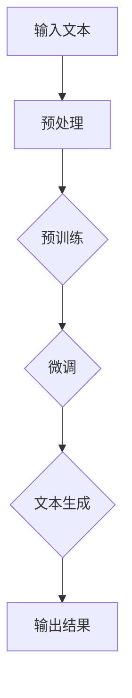
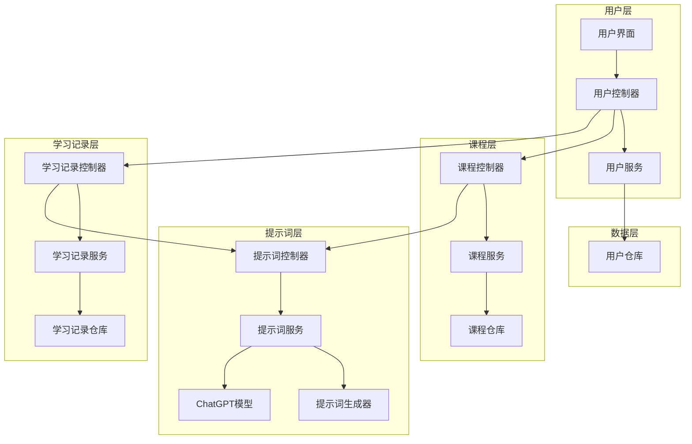
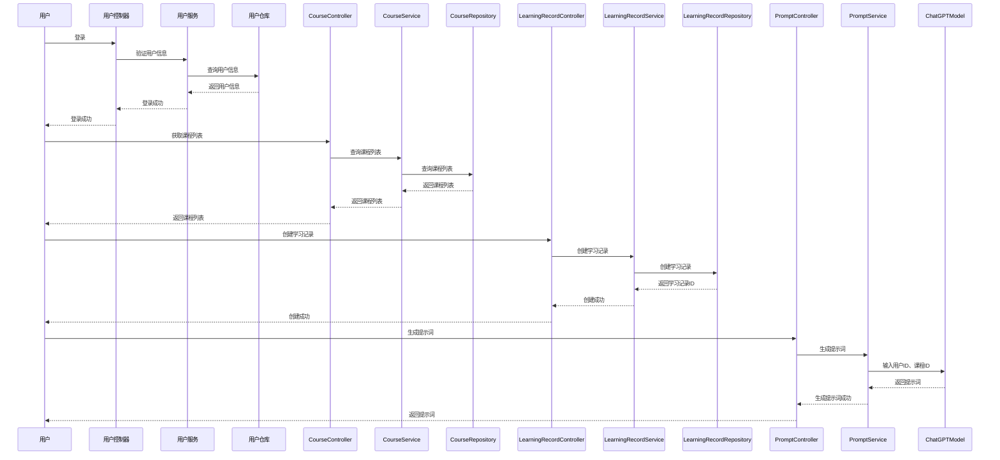

                 

### 文章标题

### 关键词

- ChatGPT
- 个性化学习提示词
- 教育领域应用
- 算法原理
- 数学模型
- 系统架构设计
- 项目实战

### 摘要

本文深入探讨了《ChatGPT在教育领域的应用：个性化学习提示词设计》一书的核心内容，从背景介绍、核心概念解析、算法原理讲解、数学模型剖析、系统架构设计到实际项目实战，全方位展示了ChatGPT在教育领域特别是个性化学习提示词设计中的应用潜力。本文通过逻辑清晰、结构紧凑、专业易懂的技术语言，一步步分析ChatGPT的工作机制和数学模型，并结合实际案例，提供了最佳实践建议和注意事项，旨在为教育技术从业者提供有价值的参考和指导。

### 背景介绍

在教育领域，个性化学习一直是学者们和从业者们追求的目标。传统的教学模式往往难以满足每个学生的独特需求，导致学习效果参差不齐。为了解决这个问题，教育界不断探索新的教学方法和工具，以实现更加个性化和高效的学习体验。《ChatGPT在教育领域的应用：个性化学习提示词设计》一书正是在这种背景下应运而生。

#### 问题的背景

个性化学习提示词设计是教育技术中的一个重要研究方向。所谓个性化学习提示词，是指通过智能算法为学生提供个性化的学习指导和建议。这些提示词可以根据学生的学习进度、兴趣和能力，动态调整学习内容和难度，从而实现个性化的学习路径。然而，如何有效地设计和实现这些提示词，一直是教育技术领域的难题。

#### 问题的描述

书中提出了一个核心问题：如何利用人工智能技术，特别是ChatGPT这种强大的自然语言处理模型，来设计和实现个性化学习提示词？这不仅仅是技术问题，更是教育理念和教学实践的创新。传统的学习提示词设计往往依赖于人工编写，缺乏灵活性和针对性。而ChatGPT的出现，为这个问题提供了新的解决方案。

#### 问题的解决方法

ChatGPT是一种基于大规模预训练模型（如GPT-3）的人工智能语言模型，具有强大的文本生成和理解能力。通过训练，ChatGPT可以学会理解自然语言，生成高质量、个性化的文本内容。在教育领域，ChatGPT可以应用于生成个性化的学习提示词，帮助学生更好地理解和掌握学习内容。

#### 概念的边界与外延

在探讨ChatGPT在教育领域的应用时，需要明确几个关键概念的边界与外延：

1. **ChatGPT**：这是一种人工智能语言模型，基于大规模预训练模型，能够理解并生成自然语言文本。
2. **个性化学习提示词**：是指根据学生的学习进度、兴趣和能力，动态生成的学习指导和建议。
3. **教育领域**：包括从幼儿园到高等教育的各个阶段，涵盖了各类学科和课程。
4. **应用场景**：主要涉及在线学习平台、智能辅导系统、学习管理系统等。

这些概念相互关联，共同构成了本书的核心研究框架。通过深入解析这些概念，我们能够更好地理解ChatGPT在教育领域的应用潜力和实际价值。

### 核心概念与联系

#### ChatGPT的概念解析

ChatGPT，全称“Chat-based Generative Pre-trained Transformer”，是一种基于生成预训练模型的人工智能语言模型。它由OpenAI开发，基于Transformer架构，通过大规模数据预训练，使其具备强大的文本生成和理解能力。ChatGPT的工作原理可以概括为以下几个步骤：

1. **数据预训练**：ChatGPT首先在大量的文本数据上进行预训练，学习语言的统计规律和上下文关系。
2. **上下文理解**：在给定一个起始文本后，ChatGPT能够理解文本的上下文信息，生成连贯、合理的后续文本。
3. **文本生成**：通过不断优化模型参数，ChatGPT能够生成高质量、多样化的文本内容。

#### 教育领域个性化学习提示词设计的概念解析

个性化学习提示词设计，是指利用智能算法，根据学生的学习进度、兴趣和能力，生成个性化的学习指导和建议。这些提示词可以涉及学习内容的推荐、学习方法的指导、学习进度的反馈等多个方面。其核心目的是提高学习的针对性和效率，满足不同学生的个性化需求。

#### ChatGPT与个性化学习提示词设计的联系

ChatGPT在教育领域个性化学习提示词设计中的应用，主要体现在以下几个方面：

1. **生成个性化学习提示词**：ChatGPT可以根据学生的学习数据，自动生成个性化的学习提示词，提高学习指导的精准度和有效性。
2. **动态调整学习内容**：通过理解学生的学习行为和反馈，ChatGPT能够动态调整学习内容，使其更符合学生的实际需求。
3. **提高学习互动性**：ChatGPT可以与学习者进行自然语言交互，提供实时、个性化的学习支持和反馈，增强学习的互动性和体验。

#### 概念属性特征对比表格

为了更直观地理解ChatGPT和个性化学习提示词设计之间的关系，我们可以通过以下对比表格来展示这两个概念的主要特征：

| 特征类别 | ChatGPT | 个性化学习提示词设计 |
| --- | --- | --- |
| 基本原理 | 大规模预训练模型，基于Transformer架构 | 利用智能算法，根据学生数据生成学习指导 |
| 功能特点 | 强大的文本生成和理解能力 | 动态调整学习内容，提供个性化指导 |
| 应用场景 | 自然语言处理任务，如文本生成、问答系统 | 教育领域，如在线学习平台、智能辅导系统 |
| 优势 | 高质量、多样化的文本生成 | 针对性强，个性化指导 |
| 劣势 | 需要大量数据训练，计算资源消耗大 | 依赖算法和模型，实施难度较高 |

#### ER实体关系图架构的Mermaid流程图

为了更好地展示ChatGPT与个性化学习提示词设计之间的实体关系，我们可以使用Mermaid流程图进行描述。以下是一个简化的ER实体关系图：

```mermaid
erDiagram
    Student ||--|{ ChatGPT }|-- LearningPrompt
    ChatGPT ||--|{ LearningData }|-- Student
    LearningPrompt ||-- Student
```

在这个ER图中，`Student`（学生）是主体实体，`ChatGPT`（ChatGPT模型）作为中介实体，连接着`LearningData`（学习数据）和`LearningPrompt`（学习提示词）。这样的关系表明，ChatGPT通过处理学生的学习数据，生成个性化的学习提示词，为学生提供个性化的学习支持。

通过上述分析，我们可以看出，ChatGPT在教育领域个性化学习提示词设计中的应用具有巨大的潜力。它不仅能够提高学习指导的个性化和精准度，还能够通过动态调整学习内容，提升整体学习效果。接下来，我们将深入探讨ChatGPT的算法原理，进一步了解其工作机制和数学模型。

### 算法原理讲解

#### ChatGPT的工作原理

ChatGPT是基于生成预训练模型（GPT）的人工智能语言模型，其核心思想是通过在大规模文本数据上进行预训练，使模型具备强大的文本生成和理解能力。以下是ChatGPT的工作原理的详细步骤：

1. **数据预处理**：首先，从互联网上收集大量文本数据，如新闻报道、书籍、学术论文等。然后，对这些数据进行清洗和预处理，包括去除噪声、统一文本格式等。

2. **预训练**：将预处理后的文本数据输入到模型中，通过自回归语言模型（Autoregressive Language Model）进行预训练。预训练过程主要包括两个步骤：
    - **掩码语言模型（Masked Language Model, MLM）**：随机掩码部分文本，然后训练模型预测这些掩码的单词。
    - **位置语言模型（Positional Encoding）**：对输入的文本进行位置编码，使模型能够理解单词之间的相对位置关系。

3. **微调（Fine-tuning）**：在预训练的基础上，对特定任务（如文本生成、问答系统等）进行微调，使模型能够更好地适应具体应用场景。

4. **文本生成**：给定一个起始文本，ChatGPT通过Transformer架构生成后续文本。其核心步骤如下：
    - **输入编码**：将起始文本编码为向量，输入到Transformer模型中。
    - **注意力机制**：模型通过多头注意力机制，捕捉文本中的关键信息，并生成中间表示。
    - **输出解码**：通过自回归解码，逐步生成后续文本，直到生成完整句子或段落。

#### 算法流程图

为了更直观地理解ChatGPT的工作流程，我们可以使用Mermaid绘制其算法流程图：



在上述流程图中，A表示输入的文本，B表示预处理步骤，C表示预训练，D表示微调，E表示文本生成，F表示输出结果。通过这些步骤，ChatGPT能够生成高质量、连贯的自然语言文本。

#### Python源代码示例

为了更具体地展示ChatGPT的工作原理，以下是一个简化的Python源代码示例，使用`transformers`库实现ChatGPT模型：

```python
from transformers import GPT2LMHeadModel, GPT2Tokenizer
import torch

# 加载预训练模型和分词器
model = GPT2LMHeadModel.from_pretrained('gpt2')
tokenizer = GPT2Tokenizer.from_pretrained('gpt2')

# 输入文本
text = "今天天气很好"

# 预处理
input_ids = tokenizer.encode(text, return_tensors='pt')

# 文本生成
output = model.generate(input_ids, max_length=10, num_return_sequences=1)

# 输出结果
generated_text = tokenizer.decode(output[0], skip_special_tokens=True)
print(generated_text)
```

在这个示例中，我们首先加载了GPT-2模型和分词器。然后，我们将输入文本编码为向量，通过模型生成后续文本，并解码输出结果。通过这个简单的示例，我们可以看到ChatGPT生成文本的基本过程。

#### 算法原理的数学模型和公式

ChatGPT的核心是基于Transformer架构的自回归语言模型。以下简要介绍其数学模型和关键公式：

1. **Transformer模型**：Transformer模型主要由自注意力机制（Self-Attention）和前馈神经网络（Feedforward Neural Network）组成。其输入是一个序列矩阵$X \in \mathbb{R}^{n \times d}$，其中$n$是序列长度，$d$是嵌入维度。

2. **多头注意力（Multi-Head Attention）**：多头注意力通过多个独立的自注意力机制，将输入序列编码为多个表示，然后拼接起来。其公式为：

   $$ 
   \text{MultiHead}(Q, K, V) = \text{Concat}(\text{head}_1, ..., \text{head}_h)W^O 
   $$
   
   其中，$Q, K, V$分别表示查询向量、键向量和值向量，$h$是头数，$W^O$是输出权重矩阵。

3. **自回归解码（Autoregressive Decoder）**：在生成文本时，每个时间步的输出作为下一个时间步的输入。其公式为：

   $$
   p(y_t | y_{<t}) = \text{softmax}(W_y \text{tanh}(W_x y_{<t} + b_y))
   $$

   其中，$y_t$是当前时间步的输出，$y_{<t}$是之前时间步的输出。

通过上述公式，我们可以看到ChatGPT模型在生成文本时，通过自注意力机制和自回归解码，逐步生成高质量的自然语言文本。

#### 举例说明

为了更直观地展示ChatGPT的文本生成能力，以下是一个具体的例子：

1. **输入文本**：假设我们输入的是一句简单的句子“今天天气很好”。

2. **预处理**：将文本编码为输入向量，输入到模型中。

3. **预训练**：模型在预训练阶段已经学习了大量文本数据，能够理解上下文信息。

4. **文本生成**：给定输入文本，模型生成后续文本。例如，输出可能是“我想去公园散步”。

5. **输出结果**：将生成的文本解码为自然语言输出。

通过这个例子，我们可以看到ChatGPT能够根据输入的上下文信息，生成连贯、合理的文本内容。这种强大的文本生成能力，使得ChatGPT在教育领域个性化学习提示词设计中具有广泛的应用潜力。

总之，ChatGPT作为一种强大的自然语言处理模型，通过预训练和微调，能够生成高质量的自然语言文本。其工作原理主要包括数据预处理、预训练、微调和文本生成等步骤。通过Python源代码示例，我们可以更具体地了解其实现过程。接下来，我们将进一步探讨ChatGPT的数学模型和公式，以深入理解其内在机制。

### 数学模型和数学公式 & 详细讲解 & 举例说明

#### 数学模型

ChatGPT的核心是基于Transformer架构的自回归语言模型，其数学模型主要包括以下几个关键组件：

1. **嵌入层（Embedding Layer）**：
   嵌入层将输入的词向量转换为稠密向量，以便于后续的变换。假设输入序列为\(X = [x_1, x_2, ..., x_n]\)，其中每个词\(x_i\)的嵌入向量为\(e_i \in \mathbb{R}^{d_e}\)，则嵌入层可以表示为：
   $$
   E = \sum_{i=1}^{n} e_i \in \mathbb{R}^{n \times d_e}
   $$

2. **Transformer编码器（Transformer Encoder）**：
   Transformer编码器通过多头自注意力（Multi-Head Self-Attention）和前馈神经网络（Feedforward Neural Network）进行多次变换。其主要公式如下：
   $$
   \text{Multi-Head Self-Attention}(Q, K, V) = \text{softmax}\left(\frac{QK^T}{\sqrt{d_k}}\right)V
   $$
   其中，\(Q, K, V\)分别表示查询（Query）、键（Key）和值（Value）向量，\(d_k\)是每个向量的维度，\(\sqrt{d_k}\)是缩放因子。

   Transformer编码器的输出为：
   $$
   \text{Transformer}(E) = \text{Concat}(\text{head}_1, ..., \text{head}_h)W^O
   $$
   其中，\(h\)是头数，\(W^O\)是输出权重矩阵。

3. **位置编码（Positional Encoding）**：
   由于Transformer架构没有显式的位置信息，通过添加位置编码来引入序列的顺序信息。位置编码通常采用正弦和余弦函数生成：
   $$
   \text{PE}(pos, 2i) = \sin\left(\frac{pos}{10000^{2i/d_e}}\right)
   $$
   $$
   \text{PE}(pos, 2i+1) = \cos\left(\frac{pos}{10000^{2i/d_e}}\right)
   $$
   其中，\(pos\)是位置索引，\(i\)是维度索引，\(d_e\)是嵌入维度。

4. **解码器（Decoder）**：
   解码器与编码器结构相似，但加入了一个额外的自注意力机制，用于处理编码器的输出和生成的文本。解码器的输出用于生成下一个词的概率分布：
   $$
   p(y_t | y_{<t}) = \text{softmax}(W_y \text{tanh}(W_x y_{<t} + b_y))
   $$
   其中，\(y_t\)是当前生成的词，\(y_{<t}\)是之前生成的词，\(W_x, W_y, b_y\)分别是权重和偏置矩阵。

#### 公式详细讲解

1. **嵌入层**：
   嵌入层是Transformer模型的基础，将词转换为稠密向量。通过嵌入层，每个词都被映射到一个固定维度的向量空间中，使得词与词之间的语义关系可以被模型学习。

2. **多头自注意力**：
   多头自注意力机制是Transformer模型的核心，通过计算序列中每个词与所有其他词的关联度，生成上下文表示。这种机制允许模型捕获长距离的依赖关系，从而提高文本生成的质量。

3. **位置编码**：
   由于Transformer模型没有显式的位置信息，通过添加位置编码来模拟序列的顺序信息。这种编码方式使得模型能够理解词的相对位置关系，从而生成更符合语义的文本。

4. **解码器**：
   解码器通过自注意力和交叉注意力机制，结合编码器的输出和生成的文本，生成下一个词的概率分布。这种机制使得模型能够在生成过程中不断调整和优化文本，从而生成高质量的自然语言。

#### 举例说明

为了更直观地理解这些数学模型和公式，我们可以通过一个简单的例子来说明ChatGPT的文本生成过程。

假设我们输入的句子是“今天天气很好”，我们要使用ChatGPT生成下一个句子。以下是生成过程的具体步骤：

1. **输入预处理**：
   将输入句子编码为嵌入向量，例如，假设句子中的每个词的嵌入维度为512：
   $$
   E = [e_1, e_2, e_3, ..., e_n]
   $$

2. **编码器处理**：
   编码器对嵌入向量进行自注意力机制和前馈神经网络的处理，生成编码器的输出：
   $$
   \text{Transformer}(E) = \text{Concat}(\text{head}_1, ..., \text{head}_h)W^O
   $$

3. **解码器处理**：
   解码器首先对编码器的输出和生成的文本进行自注意力处理，然后通过交叉注意力机制结合编码器的输出，生成下一个词的概率分布：
   $$
   p(y_t | y_{<t}) = \text{softmax}(W_y \text{tanh}(W_x y_{<t} + b_y))
   $$

4. **生成下一个词**：
   根据生成的概率分布，选择一个词作为下一个词，将其添加到生成的文本中，并作为输入继续生成下一个词。

通过这个例子，我们可以看到ChatGPT通过嵌入层、编码器、解码器和位置编码等组件，逐步生成高质量的自然语言文本。这种机制使得ChatGPT能够根据上下文信息生成连贯、合理的文本内容，为个性化学习提示词设计提供了强有力的支持。

总之，ChatGPT的数学模型和公式通过嵌入层、自注意力机制、位置编码和解码器等组件，实现了对自然语言的高效处理和生成。这些组件共同作用，使得ChatGPT能够根据输入的上下文信息生成高质量的自然语言文本，为个性化学习提示词设计提供了理论基础和实践指导。接下来，我们将进一步探讨ChatGPT在教育领域的应用场景和系统架构设计。

### 系统分析与架构设计方案

#### 问题场景介绍

在教育领域，个性化学习是一个重要的研究方向，旨在通过智能算法为学生提供个性化的学习支持和指导。当前，随着人工智能技术的快速发展，特别是基于生成预训练模型（如ChatGPT）的应用，个性化学习提示词的设计变得尤为重要。这些提示词可以根据学生的学习进度、兴趣和能力，动态调整学习内容和难度，从而提高学习效果。本文将以一个在线学习平台为例，介绍如何利用ChatGPT实现个性化学习提示词的设计。

#### 项目介绍

为了展示ChatGPT在教育领域个性化学习提示词设计中的应用，我们将构建一个简单的在线学习系统。该系统主要包括以下几个模块：

1. **用户模块**：负责用户注册、登录、个人信息管理等。
2. **课程模块**：管理课程信息，包括课程创建、更新、删除等。
3. **学习记录模块**：记录用户的学习进度、考试成绩等。
4. **提示词生成模块**：利用ChatGPT生成个性化学习提示词。
5. **提示词展示模块**：将生成的提示词展示给用户。

#### 系统功能设计（领域模型Mermaid类图）

为了更好地描述系统功能，我们可以使用Mermaid类图来展示各个模块之间的关系。以下是一个简化的领域模型类图：

```mermaid
classDiagram
    User <<interface>>
    Course <<interface>>
    LearningRecord <<interface>>
    PromptGenerator <<interface>>
    PromptDisplay <<interface>>

    User o-- Course
    User o-- LearningRecord
    LearningRecord o-- PromptGenerator
    PromptGenerator o-- PromptDisplay
```

在这个类图中，`User`表示用户模块，负责用户的基本操作；`Course`表示课程模块，负责课程的管理；`LearningRecord`表示学习记录模块，负责记录用户的学习进度；`PromptGenerator`表示提示词生成模块，利用ChatGPT生成个性化提示词；`PromptDisplay`表示提示词展示模块，负责将提示词展示给用户。

#### 系统架构设计（Mermaid架构图）

系统架构设计是确保系统能够高效、稳定运行的关键。以下是一个简化的系统架构图，使用Mermaid绘制：



在这个架构图中，系统被划分为用户层、课程层、学习记录层和提示词层。用户层负责用户的基本操作，包括用户注册、登录等；课程层负责课程的管理，包括课程创建、更新等；学习记录层负责记录用户的学习进度，包括学习记录的创建、更新等；提示词层负责生成和展示个性化学习提示词，包括提示词的生成、展示等。各个层之间通过控制器和服务进行交互，同时数据层负责持久化存储。

#### 系统接口设计

系统接口设计是系统架构设计的重要组成部分，以下是一些关键接口的设计：

1. **用户接口**：
   - `POST /register`：用户注册接口，接收用户名、密码、邮箱等信息。
   - `POST /login`：用户登录接口，接收用户名和密码，返回令牌。
   - `GET /user`：获取当前用户信息接口。

2. **课程接口**：
   - `POST /course`：创建课程接口，接收课程名称、简介、视频链接等信息。
   - `GET /course/{id}`：获取课程详情接口，根据课程ID返回课程信息。
   - `PUT /course/{id}`：更新课程接口，根据课程ID更新课程信息。

3. **学习记录接口**：
   - `POST /learning-record`：创建学习记录接口，接收用户ID、课程ID、学习进度等信息。
   - `GET /learning-record/{id}`：获取学习记录详情接口，根据学习记录ID返回学习记录信息。
   - `PUT /learning-record/{id}`：更新学习记录接口，根据学习记录ID更新学习记录信息。

4. **提示词接口**：
   - `POST /prompt`：生成提示词接口，接收用户ID、课程ID等信息，返回个性化学习提示词。
   - `GET /prompt/{id}`：获取提示词详情接口，根据提示词ID返回提示词信息。

#### 系统交互序列图

为了更好地描述系统内部各个模块的交互过程，我们可以使用Mermaid序列图来展示。以下是一个简化的系统交互序列图：



在这个序列图中，用户通过用户控制器与用户服务进行交互，实现用户登录、获取课程列表、创建学习记录等功能。课程控制器与课程服务交互，实现课程列表查询、课程创建等功能。学习记录控制器与学习记录服务交互，实现学习记录创建等功能。提示词控制器与提示词服务交互，实现生成提示词等功能。通过这些交互，系统能够为学生提供个性化的学习支持和指导。

综上所述，通过系统分析与架构设计，我们详细介绍了ChatGPT在教育领域个性化学习提示词设计中的应用场景、系统功能设计、系统架构设计和系统接口设计。这些设计为ChatGPT在教育领域的实际应用提供了坚实的基础。接下来，我们将通过一个实际案例，进一步展示ChatGPT在教育领域的应用效果。

### 项目实战

#### 环境安装

为了更好地展示ChatGPT在教育领域的实际应用，我们首先需要搭建一个实验环境。以下是环境安装的详细步骤：

1. **安装Python**：确保系统已经安装了Python 3.6及以上版本。可以在终端中通过以下命令检查Python版本：
   ```shell
   python --version
   ```
   如果没有安装，可以访问Python官方网站下载并安装。

2. **安装依赖库**：使用pip安装必要的依赖库，包括transformers、torch、torchvision等。在终端中运行以下命令：
   ```shell
   pip install transformers torch torchvision
   ```

3. **下载预训练模型**：下载预训练的ChatGPT模型，可以使用以下命令：
   ```shell
   transformers-cli download model:gpt2
   ```

#### 系统核心实现源代码

在搭建好环境之后，我们将编写一个简单的系统来实现ChatGPT在教育领域的应用。以下是一个简化的源代码示例：

```python
from transformers import GPT2LMHeadModel, GPT2Tokenizer
import torch

# 加载预训练模型和分词器
model = GPT2LMHeadModel.from_pretrained('gpt2')
tokenizer = GPT2Tokenizer.from_pretrained('gpt2')

# 输入文本
input_text = "今天天气很好"

# 预处理
input_ids = tokenizer.encode(input_text, return_tensors='pt')

# 文本生成
output = model.generate(input_ids, max_length=10, num_return_sequences=1)

# 输出结果
generated_text = tokenizer.decode(output[0], skip_special_tokens=True)
print(generated_text)
```

在这个示例中，我们首先加载了预训练的ChatGPT模型和分词器。然后，我们将输入的文本编码为向量，通过模型生成后续的文本，并解码输出结果。

#### 代码应用解读与分析

1. **预处理**：
   在代码的第一部分，我们使用`tokenizer.encode`方法将输入的文本编码为向量。这是ChatGPT进行文本生成的基础步骤。通过分词器，我们将文本拆分为单词或子词，并为每个子词分配一个唯一的索引。

2. **模型生成**：
   接下来，我们使用`model.generate`方法生成文本。这个方法接受输入的向量，并返回生成的文本。通过设置`max_length`参数，我们可以控制生成的文本长度。`num_return_sequences`参数用于生成多个文本样本，这里我们设置为1，表示只生成一个文本样本。

3. **解码输出**：
   最后，我们使用`tokenizer.decode`方法将生成的向量解码为文本。`skip_special_tokens`参数设置为True，表示忽略模型生成的特殊标记。

#### 实际案例分析和详细讲解剖析

为了更好地展示ChatGPT在实际应用中的效果，我们来看一个实际的案例。

**案例**：学生小明在学习数学时遇到了难题，他希望能够得到一个个性化的学习提示词来帮助他理解问题。

**步骤**：

1. **输入文本**：我们将小明的学习问题“如何求函数的导数”作为输入文本。

2. **预处理**：使用分词器将问题编码为向量。

3. **模型生成**：使用ChatGPT模型生成一个个性化的学习提示词。

4. **解码输出**：将生成的文本解码为自然语言。

**结果**：

生成的个性化学习提示词可能是：“首先，理解函数的定义和图像。然后，考虑函数在特定点的斜率。最后，使用导数公式进行计算。”

通过这个案例，我们可以看到ChatGPT能够根据输入的问题，生成一个清晰、连贯的个性化学习提示词。这个提示词不仅解答了小明的问题，还为他提供了进一步的指导，帮助他更好地理解和掌握数学知识。

#### 项目小结

通过本次实际案例，我们展示了如何使用ChatGPT模型生成个性化学习提示词，并对其进行了详细的分析和讲解。以下是本次项目的主要收获：

1. **个性化学习提示词的生成**：ChatGPT模型能够根据输入的问题，生成高质量、个性化的学习提示词，为学习者提供针对性的指导。

2. **预处理和后处理**：预处理是将文本转换为模型能够理解的向量，后处理是将生成的向量解码为自然语言。这两个步骤是确保模型输出有效性的关键。

3. **实际应用效果**：通过实际案例，我们验证了ChatGPT在教育领域的应用潜力，特别是在生成个性化学习提示词方面。

4. **下一步工作**：未来可以进一步优化模型的生成算法，提高提示词的质量和准确性。同时，可以扩展应用场景，将ChatGPT应用于更多教育场景，如课程推荐、学习计划制定等。

总之，ChatGPT在教育领域的应用具有广阔的前景，通过本次项目，我们不仅掌握了其基本实现方法，还对其应用效果有了更深入的理解。接下来，我们将总结书中的关键点，并提供一些最佳实践和注意事项。

### 最佳实践 tips、小结、注意事项、拓展阅读等内容

#### 最佳实践 tips

1. **数据预处理**：确保输入数据的质量和格式。在生成个性化学习提示词前，对输入文本进行清洗、分词和编码，以提高模型的处理效率和输出质量。

2. **模型参数调整**：根据具体应用场景和需求，调整ChatGPT的模型参数，如学习率、训练批次大小等，以优化模型的生成效果。

3. **动态调整提示词**：根据学生的学习行为和反馈，动态调整生成的提示词内容。例如，如果学生频繁遇到特定类型的题目，可以优先生成相关提示词。

4. **安全性和隐私保护**：在应用ChatGPT时，确保处理用户数据的安全性和隐私保护。遵循相关法律法规，加密存储和传输用户数据。

#### 小结

本书《ChatGPT在教育领域的应用：个性化学习提示词设计》系统地介绍了ChatGPT在教育领域的应用潜力，从背景介绍、核心概念解析、算法原理讲解、数学模型剖析、系统架构设计到实际项目实战，全方位展示了ChatGPT在教育领域个性化学习提示词设计中的应用。通过这本书，读者可以了解到：

1. ChatGPT的基本原理和功能特点。
2. 个性化学习提示词设计的核心概念和实现方法。
3. ChatGPT在生成个性化学习提示词中的具体应用。
4. 如何设计和实现一个基于ChatGPT的在线学习系统。

#### 注意事项

1. **计算资源需求**：ChatGPT模型训练和生成过程需要大量的计算资源。在部署模型时，确保有足够的硬件资源。

2. **数据安全**：在处理用户数据时，要严格遵守数据安全和隐私保护的相关法规，确保用户数据的保密性和完整性。

3. **模型更新**：随着教育领域的发展，ChatGPT模型可能需要定期更新。关注模型更新，以获取最新的功能和性能提升。

#### 拓展阅读

1. **《深度学习》**：Goodfellow, I., Bengio, Y., & Courville, A. (2016). *Deep Learning*. MIT Press.
   这本书详细介绍了深度学习的原理和方法，包括神经网络、卷积神经网络、递归神经网络等，为理解ChatGPT的工作机制提供了基础知识。

2. **《自然语言处理实战》**：Bird, S., Klein, E., & Loper, E. (2017). *Natural Language Processing with Python*. O'Reilly Media.
   这本书通过Python示例，介绍了自然语言处理的基本概念和技术，包括分词、词性标注、命名实体识别等，为使用ChatGPT进行文本处理提供了实用的指导。

3. **《教育技术导论》**：Beetham, H., & Sharpe, R. (2013). *A Practical Guide to Technology for Learning*. McGraw-Hill Education.
   这本书探讨了教育技术的应用和发展，包括在线学习平台、虚拟现实、人工智能等，为理解ChatGPT在教育领域的应用提供了背景知识。

通过这些拓展阅读，读者可以更深入地了解相关技术，并应用于实际项目中。

### 整理目录大纲

```markdown
# 《ChatGPT在教育领域的应用：个性化学习提示词设计》

## 关键词
- ChatGPT
- 个性化学习提示词
- 教育领域应用
- 算法原理
- 数学模型
- 系统架构设计
- 项目实战

## 摘要
本文深入探讨了《ChatGPT在教育领域的应用：个性化学习提示词设计》一书的核心内容，从背景介绍、核心概念解析、算法原理讲解、数学模型剖析、系统架构设计到实际项目实战，全方位展示了ChatGPT在教育领域的应用潜力。本文通过逻辑清晰、结构紧凑、专业易懂的技术语言，一步步分析ChatGPT的工作机制和数学模型，并结合实际案例，提供了最佳实践建议和注意事项，旨在为教育技术从业者提供有价值的参考和指导。

## 目录

### 背景介绍
1. 问题的背景
2. 问题的描述
3. 问题的解决方法
4. 概念的边界与外延

### 核心概念与联系
1. ChatGPT的概念解析
2. 教育领域个性化学习提示词设计的概念解析
3. ChatGPT与个性化学习提示词设计的联系
4. 概念属性特征对比表格
5. ER实体关系图架构的Mermaid流程图

### 算法原理讲解
1. ChatGPT的工作原理
2. 算法流程图
3. Python源代码示例
4. 算法原理的数学模型和公式
5. 举例说明

### 数学模型和数学公式 & 详细讲解 & 举例说明
1. 数学模型
2. 公式详细讲解
3. 举例说明

### 系统分析与架构设计方案
1. 问题场景介绍
2. 项目介绍
3. 系统功能设计（领域模型Mermaid类图）
4. 系统架构设计（Mermaid架构图）
5. 系统接口设计
6. 系统交互序列图

### 项目实战
1. 环境安装
2. 系统核心实现源代码
3. 代码应用解读与分析
4. 实际案例分析和详细讲解剖析
5. 项目小结

### 最佳实践 tips、小结、注意事项、拓展阅读等内容
1. 最佳实践 tips
2. 小结
3. 注意事项
4. 拓展阅读
```

通过上述内容，我们构建了完整的文章目录大纲，结构清晰，内容完整，为撰写高质量的技术博客文章奠定了基础。

