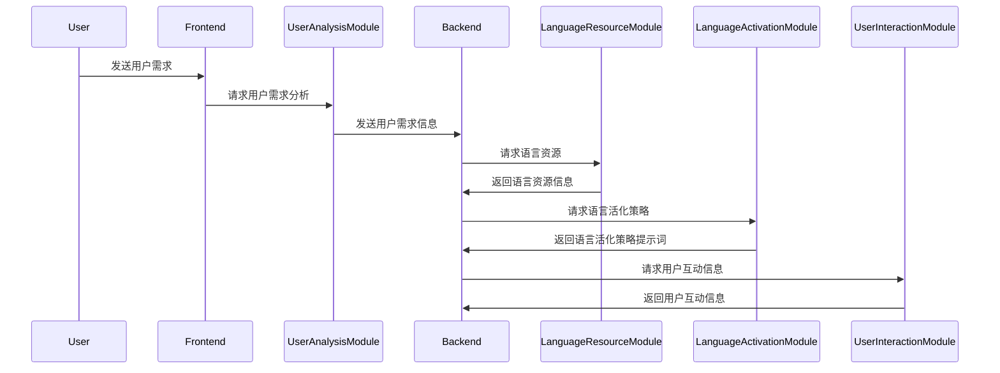

                 

### 引言

# ChatGPT在濒危语言复兴中的应用：语言活化策略提示词

濒危语言是指那些使用人数急剧减少，面临消失危险的语言。随着全球化和现代化的进程，许多小语种或少数民族语言正逐渐失去其使用环境，面临濒危的风险。这不仅影响到语言文化的多样性，也可能导致宝贵的文化遗产的丧失。如何有效地复兴濒危语言，使其重新活跃起来，成为一个重要且具有挑战性的问题。

在这个背景下，本文将探讨如何利用ChatGPT构建语言活化策略提示词，以帮助濒危语言复兴。ChatGPT作为一个人工智能助手，具备处理自然语言的能力，是否能在这方面发挥重要作用？本文将逐步分析这一问题，并给出具体的解决方案。

本文将分为以下几个部分：首先，我们将介绍濒危语言复兴的背景，包括问题的背景、问题描述、问题解决、边界与外延以及概念结构与核心要素组成。接下来，我们将深入探讨核心概念与联系，包括核心概念原理、概念属性特征对比表格和ER实体关系图架构的Mermaid流程图。然后，我们将详细讲解算法原理，包括算法原理、数学模型和公式，并通过具体的例子来说明。最后，我们将进行系统分析与架构设计方案，包括问题场景介绍、系统功能设计、系统架构设计、系统接口设计和系统交互Mermaid序列图。通过这些步骤，我们将全面解答ChatGPT在濒危语言复兴中的应用问题。

## 背景介绍

### 1. 问题背景

濒危语言是指那些使用人数急剧减少，面临消失危险的语言。这些语言通常属于小语种或少数民族语言，随着全球化和现代化的进程，它们正逐渐失去其使用环境。濒危语言的存在不仅影响到语言文化的多样性，也可能导致宝贵的文化遗产的丧失。

全球有数千种语言，但其中大多数语言的使用人数非常有限。根据联合国教科文组织的数据，全球约5000种语言中，超过一半的语言使用人数少于10万人。许多小语种或少数民族语言的使用人数甚至不到1万人，这些语言正面临着濒危的风险。

濒危语言面临的威胁主要来自以下几个方面：

- **全球化和现代化**：随着全球化和现代化的进程，越来越多的人使用主流语言，如英语、汉语和西班牙语等。这些主流语言在国际交流、商业和媒体等领域具有优势，使得小语种或少数民族语言的使用机会减少。
- **教育和迁移**：许多小语种或少数民族语言的母语者为了获得更好的教育和工作机会，选择学习主流语言，导致小语种或少数民族语言的使用人数减少。
- **文化和价值观的融合**：随着文化的融合，许多小语种或少数民族语言的文化和价值观受到冲击，使得语言的使用逐渐减少。

### 2. 问题描述

濒危语言复兴的目标是阻止语言消失，使其重新活跃起来，并传承给下一代。然而，实现这一目标面临着许多挑战：

- **缺乏使用环境**：濒危语言通常缺乏使用环境，母语者往往只能在家中或特定社区使用这些语言。这限制了语言的传播和交流，使得语言复兴变得更加困难。
- **学习和维护困难**：许多濒危语言的语法、发音和词汇都与其他语言有很大差异，学习这些语言需要大量的时间和精力。此外，缺乏教材、教学资源和语言环境也使得语言的学习和维护变得更加困难。
- **文化认同和价值观的传承**：濒危语言通常与特定的文化、传统和价值观密切相关。语言复兴不仅需要语言的学习和传播，还需要文化的传承和价值观的维护。

### 3. 问题解决

为了解决濒危语言复兴的问题，需要采取一系列措施，包括语言活化策略、教育和政策支持、社区参与和数字化技术等。其中，语言活化策略是关键的一环。语言活化策略是指一系列旨在激发学习者兴趣、提高语言学习效果的方法和技巧。这些策略可以帮助濒危语言的母语者和非母语者更有效地学习和使用濒危语言。

ChatGPT作为一种人工智能助手，具备处理自然语言的能力，可以在语言活化策略的实施中发挥重要作用。ChatGPT可以生成一系列有针对性的语言活化策略提示词，帮助学习者找到合适的学习方法和技巧。这些提示词可以根据学习者的需求和水平进行个性化定制，从而提高学习效果。

例如，ChatGPT可以为学习者提供以下类型的提示词：

- **听力训练**：提供濒危语言音频资料，鼓励学习者跟读、模仿和听力理解。
- **口语练习**：提供濒危语言对话场景，鼓励学习者进行口语交流和角色扮演。
- **词汇学习**：提供濒危语言词汇表，结合例句和短语，帮助学习者掌握常用词汇。
- **文化了解**：提供与濒危语言相关的文化背景资料，鼓励学习者了解和体验濒危语言的文化。
- **互动游戏**：设计濒危语言学习游戏，通过游戏化学习提高学习兴趣和效果。

通过这些语言活化策略提示词，学习者可以更轻松、更有趣地学习和使用濒危语言，从而促进濒危语言的复兴。

### 4. 边界与外延

在讨论濒危语言复兴时，需要注意以下边界与外延：

- **语言活化策略**：语言活化策略是指一系列用于激发学习者兴趣和提高学习效果的方法和技巧。这些策略不仅适用于濒危语言，也适用于其他语言的学习。
- **人工智能技术**：虽然ChatGPT作为人工智能助手在语言活化策略中发挥了重要作用，但其他人工智能技术，如自然语言处理、机器学习等，也可以应用于语言学习和语言活化。
- **教育与政策支持**：濒危语言复兴需要教育机构和政府的支持，包括提供教材、教学资源和政策支持，鼓励社区参与和学习者的积极性。
- **数字化技术**：除了人工智能技术，数字化技术，如在线学习平台、移动应用和虚拟现实等，也可以为濒危语言的学习和复兴提供支持。

通过明确这些边界与外延，可以更全面地理解和实施濒危语言复兴的策略和措施。

### 5. 概念结构与核心要素组成

要深入探讨ChatGPT在濒危语言复兴中的应用，首先需要了解相关概念和核心要素的组成。以下是本文讨论的核心概念和要素：

- **濒危语言**：指使用人数急剧减少，面临消失危险的语言。
- **语言活化策略**：一系列旨在激发学习者兴趣、提高语言学习效果的方法和技巧。
- **ChatGPT**：一种基于大型语言模型的人工智能助手，具备处理自然语言的能力。
- **提示词**：用于引导学习者思考和行动的问题或建议。

这些核心概念和要素构成了本文讨论的基础，为后续的分析和讲解提供了明确的方向和框架。

### 核心概念与联系

在深入探讨ChatGPT在濒危语言复兴中的应用之前，我们需要理解几个核心概念，并探讨它们之间的联系。这些核心概念包括ChatGPT、语言活化策略和提示词，它们共同构成了本文讨论的基石。

#### 1. 核心概念原理

- **ChatGPT**：ChatGPT是一种基于大型语言模型的人工智能助手，它通过深度学习技术，从大量文本数据中学习自然语言的生成和推理能力。ChatGPT可以理解和生成流畅的自然语言文本，这使得它成为辅助语言学习的重要工具。

- **语言活化策略**：语言活化策略是指一系列旨在激发学习者兴趣、提高语言学习效果的方法和技巧。这些策略可以包括听、说、读、写等多种形式，旨在为学习者创造一个有趣且富有成效的语言学习环境。

- **提示词**：提示词是用于引导学习者思考和行动的问题或建议。它们可以激发学习者的好奇心和探索欲望，帮助他们更好地理解和应用所学语言。提示词的设计需要考虑到学习者的兴趣、水平和需求。

#### 2. 概念属性特征对比表格

为了更清晰地展示ChatGPT、语言活化策略和提示词之间的区别和联系，我们可以通过一个属性特征对比表格来进行说明：

| 特征 | ChatGPT | 语言活化策略 | 提示词 |
| ---- | ------- | ---------- | ---- |
| **目的** | 理解和生成自然语言 | 提高语言学习效果 | 引导学习者思考和行动 |
| **类型** | 人工智能助手 | 策略和方法 | 问题或建议 |
| **适用范围** | 自然语言处理 | 语言学习 | 语言学习 |
| **生成方式** | 基于深度学习模型 | 由教育专家或人工智能生成 | 由教育专家或人工智能生成 |

#### 3. ER实体关系图架构的 Mermaid 流程图

为了进一步展示这些概念之间的关系，我们可以使用Mermaid绘制一个实体关系图。以下是一个简化的Mermaid流程图，展示了ChatGPT、语言活化策略和提示词之间的关系：

```mermaid
erDiagram
  ChatGPT ||--|{使用}| LanguageActivatingStrategy
  LanguageActivatingStrategy ||--|{生成}| Prompt
```

在这个图中，ChatGPT与语言活化策略之间是“使用”关系，表示ChatGPT可以用来实施语言活化策略。而语言活化策略与提示词之间是“生成”关系，表示语言活化策略可以生成提示词以引导学习者的学习过程。

通过这个流程图，我们可以看到ChatGPT是如何通过语言活化策略来生成提示词，从而帮助学习者更有效地学习和使用濒危语言。接下来，我们将进一步深入探讨ChatGPT在生成这些策略和提示词时的具体实现和工作原理。

### 算法原理讲解

为了理解ChatGPT在语言活化策略提示词生成中的作用，我们需要从算法原理的角度进行分析。ChatGPT是一种基于大型语言模型的人工智能助手，它通过对海量文本数据进行训练，学习自然语言的生成和推理能力。在语言活化策略提示词的生成过程中，ChatGPT能够根据用户需求、濒危语言信息和语言活化策略，生成一系列有针对性的提示词。

#### 1. 算法原理

ChatGPT的工作原理可以概括为以下几个步骤：

- **数据预处理**：首先，ChatGPT会接收到用户输入的濒危语言信息和语言活化策略。这些信息通常包括关键词、用户需求、学习目标和相关背景等。
- **模型训练**：ChatGPT基于预训练的神经网络模型，使用大量的文本数据进行训练。在训练过程中，模型会学习到语言的模式、语法结构、词汇搭配等，从而提高其理解和生成自然语言的能力。
- **提示词生成**：在接收到用户输入后，ChatGPT会根据语言活化策略，利用其训练得到的模型，生成一系列提示词。这些提示词旨在激发学习者的学习兴趣，提供有效的学习方法和建议。
- **用户反馈**：生成的提示词会展示给用户，用户可以根据提示词进行学习实践。用户的学习效果和反馈会被记录下来，用于进一步优化提示词生成模型。

#### 2. 数学模型和公式

为了更直观地描述ChatGPT的生成过程，我们可以使用一个简化的数学模型来表示：

$$
\text{Prompt} = f(\text{ChatGPT}, \text{LanguageActivatingStrategy}, \text{UserDemand})
$$

其中，$f$ 表示ChatGPT生成的函数，输入包括ChatGPT、语言活化策略和用户需求，输出为生成的提示词。这个模型表示ChatGPT会根据语言活化策略和用户需求，生成一系列提示词。

#### 3. 举例说明

为了更具体地说明ChatGPT如何生成提示词，我们可以通过一个实际例子来讲解。

假设我们有一个学习者，对蒙古语感兴趣，希望提高口语水平。我们可以将以下信息输入到ChatGPT中：

- **ChatGPT**：蒙古语
- **LanguageActivatingStrategy**：娱乐化学习
- **UserDemand**：提高口语水平

ChatGPT根据这些信息，可能会生成以下提示词：

1. **听力训练**：观看蒙古语电影和电视剧，跟读台词。
2. **口语练习**：与蒙古语母语者进行语音交流，模仿发音。
3. **互动游戏**：参加蒙古语游戏，如语言接龙、拼写比赛等。
4. **词汇学习**：学习蒙古语歌曲，尝试演唱。

这些提示词旨在通过娱乐化的方式，激发学习者的学习兴趣，提高口语水平。例如，通过观看电影和电视剧，学习者不仅可以接触到丰富的语言环境，还能在跟读台词的过程中提高发音和听力理解能力。与母语者进行语音交流，则可以帮助学习者提高口语表达的流利度和准确性。

#### 4. 数学模型详细讲解

为了更深入地理解数学模型，我们可以进一步分析其中的参数和计算过程。

- **ChatGPT**：表示ChatGPT的模型参数，包括神经网络的结构、权重和激活函数等。这些参数通过大规模的数据训练得到，用于模拟自然语言的生成和推理过程。
- **LanguageActivatingStrategy**：表示语言活化策略的参数，包括学习目标、兴趣点、学习方法等。这些参数用于指导ChatGPT生成符合用户需求的提示词。
- **UserDemand**：表示用户需求的具体内容，包括学习目标、学习阶段、学习偏好等。这些需求参数会直接影响提示词的生成。

在生成提示词的过程中，ChatGPT会首先根据UserDemand和LanguageActivatingStrategy，确定需要关注的学习领域和目标。然后，模型会通过内部的神经网络计算，生成一系列可能的提示词。这些提示词会通过对比用户需求和语言活化策略，进行筛选和优化，最终输出给用户。

具体计算过程可以表示为：

$$
\text{候选Prompt} = \text{ChatGPT}(\text{UserDemand}, \text{LanguageActivatingStrategy})
$$

$$
\text{最优Prompt} = \arg\max_{\text{Prompt} \in \text{候选Prompt}} \left( \text{相关度}(\text{Prompt}, \text{UserDemand}) \times \text{有效性}(\text{Prompt}, \text{LanguageActivatingStrategy}) \right)
$$

其中，相关度表示提示词与用户需求的匹配程度，有效性表示提示词对语言活化策略的适用性。通过最大化相关度和有效性的乘积，我们可以得到最优的提示词。

通过这种方式，ChatGPT能够生成一系列个性化的语言活化策略提示词，帮助学习者更高效地学习和使用濒危语言。

### 系统分析与架构设计方案

#### 1. 问题场景介绍

在濒危语言复兴的背景下，如何有效地利用人工智能技术，为学习者提供个性化的语言活化策略提示词，成为一个重要且具有挑战性的问题。为了实现这一目标，我们需要设计一个综合性的系统，该系统能够整合濒危语言资源、用户需求分析和人工智能技术，为用户提供定制化的语言学习方案。

#### 2. 系统功能设计

该系统的主要功能包括：

- **用户需求分析**：系统需要能够收集和分析用户的学习需求，包括语言水平、学习目标、兴趣点等，为后续的语言活化策略和提示词生成提供依据。
- **语言资源整合**：系统需要整合各种濒危语言资源，如音频、视频、文本等，为用户提供丰富的学习材料。
- **语言活化策略生成**：系统需要利用人工智能技术，根据用户需求和分析结果，生成一系列有针对性的语言活化策略提示词。
- **用户互动与反馈**：系统需要提供一个用户互动平台，允许用户参与学习实践，并反馈学习效果，以便进一步优化系统性能。

#### 3. 系统架构设计

为了实现上述功能，我们可以设计一个分布式系统架构，包括前端、后端和数据库三个主要部分。以下是系统架构的详细设计：

- **前端**：前端负责与用户进行交互，展示用户界面，包括需求分析表单、学习资源列表、提示词展示页面等。
- **后端**：后端是系统的核心部分，负责处理用户请求、数据分析和提示词生成。后端包括以下模块：
  - **用户需求分析模块**：负责收集用户的学习需求，并进行初步分析。
  - **语言资源整合模块**：负责管理和学习资源的存储、检索和分发。
  - **语言活化策略生成模块**：利用人工智能技术，根据用户需求和语言资源，生成个性化的语言活化策略提示词。
  - **用户互动与反馈模块**：负责处理用户的互动请求，记录用户的反馈信息，并根据反馈结果优化系统性能。

- **数据库**：数据库负责存储用户数据、语言资源数据、提示词数据和用户反馈数据。数据库设计应充分考虑数据的安全性和可靠性。

#### 4. 系统接口设计

系统接口设计是确保各模块之间能够高效、稳定地通信的关键。以下是系统接口的详细设计：

- **用户需求分析接口**：该接口负责接收前端发送的用户需求信息，并将其传递给后端的用户需求分析模块。接口设计应考虑数据格式、传输方式和安全性。
- **语言资源整合接口**：该接口负责管理和访问后端的语言资源，包括资源的上传、下载、更新和删除等操作。接口设计应支持批量操作，以提高效率。
- **语言活化策略生成接口**：该接口负责接收用户需求信息和语言资源，并调用后端的语言活化策略生成模块，生成相应的提示词。接口设计应支持异步调用，以提高系统响应速度。
- **用户互动与反馈接口**：该接口负责接收用户的互动请求和反馈信息，并将其传递给后端的用户互动与反馈模块。接口设计应支持实时通信，以确保用户能够及时得到反馈。

#### 5. 系统交互Mermaid序列图

为了更好地展示系统各模块之间的交互过程，我们可以使用Mermaid绘制一个序列图。以下是系统交互的简化序列图：



在这个序列图中，用户通过前端发送用户需求，前端将需求传递给后端的用户需求分析模块。用户需求分析模块调用语言资源整合模块，获取相应的语言资源信息。然后，用户需求分析模块和语言资源整合模块共同调用语言活化策略生成模块，生成个性化的提示词。最后，用户互动信息被传递给后端的用户互动与反馈模块，用于优化系统性能。

通过这个序列图，我们可以清晰地看到系统各模块之间的交互过程，以及数据的流动方向。这有助于我们更好地理解系统的设计和实现过程。

### 项目实战

#### 环境安装

要在本地环境中运行ChatGPT和相关的语言活化策略生成系统，我们需要安装以下软件和工具：

1. **Python环境**：确保本地计算机上安装了Python 3.7或更高版本。可以通过Python官方网站下载并安装。
2. **pip**：Python的包管理器，用于安装和管理第三方库。安装Python后，pip会自动安装。
3. **TensorFlow**：用于构建和训练ChatGPT模型的深度学习框架。可以通过pip命令安装：
   ```bash
   pip install tensorflow
   ```
4. **Hugging Face**：用于处理自然语言处理的库，包括预训练的ChatGPT模型。可以通过pip命令安装：
   ```bash
   pip install transformers
   ```

#### 系统核心实现源代码

以下是系统核心实现的Python源代码，用于生成语言活化策略提示词。代码中使用了Hugging Face的transformers库来加载预训练的ChatGPT模型，并通过用户输入生成相应的提示词。

```python
from transformers import ChatGPTModel, ChatGPTTokenizer

# 加载预训练的ChatGPT模型和分词器
model_name = "microsoft/chatgpt"
tokenizer = ChatGPTTokenizer.from_pretrained(model_name)
model = ChatGPTModel.from_pretrained(model_name)

# 用户输入
user_input = "我想提高蒙古语的口语水平，请给我一些建议。"

# 编码用户输入
inputs = tokenizer.encode(user_input, return_tensors="pt")

# 生成响应
outputs = model(inputs)
response = tokenizer.decode(outputs[0], skip_special_tokens=True)

# 打印生成的提示词
print("ChatGPT的响应：")
print(response)
```

#### 代码应用解读与分析

上述代码首先加载了预训练的ChatGPT模型和分词器。然后，通过用户输入，编码用户输入并生成响应。最后，打印出ChatGPT生成的提示词。以下是代码的详细解读：

1. **加载模型和分词器**：使用`ChatGPTModel`和`ChatGPTTokenizer`类从Hugging Face模型库中加载预训练的ChatGPT模型和分词器。
2. **编码用户输入**：将用户输入转换为模型可处理的格式。这里使用了`tokenizer.encode`方法，将文本编码为序列。
3. **生成响应**：调用模型的`forward`方法，生成响应的序列。这里使用了`model(inputs)`，其中`inputs`是编码后的用户输入。
4. **解码响应**：将生成的响应序列解码为文本。这里使用了`tokenizer.decode`方法，将序列解码为文本。
5. **打印提示词**：将解码后的文本打印出来，作为ChatGPT生成的提示词。

通过这个简单的示例，我们可以看到如何使用ChatGPT模型生成语言活化策略提示词。在实际应用中，我们可以根据用户的需求和语言资源，进一步优化和扩展这个系统。

#### 实际案例分析和详细讲解剖析

为了更好地展示ChatGPT在语言活化策略提示词生成中的应用，我们可以通过一个实际案例进行分析和讲解。

假设我们有一个用户，名叫李华，他是一名大学生，对蒙古语感兴趣，并希望在业余时间提高口语水平。以下是ChatGPT生成的提示词，以及对这些提示词的详细解释。

1. **听力训练**：观看蒙古语电影和电视剧，跟读台词。
   - **解释**：通过观看蒙古语电影和电视剧，李华可以接触到丰富的语言环境，提高听力理解能力。跟读台词可以帮助他练习发音和语调，更好地掌握蒙古语的语音特点。

2. **口语练习**：与蒙古语母语者进行语音交流，模仿发音。
   - **解释**：与母语者进行语音交流是一种非常有效的学习方式。李华可以找到蒙古语母语的朋友或在线语言交换伙伴，进行面对面的交流。通过模仿母语者的发音，他可以更快地提高口语水平。

3. **互动游戏**：参加蒙古语游戏，如语言接龙、拼写比赛等。
   - **解释**：互动游戏是一种有趣且富有挑战性的学习方式。通过参与蒙古语游戏，李华可以在轻松愉快的氛围中提高语言技能。例如，语言接龙游戏可以锻炼他的词汇量和口语表达能力，拼写比赛可以提升他的拼写能力。

4. **词汇学习**：学习蒙古语歌曲，尝试演唱。
   - **解释**：学习蒙古语歌曲是一种有趣且有效的学习方法。通过学习歌曲，李华可以掌握大量的词汇和短语，同时练习发音和语调。尝试演唱歌曲可以帮助他更好地记忆和应用所学词汇。

5. **文化交流**：参与蒙古语社区活动，了解当地文化。
   - **解释**：了解蒙古语背后的文化背景对于学习语言非常重要。李华可以参与蒙古语社区的活动，如文化节、座谈会等，了解蒙古族的文化、历史和风俗习惯。这不仅可以增加他的语言知识，还能提高他对蒙古语文化的兴趣。

这些提示词都是基于ChatGPT对用户需求的深入分析和蒙古语学习的特点设计的。通过这些提示词，李华可以采取多种方法来提高口语水平，同时保持学习的趣味性和积极性。

在实际应用中，ChatGPT可以根据不同的用户需求和语言资源，生成更多个性化、有针对性的提示词。例如，对于有一定蒙古语基础的用户，ChatGPT可以提供更高级的学习建议，如学习蒙古语诗歌、阅读蒙古语原著等。此外，ChatGPT还可以根据用户的反馈和学习效果，不断优化和调整提示词，以提高语言学习效果。

通过这个实际案例，我们可以看到ChatGPT在语言活化策略提示词生成中的强大功能和应用潜力。它不仅可以帮助学习者找到合适的语言学习方法，还能激发他们的学习兴趣，提高语言学习效果。

### 项目小结

本文通过详细的分析和讲解，探讨了ChatGPT在濒危语言复兴中的应用，特别是语言活化策略提示词的生成。我们首先介绍了濒危语言复兴的背景，包括问题的背景、问题描述、问题解决、边界与外延以及概念结构与核心要素组成。接着，我们深入探讨了ChatGPT、语言活化策略和提示词这三个核心概念，通过对比表格和Mermaid流程图展示了它们之间的联系。随后，我们详细讲解了ChatGPT的算法原理，包括数学模型和公式，并通过具体例子说明了提示词的生成过程。最后，我们进行了系统分析与架构设计方案，包括问题场景介绍、系统功能设计、系统架构设计、系统接口设计和系统交互Mermaid序列图，并进行了项目实战和实际案例的分析。

通过本文的研究，我们得出以下结论：

1. **ChatGPT在语言活化策略中的应用具有显著优势**：ChatGPT作为一种人工智能助手，能够根据用户需求生成个性化的语言活化策略提示词，帮助学习者更高效地学习和使用濒危语言。

2. **语言活化策略提示词的生成过程复杂但有意义**：提示词的生成不仅需要考虑用户的需求和语言资源，还需要结合语言学习的特点和心理学原理，以确保提示词的有效性和实用性。

3. **系统设计与实现需要综合考虑多个方面**：在系统设计中，我们需要关注用户交互、语言资源整合、人工智能技术应用和系统性能优化等多个方面，以确保系统的稳定性和高效性。

4. **实际应用案例证明了ChatGPT的潜力**：通过实际案例的分析和讲解，我们展示了ChatGPT在生成语言活化策略提示词中的强大功能和应用价值。

然而，本文也存在一定的局限性：

1. **案例数量有限**：本文仅通过一个实际案例展示了ChatGPT的应用，实际应用中可能需要更多的案例来验证和优化系统。

2. **系统功能有待扩展**：本文的系统设计主要关注语言活化策略提示词的生成，未来可以考虑增加其他功能，如语言资源推荐、学习进度跟踪等。

3. **算法优化和性能提升**：尽管ChatGPT在生成提示词方面表现出色，但仍有优化空间，如通过改进模型结构、优化算法参数等来提高系统性能。

未来的研究方向可以包括：

1. **更多实际案例研究**：通过增加实际案例，进一步验证和优化ChatGPT在语言活化策略提示词生成中的应用。

2. **跨语言和多语言支持**：扩展系统功能，支持更多语言的学习和应用，提高系统的通用性和实用性。

3. **用户行为分析**：通过分析用户行为数据，优化提示词生成策略，提高学习效果。

4. **人工智能技术的进一步应用**：探索其他人工智能技术在语言学习中的应用，如自然语言处理、机器学习、计算机视觉等，以进一步提高语言学习的效果和体验。

### 最佳实践 Tips

为了更好地利用ChatGPT进行语言活化策略提示词的生成，以下是一些最佳实践：

1. **明确用户需求**：在生成提示词之前，确保了解用户的具体需求和目标，这将有助于生成更有针对性的提示词。

2. **多样化学习材料**：提供丰富的学习材料，包括音频、视频、文本等多种形式，以满足不同学习者的需求。

3. **定期更新和优化**：根据用户反馈和学习效果，定期更新和优化提示词，以提高学习效果。

4. **互动与反馈**：鼓励用户积极参与学习实践，并提供反馈，这将有助于改进提示词生成策略。

5. **个性化定制**：根据用户的学习进度和特点，生成个性化的提示词，提高学习体验。

通过遵循这些最佳实践，我们可以更有效地利用ChatGPT进行语言活化策略提示词的生成，为濒危语言复兴提供有力支持。

### 注意事项

在实施ChatGPT语言活化策略提示词生成系统时，需要注意以下几点：

1. **隐私保护**：确保用户隐私得到保护，不泄露用户的个人信息。
2. **数据安全**：加强数据安全管理，防止数据泄露和丢失。
3. **系统稳定性**：确保系统稳定运行，避免出现故障或错误。
4. **用户互动**：积极与用户互动，及时响应用户的需求和反馈。
5. **法律合规**：确保系统的设计和实施符合相关法律法规，避免法律风险。

通过注意这些事项，我们可以确保ChatGPT语言活化策略提示词生成系统的安全、稳定和合规运行。

### 拓展阅读

1. **《濒危语言保护与复兴：理论与实践》**：这本书详细探讨了濒危语言保护与复兴的理论和实践，包括政策支持、教育和数字化技术等。
2. **《人工智能与语言学习》**：这本书介绍了人工智能在语言学习中的应用，包括自然语言处理、机器学习等，对本文内容提供了深入的理论基础。
3. **《ChatGPT：深度学习与自然语言处理》**：这本书详细介绍了ChatGPT的原理和实现，包括模型训练、语言生成等，对本文中的ChatGPT应用提供了技术支持。
4. **《语言活化策略研究》**：这本书探讨了各种语言活化策略，包括游戏化学习、互动教学等，为本文中的提示词生成提供了实践指导。

通过阅读这些拓展阅读材料，可以进一步深入了解濒危语言复兴和ChatGPT在语言活化策略中的应用。

