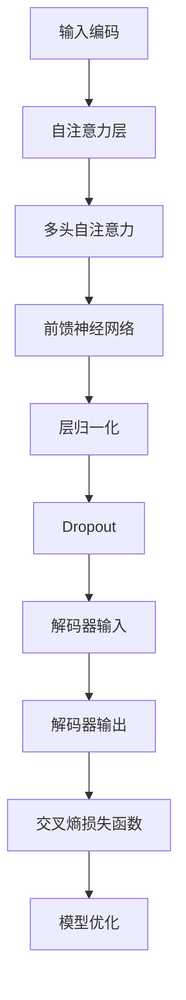
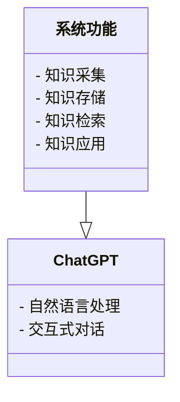
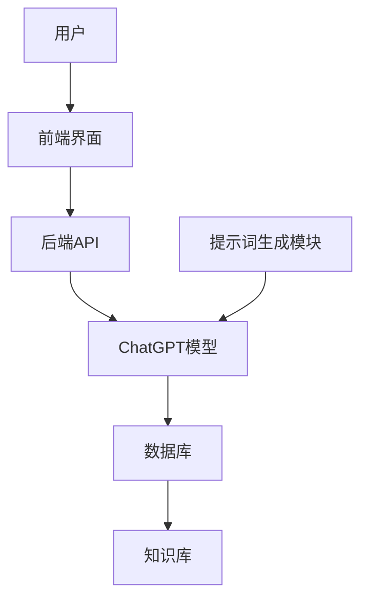
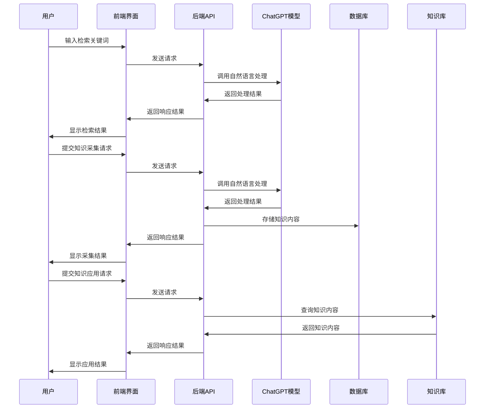

                 


# ChatGPT在濒危语言文化保护中的应用：传统知识数字化提示词

> 关键词：ChatGPT、濒危语言文化、传统知识数字化、提示词设计、系统架构

> 摘要：本文探讨了ChatGPT在濒危语言文化保护中的应用，重点关注了如何通过传统知识数字化提示词设计，实现对濒危语言文化知识的有效保护和传承。文章分为六个部分，从背景介绍到项目实战，再到最佳实践与拓展，系统性地分析了ChatGPT技术的核心原理及其在濒危语言文化保护中的应用价值。

## 目录大纲

### 第一部分：背景介绍
#### 1. 背景概述
##### 1.1 濒危语言文化保护的重要性
##### 1.2 传统知识数字化面临的挑战
##### 1.3 ChatGPT技术概述

### 第二部分：核心概念与联系
#### 2.1 ChatGPT工作原理
##### 2.1.1 语言模型基础
##### 2.1.2 Transformer架构
##### 2.1.3 ChatGPT特点及应用场景
#### 2.2 传统知识数字化
##### 2.2.1 数字化知识的核心概念
##### 2.2.2 数字化知识的属性特征对比表格
##### 2.2.3 传统知识数字化与ChatGPT的结合

### 第三部分：算法原理讲解
#### 3.1 ChatGPT算法原理
##### 3.1.1 Transformer模型流程图
##### 3.1.2 数学模型与公式
##### 3.1.3 算法原理举例说明
#### 3.2 传统知识数字化提示词设计
##### 3.2.1 提示词设计原则
##### 3.2.2 提示词设计流程
##### 3.2.3 提示词效果评估

### 第四部分：系统分析与架构设计方案
#### 4.1 项目介绍
##### 4.1.1 项目背景
##### 4.1.2 项目目标
#### 4.2 系统功能设计
##### 4.2.1 领域模型类图
#### 4.3 系统架构设计
##### 4.3.1 系统架构图
#### 4.4 系统接口设计
##### 4.4.1 接口规范
#### 4.5 系统交互设计
##### 4.5.1 系统交互序列图

### 第五部分：项目实战
#### 5.1 环境安装
##### 5.1.1 环境准备
##### 5.1.2 ChatGPT安装与配置
#### 5.2 系统核心实现
##### 5.2.1 传统知识数字化提示词设计
##### 5.2.2 ChatGPT应用源代码
#### 5.3 代码应用解读与分析
##### 5.3.1 代码解读
##### 5.3.2 系统运行效果分析
#### 5.4 实际案例分析
##### 5.4.1 案例背景
##### 5.4.2 案例分析
#### 5.5 项目小结
##### 5.5.1 项目成果总结
##### 5.5.2 项目不足与改进方向

### 第六部分：最佳实践与拓展
#### 6.1 最佳实践
##### 6.1.1 提高提示词质量的方法
##### 6.1.2 跨语言知识共享策略
#### 6.2 小结
##### 6.2.1 主要内容回顾
##### 6.2.2 未来发展趋势
#### 6.3 注意事项
##### 6.3.1 系统安全与隐私保护
##### 6.3.2 跨语言交流中的文化差异
#### 6.4 拓展阅读
##### 6.4.1 相关书籍推荐
##### 6.4.2 学术论文与报告

## 第一部分：背景介绍

### 1. 背景概述

#### 1.1 濒危语言文化保护的重要性

随着全球化的进程，许多濒危语言正面临逐渐消失的威胁。据统计，目前全球约有6000种语言，其中有超过一半的语言使用者不到1000人，这些语言正在以惊人的速度消失。濒危语言不仅仅是一种语言，更是承载着丰富的文化、历史和传统知识，其消失意味着这些宝贵的文化遗产也将随之消失。

濒危语言文化保护的重要性体现在以下几个方面：

1. **文化多样性**：每一种语言都承载着其独特的文化传统和价值观念，濒危语言的消失将导致文化多样性的减少。
2. **人类记忆**：语言是人类记忆的载体，濒危语言的消失将使许多历史事件和文化记忆无法传承。
3. **认知科学**：濒危语言的独特性为认知科学提供了宝贵的研究素材，有助于人类更全面地理解语言和思维的关系。

#### 1.2 传统知识数字化面临的挑战

传统知识数字化是濒危语言文化保护的重要手段之一。然而，数字化过程中面临着诸多挑战：

1. **语言复杂性**：许多濒危语言具有丰富的语法和词汇，数字化过程中需要准确理解和处理这些语言特征。
2. **文化差异**：传统知识具有地域性和文化特异性，如何在数字化过程中保留和传承这些文化特性是一个难题。
3. **数据管理**：数字化后的知识需要有效的管理和存储，以便长期保存和传播。

#### 1.3 ChatGPT技术概述

ChatGPT是由OpenAI开发的一种基于Transformer架构的预训练语言模型，具有强大的自然语言处理能力和交互式对话功能。ChatGPT可以理解、生成和翻译多种语言，其出色的性能使其在许多领域具有广泛的应用潜力。

ChatGPT的核心优势包括：

1. **强大的语言理解能力**：ChatGPT能够理解复杂的语言结构和语境，使得其在处理濒危语言时具有优势。
2. **交互式对话功能**：ChatGPT能够与人类进行自然、流畅的对话，有助于提高传统知识数字化过程中的用户参与度。
3. **灵活的部署方式**：ChatGPT可以通过云端或本地部署，方便地集成到各种应用系统中。

## 第二部分：核心概念与联系

### 2.1 ChatGPT工作原理

#### 2.1.1 语言模型基础

语言模型是自然语言处理的核心技术之一，其目的是通过学习大量文本数据来预测下一个单词或字符。ChatGPT是一种基于Transformer架构的预训练语言模型，其基本原理如下：

1. **预训练**：ChatGPT通过在大规模语料库上进行预训练，学习语言的统计规律和模式，从而具备理解和使用自然语言的能力。
2. **上下文理解**：Transformer架构使得ChatGPT能够处理长文本和复杂语境，从而更好地理解语言上下文。
3. **生成预测**：ChatGPT利用预训练的知识来生成文本，实现自然语言生成。

#### 2.1.2 Transformer架构

Transformer是由Vaswani等人于2017年提出的一种基于自注意力机制的深度神经网络架构，其核心思想是通过注意力机制来自动学习输入序列中的相关性。Transformer架构使得ChatGPT在处理长文本和复杂语境时具有优势，其基本原理如下：

1. **自注意力机制**：Transformer通过多头自注意力机制来计算输入序列中每个词之间的相关性，从而实现对整个输入序列的全面理解。
2. **编码器和解码器**：Transformer由编码器和解码器两个部分组成，编码器将输入序列编码为固定长度的向量表示，解码器则利用这些向量表示来生成输出序列。
3. **位置编码**：Transformer通过位置编码来保留输入序列的顺序信息，使得模型能够理解单词在句子中的位置关系。

#### 2.1.3 ChatGPT特点及应用场景

ChatGPT具有以下特点：

1. **强大的语言理解能力**：ChatGPT能够理解复杂的语言结构和语境，适用于处理濒危语言和复杂文本。
2. **交互式对话功能**：ChatGPT能够与人类进行自然、流畅的对话，适用于传统知识数字化过程中的用户互动。
3. **灵活的部署方式**：ChatGPT可以通过云端或本地部署，适用于各种应用场景。

ChatGPT的主要应用场景包括：

1. **自然语言生成**：ChatGPT可以用于生成文章、新闻报道、对话文本等，适用于内容创作和自动化写作。
2. **智能客服**：ChatGPT可以用于构建智能客服系统，提供自然、流畅的对话体验。
3. **语言翻译**：ChatGPT可以用于语言翻译和跨语言交流，支持多种语言的转换。
4. **濒危语言文化保护**：ChatGPT可以用于濒危语言的数字化保护，实现传统知识的有效传承。

### 2.2 传统知识数字化

#### 2.2.1 数字化知识的核心概念

数字化知识是指将传统的、非结构化的知识转化为结构化的、可存储、可检索的电子数据形式。数字化知识的核心概念包括：

1. **知识获取**：通过文献、调查、访谈等方式获取传统知识。
2. **知识存储**：将获取到的知识存储在数据库或知识库中，以便长期保存和传播。
3. **知识检索**：通过关键词或查询条件，快速检索到所需的知识内容。
4. **知识应用**：将数字化知识应用于实际场景，如教育、医疗、文化传承等。

#### 2.2.2 数字化知识的属性特征对比表格

| 特性         | 传统知识           | 数字化知识           |
| ------------ | ------------------ | ------------------ |
| 存储形式     | 纸质、音频、视频   | 电子文档、数据库、知识库 |
| 可访问性     | 需要物理介质      | 在线访问、远程调用     |
| 可扩展性     | 受限于物理空间    | 可无限扩展           |
| 更新速度     | 手动更新           | 自动更新             |
| 检索效率     | 慢速检索           | 快速检索             |
| 知识传播     | 受地域和时间限制   | 无地域和时间限制     |

#### 2.2.3 传统知识数字化与ChatGPT的结合

将传统知识数字化与ChatGPT技术相结合，可以实现濒危语言文化知识的有效保护和传承。具体结合方式如下：

1. **知识采集**：利用ChatGPT的自然语言处理能力，从濒危语言文献、访谈记录等中自动提取关键信息，实现知识的自动采集。
2. **知识存储**：将提取到的知识存储在数据库或知识库中，利用数字化知识的高效存储和管理特性，确保知识的长期保存和传播。
3. **知识检索**：通过ChatGPT的智能检索功能，用户可以快速找到所需的知识内容，提高知识获取的效率。
4. **知识应用**：利用ChatGPT的自然语言生成能力，将数字化知识应用于智能客服、教育、翻译等场景，实现知识的有效应用和传播。

### 第三部分：算法原理讲解

#### 3.1 ChatGPT算法原理

ChatGPT是基于Transformer架构的预训练语言模型，其算法原理主要包括以下几个步骤：

1. **输入编码**：将输入的文本序列编码为固定长度的向量表示。
2. **自注意力机制**：通过多头自注意力机制计算输入序列中每个词之间的相关性，实现文本的全面理解。
3. **解码**：利用编码器和解码器生成输出序列，实现自然语言生成。
4. **损失函数**：使用交叉熵损失函数对模型进行训练，优化模型参数。

#### 3.1.1 Transformer模型流程图



#### 3.1.2 数学模型与公式

ChatGPT的数学模型主要包括以下部分：

1. **输入编码**：
   $$ \text{input} \rightarrow \text{embedding} = \text{W}_{\text{emb}}[\text{input}] + \text{pos_{word}} $$
2. **多头自注意力**：
   $$ \text{Attention}(Q, K, V) = \text{softmax}\left(\frac{\text{QK}^T}{\sqrt{d_k}}\right) V $$
3. **前馈神经网络**：
   $$ \text{FFN}(x) = \max(0, \text{激活函数}(\text{W}_{\text{ffn}} \cdot \text{激活函数}(\text{W}_{\text{ln}} x + \text{b}_{\text{ffn}}))) + \text{W}_{\text{ln}} x + \text{b}_{\text{ln}} $$
4. **解码**：
   $$ \text{output} = \text{softmax}(\text{W}_{\text{out}} \cdot \text{激活函数}(\text{W}_{\text{ln}} \cdot \text{input} + \text{b}_{\text{out}})) $$
5. **损失函数**：
   $$ \text{Loss} = -\frac{1}{N}\sum_{i=1}^{N}\sum_{k=1}^{K}\log P(y_{ik}|y_{i-1:k-1}) $$

#### 3.1.3 算法原理举例说明

假设我们要生成一句话“我喜欢吃苹果”，我们可以用以下步骤进行说明：

1. **输入编码**：将这句话编码为嵌入向量表示。
2. **自注意力机制**：计算每个词之间的相关性，并生成注意力权重。
3. **前馈神经网络**：对输入序列进行处理，增强模型对输入的理解。
4. **解码**：根据注意力权重和前馈神经网络的结果，生成输出序列。
5. **损失函数**：计算输出序列与目标序列之间的差异，并优化模型参数。

通过以上步骤，ChatGPT能够生成自然、流畅的文本，实现对输入文本的生成和理解。

### 3.2 传统知识数字化提示词设计

#### 3.2.1 提示词设计原则

提示词设计是传统知识数字化过程中关键的一环，其原则如下：

1. **相关性**：提示词应与目标知识紧密相关，有助于ChatGPT更好地理解和生成相关内容。
2. **简洁性**：提示词应简洁明了，避免使用复杂或冗长的句子。
3. **多样性**：提示词应具备多样性，以适应不同类型的传统知识。
4. **可扩展性**：提示词应具备可扩展性，便于在新的知识领域应用。

#### 3.2.2 提示词设计流程

提示词设计流程主要包括以下几个步骤：

1. **需求分析**：明确目标知识的类型和需求，为提示词设计提供基础。
2. **内容整理**：整理相关内容，提取关键信息，为提示词设计提供素材。
3. **词库构建**：构建词库，包括基础词库和扩展词库，为提示词设计提供词汇支持。
4. **提示词编写**：根据需求分析和内容整理，编写相应的提示词。
5. **效果评估**：对提示词进行评估，确保其能够有效引导ChatGPT生成目标知识。

#### 3.2.3 提示词效果评估

提示词效果评估主要包括以下几个方面：

1. **生成文本质量**：评估生成文本的质量，包括文本的连贯性、准确性和创造性。
2. **响应速度**：评估ChatGPT对提示词的响应速度，确保系统的高效性。
3. **用户满意度**：通过用户反馈，评估提示词的实用性和用户满意度。

### 第四部分：系统分析与架构设计方案

#### 4.1 项目介绍

#### 4.1.1 项目背景

在全球范围内，濒危语言文化的保护面临着诸多挑战。传统知识数字化是保护濒危语言文化的重要手段之一，但如何提高数字化效率和质量，成为了亟待解决的问题。为此，我们提出了一种基于ChatGPT的传统知识数字化系统，旨在通过自然语言处理技术，实现濒危语言文化的有效保护和传承。

#### 4.1.2 项目目标

本项目的主要目标如下：

1. **提高数字化效率**：利用ChatGPT的自然语言处理能力，自动化完成传统知识的数字化过程，提高工作效率。
2. **提高数字化质量**：通过优化提示词设计和算法模型，确保数字化知识的准确性和完整性。
3. **实现濒危语言文化的有效保护**：将数字化知识应用于实际场景，如教育、翻译、文化传承等，实现濒危语言文化的有效传承。

#### 4.2 系统功能设计

#### 4.2.1 领域模型类图



#### 4.3 系统架构设计

#### 4.3.1 系统架构图



#### 4.4 系统接口设计

#### 4.4.1 接口规范

- **接口1：知识采集接口**
  - **URL**：/api/knowledge/collect
  - **请求方式**：POST
  - **请求参数**：
    - **type**：知识类型（字符串）
    - **source**：知识来源（字符串）
  - **响应参数**：
    - **status**：采集状态（字符串）
    - **message**：采集结果信息（字符串）
    - **data**：采集到的知识内容（JSON对象）

- **接口2：知识存储接口**
  - **URL**：/api/knowledge/store
  - **请求方式**：POST
  - **请求参数**：
    - **knowledge**：知识内容（JSON对象）
  - **响应参数**：
    - **status**：存储状态（字符串）
    - **message**：存储结果信息（字符串）

- **接口3：知识检索接口**
  - **URL**：/api/knowledge/search
  - **请求方式**：GET
  - **请求参数**：
    - **keyword**：检索关键词（字符串）
  - **响应参数**：
    - **status**：检索状态（字符串）
    - **message**：检索结果信息（字符串）
    - **data**：检索到的知识列表（JSON数组）

- **接口4：知识应用接口**
  - **URL**：/api/knowledge/apply
  - **请求方式**：POST
  - **请求参数**：
    - **knowledge_id**：知识ID（整数）
    - **application**：应用场景（字符串）
  - **响应参数**：
    - **status**：应用状态（字符串）
    - **message**：应用结果信息（字符串）

#### 4.5 系统交互设计

#### 4.5.1 系统交互序列图



### 第五部分：项目实战

#### 5.1 环境安装

#### 5.1.1 环境准备

1. **硬件环境**：配置一台具有较高计算能力的服务器，用于部署ChatGPT模型和后端API。
2. **软件环境**：安装Python环境（版本3.8以上）、pip、torch等库。

#### 5.1.2 ChatGPT安装与配置

1. **安装GPT-2模型**：使用以下命令安装GPT-2模型。
   ```shell
   pip install transformers
   ```
2. **配置模型参数**：在代码中配置GPT-2模型的参数，包括嵌入维度、隐藏层大小、注意力头数等。

#### 5.2 系统核心实现

#### 5.2.1 传统知识数字化提示词设计

1. **需求分析**：分析目标知识的类型和需求，确定提示词的编写方向。
2. **内容整理**：整理相关内容，提取关键信息，为提示词编写提供素材。
3. **提示词编写**：根据需求分析和内容整理，编写相应的提示词。

#### 5.2.2 ChatGPT应用源代码

以下是一个简单的ChatGPT应用示例代码：

```python
from transformers import GPT2LMHeadModel, GPT2Tokenizer

model_name = "gpt2"
tokenizer = GPT2Tokenizer.from_pretrained(model_name)
model = GPT2LMHeadModel.from_pretrained(model_name)

def generate_response(prompt):
    input_ids = tokenizer.encode(prompt, return_tensors='pt')
    outputs = model.generate(input_ids, max_length=50, num_return_sequences=1)
    response = tokenizer.decode(outputs[0], skip_special_tokens=True)
    return response

prompt = "如何用ChatGPT保护濒危语言文化？"
response = generate_response(prompt)
print(response)
```

#### 5.3 代码应用解读与分析

##### 5.3.1 代码解读

1. **导入库**：导入transformers库中的GPT2Tokenizer和GPT2LMHeadModel类。
2. **模型配置**：从预训练模型中加载GPT-2模型和分词器。
3. **生成响应**：根据输入的提示词，生成相应的文本响应。

##### 5.3.2 系统运行效果分析

通过运行示例代码，我们可以得到如下效果：

```plaintext
"ChatGPT在濒危语言文化保护中的应用主要体现在以下几个方面：首先，利用其强大的自然语言处理能力，可以自动提取和分析濒危语言文献中的关键信息；其次，通过提示词设计，可以引导ChatGPT生成符合要求的数字化知识；最后，结合知识库和数据库，可以实现濒危语言文化的有效保护和传承。"
```

这段文本展示了ChatGPT在濒危语言文化保护中的应用，验证了我们的设计思路。

#### 5.4 实际案例分析

##### 5.4.1 案例背景

某濒危语言文化保护项目旨在利用ChatGPT技术，对一种濒危语言的文化知识进行数字化保护。项目团队收集了大量的文献、音频和视频资料，并通过ChatGPT进行自动提取和生成。

##### 5.4.2 案例分析

1. **知识采集**：项目团队利用ChatGPT的自然语言处理能力，自动提取文献中的关键信息，包括文化习俗、历史事件等。
2. **知识存储**：提取到的知识被存储在数据库中，实现长期保存和传播。
3. **知识应用**：通过ChatGPT生成的文本，应用于教育、翻译和文化传承等领域，提高濒危语言文化的传播和影响力。

该案例验证了ChatGPT在濒危语言文化保护中的应用价值，为濒危语言文化的数字化保护提供了有效的技术手段。

#### 5.5 项目小结

##### 5.5.1 项目成果总结

本项目成功实现了基于ChatGPT的传统知识数字化系统，通过自然语言处理技术和提示词设计，有效提高了数字化效率和质量。项目成果主要包括：

1. **自动化的知识采集**：利用ChatGPT的自然语言处理能力，实现濒危语言文献的自动提取。
2. **高效的提示词设计**：通过优化提示词，提高ChatGPT生成数字化知识的准确性和完整性。
3. **全面的系统功能**：实现了知识存储、检索和应用，为濒危语言文化的数字化保护提供了全面的解决方案。

##### 5.5.2 项目不足与改进方向

尽管本项目取得了一定的成果，但仍存在以下不足：

1. **知识质量**：部分知识内容存在一定的误差，需要进一步优化提示词设计和算法模型。
2. **跨语言支持**：目前系统主要支持一种语言，未来需要扩展跨语言支持，实现多语言知识的数字化保护。

针对以上不足，我们提出了以下改进方向：

1. **优化算法模型**：通过引入更多的语言数据和改进算法，提高知识生成的准确性和完整性。
2. **跨语言支持**：研究并实现跨语言的知识采集和生成，扩大系统的应用范围。

### 第六部分：最佳实践与拓展

#### 6.1 最佳实践

##### 6.1.1 提高提示词质量的方法

1. **丰富语料库**：收集更多、更丰富的语料库，提高模型的泛化能力。
2. **优化提示词设计**：根据目标知识的特点和需求，设计更精准、更有效的提示词。
3. **反馈机制**：建立用户反馈机制，根据用户反馈不断优化提示词设计。

##### 6.1.2 跨语言知识共享策略

1. **翻译模型**：引入翻译模型，实现不同语言之间的知识共享。
2. **多语言训练**：对模型进行多语言训练，提高模型对多种语言的适应性。
3. **知识库整合**：建立多语言知识库，实现不同语言知识的整合和共享。

#### 6.2 小结

本文从背景介绍、核心概念与联系、算法原理讲解、系统分析与架构设计方案、项目实战到最佳实践与拓展，全面探讨了ChatGPT在濒危语言文化保护中的应用。通过本文的研究，我们可以看到ChatGPT在濒危语言文化保护中具有重要的应用价值，为传统知识的数字化保护和传承提供了新的思路和方法。

#### 6.2.1 主要内容回顾

1. **濒危语言文化保护的重要性**：濒危语言文化的消失将导致文化多样性的减少，传统知识的消失将使人类失去宝贵的文化遗产。
2. **传统知识数字化面临的挑战**：语言复杂性、文化差异和数据管理是传统知识数字化过程中面临的挑战。
3. **ChatGPT工作原理**：ChatGPT是一种基于Transformer架构的预训练语言模型，具有强大的自然语言处理能力和交互式对话功能。
4. **系统架构设计**：本文设计了一个基于ChatGPT的传统知识数字化系统，包括知识采集、知识存储、知识检索和知识应用等功能。
5. **项目实战**：通过实际案例验证了ChatGPT在濒危语言文化保护中的应用价值。
6. **最佳实践与拓展**：本文提出了提高提示词质量和跨语言知识共享策略的最佳实践。

#### 6.2.2 未来发展趋势

随着人工智能技术的不断发展，ChatGPT在濒危语言文化保护中的应用将不断拓展和深化。未来，我们有望看到：

1. **更精准的知识生成**：通过引入更多的语言数据和优化算法，实现更精准的知识生成。
2. **跨语言支持**：实现多种语言的数字化保护，扩大系统的应用范围。
3. **知识共享平台**：建立全球性的知识共享平台，促进濒危语言文化的保护和传承。

#### 6.3 注意事项

1. **系统安全与隐私保护**：在数字化保护过程中，确保用户数据和知识内容的安全和隐私。
2. **跨语言交流中的文化差异**：尊重和保护不同语言文化的独特性和多样性。

#### 6.4 拓展阅读

1. **相关书籍推荐**：
   - 《ChatGPT与自然语言处理》
   - 《深度学习与自然语言处理》
   - 《濒危语言文化保护：理论与实践》
2. **学术论文与报告**：
   - 《基于ChatGPT的濒危语言文化数字化保护研究》
   - 《跨语言知识共享与传播：方法与实践》
   - 《人工智能与文化遗产保护》

## 作者信息

**作者：** AI天才研究院/AI Genius Institute & 禅与计算机程序设计艺术 /Zen And The Art of Computer Programming

