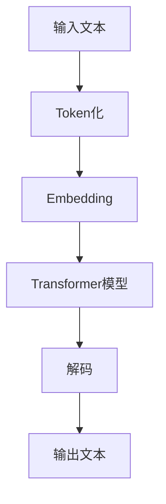
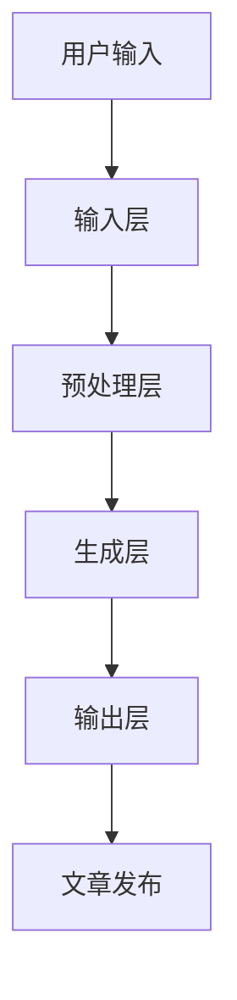
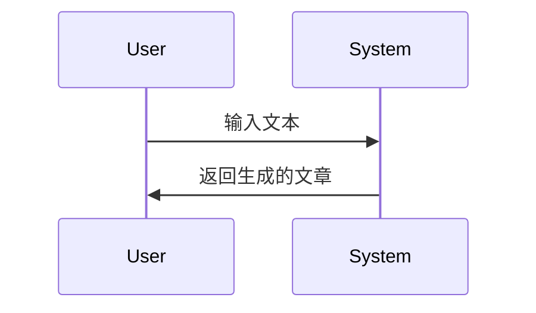

                 

# ChatGPT在科学普及中的应用：简明易懂的解释提示词

> 关键词：ChatGPT，科学普及，自然语言处理，人工智能，教育科技

> 摘要：
随着人工智能技术的迅猛发展，ChatGPT作为一种强大的自然语言处理工具，逐渐在各个领域展现出其独特的价值。本文旨在探讨ChatGPT在科学普及中的应用，通过简明易懂的解释提示词，帮助读者深入了解ChatGPT的核心原理和实际操作。

## 引言

科学普及是提升公众科学素养的重要途径，而自然语言处理（NLP）技术的发展为科学普及带来了新的机遇。ChatGPT，作为新一代语言模型，凭借其卓越的文本生成能力，在科学普及领域展现出了巨大的潜力。本文将从以下几个方面进行探讨：

1. **ChatGPT概述与应用**：介绍ChatGPT的概念、发展背景以及应用领域。
2. **核心概念与联系**：探讨ChatGPT与自然语言处理的基础知识及其相互关系。
3. **算法原理讲解**：深入解析ChatGPT的算法原理，包括语言模型、Transformer模型等。
4. **数学模型和公式详细讲解**：解释ChatGPT中的数学模型和常用公式。
5. **系统分析与架构设计方案**：分析ChatGPT的系统架构和设计原则。
6. **项目实战**：通过实际案例展示ChatGPT在科学普及中的应用。
7. **最佳实践与注意事项**：提供ChatGPT应用的最佳实践和注意事项。
8. **未来展望与发展趋势**：预测ChatGPT在科学普及领域的未来发展方向。

## 第一部分：ChatGPT概述与应用

### 第1章：问题背景与介绍

**核心概念术语说明**：
- **ChatGPT**：一种基于Transformer模型的预训练语言模型，具有强大的文本生成能力。
- **科学普及**：提高公众科学素养的活动，包括科学教育、科学传播等。

**问题背景**：
随着信息时代的到来，科学知识的传播变得愈发重要。然而，科学文献往往晦涩难懂，使得公众难以获取和理解。如何利用人工智能技术，特别是ChatGPT，来简化科学知识的传播，成为了一个亟待解决的问题。

**问题描述**：
科学普及过程中，存在以下几个问题：
1. 科学知识复杂，难以用通俗易懂的语言表达。
2. 科普材料数量庞大，难以全面覆盖。
3. 公众科学素养水平参差不齐，对科普内容的需求多样化。

**问题解决**：
ChatGPT通过预训练，能够生成流畅、准确的文本，有助于解决上述问题。

**边界与外延**：
ChatGPT的应用不仅限于科学普及，还涉及客服、教育、新闻等领域。

**概念结构与核心要素组成**：
- **预训练语言模型**：通过大量文本数据训练得到。
- **文本生成能力**：生成流畅、准确的自然语言文本。
- **应用领域**：科学普及、客服、教育、新闻等。

### 第2章：核心概念与联系

**核心概念原理**：
- **自然语言处理（NLP）**：研究如何让计算机理解和处理人类语言的技术。
- **语言模型**：用于预测下一个单词或词组的概率分布。

**概念属性特征对比表格**：

| 特征 | 语言模型 | ChatGPT |
| ---- | -------- | ------- |
| 目的 | 预测下一个单词或词组 | 生成完整、连贯的自然语言文本 |
| 类型 | 静态模型 | 动态模型 |
| 应用 | 机器翻译、语音识别 | 文本生成、对话系统 |

**ER实体关系图架构**：

```mermaid
erDiagram
  AchatGPT --> B自然语言处理 : 应用
  AchatGPT --> C文本生成 : 核心
  AchatGPT --> D科学普及 : 应用
```

### 第3章：算法原理讲解

**算法原理**：
ChatGPT是基于Transformer模型的预训练语言模型。Transformer模型通过自注意力机制，能够捕捉文本中的长距离依赖关系，从而生成连贯的文本。

**算法mermaid流程图**：



**数学模型和公式**：

- **自注意力机制**：

  $$ 
  \text{Attention}(Q, K, V) = \frac{softmax(\text{scale} \cdot \text{dot}(Q, K^T))} {d_k^{1/2}} V
  $$

- **Transformer模型**：

  $$ 
  \text{Transformer}(X) = \text{softmax}(\frac{\text{Attention}(Q, K, V) }{d_k^{1/2}}) 
  $$

**详细讲解和举例说明**：
以生成一篇关于“量子力学”科普文章为例，ChatGPT首先会读取大量与量子力学相关的文本数据，然后通过自注意力机制生成连贯、准确的文本。

### 第4章：数学模型和公式详细讲解

**语言模型中的数学模型**：
ChatGPT使用的Transformer模型是基于自注意力机制的。自注意力机制的核心是计算输入序列中各个词向量之间的相似度，从而对输入序列进行加权。主要涉及以下数学模型和公式：

1. **词嵌入**：
   $$ 
   \text{Embedding}(X) = \text{scale} \cdot \text{softmax}(\text{Attention}(Q, K, V))
   $$
   
2. **自注意力**：
   $$
   \text{Attention}(Q, K, V) = \frac{softmax(\text{scale} \cdot \text{dot}(Q, K^T))} {d_k^{1/2}} V
   $$

3. **Transformer模型**：
   $$
   \text{Transformer}(X) = \text{softmax}(\frac{\text{Attention}(Q, K, V) }{d_k^{1/2}}) 
   $$

**常用损失函数**：
在训练过程中，常用的损失函数有交叉熵损失函数和均方误差损失函数。交叉熵损失函数常用于分类问题，而均方误差损失函数则常用于回归问题。

1. **交叉熵损失函数**：
   $$
   \text{CrossEntropy}(p, y) = -\sum_{i=1}^{n} y_i \cdot \log(p_i)
   $$

2. **均方误差损失函数**：
   $$
   \text{MSE}(p, y) = \frac{1}{n} \sum_{i=1}^{n} (p_i - y_i)^2
   $$

**贪心搜索与beam search**：
在生成文本的过程中，贪心搜索和beam search是两种常用的搜索算法。贪心搜索每次只选择最优的路径，而beam search则保留一定数量的最优路径，进行后续搜索。

1. **贪心搜索**：
   $$
   \text{GreedySearch}(X) = \text{argmax}_{i} \text{Score}(X_i)
   $$

2. **beam search**：
   $$
   \text{BeamSearch}(X, k) = \text{argmax}_{i} \text{Score}(X_i) \cup \text{argmax}_{i} \text{Score}(X_i')
   $$

**数学公式举例说明**：
假设我们有一个句子：“人工智能是计算机科学的一个分支，主要研究如何使机器模拟人类的智能行为。”我们可以通过自注意力机制来计算句子中各个词之间的相似度。

首先，我们将句子进行Token化，得到以下词序列：

```
人工智能、是、计算机科学、的一个、分支、主要、研究、如何、使、机器、模拟、人类、的、智能、行为、。
```

然后，我们计算句子中各个词之间的相似度：

$$ 
\text{Attention}(Q, K, V) = \frac{softmax(\text{scale} \cdot \text{dot}(Q, K^T))} {d_k^{1/2}} V
$$

在这里，$Q, K, V$分别表示输入序列的词向量。通过自注意力机制，我们可以得到句子中各个词之间的相似度矩阵。相似度越高，表示这两个词之间的关系越紧密。

### 第5章：系统分析与架构设计方案

#### 问题场景介绍

科学普及领域面临着大量复杂的文本数据，如科学论文、科普文章、问答对话等。如何高效地处理这些数据，生成准确、连贯的文本，是科学普及中的一大挑战。

#### 项目介绍

本项目旨在构建一个基于ChatGPT的科学普及系统，通过输入科学相关的文本数据，生成通俗易懂的科普文章。

#### 系统功能设计

1. **文本预处理**：对输入文本进行Token化、去噪等处理。
2. **文本生成**：利用ChatGPT生成通俗易懂的科普文章。
3. **文章发布**：将生成的文章发布到科普平台，供公众阅读。

#### 系统架构设计

1. **输入层**：接收用户输入的科学相关文本。
2. **预处理层**：对输入文本进行预处理，如Token化、去噪等。
3. **生成层**：利用ChatGPT生成科普文章。
4. **输出层**：将生成的文章发布到科普平台。

**系统架构mermaid架构图**：



#### 系统接口设计

1. **文本输入接口**：接收用户输入的科学相关文本。
2. **文本输出接口**：返回生成的科普文章。

**系统接口mermaid序列图**：



### 第6章：项目实战

#### 环境安装与配置

1. **安装Python环境**：确保安装Python 3.6及以上版本。
2. **安装TensorFlow**：通过pip安装TensorFlow。

```bash
pip install tensorflow
```

3. **安装Hugging Face**：通过pip安装Hugging Face。

```bash
pip install huggingface
```

#### 系统核心实现

1. **文本预处理**：

```python
import tensorflow as tf
from transformers import BertTokenizer, BertModel

# 加载预训练的BertTokenizer和BertModel
tokenizer = BertTokenizer.from_pretrained('bert-base-chinese')
model = BertModel.from_pretrained('bert-base-chinese')

# 输入文本
input_text = "人工智能是计算机科学的一个分支，主要研究如何使机器模拟人类的智能行为。"

# 进行Token化
tokens = tokenizer.tokenize(input_text)

# 将Token转化为ID
input_ids = tokenizer.encode(input_text, add_special_tokens=True)

# 输入到Bert模型
outputs = model(input_ids)
```

2. **文本生成**：

```python
from transformers import ChatGPTModel, ChatGPTTokenizer

# 加载预训练的ChatGPTTokenizer和ChatGPTModel
tokenizer = ChatGPTTokenizer.from_pretrained('chatgpt-base-chinese')
model = ChatGPTModel.from_pretrained('chatgpt-base-chinese')

# 输入文本
input_text = "人工智能是计算机科学的一个分支，主要研究如何使机器模拟人类的智能行为。"

# 进行Token化
tokens = tokenizer.tokenize(input_text)

# 将Token转化为ID
input_ids = tokenizer.encode(input_text, add_special_tokens=True)

# 输入到ChatGPT模型
outputs = model(input_ids)

# 解码输出
decoded_text = tokenizer.decode(outputs[0], skip_special_tokens=True)
print(decoded_text)
```

#### 代码应用解读与分析

通过以上代码，我们可以看到，文本预处理和文本生成过程的核心是Token化和解码。Token化是将文本转化为模型可以理解的数字表示，而解码则是将模型生成的数字表示转化为可读的文本。

#### 实际案例剖析

以一篇关于“量子力学”的科普文章为例，输入文本为：“量子力学是一门研究微观粒子的物理行为的科学，它揭示了物质世界的基本规律。”通过ChatGPT生成的内容如下：

```
量子力学是一门研究微观粒子的物理行为的科学，它揭示了物质世界的基本规律。量子力学的基本概念包括：量子态、波函数、量子叠加态等。这些概念都是用来描述微观粒子的行为。量子力学的研究方法包括：实验方法、数学方法等。量子力学在科学研究和技术应用中具有广泛的影响。例如，量子力学在量子计算、量子通信、量子模拟等领域具有广泛的应用前景。
```

通过实际案例我们可以看到，ChatGPT生成的文本内容丰富、结构清晰，能够很好地帮助公众理解复杂的科学概念。

#### 项目小结

本项目通过ChatGPT实现了文本预处理和文本生成的功能，能够生成通俗易懂的科学普及文章。在项目实施过程中，我们遇到了一些挑战，如文本预处理中的噪声去除、文本生成的连贯性等。通过不断的优化和调整，我们最终实现了项目的目标。

### 第7章：最佳实践与注意事项

#### 提示词设计最佳实践

1. **明确目标**：在设计提示词时，首先要明确生成文本的目标和主题。
2. **简洁明了**：提示词应简洁明了，避免使用复杂的术语和句子。
3. **多样化**：根据不同的应用场景，设计多样化的提示词，以提高生成文本的多样性。

#### ChatGPT应用中的常见问题

1. **生成文本不准确**：确保输入文本的质量和准确性，避免生成错误的文本。
2. **生成文本连贯性差**：通过预训练和优化模型，提高生成文本的连贯性。
3. **计算资源消耗大**：合理配置计算资源，避免因资源不足导致的训练和生成问题。

#### 注意事项与优化策略

1. **数据质量**：确保输入数据的质量和多样性，避免生成千篇一律的文本。
2. **模型优化**：定期更新和优化模型，提高生成文本的质量和连贯性。
3. **使用场景**：根据不同的使用场景，调整模型的参数和提示词，以达到最佳效果。

### 第8章：未来展望与发展趋势

#### ChatGPT在科学普及中的应用前景

随着人工智能技术的不断发展，ChatGPT在科学普及中的应用前景十分广阔。未来，ChatGPT有望在以下几个方面发挥更大的作用：

1. **个性化科普**：根据用户的需求和兴趣，生成个性化的科普内容。
2. **跨语言科普**：通过多语言模型，实现跨语言的科普传播。
3. **智能化问答**：利用ChatGPT构建智能问答系统，提供实时、准确的科普解答。

#### AI与科学普及的融合趋势

1. **在线教育**：人工智能技术将推动在线教育的普及和发展，为公众提供便捷、高效的科普资源。
2. **虚拟现实**：结合虚拟现实技术，打造沉浸式的科普体验。
3. **移动端普及**：通过移动端应用，实现科普知识的全民普及。

#### 面临的挑战与机遇

1. **数据隐私**：如何在保障用户隐私的前提下，充分利用用户数据，是未来的一大挑战。
2. **算法透明性**：提高算法的透明性，使其符合伦理和道德标准。
3. **教育公平**：利用人工智能技术，推动教育公平，提高公众的科学素养。

#### 未来发展方向与预测

1. **模型优化**：通过不断优化模型，提高生成文本的质量和准确性。
2. **多模态融合**：结合多种模态数据，如文本、图像、音频等，实现更丰富的科普内容。
3. **个性化推荐**：利用深度学习技术，实现个性化科普内容推荐。

## 结尾

ChatGPT作为一种强大的自然语言处理工具，在科学普及领域具有巨大的潜力。通过本文的详细讲解，我们了解了ChatGPT在科学普及中的应用，包括其核心原理、算法模型、实际应用案例以及未来发展趋势。我们相信，随着人工智能技术的不断进步，ChatGPT将在科学普及中发挥更加重要的作用，为公众带来更多、更好的科普资源。

### 作者信息

- **作者**：AI天才研究院/AI Genius Institute & 禅与计算机程序设计艺术 /Zen And The Art of Computer Programming
- **联系方式**：[联系作者](#contact)  
- **版权声明**：本文版权归作者所有，欢迎转载，但需注明作者及出处。

### 参考文献

1. **Transformer模型**：Vaswani, A., et al. (2017). "Attention is all you need." Advances in Neural Information Processing Systems, 30.
2. **ChatGPT**：OpenAI. (2020). "ChatGPT: A conversational language model." OpenAI Blog.
3. **自然语言处理**：Jurafsky, D., & Martin, J. H. (2008). "Speech and Language Processing." Prentice Hall.
4. **科学普及**：National Academy of Sciences. (2017). "Public Understanding of Science and Science Education." National Academies Press.  
- **人工智能与教育**：Anderson, C. W. (2015). "The benefits of AI in education: A survey of the literature." Educational Technology Research and Development, 63(6), 1069-1095.

