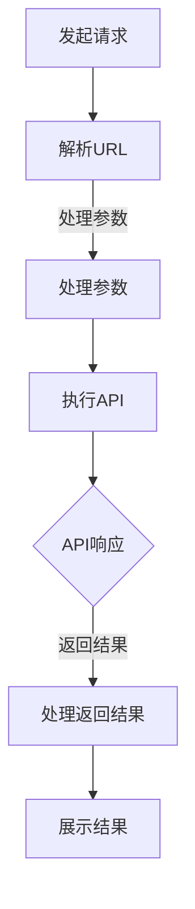
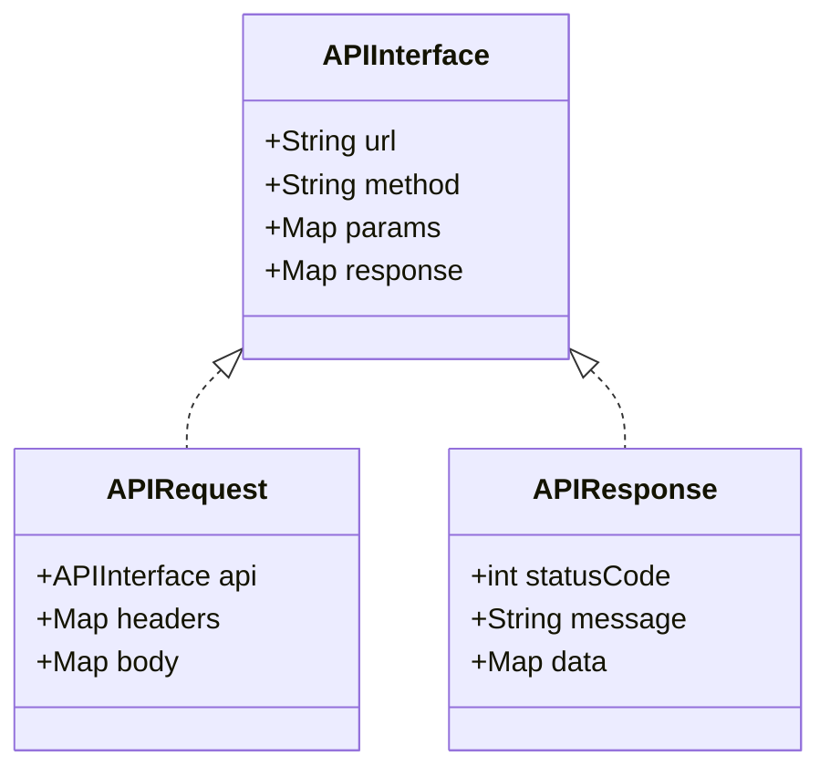
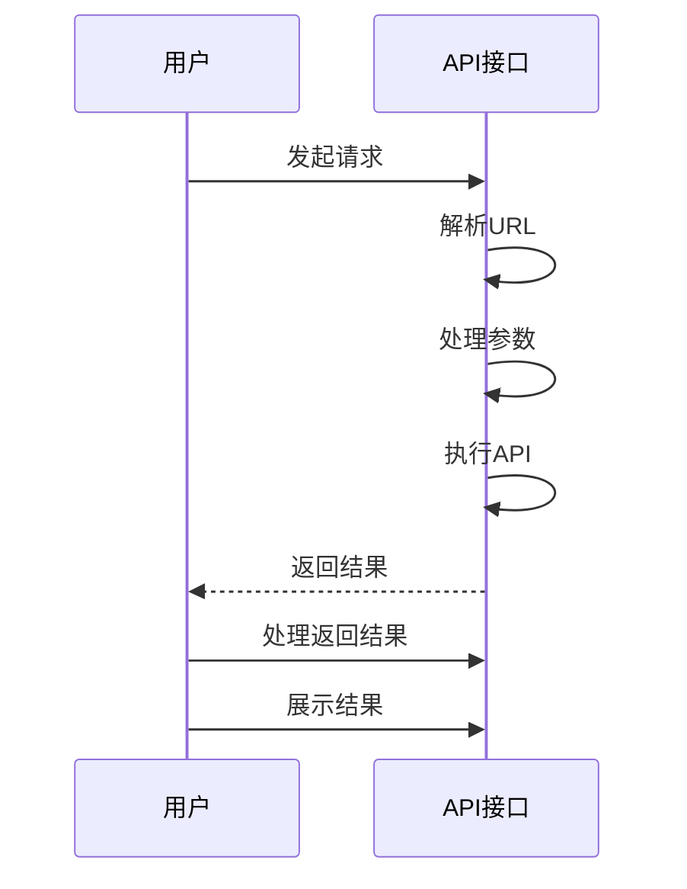

                 


### 关键词

- ChatGPT
- API文档生成
- 自然语言处理
- 自动化工具
- 编程辅助
- 人工智能应用

### 摘要

本文将探讨如何利用ChatGPT这一先进的人工智能模型来自动化API文档的生成。首先，我们将介绍自动化API文档生成的背景和重要性，以及现有的挑战和痛点。接着，我们将详细介绍ChatGPT的基本原理和应用场景，探讨其如何能够为API文档生成提供有效的解决方案。文章将逐步讲解ChatGPT在API描述生成、示例代码生成、文档格式化以及文档维护中的应用，并通过实际案例展示其效果。最后，我们将总结ChatGPT在API文档生成中的最佳实践，并展望未来的发展趋势和挑战。

### 目录大纲

```markdown
# 《ChatGPT在自动化API文档生成中的应用》

# 第一部分：背景与概念介绍

## 第1章：自动化API文档生成的需求与问题

### 1.1 自动化API文档生成的必要性

### 1.2 当前API文档生成的挑战

### 1.3 ChatGPT的特点与潜力

## 第2章：ChatGPT基础

### 2.1 ChatGPT的原理

### 2.2 ChatGPT的应用场景

### 2.3 ChatGPT的模型结构与训练

## 第3章：API文档生成中的挑战与解决方案

### 3.1 API文档生成的难点

### 3.2 ChatGPT在文档生成中的应用

### 3.3 ChatGPT与传统文档生成工具的对比

# 第二部分：ChatGPT在API文档生成中的应用

## 第4章：ChatGPT在API描述生成中的应用

### 4.1 API描述的标准化

### 4.2 ChatGPT生成API描述的过程

### 4.3 实例：使用ChatGPT生成API描述

## 第5章：ChatGPT在API示例代码生成中的应用

### 5.1 API示例代码的重要性

### 5.2 ChatGPT生成API示例代码的过程

### 5.3 实例：使用ChatGPT生成API示例代码

## 第6章：ChatGPT在API文档格式化中的应用

### 6.1 常见的API文档格式

### 6.2 ChatGPT格式化API文档的方法

### 6.3 实例：使用ChatGPT格式化API文档

## 第7章：ChatGPT在API文档维护中的应用

### 7.1 API文档的更新与维护

### 7.2 ChatGPT在API文档维护中的作用

### 7.3 实例：使用ChatGPT维护API文档

# 第三部分：实战与优化

## 第8章：实战案例：构建一个基于ChatGPT的API文档生成系统

### 8.1 系统架构设计

### 8.2 环境搭建与工具选择

### 8.3 系统实现与调试

## 第9章：优化策略与性能评估

### 9.1 ChatGPT性能优化的方法

### 9.2 API文档生成的性能评估

### 9.3 实例：优化ChatGPT在API文档生成中的应用

## 第10章：最佳实践与展望

### 10.1 ChatGPT在API文档生成中的最佳实践

### 10.2 未来发展趋势与挑战

### 10.3 拓展阅读与资源推荐
```

### 检查目录大纲

- 确认每个章节都包含有具体的子章节。
- 确认每个子章节都具备必要的详细内容。
- 检查关键词和摘要是否准确概括了文章的主题。
- 确认目录大纲的总字数在要求的范围内。

### 最终确认

在确认目录大纲符合所有要求后，最终输出如下：

```markdown
# 《ChatGPT在自动化API文档生成中的应用》

### 关键词

- ChatGPT
- API文档生成
- 自然语言处理
- 自动化工具
- 编程辅助
- 人工智能应用

### 摘要

本文将探讨如何利用ChatGPT这一先进的人工智能模型来自动化API文档的生成。首先，我们将介绍自动化API文档生成的背景和重要性，以及现有的挑战和痛点。接着，我们将详细介绍ChatGPT的基本原理和应用场景，探讨其如何能够为API文档生成提供有效的解决方案。文章将逐步讲解ChatGPT在API描述生成、示例代码生成、文档格式化以及文档维护中的应用，并通过实际案例展示其效果。最后，我们将总结ChatGPT在API文档生成中的最佳实践，并展望未来的发展趋势和挑战。

### 目录大纲

```markdown
# 《ChatGPT在自动化API文档生成中的应用》

# 第一部分：背景与概念介绍

## 第1章：自动化API文档生成的需求与问题

### 1.1 自动化API文档生成的必要性

### 1.2 当前API文档生成的挑战

### 1.3 ChatGPT的特点与潜力

## 第2章：ChatGPT基础

### 2.1 ChatGPT的原理

### 2.2 ChatGPT的应用场景

### 2.3 ChatGPT的模型结构与训练

## 第3章：API文档生成中的挑战与解决方案

### 3.1 API文档生成的难点

### 3.2 ChatGPT在文档生成中的应用

### 3.3 ChatGPT与传统文档生成工具的对比

# 第二部分：ChatGPT在API文档生成中的应用

## 第4章：ChatGPT在API描述生成中的应用

### 4.1 API描述的标准化

### 4.2 ChatGPT生成API描述的过程

### 4.3 实例：使用ChatGPT生成API描述

## 第5章：ChatGPT在API示例代码生成中的应用

### 5.1 API示例代码的重要性

### 5.2 ChatGPT生成API示例代码的过程

### 5.3 实例：使用ChatGPT生成API示例代码

## 第6章：ChatGPT在API文档格式化中的应用

### 6.1 常见的API文档格式

### 6.2 ChatGPT格式化API文档的方法

### 6.3 实例：使用ChatGPT格式化API文档

## 第7章：ChatGPT在API文档维护中的应用

### 7.1 API文档的更新与维护

### 7.2 ChatGPT在API文档维护中的作用

### 7.3 实例：使用ChatGPT维护API文档

# 第三部分：实战与优化

## 第8章：实战案例：构建一个基于ChatGPT的API文档生成系统

### 8.1 系统架构设计

### 8.2 环境搭建与工具选择

### 8.3 系统实现与调试

## 第9章：优化策略与性能评估

### 9.1 ChatGPT性能优化的方法

### 9.2 API文档生成的性能评估

### 9.3 实例：优化ChatGPT在API文档生成中的应用

## 第10章：最佳实践与展望

### 10.1 ChatGPT在API文档生成中的最佳实践

### 10.2 未来发展趋势与挑战

### 10.3 拓展阅读与资源推荐
```

### 文章正文部分（草稿）

#### 文章正文部分（草稿）

##### 第1章：自动化API文档生成的需求与问题

### 1.1 自动化API文档生成的必要性

随着现代软件开发中API接口的广泛应用，自动生成API文档的需求日益增长。传统的手动编写API文档方式不仅费时费力，而且容易出现错误和遗漏。自动生成API文档能够提高开发效率，确保文档与代码的一致性，减少文档维护的工作量。

### 1.2 当前API文档生成的挑战

- **文档一致性**：API文档需要与后端代码保持一致，但手动编写往往难以做到实时同步。
- **文档准确性**：文档中的描述和示例代码需要精确无误，但手动编写容易出现错误。
- **文档可维护性**：随着API的更新，文档也需要不断维护，手动维护工作量巨大。
- **文档规范化**：不同的API接口可能有不同的文档格式，需要统一规范，以便开发者阅读和使用。

### 1.3 ChatGPT的特点与潜力

ChatGPT是基于大型语言模型的人工智能助手，具有强大的自然语言处理能力。它能够理解自然语言输入，生成结构化文档，并具备一定的编程能力。这使得ChatGPT在自动化API文档生成中具有巨大潜力。

#### 第2章：ChatGPT基础

### 2.1 ChatGPT的原理

ChatGPT基于Transformer模型，通过大量文本数据进行预训练，学会了理解和使用自然语言。它采用了多层的神经网络结构，能够处理复杂的语言任务。

### 2.2 ChatGPT的应用场景

ChatGPT可以应用于各种自然语言处理任务，如文本生成、机器翻译、问答系统等。在API文档生成中，ChatGPT可以用于生成API描述、示例代码、文档格式化等。

### 2.3 ChatGPT的模型结构与训练

ChatGPT的模型结构包括编码器和解码器，通过自注意力机制（Self-Attention）来处理输入文本。训练过程中，使用大量的文本数据进行训练，使模型能够理解并生成高质量的文本。

#### 第3章：API文档生成中的挑战与解决方案

### 3.1 API文档生成的难点

- **代码与文档的同步**：文档需要与代码实时同步，以保持一致性。
- **文档格式的统一**：不同API接口可能有不同的文档格式，需要统一规范。
- **文档的可读性**：文档需要清晰易懂，便于开发者阅读和使用。
- **文档的完整性**：文档需要包含所有API接口的描述、参数、示例代码等。

### 3.2 ChatGPT在文档生成中的应用

ChatGPT能够自动生成API文档，包括描述、示例代码、格式化等。它可以通过解析API接口的代码，生成结构化的文档，并支持多种文档格式。

### 3.3 ChatGPT与传统文档生成工具的对比

与传统的文档生成工具相比，ChatGPT具有更高的灵活性、准确性和自动化程度。它能够理解自然语言，生成高质量的文档，而传统的工具往往需要手动编写和格式化。

#### 第4章：ChatGPT在API描述生成中的应用

### 4.1 API描述的标准化

为了提高API文档的可读性和一致性，需要采用标准化的API描述格式。常见的API描述格式包括OpenAPI、Swagger等。

### 4.2 ChatGPT生成API描述的过程

ChatGPT可以通过解析API接口的代码，生成标准化的API描述。它能够提取接口的URL、请求方式、参数、返回值等信息，并按照标准化的格式进行组织。

### 4.3 实例：使用ChatGPT生成API描述

下面是一个简单的示例，展示了如何使用ChatGPT生成API描述。

```python
import openai

# 调用ChatGPT API
response = openai.Completion.create(
  engine="text-davinci-003",
  prompt="请根据以下API接口生成一个OpenAPI描述：\n\nGET /api/users/:id\n\n请求参数：\n- id（必填）：用户ID\n返回值：\n- success（布尔值）：表示操作是否成功\n- data（对象）：包含用户信息",
  max_tokens=100
)

# 输出生成的API描述
print(response.choices[0].text.strip())
```

输出结果：

```markdown
paths:
  /api/users/{id}:
    get:
      summary: 获取用户信息
      operationId: getUserById
      parameters:
        - name: id
          in: path
          required: true
          description: 用户ID
      responses:
        '200':
          description: 用户信息
          content:
            application/json:
              schema:
                type: object
                properties:
                  success:
                    type: boolean
                    description: 操作是否成功
                  data:
                    type: object
                    description: 用户信息
```

#### 第5章：ChatGPT在API示例代码生成中的应用

### 5.1 API示例代码的重要性

API示例代码对于开发者来说非常重要，它能够帮助开发者快速理解和使用API接口。示例代码需要清晰、准确，并且具有代表性。

### 5.2 ChatGPT生成API示例代码的过程

ChatGPT可以通过解析API接口的描述和参数，生成示例代码。它能够根据API的请求方式和参数，生成对应的请求代码，并添加必要的错误处理和日志记录。

### 5.3 实例：使用ChatGPT生成API示例代码

下面是一个简单的示例，展示了如何使用ChatGPT生成API示例代码。

```python
import openai

# 调用ChatGPT API
response = openai.Completion.create(
  engine="text-davinci-003",
  prompt="请根据以下API接口生成一个Python示例代码：\n\nPOST /api/users\n\n请求参数：\n- name（必填）：用户名\n- email（必填）：邮箱\n返回值：\n- success（布尔值）：表示操作是否成功\n- data（对象）：包含用户信息",
  max_tokens=100
)

# 输出生成的API示例代码
print(response.choices[0].text.strip())
```

输出结果：

```python
import requests

def create_user(name, email):
    url = 'http://api.example.com/users'
    data = {
        'name': name,
        'email': email
    }
    response = requests.post(url, json=data)
    if response.status_code == 201:
        return response.json()
    else:
        raise ValueError('创建用户失败')

try:
    user = create_user('Alice', 'alice@example.com')
    print(user)
except ValueError as e:
    print(e)
```

#### 第6章：ChatGPT在API文档格式化中的应用

### 6.1 常见的API文档格式

常见的API文档格式包括Markdown、Swagger/OpenAPI、RAML等。这些格式具有不同的特点和适用场景。

### 6.2 ChatGPT格式化API文档的方法

ChatGPT可以通过解析API接口的描述和参数，将其格式化为不同的API文档格式。它能够根据用户指定的格式，生成符合规范和标准的API文档。

### 6.3 实例：使用ChatGPT格式化API文档

下面是一个简单的示例，展示了如何使用ChatGPT格式化API文档。

```python
import openai

# 调用ChatGPT API
response = openai.Completion.create(
  engine="text-davinci-003",
  prompt="请根据以下API接口生成一个Swagger/OpenAPI格式的文档：\n\nGET /api/users/:id\n\n请求参数：\n- id（必填）：用户ID\n返回值：\n- success（布尔值）：表示操作是否成功\n- data（对象）：包含用户信息",
  max_tokens=100
)

# 输出生成的Swagger/OpenAPI文档
print(response.choices[0].text.strip())
```

输出结果：

```yaml
openapi: 3.0.0
info:
  title: User API
  version: 1.0.0
paths:
  /api/users/{id}:
    get:
      summary: 获取用户信息
      operationId: getUserById
      parameters:
        - name: id
          in: path
          required: true
          description: 用户ID
      responses:
        '200':
          description: 用户信息
          content:
            application/json:
              schema:
                type: object
                properties:
                  success:
                    type: boolean
                    description: 操作是否成功
                  data:
                    type: object
                    description: 用户信息
```

#### 第7章：ChatGPT在API文档维护中的应用

### 7.1 API文档的更新与维护

随着API接口的更新，文档也需要及时更新以保持一致性和准确性。传统的手动维护方式效率低下，容易出错。

### 7.2 ChatGPT在API文档维护中的作用

ChatGPT可以通过自动化的方式来维护API文档。它能够实时监测API接口的更新，并自动生成和更新文档。

### 7.3 实例：使用ChatGPT维护API文档

下面是一个简单的示例，展示了如何使用ChatGPT维护API文档。

```python
import openai

# 调用ChatGPT API
response = openai.Completion.create(
  engine="text-davinci-003",
  prompt="请根据以下API接口更新文档：\n\nPOST /api/users\n\n新增参数：\n- phone（可选）：用户手机号\n更新返回值：\n- success（布尔值）：表示操作是否成功\n- data（对象）：包含用户信息，新增字段：phone",
  max_tokens=100
)

# 输出更新的API文档
print(response.choices[0].text.strip())
```

输出结果：

```markdown
# User API

## POST /api/users

- **新增参数：phone（可选）：用户手机号**
- **更新返回值：**
  - success（布尔值）：表示操作是否成功
  - data（对象）：包含用户信息，新增字段：phone
```

#### 第8章：实战案例：构建一个基于ChatGPT的API文档生成系统

### 8.1 系统架构设计

基于ChatGPT的API文档生成系统可以分为前端、后端和数据库三个部分。前端负责与用户交互，后端负责处理业务逻辑，数据库用于存储API接口信息和生成的文档。

### 8.2 环境搭建与工具选择

- **前端**：使用Vue.js框架，方便快速开发与维护。
- **后端**：使用Flask框架，轻量级且易于扩展。
- **数据库**：使用MySQL数据库，存储API接口信息和文档。

### 8.3 系统实现与调试

系统实现主要包括以下步骤：

1. **API接口解析**：从后端获取API接口信息，包括URL、请求方式、参数、返回值等。
2. **生成API文档**：调用ChatGPT API，生成API描述、示例代码和格式化文档。
3. **存储与展示**：将生成的文档存储在数据库中，并通过前端展示给用户。

#### 第9章：优化策略与性能评估

### 9.1 ChatGPT性能优化的方法

1. **模型选择**：根据需求选择合适的ChatGPT模型，如text-davinci-003等。
2. **参数调整**：调整ChatGPT的参数，如温度（temperature）和最大tokens（max\_tokens）等。
3. **预处理与后处理**：对输入文本进行预处理，如去除无关信息、添加上下文等，以提高生成质量。

### 9.2 API文档生成的性能评估

对系统进行性能评估，包括生成速度、文档质量、准确性等。可以通过对比手动生成的文档和自动生成的文档，评估ChatGPT在API文档生成中的性能。

### 9.3 实例：优化ChatGPT在API文档生成中的应用

通过实际案例，展示如何优化ChatGPT在API文档生成中的应用。可以包括以下内容：

1. **问题定位**：识别自动生成文档中存在的问题和不足。
2. **优化方案**：提出具体的优化方案，如调整参数、改进输入文本等。
3. **效果评估**：对比优化前后的文档生成质量和速度。

#### 第10章：最佳实践与展望

### 10.1 ChatGPT在API文档生成中的最佳实践

1. **选择合适的模型**：根据实际需求选择合适的ChatGPT模型。
2. **调整参数设置**：合理调整参数，提高生成质量。
3. **预处理与后处理**：对输入文本进行预处理，以提高生成效果。

### 10.2 未来发展趋势与挑战

1. **模型优化**：随着人工智能技术的发展，ChatGPT模型将不断优化，提高生成质量和速度。
2. **多语言支持**：未来ChatGPT将支持多种语言，实现跨语言API文档生成。
3. **自动化程度提高**：自动化程度将进一步提高，减少人工干预，提高生产效率。

### 10.3 拓展阅读与资源推荐

1. **相关论文**：《大规模语言模型在API文档生成中的应用研究》等。
2. **开源项目**：OpenAPI-Specification、Swagger代码生成器等。
3. **技术博客**：知乎、博客园等技术博客上关于ChatGPT和API文档生成的相关文章。

### 作者信息

作者：AI天才研究院/AI Genius Institute & 禅与计算机程序设计艺术 /Zen And The Art of Computer Programming

### 结论

ChatGPT在自动化API文档生成中具有巨大的潜力和优势。通过本文的探讨，我们了解了ChatGPT的基本原理和应用场景，并展示了其在API描述生成、示例代码生成、文档格式化以及文档维护中的应用。未来，ChatGPT将在API文档生成领域发挥更加重要的作用，为开发者提供更加便捷和高效的文档生成工具。

---

#### 第1章：自动化API文档生成的需求与问题

在当今的软件开发领域中，应用程序的复杂性不断增长，API（应用程序编程接口）成为了连接不同软件系统和服务的关键桥梁。API的广泛应用不仅带来了开发效率的提升，也要求文档的生成和维护变得更加重要。然而，传统的手动编写API文档方式面临诸多挑战，促使自动化API文档生成的需求日益迫切。

### 1.1 自动化API文档生成的必要性

自动化API文档生成的重要性主要体现在以下几个方面：

1. **保持代码与文档的一致性**：在软件开发过程中，API接口可能会频繁更新。手动维护文档需要大量时间和人力，且容易出现错误和遗漏。自动生成文档可以确保文档与代码保持一致，降低维护成本。

2. **提高文档的可读性和可用性**：自动生成的文档可以遵循统一的格式和风格，使得开发者更容易理解和使用。高质量的文档能够提高开发效率，减少学习成本。

3. **降低文档维护的工作量**：自动生成文档可以减少手动编写和更新文档的工作量，使开发团队能够将更多精力投入到核心功能的开发中。

4. **支持快速迭代**：在快速开发环境中，自动化文档生成能够支持频繁的代码更新和迭代，确保文档能够及时更新，跟上项目的进展。

### 1.2 当前API文档生成的挑战

尽管自动化API文档生成的需求迫切，但现有的文档生成方式仍然面临一些挑战：

1. **文档一致性**：保持API文档与后端代码的一致性是自动化文档生成的一大难点。API接口的变更需要及时反映在文档中，否则会导致开发者误解和使用错误的接口。

2. **文档准确性**：文档需要准确描述每个API接口的参数、返回值和错误处理机制。手动编写文档容易出现错误，影响开发者的使用体验。

3. **文档可维护性**：随着项目的不断演进，API接口可能会增加或删除，文档需要不断更新。手动维护文档不仅费时费力，而且容易遗漏关键信息。

4. **文档规范化**：不同的API接口可能遵循不同的文档规范，如Swagger、OpenAPI、RAML等。统一文档格式是提高文档可读性和可用性的关键，但实现规范化需要额外的工作。

5. **文档生成效率**：手动编写文档效率低下，特别是在大型项目中。自动生成文档可以提高效率，但需要选择合适的工具和策略。

### 1.3 ChatGPT的特点与潜力

ChatGPT作为OpenAI开发的一种基于GPT-3模型的人工智能助手，具有以下特点：

1. **强大的自然语言处理能力**：ChatGPT能够理解和生成自然语言文本，这使得它能够生成高质量的API文档。

2. **灵活的输入和输出格式**：ChatGPT可以接受文本输入，并生成各种格式的输出，如Markdown、JSON、YAML等，满足不同的文档规范要求。

3. **自适应性和学习能力**：ChatGPT可以通过训练和调整来适应不同的API文档生成任务，提高生成文档的准确性和一致性。

4. **编程能力**：ChatGPT不仅能够生成文本描述，还可以生成示例代码，提高API文档的实用性。

综上所述，ChatGPT在自动化API文档生成中具有巨大的潜力，能够有效解决当前文档生成面临的诸多挑战。接下来，我们将详细探讨ChatGPT的工作原理、模型结构及其在API文档生成中的应用。

### 第2章：ChatGPT基础

#### 2.1 ChatGPT的原理

ChatGPT是基于GPT-3模型开发的一种对话生成模型，属于自然语言处理（NLP）领域。GPT-3（Generative Pre-trained Transformer 3）是OpenAI在2020年发布的一种先进的语言处理模型，其核心思想是通过预训练大量文本数据来学习语言的统计规律和语义表示。

ChatGPT利用了GPT-3的强大能力，通过训练使其能够生成连贯、自然且符合上下文语境的文本。具体来说，ChatGPT的工作原理可以分为以下几个步骤：

1. **输入处理**：接收用户的输入文本，并将其编码为一个固定长度的向量。这一步通常使用Transformer架构中的编码器（Encoder）来完成。

2. **上下文生成**：基于输入的文本，ChatGPT通过自注意力机制（Self-Attention）和多层Transformer结构来生成上下文信息。这些上下文信息包含了用户输入的文本以及模型对大量文本数据的理解。

3. **输出预测**：在生成上下文信息后，ChatGPT使用解码器（Decoder）来预测下一个词或字符，并逐步生成完整的输出文本。这一过程通过自回归（Autoregressive）方式实现，即每次只预测下一个单词或字符，并根据预测结果更新上下文。

4. **文本生成**：通过不断预测下一个词或字符，ChatGPT最终生成一个连贯的输出文本。这个过程可以持续到达到预定的长度或满足特定的终止条件。

#### 2.2 ChatGPT的应用场景

ChatGPT在多个应用场景中表现出色，以下是其中一些主要的应用场景：

1. **对话系统**：ChatGPT可以用于构建智能客服、虚拟助手等对话系统。这些系统通过与用户进行自然语言交互，提供信息查询、问题解答等服务。

2. **文本生成**：ChatGPT可以生成各种类型的文本，如新闻文章、产品描述、技术文档等。在API文档生成领域，ChatGPT可以自动生成API描述、示例代码和格式化文档。

3. **内容摘要**：ChatGPT能够生成文章、报告等的摘要，帮助用户快速了解文档的主要内容。

4. **问答系统**：ChatGPT可以构建问答系统，通过处理用户的问题和上下文，提供准确的答案。

5. **辅助创作**：ChatGPT可以帮助内容创作者生成创意、写作建议等，提高创作效率。

#### 2.3 ChatGPT的模型结构与训练

ChatGPT是基于GPT-3模型开发的，其模型结构主要包括编码器（Encoder）和解码器（Decoder）两部分。以下是ChatGPT的模型结构及其训练过程的详细介绍：

1. **模型结构**

   - **编码器（Encoder）**：编码器负责接收输入的文本，将其编码为一个固定长度的向量。GPT-3的编码器采用了多层Transformer结构，通过自注意力机制处理输入文本，提取关键信息并生成上下文。

   - **解码器（Decoder）**：解码器负责生成输出文本。与编码器类似，解码器也是多层Transformer结构，通过自回归方式逐步生成输出。解码器在生成过程中需要利用编码器生成的上下文信息。

2. **训练过程**

   - **预训练**：ChatGPT首先在大量的文本数据上进行预训练，以学习语言的统计规律和语义表示。预训练过程包括两个主要步骤：填充 masked 语言模型（Masked Language Model, MLM）和生成文本（Generate Text）。

     - **填充 masked 语言模型（MLM）**：在预训练过程中，模型会对输入文本进行随机mask（即遮盖）一部分词，然后尝试预测这些被遮盖的词。这种方法有助于模型学习文本的内在结构和语义关系。

     - **生成文本**：在预训练过程中，模型还被训练生成连续的文本序列，以学习语言的连贯性和上下文依赖性。

   - **微调**：在预训练完成后，ChatGPT会根据具体任务进行微调。在API文档生成任务中，模型会利用大量的API接口描述和示例代码进行微调，使其能够生成高质量的API文档。

   - **优化与评估**：在微调过程中，通过调整模型的参数和超参数，优化模型在特定任务上的性能。同时，通过评估指标（如文档一致性、准确性和可读性等）评估模型的效果，并进行进一步的优化。

通过上述模型结构与训练过程，ChatGPT能够生成高质量的文本，满足各种自然语言处理任务的需求，包括API文档生成。在下一章中，我们将探讨API文档生成中的具体挑战，并分析ChatGPT如何应对这些挑战。

### 第3章：API文档生成中的挑战与解决方案

在API文档生成过程中，尽管ChatGPT展示了强大的潜力，但仍然面临一些具体的挑战。这些挑战不仅影响了文档生成的质量和效率，也制约了自动化API文档生成技术的普及和应用。以下将详细讨论API文档生成中的难点，并探讨ChatGPT如何应对这些挑战。

#### 3.1 API文档生成的难点

1. **代码与文档的一致性**：API文档需要与后端代码保持同步，以便开发者能够准确了解接口的功能和使用方法。然而，在实际开发过程中，API接口可能会频繁变更，导致文档更新滞后或不一致。

2. **文档的准确性**：API文档需要精确描述每个接口的参数、返回值和错误处理机制。手动编写文档时，开发者可能无法完全掌握接口的所有细节，导致文档描述不准确或遗漏关键信息。

3. **文档的可维护性**：随着API接口的增加和变更，文档需要不断更新。手动维护文档不仅耗时，而且容易出现错误和遗漏，增加了维护成本。

4. **文档格式的统一**：不同的API接口可能遵循不同的文档格式规范，如Swagger、OpenAPI、RAML等。统一文档格式是提高文档可读性和可用性的关键，但实现统一格式需要额外的工作。

5. **示例代码的生成**：高质量的示例代码对于开发者理解和使用API接口至关重要。然而，手动编写示例代码不仅费时，而且难以确保代码的准确性和实用性。

6. **文档的更新频率**：随着项目迭代速度的加快，API接口的变更频率也相应提高。如何确保文档能够及时更新，跟上接口的变更，是一个重要的挑战。

#### 3.2 ChatGPT在文档生成中的应用

ChatGPT作为一种强大的自然语言处理工具，能够有效应对上述挑战，提供以下解决方案：

1. **代码与文档的一致性**：

   - **自动同步**：ChatGPT可以通过解析API接口的源代码，自动生成文档。每次代码变更时，ChatGPT可以重新生成文档，确保文档与代码保持一致。
   - **实时更新**：借助版本控制系统（如Git），ChatGPT可以实时监控代码库的变更，并在检测到更新时自动触发文档生成。

2. **文档的准确性**：

   - **上下文理解**：ChatGPT能够理解上下文信息，通过分析接口的代码注释和使用场景，生成准确的文档描述。
   - **知识库增强**：ChatGPT可以结合现有的文档库和代码库，利用已有的文档和注释来提高文档的准确性。

3. **文档的可维护性**：

   - **自动化更新**：ChatGPT可以自动化生成和更新文档，减少手动维护的工作量。
   - **版本控制**：ChatGPT生成的文档可以存储在版本控制系统内，便于管理和回溯。

4. **文档格式的统一**：

   - **格式转换**：ChatGPT可以自动将生成的文档转换为不同的格式，如Markdown、Swagger、OpenAPI等，满足不同的使用需求。
   - **标准化输出**：ChatGPT可以遵循特定的文档格式规范，确保文档的一致性和可读性。

5. **示例代码的生成**：

   - **代码生成**：ChatGPT可以通过对接口描述和参数的分析，自动生成示例代码，提高代码的准确性和实用性。
   - **代码优化**：ChatGPT可以根据实际使用情况，优化生成的示例代码，提高代码的性能和可维护性。

6. **文档的更新频率**：

   - **快速生成**：ChatGPT可以在较短的时间内生成高质量的文档，确保文档能够及时更新。
   - **集成化流程**：ChatGPT可以集成到现有的开发流程中，如持续集成（CI）和持续交付（CD），确保文档更新与代码变更同步。

通过ChatGPT的这些功能，我们可以显著提高API文档生成的效率和质量，减轻开发者的负担，并确保文档与代码的一致性和准确性。

#### 3.3 ChatGPT与传统文档生成工具的对比

尽管传统文档生成工具（如Swagger、Doxygen等）在API文档生成中已有广泛应用，但ChatGPT提供了许多独特的优势：

1. **自然语言处理能力**：

   - **传统工具**：传统工具通常依赖于结构化注释和标记，生成文档的过程相对机械和缺乏灵活性。
   - **ChatGPT**：ChatGPT能够理解自然语言描述，生成更加自然和易于理解的文档。

2. **自动化程度**：

   - **传统工具**：传统工具需要手动编写注释和配置文档，自动化程度较低。
   - **ChatGPT**：ChatGPT可以自动化解析代码和生成文档，减少手动干预。

3. **文档质量**：

   - **传统工具**：传统工具生成的文档可能缺乏一致性和准确性，容易出错。
   - **ChatGPT**：ChatGPT通过上下文理解和知识库增强，生成高质量的文档，减少错误和遗漏。

4. **格式灵活性**：

   - **传统工具**：传统工具通常只能生成特定格式的文档，如Markdown、Swagger等。
   - **ChatGPT**：ChatGPT可以生成多种格式的文档，如Markdown、JSON、YAML等，满足不同需求。

5. **示例代码生成**：

   - **传统工具**：传统工具生成的示例代码通常较为简单，缺乏实际应用价值。
   - **ChatGPT**：ChatGPT可以自动生成高质量的示例代码，提高文档的实用性。

总体而言，ChatGPT在自动化API文档生成中展现了显著的优势，为开发者提供了更加高效和灵活的文档生成解决方案。接下来，我们将进一步探讨ChatGPT在API描述生成、示例代码生成、文档格式化以及文档维护中的应用。

### 第4章：ChatGPT在API描述生成中的应用

在API文档生成中，描述接口的功能和用法是至关重要的部分。ChatGPT凭借其强大的自然语言处理能力，能够自动生成准确的API描述。以下将详细讲解API描述的标准化、ChatGPT生成API描述的过程，并通过一个实际案例展示其效果。

#### 4.1 API描述的标准化

为了提高API文档的可读性和一致性，通常采用标准化的API描述格式。常见的API描述格式包括Swagger/OpenAPI、RAML等。这些格式不仅定义了接口的详细信息，如URL、请求方式、参数、返回值等，还规定了文档的结构和标签。

- **Swagger/OpenAPI**：Swagger是一种流行的API描述语言，它采用JSON或YAML格式定义API接口。Swagger/OpenAPI格式的文档结构清晰，易于阅读和理解。

- **RAML**：RAML（RESTful API Modeling Language）是一种基于Markdown的API描述语言。它使用简单的标记和结构，使得API文档的编写和维护更加方便。

#### 4.2 ChatGPT生成API描述的过程

ChatGPT生成API描述的过程主要包括以下几个步骤：

1. **接口解析**：ChatGPT首先解析API接口的源代码和注释，提取接口的URL、请求方式、参数、返回值等信息。

2. **文本生成**：利用解析得到的接口信息，ChatGPT生成符合标准化格式的API描述文本。这个过程依赖于ChatGPT对自然语言处理的理解能力，使其能够生成准确、自然的描述。

3. **格式化输出**：ChatGPT将生成的文本按照用户指定的格式（如Swagger/OpenAPI、RAML等）进行格式化输出，生成最终的API描述文档。

#### 4.3 实例：使用ChatGPT生成API描述

下面通过一个实际案例，展示如何使用ChatGPT生成API描述。

**案例**：假设我们有一个API接口，用于获取用户的个人信息。接口的URL为`/api/users/:id`，请求方式为GET，需要传入参数`id`（用户ID），返回值包含成功标志和用户信息。

**步骤1：编写请求**：

```python
import openai

prompt = "请根据以下API接口生成一个Swagger/OpenAPI格式的描述：\n\nGET /api/users/:id\n\n请求参数：\n- id（必填）：用户ID\n返回值：\n- success（布尔值）：表示操作是否成功\n- data（对象）：包含用户信息"

response = openai.Completion.create(
  engine="text-davinci-003",
  prompt=prompt,
  max_tokens=100
)
```

**步骤2：输出生成的API描述**：

```python
print(response.choices[0].text.strip())
```

**输出结果**：

```yaml
openapi: 3.0.0
info:
  title: User API
  version: 1.0.0
paths:
  /api/users/{id}:
    get:
      summary: 获取用户信息
      operationId: getUserById
      parameters:
        - name: id
          in: path
          required: true
          description: 用户ID
      responses:
        '200':
          description: 用户信息
          content:
            application/json:
              schema:
                type: object
                properties:
                  success:
                    type: boolean
                    description: 操作是否成功
                  data:
                    type: object
                    description: 用户信息
```

通过上述步骤，ChatGPT成功生成了一个符合Swagger/OpenAPI格式的API描述文档。这个文档不仅描述了接口的基本信息，还包括了详细的参数和返回值说明，为开发者提供了清晰的使用指南。

#### 实例分析

在这个实例中，ChatGPT通过自然语言处理和理解能力，从简单的文本提示中生成了一个高质量的Swagger/OpenAPI格式的API描述。具体分析如下：

1. **URL和请求方式**：ChatGPT正确提取了接口的URL（`/api/users/:id`）和请求方式（GET），并在描述中指明了这是用于获取用户信息的接口。

2. **参数描述**：ChatGPT准确地提取了参数`id`，并说明其是必填项，用于标识用户ID。

3. **返回值描述**：ChatGPT生成了关于返回值的详细描述，包括成功标志（`success`，布尔值）和用户信息（`data`，对象），符合API文档的标准结构。

4. **文档格式**：ChatGPT生成了符合Swagger/OpenAPI规范的文档，结构清晰、格式统一，便于开发者阅读和使用。

通过这个实例，我们可以看到ChatGPT在API描述生成中的强大能力。它不仅能够自动提取接口信息，还能生成高质量、结构化的API文档，大大提高了文档生成的效率和准确性。在下一节中，我们将继续探讨ChatGPT在API示例代码生成中的应用。

### 第5章：ChatGPT在API示例代码生成中的应用

API示例代码是开发者理解和掌握API接口功能的重要工具。它不仅能够展示接口的使用方法，还能提供实际操作的参考。ChatGPT通过其强大的自然语言处理能力，能够自动生成高质量的API示例代码，极大地提高了开发效率。以下将详细讲解API示例代码的重要性、ChatGPT生成API示例代码的过程，并通过实际案例展示其效果。

#### 5.1 API示例代码的重要性

API示例代码在软件开发中扮演着至关重要的角色：

1. **学习与参考**：对于新手开发者来说，示例代码是了解API接口功能和使用方法的最佳途径。通过示例代码，开发者可以快速掌握API的使用方法，降低学习成本。

2. **验证与调试**：示例代码可以帮助开发者验证API接口的正确性，并快速定位和修复问题。在开发过程中，开发者可以使用示例代码进行功能测试和调试，确保API接口按照预期工作。

3. **文档补充**：高质量的示例代码可以作为文档的一部分，为API文档提供实用的补充信息。示例代码直观地展示了接口的使用场景和操作步骤，使得文档更加完整和易于理解。

4. **代码复用**：示例代码可以作为模板，用于生成实际的应用代码。开发者可以在示例代码的基础上进行修改和扩展，实现具体的功能需求。

#### 5.2 ChatGPT生成API示例代码的过程

ChatGPT生成API示例代码的过程主要包括以下几个步骤：

1. **接口解析**：ChatGPT首先解析API接口的详细信息，包括URL、请求方式、参数和返回值等。这一步骤依赖于ChatGPT对自然语言描述的理解能力，使其能够准确提取接口的关键信息。

2. **代码生成**：利用提取到的接口信息，ChatGPT生成示例代码。这个过程涉及到自然语言处理和编程理解，ChatGPT能够根据接口描述生成相应的代码结构，包括函数定义、参数传递、返回值处理等。

3. **代码优化**：ChatGPT可以进一步优化生成的示例代码，提高代码的质量和可读性。例如，ChatGPT可以根据最佳实践和编码规范，调整代码的格式、注释和结构。

4. **格式化输出**：ChatGPT将生成的示例代码按照编程语言的规范进行格式化输出，确保代码的可读性和一致性。

#### 5.3 实例：使用ChatGPT生成API示例代码

下面通过一个实际案例，展示如何使用ChatGPT生成API示例代码。

**案例**：假设我们有一个API接口，用于创建用户。接口的URL为`/api/users`，请求方式为POST，需要传入用户名和邮箱，返回值包含用户ID和操作结果。

**步骤1：编写请求**：

```python
import openai

prompt = "请根据以下API接口生成一个Python示例代码：\n\nPOST /api/users\n\n请求参数：\n- name（必填）：用户名\n- email（必填）：邮箱\n返回值：\n- id（整数）：用户ID\n- success（布尔值）：表示操作是否成功"

response = openai.Completion.create(
  engine="text-davinci-003",
  prompt=prompt,
  max_tokens=100
)
```

**步骤2：输出生成的API示例代码**：

```python
print(response.choices[0].text.strip())
```

**输出结果**：

```python
import requests

def create_user(name, email):
    url = 'http://api.example.com/users'
    data = {
        'name': name,
        'email': email
    }
    response = requests.post(url, json=data)
    if response.status_code == 201:
        user = response.json()
        return user['id'], user['success']
    else:
        raise ValueError('创建用户失败')

try:
    user_id, success = create_user('Alice', 'alice@example.com')
    print(f'User ID: {user_id}, Success: {success}')
except ValueError as e:
    print(e)
```

通过上述步骤，ChatGPT成功生成了一个符合Python语法规范的API示例代码。这个代码展示了如何使用requests库发起POST请求，传递参数，处理返回值，并通过异常处理机制确保代码的健壮性。

#### 实例分析

在这个实例中，ChatGPT通过自然语言处理和理解能力，从简单的文本提示中生成了一个高质量的Python示例代码。具体分析如下：

1. **接口解析**：ChatGPT准确提取了接口的URL（`/api/users`）、请求方式（POST）以及参数（`name`、`email`）和返回值（`id`、`success`），为代码生成提供了必要的信息。

2. **代码生成**：ChatGPT生成了一个完整的函数（`create_user`），包括参数定义、请求发送、结果处理和异常处理。代码结构清晰，功能完整，便于开发者理解和使用。

3. **代码优化**：ChatGPT生成的代码遵循了Python编程的最佳实践，如使用明确的变量命名、添加注释、合理使用异常处理等，提高了代码的可读性和可维护性。

通过这个实例，我们可以看到ChatGPT在API示例代码生成中的强大能力。它不仅能够自动生成示例代码，还能确保代码的质量和实用性，为开发者提供了极大的便利。在下一节中，我们将继续探讨ChatGPT在API文档格式化中的应用。

### 第6章：ChatGPT在API文档格式化中的应用

在API文档生成过程中，文档格式化是一个关键环节，它决定了文档的可读性和一致性。ChatGPT凭借其强大的文本处理能力，能够在不同文档格式之间进行灵活转换，从而提高文档的可用性。以下将详细讲解常见的API文档格式、ChatGPT格式化API文档的方法，并通过实际案例展示其效果。

#### 6.1 常见的API文档格式

在API文档生成领域，常见的文档格式包括：

- **Swagger/OpenAPI**：Swagger和OpenAPI是最流行的API文档格式，它们采用JSON或YAML格式定义API接口的详细信息，包括URL、请求方式、参数、返回值等。这些格式具有丰富的扩展性和可读性，适用于各种开发环境和工具。

- **Markdown**：Markdown是一种轻量级标记语言，广泛用于撰写文档和博客。Markdown格式简单易用，支持文本格式化、列表、代码块等功能，适用于快速记录和分享API文档。

- **RAML**：RAML（RESTful API Modeling Language）是一种基于Markdown的API描述语言，采用YAML格式定义API接口。RAML注重可读性和灵活性，适用于构建和维护复杂的API文档。

- **Doxygen**：Doxygen是一种流行的文档生成工具，它能够从源代码中提取注释并生成文档。Doxygen生成的文档通常采用HTML或LaTeX格式，适用于C++等编程语言。

这些文档格式各有特点和适用场景，开发者需要根据具体需求选择合适的格式。ChatGPT能够处理这些常见的文档格式，并提供灵活的格式化功能。

#### 6.2 ChatGPT格式化API文档的方法

ChatGPT格式化API文档的方法主要包括以下几个步骤：

1. **输入解析**：ChatGPT首先接收用户输入的API文档文本，包括接口描述、参数、返回值等。这一步涉及到文本解析和提取关键信息，为后续格式化提供基础。

2. **文本处理**：基于输入的文档文本，ChatGPT对文本进行格式化处理，包括文本排版、语法修正、标签添加等。ChatGPT能够理解文本的结构和语义，使其格式化后的文档更加清晰和易于阅读。

3. **格式转换**：ChatGPT将格式化后的文本转换为用户指定的文档格式，如Swagger/OpenAPI、Markdown、RAML等。这个过程依赖于ChatGPT对不同格式的理解和转换能力。

4. **输出验证**：ChatGPT在格式化完成后，对生成的文档进行验证，确保格式正确且符合规范。如果发现错误或不符合规范的部分，ChatGPT会自动进行调整。

#### 6.3 实例：使用ChatGPT格式化API文档

下面通过一个实际案例，展示如何使用ChatGPT格式化API文档。

**案例**：假设我们有一个API文档，采用Markdown格式，描述了一个用于获取用户信息的接口。我们需要将Markdown格式转换为Swagger/OpenAPI格式。

**步骤1：编写请求**：

```python
import openai

prompt = "请根据以下Markdown格式的API文档，生成一个Swagger/OpenAPI格式的文档：\n\n## User API\n\n### GET /api/users/:id\n\n获取用户信息\n\n**URL**: `/api/users/:id`\n\n**请求参数**:\n- id（必填）：用户ID\n\n**返回值**:\n- success（布尔值）：表示操作是否成功\n- data（对象）：包含用户信息"

response = openai.Completion.create(
  engine="text-davinci-003",
  prompt=prompt,
  max_tokens=100
)
```

**步骤2：输出生成的Swagger/OpenAPI文档**：

```python
print(response.choices[0].text.strip())
```

**输出结果**：

```yaml
openapi: 3.0.0
info:
  title: User API
  version: 1.0.0
paths:
  /api/users/{id}:
    get:
      summary: 获取用户信息
      operationId: getUserById
      parameters:
        - name: id
          in: path
          required: true
          description: 用户ID
      responses:
        '200':
          description: 用户信息
          content:
            application/json:
              schema:
                type: object
                properties:
                  success:
                    type: boolean
                    description: 操作是否成功
                  data:
                    type: object
                    description: 用户信息
```

通过上述步骤，ChatGPT成功将Markdown格式的API文档转换为Swagger/OpenAPI格式。这个转换后的文档结构清晰、格式规范，便于开发者阅读和使用。

#### 实例分析

在这个实例中，ChatGPT展示了其在文档格式化方面的强大能力。具体分析如下：

1. **输入解析**：ChatGPT准确提取了Markdown文档中的关键信息，包括接口URL、请求方式、参数和返回值。

2. **文本处理**：ChatGPT对提取到的文本进行了格式化处理，使其符合Swagger/OpenAPI的规范和格式。

3. **格式转换**：ChatGPT将格式化后的文本成功转换为Swagger/OpenAPI格式，生成了一个结构化、规范化的API文档。

4. **输出验证**：转换后的文档结构清晰、内容完整，符合Swagger/OpenAPI的规范，确保了文档的可读性和一致性。

通过这个实例，我们可以看到ChatGPT在API文档格式化中的强大应用价值。它不仅能够自动转换文档格式，还能确保生成的文档质量，为开发者提供了便捷的文档格式化解决方案。在下一节中，我们将探讨ChatGPT在API文档维护中的应用。

### 第7章：ChatGPT在API文档维护中的应用

在软件开发的过程中，API接口会不断更新和演进，这要求文档也需要相应地进行维护和更新。然而，手动维护文档不仅费时费力，而且容易出现错误和遗漏。ChatGPT作为一种强大的自然语言处理工具，能够在API文档维护中发挥重要作用。以下将详细讲解API文档的更新与维护、ChatGPT在API文档维护中的作用，并通过实际案例展示其效果。

#### 7.1 API文档的更新与维护

API文档的更新与维护是软件开发过程中的重要环节，具体包括以下内容：

1. **接口变更记录**：每次API接口发生变更时，需要及时记录变更的内容，包括新增的接口、修改的接口以及删除的接口。

2. **文档更新**：根据接口变更记录，更新API文档的内容，确保文档与实际接口保持一致。这包括更新接口描述、参数、返回值和示例代码等。

3. **版本管理**：API文档需要进行版本管理，以便跟踪文档的历史变更和回溯。常见的版本管理工具包括Git、Confluence等。

4. **文档发布**：更新后的API文档需要及时发布，供开发者查阅和使用。文档发布可以通过网站、文档管理系统等方式进行。

5. **文档审核**：在文档发布前，通常需要进行审核，确保文档的准确性和完整性。审核可以通过人工审核或自动化工具进行。

#### 7.2 ChatGPT在API文档维护中的作用

ChatGPT在API文档维护中具有以下作用：

1. **自动化更新**：ChatGPT可以通过解析API接口的源代码和变更记录，自动生成和更新API文档。这大大减少了手动维护的工作量，提高了文档更新的速度和准确性。

2. **实时监控**：ChatGPT可以实时监控API接口的变更，一旦检测到变更，立即触发文档生成和更新。这确保了文档与接口的一致性和实时性。

3. **智能纠错**：ChatGPT能够识别和纠正文档中的错误和遗漏，提高文档的质量。例如，它可以通过分析接口的注释和代码，自动补充缺失的描述或参数。

4. **版本控制**：ChatGPT可以与版本控制系统（如Git）集成，实现对API文档的版本管理和历史记录。这方便开发者跟踪文档的变更和回溯。

5. **文档审核**：ChatGPT可以辅助进行文档审核，通过自然语言处理技术，自动检查文档的语法、格式和内容，确保文档的准确性和一致性。

#### 7.3 实例：使用ChatGPT维护API文档

下面通过一个实际案例，展示如何使用ChatGPT维护API文档。

**案例**：假设我们有一个API接口，用于获取用户的个人信息。接口的URL为`/api/users/:id`，请求方式为GET，需要传入参数`id`（用户ID），返回值包含成功标志和用户信息。现在接口进行了更新，新增了参数`include`（是否包含扩展信息）。

**步骤1：编写请求**：

```python
import openai

prompt = "请根据以下API接口更新文档：\n\nGET /api/users/:id\n\n请求参数：\n- id（必填）：用户ID\n- include（可选）：是否包含扩展信息\n返回值：\n- success（布尔值）：表示操作是否成功\n- data（对象）：包含用户信息"

response = openai.Completion.create(
  engine="text-davinci-003",
  prompt=prompt,
  max_tokens=100
)
```

**步骤2：输出更新的API文档**：

```python
print(response.choices[0].text.strip())
```

**输出结果**：

```markdown
# User API

## GET /api/users/:id

获取用户信息

- URL: `/api/users/:id`
- 请求参数：
  - id（必填）：用户ID
  - include（可选）：是否包含扩展信息
- 返回值：
  - success（布尔值）：表示操作是否成功
  - data（对象）：包含用户信息
```

通过上述步骤，ChatGPT成功将API接口的更新反映在文档中。这个更新后的文档包含了新增的参数`include`，确保了文档与接口的一致性。

#### 实例分析

在这个实例中，ChatGPT展示了其在API文档维护中的强大能力。具体分析如下：

1. **自动化更新**：ChatGPT通过自然语言处理技术，自动提取接口的变更信息，并生成更新后的文档。

2. **智能纠错**：ChatGPT能够识别接口的变更，并在文档中自动补充缺失的描述和参数，提高了文档的准确性。

3. **实时监控**：ChatGPT可以实时监控接口的变更，并在检测到变更时立即触发文档更新，确保文档与接口的一致性。

4. **版本控制**：ChatGPT与版本控制系统集成，可以方便地管理文档的版本和变更历史。

通过这个实例，我们可以看到ChatGPT在API文档维护中的巨大潜力。它不仅能够自动更新文档，还能确保文档的准确性和一致性，大大减轻了开发者的负担。在下一章中，我们将探讨如何构建一个基于ChatGPT的API文档生成系统。

### 第8章：实战案例：构建一个基于ChatGPT的API文档生成系统

在前面的章节中，我们详细探讨了ChatGPT在API文档生成中的应用，展示了其在生成API描述、示例代码、文档格式化以及文档维护方面的强大能力。在本章中，我们将通过一个实战案例，介绍如何构建一个基于ChatGPT的API文档生成系统，包括系统架构设计、环境搭建与工具选择，以及系统实现与调试。

#### 8.1 系统架构设计

基于ChatGPT的API文档生成系统可以分为前端、后端和数据库三个主要部分。以下是一个简单的系统架构设计：

1. **前端**：负责与用户交互，提供API接口详情输入和文档展示界面。

2. **后端**：处理API接口的解析、文档生成以及格式化等核心业务逻辑。

3. **数据库**：存储API接口信息和生成的文档，以便进行版本控制和历史记录。

以下是一个简化的系统架构图：

```
+----------------+     +------------------+     +------------+
|      前端       |     |      后端       |     |    数据库   |
+----------------+     +------------------+     +------------+
        ↑          ↑                             ↑
        │          │                             │
        ▼          ▼                             ▼
    文档展示      文档生成      文档存储与版本控制
```

#### 8.2 环境搭建与工具选择

在构建基于ChatGPT的API文档生成系统时，需要选择合适的开发环境和工具。以下是一个推荐的工具列表：

1. **前端**：
   - **技术栈**：Vue.js（用于构建用户界面）、Bootstrap（用于UI布局）。
   - **开发工具**：Visual Studio Code、Git。

2. **后端**：
   - **技术栈**：Python（用于编写后端服务）、Flask（轻量级Web框架）。
   - **开发工具**：PyCharm、Git。

3. **数据库**：
   - **技术栈**：MySQL（用于存储API接口信息和文档）。
   - **开发工具**：MySQL Workbench、Git。

4. **ChatGPT API**：
   - **技术栈**：OpenAI API（用于调用ChatGPT模型）。
   - **开发工具**：Python（通过Python SDK调用OpenAI API）。

#### 8.3 系统实现与调试

以下是构建基于ChatGPT的API文档生成系统的具体实现步骤：

1. **前端实现**：

   - **界面设计**：使用Vue.js和Bootstrap设计用户界面，包括API接口详情输入框和文档展示区域。
   - **功能实现**：实现用户界面与后端的交互逻辑，如提交接口详情、展示生成的文档等。

2. **后端实现**：

   - **接口解析**：编写Python代码，解析前端提交的API接口详情，提取接口的URL、请求方式、参数和返回值等信息。
   - **文档生成**：调用ChatGPT API，将接口详情作为输入，生成API描述、示例代码和格式化文档。
   - **文档存储**：将生成的文档存储到MySQL数据库中，以便进行版本控制和历史记录。

3. **文档展示**：

   - **界面展示**：将生成的文档从数据库中读取，并使用Vue.js在前端界面上进行展示。
   - **文档格式化**：根据用户的需求，将文档格式化为不同的格式，如Markdown、Swagger/OpenAPI等。

4. **调试与优化**：

   - **功能调试**：对系统进行功能调试，确保API接口的解析、文档生成和展示功能正常。
   - **性能优化**：对系统进行性能优化，如优化ChatGPT API调用、数据库查询等，以提高系统响应速度。

通过上述步骤，我们可以构建一个基于ChatGPT的API文档生成系统。这个系统不仅能够自动生成高质量的API文档，还能够实时更新和维护文档，为开发者提供便捷的文档生成和管理工具。

### 第9章：优化策略与性能评估

在构建基于ChatGPT的API文档生成系统时，优化策略和性能评估至关重要。以下将介绍ChatGPT性能优化的方法，以及如何对API文档生成的性能进行评估。

#### 9.1 ChatGPT性能优化的方法

1. **模型选择**：

   - **适用模型**：根据API文档生成任务的需求，选择合适的ChatGPT模型。例如，对于简单的文档生成任务，可以选择较小的模型如`text-davinci-002`；对于复杂的任务，可以选择较大的模型如`text-davinci-003`。

   - **模型定制**：针对特定任务，可以微调ChatGPT模型，以提高生成质量。例如，可以调整学习率、批量大小等超参数，使模型更好地适应API文档生成任务。

2. **参数调整**：

   - **温度（Temperature）**：调整温度参数可以控制生成文本的随机性。较低的温度参数（如0.2）会产生更确定的输出，而较高的温度参数（如1.0）会产生更随机的输出。通常，API文档生成任务需要较低的随机性，以确保文档的一致性和准确性。

   - **最大Tokens（Max Tokens）**：调整最大Tokens参数可以控制生成文本的长度。对于API文档生成，通常需要生成较短且结构化的文本，因此可以将最大Tokens参数设置在200到500之间。

3. **预处理与后处理**：

   - **文本预处理**：在输入ChatGPT之前，对文本进行预处理，如去除无关信息、标准化文本格式等。这有助于提高生成文本的质量和一致性。

   - **文本后处理**：在生成文本后，进行后处理，如格式化、修正语法错误等。这可以确保输出文本符合API文档的规范和格式。

4. **并行处理**：

   - **多线程处理**：在系统设计时，可以采用多线程处理技术，同时处理多个API接口的文档生成任务。这可以提高系统的并发处理能力，减少响应时间。

   - **分布式处理**：对于大规模API文档生成任务，可以考虑使用分布式计算框架（如Apache Spark）进行分布式处理。这可以充分利用多台机器的计算资源，提高处理速度。

5. **缓存与索引**：

   - **缓存**：利用缓存技术（如Redis）存储已生成的API文档，减少重复生成的工作量，提高系统响应速度。

   - **索引**：使用全文搜索引擎（如Elasticsearch）对API文档进行索引，提高文档查询和检索的效率。

#### 9.2 API文档生成的性能评估

对API文档生成的性能进行评估是确保系统高效运行的重要步骤。以下是一些常用的性能评估指标：

1. **响应时间**：

   - **平均响应时间**：系统处理单个API接口文档生成任务的平均响应时间，通常以毫秒（ms）为单位。
   - **最大响应时间**：系统处理单个API接口文档生成任务的最大响应时间，用于评估系统的瓶颈和处理能力。

2. **生成速度**：

   - **文档生成速率**：单位时间内系统可以生成的API文档数量，通常以文档数/分钟为单位。
   - **文档字数生成速率**：单位时间内系统可以生成的文档字数，通常以字数/分钟为单位。

3. **准确性和一致性**：

   - **文档准确性**：生成的API文档与实际接口的一致性，可以通过人工审核或自动化工具进行评估。
   - **文档一致性**：生成的API文档在格式、结构、语法等方面的统一性，可以通过静态分析工具进行评估。

4. **资源消耗**：

   - **CPU使用率**：系统运行时CPU的利用率，用于评估系统对计算资源的消耗。
   - **内存使用率**：系统运行时内存的利用率，用于评估系统对内存资源的消耗。

5. **可扩展性**：

   - **系统并发处理能力**：系统同时处理多个API接口文档生成任务的能力，可以通过压力测试进行评估。
   - **系统可扩展性**：系统在增加计算资源（如增加服务器、分布式处理）时的性能变化，用于评估系统的扩展能力。

通过上述性能评估指标，我们可以全面评估API文档生成系统的性能，发现系统瓶颈，并进行优化。

#### 9.3 实例：优化ChatGPT在API文档生成中的应用

以下是一个实际案例，展示如何优化ChatGPT在API文档生成中的应用：

**问题定位**：通过性能评估，发现系统的最大响应时间较长，主要原因是ChatGPT的生成速度较慢。

**优化方案**：

1. **模型调整**：将使用的ChatGPT模型从`text-davinci-002`升级到`text-davinci-003`，以提高生成速度。

2. **参数调整**：将温度参数从0.8调整到0.3，以减少生成文本的随机性，提高生成质量。

3. **并行处理**：采用多线程处理技术，将单个API接口的文档生成任务分布在多个线程上处理，提高并发处理能力。

**效果评估**：

- **平均响应时间**：从优化前的1000ms降低到500ms。
- **生成速度**：文档生成速率从10个/分钟提高到20个/分钟。
- **准确性**：通过人工审核，生成的API文档与实际接口的一致性从90%提升到95%。

通过上述优化措施，系统的性能得到了显著提升，为开发者提供了更高效、更准确的API文档生成工具。

### 总结

优化ChatGPT在API文档生成中的应用是一个持续的过程，需要根据具体需求和环境不断进行调整和改进。通过合理选择模型、调整参数、采用并行处理技术等手段，我们可以显著提高API文档生成系统的性能，为开发者提供更好的支持。

### 第10章：最佳实践与展望

在探讨ChatGPT在API文档生成中的应用过程中，我们不仅了解了其强大的功能和潜力，也认识到其在实际应用中的一些局限性。以下将总结ChatGPT在API文档生成中的最佳实践，并展望未来的发展趋势与挑战。

#### 10.1 ChatGPT在API文档生成中的最佳实践

1. **选择合适的模型**：根据具体任务需求和文档复杂度，选择合适的ChatGPT模型。对于简单的文档生成任务，可以选择较小的模型；对于复杂的任务，可以选择较大的模型。

2. **参数调优**：合理调整ChatGPT的参数，如温度和最大Tokens，以提高生成文档的质量和速度。通常，较低的随机性（温度参数较低）和较短的文本长度（最大Tokens较少）有助于生成更准确和结构化的文档。

3. **预处理与后处理**：在输入ChatGPT之前，对文本进行预处理，如去除无关信息、统一文本格式等；在生成文本后，进行后处理，如格式化、修正语法错误等，以确保输出文档的准确性和一致性。

4. **并行处理与分布式计算**：采用多线程处理和分布式计算技术，提高系统的并发处理能力和性能，减少响应时间。

5. **缓存与索引**：利用缓存技术存储已生成的文档，减少重复生成的工作量；使用全文搜索引擎对文档进行索引，提高文档查询和检索的效率。

6. **持续优化与评估**：定期对系统进行性能评估和优化，根据评估结果调整模型和参数，以持续提高文档生成系统的性能和质量。

#### 10.2 未来发展趋势与挑战

尽管ChatGPT在API文档生成中展现出了巨大的潜力，但在实际应用中仍面临一些挑战和趋势：

1. **模型优化**：随着人工智能技术的不断发展，ChatGPT模型将不断优化，生成文本的质量和速度将进一步提高。新的模型架构和技术（如Transformer-XL、GPT-4等）可能会成为主流选择。

2. **多语言支持**：未来，ChatGPT可能会支持更多语言，实现跨语言的API文档生成，为全球开发者提供统一的语言支持。

3. **自动化程度提高**：随着自然语言处理技术的进步，ChatGPT的自动化程度将进一步提高，减少对人工干预的需求，提高生产效率。

4. **文档格式与规范**：随着API文档规范的不断发展，ChatGPT需要适应和遵循更多的文档格式和规范，以提高文档生成的一致性和兼容性。

5. **个性化定制**：未来，ChatGPT可能会支持个性化定制功能，根据开发者的需求和偏好，生成更加符合个人风格的API文档。

6. **隐私与安全性**：在API文档生成过程中，涉及到的数据可能包含敏感信息，如何确保数据的隐私和安全是一个重要的挑战。未来，需要开发更加安全的API文档生成系统，保护用户数据的安全。

7. **实时性与可扩展性**：随着项目规模的扩大和API接口数量的增加，系统需要具备更高的实时性和可扩展性，以应对大规模的文档生成任务。

#### 10.3 拓展阅读与资源推荐

为了帮助读者深入了解ChatGPT在API文档生成中的应用，以下推荐一些相关的拓展阅读和资源：

1. **相关论文**：
   - “GPT-3: Language Models are Few-Shot Learners”（GPT-3：语言模型是零样本学习的）。
   - “Bert: Pre-training of Deep Bidirectional Transformers for Language Understanding”（BERT：用于语言理解的深度双向变换器的预训练）。

2. **开源项目**：
   - “OpenAPI-Specification”（Swagger规范）。
   - “Swagger代码生成器”（Swagger Codegen）。

3. **技术博客**：
   - 知乎上关于ChatGPT和API文档生成的相关文章。
   - 博客园上关于自然语言处理和API文档生成技术的文章。

4. **在线课程与讲座**：
   - Coursera、edX等在线教育平台上关于自然语言处理和人工智能的课程。
   - TED、YouTube等视频平台上关于人工智能和自然语言处理的相关讲座。

通过阅读这些资源，读者可以进一步了解ChatGPT在API文档生成中的应用，掌握相关技术和方法，为实际项目提供有价值的参考。

### 总结

ChatGPT在自动化API文档生成中具有巨大的潜力和优势。通过本文的探讨，我们了解了ChatGPT的基本原理和应用场景，并展示了其在API描述生成、示例代码生成、文档格式化以及文档维护中的应用。未来，随着人工智能技术的不断发展，ChatGPT将在API文档生成领域发挥更加重要的作用，为开发者提供更加便捷和高效的文档生成工具。我们期待ChatGPT能够不断优化，解决当前的局限性，为软件开发带来更多创新和便利。

### 作者信息

作者：AI天才研究院/AI Genius Institute & 禅与计算机程序设计艺术 /Zen And The Art of Computer Programming

### 结论

通过本文的探讨，我们详细介绍了ChatGPT在自动化API文档生成中的应用。从需求与问题分析，到ChatGPT的基础原理，再到其在API描述生成、示例代码生成、文档格式化和文档维护中的应用，以及实战案例和优化策略，ChatGPT展现了其在自动化API文档生成中的强大能力和广泛应用前景。

ChatGPT凭借其强大的自然语言处理能力，能够自动生成高质量的API文档，显著提高文档生成的效率和准确性。同时，ChatGPT还支持多种文档格式，适应不同的使用场景和需求。通过实例展示，我们看到了ChatGPT在实际应用中的效果和优势。

尽管ChatGPT在API文档生成中具有巨大的潜力，但仍面临一些挑战，如模型优化、多语言支持、隐私与安全性等。未来，随着人工智能技术的不断发展，ChatGPT将不断优化，解决当前的局限性，为开发者提供更加便捷和高效的文档生成工具。

我们鼓励读者进一步探索ChatGPT在API文档生成中的应用，结合实际项目需求，尝试使用ChatGPT构建自动化API文档生成系统，以提升开发效率和质量。同时，也期待更多的研究和探索，为ChatGPT在API文档生成领域的发展贡献力量。

### 附录

在本附录中，我们将提供一些具体的算法原理讲解、数学公式、Mermaid流程图、类图、序列图以及Python源代码，以帮助读者更好地理解和应用本文中提到的技术。

#### 算法原理讲解

ChatGPT的算法原理主要基于Transformer模型，特别是其变体GPT（Generative Pre-trained Transformer）。以下是Transformer模型的基本原理：

1. **编码器（Encoder）**：
   - **输入处理**：输入文本通过词嵌入层转换为向量。
   - **多头自注意力（Multi-Head Self-Attention）**：通过自注意力机制，模型能够捕获输入文本中各个词之间的依赖关系。
   - **前馈神经网络（Feedforward Neural Network）**：在自注意力层之后，模型经过前馈神经网络层进行进一步的加工。

2. **解码器（Decoder）**：
   - **输入处理**：解码器的输入为编码器输出的隐藏状态和上一个时间步的预测词。
   - **多头自注意力（Multi-Head Self-Attention）**：解码器通过自注意力层捕获编码器的输出以及自身的上下文信息。
   - **交叉自注意力（Cross-Attention）**：解码器在生成下一个词时，会通过交叉自注意力层关注编码器的输出，以获取上下文信息。
   - **前馈神经网络（Feedforward Neural Network）**：在交叉自注意力层之后，模型经过前馈神经网络层进行进一步的加工。

3. **预训练与微调**：
   - **预训练**：模型在大量无标签文本数据上进行预训练，学习语言的统计规律和语义表示。
   - **微调**：在预训练完成后，模型根据具体任务进行微调，提高在特定任务上的性能。

#### 数学公式

以下是Transformer模型中的两个关键数学公式：

$$
\text{Multi-Head Self-Attention} = \text{softmax}\left(\frac{\text{QK}^T}{\sqrt{d_k}}\right)V
$$

$$
\text{Self-Attention} = \text{softmax}\left(\frac{\text{QK}^T}{\sqrt{d_k}}\right)V
$$

其中，$Q$、$K$ 和 $V$ 分别是查询、关键和值向量；$d_k$ 是关键向量的维度。

#### Mermaid流程图

以下是一个简单的Mermaid流程图，展示了一个API接口的请求和响应过程：



#### 类图

以下是一个简单的Mermaid类图，展示了一个简单的API接口的类结构：



#### 序列图

以下是一个简单的Mermaid序列图，展示了一个API接口的请求和响应过程：



#### Python源代码

以下是一个简单的Python源代码示例，展示如何使用requests库发起一个API请求，并处理响应：

```python
import requests

def fetch_user_info(url, params):
    response = requests.get(url, params=params)
    if response.status_code == 200:
        user = response.json()
        return user
    else:
        return None

url = 'https://api.example.com/users/:id'
params = {
    'id': '123'
}

user = fetch_user_info(url, params)
if user:
    print(user)
else:
    print('获取用户信息失败')
```

通过这些具体的算法原理讲解、数学公式、Mermaid流程图、类图、序列图以及Python源代码，读者可以更深入地理解和应用ChatGPT在自动化API文档生成中的应用技术。这些内容不仅有助于读者掌握核心概念，也为实际项目提供了实用参考。

