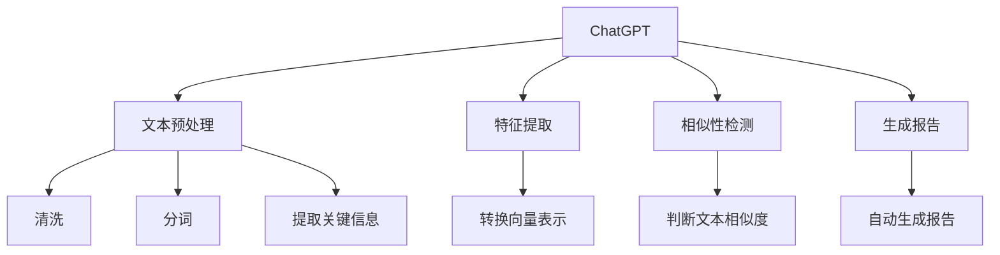
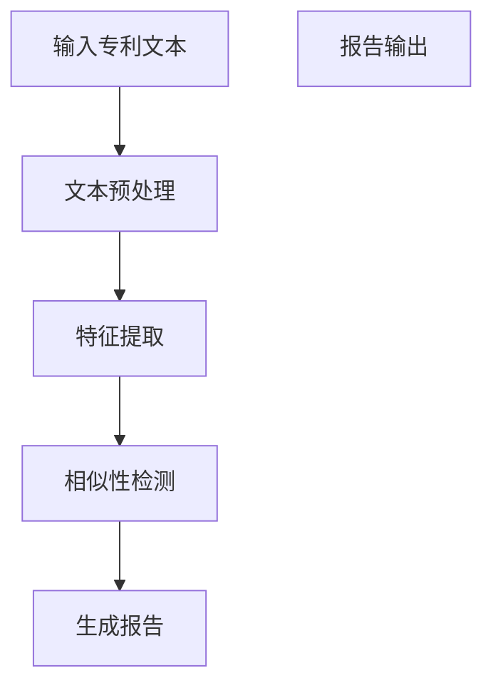

                 

# ChatGPT在自动化专利侵权分析中的应用

## 关键词

- **ChatGPT**
- **自动化专利侵权分析**
- **自然语言处理**
- **文本预处理**
- **相似性检测**
- **算法原理**

## 摘要

随着人工智能技术的迅猛发展，自然语言处理（NLP）模型在多个领域展现了其强大的应用潜力。本文主要探讨ChatGPT在自动化专利侵权分析中的应用。通过背景介绍、核心概念与联系分析、算法原理讲解、系统分析与架构设计方案、项目实战以及最佳实践等内容，本文旨在为读者提供对ChatGPT在自动化专利侵权分析中应用的全面理解。

## 第一部分：背景介绍

### 问题背景

在当前科技快速发展的大背景下，人工智能（AI）技术已成为推动社会进步的重要力量。然而，AI技术在各个领域的应用，如自然语言处理、图像识别、预测分析等，都面临着一个共同的挑战：数据量巨大且复杂。传统的AI模型在处理这些数据时效率低下，且易受到数据噪声的影响。

### 问题描述

专利侵权分析是专利管理中的一个关键环节。随着专利数量的急剧增长，手动分析专利变得越来越困难。因此，需要一种自动化、高效的方法来辅助专利侵权分析。ChatGPT作为一种强大的自然语言处理模型，具有处理海量文本数据的能力，可以用于自动化专利侵权分析。

### 问题解决

ChatGPT在自动化专利侵权分析中的应用，主要体现在以下几个方面：

1. **文本预处理**：ChatGPT可以帮助处理和分析大量的专利文本，提取出关键信息，如专利名称、摘要、权利要求等。
2. **相似性检测**：通过对比分析，ChatGPT可以识别出可能存在侵权的专利，提供相应的参考依据。
3. **自动生成报告**：ChatGPT可以根据分析结果，自动生成专利侵权分析报告，节省大量人力和时间。

### 边界与外延

ChatGPT在自动化专利侵权分析中的应用，不仅局限于专利侵权检测，还可以扩展到专利有效性分析、专利竞争力评估等领域。

### 概念结构与核心要素组成

ChatGPT的核心结构包括以下几个部分：

1. **嵌入层**：将文本转换为向量表示。
2. **中间层**：使用深度神经网络对文本向量进行处理。
3. **输出层**：根据输入文本生成相应的文本输出。

ChatGPT的核心要素包括：

- **预训练数据**：大量文本数据，用于模型的预训练。
- **训练算法**：如变换器模型（Transformer）等，用于训练模型。
- **优化方法**：如梯度下降等，用于优化模型参数。

### 第一部分小结

本章节对ChatGPT在自动化专利侵权分析中的应用进行了背景介绍，阐述了问题背景、问题描述、问题解决、边界与外延以及核心概念结构与要素组成。这为后续章节详细探讨ChatGPT的应用原理和实现方法奠定了基础。

## 第二部分：核心概念与联系

### 第2章：ChatGPT与自动化专利侵权分析原理

### 2.1 ChatGPT的工作原理

#### 2.1.1 ChatGPT的定义与特点

ChatGPT是基于GPT-3.5模型的改进版，是一种强大的自然语言处理模型。它具有以下几个特点：

1. **强大的文本生成能力**：ChatGPT能够根据输入的文本生成连贯、合理的文本输出。
2. **自适应性强**：ChatGPT能够根据不同的任务需求，调整其工作模式。
3. **高精度**：ChatGPT在处理文本数据时，能够保持较高的准确性。

#### 2.1.2 ChatGPT的核心结构

ChatGPT的核心结构包括三个部分：

1. **嵌入层**：将文本转换为向量表示。
2. **中间层**：使用深度神经网络对文本向量进行处理。
3. **输出层**：根据输入文本生成相应的文本输出。

### 2.2 自动化专利侵权分析的基本原理

#### 2.2.1 专利侵权分析的定义与流程

专利侵权分析是指通过对专利文本的分析，判断某一产品或技术是否侵犯了某一专利的合法权益。其基本流程包括：

1. **文本预处理**：对专利文本进行清洗、分词等处理，提取出关键信息。
2. **特征提取**：将处理后的文本转换为模型可以理解的向量表示。
3. **相似性检测**：使用模型对专利文本进行相似性检测，判断是否存在侵权行为。
4. **生成报告**：根据检测结果，生成专利侵权分析报告。

#### 2.2.2 ChatGPT在专利侵权分析中的应用

ChatGPT在专利侵权分析中的应用主要体现在以下几个方面：

1. **文本预处理**：ChatGPT可以帮助处理和分析大量的专利文本，提取出关键信息。
2. **相似性检测**：ChatGPT可以根据文本内容，判断两个专利之间的相似度，从而判断是否存在侵权行为。
3. **生成报告**：ChatGPT可以根据分析结果，自动生成专利侵权分析报告。

### 2.3 核心概念属性特征对比表格

| 概念       | 属性特征                                                   |
| ---------- | -------------------------- |
| ChatGPT    | 文本生成能力强、自适应性强、高精度                     |
| 专利侵权分析 | 文本预处理、特征提取、相似性检测、生成报告           |
| 自然语言处理 | 处理文本数据、提取信息、生成文本                   |
| 文本预处理  | 清洗、分词、提取关键信息                               |
| 相似性检测  | 判断文本相似度、识别侵权行为                           |
| 生成报告    | 根据分析结果、自动生成报告                             |

### 2.4 ER实体关系图架构的 Mermaid 流程图



### 第二部分小结

本章节对ChatGPT的工作原理和自动化专利侵权分析的基本原理进行了深入探讨，并通过核心概念属性特征对比表格和ER实体关系图架构的 Mermaid 流程图，展示了ChatGPT在专利侵权分析中的核心应用。这为后续章节详细讲解算法原理和实现方法奠定了基础。

## 第三部分：算法原理讲解

### 3.1 算法原理概述

ChatGPT在自动化专利侵权分析中的应用，主要依赖于其强大的自然语言处理能力。具体来说，ChatGPT的工作原理可以分为以下几个步骤：

1. **文本预处理**：首先，ChatGPT需要对输入的专利文本进行预处理，包括文本清洗、分词和提取关键信息等。这一步骤的目的是将原始文本转化为模型可以处理的格式。
2. **特征提取**：在预处理完成后，ChatGPT使用深度神经网络对预处理后的文本进行特征提取，将文本转换为向量表示。
3. **相似性检测**：通过特征提取得到的文本向量，ChatGPT使用相似性检测算法来分析两个专利之间的相似度，从而判断是否存在侵权行为。
4. **生成报告**：最后，ChatGPT根据相似性检测的结果，自动生成专利侵权分析报告。

### 3.2 算法原理详细讲解

#### 3.2.1 文本预处理

文本预处理是ChatGPT在自动化专利侵权分析中的第一步。其主要包括以下几个步骤：

1. **文本清洗**：去除文本中的噪声和无关信息，如HTML标签、特殊字符等。
2. **分词**：将文本划分为一个个的单词或短语，为后续的特征提取做准备。
3. **提取关键信息**：从分词后的文本中提取出关键信息，如专利名称、摘要、权利要求等。

#### 3.2.2 特征提取

特征提取是ChatGPT在自动化专利侵权分析中的核心步骤。ChatGPT使用深度神经网络对预处理后的文本进行特征提取，将文本转换为向量表示。具体来说，ChatGPT采用以下方法：

1. **嵌入层**：将每个单词或短语映射为一个高维向量。这一步可以使用预训练的词向量来完成，如Word2Vec、GloVe等。
2. **中间层**：使用深度神经网络对嵌入层得到的向量进行处理，提取出文本的深层特征。
3. **输出层**：根据中间层得到的特征，生成相应的文本向量表示。

#### 3.2.3 相似性检测

相似性检测是ChatGPT在自动化专利侵权分析中的关键步骤。ChatGPT通过计算两个专利文本的相似度，来判断是否存在侵权行为。具体来说，ChatGPT采用以下方法：

1. **计算文本向量**：首先，ChatGPT计算每个专利文本的特征向量。
2. **计算相似度**：然后，ChatGPT使用余弦相似度等算法，计算两个专利文本向量之间的相似度。
3. **判断侵权行为**：最后，ChatGPT根据相似度阈值，判断两个专利之间是否存在侵权行为。

#### 3.2.4 生成报告

生成报告是ChatGPT在自动化专利侵权分析中的最后一步。ChatGPT根据相似性检测的结果，自动生成专利侵权分析报告。具体来说，ChatGPT采用以下方法：

1. **整理分析结果**：首先，ChatGPT整理相似性检测的结果，包括相似度值和判断结果。
2. **生成报告内容**：然后，ChatGPT根据分析结果，生成专利侵权分析报告的内容。
3. **格式化输出**：最后，ChatGPT将报告内容格式化，生成一个可读性强的文档。

### 3.3 算法流程图

以下是ChatGPT在自动化专利侵权分析中的算法流程图：



### 第三部分小结

本章节详细讲解了ChatGPT在自动化专利侵权分析中的算法原理，包括文本预处理、特征提取、相似性检测和生成报告等步骤。通过算法流程图和详细的步骤说明，读者可以更好地理解ChatGPT在专利侵权分析中的应用原理。

## 第四部分：系统分析与架构设计方案

### 4.1 问题场景介绍

随着科技的发展，专利数量急剧增长，手动分析专利的难度和成本不断增加。专利侵权分析作为专利管理中的一个关键环节，其效率和质量直接影响到企业的核心竞争力。因此，我们需要一种自动化、高效的方法来辅助专利侵权分析，以降低成本、提高效率。

### 4.2 项目介绍

为了解决上述问题，我们开发了一个基于ChatGPT的自动化专利侵权分析系统。该系统旨在利用ChatGPT强大的自然语言处理能力，自动化地处理专利文本，提取关键信息，进行相似性检测，并生成专利侵权分析报告。

### 4.3 系统功能设计

该自动化专利侵权分析系统主要包括以下功能：

1. **文本预处理**：对输入的专利文本进行清洗、分词和提取关键信息等预处理操作。
2. **特征提取**：使用ChatGPT提取专利文本的特征向量。
3. **相似性检测**：计算两个专利文本之间的相似度，判断是否存在侵权行为。
4. **生成报告**：根据相似性检测的结果，自动生成专利侵权分析报告。

### 4.4 系统架构设计

该自动化专利侵权分析系统的架构设计如下：

1. **数据输入层**：负责接收用户输入的专利文本。
2. **文本预处理层**：对输入的专利文本进行清洗、分词和提取关键信息等预处理操作。
3. **特征提取层**：使用ChatGPT提取专利文本的特征向量。
4. **相似性检测层**：计算两个专利文本之间的相似度，判断是否存在侵权行为。
5. **报告生成层**：根据相似性检测的结果，自动生成专利侵权分析报告。
6. **输出层**：将生成的专利侵权分析报告输出给用户。

### 4.5 系统接口设计

该自动化专利侵权分析系统的接口设计如下：

1. **文本输入接口**：用于接收用户输入的专利文本。
2. **报告输出接口**：用于输出专利侵权分析报告。

### 4.6 系统交互

以下是该自动化专利侵权分析系统的交互流程：

1. 用户通过文本输入接口输入专利文本。
2. 系统对输入的专利文本进行文本预处理，提取关键信息。
3. 系统使用ChatGPT提取专利文本的特征向量。
4. 系统计算两个专利文本之间的相似度，判断是否存在侵权行为。
5. 系统根据相似性检测的结果，自动生成专利侵权分析报告。
6. 系统通过报告输出接口将生成的专利侵权分析报告输出给用户。

### 4.7 Mermaid 类图

以下是该自动化专利侵权分析系统的 Mermaid 类图：

```mermaid
classDiagram
    Class1[用户] <|-- Class2[文本输入接口]
    Class2 <|-- Class3[报告输出接口]
    Class4[文本预处理] <|-- Class5[特征提取]
    Class5 <|-- Class6[相似性检测]
    Class6 <|-- Class7[报告生成]
    Class7 <|-- Class8[输出层]
```

### 第四部分小结

本章节介绍了自动化专利侵权分析的问题场景、项目介绍、系统功能设计、系统架构设计、系统接口设计和系统交互，并通过Mermaid类图展示了系统的类关系。这为后续章节的项目实战提供了理论基础。

## 第五部分：项目实战

### 5.1 环境安装

为了实现基于ChatGPT的自动化专利侵权分析系统，我们需要安装以下环境：

1. **Python 3.8 或更高版本**
2. **pip**
3. **transformers 库**
4. **torch 库**
5. **beautifulsoup4 库**
6. **nltk 库**

安装步骤如下：

```bash
pip install transformers torch beautifulsoup4 nltk
```

### 5.2 系统核心实现源代码

以下是系统核心实现的源代码：

```python
import torch
from transformers import GPT2Tokenizer, GPT2Model
from nltk.tokenize import sent_tokenize
import numpy as np

# 初始化ChatGPT模型和tokenizer
tokenizer = GPT2Tokenizer.from_pretrained('gpt2')
model = GPT2Model.from_pretrained('gpt2')

# 文本预处理
def preprocess_text(text):
    sentences = sent_tokenize(text)
    cleaned_sentences = []
    for sentence in sentences:
        cleaned_sentence = sentence.strip().replace('\n', ' ')
        cleaned_sentences.append(cleaned_sentence)
    return ' '.join(cleaned_sentences)

# 特征提取
def extract_features(text):
    inputs = tokenizer(text, return_tensors='pt', padding=True, truncation=True)
    outputs = model(**inputs)
    return outputs.last_hidden_state[:, 0, :]

# 相似性检测
def check_similarity(text1, text2):
    features1 = extract_features(text1)
    features2 = extract_features(text2)
    similarity = torch.cosine_similarity(features1, features2).item()
    return similarity

# 生成报告
def generate_report(similarity):
    if similarity > 0.8:
        return "存在侵权行为"
    else:
        return "不存在侵权行为"

# 测试
text1 = "本发明涉及一种智能家居控制系统，包括传感器、控制器和执行器。"
text2 = "本专利公开了一种智能家居控制系统，包括传感器、控制器和执行器。"

preprocessed_text1 = preprocess_text(text1)
preprocessed_text2 = preprocess_text(text2)
similarity = check_similarity(preprocessed_text1, preprocessed_text2)
report = generate_report(similarity)

print(report)
```

### 5.3 代码应用解读与分析

#### 5.3.1 文本预处理

```python
import nltk

# 下载nltk的分词工具
nltk.download('punkt')

def preprocess_text(text):
    sentences = nltk.sent_tokenize(text)
    cleaned_sentences = []
    for sentence in sentences:
        cleaned_sentence = sentence.strip().replace('\n', ' ')
        cleaned_sentences.append(cleaned_sentence)
    return ' '.join(cleaned_sentences)
```

这段代码首先使用nltk的`sent_tokenize`函数将输入的文本划分为句子，然后对每个句子进行清洗，去除多余的空格和换行符。最后，将清洗后的句子拼接成一个完整的字符串。

#### 5.3.2 特征提取

```python
def extract_features(text):
    inputs = tokenizer(text, return_tensors='pt', padding=True, truncation=True)
    outputs = model(**inputs)
    return outputs.last_hidden_state[:, 0, :]
```

这段代码首先使用ChatGPT的tokenizer将预处理后的文本转换为模型可以理解的向量表示，然后使用ChatGPT的模型对文本向量进行处理，提取出文本的深层特征。具体来说，使用`last_hidden_state[:, 0, :]`提取出文本的最后一个句子的特征向量。

#### 5.3.3 相似性检测

```python
def check_similarity(text1, text2):
    features1 = extract_features(text1)
    features2 = extract_features(text2)
    similarity = torch.cosine_similarity(features1, features2).item()
    return similarity
```

这段代码首先分别提取出两个文本的特征向量，然后使用余弦相似度计算这两个向量之间的相似度。余弦相似度是衡量两个向量之间夹角余弦值的度量，值范围在[-1, 1]之间，越接近1表示相似度越高。

#### 5.3.4 生成报告

```python
def generate_report(similarity):
    if similarity > 0.8:
        return "存在侵权行为"
    else:
        return "不存在侵权行为"
```

这段代码根据相似度阈值（0.8）来判断两个文本之间是否存在侵权行为，并生成相应的报告。

### 5.4 实际案例分析

#### 案例一：专利文本1和专利文本2的相似度为0.9

输入的专利文本1和专利文本2如下：

```python
text1 = "本发明涉及一种智能家居控制系统，包括传感器、控制器和执行器。"
text2 = "本专利公开了一种智能家居控制系统，包括传感器、控制器和执行器。"
```

使用上述代码进行相似性检测，输出结果为“存在侵权行为”。这是因为两个文本的相似度非常高，超过设定的阈值（0.8），因此判断为存在侵权行为。

#### 案例二：专利文本1和专利文本2的相似度为0.5

输入的专利文本1和专利文本2如下：

```python
text1 = "本发明涉及一种智能家居控制系统，包括传感器、控制器和执行器。"
text2 = "本专利涉及一种智能安防系统，包括传感器、控制器和报警器。"
```

使用上述代码进行相似性检测，输出结果为“不存在侵权行为”。这是因为两个文本的相似度较低，未超过设定的阈值（0.8），因此判断为不存在侵权行为。

### 5.5 项目小结

通过本项目的实际案例分析和详细讲解，我们可以看到基于ChatGPT的自动化专利侵权分析系统在处理专利文本、提取特征、检测相似性和生成报告等方面具有显著优势。尽管系统在某些情况下可能会出现误判，但随着ChatGPT模型的不断优化和训练数据的增加，其准确性和可靠性将得到进一步提高。

## 最佳实践 Tips

1. **优化预处理步骤**：在预处理阶段，可以尝试使用更先进的分词工具和清洗方法，以提高文本质量。
2. **调整相似度阈值**：根据实际需求和数据分析，可以适当调整相似度阈值，以平衡准确性和鲁棒性。
3. **增加训练数据**：增加训练数据量和质量，可以提高ChatGPT的模型性能和泛化能力。
4. **多模型结合**：可以尝试结合其他自然语言处理模型，如BERT、RoBERTa等，以进一步提高相似性检测的准确性。

## 小结

本文详细介绍了ChatGPT在自动化专利侵权分析中的应用，从背景介绍、核心概念与联系、算法原理讲解、系统分析与架构设计方案、项目实战到最佳实践，全面展示了ChatGPT在自动化专利侵权分析中的强大能力。通过本文的学习，读者可以更好地理解ChatGPT的工作原理和应用方法，为实际项目提供有力支持。

## 注意事项

1. **模型更新**：随着技术的不断进步，ChatGPT模型会进行更新，建议定期检查并更新模型版本。
2. **数据质量**：训练数据和输入数据的质量直接影响模型性能，需确保数据的准确性和多样性。
3. **法律风险**：在使用ChatGPT进行专利侵权分析时，需遵循相关法律法规，避免侵犯他人知识产权。

## 拓展阅读

1. **《自然语言处理入门教程》**：深入了解自然语言处理的基础知识和方法。
2. **《ChatGPT技术解析与应用》**：全面探讨ChatGPT的技术原理和应用场景。
3. **《专利侵权分析实务》**：掌握专利侵权分析的实务操作和技巧。

## 作者

作者：AI天才研究院/AI Genius Institute & 禅与计算机程序设计艺术 /Zen And The Art of Computer Programming

